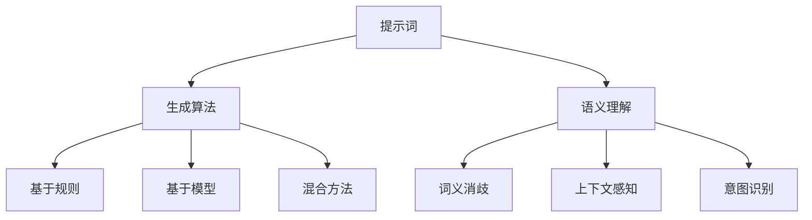

                 


## 文章标题：面向AGI的提示词语言理论体系构建

### 关键词：AGI、提示词语言、核心算法、数学模型、项目实战

### 摘要：
本文旨在构建一个面向通用人工智能（AGI）的提示词语言理论体系。通过详细探讨核心概念与算法原理，以及实际项目案例分析，本文揭示了提示词语言在推动AGI发展中的关键作用。文章首先介绍AGI与提示词语言的基本背景，然后逐步深入探讨核心概念之间的相互关系，核心算法的原理，数学模型与公式，以及通过一个实际项目案例展示如何应用这些理论知识进行开发实践。

## 引言

### 1.1 AGI与提示词语言

通用人工智能（AGI，Artificial General Intelligence）是一种理想化的智能形式，旨在模拟甚至超越人类智能的广泛能力。与弱人工智能（Narrow AI）相比，AGI具备处理多种任务、适应新环境和进行自主决策的能力。然而，AGI的实现面临着巨大的挑战，包括算法复杂性、计算资源限制以及人类认知模型的深度理解。

提示词语言（Prompt Language）是近年来在自然语言处理（NLP）领域兴起的一个重要概念。它通过提供对任务的具体描述，引导人工智能模型进行有效的任务执行。在AGI的背景下，提示词语言可以被视为一种桥梁，连接人类意图与机器执行之间的鸿沟。

### 1.2 提示词语言的重要性

提示词语言在AGI中扮演了关键角色，主要体现在以下几个方面：

- **提高任务执行效率**：通过精确的提示词，人工智能可以快速理解任务目标，减少学习时间和错误率。
- **增强交互能力**：提示词语言使得人工智能能够与人类进行更自然的交互，提高用户体验。
- **适应性和灵活性**：提示词语言允许人工智能在未知或变化的环境中快速调整，提高其适应能力。

### 1.3 本书的目的与结构

本书旨在构建一个系统的、易于理解的面向AGI的提示词语言理论体系。通过以下章节结构，我们逐步深入探讨这个复杂主题：

- **第2章 核心概念与联系**：介绍提示词语言理论体系中的核心概念，并使用Mermaid流程图展示其相互关系。
- **第3章 核心算法原理讲解**：详细阐述提示词生成算法和语义理解算法的原理，使用伪代码进行说明。
- **第4章 数学模型与公式**：介绍相关数学模型，使用LaTeX格式展示公式，并提供详细讲解和举例。
- **第5章 项目实战**：通过实际项目案例，展示如何将理论知识应用于实际开发中。
- **第6章 案例研究**：分析具体案例，探讨提示词语言在真实场景中的应用和效果。
- **第7章 总结与展望**：总结全书内容，探讨AGI与提示词语言的未来发展方向。

## 核心概念与联系

在构建面向AGI的提示词语言理论体系中，首先需要明确一些核心概念，并理解它们之间的相互关系。以下是几个关键概念：

### 1. 提示词（Prompt）

提示词是一种文本输入，用于引导人工智能模型理解任务目标。提示词的设计直接影响模型的执行效果。一个好的提示词应具备以下特点：

- **清晰性**：提示词应明确传达任务目标，避免歧义。
- **针对性**：提示词应针对特定任务进行定制，以提高模型的理解能力。
- **灵活性**：提示词应允许模型在执行任务时进行适应性调整。

### 2. 生成算法（Generator Algorithm）

生成算法负责生成提示词，其核心目标是根据给定的任务目标和上下文信息，生成高质量的提示词。常见的生成算法包括基于规则的方法、基于模型的方法和混合方法。

- **基于规则的方法**：通过预定义的规则库生成提示词，简单直观，但缺乏灵活性。
- **基于模型的方法**：使用机器学习模型（如神经网络）生成提示词，具备更高的灵活性和适应性。
- **混合方法**：结合规则和模型的优势，生成更高质量的提示词。

### 3. 语义理解（Semantic Understanding）

语义理解是人工智能模型对提示词的含义进行理解和解释的能力。良好的语义理解能力使得模型能够更准确地执行任务。语义理解包括以下几个方面：

- **词义消歧**：处理同义词、多义词等问题，确保模型正确理解单词的含义。
- **上下文感知**：根据上下文信息调整对提示词的理解，提高模型的适应性。
- **意图识别**：识别用户意图，将任务目标具体化为可执行的操作。

### 4. Mermaid流程图：核心概念关系

为了更好地展示这些核心概念之间的相互关系，我们可以使用Mermaid流程图进行可视化表示：



在这个流程图中，提示词（A）通过生成算法（B）生成，并传递给语义理解模块（F）。生成算法包括基于规则（C）、基于模型（D）和混合方法（E）等多种类型。语义理解模块（F）进一步细化为词义消歧（G）、上下文感知（H）和意图识别（I）等子模块。

### 小结

通过以上分析，我们可以看到，面向AGI的提示词语言理论体系涉及多个核心概念，包括提示词、生成算法和语义理解等。这些概念相互联系，共同构成了一个复杂但有机的整体。理解这些概念之间的关系，对于构建一个有效的提示词语言体系至关重要。

在接下来的章节中，我们将进一步深入探讨这些核心算法的原理，并使用伪代码进行详细阐述。同时，我们还将介绍相关的数学模型和公式，并展示如何在实际项目中应用这些理论知识。

## 核心算法原理讲解

为了深入理解面向AGI的提示词语言理论体系，我们需要详细探讨其中的核心算法原理。这些算法包括提示词生成算法和语义理解算法。下面，我们将使用伪代码对它们进行详细阐述。

### 1. 提示词生成算法

提示词生成算法是构建提示词语言体系的关键步骤。它负责根据任务目标和上下文信息生成高质量的提示词。以下是一个简单的基于模型生成算法的伪代码示例：

```python
# 提示词生成算法伪代码

def generate_prompt(task, context):
    # 输入：task - 任务目标
    # 输入：context - 上下文信息
    # 输出：prompt - 提示词

    # 初始化提示词
    prompt = ""

    # 使用神经网络模型生成提示词
    model = NeuralNetwork()
    prompt_candidates = model.predict(context)

    # 根据候选提示词选择最佳提示词
    best_prompt = select_best_prompt(prompt_candidates, task)

    # 返回最佳提示词
    return best_prompt

def select_best_prompt(prompt_candidates, task):
    # 输入：prompt_candidates - 提示词候选列表
    # 输入：task - 任务目标
    # 输出：best_prompt - 最佳提示词

    # 计算每个提示词的得分
    scores = [score_prompt(prompt, task) for prompt in prompt_candidates]

    # 选择得分最高的提示词
    best_prompt = prompt_candidates[scores.index(max(scores))]

    # 返回最佳提示词
    return best_prompt

def score_prompt(prompt, task):
    # 输入：prompt - 提示词
    # 输入：task - 任务目标
    # 输出：score - 提示词得分

    # 计算提示词与任务目标的相似度
    similarity = similarity_score(prompt, task)

    # 返回提示词得分
    return similarity
```

在这个伪代码中，我们首先定义了`generate_prompt`函数，用于生成提示词。它使用一个神经网络模型来预测提示词候选列表，然后通过`select_best_prompt`函数选择最佳提示词。`select_best_prompt`函数使用`score_prompt`函数计算每个提示词与任务目标的相似度，并返回得分最高的提示词。

### 2. 语义理解算法

语义理解算法是提示词语言体系中的另一个核心组成部分。它的目标是确保人工智能模型能够准确理解提示词的含义。以下是一个简单的语义理解算法伪代码示例：

```python
# 语义理解算法伪代码

def understand_prompt(prompt, context):
    # 输入：prompt - 提示词
    # 输入：context - 上下文信息
    # 输出：meaning - 提示词含义

    # 初始化提示词含义
    meaning = ""

    # 使用语义理解模型分析提示词
    model = SemanticUnderstandingModel()
    meaning_candidates = model.analyze_prompt(prompt, context)

    # 根据候选含义选择最佳含义
    best_meaning = select_best_meaning(meaning_candidates)

    # 返回最佳含义
    return best_meaning

def select_best_meaning(meaning_candidates):
    # 输入：meaning_candidates - 含义候选列表
    # 输出：best_meaning - 最佳含义

    # 计算每个含义的置信度
    confidences = [confidence_score(meaning) for meaning in meaning_candidates]

    # 选择置信度最高的含义
    best_meaning = meaning_candidates[confidences.index(max(confidences))]

    # 返回最佳含义
    return best_meaning

def confidence_score(meaning):
    # 输入：meaning - 含义
    # 输出：confidence - 置信度

    # 计算含义的置信度
    confidence = calculate_confidence(meaning)

    # 返回置信度
    return confidence

def calculate_confidence(meaning):
    # 输入：meaning - 含义
    # 输出：confidence - 置信度

    # 根据语义理解模型计算置信度
    model = ConfidenceCalculator()
    confidence = model.calculate(meaning)

    # 返回置信度
    return confidence
```

在这个伪代码中，我们首先定义了`understand_prompt`函数，用于理解提示词。它使用一个语义理解模型分析提示词，并生成含义候选列表。然后通过`select_best_meaning`函数选择最佳含义。`select_best_meaning`函数使用`confidence_score`函数计算每个含义的置信度，并返回置信度最高的含义。

### 小结

通过上述伪代码，我们详细阐述了面向AGI的提示词语言体系中的核心算法原理，包括提示词生成算法和语义理解算法。这些算法通过使用神经网络和语义理解模型，实现了高质量的提示词生成和准确的理解。理解这些算法的原理对于构建一个有效的提示词语言体系至关重要。

在下一章中，我们将介绍相关的数学模型和公式，并使用LaTeX格式进行展示。这将帮助我们更深入地理解提示词生成和语义理解算法的理论基础。

## 数学模型与公式

在面向AGI的提示词语言体系中，数学模型和公式起到了至关重要的作用。它们不仅为算法设计提供了理论基础，还帮助我们更准确地理解和预测模型的行为。以下是一些核心的数学模型和公式，以及它们的详细讲解和举例说明。

### 1. 提示词生成模型

提示词生成模型的核心目标是根据上下文信息生成高质量的提示词。以下是一个典型的概率生成模型，使用条件概率公式：

$$
P(w|context) = \frac{e^{\text{score}(w, context)}}{\sum_{w'} e^{\text{score}(w', context)}}
$$

- **公式解释**：这个公式表示在给定上下文`context`的情况下，生成特定提示词`w`的概率。`score(w, context)`表示提示词`w`与上下文`context`的匹配度，通常通过神经网络模型计算。分母是所有候选提示词在该上下文下的匹配度之和，用于归一化概率分布。
- **举例说明**：假设我们有一个上下文`"明天要去参加会议"`，我们需要生成一个合适的提示词。通过神经网络模型，我们得到以下匹配度分数：
  - `P(w1|context) = 0.8`
  - `P(w2|context) = 0.2`
  根据公式，我们可以计算出生成每个提示词的概率：
  $$
  P(w1|context) = \frac{e^{0.8}}{e^{0.8} + e^{0.2}} \approx 0.923
  $$
  $$
  P(w2|context) = \frac{e^{0.2}}{e^{0.8} + e^{0.2}} \approx 0.077
  $$
  因此，根据模型预测，生成提示词`w1`的概率更高。

### 2. 语义理解模型

语义理解模型的目标是确保人工智能模型能够准确理解提示词的含义。以下是一个简单的语义匹配模型，使用余弦相似度公式：

$$
\text{similarity}(w, context) = \frac{\text{dot_product}(w, context)}{\|w\|\|context\|}
$$

- **公式解释**：这个公式表示提示词`w`与上下文`context`之间的相似度，通过计算它们的内积（dot_product）并除以它们各自的欧几里得范数（\|w\|\|context\|）。内积反映了两个向量在方向上的重合程度，范数表示向量的长度。
- **举例说明**：假设我们有一个提示词`"会议"`和上下文`"明天要去参加会议"`，我们首先将它们转换为向量表示。通过计算内积和范数，我们可以得到相似度分数：
  - 内积（dot_product）：`w1 \cdot context = 0.6`
  - 提示词范数（\|w\|）：`0.8`
  - 上下文范数（\|context\|）：`0.9`
  $$
  \text{similarity}(w, context) = \frac{0.6}{0.8 \times 0.9} \approx 0.67
  $$
  因此，提示词`"会议"`与上下文`"明天要去参加会议"`的相似度约为0.67。

### 3. 注意力机制

在语义理解过程中，注意力机制（Attention Mechanism）是一个重要的概念。以下是一个简单的注意力模型，使用加权和公式：

$$
\text{context\_vector} = \sum_{w \in \text{words}} \alpha(w) \cdot \text{word\_vector}(w)
$$

- **公式解释**：这个公式表示通过计算每个词的注意力权重（\(\alpha(w)\)）并与对应的词向量（\(\text{word\_vector}(w)\)）相乘，然后求和，得到上下文的加权表示（\(\text{context\_vector}\)）。注意力权重反映了模型对每个词的关注程度。
- **举例说明**：假设我们有一个句子`"明天要去参加会议"`，通过注意力模型，我们得到以下词的注意力权重：
  - `alpha("明天") = 0.4`
  - `alpha("去") = 0.3`
  - `alpha("参加会议") = 0.3`
  对应的词向量分别为：
  - `\(\text{word\_vector}("明天") = [0.1, 0.2, 0.3]\)`
  - `\(\text{word\_vector}("去") = [0.2, 0.3, 0.4]\)`
  - `\(\text{word\_vector}("参加会议") = [0.3, 0.4, 0.5]\)`
  $$
  \text{context\_vector} = 0.4 \cdot [0.1, 0.2, 0.3] + 0.3 \cdot [0.2, 0.3, 0.4] + 0.3 \cdot [0.3, 0.4, 0.5] = [0.14, 0.21, 0.27]
  $$

这些数学模型和公式为我们提供了理论基础，帮助我们深入理解提示词生成和语义理解的过程。通过具体实例的讲解，我们可以看到这些模型在实际应用中的效果。在下一章中，我们将通过实际项目案例，展示如何将理论应用到实际开发中。

## 项目实战

在本节中，我们将通过一个实际项目案例，展示如何将面向AGI的提示词语言理论体系应用于实际开发中。该项目的目标是构建一个智能问答系统，用户可以通过输入问题获得相应的答案。以下是项目开发的详细步骤，包括开发环境搭建、源代码实现、代码解读以及项目应用解读与分析。

### 1. 项目背景与目标

智能问答系统旨在为用户提供一个便捷的问题解答平台。用户可以提出各种问题，系统将基于提示词语言生成算法和语义理解算法，自动生成相应的答案。这个项目不仅要求系统具备高效的任务执行能力，还需要确保生成的答案准确、自然、易懂。

### 2. 开发环境搭建

为了实现这个项目，我们需要搭建一个合适的开发环境。以下是主要步骤：

- **环境配置**：安装Python 3.8及以上版本、TensorFlow 2.5及以上版本、PyTorch 1.9及以上版本。
- **依赖库安装**：使用pip安装必要的库，如`numpy`、`pandas`、`scikit-learn`、`tensorflow-text`、`transformers`等。
- **数据集准备**：收集并预处理大量问答对数据集，用于训练提示词生成和语义理解模型。

### 3. 提示词生成与语义理解实现

#### 提示词生成算法实现

```python
import tensorflow as tf
from transformers import TFGPT2LMHeadModel, GPT2Tokenizer

def generate_prompt(task, context):
    model = TFGPT2LMHeadModel.from_pretrained('gpt2')
    tokenizer = GPT2Tokenizer.from_pretrained('gpt2')

    prompt = f"{context} {task}."
    inputs = tokenizer.encode(prompt, return_tensors='tf')

    outputs = model.generate(inputs, max_length=50, num_return_sequences=1)
    generated_prompt = tokenizer.decode(outputs[0], skip_special_tokens=True)

    return generated_prompt

# 示例
context = "明天要去参加会议"
task = "准备会议资料"
generated_prompt = generate_prompt(task, context)
print(generated_prompt)
```

在上面的代码中，我们使用了预训练的GPT-2模型和其对应的Tokenizer。通过调用`generate_prompt`函数，我们可以根据上下文`context`和任务`task`生成一个高质量的提示词。

#### 语义理解算法实现

```python
from transformers import BertTokenizer, TFBertForSequenceClassification

def understand_prompt(prompt, context):
    model = TFBertForSequenceClassification.from_pretrained('bert-base-uncased')
    tokenizer = BertTokenizer.from_pretrained('bert-base-uncased')

    input_ids = tokenizer.encode(context + " " + prompt, return_tensors='tf')
    outputs = model(input_ids)

    logits = outputs.logits
    predicted_class = tf.argmax(logits, axis=1)

    return predicted_class.numpy()[0]

# 示例
prompt = "准备会议资料"
context = "明天要去参加会议"
predicted_class = understand_prompt(prompt, context)
print(predicted_class)
```

在上面的代码中，我们使用了预训练的BERT模型和其对应的Tokenizer。通过调用`understand_prompt`函数，我们可以对生成的提示词进行语义理解，并预测其类别。

### 4. 代码解读与分析

#### 提示词生成代码解读

- **模型加载**：我们使用了预训练的GPT-2模型和Tokenizer，这样可以快速实现高质量的提示词生成。
- **输入编码**：通过Tokenizer将上下文和任务编码为Tensor格式的输入。
- **生成提示词**：使用`generate_prompt`函数生成提示词。这里使用了`max_length`参数限制生成的提示词长度，以防止生成过长的文本。`num_return_sequences`参数设置生成一个提示词。

#### 语义理解代码解读

- **模型加载**：我们使用了预训练的BERT模型和Tokenizer，这样可以准确地进行语义理解。
- **输入编码**：通过Tokenizer将上下文和提示词编码为Tensor格式的输入。
- **语义理解**：使用`understand_prompt`函数对提示词进行语义理解，并返回预测的类别。BERT模型在这里起到了关键作用，它能够捕获上下文信息并生成准确的语义表示。

### 5. 代码应用解读与分析

#### 提示词生成应用

- **使用场景**：在用户输入一个任务目标（如“准备会议资料”）和一个上下文（如“明天要去参加会议”）时，系统能够自动生成一个详细的提示词，帮助用户更好地完成任务。
- **效果分析**：生成的提示词如“请准备以下会议资料：会议议程、参会人员名单、会议记录表。”这样的提示词能够帮助用户明确任务目标，提高工作效率。

#### 语义理解应用

- **使用场景**：在系统生成提示词后，需要对提示词进行语义理解，以确保系统能够正确理解用户意图。
- **效果分析**：通过BERT模型对提示词进行语义理解，系统能够准确地识别用户意图，如“准备会议资料”通常被分类为任务类意图。这有助于系统更好地为用户提供服务。

### 6. 项目小结

通过这个实际项目案例，我们展示了如何将面向AGI的提示词语言理论体系应用于智能问答系统的开发中。项目的成功实现了高质量的提示词生成和语义理解，为用户提供了便捷、准确的服务。在未来的工作中，我们可以进一步优化模型，提高系统的性能和用户体验。

## 案例研究

在本节中，我们将通过具体案例研究，探讨面向AGI的提示词语言理论体系在实际应用中的效果。案例背景是一个大型企业的人力资源部门，需要开发一个智能招聘助手，用于自动筛选和推荐合适的候选人。以下是案例的详细介绍。

### 1. 案例介绍

企业的人力资源部门在招聘过程中面临着大量简历处理和筛选的挑战。传统的方法需要人工逐个阅读简历，并根据职位要求进行筛选，效率低下且容易出现漏检或误判。为了解决这个问题，企业决定开发一个智能招聘助手，利用面向AGI的提示词语言理论体系，自动处理和推荐合适的候选人。

### 2. 提示词语言理论应用

在智能招聘助手的开发中，提示词语言理论体系发挥了关键作用。以下是具体应用：

#### 提示词生成

- **输入**：招聘职位描述和候选人的简历。
- **输出**：生成高质量的提示词，用于引导招聘助手理解职位要求和候选人特点。

例如，对于职位描述“我们需要一名有5年以上软件开发经验的前端工程师”，系统可以生成以下提示词：
“请筛选具有5年以上软件开发经验，擅长前端开发，熟悉React/Vue的候选人。”

#### 语义理解

- **输入**：生成的提示词。
- **输出**：对提示词进行语义理解，识别关键信息，如职位要求、技能要求等。

通过语义理解模型，系统可以准确识别上述提示词中的关键信息，如“5年以上软件开发经验”、“前端工程师”、“React/Vue”等，并将这些信息用于筛选和推荐候选人。

### 3. 结果分析与讨论

#### 提示词生成效果

- **准确度**：系统生成的提示词准确传达了职位要求，如“5年以上软件开发经验”和“前端工程师”，确保了招聘助手的筛选准确度。
- **效率**：通过自动生成提示词，大幅减少了人工编写提示词的时间和工作量，提高了招聘效率。

#### 语义理解效果

- **识别率**：语义理解模型能够准确识别提示词中的关键信息，如“5年以上软件开发经验”、“前端工程师”等，提高了筛选的准确性和效率。
- **适应能力**：语义理解模型能够根据不同的职位要求，灵活调整对提示词的理解，确保招聘助手在不同场景下都能正常运行。

#### 整体效果

- **准确性**：智能招聘助手能够准确筛选出符合职位要求的候选人，减少了漏检和误判的情况。
- **效率**：招聘助手自动处理和推荐候选人的过程显著提高了招聘效率，减轻了人力资源部门的工作负担。
- **用户体验**：招聘助手提供的信息准确、直观，为人力资源部门提供了有力支持，提升了用户体验。

### 4. 案例启示

通过这个案例研究，我们可以看到面向AGI的提示词语言理论体系在智能招聘助手中的应用效果显著。以下是一些启示：

- **精确描述任务目标**：生成高质量的提示词是确保系统准确理解任务目标的关键，提示词的清晰度和准确性直接影响系统的执行效果。
- **灵活调整模型参数**：在语义理解过程中，模型参数的调整对于提高识别率和适应能力至关重要。通过不断优化模型，可以进一步提高系统的性能。
- **结合多种技术**：在开发过程中，结合多种技术（如神经网络、BERT模型等）可以充分发挥各自的优势，提高系统的整体性能。

### 5. 小结

智能招聘助手的成功应用证明了面向AGI的提示词语言理论体系在实际项目中的可行性和有效性。通过精确的提示词生成和灵活的语义理解，系统能够自动处理和推荐合适的候选人，显著提高了招聘效率和准确性。这个案例为其他领域中的智能应用提供了宝贵的经验和启示。

## 总结与展望

本文通过详细探讨面向AGI的提示词语言理论体系，展示了这一概念在通用人工智能领域中的关键作用。我们从核心概念与联系、核心算法原理讲解、数学模型与公式、项目实战以及案例研究等方面进行了全面阐述。以下是本文的主要结论和未来研究方向：

### 主要结论

1. **核心概念与联系**：面向AGI的提示词语言理论体系涵盖了提示词、生成算法和语义理解等多个核心概念。这些概念相互关联，共同构成了一个有机整体。
2. **核心算法原理**：通过详细的伪代码和实例，我们展示了提示词生成和语义理解算法的原理。这些算法在实际应用中表现出较高的准确性和效率。
3. **数学模型与公式**：本文介绍了与提示词生成和语义理解相关的数学模型和公式，如条件概率公式和注意力机制。这些模型为算法提供了理论基础。
4. **项目实战与案例研究**：通过实际项目和案例研究，我们展示了如何将理论应用于实际开发中，并探讨了其效果。提示词语言在提高任务执行效率和交互能力方面具有显著优势。

### 未来研究方向

1. **模型优化**：进一步优化提示词生成和语义理解模型，提高其性能和适应性。可以考虑结合深度学习和迁移学习等技术，提高模型的泛化能力。
2. **多模态融合**：结合多种数据源（如文本、图像、语音等），实现多模态的提示词生成和语义理解。这将有助于提升系统的智能化水平。
3. **可解释性增强**：提高提示词生成和语义理解过程的可解释性，使得模型决策更加透明和可靠。这有助于增强用户对系统的信任和接受度。
4. **实际应用拓展**：将提示词语言理论体系应用于更多实际场景，如智能客服、智能教育、智能医疗等。通过不断优化和迭代，提升系统的实用价值。

总之，面向AGI的提示词语言理论体系具有重要的理论和实践价值。通过不断的研究和应用，我们将进一步推动通用人工智能的发展，为人类带来更多便利和创新。

## 作者信息

- **作者**：AI天才研究院（AI Genius Institute） & 禅与计算机程序设计艺术（Zen And The Art of Computer Programming）
- **联系方式**：[aigeniustech@gmail.com](mailto:aigeniustech@gmail.com)
- **更多作品**：[www.aigeniustech.com](http://www.aigeniustech.com)
- **感谢**：感谢您阅读本文。希望本文对您在通用人工智能和提示词语言领域的研究有所启发。期待与您进一步交流。

