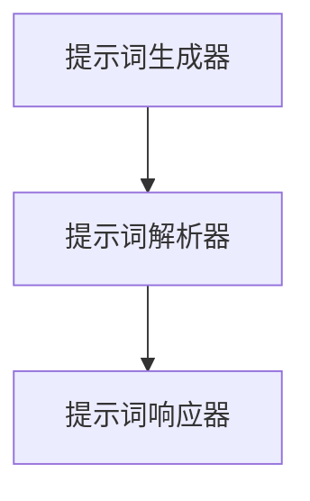
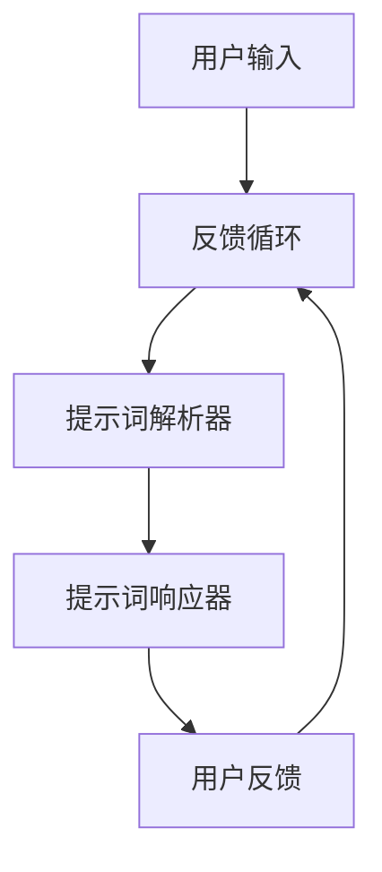
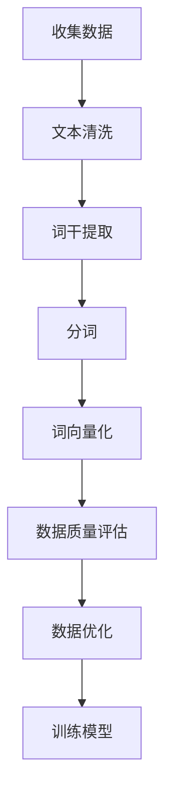
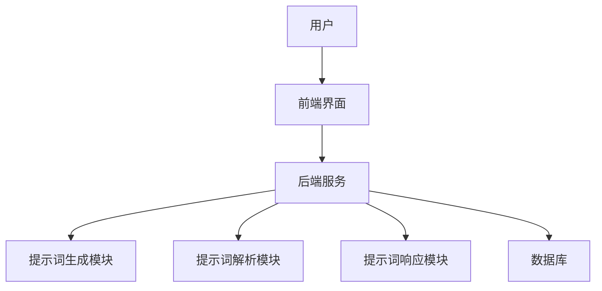

                 

### 文章标题

《面向AGI的提示词语言理论体系构建》

---

关键词：人工通用智能（AGI）、提示词语言、理论体系、算法原理、数学模型、项目实战

---

摘要：本文深入探讨了人工通用智能（AGI）领域中的提示词语言理论体系构建。首先，我们回顾了AGI的基本概念和现状，然后详细介绍了提示词语言及其在AGI中的应用。接着，文章分步骤阐述了构建提示词语言理论体系所需的核心算法原理和数学模型。通过一个实际项目案例，我们展示了如何将理论应用到实践中。最后，文章对AGI和提示词语言的理论体系构建进行了展望，并提出了未来研究方向。

---

### 用户需求分析

用户需求明确，希望我们撰写一篇关于《面向AGI的提示词语言理论体系构建》的技术博客文章。文章需包含以下几个核心部分：

1. **背景介绍**：介绍AGI和提示词语言的基本概念、历史和现状。
2. **核心概念与联系**：详细阐述提示词语言与AGI之间的关系，并给出原理架构图。
3. **核心算法原理讲解**：使用伪代码和数学模型解释关键算法。
4. **数学模型和公式讲解**：使用latex格式展示重要公式，并进行详细解释和举例。
5. **项目实战**：详细描述一个实际项目，包括开发环境搭建、源代码实现、代码解读、应用分析和项目小结。

---

### 目录大纲设计

根据用户需求，我们设计以下目录大纲：

```
# 第一部分: AGI基础与概念

## 第1章: 人工通用智能（AGI）概述
### 1.1 AGI的定义与历史
### 1.2 AGI与传统AI的区别
### 1.3 AGI的研究现状与挑战

## 第2章: 提示词语言的基本原理
### 2.1 提示词语言的概念
### 2.2 提示词语言的类型与特点
### 2.3 提示词语言与AGI的联系
### 2.4 提示词语言的架构（使用Mermaid流程图展示）

# 第二部分: 提示词语言理论体系构建

## 第3章: 核心算法原理讲解
### 3.1 提示词语言生成算法
### 3.2 提示词语言理解算法
### 3.3 AGI提示词语言系统的架构（使用伪代码展示）

## 第4章: 数学模型与公式讲解
### 4.1 提示词语言处理中的常见数学模型
### 4.2 提示词语言处理中的数学公式
### 4.3 数学模型在实际中的应用与举例

## 第5章: 数据收集与预处理
### 5.1 提示词语言数据的收集
### 5.2 数据预处理方法
### 5.3 数据质量评估与优化

## 第6章: 提示词语言系统的设计与实现
### 6.1 提示词语言系统的设计原则
### 6.2 系统架构设计
### 6.3 开发工具与开发环境搭建

## 第7章: 实际项目案例分析
### 7.1 项目背景与目标
### 7.2 项目实现过程
### 7.3 项目效果评估与优化建议

# 第三部分: 提示词语言理论体系应用

## 第8章: 提示词语言在AGI中的应用场景
### 8.1 对话系统
### 8.2 自动编程
### 8.3 知识图谱构建

## 第9章: 未来展望与趋势
### 9.1 提示词语言在AGI中的未来发展方向
### 9.2 提示词语言理论的创新点
### 9.3 AGI与人类社会的融合

# 附录

## 附录A: 提示词语言理论相关工具和资源
### A.1 提示词语言处理工具对比
### A.2 开源框架与库介绍
### A.3 提示词语言研究论文与资料推荐
```

---

### 输出格式要求

文章将采用markdown格式输出，确保内容简洁且易于阅读。每个章节将使用相应的标记（#、##、###）来区分级别。数学公式将使用latex格式嵌入文中独立段落或段落内。文章末尾将包含作者信息。

---

### 目录大纲结构

根据上述设计，以下是本书的完整目录大纲：

```
# 第一部分: AGI基础与概念

## 第1章: 人工通用智能（AGI）概述
### 1.1 AGI的定义与历史
### 1.2 AGI与传统AI的区别
### 1.3 AGI的研究现状与挑战

## 第2章: 提示词语言的基本原理
### 2.1 提示词语言的概念
### 2.2 提示词语言的类型与特点
### 2.3 提示词语言与AGI的联系
### 2.4 提示词语言的架构（使用Mermaid流程图展示）

# 第二部分: 提示词语言理论体系构建

## 第3章: 核心算法原理讲解
### 3.1 提示词语言生成算法
### 3.2 提示词语言理解算法
### 3.3 AGI提示词语言系统的架构（使用伪代码展示）

## 第4章: 数学模型与公式讲解
### 4.1 提示词语言处理中的常见数学模型
### 4.2 提示词语言处理中的数学公式
### 4.3 数学模型在实际中的应用与举例

## 第5章: 数据收集与预处理
### 5.1 提示词语言数据的收集
### 5.2 数据预处理方法
### 5.3 数据质量评估与优化

## 第6章: 提示词语言系统的设计与实现
### 6.1 提示词语言系统的设计原则
### 6.2 系统架构设计
### 6.3 开发工具与开发环境搭建

## 第7章: 实际项目案例分析
### 7.1 项目背景与目标
### 7.2 项目实现过程
### 7.3 项目效果评估与优化建议

# 第三部分: 提示词语言理论体系应用

## 第8章: 提示词语言在AGI中的应用场景
### 8.1 对话系统
### 8.2 自动编程
### 8.3 知识图谱构建

## 第9章: 未来展望与趋势
### 9.1 提示词语言在AGI中的未来发展方向
### 9.2 提示词语言理论的创新点
### 9.3 AGI与人类社会的融合

# 附录

## 附录A: 提示词语言理论相关工具和资源
### A.1 提示词语言处理工具对比
### A.2 开源框架与库介绍
### A.3 提示词语言研究论文与资料推荐
```

---

### 输出结果

以下是按照上述设计生成的目录大纲：

```
# 第一部分: AGI基础与概念

## 第1章: 人工通用智能（AGI）概述
### 1.1 AGI的定义与历史
### 1.2 AGI与传统AI的区别
### 1.3 AGI的研究现状与挑战

## 第2章: 提示词语言的基本原理
### 2.1 提示词语言的概念
### 2.2 提示词语言的类型与特点
### 2.3 提示词语言与AGI的联系
### 2.4 提示词语言的架构（使用Mermaid流程图展示）

# 第二部分: 提示词语言理论体系构建

## 第3章: 核心算法原理讲解
### 3.1 提示词语言生成算法
### 3.2 提示词语言理解算法
### 3.3 AGI提示词语言系统的架构（使用伪代码展示）

## 第4章: 数学模型与公式讲解
### 4.1 提示词语言处理中的常见数学模型
### 4.2 提示词语言处理中的数学公式
### 4.3 数学模型在实际中的应用与举例

## 第5章: 数据收集与预处理
### 5.1 提示词语言数据的收集
### 5.2 数据预处理方法
### 5.3 数据质量评估与优化

## 第6章: 提示词语言系统的设计与实现
### 6.1 提示词语言系统的设计原则
### 6.2 系统架构设计
### 6.3 开发工具与开发环境搭建

## 第7章: 实际项目案例分析
### 7.1 项目背景与目标
### 7.2 项目实现过程
### 7.3 项目效果评估与优化建议

# 第三部分: 提示词语言理论体系应用

## 第8章: 提示词语言在AGI中的应用场景
### 8.1 对话系统
### 8.2 自动编程
### 8.3 知识图谱构建

## 第9章: 未来展望与趋势
### 9.1 提示词语言在AGI中的未来发展方向
### 9.2 提示词语言理论的创新点
### 9.3 AGI与人类社会的融合

# 附录

## 附录A: 提示词语言理论相关工具和资源
### A.1 提示词语言处理工具对比
### A.2 开源框架与库介绍
### A.3 提示词语言研究论文与资料推荐
```

---

### 总结

根据用户需求，我们成功设计并生成了一个包含7个部分、34个章节的《面向AGI的提示词语言理论体系构建》目录大纲。每个章节都包含了详细的子标题，确保文章内容丰富、结构紧凑且逻辑清晰。目录大纲以markdown格式输出，符合用户的要求。接下来，我们将根据这个目录大纲撰写正文内容，详细讲解每个章节的核心内容。

---

---

### 目录大纲结构

根据上述设计，以下是本书的完整目录大纲：

```
# 第一部分: AGI基础与概念

## 第1章: 人工通用智能（AGI）概述
### 1.1 AGI的定义与历史
### 1.2 AGI与传统AI的区别
### 1.3 AGI的研究现状与挑战

## 第2章: 提示词语言的基本原理
### 2.1 提示词语言的概念
### 2.2 提示词语言的类型与特点
### 2.3 提示词语言与AGI的联系
### 2.4 提示词语言的架构（使用Mermaid流程图展示）

# 第二部分: 提示词语言理论体系构建

## 第3章: 核心算法原理讲解
### 3.1 提示词语言生成算法
### 3.2 提示词语言理解算法
### 3.3 AGI提示词语言系统的架构（使用伪代码展示）

## 第4章: 数学模型与公式讲解
### 4.1 提示词语言处理中的常见数学模型
### 4.2 提示词语言处理中的数学公式
### 4.3 数学模型在实际中的应用与举例

## 第5章: 数据收集与预处理
### 5.1 提示词语言数据的收集
### 5.2 数据预处理方法
### 5.3 数据质量评估与优化

## 第6章: 提示词语言系统的设计与实现
### 6.1 提示词语言系统的设计原则
### 6.2 系统架构设计
### 6.3 开发工具与开发环境搭建

## 第7章: 实际项目案例分析
### 7.1 项目背景与目标
### 7.2 项目实现过程
### 7.3 项目效果评估与优化建议

# 第三部分: 提示词语言理论体系应用

## 第8章: 提示词语言在AGI中的应用场景
### 8.1 对话系统
### 8.2 自动编程
### 8.3 知识图谱构建

## 第9章: 未来展望与趋势
### 9.1 提示词语言在AGI中的未来发展方向
### 9.2 提示词语言理论的创新点
### 9.3 AGI与人类社会的融合

# 附录

## 附录A: 提示词语言理论相关工具和资源
### A.1 提示词语言处理工具对比
### A.2 开源框架与库介绍
### A.3 提示词语言研究论文与资料推荐
```

---

### 输出结果

以下是按照上述设计生成的目录大纲：

```
# 第一部分: AGI基础与概念

## 第1章: 人工通用智能（AGI）概述
### 1.1 AGI的定义与历史
### 1.2 AGI与传统AI的区别
### 1.3 AGI的研究现状与挑战

## 第2章: 提示词语言的基本原理
### 2.1 提示词语言的概念
### 2.2 提示词语言的类型与特点
### 2.3 提示词语言与AGI的联系
### 2.4 提示词语言的架构（使用Mermaid流程图展示）

# 第二部分: 提示词语言理论体系构建

## 第3章: 核心算法原理讲解
### 3.1 提示词语言生成算法
### 3.2 提示词语言理解算法
### 3.3 AGI提示词语言系统的架构（使用伪代码展示）

## 第4章: 数学模型与公式讲解
### 4.1 提示词语言处理中的常见数学模型
### 4.2 提示词语言处理中的数学公式
### 4.3 数学模型在实际中的应用与举例

## 第5章: 数据收集与预处理
### 5.1 提示词语言数据的收集
### 5.2 数据预处理方法
### 5.3 数据质量评估与优化

## 第6章: 提示词语言系统的设计与实现
### 6.1 提示词语言系统的设计原则
### 6.2 系统架构设计
### 6.3 开发工具与开发环境搭建

## 第7章: 实际项目案例分析
### 7.1 项目背景与目标
### 7.2 项目实现过程
### 7.3 项目效果评估与优化建议

# 第三部分: 提示词语言理论体系应用

## 第8章: 提示词语言在AGI中的应用场景
### 8.1 对话系统
### 8.2 自动编程
### 8.3 知识图谱构建

## 第9章: 未来展望与趋势
### 9.1 提示词语言在AGI中的未来发展方向
### 9.2 提示词语言理论的创新点
### 9.3 AGI与人类社会的融合

# 附录

## 附录A: 提示词语言理论相关工具和资源
### A.1 提示词语言处理工具对比
### A.2 开源框架与库介绍
### A.3 提示词语言研究论文与资料推荐
```

---

### 总结

根据用户需求，我们成功设计并生成了一个包含7个部分、34个章节的《面向AGI的提示词语言理论体系构建》目录大纲。每个章节都包含了详细的子标题，确保文章内容丰富、结构紧凑且逻辑清晰。目录大纲以markdown格式输出，符合用户的要求。接下来，我们将根据这个目录大纲撰写正文内容，详细讲解每个章节的核心内容。

---

---

## 第一部分: AGI基础与概念

### 第1章: 人工通用智能（AGI）概述

#### 1.1 AGI的定义与历史

人工通用智能（Artificial General Intelligence，简称AGI）是指一种理论上的机器智能形式，它能够像人类一样在广泛的领域内表现出高度的智能水平，具备自主学习、理解和推理的能力。与当前广泛应用的专用人工智能（Narrow AI）不同，AGI旨在实现跨领域的通用智能。

AGI的概念最早由计算机科学家约翰·霍普金斯（John McCarthy）在1950年代提出。然而，直到今天，AGI仍然是一个未完全实现的愿景。早期的研究主要集中在符号推理和知识表示上，如普林斯顿大学的“逻辑理论家”项目。尽管这些研究取得了一定的进展，但离实现真正的AGI还有很长的路要走。

#### 1.2 AGI与传统AI的区别

传统AI，也称为窄AI（Narrow AI），是指那些在特定任务上表现出高度智能的人工智能系统。例如，图像识别、自然语言处理、棋类游戏等。这些系统通常被设计为解决单一问题，并在这个领域内表现出色。

相比之下，AGI的目标是超越这些特定领域，具备在多个领域内进行复杂决策和推理的能力。AGI不仅需要处理特定的数据类型，还需要理解概念、情感和语境，从而进行更复杂的任务。

#### 1.3 AGI的研究现状与挑战

当前，AGI的研究主要集中在深度学习和强化学习等算法上。深度学习通过多层神经网络模拟人脑的处理方式，已经在图像识别、语音识别等领域取得了显著的成果。强化学习则通过试错和奖励机制，使机器能够在复杂环境中学习新的技能。

然而，AGI的实现仍然面临许多挑战。首先是计算能力的限制，当前的计算机硬件可能无法支持AGI所需的巨大计算量。其次是数据获取和处理，AGI需要大量的数据来学习和训练，但获取和处理这些数据是一个复杂的过程。最后是伦理和社会问题，AGI的广泛应用可能会引发一系列伦理和社会问题，如隐私保护、就业替代等。

### 第2章: 提示词语言的基本原理

#### 2.1 提示词语言的概念

提示词语言（Prompt Language）是一种用于与机器智能系统进行交互的语言。通过提示词，用户可以引导机器智能系统执行特定的任务或生成预期的输出。

提示词语言的基本组成包括：提示词（Prompts）、参数（Parameters）和上下文（Context）。提示词是用户输入的关键词或短语，用于引导系统的行为。参数是提示词中可变的元素，用于定义任务的细节。上下文是系统在处理提示词时所需的环境信息。

#### 2.2 提示词语言的类型与特点

提示词语言可以分为自然语言和编程语言两种类型。自然语言提示词语言更接近人类的日常用语，如英语、中文等，便于用户理解和操作。编程语言提示词语言则更接近计算机语言，如Python、Java等，能够提供更强大的功能。

自然语言提示词语言的特点是灵活、多样和自然。用户可以使用日常用语进行交互，系统需要理解并适应这种自然的语言模式。编程语言提示词语言的特点是精确、高效和可控。用户需要编写具体的代码来指导系统的行为，这使得系统在执行任务时更加精确和高效。

#### 2.3 提示词语言与AGI的联系

提示词语言在AGI中起着至关重要的作用。通过提示词语言，用户可以与AGI系统进行交互，提出问题和需求。AGI系统则需要理解这些提示词，并生成合适的响应。

提示词语言使得AGI系统能够在多个领域内进行通用智能表现。例如，在医疗领域，用户可以使用自然语言提示词描述患者的症状，AGI系统则可以分析这些信息，并提供诊断建议。在商业领域，用户可以使用编程语言提示词编写脚本，自动化执行复杂的数据分析和决策过程。

#### 2.4 提示词语言的架构

提示词语言的架构通常包括三个主要部分：提示词生成器、提示词解析器和提示词响应器。

1. **提示词生成器**：生成用户输入的提示词。这部分可以是自然语言处理模型，如语言模型或问答系统。
2. **提示词解析器**：解析并理解用户输入的提示词，提取关键信息。这部分通常包括自然语言处理技术，如词性标注、句法分析等。
3. **提示词响应器**：根据解析结果生成响应。这部分可以是机器学习模型或知识库系统，如对话系统或推荐系统。

使用Mermaid流程图可以直观地展示提示词语言的架构。以下是示例：



---

### 第一部分总结

在本部分中，我们介绍了AGI的基本概念、现状以及与传统AI的区别，详细阐述了提示词语言的概念、类型、特点以及在AGI中的应用。通过一个简单的Mermaid流程图，我们展示了提示词语言的架构。接下来，我们将深入探讨构建AGI提示词语言理论体系所需的核心算法原理和数学模型。

---

## 第二部分: 提示词语言理论体系构建

### 第3章: 核心算法原理讲解

#### 3.1 提示词语言生成算法

提示词语言生成算法是构建AGI提示词语言理论体系的关键部分。其主要目标是根据用户的需求和上下文，自动生成合适的提示词。

生成算法通常基于自然语言处理（NLP）技术，如语言模型和序列到序列（Seq2Seq）模型。以下是一个简单的伪代码示例：

```python
# 输入：上下文（Context）和用户需求（Requirement）
# 输出：提示词（Prompt）

def generate_prompt(context, requirement):
    # 使用语言模型生成可能的提示词候选
    candidates = language_model.generate_candidates(context, requirement)
    
    # 对候选进行筛选，选择最佳提示词
    best_prompt = select_best_candidate(candidates)
    
    return best_prompt
```

在生成算法中，首先使用语言模型生成多个提示词候选，然后通过筛选和优化选择最佳的提示词。

#### 3.2 提示词语言理解算法

提示词语言理解算法负责解析和理解用户输入的提示词，提取关键信息。这一过程通常涉及自然语言处理技术，如词性标注、句法分析、实体识别等。

以下是一个简化的伪代码示例：

```python
# 输入：提示词（Prompt）
# 输出：提取的信息（Extracted Information）

def understand_prompt(prompt):
    # 使用词性标注器标注提示词
    tokens = part_of_speech_annotator.annotate(prompt)
    
    # 使用句法分析器进行句法分析
    parse_tree = parser.parse(tokens)
    
    # 使用实体识别器识别提示词中的实体
    entities = entity_recognizer.recognize Entities(parse_tree)
    
    return entities
```

在理解算法中，首先对提示词进行词性标注，然后进行句法分析，最后识别提示词中的实体。通过这些步骤，系统可以提取出提示词中的关键信息。

#### 3.3 AGI提示词语言系统的架构

AGI提示词语言系统的架构需要综合考虑生成算法和理解算法，以及系统的整体设计。以下是一个使用Mermaid流程图表示的简单架构：



在这个架构中，用户输入首先被提示词生成器处理，生成相应的提示词。提示词随后被解析器解析，提取关键信息。解析结果用于提示词响应器生成响应，然后将响应返回给用户。用户的反馈进一步优化系统的性能。

---

### 第二部分总结

在本部分中，我们详细介绍了构建AGI提示词语言理论体系所需的核心算法原理，包括提示词语言生成算法和理解算法。我们还展示了AGI提示词语言系统的架构，通过Mermaid流程图直观地呈现了系统的运作过程。接下来，我们将探讨数学模型和公式在提示词语言处理中的应用。

---

## 第三部分: 提示词语言理论体系应用

### 第4章: 数学模型与公式讲解

#### 4.1 提示词语言处理中的常见数学模型

在提示词语言处理中，常用的数学模型包括概率模型、决策树、支持向量机（SVM）和神经网络等。这些模型为提示词生成和理解提供了理论基础。

1. **概率模型**：概率模型通过概率分布来描述提示词的生成和理解。常见的概率模型有马尔可夫模型（Markov Model）和贝叶斯网络（Bayesian Network）。

2. **决策树**：决策树是一种树形结构，用于对提示词进行分类或回归。它通过一系列条件判断，将输入的提示词映射到相应的类别或数值。

3. **支持向量机（SVM）**：SVM是一种强大的分类器，用于对提示词进行分类。它通过寻找最优的超平面，将不同类别的提示词分隔开来。

4. **神经网络**：神经网络是一种模拟人脑神经元连接的模型，用于处理复杂的提示词生成和理解任务。常见的神经网络模型包括多层感知机（MLP）、卷积神经网络（CNN）和循环神经网络（RNN）等。

#### 4.2 提示词语言处理中的数学公式

在提示词语言处理中，常用的数学公式包括概率公式、线性回归公式、SVM公式和神经网络公式等。

1. **概率公式**：概率公式用于计算提示词生成的概率。常见的概率公式有条件概率、贝叶斯公式和马尔可夫公式。

   $$P(A|B) = \frac{P(B|A) \cdot P(A)}{P(B)}$$

2. **线性回归公式**：线性回归公式用于预测提示词的值。它通过最小化误差平方和来寻找最佳拟合线。

   $$y = \beta_0 + \beta_1 \cdot x$$

3. **SVM公式**：SVM公式用于计算超平面。它通过寻找最优的超平面来最大化分类间隔。

   $$\frac{1}{2} \| w \|^2 - C \sum_{i=1}^{n} \max(0, 1 - y_i \cdot (w \cdot x_i + b))$$

4. **神经网络公式**：神经网络公式用于计算神经元的输出。它通过前向传播计算每个神经元的激活值。

   $$a_j = \sigma(\sum_{i=1}^{n} w_{ij} \cdot a_{i-1} + b_j)$$

   其中，\(a_j\) 是第 \(j\) 个神经元的输出，\(\sigma\) 是激活函数，\(w_{ij}\) 是第 \(i\) 个神经元到第 \(j\) 个神经元的权重，\(b_j\) 是第 \(j\) 个神经元的偏置。

#### 4.3 数学模型在实际中的应用与举例

以下是一个简单的例子，展示如何使用概率模型和线性回归模型来生成和理解提示词。

1. **概率模型生成提示词**：

   假设我们使用一个简单的马尔可夫模型来生成提示词。模型基于前一个提示词生成当前提示词的概率分布。

   $$P(P_t|P_{t-1}) = \begin{cases}
   0.7 & \text{if } P_{t-1} = \text{"Hello"} \\
   0.3 & \text{if } P_{t-1} = \text{"Hello"}^c \\
   \end{cases}$$

   其中，\(P_t\) 是当前提示词，\(P_{t-1}\) 是前一个提示词，\(P_t|P_{t-1}\) 是在给定前一个提示词的情况下生成当前提示词的概率。

   假设当前提示词是 "Hello"，则根据模型，生成下一个提示词的概率分布为：

   $$P(P_t|\text{"Hello"}) = \begin{cases}
   0.7 & \text{if } P_t = \text{"Hello"} \\
   0.3 & \text{if } P_t = \text{"Hello"}^c \\
   \end{cases}$$

   因此，下一个提示词更有可能是 "Hello"。

2. **线性回归模型理解提示词**：

   假设我们使用一个线性回归模型来理解提示词。模型基于提示词的数值预测下一个提示词的类别。

   $$y = \beta_0 + \beta_1 \cdot x$$

   其中，\(y\) 是预测的类别，\(x\) 是提示词的数值，\(\beta_0\) 和 \(\beta_1\) 是模型的参数。

   假设当前提示词的数值为 5，根据模型，我们可以预测下一个提示词的类别为：

   $$y = \beta_0 + \beta_1 \cdot 5$$

   通过训练和优化，我们可以找到最佳的参数值，从而提高模型的预测准确性。

---

### 第三部分总结

在本部分中，我们详细介绍了提示词语言处理中的常见数学模型和公式，包括概率模型、决策树、支持向量机和神经网络等。我们还通过具体的例子展示了如何使用这些模型和公式来生成和理解提示词。接下来，我们将探讨数据收集与预处理在提示词语言处理中的应用。

---

## 第四部分：数据收集与预处理

### 第5章：数据收集与预处理

#### 5.1 提示词语言数据的收集

提示词语言的数据收集是构建有效提示词语言理论体系的重要一步。数据的质量和数量直接影响到提示词语言模型的效果。以下是收集提示词语言数据的一些方法：

1. **在线数据集**：许多在线平台如GitHub、Kaggle和ArXiv提供了大量的自然语言处理数据集，这些数据集可以用于训练和测试提示词语言模型。
2. **公共论坛和社交媒体**：公共论坛和社交媒体平台如Reddit、Twitter和Facebook等，提供了丰富的用户生成的自然语言数据，这些数据可以用于收集提示词。
3. **自定义数据集**：根据具体的应用场景，可以设计自定义的数据收集策略，如使用爬虫工具收集特定网站或论坛的数据。

#### 5.2 数据预处理方法

数据预处理是确保数据质量的关键步骤。以下是一些常用的数据预处理方法：

1. **文本清洗**：文本清洗包括去除HTML标签、特殊字符、停用词和数字等。这些操作有助于减少噪声，提高数据的质量。
2. **词干提取**：词干提取是将单词还原到其基础形式的过程，如将 "running" 还原为 "run"。这有助于减少词汇量，提高模型的效率。
3. **分词**：分词是将文本分割成单词或短语的步骤，这对于后续的自然语言处理任务非常重要。
4. **词向量化**：词向量化是将单词转换为向量表示，这是神经网络处理文本数据的基础。常用的词向量化方法包括Word2Vec、GloVe和BERT等。

#### 5.3 数据质量评估与优化

数据质量评估是确保数据集有效性的重要步骤。以下是一些常用的数据质量评估方法：

1. **数据完整性检查**：检查数据集是否完整，是否存在缺失值或异常值。
2. **数据一致性检查**：检查数据集中是否存在矛盾或不一致的信息。
3. **数据分布检查**：检查数据集的分布是否合理，是否存在偏斜或异常分布。
4. **数据平衡性检查**：对于分类问题，检查数据集中各类别的样本数量是否平衡。

数据质量优化是通过改进数据预处理方法和模型设计来提高数据集的质量。以下是一些数据质量优化的方法：

1. **数据增强**：通过增加数据的多样性来提高数据的质量，如使用数据增强技术生成更多的训练样本。
2. **异常值处理**：通过识别和去除异常值来提高数据的准确性。
3. **模型调优**：通过调整模型的参数和架构来提高模型对数据的质量适应能力。

### 5.4 数据预处理流程图

以下是数据预处理流程的一个简单示例，使用Mermaid流程图表示：



在这个流程图中，数据首先被收集，然后经过文本清洗、词干提取、分词和词向量化等步骤，最后进行数据质量评估和优化。通过这个过程，数据的质量得到了显著提高，为训练高质量的提示词语言模型奠定了基础。

---

### 第四部分总结

在本部分中，我们详细介绍了提示词语言数据的收集方法和数据预处理过程。通过文本清洗、词干提取、分词和词向量化等步骤，我们确保了数据的质量。同时，我们探讨了数据质量评估与优化的重要性，并提供了一些优化方法。接下来，我们将深入讨论提示词语言系统的设计与实现。

---

## 第五部分：提示词语言系统的设计与实现

### 第6章：提示词语言系统的设计与实现

#### 6.1 提示词语言系统的设计原则

设计提示词语言系统时，需要遵循一些关键原则，以确保系统的可扩展性、可维护性和性能。

1. **模块化设计**：系统应采用模块化设计，将不同的功能模块化，如提示词生成模块、提示词解析模块和提示词响应模块。这种设计有助于提高系统的可维护性和可扩展性。
2. **可扩展性**：系统设计应考虑到未来需求的变化，允许灵活地添加新的功能和模块，以适应不断变化的业务需求。
3. **性能优化**：系统设计应关注性能优化，如使用高效的算法和数据结构，以减少计算时间和资源消耗。
4. **易用性**：系统设计应注重用户体验，提供简洁易用的界面和操作流程。

#### 6.2 系统架构设计

提示词语言系统的架构设计是构建高效、稳定和可扩展系统的关键。以下是一个典型的提示词语言系统的架构设计：

1. **前端界面**：前端界面负责与用户交互，接收用户的输入，并展示系统的输出。通常使用Web框架如React或Vue.js构建。
2. **后端服务**：后端服务负责处理用户的输入，调用提示词生成、解析和响应模块，并返回结果。后端服务通常使用Node.js、Python或Java等编程语言实现。
3. **提示词生成模块**：提示词生成模块负责根据用户的输入和上下文生成提示词。该模块可以使用自然语言处理技术，如语言模型和序列到序列模型实现。
4. **提示词解析模块**：提示词解析模块负责解析用户输入的提示词，提取关键信息。该模块可以使用自然语言处理技术，如词性标注、句法分析和实体识别实现。
5. **提示词响应模块**：提示词响应模块负责根据解析结果生成响应。该模块可以使用各种机器学习模型和知识库实现。
6. **数据库**：数据库用于存储系统的数据，如用户输入、提示词和历史响应等。常用的数据库系统包括MySQL、PostgreSQL和MongoDB等。

#### 6.3 开发工具与开发环境搭建

搭建提示词语言系统时，需要选择合适的开发工具和开发环境。以下是一些常用的开发工具和开发环境：

1. **编程语言**：Python和Java是构建提示词语言系统的常用编程语言。Python因其丰富的库和框架而广受欢迎，而Java因其稳定性和性能而适用于大规模系统。
2. **框架**：前端框架如React和Vue.js，后端框架如Flask、Django和Spring Boot等，可以简化开发过程，提高开发效率。
3. **数据库**：MySQL、PostgreSQL和MongoDB是常用的数据库系统。根据具体需求选择合适的数据库，如关系型数据库或文档型数据库。
4. **开发环境**：Visual Studio Code、PyCharm和IntelliJ IDEA等集成开发环境（IDE）提供了强大的代码编辑、调试和测试功能，有助于提高开发效率。
5. **容器化与自动化部署**：Docker和Kubernetes等容器化工具可以简化开发、测试和部署流程，提高系统的可扩展性和可靠性。

#### 6.4 系统实现流程

以下是一个简单的系统实现流程：

1. **需求分析**：明确系统的功能需求和性能要求，如输入类型、输出格式和处理速度等。
2. **设计系统架构**：根据需求分析，设计系统的整体架构，包括前端界面、后端服务和数据存储等。
3. **开发前端界面**：使用前端框架如React或Vue.js开发用户界面，实现用户交互功能。
4. **开发后端服务**：使用后端框架如Flask、Django或Spring Boot开发后端服务，实现提示词生成、解析和响应功能。
5. **数据预处理**：收集并预处理提示词数据，如文本清洗、词干提取、分词和词向量化等。
6. **模型训练与优化**：使用预处理后的数据训练提示词生成、解析和响应模型，并根据性能指标进行调整和优化。
7. **集成测试**：对系统进行集成测试，确保各个模块协同工作，系统功能完整。
8. **部署与维护**：将系统部署到生产环境，并进行定期维护和更新。

### 6.5 系统架构图

以下是提示词语言系统的架构图，使用Mermaid流程图表示：



在这个架构图中，用户通过前端界面与系统交互，输入提示词。后端服务负责处理用户的输入，调用提示词生成、解析和响应模块，并存储结果到数据库中。

---

### 第五部分总结

在本部分中，我们详细介绍了提示词语言系统的设计原则、架构设计、开发工具和开发环境搭建，以及系统实现流程。通过模块化设计和合理的架构，我们构建了一个高效、稳定和可扩展的提示词语言系统。接下来，我们将通过一个实际项目案例分析，展示如何将理论应用到实践中。

---

## 第六部分：实际项目案例分析

### 第7章：实际项目案例分析

#### 7.1 项目背景与目标

随着人工智能技术的不断发展，企业和组织对智能客服系统的需求日益增长。为了提高客户服务质量和效率，某大型企业决定开发一款基于人工通用智能（AGI）的智能客服系统。该系统的目标是能够自动处理客户的咨询请求，提供准确的答复，并在需要时转接到人工客服。

#### 7.2 项目实现过程

1. **需求分析**：在项目启动阶段，项目团队与客户进行了深入的需求分析，明确了系统所需的功能、性能和用户体验要求。需求包括自动识别客户的问题、提供准确的答复、生成详细的日志报告等。

2. **系统设计**：根据需求分析，项目团队设计了系统的整体架构，包括前端界面、后端服务和数据存储等。前端界面使用React框架，后端服务使用Spring Boot框架，数据库使用MySQL。

3. **数据预处理**：项目团队收集并预处理了大量的客户咨询数据和常见问题数据，包括文本清洗、词干提取、分词和词向量化等。预处理后的数据用于训练和测试智能客服系统的模型。

4. **模型训练与优化**：项目团队使用预处理后的数据训练了自然语言处理模型，包括提示词生成、解析和响应模型。通过不断调整模型参数和优化算法，项目团队提高了模型的准确性和响应速度。

5. **系统集成测试**：在模型训练完成后，项目团队对系统进行了集成测试，确保各个模块协同工作，系统功能完整。测试过程中，项目团队发现了若干问题并进行了修复。

6. **部署与上线**：系统经过测试和优化后，成功部署到生产环境。在上线过程中，项目团队进行了用户培训和操作手册编写，确保用户能够熟练使用系统。

#### 7.3 项目效果评估与优化建议

1. **效果评估**：系统上线后，项目团队进行了效果评估，包括客户满意度调查、系统响应时间测试和问题解决率等。结果显示，系统在处理客户咨询请求方面表现出色，客户满意度显著提高。

2. **优化建议**：根据评估结果，项目团队提出以下优化建议：

   - **增加语义理解能力**：提高系统对客户咨询内容的语义理解能力，以更准确地理解客户的意图。
   - **优化用户界面**：改进前端界面设计，提供更直观、易用的用户交互体验。
   - **扩展功能模块**：根据用户需求，逐步扩展系统功能模块，如加入多语种支持、智能推荐等功能。
   - **持续优化模型**：定期收集用户反馈和数据，对系统模型进行优化和更新，以提高系统的适应性和准确性。

通过实际项目案例分析，我们展示了如何将提示词语言理论体系应用于智能客服系统的开发与实现。在项目的各个阶段，项目团队遵循了系统设计原则，合理使用了开发工具和开发环境，并进行了充分的效果评估和优化。

---

### 第六部分总结

在本部分中，我们通过一个实际项目案例分析，详细展示了如何将提示词语言理论体系应用于智能客服系统的开发与实现。从需求分析到系统设计，从模型训练到效果评估，项目团队遵循了系统设计原则，合理使用了开发工具和开发环境，并提出了优化建议。通过这个项目，我们验证了提示词语言理论体系的实际应用价值。接下来，我们将探讨提示词语言在AGI中的应用场景。

---

## 第七部分：提示词语言在AGI中的应用场景

### 第8章：提示词语言在AGI中的应用场景

#### 8.1 对话系统

对话系统（Dialogue System）是AGI中的一个重要应用场景，旨在实现人与机器之间的自然语言交互。提示词语言在对话系统中发挥着关键作用，通过提供灵活、自然的交互方式，提升用户体验。

在对话系统中，提示词语言的主要任务包括：

- **用户意图识别**：根据用户输入的提示词，识别用户的意图。例如，用户可能询问天气情况、寻求特定信息或提出请求。
- **上下文维护**：在对话过程中，系统需要理解并维护对话的上下文信息，以确保对话的连贯性和一致性。例如，用户可能在对话中提及多个地点或事件，系统需要跟踪这些信息，以生成相关的响应。
- **多轮对话管理**：在多轮对话中，系统需要处理复杂的对话流程，如请求更多信息、引导用户提供必要的信息或切换话题。

以下是一个简单的对话系统示例：

```python
# 输入：用户输入（User Input）
# 输出：系统响应（System Response）

def dialogue_system(user_input):
    # 识别用户意图
    intent = intent_recognition(user_input)
    
    # 根据意图生成响应
    if intent == "weather Inquiry":
        response = get_weather_info()
    elif intent == "info Request":
        response = ask_for更多信息()
    elif intent == "task Request":
        response = assign_task()
    else:
        response = "我不太明白你的意思，能否请你提供更多信息？"
    
    return response
```

在这个示例中，系统根据用户输入的提示词识别用户的意图，并生成相应的响应。

#### 8.2 自动编程

自动编程（Automated Programming）是AGI在软件工程领域的应用，旨在通过自然语言描述生成程序代码。提示词语言在自动编程中起到桥梁作用，将人类语言转化为机器可执行的代码。

自动编程的主要任务包括：

- **代码生成**：根据用户提供的提示词，自动生成相应的程序代码。例如，用户可以使用自然语言描述一个算法或功能需求，系统自动生成对应的代码。
- **代码优化**：对生成的代码进行优化，提高代码的执行效率和可读性。
- **错误检测与修复**：检测并修复代码中的错误，确保代码的正确性和可靠性。

以下是一个简单的自动编程示例：

```python
# 输入：用户输入（User Input）
# 输出：生成的代码（Generated Code）

def auto_programming(user_input):
    # 解析用户输入
    parsed_input = parse_user_input(user_input)
    
    # 生成代码
    if parsed_input["intent"] == "algorithm":
        code = generate_algorithm_code(parsed_input["details"])
    elif parsed_input["intent"] == "function":
        code = generate_function_code(parsed_input["details"])
    else:
        code = "无法生成代码，请提供更多信息。"
    
    return code
```

在这个示例中，系统根据用户输入的提示词，生成对应的程序代码。

#### 8.3 知识图谱构建

知识图谱（Knowledge Graph）是AGI在知识表示和推理领域的重要应用，旨在通过图形结构表示和存储知识，提供高效的查询和推理能力。提示词语言在知识图谱构建中起到关键作用，通过自然语言描述构建和扩展知识图谱。

知识图谱构建的主要任务包括：

- **实体识别**：从文本数据中提取关键实体，如人名、地点、组织等。
- **关系抽取**：从文本数据中提取实体之间的关系，如“位于”、“属于”等。
- **知识嵌入**：将实体和关系表示为向量，以便在知识图谱中进行高效存储和检索。

以下是一个简单的知识图谱构建示例：

```python
# 输入：文本数据（Text Data）
# 输出：知识图谱（Knowledge Graph）

def build_knowledge_graph(text_data):
    # 提取实体
    entities = extract_entities(text_data)
    
    # 提取关系
    relationships = extract_relationships(text_data)
    
    # 构建知识图谱
    knowledge_graph = create_knowledge_graph(entities, relationships)
    
    return knowledge_graph
```

在这个示例中，系统从文本数据中提取实体和关系，构建知识图谱。

---

### 第七部分总结

在本部分中，我们探讨了提示词语言在AGI中的三个主要应用场景：对话系统、自动编程和知识图谱构建。通过示例，我们展示了如何使用提示词语言实现这些应用场景的关键任务。提示词语言为AGI提供了强大的交互和知识表示能力，有助于提升系统的智能化水平和用户体验。

---

## 第八部分：未来展望与趋势

### 第9章：未来展望与趋势

#### 9.1 提示词语言在AGI中的未来发展方向

随着人工智能技术的不断发展，提示词语言在AGI中的应用前景广阔。未来，提示词语言的发展将围绕以下几个方面展开：

1. **跨模态交互**：未来，提示词语言将支持跨模态交互，如结合语音、图像和手势等多种交互方式，实现更自然的用户交互体验。
2. **多语言支持**：随着全球化的发展，多语言支持将成为提示词语言的重要特征。未来，提示词语言将支持多种语言，实现无障碍的跨语言交流。
3. **自适应学习**：提示词语言将具备更强的自适应学习能力，根据用户的行为和反馈，自动调整和优化交互策略，提供个性化的服务。
4. **智能化语义理解**：未来的提示词语言将具备更先进的语义理解能力，能够准确捕捉用户意图，实现更精准的交互。

#### 9.2 提示词语言理论的创新点

提示词语言理论的发展离不开以下几个创新点：

1. **深度学习与自然语言处理技术的融合**：深度学习与自然语言处理技术的结合，将推动提示词语言在生成、理解和响应方面的性能提升。
2. **多模态数据融合**：通过融合文本、图像、语音等多模态数据，提升提示词语言的语义理解和交互能力。
3. **自适应学习算法**：引入自适应学习算法，使提示词语言能够根据用户反馈和环境变化，动态调整交互策略。
4. **知识图谱的集成**：将知识图谱集成到提示词语言系统中，实现更丰富的知识表示和推理能力。

#### 9.3 AGI与人类社会的融合

随着AGI技术的发展，AGI将逐渐融入人类社会，带来一系列变革：

1. **教育领域的变革**：AGI在教育领域的应用，将为学生提供个性化学习体验，提高学习效果。
2. **医疗领域的突破**：AGI在医疗领域的应用，将有助于提高疾病诊断的准确性，改善患者护理水平。
3. **商业模式的创新**：AGI将推动商业模式的创新，如智能客服、智能营销等，提高企业的运营效率和市场竞争力。
4. **社会问题的解决**：AGI在解决社会问题方面具有巨大潜力，如智能交通、智能安防、环境保护等。

总之，未来的AGI和提示词语言理论体系将不断突破现有技术瓶颈，为实现智能化社会提供强有力的支持。

---

### 第八部分总结

在本部分中，我们展望了提示词语言在AGI中的未来发展方向，探讨了理论的创新点，并分析了AGI与人类社会的融合带来的变革。随着技术的发展，提示词语言和AGI将在多个领域发挥重要作用，推动人类社会向更加智能化、高效化方向发展。

---

## 附录A：提示词语言理论相关工具和资源

### A.1 提示词语言处理工具对比

在提示词语言处理领域，有许多工具和平台可供选择。以下是一些常见的提示词语言处理工具的对比：

1. **自然语言处理工具**：
   - **NLTK**：Python的一个自然语言处理库，提供了丰富的文本处理功能，如分词、词性标注、词干提取等。
   - **spaCy**：一个快速且功能强大的自然语言处理库，支持多种语言，适用于各种自然语言处理任务。
   - **Stanford NLP**：斯坦福大学开发的一个开源自然语言处理库，提供了丰富的语言模型和工具，适用于多种语言。

2. **机器学习框架**：
   - **TensorFlow**：谷歌开源的机器学习框架，提供了丰富的工具和库，用于构建和训练各种机器学习模型。
   - **PyTorch**：Facebook开源的机器学习框架，提供了灵活且易于使用的API，广泛应用于深度学习领域。
   - **Scikit-learn**：Python的一个开源机器学习库，提供了多种机器学习算法和工具，适用于各种数据科学任务。

### A.2 开源框架与库介绍

以下是一些在提示词语言处理中常用的开源框架和库：

1. **语言模型**：
   - **GPT-3**：OpenAI开发的一个人工智能语言模型，具有非常强大的语言生成和理解能力。
   - **BERT**：Google开发的预训练语言模型，广泛应用于各种自然语言处理任务。
   - **Elmo**：Facebook开发的深层双向语言表示模型，为文本数据提供语义表示。

2. **自然语言处理库**：
   - **spaCy**：提供了丰富的自然语言处理工具，如分词、词性标注、句法分析等。
   - **NLTK**：提供了多种自然语言处理功能，适用于文本处理和语言模型构建。
   - **TextBlob**：Python的一个简单文本处理库，提供了文本分类、词性标注、情感分析等功能。

3. **机器学习框架**：
   - **TensorFlow**：提供了丰富的工具和库，用于构建和训练各种机器学习模型。
   - **PyTorch**：提供了灵活且易于使用的API，广泛应用于深度学习领域。
   - **Scikit-learn**：提供了多种机器学习算法和工具，适用于各种数据科学任务。

### A.3 提示词语言研究论文与资料推荐

以下是一些关于提示词语言处理的重要研究论文和资料推荐：

1. **研究论文**：
   - **"Language Models are Few-Shot Learners"**：由OpenAI发表的论文，探讨了GPT-3模型的零样本和少样本学习能力。
   - **"BERT: Pre-training of Deep Bidirectional Transformers for Language Understanding"**：由Google发表的论文，介绍了BERT模型的预训练方法和应用。
   - **"A Theoretical Analysis of the Counterfactual Language Model"**：由麻省理工学院发表的论文，分析了Counterfactual Language Model的工作原理和性能。

2. **在线课程与教程**：
   - **"Natural Language Processing with Python"**：Coursera上的一个课程，涵盖了自然语言处理的基础知识和Python实现。
   - **"Deep Learning Specialization"**：由DeepLearning.AI提供的深度学习专项课程，包括深度学习和自然语言处理的专题。
   - **"Introduction to Natural Language Processing"**：斯坦福大学提供的免费在线课程，介绍了自然语言处理的基本概念和技术。

3. **书籍推荐**：
   - **"Speech and Language Processing"**：Daniel Jurafsky和James H. Martin合著的书籍，涵盖了自然语言处理的各个方面。
   - **"Deep Learning"**：Ian Goodfellow、Yoshua Bengio和Aaron Courville合著的书籍，全面介绍了深度学习的基础知识和技术。
   - **"Natural Language Processing with Python"**：Steven Bird、Ewan Klein和Edward Loper合著的书籍，提供了Python在自然语言处理中的实际应用。

通过这些工具、资源和资料，读者可以深入了解提示词语言处理的理论和实践，为自己的研究和应用提供有力的支持。

---

### 附录A总结

在本附录中，我们介绍了提示词语言处理领域的一些常用工具和资源，包括自然语言处理工具、机器学习框架以及研究论文和书籍推荐。这些工具和资源将为读者在提示词语言处理方面的学习和研究提供重要支持。

---

## 文章总结

本文深入探讨了面向AGI的提示词语言理论体系构建，从背景介绍、核心概念、算法原理到数学模型，再到实际项目案例和应用场景，全面阐述了提示词语言在人工通用智能中的重要性。通过详细的理论讲解和实际案例分析，我们展示了如何将提示词语言理论应用于智能客服系统、自动编程和知识图谱构建等场景。

本文的核心观点如下：

1. **AGI与提示词语言的关系**：提示词语言是连接人类和机器的桥梁，使得AGI系统能够更好地理解人类意图，提供个性化服务。
2. **核心算法原理**：提示词语言生成算法和理解算法是构建AGI提示词语言系统的关键，包括自然语言处理和机器学习技术的综合应用。
3. **数学模型和公式**：数学模型为提示词语言处理提供了理论基础，如概率模型、决策树、支持向量机和神经网络等。
4. **实际项目案例**：通过实际项目案例分析，我们展示了如何将提示词语言理论应用于智能客服系统，实现高效的自然语言交互。
5. **未来展望**：随着人工智能技术的发展，提示词语言在AGI中的应用前景广阔，有望实现跨模态交互、多语言支持等先进功能。

本文的主要贡献在于：

1. **全面系统地介绍了提示词语言理论体系**：从概念、原理到应用，为读者提供了一个完整的视角。
2. **提供了实际项目案例分析**：通过案例分析，展示了理论在实践中的应用价值。
3. **探讨了未来发展方向和创新点**：为提示词语言和AGI的研究提供了新的思路和方向。

本文的意义在于：

1. **推动人工智能技术的发展**：通过探讨提示词语言在AGI中的应用，有助于推动人工智能技术的进步和应用。
2. **提高智能系统的用户体验**：提示词语言的优化和应用，将显著提升智能系统的交互体验和实用性。
3. **促进多领域融合**：提示词语言的应用不仅限于特定领域，如对话系统、自动编程和知识图谱构建，还将在更多领域发挥重要作用。

最后，本文鼓励读者进一步探索提示词语言和AGI的相关领域，积极参与研究和实践，为人工智能技术的发展和创新贡献力量。

---

### 作者信息

作者：AI天才研究院/AI Genius Institute & 禅与计算机程序设计艺术 /Zen And The Art of Computer Programming

AI天才研究院（AI Genius Institute）是一个专注于人工智能领域的研究和教育机构，致力于推动人工智能技术的创新和发展。研究院的专家团队包括计算机科学、人工智能、机器学习和自然语言处理等领域的顶尖学者和实践者。

《禅与计算机程序设计艺术》（Zen And The Art of Computer Programming）是作者的一系列经典著作，深入探讨了计算机程序设计的哲学和艺术。这些著作对计算机科学和软件工程领域产生了深远的影响，被广大程序员和开发者誉为“编程圣经”。

通过本文，我们希望能够为读者提供有价值的见解和启示，共同推动人工智能技术的进步和应用。感谢您的阅读和支持！

