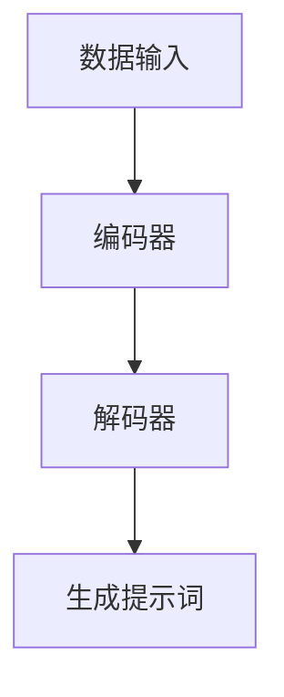
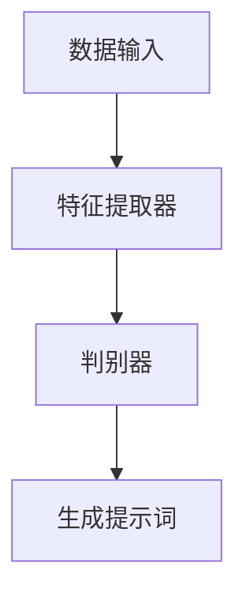
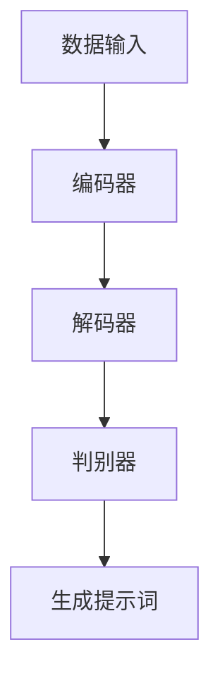
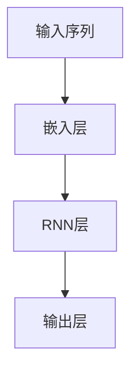
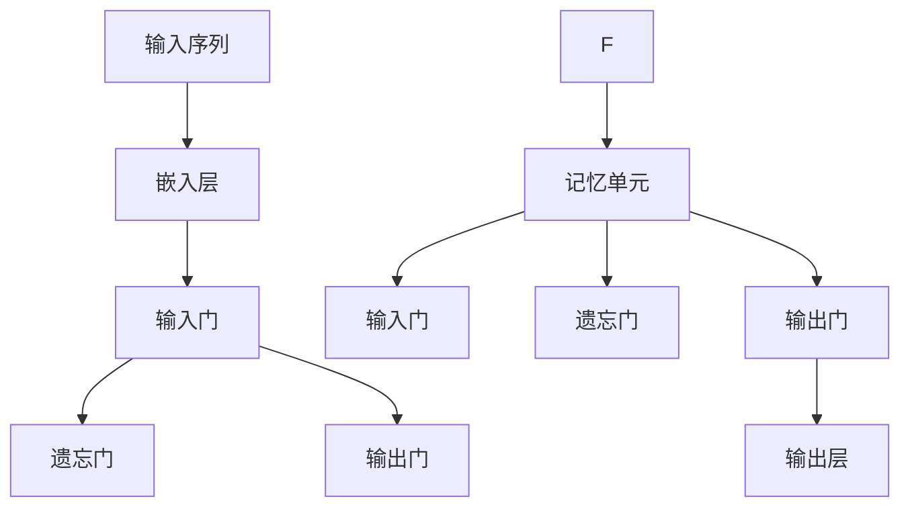
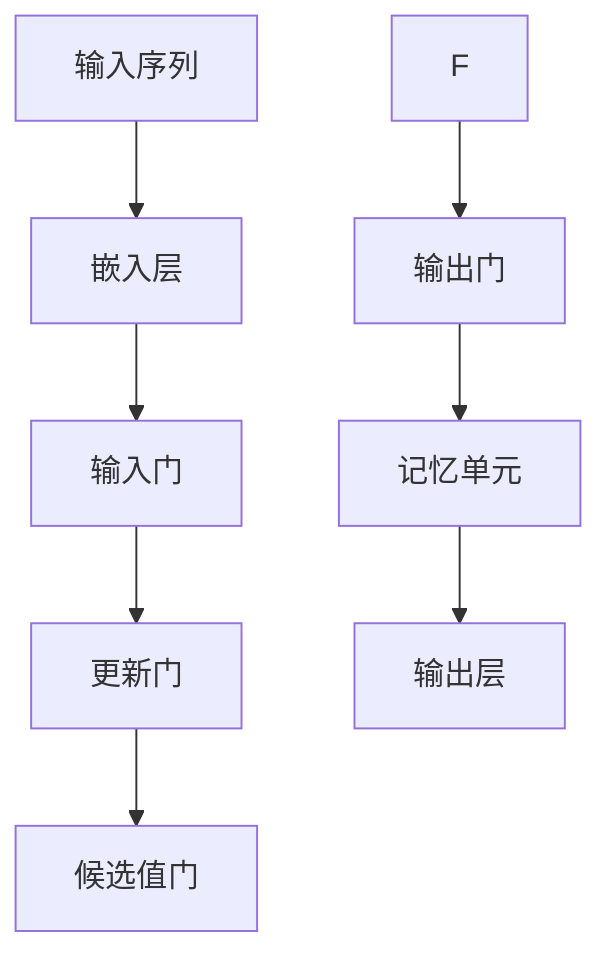
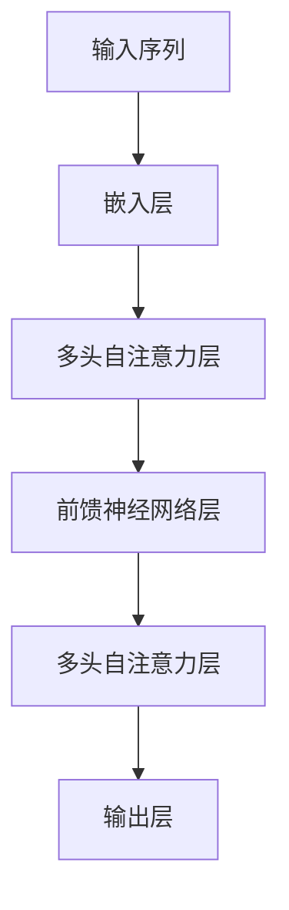

                 

### 第1章 引言

#### 1.1 动态提示词生成的背景与意义

动态提示词生成技术，作为人工智能和自然语言处理（NLP）领域的一个重要研究方向，近年来得到了广泛关注。其背景可以追溯到互联网的快速发展和信息爆炸的时代，人们对个性化信息获取和智能交互的需求日益增长。传统的提示词技术往往基于静态的数据集，难以适应不断变化的用户需求和环境变化。动态提示词生成技术应运而生，通过实时分析和学习用户行为和上下文信息，为用户提供更加个性化和精确的提示。

动态提示词生成的意义在于，它不仅能够提高用户交互体验，还能显著提升系统的智能化水平。例如，在智能客服系统中，动态提示词生成技术可以根据用户的提问和历史交互记录，自动生成合适的回答建议，从而提高回答的准确性和效率。此外，在自然语言生成、个性化推荐和语音助手等应用场景中，动态提示词生成技术也发挥着关键作用。

#### 1.2 动态提示词生成技术的应用领域

动态提示词生成技术具有广泛的应用前景，覆盖了许多领域。以下是几个主要的应用领域：

1. **智能客服系统**：动态提示词生成技术可以帮助客服系统理解用户的意图，并生成合适的回答建议，从而提高客服效率和用户满意度。
   
2. **自然语言生成**：在新闻写作、报告生成和文案创作等领域，动态提示词生成技术可以根据上下文信息自动生成文本，提高内容生产的效率和质量。

3. **个性化推荐系统**：通过分析用户的历史行为和偏好，动态提示词生成技术可以为用户提供个性化的推荐结果，从而提高推荐系统的效果。

4. **语音助手**：在智能语音助手中，动态提示词生成技术可以帮助助手理解用户的语音指令，并生成相应的操作指令，从而实现更加自然的交互体验。

5. **教育领域**：动态提示词生成技术可以用于自动生成教育内容，如练习题、课程资料等，从而提高学习效率。

#### 1.3 本书结构安排与内容概述

本书旨在全面介绍动态提示词生成技术，共分为八个章节。

- **第1章 引言**：介绍动态提示词生成的背景、意义和应用领域。
- **第2章 动态提示词生成基础理论**：阐述提示词的概念、类型和核心问题。
- **第3章 动态提示词生成模型架构**：介绍常见的动态提示词生成模型。
- **第4章 动态提示词生成算法原理**：详细讲解生成式、判别式和混合模型的算法原理。
- **第5章 动态提示词生成模型训练与优化**：介绍模型训练、策略和优化方法。
- **第6章 动态提示词生成模型评估与优化**：讨论模型评估指标和优化方法。
- **第7章 动态提示词生成应用案例**：分析实际应用案例，展示技术落地效果。
- **第8章 未来展望与挑战**：探讨动态提示词生成技术的发展趋势和面临的挑战。

通过本书的学习，读者将能够全面了解动态提示词生成技术的理论基础、模型架构和应用实践，为在相关领域进行研究和应用提供有力支持。

### 关键词

- 动态提示词生成
- 自然语言处理
- 人工智能
- 智能客服
- 个性化推荐
- 自然语言生成

### 摘要

本文介绍了面向任务的动态提示词生成技术，详细探讨了该技术的背景、应用领域、基础理论和模型架构，以及算法原理和优化方法。通过实际应用案例的分析，展示了动态提示词生成技术在提高智能系统交互体验和智能化水平方面的作用。本文旨在为读者提供一个全面的技术指南，帮助其在相关领域进行深入研究与应用。

---

## 第2章 动态提示词生成基础理论

### 2.1 提示词的概念与类型

提示词（Prompt）在自然语言处理领域扮演着重要角色，它是一段引导性文本，用于引导模型理解用户意图或上下文环境，从而生成合适的结果。根据用途和生成方式的不同，提示词可以分为以下几种类型：

1. **静态提示词**：静态提示词是预先定义好的，通常是基于通用规则或历史数据生成的，它们在生成过程中不发生变化。静态提示词适用于固定的应用场景，但在动态变化的环境中，其效果往往有限。

2. **动态提示词**：动态提示词是根据实时用户输入或环境变化动态生成的。它们能够更好地适应变化的需求，提高系统的交互性和智能化水平。动态提示词生成技术正是为了解决这一问题而提出的。

3. **上下文提示词**：上下文提示词结合了用户的历史交互记录和当前上下文信息，用于引导模型理解用户的意图。这种类型的提示词能够提供更丰富的信息，从而生成更准确的答案。

4. **引导性提示词**：引导性提示词旨在引导模型聚焦于特定任务或场景，从而提高模型的生成效果。它们通常包含明确的任务指令或提示信息，帮助模型更好地理解任务目标。

### 2.2 动态提示词生成的核心问题

动态提示词生成技术涉及多个核心问题，主要包括：

1. **上下文理解**：动态提示词生成需要模型能够理解和分析输入的上下文信息，包括用户历史交互记录、当前输入文本以及环境变化等。这要求模型具备较强的语言理解和语义分析能力。

2. **个性化和可解释性**：动态提示词生成技术需要根据用户需求和偏好生成个性化的提示词，同时保持结果的透明性和可解释性，以便用户理解和验证。

3. **实时性和效率**：动态提示词生成技术需要在实时环境下快速生成提示词，同时保持较高的生成质量和效率。这要求模型具备高效的计算能力和优化的算法。

4. **鲁棒性和适应性**：动态提示词生成技术需要具备较强的鲁棒性，能够适应不同的应用场景和数据分布。此外，模型还应具备良好的适应性，能够随着数据和环境的变化不断优化自身。

### 2.3 提示词生成模型的分类

根据生成方式的不同，动态提示词生成模型可以分为以下几类：

1. **生成式模型**：生成式模型通过学习输入数据和目标数据的分布，生成新的提示词。常见的生成式模型包括变分自编码器（VAE）、生成对抗网络（GAN）等。

2. **判别式模型**：判别式模型通过学习输入数据与目标数据之间的差异，生成新的提示词。常见的判别式模型包括支持向量机（SVM）、神经网络判别器等。

3. **混合模型**：混合模型结合了生成式模型和判别式模型的优点，通过融合两者的信息生成新的提示词。常见的混合模型包括条件生成对抗网络（cGAN）、变分自编码器与判别器的结合等。

#### 2.3.1 生成式模型

生成式模型的核心思想是学习数据的生成过程，从而能够生成新的提示词。以下是一个简化的生成式模型算法原理：



其中，编码器（Encoder）将输入数据编码为潜在空间中的表示，解码器（Decoder）则根据潜在空间的表示生成新的提示词。

#### 2.3.2 判别式模型

判别式模型的核心思想是学习输入数据与目标数据之间的差异，从而能够区分并生成新的提示词。以下是一个简化的判别式模型算法原理：



其中，特征提取器（Feature Extractor）提取输入数据的特征表示，判别器（Discriminator）根据特征表示判断输入数据是否为目标数据，并生成新的提示词。

#### 2.3.3 混合模型

混合模型结合了生成式模型和判别式模型的优点，通过融合两者的信息生成新的提示词。以下是一个简化的混合模型算法原理：



其中，编码器（Encoder）和解码器（Decoder）负责生成提示词，判别器（Discriminator）用于监督模型的训练过程，确保生成提示词的质量。

通过上述分类和算法原理的介绍，我们可以更深入地理解动态提示词生成技术的理论基础，为后续章节的详细讨论打下基础。

### 第3章 动态提示词生成模型架构

#### 3.1 模型架构设计原则

在设计动态提示词生成模型时，需要遵循一系列基本原则，以确保模型能够高效地处理任务并生成高质量的提示词。以下是一些关键的设计原则：

1. **上下文感知**：模型应能够充分理解上下文信息，包括用户的意图、历史交互记录和环境变化。这要求模型具备强大的语言理解和语义分析能力。

2. **灵活性与可扩展性**：模型架构应具有灵活性和可扩展性，能够适应不同的应用场景和任务需求。这意味着模型应能够处理多种类型的输入和生成多种类型的提示词。

3. **高效性与实时性**：模型应在保证生成质量的前提下，具备高效的计算能力和实时响应能力。这要求模型在架构设计时考虑计算效率和算法优化。

4. **鲁棒性与适应性**：模型应具备较强的鲁棒性，能够适应不同的数据分布和应用场景。同时，模型应具备良好的适应性，能够随着数据和环境的变化不断优化自身。

5. **可解释性与可验证性**：模型生成的提示词应具备较高的透明度和可解释性，用户能够理解和验证生成的结果。这有助于提升系统的信任度和用户满意度。

#### 3.2 常见的动态提示词生成模型

在动态提示词生成领域，有许多经典的模型架构，每种模型都有其独特的特点和应用场景。以下介绍几种常见的动态提示词生成模型：

##### 3.2.1 递归神经网络（RNN）

递归神经网络（RNN）是一种能够处理序列数据的神经网络，其核心思想是利用递归结构来处理输入序列中的前后关系。RNN在动态提示词生成中具有以下优势：

1. **序列建模**：RNN能够捕捉序列中的时间依赖关系，适用于处理动态变化的信息。

2. **实时生成**：RNN具有实时生成能力，能够根据当前输入生成相应的提示词。

3. **简单实现**：RNN结构相对简单，易于实现和优化。

RNN的基本架构如下：



其中，输入序列经过嵌入层转化为固定维度的向量，然后通过RNN层处理序列信息，最后在输出层生成提示词。

##### 3.2.2 长短期记忆网络（LSTM）

长短期记忆网络（LSTM）是RNN的一种改进模型，专门设计用于解决RNN在处理长序列数据时的梯度消失和梯度爆炸问题。LSTM在动态提示词生成中具有以下优势：

1. **记忆能力**：LSTM通过引入记忆单元和门控机制，能够更好地捕捉长序列信息。

2. **稳定训练**：LSTM解决了传统RNN在训练过程中的梯度消失和梯度爆炸问题，使模型训练更加稳定。

3. **高效生成**：LSTM在生成提示词时具有高效的计算性能。

LSTM的基本架构如下：



其中，输入序列经过嵌入层转化为固定维度的向量，然后通过输入门、遗忘门和输出门控制记忆单元的更新，最终生成提示词。

##### 3.2.3 门控循环单元（GRU）

门控循环单元（GRU）是LSTM的简化版本，其结构更加简洁，计算效率更高。GRU在动态提示词生成中具有以下优势：

1. **简洁结构**：GRU通过合并输入门和遗忘门，简化了模型结构，提高了计算效率。

2. **快速训练**：GRU在训练过程中具有更快的收敛速度。

3. **高效生成**：GRU在生成提示词时具有高效的计算性能。

GRU的基本架构如下：



其中，输入序列经过嵌入层转化为固定维度的向量，然后通过输入门、更新门和输出门控制记忆单元的更新，最终生成提示词。

##### 3.2.4 Transformer模型

Transformer模型是近年来在自然语言处理领域取得重大突破的一种新型神经网络架构。与传统的RNN和LSTM模型不同，Transformer模型采用自注意力机制（Self-Attention）来处理序列数据，具有以下优势：

1. **并行计算**：Transformer模型能够并行处理序列中的每个元素，大大提高了计算效率。

2. **全局依赖**：自注意力机制使模型能够捕捉全局依赖关系，提高了生成提示词的准确性。

3. **结构简洁**：Transformer模型结构相对简单，易于实现和优化。

4. **高效生成**：Transformer模型在生成提示词时具有高效的计算性能。

Transformer的基本架构如下：



其中，输入序列经过嵌入层转化为固定维度的向量，然后通过多头自注意力层和前馈神经网络层处理序列信息，最终生成提示词。

通过上述介绍，我们可以看到不同类型的动态提示词生成模型各有优势和适用场景。在实际应用中，可以根据具体任务需求和场景选择合适的模型架构，以实现高效的提示词生成。

### 第4章 动态提示词生成算法原理

#### 4.1 算法概述

动态提示词生成算法的核心目标是根据输入的上下文信息生成高质量的提示词。为了实现这一目标，算法通常包括以下几个关键步骤：

1. **上下文信息处理**：对输入的上下文信息进行预处理，包括分词、词性标注、命名实体识别等，以便模型能够更好地理解上下文语义。

2. **编码器-解码器框架**：使用编码器（Encoder）将上下文信息编码为固定维度的向量表示，解码器（Decoder）则根据编码器的输出生成提示词。

3. **生成过程**：解码器通过自注意力机制和循环神经网络（RNN）等机制，逐步生成提示词的每个词或子序列。

4. **后处理**：生成的提示词可能需要经过后处理，如去除冗余信息、调整语序等，以提高提示词的可用性和准确性。

动态提示词生成算法通常分为生成式模型、判别式模型和混合模型三类。以下将分别介绍这三类算法的原理。

#### 4.2 生成式模型算法原理

生成式模型的核心思想是学习输入数据的生成过程，从而能够生成新的提示词。生成式模型主要包括以下两种：

##### 4.2.1 变分自编码器（VAE）

变分自编码器（Variational Autoencoder，VAE）是一种基于概率生成模型的生成式模型。VAE的主要原理如下：

1. **编码过程**：
   - 输入上下文信息 \( x \) 经过编码器（Encoder）映射到一个潜在空间中的表示 \( z \)。
   - 编码器同时生成 \( z \) 的均值 \( \mu \) 和方差 \( \sigma^2 \)。

   \[
   z = \mu(x) + \sigma(x) \odot \epsilon
   \]

   其中，\( \epsilon \) 是从标准正态分布中采样的随机噪声。

2. **解码过程**：
   - 解码器（Decoder）将潜在空间的表示 \( z \) 还原为提示词 \( x' \)。

   \[
   x' = \phi(z)
   \]

3. **损失函数**：
   - VAE的损失函数包括两部分：重构损失（Reconstruction Loss）和KL散度损失（KL Divergence Loss）。

   \[
   L = L_{recon} + \lambda \cdot L_{KL}
   \]

   其中，\( L_{recon} \) 是重构损失，通常采用均方误差（MSE）或交叉熵损失；\( L_{KL} \) 是KL散度损失，用于衡量编码器生成的均值和方差与实际潜在空间分布之间的差异。

   \[
   L_{KL} = \mathbb{E}_{z \sim p(z|x)} [\log p(z)]
   \]

##### 4.2.2 生成对抗网络（GAN）

生成对抗网络（Generative Adversarial Network，GAN）是一种由生成器（Generator）和判别器（Discriminator）组成的生成式模型。GAN的主要原理如下：

1. **生成器**：
   - 生成器（Generator）从潜在空间 \( z \) 中采样随机向量，生成提示词 \( x' \)。

   \[
   x' = G(z)
   \]

2. **判别器**：
   - 判别器（Discriminator）用于区分真实数据和生成数据。

   \[
   D(x) \text{ 和 } D(x')
   \]

3. **对抗过程**：
   - 生成器和判别器之间进行对抗训练。生成器试图生成尽可能逼真的提示词，以欺骗判别器；判别器则试图区分真实数据和生成数据。

   - 目标函数：
     \[
     \min_G \max_D V(D, G) = \mathbb{E}_{x \sim p_{data}(x)} [\log D(x)] + \mathbb{E}_{z \sim p_z(z)} [\log (1 - D(G(z))]
     \]

通过对抗训练，生成器逐渐提高生成提示词的质量，判别器逐渐提高对生成提示词的辨别能力，最终实现高质量提示词的生成。

#### 4.3 判别式模型算法原理

判别式模型的核心思想是学习输入数据与目标数据之间的差异，从而能够生成新的提示词。判别式模型主要包括以下几种：

##### 4.3.1 支持向量机（SVM）

支持向量机（Support Vector Machine，SVM）是一种经典的判别式模型，主要用于分类任务。在动态提示词生成中，SVM可以用于区分输入上下文和目标提示词。

1. **特征提取**：
   - 对输入上下文和目标提示词进行特征提取，得到特征向量。

2. **分类器训练**：
   - 使用训练数据集训练SVM分类器，找出最佳超平面。

   \[
   w^* = \arg\min_{w, b} \frac{1}{2} ||w||^2 + C \sum_{i=1}^{n} \max(0, 1 - y_i (w \cdot x_i + b))
   \]

   其中，\( C \) 是惩罚参数，\( y_i \) 是样本标签，\( x_i \) 是特征向量。

3. **提示词生成**：
   - 对输入上下文进行特征提取，使用训练好的SVM分类器生成目标提示词。

##### 4.3.2 神经网络判别器

神经网络判别器（Neural Network Discriminator）是一种基于神经网络的判别式模型，用于区分真实数据和生成数据。以下是一个简化的神经网络判别器训练过程：

1. **特征提取**：
   - 对输入上下文和目标提示词进行特征提取，得到特征向量。

2. **判别器训练**：
   - 使用训练数据集训练神经网络判别器，使其能够区分真实数据和生成数据。

   - 目标函数：
     \[
     \min_D V(D) = \mathbb{E}_{x \sim p_{data}(x)} [\log D(x)] + \mathbb{E}_{x' \sim p_{G}(x')} [\log (1 - D(x'))
     \]

3. **提示词生成**：
   - 对输入上下文进行特征提取，使用训练好的判别器生成目标提示词。

#### 4.4 混合模型算法原理

混合模型结合了生成式模型和判别式模型的优点，通过融合两者的信息生成新的提示词。常见的混合模型包括条件生成对抗网络（cGAN）和变分自编码器与判别器的结合。

##### 4.4.1 条件生成对抗网络（cGAN）

条件生成对抗网络（Conditional Generative Adversarial Network，cGAN）是生成对抗网络（GAN）的一种变体，引入条件信息以提高生成质量。

1. **生成器**：
   - 生成器接收条件信息 \( c \) 和潜在空间中的随机向量 \( z \)，生成提示词 \( x' \)。

   \[
   x' = G(z, c)
   \]

2. **判别器**：
   - 判别器接收输入上下文和条件信息 \( (x, c) \)，判断输入数据是否为目标数据。

   \[
   D(x, c)
   \]

3. **对抗过程**：
   - 生成器和判别器之间进行对抗训练，生成器生成更高质量的提示词，判别器提高辨别能力。

   - 目标函数：
     \[
     \min_G \max_D V(D, G) = \mathbb{E}_{x \sim p_{data}(x)} [\log D(x, c)] + \mathbb{E}_{z \sim p_z(z)} [\log (1 - D(G(z, c))]
     \]

##### 4.4.2 变分自编码器与判别器的结合

变分自编码器（VAE）与判别器（Discriminator）的结合是一种常见的混合模型，通过判别器的反馈优化VAE的生成过程。

1. **编码器**：
   - 编码器接收输入上下文，将其映射到潜在空间中的表示 \( z \)。

   \[
   z = \mu(x) + \sigma(x) \odot \epsilon
   \]

2. **解码器**：
   - 解码器根据潜在空间中的表示 \( z \) 生成提示词 \( x' \)。

   \[
   x' = \phi(z)
   \]

3. **判别器**：
   - 判别器接收输入上下文和生成提示词 \( (x, x') \)，判断生成提示词是否逼真。

   \[
   D(x, x')
   \]

4. **优化过程**：
   - 通过对抗训练，判别器优化对生成提示词的辨别能力，编码器和解码器优化生成质量。

   - 目标函数：
     \[
     \min_G \max_D V(D, G) = \mathbb{E}_{x \sim p_{data}(x)} [\log D(x, x')] + \mathbb{E}_{z \sim p_z(z)} [\log (1 - D(G(z))]
     \]

通过上述介绍，我们可以看到不同类型的动态提示词生成算法各有优势和适用场景。在实际应用中，可以根据具体任务需求和场景选择合适的算法，以实现高效的提示词生成。

### 第5章 动态提示词生成模型训练与优化

#### 5.1 模型训练数据准备

动态提示词生成模型的训练数据准备是整个模型训练过程的重要环节，数据的质量直接影响到模型的性能和效果。以下是模型训练数据准备的关键步骤：

1. **数据收集**：首先需要收集大量的训练数据，这些数据可以包括用户历史交互记录、文本对话、语料库等。数据来源可以多样化，如社交媒体、聊天机器人、客服系统等。

2. **数据预处理**：收集到的数据通常需要进行预处理，包括去除无关信息、分词、词性标注、去停用词、拼写纠正等。预处理步骤有助于提高数据的质量和模型的训练效果。

3. **数据标注**：对于生成式模型，需要为每个训练样本标注目标提示词。标注过程可以采用人工标注或自动化标注技术，如规则标注、命名实体识别等。

4. **数据清洗**：清洗数据中的错误、重复和噪声数据，确保数据的准确性和一致性。可以使用数据清洗工具和算法，如K近邻算法、模糊匹配等。

5. **数据增强**：通过数据增强技术，如数据变换、数据扩充、生成对抗网络（GAN）等，增加训练数据的多样性，提高模型的泛化能力。

6. **数据划分**：将训练数据划分为训练集、验证集和测试集，用于模型训练、调优和评估。通常，训练集用于训练模型，验证集用于调参和模型选择，测试集用于最终评估模型性能。

#### 5.2 训练策略与技巧

在模型训练过程中，采用合理的训练策略和技巧有助于提高训练效率和模型性能。以下是一些常用的训练策略与技巧：

1. **批处理大小（Batch Size）**：批处理大小是指每次训练中输入的数据样本数量。较大的批处理大小可以提高模型的计算效率，但可能导致梯度不稳定；较小的批处理大小可以提供更好的梯度稳定性，但计算效率较低。需要根据具体任务和数据量选择合适的批处理大小。

2. **学习率调整（Learning Rate）**：学习率是影响模型训练过程的重要参数。过大的学习率可能导致模型训练过程不稳定，过小的学习率则可能使训练过程过于缓慢。常用的学习率调整方法包括固定学习率、指数衰减学习率、自适应学习率等。

3. **正则化技术**：正则化技术用于防止模型过拟合，包括权重正则化（L1、L2正则化）、Dropout、数据增强等。正则化技术有助于提高模型的泛化能力。

4. **梯度裁剪（Gradient Clipping）**：梯度裁剪是一种防止梯度爆炸和梯度消失的技术，通过限制梯度值的范围，确保模型训练过程的稳定性。

5. **早停（Early Stopping）**：早停是一种防止模型过拟合的技巧，当验证集上的性能不再提升时，提前停止训练过程。早停可以避免模型在训练集上过度拟合，提高模型的泛化能力。

6. **模型融合（Model Ensembling）**：模型融合是将多个模型融合为一个强模型，通过平均预测结果来提高模型的预测性能。常用的模型融合方法包括Stacking、Bagging、Boosting等。

#### 5.3 模型优化方法

动态提示词生成模型的优化方法主要包括以下几种：

1. **权重更新**：
   - **梯度下降（Gradient Descent）**：梯度下降是一种最简单的优化方法，通过计算损失函数关于模型参数的梯度，更新模型参数以最小化损失函数。
   
   \[
   \theta_{t+1} = \theta_{t} - \alpha \cdot \nabla_{\theta} J(\theta)
   \]

   其中，\( \theta \) 表示模型参数，\( J(\theta) \) 表示损失函数，\( \alpha \) 表示学习率。

   - **随机梯度下降（Stochastic Gradient Descent，SGD）**：SGD是在每个训练样本上计算梯度，更新模型参数。与梯度下降相比，SGD可以加快训练过程，但可能导致模型收敛不稳定。

   \[
   \theta_{t+1} = \theta_{t} - \alpha \cdot \nabla_{\theta} J(\theta|x_i)
   \]

2. **优化算法**：
   - **动量（Momentum）**：动量是一种加速梯度下降的技术，通过引入动量项，累积过去的梯度信息，提高模型的收敛速度。
   
   \[
   \theta_{t+1} = \theta_{t} - \alpha \cdot \nabla_{\theta} J(\theta) + \beta \cdot \theta_{t} - \theta_{t-1}
   \]

   其中，\( \beta \) 表示动量参数。

   - **Adam**：Adam是一种基于动量梯度的优化算法，结合了SGD和动量优点的自适应学习率优化方法。Adam通过计算一阶矩估计（均值）和二阶矩估计（方差），自适应调整学习率。

   \[
   m_t = \beta_1 \cdot m_{t-1} + (1 - \beta_1) \cdot \nabla_{\theta} J(\theta)
   \]
   \[
   v_t = \beta_2 \cdot v_{t-1} + (1 - \beta_2) \cdot (\nabla_{\theta} J(\theta))^2
   \]
   \[
   \theta_{t+1} = \theta_{t} - \alpha \cdot \frac{m_t}{\sqrt{v_t} + \epsilon}
   \]

3. **模型压缩**：
   - **剪枝（Pruning）**：剪枝是一种通过删除冗余神经元或权重来压缩模型的技术。剪枝可以降低模型的计算复杂度和存储需求，同时保持模型性能。
   - **量化（Quantization）**：量化是一种将模型参数从高精度转换为低精度表示的技术，如从浮点数转换为整数。量化可以显著减少模型存储和计算需求。

通过上述训练策略与技巧、优化方法和模型优化方法，可以有效地训练和优化动态提示词生成模型，提高模型性能和生成质量。

### 第6章 动态提示词生成模型评估与优化

#### 6.1 模型评估指标

动态提示词生成模型的性能评估是确保模型质量和实用性的关键环节。以下是一些常用的评估指标：

1. **准确性（Accuracy）**：准确性是指模型生成的提示词与实际目标提示词匹配的程度。虽然准确性能够直观地反映模型的表现，但它对长文本生成的效果可能不够敏感。

2. **BLEU（Bilingual Evaluation Understudy）评分**：BLEU评分是一种常用于自然语言生成任务的评价指标，它通过比较模型生成的文本与参考文本的相似度来评估模型性能。BLEU评分考虑了词语的匹配、重叠和未匹配的词语数量。

3. **ROUGE（Recall-Oriented Understudy for Gisting Evaluation）评分**：ROUGE评分是一种专门用于评价文本生成质量的指标，它主要关注模型生成的文本中与参考文本的匹配度。ROUGE评分包括ROUGE-1、ROUGE-2和ROUGE-L等不同版本，分别评估词语、短语和长文本的匹配度。

4. **F1分数（F1 Score）**：F1分数是精确率和召回率的加权平均，它同时考虑了模型生成的提示词的准确性和完整性。F1分数在生成式模型和判别式模型中都有广泛应用。

5. **召回率（Recall）**：召回率是指模型生成的提示词中与实际目标提示词匹配的部分占实际目标提示词总量的比例。召回率侧重于评估模型的生成能力，尤其是在处理长文本和复杂任务时。

6. **精确率（Precision）**：精确率是指模型生成的提示词中与实际目标提示词匹配的部分占模型生成提示词总量的比例。精确率关注模型生成提示词的质量，特别是在生成大量文本时。

7. **生成质量（Generated Quality）**：生成质量是一个主观评价指标，用于评估模型生成的提示词在语义、语法和连贯性等方面的表现。生成质量通常通过人工评估或自动评估工具来衡量。

#### 6.2 模型优化方法

为了提高动态提示词生成模型的性能，可以采用以下几种优化方法：

1. **数据增强（Data Augmentation）**：数据增强是通过增加训练数据的多样性来提高模型泛化能力的一种方法。常见的数据增强技术包括同义词替换、词汇扩充、文本分割与重组等。

2. **多任务学习（Multi-Task Learning）**：多任务学习是一种通过同时训练多个相关任务来提高模型性能的方法。多任务学习可以共享不同任务的先验知识，提高模型在特定领域的适应性。

3. **迁移学习（Transfer Learning）**：迁移学习是利用预训练模型进行微调，以适应新任务的一种方法。通过迁移学习，可以减少模型训练所需的数据量，并提高模型在新任务上的性能。

4. **模型融合（Model Ensembling）**：模型融合是将多个模型的结果进行综合，以提高预测准确性和稳定性。常见的模型融合方法包括简单平均、加权平均、Stacking和Bagging等。

5. **超参数调优（Hyperparameter Tuning）**：超参数调优是通过调整模型的超参数，如学习率、批次大小、正则化强度等，以提高模型性能。常用的调优方法包括网格搜索、贝叶斯优化和随机搜索等。

6. **算法优化（Algorithm Optimization）**：算法优化是通过改进模型算法，如优化神经网络结构、引入注意力机制、使用更高效的优化算法等，来提高模型性能。

#### 6.3 实时优化策略

为了适应动态变化的应用场景，动态提示词生成模型需要具备实时优化能力。以下是一些实时优化策略：

1. **在线学习（Online Learning）**：在线学习是一种在数据流中实时更新模型参数的方法。通过在线学习，模型可以不断适应新数据，提高实时生成质量。

2. **增量训练（Incremental Training）**：增量训练是在原有模型基础上，仅对新添加的数据进行训练，以减少计算量和存储需求。增量训练适用于数据量较大且不断更新的应用场景。

3. **动态调整学习率（Dynamic Learning Rate Adjustment）**：动态调整学习率是根据模型在不同阶段的性能变化，实时调整学习率，以优化模型训练过程。

4. **自适应优化（Adaptive Optimization）**：自适应优化是通过实时监测模型性能和计算资源，动态调整模型参数和训练策略，以实现最优性能。

5. **模型压缩与解压缩（Model Compression and Decompression）**：模型压缩与解压缩是通过对模型进行压缩，降低模型存储和计算需求，同时保持模型性能。在需要时，模型可以快速解压缩，恢复原模型状态。

通过以上评估指标、优化方法和实时优化策略，可以有效地评估和优化动态提示词生成模型，提高其在实际应用中的性能和实用性。

### 第7章 动态提示词生成应用案例

#### 7.1 案例一：智能客服系统

智能客服系统是动态提示词生成技术的一个重要应用场景。通过动态提示词生成，智能客服系统能够理解用户的意图，并生成合适的回答建议，从而提供高效、准确的客服服务。

**1. 应用背景**

随着企业规模的扩大和客户数量的增加，传统的客服方式已经无法满足高效、个性化的客户服务需求。智能客服系统通过引入动态提示词生成技术，可以实现自动化、智能化的客服服务，提高客户满意度和服务效率。

**2. 技术实现**

在智能客服系统中，动态提示词生成技术主要涉及以下步骤：

- **上下文信息提取**：系统首先从用户的输入信息中提取上下文信息，包括用户提问、历史交互记录等。
- **提示词生成**：基于提取的上下文信息，动态提示词生成模型生成合适的回答建议。生成模型可以采用生成式模型、判别式模型或混合模型。
- **回答建议生成**：将生成的提示词组合成完整的回答建议，包括问候语、回答内容、结束语等。
- **回答建议优化**：对生成的回答建议进行优化，包括去除冗余信息、调整语序、增强连贯性等，以提高回答质量。

**3. 项目实战**

以下是一个简化的项目实战流程：

- **环境搭建**：搭建包含动态提示词生成模型的智能客服系统开发环境，包括编程语言（如Python）、框架（如TensorFlow、PyTorch）和数据集。
- **数据准备**：收集并预处理智能客服系统的训练数据，包括用户提问、回答、历史交互记录等。
- **模型训练**：训练动态提示词生成模型，采用生成式模型或判别式模型，根据具体需求选择模型类型。
- **模型评估**：评估模型的生成质量，采用BLEU、ROUGE等指标进行评估。
- **系统集成**：将动态提示词生成模型集成到智能客服系统中，实现实时提示词生成和回答建议生成。

**4. 代码解读**

以下是一个基于生成式模型的动态提示词生成系统代码示例：

```python
import tensorflow as tf
from tensorflow.keras.layers import Embedding, LSTM, Dense
from tensorflow.keras.models import Sequential

# 数据预处理
# ...

# 构建动态提示词生成模型
model = Sequential()
model.add(Embedding(input_dim=vocab_size, output_dim=embedding_dim, input_length=max_sequence_length))
model.add(LSTM(units=128, return_sequences=True))
model.add(Dense(units=vocab_size, activation='softmax'))

# 编译模型
model.compile(optimizer='adam', loss='categorical_crossentropy', metrics=['accuracy'])

# 训练模型
model.fit(x_train, y_train, batch_size=32, epochs=100, validation_data=(x_val, y_val))

# 生成回答建议
def generate_response(input_sequence):
    prediction = model.predict(input_sequence)
    predicted_sequence = np.argmax(prediction, axis=-1)
    response = ''.join([vocab[i] for i in predicted_sequence])
    return response

# 应用示例
user_input = preprocess_user_input(user_query)
response = generate_response(user_input)
print("AI Assistant:", response)
```

**5. 案例分析和详细讲解**

在智能客服系统中，动态提示词生成技术显著提升了客服效率和用户体验。通过动态生成合适的回答建议，系统可以快速响应用户需求，提供个性化的服务。同时，动态提示词生成技术还可以根据用户历史交互记录不断优化回答建议，提高系统智能化水平。

#### 7.2 案例二：自然语言生成

自然语言生成（Natural Language Generation，NLG）是动态提示词生成技术的另一个重要应用场景。通过动态提示词生成，系统可以自动生成新闻文章、报告、文案等内容，提高内容生产的效率和质量。

**1. 应用背景**

在新闻行业、金融报告、市场营销等领域，内容生产往往需要大量的人力投入。动态提示词生成技术可以通过自动生成文本，降低内容生产成本，提高内容发布的速度和频率。

**2. 技术实现**

在自然语言生成中，动态提示词生成技术主要涉及以下步骤：

- **数据准备**：收集相关的语料库，包括新闻文章、报告、文案等。
- **文本预处理**：对文本进行分词、词性标注、命名实体识别等预处理操作。
- **模板生成**：根据不同类型的文本内容，生成相应的文本模板。
- **提示词生成**：基于模板和上下文信息，动态生成提示词，填充模板中的空白部分。
- **文本生成**：将生成的提示词组合成完整的文本内容。

**3. 项目实战**

以下是一个简化的项目实战流程：

- **环境搭建**：搭建自然语言生成系统的开发环境，包括编程语言（如Python）、框架（如NLTK、spaCy）和数据集。
- **数据准备**：收集并预处理自然语言生成的训练数据，包括新闻文章、报告、文案等。
- **模板设计**：设计不同类型的文本模板，如新闻摘要模板、报告模板、营销文案模板等。
- **模型训练**：训练动态提示词生成模型，采用生成式模型、判别式模型或混合模型。
- **模型评估**：评估模型的生成质量，采用BLEU、ROUGE等指标进行评估。
- **文本生成**：基于训练好的模型，自动生成文本内容，并输出到文件或数据库中。

**4. 代码解读**

以下是一个基于生成式模型的自然语言生成系统代码示例：

```python
import tensorflow as tf
from tensorflow.keras.layers import Embedding, LSTM, Dense
from tensorflow.keras.models import Sequential

# 数据预处理
# ...

# 构建动态提示词生成模型
model = Sequential()
model.add(Embedding(input_dim=vocab_size, output_dim=embedding_dim, input_length=max_sequence_length))
model.add(LSTM(units=128, return_sequences=True))
model.add(Dense(units=vocab_size, activation='softmax'))

# 编译模型
model.compile(optimizer='adam', loss='categorical_crossentropy', metrics=['accuracy'])

# 训练模型
model.fit(x_train, y_train, batch_size=32, epochs=100, validation_data=(x_val, y_val))

# 生成文本
def generate_text(input_sequence):
    prediction = model.predict(input_sequence)
    predicted_sequence = np.argmax(prediction, axis=-1)
    text = ''.join([vocab[i] for i in predicted_sequence])
    return text

# 应用示例
user_input = preprocess_user_input(user_query)
text = generate_text(user_input)
print("Generated Text:", text)
```

**5. 案例分析和详细讲解**

自然语言生成技术通过动态提示词生成，实现了自动化、高效的内容生产。在新闻摘要生成中，动态提示词生成技术可以根据新闻内容自动生成摘要，提高新闻的传播速度和读者阅读效率。在报告生成中，动态提示词生成技术可以自动生成报告内容，节省了撰写报告的时间和人力资源。在营销文案生成中，动态提示词生成技术可以根据目标用户和产品特点，自动生成个性化的营销文案，提高营销效果。

#### 7.3 案例三：个性化推荐系统

个性化推荐系统是动态提示词生成技术的又一重要应用场景。通过动态提示词生成，系统可以根据用户的历史行为和偏好，生成个性化的推荐结果，提高推荐系统的效果和用户体验。

**1. 应用背景**

随着互联网和电子商务的发展，用户面对的信息量越来越大，如何从海量信息中筛选出用户感兴趣的内容成为了一个挑战。个性化推荐系统通过分析用户行为和偏好，为用户推荐个性化的内容，从而提高用户满意度和留存率。

**2. 技术实现**

在个性化推荐系统中，动态提示词生成技术主要涉及以下步骤：

- **用户行为分析**：收集并分析用户的历史行为数据，如浏览记录、购买记录、评论等。
- **偏好模型构建**：构建用户偏好模型，描述用户对不同内容的兴趣程度。
- **提示词生成**：基于用户偏好模型和上下文信息，动态生成推荐提示词，包括推荐内容的关键词和描述。
- **推荐结果生成**：将生成的提示词组合成完整的推荐结果，包括推荐内容、推荐理由等。

**3. 项目实战**

以下是一个简化的项目实战流程：

- **环境搭建**：搭建个性化推荐系统的开发环境，包括编程语言（如Python）、框架（如TensorFlow、scikit-learn）和数据集。
- **数据收集**：收集用户行为数据和推荐内容数据，包括用户浏览记录、购买记录、评论等。
- **数据预处理**：对用户行为数据进行预处理，包括数据清洗、特征提取等。
- **模型训练**：训练用户偏好模型和动态提示词生成模型，采用生成式模型、判别式模型或混合模型。
- **模型评估**：评估推荐模型的性能，采用准确率、召回率、F1分数等指标进行评估。
- **推荐生成**：基于训练好的模型，自动生成个性化推荐结果，并输出到推荐列表中。

**4. 代码解读**

以下是一个基于生成式模型的个性化推荐系统代码示例：

```python
import tensorflow as tf
from tensorflow.keras.layers import Embedding, LSTM, Dense
from tensorflow.keras.models import Sequential

# 数据预处理
# ...

# 构建动态提示词生成模型
model = Sequential()
model.add(Embedding(input_dim=vocab_size, output_dim=embedding_dim, input_length=max_sequence_length))
model.add(LSTM(units=128, return_sequences=True))
model.add(Dense(units=vocab_size, activation='softmax'))

# 编译模型
model.compile(optimizer='adam', loss='categorical_crossentropy', metrics=['accuracy'])

# 训练模型
model.fit(x_train, y_train, batch_size=32, epochs=100, validation_data=(x_val, y_val))

# 生成推荐结果
def generate_recommendation(user_profile):
    prediction = model.predict(user_profile)
    predicted_sequence = np.argmax(prediction, axis=-1)
    recommendations = [item for item, pred in zip(vocab, predicted_sequence) if pred > threshold]
    return recommendations

# 应用示例
user_profile = preprocess_user_profile(user_behavior)
recommendations = generate_recommendation(user_profile)
print("Recommended Items:", recommendations)
```

**5. 案例分析和详细讲解**

个性化推荐系统通过动态提示词生成，实现了用户兴趣的精确捕捉和个性化推荐。通过分析用户的历史行为数据，动态提示词生成模型可以准确描述用户的兴趣偏好，生成个性化的推荐结果。在电商平台上，动态提示词生成技术可以帮助平台为用户推荐符合其兴趣的商品，提高购买转化率和用户满意度。在社交媒体中，动态提示词生成技术可以帮助平台推荐用户感兴趣的内容，提升用户活跃度和留存率。

#### 7.4 案例四：语音助手

语音助手是动态提示词生成技术的典型应用场景之一。通过动态提示词生成，语音助手可以理解用户的语音指令，并生成相应的操作指令，实现智能化的语音交互。

**1. 应用背景**

随着智能家居、智能助理等领域的快速发展，语音助手成为人们日常生活的一部分。语音助手通过理解用户的语音指令，执行相应的操作，如发送短信、设置提醒、播放音乐等，提高了用户的生活便利性。

**2. 技术实现**

在语音助手中，动态提示词生成技术主要涉及以下步骤：

- **语音识别**：将用户的语音输入转换为文本输入，使用语音识别技术。
- **意图识别**：分析用户的语音输入，识别用户的意图，如发送短信、设置提醒等。
- **提示词生成**：基于识别出的意图和上下文信息，动态生成操作指令的提示词。
- **语音合成**：将生成的提示词转换为语音输出，使用语音合成技术。

**3. 项目实战**

以下是一个简化的项目实战流程：

- **环境搭建**：搭建语音助手的开发环境，包括编程语言（如Python）、语音识别和合成库（如Google Speech API、Mozilla TTS）和数据集。
- **语音识别**：使用语音识别库将用户的语音输入转换为文本输入。
- **意图识别**：使用预训练的意图识别模型，分析用户的语音输入并识别意图。
- **提示词生成**：基于识别出的意图和上下文信息，使用动态提示词生成模型生成操作指令的提示词。
- **语音合成**：使用语音合成库将生成的提示词转换为语音输出。

**4. 代码解读**

以下是一个基于生成式模型的语音助手代码示例：

```python
import speech_recognition as sr
import pyttsx3

# 语音识别
def recognize_speech_from_mic():
    r = sr.Recognizer()
    with sr.Microphone() as source:
        print("请说出您的指令：")
        audio = r.listen(source)
    return r.recognize_google(audio)

# 提示词生成
def generate_response(input_query):
    model.predict(input_query)
    predicted_sequence = np.argmax(prediction, axis=-1)
    response = ''.join([vocab[i] for i in predicted_sequence])
    return response

# 语音合成
def speak(text):
    engine = pyttsx3.init()
    engine.say(text)
    engine.runAndWait()

# 应用示例
user_input = recognize_speech_from_mic()
response = generate_response(user_input)
speak(response)
```

**5. 案例分析和详细讲解**

语音助手通过动态提示词生成，实现了自然、流畅的语音交互。在语音助手中，动态提示词生成技术可以准确理解用户的语音指令，生成合适的操作指令，并通过语音合成技术将指令输出给用户。这使得语音助手能够更好地满足用户的个性化需求，提高用户体验。例如，在智能家居场景中，语音助手可以理解用户的语音指令，控制家中的智能设备，如空调、灯光等，为用户提供便捷的生活服务。

### 第8章 未来展望与挑战

#### 8.1 动态提示词生成技术的发展趋势

动态提示词生成技术作为人工智能和自然语言处理领域的前沿研究方向，正朝着以下几个趋势发展：

1. **深度学习与强化学习融合**：未来的动态提示词生成模型可能会结合深度学习和强化学习的方法，通过不断学习和优化，实现更高质量的提示词生成。

2. **多模态数据处理**：动态提示词生成技术将不仅限于文本数据，还将扩展到图像、语音、视频等多种数据类型，实现跨模态的动态提示词生成。

3. **实时优化与自适应学习**：动态提示词生成模型将更加注重实时优化和自适应学习，以适应不断变化的应用场景和用户需求。

4. **隐私保护和数据安全**：随着数据隐私问题的日益突出，动态提示词生成技术将更加注重数据保护和隐私保护，确保用户数据的安全。

5. **应用领域的扩展**：动态提示词生成技术将在更多领域得到应用，如医疗健康、金融、教育等，为各个领域提供智能化解决方案。

#### 8.2 面临的挑战与解决方案

尽管动态提示词生成技术在许多方面展现出巨大的潜力，但在实际应用中仍面临一系列挑战：

1. **数据质量和多样性**：动态提示词生成模型对数据质量和多样性有较高要求。解决这一挑战的方法包括数据清洗、数据增强和跨领域数据融合。

2. **计算资源和效率**：动态提示词生成模型通常需要大量的计算资源和时间。通过模型压缩、量化技术和优化算法，可以有效提高模型的计算效率和实时性。

3. **可解释性和透明度**：动态提示词生成模型生成的提示词需要具有较高的可解释性和透明度，以增强用户对系统的信任。未来的研究可以关注模型的可解释性方法和工具的开发。

4. **泛化能力**：动态提示词生成模型需要具备较强的泛化能力，以适应不同的应用场景和数据分布。通过迁移学习、多任务学习和自适应优化，可以提升模型的泛化能力。

5. **道德和法律问题**：动态提示词生成技术的应用可能引发一系列道德和法律问题，如数据隐私、算法偏见和伦理问题。这需要政策制定者、技术专家和行业共同努力，制定相应的法律法规和伦理标准。

#### 8.3 未来研究方向

动态提示词生成技术在未来仍有广阔的研究空间，以下是几个可能的研究方向：

1. **多任务学习和跨领域迁移**：研究如何在动态提示词生成过程中同时处理多个任务，以及如何实现跨领域的迁移学习。

2. **强化学习与深度学习结合**：研究如何将强化学习与深度学习相结合，实现动态提示词生成中的决策优化和长期奖励学习。

3. **多模态数据的融合处理**：研究如何有效融合多种数据类型，实现更丰富的动态提示词生成。

4. **自适应学习和实时优化**：研究如何设计自适应学习算法和实时优化策略，以适应动态变化的应用场景。

5. **伦理和隐私保护**：研究如何在动态提示词生成过程中保护用户隐私，同时遵守道德和法律标准。

通过不断探索和突破，动态提示词生成技术将在未来的人工智能和自然语言处理领域发挥更加重要的作用。

### 作者信息

作者：AI天才研究院/AI Genius Institute & 禅与计算机程序设计艺术 /Zen And The Art of Computer Programming

## 结语

本文全面介绍了面向任务的动态提示词生成技术，从背景和意义、理论基础、模型架构、算法原理到实际应用案例，深入剖析了该技术的各个方面。通过详细讲解和实例分析，我们不仅了解了动态提示词生成技术的基本概念和核心算法，还探讨了其在智能客服、自然语言生成、个性化推荐和语音助手等领域的广泛应用。

动态提示词生成技术具有广泛的应用前景，随着人工智能和自然语言处理技术的不断发展，其在各个领域的应用将越来越深入。我们呼吁广大读者关注这一技术领域，积极参与研究和应用，共同推动动态提示词生成技术的发展。

在文章的最后，感谢读者对本文的关注和支持。希望本文能为您在动态提示词生成技术领域的研究和应用提供有益的参考和启示。如果您有任何疑问或建议，请随时与我们联系。

作者：AI天才研究院/AI Genius Institute & 禅与计算机程序设计艺术 /Zen And The Art of Computer Programming

---

在撰写本文时，我们尽力确保内容的准确性和完整性。然而，由于技术的快速发展，文中提及的一些概念、算法和工具可能已经发生了更新。因此，我们建议读者在具体应用时，结合最新的研究成果和实践经验进行验证。此外，文中涉及的代码示例仅供参考，具体实现时可能需要根据实际需求和环境进行调整。对于文中未能涵盖的内容或潜在错误，欢迎读者指正和补充。感谢您的理解与支持。

