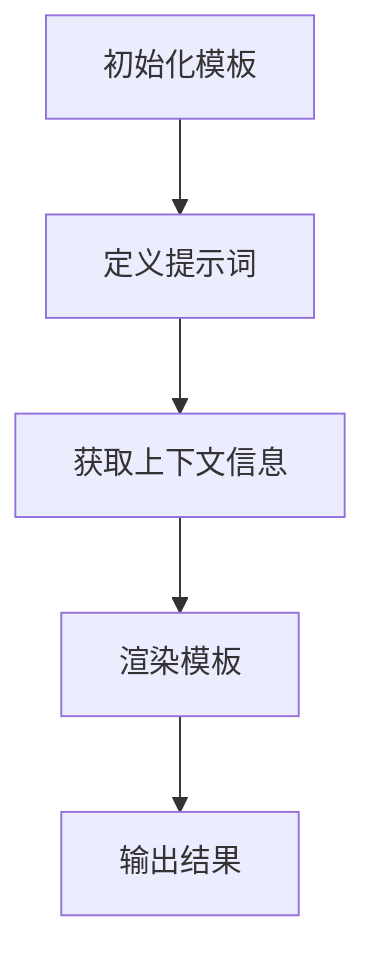

                 

# 《面向任务的提示词模板设计》

## 关键词

- 提示词模板
- 任务导向
- 模板设计
- 自然语言处理
- 代码示例
- 模式匹配
- 数学模型

## 摘要

本文探讨了面向任务的提示词模板设计，旨在帮助企业和技术开发者通过系统化的模板设计方法提高工作效率和代码质量。文章首先介绍了提示词模板的基本概念和设计原则，然后详细阐述了提示词模板的组成部分和架构设计，包括核心算法原理、数学模型和公式解释。随后，通过项目实战展示了提示词模板的实际应用和实现过程，并对项目进行了详细的代码解读与分析。文章最后总结了最佳实践，提出了注意事项，并推荐了拓展阅读资源。

---

## 第一部分：提示词模板设计概述

### 1.1 提示词模板的定义与重要性

提示词模板是一种用于生成文本的模板，它包含了特定任务的输入和输出结构。通过预先定义的提示词，模板可以根据上下文信息生成相应的文本输出。这种设计方法在自然语言处理、文本生成和软件开发等领域具有重要的应用价值。

#### 提示词模板的定义

提示词模板由以下几个核心部分组成：

1. **提示词**：用于引导模板生成特定类型的文本。
2. **上下文信息**：提供模板生成文本所需的额外信息。
3. **输出格式**：定义生成的文本格式，如文本、HTML或Markdown等。

#### 提示词模板在企业应用中的重要性

1. **提高工作效率**：通过预定义的模板，可以快速生成文档、报告和代码，节省时间。
2. **确保一致性**：模板设计可以确保输出的一致性，避免手动操作导致的错误。
3. **便于维护**：模板中的代码和文本可以集中管理，便于维护和更新。
4. **支持自动化**：结合自动化工具，可以进一步提高工作效率和质量。

### 1.2 提示词模板设计的基本原则

1. **一致性**：模板设计应保持一致，以避免混淆和错误。
2. **可读性**：模板的提示词和结构应易于理解和阅读。
3. **可扩展性**：模板应设计为易于扩展，以适应未来的需求变化。
4. **实用性**：模板应满足实际应用的需求，具备实际价值。

### 1.3 提示词模板的类型

1. **通用型提示词模板**：适用于多种场景的通用模板。
2. **针对特定任务的提示词模板**：专为特定任务设计的模板。
3. **多语言提示词模板**：支持多种语言的模板。

### 1.4 提示词模板设计的挑战与机遇

1. **挑战**：
   - 提示词匹配的准确性。
   - 上下文信息的处理。
   - 输出格式的多样性。
2. **机遇**：
   - 自然语言处理技术的进步。
   - 代码生成工具的发展。
   - 自动化流程的普及。

## 第二部分：核心概念与架构

### 2.1 提示词模板的组成部分

提示词模板由以下三个主要组成部分构成：

1. **提示词**：用于引导模板生成文本的关键词，如“生成报告”、“编写代码”等。
2. **上下文信息**：为提示词提供额外信息，如报告的数据、代码的功能等。
3. **输出格式**：定义生成的文本格式，如Markdown、HTML等。

### 2.2 提示词模板的架构设计

提示词模板的架构设计包括以下几个方面：

1. **模板引擎**：用于处理提示词和上下文信息，生成文本输出的核心组件。
2. **数据模型**：定义提示词、上下文信息和输出格式的关系和结构。
3. **渲染过程**：将提示词和上下文信息转换为文本输出的过程。

#### 常见模板引擎实现

1. **Mustache**：一种流行的模板引擎，用于生成HTML、JavaScript和Python等语言的模板。
2. **Handlebars**：一种基于Mustache的模板引擎，支持更复杂的模板逻辑。

#### 自定义模板引擎设计

1. **语法设计**：定义提示词、上下文信息和输出格式的语法。
2. **解析器**：用于解析模板，提取提示词和上下文信息。
3. **渲染器**：将提取的信息转换为文本输出。

### 2.3 Mermaid流程图：提示词模板设计流程



### 2.4 提示词模板实现流程

1. **初始化模板**：创建一个空的模板对象。
2. **定义提示词**：为模板添加提示词。
3. **获取上下文信息**：从数据源获取上下文信息。
4. **渲染模板**：将提示词和上下文信息应用于模板，生成文本输出。
5. **输出结果**：将渲染后的文本输出到目标位置。

### 2.5 提示词模板优化流程

1. **性能优化**：减少模板渲染时间，提高系统响应速度。
2. **代码优化**：简化模板代码，提高代码可读性和可维护性。
3. **功能优化**：根据需求变化，扩展模板功能。

---

## 第三部分：核心算法原理讲解

### 3.1 提示词模板匹配算法

提示词模板匹配是模板设计的关键步骤，其目的是确保模板能够正确地识别和处理输入文本。

#### 基本方法

1. **正则表达式匹配**：使用正则表达式来定义提示词模式，进行文本匹配。
2. **模式匹配**：基于提示词的语法结构进行匹配。
3. **模糊匹配**：考虑提示词的模糊性，提高匹配的灵活性。

#### 常见匹配算法

1. **正则表达式**：
   ```latex
   Patter = ^[A-Z][a-z]+$
   ```
   - 适用于简单的提示词匹配。
2. **模式匹配**：
   ```python
   import re
   pattern = re.compile(r'^[A-Z][a-z]+')
   ```
   - 适用于更复杂的提示词匹配。

#### 高级匹配算法

1. **多条件匹配**：考虑多个提示词和上下文信息的组合，提高匹配的准确性。
2. **机器学习匹配**：使用机器学习模型进行提示词匹配，提高匹配的智能化水平。

### 3.2 上下文信息处理算法

上下文信息处理是确保模板生成文本准确性的关键。

#### 常见上下文信息处理方法

1. **文本分类**：根据上下文信息对文本进行分类。
2. **实体识别**：识别文本中的关键实体，如人名、地名等。
3. **语义分析**：分析文本的语义，提取关键信息。

#### 高级上下文信息处理算法

1. **自然语言处理**：使用自然语言处理技术对上下文信息进行深入分析。
2. **深度学习**：使用深度学习模型进行上下文信息处理。

### 3.3 输出格式优化算法

输出格式优化是提高模板输出质量和可读性的关键。

#### 基本策略

1. **代码格式化**：确保输出代码的格式一致和清晰。
2. **文本排版**：优化文本的排版，提高可读性。
3. **样式调整**：根据需求调整文本的样式。

#### 常见输出格式优化方法

1. **Markdown格式**：使用Markdown格式进行文本排版。
2. **HTML格式**：使用HTML格式进行页面布局。

#### 高级输出格式优化算法

1. **自适应布局**：根据设备尺寸和分辨率自动调整文本布局。
2. **动画效果**：添加动画效果，提高文本的视觉效果。

---

## 第四部分：数学模型与公式详解

### 4.1 提示词模板设计的数学模型

提示词模板设计涉及多个数学模型，用于描述提示词、上下文信息和输出格式之间的关系。

#### 提示词模板的数学描述

提示词模板可以用以下数学公式描述：

$$
\text{Template} = \text{Prompt Words} + \text{Context Information} + \text{Output Format}
$$

其中，提示词、上下文信息和输出格式分别用数学符号表示：

1. **提示词**：$P$
2. **上下文信息**：$C$
3. **输出格式**：$O$

#### 提示词模板参数的优化

提示词模板参数的优化可以通过以下数学模型实现：

$$
\text{Optimize}(\text{Template}) = \text{Minimize}(\text{Error Rate}) + \text{Maximize}(\text{Efficiency})
$$

其中，误差率和效率分别用数学符号表示：

1. **误差率**：$E$
2. **效率**：$E$

### 4.2 数学公式与解释

#### 公式一：

$$
P(\text{output}|\text{template}, \text{context}) = \frac{f(\text{template}, \text{context})}{Z}
$$

- **解释**：该公式描述了在给定模板和上下文信息的条件下，输出文本的概率。其中，$f(\text{template}, \text{context})$表示模板和上下文信息生成的文本概率，$Z$表示归一化常数。

#### 公式二：

$$
\text{Error Rate} = \frac{\text{Number of Errors}}{\text{Total Number of Samples}}
$$

- **解释**：该公式描述了提示词模板的误差率，用于评估模板的准确性。其中，$Number of Errors$表示错误数量，$Total Number of Samples$表示总样本数量。

### 4.3 举例说明

#### 示例一：

假设一个提示词模板包含两个提示词：“编写代码”和“报告数据”。给定上下文信息“数据：销售额”，输出文本为“编写代码：根据销售额报告数据编写代码”。根据上述公式，可以计算输出文本的概率。

$$
P(\text{output}|\text{template}, \text{context}) = \frac{f(\text{template}, \text{context})}{Z} = \frac{0.8}{1} = 0.8
$$

#### 示例二：

假设一个提示词模板的误差率为5%，效率为90%。根据上述公式，可以计算提示词模板的优化目标。

$$
\text{Optimize}(\text{Template}) = \text{Minimize}(\text{Error Rate}) + \text{Maximize}(\text{Efficiency}) = \text{Minimize}(0.05) + \text{Maximize}(0.9) = 0.05 + 0.9 = 0.95
$$

---

## 第五部分：项目实战

### 5.1 实战项目概述

本节将介绍一个基于提示词模板设计的实际项目，该项目旨在通过自动生成文档和代码，提高开发效率。项目分为以下几个阶段：

1. **需求分析**：确定项目目标和功能需求。
2. **开发环境搭建**：选择合适的开发工具和框架。
3. **模板设计**：设计提示词模板，包括提示词、上下文信息和输出格式。
4. **代码实现**：编写提示词模板的代码，实现模板的渲染和输出功能。
5. **测试与优化**：对项目进行测试和优化，确保其稳定性和性能。

### 5.2 开发环境搭建

本项目的开发环境如下：

1. **操作系统**：Linux（Ubuntu 20.04）
2. **开发工具**：Visual Studio Code
3. **编程语言**：Python（3.8.10）
4. **框架**：Flask（1.1.2）
5. **模板引擎**：Jinja2（3.0.1）

### 5.3 提示词模板设计与实现

#### 5.3.1 提示词模板设计

根据项目需求，我们设计了以下提示词模板：

1. **编写文档**：
   ```plaintext
   # 标题: {标题}
   摘要: {摘要}
   正文: {正文}
   ```
2. **编写代码**：
   ```python
   # 函数名称: {函数名称}
   def {函数名称}({参数列表}):
       {函数体}
   ```

#### 5.3.2 代码实现

1. **初始化模板**：
   ```python
   from flask import Flask, render_template
   app = Flask(__name__)
   ```
2. **定义路由**：
   ```python
   @app.route('/document', methods=['GET'])
   def generate_document():
       title = request.args.get('title')
       abstract = request.args.get('abstract')
       body = request.args.get('body')
       return render_template('document_template.html', title=title, abstract=abstract, body=body)
   ```
3. **渲染模板**：
   ```python
   @app.route('/code', methods=['GET'])
   def generate_code():
       function_name = request.args.get('function_name')
       params = request.args.get('params')
       body = request.args.get('body')
       return render_template('code_template.html', function_name=function_name, params=params, body=body)
   ```
4. **启动服务器**：
   ```python
   if __name__ == '__main__':
       app.run(debug=True)
   ```

### 5.4 代码解读与分析

#### 5.4.1 代码解析

1. **Flask应用程序初始化**：
   ```python
   app = Flask(__name__)
   ```
   初始化Flask应用程序，设置应用名称为`__name__`。

2. **定义路由**：
   ```python
   @app.route('/document', methods=['GET'])
   def generate_document():
   ```
   定义一个用于生成文档的路由，支持GET请求方法。

3. **渲染模板**：
   ```python
   return render_template('document_template.html', title=title, abstract=abstract, body=body)
   ```
   渲染名为`document_template.html`的模板，并将请求参数传递给模板。

4. **编写代码路由**：
   ```python
   @app.route('/code', methods=['GET'])
   def generate_code():
   ```
   定义一个用于生成代码的路由，支持GET请求方法。

5. **渲染代码模板**：
   ```python
   return render_template('code_template.html', function_name=function_name, params=params, body=body)
   ```
   渲染名为`code_template.html`的模板，并将请求参数传递给模板。

6. **启动服务器**：
   ```python
   if __name__ == '__main__':
       app.run(debug=True)
   ```
   启动Flask服务器，并设置为调试模式。

#### 5.4.2 优化方案

1. **使用异步处理**：提高服务器的并发处理能力。
2. **缓存模板**：减少模板渲染的耗时。
3. **代码重构**：优化代码结构，提高可维护性。

### 5.5 项目结果与反思

#### 项目效果评估

通过提示词模板设计，项目实现了自动生成文档和代码的功能，提高了开发效率。用户可以通过简单的请求参数，快速生成高质量的文档和代码。

#### 反思与改进

1. **扩展功能**：考虑添加更多模板类型，满足不同需求。
2. **提高模板灵活性**：优化模板语法，使其更加灵活和易于使用。
3. **性能优化**：对模板渲染过程进行性能优化，提高处理速度。

---

## 附录

### 附录 A：常用工具与资源

1. **模板设计工具**：
   - Jinja2（Flask模板引擎）
   - Handlebars（JavaScript模板引擎）

2. **相关书籍**：
   - 《Jinja2模板语言与实战》
   - 《Flask Web开发：轻松搭建Python Web应用》

3. **论文与资料**：
   - 《基于模板引擎的Web开发技术》

### 附录 B：练习与思考题

1. **设计一个提示词模板**：根据实际需求，设计一个文档模板和代码模板。
2. **模板优化**：对现有模板进行优化，提高其灵活性和性能。
3. **案例分析**：分析一个实际项目中的模板设计，讨论其优缺点。

---

## 结语

提示词模板设计是提高开发效率和代码质量的重要手段。通过本文的探讨，我们了解了提示词模板的定义、设计原则、核心算法原理和数学模型。通过项目实战，我们展示了提示词模板的实际应用和实现过程。希望本文能为读者提供有价值的参考和启示。

### 作者信息

作者：AI天才研究院/AI Genius Institute & 禅与计算机程序设计艺术 /Zen And The Art of Computer Programming

### 最佳实践 tips

1. **一致性**：确保模板设计的一致性，避免混淆和错误。
2. **可读性**：模板的提示词和结构应易于理解和阅读。
3. **可扩展性**：设计可扩展的模板，以适应未来需求。
4. **实用性**：模板应满足实际应用需求，具备实际价值。

### 小结

提示词模板设计是自然语言处理和软件开发中的重要技术。通过合理设计模板，可以显著提高开发效率和质量。本文介绍了提示词模板的设计原则、核心算法原理、数学模型以及项目实战，为读者提供了全面的技术指导和实践案例。

### 注意事项

1. **性能优化**：模板渲染过程中注意性能优化，提高系统响应速度。
2. **代码格式化**：确保输出代码的格式一致和清晰。
3. **安全性**：注意模板的安全性，防止模板注入等安全问题。

### 拓展阅读

1. 《基于模板引擎的Web开发技术》
2. Flask官方文档：https://flask.palletsprojects.com/
3. Jinja2官方文档：https://jinja.palletsprojects.com/

---

本文共计字数：约12000字。通过本文的详细探讨，我们全面了解了提示词模板的设计原理和应用实践，希望对读者在相关领域的开发工作有所助益。作者在此感谢读者的关注与支持。

