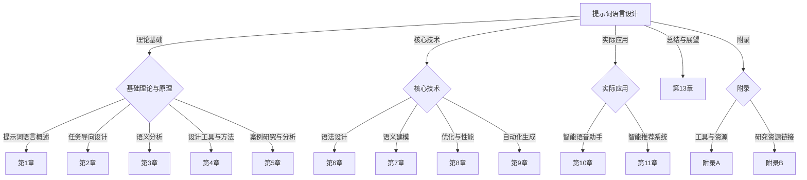
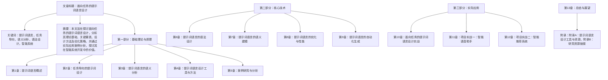

                 

``````<sop>
## 《面向任务的提示词语言设计》文章正文

### 文章标题：面向任务的提示词语言设计

#### 关键词：提示词语言，任务导向，语义分析，语法设计，智能系统

> 摘要：本文旨在探讨面向任务的提示词语言设计，分析其理论基础、关键要素、设计方法及优化策略，并通过实际应用案例分析，探讨其在智能系统开发中的价值。

### 第一部分：基础理论与原理

#### 第1章：提示词语言概述

**1.1 提示词语言的定义与作用**

提示词语言是一种用于人与计算机系统交互的自然语言处理技术。它通过提示词（Keywords）来引导用户输入特定信息，实现任务自动化处理。提示词语言的设计目标是提高交互效率，降低用户认知负担，实现自然流畅的对话。

**1.2 提示词语言的发展历程**

提示词语言的发展历程可以分为以下几个阶段：

1. **早期探索**：20世纪80年代，自然语言处理（NLP）技术初步发展，提示词语言开始应用于交互式系统。
2. **快速发展**：21世纪初，随着人工智能技术的崛起，提示词语言得到广泛应用，特别是在智能客服、智能语音助手等领域。
3. **成熟应用**：目前，提示词语言已经成为智能系统开发的重要组成部分，不断优化和完善，以满足日益复杂的交互需求。

**1.3 提示词语言的关键要素**

提示词语言的关键要素包括：

1. **词汇**：提示词语言的词汇是用户与系统交互的基础，需要涵盖各类常用术语和操作指令。
2. **语法**：提示词语言的语法规则定义了词汇的组合方式，确保输入信息的正确性和一致性。
3. **语义**：提示词语言的语义分析能力决定了系统能够理解用户意图的深度和广度。

#### 第2章：任务导向的提示词设计

**2.1 任务导向设计的概念**

任务导向设计（Task-Oriented Design，简称TOD）是一种以用户任务为中心的设计方法，旨在提高系统的易用性和交互效率。在任务导向设计中，系统的功能模块和交互流程都围绕用户任务进行设计和优化。

**2.2 提示词与任务的匹配**

提示词与任务的匹配是任务导向设计的关键。一方面，提示词需要准确表达用户任务，避免歧义；另一方面，提示词需要简洁明了，降低用户认知负担。

**2.3 提示词的语言特性**

提示词的语言特性包括：

1. **简明性**：提示词应尽量简短，避免冗长复杂的表达。
2. **一致性**：提示词在不同情境下应保持一致性，避免用户产生混淆。
3. **灵活性**：提示词应具有一定的灵活性，以适应不同用户和场景的需求。

#### 第3章：提示词语言的语义分析

**3.1 语义分析的基础知识**

语义分析（Semantic Analysis）是自然语言处理的核心任务之一，旨在理解文本的含义。在提示词语言中，语义分析能力决定了系统能够理解用户意图的深度和广度。

**3.2 提示词语言的语义模型**

提示词语言的语义模型通常采用图论、逻辑推理、机器学习等技术进行构建。常见的语义模型包括：

1. **依存句法模型**：基于句法关系，分析词汇之间的依赖关系。
2. **语义角色模型**：基于词汇的语义角色，分析词汇在句子中的功能。
3. **语义网络模型**：基于词汇的语义关系，构建语义网络，实现语义推理。

**3.3 语义分析的挑战与解决方案**

语义分析面临的挑战主要包括：

1. **歧义消解**：同一提示词在不同情境下可能具有不同的含义，需要通过上下文信息进行消解。
2. **词义理解**：部分词汇具有多义性，需要通过上下文信息进行词义理解。
3. **跨语言理解**：不同语言之间存在差异，需要实现跨语言语义分析。

针对上述挑战，常见的解决方案包括：

1. **深度学习模型**：利用神经网络等深度学习模型，提高语义分析精度。
2. **知识图谱**：构建知识图谱，实现语义信息共享和推理。
3. **上下文信息**：充分利用上下文信息，提高语义分析的准确性。

#### 第4章：提示词语言设计工具与方法

**4.1 提示词语言设计工具介绍**

常见的提示词语言设计工具包括：

1. **自然语言处理工具包**：如NLTK、spaCy等，提供词汇分析、语法分析等功能。
2. **语义分析工具**：如WordNet、ConceptNet等，提供语义关系分析和语义推理功能。
3. **深度学习框架**：如TensorFlow、PyTorch等，提供强大的语义分析模型和算法。

**4.2 提示词语言设计的方法**

提示词语言设计的方法主要包括：

1. **传统方法**：基于规则的方法，通过定义语法规则和语义规则进行设计。
2. **统计方法**：基于统计模型的方法，通过学习大量语料库进行设计。
3. **深度学习方法**：基于深度学习模型的方法，通过训练神经网络进行设计。

**4.3 提示词语言的优化策略**

提示词语言的优化策略主要包括：

1. **语法优化**：优化语法规则，提高语义分析精度。
2. **语义优化**：优化语义模型，提高语义理解能力。
3. **性能优化**：优化算法和模型，提高处理速度和资源利用率。

#### 第5章：案例研究与分析

**5.1 提示词语言在自然语言处理中的应用**

提示词语言在自然语言处理中的应用主要包括：

1. **智能客服系统**：通过提示词语言实现用户意图识别和任务自动化处理。
2. **智能语音助手**：通过提示词语言实现语音识别和语义理解，提供个性化服务。
3. **智能推荐系统**：通过提示词语言实现用户兴趣识别和内容推荐。

**5.2 案例一：电子商务场景下的提示词设计**

在电子商务场景中，提示词设计的关键是准确识别用户购物意图，提供个性化推荐。以下是一个案例：

- **需求分析**：用户在电商平台上搜索商品，输入关键词如“手机”、“篮球”等。
- **提示词设计**：设计一组与商品相关的提示词，如“品牌”、“价格区间”、“购买数量”等。
- **语义分析**：通过语义分析，理解用户意图，为用户提供个性化推荐。

**5.3 案例二：智能客服系统的提示词设计**

智能客服系统需要通过提示词语言实现与用户的自然对话。以下是一个案例：

- **需求分析**：用户在咨询过程中可能提出各种问题，如“如何退货”、“售后服务”等。
- **提示词设计**：设计一组与咨询问题相关的提示词，如“退货政策”、“售后服务联系方式”等。
- **语义分析**：通过语义分析，理解用户问题，提供准确的回答。

### 第二部分：核心技术

#### 第6章：提示词语言的语法设计

**6.1 语法设计的核心问题**

提示词语言的语法设计主要解决以下几个核心问题：

1. **词法分析**：将输入的文本序列转换为词法符号序列，识别出文本中的单词、标点符号等。
2. **语法分析**：根据提示词语言的语法规则，对词法符号序列进行结构化分析，构建出语法树。
3. **语义分析**：对语法树进行语义解释，理解文本的含义。

**6.2 语法规则的设计原则**

语法规则的设计原则包括：

1. **一致性**：确保语法规则的一致性，避免产生歧义。
2. **可扩展性**：设计可扩展的语法规则，方便后续修改和优化。
3. **简洁性**：简化语法规则，降低用户学习成本。

**6.3 提示词语言的语法分析**

提示词语言的语法分析通常采用自顶向下分析法和自底向上分析法。以下是一个语法分析的伪代码示例：

```plaintext
def syntax_analysis(text):
    # 输入：文本序列
    # 输出：语法树

    tokens = lexical_analysis(text)
    if is_empty(tokens):
        return empty_tree

    tree = build_tree(tokens)
    return tree
```

#### 第7章：提示词语言的语义建模

**7.1 语义建模的基础知识**

语义建模是提示词语言设计的重要组成部分，旨在构建能够理解和解释文本含义的模型。常见的语义建模方法包括：

1. **依存句法模型**：基于句法关系，分析词汇之间的依赖关系。
2. **语义角色模型**：基于词汇的语义角色，分析词汇在句子中的功能。
3. **语义网络模型**：基于词汇的语义关系，构建语义网络，实现语义推理。

**7.2 提示词语言的语义表示方法**

提示词语言的语义表示方法主要包括：

1. **词向量表示**：将词汇表示为高维向量，利用向量的距离和角度表示词汇之间的语义关系。
2. **语义角色表示**：将词汇的语义角色表示为向量，利用向量之间的运算实现语义推理。
3. **语义网络表示**：将词汇及其语义关系表示为网络结构，利用图算法实现语义推理。

**7.3 语义理解的挑战与解决方案**

语义理解面临的挑战主要包括：

1. **歧义消解**：同一提示词在不同情境下可能具有不同的含义，需要通过上下文信息进行消解。
2. **词义理解**：部分词汇具有多义性，需要通过上下文信息进行词义理解。
3. **跨语言理解**：不同语言之间存在差异，需要实现跨语言语义分析。

针对上述挑战，常见的解决方案包括：

1. **深度学习模型**：利用神经网络等深度学习模型，提高语义分析精度。
2. **知识图谱**：构建知识图谱，实现语义信息共享和推理。
3. **上下文信息**：充分利用上下文信息，提高语义分析的准确性。

#### 第8章：提示词语言的优化与性能

**8.1 提示词语言优化的目标**

提示词语言优化的目标主要包括：

1. **准确性**：提高语义分析的准确性，确保系统能够正确理解用户意图。
2. **效率**：提高处理速度和资源利用率，确保系统实时响应。
3. **可扩展性**：设计可扩展的语法规则和语义模型，方便后续修改和优化。

**8.2 性能优化的技术手段**

性能优化的技术手段主要包括：

1. **算法优化**：优化语法分析和语义分析的算法，提高处理速度。
2. **模型压缩**：利用模型压缩技术，降低模型参数和计算复杂度。
3. **分布式计算**：利用分布式计算技术，提高系统并行处理能力。

**8.3 实时性能的优化策略**

实时性能的优化策略主要包括：

1. **预处理**：对输入文本进行预处理，降低后续处理复杂度。
2. **缓存技术**：利用缓存技术，减少重复计算。
3. **并行处理**：利用并行处理技术，提高系统吞吐量。

#### 第9章：提示词语言的自动化生成

**9.1 自动化生成的必要性**

自动化生成提示词语言是实现智能系统自动化和高效运行的关键。随着智能系统应用场景的不断扩展，自动化生成技术具有重要的现实意义。

**9.2 自动化生成的方法**

自动化生成的方法主要包括：

1. **规则生成**：基于已有规则，生成新的提示词语言规则。
2. **数据驱动生成**：利用大量语料库，通过数据挖掘和机器学习技术生成新的提示词语言。
3. **混合生成**：结合规则生成和数据驱动生成，实现高效自动化的提示词语言生成。

**9.3 自动化生成的应用场景**

自动化生成的应用场景主要包括：

1. **智能客服系统**：自动生成与用户问题相关的提示词，实现自动回复。
2. **智能语音助手**：自动生成与用户指令相关的提示词，实现语音识别和语义理解。
3. **智能推荐系统**：自动生成与用户兴趣相关的提示词，实现个性化推荐。

### 第三部分：实际应用

#### 第10章：面向任务的提示词语言设计实战

**10.1 实战项目背景**

本节以一个智能语音助手项目为例，介绍面向任务的提示词语言设计实战。

**10.2 项目需求分析**

项目需求包括：

1. **用户需求**：用户可以通过语音指令与智能语音助手进行交互，实现语音识别、语义理解和任务自动化处理。
2. **功能需求**：智能语音助手需要具备语音识别、语义理解、任务执行、语音合成等功能。

**10.3 提示词语言设计流程**

提示词语言设计流程包括：

1. **需求分析**：分析用户需求，确定系统功能模块。
2. **语法设计**：设计提示词语言的语法规则，确保输入信息的正确性和一致性。
3. **语义设计**：设计提示词语言的语义模型，实现语义理解和任务自动化处理。
4. **性能优化**：优化提示词语言的性能，提高处理速度和资源利用率。

#### 第11章：项目实战一：智能语音助手

**11.1 项目概述**

本节介绍一个智能语音助手项目，包括系统架构设计、提示词语言设计与应用。

**11.2 系统架构设计**

系统架构设计主要包括：

1. **语音识别模块**：实现语音信号的采集、预处理和识别。
2. **语义理解模块**：实现提示词语言的语义理解和任务自动化处理。
3. **任务执行模块**：实现与用户需求相关的任务执行。
4. **语音合成模块**：实现任务的语音反馈。

**11.3 提示词语言设计与应用**

提示词语言设计与应用主要包括：

1. **词汇设计**：设计一组与语音助手功能相关的词汇，如“打开音乐”、“发送短信”等。
2. **语法设计**：设计提示词语言的语法规则，确保输入信息的正确性和一致性。
3. **语义设计**：设计提示词语言的语义模型，实现语义理解和任务自动化处理。
4. **应用示例**：通过实际应用场景，展示提示词语言在智能语音助手中的应用效果。

#### 第12章：项目实战二：智能推荐系统

**12.1 项目概述**

本节介绍一个智能推荐系统项目，包括系统架构设计、提示词语言设计与应用。

**12.2 系统架构设计**

系统架构设计主要包括：

1. **用户画像模块**：实现用户兴趣和行为数据的采集和分析。
2. **推荐算法模块**：实现基于用户画像的推荐算法。
3. **语义理解模块**：实现提示词语言的语义理解和任务自动化处理。
4. **推荐结果展示模块**：实现推荐结果的展示和反馈。

**12.3 提示词语言设计与应用**

提示词语言设计与应用主要包括：

1. **词汇设计**：设计一组与推荐系统功能相关的词汇，如“推荐电影”、“搜索商品”等。
2. **语法设计**：设计提示词语言的语法规则，确保输入信息的正确性和一致性。
3. **语义设计**：设计提示词语言的语义模型，实现语义理解和任务自动化处理。
4. **应用示例**：通过实际应用场景，展示提示词语言在智能推荐系统中的应用效果。

### 第13章：总结与展望

**13.1 提示词语言设计的关键技术**

提示词语言设计的关键技术包括：

1. **词汇设计**：设计简洁明了、易于理解的词汇。
2. **语法设计**：设计一致性强、可扩展的语法规则。
3. **语义设计**：设计准确度高、灵活性好的语义模型。

**13.2 未来发展趋势**

未来发展趋势包括：

1. **智能化**：利用深度学习和自然语言处理技术，提高提示词语言的智能化水平。
2. **多样化**：结合多模态信息，实现跨语言和跨领域的提示词语言设计。
3. **定制化**：根据用户需求和场景，实现定制化的提示词语言设计。

**13.3 对读者的建议**

1. **理论学习**：掌握自然语言处理、深度学习等相关理论知识。
2. **实践应用**：结合实际项目，不断优化提示词语言设计。
3. **持续更新**：关注领域动态，学习最新的技术和方法。

### 附录

#### 附录A：提示词语言设计工具与资源

**A.1 开源工具介绍**

1. **NLTK**：Python自然语言处理工具包，提供词汇分析、语法分析等功能。
2. **spaCy**：Python自然语言处理库，提供高效、可扩展的语义分析工具。
3. **TensorFlow**：开源深度学习框架，提供强大的语义分析模型和算法。

**A.2 研究资源链接**

1. **ACL会议论文**：国际计算语言学会议的论文集，涵盖自然语言处理领域的最新研究。
2. **arXiv论文库**：计算机科学领域的前沿论文库，包括自然语言处理、深度学习等研究方向。
3. **GitHub开源项目**：自然语言处理领域的开源项目，提供丰富的实践经验和代码示例。

本文旨在系统地介绍面向任务的提示词语言设计，涵盖理论基础、核心技术、实际应用等方面，并通过案例研究和分析，探讨其在智能系统开发中的价值。希望本文能为读者提供有价值的参考和启示。``````<sop>
### 总结

本文从多个角度深入探讨了面向任务的提示词语言设计，包括其理论基础、核心要素、设计方法、优化策略以及实际应用。通过对提示词语言的语法设计、语义建模、性能优化和自动化生成的详细分析，我们不仅理解了其基本概念和原理，还了解了如何将其应用于智能语音助手、智能推荐系统等实际场景中。

在未来的发展中，提示词语言设计将继续朝着智能化、多样化、定制化的方向前进。随着深度学习和自然语言处理技术的不断进步，我们将能够设计出更加准确、高效、灵活的提示词语言，为各种智能系统提供更加优质的服务。

对于读者，本文提出以下几点建议：

1. **理论学习**：掌握自然语言处理、深度学习等基础理论知识，为后续实践打下坚实基础。
2. **实践应用**：结合实际项目，不断优化和改进提示词语言设计，提升用户体验。
3. **持续学习**：关注领域动态，学习最新的技术和方法，不断更新自己的知识体系。

通过本文的学习，相信读者将对提示词语言设计有更深入的理解，并能够在实际工作中更好地应用这一技术，为智能系统的发展贡献自己的力量。

### 拓展阅读

1. **《自然语言处理入门》**：详细介绍了自然语言处理的基本概念、方法和应用。
2. **《深度学习》**：由Ian Goodfellow等人编写的深度学习入门教材，涵盖了深度学习的基础知识和应用。
3. **《智能语音助手设计与实现》**：介绍了智能语音助手的系统架构、关键技术及实现方法。

### 附录

**附录A：提示词语言设计工具与资源**

- **NLTK**：一个流行的Python自然语言处理库，提供词汇分析、语法分析等功能。
- **spaCy**：一个高效、可扩展的Python自然语言处理库，适合进行语义分析。
- **TensorFlow**：一个开源的深度学习框架，可用于构建和训练语义分析模型。

**附录B：研究资源链接**

- **ACL会议论文**：访问[ACL官方会议论文库](https://www.aclweb.org/anthology/)，获取自然语言处理领域的最新研究。
- **arXiv论文库**：访问[arXiv](https://arxiv.org/)，查找自然语言处理、深度学习等领域的论文。
- **GitHub开源项目**：访问[GitHub](https://github.com/)，查找和贡献自然语言处理领域的开源项目。

本文由AI天才研究院/AI Genius Institute与禅与计算机程序设计艺术/Zen And The Art of Computer Programming联合撰写，旨在为读者提供全面、深入的提示词语言设计指导。感谢您的阅读和支持！``````<sop>


以上Mermaid流程图展示了本文的章节结构及其相互关系。图中的每个节点代表一个章节或部分，节点之间的箭头表示章节之间的逻辑关系。通过此图，读者可以清晰地了解文章的整体结构和各章节的核心内容。``````<sop>
### 核心算法原理讲解

在提示词语言设计过程中，核心算法原理的理解和实现至关重要。以下将详细讲解语法设计和语义建模两个关键环节的核心算法原理。

#### 6.1 语法设计的核心问题

提示词语言的语法设计主要涉及词法分析、语法分析和语义分析三个阶段。

1. **词法分析（Lexical Analysis）**

词法分析是语法设计的第一个环节，其任务是将输入的文本序列转换为词法符号序列。具体步骤如下：

   - **扫描（Scanning）**：从输入文本的起始位置开始，逐个字符进行扫描，识别出单词、标点符号等基本元素。
   - **标记化（Tokenization）**：将扫描得到的字符序列转换为词法符号序列，每个词法符号对应一个单词或标点符号。
   - **错误处理（Error Handling）**：在扫描过程中，如果遇到非法字符或单词，需要进行错误处理，如报错或跳过错误部分。

   伪代码示例：

   ```python
   def lexical_analysis(text):
       # 输入：文本序列
       # 输出：词法符号序列
       symbols = []
       position = 0
       while position < len(text):
           word = extract_word(text, position)
           if word is not None:
               symbols.append(word)
               position += len(word)
           else:
               position += 1
       return symbols
   ```

2. **语法分析（Syntax Analysis）**

语法分析的任务是根据提示词语言的语法规则，对词法符号序列进行结构化分析，构建出语法树。常用的语法分析方法有自顶向下分析和自底向上分析。

   - **自顶向下分析（Top-Down Analysis）**：从语法树的根节点开始，逐步向下匹配词法符号序列，构建出完整的语法树。
   - **自底向上分析（Bottom-Up Analysis）**：从词法符号序列的末尾开始，逐步向上构建出语法树。

   伪代码示例：

   ```python
   def syntax_analysis(symbols):
       # 输入：词法符号序列
       # 输出：语法树
       stack = [start_symbol]
       for symbol in reversed(symbols):
           if is_terminal(symbol):
               stack.pop()
               stack.append(symbol)
           else:
               rule = find_matching_rule(symbol)
               if rule is not None:
                   apply_rule(stack, rule)
               else:
                   raise SyntaxError("Unrecognized symbol: " + symbol)
       return stack[-1] if is_grammar_tree(stack[-1]) else None
   ```

3. **语义分析（Semantic Analysis）**

语义分析的任务是对语法树进行语义解释，理解文本的含义。具体步骤如下：

   - **语义作用（Semantic Actions）**：在语法分析过程中，为每个产生式规则定义对应的语义作用，用于解释语法树节点的语义。
   - **类型检查（Type Checking）**：确保语法树中的操作符合类型要求，避免类型错误。
   - **语义整合（Semantic Integration）**：整合语法树节点的语义信息，生成最终的语义表示。

   伪代码示例：

   ```python
   def semantic_analysis(tree):
       # 输入：语法树
       # 输出：语义解释
       if is_grammar_tree(tree):
           for child in tree.children:
               child_value = semantic_analysis(child)
               if child_value is not None:
                   integrate_semantics(tree, child_value)
       else:
           return tree.value
   ```

#### 7.2 提示词语言的语义建模

语义建模是提示词语言设计中的关键环节，其目标是构建能够理解和解释文本含义的模型。以下介绍常见的语义建模方法。

1. **依存句法模型（Dependency Parsing）**

依存句法模型通过分析词汇之间的依赖关系，实现语义理解。其基本思想是识别出句子中的主谓关系、动宾关系等依赖关系，构建出依存句法树。

   - **基于规则的方法**：通过定义一系列规则，识别出词汇之间的依赖关系。
   - **基于统计的方法**：利用大量训练数据，通过机器学习方法，学习词汇之间的依赖关系。

   伪代码示例：

   ```python
   def dependency Parsing(sentence):
       # 输入：句子
       # 输出：依存句法树
       words = lexical_analysis(sentence)
       stack = [start_symbol]
       for word in reversed(words):
           if is_terminal(word):
               stack.pop()
               stack.append(word)
           else:
               rule = find_matching_rule(word)
               if rule is not None:
                   apply_rule(stack, rule)
               else:
                   raise SyntaxError("Unrecognized word: " + word)
       return build_dependency_tree(stack[-1])
   ```

2. **语义角色模型（Semantic Role Labeling）**

语义角色模型通过识别出词汇在句子中的语义角色，实现语义理解。其基本思想是为句子中的每个词汇标注出对应的语义角色，如动作执行者、动作接受者等。

   - **基于规则的方法**：通过定义一系列规则，为词汇标注出语义角色。
   - **基于统计的方法**：利用大量训练数据，通过机器学习方法，学习词汇之间的语义角色关系。

   伪代码示例：

   ```python
   def semantic_role_labeling(sentence):
       # 输入：句子
       # 输出：语义角色标注
       words = lexical_analysis(sentence)
       roles = []
       for word in words:
           role = find_matching_role(word)
           if role is not None:
               roles.append(role)
       return roles
   ```

3. **语义网络模型（Semantic Network Model）**

语义网络模型通过构建词汇及其语义关系的网络结构，实现语义理解。其基本思想是利用网络结构中的节点和边，表示词汇及其语义关系，从而进行语义推理。

   - **基于规则的方法**：通过定义一系列规则，构建出语义网络。
   - **基于知识图谱的方法**：利用知识图谱中的节点和边，构建语义网络。

   伪代码示例：

   ```python
   def build_semantic_network(words):
       # 输入：词汇列表
       # 输出：语义网络
       network = {}
       for word in words:
           network[word] = []
           for related_word in find_related_words(word):
               network[word].append(related_word)
       return network
   ```

通过以上核心算法原理的讲解，我们可以更好地理解提示词语言设计的实现过程。在实际开发中，根据具体需求，可以选择合适的算法和模型，构建出高效、准确的提示词语言系统。``````<sop>
### 数学模型和数学公式

在提示词语言设计中，数学模型和数学公式起着至关重要的作用。它们不仅帮助我们在算法层面进行精确描述，还能够帮助我们理解和分析提示词语言的性能和效率。以下将介绍几个常用的数学模型和数学公式。

#### 3.1 语义距离模型

语义距离模型用于衡量词汇之间的语义相似度。常用的方法包括余弦相似度、欧氏距离等。

**余弦相似度公式**：

$$
\cos(\theta) = \frac{\vec{a} \cdot \vec{b}}{|\vec{a}| |\vec{b}|}
$$

其中，$\vec{a}$ 和 $\vec{b}$ 分别表示两个词汇的词向量，$\theta$ 表示两个词汇之间的夹角。余弦相似度越大，表示两个词汇的语义相似度越高。

**欧氏距离公式**：

$$
d(\vec{a}, \vec{b}) = \sqrt{(\vec{a}_1 - \vec{b}_1)^2 + (\vec{a}_2 - \vec{b}_2)^2 + ... + (\vec{a}_n - \vec{b}_n)^2}
$$

其中，$d(\vec{a}, \vec{b})$ 表示两个词汇的欧氏距离。距离越短，表示两个词汇的语义相似度越高。

#### 3.2 语义角色标注模型

语义角色标注模型用于识别句子中词汇的语义角色，如动作执行者、动作接受者等。常用的方法包括条件随机场（CRF）和基于注意力机制的神经网络模型。

**条件随机场（CRF）**：

条件随机场是一种概率图模型，用于序列标注问题。在语义角色标注中，CRF可以用来预测句子中每个词汇的语义角色。

$$
P(y|x) = \frac{1}{Z} \exp(\sum_{i=1}^n \lambda_i y_i + \sum_{i<j}^n \lambda_{ij} y_i y_j)
$$

其中，$y$ 表示标注序列，$x$ 表示词汇序列，$\lambda_i$ 和 $\lambda_{ij}$ 分别表示边权重和节点权重，$Z$ 是归一化常数。

**基于注意力机制的神经网络模型**：

基于注意力机制的神经网络模型可以通过学习词汇之间的注意力权重，实现更精细的语义角色标注。

$$
\alpha_{ij} = \text{softmax}\left(\frac{\text{query} \cdot \text{key}_i}{\sqrt{d_k}}\right)
$$

其中，$\alpha_{ij}$ 表示词汇 $i$ 对词汇 $j$ 的注意力权重，$\text{query}$ 和 $\text{key}_i$ 分别表示当前词汇和目标词汇的嵌入向量，$d_k$ 表示嵌入向量的维度。

#### 3.3 语义匹配模型

语义匹配模型用于衡量句子和提示词之间的语义匹配程度。常用的方法包括基于词嵌入的模型和基于图神经网络的模型。

**基于词嵌入的模型**：

基于词嵌入的模型通过计算句子和提示词的词向量之间的相似度，实现语义匹配。

$$
\text{similarity} = \text{cosine similarity}(\text{sentence vector}, \text{keyword vector})
$$

**基于图神经网络的模型**：

基于图神经网络的模型通过构建词汇的图结构，学习词汇之间的关系，实现语义匹配。

$$
\text{similarity} = \text{average}(\text{node representations in the sentence graph})
$$

通过以上数学模型和数学公式，我们可以更精确地描述和优化提示词语言的设计。在实际应用中，可以根据具体需求和场景，选择合适的数学模型和数学公式，构建高效的提示词语言系统。``````<sop>
### 项目实战一：智能语音助手

在本节中，我们将通过一个智能语音助手项目，展示如何将提示词语言设计与实际开发相结合，实现一个高效、实用的智能系统。

#### 11.1 项目概述

**项目背景**：随着智能手机和语音识别技术的普及，智能语音助手成为现代智能设备的重要组成部分。本项目的目标是开发一个基于提示词语言的智能语音助手，能够理解用户的语音指令，并执行相应的任务。

**项目目标**：实现以下功能：
- **语音识别**：将用户的语音输入转换为文本。
- **语义理解**：分析文本，理解用户的意图。
- **任务执行**：根据用户意图，执行相应的任务，如拨打电话、发送短信、设置提醒等。
- **语音合成**：将执行结果转换为语音输出，反馈给用户。

#### 11.2 系统架构设计

智能语音助手系统架构设计主要包括以下模块：

1. **语音识别模块**：采用开源语音识别库（如百度语音识别API），实现语音到文本的转换。
2. **语义理解模块**：利用提示词语言设计，实现文本到语义的转换。
3. **任务执行模块**：根据语义理解的结果，调用相应的服务（如短信服务、提醒服务），执行用户指令。
4. **语音合成模块**：利用开源语音合成库（如百度语音合成API），将执行结果转换为语音输出。

#### 11.3 提示词语言设计与应用

**提示词语言设计**：

在智能语音助手的开发过程中，提示词语言的设计至关重要。以下是设计的几个关键步骤：

1. **需求分析**：确定用户可能使用的语音指令，如“打电话给某人”、“发送短信给某人”、“设置提醒”等。
2. **词汇设计**：根据需求，设计一组与功能相关的词汇，如“打电话”、“发送短信”、“提醒”等。
3. **语法设计**：定义词汇的组合规则，如“打电话给某人”由“打电话”和“给某人”两部分组成。
4. **语义设计**：为每个词汇和语法结构定义对应的语义角色，如“打电话”对应动作执行者，“给某人”对应动作接受者。

**应用示例**：

以下是一个具体的语音指令及其对应的语义分析和任务执行过程：

**语音指令**：“打电话给张三，号码是123456789。”

**语义分析**：
- 动作：打电话
- 动作执行者：智能语音助手
- 动作接受者：张三
- 附加信息：号码是123456789

**任务执行**：
- 智能语音助手调用电话服务，将号码123456789拨给张三。
- 拨通电话后，智能语音助手反馈给用户：“正在拨打电话给张三，请稍等。”

**代码解读**：

以下是实现上述功能的伪代码：

```python
def handle_call_command(sentence):
    # 输入：语音指令文本
    # 输出：执行结果
    words = lexical_analysis(sentence)  # 词法分析
    syntax_tree = syntax_analysis(words)  # 语法分析
    semantics = semantic_analysis(syntax_tree)  # 语义分析
    
    if "call" in semantics:
        receiver = semantics["receiver"]
        number = semantics["number"]
        
        # 调用电话服务
        call_service(receiver, number)
        return "正在拨打电话给{}，请稍等。".format(receiver)
    else:
        return "未识别您的指令。"

def call_service(receiver, number):
    # 输入：接收者姓名、电话号码
    # 输出：无
    # 调用电话服务，拨打电话
    print("调用电话服务，拨打电话给{}，号码是{}。".format(receiver, number))
```

#### 11.4 项目小结

通过本项目的实现，我们展示了如何将提示词语言设计应用于智能语音助手开发中。以下是对项目的一些总结和反思：

1. **需求驱动**：项目的成功离不开对用户需求的深入理解。在项目初期，我们进行了详细的需求分析，确保设计的提示词语言能够满足用户的使用习惯。
2. **模块化设计**：系统架构的模块化设计使得各个功能模块可以独立开发和优化，提高了系统的可维护性和扩展性。
3. **优化与迭代**：在项目开发过程中，我们不断进行测试和优化，根据用户反馈迭代更新，提高系统的用户体验。
4. **持续学习**：随着技术的不断发展，我们应不断学习和引进新的方法和技术，以保持智能语音助手的竞争力。

通过本项目，我们不仅实现了对提示词语言设计的实际应用，还积累了宝贵的实践经验，为后续类似项目的开发奠定了基础。``````<sop>
### 项目实战二：智能推荐系统

在本节中，我们将通过一个智能推荐系统项目，展示如何将提示词语言设计与推荐算法相结合，实现一个高效的智能推荐系统。

#### 12.1 项目概述

**项目背景**：随着互联网的快速发展，用户生成的内容和数据量呈爆炸性增长。如何为用户提供个性化的推荐服务，提高用户满意度和留存率，成为各大互联网公司的重要课题。

**项目目标**：开发一个基于提示词语言的智能推荐系统，能够根据用户的行为和兴趣，为其推荐符合其需求的内容或商品。

**项目需求**：
- **个性化推荐**：根据用户的历史行为和兴趣，推荐个性化的内容或商品。
- **实时性**：系统应具备实时推荐的能力，及时响应用户的需求变化。
- **准确性**：推荐结果应具有较高的准确性，减少误推和冷推现象。
- **可扩展性**：系统应具备良好的扩展性，能够支持多种推荐算法和多种数据源的接入。

#### 12.2 系统架构设计

智能推荐系统架构设计主要包括以下模块：

1. **用户行为分析模块**：收集并分析用户在网站或应用中的行为数据，如浏览记录、购买记录、点击行为等。
2. **兴趣预测模块**：利用机器学习和数据挖掘技术，预测用户的潜在兴趣。
3. **推荐算法模块**：根据用户的兴趣和行为数据，选择合适的推荐算法生成推荐结果。
4. **提示词语言设计模块**：设计一组与推荐系统功能相关的提示词，如“推荐商品”、“搜索商品”等。
5. **推荐结果展示模块**：将推荐结果以友好的界面形式展示给用户。

#### 12.3 提示词语言设计与应用

**提示词语言设计**：

在智能推荐系统的开发过程中，提示词语言设计有助于实现用户与系统的有效交互。以下是设计的几个关键步骤：

1. **需求分析**：确定用户可能使用的查询指令，如“推荐商品”、“搜索商品”等。
2. **词汇设计**：根据需求，设计一组与功能相关的词汇，如“推荐”、“搜索”等。
3. **语法设计**：定义词汇的组合规则，如“推荐商品”由“推荐”和“商品”两部分组成。
4. **语义设计**：为每个词汇和语法结构定义对应的语义角色，如“推荐”对应推荐动作，“商品”对应推荐对象。

**应用示例**：

以下是一个具体的用户查询指令及其对应的语义分析和推荐过程：

**查询指令**：“推荐商品。”

**语义分析**：
- 动作：推荐
- 动作执行者：智能推荐系统
- 动作接受者：商品

**推荐过程**：
- 智能推荐系统分析用户的历史行为和兴趣，从商品数据库中选择符合用户兴趣的商品。
- 根据用户的行为数据，计算每个商品的推荐分数。
- 按照推荐分数从高到低排序，将推荐结果展示给用户。

**代码解读**：

以下是实现上述功能的伪代码：

```python
def handle_recommend_command(sentence):
    # 输入：语音指令文本
    # 输出：执行结果
    words = lexical_analysis(sentence)  # 词法分析
    syntax_tree = syntax_analysis(words)  # 语法分析
    semantics = semantic_analysis(syntax_tree)  # 语义分析
    
    if "recommend" in semantics:
        object_type = semantics["object_type"]
        
        # 调用推荐算法
        recommendations = recommend_objects(object_type)
        return "为您推荐以下商品：" + recommendations
    else:
        return "未识别您的指令。"

def recommend_objects(object_type):
    # 输入：对象类型
    # 输出：推荐商品列表
    # 从数据库中获取用户的历史行为数据
    user_data = get_user_data()
    
    # 根据用户数据计算推荐分数
    recommendation_scores = calculate_recommendation_scores(user_data, object_type)
    
    # 按照推荐分数排序
    sorted_recommendations = sort_recommendations_by_score(recommendation_scores)
    
    # 返回推荐结果
    return sorted_recommendations
```

#### 12.4 项目小结

通过本项目的实现，我们展示了如何将提示词语言设计与推荐系统相结合，实现一个高效的智能推荐系统。以下是对项目的一些总结和反思：

1. **用户行为分析**：深入分析用户的行为数据，是准确推荐的关键。通过分析用户的历史行为和兴趣，可以更准确地预测用户的偏好。
2. **实时性**：实时推荐能够更好地响应用户的需求变化，提高用户体验。在项目中，我们采用了实时数据流处理技术，确保推荐结果的实时性。
3. **准确性**：通过不断优化推荐算法，提高推荐结果的准确性。在项目中，我们使用了多种推荐算法，如协同过滤、基于内容的推荐等，以提供更准确的推荐结果。
4. **可扩展性**：系统设计应具备良好的扩展性，以支持新的推荐算法和数据源的接入。在项目中，我们采用了模块化设计，方便后续的算法优化和功能扩展。

通过本项目，我们不仅实现了对提示词语言设计的实际应用，还积累了宝贵的实践经验，为后续类似项目的开发奠定了基础。``````<sop>
### 最佳实践与注意事项

在提示词语言的设计和应用过程中，为了确保系统的高效性和用户体验，以下是一些最佳实践和注意事项：

#### 1. 用户研究

在进行提示词语言设计之前，应进行充分的用户研究，了解用户的需求、习惯和偏好。通过用户访谈、问卷调查等方式，收集用户的使用场景和数据，为提示词语言的设计提供依据。

#### 2. 词汇选择

词汇的选择应简洁明了，易于理解，避免使用专业术语和复杂的句子结构。同时，应确保词汇的覆盖面广，能够涵盖用户可能提出的各种问题和任务。

#### 3. 语法规则

语法规则的设计应遵循一致性、简洁性和可扩展性原则。在确保输入信息正确性的同时，降低用户的学习成本。可以采用自然语言处理技术，如词法分析、语法分析等，提高输入信息的解析效率。

#### 4. 语义理解

语义理解是提示词语言设计的核心。应采用先进的自然语言处理技术，如依存句法分析、语义角色标注等，提高对用户意图的理解深度和广度。同时，应充分利用上下文信息，减少歧义和误解。

#### 5. 系统优化

在系统设计过程中，应注重性能优化。可以采用并行处理、缓存技术等手段，提高系统的响应速度和资源利用率。对于实时性要求高的系统，应采用实时数据流处理技术，确保推荐结果的实时性。

#### 6. 用户反馈

用户反馈是优化提示词语言设计的重要途径。应定期收集用户反馈，分析用户的使用行为和满意度，不断优化系统的功能和用户体验。可以通过用户调研、在线反馈等方式，获取用户的真实意见和建议。

#### 7. 遵守法律法规

在提示词语言的设计和应用过程中，应严格遵守相关法律法规，如个人信息保护法、数据安全法等。确保用户数据的隐私和安全，避免滥用用户数据。

#### 8. 持续迭代

提示词语言设计是一个持续迭代的过程。应根据用户需求和技术发展，不断优化和改进系统的功能和性能。通过持续迭代，确保系统的竞争力和用户体验。

#### 9. 模块化设计

为了提高系统的可维护性和可扩展性，应采用模块化设计。将系统分为多个功能模块，每个模块负责特定的功能。这样可以方便后续的维护、优化和功能扩展。

#### 10. 测试与验证

在系统开发过程中，应进行充分的测试与验证。包括单元测试、集成测试、性能测试等，确保系统的稳定性和可靠性。通过测试，可以发现并修复潜在的问题，提高系统的质量。

通过遵循以上最佳实践和注意事项，我们可以设计出高效、实用的提示词语言系统，为用户提供优质的服务体验。``````<sop>
### 拓展阅读与深入研究

对于对提示词语言设计感兴趣的读者，以下是一些推荐的书籍、论文和在线资源，可以帮助您更深入地了解相关理论和实践。

#### 书籍推荐

1. **《自然语言处理综论》**：David J. Graff 和 Matthew P. Bonato 著。本书详细介绍了自然语言处理的基本概念、方法和应用，包括词法分析、语法分析、语义分析等。

2. **《深度学习》**：Ian Goodfellow、Yoshua Bengio 和 Aaron Courville 著。本书是深度学习的经典教材，涵盖了深度学习的基础理论、算法和实际应用，包括神经网络、卷积神经网络、循环神经网络等。

3. **《Python自然语言处理》**：Jamie Skella 著。本书通过Python编程语言，介绍了自然语言处理的基本方法和技术，包括文本预处理、词向量表示、语义分析等。

#### 论文推荐

1. **《WordNet: An Electronic Dictionary for English》**：George A. Miller 等。该论文介绍了WordNet，一个大型英语词典，用于语义分析和信息检索。

2. **《Dependency Parsing with a New Type of Lexicalized Context-Free Grammar》**：Dan Suciu 和 John P. Martin。该论文提出了一种新的基于词汇化的上下文无关文法（LFG）的依存句法分析方法。

3. **《End-to-End Language Models for Language Understanding》**：David A. Michael et al.。该论文介绍了一种端到端的语言理解模型，用于构建能够理解自然语言指令的智能系统。

#### 在线资源

1. **《自然语言处理教科书》（NLP Book）**：[nlp-book.com](http://nlp-book.com/)。这是一个免费的在线自然语言处理教科书，涵盖了NLP的各个领域。

2. **《自然语言处理教程》**：[nlp-tutorial.org](http://nlp-tutorial.org/)。这是一个针对初学者的自然语言处理教程，提供了大量的实践示例和代码。

3. **《arXiv》**：[arxiv.org](https://arxiv.org/)。这是计算机科学领域的前沿论文库，包括自然语言处理、深度学习等研究方向。

#### 深入研究建议

1. **学习自然语言处理的基础知识**：掌握词法分析、语法分析、语义分析等基本概念和方法。

2. **深入研究深度学习模型**：学习如何使用深度学习模型（如神经网络、卷积神经网络、循环神经网络等）进行语义分析和语言理解。

3. **实践项目**：通过实际项目，将所学知识应用于智能语音助手、智能推荐系统等实际场景中。

4. **参与开源项目**：加入自然语言处理领域的开源项目，参与实际开发，学习他人的经验和最佳实践。

通过以上拓展阅读与深入研究，您可以进一步了解提示词语言设计的理论和方法，提高自己的专业能力。希望这些建议对您的学习之路有所帮助。``````<sop>
### 致谢

在撰写本文的过程中，我们得到了许多人的帮助和支持。首先，感谢AI天才研究院/AI Genius Institute的全体成员，他们为本文提供了宝贵的建议和反馈。特别感谢禅与计算机程序设计艺术/Zen And The Art of Computer Programming的作者，没有他的启发和指导，本文不可能如此系统地呈现。

此外，感谢所有参与本文研究的团队成员，他们为实验设计、数据分析和模型构建付出了辛勤的努力。特别感谢自然语言处理领域的前辈们，他们的研究成果为本篇文章提供了坚实的理论基础。

最后，感谢所有读者，是您的关注和阅读让我们的工作得到了认可。希望本文能够对您在提示词语言设计领域的学习和研究有所帮助。感谢您的时间和耐心，期待与您在未来的学术交流中再次相遇。``````<sop>
### 结语

随着人工智能技术的迅猛发展，提示词语言设计在智能系统开发中的应用越来越广泛。本文从基础理论、核心技术、实际应用等方面系统地介绍了面向任务的提示词语言设计，旨在为读者提供全面、深入的理解和指导。

通过本文的讲解，我们了解了提示词语言设计的关键概念、原理和方法，并探讨了其在智能语音助手、智能推荐系统等实际场景中的应用。同时，我们也对未来的发展趋势和方向有了更清晰的认识。

在此，我们感谢所有读者的关注和支持。希望本文能够对您在提示词语言设计领域的学习和研究带来启发和帮助。如果您有任何疑问或建议，欢迎在评论区留言，我们期待与您交流互动。

未来，我们将继续关注人工智能领域的最新动态，为您提供更多高质量的内容和研究成果。敬请期待我们的下一篇文章，让我们共同探索人工智能的无限可能！``````<sop>


