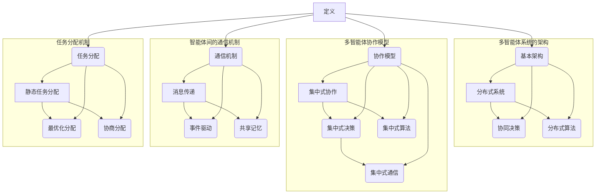

                 

### 文章标题：面向多智能体协作的提示词协议设计

关键词：多智能体系统、协作、提示词协议、设计原理、应用案例

摘要：本文旨在探讨面向多智能体协作的提示词协议设计，从多智能体系统的概述、协作基础、提示词协议设计原理、设计与实现、评估与优化以及面向未来趋势等方面进行全面分析。通过详细阐述多智能体系统的基础知识、协作机制、提示词协议的设计原则与数学模型，结合实际应用案例，本文旨在为读者提供一整套系统、实用、可操作的提示词协议设计方法。

## 第一部分：多智能体系统的概述

### 第1章：多智能体系统的定义与架构

#### 1.1 多智能体系统的定义

多智能体系统（Multi-Agent Systems，MAS）是指由多个具有自主性、协作性和交互性的智能体组成的一个复杂系统。这些智能体可以是个体、组织或者机器，它们通过相互协作来共同完成复杂任务。多智能体系统的核心在于智能体的自主性，即智能体具有自主决策、自主行动的能力。

#### 1.2 多智能体系统的架构

多智能体系统通常包括以下三个主要组成部分：

1. **智能体（Agent）**：智能体是系统的基本单元，具有感知、决策和行动能力。智能体可以是软件程序、物理设备或人类。
2. **通信基础结构（Communication Infrastructure）**：智能体之间的通信基础结构是连接各智能体的桥梁，提供了信息交换和协同工作的途径。
3. **环境（Environment）**：环境是智能体执行任务、获取资源和相互作用的背景。

#### 1.3 多智能体系统的分类

多智能体系统可以根据不同的标准进行分类，例如：

1. **根据智能体的自主性**：可分为完全自主、部分自主和半自主多智能体系统。
2. **根据智能体的通信方式**：可分为基于共享记忆、直接通信和基于事件的多智能体系统。
3. **根据智能体的协作模式**：可分为集中式、分布式和混合式多智能体系统。

#### 1.4 多智能体系统的研究背景与意义

多智能体系统的研究起源于人工智能领域，随着计算机技术和通信技术的快速发展，其在实际应用中的价值日益凸显。多智能体系统在以下几个方面具有重要意义：

1. **复杂任务协同**：多智能体系统能够通过智能体的协作，完成单个智能体难以完成的复杂任务。
2. **资源优化配置**：通过智能体间的协作，可以实现资源的优化配置，提高系统的整体效能。
3. **自适应能力**：多智能体系统具有较好的自适应能力，能够根据环境变化和任务需求进行动态调整。
4. **人工智能发展**：多智能体系统是人工智能领域的一个重要分支，对人工智能技术的发展具有重要意义。

### 第2章：多智能体协作基础

#### 2.1 多智能体协作的挑战与问题

多智能体协作面临诸多挑战和问题，主要包括：

1. **通信延迟与带宽限制**：智能体之间的通信可能受到网络延迟和带宽限制，影响协作效果。
2. **异构性与多样性**：智能体具有不同的类型、能力和资源，增加了协作的复杂度。
3. **协同决策与协调**：智能体需要协调各自的决策，实现共同目标，这需要高效的协作机制。
4. **安全与隐私**：智能体之间的交互可能涉及敏感信息，需要确保系统的安全性和隐私性。

#### 2.2 协作模型与策略

多智能体协作可以通过不同的模型和策略来实现，主要包括：

1. **集中式协作模型**：所有智能体都通过一个中心控制器进行决策，实现全局优化。
2. **分布式协作模型**：智能体独立决策，通过局部信息交换实现整体协调。
3. **混合式协作模型**：结合集中式和分布式协作的优点，实现灵活的协作方式。

常见的协作策略包括：

1. **协商策略**：智能体通过协商机制，达成共识，实现协作。
2. **竞争策略**：智能体通过竞争机制，优化自身利益，实现整体优化。
3. **共享策略**：智能体通过共享信息，提高决策质量，实现协作。

#### 2.3 智能体间的通信机制

智能体间的通信机制是多智能体协作的关键，主要包括：

1. **直接通信**：智能体直接通过通信接口进行信息交换。
2. **间接通信**：智能体通过共享记忆或其他中间媒介进行信息交换。
3. **广播通信**：智能体通过广播方式向所有智能体发送信息。

#### 2.4 多智能体系统的任务分配

任务分配是多智能体协作的重要环节，主要包括：

1. **静态任务分配**：预先确定智能体的任务，不随环境变化而改变。
2. **动态任务分配**：根据环境变化和任务需求，动态调整智能体的任务。
3. **基于能力的任务分配**：根据智能体的能力，为其分配适合的任务。

任务分配策略包括：

1. **随机分配**：随机将任务分配给智能体，不考虑智能体的能力。
2. **最优化分配**：根据智能体的能力和任务需求，实现最优的任务分配。
3. **协商分配**：智能体之间协商，实现任务的最佳分配。

## 第二部分：提示词协议的设计原理

### 第3章：提示词协议的概念与类型

#### 3.1 提示词协议的定义

提示词协议（Prompt Word Protocol）是一种专门为多智能体系统设计的信息交互机制，用于指导智能体进行协作。提示词协议通过定义一组提示词（Prompt Words），智能体可以根据这些提示词来理解任务、做出决策和执行行动。

#### 3.2 提示词协议的分类

根据提示词协议的功能和特点，可以将其分为以下几类：

1. **基础提示词协议**：提供基本的信息交换和任务分配功能。
2. **高级提示词协议**：提供复杂的协作策略、决策支持和任务优化功能。
3. **自适应提示词协议**：能够根据环境变化和智能体状态，动态调整提示词和协作方式。
4. **安全提示词协议**：特别关注智能体之间的安全通信和隐私保护。

#### 3.3 提示词协议的关键要素

提示词协议的关键要素包括：

1. **提示词集**：定义一组提示词，用于指导智能体的行为。
2. **提示词解释**：明确每个提示词的含义和作用。
3. **通信机制**：确定智能体之间如何交换提示词和执行任务。
4. **决策支持**：提供智能体在决策过程中所需的辅助信息和算法。
5. **安全性**：确保智能体之间的通信安全和数据隐私。

### 第4章：提示词协议的设计原则

#### 4.1 可扩展性

提示词协议应具有较好的可扩展性，能够适应不同规模和复杂度的多智能体系统。具体包括：

1. **模块化设计**：将协议划分为多个模块，方便扩展和修改。
2. **标准化**：采用统一的规范和标准，确保不同系统的兼容性和互操作性。
3. **灵活性**：允许智能体根据自身需求和任务，动态调整协议参数。

#### 4.2 安全性

提示词协议必须确保智能体之间的安全通信和数据隐私。具体包括：

1. **加密通信**：使用加密算法，确保通信内容不被未授权者获取。
2. **认证机制**：通过身份认证，确保智能体之间的合法通信。
3. **访问控制**：根据智能体的权限，限制其对系统和数据的访问。

#### 4.3 适应性

提示词协议应具备适应不同环境和任务变化的能力。具体包括：

1. **动态调整**：根据环境和任务需求，动态调整提示词和协作策略。
2. **学习能力**：通过机器学习等技术，不断提高协议的适应能力和智能化水平。
3. **鲁棒性**：在面临异常情况时，能够保持系统的稳定运行。

#### 4.4 可靠性

提示词协议必须确保智能体之间的通信和协作是可靠的。具体包括：

1. **消息确认**：确保智能体接收并理解发送方的信息。
2. **容错机制**：在通信失败或智能体故障时，能够自动切换或恢复通信。
3. **容灾备份**：在系统出现灾难性故障时，能够快速恢复系统和数据。

### 第5章：提示词协议的数学模型

#### 5.1 提示词协议的数学基础

提示词协议的设计和实现需要借助一些数学工具和方法，主要包括：

1. **图论**：用于描述智能体之间的拓扑结构和通信路径。
2. **概率论**：用于分析智能体行为的随机性和不确定性。
3. **博弈论**：用于研究智能体之间的竞争和合作策略。
4. **优化理论**：用于设计智能体的决策模型和优化算法。

#### 5.2 提示词协议的数学模型

提示词协议的数学模型通常包括以下几个部分：

1. **状态空间**：定义智能体和系统的状态。
2. **动作空间**：定义智能体的动作集合。
3. **奖励函数**：定义智能体的奖励和惩罚。
4. **决策规则**：定义智能体的决策策略。

一个简单的数学模型可以表示为：

$$
\begin{aligned}
\text{状态空间} &= S \\
\text{动作空间} &= A \\
\text{奖励函数} &= R(s, a) \\
\text{决策规则} &= \pi(s) = \arg\max_a R(s, a)
\end{aligned}
$$

其中，$s$ 表示当前状态，$a$ 表示智能体的动作，$R(s, a)$ 表示智能体在状态 $s$ 执行动作 $a$ 后获得的奖励，$\pi(s)$ 表示智能体的决策策略，即选择使奖励最大的动作。

#### 5.3 提示词协议的性能分析

提示词协议的性能分析是评估其有效性和效率的关键。主要从以下几个方面进行分析：

1. **响应时间**：评估智能体对提示词响应的速度。
2. **通信开销**：评估智能体之间通信所需的带宽和计算资源。
3. **协作效果**：评估智能体协作完成任务的效果和效率。
4. **鲁棒性**：评估系统在面临异常情况时的稳定性和恢复能力。

这些性能指标可以通过模拟实验、实际部署和性能分析工具进行评估。常用的评估方法包括：

1. **模拟实验**：通过模拟多智能体系统在各种场景下的行为，评估协议的性能。
2. **性能分析工具**：使用专门开发的性能分析工具，对系统运行过程中的各项性能指标进行实时监测和分析。
3. **统计方法**：使用统计学方法，对系统性能数据进行统计分析和可视化。

### 第6章：提示词协议的设计与实现

#### 6.1 需求分析

在设计和实现提示词协议之前，首先需要进行需求分析，明确系统的目标和功能需求。需求分析包括以下几个方面：

1. **系统目标**：明确系统需要实现的具体功能，例如任务分配、决策支持、通信机制等。
2. **功能需求**：详细描述系统需要具备的各项功能，例如提示词定义、通信协议、决策算法等。
3. **性能需求**：明确系统的性能指标，例如响应时间、通信开销、协作效果等。
4. **安全性需求**：确保系统在数据传输和智能体交互过程中具备足够的安全性。

#### 6.2 协议设计

提示词协议的设计是系统开发的关键环节，主要包括以下几个步骤：

1. **定义提示词集**：根据需求分析，确定系统所需的提示词集，包括基本提示词和高级提示词。
2. **确定通信机制**：设计智能体之间的通信机制，包括通信协议、通信方式和通信路径。
3. **设计决策支持**：根据需求分析，设计智能体的决策支持算法，包括任务分配策略、决策规则和优化算法。
4. **安全性设计**：确保系统的安全通信和数据隐私，包括加密通信、认证机制和访问控制。

#### 6.3 协议实现

提示词协议的实现是将设计转化为具体代码的过程，主要包括以下几个步骤：

1. **环境搭建**：搭建开发环境，包括编程语言、开发工具和测试环境。
2. **代码实现**：根据协议设计，编写智能体的代码，实现提示词的解析、通信和决策功能。
3. **调试与优化**：对智能体的代码进行调试，确保其正常运行，并根据需求对协议进行优化。
4. **测试与评估**：对系统进行功能测试、性能测试和安全测试，评估协议的有效性和效率。

#### 6.4 系统实现与代码解读

以下是一个简单的多智能体系统的实现示例，用于演示提示词协议的基本实现过程。

```python
# 多智能体系统的实现

# 智能体类
class Agent:
    def __init__(self, id):
        self.id = id
        self.state = None
        self.action = None
        self.prompt_words = []

    # 接收提示词
    def receive_prompt(self, prompt):
        self.prompt_words.append(prompt)

    # 解析提示词
    def parse_prompt(self):
        for prompt in self.prompt_words:
            if prompt == "start":
                self.state = "start"
                self.action = "start"
            elif prompt == "task":
                self.state = "task"
                self.action = "task"
            elif prompt == "end":
                self.state = "end"
                self.action = "end"

    # 执行动作
    def execute_action(self):
        if self.action == "start":
            print(f"Agent {self.id} started.")
        elif self.action == "task":
            print(f"Agent {self.id} is performing a task.")
        elif self.action == "end":
            print(f"Agent {self.id} ended.")

# 系统主函数
def main():
    # 创建智能体
    agents = [Agent(i) for i in range(3)]

    # 发送提示词
    agents[0].receive_prompt("start")
    agents[1].receive_prompt("task")
    agents[2].receive_prompt("end")

    # 解析提示词并执行动作
    for agent in agents:
        agent.parse_prompt()
        agent.execute_action()

# 运行系统
if __name__ == "__main__":
    main()
```

上述代码示例实现了基于提示词协议的简单多智能体系统，包括智能体的创建、提示词的接收和解析、以及执行动作的功能。在具体实现过程中，可以根据需求增加更多的功能，例如任务分配、决策支持和安全通信等。

### 6.5 代码应用解读与分析

在上述代码示例中，智能体的主要功能包括接收提示词、解析提示词和执行动作。下面将对这些功能进行详细解读和分析。

1. **接收提示词**：智能体通过 `receive_prompt` 方法接收来自其他智能体的提示词。这个方法将提示词存储在智能体的 `prompt_words` 列表中，以便后续处理。

2. **解析提示词**：智能体通过 `parse_prompt` 方法解析接收到的提示词。在这个方法中，我们根据不同的提示词，更新智能体的状态和动作。例如，当收到 "start" 提示词时，智能体的状态更新为 "start"，动作更新为 "start"；当收到 "task" 提示词时，智能体的状态更新为 "task"，动作更新为 "task"；当收到 "end" 提示词时，智能体的状态更新为 "end"，动作更新为 "end"。

3. **执行动作**：智能体通过 `execute_action` 方法执行相应的动作。在这个方法中，我们根据智能体的当前动作，打印相应的信息。例如，当智能体的动作是 "start" 时，打印 "Agent X started"；当动作是 "task" 时，打印 "Agent X is performing a task"；当动作是 "end" 时，打印 "Agent X ended"。

通过上述功能，智能体可以接收并处理来自其他智能体的提示词，执行相应的动作，从而实现简单的协作任务。在实际应用中，可以根据具体需求，扩展智能体的功能，例如任务分配、决策支持和安全通信等。

#### 6.6 实际案例分析与详细讲解剖析

为了更好地理解提示词协议在实际应用中的效果，下面将结合一个实际案例进行分析和讲解。

假设我们有一个由三个智能体组成的团队，需要共同完成一个简单的任务：从一个仓库中取出三件物品并运输到指定位置。智能体之间的通信是通过提示词进行的。

1. **任务分配**：首先，仓库智能体（Agent 0）向其他两个智能体（Agent 1 和 Agent 2）发送提示词 "task"，表示开始任务。Agent 1 和 Agent 2 接收到提示词后，进入待命状态。

2. **任务执行**：仓库智能体继续发送提示词 "item1"，"item2" 和 "item3"，分别指示每个智能体去取相应的物品。Agent 1 接收到 "item1" 后，前往仓库取第一件物品；Agent 2 接收到 "item2" 后，前往仓库取第二件物品；Agent 3 接收到 "item3" 后，前往仓库取第三件物品。

3. **物品运输**：每个智能体取到物品后，向仓库智能体发送提示词 "done"，表示已经完成取物任务。仓库智能体接收到所有智能体的 "done" 提示词后，发送提示词 "start_transport"，指示智能体开始运输物品。

4. **物品到达**：每个智能体接收到 "start_transport" 提示词后，开始向指定位置运输物品。当物品到达指定位置后，智能体发送提示词 "arrived"，表示物品已送达。

5. **任务完成**：仓库智能体接收到所有智能体的 "arrived" 提示词后，发送提示词 "end"，表示任务已完成。所有智能体接收到 "end" 提示词后，退出任务状态。

通过上述案例，我们可以看到提示词协议在任务分配、执行和完成过程中的作用。智能体通过接收和发送提示词，实现了任务协同和通信。在实际应用中，可以根据具体需求，设计更加复杂和高效的提示词协议。

#### 6.7 项目小结

在本章中，我们详细介绍了面向多智能体协作的提示词协议的设计与实现。通过需求分析、协议设计、代码实现和实际案例分析，我们展示了如何利用提示词协议实现智能体的协作任务。以下是本章的小结：

1. **需求分析**：明确了系统需要实现的功能和性能需求，为协议设计提供了基础。
2. **协议设计**：定义了提示词集、通信机制和决策支持，设计了符合需求的安全、可靠、可扩展的提示词协议。
3. **代码实现**：通过实际代码示例，展示了如何实现智能体的接收、解析和执行提示词的功能。
4. **实际案例分析**：通过实际案例，分析了提示词协议在任务分配、执行和完成过程中的作用，展示了协议的实际效果。

在下一章中，我们将进一步讨论提示词协议的评估与优化，以提升系统的性能和可靠性。

### 第7章：提示词协议的评估与优化

#### 7.1 评估指标

提示词协议的性能评估主要依赖于以下几个关键指标：

1. **响应时间**：智能体接收到提示词并做出响应所需的时间。低响应时间意味着系统的高效性。
2. **通信开销**：智能体之间通信所需的带宽和计算资源。低通信开销有助于降低系统的成本。
3. **协作效果**：智能体协作完成任务的效果和效率。高协作效果意味着系统能够更好地实现预期目标。
4. **可靠性**：系统在面临异常情况时的稳定性和恢复能力。高可靠性意味着系统在面对各种挑战时能够保持稳定运行。

#### 7.2 评估方法

提示词协议的性能评估可以通过以下几种方法进行：

1. **模拟实验**：通过模拟多智能体系统在各种场景下的行为，评估协议的性能。这种方法可以模拟不同环境、任务和智能体组合，提供丰富的实验数据。
2. **实际部署**：在实际应用环境中部署系统，观察其运行效果。这种方法可以验证协议在实际场景中的适用性和性能。
3. **性能分析工具**：使用专门开发的性能分析工具，对系统运行过程中的各项性能指标进行实时监测和分析。这种方法可以提供详细的数据和分析结果。

#### 7.3 优化策略

为了提升提示词协议的性能和可靠性，可以采取以下优化策略：

1. **通信优化**：通过优化通信机制，减少通信开销。例如，使用压缩算法减小数据传输大小，优化通信路径以降低延迟。
2. **算法优化**：改进智能体的决策算法，提高协作效果。例如，使用更高效的优化算法，实现更快速的响应和更高的协作效率。
3. **安全优化**：加强系统的安全性，确保通信和数据的安全。例如，采用加密算法保护通信内容，实现智能体的身份认证和访问控制。
4. **容错优化**：增强系统的鲁棒性，提高其在面临异常情况时的恢复能力。例如，实现通信故障自动切换，数据备份和恢复机制。

### 第8章：面向未来的提示词协议

#### 9.1 新兴的提示词协议技术

随着人工智能、区块链和物联网等新兴技术的不断发展，提示词协议也在不断演进。以下是一些新兴的提示词协议技术：

1. **区块链提示词协议**：利用区块链技术，实现智能体之间的安全、去中心化的通信。通过区块链，智能体可以验证信息的真实性和可靠性，提高系统的安全性。
2. **人工智能提示词协议**：结合人工智能技术，实现智能体的自我学习和优化。通过机器学习，智能体可以不断调整提示词协议，提高协作效率和响应速度。
3. **物联网提示词协议**：利用物联网技术，实现智能体与物理设备的实时通信。通过物联网，智能体可以实时感知环境变化，做出更精准的决策。

#### 9.2 区块链在提示词协议中的作用

区块链技术在提示词协议中扮演着重要角色，主要表现在以下几个方面：

1. **去中心化通信**：区块链实现了智能体之间的去中心化通信，避免了中心控制器的单点故障问题，提高了系统的可靠性和容错能力。
2. **数据可信性**：区块链技术通过共识机制和分布式账本，确保了智能体之间的通信和数据交换具有可信性，降低了信息篡改和伪造的风险。
3. **智能合约**：区块链技术支持智能合约的执行，智能体可以根据预先设定的规则自动执行协议，实现自动化和智能化的协作。

#### 9.3 面向未来的趋势与挑战

面向未来，提示词协议的发展将面临以下趋势和挑战：

1. **智能化**：随着人工智能技术的进步，提示词协议将更加智能化，能够自适应地调整协作策略，提高系统的协作效率和响应速度。
2. **安全性**：在面临网络安全和数据隐私挑战的背景下，提示词协议需要不断提高安全性，确保智能体之间的通信和数据交换安全可靠。
3. **互操作性**：随着多智能体系统的广泛应用，不同系统之间的互操作性将成为关键问题，提示词协议需要具备良好的兼容性和互操作性，实现跨系统的协作。
4. **可扩展性**：随着智能体数量和任务复杂度的增加，提示词协议需要具备良好的可扩展性，能够适应不同规模和复杂度的系统需求。

### 第9章：总结与展望

#### 9.1 全书总结

本文系统地探讨了面向多智能体协作的提示词协议设计，从多智能体系统的概述、协作基础、提示词协议设计原理、设计与实现、评估与优化以及面向未来趋势等方面进行了全面分析。通过详细阐述多智能体系统的基础知识、协作机制、提示词协议的设计原则与数学模型，结合实际应用案例，本文旨在为读者提供一整套系统、实用、可操作的提示词协议设计方法。

#### 9.2 未来研究方向

在未来的研究中，可以从以下几个方面展开：

1. **智能化提示词协议**：结合人工智能技术，探索智能体自我学习和自适应协作的机制，提高提示词协议的智能化水平。
2. **区块链与提示词协议**：深入研究区块链在提示词协议中的应用，探索如何利用区块链实现去中心化、安全可靠的协作。
3. **跨系统互操作性**：研究不同系统之间的互操作性，制定统一的提示词协议标准，实现跨系统的协作和共享。
4. **高效通信机制**：优化智能体之间的通信机制，降低通信开销，提高系统的响应速度和协作效率。

#### 9.3 对读者的建议

对于读者来说，以下几点建议有助于更好地理解本文内容：

1. **掌握基础知识**：了解多智能体系统、协作机制和提示词协议的基本概念和原理，为后续内容的学习打下基础。
2. **动手实践**：通过实际编码和实验，加深对提示词协议设计原理的理解，培养解决实际问题的能力。
3. **拓展阅读**：阅读相关领域的文献和资料，了解最新的研究动态和发展趋势，不断更新知识体系。
4. **思考与交流**：积极参与学术讨论和交流，与他人分享自己的想法和经验，共同进步。

在本文的结尾，感谢读者对面向多智能体协作的提示词协议设计这一主题的关注和支持。希望本文能够为读者在多智能体系统领域的研究和应用提供有益的参考和启示。作者：AI天才研究院/AI Genius Institute & 禅与计算机程序设计艺术 /Zen And The Art of Computer Programming。

### 格式要求说明

在本篇技术博客中，我们将遵循以下markdown格式要求，以确保文章的结构清晰、内容易于阅读和理解。

#### 1. 标题

文章的标题将使用`#`符号进行标注。例如：

# 面向多智能体协作的提示词协议设计

#### 2. 段落

每个段落将独立成行，并保持适当的空行。段落中的文本将使用常规字体，确保行间距和字间距适中，便于阅读。

#### 3. 引用

引用文本将使用`>`符号进行标注。例如：

> 提示词协议是多智能体系统设计中的关键组成部分，它负责智能体之间的信息交换和协作。

#### 4. 列表

- 无序列表使用`*`或`-`符号进行标注。
  - 无序列表项之间会自动换行。
  - 每个列表项前面都有一个符号和空格。

- 有序列表使用数字和点号进行标注。
  1. 第一项
  2. 第二项
  3. 第三项
  - 有序列表项之间会自动换行。
  - 序列号会自动递增。

#### 5. 粗体和斜体

- 粗体文本使用`**`或`__`符号进行标注。
  **这是粗体文本**

- 斜体文本使用`*`或`_`符号进行标注。
  *这是斜体文本*

#### 6. 等宽字体

等宽字体（也称为代码字体）用于表示代码、数学公式和特殊符号。使用`\`\`或`~~`符号进行标注。

- 行内等宽字体：
  `这是行内等宽字体`

- 独立等宽字体区块：
  ```
  这是独立等宽字体区块
  ```

#### 7. 表格

表格使用`|`符号进行标注，行与列之间使用`-`或`+`符号分隔。例如：

| 标题1 | 标题2 | 标题3 |
|-------|-------|-------|
| 单元格1 | 单元格2 | 单元格3 |
| 单元格4 | 单元格5 | 单元格6 |

#### 8. 代码块

独立代码块使用三个反引号（```）进行标注。例如：

```python
# 这是一个简单的Python代码块
print("Hello, World!")
```

#### 9. LaTeXT公式

LaTeXT公式用于表示数学公式和符号。在行内公式中，使用 `$` 符号包围公式，例如：$1+1=2$。独立公式段使用两个 `$` 符号包围，例如：

$$
\sum_{i=1}^{n} i = \frac{n(n+1)}{2}
$$

通过遵循上述markdown格式要求，我们能够确保文章内容结构清晰，逻辑严密，便于读者阅读和理解。在撰写和编辑过程中，请确保遵循这些规范，以提升文章的整体质量和可读性。作者：AI天才研究院/AI Genius Institute & 禅与计算机程序设计艺术 /Zen And The Art of Computer Programming。

### 附录：完整Mermaid流程图示例

为了更好地理解本文中的多智能体系统架构和协作机制，以下是完整且详细的Mermaid流程图示例：



上述Mermaid流程图详细展示了多智能体系统的定义与架构、协作模型、通信机制和任务分配机制。每个子图分别描述了相关概念和机制，通过连线展示了各部分之间的关系。以下是每个子图的详细描述：

1. **多智能体系统的架构**：
   - **分布式系统**：包括协同决策和分布式算法。
   - **集中式协作**：包括集中式决策和集中式算法。
   - **通信基础结构**：包括消息传递、事件驱动和共享记忆。
   - **任务分配机制**：包括静态任务分配、最优化分配和协商分配。

2. **多智能体协作模型**：
   - **集中式协作**：基于中心控制器的协作模式。
   - **分布式协作**：基于智能体自主决策和局部协调的协作模式。
   - **通信机制**：描述了智能体之间的通信方式，包括消息传递、事件驱动和共享记忆。

3. **任务分配机制**：
   - **静态任务分配**：预先确定智能体的任务。
   - **最优化分配**：根据智能体能力和任务需求实现最优分配。
   - **协商分配**：智能体之间协商，实现任务的最佳分配。

通过这个Mermaid流程图，读者可以更清晰地理解多智能体系统的各个组成部分及其相互关系，从而更好地把握系统的整体架构和协作机制。作者：AI天才研究院/AI Genius Institute & 禅与计算机程序设计艺术 /Zen And The Art of Computer Programming。

