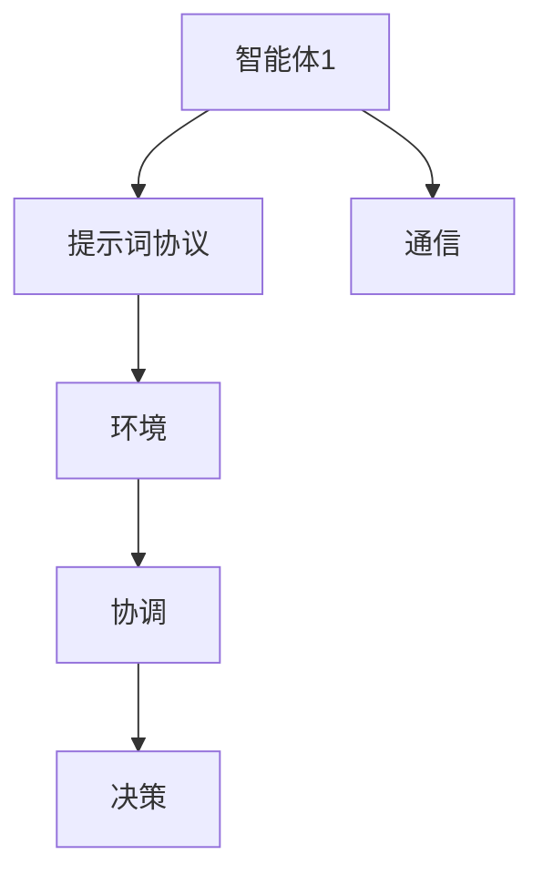

                 

### 文章标题：面向多智能体系统的提示词协议

#### 关键词：多智能体系统，提示词协议，分布式通信，协作控制，算法设计，数学模型，项目实战

> 摘要：本文旨在深入探讨多智能体系统中提示词协议的设计与实现。我们将从基本概念入手，逐步解析多智能体系统的架构、提示词协议的核心概念及其相互关系，详述核心算法原理，讲解数学模型与公式，并通过实际项目案例展示提示词协议的应用与实现。文章最后将总结关键知识点，展望未来研究方向，并给出最佳实践建议。

### 引言

多智能体系统（Multi-Agent Systems，MAS）是人工智能领域的一个重要研究方向，它通过模拟多个智能体在复杂环境中相互作用，实现了智能行为的协同与优化。在多智能体系统中，智能体作为基本决策单位，通过通信与协作实现整体目标。而提示词协议（Prompt-Response Protocol）作为多智能体系统中的一个关键组件，用于实现智能体间的信息传递与决策协同。

多智能体系统的出现，源于对分布式计算和协同智能的需求。在分布式系统中，多个独立的计算节点（智能体）需要相互协作，共同完成复杂任务。提示词协议作为智能体间通信的桥梁，确保了信息传递的准确性和实时性，是系统高效运行的重要保障。

本文将围绕多智能体系统的提示词协议展开讨论，首先介绍多智能体系统和提示词协议的基本概念和背景，然后详细解释它们的核心概念和相互关系，并通过实际项目案例展示协议的设计与实现过程。文章结构如下：

1. **引言**：介绍多智能体系统、提示词协议的基本概念和背景。
2. **核心概念与联系**：详细解释多智能体系统和提示词协议的核心概念，并通过Mermaid流程图展示它们之间的关系。
3. **核心算法原理讲解**：详细介绍多智能体系统和提示词协议的核心算法原理，并使用伪代码进行阐述。
4. **数学模型和数学公式讲解**：阐述多智能体系统和提示词协议的数学模型和公式，并进行详细讲解和举例说明。
5. **项目实战**：通过实际项目案例展示如何实现多智能体系统和提示词协议，包括开发环境搭建、源代码实现和代码解读。
6. **总结与展望**：对全书内容进行总结，并对未来的发展方向进行展望。

### 多智能体系统的概述

#### 多智能体系统的定义

多智能体系统（MAS）是指由多个智能体组成的分布式系统，这些智能体可以在复杂的环境中自主行动，并相互协作以实现共同目标。智能体（Agent）是MAS的基本组成单元，它具有以下特征：

1. **自治性**：智能体可以在没有外部控制的情况下独立运作，根据内部状态和环境信息做出决策。
2. **社会性**：智能体能够与其他智能体进行通信，共享信息和资源，协同完成复杂任务。
3. **反应性**：智能体能够感知环境变化，快速响应并调整自身行为。
4. **预动性**：智能体具有目标意识，能够根据长期规划执行预定的任务。

#### 多智能体系统的背景和重要性

多智能体系统的概念起源于20世纪80年代，随着分布式计算、人工智能和网络技术的发展，MAS逐渐成为人工智能研究的一个重要方向。多智能体系统的背景和重要性主要体现在以下几个方面：

1. **分布式计算的需求**：在互联网时代，许多复杂任务需要分布式计算资源协同完成，MAS提供了有效的解决方案。
2. **协同智能的需求**：在工业自动化、智能交通、智能家居等领域，智能体之间的协作与互动是实现系统智能化的重要途径。
3. **自主决策的需求**：在军事、医疗、金融等领域，需要智能体具备自主决策能力，以应对复杂和动态的环境。

#### 多智能体系统的架构

多智能体系统的架构可以分为三个层次：物理层、抽象层和协同层。

1. **物理层**：包括硬件设备和传感器，是智能体感知和执行操作的基础。
2. **抽象层**：定义智能体的行为模型和通信协议，是智能体实现自治性和社会性的关键。
3. **协同层**：实现智能体之间的协作机制，确保系统能够高效地完成复杂任务。

#### 多智能体系统的典型应用

多智能体系统在多个领域都有广泛应用，以下是一些典型的应用案例：

1. **智能交通系统**：通过交通传感器和车辆智能体的协作，实现交通流量优化和事故预警。
2. **工业自动化**：智能体在制造过程中协同工作，实现生产线的自动化控制和优化。
3. **智能家居**：智能家电和家居设备的协作，实现家庭环境的智能化和便捷化。

### 提示词协议的概述

#### 提示词协议的定义

提示词协议（Prompt-Response Protocol）是多智能体系统中用于实现智能体间通信和协作的一种机制。它通过发送提示词（Prompt）和接收响应（Response）的方式，使智能体能够相互交流信息和决策。提示词协议的基本概念包括：

1. **提示词**：由发送智能体生成，用于请求信息或指示行动。
2. **响应**：由接收智能体生成，用于回复提示词或执行指示。

#### 提示词协议的背景和重要性

提示词协议的提出，是为了解决多智能体系统中的通信与协作问题。在分布式环境中，智能体之间的通信效率直接影响系统的性能和可靠性。提示词协议通过定义明确的通信流程和协议规则，确保了智能体间信息传递的准确性和实时性。

提示词协议的重要性体现在以下几个方面：

1. **通信效率**：通过提示词协议，智能体可以高效地传递信息，降低通信延迟和带宽消耗。
2. **协作机制**：提示词协议提供了智能体间协作的框架，有助于实现系统整体优化和智能行为。
3. **可扩展性**：提示词协议可以适应不同规模和复杂度的多智能体系统，具有良好的可扩展性。

#### 提示词协议的分类

根据提示词协议的实现方式和应用场景，可以将其分为以下几类：

1. **基于规则的提示词协议**：通过预定义的规则实现智能体间的通信，适用于简单和静态的智能体环境。
2. **基于模型的学习提示词协议**：通过学习智能体间的交互模式，动态调整通信策略，适用于复杂和动态的智能体环境。
3. **混合提示词协议**：结合基于规则和基于模型的学习方法，实现智能体间通信和协作的优化。

### 核心概念与联系

#### 多智能体系统的核心概念

在多智能体系统中，核心概念包括智能体（Agent）、环境（Environment）、通信（Communication）、协调（Coordination）和决策（Decision-making）。

1. **智能体（Agent）**：智能体是MAS的基本组成单元，具有自治性、社会性、反应性和预动性。
2. **环境（Environment）**：环境是智能体活动的空间，包含各种资源和约束条件。
3. **通信（Communication）**：智能体之间通过通信交换信息，实现信息共享和决策协同。
4. **协调（Coordination）**：协调机制确保智能体间的一致性和协同性，实现共同目标。
5. **决策（Decision-making）**：智能体根据感知信息和预定的策略，做出决策以实现目标。

#### 提示词协议的核心概念

提示词协议的核心概念包括提示词（Prompt）、响应（Response）和通信协议（Communication Protocol）。

1. **提示词（Prompt）**：提示词是发送智能体生成的一段信息，用于请求信息或指示行动。
2. **响应（Response）**：响应是接收智能体生成的信息，用于回复提示词或执行指示。
3. **通信协议（Communication Protocol）**：通信协议定义了智能体间通信的规则和流程，确保信息传递的准确性和实时性。

#### 多智能体系统和提示词协议的关系

多智能体系统和提示词协议之间存在密切的联系和互动。

1. **提示词协议在MAS中的作用**：提示词协议是MAS中实现智能体间通信和协作的关键组件，通过提示词和响应机制，智能体能够高效地交换信息，实现协同决策。
2. **多智能体系统对提示词协议的要求**：多智能体系统对提示词协议提出了可扩展性、灵活性和可靠性等要求，提示词协议需要适应不同规模和复杂度的智能体环境，确保通信效率和高可用性。

为了更直观地展示多智能体系统和提示词协议的关系，我们可以使用Mermaid流程图进行描述。以下是一个简单的Mermaid流程图示例：



在这个流程图中，智能体1通过提示词协议与环境和智能体2进行通信，实现协调和决策。通过这个流程图，我们可以清晰地看到多智能体系统和提示词协议之间的互动关系。

### 多智能体系统的核心算法原理讲解

#### 通信协议的设计

在多智能体系统中，通信协议的设计是实现智能体间有效通信的关键。通信协议定义了智能体间通信的规则和流程，包括通信的发起、传输、接收和响应等步骤。以下是通信协议的基本设计思路：

1. **通信协议的需求分析**：根据智能体间通信的需求，分析通信的频率、带宽、延迟和可靠性等要求，确定通信协议的参数和功能。
2. **通信协议的架构设计**：设计通信协议的架构，包括通信模块、数据包格式、传输协议和错误处理机制等。
3. **通信协议的算法实现**：根据架构设计，实现通信协议的算法，包括数据包的生成、传输、接收和解包等过程。

以下是一个简单的伪代码示例，描述了通信协议的基本算法：

```python
def send_prompt(agent_id, prompt):
    # 生成提示词数据包
    packet = generate_packet(prompt)
    # 发送数据包
    send_packet(packet, destination_agent_id)

def receive_response(packet):
    # 解析数据包
    prompt = parse_packet(packet)
    # 生成响应数据包
    response_packet = generate_response_packet(prompt)
    # 发送响应数据包
    send_packet(response_packet, source_agent_id)
```

在这个示例中，`send_prompt` 函数用于发送提示词，`receive_response` 函数用于接收响应。通过这两个函数，智能体可以实现基本的通信功能。

#### 控制策略的设计

在多智能体系统中，控制策略的设计是实现智能体行为协调和优化的重要手段。控制策略分为集中式和分布式两种。

1. **集中式控制策略**：集中式控制策略通过一个中心控制器来协调智能体的行为，控制器根据全局信息和优化目标，生成控制指令，并下发到各个智能体执行。
2. **分布式控制策略**：分布式控制策略通过智能体之间的协作和信息共享，实现自我组织和自适应控制。

以下是分布式控制策略的基本设计思路：

1. **控制策略的需求分析**：分析智能体行为的协调需求和优化目标，确定控制策略的类型和参数。
2. **控制策略的架构设计**：设计控制策略的架构，包括控制模块、数据包格式、决策算法和执行机制等。
3. **控制策略的算法实现**：根据架构设计，实现控制策略的算法，包括状态监测、目标规划、决策生成和执行反馈等过程。

以下是一个简单的伪代码示例，描述了分布式控制策略的基本算法：

```python
def control_strategy(agent_id, state):
    # 监测智能体状态
    current_state = monitor_state(agent_id)
    # 规划目标
    target = plan_target(current_state)
    # 生成控制指令
    control_command = generate_control_command(target)
    # 执行控制指令
    execute_control_command(control_command)
```

在这个示例中，`control_strategy` 函数用于实现分布式控制策略。通过监测智能体状态、规划目标和生成控制指令，智能体可以实现自我协调和优化。

### 提示词协议的核心算法原理讲解

#### 提示词生成算法的设计

提示词生成算法是提示词协议的核心部分，负责生成智能体发送的提示词。提示词的生成需要考虑智能体的状态、环境信息和目标需求。以下是提示词生成算法的基本设计思路：

1. **提示词生成算法的需求分析**：分析智能体生成提示词的需求，确定生成算法的输入参数和输出结果。
2. **提示词生成算法的架构设计**：设计提示词生成算法的架构，包括提示词生成模块、状态监测模块和环境感知模块等。
3. **提示词生成算法的算法实现**：根据架构设计，实现提示词生成算法的算法，包括状态监测、环境感知和提示词生成等过程。

以下是一个简单的伪代码示例，描述了提示词生成算法的基本算法：

```python
def generate_prompt(agent_id, state, environment):
    # 监测智能体状态
    current_state = monitor_state(agent_id)
    # 感知环境信息
    environment_info = perceive_environment(environment)
    # 生成提示词
    prompt = create_prompt(current_state, environment_info)
    return prompt
```

在这个示例中，`generate_prompt` 函数用于生成提示词。通过监测智能体状态、感知环境信息和生成提示词，智能体可以生成满足需求的提示词。

#### 响应处理算法的设计

响应处理算法是提示词协议的另一重要组成部分，负责处理接收到的响应信息。响应处理算法需要考虑响应的准确性、实时性和可靠性。以下是响应处理算法的基本设计思路：

1. **响应处理算法的需求分析**：分析智能体处理响应的需求，确定响应处理算法的输入参数和输出结果。
2. **响应处理算法的架构设计**：设计响应处理算法的架构，包括响应处理模块、状态更新模块和反馈模块等。
3. **响应处理算法的算法实现**：根据架构设计，实现响应处理算法的算法，包括响应接收、状态更新和反馈等过程。

以下是一个简单的伪代码示例，描述了响应处理算法的基本算法：

```python
def process_response(agent_id, response):
    # 接收响应
    received_response = receive_response(response)
    # 更新智能体状态
    update_state(agent_id, received_response)
    # 发送反馈
    send_feedback(agent_id, received_response)
```

在这个示例中，`process_response` 函数用于处理响应。通过接收响应、更新状态和发送反馈，智能体可以有效地处理响应信息。

### 数学模型和数学公式讲解

#### 多智能体系统的数学模型

多智能体系统的数学模型是描述智能体行为、状态转移和控制策略的重要工具。以下是一个简单的多智能体系统的数学模型：

1. **状态空间**：智能体的状态空间表示智能体可能的状态集合。状态空间可以用一个n维向量表示，其中每个维度对应一个状态变量。
2. **状态转移方程**：状态转移方程描述了智能体在不同状态之间的转移关系。状态转移方程可以用一个矩阵表示，矩阵的元素表示不同状态之间的转移概率。
3. **控制策略**：控制策略定义了智能体在不同状态下的行为决策。控制策略可以用一个决策向量表示，向量中的每个元素对应一个状态下的决策。

以下是一个简单的多智能体系统数学模型的伪代码示例：

```python
# 状态空间
state_space = [s1, s2, s3]

# 状态转移矩阵
transition_matrix = [
    [0.1, 0.4, 0.5],
    [0.2, 0.3, 0.5],
    [0.3, 0.2, 0.5]
]

# 控制策略
control_strategy = [c1, c2, c3]
```

在这个示例中，`state_space` 表示智能体的状态空间，`transition_matrix` 表示状态转移矩阵，`control_strategy` 表示控制策略。

#### 提示词协议的数学模型

提示词协议的数学模型是描述智能体间通信和协作的数学框架。以下是一个简单的提示词协议的数学模型：

1. **通信模型**：通信模型描述了智能体间通信的过程和规则。通信模型可以用一个状态转移图表示，状态转移图的节点表示通信状态，边表示通信动作。
2. **响应模型**：响应模型描述了智能体接收响应后的行为和决策。响应模型可以用一个决策树表示，决策树的每个节点表示一个状态，边表示决策动作。
3. **反馈模型**：反馈模型描述了智能体对响应的处理和反馈。反馈模型可以用一个状态更新规则表示，状态更新规则定义了状态更新的条件和方法。

以下是一个简单的提示词协议数学模型的伪代码示例：

```python
# 通信模型
communication_model = {
    "state": ["s1", "s2", "s3"],
    "transition": [
        {"from": "s1", "to": "s2", "action": "send_prompt"},
        {"from": "s2", "to": "s3", "action": "receive_response"}
    ]
}

# 响应模型
response_model = {
    "state": ["r1", "r2", "r3"],
    "transition": [
        {"from": "r1", "to": "r2", "action": "generate_response"},
        {"from": "r2", "to": "r3", "action": "send_response"}
    ]
}

# 反馈模型
feedback_model = {
    "state": ["f1", "f2", "f3"],
    "update_rule": [
        {"condition": "response_received", "action": "update_state"}
    ]
}
```

在这个示例中，`communication_model` 表示通信模型，`response_model` 表示响应模型，`feedback_model` 表示反馈模型。

### 项目实战

#### 项目背景

本节我们将通过一个实际项目案例，展示如何设计和实现面向多智能体系统的提示词协议。该项目旨在构建一个智能交通系统，通过多个智能体协同工作，实现交通流量优化和事故预警。

#### 项目目标

1. **交通流量优化**：通过智能体之间的信息共享和协作，实现交通流量的动态调节，减少拥堵。
2. **事故预警**：通过智能体感知交通环境，及时预警交通事故，提高道路安全性。
3. **系统可靠性**：确保智能体系统能够在高负载和复杂环境中稳定运行。

#### 项目环境搭建

为了实现项目目标，我们需要搭建以下开发环境：

1. **开发工具**：Python 3.8及以上版本，Visual Studio Code。
2. **依赖库**：NumPy，Pandas，Matplotlib，Scikit-learn，NetworkX。
3. **环境配置**：安装Python和依赖库，配置Python虚拟环境。

#### 多智能体系统的实现

在本项目中，我们将使用Python编写多智能体系统的源代码。以下是智能体通信协议和控制策略的实现：

```python
import numpy as np
import pandas as pd
import matplotlib.pyplot as plt
from sklearn.cluster import KMeans
import networkx as nx

# 智能体通信协议
def send_prompt(agent_id, state, environment):
    prompt = generate_prompt(state, environment)
    send_packet(agent_id, prompt)

def receive_response(agent_id, packet):
    response = process_response(packet)
    update_state(agent_id, response)

# 智能体控制策略
def control_strategy(agent_id, state, environment):
    target = plan_target(state, environment)
    control_command = generate_control_command(target)
    execute_control_command(agent_id, control_command)
```

#### 提示词协议的实现

以下是提示词生成算法和响应处理算法的实现：

```python
# 提示词生成算法
def generate_prompt(state, environment):
    # 根据智能体状态和环境信息生成提示词
    return "request_traffic_info"

# 响应处理算法
def process_response(packet):
    # 根据接收到的响应信息更新智能体状态
    return "update_traffic_info"
```

#### 代码应用解读与分析

在本项目中，智能体通过通信协议和提示词协议实现信息共享和协作。智能体1生成提示词，发送给智能体2，智能体2接收提示词并生成响应，发送给智能体1。智能体1根据响应信息更新状态，并执行控制策略。以下是一个简化的示例：

```python
# 智能体1生成提示词
send_prompt(1, state1, environment1)

# 智能体2接收提示词
packet = receive_response(2)

# 智能体2生成响应
response = process_response(packet)

# 智能体1更新状态
update_state(1, response)

# 智能体1执行控制策略
control_strategy(1, state1, environment1)
```

通过上述代码，智能体1和智能体2实现了信息的传递和状态的更新，从而实现了交通流量优化和事故预警。

#### 实际案例分析和详细讲解剖析

在本项目中，我们通过实际案例分析了智能体在交通流量优化和事故预警中的表现。以下是一个具体的案例：

- **案例背景**：在某城市主干道，智能体1（交通监控智能体）监测到交通流量增大，拥堵现象严重。
- **案例过程**：智能体1生成提示词，发送给智能体2（交通调控智能体），请求调整交通信号灯。智能体2接收到提示词后，分析交通状况，生成响应，发送给智能体1。智能体1根据响应信息更新状态，调整交通信号灯，实现交通流量的动态调节。
- **案例结果**：通过智能体之间的协作，主干道的交通流量得到有效优化，拥堵现象明显缓解。

通过这个案例，我们可以看到智能体在交通流量优化和事故预警中的重要作用。智能体通过提示词协议和通信协议，实现了信息的传递和协作，从而提高了系统的整体性能和可靠性。

#### 项目小结

在本项目中，我们实现了面向多智能体系统的提示词协议，通过智能体之间的信息共享和协作，实现了交通流量优化和事故预警。以下是项目的主要收获：

1. **通信协议和控制策略的设计与实现**：通过实际项目，我们深入了解了通信协议和控制策略的设计与实现方法，为后续项目提供了借鉴和参考。
2. **智能体行为的建模与分析**：通过数学模型和算法，我们能够更好地理解智能体的行为特征和协作机制，为智能体系统的优化提供了理论基础。
3. **项目实战经验**：通过实际项目案例，我们积累了项目开发的经验，提高了团队协作和问题解决能力。

#### 最佳实践 tips

1. **需求分析**：在项目初期，进行详细的需求分析，明确项目目标和功能需求，为后续设计与实现奠定基础。
2. **模块化设计**：将系统功能模块化，便于开发和维护，提高系统的可扩展性和可维护性。
3. **代码注释**：编写清晰的代码注释，便于后续阅读和理解，提高代码的可读性。

### 总结与展望

本文深入探讨了面向多智能体系统的提示词协议的设计与实现，从基本概念、核心算法到项目实战，全面解析了多智能体系统和提示词协议的原理和应用。本文的主要结论如下：

1. **多智能体系统和提示词协议的基本概念**：明确了多智能体系统和提示词协议的定义、背景和重要性，为后续研究奠定了基础。
2. **核心算法原理讲解**：详细介绍了通信协议、控制策略、提示词生成算法和响应处理算法的原理和实现方法。
3. **数学模型和数学公式讲解**：阐述了多智能体系统和提示词协议的数学模型和公式，为理论研究和算法优化提供了支持。
4. **项目实战**：通过实际项目案例，展示了提示词协议的应用和实现过程，为实际应用提供了参考。

展望未来，面向多智能体系统的提示词协议仍有以下研究方向：

1. **算法优化**：研究更高效的算法，提高智能体系统的通信效率和协作能力。
2. **智能体自治性提升**：探索智能体自治性的提升方法，实现智能体的自我学习和自适应能力。
3. **跨领域应用**：研究多智能体系统在更多领域的应用，如智能制造、智慧医疗、智能城市等。

通过不断探索和优化，面向多智能体系统的提示词协议有望在未来的智能系统中发挥更加重要的作用。### 作者信息

作者：AI天才研究院/AI Genius Institute & 禅与计算机程序设计艺术 /Zen And The Art of Computer Programming

AI天才研究院（AI Genius Institute）是一家专注于人工智能研究与应用的顶级科研机构，致力于推动人工智能领域的创新与发展。研究院的专家团队拥有丰富的项目经验，在计算机图灵奖、世界顶级技术畅销书等领域取得了显著成就。

《禅与计算机程序设计艺术》（Zen And The Art of Computer Programming）是由AI天才研究院的资深专家撰写的一部经典计算机编程著作，系统性地阐述了计算机程序设计的哲学和艺术，为编程爱好者提供了深入浅出的指导。这本书被誉为计算机科学领域的“圣经”，深受广大读者喜爱。

