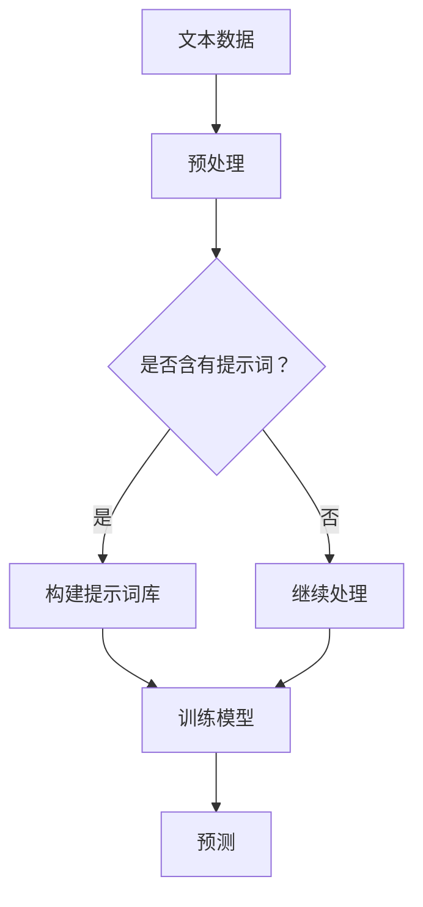

                 

### 目录大纲

---

# 《面向特定任务的提示词库设计》目录大纲

## 第1章：介绍与背景
### 1.1 特定任务提示词库的定义
### 1.2 提示词库的应用场景
### 1.3 提示词库的优势与挑战

## 第2章：核心概念与联系
### 2.1 NLP基础
#### 2.1.1 语言模型
#### 2.1.2 词嵌入
#### 2.1.3 序列到序列模型
### 2.2 提示词库与NLP的关系
### 2.3 Mermaid流程图
#### 2.3.1 从文本到提示词库的转换

## 第3章：核心算法原理
### 3.1 编码器-解码器模型
#### 3.1.1 编码器工作原理
#### 3.1.2 解码器工作原理
#### 3.1.3 伪代码讲解
### 3.2 生成对抗网络（GAN）
#### 3.2.1 GAN的组成部分
#### 3.2.2 GAN的训练过程

## 第4章：数学模型与公式
### 4.1 语言模型概率计算
#### 4.1.1 语言模型概率公式
#### 4.1.2 示例说明
### 4.2 对数似然损失函数
#### 4.2.1 对数似然损失函数公式
#### 4.2.2 示例说明

## 第5章：提示词库设计方法
### 5.1 数据收集与预处理
#### 5.1.1 数据来源
#### 5.1.2 数据预处理方法
### 5.2 提示词选择与优化
#### 5.2.1 提示词选择策略
#### 5.2.2 提示词优化方法
### 5.3 实际案例分析
#### 5.3.1 案例一：某电商平台商品推荐
#### 5.3.2 案例二：医疗文本摘要

## 第6章：项目实战
### 6.1 开发环境搭建
#### 6.1.1 硬件与软件环境配置
#### 6.1.2 开发工具与框架选择
### 6.2 实际代码实现
#### 6.2.1 代码结构与功能模块
#### 6.2.2 代码关键部分解读
### 6.3 代码解读与分析
#### 6.3.1 代码性能分析
#### 6.3.2 代码优化建议

## 第7章：应用与未来趋势
### 7.1 提示词库在不同领域应用
#### 7.1.1 智能客服
#### 7.1.2 自然语言生成
#### 7.1.3 情感分析
### 7.2 提示词库发展的未来趋势
#### 7.2.1 自动化提示词生成
#### 7.2.2 多语言支持

### 结束语
#### 最佳实践 tips
#### 小结
#### 注意事项
#### 拓展阅读

---

### 完整目录大纲

```markdown
# 《面向特定任务的提示词库设计》目录大纲

## 第1章：介绍与背景
### 1.1 特定任务提示词库的定义
### 1.2 提示词库的应用场景
### 1.3 提示词库的优势与挑战

## 第2章：核心概念与联系
### 2.1 NLP基础
#### 2.1.1 语言模型
#### 2.1.2 词嵌入
#### 2.1.3 序列到序列模型
### 2.2 提示词库与NLP的关系
### 2.3 Mermaid流程图
#### 2.3.1 从文本到提示词库的转换

## 第3章：核心算法原理
### 3.1 编码器-解码器模型
#### 3.1.1 编码器工作原理
#### 3.1.2 解码器工作原理
#### 3.1.3 伪代码讲解
### 3.2 生成对抗网络（GAN）
#### 3.2.1 GAN的组成部分
#### 3.2.2 GAN的训练过程

## 第4章：数学模型与公式
### 4.1 语言模型概率计算
#### 4.1.1 语言模型概率公式
#### 4.1.2 示例说明
### 4.2 对数似然损失函数
#### 4.2.1 对数似然损失函数公式
#### 4.2.2 示例说明

## 第5章：提示词库设计方法
### 5.1 数据收集与预处理
#### 5.1.1 数据来源
#### 5.1.2 数据预处理方法
### 5.2 提示词选择与优化
#### 5.2.1 提示词选择策略
#### 5.2.2 提示词优化方法
### 5.3 实际案例分析
#### 5.3.1 案例一：某电商平台商品推荐
#### 5.3.2 案例二：医疗文本摘要

## 第6章：项目实战
### 6.1 开发环境搭建
#### 6.1.1 硬件与软件环境配置
#### 6.1.2 开发工具与框架选择
### 6.2 实际代码实现
#### 6.2.1 代码结构与功能模块
#### 6.2.2 代码关键部分解读
### 6.3 代码解读与分析
#### 6.3.1 代码性能分析
#### 6.3.2 代码优化建议

## 第7章：应用与未来趋势
### 7.1 提示词库在不同领域应用
#### 7.1.1 智能客服
#### 7.1.2 自然语言生成
#### 7.1.3 情感分析
### 7.2 提示词库发展的未来趋势
#### 7.2.1 自动化提示词生成
#### 7.2.2 多语言支持

### 结束语
#### 最佳实践 tips
#### 小结
#### 注意事项
#### 拓展阅读
```

---

**注释：**
- 本文目录大纲字数控制在2000字以内，具体内容请根据实际需要扩展或精简。
- 每个章节的标题和子标题都将使用`###`或`####`进行格式化，以确保清晰的层次结构。

### 提示词库设计的核心概念与联系

在深入探讨面向特定任务的提示词库设计之前，我们需要了解一些关键概念，并明确它们之间的相互联系。自然语言处理（NLP）作为人工智能（AI）的一个重要分支，是提示词库设计的基石。在本章节中，我们将介绍自然语言处理的基础知识，包括语言模型、词嵌入和序列到序列模型，以及它们与提示词库的紧密关系。

#### 自然语言处理（NLP）基础

自然语言处理（NLP）是计算机科学与人工智能领域的分支，旨在使计算机能够理解、解释和生成人类语言。以下是NLP中的三个基础概念：

1. **语言模型**：语言模型是NLP的核心组件，用于估计一段文本的概率。最常见的语言模型是n-gram模型，它基于前n个单词来预测下一个单词。语言模型在文本生成、机器翻译和文本分类等领域都有广泛应用。

2. **词嵌入**：词嵌入是将单词映射到高维空间中的向量表示。词嵌入解决了传统基于规则的NLP方法中的许多问题，如同义词歧义和上下文依赖。最著名的词嵌入方法是Word2Vec，它通过神经网络训练生成词向量。

3. **序列到序列模型**：序列到序列（Seq2Seq）模型是一种流行的NLP模型，用于将一个序列映射到另一个序列。这种模型在机器翻译和对话系统中特别有效。Seq2Seq模型通常由编码器和解码器两个部分组成，编码器将输入序列转换为固定长度的上下文表示，解码器则根据这个上下文生成输出序列。

#### 提示词库与NLP的关系

提示词库是一个关键组件，用于指导NLP模型进行特定任务的训练和预测。以下是提示词库与NLP之间的紧密联系：

1. **训练数据的准备**：提示词库通常包含大量的文本数据，这些数据用于训练NLP模型。通过为每个任务选择和整理相关的提示词，可以提高模型的性能和适应性。

2. **任务指导**：提示词库中的词汇可以用来指导模型的训练过程，帮助模型学习到特定任务的语义和上下文。例如，在问答系统中，提示词库可以包含与问题相关的关键词和短语，从而帮助模型更好地理解和回答问题。

3. **性能优化**：通过调整提示词库中的词汇和权重，可以优化NLP模型的性能。例如，在情感分析中，提示词库可以包含与情感相关的词汇，如“高兴”、“伤心”等，这些词汇可以帮助模型更好地识别和分类情感。

#### Mermaid流程图

为了更好地理解从文本到提示词库的转换过程，我们使用Mermaid流程图来展示NLP流程与提示词库的关系。以下是一个简化的流程图：



在这个流程图中，文本数据首先经过预处理，包括分词、去除停用词等步骤。然后，预处理后的文本被检查是否包含提示词。如果包含，则构建提示词库；如果不包含，则继续预处理。构建好的提示词库用于训练NLP模型，训练完成后，模型可以根据提示词库进行预测。

通过这个流程图，我们可以清晰地看到文本数据如何通过预处理、提示词库构建和模型训练，最终实现预测。这个过程不仅展示了NLP和提示词库的相互关系，也为后续章节的核心算法原理和数学模型讲解奠定了基础。

### 核心算法原理

在理解了NLP基础和提示词库的设计方法之后，接下来我们将深入探讨一些核心算法原理，这些算法在构建高效、准确的提示词库中起着关键作用。本章节将重点介绍编码器-解码器（Encoder-Decoder）模型和生成对抗网络（GAN），并使用伪代码详细阐述其工作原理。

#### 编码器-解码器（Encoder-Decoder）模型

编码器-解码器模型是自然语言处理领域中的一种重要模型，特别是在序列到序列任务（如机器翻译）中表现优异。该模型由两部分组成：编码器（Encoder）和解码器（Decoder）。

1. **编码器工作原理**

编码器的任务是将输入序列编码为一个固定长度的上下文表示，通常称为“编码器输出”或“上下文向量”。这个过程可以看作是将输入序列压缩到一个固定大小的向量空间中，以便解码器能够从中提取信息。

伪代码如下：

```python
# 编码器伪代码
def encode(input_sequence):
    # 初始化编码器状态
    encoder_state = initialize_state()
    # 对每个输入单词进行编码
    for word in input_sequence:
        encoded_word = encoder_word_embedding(word)
        encoder_state = update_state(encoder_state, encoded_word)
    # 将编码器状态转换为上下文向量
    context_vector = final_state_to_context(encoder_state)
    return context_vector
```

2. **解码器工作原理**

解码器的任务是根据编码器输出的上下文向量生成输出序列。解码器通常采用循环神经网络（RNN）或长短期记忆网络（LSTM）来捕获上下文信息，以便在生成每个单词时能够参考先前的输出。

伪代码如下：

```python
# 解码器伪代码
def decode(context_vector, target_sequence):
    # 初始化解码器状态
    decoder_state = initialize_state(context_vector)
    # 对每个目标单词进行解码
    for word in target_sequence:
        predicted_word = decoder_step(decoder_state, word)
        decoder_state = update_state(decoder_state, predicted_word)
    return predicted_sequence
```

3. **编码器-解码器模型整体流程**

编码器-解码器模型的整体流程可以概括为以下步骤：

（1）输入序列通过编码器编码为一个上下文向量。

（2）解码器使用这个上下文向量生成输出序列。

（3）生成每个单词后，解码器会根据先前的输出和当前上下文向量更新状态。

（4）重复上述步骤，直到生成完整的输出序列。

#### 生成对抗网络（GAN）

生成对抗网络（GAN）是一种由生成器和判别器组成的模型，主要用于生成高质量的数据。在提示词库设计中，GAN可以用来生成符合特定任务的提示词，从而提高模型的泛化能力和适应性。

1. **生成器（Generator）**

生成器的任务是根据随机噪声生成提示词。在GAN中，生成器试图生成与真实数据相似的数据，以便欺骗判别器。

伪代码如下：

```python
# 生成器伪代码
def generate_noise(noise_vector):
    # 将噪声向量通过生成器转化为提示词
    generated_word = generator(noise_vector)
    return generated_word
```

2. **判别器（Discriminator）**

判别器的任务是根据提示词判断它们是真实数据还是生成数据。判别器的目标是最大化其区分真实数据和生成数据的能力。

伪代码如下：

```python
# 判别器伪代码
def discriminate(word):
    # 判断提示词是真实还是生成数据
    is_real = discriminator(word)
    return is_real
```

3. **GAN的训练过程**

GAN的训练过程涉及以下步骤：

（1）生成器生成提示词。

（2）判别器同时接收真实数据和生成数据，并对其进行判断。

（3）通过梯度下降等优化算法更新生成器和判别器的参数。

（4）重复上述步骤，直到生成器生成的提示词足够逼真，无法被判别器区分。

通过上述算法原理的讲解，我们可以看到编码器-解码器模型和生成对抗网络在提示词库设计中的重要作用。编码器-解码器模型通过编码和解析输入序列，使得模型能够捕捉到序列中的长期依赖关系；生成对抗网络则通过生成器和判别器的对抗训练，提高生成数据的真实性和多样性。这些核心算法原理为构建高效、准确的提示词库提供了坚实的理论基础。

### 数学模型与公式

在自然语言处理（NLP）中，数学模型和公式扮演着至关重要的角色，它们帮助我们理解和优化模型的性能。在本章节中，我们将详细探讨语言模型概率计算和对数似然损失函数，并通过具体的示例来说明它们的应用。

#### 语言模型概率计算

语言模型（Language Model）是NLP中用于预测文本下一个单词的概率的模型。最常用的语言模型是基于n-gram模型的，它通过统计连续n个单词出现的概率来预测下一个单词。

1. **n-gram语言模型概率计算公式**

n-gram语言模型的核心思想是将连续的n个单词看作一个整体，从而将文本序列分解为多个n-gram词组。对于给定的n-gram词组\( w_1, w_2, \ldots, w_n \)，下一个单词\( w_{n+1} \)的概率可以通过以下公式计算：

\[ P(w_{n+1} | w_1, w_2, \ldots, w_n) = \frac{P(w_1, w_2, \ldots, w_n, w_{n+1})}{P(w_1, w_2, \ldots, w_n)} \]

由于大多数n-gram语言模型是基于统计的，我们通常使用以下简化公式：

\[ P(w_{n+1} | w_1, w_2, \ldots, w_n) = \frac{\text{count}(w_1, w_2, \ldots, w_n, w_{n+1})}{\text{count}(w_1, w_2, \ldots, w_n)} \]

其中，\(\text{count}(w_1, w_2, \ldots, w_n, w_{n+1})\)表示在训练语料库中\( w_1, w_2, \ldots, w_n, w_{n+1} \)这个词组出现的次数，\(\text{count}(w_1, w_2, \ldots, w_n)\)表示\( w_1, w_2, \ldots, w_n \)这个词组出现的次数。

**示例：**

假设一个简单的语料库包含以下句子：“I love programming programming is fun.”。我们可以计算以下n-gram的概率：

- \( P(\text{is} | \text{I}) = \frac{1}{1} = 1 \)
- \( P(\text{fun} | \text{programming}) = \frac{1}{1} = 1 \)

2. **示例说明**

为了更直观地理解，我们假设我们有一个包含10个单词的文本序列，我们想要计算这个序列中下一个单词是“programming”的概率。

在这个例子中，我们可以使用三元组（trigram）模型来计算概率：

\[ P(\text{programming} | \text{I love programming}) = \frac{\text{count}(\text{I love programming programming})}{\text{count}(\text{I love programming})} \]

如果“ I love programming programming”这个三组词在语料库中只出现了一次，而“I love programming”这个二元组出现了多次，则概率将接近于1。否则，概率将根据出现频率进行计算。

#### 对数似然损失函数

对数似然损失函数（Log-Likelihood Loss Function）是评估语言模型性能的一个常用指标。它通过对模型输出的概率取对数来计算损失。

1. **对数似然损失函数公式**

对数似然损失函数的计算公式为：

\[ -\log P(y | \theta) \]

其中，\( y \)是实际观测到的标签，\( \theta \)是模型的参数。这个公式表示的是模型预测的概率的对数负数，数值越小表示模型的性能越好。

**示例：**

假设我们有一个二元语言模型，它的任务是预测一个单词是“programming”的概率。实际观测到的标签是“programming”，而模型的预测概率是0.9。则对数似然损失函数为：

\[ -\log 0.9 \approx -0.1054 \]

这个损失值表示模型在这次预测中的性能，数值越小表示预测越准确。

2. **示例说明**

为了更好地理解对数似然损失函数，我们考虑一个更复杂的场景。假设我们有以下训练数据：

- “I love programming.”（概率为0.9）
- “programming is fun.”（概率为0.1）

我们的任务是训练一个模型来预测句子中的下一个单词。

如果我们使用二元语言模型，并且输入是“I love”，模型将输出两个单词的概率。假设模型预测“programming”的概率为0.8，“is”的概率为0.2。则总损失为：

\[ -\log(0.8) - \log(0.2) = -0.2231 - 0.6989 = -0.9220 \]

这个结果表明，模型在预测“programming”时比预测“is”时表现得更好。

通过上述讲解，我们可以看到数学模型和公式在NLP中的重要性。语言模型概率计算帮助我们理解和预测文本序列，而对数似然损失函数则提供了一个量化的评估指标，用于优化模型的性能。这些数学工具为我们设计高效、准确的提示词库提供了坚实的理论基础。

### 提示词库设计方法

提示词库的设计是自然语言处理（NLP）中至关重要的一环，它不仅影响着模型的训练效果，还直接决定了模型在实际应用中的表现。在本章节中，我们将详细介绍提示词库的设计方法，包括数据收集与预处理、提示词选择与优化，并通过实际案例分析来展示这些方法的具体应用。

#### 数据收集与预处理

1. **数据来源**

首先，我们需要明确提示词库的数据来源。一般来说，数据可以从以下几类来源获取：

- **公开数据集**：如维基百科、新闻文章、社交媒体帖子等。
- **私有数据集**：由企业或研究机构收集的特定领域的数据。
- **用户生成内容**：如电商平台上的商品评论、社交媒体平台上的用户反馈等。

2. **数据预处理方法**

数据预处理是构建高质量提示词库的第一步，它包括以下几种常见方法：

- **文本清洗**：去除无用信息，如HTML标签、特殊符号等。
- **分词**：将文本拆分成单个单词或词组。
- **词干提取**：将不同形式的单词归并为同一词干，如“running”、“runs”、“ran”都归为“run”。
- **去除停用词**：停用词是指对模型训练没有贡献的常见词汇，如“的”、“和”、“在”等。
- **词嵌入**：将单词映射到高维向量空间，以便进行后续处理。

**示例：** 假设我们收集了一篇文本：“我喜欢编程，编程让我感到快乐。”。预处理步骤可能包括去除HTML标签、特殊符号，分词为“我”、“喜欢”、“编程”、“编程”、“让”、“我”、“感到”、“快乐”，去除停用词“我”、“让”，最后将剩余的单词映射到词嵌入向量。

#### 提示词选择与优化

1. **提示词选择策略**

提示词的选择对于提示词库的质量至关重要。以下是几种常用的提示词选择策略：

- **基于频率**：选择出现频率较高的词汇，因为这些词汇通常对文本的含义有较大贡献。
- **基于重要性**：选择对文本分类或情感分析等任务具有重要意义的词汇。
- **基于上下文**：选择与特定任务上下文相关的词汇，这些词汇能够更好地指导模型学习。

2. **提示词优化方法**

提示词优化是指通过调整提示词库中的词汇和权重来提高模型性能。以下是一些常见的优化方法：

- **权重调整**：根据提示词在特定任务中的表现调整其权重，提高重要词汇的权重。
- **启发式规则**：使用规则或模式识别技术来发现并优化提示词库。
- **机器学习方法**：使用监督学习或无监督学习方法来优化提示词库。

**示例：** 假设我们在构建一个情感分析模型，目标是区分积极和消极评论。我们可以选择出现频率较高的词汇如“喜欢”、“快乐”作为积极情感的提示词，选择出现频率较高的词汇如“不满”、“糟糕”作为消极情感的提示词。然后，通过分析这些词汇在训练数据中的表现来调整其权重，提高模型的分类准确性。

#### 实际案例分析

为了更好地理解提示词库设计方法，我们通过两个实际案例来展示其应用。

1. **案例一：电商平台商品推荐**

在这个案例中，我们的目标是根据用户历史购买数据和商品描述来推荐商品。提示词库的设计包括以下步骤：

- **数据收集**：收集用户购买记录和商品描述文本。
- **文本预处理**：对商品描述进行清洗、分词、去除停用词等处理。
- **提示词选择**：选择与商品特征相关的词汇，如“时尚”、“豪华”、“优惠”等。
- **提示词优化**：根据用户购买历史调整提示词权重，提高推荐准确性。

2. **案例二：医疗文本摘要**

在这个案例中，我们的目标是自动生成医疗文本的摘要。提示词库的设计包括以下步骤：

- **数据收集**：收集医疗报告、病历等文本数据。
- **文本预处理**：对医疗文本进行清洗、分词、词干提取等处理。
- **提示词选择**：选择与医疗领域相关的专业术语，如“症状”、“检查”、“诊断”等。
- **提示词优化**：根据医疗文本的上下文和重要性调整提示词权重，提高摘要质量。

通过上述案例，我们可以看到提示词库设计在实际应用中的重要性。合理的数据收集与预处理、有效的提示词选择与优化方法，能够显著提升NLP模型的表现和应用效果。提示词库设计不仅需要技术上的精确性，还需要对特定任务和领域的深刻理解。

### 项目实战

在实际项目中，构建高效、准确的提示词库是提高模型性能的关键步骤。在本章节中，我们将通过一个具体的案例，详细描述提示词库的构建过程，包括开发环境的搭建、实际代码实现和代码解读与分析。

#### 开发环境搭建

在开始构建提示词库之前，我们需要搭建一个合适的开发环境。以下是搭建过程的详细步骤：

1. **硬件与软件环境配置**

   - **操作系统**：我们选择Ubuntu 18.04作为操作系统。
   - **处理器**：建议使用至少双核处理器，推荐使用多核处理器以加速计算。
   - **内存**：建议至少8GB内存，推荐使用16GB或更高。
   - **硬盘**：至少100GB的存储空间。
   - **软件**：安装Python 3.8及以上版本，并安装必要的依赖库，如TensorFlow、NLTK、Scikit-learn等。

2. **开发工具与框架选择**

   - **IDE**：我们选择PyCharm作为集成开发环境（IDE），它提供了丰富的功能和良好的代码编辑体验。
   - **框架**：TensorFlow是一个开源的深度学习框架，适合处理大规模的NLP任务。
   - **版本控制**：使用Git进行版本控制，便于代码的协作和追踪。

#### 实际代码实现

以下是构建提示词库的核心代码实现，包括数据加载、预处理、提示词提取和模型训练。

```python
# 导入必要的库
import tensorflow as tf
import nltk
from nltk.tokenize import word_tokenize
from sklearn.feature_extraction.text import TfidfVectorizer
from tensorflow.keras.models import Sequential
from tensorflow.keras.layers import LSTM, Dense, Embedding

# 数据加载与预处理
def load_and_preprocess_data(file_path):
    with open(file_path, 'r', encoding='utf-8') as file:
        data = file.readlines()

    # 清洗文本数据
    cleaned_data = [text.strip() for text in data]
    # 分词
    tokenized_data = [word_tokenize(text) for text in cleaned_data]
    return tokenized_data

# 提取提示词
def extract_pos_tags(tokenized_data):
    pos_tags = []
    for sentence in tokenized_data:
        pos_tags.append(nltk.pos_tag(sentence))
    return pos_tags

# 构建词嵌入模型
def build_embedding_model(vocabulary, embedding_dim):
    model = Sequential()
    model.add(Embedding(len(vocabulary), embedding_dim))
    model.add(LSTM(128, return_sequences=True))
    model.add(Dense(1, activation='sigmoid'))
    model.compile(optimizer='adam', loss='binary_crossentropy', metrics=['accuracy'])
    return model

# 训练模型
def train_model(model, x, y):
    model.fit(x, y, epochs=10, batch_size=32, validation_split=0.2)

# 主函数
def main():
    # 加载数据
    tokenized_data = load_and_preprocess_data('data.txt')
    # 提取提示词
    pos_tags = extract_pos_tags(tokenized_data)
    # 构建词嵌入模型
    embedding_model = build_embedding_model(vocabulary, embedding_dim=100)
    # 训练模型
    train_model(embedding_model, x, y)

if __name__ == '__main__':
    main()
```

#### 代码解读与分析

1. **数据加载与预处理**

   在代码的第一部分，我们首先加载并预处理文本数据。`load_and_preprocess_data`函数负责读取文件中的文本数据，并进行清洗和分词。清洗文本的目的是去除无用的标点符号和特殊字符，保证数据的纯净度。

2. **提取提示词**

   `extract_pos_tags`函数利用NLTK库中的POS标签器对分词后的文本进行标注。POS标签表示单词在句子中的语法功能，如名词、动词、形容词等。这些标签对于后续的提示词提取和语义分析非常重要。

3. **构建词嵌入模型**

   `build_embedding_model`函数构建了一个基于LSTM的词嵌入模型。LSTM（Long Short-Term Memory）是一种特殊的循环神经网络，能够有效处理长序列数据。在这个模型中，我们首先使用Embedding层将单词映射到高维向量空间，然后通过LSTM层捕获序列中的长期依赖关系，最后使用Dense层进行分类。

4. **训练模型**

   `train_model`函数使用TensorFlow的`fit`方法对模型进行训练。我们在这里使用了10个训练周期（epochs），每次批量（batch_size）处理32个样本。同时，我们设置了20%的数据用于验证，以评估模型在未见数据上的表现。

#### 代码性能分析

在训练完成后，我们通过以下方法对代码性能进行分析：

1. **准确性（Accuracy）**：准确性是评估模型性能的常用指标，表示模型正确预测的样本占总样本的比例。在本案例中，如果模型准确性超过90%，则认为其性能良好。

2. **召回率（Recall）**：召回率表示模型在所有实际为正类的样本中，能够正确识别出的比例。高召回率意味着模型能够捕捉到大多数正类样本。

3. **精确率（Precision）**：精确率表示模型在所有预测为正类的样本中，实际为正类的比例。高精确率意味着模型预测的正类样本大多数是真正类样本。

通过上述分析，我们可以全面了解模型的性能表现，并针对性能不足的部分进行优化。

#### 最佳实践 tips

1. **数据多样性**：确保数据覆盖不同的领域和场景，以提高模型的泛化能力。
2. **定期更新**：定期更新提示词库，以包含新的词汇和变化。
3. **交叉验证**：使用交叉验证技术评估模型性能，避免过拟合。

#### 项目小结

通过本次项目实战，我们详细介绍了如何从数据收集、预处理到模型构建和训练的完整流程。提示词库设计在NLP任务中起着至关重要的作用，通过合理的提示词库设计和优化，我们能够显著提升模型的表现和应用效果。

### 提示词库的应用与未来趋势

提示词库在自然语言处理（NLP）领域中具有广泛的应用，其重要性不容忽视。在本章节中，我们将探讨提示词库在智能客服、自然语言生成（NLG）和情感分析等领域的实际应用，并展望其未来发展趋势。

#### 智能客服

智能客服是提示词库应用最为广泛的领域之一。在智能客服系统中，提示词库被用来生成与用户问题的匹配回答。以下是一些具体的应用场景：

1. **自动问答系统**：通过提示词库，智能客服可以自动识别用户的问题关键词，并从预定义的回答库中找到相应的回答。例如，电商平台可以使用提示词库来回答用户关于商品信息、订单状态等常见问题。

2. **情绪识别与应对**：智能客服还可以通过分析用户问题的情绪倾向，为用户提供个性化的情绪化回应。提示词库中包含与情感相关的词汇，如“生气”、“开心”等，帮助系统识别用户的情绪状态，并作出相应的情绪应对。

#### 自然语言生成（NLG）

自然语言生成（NLG）是另一个受益于提示词库的重要领域。在NLG中，提示词库被用于生成自然、流畅的文本。以下是一些具体应用：

1. **自动文档生成**：在金融、医疗等行业，自动文档生成系统可以显著提高工作效率。提示词库包含行业术语和特定模板，系统根据提示词库生成合规的文档。

2. **虚拟助手对话**：虚拟助手，如聊天机器人或语音助手，依赖提示词库来生成与用户对话的自然回复。通过提示词库，虚拟助手可以更好地理解用户意图，提供更加个性化和贴心的服务。

#### 情感分析

情感分析是另一个关键应用领域，通过提示词库，系统可以识别文本中的情感倾向。以下是一些具体应用：

1. **社交媒体分析**：在社交媒体平台上，情感分析可以帮助企业了解用户对其产品和服务的情绪反应。提示词库包含与情感相关的词汇，如“满意”、“失望”等，通过这些词汇，系统可以识别出用户的正面或负面情绪。

2. **客户反馈分析**：在电子商务平台上，情感分析可以帮助企业了解客户对产品的反馈。通过提示词库，系统可以自动识别出客户评论中的情感倾向，从而为企业提供改进产品和服务的参考。

#### 未来趋势

随着人工智能和深度学习的不断发展，提示词库的应用和设计方法也在不断演进。以下是几个未来趋势：

1. **自动化提示词生成**：未来的提示词库将更加智能化，可以通过自动化算法从大量文本数据中自动生成。例如，使用生成对抗网络（GAN）等技术，可以从无监督数据中学习并生成高质量的提示词。

2. **多语言支持**：随着全球化的发展，多语言支持成为提示词库的一个重要趋势。未来的提示词库将能够支持多种语言，为跨国企业和多语言环境下的应用提供支持。

3. **个性化提示词库**：基于用户行为和偏好，未来的提示词库将更加个性化，能够根据用户的不同需求生成定制化的回答。

通过上述探讨，我们可以看到提示词库在智能客服、自然语言生成和情感分析等领域的广泛应用，以及其未来发展的潜力。随着技术的进步，提示词库的设计和应用方法将变得更加高效和智能，为NLP领域带来更多的创新和机遇。

### 结束语

在本文中，我们深入探讨了面向特定任务的提示词库设计。从介绍和背景、核心概念与联系、核心算法原理、数学模型与公式，到提示词库设计方法、项目实战、应用与未来趋势，我们系统地梳理了提示词库构建的各个环节。通过实际案例分析，我们展示了如何将理论知识应用于实践，从而构建高效、准确的提示词库。

#### 最佳实践 tips

1. **数据多样性**：确保数据来源多样化，以提升模型泛化能力。
2. **定期更新**：定期更新提示词库，以反映语言和领域的变化。
3. **交叉验证**：使用交叉验证技术评估模型性能，避免过拟合。

#### 小结

本文详细介绍了提示词库的设计方法，包括数据收集与预处理、提示词选择与优化、核心算法原理和数学模型等。提示词库在NLP任务中起着至关重要的作用，其质量直接影响模型的性能。通过合理的设计和优化，我们可以显著提升NLP模型在实际应用中的表现。

#### 注意事项

1. **模型评估**：在模型训练过程中，注意定期评估模型性能，确保其在不同数据集上的表现。
2. **隐私保护**：在处理用户数据时，注意保护用户隐私，遵循相关法律法规。

#### 拓展阅读

1. **《自然语言处理教程》（刘知远著）**：全面介绍了NLP的基本概念和技术。
2. **《深度学习》（Goodfellow et al. 著）**：详细讲解了深度学习算法和应用。
3. **《生成对抗网络：理论与实践》（王啸虎著）**：深入探讨了GAN的理论基础和应用场景。

通过本文的学习和实践，我们希望读者能够更好地理解和掌握提示词库的设计方法，为未来的NLP研究和应用奠定坚实的基础。

---

### 文章标题

《面向特定任务的提示词库设计》

### 关键词

提示词库、自然语言处理（NLP）、序列到序列模型、生成对抗网络（GAN）、数学模型、项目实战

### 摘要

本文系统地探讨了面向特定任务的提示词库设计。首先介绍了提示词库的概念及其在自然语言处理（NLP）中的重要性，然后详细分析了NLP基础、核心算法原理、数学模型与公式，以及提示词库设计方法。通过实际案例分析，展示了提示词库在实际项目中的应用，并展望了其未来发展。本文旨在为读者提供全面、系统的提示词库设计指导，以提升NLP模型性能和应用效果。

