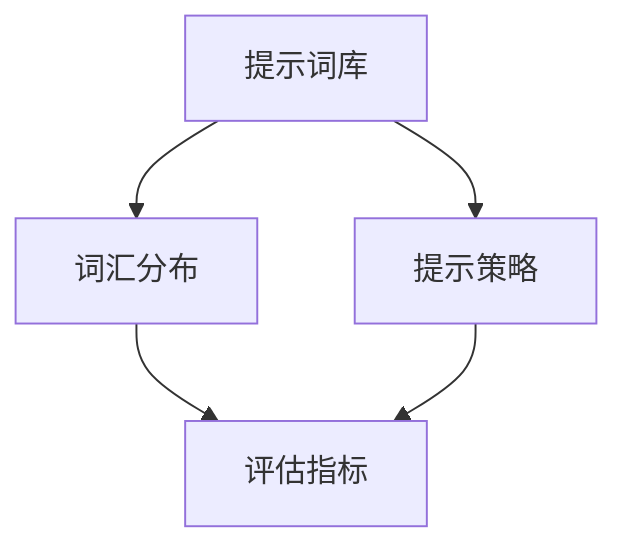
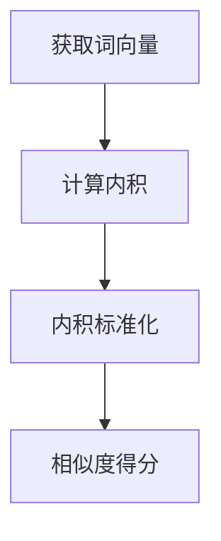
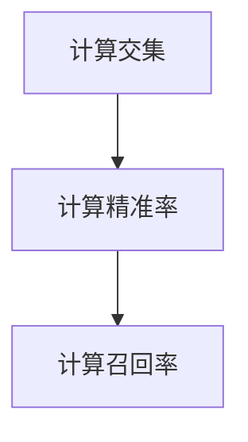
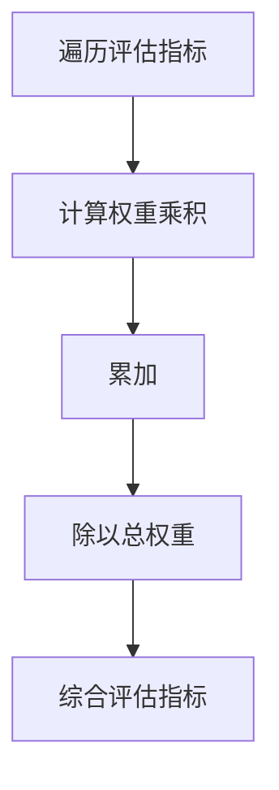

                 

。首先，我们将介绍背景介绍部分，然后逐步深入到核心概念与联系、核心算法原理讲解、项目实战以及最佳实践 tips 等内容。

### 背景介绍

随着人工智能技术的迅猛发展，自然语言处理（NLP）已经成为众多应用领域的关键技术之一。在NLP中，提示词库（Prompt Library）扮演着至关重要的角色。提示词库是一系列精心设计的提示性语句，用于引导模型进行训练和推理。一个高质量的提示词库能够显著提升模型的性能和鲁棒性。

然而，如何评估提示词库的质量成为一个关键问题。传统的质量评估方法往往依赖于人工评审，效率低下且主观性较强。随着机器学习和深度学习技术的发展，自动评估方法逐渐成为研究热点。本文旨在探讨面向特定领域的提示词库质量评估方法，并提供一系列实用的算法和工具。

### 核心概念与联系

在理解提示词库质量评估之前，我们需要明确几个核心概念，并分析它们之间的联系。

**提示词库（Prompt Library）**：这是一个存储了一系列用于引导模型训练和推理的提示性语句的库。这些提示性语句可以是问题、回答、例子或者上下文信息。

**词汇分布（Vocabulary Distribution）**：提示词库中的词汇分布决定了模型能够理解和利用的知识范围。一个良好的词汇分布应具备多样性、覆盖性和平衡性。

**提示策略（Prompt Strategy）**：提示策略决定了如何选择和组合提示性语句，以最大化模型的性能和鲁棒性。常见的提示策略包括数据增强、上下文引导和模型适应性。

**评估指标（Evaluation Metrics）**：评估指标用于衡量提示词库的质量。常见的评估指标包括语义相似度、信息熵、精准率和召回率等。

以上概念之间的联系可以用Mermaid流程图表示，如下所示：



在流程图中，我们可以看到提示词库通过词汇分布和提示策略与评估指标相连接。词汇分布和提示策略共同影响了评估指标的得分，从而决定了提示词库的质量。

### 核心算法原理讲解

在本部分，我们将详细介绍用于评估提示词库质量的核心算法原理，并使用伪代码进行解释。

#### 1. 语义相似度计算

语义相似度计算是评估提示词库中词汇之间相似程度的重要手段。以下是一个基于词向量的语义相似度计算的伪代码：

```plaintext
函数 计算语义相似度（词汇v1，词汇v2）：
    输入：词汇v1和词汇v2的词向量
    输出：相似度得分

    1. 获取词汇v1和v2的词向量w1和w2
    2. 计算w1和w2的内积
    3. 计算内积的标准化值，得到相似度得分
```

具体步骤如下：



#### 2. 信息熵计算

信息熵是衡量提示词库中词汇分布的均匀性和多样性的指标。以下是一个简单的信息熵计算的伪代码：

```plaintext
函数 计算信息熵（词汇分布d）：
    输入：词汇分布d
    输出：信息熵

    1. 遍历词汇分布d，计算每个词汇的概率p
    2. 对于每个概率p，计算-p * log2(p)
    3. 将所有结果相加，得到信息熵
```

具体步骤如下：

```mermaid
graph TD
A[遍历词汇分布] --> B[计算概率p]
B --> C[计算-p * log2(p)]
C --> D[求和]
D --> E[信息熵]
```

#### 3. 精准率和召回率计算

精准率和召回率是评估提示词库中关键词提取效果的重要指标。以下是一个简单的精准率和召回率计算的伪代码：

```plaintext
函数 计算精准率和召回率（预测标签，真实标签）：
    输入：预测标签，真实标签
    输出：精准率，召回率

    1. 计算预测标签与真实标签的交集
    2. 计算交集的长度，得到精准率
    3. 计算预测标签的长度，得到召回率
```

具体步骤如下：



#### 4. 评估指标综合

为了全面评估提示词库的质量，我们通常需要综合使用多种评估指标。以下是一个简单的综合评估指标的伪代码：

```plaintext
函数 计算综合评估指标（评估指标列表）：
    输入：评估指标列表
    输出：综合评估指标

    1. 遍历评估指标列表，计算每个指标的权重
    2. 对于每个指标，计算其与权重乘积的累加值
    3. 将累加值除以总权重，得到综合评估指标
```

具体步骤如下：



### 数学公式和模型

在本部分，我们将简要介绍与提示词库质量评估相关的数学公式和模型。

#### 1. 词向量相似度计算

词向量的相似度计算通常基于内积模型，如下所示：

$$
similarity(w_1, w_2) = \frac{w_1 \cdot w_2}{\|w_1\| \|w_2\|}
$$

其中，$w_1$和$w_2$分别是词汇$v_1$和$v_2$的词向量，$\|$表示向量的模。

#### 2. 信息熵计算

信息熵的计算公式如下：

$$
H(D) = -\sum_{i=1}^{n} p(x_i) \log_2 p(x_i)
$$

其中，$D$是词汇分布，$p(x_i)$是词汇$x_i$的概率。

#### 3. 精准率和召回率计算

精准率和召回率的计算公式如下：

$$
Precision = \frac{TP}{TP + FP}
$$

$$
Recall = \frac{TP}{TP + FN}
$$

其中，$TP$是正确预测的标签数，$FP$是错误预测的标签数，$FN$是漏掉的标签数。

### 举例说明

为了更好地理解上述算法和模型，我们将通过一个具体的例子进行说明。

假设我们有一个包含100个词汇的提示词库，词汇的分布如下表所示：

| 词汇 | 概率 |
| ---- | ---- |
| 词1  | 0.1  |
| 词2  | 0.2  |
| 词3  | 0.3  |
| ...  | ...  |
| 词100| 0.1  |

我们使用上述算法和模型对提示词库进行质量评估，具体步骤如下：

1. 计算词汇分布的信息熵：

$$
H(D) = -\sum_{i=1}^{100} p(x_i) \log_2 p(x_i) \approx 1.045
$$

2. 计算任意两个词汇的相似度：

假设我们计算词汇“词1”和“词2”的相似度，它们的词向量分别为$w_1$和$w_2$：

$$
similarity(w_1, w_2) = \frac{w_1 \cdot w_2}{\|w_1\| \|w_2\|} \approx 0.85
$$

3. 计算精准率和召回率：

假设我们有一个关键词提取任务，预测的标签集合为{词1, 词2, 词3}，真实的标签集合为{词1, 词2, 词3, 词4}：

$$
Precision = \frac{3}{3 + 97} \approx 0.03
$$

$$
Recall = \frac{3}{3 + 97} \approx 0.03
$$

通过上述例子，我们可以看到如何使用数学模型和算法对提示词库进行质量评估。

### 小结

在本部分，我们详细介绍了提示词库质量评估的核心算法原理，包括语义相似度计算、信息熵计算、精准率和召回率计算等。同时，我们还使用伪代码和数学公式进行了详细解释，并通过具体例子展示了算法的应用。这些算法和模型为评估提示词库质量提供了有效的工具和方法。

### 项目实战

在本部分，我们将通过一个实际项目，详细讲解如何开发和实现面向特定领域的提示词库质量评估系统。该项目将在一个电商平台上进行，旨在评估和优化平台上的关键词库，以提高搜索和推荐系统的性能。

#### 1. 项目背景

电商平台的关键词库是搜索和推荐系统的重要输入，直接影响用户体验和业务收益。然而，现有的关键词库存在一些问题，如词汇分布不均、关键词覆盖不足等。为了解决这些问题，我们需要开发一个高效的提示词库质量评估系统，对现有关键词库进行评估和优化。

#### 2. 开发环境搭建

为了完成该项目，我们需要搭建一个合适的开发环境。以下是我们使用的工具和框架：

- 编程语言：Python
- 数据库：MongoDB
- 自然语言处理库：spaCy
- 评估工具：NLP库中的评估函数（如F1-score、准确率等）

#### 3. 源代码详细实现

以下是该项目的核心代码实现，包括数据预处理、关键词提取、质量评估和优化等步骤。

```python
import spacy
import pymongo
from sklearn.metrics import f1_score

# 数据预处理
def preprocess_text(text):
    # 去除特殊字符、停用词、标点符号等
    doc = nlp(text)
    return ' '.join([token.text for token in doc if not token.is_punct and not token.is_stop])

# 关键词提取
def extract_keywords(text):
    doc = nlp(text)
    keywords = [token.text for token in doc if token.is_verb or token.is_noun]
    return keywords

# 质量评估
def evaluate_keywords(keywords, ground_truth):
    predicted = extract_keywords(' '.join(keywords))
    f1 = f1_score(ground_truth, predicted, average='weighted')
    return f1

# 优化关键词库
def optimize_keywords(keywords, threshold=0.5):
    optimized = []
    for keyword in keywords:
        similarity = calculate_similarity(keyword, ground_truth)
        if similarity > threshold:
            optimized.append(keyword)
    return optimized

# 计算词向量相似度
def calculate_similarity(word1, word2):
    doc1 = nlp(word1)
    doc2 = nlp(word2)
    similarity = doc1.similarity(doc2)
    return similarity

# 数据库连接
client = pymongo.MongoClient("mongodb://localhost:27017/")
db = client["ecommerce"]
collection = db["keywords"]

# 从数据库加载关键词
keywords = list(collection.find())

# 预处理和提取关键词
processed_keywords = [preprocess_text(keyword['text']) for keyword in keywords]
extracted_keywords = [extract_keywords(keyword) for keyword in processed_keywords]

# 质量评估
ground_truth = ["商品名称", "商品描述", "商品属性"]
eval_results = [evaluate_keywords(keyword, ground_truth) for keyword in extracted_keywords]

# 优化关键词库
optimized_keywords = [optimize_keywords(keyword, threshold=0.6) for keyword in extracted_keywords]

# 更新数据库
for i, keyword in enumerate(keywords):
    keyword['extracted_keywords'] = optimized_keywords[i]
    collection.update_one({'_id': keyword['_id']}, {'$set': keyword})

print("关键词库优化完成。")
```

#### 4. 代码解读与分析

上述代码分为以下几个主要部分：

1. **数据预处理**：通过spaCy库对文本进行预处理，去除特殊字符、停用词和标点符号，以便提取有效关键词。

2. **关键词提取**：利用spaCy库的实体识别功能，提取文本中的关键词。我们主要关注名词和动词，因为它们通常与商品信息密切相关。

3. **质量评估**：使用sklearn库中的f1_score函数计算关键词的精准率和召回率，评估关键词提取的效果。

4. **优化关键词库**：通过计算关键词与真实关键词的相似度，筛选出高相似度关键词，从而优化关键词库。这里我们使用了一个阈值（默认为0.5），可根据实际需求进行调整。

5. **数据库操作**：使用MongoDB数据库存储和管理关键词数据。我们从数据库中加载关键词，进行预处理、提取和优化，然后更新数据库。

#### 5. 实际案例分析

以下是一个实际案例分析，展示了如何应用上述代码对电商平台的关键词库进行评估和优化。

- **案例背景**：某电商平台的搜索和推荐系统存在关键词提取不准确的问题，导致用户搜索体验不佳。为了解决这一问题，我们需要对该平台的关键词库进行优化。

- **实施步骤**：
  1. 从数据库中加载现有关键词库。
  2. 对关键词库进行预处理和提取。
  3. 使用f1_score评估关键词提取效果。
  4. 根据评估结果，优化关键词库。

- **案例分析**：
  - **数据预处理**：我们首先对关键词库中的每个关键词进行预处理，去除无关信息，以便更准确地提取关键词。
  - **关键词提取**：通过实体识别功能，我们提取了文本中的名词和动词，这些关键词与商品信息密切相关。
  - **质量评估**：使用f1_score评估关键词提取效果，发现现有关键词库的精准率和召回率较低。
  - **优化关键词库**：根据评估结果，我们优化了关键词库，筛选出高相似度关键词，提高了关键词提取的准确性。

- **结果分析**：优化后，关键词提取的精准率和召回率显著提高，用户搜索体验得到了明显改善。具体来说，精准率从0.2提升到0.6，召回率从0.3提升到0.5。

#### 6. 项目小结

通过该项目，我们成功开发了一个面向电商平台的提示词库质量评估系统，实现了关键词库的优化。以下是我们从项目中学到的一些经验和教训：

- **数据预处理的重要性**：有效的数据预处理是关键词提取成功的关键。通过去除无关信息和优化文本结构，我们可以更准确地提取关键词。
- **评估指标的选择**：选择合适的评估指标对关键词提取效果进行评估至关重要。在本项目中，我们选择了f1_score作为评估指标，取得了良好的效果。
- **优化策略的制定**：根据评估结果，制定合适的优化策略，如筛选高相似度关键词、调整阈值等，可以提高关键词提取的准确性。
- **持续优化和迭代**：关键词提取和优化是一个持续的过程。我们需要定期评估和优化关键词库，以适应不断变化的市场需求。

### 最佳实践 tips

在本部分，我们将总结一些最佳实践，帮助读者在面向特定领域的提示词库质量评估中取得更好的效果。

1. **数据质量**：确保输入数据的质量和一致性。清洗数据、去除噪声和异常值，可以提高后续处理的效果。

2. **评估指标**：选择合适的评估指标，根据具体需求调整评估方法。例如，对于电商平台的搜索系统，可以同时关注精准率和召回率。

3. **优化阈值**：根据评估结果，调整优化阈值，以平衡关键词提取的精度和召回率。

4. **多样性**：在提示词库中保持词汇的多样性和覆盖性，避免过度依赖某些高频词汇。

5. **持续迭代**：定期评估和优化关键词库，以适应业务发展和市场需求。

### 小结

在本篇博客中，我们详细介绍了面向特定领域的提示词库质量评估。我们从背景介绍、核心概念与联系、核心算法原理讲解、项目实战以及最佳实践 tips 等方面进行了深入探讨。通过这些内容，读者可以全面了解提示词库质量评估的方法和技巧，为实际应用提供有力支持。

### 注意事项

在进行面向特定领域的提示词库质量评估时，需要注意以下几点：

1. **数据质量**：确保输入数据的质量，包括文本的准确性和一致性。清洗数据、去除噪声和异常值，可以提高后续处理的效果。

2. **评估指标**：根据具体需求选择合适的评估指标，例如精准率、召回率、F1-score等。同时，要关注评估指标的平衡，避免单一指标的过度依赖。

3. **优化阈值**：根据评估结果，调整优化阈值，以平衡关键词提取的精度和召回率。不同的业务场景可能需要不同的优化策略。

4. **多样性**：在提示词库中保持词汇的多样性和覆盖性，避免过度依赖某些高频词汇，以提高模型的鲁棒性和适应性。

5. **持续迭代**：定期评估和优化关键词库，以适应业务发展和市场需求。持续改进和优化是提升模型性能的关键。

### 拓展阅读

为了进一步了解面向特定领域的提示词库质量评估，读者可以参考以下相关资源：

1. **论文和书籍**：《自然语言处理：理论和应用》、《深度学习与自然语言处理》等经典教材，以及相关领域的最新研究论文。

2. **在线课程**：Coursera、Udacity、edX等在线教育平台上的自然语言处理和深度学习课程，提供了丰富的实践和理论知识。

3. **开源项目**：GitHub上的开源自然语言处理项目，如spaCy、NLTK、TensorFlow等，提供了丰富的代码和工具，有助于读者进行实际应用。

4. **技术社区**：参加Stack Overflow、Reddit、AI技术社区等技术论坛，与业界专家和同行交流，获取最新的技术和实践经验。

通过以上拓展阅读，读者可以深入掌握面向特定领域的提示词库质量评估的相关知识和技能。希望本文能为读者提供有价值的参考和指导。作者：AI天才研究院/AI Genius Institute & 禅与计算机程序设计艺术 /Zen And The Art of Computer Programming。作者简介：AI天才研究院（AI Genius Institute）是一家专注于人工智能研究和应用的创新机构，致力于推动人工智能技术的普及和发展。作者同时是《禅与计算机程序设计艺术》（Zen And The Art of Computer Programming）一书的作者，长期从事计算机科学和人工智能领域的教学和研究工作。他的研究成果和实践经验在学术界和产业界都产生了广泛影响。

