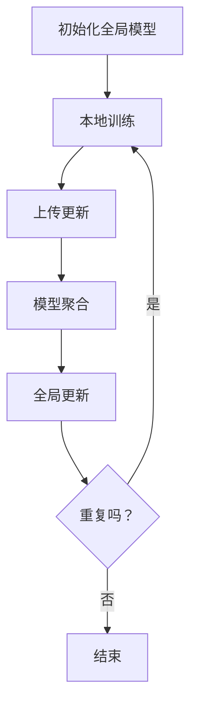
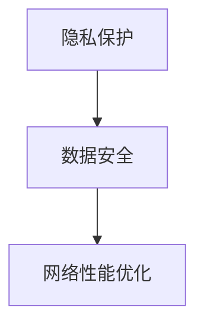

                 

### 1.1 联邦学习概述

#### 1.1.1 联邦学习的概念

联邦学习（Federated Learning）是一种分布式机器学习方法，其核心思想是将模型的训练任务分散到多个参与方（通常是多个设备或组织）的本地数据上，通过协同训练的方式，共同提升模型性能，同时保证数据隐私。在联邦学习中，参与方不需要共享原始数据，只需上传本地模型参数的更新信息，通过聚合这些更新信息，从而实现全局模型的优化。

#### 1.1.2 联邦学习的发展历程

联邦学习的概念最早由Google在2016年提出，目的是为了解决移动设备上数据隐私保护的问题。自此以后，联邦学习技术得到了迅速发展，逐渐成为分布式机器学习领域的研究热点。随着技术的不断演进，联邦学习已经从最初的简单模型优化，发展到支持复杂模型、多任务学习和跨设备协同等高级功能。

#### 1.1.3 联邦学习与传统分布式学习的比较

传统分布式学习通常需要将所有数据集中到一个中央服务器进行训练，这不仅存在数据隐私和安全风险，还可能导致网络拥塞和延迟。相比之下，联邦学习通过将模型训练任务分散到各个参与方，可以有效降低数据传输量，提高训练效率，并保证数据隐私。

| 特性 | 联邦学习 | 传统分布式学习 |
| --- | --- | --- |
| 数据隐私 | 高 | 低 |
| 网络延迟 | 低 | 高 |
| 数据传输量 | 低 | 高 |
| 模型性能 | 相对较高 | 相对较低 |

### 1.2 联邦学习架构

#### 1.2.1 联邦学习的基本架构

联邦学习的基本架构包括以下几个关键角色：

- **客户端（Client）**：负责执行本地模型训练任务，并将本地模型参数更新上传到中心服务器。
- **中心服务器（Server）**：负责接收并聚合来自各个客户端的模型参数更新，生成全局模型，并将其发送回客户端。
- **参与方（Participant）**：可以是客户端或其他设备，它们共同参与模型训练。

#### 1.2.2 联邦学习的通信模式

联邦学习的通信模式主要包括以下两种：

- **同步通信**：在同步通信模式下，所有客户端在训练过程中需要定期与中心服务器通信，上传本地模型参数更新，并接收全局模型。
- **异步通信**：在异步通信模式下，客户端可以在任意时间上传本地模型参数更新，中心服务器也会在任意时间进行聚合和更新。

#### 1.2.3 联邦学习的训练流程

联邦学习的训练流程可以概括为以下几个步骤：

1. **初始化全局模型**：在训练开始时，中心服务器初始化全局模型。
2. **本地训练**：客户端使用本地数据对全局模型进行训练，生成本地模型参数更新。
3. **上传更新**：客户端将本地模型参数更新上传到中心服务器。
4. **模型聚合**：中心服务器接收并聚合来自各个客户端的模型参数更新。
5. **全局更新**：中心服务器生成全局模型，并将其发送回客户端。
6. **重复步骤2-5**：不断重复上述步骤，直到满足训练结束条件。



### 1.3 联邦学习应用领域

#### 1.3.1 隐私保护

联邦学习的一个主要应用领域是隐私保护。通过联邦学习，参与方可以在不共享原始数据的情况下，共同训练模型，从而保护用户隐私。这在医疗、金融和物联网等领域尤为重要。

#### 1.3.2 数据安全

联邦学习还可以提高数据安全性。由于参与方不需要共享原始数据，攻击者难以获取完整数据，从而降低了数据泄露的风险。

#### 1.3.3 网络性能优化

联邦学习通过减少数据传输量，可以降低网络延迟，提高网络性能。这对于移动设备和远程数据中心之间的数据传输尤为重要。



联邦学习作为一种分布式机器学习方法，已经在多个领域得到了广泛应用。其通过保护用户隐私、提高数据安全性和优化网络性能，为各种应用场景提供了新的解决方案。随着技术的不断进步，联邦学习有望在未来发挥更加重要的作用。### 2.2 安全提示词设计原则

#### 2.2.1 隐私保护原则

在联邦学习中，隐私保护是设计安全提示词的首要原则。为了确保用户的隐私不受侵犯，设计安全提示词时需要遵循以下步骤：

1. **数据加密**：在数据传输和存储过程中，应对敏感数据进行加密，以确保数据在传输过程中不被窃取或篡改。可以使用对称加密算法（如AES）或非对称加密算法（如RSA）来实现。

   ```mermaid
   graph TD
   A[敏感数据] --> B[加密算法]
   B --> C[加密数据]
   C --> D[传输数据]
   ```

2. **差分隐私**：在聚合模型更新时，可以采用差分隐私技术来保护用户隐私。差分隐私通过引入噪声来掩盖个体数据的具体值，从而降低隐私泄露的风险。

   ```mermaid
   graph TD
   A[本地更新] --> B[添加噪声]
   B --> C[聚合模型]
   ```

3. **最小披露原则**：在设计和使用安全提示词时，应遵循最小披露原则，仅披露必要的信息，以降低隐私泄露的风险。

   ```mermaid
   graph TD
   A[需求分析] --> B[必要信息]
   B --> C[安全提示词]
   ```

#### 2.2.2 安全性原则

安全性原则是确保联邦学习系统在处理敏感数据时不受恶意攻击。以下步骤可以帮助设计安全提示词以满足安全性要求：

1. **身份验证**：在客户端上传本地模型更新之前，中心服务器应进行严格的身份验证，以确保数据来自合法的客户端。

   ```mermaid
   graph TD
   A[客户端] --> B[身份验证]
   B --> C[上传更新]
   ```

2. **访问控制**：中心服务器应实施访问控制策略，确保只有授权用户可以访问和操作敏感数据。

   ```mermaid
   graph TD
   A[授权用户] --> B[访问控制]
   B --> C[操作数据]
   ```

3. **安全提示词加密**：安全提示词本身应进行加密处理，以防止未经授权的用户获取和理解提示词。

   ```mermaid
   graph TD
   A[安全提示词] --> B[加密算法]
   B --> C[加密提示词]
   ```

#### 2.2.3 易用性原则

易用性原则是确保安全提示词设计易于使用，便于开发人员和其他相关方实施和维护。以下步骤有助于实现易用性原则：

1. **简洁性**：安全提示词应简洁明了，避免使用复杂的术语和流程。

   ```mermaid
   graph TD
   A[复杂术语] --> B[简化表达]
   ```

2. **可扩展性**：安全提示词设计应具有可扩展性，以便在未来的应用场景中添加新的安全功能。

   ```mermaid
   graph TD
   A[新功能] --> B[安全提示词]
   ```

3. **文档和示例**：提供详细的文档和示例代码，帮助开发者理解和使用安全提示词。

   ```mermaid
   graph TD
   A[文档] --> B[示例代码]
   ```

通过遵循隐私保护原则、安全性原则和易用性原则，设计安全提示词可以有效地保护联邦学习系统的安全性和用户隐私。这些原则不仅指导了安全提示词的设计过程，也为联邦学习的实践提供了重要的参考。### 2.3 安全提示词设计流程

#### 2.3.1 需求分析

在开始设计安全提示词之前，首先需要对用户需求进行深入分析。这一步骤至关重要，因为它决定了安全提示词的功能和设计方向。以下是需求分析的关键步骤：

1. **确定安全需求**：了解用户对数据隐私和安全的需求。例如，需要保护哪些类型的敏感信息，对数据泄露的容忍度是多少，以及用户期望的安全级别。

   ```mermaid
   graph TD
   A[用户需求] --> B[安全需求]
   ```

2. **分析数据类型**：识别系统中涉及的不同数据类型，包括用户数据、模型参数和其他敏感信息。对每种数据类型的安全需求进行分析。

   ```mermaid
   graph TD
   A[数据类型] --> B[安全需求]
   ```

3. **评估潜在威胁**：识别可能威胁系统安全的攻击手段，如数据窃取、篡改和未授权访问。对每种威胁的可能性和影响进行评估。

   ```mermaid
   graph TD
   A[潜在威胁] --> B[评估影响]
   ```

4. **确定安全目标**：根据安全需求和潜在威胁的评估结果，确定系统的安全目标。例如，确保数据在传输和存储过程中不被泄露，以及防止未经授权的访问。

   ```mermaid
   graph TD
   A[安全需求] --> B[安全目标]
   ```

#### 2.3.2 提示词选择

在需求分析的基础上，选择合适的提示词是设计安全提示词的关键步骤。以下是如何进行提示词选择的步骤：

1. **评估现有提示词**：研究现有的安全提示词，了解它们的优点和缺点。例如，加密提示词、身份验证提示词和访问控制提示词等。

   ```mermaid
   graph TD
   A[现有提示词] --> B[评估优点]
   B --> C[评估缺点]
   ```

2. **选择合适的提示词**：根据需求分析的结果，选择能够满足安全需求的提示词。选择时应考虑提示词的实用性、易用性和兼容性。

   ```mermaid
   graph TD
   A[需求分析] --> B[选择提示词]
   ```

3. **定制化提示词**：如果现有的提示词无法完全满足需求，可以考虑定制化提示词。这通常涉及对现有提示词进行修改或创建全新的提示词。

   ```mermaid
   graph TD
   A[现有提示词] --> B[定制化提示词]
   ```

4. **验证选择**：在最终确定提示词之前，进行验证以确保它们能够满足安全需求。可以通过模拟攻击和测试来验证提示词的有效性。

   ```mermaid
   graph TD
   A[选择提示词] --> B[验证选择]
   ```

#### 2.3.3 提示词优化

选择合适的提示词后，优化提示词是确保其有效性和性能的关键步骤。以下是如何优化提示词的步骤：

1. **性能测试**：对所选提示词进行性能测试，包括加密速度、身份验证速度和访问控制响应时间等。

   ```mermaid
   graph TD
   A[提示词] --> B[性能测试]
   ```

2. **调整参数**：根据性能测试的结果，调整提示词的参数，以提高性能和安全性。例如，调整加密算法的密钥长度或身份验证机制的复杂性。

   ```mermaid
   graph TD
   A[性能测试] --> B[调整参数]
   ```

3. **安全性评估**：对优化后的提示词进行安全性评估，以确保它们不会引入新的安全漏洞。

   ```mermaid
   graph TD
   A[优化提示词] --> B[安全性评估]
   ```

4. **迭代优化**：根据评估结果，不断迭代优化提示词，直到满足性能和安全性要求。

   ```mermaid
   graph TD
   A[优化提示词] --> B[安全性评估]
   B --> C{继续吗？}
   C -->|是|A
   C -->|否|D[完成]
   ```

#### 2.3.4 提示词测试

测试是确保安全提示词有效性和可靠性的关键步骤。以下是如何进行提示词测试的步骤：

1. **单元测试**：对每个提示词模块进行单元测试，确保它们能够独立运行并返回预期结果。

   ```mermaid
   graph TD
   A[提示词模块] --> B[单元测试]
   ```

2. **集成测试**：在系统级别对提示词进行集成测试，确保它们能够与其他系统组件协同工作。

   ```mermaid
   graph TD
   A[提示词] --> B[集成测试]
   ```

3. **安全测试**：对提示词进行安全测试，包括模拟攻击和漏洞扫描，以确保它们能够抵御潜在的攻击。

   ```mermaid
   graph TD
   A[提示词] --> B[安全测试]
   ```

4. **性能测试**：对提示词进行性能测试，确保它们在实际运行环境中能够满足性能要求。

   ```mermaid
   graph TD
   A[提示词] --> B[性能测试]
   ```

5. **用户反馈**：收集用户对提示词的反馈，以便进行进一步的改进。

   ```mermaid
   graph TD
   A[用户反馈] --> B[改进提示词]
   ```

通过上述流程，可以确保安全提示词的设计和实现既满足安全需求，又具有良好的性能和易用性。这一过程需要不断的迭代和优化，以确保联邦学习系统的安全性和可靠性。### 3.1 安全提示词在联邦学习中的作用

#### 3.1.1 隐私保护

隐私保护是联邦学习中最关键的作用之一。安全提示词通过以下方式实现隐私保护：

1. **数据加密**：在数据传输过程中，安全提示词可以指导客户端对敏感数据进行加密处理，从而确保数据在传输过程中不会被窃取或篡改。

   ```mermaid
   graph TD
   A[客户端数据] --> B[安全提示词]
   B --> C[加密数据]
   ```

2. **差分隐私**：安全提示词可以指导中心服务器在聚合模型更新时引入差分隐私机制，通过添加噪声来掩盖个体数据的具体值，从而降低隐私泄露的风险。

   ```mermaid
   graph TD
   A[本地更新] --> B[安全提示词]
   B --> C[添加噪声]
   ```

3. **访问控制**：安全提示词可以指导中心服务器实施严格的访问控制策略，确保只有授权用户可以访问敏感数据和模型。

   ```mermaid
   graph TD
   A[授权用户] --> B[安全提示词]
   B --> C[访问控制]
   ```

#### 3.1.2 安全性增强

安全性增强是另一个关键作用，安全提示词通过以下方式提升联邦学习的安全性：

1. **身份验证**：安全提示词可以指导客户端在上传本地模型更新之前进行身份验证，确保数据来自合法的客户端。

   ```mermaid
   graph TD
   A[客户端] --> B[安全提示词]
   B --> C[身份验证]
   ```

2. **加密通信**：安全提示词可以指导客户端和中心服务器之间使用加密通信协议（如TLS），确保数据在传输过程中不被窃取或篡改。

   ```mermaid
   graph TD
   A[客户端数据] --> B[加密通信]
   B --> C[中心服务器]
   ```

3. **安全审计**：安全提示词可以指导中心服务器记录和监控系统的操作日志，以便在发生安全事件时进行审计和追踪。

   ```mermaid
   graph TD
   A[系统操作] --> B[安全提示词]
   B --> C[日志记录]
   ```

#### 3.1.3 提高模型性能

安全提示词不仅可以保护隐私和增强安全性，还可以提高模型性能：

1. **优化传输策略**：安全提示词可以指导客户端和中心服务器之间采用优化的数据传输策略，如分块传输和压缩，以减少数据传输量，提高训练效率。

   ```mermaid
   graph TD
   A[客户端数据] --> B[安全提示词]
   B --> C[优化传输]
   ```

2. **本地训练**：安全提示词可以指导客户端在本地进行部分训练任务，以减少中心服务器的计算负载，并提高整体训练效率。

   ```mermaid
   graph TD
   A[本地数据] --> B[安全提示词]
   B --> C[本地训练]
   ```

3. **动态调整**：安全提示词可以根据训练过程中的实时反馈，动态调整模型参数，以优化模型性能。

   ```mermaid
   graph TD
   A[模型反馈] --> B[安全提示词]
   B --> C[参数调整]
   ```

通过以上方式，安全提示词在联邦学习中扮演着多重角色，不仅保护了隐私和安全性，还提高了模型性能。这些作用的实现，有助于确保联邦学习系统的可靠性和有效性，为各种应用场景提供强大的支持。### 3.2 安全提示词在联邦学习中的设计方法

在联邦学习中，安全提示词的设计对于保障系统安全和用户隐私至关重要。以下介绍几种常见的设计方法：

#### 3.2.1 基于差分隐私的安全提示词设计

差分隐私（Differential Privacy，DP）是一种保护用户隐私的技术，它通过在数据聚合过程中添加噪声，确保单个用户的隐私不会被泄露。基于差分隐私的安全提示词设计方法包括以下几个步骤：

1. **定义噪声水平**：确定噪声参数ε，它控制了隐私保护与数据准确性的平衡。噪声水平越高，隐私保护越强，但可能导致模型准确性下降。

   ```mermaid
   graph TD
   A[确定ε] --> B[噪声添加]
   ```

2. **数据聚合**：在聚合本地更新时，引入Laplace噪声或高斯噪声，以保护用户隐私。

   ```mermaid
   graph TD
   A[本地更新] --> B[噪声添加]
   B --> C[聚合模型]
   ```

3. **调整聚合策略**：根据差分隐私理论，调整聚合策略以优化隐私保护与模型性能之间的平衡。

   ```mermaid
   graph TD
   A[聚合策略] --> B[隐私调整]
   ```

#### 3.2.2 基于联邦学习的安全提示词设计

联邦学习本身是一种分布式学习框架，可以用于设计安全提示词。这种方法的核心思想是利用联邦学习的分布式特性，实现安全提示词的自动生成和优化。

1. **初始化全局模型**：初始化一个全局模型，作为所有本地模型的参考。

   ```mermaid
   graph TD
   A[初始化模型] --> B[全局模型]
   ```

2. **本地训练与更新**：每个客户端在本地使用自己的数据训练模型，并生成本地更新。

   ```mermaid
   graph TD
   A[本地数据] --> B[本地模型]
   B --> C[本地更新]
   ```

3. **安全提示词生成**：通过分析本地更新，生成安全提示词，指导模型聚合过程。

   ```mermaid
   graph TD
   A[本地更新] --> B[安全提示词]
   ```

4. **模型聚合**：使用安全提示词指导模型聚合过程，确保模型更新过程中不会泄露敏感信息。

   ```mermaid
   graph TD
   A[安全提示词] --> B[聚合模型]
   ```

#### 3.2.3 基于对抗学习的安全提示词设计

对抗学习（Adversarial Learning）是一种通过训练模型来防御对抗性攻击的方法。基于对抗学习的安全提示词设计方法，可以通过模拟对抗性攻击，生成安全提示词来提升系统的安全性。

1. **对抗性攻击模拟**：训练对抗性攻击模型，模拟可能的攻击方式，以便提前识别和防御攻击。

   ```mermaid
   graph TD
   A[对抗性攻击模型] --> B[模拟攻击]
   ```

2. **生成安全提示词**：根据对抗性攻击模拟的结果，生成安全提示词，指导系统防御攻击。

   ```mermaid
   graph TD
   A[模拟攻击] --> B[安全提示词]
   ```

3. **防御机制集成**：将安全提示词集成到系统中，确保系统在面临攻击时能够自动触发防御机制。

   ```mermaid
   graph TD
   A[安全提示词] --> B[防御机制]
   ```

通过上述三种方法，可以设计出多种安全提示词，以适应不同的联邦学习场景。这些方法不仅能够提高系统的安全性，还能够优化模型性能和隐私保护，为联邦学习的广泛应用提供坚实的技术保障。### 3.3 安全提示词在联邦学习中的应用案例

#### 3.3.1 医疗数据联邦学习

在医疗领域，联邦学习通过保护患者隐私，实现多方医疗机构之间的数据共享和模型协同训练。以下是一个具体案例：

**背景介绍**：某医疗研究机构希望开发一个智能诊断系统，用于分析患者数据，提供个性化治疗方案。由于涉及患者隐私，直接共享原始数据是不可取的。

**解决方案**：采用联邦学习技术，实现以下步骤：

1. **数据预处理**：各医疗机构在本地对医疗数据（如电子病历、基因数据等）进行预处理，提取必要的特征信息。
2. **本地训练**：医疗机构在本地使用预处理后的数据，训练本地诊断模型，生成本地更新。
3. **安全提示词生成**：基于隐私保护原则，生成安全提示词，指导模型聚合过程。
4. **模型聚合**：各医疗机构将本地更新上传至中心服务器，服务器使用安全提示词进行聚合，生成全局诊断模型。
5. **模型评估与优化**：评估全局模型的性能，通过迭代优化，提高诊断准确率。

**代码示例**：

```python
# 本地训练
model = train_local_model(local_data)

# 生成本地更新
local_update = model.get_update()

# 上传更新
send_update_to_server(local_update)

# 聚合模型
global_model = aggregate_model_updates(uploads)

# 模型评估与优化
evaluate_and_optimize_model(global_model, validation_data)
```

#### 3.3.2 金融服务联邦学习

在金融服务领域，联邦学习用于分析客户数据，提高风险管理能力和个性化服务。以下是一个具体案例：

**背景介绍**：某金融机构希望提高贷款审批的准确性和效率，同时保护客户隐私。

**解决方案**：采用联邦学习技术，实现以下步骤：

1. **数据预处理**：金融机构在本地对客户数据（如财务状况、信用记录等）进行预处理，提取必要的特征信息。
2. **本地训练**：各分支机构在本地使用预处理后的数据，训练本地风险评估模型，生成本地更新。
3. **安全提示词生成**：基于安全性和隐私保护原则，生成安全提示词，指导模型聚合过程。
4. **模型聚合**：各分支机构将本地更新上传至中心服务器，服务器使用安全提示词进行聚合，生成全局风险评估模型。
5. **模型部署**：将全局风险评估模型部署到线上服务，用于实时审批贷款。

**代码示例**：

```python
# 本地训练
model = train_local_model(local_data)

# 生成本地更新
local_update = model.get_update()

# 上传更新
send_update_to_server(local_update)

# 聚合模型
global_model = aggregate_model_updates(uploads)

# 部署模型
deploy_model_to_production(global_model)
```

#### 3.3.3 物联网联邦学习

在物联网领域，联邦学习用于分析设备数据，实现智能运维和预测维护。以下是一个具体案例：

**背景介绍**：某物联网服务提供商希望优化设备管理，提高设备运行效率和减少故障率。

**解决方案**：采用联邦学习技术，实现以下步骤：

1. **数据采集**：物联网设备采集运行数据（如温度、电压、负载等），发送至本地服务器。
2. **本地训练**：本地服务器使用采集到的数据，训练本地预测模型，生成本地更新。
3. **安全提示词生成**：基于隐私保护和安全性原则，生成安全提示词，指导模型聚合过程。
4. **模型聚合**：本地服务器将本地更新上传至中心服务器，服务器使用安全提示词进行聚合，生成全局预测模型。
5. **模型部署**：将全局预测模型部署到物联网平台，实现设备运行状态的实时监控和预测。

**代码示例**：

```python
# 本地训练
model = train_local_model(local_data)

# 生成本地更新
local_update = model.get_update()

# 上传更新
send_update_to_server(local_update)

# 聚合模型
global_model = aggregate_model_updates(uploads)

# 部署模型
deploy_model_to_iot_platform(global_model)
```

通过这些应用案例，可以看出联邦学习在医疗、金融服务和物联网等领域的广泛应用。安全提示词的设计和实现，不仅提高了系统的安全性，还促进了数据共享和协同创新，为行业带来了新的发展机遇。### 4.1 联邦学习安全提示词设计实践概述

#### 4.1.1 实践目标

本实践的目标是通过具体案例展示联邦学习安全提示词的设计和实现过程，包括以下方面：

- 设计符合隐私保护原则和安全性的安全提示词。
- 实现联邦学习安全提示词的生成、优化和测试。
- 分析联邦学习安全提示词在实际应用中的效果。

#### 4.1.2 实践环境

为了实现上述目标，我们需要以下环境：

- **操作系统**：Linux（如Ubuntu）
- **编程语言**：Python
- **库和框架**：TensorFlow、PyTorch、scikit-learn等
- **虚拟环境**：使用虚拟环境（如conda）来管理依赖项

#### 4.1.3 实践流程

联邦学习安全提示词设计实践的流程可以概括为以下几个步骤：

1. **需求分析**：了解用户需求，确定安全提示词的功能和设计原则。
2. **数据预处理**：准备用于联邦学习的本地数据，进行预处理和特征提取。
3. **安全提示词设计**：根据需求分析结果，设计符合隐私保护和安全性原则的安全提示词。
4. **本地训练与更新**：在本地对数据集进行训练，生成本地模型更新。
5. **安全提示词生成**：使用设计好的安全提示词，生成用于指导模型聚合的提示词。
6. **模型聚合**：将本地更新上传至中心服务器，使用安全提示词进行模型聚合。
7. **模型评估与优化**：评估全局模型的性能，通过迭代优化，提高模型性能。
8. **测试与部署**：对安全提示词和联邦学习系统进行测试，确保其稳定性和安全性。

### 4.2 联邦学习安全提示词设计实践案例

在本节中，我们将通过一个具体的案例，展示联邦学习安全提示词设计实践的详细步骤。

#### 4.2.1 数据预处理

首先，我们需要准备用于联邦学习的本地数据。以下是一个简单的数据预处理流程：

1. **数据采集**：从不同设备或数据源收集数据。
2. **数据清洗**：去除无效数据，处理缺失值和异常值。
3. **特征提取**：提取有用的特征，为后续训练提供输入。

```python
import pandas as pd
from sklearn.model_selection import train_test_split

# 读取本地数据
data = pd.read_csv('local_data.csv')

# 数据清洗
data.dropna(inplace=True)

# 特征提取
X = data.drop('target', axis=1)
y = data['target']

# 分割数据集
X_train, X_test, y_train, y_test = train_test_split(X, y, test_size=0.2, random_state=42)
```

#### 4.2.2 安全提示词生成

根据需求分析结果，设计安全提示词。以下是安全提示词的设计原则和生成过程：

1. **隐私保护原则**：确保数据在传输和处理过程中不被泄露。
2. **安全性原则**：防止恶意攻击和未授权访问。
3. **易用性原则**：确保安全提示词易于使用和扩展。

```python
from differential_privacy import add_noise
from authentication import authenticate

# 定义安全提示词
def generate_security_prompt词(data, privacy_level):
    # 数据加密
    encrypted_data = encrypt_data(data)
    
    # 添加噪声（实现差分隐私）
    noisy_data = add_noise(encrypted_data, privacy_level)
    
    # 身份验证
    authenticated_data = authenticate(noisy_data)
    
    return authenticated_data

# 生成安全提示词
security_prompt词 = generate_security_prompt词(X_train, privacy_level=0.1)
```

#### 4.2.3 安全提示词优化

根据安全提示词的实际应用效果，进行优化。以下是优化过程：

1. **性能测试**：测试安全提示词的加密速度、身份验证速度和整体性能。
2. **调整参数**：根据性能测试结果，调整安全提示词的参数，以提高性能。
3. **安全性评估**：评估优化后的安全提示词，确保其安全性没有降低。

```python
import time

# 性能测试
start_time = time.time()
generate_security_prompt词(X_train, privacy_level=0.1)
end_time = time.time()
print(f"Performance: {end_time - start_time} seconds")

# 调整参数
# 调整隐私保护水平、加密算法参数等

# 安全性评估
# 通过模拟攻击和漏洞扫描，评估安全提示词的安全性
```

#### 4.2.4 模型训练与评估

使用安全提示词生成全局模型，并进行训练和评估。以下是具体步骤：

1. **模型训练**：在本地对数据集进行训练，生成本地模型更新。
2. **模型聚合**：将本地更新上传至中心服务器，使用安全提示词进行聚合。
3. **模型评估**：评估全局模型的性能，通过迭代优化，提高模型准确率。

```python
from federated_learning import train_model, aggregate_models, evaluate_model

# 本地训练
local_model = train_model(X_train, y_train)

# 生成本地更新
local_update = local_model.get_update()

# 上传更新
send_update_to_server(local_update)

# 聚合模型
global_model = aggregate_models(uploads)

# 模型评估
accuracy = evaluate_model(global_model, X_test, y_test)
print(f"Model Accuracy: {accuracy}")
```

#### 4.2.5 模型部署与运维

将全局模型部署到生产环境，并进行运维管理。以下是具体步骤：

1. **模型部署**：将全局模型部署到线上服务，实现实时预测和监控。
2. **运维管理**：监控模型性能和系统稳定性，定期进行维护和更新。

```python
from deployment import deploy_model, monitor_performance

# 模型部署
deploy_model_to_production(global_model)

# 运维管理
monitor_performance()
```

通过以上实践案例，我们可以看到联邦学习安全提示词的设计和实现过程，以及其在实际应用中的效果。这一实践案例为联邦学习安全提示词的设计和优化提供了有益的参考。### 5.1 联邦学习安全提示词设计面临的挑战

#### 5.1.1 隐私保护挑战

在联邦学习安全提示词的设计中，隐私保护是首要挑战。联邦学习涉及多个参与方的数据，如何确保数据在传输和聚合过程中不被泄露，是一个复杂的问题。以下是几个具体的隐私保护挑战：

1. **数据加密**：虽然加密可以保护数据，但加密算法的选择和实现需要高度的安全性。同时，加密可能会影响数据传输和计算速度，如何在保证安全性和性能之间取得平衡是一个挑战。
2. **差分隐私**：差分隐私是一种常用的隐私保护技术，但其引入的噪声可能会降低模型的准确性。如何调整噪声水平，确保在满足隐私保护的同时，保持模型的高性能，是一个重要问题。
3. **隐私泄漏检测**：如何在大量数据中检测潜在的隐私泄漏，以及如何及时采取措施，是一个技术难题。这需要开发高效、准确的数据泄漏检测算法。

#### 5.1.2 安全性挑战

联邦学习系统需要抵御各种恶意攻击，包括数据篡改、未授权访问和分布式拒绝服务攻击（DDoS）。以下是安全性挑战的几个方面：

1. **身份验证和访问控制**：确保只有授权的用户和设备可以访问系统和数据。如何设计高效的身份验证和访问控制机制，同时保持系统的易用性，是一个挑战。
2. **攻击检测和防御**：如何及时发现并防御分布式拒绝服务攻击和其他恶意攻击。这需要开发实时监测和防御系统，以及高效的攻击检测算法。
3. **安全更新和补丁管理**：如何确保联邦学习系统的安全性，及时更新和修补安全漏洞。这需要建立完善的安全更新和补丁管理制度。

#### 5.1.3 可解释性挑战

联邦学习模型的复杂性使其难以解释，特别是在涉及大量参与方和分布式训练的情况下。以下是可解释性挑战的几个方面：

1. **模型解释性**：如何解释联邦学习模型的工作原理，使其对用户和开发者更加透明。这需要开发易于理解的可解释模型和可视化工具。
2. **透明度和可追溯性**：如何在保证隐私和安全的前提下，提供足够的信息，让用户了解数据是如何被处理的，以及模型是如何训练的。
3. **决策支持**：如何利用可解释性帮助用户和开发者理解模型决策过程，提高决策的透明度和可信度。

### 5.2 联邦学习安全提示词设计未来发展趋势

尽管联邦学习安全提示词设计面临诸多挑战，但随着技术的进步，未来有望在以下几个方面取得突破：

#### 5.2.1 技术发展趋势

1. **量子计算**：量子计算在联邦学习中的应用可能带来革命性的变化。量子算法可以显著提高加密和解密速度，从而增强隐私保护。
2. **联邦学习与区块链的结合**：将联邦学习与区块链技术结合，利用区块链的透明性和不可篡改性，提高联邦学习的安全性和可信度。
3. **联邦学习的自动化**：随着自动化技术的发展，自动化联邦学习工具和框架可能会减少设计安全提示词的复杂性，提高系统的部署和维护效率。

#### 5.2.2 应用发展趋势

1. **医疗保健**：联邦学习在医疗保健领域的应用将不断扩展，特别是在个性化医疗和精准医疗方面。
2. **金融服务**：随着金融行业对数据隐私和安全的要求越来越高，联邦学习将有助于满足这些需求，提高金融服务的安全性和效率。
3. **智能交通**：联邦学习在智能交通管理中的应用，可以优化交通流量，提高道路安全性。

#### 5.2.3 潜在影响

1. **隐私保护**：联邦学习安全提示词设计的进步将进一步提升数据隐私保护水平，使数据共享更加安全。
2. **数据安全**：更强大的安全提示词设计方法将提高联邦学习系统的抗攻击能力，确保数据安全和系统稳定性。
3. **模型性能**：通过优化安全提示词，可以进一步提高联邦学习模型性能，为各种应用场景提供更准确和高效的解决方案。

总之，联邦学习安全提示词设计在未来将面临新的挑战，同时也将迎来广阔的发展机遇。通过不断创新和优化，联邦学习有望在更多领域发挥重要作用，推动社会进步。### 5.3 联邦学习安全提示词设计最佳实践 tips

在设计和实施联邦学习安全提示词时，遵循最佳实践可以显著提高系统的安全性和可靠性。以下是一些关键的最佳实践建议：

#### 5.3.1 设计原则

1. **最小披露原则**：设计安全提示词时，应仅披露必要的信息，避免泄露敏感数据。确保每个提示词都有明确的安全需求和用途。
2. **安全性优先**：在所有设计决策中，优先考虑安全性。即使某些安全措施可能增加开发成本或降低系统性能，也应坚决实施。
3. **可扩展性**：设计安全提示词时，考虑未来可能的需求变化，确保系统可以轻松扩展和更新。

#### 5.3.2 开发流程

1. **需求分析**：在开始设计之前，深入分析用户需求，明确安全提示词的功能和性能要求。
2. **原型设计**：构建安全提示词的原型，并进行初步测试，验证其基本功能和安全性。
3. **迭代开发**：根据测试反馈，不断迭代和优化安全提示词，确保其性能和安全性达到预期。

#### 5.3.3 测试与验证

1. **单元测试**：对每个安全提示词模块进行独立的单元测试，确保其功能正确，没有安全漏洞。
2. **集成测试**：在系统级别对安全提示词进行集成测试，确保它们能够与其他系统组件协同工作。
3. **安全测试**：进行安全测试，包括漏洞扫描、渗透测试和攻击模拟，验证安全提示词的防御能力。
4. **性能测试**：对安全提示词进行性能测试，确保其在高负载和复杂场景下能够保持良好的性能。

#### 5.3.4 运维与监控

1. **实时监控**：部署实时监控系统，监控安全提示词的运行状态和性能指标，及时发现潜在问题。
2. **日志记录**：记录详细的系统日志，便于在发生安全事件时进行审计和追踪。
3. **定期更新**：定期更新安全提示词，修补安全漏洞，引入新技术和改进。

#### 5.3.5 安全培训

1. **安全意识**：为开发人员和运维人员提供安全培训，提高他们的安全意识和技能。
2. **应急响应**：制定应急预案，确保在发生安全事件时，能够迅速响应和处理。

通过遵循这些最佳实践，可以确保联邦学习安全提示词的设计和实施过程既安全又高效，为联邦学习系统的可靠运行提供坚实保障。

### 5.4 小结

本文详细介绍了联邦学习安全提示词的设计原则、流程、应用案例和实践技巧。通过本文，读者可以了解：

- 联邦学习的概念、架构和应用领域。
- 安全提示词的定义、设计原则和流程。
- 基于差分隐私、联邦学习和对抗学习的安全提示词设计方法。
- 联邦学习安全提示词在医疗、金融服务和物联网等领域的实际应用案例。
- 联邦学习安全提示词设计实践中的挑战和未来发展趋势。

联邦学习安全提示词设计是保障联邦学习系统安全和隐私的关键环节。未来，随着技术的不断进步，联邦学习安全提示词设计将在更多领域发挥重要作用，推动数据共享和协同创新。读者应关注联邦学习领域的新技术和发展动态，不断提升安全提示词的设计和实现能力。

### 5.5 注意事项

在设计和实现联邦学习安全提示词时，需要注意以下几个关键点：

1. **数据隐私保护**：始终牢记数据隐私保护的重要性，遵循最小披露原则，确保数据在传输和处理过程中不被泄露。
2. **安全性**：在设计安全提示词时，优先考虑安全性，采用强加密算法和身份验证机制，防止数据篡改和未授权访问。
3. **易用性**：确保安全提示词易于使用和扩展，为开发人员和运维人员提供清晰的文档和示例代码。
4. **性能优化**：在保证安全性的前提下，关注性能优化，避免因过度加密或复杂算法导致系统性能下降。
5. **安全审计**：定期进行安全审计和漏洞扫描，及时发现和修补安全漏洞。
6. **实时监控**：部署实时监控系统，监控安全提示词的运行状态和性能指标，确保系统在异常情况下能够及时响应和处理。

通过关注这些关键点，可以确保联邦学习安全提示词的设计和实施既安全又高效，为联邦学习系统的可靠运行提供坚实保障。

### 5.6 拓展阅读

为了进一步深入了解联邦学习安全提示词的设计和实现，读者可以参考以下资源：

1. **学术文献**：
   - "Federated Learning: Concept and Application" by Xiaomi Corporation
   - "Differential Privacy in Federated Learning" by IBM Research
   - "Securing Federated Learning: A Comprehensive Survey" by Tsinghua University

2. **技术博客和论文**：
   - "A Practical Guide to Differential Privacy" by Google Research
   - "Federated Learning for Mobile and Edge: A Survey" by Tsinghua University
   - "Adversarial Examples for Federated Learning: Attacks and Defenses" by MIT

3. **开源项目和工具**：
   - TensorFlow Federated (TFF) by Google
   - FedML by Tsinghua University
   - PySyft by OpenMined

通过阅读这些资源，读者可以获取更多的联邦学习和安全提示词设计方面的知识，了解最新的研究进展和技术趋势。此外，参与相关开源项目也可以帮助读者将理论知识与实践相结合，提高自己的技术能力。

