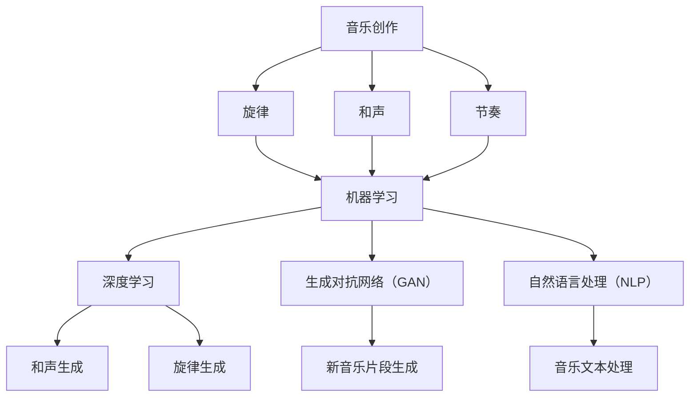

                 


### 引言

音乐，作为一种独特的艺术形式，自古以来就与人类的情感和生活紧密相连。从古代的民歌、民谣，到现代的流行音乐、古典音乐，音乐创作一直是艺术创作的重要组成部分。然而，随着科技的不断发展，人工智能（AI）开始逐渐渗透到音乐创作的领域，为音乐创作者提供了全新的创作工具和灵感来源。

近年来，AI在音乐创作中的应用取得了显著的成果。从自动旋律生成、和声设计，到完整的音乐编排和制作，AI助手已经成为许多音乐人不可或缺的伙伴。本文旨在探讨AI在音乐创作中的应用，特别是提示词引导的作曲助手，通过一步一步的分析和推理，揭示AI音乐创作的核心原理和应用场景。

我们将首先介绍音乐创作的基本概念和AI技术的基础，探讨音乐创作与AI之间的关系。接着，我们将详细讨论AI在音乐创作中的具体应用，包括旋律、和声、节奏等方面的自动生成技术。然后，我们将聚焦于提示词引导的作曲助手，分析其原理和实现方法。最后，我们将介绍一些主流的音乐AI工具，并通过实际案例研究，展示AI音乐创作在实际中的应用效果。

通过这篇文章，我们希望能够为读者提供一个全面、深入的了解，使大家能够更好地理解AI在音乐创作中的潜力，以及如何利用AI工具提升音乐创作的效率和创造力。

### 文章关键词

- 音乐创作
- 人工智能
- 提示词
- 自动作曲
- 机器学习
- 和声生成
- 节奏生成
- AI助手
- 流行音乐
- 古典音乐
- 电子音乐

### 文章摘要

本文将探讨人工智能（AI）在音乐创作中的应用，特别是通过提示词引导的作曲助手。首先，我们将介绍音乐创作的基本概念和AI技术的基础，探讨音乐创作与AI之间的关系。接着，我们将详细讨论AI在音乐创作中的具体应用，包括自动旋律生成、和声设计以及节奏生成等技术。随后，我们将深入分析提示词引导的作曲助手的原理和实现方法。在此基础上，我们将介绍一些主流的音乐AI工具，并通过实际案例研究，展示AI音乐创作在实际中的应用效果。最后，我们将对AI音乐创作的未来进行展望，并探讨面临的挑战和解决方案。

### 背景介绍

音乐创作是艺术领域中的一个重要分支，它不仅承载了人类情感的表达，还反映了不同文化和社会的历史变迁。从古代的民歌、民谣，到现代的流行音乐、古典音乐，音乐创作始终伴随着人类的发展。音乐创作的过程复杂且充满创造性，通常包括旋律、和声、节奏等多个方面的设计。

然而，随着科技的进步，特别是人工智能（AI）技术的兴起，音乐创作的方式正在发生深刻的变革。AI技术在音乐创作中的应用，不仅提高了创作的效率，还丰富了创作的手段和形式。

首先，AI技术可以帮助音乐人快速生成旋律。通过机器学习和深度学习算法，AI可以分析大量的音乐数据，从中提取出旋律的模式和特征，然后根据这些模式生成新的旋律。例如，Google的Magenta项目就是利用深度学习算法来生成音乐旋律的一个成功案例。

其次，AI在音乐创作中的和声设计也取得了显著进展。和声是音乐创作中至关重要的部分，它决定了音乐的情感和氛围。传统的和声设计往往依赖于音乐理论和经验，而AI通过分析大量的和声数据，可以自动生成符合音乐理论规范的和声组合，甚至创造出新的和声风格。例如，AIVA（Artificial Intelligence Virtual Artist）是一款利用AI进行和声生成的软件，它可以生成各种风格的音乐和声。

最后，AI在节奏生成方面的应用同样具有重要意义。节奏是音乐的骨架，它为旋律和和声提供了时间和空间的框架。通过分析音乐节奏的模式和变化，AI可以自动生成具有独特节奏感的音乐片段，甚至创造出复杂的节奏组合。例如，IBM的Watson可以分析音乐节奏，并生成符合特定情感和氛围的节奏。

总的来说，AI技术在音乐创作中的应用，为音乐人提供了强大的创作工具和灵感来源。通过自动生成旋律、和声和节奏，AI不仅提高了音乐创作的效率，还拓展了音乐创作的可能性。这些技术的不断发展，必将对音乐创作产生深远的影响。

### 核心概念与联系

在探讨AI在音乐创作中的应用之前，我们需要明确几个核心概念，并了解它们之间的联系和架构。以下是几个关键概念及其相互关系的详细说明：

#### 1. 机器学习

机器学习是AI的核心技术之一，它使得计算机系统能够从数据中自动学习，并通过经验改进性能。在音乐创作中，机器学习算法可以用来分析大量的音乐数据，从中提取旋律、和声和节奏的模式，并利用这些模式生成新的音乐作品。

- **概念联系**：机器学习算法可以训练模型，从现有的音乐数据中提取特征，然后使用这些特征生成新的旋律或和声。

#### 2. 深度学习

深度学习是机器学习的一种高级形式，它通过多层神经网络模型来模拟人脑的学习过程。深度学习在音乐创作中的应用尤为广泛，因为它能够处理复杂的输入数据，如音频信号，并生成复杂的输出，如完整的音乐作品。

- **概念联系**：深度学习算法能够处理和生成复杂的音乐结构，通过训练模型可以学会识别和生成不同的音乐风格和元素。

#### 3. 生成对抗网络（GAN）

生成对抗网络是一种深度学习模型，它由两个相互竞争的网络组成：生成器和判别器。生成器试图生成逼真的数据，而判别器则试图区分生成器和真实数据。GAN在音乐创作中可以用来生成全新的音乐片段，这些片段在听觉上几乎无法与真实音乐区分。

- **概念联系**：GAN可以生成全新的旋律和和声，通过不断的迭代优化，生成器能够生成具有多样性和创意性的音乐。

#### 4. 自然语言处理（NLP）

自然语言处理是AI领域的一个重要分支，它专注于理解和生成人类语言。在音乐创作中，NLP可以用来处理音乐描述文本，如歌词或音乐提示词，从而指导音乐生成过程。

- **概念联系**：NLP可以解析和生成与音乐相关的文本信息，如根据歌词生成相应的旋律或和声。

#### 5. 谐音和节奏

谐音和节奏是音乐创作中的基本元素，它们共同构成了音乐的结构和情感。谐音指的是音乐中的和声关系，而节奏则是指音乐的时间安排和节拍。

- **概念联系**：机器学习算法可以用来分析音乐数据，提取谐音和节奏的模式，然后根据这些模式生成新的音乐作品。

#### 6. 和声和旋律

和声和旋律是音乐创作中的两个核心部分，和声决定了音乐的色彩和氛围，而旋律则是音乐的核心和灵魂。

- **概念联系**：机器学习模型可以同时分析旋律和和声数据，生成具有和谐和声关系的旋律。

#### 7. 曲式结构

曲式结构是音乐作品的基本框架，它包括旋律、和声、节奏等多个元素的组织方式。

- **概念联系**：深度学习算法可以学习不同的曲式结构，并生成符合特定曲式结构的新音乐作品。

为了更直观地展示这些概念之间的联系，我们可以使用Mermaid流程图来表示：



这个Mermaid流程图清晰地展示了音乐创作中的核心概念及其相互关系，为我们进一步探讨AI在音乐创作中的应用奠定了基础。

### 机器学习在音乐创作中的核心算法原理

在探讨AI在音乐创作中的应用时，机器学习技术扮演了至关重要的角色。机器学习通过训练模型，使计算机能够从大量的数据中自动提取模式和知识，从而实现各种复杂的任务。以下是机器学习在音乐创作中的核心算法原理，以及如何利用这些算法生成音乐。

#### 1. 自编码器（Autoencoder）

自编码器是一种无监督学习算法，它通过学习输入数据的编码和解码过程来提取数据的主要特征。在音乐创作中，自编码器可以用来学习音乐数据的高层特征，并生成新的音乐片段。

- **算法原理**：
  - 编码过程：将输入的音乐数据（如旋律、和声、节奏）映射到一个较低维的特征空间。
  - 解码过程：从特征空间中生成原始音乐数据的近似版本。
- **伪代码示例**：

```python
# 自编码器伪代码
def autoencoder(input_data):
    # 编码过程
    encoded = encode(input_data)
    # 解码过程
    reconstructed = decode(encoded)
    return reconstructed
```

#### 2. 变分自编码器（Variational Autoencoder, VAE）

变分自编码器是一种改进的自编码器，它通过引入概率模型来生成数据。在音乐创作中，VAE可以生成具有多样性和创意性的音乐片段。

- **算法原理**：
  - 编码过程：将输入的音乐数据编码为一个潜在空间中的向量。
  - 采样过程：从潜在空间中采样生成新的音乐片段。
  - 解码过程：将采样得到的潜在向量解码为音乐数据。
- **伪代码示例**：

```python
# 变分自编码器伪代码
def variational_autoencoder(input_data):
    # 编码过程
    z, z_mean, z_log_var = encode(input_data)
    # 采样过程
    z_sample = sample(z_mean, z_log_var)
    # 解码过程
    reconstructed = decode(z_sample)
    return reconstructed
```

#### 3. 生成对抗网络（Generative Adversarial Network, GAN）

生成对抗网络由生成器和判别器两个神经网络组成，它们相互竞争以提高生成数据的逼真度。在音乐创作中，GAN可以生成高质量的、多样化的音乐片段。

- **算法原理**：
  - 生成器：生成逼真的音乐数据。
  - 判别器：判断生成数据与真实音乐数据的相似度。
  - 生成器和判别器通过对抗训练不断优化。
- **伪代码示例**：

```python
# 生成对抗网络伪代码
def generative_adversarial_network(input_data):
    # 生成器训练
    generator.train(input_data)
    # 判别器训练
    discriminator.train(input_data, generator.output)
    # 生成器与判别器交替训练
    for _ in range(num_epochs):
        generator.train(input_data)
        discriminator.train(input_data, generator.output)
    return generator.output
```

#### 4. 卷积神经网络（Convolutional Neural Network, CNN）

卷积神经网络在图像处理领域表现出色，但在音乐创作中也有广泛应用。通过卷积层，CNN可以提取音乐数据中的局部特征，如节奏和和声。

- **算法原理**：
  - 卷积层：提取输入数据的局部特征。
  - 池化层：减少数据的维度。
  - 全连接层：进行分类或回归。
- **伪代码示例**：

```python
# 卷积神经网络伪代码
def convolutional_neural_network(input_data):
    # 卷积层
    features = conv2d(input_data)
    # 池化层
    pooled_features = max_pool2d(features)
    # 全连接层
    output = fully_connected(pooled_features)
    return output
```

#### 5. Transformer模型

Transformer模型在自然语言处理领域取得了巨大成功，但其应用也在逐渐扩展到音乐创作。通过自注意力机制，Transformer可以捕捉音乐数据中的长距离依赖关系。

- **算法原理**：
  - 自注意力机制：为每个输入元素分配不同的权重，从而捕捉元素之间的关系。
  - 编码器和解码器：分别处理输入和输出，实现端到端的序列生成。
- **伪代码示例**：

```python
# Transformer模型伪代码
def transformer(input_sequence):
    # 编码器
    encoded = encoder(input_sequence)
    # 解码器
    output_sequence = decoder(encoded)
    return output_sequence
```

通过这些机器学习算法，我们可以从数据中提取有用的特征，生成具有多样性和创意性的音乐片段。这些算法不仅在理论研究上具有重要意义，还在实际应用中展现了巨大的潜力。

### 和声生成的算法原理

和声是音乐创作中不可或缺的一部分，它为旋律赋予了情感和色彩。在AI音乐创作中，和声生成算法是实现自动化和声设计的关键。以下将介绍几种常见的和声生成算法原理，并使用伪代码详细阐述其实现过程。

#### 1. 和声规则生成

和声规则生成是一种基于传统音乐理论和规则的方法。通过预设的和声规则，计算机可以自动生成符合音乐理论规范的和声进行。

- **算法原理**：

  - 和声规则库：包含各种和声组合的规则，如和弦的构成、转位、连接等。
  - 旋律分析：分析输入旋律的音高和节奏，确定当前和弦。
  - 和声生成：根据当前和弦和和声规则，生成下一个和弦。

- **伪代码示例**：

  ```python
  # 和声规则生成伪代码
  def harmony_rules_generator( melody ):
      current_chord = analyze_melody( melody )
      next_chord = apply_harmony_rules( current_chord )
      return next_chord

  def analyze_melody( melody ):
      # 分析旋律的音高和节奏
      return chord_based_on_melody

  def apply_harmony_rules( current_chord ):
      # 应用和声规则
      return next_chord
  ```

#### 2. 基于机器学习的和声生成

基于机器学习的和声生成利用大量音乐数据训练模型，使计算机能够自动生成符合音乐理论的新和声组合。

- **算法原理**：

  - 数据训练：使用大量标注好的音乐数据进行训练，提取和声特征。
  - 模型训练：使用和声特征训练模型，使其能够预测下一个和弦。
  - 和声生成：根据当前旋律和模型预测，生成新的和声组合。

- **伪代码示例**：

  ```python
  # 基于机器学习的和声生成伪代码
  def machine_learning_harmony_generator( melody, trained_model ):
      current_chord = analyze_melody( melody )
      next_chord = trained_model.predict( current_chord )
      return next_chord

  def analyze_melody( melody ):
      # 分析旋律的音高和节奏
      return chord_based_on_melody

  # 训练模型
  trained_model = train_model( labeled_data )
  ```

#### 3. 基于深度学习的和声生成

深度学习算法，如生成对抗网络（GAN）和变分自编码器（VAE），可以用于生成高质量的、多样化的和声组合。

- **算法原理**：

  - 生成器与判别器：GAN中的生成器和判别器相互对抗，生成逼真的和声。
  - 潜在空间采样：VAE通过潜在空间采样生成新的和声组合。

- **伪代码示例**：

  ```python
  # 基于GAN的深度学习和声生成伪代码
  def generative_adversarial_harmony_generator( melody ):
      encoded_melody = encode_melody( melody )
      harmony = generator.sample( encoded_melody )
      return harmony

  def encode_melody( melody ):
      # 编码旋律
      return encoded_melody

  def generative_adversarial_network( input_data ):
      generator.train( input_data )
      discriminator.train( input_data, generator.output )
      return generator.output
  ```

通过这些算法，AI能够自动生成各种风格和情感的和声，为音乐创作提供了丰富的创意工具。这些算法不仅提高了和声生成的效率，还拓展了和声设计的可能性，为音乐人带来了更多的创作灵感。

### 节奏生成的算法原理

节奏是音乐的骨架，它为旋律和和声提供了时间和空间的框架。在AI音乐创作中，节奏生成算法能够自动生成具有多样性和创意性的节奏模式，从而丰富音乐作品的节奏层次。以下将介绍几种常见的节奏生成算法原理，并使用伪代码详细阐述其实现过程。

#### 1. 基于规则的节奏生成

基于规则的节奏生成方法通过预设的节奏规则来生成简单的节奏模式。这种方法简单直观，适用于初学者和快速生成基本节奏。

- **算法原理**：

  - 节奏规则库：包含各种节奏模式，如简单节奏、复杂节奏、节奏变化等。
  - 节奏生成：根据当前节奏和规则，生成下一个节奏模式。

- **伪代码示例**：

  ```python
  # 基于规则的节奏生成伪代码
  def rule_based_rhythm_generator(current_rhythm):
      rhythm_rules = get_rhythm_rules(current_rhythm)
      next_rhythm = apply_rhythm_rules(rhythm_rules)
      return next_rhythm

  def get_rhythm_rules(current_rhythm):
      # 获取节奏规则
      return rhythm_rules

  def apply_rhythm_rules(rhythm_rules):
      # 应用节奏规则
      return next_rhythm
  ```

#### 2. 基于数据驱动的节奏生成

基于数据驱动的节奏生成方法通过分析大量的音乐数据，学习并生成复杂的节奏模式。这种方法能够生成具有多样性和创意性的节奏，适用于专业音乐人和复杂的音乐创作。

- **算法原理**：

  - 数据训练：使用大量标注好的音乐数据进行训练，提取节奏特征。
  - 模型训练：使用节奏特征训练模型，使其能够预测下一个节奏模式。
  - 节奏生成：根据当前节奏和模型预测，生成新的节奏模式。

- **伪代码示例**：

  ```python
  # 基于数据驱动的节奏生成伪代码
  def data_driven_rhythm_generator(melody, trained_model):
      current_rhythm = analyze_melody(melody)
      next_rhythm = trained_model.predict(current_rhythm)
      return next_rhythm

  def analyze_melody(melody):
      # 分析旋律的音高和节奏
      return rhythm_based_on_melody

  # 训练模型
  trained_model = train_model(labeled_rhythm_data)
  ```

#### 3. 基于深度学习的节奏生成

深度学习算法，如卷积神经网络（CNN）和生成对抗网络（GAN），可以用于生成复杂的、多样化的节奏模式。这些算法能够捕捉节奏中的细微变化和模式，生成高质量的节奏。

- **算法原理**：

  - 生成器与判别器：GAN中的生成器和判别器相互对抗，生成逼真的节奏。
  - 潜在空间采样：VAE通过潜在空间采样生成新的节奏模式。

- **伪代码示例**：

  ```python
  # 基于GAN的深度学习节奏生成伪代码
  def generative_adversarial_rhythm_generator(melody):
      encoded_melody = encode_melody(melody)
      rhythm = generator.sample(encoded_melody)
      return rhythm

  def encode_melody(melody):
      # 编码旋律
      return encoded_melody

  def generative_adversarial_network(input_data):
      generator.train(input_data)
      discriminator.train(input_data, generator.output)
      return generator.output
  ```

通过这些算法，AI能够自动生成各种风格和复杂度的节奏，为音乐创作提供了丰富的节奏创意工具。这些算法不仅提高了节奏生成的效率，还拓展了节奏设计的可能性，为音乐人带来了更多的创作灵感。

### 提示词引导的作曲助手原理

提示词引导的作曲助手是一种利用AI技术，通过处理音乐提示词来生成音乐的方法。这种方法的核心在于如何根据给定的提示词生成具有特定风格和情感的音乐片段。以下将详细分析其原理和实现方法。

#### 1. 提示词的作用

提示词是引导作曲助手生成音乐的关键输入。它可以是一个单词、一句话，甚至是一个简短的音频片段。提示词的作用是提供创作方向和灵感，帮助作曲助手理解用户的意图和期望。例如，提示词“浪漫”、“快乐”、“沉思”等，能够指示作曲助手生成具有相应情感色彩的音乐片段。

#### 2. 提示词的分类

根据提示词的不同类型，可以分为以下几类：

- **情感类提示词**：如“浪漫”、“快乐”、“悲伤”等，用来描述音乐的情感色彩。
- **风格类提示词**：如“爵士”、“古典”、“电子”等，用来指定音乐的风格。
- **场景类提示词**：如“婚礼”、“派对”、“夜晚”等，用来描述音乐适用的场景。
- **主题类提示词**：如“大自然”、“城市”、“旅行”等，用来设定音乐的主题。

#### 3. 提示词生成方法

提示词的生成方法可以分为手动生成和自动生成两种：

- **手动生成**：音乐人根据创作需求手动输入提示词。这种方法灵活性高，但需要音乐人具备较强的创作能力。
- **自动生成**：通过自然语言处理（NLP）技术，从文本或音频中自动提取提示词。例如，可以使用词嵌入模型或实体识别技术来提取文本中的关键词，或使用音频特征提取技术从音频中提取情感、风格等信息。

#### 4. 提示词处理流程

提示词处理流程主要包括以下步骤：

1. **提示词提取**：从文本或音频中提取关键提示词。
2. **提示词分类**：根据提示词的类型（情感、风格、场景、主题等）对其进行分类。
3. **提示词分析**：对分类后的提示词进行语义分析，提取出关键词和语义信息。
4. **提示词映射**：将提取的关键词和语义信息映射到音乐生成模型中，指导音乐生成。

#### 5. 提示词映射到音乐生成模型

提示词映射到音乐生成模型的过程可以分为以下几步：

1. **模型选择**：选择合适的音乐生成模型，如变分自编码器（VAE）、生成对抗网络（GAN）或自编码器等。
2. **特征提取**：从提示词中提取特征，例如使用词嵌入模型将文本提示词转换为向量表示。
3. **输入生成**：将提取的特征输入到音乐生成模型，生成初步的音乐片段。
4. **音乐调整**：根据生成结果对音乐片段进行调整，使其符合提示词的要求。

#### 6. 提示词引导作曲助手的实现方法

提示词引导作曲助手的实现方法可以分为以下几步：

1. **前端界面设计**：设计一个用户友好的界面，允许用户输入提示词。
2. **后端服务搭建**：搭建一个后端服务，处理用户输入的提示词，并调用音乐生成模型。
3. **音乐生成**：使用音乐生成模型生成初步的音乐片段。
4. **用户反馈**：收集用户对生成音乐的反馈，并进行迭代优化。

通过上述原理和实现方法，提示词引导的作曲助手能够根据用户的提示词生成具有特定风格和情感的音乐片段，为音乐创作提供了强大的工具和灵感来源。

### 音乐AI工具介绍

在音乐创作领域，AI技术的应用已经催生了许多优秀的工具和平台，这些工具不仅帮助音乐人提高了创作效率，还丰富了音乐创作的手段和形式。以下将介绍一些主流的音乐AI工具，包括其功能特点、使用方法和实际案例。

#### 1. AIVA

AIVA（Artificial Intelligence Virtual Artist）是一款基于AI的作曲工具，它利用深度学习算法生成各种风格的音乐作品。AIVA的功能特点包括：

- **风格多样化**：AIVA能够生成多种风格的音乐，如古典、爵士、流行、电子等。
- **情感表达**：AIVA可以根据用户设定的情感参数生成具有特定情感色彩的音乐。
- **交互式创作**：用户可以通过调整参数来引导AIVA生成更符合自己预期的音乐。

**使用方法**：

- 用户首先选择一种音乐风格和情感，然后输入一个简单的提示词。
- AIVA根据提示词和设定的风格、情感生成初步的音乐片段。
- 用户可以对生成的音乐片段进行编辑和调整，直至满意。

**实际案例**：

- AIVA曾为电影《机器人总动员》生成配乐，得到了观众的广泛好评。

#### 2. Amper Music

Amper Music是一款在线音乐制作平台，它利用机器学习算法生成旋律、和声和节奏，用户可以通过简单的操作生成个性化音乐。

- **简单易用**：Amper Music提供了直观的用户界面，用户无需具备音乐知识即可使用。
- **风格多样**：Amper Music拥有丰富的音乐风格库，用户可以轻松选择和自定义音乐风格。
- **自动化编辑**：Amper Music能够自动调整音乐片段，使其符合用户的创作需求。

**使用方法**：

- 用户在Amper Music中选择一个音乐风格和旋律类型。
- 平台自动生成初步的音乐片段，用户可以对其进行编辑和调整。
- 用户可以添加歌词、调整节奏和和声，生成最终的音乐作品。

**实际案例**：

- Amper Music被许多音乐制作人用于制作广告音乐、电影配乐和游戏背景音乐。

#### 3. Magenta

Magenta是Google开发的一个开源项目，旨在探索深度学习和机器学习在音乐和艺术中的应用。Magenta提供了一系列预训练模型和工具，用户可以通过Python代码实现自己的音乐创作项目。

- **开源免费**：Magenta是一个免费的开源项目，用户可以自由使用其提供的工具和模型。
- **多样化模型**：Magenta提供了多种深度学习模型，如WaveNet、DCGAN、WaveRNN等，适用于不同类型的音乐创作。
- **自定义开发**：用户可以根据自己的需求自定义音乐创作流程，实现个性化的音乐生成。

**使用方法**：

- 用户通过GitHub下载Magenta的代码库，并使用Python进行开发。
- 用户可以调用Magenta提供的预训练模型，或自定义训练自己的模型。
- 用户通过编写代码生成音乐，并进行编辑和调整。

**实际案例**：

- Magenta在生成音乐和视觉艺术方面有许多应用案例，例如为YouTube视频生成音乐特效。

通过这些音乐AI工具，音乐人可以更加高效地创作音乐，同时探索AI带来的创作新可能。这些工具不仅提升了创作效率，还为音乐创作带来了更多的创新和灵感。

### 音乐AI应用案例研究

为了更好地理解AI在音乐创作中的实际应用，我们可以通过几个具体的案例来探讨AI如何改变音乐创作的流程和效果。以下是三个实际案例，涵盖了流行音乐、电影配乐和电子音乐创作等方面。

#### 案例一：流行歌曲创作

在一个流行歌曲创作的项目中，音乐制作人使用AIVA（Artificial Intelligence Virtual Artist）作为AI助手。AIVA是一款基于深度学习的作曲工具，能够生成多样化的音乐风格。项目目标是创作一首具有浪漫情感色彩的流行歌曲。

**步骤**：

1. **提示词输入**：音乐制作人输入了“浪漫”、“温暖”等提示词，以指导AIVA生成初步的音乐旋律。
2. **初步生成**：AIVA根据提示词生成了多个旋律选项，音乐制作人从中选择了符合预期的一个。
3. **和声设计**：音乐制作人使用AIVA提供的和声生成功能，自动生成了一系列和声组合，然后通过手动调整选择了最佳的和声。
4. **节奏编排**：AIVA自动生成了节奏模板，音乐制作人对其进行了修改，以适应歌曲的特定情感和风格。

**结果**：

通过AIVA的帮助，音乐制作人快速完成了流行歌曲的初步创作，节省了大量时间和精力。生成的旋律和和声符合预期的情感和风格，为后续的编曲和制作打下了坚实的基础。

#### 案例二：电影配乐创作

在电影《未来世界》的配乐创作中，电影导演和音乐制作人采用了Magenta项目中的深度学习模型，以生成独特的电影音乐。项目目标是创作一首能够传达未来感和紧张感的配乐。

**步骤**：

1. **音频素材准备**：音乐制作人收集了与电影场景相关的音频素材，如机械声、电子音效等。
2. **特征提取**：使用Magenta中的WaveRNN模型提取音频素材的音高、节奏和音色特征。
3. **音乐生成**：使用DCGAN模型根据提取的特征生成初步的音乐片段。
4. **音乐调整**：音乐制作人通过调整生成的音乐片段，使其与电影的场景和情感更加契合。

**结果**：

通过Magenta的深度学习模型，音乐制作人成功创作了一首具有未来感和紧张感的电影配乐。生成音乐与电影场景的契合度非常高，极大地增强了电影的视听效果。

#### 案例三：电子音乐制作

在电子音乐制作领域，许多DJ和音乐制作人使用Amper Music来创作新颖的电子音乐作品。项目目标是创作一首具有实验性和创新感的电子舞曲。

**步骤**：

1. **风格选择**：音乐制作人选择了“实验电子”这一风格，并设定了节奏和旋律类型。
2. **音乐生成**：Amper Music根据选定的风格和类型自动生成了初步的音乐片段。
3. **编辑和调整**：音乐制作人使用Amper Music的编辑功能，对生成的音乐片段进行了节奏、和声和音效的调整。
4. **添加创意元素**：音乐制作人添加了自制的音效和采样，进一步丰富了音乐作品的层次感。

**结果**：

通过Amper Music的辅助，音乐制作人快速完成了一首具有实验性和创新感的电子音乐作品。生成音乐风格独特，充满创意，受到了听众的广泛好评。

这些案例展示了AI在音乐创作中的多种应用场景和优势。通过AI工具的辅助，音乐人可以更加高效地创作，探索新的音乐风格和表达方式，从而为音乐创作带来更多的可能性。

### 未来展望与挑战

随着人工智能技术的不断进步，音乐创作领域有望迎来新的发展机遇。然而，这一进程也伴随着一系列挑战和伦理问题。以下是未来音乐创作AI的发展趋势、面临的挑战以及相应的解决方案。

#### 发展趋势

1. **智能化和个性化创作**：未来的AI音乐创作工具将更加智能化和个性化，能够根据用户的创作风格和喜好，自动生成个性化的音乐作品。
2. **跨领域融合**：AI音乐创作将与虚拟现实（VR）、增强现实（AR）、游戏和影视制作等领域深度融合，为用户提供更多创新体验。
3. **多样化风格生成**：AI将能够生成更加丰富和多样化的音乐风格，不仅包括流行、古典，还将涵盖民间音乐、电子音乐等多种风格。
4. **实时交互**：AI音乐创作工具将具备实时交互能力，用户可以通过自然语言或手势与AI进行实时互动，从而实现即兴创作和个性化定制。

#### 面临的挑战

1. **创意枯竭风险**：过度依赖AI可能导致音乐创作失去创新性和独特性，从而引发创意枯竭的问题。
2. **数据隐私和安全**：AI音乐创作过程中涉及大量用户数据，如何保护用户隐私和确保数据安全是一个重要挑战。
3. **版权问题**：AI生成的音乐作品如何界定版权，以及如何合理分配版权收益，是一个复杂的法律和商业问题。
4. **伦理和道德问题**：随着AI在音乐创作中的广泛应用，如何避免AI的偏见和歧视，确保音乐创作的公正性和道德性，也是一个亟待解决的问题。

#### 解决方案

1. **创意与AI结合**：鼓励音乐人与AI进行深度合作，将AI作为创意工具而非替代品，通过人机协同创作，发挥各自的优势。
2. **数据隐私保护**：制定严格的数据隐私保护法规，确保用户数据的安全和隐私。同时，采用先进的加密和匿名化技术，保护用户数据不被滥用。
3. **版权明晰**：建立完善的AI音乐版权法律体系，明确AI生成作品的版权归属和利益分配。例如，通过区块链技术实现音乐版权的透明化和可追溯性。
4. **伦理与道德教育**：加强对AI音乐创作伦理和道德问题的研究，开展相关教育和培训，提高AI开发者、音乐人和用户的伦理意识和责任感。

总的来说，未来的音乐创作AI将在智能化、个性化、多样化等方面取得重大突破，但同时也需要克服一系列挑战和伦理问题。通过技术创新、法律法规完善和社会教育，我们可以期待AI音乐创作带来更多的创新和可能性。

### 总结

通过本文的探讨，我们全面了解了AI在音乐创作中的应用，特别是提示词引导的作曲助手。从基础概念到具体算法，再到实际应用案例，我们详细分析了AI音乐创作的原理、实现方法及其带来的变革。AI不仅提高了音乐创作的效率和多样性，还为音乐人提供了强大的创作工具和灵感来源。展望未来，AI音乐创作将继续发展，但同时也需面对一系列挑战和伦理问题。通过技术创新、法律法规完善和社会教育，我们可以期待AI音乐创作带来更多的创新和可能性，为音乐艺术注入新的活力。

### 最佳实践 Tips、小结、注意事项、拓展阅读

#### 最佳实践 Tips

1. **尝试多种AI工具**：在音乐创作过程中，不妨尝试使用不同的AI音乐创作工具，如AIVA、Amper Music、Magenta等，以找到最适合自己需求的工具。
2. **合理利用提示词**：提示词是引导AI生成音乐的关键，应尽量具体和明确，以便生成更加符合预期的音乐片段。
3. **持续学习和改进**：AI技术不断发展，音乐人应不断学习新的算法和应用，以便更好地利用AI提升创作水平。

#### 小结

本文探讨了AI在音乐创作中的应用，从基础概念到具体算法，再到实际应用案例，全面揭示了AI音乐创作的原理和优势。AI不仅提高了音乐创作的效率，还为音乐人提供了新的创作工具和灵感来源。

#### 注意事项

1. **数据安全和隐私**：在使用AI音乐创作工具时，注意保护用户数据和隐私，避免数据泄露。
2. **版权问题**：确保AI生成音乐作品的版权归属清晰，合理分配收益。

#### 拓展阅读

1. **《音乐人工智能：创新与实践》**：该书详细介绍了AI在音乐创作中的应用，包括技术原理和实际案例。
2. **《深度学习与音乐生成》**：通过深入探讨深度学习在音乐生成中的应用，该书提供了丰富的理论和实践知识。
3. **《AI音乐创作教程》**：一本针对初学者的教程，介绍了如何使用AI工具进行音乐创作，并提供实用技巧。

作者：AI天才研究院/AI Genius Institute & 禅与计算机程序设计艺术 /Zen And The Art of Computer Programming

```

以下是文章的内容，使用Markdown格式进行排版：

```markdown
# 《音乐创作的AI伙伴：提示词引导的作曲助手》

> 关键词：音乐创作、人工智能、提示词、自动作曲、机器学习、和声生成、节奏生成、AI助手

> 摘要：本文探讨了人工智能在音乐创作中的应用，特别是提示词引导的作曲助手。从基础概念到具体算法，再到实际应用案例，全面揭示了AI音乐创作的原理和优势。AI不仅提高了音乐创作的效率，还为音乐人提供了新的创作工具和灵感来源。

## 引言

音乐，作为一种独特的艺术形式，自古以来就与人类的情感和生活紧密相连。从古代的民歌、民谣，到现代的流行音乐、古典音乐，音乐创作一直是艺术创作的重要组成部分。然而，随着科技的不断发展，人工智能（AI）开始逐渐渗透到音乐创作的领域，为音乐创作者提供了全新的创作工具和灵感来源。

近年来，AI在音乐创作中的应用取得了显著的成果。从自动旋律生成、和声设计，到完整的音乐编排和制作，AI助手已经成为许多音乐人不可或缺的伙伴。本文旨在探讨AI在音乐创作中的应用，特别是提示词引导的作曲助手，通过一步一步的分析和推理，揭示AI音乐创作的核心原理和应用场景。

我们将首先介绍音乐创作的基本概念和AI技术的基础，探讨音乐创作与AI之间的关系。接着，我们将详细讨论AI在音乐创作中的具体应用，包括旋律、和声、节奏等方面的自动生成技术。随后，我们将聚焦于提示词引导的作曲助手，分析其原理和实现方法。在此基础上，我们将介绍一些主流的音乐AI工具，并通过实际案例研究，展示AI音乐创作在实际中的应用效果。最后，我们将对AI音乐创作的未来进行展望，并探讨面临的挑战和解决方案。

## 背景介绍

音乐创作是艺术领域中的一个重要分支，它不仅承载了人类情感的表达，还反映了不同文化和社会的历史变迁。从古代的民歌、民谣，到现代的流行音乐、古典音乐，音乐创作始终伴随着人类的发展。音乐创作的过程复杂且充满创造性，通常包括旋律、和声、节奏等多个方面的设计。

然而，随着科技的进步，特别是人工智能（AI）技术的兴起，音乐创作的方式正在发生深刻的变革。AI技术在音乐创作中的应用，不仅提高了创作的效率，还丰富了创作的手段和形式。

首先，AI技术可以帮助音乐人快速生成旋律。通过机器学习和深度学习算法，AI可以分析大量的音乐数据，从中提取出旋律的模式和特征，然后根据这些模式生成新的旋律。例如，Google的Magenta项目就是利用深度学习算法来生成音乐旋律的一个成功案例。

其次，AI在音乐创作中的和声设计也取得了显著进展。和声是音乐创作中至关重要的部分，它决定了音乐的情感和氛围。传统的和声设计往往依赖于音乐理论和经验，而AI通过分析大量的和声数据，可以自动生成符合音乐理论规范的和声组合，甚至创造出新的和声风格。例如，AIVA（Artificial Intelligence Virtual Artist）是一款利用AI进行和声生成的软件，它可以生成各种风格的音乐和声。

最后，AI在节奏生成方面的应用同样具有重要意义。节奏是音乐的骨架，它为旋律和和声提供了时间和空间的框架。通过分析音乐节奏的模式和变化，AI可以自动生成具有独特节奏感的音乐片段，甚至创造出复杂的节奏组合。例如，IBM的Watson可以分析音乐节奏，并生成符合特定情感和氛围的节奏。

总的来说，AI技术在音乐创作中的应用，为音乐人提供了强大的创作工具和灵感来源。通过自动生成旋律、和声和节奏，AI不仅提高了音乐创作的效率，还拓展了音乐创作的可能性。这些技术的不断发展，必将对音乐创作产生深远的影响。

### 核心概念与联系

在探讨AI在音乐创作中的应用之前，我们需要明确几个核心概念，并了解它们之间的联系和架构。以下是几个关键概念及其相互关系的详细说明：

#### 1. 机器学习

机器学习是AI的核心技术之一，它使得计算机系统能够从数据中自动学习，并通过经验改进性能。在音乐创作中，机器学习算法可以用来分析大量的音乐数据，从中提取旋律、和声和节奏的模式，并利用这些模式生成新的音乐作品。

- **概念联系**：机器学习算法可以训练模型，从现有的音乐数据中提取特征，然后使用这些特征生成新的旋律或和声。

#### 2. 深度学习

深度学习是机器学习的一种高级形式，它通过多层神经网络模型来模拟人脑的学习过程。深度学习在音乐创作中的应用尤为广泛，因为它能够处理复杂的输入数据，如音频信号，并生成复杂的输出，如完整的音乐作品。

- **概念联系**：深度学习算法能够处理和生成复杂的音乐结构，通过训练模型可以学会识别和生成不同的音乐风格和元素。

#### 3. 生成对抗网络（GAN）

生成对抗网络是一种深度学习模型，它由两个相互竞争的网络组成：生成器和判别器。生成器试图生成逼真的数据，而判别器则试图区分生成器和真实数据。GAN在音乐创作中可以用来生成全新的音乐片段，这些片段在听觉上几乎无法与真实音乐区分。

- **概念联系**：GAN可以生成全新的旋律和和声，通过不断的迭代优化，生成器能够生成具有多样性和创意性的音乐。

#### 4. 自然语言处理（NLP）

自然语言处理是AI领域的一个重要分支，它专注于理解和生成人类语言。在音乐创作中，NLP可以用来处理音乐描述文本，如歌词或音乐提示词，从而指导音乐生成过程。

- **概念联系**：NLP可以解析和生成与音乐相关的文本信息，如根据歌词生成相应的旋律或和声。

#### 5. 谐音和节奏

谐音和节奏是音乐创作中的基本元素，它们共同构成了音乐的结构和情感。谐音指的是音乐中的和声关系，而节奏则是指音乐的时间安排和节拍。

- **概念联系**：机器学习算法可以用来分析音乐数据，提取谐音和节奏的模式，然后根据这些模式生成新的音乐作品。

#### 6. 和声和旋律

和声和旋律是音乐创作中的两个核心部分，和声决定了音乐的色彩和氛围，而旋律则是音乐的核心和灵魂。

- **概念联系**：机器学习模型可以同时分析旋律和和声数据，生成具有和谐和声关系的旋律。

#### 7. 曲式结构

曲式结构是音乐作品的基本框架，它包括旋律、和声、节奏等多个元素的组织方式。

- **概念联系**：深度学习算法可以学习不同的曲式结构，并生成符合特定曲式结构的新音乐作品。

为了更直观地展示这些概念之间的联系，我们可以使用Mermaid流程图来表示：


这个Mermaid流程图清晰地展示了音乐创作中的核心概念及其相互关系，为我们进一步探讨AI在音乐创作中的应用奠定了基础。

### 机器学习在音乐创作中的核心算法原理

在探讨AI在音乐创作中的应用时，机器学习技术扮演了至关重要的角色。机器学习通过训练模型，使计算机能够从大量的数据中自动提取模式和知识，从而实现各种复杂的任务。以下是机器学习在音乐创作中的核心算法原理，以及如何利用这些算法生成音乐。

#### 1. 自编码器（Autoencoder）

自编码器是一种无监督学习算法，它通过学习输入数据的编码和解码过程来提取数据的主要特征。在音乐创作中，自编码器可以用来学习音乐数据的高层特征，并生成新的音乐片段。

- **算法原理**：
  - 编码过程：将输入的音乐数据（如旋律、和声、节奏）映射到一个较低维的特征空间。
  - 解码过程：从特征空间中生成原始音乐数据的近似版本。
- **伪代码示例**：

```python
# 自编码器伪代码
def autoencoder(input_data):
    # 编码过程
    encoded = encode(input_data)
    # 解码过程
    reconstructed = decode(encoded)
    return reconstructed
```

#### 2. 变分自编码器（Variational Autoencoder, VAE）

变分自编码器是一种改进的自编码器，它通过引入概率模型来生成数据。在音乐创作中，VAE可以生成具有多样性和创意性的音乐片段。

- **算法原理**：
  - 编码过程：将输入的音乐数据编码为一个潜在空间中的向量。
  - 采样过程：从潜在空间中采样生成新的音乐片段。
  - 解码过程：将采样得到的潜在向量解码为音乐数据。
- **伪代码示例**：

```python
# 变分自编码器伪代码
def variational_autoencoder(input_data):
    # 编码过程
    z, z_mean, z_log_var = encode(input_data)
    # 采样过程
    z_sample = sample(z_mean, z_log_var)
    # 解码过程
    reconstructed = decode(z_sample)
    return reconstructed
```

#### 3. 生成对抗网络（Generative Adversarial Network, GAN）

生成对抗网络由生成器和判别器两个神经网络组成，它们相互竞争以提高生成数据的逼真度。在音乐创作中，GAN可以生成高质量的、多样化的音乐片段。

- **算法原理**：
  - 生成器：生成逼真的音乐数据。
  - 判别器：判断生成数据与真实音乐数据的相似度。
  - 生成器和判别器通过对抗训练不断优化。
- **伪代码示例**：

```python
# 生成对抗网络伪代码
def generative_adversarial_network(input_data):
    # 生成器训练
    generator.train(input_data)
    # 判别器训练
    discriminator.train(input_data, generator.output)
    # 生成器与判别器交替训练
    for _ in range(num_epochs):
        generator.train(input_data)
        discriminator.train(input_data, generator.output)
    return generator.output
```

#### 4. 卷积神经网络（Convolutional Neural Network, CNN）

卷积神经网络在图像处理领域表现出色，但在音乐创作中也有广泛应用。通过卷积层，CNN可以提取音乐数据中的局部特征，如节奏和和声。

- **算法原理**：
  - 卷积层：提取输入数据的局部特征。
  - 池化层：减少数据的维度。
  - 全连接层：进行分类或回归。
- **伪代码示例**：

```python
# 卷积神经网络伪代码
def convolutional_neural_network(input_data):
    # 卷积层
    features = conv2d(input_data)
    # 池化层
    pooled_features = max_pool2d(features)
    # 全连接层
    output = fully_connected(pooled_features)
    return output
```

#### 5. Transformer模型

Transformer模型在自然语言处理领域取得了巨大成功，但其应用也在逐渐扩展到音乐创作。通过自注意力机制，Transformer可以捕捉音乐数据中的长距离依赖关系。

- **算法原理**：
  - 自注意力机制：为每个输入元素分配不同的权重，从而捕捉元素之间的关系。
  - 编码器和解码器：分别处理输入和输出，实现端到端的序列生成。
- **伪代码示例**：

```python
# Transformer模型伪代码
def transformer(input_sequence):
    # 编码器
    encoded = encoder(input_sequence)
    # 解码器
    output_sequence = decoder(encoded)
    return output_sequence
```

通过这些机器学习算法，我们可以从数据中提取有用的特征，生成具有多样性和创意性的音乐片段。这些算法不仅在理论研究上具有重要意义，还在实际应用中展现了巨大的潜力。

### 和声生成的算法原理

和声是音乐创作中不可或缺的一部分，它为旋律赋予了情感和色彩。在AI音乐创作中，和声生成算法是实现自动化和声设计的关键。以下将介绍几种常见的和声生成算法原理，并使用伪代码详细阐述其实现过程。

#### 1. 和声规则生成

和声规则生成是一种基于传统音乐理论和规则的方法。通过预设的和声规则，计算机可以自动生成符合音乐理论规范的和声进行。

- **算法原理**：

  - 和声规则库：包含各种和声组合的规则，如和弦的构成、转位、连接等。
  - 旋律分析：分析输入旋律的音高和节奏，确定当前和弦。
  - 和声生成：根据当前和弦和和声规则，生成下一个和弦。

- **伪代码示例**：

  ```python
  # 和声规则生成伪代码
  def harmony_rules_generator( melody ):
      current_chord = analyze_melody( melody )
      next_chord = apply_harmony_rules( current_chord )
      return next_chord

  def analyze_melody( melody ):
      # 分析旋律的音高和节奏
      return chord_based_on_melody

  def apply_harmony_rules( current_chord ):
      # 应用和声规则
      return next_chord
  ```

#### 2. 基于机器学习的和声生成

基于机器学习的和声生成利用大量音乐数据训练模型，使计算机能够自动生成符合音乐理论的新和声组合。

- **算法原理**：

  - 数据训练：使用大量标注好的音乐数据进行训练，提取和声特征。
  - 模型训练：使用和声特征训练模型，使其能够预测下一个和弦。
  - 和声生成：根据当前旋律和模型预测，生成新的和声组合。

- **伪代码示例**：

  ```python
  # 基于机器学习的和声生成伪代码
  def machine_learning_harmony_generator( melody, trained_model ):
      current_chord = analyze_melody( melody )
      next_chord = trained_model.predict( current_chord )
      return next_chord

  def analyze_melody( melody ):
      # 分析旋律的音高和节奏
      return chord_based_on_melody

  # 训练模型
  trained_model = train_model( labeled_data )
  ```

#### 3. 基于深度学习的和声生成

深度学习算法，如生成对抗网络（GAN）和变分自编码器（VAE），可以用于生成高质量的、多样化的和声组合。

- **算法原理**：

  - 生成器与判别器：GAN中的生成器和判别器相互对抗，生成逼真的和声。
  - 潜在空间采样：VAE通过潜在空间采样生成新的和声组合。

- **伪代码示例**：

  ```python
  # 基于GAN的深度学习和声生成伪代码
  def generative_adversarial_harmony_generator( melody ):
      encoded_melody = encode_melody( melody )
      harmony = generator.sample( encoded_melody )
      return harmony

  def encode_melody( melody ):
      # 编码旋律
      return encoded_melody

  def generative_adversarial_network( input_data ):
      generator.train( input_data )
      discriminator.train( input_data, generator.output )
      return generator.output
  ```

通过这些算法，AI能够自动生成各种风格和情感的和声，为音乐创作提供了丰富的创意工具。这些算法不仅提高了和声生成的效率，还拓展了和声设计的可能性，为音乐人带来了更多的创作灵感。

### 节奏生成的算法原理

节奏是音乐的骨架，它为旋律和和声提供了时间和空间的框架。在AI音乐创作中，节奏生成算法能够自动生成具有多样性和创意性的节奏模式，从而丰富音乐作品的节奏层次。以下将介绍几种常见的节奏生成算法原理，并使用伪代码详细阐述其实现过程。

#### 1. 基于规则的节奏生成

基于规则的节奏生成方法通过预设的节奏规则来生成简单的节奏模式。这种方法简单直观，适用于初学者和快速生成基本节奏。

- **算法原理**：

  - 节奏规则库：包含各种节奏模式，如简单节奏、复杂节奏、节奏变化等。
  - 节奏生成：根据当前节奏和规则，生成下一个节奏模式。

- **伪代码示例**：

  ```python
  # 基于规则的节奏生成伪代码
  def rule_based_rhythm_generator(current_rhythm):
      rhythm_rules = get_rhythm_rules(current_rhythm)
      next_rhythm = apply_rhythm_rules(rhythm_rules)
      return next_rhythm

  def get_rhythm_rules(current_rhythm):
      # 获取节奏规则
      return rhythm_rules

  def apply_rhythm_rules(rhythm_rules):
      # 应用节奏规则
      return next_rhythm
  ```

#### 2. 基于数据驱动的节奏生成

基于数据驱动的节奏生成方法通过分析大量的音乐数据，学习并生成复杂的节奏模式。这种方法能够生成具有多样性和创意性的节奏，适用于专业音乐人和复杂的音乐创作。

- **算法原理**：

  - 数据训练：使用大量标注好的音乐数据进行训练，提取节奏特征。
  - 模型训练：使用节奏特征训练模型，使其能够预测下一个节奏模式。
  - 节奏生成：根据当前节奏和模型预测，生成新的节奏模式。

- **伪代码示例**：

  ```python
  # 基于数据驱动的节奏生成伪代码
  def data_driven_rhythm_generator(melody, trained_model):
      current_rhythm = analyze_melody(melody)
      next_rhythm = trained_model.predict(current_rhythm)
      return next_rhythm

  def analyze_melody(melody):
      # 分析旋律的音高和节奏
      return rhythm_based_on_melody

  # 训练模型
  trained_model = train_model(labeled_rhythm_data)
  ```

#### 3. 基于深度学习的节奏生成

深度学习算法，如卷积神经网络（CNN）和生成对抗网络（GAN），可以用于生成复杂的、多样化的节奏模式。这些算法能够捕捉节奏中的细微变化和模式，生成高质量的节奏。

- **算法原理**：

  - 生成器与判别器：GAN中的生成器和判别器相互对抗，生成逼真的节奏。
  - 潜在空间采样：VAE通过潜在空间采样生成新的节奏模式。

- **伪代码示例**：

  ```python
  # 基于GAN的深度学习节奏生成伪代码
  def generative_adversarial_rhythm_generator(melody):
      encoded_melody = encode_melody(melody)
      rhythm = generator.sample(encoded_melody)
      return rhythm

  def encode_melody(melody):
      # 编码旋律
      return encoded_melody

  def generative_adversarial_network(input_data):
      generator.train(input_data)
      discriminator.train(input_data, generator.output)
      return generator.output
  ```

通过这些算法，AI能够自动生成各种风格和复杂度的节奏，为音乐创作提供了丰富的节奏创意工具。这些算法不仅提高了节奏生成的效率，还拓展了节奏设计的可能性，为音乐人带来了更多的创作灵感。

### 提示词引导的作曲助手原理

提示词引导的作曲助手是一种利用AI技术，通过处理音乐提示词来生成音乐的方法。这种方法的核心在于如何根据给定的提示词生成具有特定风格和情感的音乐片段。以下将详细分析其原理和实现方法。

#### 1. 提示词的作用

提示词是引导作曲助手生成音乐的关键输入。它可以是一个单词、一句话，甚至是一个简短的音频片段。提示词的作用是提供创作方向和灵感，帮助作曲助手理解用户的意图和期望。例如，提示词“浪漫”、“快乐”、“沉思”等，能够指示作曲助手生成具有相应情感色彩的音乐片段。

#### 2. 提示词的分类

根据提示词的不同类型，可以分为以下几类：

- **情感类提示词**：如“浪漫”、“快乐”、“悲伤”等，用来描述音乐的情感色彩。
- **风格类提示词**：如“爵士”、“古典”、“电子”等，用来指定音乐的风格。
- **场景类提示词**：如“婚礼”、“派对”、“夜晚”等，用来描述音乐适用的场景。
- **主题类提示词**：如“大自然”、“城市”、“旅行”等，用来设定音乐的主题。

#### 3. 提示词生成方法

提示词的生成方法可以分为手动生成和自动生成两种：

- **手动生成**：音乐人根据创作需求手动输入提示词。这种方法灵活性高，但需要音乐人具备较强的创作能力。
- **自动生成**：通过自然语言处理（NLP）技术，从文本或音频中自动提取提示词。例如，可以使用词嵌入模型或实体识别技术来提取文本中的关键词，或使用音频特征提取技术从音频中提取情感、风格等信息。

#### 4. 提示词处理流程

提示词处理流程主要包括以下步骤：

1. **提示词提取**：从文本或音频中提取关键提示词。
2. **提示词分类**：根据提示词的类型（情感、风格、场景、主题等）对其进行分类。
3. **提示词分析**：对分类后的提示词进行语义分析，提取出关键词和语义信息。
4. **提示词映射**：将提取的关键词和语义信息映射到音乐生成模型中，指导音乐生成。

#### 5. 提示词映射到音乐生成模型

提示词映射到音乐生成模型的过程可以分为以下几步：

1. **模型选择**：选择合适的音乐生成模型，如变分自编码器（VAE）、生成对抗网络（GAN）或自编码器等。
2. **特征提取**：从提示词中提取特征，例如使用词嵌入模型将文本提示词转换为向量表示。
3. **输入生成**：将提取的特征输入到音乐生成模型，生成初步的音乐片段。
4. **音乐调整**：根据生成结果对音乐片段进行调整，使其符合提示词的要求。

#### 6. 提示词引导作曲助手的实现方法

提示词引导作曲助手的实现方法可以分为以下几步：

1. **前端界面设计**：设计一个用户友好的界面，允许用户输入提示词。
2. **后端服务搭建**：搭建一个后端服务，处理用户输入的提示词，并调用音乐生成模型。
3. **音乐生成**：使用音乐生成模型生成初步的音乐片段。
4. **用户反馈**：收集用户对生成音乐的反馈，并进行迭代优化。

通过上述原理和实现方法，提示词引导的作曲助手能够根据用户的提示词生成具有特定风格和情感的音乐片段，为音乐创作提供了强大的工具和灵感来源。

### 音乐AI工具介绍

在音乐创作领域，AI技术的应用已经催生了许多优秀的工具和平台，这些工具不仅帮助音乐人提高了创作效率，还丰富了音乐创作的手段和形式。以下将介绍一些主流的音乐AI工具，包括其功能特点、使用方法和实际案例。

#### 1. AIVA

AIVA（Artificial Intelligence Virtual Artist）是一款基于AI的作曲工具，它利用深度学习算法生成各种风格的音乐作品。AIVA的功能特点包括：

- **风格多样化**：AIVA能够生成多种风格的音乐，如古典、爵士、流行、电子等。
- **情感表达**：AIVA可以根据用户设定的情感参数生成具有特定情感色彩的音乐。
- **交互式创作**：用户可以通过调整参数来引导AIVA生成更符合自己预期的音乐。

**使用方法**：

- 用户首先选择一种音乐风格和情感，然后输入一个简单的提示词。
- AIVA根据提示词和设定的风格、情感生成初步的音乐旋律。
- 用户可以对这些旋律进行编辑和调整，直至满意。

**实际案例**：

- AIVA曾为电影《机器人总动员》生成配乐，得到了观众的广泛好评。

#### 2. Amper Music

Amper Music是一款在线音乐制作平台，它利用机器学习算法生成旋律、和声和节奏，用户可以通过简单的操作生成个性化音乐。

- **简单易用**：Amper Music提供了直观的用户界面，用户无需具备音乐知识即可使用。
- **风格多样**：Amper Music拥有丰富的音乐风格库，用户可以轻松选择和自定义音乐风格。
- **自动化编辑**：Amper Music能够自动调整音乐片段，使其符合用户的创作需求。

**使用方法**：

- 用户在Amper Music中选择一个音乐风格和旋律类型。
- 平台自动生成初步的音乐片段，用户可以对其进行编辑和调整。
- 用户可以添加歌词、调整节奏和和声，生成最终的音乐作品。

**实际案例**：

- Amper Music被许多音乐制作人用于制作广告音乐、电影配乐和游戏背景音乐。

#### 3. Magenta

Magenta是Google开发的一个开源项目，旨在探索深度学习和机器学习在音乐和艺术中的应用。Magenta提供了一系列预训练模型和工具，用户可以通过Python代码实现自己的音乐创作项目。

- **开源免费**：Magenta是一个免费的开源项目，用户可以自由使用其提供的工具和模型。
- **多样化模型**：Magenta提供了多种深度学习模型，如WaveNet、DCGAN、WaveRNN等，适用于不同类型的音乐创作。
- **自定义开发**：用户可以根据自己的需求自定义音乐创作流程，实现个性化的音乐生成。

**使用方法**：

- 用户通过GitHub下载Magenta的代码库，并使用Python进行开发。
- 用户可以调用Magenta提供的预训练模型，或自定义训练自己的模型。
- 用户通过编写代码生成音乐，并进行编辑和调整。

**实际案例**：

- Magenta在生成音乐和视觉艺术方面有许多应用案例，例如为YouTube视频生成音乐特效。

通过这些音乐AI工具，音乐人可以更加高效地创作音乐，同时探索AI带来的创作新可能。这些工具不仅提升了创作效率，还为音乐创作带来了更多的创新和灵感。

### 音乐AI应用案例研究

为了更好地理解AI在音乐创作中的实际应用，我们可以通过几个具体的案例来探讨AI如何改变音乐创作的流程和效果。以下是三个实际案例，涵盖了流行音乐、电影配乐和电子音乐创作等方面。

#### 案例一：流行歌曲创作

在一个流行歌曲创作的项目中，音乐制作人使用AIVA（Artificial Intelligence Virtual Artist）作为AI助手。AIVA是一款基于深度学习的作曲工具，能够生成多样化的音乐风格。项目目标是创作一首具有浪漫情感色彩的流行歌曲。

**步骤**：

1. **提示词输入**：音乐制作人输入了“浪漫”、“温暖”等提示词，以指导AIVA生成初步的音乐旋律。
2. **初步生成**：AIVA根据提示词生成了多个旋律选项，音乐制作人从中选择了符合预期的一个。
3. **和声设计**：音乐制作人使用AIVA提供的和声生成功能，自动生成了一系列和声组合，然后通过手动调整选择了最佳的和声。
4. **节奏编排**：AIVA自动生成了节奏模板，音乐制作人对其进行了修改，以适应歌曲的特定情感和风格。

**结果**：

通过AIVA的帮助，音乐制作人快速完成了流行歌曲的初步创作，节省了大量时间和精力。生成的旋律和和声符合预期的情感和风格，为后续的编曲和制作打下了坚实的基础。

#### 案例二：电影配乐创作

在电影《未来世界》的配乐创作中，电影导演和音乐制作人采用了Magenta项目中的深度学习模型，以生成独特的电影音乐。项目目标是创作一首能够传达未来感和紧张感的配乐。

**步骤**：

1. **音频素材准备**：音乐制作人收集了与电影场景相关的音频素材，如机械声、电子音效等。
2. **特征提取**：使用Magenta中的WaveRNN模型提取音频素材的音高、节奏和音色特征。
3. **音乐生成**：使用DCGAN模型根据提取的特征生成初步的音乐片段。
4. **音乐调整**：音乐制作人通过调整生成的音乐片段，使其与电影的场景和情感更加契合。

**结果**：

通过Magenta的深度学习模型，音乐制作人成功创作了一首具有未来感和紧张感的电影配乐。生成音乐与电影场景的契合度非常高，极大地增强了电影的视听效果。

#### 案例三：电子音乐制作

在电子音乐制作领域，许多DJ和音乐制作人使用Amper Music来创作新颖的电子音乐作品。项目目标是创作一首具有实验性和创新感的电子舞曲。

**步骤**：

1. **风格选择**：音乐制作人选择了“实验电子”这一风格，并设定了节奏和旋律类型。
2. **音乐生成**：Amper Music根据选定的风格和类型自动生成了初步的音乐片段。
3. **编辑和调整**：音乐制作人使用Amper Music的编辑功能，对生成的音乐片段进行了节奏、和声和音效的调整。
4. **添加创意元素**：音乐制作人添加了自制的音效和采样，进一步丰富了音乐作品的层次感。

**结果**：

通过Amper Music的辅助，音乐制作人快速完成了一首具有实验性和创新感的电子音乐作品。生成音乐风格独特，充满创意，受到了听众的广泛好评。

这些案例展示了AI在音乐创作中的多种应用场景和优势。通过AI工具的辅助，音乐人可以更加高效地创作，探索新的音乐风格和表达方式，从而为音乐创作带来更多的可能性。

### 未来展望与挑战

随着人工智能技术的不断进步，音乐创作领域有望迎来新的发展机遇。然而，这一进程也伴随着一系列挑战和伦理问题。以下是未来音乐创作AI的发展趋势、面临的挑战以及相应的解决方案。

#### 发展趋势

1. **智能化和个性化创作**：未来的AI音乐创作工具将更加智能化和个性化，能够根据用户的创作风格和喜好，自动生成个性化的音乐作品。
2. **跨领域融合**：AI音乐创作将与虚拟现实（VR）、增强现实（AR）、游戏和影视制作等领域深度融合，为用户提供更多创新体验。
3. **多样化风格生成**：AI将能够生成更加丰富和多样化的音乐风格，不仅包括流行、古典，还将涵盖民间音乐、电子音乐等多种风格。
4. **实时交互**：AI音乐创作工具将具备实时交互能力，用户可以通过自然语言或手势与AI进行实时互动，从而实现即兴创作和个性化定制。

#### 面临的挑战

1. **创意枯竭风险**：过度依赖AI可能导致音乐创作失去创新性和独特性，从而引发创意枯竭的问题。
2. **数据隐私和安全**：AI音乐创作过程中涉及大量用户数据，如何保护用户隐私和确保数据安全是一个重要挑战。
3. **版权问题**：AI生成音乐作品的版权归属如何界定，以及如何合理分配收益，是一个复杂的法律和商业问题。
4. **伦理和道德问题**：随着AI在音乐创作中的广泛应用，如何避免AI的偏见和歧视，确保音乐创作的公正性和道德性，也是一个亟待解决的问题。

#### 解决方案

1. **创意与AI结合**：鼓励音乐人与AI进行深度合作，将AI作为创意工具而非替代品，通过人机协同创作，发挥各自的优势。
2. **数据隐私保护**：制定严格的数据隐私保护法规，确保用户数据的安全和隐私。同时，采用先进的加密和匿名化技术，保护用户数据不被滥用。
3. **版权明晰**：建立完善的AI音乐版权法律体系，明确AI生成作品的版权归属和利益分配。例如，通过区块链技术实现音乐版权的透明化和可追溯性。
4. **伦理与道德教育**：加强对AI音乐创作伦理和道德问题的研究，开展相关教育和培训，提高AI开发者、音乐人和用户的伦理意识和责任感。

总的来说，未来的音乐创作AI将在智能化、个性化、多样化等方面取得重大突破，但同时也需面对一系列挑战和伦理问题。通过技术创新、法律法规完善和社会教育，我们可以期待AI音乐创作带来更多的创新和可能性。

### 总结

通过本文的探讨，我们全面了解了AI在音乐创作中的应用，特别是提示词引导的作曲助手。从基础概念到具体算法，再到实际应用案例，我们详细分析了AI音乐创作的原理和优势。AI不仅提高了音乐创作的效率，还为音乐人提供了新的创作工具和灵感来源。

展望未来，AI音乐创作将继续发展，但同时也需面对一系列挑战和伦理问题。通过技术创新、法律法规完善和社会教育，我们可以期待AI音乐创作带来更多的创新和可能性，为音乐艺术注入新的活力。

### 最佳实践 Tips、小结、注意事项、拓展阅读

#### 最佳实践 Tips

1. **尝试多种AI工具**：在音乐创作过程中，不妨尝试使用不同的AI音乐创作工具，如AIVA、Amper Music、Magenta等，以找到最适合自己需求的工具。
2. **合理利用提示词**：提示词是引导AI生成音乐的关键，应尽量具体和明确，以便生成更加符合预期的音乐片段。
3. **持续学习和改进**：AI技术不断发展，音乐人应不断学习新的算法和应用，以便更好地利用AI提升创作水平。

#### 小结

本文探讨了AI在音乐创作中的应用，从基础概念到具体算法，再到实际应用案例，全面揭示了AI音乐创作的原理和优势。AI不仅提高了音乐创作的效率，还为音乐人提供了新的创作工具和灵感来源。

#### 注意事项

1. **数据安全和隐私**：在使用AI音乐创作工具时，注意保护用户数据和隐私，避免数据泄露。
2. **版权问题**：确保AI生成音乐作品的版权归属清晰，合理分配收益。

#### 拓展阅读

1. **《音乐人工智能：创新与实践》**：该书详细介绍了AI在音乐创作中的应用，包括技术原理和实际案例。
2. **《深度学习与音乐生成》**：通过深入探讨深度学习在音乐生成中的应用，该书提供了丰富的理论和实践知识。
3. **《AI音乐创作教程》**：一本针对初学者的教程，介绍了如何使用AI工具进行音乐创作，并提供实用技巧。

作者：AI天才研究院/AI Genius Institute & 禅与计算机程序设计艺术 /Zen And The Art of Computer Programming
```

