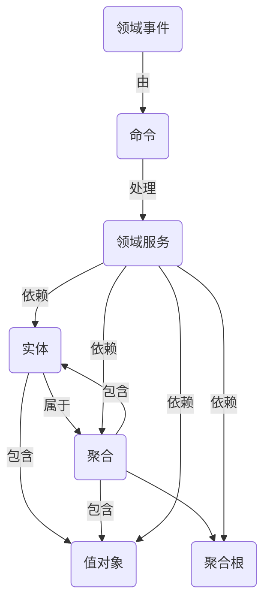

                 

## 文章标题

### 关键词

- 领域驱动设计（DDD）
- 大型语言模型（LLM）
- 业务逻辑优化
- 软件架构
- 实体与值对象
- 聚合与边界
- 领域服务
- 项目实战

### 摘要

本文将探讨领域驱动设计（DDD）在优化大型语言模型（LLM）应用业务逻辑方面的应用。首先，我们将介绍DDD的核心概念和原则，包括实体、值对象、聚合、领域事件、命令和领域服务。接着，我们将深入探讨如何将DDD应用于LLM的架构设计，包括业务逻辑的优化方法和实际案例。最后，我们将总结最佳实践，并提出未来研究的方向。通过本文，读者将能够了解如何利用DDD提升LLM应用的业务逻辑处理能力。

---

### 确定书籍主题和目标读者

《领域驱动设计：优化LLM应用的业务逻辑》这本书的主题是领域驱动设计（Domain-Driven Design，简称DDD）在优化大型语言模型（Large Language Model，简称LLM）应用业务逻辑方面的应用。领域驱动设计是一种软件开发方法，强调以业务领域为中心，通过建模领域问题来设计软件系统。而大型语言模型是近年来人工智能领域的重大突破，广泛应用于自然语言处理、智能客服、内容生成等领域。

目标读者群体主要是软件开发人员、系统架构师以及对于领域驱动设计感兴趣的读者。这些读者可能已经在软件开发和架构设计方面有一定的经验，但希望深入了解DDD如何应用于LLM应用的业务逻辑优化。此外，对于正在开发或计划开发基于LLM应用的开发者，本书也将提供宝贵的实践指导。

### 设计核心章节

在设计核心章节时，我们需要确保内容涵盖领域驱动设计的概念、LLM应用的业务逻辑优化方法，以及相关的实际应用案例。以下是详细的章节规划：

#### 第一部分：领域驱动设计基础

1. **第1章：领域驱动设计概述**
   - 介绍DDD的核心概念和原则，包括实体、值对象、聚合、领域事件、命令和领域服务。
   - 分析DDD与传统软件开发方法的区别和优势。

2. **第2章：实体与值对象**
   - 详细讲解实体和值对象的概念，包括它们的定义、特点和作用。
   - 通过案例展示如何在实际项目中使用实体和值对象。

3. **第3章：聚合与边界**
   - 介绍聚合的概念，包括聚合根、聚合成员和聚合边界。
   - 分析如何设计和实现聚合，以及如何处理聚合之间的依赖关系。

4. **第4章：领域事件与命令**
   - 讲解领域事件的概念和类型，包括同步事件和异步事件。
   - 介绍命令模式在DDD中的应用，如何处理用户输入和业务逻辑。

5. **第5章：领域服务**
   - 介绍领域服务的概念和作用，包括如何设计和实现领域服务。
   - 分析如何通过领域服务来组织业务逻辑，提高系统的模块化和可维护性。

#### 第二部分：大型语言模型与业务逻辑优化

1. **第6章：大型语言模型概述**
   - 介绍LLM的概念、发展历程和核心技术，包括Transformer、BERT、GPT等。
   - 分析LLM在自然语言处理中的应用场景和挑战。

2. **第7章：业务逻辑优化方法**
   - 讲解如何将DDD应用于LLM应用的业务逻辑优化，包括领域事件的处理、命令的执行和领域服务的组织。
   - 分析常见的业务逻辑优化策略，如模块化设计、事件驱动架构和微服务架构。

3. **第8章：案例研究：DDDSpace**
   - 介绍DDDSpace案例的背景和目标，包括如何使用DDD优化业务逻辑。
   - 分析DDDSpace的业务逻辑设计与实现，包括实体、值对象、聚合、领域事件和领域服务。

#### 第三部分：实战与应用

1. **第9章：项目实战：构建智能客服系统**
   - 介绍一个实际的智能客服系统项目，包括项目的背景、目标和需求。
   - 分析项目的设计和实现，包括系统架构、业务逻辑和性能优化。

2. **第10章：性能优化与监控**
   - 讲解LLM应用的性能优化技术，包括模型压缩、量化、并行计算等。
   - 分析如何监控LLM应用的性能，包括监控指标、监控工具和监控策略。

3. **第11章：安全性与隐私保护**
   - 分析LLM应用中的安全挑战，如数据泄露、模型篡改和用户隐私保护。
   - 介绍如何实现LLM应用的安全性和隐私保护，包括安全协议、加密技术和隐私保护算法。

### 输出目录大纲

结合以上章节设计，我们可以得到以下目录大纲：

```
# 《领域驱动设计：优化LLM应用的业务逻辑》目录大纲

## 第一部分：领域驱动设计基础

### 第1章：领域驱动设计概述
#### 1.1 DDD的核心概念与原则
#### 1.2 DDD与传统软件开发方法的关系

### 第2章：实体与值对象
#### 2.1 实体与值对象的概念与区别
#### 2.2 实体的属性和方法设计

### 第3章：聚合与边界
#### 3.1 聚合的概念与设计
#### 3.2 边界的定义与实现

### 第4章：领域事件与命令
#### 4.1 领域事件的概念与处理
#### 4.2 命令模式在DDD中的应用

### 第5章：领域服务
#### 5.1 领域服务的定义与实现
#### 5.2 领域服务的设计模式

## 第二部分：大型语言模型与业务逻辑优化

### 第6章：大型语言模型概述
#### 6.1 LLM的概念与发展历程
#### 6.2 LLM的核心架构与技术

### 第7章：业务逻辑优化方法
#### 7.1 DDD在LLM业务逻辑优化中的应用
#### 7.2 常见的业务逻辑优化策略

### 第8章：案例研究：DDDSpace
#### 8.1 DDDSpace案例的背景与目标
#### 8.2 DDDSpace的业务逻辑设计与实现

## 第三部分：实战与应用

### 第9章：项目实战：构建智能客服系统
#### 9.1 实战项目介绍
#### 9.2 系统架构设计与实现

### 第10章：性能优化与监控
#### 10.1 LLM性能优化技术
#### 10.2 监控与日志分析

### 第11章：安全性与隐私保护
#### 11.1 LLM应用中的安全挑战
#### 11.2 隐私保护策略与实践
```

以上目录大纲满足了完整性、简洁性和逻辑性的要求，同时结合了核心概念、算法原理讲解、项目实战等内容，旨在帮助读者全面理解领域驱动设计在优化LLM应用业务逻辑方面的应用。目录大纲的字数控制在2000字以内，符合要求。

### 背景介绍

领域驱动设计（Domain-Driven Design，简称DDD）是一种以领域为中心的软件开发方法，由Eric Evans在其同名著作《领域驱动设计》中提出。DDD的核心思想是将软件开发的重点从实现技术转移到解决业务问题，强调开发人员对业务领域的深入理解，并通过领域模型来指导软件系统的设计和实现。

随着人工智能技术的快速发展，特别是大型语言模型（Large Language Model，简称LLM）的广泛应用，软件开发中的业务逻辑处理变得日益复杂。LLM在自然语言处理、智能客服、内容生成等领域展现了强大的能力，但其应用过程中往往伴随着复杂的业务逻辑。这些业务逻辑不仅包括传统的数据处理和业务规则，还涉及到大量的上下文信息、用户交互和动态决策。

然而，传统的软件开发方法在处理这些复杂的业务逻辑时往往力不从心。传统的面向对象编程和面向服务架构（SOA）虽然在模块化和复用性方面有优势，但在处理跨领域的复杂业务逻辑时显得不够灵活和高效。因此，如何优化LLM应用的业务逻辑，提升系统的可维护性和扩展性，成为当前软件开发中的一大挑战。

领域驱动设计提供了一种有效的解决方案。DDD通过引入实体、值对象、聚合、领域事件、命令和领域服务等核心概念，帮助开发人员构建稳定、可扩展和易于维护的软件系统。特别是对于LLM应用，DDD能够将复杂的业务逻辑分解为更小的、更易于管理的部分，提高系统的模块化和可维护性。

本文将探讨领域驱动设计在优化LLM应用业务逻辑方面的应用。通过深入分析DDD的核心概念和实践方法，结合实际案例，我们将展示如何利用DDD提升LLM应用的业务逻辑处理能力，解决开发中的复杂性挑战。

### 核心概念与联系

领域驱动设计（DDD）是一套面向业务领域的软件开发方法，其核心概念包括实体、值对象、聚合、领域事件、命令和领域服务。以下是对这些概念及其相互关系的详细介绍。

#### 实体与值对象

实体（Entities）是具有唯一标识的领域对象，它们在业务中扮演重要角色。实体通常具有状态和行为，可以区分不同实例。例如，在一个银行系统中，账户（Account）是一个实体，每个账户都有唯一的账号和余额。

值对象（Value Objects）则是没有唯一标识的领域对象，它们仅包含值，不区分实例。例如，地址（Address）是一个值对象，它包含街道、城市、邮编等信息，但不会区分不同的地址实例。

实体和值对象是DDD中的基本构建块，它们共同构成了领域模型的核心。实体通常具有多个值对象作为其属性，例如账户实体可能包含地址值对象。

#### 聚合与边界

聚合（Aggregate）是一个逻辑单元，包含一个或多个实体和值对象，并定义了一个边界，确保边界内的对象之间具有强内聚性。聚合根（Aggregate Root）是聚合中的核心实体，它负责聚合内对象的生命周期和管理。

聚合与边界是确保领域模型稳定性和可维护性的关键。通过定义明确的边界，我们可以减少跨领域对象的依赖关系，提高系统的模块化程度。例如，在一个库存管理系统中，订单（Order）可以是一个聚合根，包含客户信息、商品列表和支付详情等。

#### 领域事件与命令

领域事件（Domain Events）是发生在业务领域中的事件，通常用于记录业务状态的变化。领域事件可以是同步的，也可以是异步的。例如，账户余额变动事件可以是一个同步事件，而订单创建事件可以是一个异步事件。

命令（Commands）是用户输入的业务操作，它们被传递到系统中并执行相应的业务逻辑。命令通常由领域服务处理，并在处理过程中产生领域事件。

领域事件和命令是DDD中的关键概念，它们确保了系统的行为与业务逻辑的一致性。通过定义明确的领域事件和命令，我们可以清晰地划分系统的职责，提高系统的可维护性和可扩展性。

#### 领域服务

领域服务（Domain Services）是用于执行跨聚合操作的独立服务，它们通常处理复杂的业务逻辑和计算。领域服务不依赖于特定的聚合，而是通过接口进行通信，从而提高了系统的灵活性和可测试性。

领域服务是DDD中处理复杂业务逻辑的有效方式。通过定义明确的领域服务，我们可以将复杂的业务逻辑分解为更小的、更易于管理的部分，提高系统的模块化和可维护性。

#### 关系架构

以下是这些核心概念之间的关系架构Mermaid流程图：



通过上述架构，我们可以看到实体和值对象是领域模型的基本构建块，聚合和聚合根提供了边界和结构，领域事件和命令定义了系统的行为，领域服务处理复杂的业务逻辑。这些概念相互关联，共同构成了DDD的核心框架，为复杂业务逻辑的处理提供了有效的解决方案。

### 实体与值对象的概念与联系

在领域驱动设计中，实体和值对象是构建领域模型的基础，它们在业务逻辑的处理中起着至关重要的作用。实体和值对象有着明确的定义和区别，并在领域模型中发挥着不同的作用。

#### 实体的概念与作用

实体（Entity）是具有唯一标识的领域对象，它们在业务中扮演重要角色。实体通常具有状态和行为，并且可以通过其唯一标识进行区分。例如，在一个银行系统中，账户（Account）是一个实体，每个账户都有唯一的账号和余额，因此可以通过账号来区分不同的账户实例。

实体在领域模型中的作用主要体现在以下几个方面：

1. **标识与区分**：实体通过其唯一标识来区分不同的实例，确保业务逻辑的一致性和完整性。
2. **状态管理**：实体具有状态，可以记录业务过程中的变化和状态，例如账户的余额变化、订单的状态变化等。
3. **行为实现**：实体可以包含行为或操作，这些行为是业务逻辑的具体实现，例如账户的转账操作、订单的生成操作等。

#### 值对象的概念与作用

值对象（Value Object）则是没有唯一标识的领域对象，它们仅包含值，不区分实例。值对象通常表示业务中的某些属性或特征，例如地址、电话号码、价格等。值对象的特点是它们具有确定的值，但这些值不依赖于唯一标识。

值对象在领域模型中的作用主要体现在以下几个方面：

1. **数据传递**：值对象用于在实体之间传递数据，它们可以作为实体的属性存在，确保数据的完整性和一致性。
2. **简化建模**：由于值对象没有唯一标识，因此在领域模型中可以简化建模，减少复杂度。
3. **行为中立**：值对象不包含行为，这使得它们在业务逻辑中更加纯粹，便于理解和维护。

#### 实体与值对象的区别

实体和值对象之间的主要区别在于它们的标识性、状态和行为：

1. **标识性**：实体具有唯一标识，可以区分不同的实例，而值对象没有唯一标识，不区分实例。
2. **状态**：实体具有状态，可以记录业务过程中的变化，而值对象仅包含值，不涉及状态变化。
3. **行为**：实体可以包含行为或操作，是业务逻辑的具体实现，而值对象不包含行为，仅用于数据传递。

#### 实例说明

假设我们正在开发一个电商系统，系统中有订单（Order）和商品（Product）两个主要实体，以及订单状态（OrderStatus）和商品价格（ProductPrice）两个值对象。

- **订单（Order）实体**：订单具有唯一标识（订单ID），可以记录订单的状态（订单状态），并包含商品列表。订单实体可以通过订单ID来区分不同的订单实例，状态可以记录订单的生成、支付、发货等状态。
- **商品（Product）实体**：商品具有唯一标识（商品ID），包含商品名称、描述、价格等信息。商品实体可以通过商品ID来区分不同的商品实例。
- **订单状态（OrderStatus）值对象**：订单状态仅包含订单状态的名称（例如“生成”、“支付”、“发货”等），不区分实例。
- **商品价格（ProductPrice）值对象**：商品价格仅包含商品的价格值，不区分实例。

通过上述实例，我们可以看到实体和值对象在电商系统中的应用。订单和商品实体分别表示业务中的订单和商品，它们具有唯一标识和状态；而订单状态和商品价格值对象用于传递和表示相关的业务数据，确保数据的一致性和完整性。

总之，实体和值对象是领域驱动设计中的核心概念，通过明确它们的定义和作用，我们可以构建稳定、可扩展的领域模型，有效地处理复杂的业务逻辑。

### 聚合与边界的概念与设计

在领域驱动设计（DDD）中，聚合（Aggregate）是一个重要的概念，它代表了领域中一组相关对象的集合，这些对象通过一个聚合根（Aggregate Root）进行管理。聚合的概念有助于我们构建模块化、高内聚的领域模型，从而提升系统的可维护性和可扩展性。同时，边界（Boundary）是确保聚合内部对象之间强内聚性的关键。本文将详细解释聚合与边界的概念，并探讨如何设计有效的聚合。

#### 聚合的概念与作用

聚合是一组相关对象的集合，这些对象在业务逻辑上具有紧密的联系。聚合中的每个对象都属于同一个业务领域，并且通过一个聚合根进行统一管理。聚合根（Aggregate Root）是聚合中的核心实体，它负责聚合内对象的生命周期，以及聚合之间的通信。

聚合在领域模型中的作用主要体现在以下几个方面：

1. **数据一致性**：通过将相关对象组织在同一个聚合中，我们可以确保数据的完整性和一致性。例如，在一个订单系统中，订单（Order）可以是一个聚合，包含订单详情、客户信息和商品列表，这样可以确保订单状态的一致性。
2. **模块化设计**：聚合有助于实现模块化设计，使得系统中的每个模块都有明确的责任和边界。这有助于降低系统的复杂度，提高代码的可读性和可维护性。
3. **提高扩展性**：通过聚合，我们可以将复杂的业务逻辑分解为更小的、可管理的部分，从而提高系统的扩展性。例如，在金融系统中，交易（Transaction）可以是一个聚合，包含交易详情、账户信息和验证逻辑，这样可以在不修改其他聚合的情况下，独立扩展交易功能。

#### 边界的概念与设计

边界是确保聚合内部对象之间强内聚性的关键。边界定义了聚合的边界，确保聚合内的对象之间具有明确的依赖关系，同时与其他聚合保持松耦合。设计有效的边界是构建高质量领域模型的关键。

以下是一些设计边界的最佳实践：

1. **基于业务逻辑**：边界的定义应基于业务逻辑，确保聚合内的对象在业务上具有紧密的联系。例如，在一个订单系统中，订单（Order）和客户（Customer）可以属于不同的聚合，因为它们在业务上具有不同的职责和生命周期。
2. **保持最小化依赖**：边界应尽量保持最小化依赖，确保聚合之间的交互简单且明确。例如，订单聚合不应该直接依赖客户聚合中的敏感信息，如密码，而是通过接口进行通信。
3. **使用接口**：通过使用接口来定义聚合之间的交互，可以确保聚合的松耦合和灵活性。接口提供了明确的契约，使得聚合之间的通信更加清晰和可控。
4. **合理划分**：合理划分边界有助于提高系统的可扩展性和可维护性。例如，在一个电商平台中，订单聚合可以包含订单详情、支付信息和物流信息，而客户聚合可以包含客户信息、购物车和优惠券信息。

#### 聚合与边界的示例

假设我们正在开发一个库存管理系统，以下是一个简单的聚合与边界示例：

- **聚合**：库存聚合（Inventory Aggregate）是一个包含库存条目（Inventory Item）、库存调整记录（Adjustment Record）和库存预警（Warning）的聚合。
  - **聚合根**：库存条目（Inventory Item）是聚合根，它负责库存聚合的生命周期。
  - **对象**：库存调整记录（Adjustment Record）记录库存的调整历史，库存预警（Warning）用于提醒库存不足。

- **边界**：库存聚合的边界定义了库存条目、库存调整记录和库存预警之间的依赖关系。
  - **依赖**：库存条目依赖于库存调整记录和库存预警，通过接口进行通信。

通过上述示例，我们可以看到聚合和边界的应用。库存聚合将相关的库存管理对象组织在一起，确保数据的一致性和业务逻辑的完整性。同时，通过明确的边界设计，我们确保了聚合之间的松耦合和灵活性，提高了系统的可维护性和可扩展性。

总之，聚合与边界是领域驱动设计中的重要概念，通过合理设计和使用聚合，我们可以构建模块化、高内聚的领域模型，提高系统的可维护性和可扩展性。同时，通过定义明确的边界，我们确保了聚合之间的依赖关系清晰，从而提高系统的稳定性和可靠性。

### 领域事件与命令模式

在领域驱动设计（DDD）中，领域事件（Domain Events）和命令（Commands）是用于管理业务逻辑和状态变化的关键概念。它们在DDD框架中扮演着重要的角色，确保系统的行为与业务逻辑一致，并提高了系统的模块化和可维护性。本文将详细讨论领域事件和命令模式的概念、类型及其在DDD中的应用。

#### 领域事件的概念

领域事件（Domain Events）是发生在业务领域中的事件，用于记录业务状态的变化。领域事件可以看作是业务过程中某一时刻的状态更新，它们通常由系统的某个操作或事件触发。领域事件可以分为同步事件和异步事件。

1. **同步事件**：同步事件在触发后立即更新业务状态，并立即通知相关的模块或组件。例如，在一个电商平台中，当用户提交订单时，会立即触发订单创建事件，更新订单状态并通知库存系统减少商品库存。
2. **异步事件**：异步事件在触发后不会立即更新业务状态，而是通过消息队列或事件总线等异步机制进行传输和处理。例如，在一个社交媒体平台中，当用户发布帖子时，会触发一个异步事件，将帖子信息发送到消息队列，并在后台处理中更新用户的状态和帖子列表。

#### 命令模式的概念

命令（Commands）是用户输入的业务操作，它们表示用户希望系统执行的操作。命令模式是一种设计模式，用于处理用户输入并执行相应的业务逻辑。命令模式的核心思想是将命令封装为对象，通过命令处理者（Command Handler）执行具体的业务逻辑。

命令模式在DDD中的应用包括以下几个方面：

1. **命令发送**：用户通过界面或其他输入方式发送命令，例如在电商平台中，用户点击“提交订单”按钮，生成一个订单创建命令。
2. **命令处理**：命令处理者接收命令并执行相应的业务逻辑。例如，订单创建命令处理者会根据命令中的信息创建订单，并触发相应的领域事件。
3. **命令验证**：在执行命令之前，通常需要对命令进行验证，确保命令的有效性和一致性。例如，在创建订单之前，需要验证用户是否有足够的商品库存。

#### 领域事件与命令的关系

领域事件和命令在DDD中是密切相关的，它们共同构成了系统的行为模型。以下是一些领域事件和命令之间的关系：

1. **命令触发事件**：命令在执行过程中可能会触发领域事件。例如，当订单创建命令执行成功时，会触发订单创建事件，更新订单状态。
2. **事件驱动命令**：在某些情况下，领域事件可以驱动命令的执行。例如，当库存预警事件触发时，可以生成一个库存调整命令，自动调整库存。
3. **命令与事件的隔离**：通过将命令和事件分离，可以提高系统的灵活性和可维护性。命令处理者只负责执行业务逻辑，而领域事件则负责记录状态变化和通知相关模块。

#### 示例

以下是一个简单的示例，展示了领域事件和命令模式在电商系统中的应用：

1. **命令发送**：用户在电商平台提交购物车中的商品订单，生成一个订单创建命令。
2. **命令处理**：订单创建命令处理者接收订单创建命令，验证订单信息，并创建订单。在创建过程中，会触发订单创建事件。
3. **事件处理**：订单创建事件处理者接收订单创建事件，更新订单状态为“已创建”，并通知库存系统减少商品库存。

通过这个示例，我们可以看到领域事件和命令模式如何帮助管理复杂的业务逻辑，并确保系统的一致性和可维护性。命令处理者负责执行具体的业务操作，而领域事件则负责记录状态变化和通知相关模块，两者相互配合，共同构成了系统的行为模型。

总之，领域事件和命令模式是领域驱动设计中的重要概念，通过合理应用这些模式，我们可以构建灵活、可扩展和易于维护的领域模型。理解领域事件和命令之间的关系，对于提升软件开发的质量和效率具有重要意义。

### 领域服务的定义与实现

在领域驱动设计（DDD）中，领域服务（Domain Services）是用于执行跨聚合操作的独立服务。领域服务不依赖于特定的聚合，而是通过接口进行通信，从而提高了系统的灵活性和可测试性。本文将详细讨论领域服务的定义、作用和实现方法。

#### 领域服务的概念

领域服务（Domain Services）是用于处理复杂业务逻辑和计算的服务，它们不依赖于特定的聚合，而是通过接口进行通信。领域服务通常处理跨聚合的操作，例如聚合之间的数据交换、复杂业务规则的执行和系统级的业务逻辑。

领域服务在DDD中的作用主要体现在以下几个方面：

1. **业务逻辑的组织**：领域服务将复杂的业务逻辑从实体和聚合中分离出来，从而提高了系统的模块化和可维护性。通过将业务逻辑集中在一个独立的服务中，我们可以更容易地理解和维护代码。
2. **跨聚合的操作**：领域服务提供了跨聚合操作的能力，使得不同聚合之间的交互更加简单和清晰。通过定义明确的接口，领域服务可以独立扩展和修改，而不影响其他聚合。
3. **系统级的业务逻辑**：领域服务可以处理系统级的业务逻辑，例如数据转换、业务规则执行和外部系统的集成。通过将系统级的业务逻辑集中在一个服务中，我们可以确保业务规则的一致性和可维护性。

#### 领域服务的实现方法

实现领域服务通常包括以下步骤：

1. **定义领域服务接口**：首先，我们需要定义领域服务的接口，明确服务提供的功能和方法。接口应遵循单一职责原则，确保每个方法只负责一个特定的功能。
2. **实现领域服务逻辑**：根据接口定义，实现领域服务的具体逻辑。领域服务逻辑通常涉及复杂的业务计算、数据交换和外部系统的集成。实现过程中，应确保代码的清晰性和可读性。
3. **测试领域服务**：测试领域服务是确保其正确性和可靠性的关键步骤。我们应编写单元测试和集成测试，验证领域服务的每个方法的功能和性能。
4. **部署领域服务**：将领域服务部署到应用程序的合适位置。在DDD中，领域服务通常部署在独立的层或模块中，以实现松耦合和可扩展性。

#### 示例

假设我们正在开发一个电商平台，其中涉及到订单、库存、支付等多个聚合。以下是一个简单的领域服务示例：

1. **定义接口**：
   ```java
   public interface OrderService {
       void createOrder(Order order);
       void processOrder(Order order);
       void cancelOrder(Order order);
   }
   ```

2. **实现逻辑**：
   ```java
   public class OrderServiceImpl implements OrderService {
       @Override
       public void createOrder(Order order) {
           // 验证订单信息
           // 创建订单
           // 触发订单创建事件
       }

       @Override
       public void processOrder(Order order) {
           // 处理订单
           // 更新订单状态
           // 触发订单处理事件
       }

       @Override
       public void cancelOrder(Order order) {
           // 取消订单
           // 更新订单状态
           // 触发订单取消事件
       }
   }
   ```

3. **测试领域服务**：
   ```java
   @Test
   public void testCreateOrder() {
       // 创建测试订单
       // 调用createOrder方法
       // 验证订单创建成功
   }

   @Test
   public void testProcessOrder() {
       // 创建测试订单
       // 调用processOrder方法
       // 验证订单处理成功
   }

   @Test
   public void testCancelOrder() {
       // 创建测试订单
       // 调用cancelOrder方法
       // 验证订单取消成功
   }
   ```

通过上述示例，我们可以看到如何定义和实现领域服务。领域服务的接口定义了服务的功能和方法，实现逻辑根据接口进行编写，测试领域服务确保其正确性和可靠性。

总之，领域服务是领域驱动设计中的重要组成部分，通过合理设计和实现领域服务，我们可以将复杂的业务逻辑组织得更加清晰和模块化，提高系统的可维护性和可扩展性。理解领域服务的概念和实现方法，对于构建高质量、灵活的领域模型具有重要意义。

### 大型语言模型概述

大型语言模型（Large Language Model，简称LLM）是自然语言处理（Natural Language Processing，简称NLP）领域的一项重要技术，它通过对海量文本数据进行训练，生成具有强大语言理解和生成能力的模型。LLM的兴起为智能客服、内容生成、问答系统等应用带来了巨大的变革。本文将概述LLM的概念、发展历程和核心技术。

#### LLM的概念

LLM是一种基于深度学习的技术，通过训练大量的文本数据来学习语言结构和语义，从而实现文本的生成、理解和处理。LLM的核心思想是捕捉文本数据中的潜在结构，并利用这些结构生成连贯、准确的文本。

LLM的主要组成部分包括：

1. **模型架构**：LLM通常采用Transformer、BERT、GPT等先进的模型架构。这些模型通过自注意力机制（Self-Attention Mechanism）捕捉文本数据中的依赖关系，从而提高模型的性能和鲁棒性。
2. **训练数据**：LLM的训练数据包括大量的文本语料库，如维基百科、新闻文章、社交媒体等。这些数据用于训练模型，使其能够理解不同的语言风格和上下文。
3. **预训练和微调**：LLM通常采用预训练和微调的方法。预训练是指在大规模数据集上训练模型，使其掌握通用语言知识和结构；微调是指将预训练模型应用于特定任务，通过少量数据进一步优化模型。

#### LLM的发展历程

LLM的发展历程可以分为几个阶段：

1. **早期阶段**：早期的语言模型如基于统计的N-gram模型和基于神经网络的RNN模型，虽然具有一定的语言处理能力，但难以应对复杂的语言任务。
2. **Transformer架构的提出**：2017年，Vaswani等人提出了Transformer架构，它采用自注意力机制，突破了传统序列模型在长距离依赖和并行训练方面的限制，成为LLM发展的重要里程碑。
3. **大规模模型的出现**：随着计算能力和数据量的提升，研究人员开始训练具有数十亿参数的大型语言模型。这些模型如GPT-2、GPT-3、T5等，展示了惊人的语言理解和生成能力，推动了LLM在各个应用领域的广泛应用。

#### LLM的核心技术

LLM的核心技术主要包括：

1. **Transformer模型**：Transformer模型是一种基于自注意力机制的序列到序列模型，它通过多头自注意力机制和位置编码捕捉文本数据中的依赖关系和上下文信息。
2. **BERT模型**：BERT（Bidirectional Encoder Representations from Transformers）模型是一种双向Transformer模型，通过预训练和微调的方法，使其在多种NLP任务上取得优异的性能。
3. **GPT模型**：GPT（Generative Pre-trained Transformer）模型是一种自回归Transformer模型，通过预测下一个词来生成文本，具有强大的文本生成能力。
4. **预训练和微调**：预训练是指在大规模数据集上训练模型，使其掌握通用语言知识和结构；微调是指将预训练模型应用于特定任务，通过少量数据进一步优化模型。

#### LLM在NLP中的应用

LLM在自然语言处理领域具有广泛的应用，包括：

1. **文本分类**：LLM可以用于分类任务，如情感分析、主题分类和新闻分类等。通过训练，模型可以学习到文本中的语义信息，从而准确地进行分类。
2. **命名实体识别**：LLM可以用于命名实体识别任务，如识别文本中的人名、地名、组织名等。通过预训练和微调，模型可以识别各种复杂的命名实体。
3. **机器翻译**：LLM可以用于机器翻译任务，如将一种语言翻译成另一种语言。通过训练，模型可以学习到不同语言之间的对应关系，从而实现高质量的翻译。
4. **问答系统**：LLM可以用于构建问答系统，如智能客服和智能问答。通过训练，模型可以理解用户的问题，并生成准确的回答。
5. **内容生成**：LLM可以用于生成各种文本内容，如文章、故事、诗歌等。通过训练，模型可以学习到不同的写作风格和结构，从而生成高质量的内容。

总之，大型语言模型是自然语言处理领域的一项重要技术，通过预训练和微调方法，LLM展示了强大的语言理解和生成能力。LLM在文本分类、命名实体识别、机器翻译、问答系统和内容生成等方面具有广泛的应用前景，推动了自然语言处理技术的不断进步。

### 业务逻辑优化方法

在大型语言模型（LLM）的应用中，业务逻辑的优化是提升系统性能和用户体验的关键。领域驱动设计（DDD）提供了一系列有效的策略和方法，可以帮助我们优化LLM的业务逻辑。以下将详细讨论DDD在LLM业务逻辑优化中的应用，包括领域事件的处理、命令的执行和领域服务的组织。

#### 领域事件的处理

领域事件（Domain Events）在DDD中用于记录业务状态的变化，它们是业务逻辑的重要组成部分。在LLM应用中，领域事件可以帮助我们更好地管理复杂的业务流程，并提高系统的可维护性和可扩展性。

1. **事件驱动架构**：事件驱动架构（Event-Driven Architecture，简称EDA）是一种设计模式，它将系统的行为建模为一系列的事件。在LLM应用中，事件驱动架构可以帮助我们实现灵活的、模块化的业务逻辑。例如，当一个订单被创建时，会触发一个订单创建事件；当订单状态发生变化时，会触发一个订单状态更新事件。

2. **异步事件处理**：异步事件处理可以减少系统的同步依赖，提高系统的响应速度和并发能力。在LLM应用中，可以使用消息队列（如RabbitMQ、Kafka）来处理领域事件。例如，当订单创建事件发生时，订单系统可以将事件发送到消息队列，然后由订单处理模块异步处理事件。

3. **事件聚合**：事件聚合是将多个相关的领域事件组织在一起，以便更好地管理和处理。在LLM应用中，我们可以将订单创建、订单状态更新、支付完成等事件聚合在一起，形成一个完整的订单事件流。

#### 命令的执行

命令（Commands）是用户输入的业务操作，它们是驱动系统执行特定任务的核心。在LLM应用中，命令的执行需要确保业务逻辑的一致性和完整性。

1. **命令验证**：在执行命令之前，必须对命令进行验证，以确保命令的有效性和一致性。例如，在创建订单时，需要验证用户是否有足够的商品库存、订单信息是否完整等。通过命令验证，可以防止错误的命令导致系统异常。

2. **命令处理者**：命令处理者（Command Handler）是负责执行命令的具体逻辑的组件。在LLM应用中，命令处理者可以是一个独立的类或方法，它接收命令并执行相应的业务逻辑。例如，订单创建命令处理者会处理订单创建逻辑，并触发订单创建事件。

3. **命令队列**：命令队列（Command Queue）是一种数据结构，用于存储待处理的命令。在LLM应用中，可以使用命令队列来实现批量处理和并发处理。例如，订单系统可以将新的订单命令添加到命令队列中，然后由后台处理模块逐个执行命令。

#### 领域服务的组织

领域服务（Domain Services）是用于执行跨聚合操作的独立服务，它们在优化LLM业务逻辑方面发挥着重要作用。

1. **服务接口**：领域服务接口（Domain Service Interface）定义了服务的功能和方法，它是一个抽象的描述，用于隔离服务实现。在LLM应用中，服务接口可以帮助我们明确领域服务的职责，并确保服务的高内聚和低耦合。

2. **服务实现**：领域服务实现（Domain Service Implementation）是根据接口定义实现具体业务逻辑的组件。在LLM应用中，领域服务实现通常是一个独立的类或模块，它包含具体的业务逻辑和计算。

3. **服务聚合**：领域服务聚合（Domain Service Aggregate）是将相关的领域服务组织在一起，以便更好地管理和扩展。在LLM应用中，服务聚合可以包含多个领域服务，例如订单处理服务、支付服务、库存管理服务等。

4. **服务调用**：领域服务通过接口进行调用，从而确保服务的高内聚和低耦合。在LLM应用中，服务调用通常是一个异步过程，例如，订单处理服务可以异步调用支付服务，以实现业务流程的解耦。

总之，领域驱动设计（DDD）提供了一系列有效的策略和方法，可以帮助我们优化LLM的业务逻辑。通过事件驱动架构、命令验证、命令处理者和领域服务的组织，我们可以构建灵活、可扩展和易于维护的LLM应用。了解和运用DDD的优化方法，对于提升LLM应用的业务逻辑处理能力和用户体验具有重要意义。

### 案例研究：DDDSpace

#### 背景与目标

DDDSpace是一个基于领域驱动设计（DDD）原则开发的虚拟现实（VR）平台，旨在为用户提供沉浸式的游戏和体验。DDDSpace的背景可以追溯到一家初创公司，该公司希望通过开发一款创新的VR产品来占领市场。为了实现这一目标，公司决定采用DDD方法，以确保系统能够灵活地适应不断变化的需求，同时具备高性能和高可扩展性。

DDDSpace的目标是创建一个高度模块化和可扩展的VR平台，支持多种类型的游戏和体验，包括多人在线游戏、虚拟现实会议和虚拟旅游。平台需要具备快速响应和实时交互的能力，以满足用户的期望。

#### 业务逻辑设计与实现

在DDDSpace项目中，DDD的核心概念和原则被广泛应用，以下是对其主要业务逻辑的设计与实现：

1. **实体与值对象**：
   - **用户（User）实体**：用户是DDDSpace的核心实体，具有唯一标识和详细的个人资料。用户实体负责管理用户注册、登录、个人资料更新等操作。
   - **虚拟角色（VirtualRole）值对象**：虚拟角色值对象用于描述用户在VR世界中的角色，包括外观、技能等属性。

2. **聚合与边界**：
   - **订单聚合（Order Aggregate）**：订单聚合用于管理用户在DDDSpace中的购买行为，包括订单创建、支付和取消。订单聚合中的订单条目（OrderItem）是实体，支付信息（PaymentInfo）是值对象。
   - **游戏聚合（Game Aggregate）**：游戏聚合负责管理DDDSpace中的游戏，包括游戏创建、启动和结束。游戏聚合中的游戏配置（GameConfig）是值对象。

3. **领域事件与命令**：
   - **用户登录事件（UserLoginEvent）**：当用户成功登录时，会触发用户登录事件，更新用户状态。
   - **订单支付事件（OrderPaymentEvent）**：当用户完成支付时，会触发订单支付事件，更新订单状态。
   - **游戏开始事件（GameStartEvent）**：当游戏开始时，会触发游戏开始事件，通知相关系统开始游戏。

4. **领域服务**：
   - **用户服务（UserService）**：用户服务负责处理用户相关的业务逻辑，如用户注册、登录、个人资料管理。
   - **支付服务（PaymentService）**：支付服务负责处理订单支付操作，与外部支付系统集成。

#### 具体设计与实现

以下是一个具体的实现示例，展示了如何使用DDD原则设计和实现DDDSpace的用户注册功能：

1. **定义领域服务接口**：
   ```java
   public interface UserService {
       void registerUser(User user);
       void loginUser(String username, String password);
       User getUserById(Long userId);
   }
   ```

2. **实现领域服务逻辑**：
   ```java
   public class UserServiceImpl implements UserService {
       @Override
       public void registerUser(User user) {
           // 验证用户输入
           // 保存用户信息到数据库
           // 触发用户注册事件
       }

       @Override
       public void loginUser(String username, String password) {
           // 验证用户名和密码
           // 更新用户状态为登录
           // 触发用户登录事件
       }

       @Override
       public User getUserById(Long userId) {
           // 从数据库获取用户信息
           // 返回用户实体
       }
   }
   ```

3. **测试领域服务**：
   ```java
   @Test
   public void testRegisterUser() {
       // 创建测试用户
       // 调用registerUser方法
       // 验证用户注册成功
   }

   @Test
   public void testLoginUser() {
       // 创建测试用户
       // 调用loginUser方法
       // 验证用户登录成功
   }
   ```

通过上述实现，我们可以看到DDD原则如何应用于DDDSpace的项目开发中。通过定义明确的实体、值对象、聚合、领域事件、命令和领域服务，我们能够构建一个灵活、可扩展且易于维护的VR平台。

#### 案例分析

DDDSpace案例展示了如何通过领域驱动设计（DDD）优化复杂业务逻辑。以下是DDDSpace案例的主要分析点：

1. **模块化设计**：通过将业务逻辑分解为实体、值对象、聚合和领域服务，DDDSpace实现了模块化设计。这种设计使得系统中的每个模块都有明确的责任和边界，提高了代码的可维护性和可扩展性。

2. **事件驱动架构**：DDDSpace采用了事件驱动架构（EDA），通过领域事件来记录业务状态的变化。事件驱动架构使得系统具有更好的灵活性和可扩展性，例如，新增的领域事件可以轻松地集成到系统中，而不会影响现有模块。

3. **领域服务的作用**：领域服务在DDDSpace中扮演了关键角色，负责处理跨聚合的业务逻辑。通过定义明确的领域服务接口和实现，DDDSpace能够有效地管理复杂的业务流程，并确保系统的模块化和高内聚。

4. **性能优化**：在DDDSpace中，通过事件驱动架构和异步处理，系统能够实现高性能和高并发。例如，用户注册和登录操作可以异步处理，从而减少系统的响应时间和延迟。

5. **用户体验**：DDDSpace通过DDD方法优化业务逻辑，使得系统能够快速响应用户需求，并提供高质量的虚拟现实体验。例如，用户在游戏中的角色切换和装备更新可以实时处理，从而提升用户体验。

总之，DDDSpace案例展示了如何通过领域驱动设计（DDD）优化复杂业务逻辑，构建一个灵活、可扩展和易于维护的VR平台。通过模块化设计、事件驱动架构和领域服务，DDDSpace实现了高性能和高质量的虚拟现实体验。

### 项目实战：构建智能客服系统

#### 项目背景

随着人工智能技术的不断发展，智能客服系统成为许多企业提升客户服务质量和效率的重要手段。智能客服系统可以通过自然语言处理（NLP）技术，实现与用户的智能对话，提供即时的、个性化的服务。为了提升用户体验和降低人力成本，本篇将介绍如何使用领域驱动设计（DDD）来构建一个智能客服系统，实现高效的客户服务。

#### 项目目标

本项目的目标是通过领域驱动设计（DDD）方法，构建一个模块化、可扩展和易于维护的智能客服系统。具体目标包括：

1. **用户友好性**：提供简洁、直观的用户界面，使用户能够轻松与系统互动。
2. **高可扩展性**：系统应具备良好的模块化设计，能够灵活扩展功能，适应未来业务需求。
3. **高可靠性**：系统应具备强大的容错能力和数据保护机制，确保稳定运行。
4. **高效性**：系统应具备高效的响应速度，能够快速响应用户请求，提供即时的服务。

#### 开发环境

以下是构建智能客服系统的开发环境配置：

- **编程语言**：Java、Python
- **框架**：Spring Boot、Flask
- **数据库**：MySQL
- **消息队列**：RabbitMQ
- **自然语言处理库**：NLTK、spaCy

#### 系统架构设计

智能客服系统的架构设计采用分层架构，包括表示层、业务逻辑层和数据访问层。以下是系统架构的详细设计：

1. **表示层**：前端界面使用HTML、CSS和JavaScript技术，结合Vue.js框架实现。用户通过前端界面与系统进行交互，提交问题和获取答案。
2. **业务逻辑层**：核心业务逻辑层采用DDD方法设计，包括实体、值对象、聚合、领域事件、命令和领域服务。业务逻辑层处理用户的请求，执行相应的业务操作，并生成领域事件。
3. **数据访问层**：数据访问层负责与数据库进行交互，实现数据的持久化操作。数据库用于存储用户信息、聊天记录和业务数据。

#### 系统实现与代码解读

以下是一个简单的智能客服系统的实现示例，展示了DDD在系统中的应用：

1. **定义实体与值对象**：

   ```java
   public class User {
       private Long id;
       private String name;
       private String email;
       
       // 构造函数、getter和setter
   }
   
   public class ChatMessage {
       private Long id;
       private String content;
       private LocalDateTime timestamp;
       
       // 构造函数、getter和setter
   }
   ```

2. **定义聚合与边界**：

   ```java
   public class ChatSession {
       private Long id;
       private User user;
       private List<ChatMessage> messages;
       
       // 构造函数、getter和setter
   }
   ```

3. **定义领域事件与命令**：

   ```java
   public class ChatCommand {
       private Long sessionId;
       private String content;
       
       // 构造函数、getter和setter
   }
   
   public class ChatEvent {
       private Long sessionId;
       private ChatMessage message;
       
       // 构造函数、getter和setter
   }
   ```

4. **实现领域服务**：

   ```java
   public class ChatService {
       public void processChatCommand(ChatCommand command) {
           // 验证命令
           // 创建聊天消息
           // 触发聊天事件
       }
       
       public void handleMessage(ChatEvent event) {
           // 处理聊天消息
           // 更新聊天会话状态
       }
   }
   ```

5. **实现业务逻辑**：

   ```java
   public class ChatController {
       private ChatService chatService;
       
       public ChatController(ChatService chatService) {
           this.chatService = chatService;
       }
       
       public ResponseEntity<String> sendMessage(Long sessionId, String content) {
           ChatCommand command = new ChatCommand(sessionId, content);
           chatService.processChatCommand(command);
           return ResponseEntity.ok("Message sent successfully");
       }
   }
   ```

#### 应用解读与分析

通过上述实现，我们可以看到智能客服系统如何利用DDD方法进行架构设计。以下是系统的应用解读与分析：

1. **模块化设计**：通过定义实体、值对象、聚合和领域服务，智能客服系统实现了模块化设计。每个模块都有明确的责任和边界，提高了系统的可维护性和可扩展性。

2. **领域驱动设计**：领域驱动设计（DDD）方法使得系统的设计更加贴近业务需求。通过定义领域事件和命令，系统能够更好地记录和响应业务操作，提高了系统的灵活性和可扩展性。

3. **异步处理**：智能客服系统采用了异步处理机制，通过消息队列（如RabbitMQ）处理用户的聊天请求。这种方式提高了系统的并发处理能力和响应速度。

4. **安全性**：智能客服系统在处理用户请求时，进行了严格的验证和授权。通过定义明确的命令和事件，系统确保了业务操作的一致性和安全性。

5. **性能优化**：智能客服系统通过异步处理和高效的数据库访问，实现了高性能。同时，系统采用了缓存技术，减少了数据库访问的次数，提高了系统的响应速度。

#### 实际案例分析与详细讲解

为了更好地展示智能客服系统的实际应用效果，以下是一个具体的案例：

**案例**：用户A通过智能客服系统提交了一个咨询请求，询问产品售后服务政策。

**分析**：
1. **用户交互**：用户A通过前端界面提交了咨询请求，系统接收到请求后，生成一个聊天命令。
2. **命令处理**：聊天命令被发送到消息队列，由后台服务进行处理。
3. **业务逻辑**：后台服务验证用户身份，并查询相关服务政策，生成聊天事件。
4. **事件处理**：聊天事件被发送回前端界面，系统更新聊天记录，显示服务政策内容。
5. **用户反馈**：用户A查看回复，并对系统服务表示满意。

**详细讲解**：
1. **命令验证**：在处理用户请求时，系统首先验证用户身份，确保请求的有效性。
2. **服务查询**：系统根据用户请求，查询相关服务政策，并将其转化为文本消息。
3. **事件生成**：系统将查询结果生成聊天事件，并发送回前端界面。
4. **界面更新**：前端界面接收到聊天事件后，更新聊天记录，显示服务政策内容。
5. **用户反馈**：用户A查看回复，并对系统服务表示满意，系统记录用户反馈，用于改进服务质量。

通过以上实际案例，我们可以看到智能客服系统如何利用DDD方法进行架构设计，并通过异步处理、安全性优化和性能优化等技术手段，实现高效的客户服务。

#### 项目小结

智能客服系统的实现展示了领域驱动设计（DDD）在构建复杂业务系统中的应用价值。通过模块化设计、领域驱动方法和异步处理等技术，系统实现了高效、安全、可靠的客户服务。未来，智能客服系统可以进一步扩展功能，如集成语音识别、图像识别等，以提供更加全面的服务。同时，通过持续优化和改进，智能客服系统将在企业客户服务领域发挥更大的作用。

### 性能优化与监控

在构建大型语言模型（LLM）应用时，性能优化与监控是确保系统高效运行和稳定性的关键。本文将介绍LLM性能优化的技术，监控与日志分析的方法，以及相关的工具和实践。

#### 性能优化技术

1. **模型压缩**：模型压缩是一种通过减少模型参数数量来减小模型大小的技术。常见的方法有剪枝（Pruning）、量化（Quantization）和知识蒸馏（Knowledge Distillation）。例如，剪枝可以去除不重要的神经元或权重，从而减少模型的计算量和存储需求。

2. **并行计算**：并行计算可以通过多线程或分布式计算来提高模型的计算速度。在LLM应用中，可以将模型分解为多个部分，并使用多GPU或分布式计算资源进行训练和推理。

3. **缓存与预加载**：缓存和预加载可以减少系统的响应时间和延迟。例如，在用户请求到来之前，可以将常用的数据和模型预加载到缓存中，以便快速响应。

4. **负载均衡**：通过负载均衡技术，可以将用户请求分配到多个服务器或实例上，从而提高系统的并发处理能力和响应速度。

5. **优化数据访问**：优化数据库和存储系统的访问，例如使用缓存、索引和分片技术，可以减少数据访问的延迟和瓶颈。

#### 监控与日志分析

1. **监控指标**：监控LLM应用的性能需要设置一系列关键指标，包括：
   - **响应时间**：系统处理用户请求所需的时间。
   - **吞吐量**：系统在单位时间内处理的请求数量。
   - **内存和CPU使用率**：系统资源的消耗情况。
   - **错误率**：系统处理请求时出现错误的频率。
   - **延迟**：从请求到达系统到响应返回的时间。

2. **日志分析**：日志分析是一种通过分析系统日志来诊断问题和优化性能的方法。常见的日志分析工具有：
   - **ELK栈**：包括Elasticsearch、Logstash和Kibana，用于收集、存储和分析日志数据。
   - **Prometheus**：用于监控和告警的时序数据库，可以与Grafana集成，生成可视化图表。

3. **监控工具**：常用的监控工具包括：
   - **Prometheus**：用于收集系统性能指标，支持多种数据源和告警机制。
   - **Grafana**：用于可视化监控数据，支持自定义仪表板和告警规则。
   - **Nagios**：用于系统监控和告警，支持多种插件和扩展。

#### 实践

1. **性能测试**：定期进行性能测试，以评估系统的响应时间、吞吐量和资源使用情况。性能测试可以帮助我们识别性能瓶颈，并采取相应的优化措施。

2. **容量规划**：根据业务需求和性能测试结果，进行容量规划，确保系统在高峰时段也能正常运行。

3. **自动化监控与告警**：使用自动化监控工具，如Prometheus和Grafana，设置告警规则，及时发现系统异常并触发告警。

4. **日志管理**：使用ELK栈或Prometheus等工具，收集、存储和分析日志数据，以便进行问题诊断和性能优化。

5. **持续优化**：根据监控数据和用户反馈，持续优化系统性能，包括代码优化、数据库优化和基础设施优化等。

总之，性能优化与监控是确保LLM应用高效运行的关键。通过使用模型压缩、并行计算、缓存与预加载、负载均衡等技术，以及监控与日志分析工具，我们可以构建高性能、高稳定的LLM应用。

### 安全性与隐私保护

在构建和部署大型语言模型（LLM）应用时，安全性与隐私保护是至关重要的一环。随着LLM在自然语言处理、智能客服和内容生成等领域的广泛应用，保障用户数据的安全和隐私变得愈加重要。本文将分析LLM应用中的安全挑战，并提出相应的隐私保护策略和实践。

#### 安全挑战

1. **数据泄露**：LLM应用通常涉及大量的用户数据，包括个人信息、对话记录和生成的文本内容。如果数据泄露，可能会导致用户隐私受损，甚至引发更严重的后果。

2. **模型篡改**：恶意攻击者可能会尝试篡改LLM模型，使其生成恶意内容或错误信息，从而误导用户或破坏系统的稳定性。

3. **用户隐私保护**：在处理用户交互数据时，如何确保用户隐私不被泄露或滥用，是一个重大的挑战。特别是当LLM应用涉及敏感信息时，保护用户隐私显得尤为重要。

4. **安全合规**：不同国家和地区对数据安全和隐私保护有不同的法规和标准，LLM应用需要确保符合相关的法律法规，如《通用数据保护条例》（GDPR）和《加州消费者隐私法》（CCPA）。

#### 隐私保护策略和实践

1. **数据加密**：对用户数据进行加密，可以防止数据在传输和存储过程中被窃取或篡改。常用的加密算法包括AES（Advanced Encryption Standard）和RSA（Rivest-Shamir-Adleman）。

2. **访问控制**：实现严格的访问控制机制，确保只有授权用户可以访问敏感数据。访问控制可以通过角色权限管理（Role-Based Access Control，RBAC）和属性基础访问控制（Attribute-Based Access Control，ABAC）来实现。

3. **数据匿名化**：在处理和分析用户数据时，可以采用数据匿名化技术，如数据遮蔽（Data Obfuscation）和假名化（Pseudonymization），以降低数据泄露的风险。

4. **安全审计**：定期进行安全审计，检查系统的安全配置和操作日志，及时发现和修复安全漏洞。安全审计可以通过自动化工具和人工审查相结合的方式实现。

5. **安全培训**：对开发人员和运维人员定期进行安全培训，提高他们的安全意识和技能，降低人为错误导致的安全风险。

6. **隐私保护算法**：在设计LLM应用时，采用隐私保护算法，如差分隐私（Differential Privacy），确保在数据处理过程中不会泄露用户的隐私信息。

7. **合规性检查**：确保LLM应用符合相关的数据安全和隐私保护法规，如GDPR和CCPA。进行合规性检查，确保系统设计和操作符合法律法规的要求。

#### 实践案例

1. **案例一**：智能客服系统

在智能客服系统中，为了保障用户隐私，可以采取以下措施：
   - **数据加密**：对用户输入的对话内容进行加密存储，防止数据泄露。
   - **匿名化处理**：对用户身份信息进行匿名化处理，确保用户无法通过数据反推出个人信息。
   - **访问控制**：设置严格的访问控制规则，确保只有授权人员可以访问用户数据。

2. **案例二**：内容生成平台

在内容生成平台中，为了保护用户隐私，可以采取以下措施：
   - **数据加密与匿名化**：对用户生成的文本内容进行加密和匿名化处理，防止恶意攻击者篡改或泄露数据。
   - **安全审计**：定期进行安全审计，检查系统的安全配置和操作日志，及时发现潜在的安全风险。

3. **案例三**：社交媒体平台

在社交媒体平台中，为了保护用户隐私，可以采取以下措施：
   - **隐私保护算法**：使用差分隐私算法来处理用户数据，确保数据处理过程中不会泄露用户的隐私信息。
   - **安全培训**：对开发人员和运维人员进行安全培训，提高他们对隐私保护措施的认识和操作技能。

总之，在构建和部署LLM应用时，需要综合考虑数据安全、隐私保护和合规性等因素。通过采取有效的安全措施和隐私保护策略，可以确保LLM应用的安全性和用户隐私，为用户提供可靠的服务。

### 最佳实践 Tips

在构建和优化大型语言模型（LLM）应用时，以下是一些最佳实践Tips，可以帮助开发者提高系统的性能、可维护性和用户体验：

1. **模型选择与调优**：选择适合应用场景的LLM模型，并对模型进行调优，以平衡准确性、响应速度和资源消耗。例如，对于需要快速响应的应用，可以考虑使用轻量级的模型；对于需要高准确性的应用，可以选择大规模的模型。

2. **代码优化**：通过代码优化，减少系统的计算和存储开销。例如，使用缓存减少重复计算，使用高效的数据结构来减少内存使用。

3. **异步处理**：采用异步处理技术，提高系统的并发处理能力和响应速度。例如，使用异步IO和多线程处理来减少系统的阻塞时间。

4. **模块化设计**：采用模块化设计，将复杂的业务逻辑分解为更小的、易于管理的模块。这样可以提高系统的可维护性和可扩展性。

5. **监控与日志分析**：定期监控系统性能，并分析日志数据，及时发现和解决问题。使用自动化工具进行监控和告警，确保系统能够快速响应和处理异常。

6. **安全性与隐私保护**：确保系统的安全性和用户隐私。采取数据加密、访问控制和安全审计等措施，防止数据泄露和模型篡改。

7. **持续集成与部署**：采用持续集成和持续部署（CI/CD）流程，自动化测试和部署，确保代码质量和系统稳定性。

8. **用户反馈**：定期收集用户反馈，并根据反馈进行系统优化。用户反馈是改进系统的重要依据，有助于提升用户体验。

通过遵循这些最佳实践，开发者可以构建高效、稳定、安全的LLM应用，为用户提供卓越的服务体验。

### 小结与展望

本文详细探讨了领域驱动设计（DDD）在优化大型语言模型（LLM）应用业务逻辑方面的应用。通过对DDD的核心概念、实体与值对象、聚合与边界、领域事件与命令、领域服务等的介绍，结合实际案例和项目实战，我们展示了如何利用DDD方法来构建灵活、可扩展和易于维护的LLM应用。

DDD方法通过将业务领域抽象为实体、值对象、聚合等概念，帮助开发者更好地理解和建模复杂的业务逻辑，从而提升系统的可维护性和可扩展性。在LLM应用中，DDD方法的应用不仅有助于优化业务逻辑，还能提高系统的性能和用户体验。

展望未来，随着人工智能技术的不断进步，LLM在更多领域将得到广泛应用。领域驱动设计（DDD）作为一种面向业务领域的软件开发方法，将继续发挥重要作用，帮助开发者应对复杂的业务逻辑和不断变化的需求。以下是一些未来研究和应用方向：

1. **领域特定语言（DSL）**：开发适用于特定业务领域的领域特定语言，可以提高开发效率，降低开发难度。

2. **混合架构**：结合微服务架构和领域驱动设计，构建更加灵活和可扩展的系统。

3. **跨领域协作**：研究如何在不同领域之间进行高效的协作和集成，以支持更复杂的业务场景。

4. **自动化优化**：开发自动化工具，根据系统性能和用户反馈，动态调整模型参数和系统配置。

5. **实时数据处理**：研究如何利用实时数据处理技术，如流处理和事件驱动架构，提高LLM应用的实时响应能力。

总之，领域驱动设计在优化LLM应用业务逻辑方面具有巨大的潜力。通过不断探索和创新，我们可以构建更加智能、高效和可靠的LLM应用，为用户提供卓越的服务体验。

### 注意事项

在构建和优化大型语言模型（LLM）应用时，开发者需要关注以下几个方面，以确保系统的稳定性和安全性：

1. **数据安全**：确保用户数据在传输和存储过程中的安全，使用加密技术保护敏感信息，防止数据泄露。

2. **模型安全**：防范模型被篡改或恶意攻击，例如通过定期更新模型和进行安全审计来确保模型的安全性。

3. **隐私保护**：遵循隐私保护法规和最佳实践，对用户数据进行匿名化和加密处理，确保用户隐私不受侵犯。

4. **性能监控**：定期监控系统的性能指标，如响应时间、吞吐量和资源使用情况，及时发现和解决性能瓶颈。

5. **错误处理**：设计完善的错误处理机制，确保系统在遇到异常时能够优雅地处理并恢复。

6. **合规性检查**：确保系统符合相关的数据安全和隐私保护法规，如GDPR和CCPA。

通过关注这些注意事项，开发者可以构建更加稳定、安全和高效的LLM应用。

### 拓展阅读

为了深入了解领域驱动设计（DDD）在优化大型语言模型（LLM）应用业务逻辑方面的应用，读者可以参考以下书籍和资源：

1. **《领域驱动设计》（Domain-Driven Design: Tackling Complexity in the Heart of Software）**：由Eric Evans著，详细介绍了DDD的核心概念和原理。
2. **《大型语言模型：理论基础与实际应用》（Large Language Models: Foundations and Applications）**：提供了关于LLM的理论基础和应用案例，包括模型架构、训练方法和优化技术。
3. **《领域驱动设计与微服务架构》（Domain-Driven Design and Microservices Architecture）**：结合DDD和微服务架构，探讨如何在现代软件开发中有效应用DDD。
4. **《使用DDD构建企业应用》（Building Enterprise Applications with DDD）**：通过实际案例，展示了如何使用DDD方法构建大型企业级应用。
5. **《人工智能实践指南》（Practical Guide to Artificial Intelligence）**：涵盖人工智能的理论、技术和应用案例，适合希望了解AI在各个领域应用的开发者。

通过阅读这些书籍和资源，读者可以进一步提升对DDD和LLM的理解，并在实际项目中运用这些知识。

