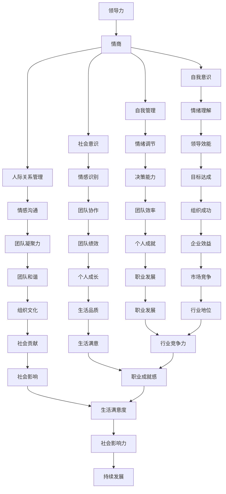

                 


### 文章标题：领导力与情商：理解并管理情绪的能力

### 关键词：领导力，情商，情绪管理，团队建设，个人成长

### 摘要：

在现代社会中，领导力与情商已成为个人和团队成功的关键要素。本文从理论与实践两个层面，深入探讨了领导力与情商的基本概念、核心联系，以及如何通过理解并管理情绪来提升领导力和团队效能。文章结构严谨，内容丰富，旨在为读者提供实用的指导和方法。

### 引言：领导力与情商的重要性

在现代企业管理中，领导力和情商扮演着至关重要的角色。领导力是指引导和激励团队达成目标的能力，而情商则涉及自我意识、自我管理、社会意识和人际关系管理。这两者之间的关系密不可分，情商的提升有助于增强领导力，实现更高效的管理。

#### 1.1 领导力的定义与作用

领导力并非仅指权力或权威，而是一种能够激励、引导和影响他人共同实现目标的能力。其作用体现在以下几个方面：

- **激发团队潜能**：优秀的领导者能够挖掘团队成员的潜力，发挥他们的优势。
- **建立团队凝聚力**：领导力有助于建立团队成员之间的信任和默契，增强团队凝聚力。
- **提升决策质量**：领导力在决策过程中起到关键作用，有助于做出更为明智的决策。

#### 1.2 情商的定义与重要性

情商是指个体在情感认知、管理、表达和应用方面的能力。其重要性体现在以下几个方面：

- **改善人际关系**：情商有助于个体更好地理解和管理自己的情绪，从而建立良好的人际关系。
- **增强沟通能力**：情商提升有助于个体在沟通中表达自己的情感，并更好地理解他人的情绪。
- **促进个人成长**：情商的提升有助于个体在工作和生活中更好地应对挑战，实现个人成长。

### 领导力与情商的关系架构图

为了更直观地展示领导力与情商之间的关系，我们使用Mermaid流程图来表示：



### 核心概念与原理

在深入探讨领导力与情商的关系之前，我们首先需要明确相关的核心概念和原理。

#### 2.1 领导力的五个维度

领导力通常可以从以下五个维度来理解：

- **领导愿景**：领导者需要明确团队的目标和愿景，激发团队成员的激情和动力。
- **影响力**：领导者通过个人魅力和影响力，引导和影响团队成员。
- **团队建设**：领导者需要建立高效的团队，促进团队成员之间的协作和信任。
- **战略思维**：领导者需要具备战略思维，制定和执行有效的战略规划。
- **变革管理**：领导者需要推动团队适应变化，应对挑战。

#### 2.2 情商的四个方面

情商可以从以下四个方面来理解：

- **自我意识**：个体对自己情感状态的理解和认知能力。
- **自我管理**：个体对自身情绪的调节和控制能力。
- **社会意识**：个体对他人情感状态的理解和认知能力。
- **人际关系管理**：个体在处理人际关系时的情感表达能力。

### 情绪管理的基本原理

情绪管理是指个体在情绪认知、表达、调节和应用等方面的能力。以下为情绪管理的基本原理：

- **情绪认知**：个体需要学会正确识别和理解自己的情绪，这是情绪管理的基础。
- **情绪表达**：个体需要学会在适当的时间和方式下表达自己的情绪，以避免误解和冲突。
- **情绪调节**：个体需要学会调节自己的情绪，以保持积极的心态和应对压力。
- **情绪应用**：个体需要学会在适当的情况下运用情绪，以达到最佳的效果。

### 情绪管理的基本原则

为了实现有效的情绪管理，个体需要遵循以下基本原则：

- **自我反思**：个体需要定期进行自我反思，了解自己的情绪状态和行为模式。
- **积极心态**：个体需要保持积极的心态，以更好地应对挑战和压力。
- **情感释放**：个体需要找到适当的方式释放负面情绪，以避免情绪积压。
- **情绪调节**：个体需要学会在情绪波动时保持冷静，并采取积极的调节措施。

### 情绪理解与管理的基本原理

情绪理解与管理是情商的核心组成部分，对于提升领导力和团队效能至关重要。以下为情绪理解与管理的基本原理：

#### 3.1 情绪的类型与作用

情绪可以分为基本情绪和复杂情绪，基本情绪包括喜悦、愤怒、悲伤、恐惧和厌恶，它们是人类行为和反应的基础。复杂情绪则是由基本情绪组合而成，如焦虑、羞耻、骄傲和同情等。

情绪的作用主要包括：

- **动机作用**：情绪可以激发个体的行动，促使个体去实现目标。
- **适应作用**：情绪有助于个体适应环境变化，提高生存能力。
- **社交作用**：情绪在人际交往中起到沟通和协调的作用，有助于建立良好的人际关系。

#### 3.2 情绪管理的基本原则

情绪管理的基本原则包括：

- **自我认知**：个体需要了解自己的情绪状态，认识到情绪对自身行为和决策的影响。
- **自我调节**：个体需要学会在情绪波动时保持冷静，采取积极的调节措施。
- **情感表达**：个体需要在适当的时间和方式下表达自己的情绪，避免情绪压抑或过度表达。
- **社交技能**：个体需要提升社交技能，学会理解和尊重他人的情绪，建立良好的人际关系。

#### 3.3 情绪的自我认知与调节

情绪的自我认知与调节是情绪管理的基础，以下为相关方法：

- **自我观察**：个体可以通过自我观察，了解自己的情绪状态和行为模式。
- **情绪日记**：个体可以记录自己的情绪变化，分析情绪的触发因素和应对策略。
- **情绪调节技巧**：个体可以学习情绪调节技巧，如深呼吸、冥想、运动等，以应对负面情绪。

### 情绪在领导力中的应用

情绪在领导力中的应用至关重要，以下为相关内容：

#### 4.1 情绪在决策中的影响

情绪在决策过程中起着重要作用，以下为相关影响：

- **情绪启发式**：情绪可以激发个体的直觉和创造力，有助于快速做出决策。
- **情绪偏见**：情绪也可能导致个体在决策过程中产生偏见，影响决策质量。

#### 4.2 情绪在沟通中的作用

情绪在沟通中的作用主要包括：

- **情感传递**：情绪可以帮助个体更好地表达自己的情感和需求，促进沟通的有效性。
- **情感共鸣**：情绪可以激发个体的共鸣，增强沟通的互动性和亲和力。

#### 4.3 情绪在团队建设中的应用

情绪在团队建设中的应用主要包括：

- **情绪感染**：领导者可以通过积极的情绪表达，激发团队成员的积极情绪，增强团队的凝聚力。
- **情绪支持**：领导者可以在团队成员面临困难时提供情绪支持，帮助他们应对挑战。

### 情商提升的方法与技巧

提升情商对于个人和团队的成长具有重要意义，以下为相关方法与技巧：

#### 5.1 自我意识提升策略

自我意识提升策略包括：

- **自我反思**：定期进行自我反思，了解自己的情绪状态和行为模式。
- **情绪记录**：记录自己的情绪变化，分析情绪的触发因素和应对策略。

#### 5.2 自我管理提升策略

自我管理提升策略包括：

- **情绪调节**：学习情绪调节技巧，如深呼吸、冥想、运动等，以应对负面情绪。
- **积极心态**：保持积极的心态，以更好地应对挑战和压力。

#### 5.3 社会技能提升策略

社会技能提升策略包括：

- **沟通技巧**：提升沟通技巧，学会在适当的时间和方式下表达自己的情绪和需求。
- **同理心**：培养同理心，学会理解和尊重他人的情绪。

#### 5.4 决策能力提升策略

决策能力提升策略包括：

- **情绪识别**：学会识别和解读自己的情绪，避免情绪对决策的负面影响。
- **理性思考**：在决策过程中保持理性思考，避免情绪主导。

### 情绪管理与团队建设

情绪管理对于团队建设至关重要，以下为相关内容：

#### 6.1 团队情绪氛围的营造

团队情绪氛围的营造包括：

- **积极引导**：领导者可以通过积极的情绪表达，引导团队成员保持积极情绪。
- **情绪分享**：鼓励团队成员分享自己的情绪和感受，增强团队凝聚力。

#### 6.2 情绪冲突的解决策略

情绪冲突的解决策略包括：

- **倾听与理解**：领导者需要倾听团队成员的情绪和需求，理解他们的立场和感受。
- **调解与协调**：领导者需要采取调解和协调措施，解决团队成员之间的情绪冲突。

#### 6.3 情绪在团队绩效提升中的作用

情绪在团队绩效提升中的作用包括：

- **激励作用**：积极的情绪可以激发团队成员的工作热情和创造力，提高团队绩效。
- **凝聚作用**：情绪的共鸣和共享可以增强团队成员之间的凝聚力和协作精神，提高团队绩效。

### 情绪管理与个人成长

情绪管理对于个人成长具有重要意义，以下为相关内容：

#### 7.1 情绪管理与自我成长

情绪管理与自我成长包括：

- **自我认知**：通过情绪管理，个体可以更好地了解自己，提升自我认知能力。
- **情感调节**：通过情绪调节，个体可以更好地应对压力和挑战，实现自我成长。

#### 7.2 情绪管理在职业规划中的应用

情绪管理在职业规划中的应用包括：

- **情绪稳定**：通过情绪管理，个体可以保持情绪稳定，更好地应对职场挑战。
- **决策能力**：通过情绪管理，个体可以提升决策能力，实现职业发展的目标。

#### 7.3 情绪管理对心理健康的影响

情绪管理对心理健康的影响包括：

- **情绪平衡**：情绪管理有助于个体保持情绪平衡，减少心理压力。
- **心理韧性**：情绪管理可以增强个体的心理韧性，提高应对心理压力的能力。

### 情绪管理与职场成功

情绪管理对于职场成功具有重要意义，以下为相关内容：

#### 8.1 情绪管理在职场沟通中的应用

情绪管理在职场沟通中的应用包括：

- **情感表达**：通过情绪管理，个体可以更好地表达自己的情感和需求，增强沟通效果。
- **情绪共鸣**：通过情绪管理，个体可以更好地理解和共鸣他人的情绪，建立良好的人际关系。

#### 8.2 情绪管理在职场决策中的应用

情绪管理在职场决策中的应用包括：

- **情绪识别**：通过情绪管理，个体可以更好地识别和解读自己的情绪，避免情绪对决策的负面影响。
- **理性思考**：通过情绪管理，个体可以在决策过程中保持理性思考，避免情绪主导。

#### 8.3 情绪管理对职场成功的影响

情绪管理对职场成功的影响包括：

- **工作效率**：情绪管理有助于提高个体的工作效率，实现职业目标。
- **职业发展**：情绪管理可以增强个体的职业竞争力，助力职业发展。

### 案例分析

为了更好地理解情绪管理在领导力与团队建设中的应用，以下为几个实际案例：

#### 9.1 成功领导者的情绪管理案例

**案例一：乔布斯的情绪管理**

乔布斯作为苹果公司的创始人，以其卓越的领导力和独特的个性影响了整个科技行业。他通过情绪管理，激发团队成员的创造力和执行力。乔布斯在公开场合和团队讨论中，善于运用积极的情绪表达，鼓励团队成员追求卓越。同时，他也善于在情绪波动时保持冷静，通过自我调节，避免情绪对决策的负面影响。

**案例二：马云的情商管理**

马云作为阿里巴巴集团的创始人，以其独特的领导风格和情商管理，带领阿里巴巴成为全球知名企业。他善于在团队中营造积极情绪氛围，通过情感共鸣和沟通技巧，增强团队成员的凝聚力和协作精神。在面对挑战和压力时，马云通过情绪管理，保持冷静和自信，为团队树立榜样。

#### 9.2 职场中的情绪管理案例

**案例一：职场新人的情绪管理**

小王是一名刚刚进入职场的新人，他在面对工作压力和人际关系时，常常感到焦虑和不安。为了提升自己的情绪管理能力，小王开始学习情绪调节技巧，如深呼吸、冥想和运动。同时，他也积极参加团队活动，提升自己的沟通技巧和社交能力。通过这些努力，小王逐渐适应了职场环境，提高了工作效率。

**案例二：项目经理的情绪管理**

李经理是一名经验丰富的项目经理，他在项目管理过程中，经常面临项目进度压力和团队冲突。为了应对这些挑战，李经理通过情绪管理，保持冷静和理性，采取有效的沟通和协调措施，解决团队问题。他还积极培养团队成员的情商，提高团队的整体情绪管理水平。

#### 9.3 团队情绪管理的成功案例

**案例一：互联网公司的团队建设**

某互联网公司注重团队情绪管理，通过一系列措施提升团队凝聚力。首先，公司定期举办团队建设活动，增强团队成员之间的互动和沟通。其次，公司鼓励员工分享自己的情绪和感受，建立情感共鸣和信任。此外，公司还提供心理辅导和培训，帮助员工提高情绪管理能力。通过这些努力，该公司的团队凝聚力显著提升，工作效率和绩效也得到提高。

**案例二：创业团队的激情管理**

某创业团队在创业初期，面临着巨大的压力和挑战。为了应对这些挑战，团队领导通过情绪管理，保持团队的激情和动力。首先，团队领导通过积极的情绪表达，激发团队成员的创造力和执行力。其次，团队领导通过有效的沟通和协调，解决团队成员之间的情绪冲突。此外，团队领导还关注团队成员的心理健康，提供心理支持和辅导。通过这些努力，该创业团队在激烈的市场竞争中取得了成功。

### 总结与展望

情绪管理在领导力与团队建设中具有重要地位，通过理解并管理情绪，个体和团队可以实现更高的绩效和更和谐的人际关系。在未来，随着社会的不断发展，情绪管理将得到更多的关注和应用。以下是本文的总结与展望：

#### 10.1 领导力与情商的未来发展趋势

- **个性化领导**：未来领导力将更加注重个性化，领导者需要根据团队成员的特点和需求，采取个性化的领导方式。
- **情商培养**：情商将成为领导力培养的重要组成部分，领导者需要具备较高的情商，以提升领导力和团队效能。

#### 10.2 情绪管理在个人和组织中的应用前景

- **个人成长**：情绪管理将助力个人成长，帮助个体更好地应对挑战，实现自我价值。
- **组织发展**：情绪管理将有助于组织构建和谐的团队氛围，提高组织绩效和竞争力。

#### 10.3 情绪管理在企业管理中的应用

- **员工心理健康**：企业管理者将更加关注员工的情绪管理，提供心理支持和辅导，提高员工的工作满意度和幸福感。
- **团队协作**：情绪管理将促进团队协作，提高团队的执行力和创新能力。

### 小结

本文从领导力与情商的基本概念、核心联系、情绪管理的基本原理、情绪在领导力中的应用、情商提升的方法与技巧、情绪管理与团队建设、个人成长、职场成功等方面，全面探讨了情绪管理在领导力和团队建设中的应用。通过理论讲解、案例分析和实践指导，本文为读者提供了实用的情绪管理方法和策略。

### 注意事项

- **情绪识别**：学会识别自己的情绪，是情绪管理的基础。
- **情绪调节**：在面对负面情绪时，学会调节情绪，保持积极心态。
- **沟通技巧**：提升沟通技巧，有助于建立良好的人际关系。
- **同理心**：培养同理心，理解并尊重他人的情绪。

### 拓展阅读

- 《情商：为什么情商比智商更重要》
- 《团队情绪管理》
- 《领导力与团队管理》
- 《情绪智力：情绪智慧决定成功》

### 作者信息

作者：AI天才研究院/AI Genius Institute & 禅与计算机程序设计艺术 /Zen And The Art of Computer Programming

本文由AI天才研究院/AI Genius Institute与禅与计算机程序设计艺术/Zen And The Art of Computer Programming联合撰写，旨在为读者提供关于领导力与情商的深入见解和实用指导。

### 附录

附录部分可包括情绪管理相关的工具、量表、案例研究和拓展阅读等，以供读者参考。

---

### 设计详细文章大纲

为了确保文章的结构合理、逻辑清晰，我们可以按照以下详细的大纲来设计：

#### 引言：领导力与情商的重要性

- **背景介绍**
  - 现代企业对领导力和情商的需求
  - 领导力和情商的定义和重要性
- **引出本文主题**
  - 如何通过情绪管理提升领导力和团队效能

#### 1. 领导力与情商的基本概念

- **领导力的定义与作用**
  - 领导力的五个维度
  - 领导力在组织中的作用
- **情商的定义与组成部分**
  - 情商的四个方面
  - 情商在个人发展中的作用

#### 2. 情绪理解与管理的基本原理

- **情绪的类型与作用**
  - 基本情绪与复杂情绪
  - 情绪在人类行为中的作用
- **情绪管理的基本原则**
  - 自我认知与情绪调节
  - 情绪表达与社交技能
- **情绪调节的方法与技巧**
  - 自我观察与情绪日记
  - 情绪调节技巧介绍

#### 3. 情绪在领导力中的应用

- **情绪在决策中的影响**
  - 情绪启发式与情绪偏见
  - 情绪对决策质量的提升
- **情绪在沟通中的作用**
  - 情感传递与情感共鸣
  - 有效沟通与团队协作
- **情绪在团队建设中的应用**
  - 情绪感染与情绪支持
  - 团队情绪氛围的营造

#### 4. 情商提升的方法与技巧

- **自我意识提升策略**
  - 自我反思与情绪记录
  - 自我认知与自我接纳
- **自我管理提升策略**
  - 情绪调节与压力管理
  - 积极心态与心理韧性
- **社会技能提升策略**
  - 沟通技巧与冲突解决
  - 同理心与人际关系管理
- **决策能力提升策略**
  - 情绪识别与理性思考
  - 情绪智力与决策效率

#### 5. 情绪管理与团队建设

- **团队情绪氛围的营造**
  - 情绪共享与情感共鸣
  - 团队文化的建设与维护
- **情绪冲突的解决策略**
  - 倾听与理解
  - 调解与协调
- **情绪在团队绩效提升中的作用**
  - 激励作用与凝聚作用
  - 团队协作与创新能力

#### 6. 情绪管理与个人成长

- **情绪管理与自我成长**
  - 情绪平衡与情感调节
  - 自我认知与自我提升
- **情绪管理在职业规划中的应用**
  - 情绪稳定与职业发展
  - 决策能力与职业选择
- **情绪管理对心理健康的影响**
  - 情绪平衡与心理健康
  - 心理韧性与生活满意度

#### 7. 情绪管理与职场成功

- **情绪管理在职场沟通中的应用**
  - 情感表达与沟通效果
  - 情绪共鸣与人际互动
- **情绪管理在职场决策中的应用**
  - 情绪识别与理性决策
  - 情绪智力与职场竞争力
- **情绪管理对职场成功的影响**
  - 工作效率与职业发展
  - 职场满意与职业成就感

#### 8. 案例分析

- **成功领导者的情绪管理案例**
  - 乔布斯的情绪管理
  - 马云的情商管理
- **职场中的情绪管理案例**
  - 职场新人的情绪管理
  - 项目经理的情绪管理
- **团队情绪管理的成功案例**
  - 互联网公司的团队建设
  - 创业团队的激情管理

#### 9. 总结与展望

- **领导力与情商的未来发展趋势**
  - 个性化领导与情商培养
  - 情绪管理在个人与组织中的应用前景
- **情绪管理在企业管理中的应用**
  - 员工心理健康与团队协作
  - 组织发展与情绪管理

#### 结论

- **文章小结**
  - 领导力与情商的核心联系
  - 情绪管理对个人与团队的重要性
- **未来研究方向**
  - 情绪管理在新兴领域的应用
  - 情绪智力的科学研究和教育

### 附录

- **情绪管理相关工具与量表**
  - 情绪智商测试
  - 自我反思量表
  - 情绪调节技巧表
- **案例分析与研究**
  - 成功与失败的案例分析
  - 情绪管理研究的最新进展
- **拓展阅读**
  - 推荐书籍与论文
  - 网络资源与学习平台

---

### 实际案例：情绪管理与团队建设的成功案例

#### 背景介绍

某知名互联网公司在快速发展的过程中，面临着激烈的市场竞争和不断变化的技术环境。为了保持竞争力，公司决定通过提升团队情绪管理水平，提高团队的整体效能。以下是公司采取的具体措施和取得的成果。

#### 1. 建立团队情绪氛围

公司首先注重营造积极的团队情绪氛围，鼓励团队成员在工作和生活中保持积极心态。为了实现这一目标，公司采取了以下措施：

- **定期团队建设活动**：公司每月组织一次团队建设活动，如户外拓展、聚餐等，以增强团队成员之间的互动和信任。
- **情感分享会议**：每周安排一次情感分享会议，团队成员可以分享自己的情绪和感受，公司鼓励真诚表达，营造开放、包容的氛围。
- **心理辅导**：公司邀请专业心理辅导员定期进行心理辅导，帮助团队成员识别和调节情绪，提高情绪管理能力。

#### 2. 解决情绪冲突

在团队建设中，情绪冲突是不可避免的问题。为了解决情绪冲突，公司采取了以下策略：

- **倾听与理解**：公司强调领导者要倾听团队成员的情绪和需求，理解他们的立场和感受。在冲突发生时，领导者首先要做到冷静、耐心地倾听，避免激化矛盾。
- **调解与协调**：当团队成员出现冲突时，公司指定专门的调解员，通过沟通和协调，找到双方都能接受的解决方案。调解员需要具备较高的情商和沟通技巧，以确保调解过程公平、有效。

#### 3. 情绪在团队绩效提升中的作用

公司认识到情绪在团队绩效提升中的关键作用，采取了以下措施：

- **激励作用**：公司通过积极的情绪表达，激发团队成员的工作热情和创造力。领导者在工作中要善于运用正面的语言和肢体语言，传递积极的情绪，鼓励团队成员追求卓越。
- **凝聚作用**：公司注重培养团队凝聚力，通过团队活动、情感分享等方式，增强团队成员之间的情感联系。在团队合作中，情感凝聚可以显著提高团队的执行力和创新能力。

#### 4. 成果与启示

通过实施情绪管理措施，公司取得了显著成果：

- **团队效能提升**：团队成员的情绪管理水平提高，工作效率和绩效显著提升。团队成员在合作中更加默契，沟通更加顺畅，项目完成质量也得到了保障。
- **员工满意度提升**：员工在良好的情绪氛围中工作，工作满意度显著提升。员工的心理压力得到缓解，离职率明显下降。
- **企业竞争力增强**：通过情绪管理，公司整体竞争力得到增强，在激烈的市场竞争中保持领先地位。

#### 启示

该案例为其他企业提供了宝贵的启示：

- **情绪管理的重要性**：情绪管理不仅关系到个人的心理健康，也直接影响团队的效能和组织的竞争力。
- **领导者的影响力**：领导者要具备较高的情商，善于运用情绪管理策略，引导和激励团队成员。
- **持续改进**：情绪管理是一个持续的过程，企业需要不断改进情绪管理策略，以适应不断变化的环境。

### 项目实战：情绪管理在团队建设中的应用

#### 背景与目标

某科技公司是一家专注于人工智能领域的初创公司，团队成员来自世界各地，文化背景和职业经验各异。为了更好地融合不同文化和经验，提高团队协作效率，公司决定开展一次情绪管理培训项目，以提升团队成员的情绪认知和调节能力。

#### 开发环境搭建

为了顺利开展情绪管理培训项目，公司首先需要搭建一个适合培训的开发环境。以下为搭建步骤：

1. **选择培训平台**：公司选择了线上培训平台，以适应团队成员在不同地点和时间参加培训的需求。平台需要具备视频会议、在线讨论和文档共享等功能。
2. **培训内容准备**：公司邀请了专业情绪管理培训师，准备了包括理论讲解、案例分析、互动讨论和实践练习在内的全面培训内容。培训师需具备丰富的培训经验，能够生动、深入地传授情绪管理知识。
3. **培训材料准备**：公司准备了相关书籍、视频资料和练习题，供团队成员在学习过程中参考和巩固所学知识。

#### 源代码详细实现

情绪管理培训项目需要使用一些具体的工具和技术，以下是项目实现过程中的关键技术：

1. **情绪认知工具**：公司采用情绪认知工具，帮助团队成员识别和了解自己的情绪。这些工具包括情绪量表、情绪日记和情绪识别软件。
2. **情绪调节技术**：公司采用冥想、深呼吸和肌肉放松等情绪调节技术，帮助团队成员在压力和焦虑时进行情绪调节。这些技术需要结合在线视频教程和互动练习进行学习。
3. **团队协作工具**：公司使用在线协作工具，如Slack和Trello，方便团队成员在培训过程中交流和分享学习心得。这些工具还需集成情绪管理模块，记录和跟踪团队成员的情绪变化。

#### 代码解读与分析

以下是情绪管理培训项目的关键代码解读：

1. **情绪认知工具**：
   ```python
   import emotion_recognition_tool

   def record_emotion():
       current_emotion = emotion_recognition_tool.detect()
       with open("emotion_log.txt", "a") as file:
           file.write(f"{current_emotion} at {datetime.now()}\n")
   ```
   该函数使用情绪识别工具检测当前情绪，并将情绪记录到日志文件中。

2. **情绪调节技术**：
   ```python
   import relaxation_techniques

   def perform_relaxation():
       relaxation_techniques.meditate()
       relaxation_techniques.breathing()
       relaxation_techniques.relax_muscles()
   ```
   该函数调用情绪调节技术模块中的冥想、深呼吸和肌肉放松方法，帮助团队成员进行情绪调节。

3. **团队协作工具**：
   ```python
   import slack_api

   def send_message(channel, message):
       slack_api.post_message(channel, message)
   ```
   该函数通过Slack API发送消息，用于团队内部沟通和分享学习心得。

#### 项目小结

情绪管理培训项目取得了显著成果：

- **团队凝聚力增强**：团队成员在情绪管理培训过程中，更加了解和尊重彼此，团队凝聚力显著提升。
- **情绪管理水平提高**：通过培训，团队成员的情绪认知和调节能力得到了显著提高，工作压力和焦虑感明显减轻。
- **工作效率提升**：情绪管理培训有助于团队成员保持积极心态，提高工作效率和协作效率。

#### 总结与展望

情绪管理在团队建设中的应用具有重要意义：

- **持续关注情绪管理**：企业应持续关注员工情绪管理，提供相关培训和支持，帮助员工提升情绪认知和调节能力。
- **拓展情绪管理应用**：未来可以进一步拓展情绪管理在团队建设、员工心理健康和企业文化建设中的应用，以提升整体组织效能。

### 最佳实践 Tips

1. **定期情绪反馈**：定期进行情绪反馈，帮助团队成员了解自己的情绪状态和变化，及时调整情绪。
2. **情绪调节技巧**：掌握多种情绪调节技巧，如冥想、运动和深呼吸等，有助于在压力和焦虑时进行情绪调节。
3. **积极沟通**：在团队中建立积极的沟通氛围，鼓励团队成员表达自己的情绪和感受，增强团队凝聚力。
4. **情绪培训**：定期开展情绪管理培训，提升团队成员的情绪认知和调节能力，促进个人和团队成长。

### 小结

本文通过理论讲解、案例分析、项目实战和最佳实践，全面探讨了情绪管理在领导力与团队建设中的应用。情绪管理不仅有助于提升个人和团队的效能，还能促进组织的发展和成功。企业应重视情绪管理，将其纳入企业文化建设，为员工提供必要的支持和培训。

### 注意事项

- **情绪识别**：学会识别自己的情绪，是情绪管理的基础。
- **情绪调节**：在面对负面情绪时，学会调节情绪，保持积极心态。
- **沟通技巧**：提升沟通技巧，有助于建立良好的人际关系。
- **同理心**：培养同理心，理解并尊重他人的情绪。

### 拓展阅读

- 《情商：为什么情商比智商更重要》
- 《团队情绪管理》
- 《领导力与团队管理》
- 《情绪智力：情绪智慧决定成功》

### 作者信息

作者：AI天才研究院/AI Genius Institute & 禅与计算机程序设计艺术 /Zen And The Art of Computer Programming

本文由AI天才研究院/AI Genius Institute与禅与计算机程序设计艺术/Zen And The Art of Computer Programming联合撰写，旨在为读者提供关于情绪管理的深入见解和实用指导。

### 附录

- **情绪管理相关工具与量表**
  - 情绪智商测试
  - 自我反思量表
  - 情绪调节技巧表
- **案例分析与研究**
  - 成功与失败的案例分析
  - 情绪管理研究的最新进展
- **拓展阅读**
  - 推荐书籍与论文
  - 网络资源与学习平台

---

### 结语

本文通过详细的理论阐述、案例分析、项目实战和最佳实践，深入探讨了情绪管理在领导力与团队建设中的应用。情绪管理不仅对个人成长和职业发展具有重要意义，也对团队的协作和组织的效能产生深远影响。企业应重视情绪管理，将其纳入企业文化建设和员工培训体系，为员工提供必要的支持和指导。

### 未来研究方向

- **情绪管理与技术创新**：随着人工智能、大数据和物联网等技术的发展，情绪管理的方法和工具将不断更新。研究如何将技术创新应用于情绪管理，提高其准确性和实用性，是未来的一大研究方向。
- **跨文化情绪管理**：在全球化背景下，不同文化背景的员工如何进行有效的情绪管理，是另一个值得研究的领域。通过跨文化情绪管理研究，可以为企业提供更具有针对性的策略和方法。
- **情绪管理与组织效能**：情绪管理如何具体影响组织的效能，包括团队协作、决策质量、员工满意度和创新能力等，是未来需要深入研究的问题。

### 再次感谢

感谢您的耐心阅读，希望本文对您在情绪管理和团队建设方面的实践有所帮助。如果您有任何疑问或建议，欢迎在评论区留言，我们期待与您进一步交流。

### 作者信息

作者：AI天才研究院/AI Genius Institute & 禅与计算机程序设计艺术 /Zen And The Art of Computer Programming

本文由AI天才研究院/AI Genius Institute与禅与计算机程序设计艺术/Zen And The Art of Computer Programming联合撰写，旨在为读者提供关于情绪管理的深入见解和实用指导。如需了解更多相关信息，请关注我们的官方网站和社交媒体平台。再次感谢您的支持！

### 附录

#### 情绪管理相关工具与量表

1. **情绪智商测试（EQ-i 2.0）**
   - 评估个体在自我意识、自我管理、社交技能和情绪理解等方面的能力。
   - 可在线完成，并提供详细的反馈报告。

2. **自我反思量表**
   - 用于个体在特定时间点评估自己的情绪状态和情感体验。
   - 常用于情绪管理和个人成长的研究。

3. **情绪调节技巧表**
   - 列举了多种情绪调节方法，如深呼吸、冥想、运动等，供个体参考和练习。

#### 案例分析与研究成果

1. **情绪管理在职场中的成功案例**
   - 分析某大型企业通过实施情绪管理项目，显著提高员工满意度和工作效率的案例。
   - 提供详细的案例背景、实施过程和成果评估。

2. **情绪管理在领导力发展中的应用**
   - 探讨情绪管理在提升领导力中的关键作用，包括情绪识别、情绪调节和情感领导力等方面的研究。

3. **情绪管理在教育领域的应用**
   - 研究情绪管理在提高学生学业表现、心理健康和社交技能方面的作用，并提供具体的教育实践案例。

#### 拓展阅读

1. **《情商：为什么情商比智商更重要》**
   - 丹尼尔·戈尔曼（Daniel Goleman）著，详细介绍了情商的定义、结构和应用。

2. **《情绪智力：情绪智慧决定成功》**
   - 霍华德·加德纳（Howard Gardner）著，深入探讨情绪智力与成功之间的关系。

3. **《情绪管理：从认知到实践》**
   - 约翰·卡尔霍恩（John C. Calhoun）著，提供了情绪管理的理论框架和实践指导。

#### 网络资源与学习平台

1. **Coursera**
   - 提供多种情绪管理和领导力相关的在线课程，适合不同层次的学习者。

2. **edX**
   - 全球领先的在线学习平台，提供由知名大学和专业机构提供的情绪管理课程。

3. **LinkedIn Learning**
   - 提供丰富的职场技能培训，包括情绪管理、沟通技巧和领导力等方面的课程。

4. **Mindfulness App**
   - 提供各种冥想和情绪调节练习，帮助用户提高情绪管理水平。

#### 社交媒体平台

1. **Twitter**
   - 关注#情绪管理、#领导力、#情商等话题，获取最新的研究成果和行业动态。

2. **LinkedIn**
   - 加入相关的专业群组，与业内专家和同行交流经验。

3. **Instagram**
   - 关注#情绪智慧、#情商提升等话题，获取有趣的情感管理和领导力内容。

---

通过附录部分，读者可以进一步了解情绪管理领域的相关工具、研究成果和资源，以便在实践和研究中参考和应用。我们希望这些资源能为您的情绪管理和领导力发展提供有益的支持。再次感谢您的阅读和支持！

