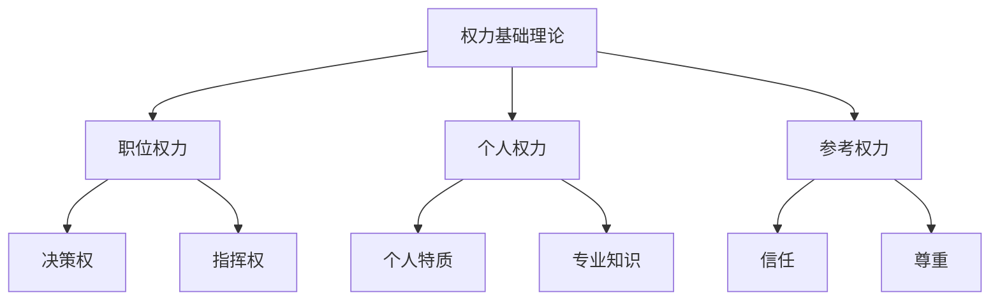
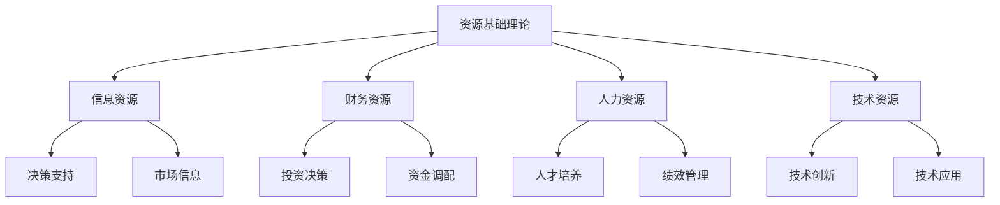
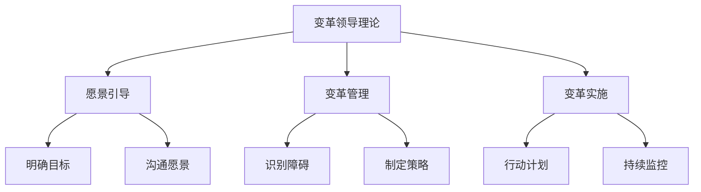
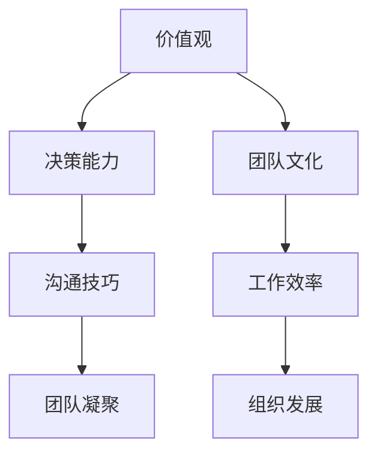

                 

### 引言

在当今快速变化和高度竞争的商业环境中，提高效率成为了企业和组织成功的关键因素。而在这其中，领导力与时间管理起着至关重要的作用。领导力不仅关乎个人成就，更影响着整个团队的绩效和组织的长远发展。时间管理则是一种系统化的方法，旨在通过合理安排时间来最大化个人和团队的产出。

领导力是指通过影响、激励和引导他人来实现共同目标的能力。它不仅仅是一个管理角色，更是一种艺术和科学。有效的领导力能够促进团队协作、增强员工的凝聚力，并激发员工的潜力，从而提升整个组织的效率。

时间管理则是指通过规划和控制时间，以确保重要任务得到优先处理，避免时间浪费，从而提高个人和团队的效率。时间管理不仅仅是关于时间分配的问题，更是一种关于如何高效利用时间、减少拖延和提升专注力的方法论。

在这篇文章中，我们将详细探讨领导力与时间管理的关系，以及如何结合两者的优势来提高工作效率。我们将首先介绍领导力与时间管理的基本概念，然后深入分析领导力的核心要素和有效的实践方法。接着，我们将探讨时间管理的基础原则和实用技巧，并结合实际案例进行研究。最后，我们将探讨如何将领导力与时间管理结合起来，提供一个综合应用框架，以及评估和未来展望。

通过本文的逐步分析，希望能够帮助读者理解领导力和时间管理的重要性，掌握相关的核心概念和实用技巧，并将其应用到实际工作中，从而实现个人和团队的高效运作。

### 关键词

- 领导力
- 时间管理
- 效率提升
- 团队协作
- 管理实践
- 组织发展

### 摘要

本文旨在探讨领导力与时间管理在提高工作效率中的关键作用。通过详细分析领导力的基本概念、核心要素及其在实践中的挑战，本文揭示了领导力对团队协作和组织发展的深远影响。同时，本文深入探讨了时间管理的基础原则和实用技巧，并探讨了如何将领导力与时间管理有效结合，以实现个人和团队的效率提升。通过理论讲解、案例分析及实际应用，本文为读者提供了一个系统化的方法，以应对现代工作中的时间管理和领导力挑战，从而推动组织持续进步。

### 第1章 引言

#### 领导的定义与重要性

领导，是一种通过影响、激励和引导他人来实现共同目标的能力。在组织和企业中，领导不仅是管理者，更是变革的推动者和团队的灵魂人物。领导与管理的区别在于，管理侧重于控制和协调，而领导则更注重愿景的塑造和激励人心的能力。

首先，领导的作用在于设定明确的目标和方向。一个优秀的领导者能够清晰地表达组织的愿景，并将这一愿景转化为具体的目标，使团队成员明确自己的职责和期望。这种目标设定不仅有助于提高团队的凝聚力，还能激发成员的内在动力，促使他们为实现组织目标而努力。

其次，领导是团队的凝聚力和动力的源泉。领导者通过建立积极的团队文化，促进成员之间的沟通与合作，增强团队的凝聚力。这种凝聚力不仅能够提高团队的整体绩效，还能增强成员之间的信任和相互支持，使团队在面对挑战时更加团结和坚韧。

此外，领导还能够激励和培养团队成员。领导者通过认可员工的成就、提供成长机会和反馈，激发员工的潜力，提高他们的工作满意度和忠诚度。这不仅有助于提升团队的整体素质，还能为组织培养出更多具有领导潜力的人才，实现可持续发展。

总之，领导在组织中的重要性不可忽视。有效的领导不仅能够提高团队绩效，还能推动组织的发展，实现长期的成功。因此，了解和掌握领导的基本概念和技能对于企业和组织来说至关重要。

#### 领导风格

领导风格是领导者对待团队成员和管理工作的行为和方式。不同的领导风格对团队的影响各不相同，通常可以分为以下几种主要类型：

1. **权威型领导**：权威型领导者通常采取集中决策的方式，由领导者独自决定并强制执行。这种风格在紧急情况下或需要迅速做出决策时可能非常有效，因为它能够快速统一行动，减少决策时间。然而，长期使用权威型领导风格可能会导致团队成员缺乏参与感和创新意识，从而降低团队的整体士气和创造力。

2. **民主型领导**：民主型领导者鼓励团队成员参与决策过程，尊重他们的意见和反馈。这种领导风格有助于提高团队成员的参与感和归属感，增强团队的凝聚力。在需要集体智慧和多元化观点的情境中，民主型领导往往能够取得更好的效果。然而，这种风格也可能导致决策过程复杂化，延长决策时间。

3. **参与型领导**：参与型领导者不仅鼓励团队成员参与决策，还积极倾听他们的意见和建议，并尽量满足他们的需求。这种领导风格有助于建立高度信任和合作的关系，使团队成员感到自己的价值和贡献被认可。参与型领导适用于需要高度合作和创新的项目，但需要领导者具备较高的沟通和协调能力。

4. **教练型领导**：教练型领导者专注于培养团队成员的技能和潜力，帮助他们实现个人和职业发展。这种领导风格强调持续学习和个人成长，通过提供反馈、指导和支持，帮助团队成员克服挑战，提高绩效。教练型领导适用于培养人才和推动组织变革的情境。

不同领导风格的选择取决于具体情境和团队成员的特点。在实际工作中，领导者需要根据具体情况灵活调整领导风格，以实现最佳效果。例如，在一个需要快速决策的项目中，权威型领导可能更为合适；而在一个创新性的团队中，参与型或教练型领导则可能更能激发团队的潜力。

#### 领导力与时间管理的关系

领导力与时间管理之间存在密切的关系，两者相辅相成，共同影响着个人和团队的工作效率。首先，有效的领导力能够帮助团队成员更好地管理时间。领导者通过设定明确的目标和优先级，指导团队成员专注于最重要和最有价值的工作，从而避免时间和资源的浪费。这种目标导向的时间管理方法有助于提高团队成员的工作效率和产出。

其次，时间管理是领导力的重要组成部分。一个优秀的领导者不仅需要具备领导能力，还需要掌握时间管理技能。通过合理安排自己的时间，领导者能够更好地履行职责，提高决策效率，并为团队成员树立良好的榜样。此外，领导者通过时间管理还可以确保团队目标的实现，提高团队的凝聚力和工作效率。

另外，领导力与时间管理的关系还体现在团队文化建设上。一个高效的团队通常具备良好的时间管理意识，而这离不开领导者的引导和培养。领导者通过制定合理的时间管理政策和提供相关的培训，可以帮助团队成员掌握时间管理的技能，从而提高团队的整体绩效。

此外，时间管理还可以增强领导者的应变能力和决策效率。通过合理安排时间，领导者能够更好地应对突发情况和变化，快速做出决策，减少因时间浪费导致的机会成本。这种应变能力和决策效率不仅有助于领导者在团队中树立权威，还能为团队在面对挑战时提供强大的支持。

总之，领导力与时间管理相互促进，共同推动个人和团队的工作效率。通过有效结合领导力和时间管理，领导者能够更好地实现团队目标，提高组织的整体绩效。

#### 领导力模型

领导力是一个复杂而多维的概念，不同的理论从不同的角度探讨了领导力的本质和作用。以下是几种主要的领导力模型及其核心概念：

##### 权力基础理论

**核心概念**：权力基础理论认为，领导力来源于领导者对资源的控制，这些资源包括职位权力、个人权力和参考权力。职位权力来源于领导者的职位和职位所赋予的正式权力，如决策权、指挥权等。个人权力则是指领导者通过个人特质、能力和专业知识所获得的权力，如个人魅力和专业权威。参考权力是指领导者通过个人的品质、价值观和行为所获得的信任和尊重，从而影响他人的行为。

**联系与架构**：权力基础理论强调了领导力的实质是权力关系，领导者通过权力资源来影响和引导团队成员。这种领导力模型中，领导者的权力来源和运用方式决定了领导效果。Mermaid流程图如下：

##### 资源基础理论

**核心概念**：资源基础理论认为，领导力来源于领导者对关键资源的掌握和管理。这些资源包括信息资源、财务资源、人力资源和技术资源。领导者通过有效地整合和管理这些资源，以实现组织目标和个人利益。

**联系与架构**：资源基础理论强调了领导者的资源管理能力对于领导效果的重要性。领导者需要具备识别、获取和利用资源的能力，以推动团队和组织的进步。Mermaid流程图如下：

##### 变革领导理论

**核心概念**：变革领导理论关注领导者在推动组织变革过程中的作用。领导者通过愿景引导、变革管理和变革实施，带领组织应对外部环境的变化和内部挑战。

**联系与架构**：变革领导理论强调了领导者在变革过程中的引领作用。领导者需要具备前瞻性的眼光、强大的沟通能力和坚定的决心，以推动组织从现状向目标状态转变。Mermaid流程图如下：

##### 三种模型的关系与综合应用

权力基础理论、资源基础理论和变革领导理论从不同角度对领导力进行了深入探讨。权力基础理论关注领导者如何通过权力资源影响团队；资源基础理论关注领导者如何通过资源管理推动组织进步；变革领导理论关注领导者如何在变革过程中引领组织。这三种理论相互补充，共同构成了对领导力的全面理解。

在实际应用中，领导者可以根据具体情境综合运用这三种理论。例如，在面对组织变革时，领导者可以运用变革领导理论来引导和推动变革；在资源有限的情况下，领导者可以运用资源基础理论来优化资源利用；在需要增强团队凝聚力和工作效率时，领导者可以运用权力基础理论来提升领导效果。

通过综合应用这些领导力模型，领导者可以更好地应对各种挑战，实现个人和团队的目标。

#### 领导力的核心要素

领导力的核心要素是领导者成功的关键，包括价值观、决策能力、沟通技巧等多个方面。以下是对这些核心要素的详细解析：

**价值观**

价值观是领导力的基石，它决定了领导者的行为方式和决策取向。一个具有明确价值观的领导者能够为团队树立良好的榜样，引导团队成员形成积极向上的价值观。价值观包括诚信、责任感、公正、团队合作和创新等。一个领导者如果能够在工作中始终坚持这些核心价值观，就能够赢得团队成员的信任和尊重，从而提升团队的凝聚力和工作效率。

**决策能力**

决策能力是领导力的核心要素之一，它决定了领导者在面对复杂情境时的应对策略。一个优秀的领导者需要具备快速分析问题、权衡利弊、制定决策和执行决策的能力。在决策过程中，领导者不仅需要考虑自身的经验和直觉，还要倾听团队成员的意见和建议，以形成全面和客观的决策。此外，领导者还需要具备灵活调整决策的能力，以应对变化和不确定性。

**沟通技巧**

沟通技巧是领导者有效传达信息、建立信任和促进团队协作的重要手段。一个优秀的领导者需要具备清晰表达思想、有效倾听他人意见、积极反馈和建设性沟通的能力。在团队中，领导者需要通过沟通来明确目标和任务，指导团队成员的工作，解决冲突和问题，以及激励团队成员的积极性。有效的沟通不仅能够提高工作效率，还能增强团队成员之间的信任和合作关系。

**领导力的核心要素关系架构**

为了更好地理解领导力的核心要素之间的关系，我们可以使用Mermaid流程图来展示这些要素及其相互影响：

在这个关系架构图中，价值观是领导力的核心，它直接影响决策能力和沟通技巧。决策能力则通过沟通技巧影响团队的凝聚力和工作效率，进而推动组织的发展。

**综合应用**

在实际工作中，领导者需要综合运用这些核心要素，以实现团队和组织的目标。例如，一个领导者可以通过坚持诚信和责任感的价值观来树立榜样，通过有效的沟通技巧来传达决策，并通过灵活的决策能力来应对变化。这样的领导风格不仅能够提高团队的工作效率，还能推动组织的持续发展。

总之，领导力的核心要素相互关联，共同构成了一个成功的领导模式。通过深入理解和应用这些要素，领导者可以更好地应对各种挑战，实现个人和团队的目标。

#### 领导价值观的塑造

领导价值观的塑造是领导者个人成长和组织文化构建的重要组成部分。一个成功的领导者不仅需要具备卓越的能力和技能，更需要有一套清晰而坚定的价值观体系。以下是对领导价值观塑造的探讨，包括关键步骤和实际方法。

**关键步骤**

1. **自我反思**：领导者首先需要通过自我反思来识别自己的核心价值观。这包括思考个人的成长背景、信仰、经历和人生目标。通过深入自我反思，领导者可以明确自己真正关心和追求的东西，从而为价值观的塑造奠定基础。

2. **明确目标**：在自我反思的基础上，领导者需要将核心价值观与个人目标相结合，明确自己在组织中的愿景和使命。这有助于确保领导者的行为和决策与价值观保持一致，从而增强领导力的公信力和影响力。

3. **持续学习**：领导者需要通过持续学习和不断拓展自己的知识领域来提升自身的价值观。阅读书籍、参加研讨会和培训、与行业专家交流等都是有效的学习方式。通过不断学习，领导者可以更新和丰富自己的价值观体系，使其更加符合时代发展的需求。

**实际方法**

1. **树立榜样**：领导者应该通过自己的行为来践行核心价值观，为团队成员树立榜样。例如，领导者可以通过诚信、责任感和公正等行为来展示这些价值观，从而赢得团队成员的信任和尊重。

2. **培养团队成员**：领导者需要通过培训和指导来培养团队成员，帮助他们在工作中践行核心价值观。这包括提供培训机会、设立明确的目标和期望，以及通过反馈和评估来促进团队成员的成长。

3. **建立共同价值观**：领导者可以通过团队活动和文化建设来建立共同的价值观。例如，通过团队建设活动、文化墙、核心价值观宣贯等方式，让团队成员在共同的价值观下协作和成长。

**案例分析**

一个实际的案例是谷歌（Google）的创始人拉里·佩奇和谢尔盖·布林。他们在公司成立初期就明确了一套核心价值观，包括“不作恶”、“快速决策”和“技术创新”。这些价值观不仅影响了谷歌的管理决策，还渗透到了公司的文化和员工行为中。通过坚持这些核心价值观，谷歌成功吸引了全球最优秀的创新人才，推动了公司的持续发展和创新。

**总结**

领导价值观的塑造是一个长期而持续的过程，需要领导者的自我反思、明确目标和持续学习。通过树立榜样、培养团队成员和建立共同价值观，领导者可以有效地塑造和强化自己的价值观体系，从而提升领导力和组织文化。这不仅能提高团队的工作效率和绩效，还能为组织的长期发展奠定坚实的基础。

#### 决策模型与决策技巧

决策是领导力的核心组成部分，它直接关系到组织的绩效和发展。有效的决策模型和技巧能够帮助领导者做出明智的决策，确保团队目标的实现。以下是几种常见的决策模型及其在实际应用中的技巧。

**1. SMART决策模型**

**定义**：SMART决策模型是一种基于明确性和可操作性的决策方法，其五个要素分别是：具体（Specific）、明确（Measurable）、可实现（Achievable）、相关（Relevant）和有时限（Time-bound）。

**应用技巧**：
- **具体**：确保决策目标清晰明确，避免模糊和含糊不清的描述。
- **明确**：设定明确的衡量标准，以便评估决策效果。
- **可实现**：确保决策目标在资源、时间和能力范围内可以实现。
- **相关**：确保决策与组织目标、战略和价值观相一致。
- **有时限**：设定明确的决策期限，以促进行动和跟进。

**2. SWOT分析**

**定义**：SWOT分析是一种基于内部和外部环境的决策方法，包括优势（Strengths）、劣势（Weaknesses）、机会（Opportunities）和威胁（Threats）四个方面。

**应用技巧**：
- **优势**：利用组织的优势资源，增强竞争力。
- **劣势**：识别并克服组织内部的问题和挑战。
- **机会**：抓住市场机遇，推动组织发展。
- **威胁**：预判外部威胁，制定应对策略。

**3. 成本效益分析**

**定义**：成本效益分析是一种基于成本和收益的决策方法，通过比较决策的潜在成本和预期收益，评估决策的可行性和效益。

**应用技巧**：
- **成本分析**：详细列出实现决策所需的成本，包括直接成本和间接成本。
- **收益分析**：评估决策可能带来的收益，包括直接收益和间接收益。
- **收益-成本比**：计算收益与成本的比率，以评估决策的经济性。

**4. 贝叶斯决策模型**

**定义**：贝叶斯决策模型是一种基于概率和统计的决策方法，通过计算不同决策结果发生的概率，选择最优方案。

**应用技巧**：
- **概率估计**：根据历史数据和现有信息，估计不同决策结果发生的概率。
- **后验概率**：结合先验概率和观测数据，更新决策结果的概率。
- **决策优化**：选择概率最高或风险最小的决策方案。

**综合应用**

在实际应用中，领导者通常需要综合运用多种决策模型和技巧，以应对复杂多变的决策情境。以下是一个综合应用案例：

**案例：新产品研发决策**

某科技公司决定研发一款新型智能家居产品。在决策过程中，领导者首先使用SMART模型明确研发目标，如具体的功能、预期的市场反应和时间表。接着，通过SWOT分析评估公司内部的优势和劣势、市场机会和潜在威胁。然后，进行成本效益分析，计算研发成本和市场预期收益，以确定经济可行性。最后，使用贝叶斯决策模型，结合市场调查数据和先验概率，评估不同研发策略的风险和收益，选择最优方案。

**总结**

有效的决策模型和技巧是领导者成功的关键。通过SMART、SWOT、成本效益分析和贝叶斯决策模型等，领导者可以系统化地分析和评估决策情境，做出明智的决策。这不仅能提高决策的准确性和效率，还能增强组织的竞争力，推动持续发展。

#### 高效沟通的技巧

沟通技巧是领导力的关键组成部分，它直接影响团队协作效率和领导力的有效性。有效的沟通不仅能够传达清晰的信息，还能增强团队成员之间的信任和合作。以下是几种高效沟通的技巧，以及实际应用中的注意事项。

**1. 清晰表达**

**技巧**：清晰表达是高效沟通的基础。领导者需要确保自己的语言简明易懂，避免使用专业术语或模糊不清的表述。

**注意事项**：
- **简洁明了**：避免冗长和复杂的句子，尽量使用简单直接的语言。
- **明确意图**：在表达观点或指令时，要明确意图和目的，避免产生误解。

**2. 主动倾听**

**技巧**：主动倾听是指领导者不仅要听到信息，还要理解信息背后的含义和情感。

**注意事项**：
- **放下成见**：在倾听时，放下自己的主观偏见，全神贯注地听取对方的意见。
- **反馈确认**：通过提问和总结，确认自己对信息的理解是否准确，避免误解。

**3. 非语言沟通**

**技巧**：非语言沟通包括肢体语言、面部表情和语调等，这些都能传递重要信息。

**注意事项**：
- **注意身体语言**：保持开放的身体姿态，避免封闭或防御性的姿态。
- **控制语调**：使用积极的语调，避免语速过快或过慢，以及过多的口头禅。

**4. 透明沟通**

**技巧**：透明沟通是指领导者应保持信息的公开和透明，避免信息不对称。

**注意事项**：
- **及时反馈**：及时回应团队成员的问题和反馈，避免延迟和回避。
- **公开讨论**：在团队中鼓励公开讨论，避免私下议论和猜测。

**实际应用案例**

**案例一：项目沟通**

在一个大型项目团队中，领导者通过每周的团队会议来沟通项目的进展和问题。他使用清晰表达技巧来传达项目目标，通过主动倾听技巧来听取团队成员的建议和意见，并通过透明沟通技巧来确保所有成员都了解项目的最新动态。这种高效的沟通方式提高了团队的工作效率和项目成功率。

**案例二：跨部门协作**

在一个需要跨部门协作的项目中，领导者通过非语言沟通技巧来增强团队间的合作。他使用积极的肢体语言和鼓励性的面部表情来激励团队成员，并通过控制语调来传达信息，确保所有部门都能理解并支持项目的目标。这种高效的沟通方式促进了跨部门的合作，提高了项目的整体绩效。

**总结**

高效沟通是领导力的重要组成部分，它能够增强团队协作、提高工作效率和实现组织目标。通过清晰表达、主动倾听、非语言沟通和透明沟通等技巧，领导者可以建立有效的沟通渠道，提高团队的整体绩效。实际应用中的注意事项和案例经验则为领导者提供了具体的实践指导，有助于他们在工作中更好地运用沟通技巧。

### 第3章 领导力在组织中的作用

#### 领导力与组织文化

领导力在组织文化中扮演着至关重要的角色。组织文化是指组织内部共同的价值观、信念和行为规范，它影响着组织的运营方式、员工的行为和组织的整体绩效。领导力通过塑造和强化组织文化，能够推动组织的持续发展和变革。

首先，领导力在组织文化的形成中起到了关键作用。领导者通过自身的价值观和行为来示范和传递组织文化。例如，一个重视创新和学习的领导者，会鼓励团队成员勇于尝试新思路、不断学习和改进，从而形成积极的学习型组织文化。此外，领导者在招聘、培训和激励过程中也会注重文化适配，确保新成员能够融入和传承组织文化。

其次，领导力在组织文化的传播中起到了桥梁作用。领导者需要通过有效的沟通和互动，将组织文化理念传递给所有员工。这包括在会议、培训、团队活动等场合中，明确传达组织文化的核心价值和行为规范，并通过日常管理行为来示范这些价值观。通过这样的传播，组织文化能够深入人心，成为员工共同遵循的行为准则。

此外，领导力在组织文化的变革中起到了推动作用。在组织面临外部环境变化或内部发展需求时，领导力能够引导和推动组织文化的变革。领导者需要识别变革的需求，制定明确的变革目标，并通过激励和引导员工，推动他们接受和适应新的文化。例如，一个领导者可以通过变革管理理论，设计系统的变革计划和实施策略，确保组织文化的顺利过渡和融合。

总之，领导力与组织文化密切相关，它不仅影响着组织文化的形成和传播，还在组织文化的变革中起到了关键作用。通过有效的领导力，领导者能够塑造和强化组织文化，推动组织的持续发展和变革。

#### 领导力与团队建设

领导力在团队建设中起着至关重要的作用。一个优秀的领导者不仅能够激发团队成员的潜力，还能促进团队的协作和凝聚力，从而提高整体绩效。以下是领导力在团队建设中的几个关键方面：

**1. 明确目标和期望**

领导者首先需要明确团队的目标和期望。这包括设定具体的、可衡量的目标，以及为团队成员提供清晰的职责和角色描述。通过明确目标和期望，领导者可以确保团队成员对工作有共同的理解和追求，从而增强团队的动力和凝聚力。

**2. 激发团队成员潜力**

领导者需要关注团队成员的个人潜力和发展需求，通过激励和培养来激发他们的潜力。这可以通过设定挑战性的任务、提供培训机会和认可员工的成就来实现。此外，领导者还应鼓励团队成员参与决策过程，使他们感到自己的意见和贡献被重视，从而增强他们的积极性和归属感。

**3. 建立有效的沟通机制**

沟通是团队建设的关键，领导者需要建立一个开放、透明和有效的沟通机制。这包括鼓励团队成员之间的开放交流、定期组织团队会议和反馈会议，以及确保信息在团队内的顺畅传递。有效的沟通不仅能够增强团队成员之间的信任和理解，还能及时发现和解决团队中的问题和冲突。

**4. 培养团队协作精神**

团队协作精神是团队建设的重要目标之一。领导者需要通过多种方式培养团队成员的协作精神，包括设立共同目标、促进知识分享和鼓励跨部门合作。此外，领导者还可以通过团队建设活动来增强团队成员之间的互动和信任，如团队拓展训练、团队合作游戏等。

**5. 解决团队冲突**

在团队建设中，冲突是不可避免的。领导者需要具备解决冲突的能力，通过中立、公正和客观的态度来处理冲突。这包括识别冲突的根本原因、促进双方的理解和沟通，以及提出和实施合理的解决方案。通过有效的冲突管理，领导者可以确保团队的工作环境稳定和和谐，从而提高团队的绩效。

总之，领导力在团队建设中起到了至关重要的作用。通过明确目标和期望、激发团队成员潜力、建立有效的沟通机制、培养团队协作精神和解决团队冲突，领导者可以推动团队的健康发展，实现团队的目标和愿景。

#### 领导力与组织变革

领导力在组织变革中扮演着至关重要的角色。随着外部环境和内部需求的不断变化，组织需要不断地调整和变革以保持竞争力。而领导力的有效发挥能够推动组织变革的顺利进行，确保变革目标的实现。以下是领导力在组织变革中的几个关键方面：

**1. 变革愿景的塑造**

领导者在组织变革中首先需要塑造一个清晰的变革愿景。这个愿景需要明确变革的目标、方向和意义，并激发员工的共鸣和参与。领导者通过沟通和示范，向全体员工传达变革的重要性和必要性，使员工对变革有共同的理解和认同。

**2. 变革管理的策略**

领导者在推动组织变革时，需要制定详细的变革管理策略。这包括分析变革的影响因素、评估变革的可行性、制定变革计划和实施步骤。领导者还需要考虑到变革过程中可能遇到的阻力，并提前设计应对措施，以确保变革的顺利进行。

**3. 激励员工参与**

员工参与是组织变革成功的关键。领导者需要通过多种方式激励员工参与变革，包括提供培训机会、建立反馈机制、鼓励员工提出意见和建议。此外，领导者还可以通过设立激励机制，如奖金、晋升机会等，激发员工积极参与变革的热情。

**4. 解决变革中的冲突**

在变革过程中，冲突是不可避免的。领导者需要具备解决冲突的能力，通过中立、公正和客观的态度来处理冲突。这包括识别冲突的根本原因、促进双方的理解和沟通，以及提出和实施合理的解决方案。通过有效的冲突管理，领导者可以确保变革过程中的稳定和和谐，从而提高变革的效率。

**5. 持续监控与评估**

组织变革是一个长期的过程，领导者需要持续监控和评估变革的进展情况，以确保变革目标的实现。这包括定期收集员工反馈、评估变革效果、调整变革计划等。通过持续监控与评估，领导者可以及时发现问题，采取纠正措施，确保变革的顺利进行。

**6. 培养变革文化**

领导者在推动组织变革的过程中，还需要培养一种积极向上的变革文化。这包括鼓励员工勇于创新、支持变革、培养开放和包容的工作氛围。通过建立变革文化，领导者可以确保组织在变革过程中充满活力和创造力，从而实现持续发展。

总之，领导力在组织变革中起到了关键作用。通过塑造变革愿景、制定变革策略、激励员工参与、解决冲突、持续监控与评估和培养变革文化，领导者可以推动组织变革的顺利进行，实现组织的长期发展。

#### 复杂环境下的领导力

在当今日益复杂和不确定的商业环境中，领导者面临的挑战也日益增加。复杂环境中的领导力不仅需要领导者具备卓越的管理能力和决策能力，还需要他们具备应对不确定性和动态变化的灵活性。以下是领导者如何应对复杂环境的几个关键策略：

**1. 保持灵活性**

在复杂环境中，领导力需要具备高度的灵活性。领导者需要能够快速适应环境变化，灵活调整战略和计划。这包括具备前瞻性思维，能够预判潜在的变化趋势，并及时调整策略。此外，领导者还需要鼓励团队成员保持灵活，以应对突发情况。

**2. 建立适应性组织**

适应性组织能够快速响应外部变化，并在变化中保持稳定。领导者需要通过建立适应性组织结构和文化，来提升组织的适应能力。这可以通过设立灵活的项目团队、鼓励创新和实验、建立快速反馈机制等方式实现。

**3. 培养学习型组织**

复杂环境要求领导者具备不断学习和自我提升的能力。通过建立学习型组织，领导者可以确保组织在变化中不断进步和成长。学习型组织强调知识分享、持续学习和员工发展，从而提升组织的整体竞争力。

**4. 沟通与协作**

在复杂环境中，领导者需要加强沟通与协作，确保信息在组织内的有效传递。通过建立透明、开放的沟通渠道，领导者可以增强团队之间的信任和合作，提高决策效率。

**5. 风险管理**

领导者需要具备风险管理意识，能够识别和评估潜在风险，并制定相应的应对策略。通过建立风险管理机制，领导者可以确保组织在复杂环境中能够稳健发展。

**6. 持续监控与调整**

领导者需要持续监控环境变化，及时调整组织战略和计划。通过建立有效的监控和评估体系，领导者可以确保组织能够快速响应外部变化，并保持竞争优势。

**7. 培养领导力梯队**

在复杂环境中，领导者需要具备接班人计划，培养下一代的领导者。通过建立领导力梯队，领导者可以确保组织在领导层变动时能够保持稳定和连续性。

总之，在复杂环境中，领导者需要具备灵活应变、建立适应性组织、培养学习型组织、强化沟通与协作、进行风险管理、持续监控与调整和培养领导力梯队等关键策略。通过这些策略，领导者可以有效地应对复杂环境的挑战，推动组织的持续发展和成功。

#### 跨文化领导

跨文化领导是领导力领域中的一个重要课题，特别是在全球化背景下，不同国家和地区的文化差异对企业的影响日益显著。有效的跨文化领导不仅能够促进国际团队的协作，还能提升企业的全球竞争力。以下是跨文化领导的关键策略：

**1. 理解文化差异**

跨文化领导的第一步是理解和尊重文化差异。领导者需要深入了解不同文化的社会价值观、行为习惯和工作方式。这可以通过文化培训、交流活动和跨文化咨询等方式实现。了解文化差异有助于避免文化冲突，并建立相互尊重的工作环境。

**2. 促进文化融合**

在跨文化团队中，领导者需要促进不同文化之间的融合，建立共同的价值观和目标。这可以通过设立跨文化团队、开展团队建设活动和制定共同的团队规则来实现。通过文化融合，可以增强团队成员的凝聚力和协作精神。

**3. 增强沟通能力**

跨文化领导要求领导者具备卓越的沟通能力，以确保信息在不同文化背景下的准确传达。领导者需要使用简单、清晰的语言，避免使用可能引起误解的文化特定术语。此外，领导者还需要培养耐心和同理心，倾听不同文化背景下的团队成员的意见和反馈。

**4. 个性化领导**

跨文化领导需要领导者根据不同团队成员的文化背景和行为习惯，采取个性化的领导方式。这包括尊重员工的个性化需求，提供灵活的工作安排，以及根据文化差异调整激励措施。个性化的领导有助于提高员工的满意度和忠诚度。

**5. 培养跨文化技能**

领导者需要具备跨文化技能，包括跨文化沟通、跨文化管理和跨文化决策能力。这可以通过参加跨文化培训课程、阅读相关书籍和参与跨文化项目等方式培养。跨文化技能有助于领导者更好地应对全球化背景下的复杂挑战。

**6. 建立文化敏感性**

文化敏感性是跨文化领导的关键素质。领导者需要具备文化敏感性，能够敏锐地察觉和应对文化差异带来的挑战。这包括对文化冲突的预见和及时干预，以及对文化多样性的尊重和包容。

**7. 跨文化团队管理**

领导者需要通过有效的团队管理策略，促进跨文化团队的协作和效率。这包括建立清晰的团队目标、培养团队文化、促进知识分享和加强团队沟通。通过有效的团队管理，可以提升跨文化团队的绩效和凝聚力。

总之，跨文化领导是一个复杂而多样化的课题，需要领导者具备理解文化差异、促进文化融合、增强沟通能力、个性化领导、培养跨文化技能、建立文化敏感性和跨文化团队管理等策略。通过这些策略，领导者可以有效地推动跨文化团队的发展，提升企业的全球竞争力。

#### 领导力的可持续发展

领导力的可持续发展是确保组织长期成功和领导力持续发挥的关键。为了实现领导力的可持续发展，领导者需要从自我提升、团队建设和组织文化三个方面着手。

**1. 自我提升**

自我提升是领导力可持续发展的基础。领导者需要持续学习和成长，以适应不断变化的环境和需求。具体措施包括：

- **终身学习**：领导者应积极参与各种培训和学习机会，如参加研讨会、学习课程和阅读专业书籍，不断更新自己的知识和技能。
- **反思与反馈**：领导者应定期进行自我反思，评估自己的领导行为和效果，并根据反馈进行调整。这可以帮助领导者发现自身的优势和不足，持续改进领导力。
- **角色扮演**：领导者可以通过角色扮演和模拟情境，提升自己在面对复杂挑战时的应变能力和决策能力。

**2. 团队建设**

团队建设是领导力可持续发展的重要环节。一个高效的团队不仅能够提升组织的绩效，还能为领导者的成长提供支持。具体措施包括：

- **培养团队合作**：领导者应通过团队建设活动、共同目标和协作任务，培养团队成员之间的信任和合作精神。
- **发展领导力梯队**：领导者应关注团队成员的领导潜力，提供培训和指导，培养未来的领导者。
- **激发创新思维**：领导者应鼓励团队成员提出创新的想法和解决方案，为团队注入活力和创造力。

**3. 组织文化**

组织文化对领导力的可持续发展有着深远的影响。一个积极向上的组织文化能够激发员工的潜力，增强团队的凝聚力。具体措施包括：

- **建立共同价值观**：领导者应明确组织的核心价值观，并通过各种方式传播和践行，使员工认同并内化这些价值观。
- **促进开放沟通**：领导者应建立开放的沟通机制，鼓励员工表达意见和反馈，确保信息在组织内顺畅传递。
- **鼓励员工参与**：领导者应鼓励员工参与决策和项目管理，使他们感到自己的意见和贡献被重视，从而增强他们的归属感和责任感。

**案例分析**

谷歌（Google）是一家在领导力可持续发展方面表现出色的企业。谷歌通过以下措施实现了领导力的可持续发展：

- **员工培训与发展**：谷歌为员工提供丰富的培训机会，包括技术培训、领导力培训和职业发展指导，帮助员工不断成长。
- **领导力梯队建设**：谷歌通过内部选拔和培养计划，发展了一批具有领导潜力的员工，确保领导层的持续更新和稳定。
- **积极的文化氛围**：谷歌注重创造一个开放、创新和包容的工作环境，鼓励员工自由表达意见和提出创新想法。

**总结**

领导力的可持续发展是一个长期而系统的过程，需要领导者从自我提升、团队建设和组织文化三个方面着手。通过持续学习、反思与反馈、培养团队合作、建立共同价值观、促进开放沟通和鼓励员工参与，领导者可以确保领导力的持续发挥，推动组织的长期成功。

#### 第4章 领导力发展计划

领导力的发展是一个持续的过程，需要通过系统化的计划和策略来实现。以下是关于领导力发展计划的核心内容，包括自我评估工具、自我提升策略以及领导力修炼。

**4.1 自我评估工具**

自我评估是领导力发展的重要环节，它有助于领导者识别自身的优势和不足，从而有针对性地进行提升。以下是几种常用的自我评估工具：

1. **360度反馈**：360度反馈是一种通过收集来自上级、同事、下属和其他利益相关者的反馈，对领导者的表现进行全面评估的方法。这种方法能够提供多维度的视角，帮助领导者识别自身在领导行为、沟通技巧、决策能力等方面的优缺点。

2. **领导力测评问卷**：领导力测评问卷是一种标准化的评估工具，通过一系列的问题和指标，评估领导者在不同领导能力方面的表现。例如，领导力素质测评问卷（LSI）和领导力行为量表（LBA）等。

3. **领导力发展日记**：领导者可以记录自己在日常工作中遇到的挑战、应对策略以及反馈和成果，通过反思和总结来提升自我认知和领导能力。

**4.2 自我提升策略**

在了解自身的优势和不足之后，领导者需要制定具体的自我提升策略。以下是一些有效的自我提升策略：

1. **终身学习**：领导者应将学习视为一种习惯，持续关注行业动态和领导力新知。通过参加培训课程、阅读专业书籍和参加研讨会等方式，不断更新知识和技能。

2. **角色扮演**：通过模拟领导情境和角色扮演，领导者可以在安全的实践中提升决策能力、沟通技巧和应变能力。角色扮演可以帮助领导者更深入地理解不同领导角色的需求和挑战。

3. **寻求反馈**：领导者应主动寻求来自上级、同事和下属的反馈，并根据反馈进行自我调整和改进。定期进行绩效评估和反馈会议，有助于领导者及时发现问题并采取行动。

4. **参加领导力发展项目**：许多企业和组织提供专门的领导力发展项目，包括领导力工作坊、领导力教练和领导力发展计划等。这些项目通常设计有系统的课程和实战演练，有助于领导者全面提升领导能力。

**4.3 领导力修炼**

领导力的修炼是一个长期而持续的过程，需要领导者从多个维度进行自我提升和修炼。以下是几个关键方面：

1. **道德修养**：领导者需要具备高尚的道德品质，如诚信、责任感和公正。道德修养不仅是领导者个人的行为准则，也是影响团队和组织文化的重要因素。

2. **自我管理**：领导者需要通过自我管理来提升个人效能，包括时间管理、情绪管理和目标设定等。有效的自我管理有助于领导者更好地应对工作和生活中的各种挑战。

3. **团队建设**：领导者应注重团队建设，通过培养团队协作精神、提高团队凝聚力和激励团队成员，来提升团队的整体绩效。

4. **持续反思**：领导者应养成持续反思的习惯，通过反思自己的行为、决策和成果，来发现问题和改进方法。持续反思有助于领导者不断提升自己的领导力。

**总结**

领导力的发展计划是一个系统化的过程，需要通过自我评估、自我提升策略和领导力修炼来实现。通过使用自我评估工具，领导者可以了解自身的优势和不足；通过自我提升策略，领导者可以针对性地提升自己的领导能力；通过领导力修炼，领导者可以全面提升自己的道德修养、自我管理、团队建设和持续反思能力。只有通过持续的努力和修炼，领导者才能在竞争激烈的商业环境中保持优势，实现组织的长期成功。

#### 领导力学习与实践

领导力是一种可以通过学习和实践不断提升的能力。为了有效提升领导力，领导者需要掌握系统的学习方法和实践策略，并结合具体情境进行灵活运用。以下是关于领导力学习的几个关键方面，包括领导力培训、反思与实践，以及领导力案例学习。

**4.1 领导力培训**

领导力培训是提升领导能力的重要途径。通过系统化的培训，领导者可以学习到最新的领导理论、实践技巧和成功案例。以下是一些常见的领导力培训方法：

1. **工作坊和研讨会**：工作坊和研讨会通常由专业的培训机构或行业专家举办，通过互动式教学和案例分析，帮助领导者深入理解领导力核心概念和实践方法。这类培训强调参与和实践，有助于领导者将理论知识应用到实际工作中。

2. **在线课程**：随着互联网技术的发展，越来越多的在线课程提供了灵活的学习方式。领导者可以通过在线平台，选择适合自己的课程进行学习，如Coursera、edX等。在线课程通常包含视频讲解、阅读材料和实践作业，适合时间紧张的领导者。

3. **领导力教练**：领导力教练是一种个性化的培训方式，通过一对一的辅导，教练可以帮助领导者识别自身的优势和不足，并提供具体的改进建议。领导力教练不仅关注领导技能的提升，还关注领导者的个人成长和职业发展。

**4.2 反思与实践**

反思与实践是领导力提升的关键环节。通过反思，领导者可以深入思考自己在领导实践中的行为和决策，识别问题和改进方向。以下是一些实用的反思与实践策略：

1. **日常反思**：领导者可以在每天工作结束后，花时间反思自己的行为和决策。通过记录反思日记，领导者可以清晰地了解自己在工作中的优点和不足，并制定改进计划。

2. **情境模拟**：情境模拟是一种通过模拟实际工作情境来提升领导能力的训练方法。领导者可以模拟面对不同类型的员工和复杂的工作环境，通过实践来提升自己的决策能力和应变能力。

3. **实践应用**：将学到的领导力理论和技巧应用到实际工作中，是提升领导力的有效方法。领导者可以在工作中尝试新的领导方法，如改变沟通方式、调整激励机制等，并观察这些变化对团队绩效和员工满意度的影响。

**4.3 领导力案例学习**

领导力案例学习是一种通过分析真实领导情境来学习领导技巧的方法。通过学习成功的领导案例，领导者可以了解不同的领导策略和实践方法，并将其应用到自己的工作中。以下是一些领导力案例学习的方法：

1. **案例分析**：领导者可以阅读和分析成功的领导案例，如《领导力解析》（Leadership Lessons from the Top）等书籍。通过分析案例中的领导行为和决策过程，领导者可以学习到实用的领导技巧和策略。

2. **讨论和分享**：通过团队讨论和分享会，领导者可以与其他人讨论和学习不同的领导案例。这种方式不仅可以帮助领导者从多个角度理解领导情境，还能促进团队成员之间的交流和协作。

3. **角色扮演**：在模拟情境中，领导者可以扮演不同的角色，体验不同的领导情境，并通过反思和讨论来提升自己的领导能力。

**总结**

领导力学习与实践是一个持续的过程，需要领导者通过多种方式进行系统化的学习和实践。通过领导力培训，领导者可以掌握最新的领导理论和方法；通过反思与实践，领导者可以将理论应用到实际工作中，不断提升自己的领导能力；通过领导力案例学习，领导者可以借鉴成功的领导经验，丰富自己的领导策略。只有通过不断学习和实践，领导者才能在竞争激烈的商业环境中脱颖而出，实现组织的长期成功。

### 第5章 时间管理基础

#### 时间管理的重要性

时间管理在个人和团队工作中具有至关重要的意义，它不仅影响工作效率，还关系到个人成长和组织绩效。以下是时间管理对个人发展、团队绩效和组织效益的具体影响。

**1. 个人发展**

有效的时间管理有助于个人实现职业和个人目标的达成。通过合理安排时间，个人可以更好地分配精力，专注于最重要的任务和目标，从而提高工作效率和成果。时间管理还可以帮助个人建立良好的工作习惯，如按时完成任务、减少拖延等，这些习惯有助于提升个人的职业素养和自我管理能力。此外，时间管理能够减少工作压力，提高生活质量，使个人有更多时间进行休息和娱乐，从而保持身心健康。

**2. 团队绩效**

时间管理对团队绩效有着直接的影响。一个高效的时间管理体系可以帮助团队明确任务优先级，确保关键任务得到优先处理，从而提高团队的整体效率和产出。通过合理的时间规划，团队可以更好地协调工作，减少冗余和重复工作，避免资源浪费。此外，时间管理还能帮助团队建立明确的工作目标和时间表，提高工作的透明度和可预测性，减少因信息不对称导致的沟通成本和冲突。

**3. 组织效益**

时间管理对组织的长期效益也有着重要的影响。通过有效的时间管理，组织可以优化资源配置，提高生产效率和运营效率，从而降低成本，提升利润。此外，时间管理有助于组织建立良好的工作流程和标准，提高工作的规范性和可重复性，从而增强组织的竞争力和市场适应能力。时间管理还可以提高组织的应变能力，使组织能够快速响应市场变化和客户需求，保持持续的发展动力。

**综合影响**

时间管理的重要性不仅体现在个人和团队层面，还对组织的整体效益产生深远影响。通过有效的时间管理，个人可以提升自我效能感和职业满意度，团队可以增强协作和执行力，组织可以提升整体效率和竞争力。因此，时间和管理的系统化、科学化应用对于个人、团队和组织的发展都具有重要意义。

#### 时间管理的基本原则

时间管理的基本原则是合理安排时间，提高工作效率，确保重要任务得到优先处理。以下是几个关键的时间管理基本原则：

**1. 设定明确的目标**

设定明确的目标是时间管理的第一步。明确的目标有助于个人和团队集中精力，确保时间和资源得到最有效的利用。设定目标时，应遵循SMART原则，即目标要具体（Specific）、可衡量（Measurable）、可实现（Achievable）、相关（Relevant）和有时限（Time-bound）。例如，一个具体的目标可以是“在明天下午4点前完成市场调研报告”。

**2. 制定合理的时间计划**

制定合理的时间计划是确保目标达成的关键。时间计划应包括日常任务、长期目标和突发任务的安排。在制定时间计划时，应考虑任务的优先级和资源的可用性。例如，将一天的时间分为几个时间段，每个时间段专注于处理一项主要任务，并在计划中留出时间用于应对突发事件。

**3. 优先级管理**

优先级管理是时间管理中最重要的原则之一。通过确定任务的优先级，可以确保关键任务得到优先处理，从而提高工作效率和成果。在优先级管理中，可以使用“紧急-重要矩阵”来区分任务的重要性和紧急程度。例如，紧急且重要的任务应优先处理，重要但不紧急的任务可以稍后处理。

**4. 避免时间浪费**

时间浪费是降低工作效率和绩效的主要原因之一。为了避免时间浪费，可以采取以下措施：

- **避免拖延**：设立明确的时间表和截止日期，以减少拖延现象。
- **消除干扰**：创建一个无干扰的工作环境，减少社交媒体和其他干扰因素的影响。
- **合理安排休息时间**：定期休息和放松，有助于保持精力和专注力。

**5. 定期回顾和调整**

定期回顾和调整时间计划是确保时间管理有效性的关键。通过定期回顾，可以评估时间计划的执行情况和效果，发现存在的问题，并作出相应的调整。例如，每周或每月进行一次时间回顾，分析时间利用情况，并根据实际情况调整下一步的计划。

**总结**

时间管理的基本原则包括设定明确的目标、制定合理的时间计划、优先级管理、避免时间浪费和定期回顾和调整。通过遵循这些基本原则，个人和团队能够合理安排时间，提高工作效率，确保重要任务得到优先处理，从而实现个人和团队的目标。有效的时间管理不仅能够提升工作效率，还能为组织的长期发展提供有力支持。

#### 时间管理工具与方法

在现代工作环境中，高效的时间管理已成为个人和团队成功的关键。为了实现这一目标，使用适当的工具和方法至关重要。以下将介绍几种常见的时间管理工具和方法，包括日历管理工具、任务管理工具和时间跟踪工具。

**1. 日历管理工具**

日历管理工具是一种帮助个人和组织规划日程、管理时间和协调活动的工具。以下是一些流行的日历管理工具：

- **Google Calendar**：Google Calendar 是一款功能强大的在线日历工具，它支持多个账户同步，允许用户创建事件、设置提醒，并与团队成员共享日程。用户可以通过电子邮件和短信接收提醒通知，确保不会错过重要事件。

- **Microsoft Outlook Calendar**：Outlook Calendar 是微软办公套件的一部分，提供直观的界面和丰富的功能，如日历视图、任务管理、邮件和联系人同步等。Outlook Calendar 还支持与其他微软应用程序的集成，方便用户进行全方位的时间管理。

- **Apple Calendar**：Apple Calendar 是 macOS 和 iOS 系统的内置日历应用，提供简洁直观的界面和强大的功能。用户可以创建事件、设置提醒，并与其他苹果设备同步。Apple Calendar 还支持日历共享和共享事件邀请，便于团队协调日程。

**2. 任务管理工具**

任务管理工具帮助个人和组织跟踪任务进度、分配任务和确保任务按时完成。以下是一些流行的任务管理工具：

- **Trello**：Trello 是一款基于看板（Kanban）原理的任务管理工具，提供直观的界面和灵活的布局。用户可以创建任务卡片，将其拖放到不同的列中，以表示任务的状态和优先级。Trello 还支持标签、注释和附件，方便用户进行详细的任务描述。

- **Asana**：Asana 是一款功能全面的任务管理工具，适用于中小型团队和大型企业。它支持任务分配、进度跟踪、项目管理、协作讨论和文件共享等功能。用户可以创建项目、子任务和依赖关系，确保任务按计划进行。

- **JIRA**：JIRA 是一款专业的敏捷项目管理工具，广泛应用于软件开发团队。它支持任务跟踪、缺陷管理、敏捷板和报告分析等功能。JIRA 还支持与 Git、Confluence 等 Atlassian 工具的集成，方便用户进行全方位的项目管理。

**3. 时间跟踪工具**

时间跟踪工具帮助用户记录工作时间、分析时间利用情况，从而提高工作效率。以下是一些常见的时间跟踪工具：

- **Toggl**：Toggl 是一款简单易用的在线时间跟踪工具，提供多平台支持，如网页版、桌面应用程序和移动应用。用户可以创建项目、任务，并为每个任务分配工作时间。Toggl 还提供详细的报告和分析功能，帮助用户了解时间利用情况。

- **RescueTime**：RescueTime 是一款自动化时间跟踪工具，可在用户不干预的情况下记录设备使用情况。它提供详细的时间报告，显示用户在哪些应用和网站上花费了最多时间。RescueTime 还提供提醒和目标设置功能，帮助用户减少时间浪费。

- **Harvest**：Harvest 是一款专业的团队时间跟踪工具，提供网页版、桌面应用程序和移动应用。它支持任务分配、发票生成和项目进度跟踪等功能，方便用户管理团队的工作时间和资源。

**总结**

时间管理工具与方法是提高工作效率和实现时间价值的关键。通过使用日历管理工具、任务管理工具和时间跟踪工具，个人和团队可以更好地规划日程、管理任务和监控时间利用情况。选择合适的工具并合理运用，将有助于实现高效的时间管理，提升个人和团队的绩效。

#### 高效会议管理

会议是团队协作和决策的重要环节，但如果不加管理，会议可能会变得低效和浪费时间。以下是高效会议管理的几个关键方面，包括会议前的准备、会议中的引导和会议后的总结与跟进。

**1. 会议前的准备**

会议前的准备是确保会议高效进行的基础。以下是一些关键的准备工作：

- **明确会议目的**：在召开会议前，明确会议的目标和预期成果。这有助于确保会议内容聚焦，避免偏离主题。

- **制定会议议程**：根据会议目的，制定详细的会议议程，包括每个议题的时间分配和主持人。议程应包含所有需要讨论的议题，以及每个议题的讨论重点。

- **邀请相关人员**：确保邀请到与会议议题相关的人员，并提前通知他们会议的时间、地点和议程，以便他们做好准备。

- **准备工作资料**：提前准备相关的工作资料、报告和文件，确保会议过程中能够流畅地进行讨论。

**2. 会议中的引导**

会议中的引导是确保会议顺利进行的关键。以下是一些关键的引导技巧：

- **控制会议时间**：确保会议在预定时间内开始和结束，避免长时间会议的疲劳和低效。

- **保持会议聚焦**：引导会议围绕议程展开，避免偏离主题和讨论无关内容。如果出现偏离，可以及时提醒与会者回到议程上。

- **鼓励参与和讨论**：鼓励与会者积极参与讨论，提出意见和建议。确保每个与会者都有机会发言，并尊重他们的观点。

- **记录会议内容**：指定一名记录员，记录会议的主要内容和讨论结果，以便会后整理和跟进。

**3. 会议后的总结与跟进**

会议后的总结与跟进是确保会议决策得到执行的关键。以下是一些关键的总结与跟进步骤：

- **会议总结**：会后及时总结会议的主要内容和决策，形成会议纪要，并分发给所有与会者。会议纪要应包含会议主题、主要讨论内容、决策结果和责任分工。

- **跟进任务**：根据会议决策，分配任务和责任，确保每个任务都有明确的负责人和截止日期。跟进任务执行情况，确保决策得到有效执行。

- **会议反馈**：在下次会议前，收集与会者对本次会议的反馈，了解会议的不足和改进方向。通过不断优化会议流程，提高会议的效率。

**总结**

高效会议管理是提高团队协作效率和决策质量的关键。通过会议前的准备、会议中的引导和会议后的总结与跟进，团队可以确保会议内容聚焦、决策得到有效执行，从而提高整体工作效率和绩效。

#### 消除时间浪费

在忙碌的工作中，时间浪费是一个常见且严重的问题，这不仅影响工作效率，还可能导致任务积压和压力增加。以下是几种常见的时间浪费现象及应对策略。

**1. 电子邮件管理**

电子邮件是现代工作中不可或缺的沟通工具，但如果不加管理，电子邮件可能会导致时间浪费。以下是几种电子邮件管理技巧：

- **设定处理规则**：将收件箱分类为不同主题的文件夹，如工作相关、个人事务等，并根据重要性设定优先级。每天固定时间处理邮件，避免分散注意力。

- **限制回复时间**：设定回复邮件的时间限制，避免在收到每封邮件后立即回复。这样可以确保集中精力处理重要任务。

- **使用自动化工具**：使用自动化工具，如邮件过滤器和自动回复功能，减少不必要的邮件干扰。

**2. 社交媒体使用**

社交媒体是获取信息和保持联系的重要渠道，但过度使用会分散注意力，降低工作效率。以下是几种社交媒体使用策略：

- **设定使用时间**：每天设定固定的社交媒体使用时间，避免在工作和学习时间频繁查看。

- **使用专注应用**：使用专注应用，如Forest或Pomodoro Technique，通过设定专注时间段来减少社交媒体干扰。

- **关注高质量内容**：关注行业权威和有价值的内容来源，避免花费时间在无意义的社交媒体上。

**3. 消除拖延习惯**

拖延是导致时间浪费的主要原因之一。以下是几种消除拖延习惯的策略：

- **设定明确的目标和截止日期**：为每个任务设定具体的目标和明确的截止日期，以增强完成任务的动力。

- **使用番茄工作法**：将工作时间分为25分钟专注工作时段和5分钟休息时段，通过定时器来管理工作时间，减少拖延。

- **分解任务**：将大任务分解为小任务，逐步完成，以减少心理压力和拖延情绪。

**总结**

消除时间浪费是提高工作效率和减少压力的关键。通过管理电子邮件、合理使用社交媒体和消除拖延习惯，个人和团队可以更好地利用时间，提高工作质量和效率。有效的时间管理不仅能够提高个人绩效，还能为组织的长期发展提供有力支持。

### 第7章 领导者的时间管理

#### 领导者的时间管理

领导者作为团队和组织中的核心人物，其时间管理能力直接影响到整个团队和组织的绩效。因此，领导者需要具备卓越的时间管理能力，以最大化个人和团队的产出，实现组织目标。以下将探讨领导者在时间管理中的角色和重要性。

**1. 领导者的角色**

在时间管理中，领导者的角色不仅仅是执行者，更是规划者和协调者。领导者需要制定团队的工作计划，合理安排团队成员的时间，确保重要任务得到优先处理。同时，领导者还需要平衡个人和团队的需求，确保团队在高效工作的同时，也能保持良好的工作生活平衡。

**2. 时间管理的重要性**

有效的时间管理对于领导者和团队来说至关重要。首先，时间管理有助于提高工作效率，确保任务按时完成。通过合理安排时间和任务，领导者可以减少不必要的会议和重复工作，避免时间浪费。其次，时间管理有助于提升团队的整体绩效，通过合理分配任务和资源，确保每个成员都能充分发挥自己的潜力。此外，时间管理还能增强领导者的决策能力和应变能力，使他们在面对突发事件和变化时能够迅速作出有效决策。

**3. 培养团队时间管理意识**

领导者需要通过多种方式培养团队的时间管理意识，以提高整个团队的时间利用效率。以下是一些具体策略：

- **设定明确的期望和目标**：领导者应明确团队的目标和任务，并与团队成员共同制定合理的时间计划。这有助于团队成员明确任务的重要性和紧迫性，从而提高工作的效率。

- **提供培训和支持**：领导者可以为团队成员提供时间管理培训，教授他们有效的工具和方法，如使用日历管理工具、任务管理工具和时间跟踪工具等。此外，领导者还可以提供个性化的指导和支持，帮助团队成员克服时间管理中的困难。

- **建立良好的团队文化**：领导者应建立一种积极向上的团队文化，鼓励团队成员相互支持和协作。通过营造一个高效、有序的工作环境，可以增强团队成员的时间管理意识，减少时间浪费。

- **定期反馈和评估**：领导者应定期与团队成员进行反馈和评估，了解他们在时间管理方面的表现和需求。通过及时反馈和调整，可以帮助团队成员不断改进时间管理策略，提高整体工作效率。

**总结**

领导者在时间管理中的角色和重要性不容忽视。通过培养团队的时间管理意识，领导者可以提升团队的工作效率和整体绩效，实现组织目标。有效的领导者应具备卓越的时间管理能力，并通过多种方式引导和激励团队成员，共同创造一个高效、有序的工作环境。

#### 时间管理与个人成长

时间管理不仅影响工作和团队绩效，也对个人的成长和发展产生深远影响。有效的个人时间管理可以帮助个人设定清晰的目标、提高执行力、增强自我管理能力，从而在职业生涯和个人生活中取得更大的成功。

**1. 设定个人成长目标**

有效的个人时间管理首先需要设定明确的成长目标。这些目标可以是短期的，如提高某项技能或完成特定项目；也可以是长期的，如职业晋升或个人兴趣发展。通过明确目标，个人可以更有针对性地分配时间，确保关键任务得到优先处理。

**2. 提高执行力**

时间管理有助于提高个人执行力，确保设定的目标得以实现。通过制定详细的时间计划，个人可以合理安排每天的工作和学习时间，避免拖延和分散注意力。例如，使用番茄工作法（Pomodoro Technique）将工作时间分为25分钟专注工作时段和5分钟休息时段，可以帮助个人保持专注，提高工作效率。

**3. 增强自我管理能力**

时间管理是自我管理的重要组成部分。通过有效的时间管理，个人可以学会如何优先处理重要任务，合理安排休闲和娱乐时间，实现工作和生活的平衡。此外，时间管理还能帮助个人培养自律和自我激励的习惯，提高应对挑战和压力的能力。

**4. 实现个人目标**

通过时间管理，个人可以更好地实现自己的目标。以下是一些具体策略：

- **分解目标**：将大目标分解为小目标，逐步实现。例如，将职业晋升目标分解为获得特定证书或完成特定项目。

- **定期回顾**：定期回顾时间计划和工作进展，评估目标实现情况，并根据实际情况进行调整。

- **记录和反思**：记录每天的工作和学习情况，反思时间利用的优缺点，不断优化时间管理策略。

**5. 时间管理与职业发展**

时间管理在职业发展中扮演着重要角色。通过合理安排时间，个人可以专注于提升专业技能和知识，参加相关培训和研讨会，提高自己的竞争力。此外，时间管理还可以帮助个人在职业生涯中更好地应对变化和挑战，实现职业目标和成长。

**总结**

时间管理对个人成长有着重要的影响。通过设定明确的成长目标、提高执行力、增强自我管理能力和实现个人目标，个人可以在职业生涯和个人生活中取得更大的成功。有效的个人时间管理不仅有助于提高工作效率和绩效，还能为个人的长期发展奠定坚实的基础。

### 第8章 时间管理案例研究

#### 案例介绍

在这个案例中，我们将分析一家中等规模的技术公司——TechSmart，该公司成立于2010年，专注于软件开发和信息技术服务。随着公司规模的不断扩大和项目的增多，员工们逐渐感受到了时间压力和效率下降的问题。为了应对这一挑战，公司决定实施一套系统化的时间管理策略，以提高整体工作效率和员工满意度。

#### 案例分析

**1. 问题识别**

TechSmart公司在实施时间管理前面临以下主要问题：

- **任务分配不均**：由于缺乏明确的时间计划和任务优先级，一些项目任务没有得到合理分配，导致部分员工工作负荷过重，而其他员工则相对轻松。
- **会议效率低**：频繁的会议和无效的讨论消耗了大量时间，员工无法集中精力处理核心任务。
- **拖延现象严重**：由于缺乏有效的激励机制和跟进机制，一些员工出现了拖延现象，导致项目进度延迟。
- **工作与生活平衡受影响**：工作时间的不规律和加班现象频繁，影响了员工的工作与生活平衡，导致员工满意度下降。

**2. 解决方案**

为了解决这些问题，TechSmart公司实施了以下时间管理策略：

- **制定明确的时间计划和任务分配**：公司制定了详细的时间计划和任务分配表，确保每个项目都有明确的负责人和截止日期。通过合理分配任务，避免了任务堆积和员工超负荷工作。
- **采用高效会议管理方法**：公司采用了高效会议管理策略，包括制定会议议程、限制会议时间和鼓励与会者积极参与。通过减少冗长的会议和无效讨论，提高了会议效率。
- **引入时间跟踪工具**：公司引入了Toggl等时间跟踪工具，帮助员工记录工作时间，分析时间利用情况。通过数据反馈，员工能够识别和减少时间浪费，提高工作效率。
- **建立激励机制**：公司建立了明确的激励机制，包括奖励按时完成任务和表现出色的员工。这增强了员工的工作动力，减少了拖延现象。
- **关注员工工作与生活平衡**：公司鼓励员工合理安排工作和生活时间，提供灵活的工作安排和远程办公选项，以减少加班现象，提高员工满意度。

**3. 实施效果**

通过实施系统化的时间管理策略，TechSmart公司取得了显著的效果：

- **工作效率提升**：员工通过合理分配时间和任务，减少了重复工作和无效讨论，工作效率显著提高。
- **项目进度加快**：任务按时完成的比率增加，项目进度加快，客户满意度提升。
- **员工满意度提高**：通过关注员工的工作与生活平衡，员工满意度显著提高，员工流失率下降。
- **时间浪费减少**：员工通过时间跟踪工具识别和减少了时间浪费，整体工作效率得到提升。

**总结**

TechSmart公司的案例展示了系统化时间管理策略在实际应用中的效果。通过制定明确的时间计划和任务分配、高效会议管理、引入时间跟踪工具、建立激励机制以及关注员工工作与生活平衡，公司成功提高了工作效率和员工满意度，实现了整体绩效的提升。这一案例为其他企业提供了有益的借鉴和参考。

### 时间管理对个人发展的长期影响

时间管理不仅有助于提高个人和团队的工作效率，还对个人发展的长期影响具有重要意义。以下是时间管理对个人成长、职业发展和生活质量的几个方面。

**1. 个人成长**

有效的个人时间管理可以帮助个人在专业技能和知识上实现持续提升。通过合理安排时间，个人可以专注于学习新技能、参加培训课程和阅读专业书籍，从而不断拓展自己的知识边界。时间管理还能帮助个人培养自律和自我管理能力，增强解决问题的能力和应对挑战的信心。

**2. 职业发展**

时间管理对职业发展有着显著的影响。通过高效的时间管理，个人可以更好地规划职业生涯，设定明确的目标和计划，并按照计划稳步推进。有效的时间管理还可以提高工作效率，使个人在短时间内完成更多任务，获得更多的成就和认可。这有助于提升职业竞争力，为职业晋升和职业转换提供有力支持。

**3. 生活质量**

时间管理不仅影响工作和职业发展，还对生活质量产生深远影响。通过合理安排时间，个人可以更好地平衡工作与生活，确保有足够的时间进行休闲和娱乐，从而减少工作压力，提高生活满意度。此外，时间管理还能帮助个人避免拖延和过度劳累，保持身心健康，提高整体生活质量。

**综合影响**

时间管理对个人发展的长期影响是全面的，它不仅帮助个人在专业技能和知识上不断进步，还促进职业发展和提高生活质量。通过科学合理的时间管理，个人可以更好地实现个人和职业目标，实现全面的发展。因此，重视并有效运用时间管理是个人在现代社会中取得成功的关键。

### 第9章 领导力与时间管理的综合应用

#### 综合应用框架

领导力与时间管理的综合应用是一个系统化的过程，它要求领导者将领导力的核心要素与时间管理的原则和方法相结合，以实现个人和团队的高效运作。以下是一个综合应用框架，包括整合策略、目标设定以及方法与工具。

**1. 整合策略**

领导力与时间管理的整合策略旨在通过系统化的方法和工具，确保领导力的实践能够有效支持时间管理，从而提高团队的整体效率和绩效。

- **目标导向**：领导者需要将个人和团队的目标与时间管理目标相结合，确保时间和资源的分配与目标实现一致。例如，在设定项目目标时，要明确每个阶段的时间计划和任务分配。

- **角色明确**：在团队中明确每个成员的角色和职责，确保时间管理能够落实到具体的人员。通过明确分工，可以避免职责重叠和时间浪费。

- **文化塑造**：领导者需要通过文化和价值观的塑造，培养团队成员的时间管理意识。这可以通过定期培训、分享成功案例和建立积极的反馈机制来实现。

- **持续优化**：领导者应不断评估和优化时间管理策略，确保其与领导力实践相协调。通过定期回顾和调整，可以不断改进时间管理方法，提高团队效率。

**2. 目标设定**

目标设定是领导力与时间管理综合应用的关键环节。有效的目标设定需要遵循SMART原则，确保目标具体、可衡量、可实现、相关和有时限。

- **具体**：目标应明确具体，避免模糊和泛泛而谈。例如，而不是说“提高销售额”，可以说“在下一个季度内将销售额提高10%”。

- **可衡量**：目标应具备可衡量性，以便评估进展和效果。例如，通过设定具体的销售金额或客户数量来衡量目标实现情况。

- **可实现**：目标应基于现实资源和条件，确保在资源和时间内可以实现。这可以通过资源评估和风险评估来实现。

- **相关**：目标应与组织的目标和价值观一致，确保其相关性和重要性。例如，在时间管理中，设定与提高团队协作效率相关的目标。

- **有时限**：目标应设定明确的截止日期，以确保及时完成。这可以通过设定具体的完成时间点来实现。

**3. 方法与工具**

为了实现领导力与时间管理的综合应用，领导者需要掌握一系列方法和工具，以支持时间管理和领导力实践。

- **日历管理工具**：使用日历管理工具，如Google Calendar和Microsoft Outlook，可以帮助领导者和管理团队合理安排日程和会议。

- **任务管理工具**：任务管理工具，如Trello和Asana，可以帮助团队分配任务、跟踪进度和管理项目。

- **时间跟踪工具**：时间跟踪工具，如Toggl和Harvest，可以帮助团队记录工作时间、分析时间利用情况，并优化时间管理。

- **领导力发展工具**：领导力发展工具，如360度反馈和领导力测评问卷，可以帮助领导者了解自身优势和不足，并进行有针对性的提升。

- **文化塑造工具**：通过团队建设活动和沟通工具，如 Slack 和 Microsoft Teams，领导者可以建立积极的团队文化，促进时间管理和领导力实践。

**总结**

领导力与时间管理的综合应用需要系统化的策略和方法。通过明确整合策略、设定具体目标，以及使用合适的方法与工具，领导者可以有效地结合领导力和时间管理，提高团队的整体效率和绩效，实现个人和组织的长期发展。

### 领导力与时间管理的评估

在领导力与时间管理的综合应用过程中，评估效果是确保策略有效性的关键。以下将介绍如何设定评估指标、选择评估方法和分析评估结果。

**1. 设定评估指标**

为了准确评估领导力与时间管理的综合应用效果，需要设定具体的评估指标。这些指标可以包括以下几个方面：

- **工作效率**：衡量团队完成任务的速度和质量，如任务完成率、项目交付时间和错误率。
- **时间利用**：评估时间管理的有效性，如员工平均工作时间、任务分配合理性、时间浪费比例等。
- **员工满意度**：通过调查和反馈了解员工对领导力和时间管理的满意度，包括工作压力、工作与生活平衡、团队协作等。
- **绩效达成**：评估团队和个人的绩效目标达成情况，如销售额、客户满意度、项目成功率等。
- **组织发展**：衡量组织整体的发展状况，如市场占有率、收入增长率、员工流失率等。

**2. 选择评估方法**

选择合适的评估方法可以更准确地反映综合应用的效果。以下是一些常见的评估方法：

- **定量评估**：通过数据分析和统计方法，如KPI（关键绩效指标）和数据分析工具，评估工作效率和绩效达成情况。
- **定性评估**：通过问卷调查、访谈和观察，了解员工满意度和时间管理实践的具体情况。
- **反馈机制**：建立定期反馈机制，如月度或季度评估会议，让员工和管理层共同参与评估和讨论。
- **标杆对比**：将当前绩效与同行业标杆企业或历史绩效进行对比，评估改进效果和差距。

**3. 分析评估结果**

分析评估结果可以帮助领导者了解综合应用的效果，发现问题和改进方向。以下是一些分析评估结果的方法：

- **数据可视化**：使用图表和仪表盘，如Power BI或Google Data Studio，将评估结果进行可视化展示，使数据更加直观易懂。
- **趋势分析**：分析评估数据的变化趋势，如工作效率的提升速度、员工满意度变化等，识别改进效果和潜在问题。
- **因果分析**：分析不同因素对评估结果的影响，如时间管理策略的调整、领导力培训的实施等，确定关键影响因素。
- **反馈改进**：根据评估结果和员工反馈，制定具体的改进计划，如调整任务分配、优化会议流程、加强领导力培训等。

**总结**

领导力与时间管理的评估是确保策略有效性的关键。通过设定具体的评估指标、选择合适的评估方法，以及分析评估结果，领导者可以了解综合应用的效果，发现问题和改进方向，从而不断提升团队和组织的效率与绩效。

### 时间管理与领导力的发展趋势

在未来的发展中，时间管理与领导力将继续相互影响、共同进步。以下将探讨未来可能的发展趋势，包括自动化技术的应用、数字化工具的创新以及组织文化的变革。

**1. 自动化技术的应用**

随着人工智能和机器学习技术的不断发展，自动化技术将在时间管理和领导力领域发挥更大的作用。自动化工具可以大幅减轻重复性工作和繁琐任务，使领导者能够将更多精力投入到战略性任务和领导活动中。例如，智能日程安排工具可以根据员工的日程和工作习惯，自动安排和调整会议时间，提高会议效率。此外，自动化工具还可以实时分析员工的工作表现和时间利用情况，为领导者提供数据支持和决策依据。

**2. 数字化工具的创新**

数字化工具的创新将进一步推动时间管理和领导力的提升。未来，更智能化、更个性化的时间管理和领导力工具将不断涌现。例如，智能日历管理工具将能够通过自然语言处理技术，理解用户的指令并自动调整日程安排；智能任务管理工具将能够根据任务的优先级和员工的技能，自动分配任务和跟踪进度。此外，虚拟现实（VR）和增强现实（AR）技术的应用将使领导力培训更加直观和互动，帮助领导者更好地掌握时间和领导力技能。

**3. 组织文化的变革**

未来，组织文化将更加注重时间管理和领导力的平衡与优化。随着员工对工作生活平衡的关注度提高，组织将更加重视员工的个人时间和健康。例如，灵活工作制度的推广和远程办公的普及，将使员工能够更灵活地安排工作和个人时间，提高工作满意度和生产力。同时，组织文化将更加鼓励创新和自我管理，通过建立学习型组织和倡导持续学习，培养领导者的领导力和时间管理能力。

**综合展望**

未来，时间管理与领导力的发展将更加智能化、数字化和人性化。通过自动化技术的应用、数字化工具的创新以及组织文化的变革，领导者将能够更高效地管理时间和资源，实现个人和团队的长期发展。同时，时间管理和领导力的融合将进一步提升组织的竞争力，推动企业在快速变化的商业环境中持续创新和成长。

### 结论

通过本文的详细探讨，我们深刻理解了领导力与时间管理在提高工作效率中的关键作用。领导力不仅关乎个人成就，更对团队协作和组织发展有着深远影响。有效的领导力能够激发团队成员的潜力，提高团队的凝聚力和工作效率。同时，时间管理作为一种系统化的方法，有助于合理安排时间和资源，最大化个人和团队的产出。

本文首先介绍了领导力的定义与重要性，分析了不同领导风格对团队的影响，并探讨了领导力与时间管理的关系。随后，我们详细分析了领导力的核心要素，包括价值观、决策能力和沟通技巧，以及如何通过自我提升和实践来培养领导力。此外，我们还探讨了领导力在组织中的作用，如组织文化和团队建设，以及跨文化领导的重要策略。

在时间管理方面，我们介绍了时间管理的重要性、基本原则、工具和方法，包括日历管理、任务管理和时间跟踪工具。我们还探讨了高效会议管理和消除时间浪费的策略。通过实际案例研究，我们展示了系统化时间管理策略的实施效果，强调了时间管理对个人发展和生活质量的影响。

结合领导力与时间管理，我们提出了一套综合应用框架，包括整合策略、目标设定和方法与工具。通过设定评估指标和分析评估结果，我们确保了策略的有效性。未来，自动化技术和数字化工具的应用、组织文化的变革将继续推动时间管理与领导力的发展。

总之，领导力与时间管理是提高工作效率和实现个人与团队目标的关键。通过深入理解和应用这些概念和策略，领导者可以更好地应对现代工作中的挑战，推动组织的持续发展和成功。让我们共同努力，提升领导力和时间管理能力，实现个人和团队的卓越表现。作者：AI天才研究院/AI Genius Institute & 禅与计算机程序设计艺术 /Zen And The Art of Computer Programming。

