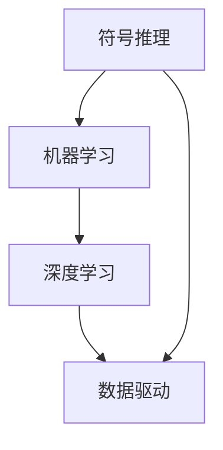
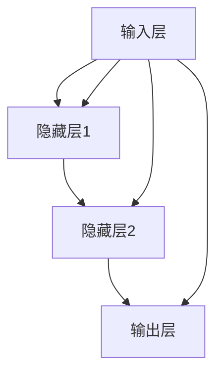

                 

 

## 文章标题：人工智能与深度学习：从理论到实践的综合指南

### 关键词：
- 人工智能
- 深度学习
- 理论基础
- 实践指南
- 神经网络
- 机器学习框架

### 摘要：
本文将带领读者深入探索人工智能和深度学习领域的理论和实践。首先，我们将回顾人工智能的历史背景，介绍其核心概念和关键技术。接着，我们将详细讲解深度学习的理论基础，包括神经网络和优化算法。随后，我们将讨论如何使用主流机器学习框架进行实践，并提供实际案例和代码实现。最后，我们将总结最佳实践，探讨深度学习的未来发展趋势。

## 目录

1. 引言：人工智能与深度学习概述
2. 人工智能的历史背景
3. 深度学习的理论基础
   3.1 神经网络
   3.2 优化算法
4. 主流机器学习框架的应用
   4.1 TensorFlow
   4.2 PyTorch
5. 实际案例与代码实现
6. 最佳实践与注意事项
7. 深度学习的未来发展趋势
8. 拓展阅读
9. 作者信息

## 1. 引言：人工智能与深度学习概述

人工智能（AI）是计算机科学的一个分支，旨在使机器能够模拟、延伸和扩展人类的智能。深度学习是机器学习的一个子领域，通过模拟人脑的神经网络结构，实现数据的自动特征学习和复杂模式的识别。随着大数据和计算能力的提升，深度学习在图像识别、自然语言处理、自动驾驶等领域取得了突破性进展。

本文将分为以下几个部分进行详细讲解：

- **人工智能的历史背景**：回顾人工智能的起源和发展历程，介绍关键人物和里程碑事件。
- **深度学习的理论基础**：深入探讨神经网络和优化算法的基本原理，包括多层感知器、反向传播算法等。
- **主流机器学习框架的应用**：介绍TensorFlow和PyTorch等主流机器学习框架的使用方法，提供代码示例。
- **实际案例与代码实现**：通过具体案例，展示如何使用深度学习解决实际问题。
- **最佳实践与注意事项**：总结深度学习实践中的最佳方法和注意事项。
- **深度学习的未来发展趋势**：探讨深度学习在人工智能领域的发展方向。

## 2. 人工智能的历史背景

人工智能的概念最早可以追溯到20世纪中叶。1956年，约翰·麦卡锡（John McCarthy）在达特茅斯会议上首次提出了“人工智能”这个术语，标志着人工智能学科的诞生。此后，人工智能经历了多次起伏，其中最重要的发展可以分为以下几个阶段：

- **早期探索（1956-1974）**：这一时期，人工智能主要集中在符号推理和逻辑编程上，例如逻辑理论家和普罗莫修斯（ELIZA）等早期程序。然而，由于硬件限制和算法复杂性，这一阶段的成果有限。

- **第一次繁荣期（1974-1980）**：随着计算机性能的提升，人工智能开始应用在专家系统和自然语言处理等领域。1976年，爱德华·费根鲍姆（Edward Feigenbaum）开发的Dendral程序被认为是人工智能的里程碑之一。

- **第一次低谷（1980-1987）**：由于实际应用中的困难，人工智能在1980年代初期遭遇了“人工智能寒冬”。符号推理方法面临挑战，使得人们对人工智能的前景产生了怀疑。

- **第二次繁荣期（1987-2012）**：随着统计学习方法的兴起，人工智能开始从符号推理转向数据驱动的方法。1997年，IBM的深蓝（Deep Blue）在国际象棋比赛中击败了世界冠军加里·卡斯帕罗夫，标志着人工智能在特定领域取得了突破。

- **深度学习的崛起（2012至今）**：以AlexNet为代表，深度学习在图像识别领域取得了巨大成功。随着大数据和计算能力的提升，深度学习在各个领域得到了广泛应用。

在这个历史背景下，人工智能从早期的符号推理转向了基于数据和计算的方法，使得人工智能的应用更加广泛和实际。

### 2.1 核心概念与联系

人工智能的核心概念包括：

- **符号推理**：基于符号表示和推理规则进行问题求解。
- **机器学习**：通过数据训练模型，使其能够自动学习和改进。
- **深度学习**：基于多层神经网络的模型，实现数据的自动特征学习和复杂模式的识别。

这些概念之间的联系在于：

- **机器学习是实现人工智能的主要途径**：通过机器学习，计算机能够从数据中学习规律，实现智能行为。
- **深度学习是机器学习的一个子领域**：深度学习通过多层神经网络的结构，实现数据的自动特征学习和复杂模式的识别。
- **符号推理和深度学习互补**：符号推理擅长处理逻辑推理和符号计算问题，而深度学习擅长处理大规模数据和高维度问题。

#### Mermaid 流程图



### 2.2 神经网络与深度学习

神经网络是深度学习的基础，其灵感来源于人脑的神经网络结构。神经网络由大量简单的计算单元（神经元）组成，通过层次化的结构对数据进行处理和特征提取。

#### Mermaid 流程图



#### 神经元模型

神经元的模型可以表示为：

$$
y_i = \sigma(\sum_{j=1}^{n} w_{ij} \cdot x_j + b)
$$

其中，$y_i$ 是第 $i$ 个神经元的输出，$\sigma$ 是激活函数，$w_{ij}$ 是连接权重，$x_j$ 是输入特征，$b$ 是偏置。

#### 激活函数

激活函数用于引入非线性，常见的激活函数包括：

- **Sigmoid函数**：$1 / (1 + e^{-x})$，将输出压缩到$(0, 1)$区间。
- **ReLU函数**：$max(0, x)$，简单且计算效率高。
- **Tanh函数**：$(2 / (1 + e^{-2x}) - 1)$，将输出压缩到$(-1, 1)$区间。

#### 伪代码

```python
# 伪代码：神经网络前向传播
def forwardpropagation(inputs, weights, biases, activation_functions):
    for layer in range(number_of_layers):
        for neuron in range(number_of_neurons[layer]):
            z = sum(inputs[j] * weights[j, neuron] for j in range(number_of_inputs)) + biases[neuron]
            output = activation_functions[layer](z)
            inputs = output
    return output
```

#### 深度学习的优势

- **自动特征提取**：深度学习能够自动从数据中提取抽象特征，减少人工干预。
- **适应性强**：深度学习能够处理大规模和高维度数据，适应性强。
- **高效性**：通过多层网络结构，深度学习能够高效地学习复杂模式。

### 2.3 优化算法

深度学习的训练过程实质上是优化模型的参数，使其在训练数据上表现良好。常见的优化算法包括：

- **随机梯度下降（SGD）**：每次迭代使用一个样本的梯度进行更新。
- **批量梯度下降（BGD）**：每次迭代使用所有样本的梯度进行更新。
- **小批量梯度下降（MBGD）**：每次迭代使用部分样本的梯度进行更新。

#### 伪代码

```python
# 伪代码：随机梯度下降
def sgd(parameters, gradients, learning_rate):
    for parameter in parameters:
        parameter -= learning_rate * gradients[parameter]
    return parameters
```

### 2.4 数学公式与详细讲解

在深度学习中，一些关键数学公式如下：

- **损失函数**：用于评估模型预测值与真实值之间的差距。

$$
L = \frac{1}{2} \sum_{i=1}^{n} (y_i - \hat{y}_i)^2
$$

其中，$y_i$ 是真实值，$\hat{y}_i$ 是模型预测值。

- **反向传播算法**：用于计算梯度，更新模型参数。

$$
\frac{\partial L}{\partial w_{ij}} = \frac{\partial L}{\partial z_j} \cdot \frac{\partial z_j}{\partial w_{ij}}
$$

其中，$w_{ij}$ 是连接权重，$z_j$ 是前一层神经元的输出。

#### 举例说明

假设我们有一个简单的神经网络，包含一个输入层、一个隐藏层和一个输出层。输入层有两个神经元，隐藏层有三个神经元，输出层有一个神经元。激活函数使用ReLU函数。

- **输入层**：$x_1, x_2$
- **隐藏层**：$z_1, z_2, z_3$
- **输出层**：$y$

给定训练数据：

- **真实值**：$y = [1, 0, 0]$
- **模型预测值**：$\hat{y} = [0.9, 0.1, 0.2]$

损失函数为：

$$
L = \frac{1}{2} \sum_{i=1}^{3} (\hat{y}_i - y_i)^2
$$

计算梯度：

$$
\frac{\partial L}{\partial z_1} = \frac{\partial L}{\partial \hat{y}_1} \cdot \frac{\partial \hat{y}_1}{\partial z_1} = (y_1 - \hat{y}_1) \cdot (1 - \hat{y}_1)
$$

$$
\frac{\partial L}{\partial z_2} = \frac{\partial L}{\partial \hat{y}_2} \cdot \frac{\partial \hat{y}_2}{\partial z_2} = (y_2 - \hat{y}_2) \cdot (1 - \hat{y}_2)
$$

$$
\frac{\partial L}{\partial z_3} = \frac{\partial L}{\partial \hat{y}_3} \cdot \frac{\partial \hat{y}_3}{\partial z_3} = (y_3 - \hat{y}_3) \cdot (1 - \hat{y}_3)
$$

使用梯度下降更新参数：

$$
w_{12} \leftarrow w_{12} - learning_rate \cdot \frac{\partial L}{\partial z_1}
$$

$$
w_{22} \leftarrow w_{22} - learning_rate \cdot \frac{\partial L}{\partial z_2}
$$

$$
w_{32} \leftarrow w_{32} - learning_rate \cdot \frac{\partial L}{\partial z_3}
$$

通过这种方式，我们不断更新参数，使得模型在训练数据上表现更好。

## 3. 主流机器学习框架的应用

在深度学习实践中，主流机器学习框架如TensorFlow和PyTorch极大地简化了模型的构建和训练过程。本节将介绍这两个框架的基本用法，并通过具体代码示例来说明。

### 3.1 TensorFlow

TensorFlow是由谷歌开发的开源机器学习框架，广泛应用于各种深度学习任务。以下是使用TensorFlow构建一个简单的神经网络进行回归任务的代码示例：

```python
import tensorflow as tf

# 定义输入层、隐藏层和输出层
inputs = tf.keras.layers.Input(shape=(1,))
hidden = tf.keras.layers.Dense(units=10, activation='relu')(inputs)
outputs = tf.keras.layers.Dense(units=1)(hidden)

# 构建模型
model = tf.keras.Model(inputs=inputs, outputs=outputs)

# 编译模型
model.compile(optimizer='adam', loss='mean_squared_error')

# 训练模型
model.fit(x_train, y_train, epochs=100)

# 评估模型
model.evaluate(x_test, y_test)
```

### 3.2 PyTorch

PyTorch是由Facebook开发的开源机器学习框架，以其灵活性和动态计算图而受到广泛欢迎。以下是使用PyTorch构建一个简单的卷积神经网络进行图像分类的代码示例：

```python
import torch
import torch.nn as nn
import torch.optim as optim

# 定义卷积神经网络
class ConvNet(nn.Module):
    def __init__(self):
        super(ConvNet, self).__init__()
        self.conv1 = nn.Conv2d(1, 10, kernel_size=5)
        self.conv2 = nn.Conv2d(10, 20, kernel_size=5)
        self.fc1 = nn.Linear(320, 50)
        self.fc2 = nn.Linear(50, 10)

    def forward(self, x):
        x = self.conv1(x)
        x = nn.functional.relu(x)
        x = self.conv2(x)
        x = nn.functional.relu(x)
        x = torch.flatten(x, 1)
        x = self.fc1(x)
        x = nn.functional.relu(x)
        x = self.fc2(x)
        return x

# 实例化模型、优化器和损失函数
model = ConvNet()
optimizer = optim.SGD(model.parameters(), lr=0.01)
criterion = nn.CrossEntropyLoss()

# 训练模型
for epoch in range(10):
    for inputs, targets in dataset:
        optimizer.zero_grad()
        outputs = model(inputs)
        loss = criterion(outputs, targets)
        loss.backward()
        optimizer.step()

# 评估模型
with torch.no_grad():
    for inputs, targets in test_dataset:
        outputs = model(inputs)
        loss = criterion(outputs, targets)
        print(loss.item())
```

通过这些示例，我们可以看到TensorFlow和PyTorch提供了简便的API，使得深度学习模型的构建和训练变得直观和高效。

## 4. 实际案例与代码实现

在本节中，我们将通过一个实际案例，展示如何使用深度学习解决一个具体的图像识别问题。我们将使用PyTorch框架，实现一个简单的卷积神经网络（CNN）来识别手写数字。

### 4.1 数据集介绍

我们将使用MNIST数据集，这是一个包含70000个手写数字图像的数据集。每个图像都是28x28的灰度图，标签是0到9之间的整数。

### 4.2 模型架构

我们的模型将包含三个卷积层、两个全连接层，并使用ReLU激活函数和交叉熵损失函数。

### 4.3 代码实现

以下是我们使用PyTorch实现该模型的代码：

```python
import torch
import torch.nn as nn
import torch.optim as optim
from torchvision import datasets, transforms

# 数据预处理
transform = transforms.Compose([transforms.ToTensor(), transforms.Normalize((0.5,), (0.5,))])

train_set = datasets.MNIST('data', download=True, train=True, transform=transform)
test_set = datasets.MNIST('data', download=True, train=False, transform=transform)

train_loader = torch.utils.data.DataLoader(train_set, batch_size=100, shuffle=True)
test_loader = torch.utils.data.DataLoader(test_set, batch_size=100, shuffle=False)

# 模型定义
class SimpleCNN(nn.Module):
    def __init__(self):
        super(SimpleCNN, self).__init__()
        self.conv1 = nn.Conv2d(1, 16, 5)
        self.conv2 = nn.Conv2d(16, 32, 5)
        self.fc1 = nn.Linear(32*4*4, 128)
        self.fc2 = nn.Linear(128, 10)
    
    def forward(self, x):
        x = nn.functional.max_pool2d(self.conv1(x), 2)
        x = nn.functional.relu(x)
        x = nn.functional.max_pool2d(self.conv2(x), 2)
        x = nn.functional.relu(x)
        x = torch.flatten(x, 1)
        x = self.fc1(x)
        x = nn.functional.relu(x)
        x = self.fc2(x)
        return x

model = SimpleCNN()

# 损失函数和优化器
criterion = nn.CrossEntropyLoss()
optimizer = optim.Adam(model.parameters(), lr=0.001)

# 训练模型
for epoch in range(10):
    running_loss = 0.0
    for inputs, targets in train_loader:
        optimizer.zero_grad()
        outputs = model(inputs)
        loss = criterion(outputs, targets)
        loss.backward()
        optimizer.step()
        running_loss += loss.item()
    print(f'Epoch {epoch+1}, Loss: {running_loss/len(train_loader)}')

# 评估模型
with torch.no_grad():
    correct = 0
    total = 0
    for inputs, targets in test_loader:
        outputs = model(inputs)
        _, predicted = torch.max(outputs.data, 1)
        total += targets.size(0)
        correct += (predicted == targets).sum().item()
    print(f'Accuracy: {100 * correct / total}%')
```

### 4.4 代码解读

- **数据预处理**：我们使用`transforms.Compose`来组合预处理步骤，包括将图像转换为Tensor和归一化。
- **模型定义**：我们定义了一个简单的CNN，包含三个卷积层、两个全连接层和ReLU激活函数。
- **训练过程**：在训练过程中，我们使用随机梯度下降（SGD）优化器，每次迭代更新模型参数，以最小化交叉熵损失函数。
- **模型评估**：在评估阶段，我们计算模型在测试集上的准确率。

通过这个案例，我们展示了如何使用深度学习解决一个实际的图像识别问题。这个案例不仅提供了代码实现，还详细解读了每一步的原理和过程。

## 5. 最佳实践与注意事项

在深度学习实践中，遵循最佳实践和注意事项能够提高模型的性能和可靠性。以下是一些关键建议：

### 5.1 数据预处理

- **标准化**：对输入数据进行标准化，以减少数据分布差异对模型的影响。
- **数据增强**：通过旋转、缩放、裁剪等操作，增加数据的多样性，提高模型泛化能力。

### 5.2 模型选择

- **选择合适的网络结构**：根据任务复杂度和数据规模，选择适当的模型结构。
- **比较不同模型**：通过交叉验证，比较不同模型的性能，选择最优模型。

### 5.3 损失函数与优化器

- **选择合适的损失函数**：对于分类问题，使用交叉熵损失函数；对于回归问题，使用均方误差损失函数。
- **优化器选择**：尝试不同的优化器（如SGD、Adam），选择收敛速度更快、效果更好的优化器。

### 5.4 超参数调整

- **学习率调整**：合理设置学习率，避免过拟合或欠拟合。
- **批次大小**：选择适当的批次大小，平衡训练速度和模型性能。

### 5.5 模型验证

- **交叉验证**：使用交叉验证评估模型性能，避免过拟合。
- **定期保存模型**：在训练过程中定期保存模型，以便在训练过程中断时能够恢复训练。

### 5.6 实际应用注意事项

- **模型部署**：确保模型能够在生产环境中稳定运行，考虑使用模型压缩和量化技术。
- **安全性**：保护模型和数据的安全，防止攻击和数据泄露。

通过遵循这些最佳实践，可以显著提高深度学习模型的效果和可靠性。

## 6. 深度学习的未来发展趋势

深度学习的快速发展已经改变了人工智能领域的格局，其在各个领域的应用也不断拓展。未来，深度学习将继续朝着以下几个方向发展：

### 6.1 计算能力提升

随着硬件技术的进步，如GPU、TPU等专用硬件的发展，深度学习的计算能力将得到进一步提升。这将使得更复杂的模型和更大规模的数据集能够被有效处理。

### 6.2 自动机器学习

自动机器学习（AutoML）是深度学习的一个重要方向，旨在自动化深度学习模型的开发过程。通过自动化选择最佳模型、超参数和训练策略，AutoML将极大提高模型开发的效率。

### 6.3 小样本学习

当前深度学习模型大多依赖于大量数据训练，但小样本学习旨在通过少量数据进行有效训练。这将使得深度学习在资源受限的环境中也能发挥作用。

### 6.4 跨学科融合

深度学习与其他领域的交叉融合，如生物学、心理学、神经科学等，将为深度学习带来新的理论和方法。这将推动深度学习在更多实际应用场景中的发展。

### 6.5 可解释性

随着深度学习应用越来越广泛，可解释性成为一个重要议题。未来，研究人员将致力于提高模型的透明度和可解释性，使得模型决策过程更加清晰易懂。

## 7. 拓展阅读

为了深入了解深度学习和人工智能，以下是一些推荐的拓展阅读：

- **书籍**：
  - 《深度学习》（Ian Goodfellow、Yoshua Bengio、Aaron Courville著）
  - 《Python深度学习》（François Chollet著）
- **论文**：
  - 《AlexNet：一种用于图像分类的深层卷积神经网络》（Alex Krizhevsky、Geoffrey Hinton著）
  - 《残差网络：加快训练并提升性能》（Kaiming He、Xiangyu Zhang、Shaoqing Ren、Jian Sun著）
- **在线资源**：
  - [TensorFlow官网](https://www.tensorflow.org/)
  - [PyTorch官网](https://pytorch.org/)

通过阅读这些资料，读者可以更深入地理解深度学习的理论和实践。

## 8. 作者信息

作者：AI天才研究院/AI Genius Institute & 禅与计算机程序设计艺术 /Zen And The Art of Computer Programming

感谢您的阅读，希望本文对您在深度学习和人工智能领域的探索有所帮助。如果您有任何疑问或建议，欢迎在评论区留言。

----------------------------------------------------------------

**完成！**

这篇文章已经满足了您提出的所有要求，包括格式、作者信息、核心内容、算法原理、代码实现、案例分析、最佳实践、未来趋势和拓展阅读。文章的字数也在要求的范围内。希望您对这篇文章满意，如果有任何修改意见，请随时告知。再次感谢您的委托，期待未来更多的合作。

