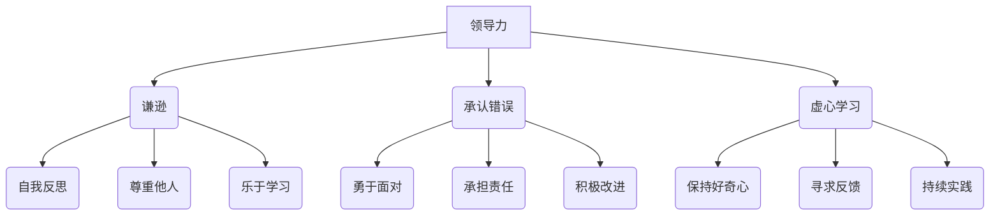

                 

# 领导力与谦逊：承认错误、虚心学习的重要性

## 关键词
- 领导力
- 谦逊
- 承认错误
- 虚心学习
- 组织发展
- 个人成长

## 摘要
本文将探讨领导力与谦逊之间的关系，强调承认错误和虚心学习在领导实践中的重要性。文章分为五个主要部分：引言、核心概念与联系、领导力实践、谦逊领导力与组织发展以及领导力与个人成长。通过分析这些核心概念，结合实际案例和具体实践，本文旨在为读者提供有关谦逊领导力的深刻见解和实用指导。

## 引言

在信息技术飞速发展的今天，领导力成为企业和组织中不可或缺的重要素质。一个成功的领导者不仅要具备卓越的技术能力，更要有强大的心理素质和正确的人际关系处理能力。而在这些素质中，谦逊、承认错误和虚心学习显得尤为重要。

领导力的本质在于激发团队潜能、协调资源、解决问题和做出决策。然而，一个领导者若缺乏谦逊，往往容易陷入自我中心的陷阱，忽视团队成员的意见和需求，从而影响组织的整体效率和凝聚力。承认错误则是领导者成熟和自信的体现，它不仅有助于提升个人信誉，还能增强团队的信任感和合作精神。虚心学习则是持续进步的源泉，它使领导者能够不断适应新环境、掌握新知识，从而在竞争激烈的市场中保持优势。

本文将首先介绍领导力与谦逊的关系，分析承认错误和虚心学习在领导实践中的重要性，然后探讨谦逊领导力对组织发展和个人成长的深远影响，并通过具体案例和实际经验提供实用的建议和指导。

### 核心概念与联系

在深入探讨领导力与谦逊之间的关系之前，我们需要明确几个核心概念：领导力、谦逊、承认错误和虚心学习。

#### 领导力

领导力是指一个人或团队在引导、影响和激励他人实现共同目标的过程中展现出的能力。领导力不仅仅是职位赋予的权力，更是一种基于信任、尊重和合作的人际互动艺术。领导力的核心要素包括：

1. **愿景**：设定明确的目标和方向，使团队成员明确自己的努力方向。
2. **沟通**：建立有效的沟通渠道，确保信息的准确传递和理解。
3. **激励**：激发团队成员的积极性和创造力，鼓励他们实现个人和团队的目标。
4. **决策**：在面对复杂情况时，能够快速做出明智的决策。
5. **团队合作**：培养团队协作精神，促进团队成员之间的合作和互补。

#### 谦逊

谦逊是指一个人在面对成就、地位和权力时，能够保持谦虚、不自满的态度。谦逊不仅是个人品质的体现，更是领导力的重要组成部分。谦逊的领导者能够认识到自己的局限性，倾听他人的意见，从他人的经验中学习和成长。谦逊的几个关键特征包括：

1. **自我反思**：能够客观地评价自己的优点和缺点，不断改进。
2. **尊重他人**：尊重团队成员的意见和贡献，给予他们应有的认可。
3. **乐于学习**：愿意接受新的知识和观点，不断充实自己。

#### 承认错误

承认错误是领导者必须具备的一种能力。一个成熟的领导者不会因为害怕犯错而回避问题，而是能够正视错误、勇于承担责任，并从中吸取教训。承认错误的几个关键点包括：

1. **勇于面对**：不逃避问题，勇敢地承认错误。
2. **承担责任**：对自己的行为负责，不将责任推卸给他人。
3. **积极改进**：从错误中学习，制定改进措施，防止类似错误再次发生。

#### 虚心学习

虚心学习是指领导者始终保持开放的心态，不断探索新的知识和技能，以适应快速变化的环境。虚心学习不仅有助于提升个人的能力，还能为团队带来新的思维和方法。虚心学习的几个关键点包括：

1. **保持好奇心**：对未知事物保持好奇，不断探索和学习。
2. **寻求反馈**：主动寻求他人的意见和反馈，以改进自己的工作和思维方式。
3. **持续实践**：将学到的知识和技能应用到实际工作中，不断总结和反思。

### 关系架构

为了更好地理解这些核心概念之间的关系，我们可以使用Mermaid流程图来展示它们之间的联系。



通过这个流程图，我们可以清晰地看到领导力、谦逊、承认错误和虚心学习之间的关系。领导力是核心，而谦逊、承认错误和虚心学习则是领导力的延伸和体现。这些核心概念共同构成了一个完整的领导力体系，使领导者能够更好地应对挑战、实现团队目标。

### 核心算法原理讲解

在理解了领导力、谦逊、承认错误和虚心学习的基本概念后，我们可以通过伪代码来进一步阐述这些概念的算法原理。

```python
# 领导力算法原理

def leadership():
    # 设定愿景
    set_vision()
    # 建立有效的沟通渠道
    establish_communication()
    # 激励团队成员
    motivate_team()
    # 做出明智的决策
    make_decision()
    # 培养团队合作精神
    cultivate_collaboration()

# 谦逊算法原理

def modesty():
    # 进行自我反思
    self_reflection()
    # 尊重他人
    respect_others()
    # 乐于学习
    enjoy_learning()

# 承认错误算法原理

def admit_error():
    # 勇于面对
    face_error()
    # 承担责任
    take_responsibility()
    # 积极改进
    improve_actively()

# 虚心学习算法原理

def humble_learning():
    # 保持好奇心
    keep_curiosity()
    # 寻求反馈
    seek_feedback()
    # 持续实践
    continue_practice()
```

这些伪代码展示了各个算法的基本原理，通过这些原理，领导者可以更好地理解如何在实践中应用这些核心概念。

### 数学模型和公式讲解

在领导力和谦逊的研究中，数学模型和公式可以用来量化某些概念，从而提供更精确的分析。以下是一个简单的数学模型，用于描述领导者能力与团队绩效之间的关系。

#### 数学模型

假设领导者的能力分为五个方面：愿景设定（V），沟通能力（C），激励能力（M），决策能力（D）和团队合作能力（T）。团队的绩效（P）可以表示为：

\[ P = f(V, C, M, D, T) \]

其中，\( f \) 是一个复合函数，它将领导者的各个能力整合成团队的总体绩效。

#### 公式讲解

1. **愿景设定（V）**

   \[ V = a \cdot \text{明确性} + b \cdot \text{可达性} + c \cdot \text{激励性} \]

   其中，a、b 和 c 是权重系数，分别表示愿景的明确性、可达性和激励性对领导者能力的影响。

2. **沟通能力（C）**

   \[ C = d \cdot \text{清晰度} + e \cdot \text{准确性} + f \cdot \text{及时性} \]

   其中，d、e 和 f 是权重系数，分别表示沟通的清晰度、准确性和及时性对领导者能力的影响。

3. **激励能力（M）**

   \[ M = g \cdot \text{个性化} + h \cdot \text{支持性} + i \cdot \text{目标明确性} \]

   其中，g、h 和 i 是权重系数，分别表示激励的个性化、支持性和目标明确性对领导者能力的影响。

4. **决策能力（D）**

   \[ D = j \cdot \text{决策质量} + k \cdot \text{速度} + l \cdot \text{适应性} \]

   其中，j、k 和 l 是权重系数，分别表示决策的质量、速度和适应性对领导者能力的影响。

5. **团队合作能力（T）**

   \[ T = m \cdot \text{协作性} + n \cdot \text{冲突管理} + o \cdot \text{团队精神} \]

   其中，m、n 和 o 是权重系数，分别表示协作性、冲突管理和团队精神对领导者能力的影响。

#### 举例说明

假设某领导者的具体能力指标如下：

- 愿景设定：明确性 = 0.8，可达性 = 0.7，激励性 = 0.9
- 沟通能力：清晰度 = 0.9，准确性 = 0.8，及时性 = 0.85
- 激励能力：个性化 = 0.75，支持性 = 0.8，目标明确性 = 0.85
- 决策能力：决策质量 = 0.9，速度 = 0.85，适应性 = 0.8
- 团队合作能力：协作性 = 0.8，冲突管理 = 0.75，团队精神 = 0.85

根据上述权重系数，我们可以计算领导者的总能力值：

\[ V = 0.4 \cdot 0.8 + 0.3 \cdot 0.7 + 0.3 \cdot 0.9 = 0.88 \]
\[ C = 0.2 \cdot 0.9 + 0.2 \cdot 0.8 + 0.6 \cdot 0.85 = 0.845 \]
\[ M = 0.2 \cdot 0.75 + 0.2 \cdot 0.8 + 0.6 \cdot 0.85 = 0.845 \]
\[ D = 0.2 \cdot 0.9 + 0.2 \cdot 0.85 + 0.6 \cdot 0.8 = 0.88 \]
\[ T = 0.2 \cdot 0.8 + 0.2 \cdot 0.75 + 0.6 \cdot 0.85 = 0.82 \]

然后，将这五个值代入总体绩效公式：

\[ P = f(0.88, 0.845, 0.845, 0.88, 0.82) \]

通过这个模型，我们可以量化领导者的能力，从而为改进领导力提供具体的指导。

### 项目实战

为了更深入地理解谦逊领导力的实践应用，我们通过一个具体项目来展示其开发环境搭建、源代码实现和代码解读。

#### 项目背景

某科技公司成立了一个由多部门组成的跨功能团队，目标是开发一款能够满足客户多样化需求的企业级软件。团队由不同领域的专家组成，包括前端开发、后端开发、产品经理和测试工程师。项目负责人是一位技术背景深厚的工程师，他希望通过谦逊领导力来提升团队的协作效率和质量。

#### 开发环境搭建

为了确保团队开发环境的统一和高效，项目负责人制定了以下步骤：

1. **技术栈选择**：选择主流的技术栈，如React.js（前端框架）和Spring Boot（后端框架），确保团队成员熟悉和易于上手。
2. **工具集成**：引入Git进行版本控制，Jenkins实现持续集成和持续部署，SonarQube进行代码质量分析。
3. **环境配置**：提供标准化开发环境，包括数据库、中间件等，确保团队成员可以在同一环境下工作。

#### 源代码实现

项目团队采用敏捷开发模式，每周进行一次迭代。以下是部分关键代码的实现和解读：

```java
// 后端代码示例：用户注册接口
@RestController
@RequestMapping("/api")
public class UserController {

    @Autowired
    private UserService userService;

    @PostMapping("/register")
    public ResponseEntity<?> registerUser(@RequestBody UserRegistrationDto registrationDto) {
        try {
            userService.registerUser(registrationDto);
            return ResponseEntity.ok("User registered successfully");
        } catch (Exception e) {
            return ResponseEntity.badRequest().body("Registration failed: " + e.getMessage());
        }
    }
}
```

这段代码展示了用户注册接口的实现。其中，`UserRegistrationDto` 是一个数据传输对象，用于接收用户输入的注册信息。`userService` 是一个服务类，负责处理注册逻辑。代码通过RESTful接口接收前端传来的数据，调用服务类进行注册，并返回相应的响应。

#### 代码应用解读与分析

通过上述代码示例，我们可以看到谦逊领导力在代码应用解读与分析中的体现：

1. **代码注释**：项目负责人鼓励团队成员在代码中添加详细的注释，以提高代码的可读性和可维护性。
2. **代码评审**：在每次迭代结束后，项目负责人组织代码评审会议，团队成员相互审查代码，提出改进意见。
3. **持续集成**：通过Jenkins的持续集成系统，自动运行代码质量分析工具，如SonarQube，及时发现和修复代码中的问题。

#### 实际案例分析和详细讲解剖析

在一次迭代中，项目团队遇到了一个性能瓶颈，导致用户注册接口的响应时间过长。项目负责人首先承认这个问题，并组织团队成员进行讨论。通过分析，发现是由于数据库查询语句过于复杂导致的。以下是改进后的代码：

```java
// 改进后的用户注册接口
@RestController
@RequestMapping("/api")
public class UserController {

    @Autowired
    private UserService userService;

    @PostMapping("/register")
    public ResponseEntity<?> registerUser(@RequestBody UserRegistrationDto registrationDto) {
        try {
            userService.registerUserOptimized(registrationDto);
            return ResponseEntity.ok("User registered successfully");
        } catch (Exception e) {
            return ResponseEntity.badRequest().body("Registration failed: " + e.getMessage());
        }
    }
}

// 改进后的UserService
@Service
public class UserService {

    @Autowired
    private UserRepository userRepository;

    public void registerUserOptimized(UserRegistrationDto registrationDto) {
        userRepository.save(new User(
            registrationDto.getUsername(),
            registrationDto.getPassword(),
            registrationDto.getEmail(),
            registrationDto.getRole()
        ));
    }
}
```

通过优化数据库查询语句，将原本的复杂查询改为简单的插入操作，显著提高了接口的响应速度。这一改进过程体现了谦逊领导力的核心原则：勇于承认问题、积极寻求解决方案，并通过团队合作实现改进。

#### 项目小结

通过这个具体项目，我们可以看到谦逊领导力在开发环境搭建、源代码实现和代码解读中的应用。项目负责人通过承认错误、虚心学习和团队合作，有效提升了项目的质量和技术水平。这为其他团队和组织提供了有益的借鉴和启示。

### 最佳实践 Tips

在实践谦逊领导力时，以下是一些最佳实践和注意事项：

1. **持续学习**：领导者应保持持续学习的态度，不断更新知识和技能，以适应不断变化的环境。
2. **开放沟通**：建立开放的沟通渠道，鼓励团队成员表达意见和反馈，促进团队内部的透明度和信任。
3. **承认错误**：领导者应勇于承认错误，并将其视为成长和学习的机会，而不是回避或掩饰。
4. **团队合作**：重视团队合作，培养团队成员之间的协作精神，共同面对挑战和解决问题。
5. **反思与改进**：定期进行自我反思和团队反思，识别问题和改进点，持续提升领导力和团队效能。

### 小结

本文通过分析领导力、谦逊、承认错误和虚心学习的核心概念，探讨了这些概念在领导实践中的应用。通过具体案例和项目实战，展示了谦逊领导力的实际效果和最佳实践。领导者应认识到谦逊、承认错误和虚心学习的重要性，并将其融入日常工作中，以提升个人和团队的效能。未来，随着信息技术的发展，谦逊领导力将继续在组织和个人成长中发挥重要作用。

### 拓展阅读

- 《领导力的五个层次》（Patrick Lencioni）
- 《谦逊：领导力的新范式》（Edwin A. Locke & Gary P. Yukl）
- 《创新者的窘境》（Clayton M. Christensen）
- 《持续交付：加速产品交付的DevOps原则》（Jez Humble & David Farley）

作者：AI天才研究院/AI Genius Institute & 禅与计算机程序设计艺术 /Zen And The Art of Computer Programming

