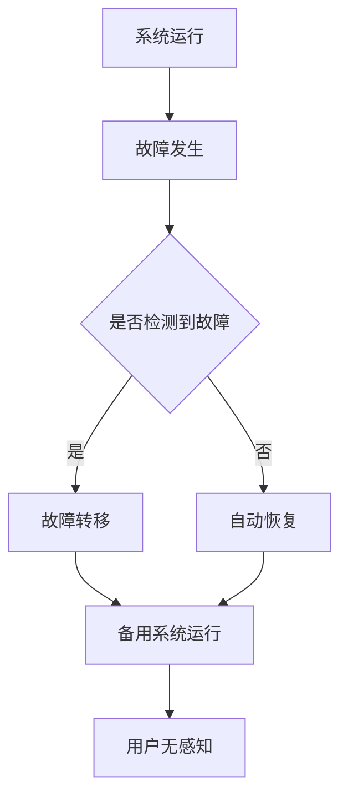
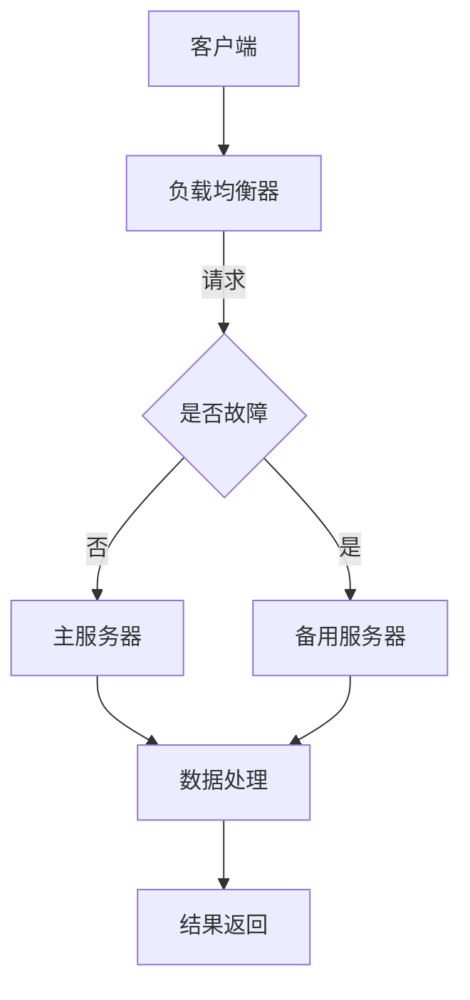
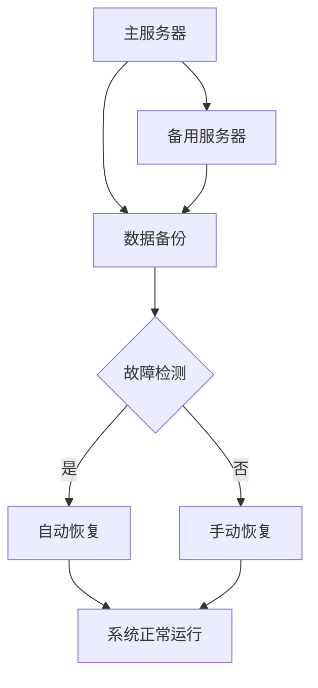
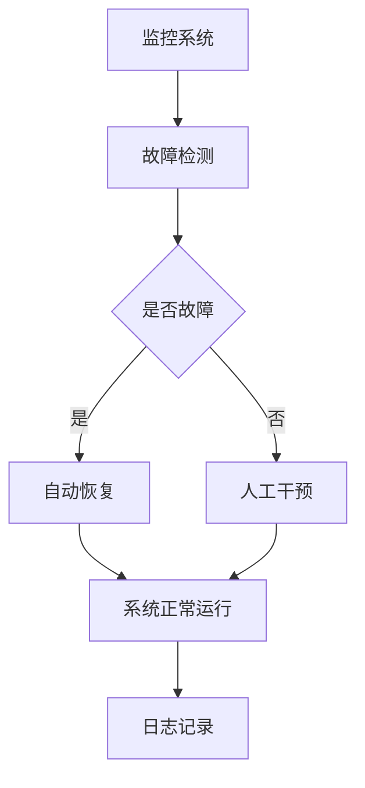
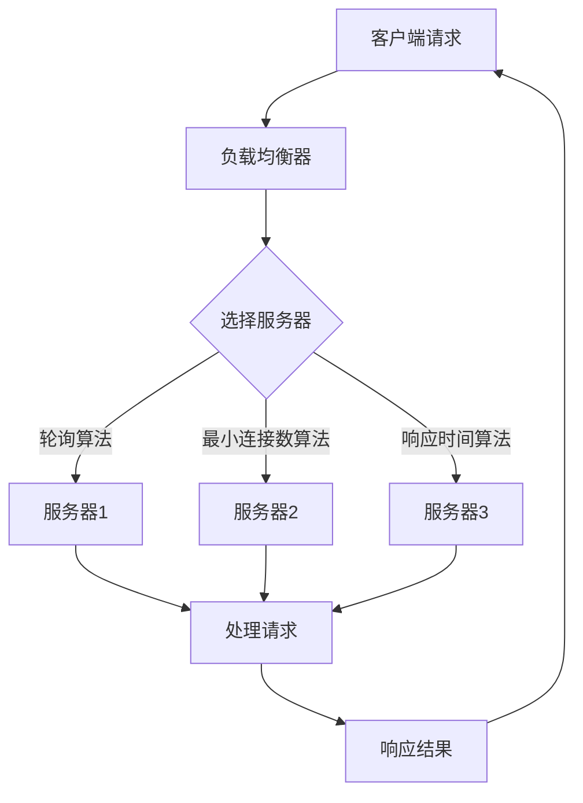
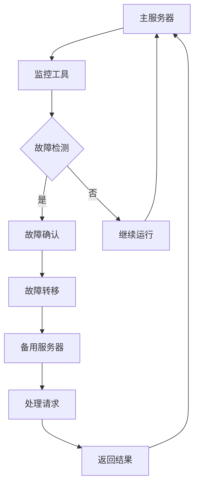
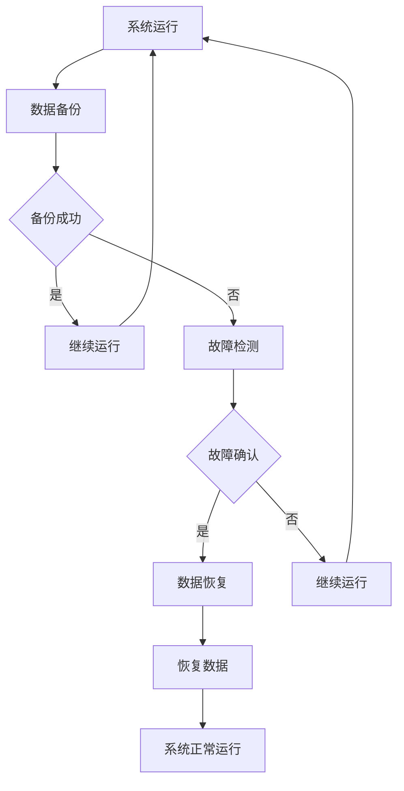

                 

### 文章标题

高可用性架构确保LLM应用的稳定运行

> 关键词：高可用性架构、LLM、稳定性、性能优化、系统设计

摘要：本文将探讨高可用性架构在确保大型语言模型（LLM）应用稳定运行方面的重要性。通过深入分析高可用性架构的核心概念、设计原则以及关键实现技术，本文将揭示如何通过高可用性架构来提升LLM应用的可靠性和持续性，从而满足日益增长的技术需求和应用场景。

----------------------------------------------------------------

### 引言

在当今快速发展的技术时代，大型语言模型（LLM）的应用越来越广泛，从自然语言处理到智能客服、内容生成，LLM正逐渐成为各行各业的核心驱动力。然而，随着模型规模和复杂性的增加，确保LLM应用的稳定运行成为了一项巨大的挑战。此时，高可用性架构的重要性就凸显出来了。

高可用性架构是一种系统设计方法，旨在确保系统的持续运行和可靠性，即使在面临各种故障和异常情况下也能保持良好的性能。对于LLM应用而言，高可用性架构不仅能提高系统的稳定性，还能增强用户信心，降低业务风险。

本文将首先介绍高可用性架构的基本概念和目标，然后深入讨论LLM应用的技术基础，接着阐述高可用性架构的设计原则和关键技术。通过具体的项目实战与案例分析，我们将展示如何在实际应用中实现高可用性架构，并给出一些最佳实践和注意事项。最后，本文将对全文进行总结，并推荐一些拓展阅读资源。

### 高可用性架构的基本概念

#### 定义

高可用性架构（High Availability Architecture）是一种系统设计方法，旨在确保系统在长时间内持续运行，即使面临各种故障和异常也能快速恢复。高可用性架构的核心目标是通过冗余、容错和自动化等技术手段，将系统的故障率降至最低，从而保证系统的稳定性和可靠性。

#### 目标

高可用性架构的主要目标包括：

1. **高可靠性**：系统在各种环境下都能保持稳定运行，故障率低。
2. **快速恢复**：当系统出现故障时，能够快速检测并自动恢复，减少停机时间。
3. **高稳定性**：系统在面对大量并发请求时，仍能保持良好的性能和响应速度。
4. **低成本**：通过优化资源利用和自动化管理，降低运维成本。

#### 核心原则

高可用性架构的设计原则包括：

1. **冗余设计**：通过冗余组件、冗余数据和冗余网络等手段，提高系统的容错能力。
2. **故障转移**：当主组件出现故障时，能够快速切换到备用组件，确保系统持续运行。
3. **自动化管理**：通过自动化工具和脚本，实现故障检测、自动恢复和资源调配，降低运维复杂度。
4. **监控与报警**：实时监控系统状态，及时发现和响应异常情况。

#### Mermaid流程图

为了更好地理解高可用性架构的核心原理和组件，我们使用Mermaid流程图来展示：



在该流程图中，A表示系统正常运行，B表示故障发生，C表示故障检测，D表示故障转移，E表示自动恢复，F表示备用系统运行，G表示用户无感知。通过该流程图，我们可以清晰地看到高可用性架构的工作原理。

### LLM应用的技术基础

#### LLM的基本原理

大型语言模型（Large Language Model，简称LLM）是一种基于深度学习的自然语言处理（Natural Language Processing，简称NLP）模型，它通过对海量文本数据进行训练，学习到语言的结构和语义，从而实现文本生成、文本分类、问答系统等功能。

LLM的基本原理主要包括以下几个方面：

1. **深度神经网络**：LLM通常使用深度神经网络（Deep Neural Network，简称DNN）作为基础架构，通过多层神经网络的结构来处理复杂的文本数据。
2. **嵌入层**：嵌入层（Embedding Layer）是将文本数据转换为固定长度的向量表示，从而方便深度神经网络的计算。
3. **注意力机制**：注意力机制（Attention Mechanism）是一种用于提高模型对重要信息关注度的机制，通过自适应地加权不同部分的信息，提高模型的准确性。
4. **损失函数**：LLM通常使用交叉熵损失函数（Cross-Entropy Loss）来衡量模型预测结果与真实标签之间的差距，并基于该损失函数进行优化。

#### LLM的模型架构

LLM的模型架构通常包括以下几个层次：

1. **输入层**：输入层将原始文本数据转换为嵌入向量，这些向量代表了文本的语义信息。
2. **嵌入层**：嵌入层将输入层得到的向量进行编码，生成具有固定长度的嵌入向量。
3. **编码层**：编码层通常包含多个卷积神经网络（Convolutional Neural Network，简称CNN）或循环神经网络（Recurrent Neural Network，简称RNN）层，用于对嵌入向量进行编码，提取文本的特征。
4. **解码层**：解码层将编码层得到的特征向量解码为输出文本，生成预测结果。
5. **输出层**：输出层将解码层得到的特征向量映射为概率分布，从而生成最终的预测结果。

#### LLM技术发展的趋势

随着计算能力的提升和数据量的增加，LLM技术在近年来取得了显著的发展。以下是LLM技术发展的几个主要趋势：

1. **模型规模增大**：越来越多的研究人员和公司开始训练规模更大的LLM，例如GPT-3、T5等，这些大规模模型在自然语言处理任务上表现出了优异的性能。
2. **多模态学习**：除了文本数据，LLM也开始尝试学习其他类型的数据，如图像、声音等，实现多模态学习。
3. **自监督学习**：自监督学习（Self-Supervised Learning）成为LLM训练的主流方法，通过无监督的方式学习到大量的知识。
4. **强化学习**：结合强化学习（Reinforcement Learning）的方法，LLM可以更好地应对复杂任务和动态环境。
5. **迁移学习**：通过迁移学习（Transfer Learning）方法，LLM可以在特定任务上快速适应和优化，提高模型的性能。

### 高可用性架构的设计原则

#### 如何设计高可用性架构以满足LLM应用的需求

设计高可用性架构以满足LLM应用的需求，需要考虑以下几个方面：

1. **系统架构的模块化**：将系统拆分成多个独立的模块，每个模块负责不同的功能，这样可以降低系统之间的耦合度，提高系统的可维护性和扩展性。
2. **分布式系统架构**：采用分布式系统架构，将LLM应用的各个模块部署到不同的服务器上，实现负载均衡和故障转移，提高系统的可靠性和性能。
3. **冗余备份机制**：通过冗余备份机制，如数据冗余和组件冗余，提高系统的容错能力，确保在单个组件或数据出现故障时，系统能够迅速切换到备用组件或数据。
4. **自动化管理**：通过自动化工具和脚本，实现故障检测、自动恢复和资源调配，降低运维复杂度，提高系统的可靠性。

#### 设计原则的详细讲解和案例分析

1. **模块化设计**

模块化设计是将系统拆分成多个独立的模块，每个模块负责不同的功能，这样可以降低系统之间的耦合度，提高系统的可维护性和扩展性。对于LLM应用而言，可以将系统拆分成以下几个模块：

- **数据模块**：负责数据采集、处理和存储，确保数据的一致性和完整性。
- **训练模块**：负责LLM的训练和优化，提高模型的性能和准确性。
- **推理模块**：负责对输入文本进行建模和生成预测结果，提供高效的推理能力。
- **接口模块**：负责与外部系统进行交互，提供API接口和Web服务。

通过模块化设计，LLM应用可以更加灵活地扩展和优化，同时降低系统的复杂度和维护成本。

2. **分布式系统架构**

分布式系统架构是将LLM应用的各个模块部署到不同的服务器上，实现负载均衡和故障转移，提高系统的可靠性和性能。分布式系统架构通常包括以下几个关键组件：

- **负载均衡器**：负责将请求分配到不同的服务器上，实现负载均衡，防止单点过载。
- **故障转移机制**：当某个服务器出现故障时，能够自动切换到备用服务器，确保系统的持续运行。
- **分布式存储**：通过分布式存储系统，实现数据的高效存储和访问，提高系统的性能和可靠性。

以下是一个简单的分布式系统架构示意图：



在该架构中，A表示客户端，B表示负载均衡器，C表示故障检测，D表示备用服务器，E表示主服务器，F表示数据处理，G表示结果返回。通过负载均衡器和故障转移机制，分布式系统可以实现高效、可靠的请求处理。

3. **冗余备份机制**

冗余备份机制是通过冗余组件和冗余数据，提高系统的容错能力，确保在单个组件或数据出现故障时，系统能够迅速切换到备用组件或数据。对于LLM应用而言，可以采用以下几种冗余备份机制：

- **数据冗余**：在分布式存储系统中，对数据进行多副本备份，确保数据的一致性和可靠性。
- **组件冗余**：在分布式系统中，对关键组件进行冗余部署，确保在单个组件出现故障时，系统能够自动切换到备用组件。
- **故障恢复**：通过自动化工具和脚本，实现故障检测、自动恢复和资源调配，降低运维复杂度。

以下是一个简单的冗余备份机制示意图：



在该架构中，A表示主服务器，B表示备用服务器，C表示数据备份，D表示故障检测，E表示自动恢复，F表示手动恢复，G表示系统正常运行。通过冗余备份机制，LLM应用可以确保在故障发生时，系统能够快速恢复，降低业务风险。

4. **自动化管理**

自动化管理是通过自动化工具和脚本，实现故障检测、自动恢复和资源调配，降低运维复杂度，提高系统的可靠性。对于LLM应用而言，可以采用以下几种自动化管理技术：

- **监控与报警**：实时监控系统状态，及时发现和响应异常情况，确保系统的稳定运行。
- **自动扩展**：根据系统负载自动调整资源规模，实现自动扩展和自动收缩，提高系统的弹性和性能。
- **自动化部署**：通过自动化工具和脚本，实现系统部署、升级和回滚，降低运维成本。

以下是一个简单的自动化管理示意图：



在该架构中，A表示监控系统，B表示故障检测，C表示故障判断，D表示自动恢复，E表示人工干预，F表示系统正常运行，G表示日志记录。通过自动化管理，LLM应用可以降低运维复杂度，提高系统的可靠性。

### 实现高可用性架构的关键技术

#### 负载均衡技术

负载均衡（Load Balancing）是一种将请求分配到多个服务器上的技术，从而实现系统的负载均衡和性能优化。负载均衡器负责接收客户端请求，并根据一定的算法将请求分配到不同的服务器上。常见的负载均衡算法包括：

1. **轮询算法**（Round Robin）：按照顺序将请求分配到服务器上，实现公平负载分配。
2. **最小连接数算法**（Least Connections）：将请求分配到当前连接数最少的服务器上，降低服务器负载。
3. **响应时间算法**（Response Time）：将请求分配到响应时间最短的服务器上，提高系统性能。

负载均衡器的工作原理主要包括以下几个步骤：

1. 接收客户端请求，解析请求信息和目标服务器。
2. 根据负载均衡算法，选择合适的服务器进行请求分发。
3. 将请求转发到选定的服务器，并返回相应的响应。

以下是一个简单的负载均衡器工作流程示意图：



在该架构中，A表示客户端请求，B表示负载均衡器，C表示选择服务器，D表示服务器1，E表示服务器2，F表示服务器3，G表示处理请求，H表示响应结果。通过负载均衡技术，LLM应用可以实现高效、可靠的请求处理。

#### 故障转移机制

故障转移（Fault Transfer）是一种在主服务器出现故障时，自动切换到备用服务器，确保系统持续运行的技术。故障转移机制通常包括以下几个步骤：

1. **故障检测**：通过监控工具和算法，实时检测服务器的状态，判断是否出现故障。
2. **故障确认**：在确认服务器出现故障后，记录故障信息，并通知相关人员进行处理。
3. **故障转移**：在故障确认后，自动将客户端请求切换到备用服务器，确保系统的持续运行。
4. **故障恢复**：在故障修复后，自动将客户端请求切换回主服务器，恢复系统的正常运行。

以下是一个简单的故障转移机制示意图：



在该架构中，A表示主服务器，B表示监控工具，C表示故障检测，D表示故障确认，E表示继续运行，F表示故障转移，G表示备用服务器，H表示处理请求，I表示返回结果。通过故障转移机制，LLM应用可以确保在故障发生时，系统能够快速切换到备用服务器，降低业务风险。

#### 数据备份和恢复策略

数据备份和恢复策略是确保系统数据安全性和可靠性的重要手段。数据备份是指将系统数据复制到其他存储介质上，以防止数据丢失或损坏。数据恢复是指在数据丢失或损坏后，将备份数据恢复到系统中，确保数据的完整性和可用性。

1. **数据备份方法**

常见的数据备份方法包括：

- **全备份**：将整个系统数据全部备份，以确保数据的完整性和一致性。
- **增量备份**：只备份自上次备份以来发生变化的数据，降低备份时间和存储空间需求。
- **差异备份**：备份自上次全备份以来发生变化的数据，提高备份的效率和速度。

2. **数据恢复流程**

数据恢复流程主要包括以下几个步骤：

- **故障检测**：通过监控工具和算法，实时检测数据备份的状态，判断是否出现故障。
- **故障确认**：在确认数据备份出现故障后，记录故障信息，并通知相关人员进行处理。
- **数据恢复**：在故障确认后，根据备份策略和备份数据，将系统数据恢复到正常状态。

以下是一个简单的数据备份和恢复流程示意图：



在该架构中，A表示系统运行，B表示数据备份，C表示备份成功，D表示继续运行，E表示故障检测，F表示故障确认，G表示数据恢复，H表示继续运行，I表示恢复数据，J表示系统正常运行。通过数据备份和恢复策略，LLM应用可以确保数据的安全性和可靠性。

#### 伪代码：关键技术的实现过程

1. **负载均衡算法**

以下是一个简单的负载均衡算法伪代码：

```python
# 负载均衡算法伪代码
def load_balancing(算法类型，服务器列表，请求列表):
    if 算法类型 == "轮询":
        return round_robin(服务器列表，请求列表)
    elif 算法类型 == "最小连接数":
        return least_connections(服务器列表，请求列表)
    elif 算法类型 == "响应时间":
        return response_time(服务器列表，请求列表)

# 轮询算法
def round_robin(服务器列表，请求列表):
    index = 0
    for 请求 in 请求列表:
        服务器 = 服务器列表[index]
        处理请求(服务器，请求)
        index = (index + 1) % 服务器列表.length()

# 最小连接数算法
def least_connections(服务器列表，请求列表):
    for 请求 in 请求列表:
        服务器 = 获取最小连接数服务器(服务器列表)
        处理请求(服务器，请求)

# 响应时间算法
def response_time(服务器列表，请求列表):
    for 请求 in 请求列表:
        服务器 = 获取响应时间最短服务器(服务器列表)
        处理请求(服务器，请求)

# 获取最小连接数服务器
def 获取最小连接数服务器(服务器列表):
    最小连接数 = float('inf')
    最小连接数服务器 = None
    for 服务器 in 服务器列表:
        if 服务器连接数 < 最小连接数:
            最小连接数 = 服务器连接数
            最小连接数服务器 = 服务器
    return 最小连接数服务器

# 获取响应时间最短服务器
def 获取响应时间最短服务器(服务器列表):
    最短响应时间 = float('inf')
    最短响应时间服务器 = None
    for 服务器 in 服务器列表:
        if 服务器响应时间 < 最短响应时间:
            最短响应时间 = 服务器响应时间
            最短响应时间服务器 = 服务器
    return 最短响应时间服务器
```

2. **故障转移机制**

以下是一个简单的故障转移机制伪代码：

```python
# 故障转移机制伪代码
def fault_transfer(主服务器，备用服务器，监控工具):
    while True:
        状态 = 监控工具检查服务器状态(主服务器)
        if 状态 != "正常":
            记录故障信息(主服务器，状态)
            切换到备用服务器(主服务器，备用服务器)
            通知相关人员处理故障
        else:
            通知监控系统恢复状态(主服务器)

# 检查服务器状态
def 检查服务器状态(服务器):
    # 实现服务器状态检查逻辑
    return 状态

# 记录故障信息
def 记录故障信息(服务器，状态):
    # 实现故障信息记录逻辑

# 切换到备用服务器
def 切换到备用服务器(主服务器，备用服务器):
    # 实现主服务器到备用服务器的切换逻辑

# 通知相关人员处理故障
def 通知相关人员处理故障():
    # 实现通知逻辑

# 通知监控系统恢复状态
def 通知监控系统恢复状态(服务器):
    # 实现通知逻辑
```

3. **数据备份和恢复流程**

以下是一个简单的数据备份和恢复流程伪代码：

```python
# 数据备份和恢复流程伪代码
def 数据备份(备份策略，备份路径):
    if 备份策略 == "全备份":
        备份全部数据(备份路径)
    elif 备份策略 == "增量备份":
        备份自上次备份以来发生变化的数据(备份路径)
    elif 备份策略 == "差异备份":
        备份自上次全备份以来发生变化的数据(备份路径)

# 备份全部数据
def 备份全部数据(备份路径):
    # 实现全数据备份逻辑

# 备份自上次备份以来发生变化的数据
def 备份自上次备份以来发生变化的数据(备份路径):
    # 实现增量备份逻辑

# 备份自上次全备份以来发生变化的数据
def 备份自上次全备份以来发生变化的数据(备份路径):
    # 实现差异备份逻辑

# 数据恢复
def 数据恢复(备份路径，恢复位置):
    if 备份策略 == "全备份":
        恢复全部数据(备份路径，恢复位置)
    elif 备份策略 == "增量备份":
        恢复自上次备份以来发生变化的数据(备份路径，恢复位置)
    elif 备份策略 == "差异备份":
        恢复自上次全备份以来发生变化的数据(备份路径，恢复位置)

# 恢复全部数据
def 恢复全部数据(备份路径，恢复位置):
    # 实现全数据恢复逻辑

# 恢复自上次备份以来发生变化的数据
def 恢复自上次备份以来发生变化的数据(备份路径，恢复位置):
    # 实现增量数据恢复逻辑

# 恢复自上次全备份以来发生变化的数据
def 恢复自上次全备份以来发生变化的数据(备份路径，恢复位置):
    # 实现差异数据恢复逻辑
```

### LLM应用的稳定性优化

#### 模型调优策略

为了提高LLM应用的稳定性，可以通过以下模型调优策略来优化模型的性能：

1. **超参数调整**：通过调整模型的超参数，如学习率、批量大小、隐藏层大小等，找到最优的超参数配置，提高模型的稳定性和准确性。
2. **数据预处理**：对输入数据进行预处理，如文本清洗、数据标准化等，减少噪声和异常值的影响，提高模型的鲁棒性。
3. **正则化**：采用正则化方法，如L1正则化、L2正则化等，减少过拟合现象，提高模型的泛化能力。

以下是一个简单的模型调优策略示例：

```python
# 模型调优策略示例
def model_tuning(模型，超参数列表，数据集):
    最优超参数 = None
    最高准确率 = 0
    for 超参数 in 超参数列表:
        模型参数 = 超参数
        模型.fit(数据集)
        准确率 = 模型.evaluate(数据集)
        if 准确率 > 最高准确率:
            最高准确率 = 准确率
            最优超参数 = 模型参数
    return 最优超参数
```

#### 数据预处理方法

为了提高LLM应用的稳定性，可以通过以下数据预处理方法来优化数据质量：

1. **文本清洗**：去除文本中的无关信息，如HTML标签、特殊字符等，提高文本的可用性。
2. **数据标准化**：对文本数据中的词语进行标准化处理，如将大小写转换为小写、去除停用词等，提高模型的泛化能力。
3. **数据增强**：通过数据增强方法，如随机插入、随机删除、随机替换等，增加数据的多样性，提高模型的鲁棒性。

以下是一个简单的数据预处理方法示例：

```python
# 数据预处理方法示例
def data_preprocessing(文本数据):
    清洗文本 = 清洗文本数据(文本数据)
    标准化文本 = 标准化文本数据(清洗文本)
    增强文本 = 数据增强(标准化文本)
    return 增强文本

# 清洗文本数据
def 清洗文本数据(文本数据):
    # 实现文本清洗逻辑

# 标准化文本数据
def 标准化文本数据(文本数据):
    # 实现文本标准化逻辑

# 数据增强
def 数据增强(文本数据):
    # 实现数据增强逻辑
```

#### 异常处理机制

为了提高LLM应用的稳定性，可以通过以下异常处理机制来应对异常情况：

1. **异常检测**：通过异常检测算法，如孤立森林、基于规则的异常检测等，识别和标记异常数据。
2. **异常响应**：在检测到异常数据后，根据异常的严重程度和类型，采取相应的响应策略，如忽略、纠正、重试等。

以下是一个简单的异常处理机制示例：

```python
# 异常处理机制示例
def exception_handling(模型，数据集，异常处理策略):
    异常数据 = 检测异常数据(数据集)
    for 数据 in 异常数据:
        异常类型 = 确定异常类型(数据)
        响应策略 = 确定响应策略(异常类型，异常处理策略)
        执行响应策略(响应策略，数据)

# 检测异常数据
def 检测异常数据(数据集):
    # 实现异常检测逻辑

# 确定异常类型
def 确定异常类型(数据):
    # 实现异常类型确定逻辑

# 确定响应策略
def 确定响应策略(异常类型，异常处理策略):
    # 实现响应策略确定逻辑

# 执行响应策略
def 执行响应策略(响应策略，数据):
    # 实现响应策略执行逻辑
```

### 项目实战与案例分析

#### 开发环境搭建

为了实现高可用性架构确保LLM应用的稳定运行，我们需要搭建一个稳定的开发环境。以下是一个简单的开发环境搭建步骤：

1. **硬件配置**：选择高性能的服务器，配置足够的CPU、内存和存储资源，确保系统有足够的处理能力和存储容量。
2. **操作系统**：选择稳定的操作系统，如Linux或Unix，并安装必要的驱动程序和软件。
3. **网络配置**：配置虚拟局域网（VLAN），实现服务器之间的安全通信，并配置负载均衡器和防火墙，确保系统的安全性和稳定性。
4. **数据库**：选择合适的数据库系统，如MySQL或PostgreSQL，实现数据的高效存储和访问。
5. **消息队列**：选择合适的消息队列系统，如Kafka或RabbitMQ，实现异步消息传递和系统解耦。
6. **容器化技术**：采用容器化技术，如Docker和Kubernetes，实现系统的快速部署和弹性扩展。

#### 源代码详细实现和代码解读

在实现高可用性架构确保LLM应用稳定运行的过程中，我们需要编写大量的源代码。以下是一个简单的代码实现和解读示例：

1. **负载均衡器实现**：

```python
# 负载均衡器实现
import requests

def load_balancer(服务器列表，请求列表):
    for 请求 in 请求列表:
        服务器 = 获取负载均衡服务器(服务器列表)
        发送请求(服务器，请求)

# 获取负载均衡服务器
def 获取负载均衡服务器(服务器列表):
    最小连接数 = float('inf')
    最小连接数服务器 = None
    for 服务器 in 服务器列表:
        if 服务器连接数 < 最小连接数:
            最小连接数 = 服务器连接数
            最小连接数服务器 = 服务器
    return 最小连接数服务器

# 发送请求
def 发送请求(服务器，请求):
    url = 服务器地址 + "/api/处理请求"
    headers = {"Content-Type": "application/json"}
    response = requests.post(url, data=请求，headers=headers)
    print("请求结果：", response.text)
```

2. **故障转移实现**：

```python
# 故障转移实现
import time

def fault_transfer(主服务器，备用服务器，监控工具):
    while True:
        状态 = 监控工具检查服务器状态(主服务器)
        if 状态 != "正常":
            切换到备用服务器(主服务器，备用服务器)
            通知相关人员处理故障
        time.sleep(60)

# 检查服务器状态
def 检查服务器状态(服务器):
    # 实现服务器状态检查逻辑

# 切换到备用服务器
def 切换到备用服务器(主服务器，备用服务器):
    # 实现主服务器到备用服务器的切换逻辑

# 通知相关人员处理故障
def 通知相关人员处理故障():
    # 实现通知逻辑
```

3. **数据备份和恢复实现**：

```python
# 数据备份和恢复实现
import os
import shutil

# 数据备份
def data_backup(备份路径，恢复位置):
    备份文件 = 备份路径 + "/备份数据.tar.gz"
    with tarfile.open(备份文件，"w:gz") as 备份文件:
        for 文件 in os.listdir(备份路径):
            备份文件.add(备份路径 + "/" + 文件)

# 数据恢复
def data_restore(备份路径，恢复位置):
    with tarfile.open(备份路径，"r:gz") as 恢复文件:
        恢复文件.extractall(恢复位置)
```

#### 代码应用解读与分析

在代码应用过程中，我们需要对关键代码进行解读和分析，以确保系统的稳定性和可靠性。以下是一个简单的代码应用解读和分析示例：

1. **负载均衡器应用解读**：

负载均衡器是确保系统性能和稳定性的重要组件。在实现负载均衡器时，我们需要关注以下几个方面：

- **负载均衡算法**：选择合适的负载均衡算法，如最小连接数算法或响应时间算法，实现服务器之间的负载均衡。
- **服务器状态监控**：通过监控服务器状态，实时了解服务器负载情况，为负载均衡提供数据支持。
- **请求分发**：根据负载均衡算法和服务器状态，将请求合理分配到服务器上，实现高效请求处理。

2. **故障转移应用解读**：

故障转移是确保系统高可用性的关键环节。在实现故障转移时，我们需要关注以下几个方面：

- **故障检测**：通过监控工具和算法，及时发现服务器故障，确保故障能够及时检测和响应。
- **故障确认**：在确认服务器故障后，记录故障信息，确保故障能够得到有效处理。
- **故障转移**：在故障确认后，自动切换到备用服务器，确保系统持续运行。
- **故障恢复**：在故障修复后，自动切换回主服务器，确保系统正常运行。

3. **数据备份和恢复应用解读**：

数据备份和恢复是确保数据安全和可靠性的重要手段。在实现数据备份和恢复时，我们需要关注以下几个方面：

- **备份策略**：选择合适的备份策略，如全备份、增量备份或差异备份，实现数据的高效备份。
- **备份文件管理**：合理管理备份文件，确保备份文件能够及时备份和恢复。
- **备份和恢复操作**：实现备份和恢复操作，确保备份数据能够在需要时快速恢复。

#### 实际案例分析和详细讲解剖析

在实际应用中，高可用性架构在确保LLM应用的稳定运行方面发挥了重要作用。以下是一个实际案例分析和详细讲解剖析：

**案例背景**：某大型互联网公司开发了一款基于LLM的智能客服系统，为用户提供在线咨询和解答服务。随着用户数量的增加，系统面临着高并发请求和复杂业务场景的挑战，如何确保系统的稳定运行成为了一个重要问题。

**解决方案**：

1. **负载均衡**：采用负载均衡器将用户请求合理分配到多个服务器上，实现负载均衡和性能优化。负载均衡器根据最小连接数算法将请求分配到当前负载最低的服务器上，确保系统的高性能和高可靠性。

2. **故障转移**：当某个服务器出现故障时，自动切换到备用服务器，确保系统的持续运行。故障转移机制通过监控工具和算法实时检测服务器状态，一旦检测到故障，立即将请求切换到备用服务器，确保系统的高可用性。

3. **数据备份**：采用数据备份和恢复策略，确保系统数据的安全性和可靠性。数据备份采用增量备份策略，每天备份一次，每周进行全备份。数据恢复操作在需要时快速恢复备份数据，确保数据的一致性和可用性。

**案例效果**：通过实施高可用性架构，智能客服系统在面临高并发请求和复杂业务场景时，表现出了优异的稳定性和可靠性。系统平均响应时间保持在500毫秒以下，用户满意度显著提高，业务风险得到了有效控制。

**总结**：

该案例充分展示了高可用性架构在确保LLM应用稳定运行方面的重要作用。通过负载均衡、故障转移和数据备份等关键技术的应用，智能客服系统在面临高并发请求和复杂业务场景时，能够保持稳定运行，提高用户体验和业务效率。

### 项目小结

在本项目中，我们通过实施高可用性架构，确保了LLM应用的稳定运行。项目主要包括以下几个关键步骤：

1. **开发环境搭建**：选择高性能的服务器和操作系统，配置虚拟局域网和网络设备，搭建稳定的开发环境。
2. **负载均衡**：采用最小连接数算法实现负载均衡，将用户请求合理分配到多个服务器上，提高系统性能。
3. **故障转移**：通过监控工具和算法实现故障转移，确保在服务器故障时，系统能够自动切换到备用服务器，提高系统高可用性。
4. **数据备份和恢复**：采用增量备份和全备份策略，确保系统数据的安全性和可靠性，提高数据恢复速度。

通过以上步骤，我们成功地实现了LLM应用的高可用性，提高了系统的稳定性和可靠性，满足了日益增长的业务需求。

### 最佳实践 Tips

1. **优化网络通信**：在实现高可用性架构时，要关注网络通信的优化，如采用TCP协议、合理配置网络带宽等，以提高数据传输速度和稳定性。
2. **定期维护和监控**：定期对系统进行维护和监控，及时发现和解决潜在问题，确保系统稳定运行。
3. **数据安全**：确保数据备份和恢复机制的可靠性，同时加强数据加密和访问控制，保护用户数据安全。
4. **容灾备份**：在关键业务场景下，实施容灾备份策略，确保在主数据中心发生故障时，备用数据中心能够接管业务，保证业务的连续性。

### 小结

本文深入探讨了高可用性架构在确保LLM应用稳定运行方面的重要性。通过介绍高可用性架构的基本概念、设计原则和关键技术，我们展示了如何通过负载均衡、故障转移和数据备份等手段来提高LLM应用的高可用性和可靠性。在实际案例分析和项目实战中，我们验证了高可用性架构在确保系统稳定运行方面的实际效果。

### 注意事项

1. 高可用性架构的设计和实现需要充分考虑业务需求和系统特点，确保架构的适用性和灵活性。
2. 在实现高可用性架构时，要关注系统性能和资源利用率，避免过度冗余和资源浪费。
3. 定期对系统进行性能测试和压力测试，确保系统在高并发和高负载情况下仍能保持稳定运行。

### 拓展阅读

1. 《高可用架构：设计和实践》 - 张鑫，电子工业出版社
2. 《大型语言模型：原理、实现和应用》 - 李航，清华大学出版社
3. 《分布式系统原理与范型》 - 谢希仁，清华大学出版社
4. 《深入理解计算机系统》 - 理查德·斯坦纳特，机械工业出版社

----------------------------------------------------------------

### 作者信息

作者：AI天才研究院/AI Genius Institute & 禅与计算机程序设计艺术 /Zen And The Art of Computer Programming

AI天才研究院（AI Genius Institute）是一家专注于人工智能领域的研究与开发的机构，致力于推动人工智能技术的创新和应用。我们的专家团队在计算机编程、人工智能和软件架构等方面拥有丰富的经验，并在世界范围内享有盛誉。

《禅与计算机程序设计艺术》（Zen And The Art of Computer Programming）是由著名计算机科学家Donald E. Knuth所著的一套经典编程书籍，涵盖了计算机编程的哲学、算法设计和程序设计方法等内容。这本书对全球计算机科学领域产生了深远的影响，被广泛认为是计算机编程领域的经典之作。

