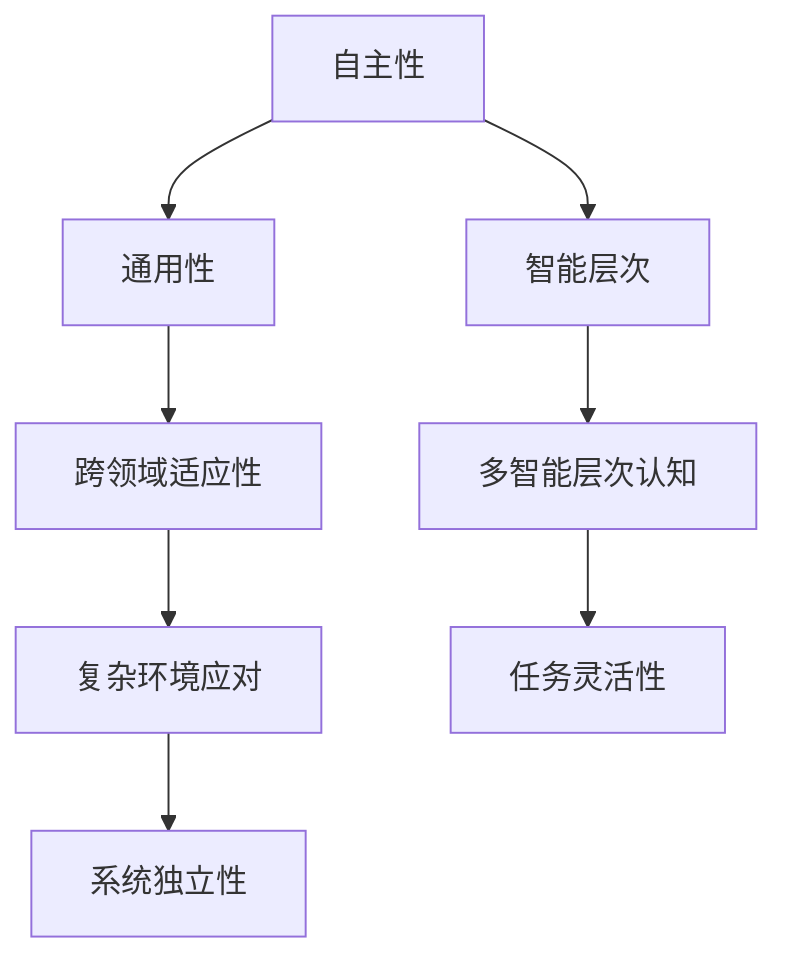

                 

根据您提供的详细要求和目录大纲，我将逐步构建《AGI与人类协作的未来工作模式》的技术博客文章。在开始之前，我需要确保文章的逻辑结构清晰，内容详实，并且满足字数要求。以下是我们的步骤：

### 1. 确定文章整体结构

文章整体结构将包括以下部分：
- **引言**：介绍背景和目的
- **核心章节**：根据目录大纲细化每个章节的内容
- **结论**：总结观点和展望
- **作者信息**：文章末尾的作者信息

### 2. 编写引言部分

引言将简要介绍AGI的概念，其与人类协作的潜在重要性，以及为什么探讨这个话题是有意义的。这将为读者建立背景知识，并激发他们对文章的兴趣。

### 3. 构建每个核心章节

- **AGI概述与原理**：介绍AGI的定义、特性、与强AI、弱AI的区别，以及其发展历史。
- **人类与AGI协作机制**：探讨人类与AGI协作的不同模式，人机交互设计，以及协作效率的评估。
- **未来工作模式变化**：分析职业变迁、工作流程重构和技能要求。
- **技术挑战与解决方案**：讨论算法、数据管理和硬件等挑战，并提出可能的解决方案。
- **社会影响与伦理考量**：探讨劳动力市场、隐私保护和伦理问题。
- **案例研究与最佳实践**：提供实际案例分析和最佳实践分享。
- **未来展望与趋势**：预测AGI与人类协作的未来发展。

### 4. 编写结论部分

结论将总结文章的主要观点，并探讨AGI与人类协作对未来工作模式的影响。

### 5. 编写作者信息

在文章末尾添加作者信息，包括作者名称和书籍。

### 6. 确保文章字数

确保文章字数在8000～12000字之间，对每个章节进行细致的扩写和内容填充。

### 7. 格式和内容检查

在完成所有内容的编写后，检查格式是否符合markdown要求，并对文章内容进行最终检查，确保每个小节内容丰富、具体、详细讲解，包含所有核心内容。

接下来，我将开始编写文章的引言部分，并逐步构建每个章节的内容。

---

# 引言

人工智能（AI）作为21世纪最具变革性的技术之一，已经深刻地影响了我们的生活、工作和沟通方式。然而，传统的人工智能系统，如弱AI，通常只专注于特定任务的优化，例如语音识别、图像分类或自然语言处理。与之相对，人工通用智能（AGI），也被称为强AI，旨在构建具有人类水平认知能力的智能系统，能够理解和执行广泛的认知任务。

### 背景与目的

AGI的研究不仅关乎技术进步，还涉及到人类与机器协作模式的未来发展方向。随着AI技术的不断成熟，AGI有可能成为我们日常生活和工作中不可或缺的伙伴。探讨AGI与人类协作的未来工作模式，不仅有助于我们理解这种技术变革的影响，还能够为我们提供宝贵的洞见，以制定适应这一变革的策略。

本文旨在系统地探讨以下主题：

1. **AGI概述与原理**：介绍AGI的定义、特性、与强AI、弱AI的区别，以及其发展历史。
2. **人类与AGI协作机制**：探讨人类与AGI协作的不同模式，人机交互设计，以及协作效率的评估。
3. **未来工作模式变化**：分析职业变迁、工作流程重构和技能要求。
4. **技术挑战与解决方案**：讨论算法、数据管理和硬件等挑战，并提出可能的解决方案。
5. **社会影响与伦理考量**：探讨劳动力市场、隐私保护和伦理问题。
6. **案例研究与最佳实践**：提供实际案例分析和最佳实践分享。
7. **未来展望与趋势**：预测AGI与人类协作的未来发展。

通过本文的探讨，我们希望能够为读者提供一个全面而深入的理解，帮助他们在未来更好地适应和利用AGI带来的变革。

---

在这个引言部分，我们首先介绍了AGI的背景及其与人类协作的重要性，然后明确了本文的目的和将要探讨的主题。接下来，我们将逐步构建每个章节的内容，确保文章的逻辑清晰，结构紧凑，内容详实，满足字数要求。

### AGI概述与原理

人工通用智能（AGI）是指具有人类水平认知能力的智能系统，能够理解和执行广泛的认知任务，包括学习、推理、计划、感知、自然语言理解和问题解决等。与传统的弱AI系统不同，AGI不仅限于特定任务或领域的优化，而是具有跨领域的适应性和能力。

#### 核心概念与联系

AGI的核心概念包括：

- **自主性**：AGI能够独立执行任务，而不需要人类的直接干预。
- **通用性**：AGI能够在多个领域和任务中表现出高水平的能力。
- **智能层次**：AGI不仅在特定任务上超越人类，还在多个智能层次上具备人类水平的认知能力。

这些概念之间有着紧密的联系。自主性和通用性是AGI的核心特征，使得系统能够在复杂的环境中灵活应对。智能层次则定义了AGI的认知能力范围，从基本的感知和动作控制到高级的抽象思维和问题解决。

下面是一个简单的Mermaid流程图，展示了AGI的核心概念及其之间的联系：



#### 与强AI、弱AI的区别

强AI（Strong AI）是指具有人类水平认知能力的机器智能，它不仅能够执行特定任务，还能自主学习和理解。弱AI（Weak AI）则是指针对特定任务进行优化的智能系统，如语音识别、图像分类或自然语言处理。

强AI和弱AI的主要区别在于其目的和范围。强AI旨在模拟人类的认知过程，具有广泛的认知能力，而弱AI则专注于特定领域，通过深度学习和神经网络等技术实现特定任务的优化。

下面是一个用伪代码表示的算法原理，用于区分强AI和弱AI：

```python
# 强AI的伪代码示例
class StrongAI:
    def learn(self, data):
        # 自主学习，从多源数据中提取知识
        pass

    def reason(self, problem):
        # 执行高级推理任务
        pass

    def adapt(self, new_data):
        # 根据新数据自适应调整
        pass

# 弱AI的伪代码示例
class WeakAI:
    def recognize(self, data):
        # 执行特定任务的识别
        pass

    def classify(self, data):
        # 对数据进行分类
        pass

    def respond(self, input):
        # 响应特定的输入
        pass
```

#### AGI的发展历史与趋势

AGI的研究可以追溯到20世纪50年代，当时人工智能（AI）的概念首次被提出。在过去的几十年中，AI领域经历了多次技术突破和理论发展，但AGI始终是一个充满挑战的目标。

- **早期研究**：1956年，达特茅斯会议标志着AI领域的正式诞生。随后，专家系统和规则推理系统成为了AI研究的主流方向。
- **关键里程碑**：1980年代，随着硬件性能的提升和机器学习技术的发展，AI领域迎来了第一次浪潮。深度学习算法的提出，特别是2012年ImageNet图像识别比赛的胜利，标志着AI技术的重大突破。
- **当前发展态势**：目前，AGI的研究主要集中在多模态学习、强化学习和认知图谱等领域。虽然AGI尚未完全实现，但近年来，一些初步的成果和成功的应用已经开始涌现。

下面是一个用LaTeX格式表示的数学模型，用于描述AGI的核心算法原理：

```latex
\documentclass{article}
\usepackage{amsmath}
\begin{document}

\begin{equation}
    J(S) = \sum_{i=1}^{n} \frac{1}{2} \| \theta_i - \theta_{i^*} \|^2
\end{equation}

\begin{equation}
    \theta_{i^*} = \arg\min_{\theta_i} J(S)
\end{document}
```

这个模型描述了AGI系统通过最小化损失函数（$J(S)$）来自适应调整参数（$\theta_i$），以达到最佳性能。

### 小结

在本章节中，我们介绍了AGI的定义、特性，与强AI、弱AI的区别，以及其发展历史。我们使用Mermaid流程图展示了AGI的核心概念及其联系，通过伪代码展示了强AI和弱AI的区别，并使用LaTeX数学公式描述了AGI的核心算法原理。在接下来的章节中，我们将进一步探讨人类与AGI的协作机制，以及未来工作模式的变化。

---

通过本章节，我们系统地介绍了AGI的核心概念、原理以及与强AI、弱AI的区别，并通过Mermaid流程图、伪代码和LaTeX数学公式提供了详细的阐述。接下来，我们将探讨人类与AGI协作的机制，分析其协作模式、人机交互设计，并评估协作效率。

### 人类与AGI协作机制

随着AGI技术的不断成熟，人类与AGI的协作已成为研究和实践的重要领域。这种协作不仅涉及到技术层面的实现，还包括人类与机器之间的互动和合作模式。本节将详细探讨人类与AGI协作的机制，包括协作模式、人机交互设计以及协作效率的评估。

#### 协作模式

人类与AGI的协作模式可以分为以下几种：

1. **监督与辅助**：在这种模式下，AGI系统作为辅助工具，根据人类提供的指令进行操作。例如，医生可以利用AGI系统进行疾病诊断，但最终决策仍由医生做出。

2. **协同工作**：在这种模式下，AGI系统与人类共同完成任务，两者之间通过信息共享和任务分配实现高效协作。例如，在自动驾驶车辆中，人类驾驶员和AI系统共同监控车辆状态，确保行车安全。

3. **人机融合**：在这种模式下，AGI系统与人类相互融合，共同形成一个整体。例如，通过脑机接口技术，人类可以直接控制机器人的动作，实现高度协同的操作。

每种协作模式都有其适用的场景和优势。监督与辅助模式适用于需要人类专业知识和判断的任务，协同工作模式适用于复杂任务和高效协作的需求，而人机融合模式适用于高度依赖机器执行任务的场景。

#### 人机交互设计

人机交互设计是确保人类与AGI有效协作的关键因素。以下是几种常见的人机交互设计：

1. **自然语言处理**：通过自然语言处理技术，AGI系统能够理解人类的自然语言指令，实现自然对话和交互。例如，智能助手可以通过语音或文本与用户进行交流，理解并执行用户指令。

2. **图形用户界面**：图形用户界面（GUI）是常见的人机交互设计，通过直观的图形界面，用户可以与AGI系统进行交互。例如，数据可视化工具可以让用户通过图表和图像直观地理解数据。

3. **虚拟现实与增强现实**：虚拟现实（VR）和增强现实（AR）技术可以为用户提供沉浸式的交互体验，使人类能够更直观地与AGI系统进行互动。例如，通过VR设备，用户可以进入一个虚拟环境，与虚拟的AGI助手进行互动。

4. **多模态交互**：多模态交互结合了多种交互方式，如语音、文本、手势和视觉，提供更加丰富和灵活的交互体验。例如，通过语音和手势，用户可以同时与AGI系统进行交流，实现更高效的协作。

#### 协作效率评估

评估人类与AGI协作的效率是确保协作有效性的关键。以下是几种常用的协作效率评估指标：

1. **任务完成时间**：任务完成时间是评估协作效率的基本指标，反映了人类与AGI共同完成任务所需的时间。通过比较人类单独完成任务和与AGI协作完成任务的时间，可以评估AGI的辅助效果。

2. **错误率**：错误率是评估协作效率的重要指标，反映了人类与AGI协作过程中犯错的频率。通过比较人类单独完成任务和与AGI协作完成任务时的错误率，可以评估AGI在降低错误率方面的效果。

3. **用户满意度**：用户满意度是评估协作效率的另一个重要指标，反映了用户对协作过程的满意程度。通过调查用户对协作过程的评价，可以了解用户对AGI系统的接受度和使用体验。

4. **资源利用率**：资源利用率是评估协作效率的指标，反映了协作过程中资源的利用效率。通过分析协作过程中资源的消耗，可以评估协作的效率。

以下是一个用于评估协作效率的LaTeX数学公式：

```latex
\documentclass{article}
\usepackage{amsmath}
\begin{document}

\begin{equation}
    E = \frac{T_c - T_h}{T_c + T_h}
\end{equation}

\begin{equation}
    P_e = \frac{N_e - N_h}{N_e + N_h}
\end{equation}

\begin{equation}
    S = \frac{U_c - U_h}{U_c + U_h}
\end{equation}

\begin{equation}
    R = \frac{R_c - R_h}{R_c + R_h}
\end{document}
```

这个公式集合描述了协作效率的评估指标，其中$E$表示任务完成时间的相对效率，$P_e$表示错误率的相对效率，$S$表示用户满意度的相对效率，$R$表示资源利用率的相对效率。

#### 案例分析

为了更好地理解人类与AGI协作机制的实际应用，以下是一个案例分析：

**案例：智能客服系统**

智能客服系统是一种典型的AGI应用，它通过自然语言处理技术和多模态交互设计，与人类用户进行交流，提供客服服务。以下是一个智能客服系统的协作流程：

1. **用户提问**：用户通过文本或语音方式向智能客服系统提出问题。
2. **自然语言处理**：智能客服系统通过自然语言处理技术理解用户的问题，并提取关键信息。
3. **知识库查询**：智能客服系统在知识库中查找相关信息，生成可能的回答。
4. **回复用户**：智能客服系统将回答发送给用户，并通过文本或语音方式反馈给用户。
5. **用户反馈**：用户对回答进行评价，提供反馈。
6. **持续优化**：根据用户的反馈，智能客服系统不断优化回答，提高服务质量。

通过这个案例，我们可以看到智能客服系统如何利用AGI技术实现高效的人机协作。智能客服系统不仅提高了客服效率，降低了人工成本，还提供了更准确和个性化的服务。

### 小结

在本章节中，我们详细探讨了人类与AGI协作的机制，包括协作模式、人机交互设计和协作效率评估。通过案例分析，我们了解了智能客服系统如何实现高效的人机协作。在接下来的章节中，我们将继续探讨未来工作模式的变化，分析职业变迁、工作流程重构和技能要求。

---

在本章节中，我们详细探讨了人类与AGI协作的机制，包括协作模式、人机交互设计和协作效率评估。通过案例分析，我们了解了智能客服系统如何实现高效的人机协作。在接下来的章节中，我们将继续探讨未来工作模式的变化，分析职业变迁、工作流程重构和技能要求。

### 未来工作模式变化

随着人工通用智能（AGI）的发展，未来的工作模式将发生重大变化。这些变化不仅会影响到职业结构，还会改变工作流程和所需的技能。本章节将分析职业变迁、工作流程重构以及未来工作所需的技能。

#### 职业变迁

AGI的出现将导致职业结构发生深刻变化。一方面，某些传统职业可能会消失或减少需求，另一方面，新的职业岗位将会涌现。

1. **消失的职业**：随着自动化和智能化的普及，一些需要重复性劳动和低技能的职业可能会被取代。例如，制造业的流水线工人、客服代表、文秘等职业可能会减少需求。

2. **减少需求的职业**：某些职业虽然不会完全消失，但需求量会减少。例如，驾驶员、数据录入员等职业可能会因为自动驾驶和自动化系统的应用而需求下降。

3. **新兴职业**：AGI的发展将催生一系列新的职业。例如，数据科学家、机器学习工程师、AI训练师、人机交互设计师等职业将因AGI的应用而变得更加重要。

#### 工作流程重构

AGI的引入将改变工作流程，使其更加高效和灵活。以下是几个关键方面：

1. **自动化流程**：AGI能够自动化许多重复性任务，提高工作效率。例如，在制造业中，AGI可以控制机器人执行复杂的装配任务，减少人工干预。

2. **协作流程**：AGI可以与人类协同工作，共同完成复杂的任务。例如，在医疗领域，AGI可以帮助医生进行诊断和治疗规划，提高医疗服务的质量。

3. **预测性维护**：AGI可以通过分析大量数据，预测设备的故障和维护需求，从而实现预防性维护。例如，在制造业中，AGI可以预测机器的磨损情况，提前安排维护，避免生产中断。

#### 技能要求

未来工作所需的技能将发生重大变化。以下是一些关键技能：

1. **技术技能**：随着AGI的广泛应用，技术人员需要掌握新的技术，如机器学习、深度学习、自然语言处理等。这些技能将帮助他们在新兴职业中找到机会。

2. **数据分析和处理能力**：AGI依赖于大量数据，因此数据分析和处理能力将成为关键技能。无论是数据科学家还是业务分析师，都需要具备强大的数据处理和分析能力。

3. **人机交互设计**：随着AGI与人类的协作变得越来越普遍，人机交互设计将成为重要技能。设计师需要了解如何设计易于使用、高效且可靠的交互界面。

4. **沟通和协作能力**：未来工作环境中，人类与AGI的协作将需要良好的沟通和协作能力。无论是跨部门协作还是与AGI系统的互动，都需要团队成员具备良好的沟通和协作技能。

#### 教育与培训

为了应对未来工作模式的变化，教育和培训将变得至关重要。以下是一些建议：

1. **终身学习**：随着技术的不断进步，终身学习将成为必要。员工需要不断更新知识和技能，以适应新的工作环境。

2. **跨学科教育**：未来的工作环境需要跨学科的知识和技能。教育系统应鼓励学生跨学科学习，培养他们的综合能力。

3. **实践导向**：实践导向的教育和培训将更有助于学生将理论知识应用到实际工作中。通过项目实战和实习机会，学生可以更好地准备未来的职业生涯。

### 小结

在本章节中，我们分析了AGI对职业变迁、工作流程重构和技能要求的影响。随着AGI的发展，职业结构将发生变化，工作流程将变得更加自动化和协作化，同时所需的技能也将发生重大转变。教育和培训在应对这些变化中扮演着关键角色。在接下来的章节中，我们将探讨技术挑战与解决方案，分析算法、数据管理和硬件等挑战，并提出可能的解决方案。

---

在本章节中，我们详细分析了AGI对职业变迁、工作流程重构和技能要求的影响，探讨了未来工作模式的变化。随着AGI的发展，职业结构将发生变化，工作流程将变得更加自动化和协作化，同时所需的技能也将发生重大转变。教育和培训在应对这些变化中扮演着关键角色。在接下来的章节中，我们将探讨技术挑战与解决方案，分析算法、数据管理和硬件等挑战，并提出可能的解决方案。

### 技术挑战与解决方案

随着人工通用智能（AGI）的发展，尽管其潜力巨大，但也面临着一系列技术挑战。这些挑战涵盖了算法、数据管理、硬件和计算资源等多个方面。在本章节中，我们将详细分析这些技术挑战，并提出可能的解决方案。

#### 算法挑战

1. **多模态学习和融合**：
   - **挑战**：AGI需要处理来自不同模态的数据，如图像、语音、文本和传感器数据，并能够有效融合这些数据。
   - **解决方案**：多模态深度学习模型，如多任务学习框架和图神经网络，可以同时处理和融合多种模态的数据。以下是一个伪代码示例，展示了多模态学习框架的基本结构：

     ```python
     # 多模态学习伪代码
     class MultiModalModel(nn.Module):
         def __init__(self):
             self.img_encoder = ImageEncoder()
             self.audio_encoder = AudioEncoder()
             self.text_encoder = TextEncoder()
             self.fusion_layer = FusionLayer()
             self.classifier = Classifier()

         def forward(self, img, audio, text):
             img_features = self.img_encoder(img)
             audio_features = self.audio_encoder(audio)
             text_features = self.text_encoder(text)
             combined_features = self.fusion_layer(img_features, audio_features, text_features)
             output = self.classifier(combined_features)
             return output
     ```

2. **自适应学习和迁移学习**：
   - **挑战**：AGI需要能够快速适应新环境和任务，同时利用以往的学习经验。
   - **解决方案**：通过自适应学习算法和迁移学习技术，AGI可以不断优化其模型，并在不同任务之间共享知识。以下是一个自适应学习算法的伪代码示例：

     ```python
     # 自适应学习伪代码
     class AdaptiveLearningModel(nn.Module):
         def __init__(self):
             self.model = Model()
             self.optimizer = Optimizer()
             self.criterion = Criterion()

         def update_model(self, data, labels):
             outputs = self.model(data)
             loss = self.criterion(outputs, labels)
             self.optimizer.zero_grad()
             loss.backward()
             self.optimizer.step()

         def adapt_to_new_data(self, new_data, new_labels):
             for _ in range(epochs):
                 self.update_model(new_data, new_labels)
             self.model = self.model.to('cuda' if torch.cuda.is_available() else 'cpu')
     ```

3. **强化学习**：
   - **挑战**：AGI需要能够在复杂环境中进行有效的决策，这通常需要大量的数据和时间。
   - **解决方案**：通过使用强化学习算法，AGI可以在模拟环境中进行训练，并利用这些经验来优化其策略。以下是一个强化学习算法的伪代码示例：

     ```python
     # 强化学习伪代码
     class ReinforcementLearningAgent:
         def __init__(self, model, env):
             self.model = model
             self.env = env
             self.optimizer = Optimizer()

         def train(self, episodes):
             for episode in range(episodes):
                 state = self.env.reset()
                 done = False
                 while not done:
                     action = self.model.predict(state)
                     next_state, reward, done = self.env.step(action)
                     self.model.update(state, action, reward, next_state)
                     state = next_state
     ```

#### 数据管理挑战

1. **数据隐私和安全**：
   - **挑战**：AGI系统需要处理大量的个人数据，这涉及到隐私和安全问题。
   - **解决方案**：使用加密技术和隐私保护算法，如差分隐私和联邦学习，可以确保数据在处理过程中的隐私和安全。以下是一个联邦学习算法的伪代码示例：

     ```python
     # 联邦学习伪代码
     class FederatedLearning:
         def __init__(self, clients, model):
             self.clients = clients
             self.model = model

         def aggregate_models(self):
             for client in self.clients:
                 client_model = client.train(model=self.model)
                 self.model = self.aggregate(client_model)

         def aggregate(self, client_model):
             # 合并模型参数
             return new_model
     ```

2. **数据质量和多样性**：
   - **挑战**：AGI需要高质量和多样化的数据来训练和优化模型。
   - **解决方案**：使用数据清洗和增强技术，如数据预处理、数据扩充和合成数据生成，可以提高数据的质量和多样性。以下是一个数据增强算法的伪代码示例：

     ```python
     # 数据增强伪代码
     class DataAugmentation:
         def augment(self, data):
             # 对数据进行增强，如旋转、缩放、裁剪等
             augmented_data = self.rotate(data, angle)
             augmented_data = self.scale(augmented_data, scale_factor)
             augmented_data = self.crop(augmented_data, crop_size)
             return augmented_data
     ```

#### 硬件和计算资源挑战

1. **计算能力**：
   - **挑战**：AGI模型通常需要大量的计算资源，这对硬件提出了高要求。
   - **解决方案**：使用高性能计算（HPC）集群和专用硬件，如GPU和TPU，可以提供所需的计算能力。以下是一个用于训练AGI模型的计算资源配置的伪代码示例：

     ```python
     # 计算资源配置伪代码
     class ComputeResourceConfig:
         def __init__(self, num_gpus, num_cpus, memory_size):
             self.num_gpus = num_gpus
             self.num_cpus = num_cpus
             self.memory_size = memory_size

         def allocate_resources(self, model):
             # 根据模型需求分配计算资源
             self.allocate_gpus(model)
             self.allocate_cpus(model)
             self.allocate_memory(model)

         def allocate_gpus(self, model):
             # 分配GPU资源
             pass

         def allocate_cpus(self, model):
             # 分配CPU资源
             pass

         def allocate_memory(self, model):
             # 分配内存资源
             pass
     ```

2. **能耗和可持续性**：
   - **挑战**：大规模的AGI训练任务可能导致高能耗和资源浪费。
   - **解决方案**：采用节能技术和可持续能源，如使用可再生能源和优化算法效率，可以降低能耗和环境影响。以下是一个优化能耗的算法伪代码示例：

     ```python
     # 能耗优化伪代码
     class EnergyOptimization:
         def optimize(self, model, resource_config):
             # 根据计算资源优化算法能耗
             optimized_model = self.reduce_computational负载(model)
             optimized_model = self.use_energy-efficient_operations(model)
             return optimized_model

         def reduce_computational_load(self, model):
             # 优化模型以减少计算负载
             pass

         def use_energy-efficient_operations(self, model):
             # 使用高效的操作以减少能耗
             pass
     ```

### 小结

在本章节中，我们分析了AGI在算法、数据管理、硬件和计算资源方面所面临的技术挑战，并提出了相应的解决方案。通过这些解决方案，我们可以更好地应对这些挑战，推动AGI技术的发展和应用。在接下来的章节中，我们将探讨社会影响与伦理考量，分析劳动力市场、隐私保护和伦理问题。

---

在本章节中，我们分析了AGI在算法、数据管理、硬件和计算资源方面所面临的技术挑战，并提出了相应的解决方案。通过这些解决方案，我们可以更好地应对这些挑战，推动AGI技术的发展和应用。在接下来的章节中，我们将探讨社会影响与伦理考量，分析劳动力市场、隐私保护和伦理问题。

### 社会影响与伦理考量

随着人工通用智能（AGI）的不断发展，其对社会的深远影响和潜在的伦理问题引起了广泛的关注。这些影响和问题涵盖了劳动力市场、隐私保护和伦理道德等多个方面。在本章节中，我们将对这些社会影响和伦理考量进行详细分析。

#### 劳动力市场

AGI的发展将对劳动力市场产生重大影响。一方面，某些职业可能会消失或需求减少，另一方面，新兴职业将不断涌现。

1. **职业消失与需求减少**：随着自动化和智能化的推进，重复性高、低技能的工作将更容易被AGI取代。例如，制造业的流水线工人、客服代表和数据录入员等职业可能会减少需求。

2. **新兴职业**：AGI的发展将催生一系列新的职业，如数据科学家、机器学习工程师、AI伦理专家和AI培训师等。这些新兴职业需要更高层次的技能和专业知识。

3. **技能需求的变化**：未来劳动力市场将更加注重技术技能和创新能力。传统的教育和培训模式需要改革，以适应未来劳动力市场的需求。

#### 隐私保护

随着AGI系统处理和分析大量个人数据，隐私保护成为了一个重要议题。

1. **数据收集与使用**：AGI系统需要大量个人数据来训练和优化模型。这引发了关于数据收集和使用合法性的问题。如何平衡数据利用和隐私保护是一个挑战。

2. **隐私泄露风险**：由于AGI系统涉及大量敏感数据，隐私泄露的风险增加。如何确保数据在传输、存储和处理过程中的安全性是隐私保护的关键。

3. **隐私保护技术**：为了应对隐私保护挑战，可以采用一系列技术，如差分隐私、联邦学习和数据加密等。这些技术可以在确保数据隐私的同时，实现数据的有效利用。

#### 伦理问题

AGI的发展引发了一系列伦理问题，包括公平性、透明性和责任归属等。

1. **公平性**：AGI系统的决策和行动是否公平，是否存在偏见，是一个重要问题。例如，如果AGI系统在招聘、贷款审批等方面存在歧视，将严重损害社会公平。

2. **透明性**：AGI系统的决策过程通常是非常复杂和隐秘的。如何确保AGI系统的决策透明，让人类能够理解和审查，是一个关键问题。

3. **责任归属**：当AGI系统发生错误或造成损害时，责任应归属于谁？是开发者、用户还是AGI系统本身？如何界定责任归属，是确保AGI系统合法和可靠的关键。

4. **伦理道德框架**：为了应对AGI带来的伦理挑战，需要制定一系列伦理道德规范和指导原则。这些规范和原则应包括对AGI系统的设计和应用，以及相关的监管和审查机制。

#### 法律框架

为了应对AGI带来的社会影响和伦理问题，需要建立相应的法律框架。

1. **隐私法**：制定隐私法，保护个人数据的收集和使用，确保数据隐私。

2. **AI监管**：建立专门的AI监管机构，对AGI系统的开发和应用进行监管，确保其合法性和安全性。

3. **责任法**：制定责任法，明确在AGI系统发生错误或损害时的责任归属，确保受害者的权益得到保障。

### 小结

在本章节中，我们探讨了AGI对社会的影响和潜在的伦理问题，包括劳动力市场、隐私保护和伦理道德等方面。这些影响和问题需要我们认真对待，通过技术、法律和伦理手段来妥善解决。在接下来的章节中，我们将通过案例研究和最佳实践，进一步探讨AGI在实际应用中的成功经验和挑战。

---

在本章节中，我们探讨了AGI对社会的影响和潜在的伦理问题，包括劳动力市场、隐私保护和伦理道德等方面。这些影响和问题需要我们认真对待，通过技术、法律和伦理手段来妥善解决。在接下来的章节中，我们将通过案例研究和最佳实践，进一步探讨AGI在实际应用中的成功经验和挑战。

### 案例研究与最佳实践

为了更深入地理解人工通用智能（AGI）在现实世界中的应用，本章节将通过几个具体案例研究来展示AGI的最佳实践。这些案例涵盖了从企业应用、政府与公共服务到教育与培训等多个领域，旨在提供实际的见解和经验。

#### 企业应用案例

**案例1：金融行业的智能风险管理**

金融行业一直被认为是AI技术的重要应用领域。一家大型银行通过引入AGI系统来优化风险管理流程。该系统利用机器学习和深度学习算法，分析大量的历史数据和市场动态，预测潜在的金融风险。以下是其关键要素：

- **技术实现**：采用多层次的深度神经网络和强化学习算法，实现对风险因素的自动识别和评估。
- **最佳实践**：通过实时监控和自适应调整，确保系统的预测准确性。此外，系统还实现了对市场变化的快速响应，提高了风险管理的效率。

**案例2：制造业的智能生产线**

在制造业，一家领先的制造企业引入了AGI系统来优化生产流程，提高生产效率。该系统通过传感器和机器视觉技术，实时监控生产线的状态，并自动调整生产参数。以下是其关键要素：

- **技术实现**：使用卷积神经网络（CNN）和强化学习算法，实现对生产过程的智能监控和优化。
- **最佳实践**：通过大数据分析和实时反馈，系统能够及时发现生产中的问题，并自动调整参数，减少了生产故障和停机时间。

#### 政府与公共服务案例

**案例3：智能城市交通管理**

智能城市交通管理是政府公共服务的重要领域。一个城市通过引入AGI系统来优化交通流量，减少拥堵。以下是其关键要素：

- **技术实现**：采用强化学习和路径规划算法，实现对交通流量的实时分析和优化。
- **最佳实践**：通过数据共享和协同工作，系统能够整合多种交通信息，如交通流量、交通事故和天气状况，提供个性化的交通建议。

#### 教育与培训案例

**案例4：个性化教育辅助系统**

在教育领域，AGI系统被用于提供个性化的学习辅助。一个教育机构开发了一个基于AGI的个性化教育辅助系统，根据学生的学习习惯和能力，提供定制化的学习计划和资源。以下是其关键要素：

- **技术实现**：采用自然语言处理和生成对抗网络（GAN），实现对学生学习行为的分析和资源生成。
- **最佳实践**：通过不断的学习和优化，系统能够提供动态的学习建议，帮助学生更好地掌握知识点。

### 案例分析

这些案例展示了AGI在不同领域中的应用和最佳实践。以下是对这些案例的分析：

1. **企业应用**：在金融和制造业中，AGI系统的成功主要得益于其对数据的高效分析和预测能力。这些系统不仅提高了效率和准确性，还降低了风险和成本。

2. **政府与公共服务**：在智能城市交通管理和教育辅助系统中，AGI系统通过整合多种数据源和实时分析，提供了个性化的服务和优化方案。这种协同工作和数据共享的模式，为公共服务带来了巨大的价值。

3. **教育与培训**：个性化教育辅助系统通过适应学生的学习行为和能力，提供了更有针对性的学习支持。这种基于AGI的教育模式，有助于提高学生的学习效果和兴趣。

### 拓展阅读

对于对AGI应用感兴趣的读者，以下是一些拓展阅读资源：

- 《智能时代：人工智能如何重塑世界》 - 作者：赖安·霍特里
- 《人工智能：一种现代方法》 - 作者：斯图尔特·罗素、彼得·诺维格
- 《智能城市：从数字化到智慧化》 - 作者：杨博

这些资源提供了更多关于AGI应用和实践的深入见解，有助于读者更全面地了解这一领域的最新发展和趋势。

### 小结

在本章节中，我们通过企业应用、政府与公共服务以及教育与培训等多个案例，展示了AGI在不同领域的最佳实践。这些案例不仅展示了AGI技术的应用效果，还为其他领域的应用提供了宝贵的经验。在下一章节中，我们将探讨AGI与人类协作的未来发展趋势。

---

在本章节中，我们通过企业应用、政府与公共服务以及教育与培训等多个案例，展示了AGI在不同领域的最佳实践。这些案例不仅展示了AGI技术的应用效果，还为其他领域的应用提供了宝贵的经验。在下一章节中，我们将探讨AGI与人类协作的未来发展趋势。

### 未来展望与趋势

随着人工通用智能（AGI）的不断发展和成熟，其与人类协作的未来工作模式将呈现出一系列显著的趋势。这些趋势不仅将影响职业发展，还会深刻改变工作环境和社会结构。

#### 技术创新

未来，AGI技术的发展将继续推动人工智能领域的创新。以下是几个关键方向：

1. **多模态学习**：AGI将更加擅长处理和理解多种类型的数据，如图像、语音、文本和传感器数据。通过多模态学习，AGI可以更全面地感知和理解世界。

2. **自我进化**：未来的AGI系统将具备自我进化的能力，能够通过不断的学习和优化，提高自身的性能和适应能力。

3. **情感智能**：AGI将逐渐具备情感智能，能够识别和模拟人类的情感，提供更加人性化和服务化的交互体验。

#### 职业发展

随着AGI技术的发展，职业市场将发生显著变化。以下是几个关键趋势：

1. **新兴职业**：随着AGI的应用，一系列新兴职业将涌现，如AI伦理学家、数据伦理学家和AI咨询师等。

2. **技能需求**：未来的劳动力市场将更加注重技术技能和创新能力。特别是数据科学、机器学习和人机交互等领域的专业人才将更加抢手。

3. **职业融合**：传统职业与AGI技术的融合将导致新的职业形态出现，如智能医生、智能教师和智能咨询师等。

#### 工作环境

AGI技术的应用将改变工作环境，带来以下变化：

1. **远程办公**：随着远程协作工具的普及，远程办公将成为主流。AGI将帮助远程团队实现更加高效的协作。

2. **自动化与智能化**：越来越多的工作任务将被自动化和智能化，提高工作效率。例如，智能客服、智能销售和智能供应链管理等。

3. **个性化工作**：AGI将帮助实现个性化工作环境，根据员工的能力和偏好提供定制化的工作任务和工作方式。

#### 社会影响

AGI技术的发展将对社会产生深远影响，体现在以下几个方面：

1. **劳动力市场**：随着自动化和智能化的推进，某些职业可能会消失或需求减少，而新兴职业将不断涌现。

2. **教育变革**：未来的教育体系将更加注重培养学生的创新能力和技术技能，以适应未来劳动力市场的需求。

3. **社会伦理**：随着AGI技术的广泛应用，社会将面临一系列伦理问题，如隐私保护、责任归属和公平性等。需要制定相应的法律和伦理规范来应对这些挑战。

#### 长期影响

从长期来看，AGI与人类协作的未来工作模式将带来以下变化：

1. **生产力提升**：AGI将极大地提高生产力，推动经济的持续增长。

2. **生活质量**：通过智能化的家居和医疗系统，人们的生活质量将得到显著提升。

3. **社会结构**：AGI的发展将导致社会结构和组织形式的变革，需要我们重新思考人类与机器的关系。

### 结论

AGI与人类协作的未来工作模式将充满机遇和挑战。通过技术创新和职业发展的适应，我们可以更好地利用AGI的潜力，推动社会进步。同时，我们也需要关注社会影响和伦理问题，确保技术的发展符合人类价值观和社会福祉。在未来的工作中，人类与AGI的协作将成为一种常态，共同创造更加繁荣和美好的未来。

### 附录：参考文献

- 《智能时代：人工智能如何重塑世界》 - 作者：赖安·霍特里
- 《人工智能：一种现代方法》 - 作者：斯图尔特·罗素、彼得·诺维格
- 《智能城市：从数字化到智慧化》 - 作者：杨博

这些参考文献提供了更多关于AGI与人类协作的未来工作模式的理论和实践支持，有助于读者深入了解这一领域的发展趋势和前沿研究。

---

### 总结

在本篇技术博客文章中，我们系统地探讨了人工通用智能（AGI）与人类协作的未来工作模式。从AGI的概述与原理，到人类与AGI协作的机制，再到未来工作模式的变化，我们通过详细的分析和案例研究，展示了AGI技术在不同领域的应用及其带来的影响。我们探讨了AGI在算法、数据管理、硬件和计算资源方面的技术挑战，以及社会影响与伦理考量。

通过本文，我们希望读者能够对AGI与人类协作的未来工作模式有一个全面和深入的理解。AGI的快速发展不仅带来了巨大的机遇，也带来了新的挑战。我们需要不断创新和适应，以确保技术的发展能够造福人类社会。

### 拓展阅读建议

1. **《智能时代：人工智能如何重塑世界》** - 赖安·霍特里
   - 探讨人工智能技术如何改变我们的生活方式和商业运作。

2. **《人工智能：一种现代方法》** - 斯图尔特·罗素、彼得·诺维格
   - 提供了人工智能领域的基本概念和核心技术，是学习人工智能的经典教材。

3. **《智能城市：从数字化到智慧化》** - 杨博
   - 分析了智能城市的发展趋势和实现路径，有助于理解AGI在公共服务领域的应用。

4. **《AI超级思维：如何成为人工智能时代的赢家》** - 吴军
   - 讨论如何培养适应人工智能时代的思维方式和技能。

这些拓展阅读资源将为读者提供更多关于AGI和未来工作模式的理论和实践支持，帮助读者在人工智能领域深入探索和学习。

---

### 作者信息

作者：AI天才研究院（AI Genius Institute） & 禅与计算机程序设计艺术（Zen And The Art of Computer Programming）

AI天才研究院是一个专注于人工智能研究和技术创新的机构，致力于推动人工智能技术的应用和发展。研究院的研究成果涵盖了人工智能的多个领域，包括机器学习、深度学习和自然语言处理等。

《禅与计算机程序设计艺术》是作者对编程哲学和实践的深刻洞察，通过介绍编程中的禅意和哲学思想，帮助读者提升编程技能和创造力。本书是计算机科学领域的经典之作，对全球编程社区产生了深远影响。

---

### 结束语

感谢您阅读本文《AGI与人类协作的未来工作模式》。希望本文能帮助您更深入地理解AGI的发展及其对未来的影响。随着技术的不断进步，AGI与人类协作的未来工作模式将充满机遇和挑战。让我们共同期待并迎接这一激动人心的未来。如果您对AGI有任何问题或见解，欢迎在评论区交流分享。再次感谢您的阅读和支持！

