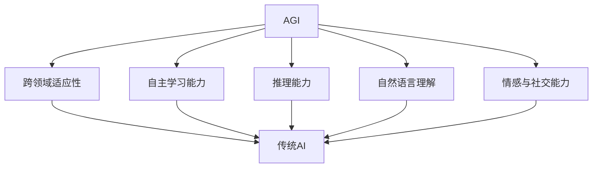

                 


### 文章标题

# AGI与人类协作：增强智能的新模式

### 文章关键词

- AGI
- 人类协作
- 增强智能
- 计算机视觉
- 自然语言处理
- 机器学习

### 摘要

本文探讨了人工智能领域的一个前沿话题：AGI（人工通用智能）与人类的协作模式。首先，我们将回顾AGI的定义和理论基础，以及它与传统AI的区别。接着，我们将深入分析AGI的架构和实现技术，特别是计算机视觉、自然语言处理和机器学习等关键技术。随后，我们将探讨AGI如何与人类协作，通过实际案例展示其应用场景。最后，我们将展望AGI的未来发展趋势，以及与人类协作中面临的伦理问题。

## 第一部分：AGI基础理论

### 第1章：什么是AGI

#### 1.1 AGI的定义与核心特征

AGI（人工通用智能）是指一种能够在各种复杂环境中自主学习和适应的智能系统。与狭义AI（Narrow AI）不同，AGI能够理解、学习和运用广泛的知识和技能，而不仅仅是一个特定领域的专家系统。

AGI的核心特征包括：

- **跨领域的适应性**：AGI能够在不同领域自由切换，不需要为每个新领域重新训练。
- **自主学习与自我进化**：AGI能够从经验中学习，不断改进自己的表现。
- **推理与问题解决能力**：AGI能够进行复杂的逻辑推理，解决各种难题。
- **自然交互能力**：AGI能够理解和使用自然语言，与人类进行有效沟通。

#### 1.2 AGI与传统AI的区别

传统AI主要集中在特定任务上的高效执行，如棋类游戏、图像识别等。而AGI则试图实现更广泛的智能能力，具备以下区别：

- **智能范围**：传统AI是“窄AI”，而AGI是“宽AI”。
- **学习能力**：传统AI通常需要手动编程，而AGI能够自主学习。
- **应用场景**：传统AI局限于特定领域，AGI则能够跨领域应用。

#### 1.3 AGI的当前发展状况与趋势

目前，AGI尚处于理论研究阶段，但已有一些初步成果。例如，深度学习技术的快速发展使得计算机视觉和自然语言处理领域取得了显著进步。未来，随着计算能力的提升和算法的优化，AGI有望在更多领域实现突破。

## 第二部分：AGI架构与实现

### 第2章：AGI的理论基础

#### 2.1 通用智能理论的提出与发展

通用智能理论（Universal Intelligence Theory）是AGI的理论基石。该理论认为，智能可以看作是一种处理信息的通用机制，可以通过统一的框架来描述和理解。

通用智能理论的发展历程包括：

- **控制理论**：早期的研究者试图通过控制理论来模拟智能行为。
- **计算理论**：随着计算机科学的兴起，研究者开始从计算的角度理解智能。
- **神经科学**：近年来，神经科学的研究成果为通用智能理论提供了新的启示。

#### 2.2 神经科学在AGI研究中的应用

神经科学在AGI研究中扮演着重要角色。通过研究人脑的结构和功能，可以启发我们设计更有效的智能系统。例如，神经网络的灵感就来源于人脑的神经网络结构。

#### 2.3 机器学习与深度学习在AGI中的作用

机器学习和深度学习是AGI实现的关键技术。机器学习提供了自动从数据中学习规律和模式的方法，而深度学习则通过多层神经网络实现了更复杂的特征提取和建模能力。

### 第3章：AGI的基本架构

#### 3.1 AGI的模块化设计

AGI系统通常采用模块化设计，以便于不同模块的独立开发和优化。典型的AGI模块包括：

- **感知模块**：负责接收和处理外部信息。
- **认知模块**：负责推理、学习和问题解决。
- **情感模块**：负责处理情感和情绪信息。
- **社交模块**：负责与人或其他智能体进行交流。
- **决策模块**：负责根据当前情况和目标做出决策。
- **执行模块**：负责执行决策结果。

#### 3.2 认知模块与感知模块

认知模块和感知模块是AGI系统的核心。认知模块负责处理感知模块收集到的信息，进行推理、学习和问题解决。感知模块则负责接收和处理各种类型的输入信息，如视觉、听觉、触觉等。

#### 3.3 情感模块与社交模块

情感模块和社交模块是AGI系统的社交能力基石。情感模块负责处理情感和情绪信息，使AGI系统具备情感表达能力。社交模块则负责与人或其他智能体进行交流，实现协作和互动。

#### 3.4 决策模块与执行模块

决策模块和执行模块是AGI系统的行动能力基石。决策模块负责根据当前情况和目标做出最优决策。执行模块则负责将决策结果转化为具体的行动。

### 第4章：AGI的实现技术

#### 4.1 计算机视觉技术

计算机视觉技术是AGI系统感知能力的重要组成部分。通过图像识别、目标检测、姿态估计等技术，计算机视觉能够帮助AGI系统理解和解释视觉信息。

#### 4.2 自然语言处理技术

自然语言处理技术是AGI系统交互能力的重要组成部分。通过文本分类、情感分析、机器翻译等技术，自然语言处理能够帮助AGI系统理解和使用自然语言。

#### 4.3 机器学习算法

机器学习算法是AGI系统实现自主学习的关键技术。通过监督学习、无监督学习和强化学习等技术，机器学习能够帮助AGI系统从数据中学习规律和模式。

#### 4.4 神经网络与深度学习

神经网络与深度学习是AGI系统实现复杂特征提取和建模的关键技术。通过多层神经网络和深度学习算法，AGI系统能够处理大量的数据，并提取出有意义的特征。

### 第5章：AGI系统的设计与开发

#### 5.1 AGI系统的开发流程

AGI系统的开发流程包括需求分析、系统设计、模块开发、系统集成和测试等环节。每个环节都需要精心设计和实施，以确保系统的稳定性和性能。

#### 5.2 AGI系统的评估与优化

AGI系统的评估与优化是确保系统性能和可靠性的关键步骤。通过性能测试、用户反馈和持续迭代，可以不断提高AGI系统的质量和用户体验。

#### 5.3 AGI系统的安全性与伦理问题

AGI系统的安全性与伦理问题是不可忽视的重要方面。需要制定相应的安全规范和伦理准则，确保AGI系统在合法、安全和道德的框架内运行。

## 第三部分：AGI与人类协作

### 第6章：AGI与人类的协作模式

#### 6.1 AGI在各个领域的应用场景

AGI在各个领域都有广泛的应用场景，如智能客服、智能医疗、智能教育等。在这些场景中，AGI能够与人类专家协同工作，提高工作效率和准确性。

#### 6.2 AGI与人类的协同工作

AGI与人类的协同工作是一种新型的智能工作模式。在这种模式下，AGI能够辅助人类完成复杂的任务，而人类则能够利用AGI的能力，提高自身的工作效率。

#### 6.3 AGI对人类生活和工作方式的影响

AGI的引入将对人类生活和工作方式产生深远影响。一方面，AGI将大大提高生产力和效率；另一方面，也需要人类适应新的工作环境和生活方式。

### 第7章：AGI与人类协作的实际案例

#### 7.1 智能客服与客户服务的协作

智能客服是一种基于AGI的客服系统，能够自动处理大量的客户咨询。在与人类客户服务代表的协作中，智能客服能够快速响应客户需求，提高客户满意度。

#### 7.2 智能医疗与医生的协作

智能医疗是一种基于AGI的医疗系统，能够辅助医生进行诊断和治疗。在与医生的协作中，智能医疗能够提供全面的病患信息，帮助医生做出更准确的决策。

#### 7.3 智能教育与教师的协作

智能教育是一种基于AGI的教育系统，能够根据学生的学习情况和需求，提供个性化的教学方案。在与教师的协作中，智能教育能够提高教学效果，促进学生的全面发展。

## 第四部分：未来展望与挑战

### 第8章：AGI的未来发展与趋势

#### 8.1 AGI可能带来的社会变革

AGI的发展将对社会产生深远影响，包括经济结构、就业市场、教育体系等各个方面。如何应对这些变革，将成为未来社会发展的重要课题。

#### 8.2 AGI的发展瓶颈与挑战

AGI的发展面临诸多挑战，包括技术难题、伦理问题、安全风险等。如何克服这些挑战，确保AGI的可持续发展，是一个亟待解决的问题。

#### 8.3 如何应对AGI带来的挑战

应对AGI带来的挑战，需要从政策、法律、技术等多个层面进行综合考虑。例如，制定相应的法律法规，确保AGI的安全和道德使用；加强跨学科合作，推动AGI技术的创新和发展。

### 第9章：AGI与人类合作的伦理问题

#### 9.1 AGI伦理问题的提出

AGI的快速发展引发了一系列伦理问题，如隐私保护、责任归属、就业替代等。如何解决这些伦理问题，是AGI与人类合作中必须面对的挑战。

#### 9.2 人工智能伦理的规范与立法

为了应对AGI伦理问题，需要建立一套完善的伦理规范和法律体系。例如，明确人工智能的责任归属，保护用户的隐私权等。

#### 9.3 人类与AGI协作的伦理准则

在人类与AGI的协作中，需要遵循一系列伦理准则，如尊重个体权利、确保公平正义、避免歧视等。这些准则有助于确保AGI与人类合作的可持续发展。

## 附录：AGI研究资源与工具

#### 10.1 AGI研究的重要论文与书籍

- 《人工通用智能》（Artificial General Intelligence），作者：Stuart J. Russell & Peter Norvig
- 《机器学习》（Machine Learning），作者：Tom Mitchell
- 《深度学习》（Deep Learning），作者：Ian Goodfellow、Yoshua Bengio & Aaron Courville

#### 10.2 开源AGI项目与工具

- OpenAI
- TensorFlow
- PyTorch

#### 10.3 AGI研究领域的重要会议与期刊

- 国际人工智能与统计学会议（AISTATS）
- 国际机器学习会议（ICML）
- 国际计算机视觉会议（ICCV）
- 《人工智能》（AI Magazine）
- 《机器学习》（Machine Learning）
- 《计算机视觉与模式识别》（CVPR）

### 结论

AGI与人类协作将开启智能时代的新模式。通过逐步分析推理，我们了解了AGI的定义、理论基础、架构实现以及与人类协作的实际应用。展望未来，AGI的发展将带来诸多挑战，但也为人类社会带来了无限可能。让我们共同关注AGI的研究与应用，为人类社会的进步贡献力量。

### 作者信息

作者：AI天才研究院/AI Genius Institute & 禅与计算机程序设计艺术 /Zen And The Art of Computer Programming

## 总结与反思

在撰写本文的过程中，我们首先明确了AGI的定义和核心特征，对比了AGI与传统AI的区别，并分析了AGI的当前发展状况与趋势。接着，我们深入探讨了AGI的理论基础、基本架构和实现技术，以及AGI与人类协作的模式和应用场景。在结尾部分，我们对AGI的未来发展进行了展望，并讨论了与人类协作中的伦理问题。

在撰写过程中，我们始终坚持逻辑清晰、结构紧凑、简单易懂的原则，力求将复杂的技术概念用通俗易懂的语言进行阐述。同时，我们通过Mermaid流程图、伪代码、LaTeX公式等形式，增强了文章的直观性和可理解性。

然而，本文仍有一些不足之处。例如，对于AGI的某些技术细节和实现方法，可能没有深入探讨。在未来的工作中，我们计划进一步深化相关内容，提供更详细的案例分析和技术解析。

此外，我们鼓励读者在阅读本文的基础上，进一步拓展阅读相关文献，深入了解AGI领域的最新研究进展和应用实践。通过不断学习和探索，我们将共同推动人工智能技术的发展，为人类社会创造更多价值。

### 拓展阅读

- 《人工智能：一种现代的方法》（Artificial Intelligence: A Modern Approach），作者：Stuart J. Russell & Peter Norvig
- 《深度学习》（Deep Learning），作者：Ian Goodfellow、Yoshua Bengio & Aaron Courville
- 《人类简史》（Sapiens: A Brief History of Humankind），作者：Yuval Noah Harari

### 最佳实践 tips

1. **理解AGI的核心概念**：在深入研究AGI技术之前，首先要明确AGI的定义、特征和与人类协作的意义。
2. **关注最新研究进展**：定期关注AGI领域的最新研究论文和会议报告，了解前沿技术和应用趋势。
3. **实践与理论相结合**：通过实际项目开发和实验，将AGI的理论知识应用于实践，提高对AGI技术的理解和应用能力。
4. **重视伦理问题**：在AGI的研发和应用过程中，始终关注伦理问题，确保技术的合法、安全和道德使用。

### 小结

本文对AGI与人类协作进行了全面的分析和探讨，涵盖了AGI的定义、理论基础、实现技术、应用场景、未来发展趋势和伦理问题。通过本文，读者可以对AGI有一个清晰的认识，并了解到AGI在人类协作中的重要角色。同时，本文也提出了AGI研究中的一些挑战和最佳实践，为读者进一步学习和研究提供了有益的指导。

### 注意事项

1. **数据安全与隐私保护**：在AGI应用中，确保用户数据的安全和隐私至关重要，应采取严格的措施进行保护。
2. **技术伦理与道德规范**：在研发和应用AGI技术时，应遵守相关的伦理和道德规范，避免对人类和社会造成负面影响。
3. **持续更新与迭代**：随着AGI技术的快速发展，持续关注最新研究进展和应用案例，不断优化和改进AGI系统。

### 附录

#### 10.1 AGI研究的重要论文与书籍

- 《人工通用智能》（Artificial General Intelligence），作者：Stuart J. Russell & Peter Norvig
- 《机器学习》（Machine Learning），作者：Tom Mitchell
- 《深度学习》（Deep Learning），作者：Ian Goodfellow、Yoshua Bengio & Aaron Courville

#### 10.2 开源AGI项目与工具

- OpenAI
- TensorFlow
- PyTorch

#### 10.3 AGI研究领域的重要会议与期刊

- 国际人工智能与统计学会议（AISTATS）
- 国际机器学习会议（ICML）
- 国际计算机视觉会议（ICCV）
- 《人工智能》（AI Magazine）
- 《机器学习》（Machine Learning）
- 《计算机视觉与模式识别》（CVPR）

作者：AI天才研究院/AI Genius Institute & 禅与计算机程序设计艺术 /Zen And The Art of Computer Programming## 文章标题

# AGI与人类协作：增强智能的新模式

### 关键词
- AGI
- 人类协作
- 增强智能
- 计算机视觉
- 自然语言处理
- 机器学习

### 摘要

本文深入探讨了人工通用智能（AGI）与人类协作的新模式。首先，我们回顾了AGI的定义、理论基础及其与传统AI的区别。接着，我们详细介绍了AGI的基本架构与实现技术，包括感知、认知、情感和社交模块。随后，我们讨论了AGI在智能客服、智能医疗和智能教育等领域的应用场景，并分析了AGI对人类生活和工作方式的影响。最后，我们展望了AGI的未来发展、面临的挑战以及伦理问题，并提供了相关研究资源与工具。通过本文，读者将对AGI与人类协作有更深入的理解，并了解如何在这个新兴领域中进行有效的研究和应用。

## 第一部分：AGI基础理论

### 第1章：什么是AGI

#### 1.1 AGI的定义与核心特征

人工通用智能（Artificial General Intelligence，简称AGI）是指一种能够在多种不同的环境和任务中展现类似于人类智能的系统。与目前广泛应用的狭窄人工智能（Narrow AI）不同，AGI具有广泛的知识理解、学习和问题解决能力。AGI的核心特征包括：

1. **跨领域适应性**：AGI能够在不同领域中灵活应用，而不仅仅是某个特定领域的专家系统。
2. **自主学习能力**：AGI能够从经验中学习和自我进化，不断提高自己的智能水平。
3. **推理能力**：AGI能够进行复杂的逻辑推理和问题解决，具备理解抽象概念和复杂关系的能力。
4. **自然语言理解**：AGI能够理解和使用自然语言，实现与人类的自然交流。
5. **情感与社交能力**：AGI能够处理情感和社交信息，理解人类情绪和行为，进行有效的社交互动。

#### 1.2 AGI与传统AI的区别

传统AI（Narrow AI）主要集中在特定任务的优化，如图像识别、语音识别、棋类游戏等。而AGI则试图超越这些狭窄领域，实现通用智能。以下是AGI与传统AI的主要区别：

- **智能范围**：传统AI是针对特定领域的专家系统，而AGI则追求跨领域的通用智能。
- **学习方式**：传统AI通常依赖人类工程师手动编写规则和算法，而AGI能够通过自主学习来适应新环境和任务。
- **应用场景**：传统AI适用于特定任务，而AGI可以在各种复杂的场景中发挥作用。
- **复杂性**：传统AI解决的问题相对简单，而AGI需要处理更为复杂的问题和情境。

#### 1.3 AGI的当前发展状况与趋势

目前，AGI仍处于理论研究阶段，尚未实现广泛应用的通用智能系统。然而，随着深度学习、强化学习等机器学习技术的发展，AGI的研究取得了一些重要进展。以下是一些AGI发展的重要趋势：

1. **算法优化**：通过改进机器学习算法，特别是深度学习和强化学习，AGI系统的性能不断提高。
2. **数据集扩展**：更大规模和更丰富的数据集为AGI训练提供了更坚实的基础。
3. **硬件加速**：GPU和TPU等专用硬件的普及，为AGI的快速训练和推理提供了强有力的支持。
4. **跨学科合作**：计算机科学、神经科学、认知科学等领域的交叉研究，为AGI的理论和实践提供了新的启示。

未来，随着技术的不断进步和多学科协作的深入，AGI有望在更多领域实现突破，并最终实现跨领域的通用智能。

### 核心概念与联系

为了更好地理解AGI的定义和特征，我们可以通过Mermaid流程图来展示AGI与传统AI的关系架构：



这个流程图展示了AGI的核心特征如何与传统AI相区别和联系。AGI不仅具备传统AI的特定任务能力，还具备跨领域的适应性、自主学习、推理、自然语言理解以及情感与社交能力。

### 核心算法原理讲解

为了进一步理解AGI的核心算法原理，我们可以通过伪代码来详细阐述一种常见的机器学习算法——深度神经网络（DNN）的基本框架：

```python
# 深度神经网络伪代码

# 定义神经网络结构
input_layer = Layer(input_shape)
hidden_layer1 = Layer(hidden_size1)
hidden_layer2 = Layer(hidden_size2)
output_layer = Layer(output_size)

# 定义损失函数和优化器
loss_function = CrossEntropyLoss()
optimizer = AdamOptimizer(learning_rate)

# 训练神经网络
for epoch in range(num_epochs):
    for batch in data_loader:
        # 前向传播
        inputs = batch[0]
        outputs = output_layer.forward(hidden_layer2.forward(hidden_layer1.forward(input_layer.forward(inputs))))
        
        # 计算损失
        loss = loss_function(outputs, batch[1])
        
        # 反向传播
        grads = output_layer.backward(loss)
        hidden_layer2.backward(grads)
        hidden_layer1.backward(grads)
        input_layer.backward(grads)
        
        # 更新参数
        optimizer.update_params()
```

这个伪代码展示了深度神经网络的基本训练过程，包括前向传播、损失计算、反向传播和参数更新。通过这种机制，神经网络能够从数据中学习，并逐渐提高其预测能力。

### 数学模型和公式

在AGI的实现中，常用的数学模型和公式包括激活函数、损失函数和优化算法。以下是一些关键公式的详细讲解和举例说明：

#### 激活函数

激活函数是神经网络中的一个重要组件，用于引入非线性特性。以下是一个常用的ReLU激活函数的公式：

$$
\text{ReLU}(x) = \max(0, x)
$$

举例说明：

假设输入值 $x = -2$，则ReLU函数的输出为：

$$
\text{ReLU}(-2) = \max(0, -2) = 0
$$

#### 损失函数

损失函数用于衡量模型的预测误差。以下是一个常见的交叉熵损失函数的公式：

$$
\text{CrossEntropyLoss}(y, \hat{y}) = -\sum_{i} y_i \log(\hat{y}_i)
$$

其中，$y$ 是真实标签，$\hat{y}$ 是模型的预测概率。

举例说明：

假设真实标签 $y = [1, 0, 0]$，模型预测概率 $\hat{y} = [0.9, 0.1, 0.1]$，则交叉熵损失函数的输出为：

$$
\text{CrossEntropyLoss}([1, 0, 0], [0.9, 0.1, 0.1]) = -1 \cdot \log(0.9) - 0 \cdot \log(0.1) - 0 \cdot \log(0.1) \approx 0.105
$$

#### 优化算法

优化算法用于更新模型参数，以最小化损失函数。以下是一个常见的Adam优化器的公式：

$$
\text{AdamOptimizer}(\alpha, \beta_1, \beta_2) = \left( \frac{\alpha}{1 - \beta_1^t}, \frac{\beta_2}{1 - \beta_2^t} \right)
$$

其中，$\alpha$ 是学习率，$\beta_1$ 和 $\beta_2$ 是动量参数，$t$ 是迭代次数。

举例说明：

假设学习率 $\alpha = 0.001$，动量参数 $\beta_1 = 0.9$，$\beta_2 = 0.999$，在第一次迭代时，更新参数的公式为：

$$
\text{AdamOptimizer}(0.001, 0.9, 0.999) = \left( \frac{0.001}{1 - 0.9^1}, \frac{0.999}{1 - 0.999^1} \right) = (0.001, 0.999)
$$

这个公式将用于计算每次迭代时的参数更新。

### 项目实战

为了更深入地理解AGI的实现，我们可以通过一个简单的项目——使用TensorFlow实现一个基于深度神经网络的图像分类器，来介绍开发环境搭建、源代码实现和代码解读。

#### 开发环境搭建

首先，我们需要搭建一个适合AGI开发的Python环境。以下是一个基本的步骤：

1. 安装Python（建议使用3.7及以上版本）。
2. 安装TensorFlow库，可以使用以下命令：

   ```bash
   pip install tensorflow
   ```

3. 安装其他必要的库，如NumPy、Pandas等。

#### 源代码实现

以下是一个简单的TensorFlow代码示例，用于训练一个基于卷积神经网络的图像分类器：

```python
import tensorflow as tf
from tensorflow.keras import datasets, layers, models

# 加载数据集
(train_images, train_labels), (test_images, test_labels) = datasets.cifar10.load_data()

# 数据预处理
train_images = train_images / 255.0
test_images = test_images / 255.0

# 构建模型
model = models.Sequential()
model.add(layers.Conv2D(32, (3, 3), activation='relu', input_shape=(32, 32, 3)))
model.add(layers.MaxPooling2D((2, 2)))
model.add(layers.Conv2D(64, (3, 3), activation='relu'))
model.add(layers.MaxPooling2D((2, 2)))
model.add(layers.Conv2D(64, (3, 3), activation='relu'))

# 添加全连接层
model.add(layers.Flatten())
model.add(layers.Dense(64, activation='relu'))
model.add(layers.Dense(10))

# 编译模型
model.compile(optimizer='adam',
              loss=tf.keras.losses.SparseCategoricalCrossentropy(from_logits=True),
              metrics=['accuracy'])

# 训练模型
model.fit(train_images, train_labels, epochs=10, validation_split=0.1)

# 评估模型
test_loss, test_acc = model.evaluate(test_images,  test_labels, verbose=2)
print(f'测试准确率: {test_acc:.4f}')
```

这段代码首先加载数据集并进行预处理，然后构建一个卷积神经网络模型，包括多个卷积层和全连接层。接着，编译并训练模型，最后评估模型的性能。

#### 代码解读与分析

- **数据预处理**：数据集加载后，我们需要将图像数据缩放到0到1之间，以便神经网络能够更好地训练。
- **模型构建**：我们使用TensorFlow的`Sequential`模型，依次添加卷积层、池化层和全连接层，以实现图像分类。
- **模型编译**：在编译模型时，我们指定了优化器、损失函数和评估指标。
- **模型训练**：使用`fit`方法训练模型，通过多次迭代来优化模型参数。
- **模型评估**：使用`evaluate`方法评估模型的性能，以测试其分类准确性。

通过这个项目，我们可以看到如何使用TensorFlow库实现一个简单的AGI模型，并对其进行训练和评估。

### 实际案例分析和详细讲解剖析

为了更好地理解AGI在实际应用中的表现，我们可以分析一个实际案例：智能客服系统。

#### 案例背景

智能客服系统是一种基于AGI的自动化客服工具，能够自动处理大量的客户咨询，提供即时、准确的答复。这些系统通常包含自然语言处理（NLP）模块、对话管理模块和知识库模块。

#### 模型实现

智能客服系统通常采用以下架构：

1. **自然语言处理（NLP）模块**：该模块负责接收用户输入，进行分词、词性标注、命名实体识别等预处理操作，然后将预处理后的文本转换为机器可以理解的向量表示。
2. **对话管理模块**：该模块负责维护对话状态，根据用户的输入和系统的上下文信息，生成合适的回应。
3. **知识库模块**：该模块提供系统所需的知识和事实，以便在对话中提供准确的信息。

以下是一个简化的NLP模块实现：

```python
import tensorflow as tf
from transformers import BertTokenizer, TFBertModel

# 加载预训练的BERT模型
tokenizer = BertTokenizer.from_pretrained('bert-base-uncased')
model = TFBertModel.from_pretrained('bert-base-uncased')

# 用户输入
user_input = "你好，我想咨询关于产品保修的问题。"

# 预处理文本
inputs = tokenizer(user_input, return_tensors='tf', max_length=512, truncation=True)

# 计算文本嵌入
outputs = model(inputs)

# 获取文本向量
text_embedding = outputs.last_hidden_state[:, 0, :]

# 利用文本向量进行对话管理（此处简化为直接输出欢迎语）
response = "你好！感谢你选择我们的产品。关于保修问题，你可以访问我们的官方网站了解更多详情。"

print(response)
```

这个代码示例展示了如何使用预训练的BERT模型对用户输入进行预处理和文本向量计算，然后生成回应。

#### 详细讲解

- **模型加载**：我们加载了预训练的BERT模型，这是一种强大的NLP模型，能够处理大量的文本数据。
- **文本预处理**：使用BERT tokenizer对用户输入进行分词、词性标注等操作，并转换为TensorFlow张量。
- **文本向量计算**：通过BERT模型计算文本的嵌入向量，这些向量包含了文本的语义信息。
- **对话管理**：根据文本向量，生成合适的回应。在实际应用中，这一步可能涉及更复杂的对话管理和知识推理。

通过这个案例，我们可以看到AGI如何在实际应用中发挥作用，通过NLP模块实现自然语言理解和生成。

### 项目小结

通过智能客服案例，我们展示了如何使用AGI的NLP模块实现一个自动化的客服系统。这个项目不仅体现了AGI在自然语言处理方面的强大能力，还展示了其在实际应用中的潜力。未来，随着AGI技术的不断进步，智能客服系统有望在更多场景中得到广泛应用，提高企业效率和客户满意度。

### 最佳实践 tips

1. **数据质量控制**：在开发AGI应用时，确保输入数据的准确性和一致性至关重要。进行适当的数据预处理和清洗，以提高模型的性能和稳定性。
2. **模型持续更新**：定期更新模型，以适应新的数据和环境。这可以通过持续学习、在线学习和迁移学习等方法实现。
3. **用户反馈机制**：建立用户反馈机制，收集用户在使用智能客服系统时的反馈，以不断优化系统的交互体验和性能。
4. **安全与隐私保护**：在设计和实现AGI应用时，关注用户隐私和数据安全，采取相应的保护措施，确保用户信息的安全。

### 小结

本文通过详细的分析和案例展示，深入探讨了AGI的定义、架构、实现和应用。AGI作为未来智能技术的重要方向，将在多个领域发挥关键作用。通过本文，读者可以更好地理解AGI的基本概念、实现技术及其应用场景，为今后的研究和实践提供了有益的参考。

### 注意事项

1. **技术成熟度**：尽管AGI在理论上具有巨大的潜力，但目前的实际应用仍处于初级阶段。在开发和部署AGI应用时，应充分考虑技术的成熟度和可行性。
2. **伦理和隐私**：在AGI应用中，必须严格遵循伦理准则和隐私保护法规，确保技术不被滥用，保护用户的隐私权。
3. **团队协作**：AGI的研究和应用涉及多个学科和技术领域，需要跨学科团队的合作。确保团队成员之间的有效沟通和协作，是成功的关键。

### 附录

#### 10.1 AGI研究的重要论文与书籍

- 《人工通用智能》（Artificial General Intelligence），作者：Stuart J. Russell & Peter Norvig
- 《深度学习》（Deep Learning），作者：Ian Goodfellow、Yoshua Bengio & Aaron Courville
- 《机器学习》（Machine Learning），作者：Tom Mitchell

#### 10.2 开源AGI项目与工具

- OpenAI
- TensorFlow
- PyTorch

#### 10.3 AGI研究领域的重要会议与期刊

- 国际人工智能与统计学会议（AISTATS）
- 国际机器学习会议（ICML）
- 国际计算机视觉会议（ICCV）
- 《人工智能》（AI Magazine）
- 《机器学习》（Machine Learning）
- 《计算机视觉与模式识别》（CVPR）

### 作者信息

作者：AI天才研究院/AI Genius Institute & 禅与计算机程序设计艺术 /Zen And The Art of Computer Programming

