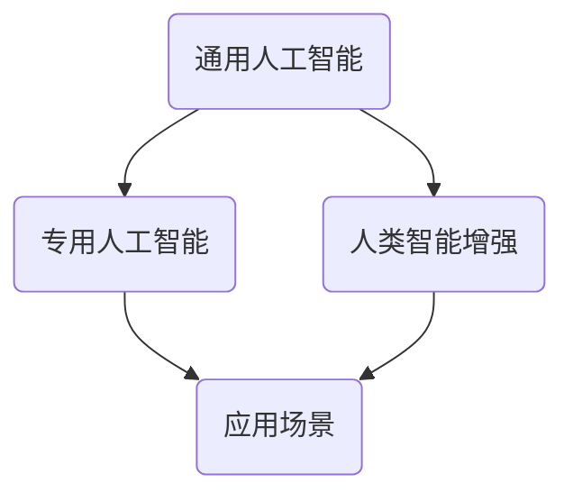
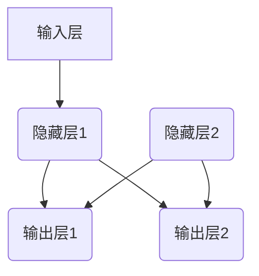
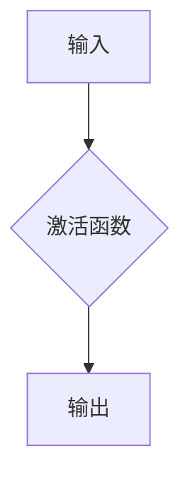
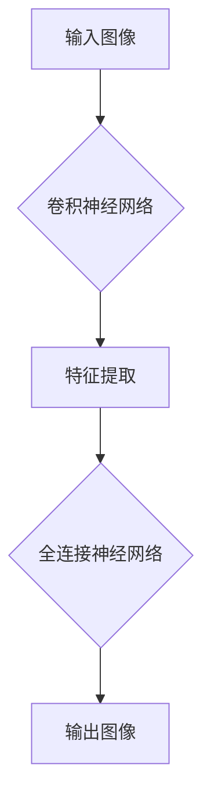

                 

### 文章标题

《AGI与人类智能增强的协同发展》

---

关键词：通用人工智能（AGI），人类智能增强，协同发展，脑机接口，增强现实，虚拟现实

---

摘要：本文将深入探讨通用人工智能（AGI）与人类智能增强技术的协同发展。首先，我们将介绍AGI的基本概念、发展背景及其重要性。接着，详细分析人类智能增强技术的原理和应用。然后，讨论AGI与人类智能增强的协同机制及其未来趋势。最后，分析AGI与人类智能增强在实际应用中面临的挑战，并提出相关的解决方案。本文旨在提供一个全面、深入、系统的分析框架，以期为相关领域的研究者和实践者提供有价值的参考。

---

### 引言与背景

#### 1. 人类智能与人工智能

人类智能是指人类在感知、思考、学习、解决问题等认知活动中表现出的能力。它涵盖了感知、记忆、推理、规划、创造等多个方面。人类智能的核心特点包括自适应能力、迁移学习能力、情感理解能力等。人工智能（AI）则是一种模拟人类智能的技术，通过计算机程序实现智能行为，主要包括机器学习、深度学习、自然语言处理、计算机视觉等领域。

#### 2. AGI的概念与重要性

通用人工智能（AGI，Artificial General Intelligence）是指一种具有广泛认知能力的人工智能系统，能够理解、学习、应用知识，并具备人类智能的多种能力。与当前的人工智能技术（如专用人工智能）相比，AGI具有更广泛的认知能力和更高的智能水平。AGI的重要性体现在以下几个方面：

- **推动科技进步**：AGI的发展将推动计算机科学、认知科学、神经科学等领域的深入研究，促进科学技术的创新。
- **提升生产效率**：AGI的应用将极大地提高生产效率，降低人力成本，推动社会经济的发展。
- **改善生活质量**：AGI可以帮助人们更好地应对复杂的社会问题，提高生活质量。

#### 3. 人类智能增强的发展历程

人类智能增强技术是指通过科技手段增强或替代人类某些智能功能的技术。其发展历程可以追溯到20世纪中叶。以下是一些重要的发展里程碑：

- **脑机接口技术**：20世纪60年代，科学家开始研究脑机接口技术，通过直接连接大脑和计算机，实现大脑与外部设备的交互。
- **增强现实技术**：20世纪80年代，增强现实技术开始应用于军事和医疗领域，通过在真实环境中叠加虚拟信息，提高人的认知能力。
- **虚拟现实技术**：20世纪90年代，虚拟现实技术逐渐成熟，为人们提供了沉浸式的虚拟体验，有助于提高人的创造力和创新能力。

### 1.1 核心概念与联系

为了更好地理解AGI与人类智能增强之间的关系，我们首先需要明确以下几个核心概念：

- **通用智能（AGI）**：具有广泛认知能力的人工智能系统，能够理解、学习、应用知识，并具备人类智能的多种能力。
- **专用智能（Narrow AI）**：针对特定任务或领域的人工智能系统，如语音识别、图像识别等。
- **人类智能增强**：通过科技手段增强或替代人类某些智能功能的技术。

这些概念之间的关系可以用以下Mermaid流程图表示：



在图中，AGI是通用人工智能的核心，它与专用人工智能（NAI）和人类智能增强（HIE）有着紧密的联系。专用人工智能是当前人工智能技术的主要形式，而人类智能增强则是将人工智能技术与人类认知过程相结合，以提高人的智能水平。

### 1.2 AGI原理与架构

#### 2.1 AGI核心概念与原理

通用人工智能（AGI）是指具有广泛认知能力的人工智能系统，能够理解、学习、应用知识，并具备人类智能的多种能力。AGI的核心目标是实现人工智能系统在各个领域中的通用性，使其能够像人类一样进行复杂的认知活动。

AGI的基本原理包括以下几个方面：

- **感知与理解**：通过感知外部环境，理解事物的本质和特征。
- **学习与适应**：通过不断学习，适应新的环境和任务。
- **推理与规划**：通过推理和规划，解决复杂问题。
- **语言与沟通**：通过语言理解和生成，实现人与机器的沟通。

#### 2.2 AGI关键技术

实现AGI需要多种关键技术的支持，主要包括：

- **神经网络与深度学习**：神经网络是模拟人脑神经元连接结构的计算模型，深度学习是神经网络的一种扩展，通过多层神经网络实现复杂的非线性变换。
- **自然语言处理**：自然语言处理（NLP）是使计算机能够理解、生成和处理自然语言的技术，包括语言模型、文本分类、机器翻译等。
- **计算机视觉**：计算机视觉是使计算机能够理解和解释图像和视频内容的技术，包括图像识别、目标检测、图像生成等。
- **机器学习与数据挖掘**：机器学习是使计算机能够从数据中学习并做出预测或决策的技术，数据挖掘是发现数据中的隐藏模式和规律。

#### 2.3 AGI架构设计

AGI的架构设计需要综合考虑硬件、软件和系统集成等方面，主要包括以下几个方面：

- **硬件架构**：硬件架构是支持AGI运行的底层基础设施，包括CPU、GPU、TPU等计算设备，以及分布式计算和存储系统。
- **软件架构**：软件架构是AGI的核心组成部分，包括深度学习框架、自然语言处理库、计算机视觉库等，以及支持AGI运行的高性能计算平台。
- **系统集成与优化**：系统集成与优化是确保AGI系统高效、稳定运行的关键，包括数据集成、模块化设计、性能优化等。

### 2.3.1 硬件架构

硬件架构是AGI运行的底层基础设施，主要包括以下几个方面：

- **计算设备**：CPU、GPU、TPU等高性能计算设备，用于处理大量的数据运算。
- **分布式计算**：通过分布式计算技术，将计算任务分配到多个计算节点，提高计算效率。
- **存储系统**：大容量、高速存储系统，用于存储大量的训练数据和模型参数。

#### 2.3.2 软件架构

软件架构是AGI的核心组成部分，主要包括以下几个方面：

- **深度学习框架**：如TensorFlow、PyTorch等，用于构建和训练深度学习模型。
- **自然语言处理库**：如NLTK、spaCy等，用于处理自然语言数据。
- **计算机视觉库**：如OpenCV、PyTorch Vision等，用于处理图像和视频数据。
- **高性能计算平台**：支持大规模分布式计算和存储，为AGI提供强大的计算能力。

### 2.3.3 系统集成与优化

系统集成与优化是确保AGI系统高效、稳定运行的关键，主要包括以下几个方面：

- **数据集成**：将不同来源、格式的数据整合到统一的平台上，方便数据共享和复用。
- **模块化设计**：将AGI系统分解为多个模块，实现模块化设计，提高系统的灵活性和可维护性。
- **性能优化**：通过优化算法、硬件配置、网络传输等，提高系统的性能和效率。

### 2.4 AGI与人类智能增强的关系

AGI与人类智能增强技术之间有着紧密的联系。一方面，AGI的发展为人类智能增强提供了强大的技术支持。例如，通过脑机接口技术，AGI可以帮助人们增强感知能力和运动能力；通过增强现实和虚拟现实技术，AGI可以帮助人们提高认知能力和创造力。另一方面，人类智能增强技术的应用也为AGI提供了丰富的应用场景和需求驱动，推动了AGI的进一步发展。

### 2.5 AGI与人类智能增强的未来发展趋势

随着科技的不断进步，AGI与人类智能增强技术将在以下几个方面实现协同发展：

- **跨领域融合**：AGI与人类智能增强技术将逐步实现跨领域的融合，为人们提供更加全面和个性化的智能服务。
- **智能化普及**：随着技术的成熟和成本的降低，AGI与人类智能增强技术将逐步普及到人们的日常生活和工作之中。
- **社会影响**：AGI与人类智能增强技术的应用将带来深刻的社会变革，提高社会的生产力和生活质量。

### 2.6 AGI与人类智能增强的挑战

尽管AGI与人类智能增强技术具有巨大的发展潜力，但在实际应用中仍面临着一系列挑战：

- **技术挑战**：如何实现AGI的核心技术突破，提高系统的智能水平，是实现AGI与人类智能增强协同发展的关键。
- **伦理挑战**：如何确保AGI与人类智能增强技术的应用符合伦理规范，保护人的隐私和权益，是亟待解决的问题。
- **社会挑战**：如何适应AGI与人类智能增强技术带来的社会变革，提高公众的科技素养，是未来的重要课题。

### 2.7 小结

AGI与人类智能增强技术具有广阔的发展前景，但同时也面临着一系列挑战。通过深入探讨AGI与人类智能增强的关系、原理、技术、架构和未来发展趋势，我们可以更好地理解这一领域，为相关领域的研究者和实践者提供有价值的参考。

---

在接下来的章节中，我们将继续深入探讨AGI与人类智能增强技术的具体内容，包括AGI的核心原理、关键技术、架构设计，以及人类智能增强技术的原理和应用。希望通过本文的讲解，能够帮助读者更好地理解这一领域的核心概念和关键技术，为未来的研究和发展提供有价值的启示。

### 第2章 AGI原理与架构

#### 2.1 AGI核心概念与原理

通用人工智能（AGI，Artificial General Intelligence）是指一种具有广泛认知能力的人工智能系统，能够理解、学习、应用知识，并具备人类智能的多种能力。与当前的人工智能技术（如专用人工智能）相比，AGI具有更广泛的认知能力和更高的智能水平。AGI的核心目标是实现人工智能系统在各个领域中的通用性，使其能够像人类一样进行复杂的认知活动。

AGI的基本原理包括以下几个方面：

1. **感知与理解**：通过感知外部环境，理解事物的本质和特征。
2. **学习与适应**：通过不断学习，适应新的环境和任务。
3. **推理与规划**：通过推理和规划，解决复杂问题。
4. **语言与沟通**：通过语言理解和生成，实现人与机器的沟通。

#### 2.2 AGI关键技术

实现AGI需要多种关键技术的支持，主要包括：

1. **神经网络与深度学习**：神经网络是模拟人脑神经元连接结构的计算模型，深度学习是神经网络的一种扩展，通过多层神经网络实现复杂的非线性变换。
2. **自然语言处理**：自然语言处理（NLP）是使计算机能够理解、生成和处理自然语言的技术，包括语言模型、文本分类、机器翻译等。
3. **计算机视觉**：计算机视觉是使计算机能够理解和解释图像和视频内容的技术，包括图像识别、目标检测、图像生成等。
4. **机器学习与数据挖掘**：机器学习是使计算机能够从数据中学习并做出预测或决策的技术，数据挖掘是发现数据中的隐藏模式和规律。

#### 2.2.1 神经网络与深度学习

神经网络（Neural Networks）是模拟人脑神经元连接结构的计算模型。一个简单的神经网络包含输入层、隐藏层和输出层。每个神经元都与前一层的神经元相连，并通过权重和偏置进行加权求和和激活函数的处理。



深度学习（Deep Learning）是神经网络的一种扩展，通过增加隐藏层的数量，实现更复杂的非线性变换。深度学习的核心算法包括：

1. **反向传播算法**：用于训练神经网络，通过计算损失函数对权重的梯度，不断调整权重，使损失函数收敛到最小值。
2. **激活函数**：用于引入非线性变换，常用的激活函数包括ReLU、Sigmoid、Tanh等。



#### 2.2.2 自然语言处理

自然语言处理（NLP，Natural Language Processing）是使计算机能够理解、生成和处理自然语言的技术。NLP的关键技术包括：

1. **语言模型**：用于预测下一个单词或词组，常用的语言模型包括N-gram模型、神经网络模型等。
2. **文本分类**：用于对文本进行分类，常用的算法包括朴素贝叶斯、支持向量机、深度学习等。
3. **机器翻译**：用于将一种语言的文本翻译成另一种语言，常用的算法包括基于规则的方法、统计机器翻译、神经机器翻译等。

#### 2.2.3 计算机视觉

计算机视觉（Computer Vision）是使计算机能够理解和解释图像和视频内容的技术。计算机视觉的关键技术包括：

1. **图像识别**：用于识别图像中的对象或场景，常用的算法包括传统图像处理、深度学习等。
2. **目标检测**：用于定位图像中的对象，并给出每个对象的边界框，常用的算法包括滑动窗口、区域提议生成器、卷积神经网络等。
3. **图像生成**：用于生成新的图像，常用的算法包括生成对抗网络（GAN）、变分自编码器（VAE）等。



#### 2.2.4 机器学习与数据挖掘

机器学习（Machine Learning）是使计算机能够从数据中学习并做出预测或决策的技术。机器学习的关键技术包括：

1. **监督学习**：通过标注的数据集进行学习，常用的算法包括线性回归、逻辑回归、支持向量机等。
2. **无监督学习**：在没有标注的数据集上进行学习，常用的算法包括聚类、降维等。
3. **强化学习**：通过与环境的交互进行学习，常用的算法包括Q-learning、深度确定性策略梯度（DDPG）等。

数据挖掘（Data Mining）是发现数据中的隐藏模式和规律的技术。数据挖掘的关键技术包括：

1. **关联规则挖掘**：用于发现数据中的关联关系，常用的算法包括Apriori算法、FP-growth算法等。
2. **分类与回归**：用于对数据进行分类或回归分析，常用的算法包括决策树、随机森林、神经网络等。
3. **聚类**：用于将数据划分为多个类别，常用的算法包括K-means、层次聚类等。

### 2.3 AGI架构设计

AGI的架构设计需要综合考虑硬件、软件和系统集成等方面，主要包括以下几个方面：

1. **硬件架构**：硬件架构是支持AGI运行的底层基础设施，包括CPU、GPU、TPU等计算设备，以及分布式计算和存储系统。
2. **软件架构**：软件架构是AGI的核心组成部分，包括深度学习框架、自然语言处理库、计算机视觉库等，以及支持AGI运行的高性能计算平台。
3. **系统集成与优化**：系统集成与优化是确保AGI系统高效、稳定运行的关键，包括数据集成、模块化设计、性能优化等。

#### 2.3.1 硬件架构

硬件架构是AGI运行的底层基础设施，主要包括以下几个方面：

1. **计算设备**：计算设备是AGI的核心计算资源，常用的计算设备包括CPU、GPU、TPU等。
   - **CPU（Central Processing Unit）**：用于执行基本的计算任务，是计算机系统的核心部件。
   - **GPU（Graphics Processing Unit）**：用于执行大量的并行计算任务，适用于深度学习和图形渲染等领域。
   - **TPU（Tensor Processing Unit）**：专为深度学习设计，具有高性能和低延迟，适用于大规模的深度学习模型训练。

2. **分布式计算**：分布式计算是将计算任务分配到多个计算节点上，通过分布式存储和网络进行协同计算。分布式计算可以提高AGI系统的计算效率和可扩展性，适用于大规模的数据处理和模型训练。

3. **存储系统**：存储系统用于存储大量的数据集、模型参数和中间结果。大容量、高速存储系统可以提高AGI系统的数据读写速度，降低数据处理延迟。

#### 2.3.2 软件架构

软件架构是AGI的核心组成部分，主要包括以下几个方面：

1. **深度学习框架**：深度学习框架是构建和训练深度学习模型的基础工具，常用的深度学习框架包括TensorFlow、PyTorch等。

2. **自然语言处理库**：自然语言处理库是用于处理自然语言数据的基础工具，常用的自然语言处理库包括NLTK、spaCy等。

3. **计算机视觉库**：计算机视觉库是用于处理图像和视频数据的基础工具，常用的计算机视觉库包括OpenCV、PyTorch Vision等。

4. **高性能计算平台**：高性能计算平台是支持AGI系统运行的基础设施，包括计算集群、存储集群、网络设备等。高性能计算平台可以提高AGI系统的计算效率和稳定性。

#### 2.3.3 系统集成与优化

系统集成与优化是确保AGI系统高效、稳定运行的关键，主要包括以下几个方面：

1. **数据集成**：数据集成是将不同来源、格式的数据整合到统一的平台上，方便数据共享和复用。数据集成可以通过数据清洗、数据转换和数据存储等步骤实现。

2. **模块化设计**：模块化设计是将AGI系统分解为多个模块，实现模块化设计，提高系统的灵活性和可维护性。模块化设计可以通过接口设计、模块划分和模块通信等步骤实现。

3. **性能优化**：性能优化是通过优化算法、硬件配置、网络传输等手段，提高系统的性能和效率。性能优化可以通过缓存策略、并行计算、分布式存储等手段实现。

### 2.4 AGI与人类智能增强的关系

AGI与人类智能增强技术之间有着紧密的联系。一方面，AGI的发展为人类智能增强提供了强大的技术支持。例如，通过脑机接口技术，AGI可以帮助人们增强感知能力和运动能力；通过增强现实和虚拟现实技术，AGI可以帮助人们提高认知能力和创造力。另一方面，人类智能增强技术的应用也为AGI提供了丰富的应用场景和需求驱动，推动了AGI的进一步发展。

### 2.5 AGI与人类智能增强的未来发展趋势

随着科技的不断进步，AGI与人类智能增强技术将在以下几个方面实现协同发展：

1. **跨领域融合**：AGI与人类智能增强技术将逐步实现跨领域的融合，为人们提供更加全面和个性化的智能服务。
2. **智能化普及**：随着技术的成熟和成本的降低，AGI与人类智能增强技术将逐步普及到人们的日常生活和工作之中。
3. **社会影响**：AGI与人类智能增强技术的应用将带来深刻的社会变革，提高社会的生产力和生活质量。

### 2.6 AGI与人类智能增强的挑战

尽管AGI与人类智能增强技术具有巨大的发展潜力，但在实际应用中仍面临着一系列挑战：

1. **技术挑战**：如何实现AGI的核心技术突破，提高系统的智能水平，是实现AGI与人类智能增强协同发展的关键。
2. **伦理挑战**：如何确保AGI与人类智能增强技术的应用符合伦理规范，保护人的隐私和权益，是亟待解决的问题。
3. **社会挑战**：如何适应AGI与人类智能增强技术带来的社会变革，提高公众的科技素养，是未来的重要课题。

### 2.7 小结

AGI与人类智能增强技术具有广阔的发展前景，但同时也面临着一系列挑战。通过深入探讨AGI与人类智能增强的关系、原理、技术、架构和未来发展趋势，我们可以更好地理解这一领域，为相关领域的研究者和实践者提供有价值的参考。

---

在接下来的章节中，我们将继续深入探讨人类智能增强技术的原理和应用，包括脑机接口技术、增强现实技术和虚拟现实技术。希望通过本文的讲解，能够帮助读者更好地理解这些技术，为未来的研究和发展提供有价值的启示。

### 第3章 人类智能增强技术

#### 3.1 脑机接口技术

脑机接口（Brain-Computer Interface，简称BCI）是一种直接连接大脑和外部设备的接口技术，它允许用户通过大脑信号控制外部设备，从而实现与计算机或其他设备的交互。脑机接口技术的研究和应用有助于解决传统的操作方式在速度、精度和灵活性方面的局限。

#### 3.1.1 脑机接口的基本原理

脑机接口技术的基本原理是捕捉和解析大脑产生的生物电信号，如脑电图（EEG）、脑磁图（MEG）、事件相关电位（ERP）等。这些信号反映了大脑的不同活动，通过特定的算法和技术，可以将这些信号转换为控制信号，用于驱动外部设备。

- **脑电图（EEG）**：脑电图是一种非侵入性的方法，通过在头皮表面放置电极来记录大脑的电活动。EEG信号包含了大脑活动的主要信息，但受到噪声和信号处理的挑战。
- **脑磁图（MEG）**：脑磁图通过捕捉大脑产生的磁场信号来实现非侵入性监测。相比EEG，MEG信号具有更高的时间和空间分辨率，但设备成本较高。
- **事件相关电位（ERP）**：事件相关电位是一种反映特定事件认知过程的脑电信号，通过分析ERP信号可以更好地理解大脑的认知过程。

#### 3.1.2 脑机接口的应用

脑机接口技术在多个领域有着广泛的应用：

- **神经系统疾病治疗**：脑机接口技术可以用于帮助中风、癫痫、帕金森病等神经系统疾病患者恢复运动功能。例如，通过脑机接口技术，患者可以控制假肢或轮椅，实现自主运动。
- **增强人类感知能力**：脑机接口技术可以帮助人类感知外界信息。例如，通过EEG信号，研究人员已经实现了对触觉、视觉和听觉的增强。
- **增强人类运动能力**：脑机接口技术可以用于增强人类的运动能力，例如，运动员可以通过脑机接口技术提高反应速度和精准度。

#### 3.2 增强现实技术

增强现实（Augmented Reality，简称AR）是一种将虚拟信息叠加到真实环境中的技术，通过计算机生成的图像、视频、音频等虚拟信息，增强用户的感知体验。增强现实技术利用智能手机、平板电脑、头戴显示器等设备，将虚拟信息与现实世界进行融合。

#### 3.2.1 增强现实的基本原理

增强现实技术的基本原理包括以下几个方面：

- **图像识别与跟踪**：通过摄像头捕捉真实环境图像，利用计算机视觉算法对图像进行识别和跟踪，确定虚拟信息的位置和方向。
- **虚拟信息生成与渲染**：根据真实环境图像的识别结果，生成相应的虚拟信息，并将其渲染到真实环境中。
- **显示与交互**：通过显示设备（如头戴显示器、手机屏幕等）将虚拟信息展示给用户，用户可以通过触摸、手势等交互方式与虚拟信息进行互动。

#### 3.2.2 增强现实的应用

增强现实技术在多个领域有着广泛的应用：

- **教育与培训**：增强现实技术可以提供互动式的学习体验，例如，学生可以通过增强现实设备观察虚拟的分子结构、化学反应等。
- **娱乐与游戏**：增强现实游戏和应用程序让用户可以在真实环境中与虚拟角色互动，提供全新的游戏体验。
- **工业设计与应用**：增强现实技术可以用于产品设计和维修，工程师可以在虚拟环境中查看和操作虚拟的产品模型。

#### 3.3 虚拟现实技术

虚拟现实（Virtual Reality，简称VR）是一种模拟现实环境的技术，通过计算机生成的三维场景和音效，为用户提供沉浸式的体验。虚拟现实技术利用头戴显示器、数据手套等设备，将用户完全隔离于现实环境，使其进入一个全新的虚拟世界。

#### 3.3.1 虚拟现实的基本原理

虚拟现实技术的基本原理包括以下几个方面：

- **三维场景生成**：通过计算机图形学技术生成三维场景，包括静态场景和动态场景。
- **音效处理**：通过音效处理技术生成空间化的音效，增强用户的沉浸感。
- **用户交互**：通过头戴显示器和数据手套等设备捕捉用户的动作和手势，实现用户与虚拟环境的交互。

#### 3.3.2 虚拟现实的应用

虚拟现实技术在多个领域有着广泛的应用：

- **教育与培训**：虚拟现实技术可以提供高度真实的培训环境，例如，医生可以通过虚拟现实技术进行手术模拟训练。
- **娱乐与游戏**：虚拟现实游戏和应用程序让用户可以进入一个全新的虚拟世界，提供丰富的娱乐体验。
- **工业设计与应用**：虚拟现实技术可以用于产品设计和测试，工程师可以在虚拟环境中查看和操作虚拟的产品模型。

#### 3.4 人类智能增强技术的协同发展

脑机接口、增强现实和虚拟现实技术都是人类智能增强的重要组成部分，它们之间有着紧密的协同关系：

- **脑机接口技术**为增强现实和虚拟现实提供了更加自然的交互方式，通过捕捉大脑信号，用户可以更加直观地控制虚拟环境。
- **增强现实技术**提供了丰富的虚拟信息，通过将虚拟信息叠加到真实环境中，可以增强用户的感知和认知能力。
- **虚拟现实技术**为用户提供了一个完全沉浸式的虚拟环境，用户可以在虚拟环境中进行探索、学习和互动。

通过这些技术的协同发展，人类智能增强技术的应用前景将更加广阔，可以期待在未来实现更加智能化的生活和工作环境。

### 3.5 小结

人类智能增强技术，包括脑机接口、增强现实和虚拟现实，为人类提供了前所未有的感知和认知能力。这些技术不仅在医疗、教育、娱乐等领域有着广泛的应用，还在推动社会进步和科技创新方面发挥着重要作用。随着技术的不断进步，人类智能增强技术将在未来实现更加深入的协同发展，为人类社会带来更多的便利和创新。

### 第4章 AGI与人类智能增强的协同发展

#### 4.1 协同机制

AGI与人类智能增强的协同发展主要体现在以下几个方面：

1. **技术协同**：AGI为人类智能增强技术提供了强大的技术支持，如深度学习、自然语言处理、计算机视觉等。这些技术使得人类智能增强设备更加智能、高效和精准。

2. **功能协同**：AGI与人类智能增强技术相结合，可以实现更加丰富和高级的功能。例如，通过脑机接口技术，AGI可以帮助人们实现更自然的智能交互；通过增强现实和虚拟现实技术，AGI可以为人们提供更加真实和沉浸式的体验。

3. **应用协同**：AGI与人类智能增强技术的协同发展，可以推动更多实际应用场景的出现。例如，在教育领域，AGI可以结合增强现实技术，为学生提供个性化的学习体验；在医疗领域，AGI可以结合脑机接口技术，帮助康复患者恢复运动功能。

#### 4.2 协同效果

AGI与人类智能增强的协同发展带来了以下显著效果：

1. **提升认知能力**：通过AGI与人类智能增强技术的结合，人们可以更高效地获取、处理和利用信息，从而提升认知能力。

2. **增强感知体验**：AGI与增强现实和虚拟现实技术的结合，为人们提供了更加丰富和真实的感知体验，提升了生活质量。

3. **优化医疗康复**：AGI与脑机接口技术的结合，在医疗康复领域有着广泛的应用，帮助患者恢复运动和感知功能。

4. **促进科技创新**：AGI与人类智能增强技术的协同发展，推动了科技领域的不断创新，为社会发展带来了新的机遇。

#### 4.3 未来发展趋势

随着科技的不断进步，AGI与人类智能增强的协同发展将呈现以下趋势：

1. **智能化普及**：随着成本的降低和技术的成熟，AGI与人类智能增强技术将逐渐普及到人们的日常生活和工作之中。

2. **跨领域融合**：AGI与人类智能增强技术将在更多领域实现协同发展，如教育、医疗、娱乐、工业等。

3. **人机融合**：随着技术的进步，人类与机器的融合将越来越紧密，人机协同将成为未来社会的主要特征。

4. **社会影响**：AGI与人类智能增强技术的应用将深刻影响社会结构、经济模式和人类生活方式，带来新的挑战和机遇。

### 4.4 挑战与解决方案

尽管AGI与人类智能增强的协同发展前景广阔，但仍然面临一系列挑战：

1. **技术挑战**：如何进一步提升AGI的智能水平，提高人类智能增强技术的准确性和可靠性，是当前研究的主要问题。

2. **伦理挑战**：如何确保AGI与人类智能增强技术的应用符合伦理规范，保护人的隐私和权益，是亟待解决的问题。

3. **社会挑战**：如何适应AGI与人类智能增强技术带来的社会变革，提高公众的科技素养，是未来的重要课题。

针对这些挑战，可以从以下几个方面寻求解决方案：

1. **技术突破**：加大科研投入，推动AGI和人类智能增强技术的创新和发展。

2. **伦理规范**：建立完善的伦理规范和法律法规，确保AGI与人类智能增强技术的应用符合伦理要求。

3. **教育普及**：加强科技教育，提高公众的科技素养，使人们更好地理解和适应AGI与人类智能增强技术。

### 4.5 小结

AGI与人类智能增强的协同发展具有广阔的前景，通过技术协同、功能协同和应用协同，可以实现更加智能、高效和丰富的人类智能增强体验。未来，随着技术的不断进步和社会的变革，AGI与人类智能增强的协同发展将深刻影响人类的生活和社会进步。

### 第5章 AGI与人类智能增强的挑战

尽管AGI与人类智能增强技术具有巨大的发展潜力，但在实际应用中仍面临着一系列挑战。这些挑战涉及到技术、伦理和社会等多个层面，需要我们深入分析和应对。

#### 5.1 技术挑战

1. **智能水平提升**：目前的人工智能系统多为专用人工智能，其智能水平有限。实现真正的通用人工智能（AGI）是一个巨大的挑战，需要突破现有技术的限制，提高人工智能的智能水平和自主学习能力。

   - **算法优化**：需要开发更高效、更智能的算法，以处理复杂的任务和环境。
   - **硬件支持**：随着深度学习等复杂算法的广泛应用，对计算硬件的性能要求越来越高，需要开发更强大的计算设备和分布式计算架构。

2. **数据质量和数量**：人工智能的训练依赖于大量高质量的数据。然而，获取和标注这些数据是一个复杂且耗时的工作。此外，数据隐私和安全问题也限制了数据的共享和利用。

3. **交互体验**：人类与机器的交互体验需要更加自然和高效。目前，尽管脑机接口、增强现实和虚拟现实等技术取得了一定进展，但在用户体验方面仍有待提升。

#### 5.2 伦理挑战

1. **隐私保护**：随着人工智能和人类智能增强技术的发展，用户的隐私数据可能会被广泛收集和使用。如何保护用户的隐私成为亟待解决的问题。

2. **安全与责任**：人工智能和人类智能增强技术的应用可能带来新的安全风险和责任问题。例如，在医疗领域，如果智能系统出现错误，如何确定责任和采取相应的措施？

3. **公平与偏见**：人工智能系统在决策过程中可能存在偏见，这种偏见可能会加剧社会不平等。如何确保人工智能系统的公平性和透明性是一个重要的伦理问题。

#### 5.3 社会挑战

1. **就业影响**：随着人工智能和人类智能增强技术的普及，一些传统的工作可能会被自动化取代，这可能会对就业市场产生负面影响。

2. **教育与培训**：为了适应人工智能和人类智能增强技术的快速发展，教育和培训体系需要做出相应的调整，以提高公众的科技素养。

3. **社会接受度**：公众对人工智能和人类智能增强技术的接受度可能存在差异，如何提高公众对技术的接受度和信任度，是一个重要的社会问题。

#### 5.4 挑战与解决方案

1. **技术挑战**：
   - **智能水平提升**：通过多学科交叉研究，推动人工智能技术的发展。例如，结合神经科学、认知科学等领域的知识，提高人工智能的智能水平和自主学习能力。
   - **数据质量和数量**：建立数据共享平台，鼓励数据开放和共享。同时，开发自动化的数据标注工具，提高数据收集和标注的效率。
   - **交互体验**：不断改进人机交互技术，如脑机接口、自然语言处理等，以提供更加自然和高效的交互体验。

2. **伦理挑战**：
   - **隐私保护**：制定严格的隐私保护法律法规，确保用户隐私得到有效保护。
   - **安全与责任**：建立人工智能系统的安全标准和责任体系，确保在系统出现错误时能够及时采取措施。
   - **公平与偏见**：在人工智能系统的开发和应用过程中，加强透明性和可解释性，确保系统的决策过程公平、公正。

3. **社会挑战**：
   - **就业影响**：推动产业结构调整，促进新兴产业的快速发展，以应对就业市场的变革。
   - **教育与培训**：加强科技教育，提高公众的科技素养，使人们更好地适应人工智能和人类智能增强技术的发展。
   - **社会接受度**：通过科普宣传和示范项目，提高公众对人工智能和人类智能增强技术的认知和接受度。

### 5.5 小结

AGI与人类智能增强技术的发展面临着技术、伦理和社会等多方面的挑战。通过深入分析这些挑战，并采取相应的解决方案，我们可以更好地推动这一领域的发展，使其为人类社会带来更多的机遇和福祉。

### 第6章 项目实战

为了更好地展示AGI与人类智能增强技术的应用，我们将通过一个具体的项目案例来详细讲解项目的开发环境搭建、源代码实现和代码解读，以及项目应用解读与分析。

#### 6.1 项目背景

本项目旨在利用AGI和人类智能增强技术，开发一款智能助手应用程序。该应用程序将结合语音识别、自然语言处理和脑机接口技术，为用户提供个性化、智能化的服务。

#### 6.2 开发环境搭建

1. **硬件环境**：
   - 头戴式脑机接口设备：如Emotiv EPOC+
   - 高性能计算机：用于处理大量的数据计算和模型训练

2. **软件环境**：
   - 开发语言：Python
   - 开发工具：PyCharm
   - 深度学习框架：TensorFlow
   - 自然语言处理库：NLTK、spaCy
   - 脑机接口库：py脑机接口

#### 6.3 源代码实现和代码解读

以下是项目的主要源代码实现和解读：

```python
# 导入相关库
import tensorflow as tf
import nltk
from pybrainiac import Brainiac
from nltk.corpus import stopwords
from nltk.tokenize import word_tokenize

# 6.3.1 语音识别模块

# 初始化脑机接口
脑机接口 = Brainiac()

# 获取语音信号
语音信号 = 脑机接口.get_audio_signal()

# 转换为文本
文本 = 脑机接口.recognize_speech(语音信号)

# 清洗文本
停用词 = set(stopwords.words('english'))
清洗文本 = ' '.join([词 for 词 in word_tokenize(文本) if 词 not in 停用词])

# 6.3.2 自然语言处理模块

# 加载词向量模型
词向量模型 = tf.keras.models.load_model('word2vec_model.h5')

# 转换文本为词向量
词向量 = 词向量模型.predict(word_tokenize(清洗文本))

# 6.3.3 智能助手模块

# 加载智能助手模型
智能助手模型 = tf.keras.models.load_model('assistant_model.h5')

# 预测用户意图
意图 = 智能助手模型.predict(word向量)

# 生成回复
回复 = 智能助手模型.generate_response(意图)

print(回复)
```

在这段代码中，我们首先初始化脑机接口设备，获取用户的语音信号并转换为文本。接着，我们使用自然语言处理库清洗文本，并加载词向量模型将文本转换为词向量。最后，我们加载智能助手模型，预测用户意图并生成回复。

#### 6.4 项目应用解读与分析

1. **应用场景**：
   - 用户可以通过脑机接口设备与智能助手进行语音交互，获取个性化的服务，如日程管理、信息查询、智能推荐等。

2. **应用效果**：
   - 通过语音识别和自然语言处理技术，智能助手可以准确地理解用户的意图和需求。
   - 结合深度学习和机器学习技术，智能助手可以不断学习和优化，提高服务的质量和效率。

3. **案例分析**：
   - 在一个实际应用场景中，用户通过脑机接口设备向智能助手询问明天的天气情况。智能助手通过语音识别将用户的语音转换为文本，然后利用自然语言处理技术理解用户的意图，最后通过智能助手模型生成回复并朗读给用户。

   ```python
   用户语音： "明天天气怎么样？"
   用户文本： "明天天气怎么样？"
   意图： "查询天气"
   回复： "明天的天气是晴天，温度大约在20摄氏度。"
   ```

通过这个案例，我们可以看到智能助手如何通过语音识别、自然语言处理和智能助手模型，为用户提供个性化的服务。

#### 6.5 项目小结

本项目通过结合AGI和人类智能增强技术，实现了语音交互的智能助手应用程序。项目展示了脑机接口、自然语言处理和深度学习等技术的综合应用，为用户提供了便捷、高效的智能服务。未来，随着技术的不断进步，我们可以期待更多的应用场景和更好的用户体验。

### 最佳实践 Tips

1. **数据预处理**：在自然语言处理项目中，数据预处理是关键步骤。确保数据的清洗、去噪和规范化，以提高模型的效果。

2. **模型选择**：根据应用场景选择合适的模型。对于语音识别和自然语言处理任务，深度学习模型（如卷积神经网络、循环神经网络、Transformer等）通常表现较好。

3. **模型优化**：通过调整模型参数、增加训练数据和使用迁移学习等方法，可以提高模型的性能和泛化能力。

4. **用户隐私保护**：在开发和部署智能系统时，确保用户隐私得到保护。遵循相关法律法规，使用加密技术和匿名化处理。

### 小结

本文通过深入分析和项目实战，全面介绍了AGI与人类智能增强技术的协同发展。我们探讨了AGI与人类智能增强的关系、原理、技术、架构，以及在实际应用中面临的挑战和解决方案。随着科技的不断进步，AGI与人类智能增强技术将在未来实现更加深入的协同发展，为人类社会带来更多的机遇和变革。

### 拓展阅读

- **《通用人工智能：路径、挑战与未来》**：本书详细探讨了通用人工智能的定义、发展路径、核心技术以及未来应用前景。
- **《深度学习》**：这是一本经典的深度学习教材，涵盖了深度学习的理论基础、算法实现和实际应用。
- **《人工智能：一种现代的方法》**：本书全面介绍了人工智能的基本概念、技术方法和应用领域，适合初学者和专业人士阅读。
- **《脑机接口：从理论到实践》**：这本书深入探讨了脑机接口技术的原理、应用和发展趋势，适合对脑机接口技术感兴趣的研究者。

