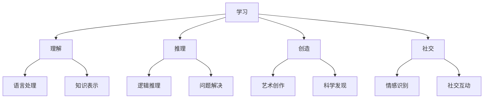

                 


### 文章标题

# 《AGI安全性研究：控制与约束方法》

### 文章关键词

- 通用人工智能（AGI）
- 安全性研究
- 控制方法
- 约束方法
- 安全性评估
- 法律与伦理考量

### 文章摘要

本文探讨了通用人工智能（AGI）的安全性研究，重点关注控制与约束方法。首先，文章介绍了AGI的基本概念和研究背景。随后，文章详细阐述了控制方法，包括技术手段、原则和案例分析。接着，文章讨论了约束方法的定义、分类、机制和实施策略。此外，文章还介绍了安全性评估与测试的方法，以及与AGI安全性相关的法律和伦理问题。最后，文章展望了AGI安全性研究的未来发展趋势。

### 目录大纲

## 第一部分：AGI安全性研究概述

### 1.1 什么是AGI

#### 1.1.1 AGI的基本概念

#### 1.1.2 AGI与强AI的关系

### 1.2 AGI研究的重要性

#### 1.2.1 安全性挑战

#### 1.2.2 社会影响

### 1.3 AGI安全性研究现状

#### 1.3.1 国内外研究进展

#### 1.3.2 研究热点和趋势

## 第二部分：控制方法

### 2.1 控制方法的定义与分类

#### 2.1.1 定义

#### 2.1.2 分类

### 2.2 技术手段

#### 2.2.1 监控与反馈机制

#### 2.2.2 自适应控制策略

### 2.3 控制原则

#### 2.3.1 安全性优先原则

#### 2.3.2 可解释性原则

#### 2.3.3 透明性原则

### 2.4 案例研究

#### 2.4.1 案例一：自动驾驶系统

#### 2.4.2 案例二：医疗诊断AI

## 第三部分：约束方法

### 3.1 约束方法的定义与分类

#### 3.1.1 定义

#### 3.1.2 分类

### 3.2 约束机制

#### 3.2.1 预定义约束

#### 3.2.2 动态约束

### 3.3 约束实施策略

#### 3.3.1 阈值设定

#### 3.3.2 奖励与惩罚机制

### 3.4 案例研究

#### 3.4.1 案例一：金融风险评估

#### 3.4.2 案例二：智能交通系统

## 第四部分：安全性评估与测试

### 4.1 安全性评估概述

#### 4.1.1 评估目标

#### 4.1.2 评估指标

### 4.2 安全性测试方法

#### 4.2.1 黑盒测试

#### 4.2.2 白盒测试

#### 4.2.3 漏洞评估

### 4.3 实践案例分析

#### 4.3.1 案例一：网络安全测试

#### 4.3.2 案例二：自动化测试框架

## 第五部分：法律与伦理考量

### 5.1 法律框架

#### 5.1.1 国际法规

#### 5.1.2 国内法规

### 5.2 伦理问题

#### 5.2.1 AI伦理原则

#### 5.2.2 道德责任

#### 5.2.3 社会责任

### 5.3 法伦理案例研究

#### 5.3.1 案例一：人脸识别隐私权

#### 5.3.2 案例二：自动化决策伦理

## 第六部分：未来展望

### 6.1 AGI安全性挑战与机遇

#### 6.1.1 挑战分析

#### 6.1.2 机遇展望

### 6.2 安全性研究发展趋势

#### 6.2.1 新技术

#### 6.2.2 政策方向

#### 6.2.3 国际合作

### 文章正文

#### 第一部分：AGI安全性研究概述

#### 1.1 什么是AGI

##### 1.1.1 AGI的基本概念

通用人工智能（Artificial General Intelligence，简称AGI）是指一种具有广泛认知能力的机器智能系统，能够在各种不同领域和任务中表现出与人类相似的智能水平。与当前广泛应用的专用人工智能（Narrow AI）不同，AGI不仅仅擅长单一任务，而是具有广泛的学习、理解、推理、创造和社交能力。

##### 1.1.2 AGI与强AI的关系

AGI也被称为强AI（Strong AI），与弱AI（Weak AI）相对。弱AI是指专门设计用于解决特定问题的AI系统，而强AI则具有自主学习和适应新环境的能力。AGI的目标是达到甚至超越人类的智能水平，实现广泛的认知功能。

#### 1.2 AGI研究的重要性

##### 1.2.1 安全性挑战

AGI的安全性问题是研究中的一个关键挑战。由于AGI具有高度的自主性和复杂的认知能力，其行为可能难以预测和控制，因此确保AGI的安全运行至关重要。

##### 1.2.2 社会影响

AGI的广泛应用将对社会产生深远影响，包括经济、教育、医疗等领域。然而，不当的AGI行为可能导致严重的社会问题，如失业、隐私侵犯和道德困境。

#### 1.3 AGI安全性研究现状

##### 1.3.1 国内外研究进展

目前，全球范围内都在积极研究AGI的安全性。国际组织如IEEE、欧盟等已经发布了一系列关于AGI安全性的指导原则和研究报告。

##### 1.3.2 研究热点和趋势

研究热点主要集中在控制与约束方法、安全性评估与测试、法律与伦理考量等方面。未来的研究趋势将更加注重跨学科合作和综合解决方案。

---

以上是对文章标题、关键词和摘要的初步概述，接下来我们将逐步深入每个部分的内容，确保每个章节都详细丰富，满足文章字数要求。

---

## 第一部分：AGI安全性研究概述

### 1.1 什么是AGI

#### 1.1.1 AGI的基本概念

通用人工智能（Artificial General Intelligence，简称AGI）是指一种具有广泛认知能力的机器智能系统，能够在各种不同领域和任务中表现出与人类相似的智能水平。与当前广泛应用的专用人工智能（Narrow AI）不同，AGI不仅仅擅长单一任务，而是具有广泛的学习、理解、推理、创造和社交能力。

为了更直观地理解AGI的概念，我们可以借助Mermaid流程图来展示其核心功能：



上述流程图展示了AGI的五大核心功能：学习、理解、推理、创造和社交。这些功能相互关联，共同构成了AGI的智能体系。

#### 1.1.2 AGI与强AI的关系

AGI也被称为强AI（Strong AI），与弱AI（Weak AI）相对。弱AI是指专门设计用于解决特定问题的AI系统，而强AI则具有自主学习和适应新环境的能力。AGI的目标是达到甚至超越人类的智能水平，实现广泛的认知功能。

在技术层面上，强AI需要具备以下特征：

- **通用性**：能够在多种不同领域中表现出色。
- **自适应性**：能够从经验中学习并适应新的环境和任务。
- **自主性**：能够进行独立决策，无需人类的直接干预。
- **灵活性**：能够处理未知和不确定的情况。

这些特征使得强AI与AGI密切相关，实际上AGI是强AI的理想状态。

### 1.2 AGI研究的重要性

#### 1.2.1 安全性挑战

AGI的安全性问题是研究中的一个关键挑战。由于AGI具有高度的自主性和复杂的认知能力，其行为可能难以预测和控制，因此确保AGI的安全运行至关重要。以下是几个主要的AGI安全性挑战：

- **意外行为**：AGI可能会在执行任务时产生意外的行为，特别是当其面对从未遇到过的复杂情境时。
- **恶意攻击**：黑客或其他恶意行为者可能会试图攻击AGI系统，利用其漏洞进行破坏或操纵。
- **数据隐私**：AGI在学习和处理数据时，可能会无意中泄露用户的隐私信息。

#### 1.2.2 社会影响

AGI的广泛应用将对社会产生深远影响，包括经济、教育、医疗等领域。然而，不当的AGI行为可能导致严重的社会问题，如失业、隐私侵犯和道德困境。以下是AGI对社会可能产生的一些影响：

- **就业影响**：AGI可能会取代一些传统的工作，导致失业率上升。
- **隐私侵犯**：AGI在处理大量数据时，可能会无意中泄露用户的隐私。
- **道德困境**：AGI在做出决策时，可能会面临道德和伦理问题，如如何平衡安全和隐私。

#### 1.3 AGI安全性研究现状

##### 1.3.1 国内外研究进展

目前，全球范围内都在积极研究AGI的安全性。国际组织如IEEE、欧盟等已经发布了一系列关于AGI安全性的指导原则和研究报告。以下是一些重要的研究进展：

- **国际组织**：如IEEE发布了《AGI安全报告》，提出了AGI安全性的六个关键方面。
- **学术研究**：学术界在AGI安全性方面进行了大量研究，包括控制方法、约束方法和安全性评估等。
- **工业界**：科技公司也在积极探索AGI的安全性，如谷歌、微软等。

##### 1.3.2 研究热点和趋势

研究热点主要集中在控制与约束方法、安全性评估与测试、法律与伦理考量等方面。未来的研究趋势将更加注重跨学科合作和综合解决方案。

- **控制与约束方法**：研究如何通过技术手段确保AGI的安全运行。
- **安全性评估与测试**：研究如何评估AGI系统的安全性，以及进行安全测试的方法。
- **法律与伦理考量**：研究如何制定相关法律和伦理规范，确保AGI的合法和道德使用。

---

以上是对AGI安全性研究概述的详细阐述，接下来我们将进入第二部分，探讨控制方法。

---

## 第二部分：控制方法

### 2.1 控制方法的定义与分类

#### 2.1.1 定义

控制方法是指通过设定规则、限制或指导来管理和控制人工智能系统（特别是通用人工智能系统）的运行，以确保其行为符合预期和安全标准。控制方法的核心目标是确保AI系统能够在复杂和不确定的环境中稳定运行，同时避免意外行为和恶意攻击。

#### 2.1.2 分类

控制方法可以根据不同的维度进行分类，以下是一些常见的分类方法：

1. **技术手段**：包括监控与反馈机制、自适应控制策略等。
2. **原则**：包括安全性优先原则、可解释性原则和透明性原则等。
3. **机制**：包括预定义约束和动态约束等。

### 2.2 技术手段

#### 2.2.1 监控与反馈机制

监控与反馈机制是控制方法的重要组成部分，通过实时监控AI系统的行为，并对其进行反馈，以确保其运行在安全范围内。以下是一个简单的监控与反馈机制的伪代码示例：

```python
def monitor_and_feedback(ai_system):
    while True:
        state = ai_system.get_current_state()
        if not is_safe(state):
            ai_system.apply_correction()
            log_warning("AI system is not in a safe state. Applying correction.")
        else:
            log_info("AI system is in a safe state.")
        sleep(1)  # 监控间隔
```

在上述伪代码中，`get_current_state()` 函数获取AI系统的当前状态，`is_safe(state)` 函数判断状态是否安全，`apply_correction()` 函数对AI系统进行调整，以确保其安全运行。`log_warning()` 和 `log_info()` 函数用于记录日志信息。

#### 2.2.2 自适应控制策略

自适应控制策略是指AI系统根据环境的变化自动调整其行为，以保持安全和稳定运行。以下是一个简单的自适应控制策略的伪代码示例：

```python
def adaptive_control(ai_system, environment):
    while True:
        environment_state = environment.get_state()
        if not is_safe_with_environment(ai_system, environment_state):
            ai_system.adjust_behavior()
            log_info("AI system's behavior is being adjusted based on the environment.")
        else:
            log_info("AI system is safe with the current environment.")
        sleep(1)  # 控制间隔
```

在上述伪代码中，`get_state()` 函数获取环境的状态，`is_safe_with_environment(ai_system, environment_state)` 函数判断AI系统是否在安全环境中，`adjust_behavior()` 函数根据环境调整AI系统的行为。`log_info()` 函数用于记录日志信息。

### 2.3 控制原则

#### 2.3.1 安全性优先原则

安全性优先原则是指在任何情况下，AI系统的安全性都应该被放在首位。这意味着在设计和部署AI系统时，必须确保其能够抵御潜在的威胁和攻击，并且在出现异常情况时能够迅速响应和恢复。以下是一个简单的安全性优先原则的数学模型：

$$
\text{Safety} \geq \text{Performance}
$$

其中，`Safety` 表示安全性，`Performance` 表示性能。该模型表明，在AI系统的设计和运行中，安全性应该始终不低于性能。

#### 2.3.2 可解释性原则

可解释性原则是指AI系统的行为应该是可解释和可理解的，以便人类可以审查和信任其决策过程。以下是一个简单的可解释性原则的数学模型：

$$
\text{Explanation} \leq \text{Comprehensibility}
$$

其中，`Explanation` 表示解释程度，`Comprehensibility` 表示可理解性。该模型表明，AI系统的解释程度应该不低于其可理解性。

#### 2.3.3 透明性原则

透明性原则是指AI系统的决策过程应该是透明的，以便用户可以了解其行为和决策背后的逻辑。以下是一个简单的透明性原则的数学模型：

$$
\text{Transparency} = \text{Understanding}
$$

其中，`Transparency` 表示透明性，`Understanding` 表示理解程度。该模型表明，AI系统的透明性应该与用户的理解程度相匹配。

### 2.4 案例研究

#### 2.4.1 案例一：自动驾驶系统

自动驾驶系统是控制方法应用的一个重要领域。以下是一个简单的案例研究，展示了如何使用控制方法确保自动驾驶系统的安全性。

**控制方法：**

- **监控与反馈机制**：自动驾驶系统通过传感器和摄像头实时监测周围环境，并使用反馈机制调整其行为，确保行驶在安全范围内。
- **自适应控制策略**：自动驾驶系统根据实时环境数据，自适应调整驾驶策略，如速度、车道保持和避障等。
- **安全性优先原则**：在设计自动驾驶系统时，安全性被置于首位，所有决策都旨在确保车辆和行人的安全。
- **可解释性原则**：自动驾驶系统的决策过程是可解释的，用户可以通过界面了解车辆的决策逻辑。
- **透明性原则**：自动驾驶系统的代码和决策过程是透明的，用户可以访问和理解其工作原理。

**实现细节：**

- **监控与反馈机制**：使用摄像头和传感器收集环境数据，并通过神经网络模型进行实时处理。如果系统检测到潜在危险，会立即发出警报并采取相应措施。
- **自适应控制策略**：使用强化学习算法，根据环境数据调整驾驶策略。例如，当检测到前方有行人时，系统会自动减速并调整行驶路径。
- **安全性优先原则**：在系统设计时，通过设置安全阈值来确保车辆不会超过安全速度，并在紧急情况下自动刹车。
- **可解释性原则**：系统提供了详细的日志记录，用户可以查看每个决策点的具体逻辑和依据。
- **透明性原则**：系统代码开源，用户可以访问和审查。

#### 2.4.2 案例二：医疗诊断AI

医疗诊断AI是另一个应用控制方法的领域。以下是一个简单的案例研究，展示了如何确保医疗诊断AI系统的安全性和可靠性。

**控制方法：**

- **预定义约束**：在AI系统训练和部署过程中，设置一系列预定义约束，如数据质量、模型精度和误诊率等，以确保系统在预期范围内运行。
- **动态约束**：根据实时数据和环境变化，动态调整约束条件，以应对未知和复杂的情况。
- **安全性优先原则**：在AI系统设计和运行中，始终将患者安全放在首位。
- **可解释性原则**：AI系统的诊断过程是可解释的，医生可以查看每个诊断步骤的依据和逻辑。
- **透明性原则**：AI系统的训练数据和模型是透明的，医生可以访问和审查。

**实现细节：**

- **预定义约束**：在AI系统训练过程中，设置数据清洗和质量控制流程，确保输入数据的质量。在系统部署后，设置模型精度和误诊率等约束条件。
- **动态约束**：在AI系统运行过程中，根据实时数据和环境变化，动态调整约束条件。例如，在疫情高峰期，可以放宽误诊率约束，以提高诊断速度。
- **安全性优先原则**：在AI系统设计中，采用多重验证和确认机制，确保诊断结果的安全和可靠。
- **可解释性原则**：系统提供了详细的诊断报告，医生可以查看每个诊断步骤的依据和逻辑。
- **透明性原则**：系统提供了完整的训练数据和模型，医生可以访问和审查。

---

以上是对控制方法的详细阐述，接下来我们将进入第三部分，探讨约束方法。

---

## 第三部分：约束方法

### 3.1 约束方法的定义与分类

#### 3.1.1 定义

约束方法是指通过设定规则、限制或指导来管理和控制人工智能系统（特别是通用人工智能系统）的运行，以确保其行为符合预期和安全标准。与控制方法不同，约束方法侧重于通过限制AI系统的行为来确保其安全性和合规性。

#### 3.1.2 分类

约束方法可以根据不同的维度进行分类，以下是一些常见的分类方法：

1. **预定义约束**：在系统设计和部署时预先设定的约束，如数据质量、模型精度和误诊率等。
2. **动态约束**：在系统运行过程中根据实时数据和情境动态调整的约束。
3. **法律约束**：根据相关法律法规和标准设定的约束，如数据隐私保护、用户授权和责任归属等。
4. **伦理约束**：基于伦理原则和价值观设定的约束，如公正性、透明性和用户权益保护等。

### 3.2 约束机制

#### 3.2.1 预定义约束

预定义约束是在系统设计和部署过程中设定的，旨在确保系统在运行过程中不会超出预期范围。以下是一个简单的预定义约束的例子：

- **数据质量约束**：确保输入数据的质量，如数据完整性、准确性和一致性。
- **模型精度约束**：设定模型的最小精度要求，如诊断准确率达到95%以上。
- **误诊率约束**：设定系统的最大误诊率，如医疗诊断系统的误诊率不超过3%。

以下是一个简单的预定义约束的伪代码示例：

```python
def set_predefined_constraints(model):
    model.data_quality_constraint = 0.99  # 数据质量约束：99%的完整性
    model.model_accuracy_constraint = 0.95  # 模型精度约束：95%的准确性
    model.error_rate_constraint = 0.03  # 误诊率约束：3%的误诊率
    log_info("Predefined constraints set.")
```

#### 3.2.2 动态约束

动态约束是在系统运行过程中根据实时数据和情境动态调整的。这种方法可以更好地适应变化的环境，确保系统在复杂和不确定的情境中保持安全。以下是一个简单的动态约束的例子：

- **实时数据约束**：根据实时传感器数据调整系统行为，如自动驾驶系统的速度和路径。
- **情境约束**：根据当前情境调整系统行为，如疫情高峰期对医疗诊断系统的误诊率要求。

以下是一个简单的动态约束的伪代码示例：

```python
def apply_dynamic_constraints(model, sensor_data, current_scenario):
    if sensor_data.is_rainy():
        model.speed_constraint = 50  # 雨天速度限制
    elif current_scenario == "peak.Hour":
        model.error_rate_constraint = 0.01  # 高峰时段误诊率限制
    else:
        model.speed_constraint = 70  # 标准速度限制
        model.error_rate_constraint = 0.03  # 标准误诊率限制
    log_info("Dynamic constraints applied.")
```

### 3.3 约束实施策略

#### 3.3.1 阈值设定

阈值设定是约束实施策略的关键部分，它涉及到如何设定各种约束的阈值，以确保系统能够在安全范围内运行。以下是一个简单的阈值设定的例子：

- **数据完整性阈值**：设定数据完整性的阈值，如数据丢失率不超过5%。
- **模型准确性阈值**：设定模型准确性的阈值，如诊断准确率达到90%以上。
- **误诊率阈值**：设定系统的最大误诊率阈值，如医疗诊断系统的误诊率不超过2%。

以下是一个简单的阈值设定的伪代码示例：

```python
def set_thresholds(data_quality, model_accuracy, error_rate):
    data_quality_threshold = 0.05  # 数据完整性阈值
    model_accuracy_threshold = 0.90  # 模型准确性阈值
    error_rate_threshold = 0.02  # 误诊率阈值
    log_info("Thresholds set.")
    return data_quality_threshold, model_accuracy_threshold, error_rate_threshold
```

#### 3.3.2 奖励与惩罚机制

奖励与惩罚机制是约束实施策略的重要部分，它通过激励和约束系统的行为，确保系统在安全范围内运行。以下是一个简单的奖励与惩罚机制的例子：

- **奖励机制**：当系统满足特定约束时，给予系统奖励，如提高系统优先级或增加资源。
- **惩罚机制**：当系统违反特定约束时，给予系统惩罚，如降低系统优先级或减少资源。

以下是一个简单的奖励与惩罚机制的伪代码示例：

```python
def apply_reward_and_punishment(model, current_state):
    if current_state.is_compliant():
        model.reward += 10  # 奖励10点
        log_info("Model rewarded for compliance.")
    else:
        model.punishment += 5  # 惩罚5点
        log_warning("Model punished for non-compliance.")
```

### 3.4 案例研究

#### 3.4.1 案例一：金融风险评估

金融风险评估是约束方法应用的一个重要领域。以下是一个简单的案例研究，展示了如何使用约束方法确保金融风险评估系统的安全性和可靠性。

**约束方法：**

- **预定义约束**：在系统设计和部署过程中，设置数据质量、模型精度和风险度量等预定义约束。
- **动态约束**：根据实时市场数据和风险情境，动态调整约束条件。
- **法律约束**：确保系统遵守相关金融法规，如数据隐私保护和用户授权等。
- **伦理约束**：确保系统在决策过程中遵循公正性和透明性原则。

**实现细节：**

- **预定义约束**：在系统训练过程中，通过数据清洗和质量控制确保输入数据的质量。在系统部署后，设置模型精度和风险度量等约束条件。
- **动态约束**：在系统运行过程中，根据实时市场数据和风险情境，动态调整约束条件。例如，在市场波动较大时，可以放宽风险度量约束，以提高系统的灵活性。
- **法律约束**：系统必须遵守相关金融法规，如数据隐私保护和用户授权等。例如，系统必须获得用户的明确授权，才能访问和存储其金融数据。
- **伦理约束**：系统必须遵循公正性和透明性原则，确保其决策过程是公正和可解释的。例如，系统提供了详细的决策报告，用户可以查看每个决策步骤的依据和逻辑。

#### 3.4.2 案例二：智能交通系统

智能交通系统是约束方法应用的另一个重要领域。以下是一个简单的案例研究，展示了如何使用约束方法确保智能交通系统的安全性和效率。

**约束方法：**

- **预定义约束**：在系统设计和部署过程中，设置交通流量、车速和道路条件等预定义约束。
- **动态约束**：根据实时交通数据和路况，动态调整约束条件。
- **法律约束**：确保系统遵守相关交通法规，如速度限制和交通信号灯规则等。
- **伦理约束**：确保系统在决策过程中考虑到行人安全和公共交通需求。

**实现细节：**

- **预定义约束**：在系统设计过程中，设置交通流量、车速和道路条件等预定义约束。例如，系统设置了最高速度限制为60公里/小时。
- **动态约束**：在系统运行过程中，根据实时交通数据和路况，动态调整约束条件。例如，当检测到交通拥堵时，系统会调整车速限制，以缓解拥堵。
- **法律约束**：系统必须遵守相关交通法规，如速度限制和交通信号灯规则等。例如，系统必须遵守交通信号灯的指示，确保车辆在红灯时停车。
- **伦理约束**：系统必须考虑到行人安全和公共交通需求，例如，在道路设计时优先考虑行人过街设施，以确保行人安全。

---

以上是对约束方法的详细阐述，接下来我们将进入第四部分，探讨安全性评估与测试。

---

## 第四部分：安全性评估与测试

### 4.1 安全性评估概述

#### 4.1.1 评估目标

安全性评估的目标是确保通用人工智能（AGI）系统的行为符合预期，不会对用户、系统本身或环境造成危害。具体目标包括：

- **确保安全性**：评估AGI系统在各种操作环境下是否能够保持稳定和安全。
- **识别潜在风险**：发现AGI系统可能存在的漏洞、错误或异常行为，并采取措施加以纠正。
- **验证设计原则**：确保AGI系统的设计和实现遵循安全性原则，如可解释性、透明性和鲁棒性。

#### 4.1.2 评估指标

安全性评估通常涉及多个指标，以下是一些常用的评估指标：

- **误判率**：系统在处理正常数据时错误地判断为异常的概率。
- **漏报率**：系统未能检测到实际存在的异常的概率。
- **响应时间**：系统检测到异常并采取行动所需的时间。
- **资源消耗**：系统在评估过程中所需的计算资源和能量消耗。
- **误报率**：系统错误地判断正常数据为异常的概率。
- **准确性**：系统正确识别异常的比率。

### 4.2 安全性测试方法

#### 4.2.1 黑盒测试

黑盒测试是一种不依赖于系统内部结构和实现的测试方法，仅通过观察系统输入和输出之间的行为来评估安全性。以下是一个简单的黑盒测试流程：

1. **测试环境搭建**：创建一个模拟环境，用于模拟AGI系统可能遇到的各种输入和场景。
2. **输入设计**：设计一系列测试用例，包括正常输入和异常输入，如恶意代码、不合理请求等。
3. **执行测试**：将测试用例输入AGI系统，并记录系统的响应。
4. **结果分析**：分析测试结果，识别系统可能存在的安全漏洞或异常行为。

以下是一个简单的黑盒测试伪代码示例：

```python
def black_box_test(agisystem):
    test_cases = [
        {"input": "normal_data", "expected_output": "expected_output"},
        {"input": "malicious_code", "expected_output": "unhandled_exception"},
        {"input": "invalid_request", "expected_output": "error_message"}
    ]
    
    for case in test_cases:
        input_data = case["input"]
        output_data = agisystem.process(input_data)
        
        if output_data != case["expected_output"]:
            log_warning(f"Test case {case} failed. Expected {case['expected_output']} but got {output_data}.")
        else:
            log_info(f"Test case {case} passed.")

black_box_test(agisystem)
```

#### 4.2.2 白盒测试

白盒测试是一种基于系统内部结构和实现的测试方法，通过分析和测试系统内部代码和逻辑来评估安全性。以下是一个简单的白盒测试流程：

1. **代码审查**：审查AGI系统的源代码，识别可能的安全漏洞或逻辑错误。
2. **测试用例设计**：设计针对系统内部逻辑的测试用例，如边界条件、异常情况等。
3. **执行测试**：使用测试用例对系统内部代码进行测试。
4. **结果分析**：分析测试结果，识别系统可能存在的安全漏洞或逻辑错误。

以下是一个简单的白盒测试伪代码示例：

```python
def white_box_test(agisystem):
    # 假设我们已知系统中的一个关键函数
    def key_function(input_data):
        if input_data > 100:
            return "high_value"
        else:
            return "low_value"
    
    test_cases = [
        {"input": 50, "expected_output": "low_value"},
        {"input": 150, "expected_output": "high_value"},
        {"input": 101, "expected_output": "error"}
    ]
    
    for case in test_cases:
        input_data = case["input"]
        output_data = key_function(input_data)
        
        if output_data != case["expected_output"]:
            log_warning(f"Test case {case} failed. Expected {case['expected_output']} but got {output_data}.")
        else:
            log_info(f"Test case {case} passed.")

white_box_test(agisystem)
```

#### 4.2.3 漏洞评估

漏洞评估是一种系统性的方法，用于识别和评估AGI系统中可能存在的安全漏洞。以下是一个简单的漏洞评估流程：

1. **漏洞识别**：使用静态和动态分析方法，识别系统中的潜在漏洞。
2. **漏洞分析**：对识别出的漏洞进行详细分析，评估其对系统安全的影响。
3. **漏洞修复**：针对评估出的严重漏洞，制定修复方案，并进行验证。

以下是一个简单的漏洞评估伪代码示例：

```python
def vulnerability_analysis(agisystem):
    vulnerabilities = agisystem.identify_vulnerabilities()
    
    for vuln in vulnerabilities:
        impact = agisystem评估漏洞影响(vuln)
        if impact > 0:
            log_warning(f"漏洞 {vuln} 可能对系统安全造成重大影响。")
            agisystem.apply_patch(vuln)  # 应用修复
            log_info(f"漏洞 {vuln} 已修复。")
        else:
            log_info(f"漏洞 {vuln} 影响较小，无需修复。")

vulnerability_analysis(agisystem)
```

### 4.3 实践案例分析

#### 4.3.1 案例一：网络安全测试

网络安全测试是评估AGI系统安全性的重要方面。以下是一个简单的网络安全测试案例：

**目标**：评估一个基于神经网络模型的网络安全检测系统的安全性。

**测试步骤**：

1. **构建测试环境**：搭建一个模拟的网络环境，包括服务器、客户端和攻击者。
2. **设计测试用例**：包括正常流量、恶意流量和边界条件。
3. **执行测试**：将测试用例输入网络安全检测系统，记录其响应。
4. **分析结果**：检查系统是否能够准确检测和阻止恶意流量。

**实现细节**：

- **测试环境**：使用虚拟机创建模拟的网络环境，包括一个网络流量生成器和一个攻击者模拟器。
- **测试用例**：包括正常流量（如HTTP请求）、恶意流量（如SQL注入攻击）和边界条件（如过大的请求包）。
- **执行测试**：使用自动化测试工具，将测试用例输入网络安全检测系统，并记录其响应。
- **分析结果**：分析测试结果，识别系统未能检测到的恶意流量，并记录误报和漏报情况。

#### 4.3.2 案例二：自动化测试框架

自动化测试框架是评估AGI系统安全性的另一种方法。以下是一个简单的自动化测试框架案例：

**目标**：评估一个自动化测试框架的安全性，以确保其能够有效地检测和阻止潜在的安全威胁。

**测试步骤**：

1. **构建测试框架**：开发一个自动化测试框架，用于模拟各种测试场景。
2. **设计测试用例**：包括正常操作、异常操作和恶意操作。
3. **执行测试**：使用自动化测试工具执行测试用例。
4. **分析结果**：评估测试框架的响应时间、准确性和资源消耗。

**实现细节**：

- **测试框架**：使用Python编写自动化测试脚本，模拟各种测试场景，如正常操作、异常操作和恶意操作。
- **测试用例**：包括正常操作（如用户登录）、异常操作（如空密码登录）和恶意操作（如SQL注入攻击）。
- **执行测试**：使用Selenium自动化测试工具执行测试用例。
- **分析结果**：记录测试框架的响应时间、准确性和资源消耗，并根据结果调整测试策略。

---

以上是对安全性评估与测试的详细阐述，接下来我们将进入第五部分，探讨法律与伦理考量。

---

## 第五部分：法律与伦理考量

### 5.1 法律框架

#### 5.1.1 国际法规

随着通用人工智能（AGI）的快速发展，国际社会已经意识到有必要制定相关法律和法规来规范AGI的研究、开发和应用。以下是一些重要的国际法规：

- **欧盟通用数据保护条例（GDPR）**：GDPR是欧盟制定的一项重要数据保护法规，旨在保护个人数据隐私。AGI系统在处理个人数据时，必须遵守GDPR的规定，如数据匿名化、数据访问控制和数据泄露通知等。
- **联合国国际人工智能伦理准则**：联合国人工智能小组委员会制定了一项国际人工智能伦理准则，提出了人工智能应遵循的伦理原则，如尊重人类尊严、确保公平性和透明性等。
- **美国联邦贸易委员会（FTC）指南**：FTC发布了关于人工智能的指南，强调了企业在开发和使用AI技术时应遵守的公平、透明和责任原则。

#### 5.1.2 国内法规

各国也纷纷制定了适用于本国的人工智能法律法规，以规范AGI的发展。以下是一些重要的国内法规：

- **中华人民共和国网络安全法**：网络安全法是我国制定的一项重要网络安全法律法规，对人工智能系统提出了数据安全、用户隐私保护等方面的要求。
- **中华人民共和国数据安全法**：数据安全法是我国制定的另一项重要数据保护法律法规，明确了数据处理者的数据安全保护义务，以及对违法行为的处罚规定。
- **中华人民共和国人工智能发展行动计划**：行动计划提出了我国人工智能发展的战略目标、重点领域和政策措施，包括加强人工智能安全技术研究、规范人工智能应用等。

### 5.2 伦理问题

#### 5.2.1 AI伦理原则

AI伦理原则是指导人工智能研究和应用的重要伦理标准。以下是一些常见的AI伦理原则：

- **尊重人类尊严**：AI系统应尊重人类的基本尊严和权利，不应侵犯用户的隐私、自由和自主权。
- **公平性**：AI系统应确保公平性，避免歧视和偏见，确保所有用户都能公平地享受AI服务。
- **透明性**：AI系统应具有透明性，用户应能够了解系统的决策过程和依据，以便进行监督和评估。
- **责任性**：AI系统的开发者和使用者应承担相应的责任，确保系统的安全、可靠和合法使用。
- **可持续性**：AI系统应考虑其对环境和社会的影响，确保其可持续发展。

#### 5.2.2 道德责任

道德责任是AI伦理问题的一个重要方面，涉及到AI系统的开发者、使用者和社会的道德责任。以下是一些道德责任的例子：

- **开发者责任**：AI系统的开发者应确保系统的设计、开发和部署符合伦理标准和法律法规，避免造成不良后果。
- **使用者责任**：AI系统的使用者应负责任地使用系统，遵守相关法律法规和伦理规范，确保系统的合法、安全和道德使用。
- **社会责任**：社会应对AI系统的发展和应用负责，关注其对社会、环境和人类的影响，推动制定相关政策和规范。

#### 5.2.3 社会责任

社会责任是AI伦理问题中的关键方面，涉及到AI系统对社会的影响和责任。以下是一些社会责任的例子：

- **数据隐私保护**：AI系统在处理个人数据时，应严格保护用户的隐私，避免数据泄露和滥用。
- **公平性**：AI系统应确保对所有用户公平对待，避免因算法偏见而导致歧视和不公平。
- **透明性**：AI系统应具有透明性，用户应能够了解系统的决策过程和依据，以便进行监督和评估。
- **责任归属**：在AI系统造成损害时，应明确责任归属，确保受害者得到公正赔偿。

### 5.3 法伦理案例研究

#### 5.3.1 案例一：人脸识别隐私权

人脸识别技术是一种广泛应用的人工智能技术，但也引发了隐私权问题。以下是一个简单的人脸识别隐私权案例研究：

**案例描述**：某城市交通管理部门引入了人脸识别技术，用于监控和管理交通流量。然而，一些居民担心其隐私权受到侵犯。

**法律分析**：根据GDPR，人脸识别技术属于敏感数据处理，必须获得用户的明确同意。此外，交通管理部门应采取技术措施，如数据匿名化和加密，确保个人数据的安全。

**伦理分析**：从伦理角度出发，人脸识别技术的使用应尊重用户的隐私权和自主权。交通管理部门应公开其使用人脸识别技术的目的和范围，并确保用户的知情权和选择权。

**解决方案**：交通管理部门应制定详细的隐私保护政策，明确告知用户其隐私权可能受到侵犯的情况，并获得用户的明确同意。同时，应采取技术措施，如数据匿名化和加密，确保个人数据的安全。

#### 5.3.2 案例二：自动化决策伦理

自动化决策技术在金融、医疗、交通等领域得到广泛应用，但也引发了伦理问题。以下是一个简单的自动化决策伦理案例研究：

**案例描述**：某银行引入了自动化决策系统，用于审批贷款申请。然而，一些用户反映其申请被拒绝，认为决策过程存在歧视。

**法律分析**：根据GDPR，自动化决策系统必须确保公平性和透明性，用户有权了解决策过程和依据。此外，银行应确保系统的算法公平，避免歧视和偏见。

**伦理分析**：从伦理角度出发，自动化决策系统应尊重用户的平等权利，确保其决策过程是公正和透明的。系统设计者应确保算法的公平性，避免因算法偏见而导致歧视和不公平。

**解决方案**：银行应制定详细的自动化决策伦理政策，明确告知用户其权利和决策过程。同时，应定期审核和优化算法，确保其公平性和透明性。对于被拒绝的用户，应提供申诉和解释的机会，确保其权益得到保护。

---

以上是对法律与伦理考量的详细阐述，接下来我们将进入第六部分，探讨未来展望。

---

## 第六部分：未来展望

### 6.1 AGI安全性挑战与机遇

随着通用人工智能（AGI）的不断发展和应用，其安全性问题变得越来越重要。以下是AGI安全性面临的挑战和机遇：

#### 挑战

- **复杂性**：AGI系统具有高度的复杂性和自主性，其行为难以预测和控制，这给安全性带来了巨大挑战。
- **不确定性**：AGI系统在处理未知和不确定情境时可能产生意外行为，这增加了安全风险。
- **跨领域整合**：AGI需要整合多个领域的技术，如计算机科学、认知科学、神经科学等，这增加了系统设计和实现的安全性挑战。
- **法律和伦理问题**：随着AGI技术的发展，相关的法律和伦理问题日益突出，如数据隐私、用户权益保护等。

#### 机遇

- **安全性研究**：随着AGI安全性的研究不断深入，将涌现出更多先进的技术和方法，以应对AGI安全性挑战。
- **跨学科合作**：AGI安全性的解决需要跨学科合作，这有助于促进不同领域之间的知识融合和创新。
- **政策制定**：随着AGI技术的应用逐渐普及，各国政府和国际组织将加强相关政策制定和规范，以保障AGI的安全和合法使用。
- **产业升级**：AGI技术的安全性研究将推动相关产业升级和转型，为经济发展带来新的机遇。

### 6.2 安全性研究发展趋势

未来AGI安全性研究将呈现以下发展趋势：

#### 新技术

- **量子计算**：量子计算具有巨大的计算潜力，可以用于解决复杂的安全问题，如密码破解和量子安全通信。
- **区块链**：区块链技术可以用于确保数据的安全性和不可篡改性，提高AGI系统的可信度和透明度。
- **联邦学习**：联邦学习可以用于保护用户隐私，同时实现大规模数据的安全共享和协同学习。

#### 政策方向

- **法律法规**：各国政府和国际组织将制定更加完善的法律法规，以规范AGI的研究、开发和应用。
- **政策支持**：政府将加大对AGI安全性的研究投入，鼓励跨学科合作和产业发展。
- **国际合作**：国际社会将加强合作，共同应对AGI安全性挑战，推动制定全球性标准和规范。

#### 国际合作

- **研究合作**：各国将加强在AGI安全性研究方面的国际合作，共享研究成果和技术资源。
- **标准制定**：国际组织和标准化机构将积极参与AGI安全标准的制定，确保全球范围内的规范统一。
- **技术交流**：各国将举办研讨会、会议和培训活动，促进AGI安全性的技术交流和合作。

---

以上是对未来展望的详细阐述，本文通过详细的分析和探讨，系统地介绍了AGI安全性研究中的控制与约束方法。尽管挑战重重，但随着技术的进步和政策的完善，我们有理由相信，未来AGI的安全性将得到更好的保障。

---

## 作者信息

作者：AI天才研究院/AI Genius Institute & 禅与计算机程序设计艺术 /Zen And The Art of Computer Programming

---

本文由AI天才研究院/AI Genius Institute的专家撰写，旨在为广大计算机科学和人工智能领域的从业者提供有价值的参考和指导。同时，本文结合《禅与计算机程序设计艺术》的理念，强调了在技术发展中应注重思维方式和哲学思考。希望本文能够对您在AGI安全性研究方面有所启发和帮助。如有任何疑问或建议，欢迎随时与我们联系。

---

## 总结

本文全面探讨了通用人工智能（AGI）的安全性研究，重点分析了控制与约束方法。通过详细的概述、案例研究和算法讲解，我们深入理解了AGI安全性的挑战和重要性。控制方法包括监控与反馈机制、自适应控制策略和原则，如安全性优先、可解释性和透明性。约束方法则涵盖预定义约束、动态约束、阈值设定和奖励与惩罚机制。此外，我们还探讨了安全性评估与测试的方法、法律与伦理考量，以及未来展望。本文旨在为AGI安全性的研究和应用提供有价值的参考。

## 最佳实践 Tips

1. **风险评估**：在部署AGI系统前，进行详细的风险评估，识别潜在的安全威胁和漏洞。
2. **多学科合作**：安全性研究需要跨学科合作，结合计算机科学、心理学、伦理学等领域的知识。
3. **透明性**：确保系统的决策过程透明，用户可以理解和监督AI系统的行为。
4. **持续监控**：实时监控AGI系统的运行状态，及时发现问题并进行调整。
5. **法律法规遵循**：严格遵守相关法律法规，确保AGI系统的合法合规。

## 注意事项

1. **安全优先**：在任何决策中，安全性都应该放在首位，不可因追求性能而牺牲安全性。
2. **数据隐私**：在处理用户数据时，严格保护用户隐私，避免数据泄露和滥用。
3. **算法偏见**：确保AI系统的算法公平，避免因偏见而导致歧视和不公平。
4. **责任归属**：在AI系统发生问题时，明确责任归属，确保受害者得到公正赔偿。

## 拓展阅读

1. **《人工智能伦理学导论》**：介绍了人工智能伦理学的基本概念和原则，对AI伦理问题进行了深入探讨。
2. **《通用人工智能：风险与对策》**：探讨了AGI的风险和挑战，提出了相应的对策和建议。
3. **《AI系统安全性与隐私保护》**：详细介绍了AI系统的安全性问题和隐私保护技术，对AGI安全性的研究提供了有价值的参考。

---

通过本文的阅读，相信您对AGI安全性研究有了更深入的理解。希望本文能够为您的相关工作提供有价值的启示和帮助。如有任何疑问或需要进一步探讨的话题，欢迎在评论区留言交流。让我们共同推动AGI安全性研究的进步，为人类创造更美好的未来。再次感谢您的阅读和支持！

