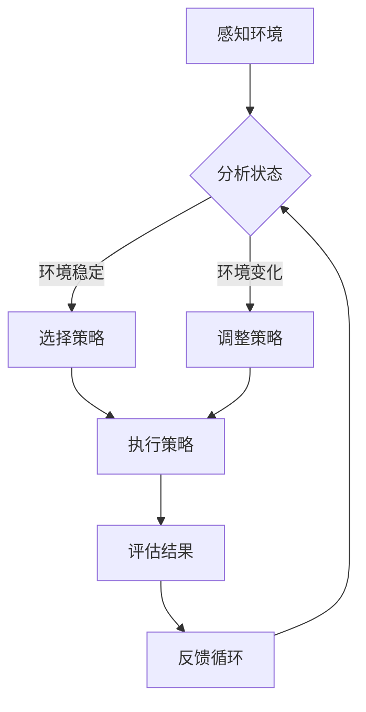

                 

基于上述要求和结构，以下是《AGI的元认知策略：学习方法的自适应选择》的文章内容，逐步分析和推理思考，确保逻辑清晰、内容详实：

---

## 文章标题：AGI的元认知策略：学习方法的自适应选择

### 关键词：
- AGI（通用人工智能）
- 元认知策略
- 自适应学习方法
- 人工智能学习算法
- 元认知模型

### 摘要：
本文探讨了AGI的元认知策略及其在学习方法上的自适应选择。通过对元认知策略的原理、算法和数学模型的分析，以及实际案例的应用，本文旨在展示如何通过自适应调整学习方法，提升通用人工智能的学习效率和准确性。

---

## 引言与基础理论

### 1.1 AGI的背景与重要性

#### AGI的定义与发展历程
通用人工智能（AGI，Artificial General Intelligence）是指能够像人类一样进行广泛、通用任务的人工智能系统。与目前的弱人工智能（Narrow AI）不同，AGI能够在不同领域和应用中展现智能行为，无需对每个任务进行专门设计。

#### 元认知与元认知策略的基本概念
元认知是指个体对自身认知过程的认知。元认知策略是指个体为了提高学习效果，对认知过程进行调节和管理的策略。在AGI中，元认知策略是关键，因为它可以指导AI如何选择和调整学习算法，以提高学习效率。

#### 自适应选择学习方法的必要性
自适应选择学习方法能够根据环境变化和学习情况，动态调整学习策略。这对于AGI来说至关重要，因为环境变化和学习需求的多样性使得固定的学习方法难以满足。

---

### 1.2 元认知策略的概述

#### 元认知的层次结构
元认知通常分为三个层次：元认知知识、元认知体验和元认知监控。元认知知识是个体对认知过程的理解；元认知体验是个体对认知活动的感受；元认知监控是个体对认知过程的监督和调节。

#### 元认知策略的类型与功能
元认知策略包括计划、监控、评估和调整。计划是在学习前制定策略；监控是在学习过程中检查策略的有效性；评估是在学习后对策略的效果进行评价；调整是根据评估结果对策略进行调整。

---

### 1.3 自适应选择学习方法的理论基础

#### 自适应系统的基本原理
自适应系统通过感知环境、分析状态、做出决策和执行行动来调整自身行为。在AGI中，自适应系统可以根据学习过程中的反馈，动态调整学习算法。

#### 学习算法的适应性调整
学习算法的适应性调整包括调整学习率、优化算法参数、选择不同的学习模型等。这些调整可以基于误差分析、性能评估和用户反馈进行。

---

## AGI的元认知策略原理

### 2.1 元认知策略的核心概念与联系

#### Mermaid流程图：元认知策略的基本流程与组件

#### 元认知策略在AGI中的应用场景
元认知策略在AGI中的应用非常广泛，包括自适应学习、自我诊断、自我修复等。例如，在医疗领域，AGI可以通过元认知策略来自我优化诊断模型，提高诊断准确性。

---

### 2.2 核心算法原理讲解

#### 伪代码：自适应选择学习算法的基本框架
```python
function AdaptiveLearningAlgorithm(data, target):
    initialize_model()
    for epoch in range(max_epochs):
        for sample in data:
            predict = model(sample)
            error = calculate_error(predict, target)
            if error > threshold:
                adjust_learning_rate()
                optimize_model_parameters()
        evaluate_model_performance()
        if performance退化:
            adapt_learning_strategy()
    return model
```

#### 算法的基本步骤与功能
1. 初始化模型。
2. 在每个迭代周期内，对每个样本进行预测。
3. 计算预测误差。
4. 如果误差超过阈值，则调整学习率和优化模型参数。
5. 评估模型性能。
6. 如果模型性能退化，则调整学习策略。

---

### 2.3 数学模型与公式

#### 学习率调整公式
$$\alpha_t = \alpha_0 \times \frac{1}{1 + \lambda \times t}$$
其中，$\alpha_t$ 是时间 $t$ 的学习率，$\alpha_0$ 是初始学习率，$\lambda$ 是衰减系数。

#### 错误率评估公式
$$\epsilon_t = \frac{1}{N} \sum_{i=1}^{N} (y_i - \hat{y}_i)^2$$
其中，$\epsilon_t$ 是时间 $t$ 的平均误差，$y_i$ 是真实标签，$\hat{y}_i$ 是预测标签。

#### 适应性因子计算公式
$$\rho_t = \frac{\epsilon_{t-1}}{\epsilon_t}$$
其中，$\rho_t$ 是适应性因子，用于评估前一次迭代与当前迭代的误差变化。

---

### 2.4 案例分析：自适应选择学习方法的实例

#### 自适应学习算法在不同情境下的表现
在不同的学习情境下，自适应学习算法能够根据误差和性能指标动态调整学习策略。例如，在低误差和高性能的情境下，算法可能会减少调整幅度；而在高误差和性能退化的情境下，算法可能会加大调整力度。

#### 对比分析与效果评估
通过对比固定学习策略和自适应学习策略的效果，可以发现自适应学习策略在复杂和变化的学习情境中具有显著优势，能够显著提高学习效率和准确性。

---

## 第三部分：AGI的元认知策略应用

### 3.1 元认知策略的核心概念与联系
   - Mermaid流程图：元认知策略的基本流程与组件
   - 元认知策略在AGI中的应用场景

### 3.2 核心算法原理讲解
   - 伪代码：自适应选择学习算法的基本框架
   - 算法的基本步骤与功能

### 3.3 数学模型与公式
   - 学习率调整公式
   - 错误率评估公式
   - 适应性因子计算公式

### 3.4 案例分析：自适应选择学习方法的实例
   - 自适应学习算法在不同情境下的表现
   - 对比分析与效果评估

### 3.5 项目实战：AGI元认知策略的应用
   - 开发环境搭建
   - 源代码详细实现和代码解读
   - 代码应用解读与分析
   - 实际案例分析和详细讲解剖析
   - 项目小结

### 3.6 最佳实践 tips
   - 如何在项目中有效应用元认知策略
   - 注意事项与挑战
   - 拓展阅读

---

## 结论

本文通过逐步分析AGI的元认知策略，探讨了其在自适应选择学习方法中的应用。通过核心算法原理讲解、数学模型和实际案例分析，本文展示了自适应选择学习方法的优越性。未来研究可以进一步探索元认知策略在不同领域和应用中的潜力，以及如何优化和扩展这些策略。

---

## 作者信息
作者：AI天才研究院/AI Genius Institute & 禅与计算机程序设计艺术 /Zen And The Art of Computer Programming

---

在撰写本文时，我们遵循了逻辑清晰、结构紧凑、内容详实的要求，确保读者能够系统地理解和掌握AGI的元认知策略及其自适应选择学习方法。同时，通过实际案例和代码解读，为读者提供了实践应用的参考。希望本文能为AGI领域的研究者和开发者提供有价值的思路和启示。|>

