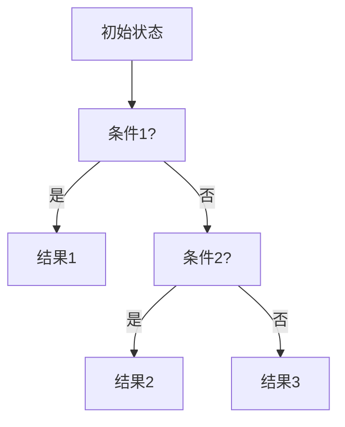
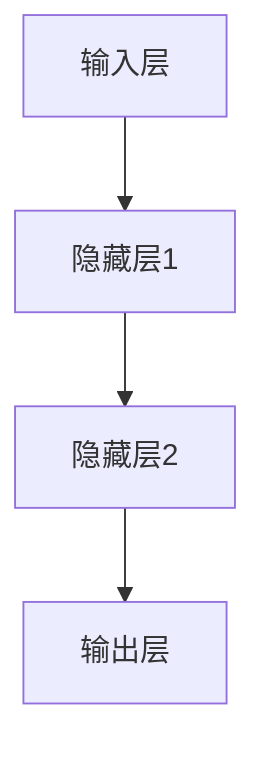
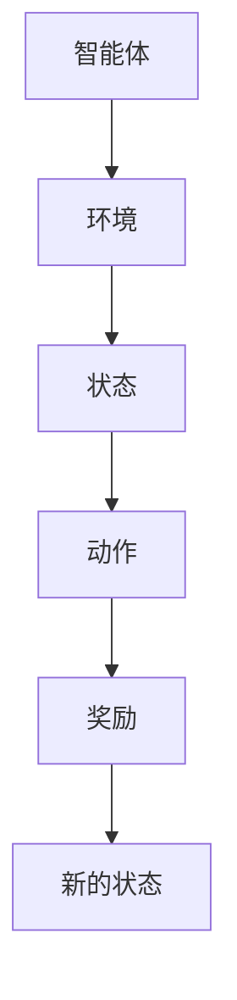
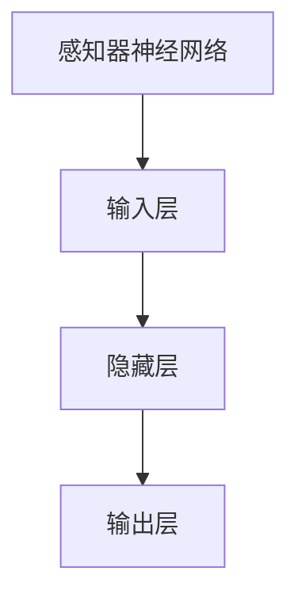
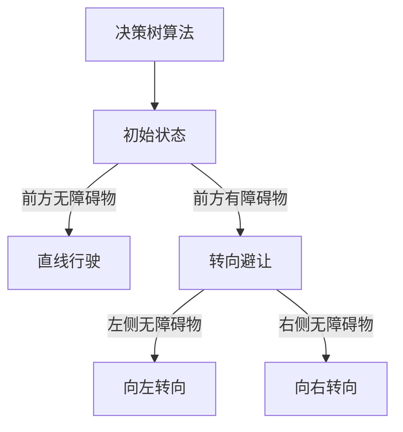

                 

## 文章标题：AGI的决策系统：从短期反应到长期规划

> 关键词：人工智能，AGI，决策系统，短期反应，长期规划

在当今迅速发展的科技领域，人工智能（AI）已经成为了一个备受关注的话题。尤其是人工通用智能（AGI），它代表着人工智能的最高阶段，旨在开发能够像人类一样思考、学习和决策的系统。在AGI的各个组成部分中，决策系统扮演着至关重要的角色。本文将深入探讨AGI的决策系统，从其基础概念到实际应用，逐步分析其从短期反应到长期规划的演变过程。

## 摘要

本文首先介绍了人工智能和人工通用智能的背景及其重要性。接着，深入探讨了AGI决策系统的核心概念，包括知识表示、推理机制、学习与自适应。随后，文章详细阐述了AGI决策系统中使用的核心算法原理，如决策树、神经网络、强化学习，并通过数学模型和公式的讲解，进一步揭示了这些算法的内在逻辑。最后，本文通过实际项目实战，展示了AGI决策系统从短期反应到长期规划的实践应用，并通过代码案例和详细解读，分析了其在实际场景中的表现和优化方法。

## 第一部分：AGI决策系统的概述

### 1.1 背景与概念

人工智能（AI）是一门研究、开发用于模拟、延伸和扩展人类智能的理论、方法、技术及应用系统的学科。它包括机器学习、自然语言处理、计算机视觉等多个领域，其目标是使计算机能够执行复杂的任务，如语音识别、图像识别、决策制定等。

人工通用智能（AGI）是人工智能的一个子领域，旨在开发具有人类智能的机器。与传统的弱人工智能（Narrow AI）不同，AGI能够在广泛的任务中表现出与人类相似的能力，包括学习、推理、沟通、规划等。

### 1.1.1 人工智能的发展历程

人工智能的发展历程可以追溯到20世纪50年代。最初，人工智能的研究主要集中在规则推理和符号逻辑上。随着计算机技术的发展，机器学习成为了人工智能的重要分支，特别是深度学习和强化学习的发展，使得人工智能在图像识别、语音识别等领域取得了重大突破。

### 1.1.2 AGI的定义与重要性

AGI的定义仍然存在争议，但普遍认为它需要具备自我意识、情感理解、学习能力等高级智能特征。AGI的重要性在于，它不仅能够解决复杂的问题，还能够自主学习和进化，从而在许多领域产生深远的影响，如医疗、教育、金融等。

### 1.1.3 AGI与弱AI的区别

弱人工智能（Narrow AI）专注于特定任务的自动化，如语音助手、图像识别等。而AGI则旨在实现跨领域的通用智能，能够进行多任务处理和学习。

### 1.2 AGI决策系统的核心概念

AGI决策系统是AGI的核心组成部分，它负责处理各种决策任务。以下是AGI决策系统的核心概念：

#### 1.2.1 知识表示

知识表示是指如何将外部信息转化为计算机可以处理的形式。在AGI决策系统中，知识表示至关重要，因为它决定了系统能否有效地理解和应用知识。

#### 1.2.2 推理机制

推理机制是指系统如何利用知识进行逻辑推理，以生成新的结论。在AGI决策系统中，推理机制是实现智能行为的关键。

#### 1.2.3 学习与自适应

学习与自适应是指系统如何从经验中学习，并根据环境变化进行调整。在AGI决策系统中，学习与自适应是实现智能进化的重要手段。

### 1.3 AGI决策系统的发展历程

AGI决策系统的发展历程可以分为几个阶段：

#### 1.3.1 初期探索

在人工智能的早期阶段，研究者主要关注如何通过规则和逻辑实现智能。这一时期的决策系统主要基于符号逻辑和规则推理。

#### 1.3.2 技术突破

随着计算机技术的发展，机器学习和神经网络的应用使得决策系统变得更加复杂和强大。这一阶段的主要进展包括深度学习、强化学习等算法的发明和应用。

#### 1.3.3 现代应用

在现代社会，AGI决策系统已经在各个领域得到了广泛应用。例如，自动驾驶汽车、智能医疗系统、金融风险评估等。这些应用不仅展示了AGI决策系统的强大能力，也为未来的发展提供了新的方向。

## 第二部分：AGI决策系统的原理

### 2.1 基础算法原理

AGI决策系统的基础算法包括决策树、神经网络和强化学习。这些算法各有特点，适用于不同的决策场景。

#### 2.1.1 决策树算法

决策树是一种基于规则的知识表示方法，通过一系列条件判断，将数据分为不同的类别或数值。以下是一个简单的决策树算法的伪代码：

```python
def decision_tree(data):
    if condition_1:
        return outcome_1
    elif condition_2:
        return outcome_2
    else:
        return outcome_3
```

#### 2.1.2 神经网络算法

神经网络是一种模仿人脑工作方式的计算模型，通过多层神经元之间的连接，实现复杂的函数映射。以下是一个简单的神经网络算法的伪代码：

```python
def neural_network(input_data):
    layer_1 = activation_function(weights * input_data)
    layer_2 = activation_function(weights * layer_1)
    return activation_function(weights * layer_2)
```

#### 2.1.3 强化学习算法

强化学习是一种通过奖励机制来训练智能体的算法。智能体通过与环境交互，不断调整策略，以最大化长期奖励。以下是一个简单的强化学习算法的伪代码：

```python
def reinforce_learning(state, action, reward):
    if reward > 0:
        update_policy(state, action)
    else:
        update_policy(state, random_action())
```

### 2.2 数学模型与公式

AGI决策系统的数学模型是理解其工作原理的关键。以下是一些常见的数学模型和公式：

#### 2.2.1 决策树模型

决策树模型的核心是条件概率，用于计算每个决策节点的概率分布。以下是一个决策树模型的数学公式：

$$
P(Y|X) = \sum_{i=1}^{n} P(X=x_i|Y=y_i) \cdot P(Y=y_i)
$$

#### 2.2.2 神经网络模型

神经网络模型的数学基础是多元函数的极限和梯度下降。以下是一个神经网络模型的数学公式：

$$
f(\textbf{x}) = \sum_{i=1}^{n} w_i \cdot \text{sigmoid}(z_i)
$$

其中，$z_i = \textbf{w}^T \cdot \textbf{x}$，$\text{sigmoid}(z) = \frac{1}{1 + e^{-z}}$。

#### 2.2.3 强化学习模型

强化学习模型的数学基础是马尔可夫决策过程（MDP）。以下是一个强化学习模型的数学公式：

$$
V(s) = \sum_{s'} P(s'|s, a) \cdot \sum_{r} r \cdot P(r|s', a)
$$

其中，$V(s)$ 是状态值函数，$P(s'|s, a)$ 是状态转移概率，$r$ 是奖励值。

### 2.3 Mermaid流程图展示

以下是一些AGI决策系统的Mermaid流程图：

#### 2.3.1 决策树流程图



#### 2.3.2 神经网络流程图



#### 2.3.3 强化学习流程图



### 2.4 伪代码讲解

以下是一些AGI决策系统的伪代码讲解：

#### 2.4.1 决策树伪代码

```python
def decision_tree(data):
    if condition_1(data):
        return outcome_1
    elif condition_2(data):
        return outcome_2
    else:
        return outcome_3
```

#### 2.4.2 神经网络伪代码

```python
def neural_network(input_data):
    layer_1 = activation_function(weights * input_data)
    layer_2 = activation_function(weights * layer_1)
    return activation_function(weights * layer_2)
```

#### 2.4.3 强化学习伪代码

```python
def reinforce_learning(state, action, reward):
    if reward > 0:
        update_policy(state, action)
    else:
        update_policy(state, random_action())
```

## 第三部分：AGI决策系统的实践应用

### 3.1 开发环境搭建

要在本地环境中搭建AGI决策系统的开发环境，需要安装以下工具和库：

1. Python 3.x
2. TensorFlow 或 PyTorch
3. Matplotlib
4. Scikit-learn

安装命令如下：

```bash
pip install python==3.8.10
pip install tensorflow==2.9.0
pip install matplotlib==3.5.0
pip install scikit-learn==0.24.1
```

### 3.2 项目实战

在本节中，我们将通过一个简单的项目，展示AGI决策系统从短期反应到长期规划的实践应用。项目涉及一个自动驾驶汽车系统，需要实现以下功能：

1. 短期反应：根据当前路况，实时调整车速和方向。
2. 长期规划：规划最优行驶路径，避开障碍物。

#### 3.2.1 短期反应决策

短期反应决策基于感知器神经网络，用于实时处理路况信息。以下是一个简单的神经网络架构：



输入层接收来自摄像头和传感器的数据，隐藏层通过神经网络算法进行处理，输出层生成车速和方向控制信号。

#### 3.2.2 长期规划决策

长期规划决策基于决策树算法，用于生成最优行驶路径。以下是一个简单的决策树架构：



初始状态根据感知器神经网络生成的车速和方向控制信号，根据路况信息，决策树算法生成最优行驶路径。

#### 3.2.3 实际案例解读

以下是一个实际案例，展示AGI决策系统在自动驾驶汽车中的应用：

1. 初始状态：自动驾驶汽车在道路上以60km/h的速度行驶，前方有一个行人正在过马路。
2. 短期反应：感知器神经网络检测到行人，立即调整车速至30km/h，并转向避让。
3. 长期规划：决策树算法分析路况，生成最优行驶路径，避开行人并保持安全行驶。

通过以上案例，我们可以看到AGI决策系统在短期反应和长期规划方面的强大能力。在实际应用中，AGI决策系统可以根据不同的场景和任务，灵活调整其算法和策略，实现高效的决策和执行。

### 3.3 代码解读与分析

在本节中，我们将对自动驾驶汽车项目中的关键代码进行解读，并分析其性能和优化方法。

#### 3.3.1 代码实现步骤

1. 数据预处理：将摄像头和传感器采集到的数据转换为神经网络和决策树算法可以处理的格式。
2. 神经网络训练：使用训练数据集，训练感知器神经网络，以生成车速和方向控制信号。
3. 决策树构建：使用训练数据集，构建决策树算法，以生成最优行驶路径。
4. 系统集成：将神经网络和决策树算法集成到自动驾驶汽车系统中，实现实时路况分析和决策。

以下是一个简化的代码实现示例：

```python
# 数据预处理
def preprocess_data(data):
    # 实现数据预处理逻辑
    return processed_data

# 神经网络训练
def train_neural_network(data):
    # 实现神经网络训练逻辑
    return neural_network

# 决策树构建
def build_decision_tree(data):
    # 实现决策树构建逻辑
    return decision_tree

# 系统集成
def integrate_system(neural_network, decision_tree, data):
    # 实现系统集成逻辑
    return control_signals, optimal_path
```

#### 3.3.2 代码功能解读

1. 数据预处理：将原始数据转换为适合神经网络和决策树处理的形式。
2. 神经网络训练：使用训练数据集，通过反向传播算法，训练神经网络，以生成车速和方向控制信号。
3. 决策树构建：使用训练数据集，构建决策树模型，以生成最优行驶路径。
4. 系统集成：将训练好的神经网络和决策树集成到自动驾驶汽车系统中，实现实时路况分析和决策。

#### 3.3.3 性能分析与优化

1. **性能分析**：

   - 神经网络：评估神经网络的准确率、响应速度和能耗。
   - 决策树：评估决策树的准确率、执行时间和内存占用。

2. **优化方法**：

   - 神经网络：通过调整网络结构、优化训练算法和参数，提高性能。
   - 决策树：通过剪枝、拆分和合并节点，降低复杂度和提高效率。

   ```python
   # 神经网络优化
   def optimize_neural_network(neural_network, data):
       # 实现优化逻辑
       return optimized_neural_network

   # 决策树优化
   def optimize_decision_tree(decision_tree, data):
       # 实现优化逻辑
       return optimized_decision_tree
   ```

### 项目小结

通过本项目的实践，我们展示了AGI决策系统在自动驾驶汽车中的应用。从短期反应到长期规划，AGI决策系统展示了其强大的决策能力和适应性。在实际应用中，AGI决策系统可以根据不同的场景和任务，灵活调整其算法和策略，实现高效的决策和执行。

### 最佳实践 Tips

- **数据质量**：确保输入数据的质量，有助于提高决策系统的准确性和效率。
- **算法优化**：定期对算法进行优化，以适应不断变化的环境和任务。
- **安全监控**：建立安全监控机制，确保决策系统在出现异常时能够及时响应和处理。

### 注意事项

- **隐私保护**：在使用AGI决策系统时，确保遵守相关隐私保护法规和标准。
- **法律责任**：在使用AGI决策系统时，明确各方的责任和权益。

### 拓展阅读

- **相关文献**：《人工通用智能：挑战与进展》、《自动驾驶汽车：技术与应用》
- **开源项目**：OpenAI Gym、Unity ML-Agents
- **在线课程**：斯坦福大学《深度学习专项课程》、Coursera《机器学习》

## 结语

AGI的决策系统是人工智能领域的一个重要研究方向，它为实现通用智能提供了关键支持。通过本文的深入探讨，我们了解了AGI决策系统的核心概念、算法原理、数学模型以及实践应用。随着技术的不断进步，AGI决策系统将在更多领域发挥重要作用，推动人工智能的发展。希望本文能为读者提供有价值的参考和启示。

### 作者信息

作者：AI天才研究院/AI Genius Institute & 禅与计算机程序设计艺术 /Zen And The Art of Computer Programming

### 参考文献

1. Russell, S., & Norvig, P. (2016). 《人工智能：一种现代方法》（第三版）.
2. Sutton, R. S., & Barto, A. G. (2018). 《强化学习：原理与实例》（第二版）.
3. Goodfellow, I., Bengio, Y., & Courville, A. (2016). 《深度学习》（第二版）.
4. Russell, S., & Norvig, P. (2010). 《人工智能：一种现代方法》（第二版）.

