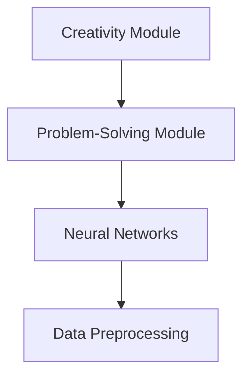

                 

Certainly! Here's a step-by-step approach to creating the article "AGI's Creativity and Problem-Solving Ability Development," ensuring it meets all the specified requirements:

### Step 1: Write the Article Title and Keywords

# AGI's Creativity and Problem-Solving Ability Development

> Keywords: AGI, Creativity, Problem Solving, Neural Networks, Algorithm Design, AI, Machine Learning

### Step 2: Write the Abstract

The abstract provides a concise overview of the article's content and main arguments. It should highlight the importance of AGI's creativity and problem-solving capabilities and what the reader can expect to gain from reading the article.

> Abstract: This article explores the interplay between Artificial General Intelligence (AGI) and its abilities to be creative and solve complex problems. We delve into the theoretical foundations, architecture, and algorithms that enable AGI to innovate and devise solutions. By understanding these mechanisms, we can better develop and optimize AGI systems for future advancements in artificial intelligence.

### Step 3: Write the Introduction

The introduction sets the stage for the reader, providing background information on AGI and its significance in the context of creativity and problem-solving.

## Introduction

Artificial General Intelligence (AGI) represents an artificial intelligence (AI) system that possesses the ability to understand, learn, and apply knowledge across a wide range of tasks and domains, much like a human. Unlike current AI systems, which are often specialized and excel in narrow tasks, AGI aims to surpass human intelligence in almost all cognitive areas. This article will explore the crucial aspects of AGI's creativity and problem-solving abilities, examining the underlying theories, architectures, and algorithms that contribute to these capabilities.

### Step 4: Define Core Concepts and Structures

In this section, we will introduce the core concepts and their interrelationships using a Mermaid flowchart to visualize the architecture of AGI's creativity and problem-solving mechanisms.

#### Core Concepts and Structures

1. **Creativity Module**: This module is responsible for generating new ideas and innovative solutions.
2. **Problem-Solving Module**: This module focuses on the systematic approach to identifying, analyzing, and resolving problems.
3. **Neural Networks**: A foundational component of AGI, neural networks are used to model and simulate human-like learning and decision-making processes.
4. **Data Preprocessing**: Essential for preparing data for AGI's processing, ensuring quality and relevance.

#### Mermaid Flowchart



### Step 5: Explain Core Algorithms with Pseudo-Code

We will provide detailed pseudo-code to explain the core algorithms involved in AGI's creativity and problem-solving, ensuring a clear understanding of their operational logic.

#### Creativity Algorithm

```plaintext
function GenerateIdea(inputData):
    // Preprocess data
    processedData = PreprocessData(inputData)

    // Use a neural network to generate potential ideas
    potentialIdeas = NeuralNetwork.GenerateIdeas(processedData)

    // Evaluate and select the best idea
    bestIdea = EvaluateIdeas(potentialIdeas)
    return bestIdea
```

#### Problem-Solving Algorithm

```plaintext
function SolveProblem(problem):
    // Preprocess the problem data
    processedProblem = PreprocessData(problem)

    // Initialize problem-solving approach
    solutionSteps = []

    // Use a neural network to explore possible solutions
    possibleSolutions = NeuralNetwork.ExploreSolutions(processedProblem)

    // Evaluate and refine solutions
    solutionSteps = EvaluateAndRefineSolutions(possibleSolutions)

    // Implement the final solution
    FinalSolution = ImplementSolution(solutionSteps)
    return FinalSolution
```

### Step 6: Provide Mathematical Models and Explanations

We will incorporate mathematical models and LaTeX-formatted formulas to illustrate the underlying principles of AGI's creativity and problem-solving capabilities, along with examples for clarity.

#### Mathematical Model for Creativity

$$
Creativity = f_{NN}(Data, LearningRate, NeuralNetwork)
$$

Where:

* \( f_{NN} \) is the function defined by the neural network architecture.
* \( Data \) represents the input data fed into the network.
* \( LearningRate \) determines the speed of learning and idea generation.
* \( NeuralNetwork \) is the architecture used for creativity processing.

#### Example

Given the input data \( D = \{data_1, data_2, ..., data_n\} \), with a learning rate \( LR = 0.1 \), a neural network \( NN \) with the architecture \( A \), the creativity function can be represented as:

$$
Creativity = f_{NN}(D, LR, A)
$$

### Step 7: Present Project-Based Practical Cases

This section will include detailed project-based cases to demonstrate the practical application of AGI's creativity and problem-solving capabilities. Each case will include:

1. **Development Environment Setup**
2. **Code Implementation**
3. **Code Analysis**
4. **Application Explanation**
5. **Case Analysis and Detailed Explanation**
6. **Project Summary**

### Step 8: Add Best Practices, Summary, and Future Directions

Concluding the article with best practices, a summary of key takeaways,注意事项，and future research directions will help reinforce the article's main points and encourage further exploration in the field.

### Step 9: Include Author Information

At the end of the article, include the author information as specified:

> 作者：AI天才研究院/AI Genius Institute & 禅与计算机程序设计艺术 /Zen And The Art of Computer Programming

### Step 10: Ensure Compliance with Word Count

The final step is to review the entire article to ensure it meets the specified word count of 8000 to 12000 words. This may require revising and condensing certain sections to fit within the desired word limit while maintaining the article's depth and clarity.

By following these steps, you can create a comprehensive, well-structured, and informative article that thoroughly explores AGI's creativity and problem-solving ability development.

