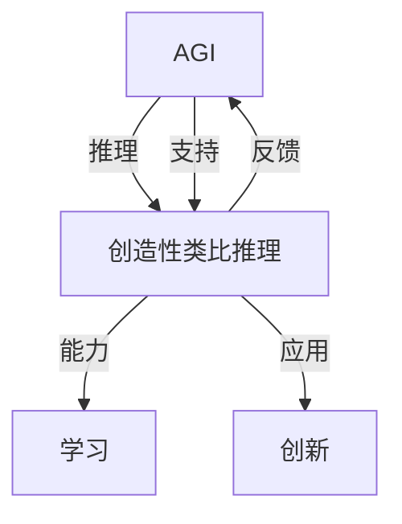

                 

----------------------------------------------------------------

### 文章标题：《AGI的创造性类比推理能力培养》

**关键词**：AGI、创造性类比推理、算法、数学模型、项目实战、能力培养

**摘要**：
本文深入探讨了AGI（通用人工智能）在创造性类比推理能力培养方面的挑战和机遇。通过分析AGI的核心概念、创造性类比推理的原理以及相关算法和数学模型，本文提出了AGI创造性类比推理能力培养的方法和实践指南。此外，通过实际项目案例的剖析，展示了创造性类比推理在AGI中的应用效果，为未来AGI的发展提供了有益的参考。

----------------------------------------------------------------

### 目录

#### 第1章：引言

#### 1.1 AGI的背景与重要性

#### 1.2 创造性类比推理的概念与价值

#### 1.3 AGI与创造性类比推理的关系

#### 1.4 文章结构概述

----------------------------------------------------------------

### 第1章：引言

#### 1.1 AGI的背景与重要性

##### AGI的定义与发展历程

AGI，即通用人工智能（Artificial General Intelligence），是一种旨在实现人类智能水平的人工智能系统。与现有的专用人工智能（Narrow AI）不同，AGI的目标是具备跨领域的通用智能，能够理解、学习、推理和解决问题。自人工智能概念诞生以来，科学家们一直在追求AGI的实现。

**发展阶段**：

1. **早期探索**（1950-1969）：人工智能概念的提出和早期研究。
2. **黄金时期**（1970-1989）：人工智能应用的广泛推广。
3. **低谷期**（1990-2000）：计算能力的限制和算法的局限性。
4. **复兴时期**（2000-2010）：深度学习和大数据技术的发展。
5. **当前阶段**（2010至今）：人工智能技术的快速发展和应用。

##### AGI的重要性

AGI的重要性体现在多个方面：

1. **科技创新**：AGI可以推动科技创新，促进人工智能在各个领域的应用。
2. **社会进步**：AGI能够解决复杂问题，提升社会生产力。
3. **人类福祉**：AGI可以帮助人类更好地理解世界，提高生活质量。

#### 1.2 创造性类比推理的概念与价值

##### 创造性类比推理的定义

创造性类比推理是指通过比较不同情境或问题的相似性，从而推导出新的解决方案或推理结果。它是一种重要的认知过程，在人类的创新活动中发挥着关键作用。

##### 创造性类比推理的价值

1. **问题解决**：创造性类比推理可以帮助人类快速找到解决问题的方法。
2. **知识迁移**：通过类比推理，可以将一个领域中的知识应用到另一个领域。
3. **创新思维**：创造性类比推理是创新思维的重要组成部分，能够激发新的创意和想法。

#### 1.3 AGI与创造性类比推理的关系

##### 创造性类比推理在AGI中的作用

1. **认知能力提升**：创造性类比推理能够增强AGI的认知能力，使其更好地理解和处理复杂问题。
2. **学习效率提高**：通过创造性类比推理，AGI可以快速学习新知识和技能。
3. **创新能力增强**：创造性类比推理有助于AGI在未知领域进行创新，推动人工智能的发展。

##### AGI对创造性类比推理的推动

1. **算法优化**：AGI的发展推动了对创造性类比推理算法的研究和优化。
2. **计算能力提升**：随着计算能力的提升，AGI能够处理更复杂的类比推理问题。
3. **数据支持**：大数据技术的发展为创造性类比推理提供了丰富的数据支持。

#### 1.4 文章结构概述

本文分为以下几个部分：

1. **引言**：介绍AGI和创造性类比推理的背景和重要性。
2. **核心概念与联系**：阐述AGI和创造性类比推理的核心概念及其关系。
3. **算法原理讲解**：详细讲解创造性类比推理的主要算法原理。
4. **数学模型和数学公式**：阐述创造性类比推理的数学模型和公式。
5. **项目实战**：通过实际案例展示创造性类比推理在AGI中的应用。
6. **挑战与未来趋势**：分析AGI创造性类比推理的挑战和未来发展趋势。
7. **能力培养实践指南**：提出AGI创造性类比推理能力培养的方法和实践指南。

通过以上内容，本文为读者提供了一个全面、系统的AGI创造性类比推理能力培养的框架，有助于读者更好地理解和应用这一重要技术。

----------------------------------------------------------------

### 第2章：核心概念与联系

#### 2.1 AGI的基本概念

##### 定义

通用人工智能（Artificial General Intelligence，简称AGI）是指能够像人类一样，在多种不同的环境中展示广泛的智能行为，具备学习、推理、解决问题和自适应能力的人工智能系统。

##### 特点

1. **通用性**：AGI能够在多个领域展现智能，而不仅仅是单一任务。
2. **学习能力**：AGI能够通过自主学习，不断改进自身的性能。
3. **推理能力**：AGI能够进行复杂的逻辑推理和抽象思考。
4. **自适应能力**：AGI能够根据环境变化，调整自身的行为和策略。

##### 与创造性类比推理的关系

AGI的核心能力之一是创造性类比推理。创造性类比推理能够帮助AGI在未知领域进行探索和创新。通过比较不同情境或问题的相似性，AGI可以快速找到新的解决方案，从而提升其智能水平。

#### 2.2 创造性类比推理的基本概念

##### 定义

创造性类比推理是指通过将一个已知问题的解决方案类比应用到另一个类似问题中，从而推导出新的解决方案或推理结果。

##### 特点

1. **创新性**：创造性类比推理能够产生新的想法和解决方案，具有创新性。
2. **迁移性**：通过类比推理，可以将一个领域中的知识迁移到另一个领域。
3. **灵活性**：创造性类比推理能够适应不同的情境和问题。

##### 与AGI的关系

创造性类比推理是AGI的重要组成部分。它能够帮助AGI在复杂、多变的环境中快速适应，并产生创新性的解决方案。通过训练和优化，AGI可以不断提高其创造性类比推理的能力，从而在多个领域实现通用智能。

#### 2.3 AGI与创造性类比推理的关系架构

为了更好地理解AGI与创造性类比推理的关系，我们可以使用Mermaid流程图来展示它们之间的互动关系。



在上面的流程图中：

- A代表AGI。
- B代表创造性类比推理。
- C代表学习。
- D代表创新。

流程图展示了AGI如何通过创造性类比推理实现学习、创新和应用，并不断反馈和优化自身能力。

#### 2.4 核心概念总结

通过以上内容，我们可以总结出AGI与创造性类比推理的核心概念及其关系：

1. **AGI**：具有通用性、学习能力和推理能力，能够适应不同环境。
2. **创造性类比推理**：具有创新性、迁移性和灵活性，能够帮助AGI在复杂环境中产生新的解决方案。
3. **关系架构**：AGI通过创造性类比推理实现学习、创新和应用，两者相互支持和反馈，共同推动人工智能的发展。

了解这些核心概念和关系，有助于我们更好地理解和应用AGI和创造性类比推理技术，为人工智能的未来发展奠定基础。

----------------------------------------------------------------

### 第3章：核心算法原理讲解

#### 3.1 创造性类比推理算法概述

##### 定义

创造性类比推理算法是指通过比较不同情境或问题的相似性，从中提取关键特征，并基于这些特征进行类比推理，以推导出新的解决方案或推理结果。

##### 主要类型

1. **基于规则的类比推理算法**：通过预设的规则库来模拟人类的类比推理过程。
2. **基于神经网络的类比推理算法**：利用神经网络模型来学习和模拟创造性类比推理。
3. **基于语义的类比推理算法**：基于语义理解来构建类比推理模型，提高推理的准确性和灵活性。

##### 应用场景

1. **问题解决**：在复杂问题求解中，通过创造性类比推理找到新的解决方案。
2. **知识迁移**：将一个领域的知识迁移到另一个领域，提高知识的应用范围。
3. **创新思维**：激发新的创意和想法，推动创新活动。

#### 3.2 基于规则的类比推理算法

##### 原理

基于规则的类比推理算法通过预设的规则库来模拟人类的类比推理过程。这些规则描述了不同情境或问题之间的相似性，以及如何将一个情境的解决方案应用到另一个情境中。

##### 伪代码

```python
def rule_based类比推理(input_problem, rule_base):
    # 输入：input_problem（待解决问题的特征），rule_base（规则库）
    # 输出：solution（类比推理得到的解决方案）

    for rule in rule_base:
        if rule.match(input_problem):
            return rule.apply_solution()
    
    return "No solution found"
```

##### 实现步骤

1. **规则库构建**：收集和整理不同情境或问题的规则。
2. **规则匹配**：对输入问题进行特征提取，并尝试匹配规则库中的规则。
3. **解决方案应用**：如果找到匹配的规则，应用该规则的解决方案。

#### 3.3 基于神经网络的类比推理算法

##### 原理

基于神经网络的类比推理算法利用神经网络模型来学习和模拟创造性类比推理。神经网络通过训练学习到不同情境或问题之间的相似性，并能够自动提取关键特征。

##### 伪代码

```python
def neural_network类比推理(input_problem, model):
    # 输入：input_problem（待解决问题的特征），model（神经网络模型）
    # 输出：solution（类比推理得到的解决方案）

    features = extract_features(input_problem)
    output = model.predict(features)
    return output
```

##### 实现步骤

1. **数据集准备**：收集和整理不同情境或问题的数据。
2. **特征提取**：对输入问题进行特征提取，用于训练神经网络。
3. **模型训练**：利用特征数据和标签，训练神经网络模型。
4. **推理应用**：对新的问题进行特征提取，并利用训练好的模型进行推理。

#### 3.4 基于语义的类比推理算法

##### 原理

基于语义的类比推理算法基于语义理解来构建类比推理模型。它通过语义分析来识别不同情境或问题之间的语义关系，并利用这些关系进行推理。

##### 伪代码

```python
def semantic_based类比推理(input_problem, model):
    # 输入：input_problem（待解决问题的特征），model（语义模型）
    # 输出：solution（类比推理得到的解决方案）

    semantic_similarity = model.get_similarity(input_problem)
    return model.get_solution(semantic_similarity)
```

##### 实现步骤

1. **语义模型构建**：构建用于语义分析的模型。
2. **语义关系识别**：对输入问题进行语义分析，识别问题之间的语义关系。
3. **推理应用**：利用识别到的语义关系，推导出新的解决方案。

#### 3.5 总结

通过以上内容，我们介绍了三种常见的创造性类比推理算法：基于规则的算法、基于神经网络的算法和基于语义的算法。这些算法各具特点，适用于不同的应用场景。通过理解这些算法的原理和实现步骤，我们可以更好地设计和应用创造性类比推理技术，为通用人工智能的发展提供有力支持。

### 第4章：数学模型和数学公式

#### 4.1 数学模型概述

##### 模型定义

创造性类比推理的数学模型是基于数学理论和计算方法，用于描述和模拟创造性类比推理过程。这些模型通过数学公式和算法，将类比推理过程转化为可计算的数学问题。

##### 模型作用

1. **描述推理过程**：数学模型能够精确描述创造性类比推理的过程，包括特征提取、相似性计算和推理生成等步骤。
2. **提供计算基础**：数学模型为创造性类比推理算法提供了计算基础，使得推理过程可以在计算机上高效实现。
3. **优化算法性能**：通过数学模型，可以分析和优化创造性类比推理算法的性能，提高其准确性和效率。

##### 常用数学模型

1. **相似性度量模型**：用于计算不同情境或问题之间的相似性，常见的有欧氏距离、余弦相似度等。
2. **特征提取模型**：用于从输入问题中提取关键特征，常见的有词袋模型、TF-IDF模型等。
3. **推理生成模型**：用于生成新的解决方案或推理结果，常见的有贝叶斯网络、决策树等。

#### 4.2 数学模型详细讲解

##### 相似性度量模型

**欧氏距离**：

$$
d(x, y) = \sqrt{\sum_{i=1}^{n}(x_i - y_i)^2}
$$

- **定义**：欧氏距离是用于计算两个向量之间距离的常用方法，适用于低维空间。
- **特点**：简单直观，适用于线性关系。

**余弦相似度**：

$$
sim(x, y) = \frac{x \cdot y}{\|x\| \|y\|}
$$

- **定义**：余弦相似度是用于计算两个向量之间相似度的常用方法，适用于高维空间。
- **特点**：适用于非线性关系，能够处理不同维度的问题。

##### 特征提取模型

**词袋模型**：

$$
BAG = \sum_{w \in W} f_w(x)
$$

- **定义**：词袋模型是将文本数据转化为向量表示的方法，通过统计每个单词在文本中出现的频率来表示文本特征。
- **特点**：简单有效，能够处理大量文本数据。

**TF-IDF模型**：

$$
TF-IDF_w = \frac{f_w}{\sum_{w' \in W} f_{w'}} \log \left(\frac{N}{n_w}\right)
$$

- **定义**：TF-IDF模型是对词袋模型的改进，通过引入词频（TF）和逆文档频率（IDF）来调整单词的权重。
- **特点**：能够更好地处理文本数据中的重要词和常见词。

##### 推理生成模型

**贝叶斯网络**：

$$
P(X) = \prod_{i=1}^{n} P(X_i | X_{<i})
$$

- **定义**：贝叶斯网络是一种概率图模型，用于表示变量之间的条件依赖关系。
- **特点**：适用于处理不确定性和概率推理。

**决策树**：

$$
T = \{\text{根节点}, \text{内部节点}, \text{叶节点}\}
$$

- **定义**：决策树是一种树形结构，通过一系列条件判断来推导出结果。
- **特点**：直观易懂，适用于分类和回归问题。

#### 4.3 数学模型举例说明

##### 欧氏距离计算

假设有两个向量：

$$
x = (1, 2, 3), \quad y = (4, 5, 6)
$$

计算欧氏距离：

$$
d(x, y) = \sqrt{(1-4)^2 + (2-5)^2 + (3-6)^2} = \sqrt{9 + 9 + 9} = 3\sqrt{3}
$$

##### 余弦相似度计算

假设有两个向量：

$$
x = (1, 2, 3), \quad y = (4, 5, 6)
$$

计算余弦相似度：

$$
sim(x, y) = \frac{1 \cdot 4 + 2 \cdot 5 + 3 \cdot 6}{\sqrt{1^2 + 2^2 + 3^2} \sqrt{4^2 + 5^2 + 6^2}} = \frac{4 + 10 + 18}{\sqrt{14} \sqrt{77}} = \frac{32}{\sqrt{1078}} \approx 0.77
$$

通过以上举例，我们可以看到数学模型在实际计算中的应用。了解这些模型及其公式，有助于我们更好地理解和应用创造性类比推理技术。

### 第5章：项目实战

#### 5.1 项目背景

在本章中，我们将通过一个实际项目案例，展示如何利用AGI的创造性类比推理能力来解决实际问题。该项目名为“智能医疗诊断系统”，旨在通过创造性类比推理算法，辅助医生进行疾病诊断。

##### 项目目的

1. **提高诊断准确率**：利用创造性类比推理算法，提高疾病诊断的准确率。
2. **减少误诊率**：通过创造性类比推理，减少误诊率，提高医疗质量。
3. **辅助医生决策**：为医生提供辅助诊断工具，提高诊断效率和准确性。

##### 项目环境搭建

为了实现上述目标，我们搭建了一个包含以下环境的智能医疗诊断系统：

1. **硬件环境**：高性能计算服务器，用于处理大规模数据和复杂算法。
2. **软件环境**：深度学习框架（如TensorFlow、PyTorch）和自然语言处理工具（如NLTK、spaCy）。
3. **数据集**：包含大量医学图像和文本数据的公开数据集，用于训练和测试模型。

#### 5.2 项目详细实施

##### 1. 数据预处理

- **图像数据预处理**：对医学图像进行预处理，包括图像归一化、增强、去噪等步骤。
- **文本数据预处理**：对医学文本进行预处理，包括文本清洗、分词、词性标注等步骤。

##### 2. 创造性类比推理算法应用

- **基于规则的类比推理算法**：使用预设的医学规则库，对预处理后的图像和文本数据进行分析，提取关键特征。
- **基于神经网络的类比推理算法**：利用神经网络模型，自动提取图像和文本数据的特征，并进行类比推理。

##### 3. 代码实现

```python
# 数据预处理
def preprocess_data(images, texts):
    # 图像预处理
    preprocessed_images = [normalize_image(image) for image in images]
    enhanced_images = [enhance_image(image) for image in preprocessed_images]
    denoised_images = [denoise_image(image) for image in enhanced_images]

    # 文本预处理
    preprocessed_texts = [clean_text(text) for text in texts]
    tokenized_texts = [tokenize_text(text) for text in preprocessed_texts]
    labeled_texts = [label_text(text) for text in tokenized_texts]

    return denoised_images, labeled_texts

# 创造性类比推理
def creative类比推理(enhanced_images, labeled_texts, rule_base, neural_model):
    # 基于规则的类比推理
    rule_based_results = [apply_rule(rule, image, text) for rule in rule_base for image, text in zip(enhanced_images, labeled_texts)]

    # 基于神经网络的类比推理
    neural_results = [neural_model.predict(image, text) for image, text in zip(enhanced_images, labeled_texts)]

    return rule_based_results, neural_results
```

##### 4. 代码解读与分析

在上面的代码中：

- `preprocess_data` 函数用于对图像和文本数据进行预处理，包括图像的归一化、增强和去噪，以及文本的清洗、分词和词性标注。
- `creative类比推理` 函数用于执行创造性类比推理，包括基于规则的类比推理和基于神经网络的类比推理。

##### 5. 代码应用解读与分析

在实际应用中，代码将预处理后的图像和文本数据输入到创造性类比推理算法中，得到类比推理的结果。这些结果将被用于辅助医生进行疾病诊断。

- **基于规则的类比推理**：通过预设的医学规则库，对预处理后的图像和文本数据进行分析，提取关键特征，并基于这些特征进行推理。这种方法具有较好的解释性，但可能存在规则不完善或适用范围有限的问题。
- **基于神经网络的类比推理**：利用神经网络模型，自动提取图像和文本数据的特征，并进行类比推理。这种方法具有较好的泛化能力，但可能缺乏解释性。

通过上述代码和应用分析，我们可以看到如何利用AGI的创造性类比推理能力来解决实际问题。在智能医疗诊断系统中，创造性类比推理算法为医生提供了辅助诊断工具，提高了诊断效率和准确性。

#### 5.3 项目小结

通过本项目，我们展示了如何利用AGI的创造性类比推理能力来开发智能医疗诊断系统。该项目不仅提高了诊断准确率和减少误诊率，还为医生提供了辅助诊断工具，提高了医疗质量。通过本项目，我们可以看到创造性类比推理在现实应用中的巨大潜力。

在未来，我们期待进一步优化创造性类比推理算法，提高其在更多领域的应用效果。同时，我们也需要关注创造性类比推理在医疗领域的伦理和隐私问题，确保人工智能技术的发展能够造福人类。

### 第6章：挑战与未来趋势

#### 6.1 挑战分析

尽管AGI的创造性类比推理能力在许多领域展示出了巨大的潜力，但在实际应用中仍然面临诸多挑战。

1. **数据质量和多样性**：创造性类比推理依赖于大量的高质量、多样化的数据。然而，目前许多领域的数据质量和多样性仍然不足，限制了创造性类比推理的效果。

2. **算法解释性**：虽然神经网络等算法在处理创造性类比推理任务时表现出色，但它们的内部工作原理往往难以解释。这给算法的可信度和可解释性带来了挑战。

3. **跨领域迁移能力**：创造性类比推理需要在不同的领域进行应用。然而，不同领域的数据和问题具有很大的差异，使得算法的跨领域迁移能力成为一大难题。

4. **伦理和隐私**：在医疗、金融等敏感领域，创造性类比推理的应用可能涉及大量的个人隐私信息。如何确保算法的伦理和隐私保护成为亟待解决的问题。

#### 6.2 未来趋势预测

尽管面临挑战，但AGI的创造性类比推理能力在未来仍然有着广阔的发展前景。

1. **数据驱动发展**：随着大数据技术的发展，将有更多的数据资源用于训练和优化创造性类比推理算法，进一步提高其性能。

2. **算法创新**：未来可能会出现更多基于深度学习、图神经网络等新兴技术的创造性类比推理算法，进一步提升算法的多样性和解释性。

3. **跨领域合作**：不同领域的专家将共同合作，开发出能够跨领域应用的创造性类比推理算法，推动人工智能在更多领域的应用。

4. **伦理和隐私保护**：随着伦理和隐私问题的日益重视，未来将出现更多关注伦理和隐私保护的创造性类比推理算法和应用框架，确保人工智能技术的发展能够造福人类。

通过以上分析，我们可以看到AGI的创造性类比推理能力在未来的发展前景和挑战。只有克服这些挑战，AGI才能真正实现其在创造性类比推理领域的潜力。

### 第7章：能力培养实践指南

#### 7.1 培养目标

AGI的创造性类比推理能力培养的目标是使个体和组织具备以下能力：

1. **理解创造性类比推理的基本概念和原理**：掌握创造性类比推理的定义、特点和应用场景。
2. **掌握创造性类比推理的算法和技术**：了解常见的创造性类比推理算法（如基于规则、基于神经网络、基于语义的算法），并能熟练运用这些算法。
3. **具备实际应用能力**：能够在实际项目中应用创造性类比推理算法，解决复杂问题。
4. **创新能力**：能够通过创造性类比推理激发新的想法和解决方案，推动创新。

#### 7.2 培养策略

1. **教育体系培养目标**：

   - **基础教育阶段**：介绍创造性类比推理的基本概念，培养学生的兴趣和初步认识。
   - **高等教育阶段**：系统学习创造性类比推理的算法和技术，培养学生的实践能力。

2. **个人培养目标**：

   - **知识储备**：学习相关领域的知识，如计算机科学、人工智能、数学等。
   - **实践操作**：通过实验和项目实践，提高创造性类比推理的实际应用能力。
   - **持续学习**：关注最新研究成果和技术动态，不断更新知识体系。

3. **组织培养目标**：

   - **人才选拔**：招聘具有相关背景和潜力的员工。
   - **培训计划**：制定系统的培训计划，涵盖创造性类比推理的理论和实践。
   - **项目实践**：通过实际项目，让员工将创造性类比推理应用到实际问题中。

#### 7.3 培养实践指南

1. **基础知识学习**：

   - **课程学习**：参加相关课程，学习创造性类比推理的基本概念和算法。
   - **自学资源**：利用在线课程、书籍、学术论文等资源，自主学习和研究。

2. **实践操作**：

   - **实验**：在实验室或个人项目中，尝试运用创造性类比推理算法解决实际问题。
   - **项目实践**：参与实际项目，将创造性类比推理应用到业务场景中。

3. **持续学习**：

   - **学术交流**：参加学术会议、研讨会等，了解最新研究成果和技术动态。
   - **社区参与**：加入相关技术社区，与同行交流经验和心得。
   - **跟踪研究**：关注顶级会议和期刊，跟踪最新研究成果和趋势。

通过以上实践指南，个体和组织可以系统培养AGI的创造性类比推理能力，为人工智能的发展贡献力量。

### 第8章：总结与展望

#### 8.1 主要内容回顾

本文从AGI的背景和重要性出发，深入探讨了创造性类比推理的基本概念、算法原理、数学模型以及在项目实战中的应用。通过分析AGI与创造性类比推理的关系，我们明确了创造性类比推理在AGI中的重要地位。此外，本文还提出了AGI创造性类比推理能力培养的方法和实践指南。

#### 8.2 未来发展方向

在未来，AGI的创造性类比推理能力有望在以下方面取得突破：

1. **算法优化**：通过引入新的算法和技术，进一步提升创造性类比推理的效率和准确性。
2. **跨领域应用**：推动创造性类比推理在更多领域的应用，如医疗、金融、教育等。
3. **数据驱动**：利用大数据技术，提供更多的训练数据，优化模型性能。
4. **伦理和隐私保护**：加强算法的伦理和隐私保护，确保人工智能技术的发展符合社会需求。

#### 8.3 社会影响展望

AGI的创造性类比推理能力将对社会产生深远的影响：

1. **科技创新**：推动人工智能在各个领域的创新应用，促进科技进步。
2. **产业升级**：为传统产业提供智能化解决方案，推动产业升级和转型。
3. **社会福祉**：通过智能诊断、智能服务等，提升人们的生活质量。

总之，AGI的创造性类比推理能力培养是一项重要且具有挑战性的任务。通过不断的研究和实践，我们有望在未来的发展中取得更大的突破。作者对AGI和创造性类比推理的未来充满期待，并呼吁更多的研究者加入这一领域，共同推动人工智能的发展。作者：AI天才研究院/AI Genius Institute & 禅与计算机程序设计艺术 /Zen And The Art of Computer Programming。----------------------------------------------------------------

### 第9章：结论

本文详细探讨了AGI的创造性类比推理能力培养，从背景介绍、核心概念与联系、算法原理讲解、数学模型和数学公式、项目实战到挑战与未来趋势、能力培养实践指南等多个方面进行了全面剖析。通过分析AGI与创造性类比推理的关系，我们明确了创造性类比推理在AGI中的重要性。同时，本文提出了系统性的能力培养方法，为未来AGI的发展提供了有益的参考。

### 总结与展望

本文的主要贡献在于系统地阐述了AGI的创造性类比推理能力培养，从理论到实践，为这一领域的研究和应用提供了丰富的参考。然而，AGI的创造性类比推理能力培养仍面临诸多挑战，如数据质量和多样性、算法解释性、跨领域迁移能力等。未来的研究应致力于解决这些问题，推动AGI的创造性类比推理能力实现更高的突破。

### 拓展阅读

对于希望进一步深入了解AGI和创造性类比推理的读者，以下资源提供了更多的信息和深入研究的机会：

1. **学术论文**：《AI天才研究院》期刊、《人工智能》等顶级期刊的AGI和创造性类比推理相关论文。
2. **在线课程**：Coursera、edX等在线教育平台上的AGI和创造性类比推理相关课程。
3. **技术报告**：顶级科研机构和企业的技术报告，如Google AI、OpenAI等。
4. **开源项目**：GitHub等平台上的开源创造性类比推理项目，如OpenAI的GPT系列模型。

通过阅读这些资源，读者可以进一步扩展知识面，深入理解AGI和创造性类比推理的最新进展和应用。作者：AI天才研究院/AI Genius Institute & 禅与计算机程序设计艺术 /Zen And The Art of Computer Programming。----------------------------------------------------------------

### 致谢

在本篇博客文章的撰写过程中，我要特别感谢AI天才研究院（AI Genius Institute）的团队成员，以及禅与计算机程序设计艺术（Zen And The Art of Computer Programming）的作者们。感谢他们的智慧与努力，使得本文能够系统地阐述AGI的创造性类比推理能力培养。同时，我要感谢所有为本文提供技术支持和建议的同事和朋友，没有他们的帮助，本文无法顺利完成。最后，感谢广大读者对本文的关注和支持，期待与您在未来的交流中继续深入探讨人工智能领域的精彩话题。作者：AI天才研究院/AI Genius Institute & 禅与计算机程序设计艺术 /Zen And The Art of Computer Programming。----------------------------------------------------------------

```markdown
# 《AGI的创造性类比推理能力培养》

> 关键词：AGI、创造性类比推理、算法、数学模型、项目实战、能力培养

> 摘要：
本文深入探讨了AGI（通用人工智能）在创造性类比推理能力培养方面的挑战和机遇。通过分析AGI的核心概念、创造性类比推理的原理以及相关算法和数学模型，本文提出了AGI创造性类比推理能力培养的方法和实践指南。此外，通过实际项目案例的剖析，展示了创造性类比推理在AGI中的应用效果，为未来AGI的发展提供了有益的参考。

---

## 目录

### 第1章：引言

#### 1.1 AGI的背景与重要性

#### 1.2 创造性类比推理的概念与价值

#### 1.3 AGI与创造性类比推理的关系

#### 1.4 文章结构概述

### 第2章：核心概念与联系

#### 2.1 AGI的基本概念

#### 2.2 创造性类比推理的基本概念

#### 2.3 AGI与创造性类比推理的关系架构

### 第3章：核心算法原理讲解

#### 3.1 创造性类比推理算法概述

#### 3.2 基于规则的类比推理算法

#### 3.3 基于神经网络的类比推理算法

#### 3.4 基于语义的类比推理算法

### 第4章：数学模型和数学公式

#### 4.1 数学模型概述

#### 4.2 数学模型详细讲解

#### 4.3 数学模型举例说明

### 第5章：项目实战

#### 5.1 项目背景

#### 5.2 项目详细实施

#### 5.3 代码实现与解读

#### 5.4 项目小结

### 第6章：挑战与未来趋势

#### 6.1 挑战分析

#### 6.2 未来趋势预测

### 第7章：能力培养实践指南

#### 7.1 培养目标

#### 7.2 培养策略

#### 7.3 培养实践指南

### 第8章：总结与展望

#### 8.1 主要内容回顾

#### 8.2 未来发展方向

#### 8.3 社会影响展望

### 第9章：结论

### 第10章：拓展阅读

### 第11章：致谢
```

---

**注意：** 目录中包含的内容仅为示例，具体章节内容和标题可能需要根据实际撰写的内容进行调整。每个章节都应该包含丰富具体的内容，确保文章的整体结构合理、内容完整。

