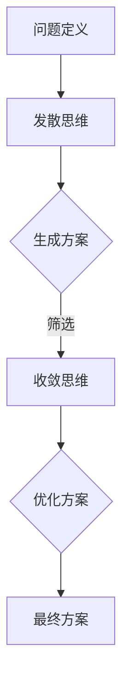

                 

### 概念与定义

在探讨AGI（通用人工智能）的创造性问题解决之前，我们需要明确几个关键概念的定义。创造性问题解决是指通过新颖的思维方式和创新的方法来识别、分析并解决复杂问题的过程。发散思维和收敛思维是创造性问题解决过程中的两种基本思维方式。

**发散思维**，又称为辐射思维或横向思维，是指从一个中心点出发，尽可能地生成多个可能的解决方案或想法。发散思维的特点是思维的灵活性和广度，它鼓励创新和探索新的方向。发散思维的核心在于跳出传统框架，尝试不同的视角和方法。

**收敛思维**，则是指从多个潜在的解决方案中，逐步筛选和提炼出最优解的过程。收敛思维强调逻辑性和条理性，通过分析、评估和整合信息，最终找到最佳的解决方案。与发散思维不同，收敛思维更注重深度和精度。

这两种思维方式在创造性问题解决中相辅相成。发散思维提供了丰富的创意和多样的可能性，而收敛思维则确保了这些可能性中最为实用和有效的方案被选出。在接下来的章节中，我们将深入探讨这两种思维方式的策略与方法，并分析它们在AGI创造性问题解决中的应用。

### 发散思维

发散思维，作为创造性问题解决过程中至关重要的一环，其核心在于思维的开放性和灵活性。在发散思维过程中，个体或团队被鼓励从一个中心点出发，自由地探索各种可能的解决方案或想法，不拘泥于传统框架和既定规则。

**发散思维的类型**主要包括：

- **产生式发散思维**：这是最常见的一种发散思维类型，它通过生成一系列的相关想法和解决方案，从而激发新的灵感。例如，在产品设计中，可以从一个核心功能出发，思考出多种实现方式、改进方案或创新点。
- **逆向发散思维**：这种思维方式从问题的反面出发，反向思考可能的解决方案。例如，在解决一个故障问题时，可以通过逆向思维，思考可能导致故障的各种原因，并逐一排查。
- **类比发散思维**：这种思维方式通过将现有问题与类似的问题进行类比，从而生成新的解决方案。例如，在医疗领域，可以将某种疾病的治疗方法类比到另一种疾病上，从而找到新的治疗方法。

**发散思维的策略与方法**：

- **头脑风暴法**：这是一种经典且广泛使用的发散思维方法。在头脑风暴过程中，参与者不被评价或限制，自由地提出各种想法。这种方法能够迅速激发创意，并产生大量的潜在解决方案。
- **6-3-5法**：这是一种结构化的发散思维方法。它要求参与者首先列出与问题相关的六个关键词，然后针对每个关键词提出三个可能的解决方案，最后从这些解决方案中选择五个最可行的进行深入探讨。
- **思维导图法**：这是一种图形化的发散思维方法。通过绘制思维导图，将问题、解决方案和相关信息可视化，从而帮助参与者更好地理解和分析问题，激发新的想法。

**发散思维的应用实例**：

- **产品创新**：在产品开发过程中，通过发散思维，团队可以从多个角度思考产品功能、用户体验和商业模式，从而设计出更具创新性和竞争力的产品。
- **问题解决**：在解决复杂问题时，发散思维可以帮助我们发现问题的多个维度，从而找到更全面和创新的解决方案。
- **决策制定**：在制定决策时，发散思维可以帮助我们评估各种可能的结果和影响，从而做出更明智的选择。

发散思维不仅是一种重要的思维方式，也是一种培养创造力的有效工具。通过不断的练习和应用，我们可以提高发散思维的能力，从而在创造性问题解决中更加得心应手。

### 收敛思维

收敛思维与发散思维相比，更注重逻辑性和系统性。在创造性问题解决过程中，收敛思维通过逐步筛选和整合信息，从多个潜在的解决方案中提炼出最优解。它不仅要求我们有清晰的思路，还需要我们具备良好的分析能力和判断力。

**收敛思维的类型**主要包括：

- **逻辑收敛思维**：这种思维方式通过逻辑推理和分析，逐步排除不合理的方案，找到最符合逻辑的解决方案。例如，在数学问题中，通过逻辑推理和证明，确定最终的答案。
- **经验收敛思维**：这种思维方式基于经验和事实，对潜在的解决方案进行评估和验证。例如，在工程设计中，通过实验和测试，确定最佳的设计方案。
- **理论收敛思维**：这种思维方式基于理论和知识体系，对潜在的解决方案进行筛选和整合。例如，在科学研究过程中，通过理论分析和模型验证，找到最有效的实验方法。

**收敛思维的策略与方法**：

- **逻辑分析法**：这种策略通过逻辑推理和分析，逐步排除不合理的方案，确保最终选择的解决方案是符合逻辑的。例如，在决策过程中，可以通过“如果...那么...”的逻辑链，逐步推导出最终的决策方案。
- **案例分析法**：这种策略通过分析和总结典型案例，找到解决问题的有效方法。例如，在企业管理中，可以通过分析成功的案例，总结出有效的管理经验，并应用到实际工作中。
- **模拟与推演法**：这种策略通过模拟和推演，预测潜在的解决方案在不同情况下的效果，从而选择最佳方案。例如，在军事演习中，通过模拟不同的战术和策略，找到最有效的作战方案。

**收敛思维的应用实例**：

- **项目管理**：在项目管理中，收敛思维可以帮助团队从多个可能的方案中，选择最合适的资源和时间安排，确保项目按时完成。
- **技术研发**：在技术研发过程中，收敛思维可以帮助团队从多个技术方案中，选择最优的技术路径，提高研发效率和成果质量。
- **决策制定**：在决策制定中，收敛思维可以帮助我们评估各种潜在的风险和收益，做出更明智的决策。

收敛思维不仅是一种思维方式，更是一种解决问题的方法。通过有效的收敛思维，我们可以从繁杂的信息中找到最有价值的解决方案，从而提高创造性问题解决的效果。

### AGI与创造性问题解决

AGI（通用人工智能）的兴起为创造性问题解决带来了新的机遇和挑战。与传统的AI系统不同，AGI具备跨领域的自主学习能力，能够在不同的场景下进行创新和优化。这使得AGI在创造性问题解决中具有独特的优势。

**AGI在创造性问题解决中的应用**：

- **艺术创作**：AGI可以通过深度学习和自然语言处理等技术，自动生成音乐、绘画和文学作品。例如，Google的Magenta项目利用深度学习技术，创作出具有艺术性的音乐作品。
- **科学发现**：AGI可以通过对海量数据的分析和挖掘，发现新的科学规律和理论。例如，DeepMind的AlphaGo通过自我对弈和策略搜索，提出了新的围棋策略，推动了围棋理论的发展。
- **工程设计**：AGI可以通过自动化设计工具，生成新颖的工程设计方案。例如，AeroFFaculty项目利用机器学习技术，设计出具有高空气动力性能的飞机。

**案例分析**：

- **艺术创作中的AGI应用**：以Google的Magenta项目为例，该项目通过深度学习技术，训练出一个能够生成音乐、绘画和文学作品的系统。该系统不仅能够模仿人类艺术家的创作风格，还能够生成全新的艺术作品。这种创新性应用展示了AGI在艺术创作中的潜力。
- **科学发现中的AGI应用**：以DeepMind的AlphaGo为例，该项目通过自我对弈和策略搜索，提出了新的围棋策略。这些策略不仅超越了人类顶尖选手，还为围棋理论的研究提供了新的视角。这种创新性应用展示了AGI在科学发现中的潜力。
- **工程设计中的AGI应用**：以AeroFFaculty项目为例，该项目利用机器学习技术，生成了一系列具有高空气动力性能的飞机设计方案。这些设计不仅优于传统设计方法，还为未来飞机的设计提供了新的思路。这种创新性应用展示了AGI在工程设计中的潜力。

AGI的创造性问题解决不仅展示了技术的进步，更为人类社会带来了无限的想象空间。通过不断地探索和应用，AGI将在更多领域发挥其创造性问题的解决能力，推动社会的进步和发展。

### 从发散到收敛的思维过程

在创造性问题解决过程中，发散思维和收敛思维相辅相成，共同推动问题从无到有、从模糊到清晰的转变。理解并掌握从发散到收敛的思维过程，对于提高创造性问题解决的效果至关重要。

**发散思维与收敛思维的平衡**：

发散思维和收敛思维并非孤立存在，而是相互依存、互为补充的。在创造性问题解决的过程中，首先需要通过发散思维探索各种可能的解决方案，确保思维的开放性和多样性。随后，通过收敛思维对这些方案进行筛选和优化，找到最合适的解决方案。

**思维过程的调整与优化**：

在实际应用中，我们需要根据问题的复杂程度和需求，灵活调整发散思维和收敛思维的比例。例如，在初期的概念验证阶段，可以更多地依赖发散思维，探索各种可能的方案。而在中后期的方案优化阶段，则需要更多地运用收敛思维，逐步筛选和优化解决方案。

**Mermaid流程图：从发散到收敛的思维过程**：

以下是一个简化的Mermaid流程图，展示了从发散到收敛的思维过程：

**发散思维**：
1. **问题定义**：明确需要解决的问题。
2. **生成方案**：运用发散思维，生成多个可能的解决方案。

**收敛思维**：
1. **筛选方案**：对生成的方案进行筛选，排除不合理的方案。
2. **优化方案**：对筛选出的方案进行优化，确保最终方案的有效性和可行性。

通过这个思维过程，我们可以系统地推进创造性问题解决，确保问题的最终解决既具有创新性，又具有实际可行性。

### 创造性问题解决的教育与应用

**创造性问题解决的教育策略**：

在教育领域，培养创造性问题解决能力是现代教育的重要内容。以下是一些有效的教育策略：

1. **跨学科教育**：鼓励学生跨学科学习，培养综合思维能力。例如，在物理、数学和计算机科学之间建立联系，促进学生从多个角度分析和解决问题。
2. **项目式学习**：通过项目式学习，让学生在实践中学习和应用创造性问题解决的方法。例如，组织学生进行科技竞赛、创新实验等。
3. **合作学习**：鼓励学生进行团队合作，通过交流和协作，激发创意和灵感。

**创造性问题解决的职场应用**：

在职场中，创造性问题解决能力同样至关重要。以下是一些常见的应用场景：

1. **产品创新**：在产品开发过程中，通过创造性问题解决，设计出满足市场需求、具有竞争力的产品。
2. **问题解决**：在面对复杂问题时，通过创造性问题解决，找到有效的解决方案，提升工作效率和效果。
3. **决策制定**：在制定决策时，通过创造性问题解决，评估各种潜在风险和收益，做出明智的选择。

**创造性问题解决的未来趋势**：

随着人工智能技术的发展，创造性问题解决能力将在未来发挥越来越重要的作用。以下是几个未来趋势：

1. **智能化辅助**：利用人工智能技术，为创造性问题解决提供智能化辅助，提高解决问题的效率和质量。
2. **个性化教育**：通过大数据和人工智能技术，实现个性化教育，培养学生的个性化创造性问题解决能力。
3. **跨领域合作**：鼓励不同领域之间的合作，通过跨界思维，推动创造性问题解决的创新和发展。

总结而言，创造性问题解决不仅是一种能力，更是一种思维方式。通过有效的教育策略和职场应用，我们可以不断提升自己的创造性问题解决能力，为个人和社会的进步贡献力量。

### 文章总结

本文以《AGI的创造性问题解决：从发散到收敛思维》为题，系统探讨了创造性问题解决在通用人工智能（AGI）中的应用与策略。首先，我们明确了创造性问题解决的定义及发散思维与收敛思维的概念，并分别介绍了它们的策略与方法。接着，通过案例分析展示了AGI在创造性问题解决中的实际应用。随后，我们详细分析了从发散到收敛的思维过程，强调了两者之间的平衡与优化。最后，探讨了创造性问题解决在教育与职场中的应用及未来趋势。

在创造性问题解决中，发散思维与收敛思维相辅相成，共同推动问题的解决与创新。通过本文的探讨，我们希望能帮助读者深入理解创造性问题解决的核心概念，提升在实际应用中的思维能力和创造力。

### 作者介绍

作者：AI天才研究院/AI Genius Institute & 禅与计算机程序设计艺术 /Zen And The Art of Computer Programming

AI天才研究院（AI Genius Institute）是一家专注于人工智能技术研究与应用的创新机构。我们的团队由世界顶级的人工智能专家、程序员和软件架构师组成，致力于推动人工智能技术的发展与应用。在《禅与计算机程序设计艺术》（Zen And The Art of Computer Programming）的启发下，我们通过深入的研究和不断的实践，将哲学思维与编程艺术相结合，为人工智能领域的发展贡献了独特的见解和创新方法。

