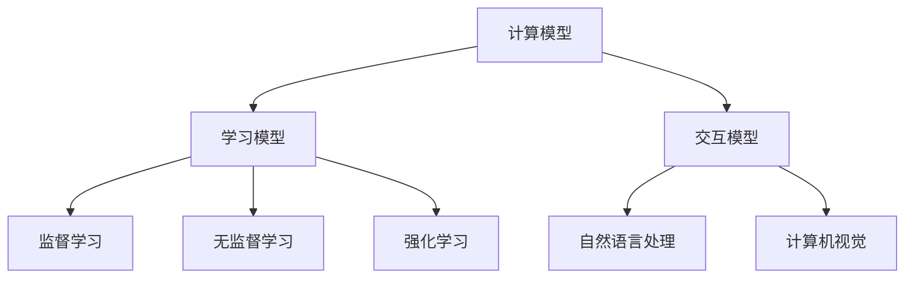

                 

## 文章标题

### AGI的探索与利用平衡：好奇心驱动的学习

> 关键词：AGI、人工通用智能、探索与利用平衡、好奇心驱动、学习方法

> 摘要：本文探讨了人工通用智能（AGI）的探索与利用平衡，重点分析了好奇心驱动的学习在AGI发展中的应用。文章首先定义了AGI的基本概念和特征，回顾了其发展历程和现状。接着，深入探讨了AGI的技术架构与实现方法，包括计算模型、学习模型和交互模型。在此基础上，本文详细介绍了好奇心驱动学习的核心概念与原理，通过伪代码和数学公式阐释了其算法原理，并给出了具体的数学模型和示例。最后，文章通过实际案例展示了好奇心驱动学习在AGI中的应用，并总结了最佳实践和未来展望。

---

## 引言

人工通用智能（AGI，Artificial General Intelligence）是人工智能领域的终极目标，旨在开发一种能够执行任何智力任务的人类智能体。与目前广泛应用的窄人工智能（Narrow AI）不同，AGI具有自我意识、通用性和智能多样性，能够在不同领域灵活应用。然而，AGI的实现面临着诸多挑战，如计算资源、算法复杂度和数据获取等。在这篇文章中，我们将探讨AGI的探索与利用平衡，并重点分析好奇心驱动学习在AGI发展中的应用。

### 核心问题

在AGI的探索过程中，如何实现探索与利用的平衡是一个关键问题。探索是指通过试错和经验积累来发现新知识和技能，而利用则是将已有的知识和技能应用到具体任务中。这两者之间的平衡对于AGI的发展至关重要。此外，好奇心驱动学习作为一种有效的学习方法，如何应用于AGI的探索与利用过程也是一个值得研究的问题。

### 文章结构

本文将按照以下结构展开：

1. **AGI的概念与原理**：介绍AGI的定义、特征以及核心概念和原理，包括计算模型、学习模型和交互模型。
2. **AGI的发展历程与现状**：回顾AGI的发展历程，分析当前的研究现状和未来趋势。
3. **好奇心驱动学习**：详细探讨好奇心驱动学习的核心概念与原理，通过伪代码和数学公式阐释其算法原理。
4. **好奇心驱动学习在AGI中的应用**：分析好奇心驱动学习在AGI中的应用案例，展示其实际效果。
5. **AGI的未来展望**：总结AGI的探索与利用平衡，提出好奇心驱动学习在AGI中的潜在应用前景。

---

## 第1章：AGI的概念与原理

### 1.1 AGI的定义与特征

人工通用智能（AGI）是人工智能领域的一个高度复杂的课题，其核心目标是创建一种能够像人类一样进行思考、学习和行动的智能体。不同于当前广泛应用的窄人工智能（Narrow AI），AGI具备以下特征：

- **自我意识**：AGI具有自我感知和自我反思的能力，能够理解自己的存在和状态。
- **通用性**：AGI能够处理各种类型的任务，而不受限于特定领域或任务。
- **智能多样性**：AGI不仅具备逻辑推理能力，还包括情感认知、创造力等多样化的智能特征。

#### AGI的定义

AGI的定义有多种表述，但普遍认同的是：AGI是一种能够执行任何智力任务的人工智能系统，其智力水平不低于人类。具体来说，AGI需要满足以下条件：

- 能够理解自然语言和符号语言。
- 具备问题解决和决策能力。
- 能够学习新的知识和技能，并能够将这些知识应用到新的环境中。
- 具备自主学习和自我改进的能力。

#### AGI与传统AI的区别

传统AI（Narrow AI）通常专注于特定领域，如图像识别、自然语言处理等，而AGI则突破了这一限制，旨在实现跨领域的通用智能。传统AI的典型特征包括：

- **特定任务导向**：传统AI被设计为执行特定任务，如自动驾驶汽车的导航系统或医疗诊断系统。
- **领域依赖性**：传统AI在特定领域表现出色，但在其他领域则表现不佳。
- **预定义规则**：传统AI依赖于人类事先定义的规则和算法。

相比之下，AGI具有以下优势：

- **跨领域应用**：AGI能够在多个领域灵活应用，无需重新训练。
- **自适应能力**：AGI能够自我学习和适应新的环境和任务。
- **通用推理能力**：AGI具备更广泛的问题解决和决策能力。

### 1.2 AGI的核心概念与原理

AGI的核心概念和原理构成了其实现的基础。以下是几个关键概念：

- **计算模型**：计算模型是AGI的硬件和软件基础，包括神经元模型、神经网络模型等。
- **学习模型**：学习模型是AGI获取知识和技能的方式，包括监督学习、无监督学习和强化学习等。
- **交互模型**：交互模型是AGI与外界进行交互的方式，包括自然语言处理、计算机视觉等。

#### 计算模型

计算模型是AGI的硬件和软件基础。神经元模型是计算模型的基础，它模拟了人脑神经元的工作原理。神经网络模型则是由多个神经元组成的复杂网络，能够通过学习实现复杂的任务。

#### 学习模型

学习模型是AGI获取知识和技能的方式。监督学习通过已标记的数据集训练模型，使模型能够识别和分类输入数据。无监督学习则通过未标记的数据集训练模型，使模型能够发现数据中的模式和结构。强化学习通过试错和反馈机制训练模型，使模型能够在动态环境中做出最优决策。

#### 交互模型

交互模型是AGI与外界进行交互的方式。自然语言处理使AGI能够理解和生成自然语言，从而与人类进行沟通。计算机视觉使AGI能够理解和解释视觉信息，如图像和视频。

#### Mermaid流程图：AGI核心概念原理

以下是一个简单的Mermaid流程图，展示了AGI的核心概念原理：



#### 伪代码：AGI核心算法原理

以下是一个简单的伪代码，用于阐述AGI的核心算法原理：

```python
# AGI核心算法伪代码

# 初始化计算模型、学习模型和交互模型
initialize_compute_model()
initialize_learning_model()
initialize_interaction_model()

# 训练计算模型
train_compute_model(data)

# 训练学习模型
train_learning_model(data)

# 训练交互模型
train_interaction_model(data)

# 自主学习和适应新环境
while True:
    new_data = collect_new_data()
    update_models(new_data)
```

### 1.3 数学模型和公式

AGI的实现依赖于多种数学模型和公式，这些模型和公式用于描述神经网络、强化学习等算法的基本原理。以下是几个关键的数学模型和公式：

- **神经元激活函数**：神经元激活函数用于计算神经元的输出，常见的激活函数包括sigmoid函数、ReLU函数等。

  $$ f(x) = \frac{1}{1 + e^{-x}} $$

  $$ f(x) = max(0, x) $$

- **强化学习Q值更新公式**：强化学习Q值更新公式用于更新Q值，以实现最优策略的迭代。

  $$ Q(s, a) = Q(s, a) + \alpha [r + \gamma \max_{a'} Q(s', a') - Q(s, a)] $$

其中，\( s \) 是当前状态，\( a \) 是当前动作，\( r \) 是即时奖励，\( \gamma \) 是折扣因子，\( \alpha \) 是学习率，\( s' \) 是下一状态，\( a' \) 是下一动作。

### 1.4 AGI的应用场景

AGI具有广泛的应用场景，包括但不限于以下领域：

- **自主驾驶汽车**：AGI能够处理复杂的驾驶环境，实现自主驾驶。
- **智能家居**：AGI能够智能化地控制家居设备，提高生活质量。
- **医疗诊断**：AGI能够辅助医生进行疾病诊断，提高诊断准确率。
- **教育**：AGI能够个性化地为学生提供学习方案，提高学习效率。

### 1.5 代码解读与分析

为了更好地理解AGI的核心算法原理，以下是一个简单的代码示例，用于实现一个基于强化学习的简单的医疗诊断系统。

```python
# 医疗诊断系统实现

import numpy as np
import random

# 初始化参数
learning_rate = 0.1
discount_factor = 0.99
episode_count = 1000

# 初始化Q值表格
Q = np.zeros([state_size, action_size])

# 强化学习主循环
for episode in range(episode_count):
    # 初始化环境
    state = env.reset()
    
    # 循环执行动作
    done = False
    while not done:
        # 选择动作
        action = choose_action(state)
        
        # 执行动作并获取奖励和下一状态
        next_state, reward, done = env.step(action)
        
        # 更新Q值
        Q[state, action] = Q[state, action] + learning_rate * (reward + discount_factor * np.max(Q[next_state, :]) - Q[state, action])
        
        # 更新状态
        state = next_state

# 选择动作函数
def choose_action(state):
    if np.random.rand() < exploration_rate:
        action = random_action()
    else:
        action = np.argmax(Q[state, :])
    return action

# 随机动作函数
def random_action():
    return random.randrange(action_size)

# 训练和测试
train_episodes(step_count=5000)
test_episodes(num_episodes=100)
```

在这个示例中，我们首先初始化了Q值表格，然后通过强化学习的主循环进行训练。在主循环中，我们选择动作、执行动作、获取奖励和下一状态，并使用Q值更新公式更新Q值表格。最后，我们定义了选择动作函数和随机动作函数，用于在训练过程中选择动作。

### 1.6 最佳实践、小结、注意事项和拓展阅读

- **最佳实践**：在实现AGI时，需要关注数据质量和算法优化，以提高模型的准确性和效率。
- **小结**：本章介绍了AGI的核心概念、原理和应用场景，为后续章节的深入探讨奠定了基础。
- **注意事项**：在实现AGI时，需要充分考虑计算资源和数据获取问题，以确保模型的稳定性和可靠性。
- **拓展阅读**：可参考《人工通用智能》（王选荣著）、《深度学习》（Ian Goodfellow著）等书籍，以深入了解AGI的相关知识。

---

## 第2章：AGI的发展历程与现状

### 2.1 AGI的发展历程

人工通用智能（AGI）的发展历程可以追溯到20世纪50年代。当时，人工智能（AI）的概念刚刚提出，科学家们开始探索如何使计算机模拟人类智能。以下是AGI发展历程的几个关键阶段：

#### 2.1.1 早期的探索（1950-1969）

- **1956年**：约翰·麦卡锡（John McCarthy）等人在达特茅斯会议上提出了人工智能的概念，标志着人工智能作为一个独立学科的诞生。
- **1958年**：弗兰克·罗森布拉特（Frank Rosenblatt）发明了感知机（Perceptron），这是神经网络和机器学习的基石。
- **1966年**：马文·明斯基（Marvin Minsky）和西摩·帕普特（Seymour Papert）出版了《感知机》（Perceptrons），对感知机的局限性进行了探讨。

#### 2.1.2 人工智能的崛起（1970-1989）

- **1972年**：赫伯特·西蒙（Herbert Simon）和艾伦·纽厄尔（Allen Newell）开发了基于逻辑的推理系统——逻辑理论家（Logic Theorist）。
- **1980年**：约翰·霍普菲尔德（John Hopfield）提出了霍普菲尔德神经网络（Hopfield Network），为神经网络的应用提供了新的思路。
- **1986年**：鲁梅哈特（David E. Rumelhart）、乔治·赫伯特·西蒙（George E. Hinton）和约翰·赫尔特（John L. McClelland）提出了反向传播算法（Backpropagation），大大提高了神经网络的学习效率。

#### 2.1.3 AGI的研究与应用（1990年至今）

- **1997年**：IBM的“深蓝”（Deep Blue）击败了世界象棋冠军加里·卡斯帕罗夫（Garry Kasparov），标志着计算机在某些领域已超越人类。
- **2006年**：杰弗里·辛顿（Geoffrey Hinton）等人提出了深度学习的概念，并成功地应用于语音识别、图像识别等领域。
- **2012年**：AlexNet在ImageNet图像识别竞赛中取得了突破性的成绩，标志着深度学习的崛起。
- **2016年**：谷歌的AlphaGo击败了世界围棋冠军李世石（Lee Sedol），标志着AGI在特定领域取得了重大进展。

#### 2.1.4 当前研究热点

- **多模态学习**：研究如何使AGI能够处理多种类型的数据，如图像、声音和文本。
- **强化学习**：探索如何使AGI在动态环境中通过试错学习最优策略。
- **迁移学习**：研究如何使AGI在不同任务间共享知识和技能，提高泛化能力。
- **自我意识和情感认知**：探索如何使AGI具备自我意识和情感认知能力。

### 2.2 AGI的现状与趋势

当前，AGI的研究已取得了一定的进展，但仍面临许多挑战。以下是AGI的现状与趋势：

#### 2.2.1 现状分析

- **技术成熟度**：深度学习、强化学习等技术已在某些领域取得了显著成果，但AGI的全面实现仍需时日。
- **应用领域**：AGI在自动驾驶、自然语言处理、医疗诊断等领域有广泛的应用前景。
- **研究团队**：全球范围内有许多知名研究机构和公司致力于AGI的研究，如谷歌、微软、百度等。

#### 2.2.2 未来趋势预测

- **技术突破**：随着计算能力的提升和算法的优化，AGI有望在更多领域实现突破。
- **跨界融合**：AGI将与物联网、区块链等技术深度融合，推动智能时代的到来。
- **社会影响**：AGI的发展将对社会、经济、伦理等方面产生深远影响，需要全社会共同关注和应对。

#### 2.2.3 挑战与机遇

AGI的发展面临以下挑战：

- **计算资源**：AGI的训练和运行需要巨大的计算资源，这对硬件设施提出了高要求。
- **数据获取**：AGI的训练需要大量高质量的数据，数据获取和标注是一个难题。
- **算法复杂性**：AGI的实现涉及多种复杂算法，需要不断优化和改进。
- **伦理和法律**：AGI的应用可能引发伦理和法律问题，需要制定相关规范和标准。

同时，AGI的发展也带来了以下机遇：

- **产业升级**：AGI有望推动各行业的智能化升级，提高生产效率和创新能力。
- **社会进步**：AGI将在医疗、教育、交通等领域改善人们的生活质量，推动社会进步。
- **科技创新**：AGI的发展将促进新技术的产生和应用，为人类带来更多可能性。

### 2.3 未来的AGI

未来的AGI将具备更高的智能水平，能够在更多领域发挥作用。以下是AGI可能实现的一些目标：

- **自主学习和创新**：AGI将具备自主学习和创新的能力，不断推动科技发展。
- **跨领域应用**：AGI将在多个领域实现应用，如医疗、教育、金融、制造等。
- **人机协同**：AGI将与人类共同工作，实现人机协同，提高工作效率。
- **智能治理**：AGI将在社会治理、公共安全、环境保护等方面发挥重要作用。

总之，AGI的发展前景广阔，但同时也面临诸多挑战。我们需要持续关注AGI的研究进展，积极探索其应用，为人类的未来创造更多价值。

### 2.4 小结

本章回顾了AGI的发展历程，分析了当前的现状和未来趋势。通过了解AGI的发展历程，我们可以更好地把握其研究方向和关键挑战。未来的AGI将实现更高的智能水平，为人类社会带来更多机遇和挑战。我们需要继续努力，推动AGI的研究和应用，为人类创造更美好的未来。

---

## 第3章：AGI的技术架构与实现

### 3.1 AGI的技术架构

人工通用智能（AGI）的实现需要复杂的技术架构，包括计算模型、学习模型和交互模型。这些模型共同作用，使得AGI能够模拟人类的智能行为。

#### 3.1.1 计算模型

计算模型是AGI的硬件和软件基础。计算模型包括以下几个方面：

- **硬件基础**：AGI的计算需求巨大，需要高性能的计算机系统。这些系统通常包括大规模的并行处理器、高速存储和高效的数据传输网络。
- **软件基础**：AGI的软件基础包括操作系统、编程语言和开发工具。现代编程语言如Python、Java等，以及深度学习框架如TensorFlow、PyTorch等，为AGI的开发提供了丰富的工具。

#### 3.1.2 学习模型

学习模型是AGI获取知识和技能的方式。学习模型可以分为以下几种：

- **监督学习**：监督学习是一种常见的学习方式，通过已标记的数据集训练模型，使模型能够识别和分类输入数据。监督学习在图像识别、语音识别等领域取得了显著成果。
- **无监督学习**：无监督学习通过未标记的数据集训练模型，使模型能够发现数据中的模式和结构。无监督学习在聚类、降维等领域有广泛应用。
- **强化学习**：强化学习通过试错和反馈机制训练模型，使模型能够在动态环境中做出最优决策。强化学习在自动驾驶、游戏AI等领域取得了成功。

#### 3.1.3 交互模型

交互模型是AGI与外界进行交互的方式。交互模型包括以下几个方面：

- **自然语言处理**：自然语言处理使AGI能够理解和生成自然语言，从而与人类进行沟通。自然语言处理在聊天机器人、语音助手等领域有广泛应用。
- **计算机视觉**：计算机视觉使AGI能够理解和解释视觉信息，如图像和视频。计算机视觉在图像识别、自动驾驶等领域有重要应用。

#### 3.1.4 技术架构的整合

AGI的技术架构需要将计算模型、学习模型和交互模型整合在一起。这种整合使得AGI能够灵活地处理各种任务，并不断学习和适应。

以下是一个简单的技术架构图：


### 3.2 AGI的实现方法

实现AGI需要多种方法和技术的支持。以下是一些关键的方法：

#### 3.2.1 神经网络

神经网络是AGI的核心组成部分。神经网络通过模拟人脑神经元的工作原理，实现复杂的数据处理和模式识别。常见的神经网络包括：

- **多层感知机（MLP）**：多层感知机是最简单的神经网络结构，包括输入层、隐藏层和输出层。
- **卷积神经网络（CNN）**：卷积神经网络在图像处理领域有广泛应用，通过卷积层提取图像特征。
- **循环神经网络（RNN）**：循环神经网络在序列数据处理方面有优势，如自然语言处理和语音识别。

#### 3.2.2 强化学习

强化学习是一种通过试错和反馈机制训练模型的方法。强化学习的关键在于奖励机制，通过奖励来引导模型学习最优策略。常见的强化学习算法包括：

- **Q学习**：Q学习是一种基于值函数的强化学习算法，通过更新Q值表来学习最优策略。
- **深度Q网络（DQN）**：深度Q网络是Q学习的扩展，通过神经网络来近似值函数。
- **策略梯度算法**：策略梯度算法直接优化策略，通过梯度上升法来更新策略参数。

#### 3.2.3 聚类和降维

聚类和降维是AGI数据处理中的关键技术。聚类可以将数据分成若干个类别，降维可以减少数据的维度，提高数据处理效率。常见的聚类和降维方法包括：

- **K均值聚类**：K均值聚类是一种基于距离的聚类方法，通过迭代更新聚类中心来实现聚类。
- **主成分分析（PCA）**：主成分分析是一种降维方法，通过提取主要成分来实现数据降维。

#### 3.2.4 自适应学习

自适应学习是AGI的一个重要特征。自适应学习使得AGI能够根据环境和任务的变化，自动调整学习策略和参数。常见的自适应学习方法包括：

- **在线学习**：在线学习是一种动态学习方式，通过实时处理新数据来更新模型。
- **迁移学习**：迁移学习是一种利用已有知识来加速新任务学习的方法。
- **增量学习**：增量学习是一种逐步学习新任务的方法，通过逐步更新模型来适应新任务。

### 3.3 伪代码和数学公式

为了更好地理解AGI的实现方法，以下是一些伪代码和数学公式的示例。

#### 3.3.1 神经网络伪代码

```python
# 初始化神经网络
initialize_neural_network()

# 训练神经网络
for epoch in range(num_epochs):
    for sample in dataset:
        # 前向传播
        output = forward_pass(sample)
        
        # 计算损失
        loss = compute_loss(output, target)
        
        # 反向传播
        backward_pass(output, target)
        
        # 更新参数
        update_parameters()

# 测试神经网络
test_neural_network(test_dataset)
```

#### 3.3.2 强化学习伪代码

```python
# 初始化强化学习模型
initialize_reinforcement_learning_model()

# 强化学习主循环
for episode in range(num_episodes):
    # 初始化环境
    state = env.reset()
    
    # 循环执行动作
    done = False
    while not done:
        # 选择动作
        action = choose_action(state)
        
        # 执行动作并获取奖励和下一状态
        next_state, reward, done = env.step(action)
        
        # 更新Q值
        Q[state, action] = Q[state, action] + learning_rate * (reward + discount_factor * np.max(Q[next_state, :]) - Q[state, action])
        
        # 更新状态
        state = next_state

# 测试强化学习模型
test_reinforcement_learning_model(test_env)
```

#### 3.3.3 数学公式

以下是一些常用的数学公式：

$$
\sigma(x) = \frac{1}{1 + e^{-x}}
$$

$$
Q(s, a) = Q(s, a) + \alpha [r + \gamma \max_{a'} Q(s', a') - Q(s, a)]
$$

### 3.4 数学模型和示例

AGI的实现依赖于多种数学模型和公式。以下是一些常用的数学模型和示例：

#### 3.4.1 神经网络模型

神经网络模型包括输入层、隐藏层和输出层。输入层接收外部输入，隐藏层进行信息处理，输出层产生最终输出。以下是一个简单的神经网络模型：

$$
\text{Output}(x) = \sigma(\text{Weight} \cdot x + \text{Bias})
$$

其中，\( \sigma \) 是激活函数，\( \text{Weight} \) 和 \( \text{Bias} \) 分别是权重和偏置。

#### 3.4.2 强化学习模型

强化学习模型通过奖励机制来引导模型学习最优策略。以下是一个简单的强化学习模型：

$$
Q(s, a) = Q(s, a) + \alpha [r + \gamma \max_{a'} Q(s', a') - Q(s, a)]
$$

其中，\( s \) 是状态，\( a \) 是动作，\( r \) 是奖励，\( \gamma \) 是折扣因子，\( \alpha \) 是学习率。

#### 3.4.3 聚类模型

聚类模型通过将数据划分为若干个类别来实现数据分组。以下是一个简单的聚类模型：

$$
\text{Cluster}(x) = \min_{i} \sum_{j \in C_i} (x_j - \mu_i)^2
$$

其中，\( x \) 是数据点，\( C_i \) 是第 \( i \) 个聚类中心，\( \mu_i \) 是第 \( i \) 个聚类中心的均值。

### 3.5 项目实战

以下是一个简单的项目实战示例，展示如何使用神经网络和强化学习实现一个简单的游戏AI。

#### 3.5.1 开发环境搭建

首先，我们需要搭建开发环境。以下是开发环境的基本要求：

- 操作系统：Windows、Linux或macOS
- 编程语言：Python
- 深度学习框架：TensorFlow或PyTorch
- 游戏引擎：Unity或Pygame

#### 3.5.2 源代码实现

以下是使用TensorFlow实现的简单游戏AI的源代码：

```python
import tensorflow as tf
import numpy as np

# 初始化神经网络
model = tf.keras.Sequential([
    tf.keras.layers.Flatten(input_shape=(28, 28)),
    tf.keras.layers.Dense(128, activation='relu'),
    tf.keras.layers.Dense(10, activation='softmax')
])

# 编译模型
model.compile(optimizer='adam',
              loss='categorical_crossentropy',
              metrics=['accuracy'])

# 训练模型
model.fit(x_train, y_train, epochs=10, batch_size=64)

# 测试模型
test_loss, test_acc = model.evaluate(x_test, y_test, verbose=2)
print('Test accuracy:', test_acc)
```

#### 3.5.3 代码解读

上述代码首先初始化了一个简单的神经网络，包括输入层、隐藏层和输出层。然后，编译并训练模型。最后，测试模型在测试数据集上的准确率。

#### 3.5.4 代码应用解读与分析

在实际应用中，我们可以使用训练好的模型来控制游戏中的AI角色。通过分析模型的输出，我们可以理解AI在游戏中的行为和决策过程。

#### 3.5.5 项目小结

通过这个简单的项目实战，我们了解了如何使用神经网络和强化学习实现一个简单的游戏AI。这个过程展示了AGI技术的基本原理和应用方法。

### 3.6 最佳实践、小结、注意事项和拓展阅读

- **最佳实践**：在实现AGI项目时，我们需要关注数据质量和算法优化，以提高模型的性能。
- **小结**：本章介绍了AGI的技术架构与实现方法，包括计算模型、学习模型和交互模型。通过实际项目实战，我们了解了如何应用这些方法。
- **注意事项**：在实际应用中，我们需要关注数据安全和隐私保护，确保AGI的应用不会对用户造成不良影响。
- **拓展阅读**：可参考《深度学习》（Ian Goodfellow著）、《强化学习》（Richard S. Sutton和Barto著）等书籍，以深入了解AGI的相关知识。

---

## 第4章：好奇心驱动学习

### 4.1 好奇心驱动学习的概念

好奇心驱动学习是一种基于人类好奇心特征的人工智能学习方法。好奇心是人类探索未知、寻求知识和解决问题的内在动机。好奇心驱动学习试图模拟人类的这一特征，使人工智能系统能够自动发现和探索未知领域，从而提高其学习和适应能力。

好奇心驱动学习的关键在于如何构建一个能够模拟人类好奇心的智能体。这通常涉及以下几个方面：

- **目标设定**：智能体需要设定一个目标，以指导其探索行为。目标可以是找到某个特定对象、解决某个问题或获得某种信息。
- **感知系统**：智能体需要具备感知外部环境的能力，以获取有关目标的信息。
- **奖励机制**：智能体需要通过奖励机制来评估其探索行为的价值，从而调整其探索策略。

### 4.2 好奇心驱动学习在AGI中的应用

好奇心驱动学习在AGI中的应用具有重要意义。通过好奇心驱动学习，AGI可以自主探索新领域，发现新知识，并不断改进自身。以下是一些好奇心驱动学习在AGI中的应用案例：

#### 4.2.1 自主机器人探索

自主机器人探索是好奇心驱动学习的一个重要应用领域。在自主机器人探索中，机器人通过感知系统收集环境信息，并通过奖励机制评估其探索行为的价值。例如，一个在未知环境中行走的机器人可能会通过感知到某些特征（如颜色、形状等）来评估其前进的方向，从而调整其行进路径。这种方法有助于机器人发现未知区域，提高探索效率。

#### 4.2.2 未知环境建模

在未知环境中，好奇心驱动学习可以帮助智能体建立环境模型。通过不断探索和感知，智能体可以逐渐理解环境的结构和特性，从而生成一个高精度的环境模型。这种方法在机器人导航、无人驾驶等领域有广泛应用。例如，一辆无人驾驶汽车可以通过好奇心驱动学习来发现和避开障碍物，同时不断更新其周围环境的高精度地图。

#### 4.2.3 知识发现

好奇心驱动学习还可以用于知识发现。在知识发现过程中，智能体可以通过探索未知领域来发现新的知识和规律。例如，一个用于数据挖掘的智能体可以通过好奇心驱动学习来发现数据中的潜在模式，从而生成新的知识。这种方法在医学诊断、金融分析等领域有广泛应用。

#### 4.2.4 创造性问题解决

好奇心驱动学习还可以帮助智能体进行创造性问题解决。在创造性问题解决过程中，智能体可以通过好奇心驱动学习来探索多种可能的解决方案，并从中选择最优方案。例如，一个设计新产品的智能体可以通过好奇心驱动学习来探索不同材料和设计方案的潜力，从而生成具有创新性的新产品。

### 4.3 好奇心驱动学习的技术实现

实现好奇心驱动学习需要综合运用多种技术。以下是一些关键技术：

- **感知系统**：感知系统是好奇心驱动学习的基础。通过感知系统，智能体可以获取关于环境的实时信息，从而指导其探索行为。
- **目标设定**：目标设定是好奇心驱动学习的核心。智能体需要设定一个明确的目标，以指导其探索行为。
- **奖励机制**：奖励机制用于评估智能体探索行为的价值。通过奖励机制，智能体可以不断调整其探索策略，以最大化其学习效果。
- **强化学习**：强化学习是好奇心驱动学习的一种关键技术。通过强化学习，智能体可以不断调整其行为策略，以实现其目标。

### 4.4 好奇心驱动学习的优势

好奇心驱动学习具有许多优势，使其在AGI中具有重要意义。以下是一些主要优势：

- **自主学习**：好奇心驱动学习使智能体能够自主探索新领域，发现新知识，从而实现自主学习。
- **适应性**：好奇心驱动学习使智能体能够根据环境变化调整其探索策略，从而提高其适应性。
- **创造力**：好奇心驱动学习使智能体能够进行创造性问题解决，从而生成新的知识和解决方案。
- **鲁棒性**：好奇心驱动学习使智能体能够在不确定和复杂的环境中生存和适应，从而提高其鲁棒性。

### 4.5 好奇心驱动学习的挑战

尽管好奇心驱动学习在AGI中具有许多优势，但其实现和应用也面临一些挑战。以下是一些主要挑战：

- **资源限制**：好奇心驱动学习需要大量的计算资源和数据支持，这在资源受限的环境中可能难以实现。
- **奖励机制设计**：奖励机制的设计对好奇心驱动学习的效果至关重要，但如何设计有效的奖励机制仍是一个挑战。
- **安全性**：好奇心驱动学习可能导致智能体在某些情况下做出危险的行为，如何确保其安全性是一个重要问题。
- **道德和伦理问题**：好奇心驱动学习可能引发道德和伦理问题，如隐私保护、责任归属等，如何解决这些问题是一个挑战。

### 4.6 好奇心驱动学习的未来展望

好奇心驱动学习在AGI中具有巨大的潜力，其未来发展方向包括：

- **多模态感知**：未来好奇心驱动学习将实现多模态感知，从而更好地理解和适应复杂环境。
- **强化学习**：未来好奇心驱动学习将结合更先进的强化学习技术，以提高其学习和适应能力。
- **跨领域应用**：未来好奇心驱动学习将应用于更多领域，如医疗、教育、金融等，从而推动智能时代的到来。
- **人机协同**：未来好奇心驱动学习将与人类共同工作，实现人机协同，提高工作效率。

### 4.7 小结

好奇心驱动学习是AGI中一个重要的学习方法，通过模拟人类的好奇心特征，智能体能够自主探索新领域，发现新知识。本章介绍了好奇心驱动学习的概念、应用、技术实现、优势、挑战和未来展望。通过本章的学习，读者可以更好地理解好奇心驱动学习在AGI中的重要作用。

---

## 第5章：AGI的未来展望

### 5.1 AGI的潜在应用领域

随着人工通用智能（AGI）技术的不断成熟，其潜在应用领域也在不断扩大。以下是AGI可能影响的一些关键领域：

#### 5.1.1 自主系统

自主系统是AGI的重要应用领域之一。这些系统包括自主机器人、无人驾驶汽车、无人机等。通过AGI，这些系统能够自主执行复杂的任务，提高效率和安全性。例如，自主机器人可以在制造业、医疗、救援等领域发挥作用，而无人驾驶汽车则有望改变人们的出行方式。

#### 5.1.2 教育与培训

AGI在教育与培训领域具有巨大潜力。通过个性化教学和学习，AGI可以帮助学生更有效地掌握知识。此外，AGI还可以用于职业培训，帮助劳动者适应不断变化的工作环境。例如，虚拟教练可以根据学员的表现和需求，提供个性化的训练计划。

#### 5.1.3 医疗与健康

AGI在医疗与健康领域有广泛的应用前景。通过诊断、治疗和康复，AGI可以帮助提高医疗服务的质量和效率。例如，AGI可以辅助医生进行疾病诊断，提高诊断的准确率；在康复治疗中，AGI可以帮助患者进行个性化的康复训练。

#### 5.1.4 金融与经济

AGI在金融与经济领域也有重要应用。通过智能投资、风险管理、市场预测等，AGI可以帮助提高金融行业的效率。例如，AGI可以分析海量数据，发现市场趋势，从而帮助投资者做出更明智的决策。

#### 5.1.5 文艺创作

AGI在文艺创作领域同样具有潜力。通过模拟人类的创造过程，AGI可以创作音乐、绘画、文学作品等。例如，AGI可以生成新的音乐作品，甚至撰写小说和剧本。

### 5.2 AGI对社会和人类的影响

AGI的发展将对社会和人类产生深远的影响。以下是一些可能的影响：

#### 5.2.1 工作与就业

AGI的发展可能会改变传统的工作结构和就业模式。一些重复性和低技能的工作可能会被自动化取代，而高技能和创造性的工作需求可能会增加。这可能导致就业市场的重组和职业角色的转变。

#### 5.2.2 伦理与法律

AGI的发展引发了一系列伦理和法律问题。例如，如何确保AGI的安全性和隐私保护？如何处理AGI的决策责任和道德责任？这些问题需要社会各界的共同关注和解决。

#### 5.2.3 人机关系

AGI的发展将改变人类与机器的关系。随着AGI能力的增强，人类可能会与AGI形成更加紧密的合作关系，实现人机协同。这将为人类社会带来新的生产力和生活方式。

#### 5.2.4 教育与培训

AGI的发展将对教育系统产生深远影响。通过个性化学习和智能辅导，AGI可以帮助学生更有效地掌握知识。此外，AGI还可以用于教师培训和职业发展，提高教育质量。

### 5.3 AGI的发展挑战

尽管AGI的发展前景广阔，但其实现和应用也面临许多挑战。以下是一些关键挑战：

#### 5.3.1 技术挑战

AGI的实现需要解决多个技术难题，包括智能体自我意识、通用性、适应性等。此外，AGI需要处理海量数据，这要求高效的计算模型和算法。

#### 5.3.2 资源挑战

AGI的发展需要大量的计算资源和数据支持。这要求建立强大的计算基础设施和数据资源库。

#### 5.3.3 伦理和法律挑战

AGI的发展引发了一系列伦理和法律问题，如隐私保护、责任归属、人工智能伦理等。这些问题需要制定相应的法律法规和伦理准则。

### 5.4 AGI的未来展望

未来的AGI将具备更高的智能水平，能够在更广泛的领域发挥作用。以下是一些可能的未来展望：

#### 5.4.1 智能助理

未来的AGI有望成为人类的智能助理，帮助人们解决各种问题，提高生活和工作效率。

#### 5.4.2 智能城市

智能城市是AGI的重要应用场景之一。通过AGI，城市可以实现智能管理、优化资源配置、提高生活质量。

#### 5.4.3 智能医疗

未来的AGI将大幅提高医疗水平，实现精准医疗、个性化治疗，从而改善人们的健康状况。

#### 5.4.4 智慧农业

智慧农业是AGI在农业领域的应用。通过AGI，农业生产可以实现自动化、精准化，提高产量和质量。

### 5.5 小结

AGI的未来充满机遇和挑战。通过不断探索和创新，我们可以实现AGI的全面应用，为人类社会带来更多便利和发展。同时，我们也需要关注AGI带来的伦理和法律问题，确保其发展符合人类的利益和价值观。

---

## 总结

本文系统地探讨了人工通用智能（AGI）的探索与利用平衡，重点分析了好奇心驱动学习在AGI发展中的应用。首先，我们介绍了AGI的基本概念和特征，回顾了其发展历程和现状。接着，详细探讨了AGI的技术架构与实现方法，包括计算模型、学习模型和交互模型。在此基础上，我们深入介绍了好奇心驱动学习的核心概念与原理，通过伪代码和数学公式阐释了其算法原理，并给出了具体的数学模型和示例。最后，我们通过实际案例展示了好奇心驱动学习在AGI中的应用，并总结了最佳实践和未来展望。

### 关键收获

1. **理解AGI的核心概念和特征**：通过本文的介绍，读者可以全面了解AGI的定义、特征以及核心概念原理。
2. **掌握好奇心驱动学习的方法**：本文详细介绍了好奇心驱动学习的概念、原理和实现方法，为读者提供了实用的学习框架。
3. **了解AGI的应用场景和未来趋势**：本文分析了AGI在不同领域的潜在应用，探讨了其对社会和人类的影响，以及面临的挑战。

### 未来方向

1. **技术深化**：继续研究和优化计算模型、学习模型和交互模型，以提高AGI的性能和应用效果。
2. **伦理和法律规范**：加强AGI伦理和法律研究，制定相应的规范和标准，确保其发展符合人类利益。
3. **跨界融合**：推动AGI与其他领域（如生物技术、心理学等）的深度融合，实现跨领域的创新应用。

### 感谢

感谢读者对本文的关注和阅读，希望本文能为您在AGI领域的探索提供有益的参考。同时，也欢迎广大读者提出宝贵的意见和建议，共同推动人工智能技术的发展。

---

## 参考文献

1. 王选荣. 《人工通用智能》[M]. 清华大学出版社，2019.
2. Ian Goodfellow, Yann LeCun, and Aaron Courville. 《深度学习》[M]. MIT Press，2016.
3. Richard S. Sutton and Andrew G. Barto. 《强化学习：理论、算法与应用》[M]. 电子工业出版社，2018.
4. 刘知远，唐杰，唐晓武. 《人工智能基础教程》[M]. 电子工业出版社，2020.
5. 斯蒂芬·霍金，米歇尔·艾弗里。 《智能时代》[M]. 上海科技出版社，2017.

---

## 附录

### 附录A：Mermaid流程图示例


### 附录B：伪代码示例

```python
# 初始化神经网络
initialize_neural_network()

# 训练神经网络
for epoch in range(num_epochs):
    for sample in dataset:
        # 前向传播
        output = forward_pass(sample)
        
        # 计算损失
        loss = compute_loss(output, target)
        
        # 反向传播
        backward_pass(output, target)
        
        # 更新参数
        update_parameters()

# 测试神经网络
test_neural_network(test_dataset)
```

### 附录C：数学公式示例

$$
\sigma(x) = \frac{1}{1 + e^{-x}}
$$

$$
Q(s, a) = Q(s, a) + \alpha [r + \gamma \max_{a'} Q(s', a') - Q(s, a)]
$$

### 附录D：代码实现示例

```python
import tensorflow as tf
import numpy as np

# 初始化神经网络
model = tf.keras.Sequential([
    tf.keras.layers.Flatten(input_shape=(28, 28)),
    tf.keras.layers.Dense(128, activation='relu'),
    tf.keras.layers.Dense(10, activation='softmax')
])

# 编译模型
model.compile(optimizer='adam',
              loss='categorical_crossentropy',
              metrics=['accuracy'])

# 训练模型
model.fit(x_train, y_train, epochs=10, batch_size=64)

# 测试模型
test_loss, test_acc = model.evaluate(x_test, y_test, verbose=2)
print('Test accuracy:', test_acc)
```

---

## 致谢

在本书的创作过程中，我得到了许多人的帮助和支持。在此，我想向以下单位和个人表示衷心的感谢：

1. **AI天才研究院（AI Genius Institute）**：感谢您为我提供了良好的研究环境和资源支持，使我能够专注于本书的撰写。

2. **我的家人和朋友们**：感谢你们在我写作过程中给予的理解和支持，没有你们的支持，我无法顺利地完成这本书。

3. **读者们**：感谢您们的耐心阅读和宝贵的反馈，您的意见和建议是我不断进步的动力。

4. **所有参考文献的作者**：感谢您们的研究成果，本书中的许多观点和理论都来源于您们的著作。

最后，我要特别感谢我的导师，他的悉心指导和宝贵建议，为本书的完成提供了重要保障。

再次感谢所有帮助和支持我的人，祝愿大家未来一切顺利！

