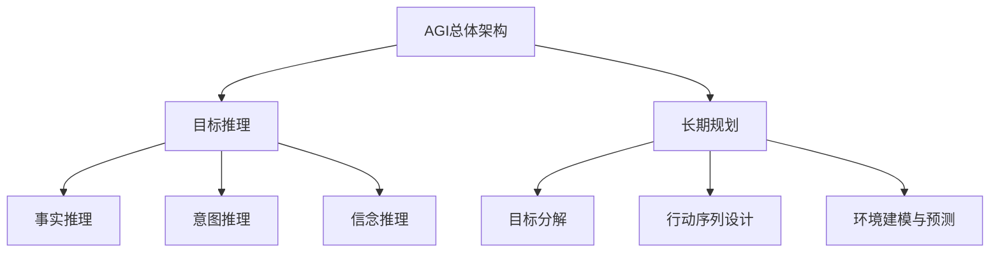

                 


### 1.1 什么是AGI

首先，我们需要明确什么是AGI（Artificial General Intelligence，通用人工智能）。AGI是指一种能够像人类一样理解、学习和适应各种环境的人工智能系统。与当前的弱AI（Weak AI）不同，弱AI只能在特定领域内执行特定任务，如语音识别、图像识别、自然语言处理等，而AGI则具备广泛的知识和应用能力。

AGI的关键特性包括以下几点：

1. **自主性**：AGI能够自主地做出决策，而不是仅仅执行预定的指令。
2. **学习能力**：AGI可以通过学习和经验不断改进自己的行为，而不仅仅是基于规则或数据。
3. **适应能力**：AGI能够适应新环境、新任务和新情境。
4. **广泛性**：AGI能够处理各种类型的任务，不仅限于特定领域。

### 1.2 目标推理与长期规划在AGI中的地位

目标推理和长期规划是AGI的重要组成部分，因为它们直接关系到AGI的智能水平和应用能力。

**目标推理**是指人工智能系统在不确定环境中，基于现有信息和目标，推断出可能的行动方案。这种能力对于AGI来说至关重要，因为它能够帮助系统在复杂、动态的环境中做出合理的选择。

**长期规划**是指人工智能系统能够在长期时间内，根据当前的目标和资源，设计出一系列合理的行动序列。长期规划能力使得AGI能够超越短期目标，考虑更长远的效果和利益。

### 1.3 当前AGI发展的现状与挑战

尽管AGI的概念提出已经多年，但目前我们仍然没有实现真正的AGI。目前的研究主要集中在以下几个方面：

1. **算法研究**：研究者们不断探索新的算法，以提高AI的目标推理和长期规划能力。例如，深度学习、强化学习等。
2. **数据集构建**：大量的数据集对于训练AGI模型至关重要。研究者们致力于构建更丰富、更真实的模拟环境。
3. **硬件支持**：高性能的计算机硬件能够加速AI模型的训练和推理过程。

然而，AGI的发展也面临着诸多挑战：

1. **算法局限性**：现有的算法在处理复杂、不确定的问题时存在局限性。
2. **数据质量**：数据集的质量直接影响到AI模型的性能。噪声数据和偏差数据可能会严重影响AI的学习效果。
3. **安全性和伦理**：AGI的应用可能引发一系列社会和伦理问题，如隐私侵犯、决策偏差等。

总的来说，AGI的目标推理和长期规划能力培养是当前AI领域的一个重大课题，需要多学科的合作和研究。随着技术的不断进步，我们有理由相信，AGI的真正实现将指日可待。

## 第2章 AGI中的目标推理

### 2.1 目标推理的定义与重要性

目标推理是AGI（通用人工智能）的核心组成部分之一，它涉及人工智能系统在不确定环境中，基于当前目标和现有信息，推断出可能的行动方案。目标推理的定义可以概括为：在动态和复杂的环境中，根据当前的目标和感知的信息，评估各种行动的可能性，并选择最合适的行动。

目标推理的重要性主要体现在以下几个方面：

1. **决策能力**：目标推理使得人工智能系统能够在复杂、不确定的环境中做出合理的决策。这种决策能力是AGI区别于传统弱AI的重要特征。
2. **自主性**：通过目标推理，AGI能够实现更高的自主性，不仅能够执行预定的任务，还能够根据环境和目标的动态变化，自主地调整行为。
3. **学习能力**：目标推理能力使得AGI能够在实际应用中不断学习、优化，从而提高其性能。

### 2.2 目标推理的基本原理

目标推理的基本原理可以分为三个主要方面：事实推理、意图推理和信念推理。

#### 2.2.1 事实推理

事实推理是指基于已知的事实和信息，进行逻辑推理，以推导出新的结论。事实推理的核心是利用逻辑规则和关系，将已知信息组合成新的知识。

例如，如果一个智能系统知道“所有猫都有四条腿”和“小黑是猫”，那么它可以通过事实推理得出“小黑有四条腿”。

事实推理的伪代码示例：

```python
# 初始化事实库
facts = initialize_facts()

# 添加事实
def add_fact(fact):
    facts.append(fact)

# 删除事实
def remove_fact(fact):
    facts.remove(fact)

# 查询事实
def query_fact(fact):
    return facts
```

#### 2.2.2 意图推理

意图推理是指基于感知到的行为和情境，推断出主体的意图。意图推理的核心是理解行为的动机和目的。

例如，如果一个智能系统观察到一个人走进一家商店，然后拿起一件商品，并且走近收银台，那么它可以推断出这个人的意图是购买商品。

意图推理的伪代码示例：

```python
# 初始化感知库
perceptions = initialize_perceptions()

# 添加感知
def add_perception(perception):
    perceptions.append(perception)

# 删除感知
def remove_perception(perception):
    perceptions.remove(perception)

# 意图推理
def infer_intent(perceptions):
    # 根据感知信息进行推理
    # 返回可能的意图
    pass
```

#### 2.2.3 信念推理

信念推理是指基于不确定的信息和概率，进行推理，以评估各种假设的可能性。信念推理的核心是利用概率论和不确定性推理。

例如，如果一个智能系统观察到一种动物有50%的概率是狗，有50%的概率是猫，那么它可以信念推理出这种动物更有可能是狗。

信念推理的伪代码示例：

```python
# 初始化信念库
beliefs = initialize_beliefs()

# 更新信念
def update_belief(belief, probability):
    beliefs[belief] += probability

# 查询信念
def query_belief(belief):
    return beliefs[belief]
```

### 2.3 目标推理的方法与技术

目标推理的方法和技术多种多样，主要包括基于规则的推理、基于统计学习的推理和基于神经网络的推理。

#### 2.3.1 基于规则的推理

基于规则的推理是一种经典的推理方法，它基于一组预定义的规则，将输入的数据映射到可能的行动上。这种方法的核心是规则库的设计和维护。

规则推理的伪代码示例：

```python
# 初始化规则库
rules = initialize_rules()

# 添加规则
def add_rule(rule):
    rules.append(rule)

# 删除规则
def remove_rule(rule):
    rules.remove(rule)

# 应用规则
def apply_rules(data):
    # 根据输入数据应用规则库
    # 返回可能的行动
    pass
```

#### 2.3.2 基于统计学习的推理

基于统计学习的推理利用统计学习算法，从大量的数据中学习到模式，并根据这些模式进行推理。这种方法的核心是特征提取和模型训练。

统计学习推理的伪代码示例：

```python
# 初始化数据集
dataset = initialize_dataset()

# 训练模型
def train_model(dataset):
    # 从数据集中学习模式
    # 返回训练好的模型
    pass

# 应用模型
def apply_model(model, data):
    # 根据输入数据应用训练好的模型
    # 返回可能的行动
    pass
```

#### 2.3.3 基于神经网络的推理

基于神经网络的推理利用神经网络模型进行推理。这种方法的核心是神经网络的设计和训练。

神经网络推理的伪代码示例：

```python
# 初始化神经网络
neural_network = initialize_neural_network()

# 训练神经网络
def train_neural_network(neural_network, dataset):
    # 从数据集中训练神经网络
    # 返回训练好的神经网络
    pass

# 应用神经网络
def apply_neural_network(neural_network, data):
    # 根据输入数据应用训练好的神经网络
    # 返回可能的行动
    pass
```

总之，目标推理是AGI中至关重要的能力，它通过事实推理、意图推理和信念推理等方法，帮助人工智能系统在复杂和不确定的环境中做出合理的决策。各种推理方法和技术的发展，为AGI的实现提供了有力的支持。

### 3.1 长期规划的定义与重要性

长期规划是指人工智能系统在较长的时间内，根据当前的目标和资源，设计出一系列合理的行动序列，以实现长期目标。长期规划的定义可以概括为：在动态和复杂的环境中，人工智能系统能够跨越短期目标，综合考虑长期效益和资源限制，制定和调整行动策略。

长期规划的重要性主要体现在以下几个方面：

1. **优化决策**：长期规划使得人工智能系统能够考虑更广泛的时间范围，从而做出更优化的决策。这种能力对于解决复杂问题尤为重要。
2. **适应能力**：长期规划能力使得人工智能系统能够适应不断变化的环境和目标，保持稳定和高效的性能。
3. **资源管理**：长期规划可以帮助人工智能系统合理分配和利用资源，最大化利用效率和效益。

在AGI（通用人工智能）中，长期规划具有核心地位。因为AGI的目标是模仿人类的智能行为，而人类在处理复杂任务时，常常需要长期的规划和思考。因此，长期规划能力是AGI实现高智能水平的关键。

### 3.2 长期规划的基本原理

长期规划的基本原理可以概括为三个主要方面：目标分解、行动序列设计和环境建模与预测。

#### 3.2.1 目标分解

目标分解是指将一个复杂的长期目标分解为一系列更小、更具体的短期目标。这种方法的核心是将复杂的目标转化为可操作的任务。

目标分解的基本步骤如下：

1. **确定长期目标**：首先，明确人工智能系统需要实现的长期目标。
2. **分解目标**：将长期目标分解为多个短期目标。这些短期目标应该是具体、可衡量的，并且可以相互独立。
3. **优先级排序**：根据目标的紧急程度和重要性，对这些短期目标进行优先级排序。

目标分解的伪代码示例：

```python
# 初始化目标库
goals = initialize_goals()

# 添加目标
def add_goal(goal):
    goals.append(goal)

# 删除目标
def remove_goal(goal):
    goals.remove(goal)

# 分解目标
def decompose_goal(large_goal):
    # 将长期目标分解为短期目标
    # 返回短期目标列表
    pass
```

#### 3.2.2 行动序列设计

行动序列设计是指根据当前的目标和资源，设计出一系列合理的行动序列。行动序列设计的核心是确定每个行动的顺序和条件。

行动序列设计的基本步骤如下：

1. **确定当前目标**：首先，明确当前需要实现的短期目标。
2. **设计行动序列**：根据当前目标，设计出一系列合理的行动。这些行动应该是相互关联的，并且能够逐步实现短期目标。
3. **条件判断**：为每个行动设定条件，确保只有满足条件时才执行该行动。

行动序列设计的伪代码示例：

```python
# 初始化行动库
actions = initialize_actions()

# 添加行动
def add_action(action):
    actions.append(action)

# 删除行动
def remove_action(action):
    actions.remove(action)

# 设计行动序列
def design_action_sequence(current_goal):
    # 根据当前目标设计行动序列
    # 返回行动序列
    pass
```

#### 3.2.3 环境建模与预测

环境建模与预测是指根据当前的环境信息和历史数据，建立环境模型，并预测未来的环境变化。环境建模与预测的核心是理解和预测环境的变化，以便及时调整行动策略。

环境建模与预测的基本步骤如下：

1. **收集环境数据**：首先，收集当前的环境数据，包括各种传感器数据和外部信息。
2. **建立环境模型**：根据收集到的环境数据，建立环境模型。环境模型应该能够反映环境的动态变化。
3. **预测环境变化**：利用环境模型，预测未来的环境变化。这种预测可以帮助人工智能系统提前做好准备，应对可能发生的变化。

环境建模与预测的伪代码示例：

```python
# 初始化环境模型
environment_model = initialize_environment_model()

# 更新环境模型
def update_environment_model(data):
    # 根据新数据更新环境模型
    # 返回更新后的环境模型
    pass

# 预测环境变化
def predict_environment_change(environment_model):
    # 根据环境模型预测未来的环境变化
    # 返回预测结果
    pass
```

通过目标分解、行动序列设计和环境建模与预测，长期规划能力使得人工智能系统能够在复杂和不确定的环境中，制定和调整行动策略，实现长期目标。这些基本原理为AGI的发展提供了重要的理论支持。

### 3.3 长期规划的方法与技术

在长期规划中，采用合适的方法和技术是实现高效规划的关键。以下将介绍几种常见的长期规划方法和技术，包括基于规划算法的规划方法、基于进化算法的规划方法和基于多智能体合作的规划方法。

#### 3.3.1 基于规划算法的规划方法

规划算法是一种经典的长期规划方法，它通过将问题转化为状态空间搜索问题，以找到最优的行动序列。规划算法的基本步骤包括：

1. **定义状态空间**：首先，明确问题的状态空间，即所有可能的状态集合。
2. **定义动作**：定义在每种状态下可以执行的动作。
3. **定义状态转移函数**：确定在每种状态下执行特定动作后，系统将转移到哪个状态。
4. **定义奖励函数**：定义在每个状态下执行特定动作所获得的奖励。

规划算法的伪代码示例：

```python
# 定义状态空间
states = initialize_states()

# 定义动作
actions = initialize_actions()

# 定义状态转移函数
def transition_function(state, action):
    # 根据当前状态和动作，计算下一个状态
    # 返回下一个状态
    pass

# 定义奖励函数
def reward_function(state, action):
    # 根据当前状态和动作，计算奖励
    # 返回奖励值
    pass

# 规划算法
def planning_algorithm(initial_state, goal_state):
    # 从初始状态开始，寻找最优的行动序列
    # 返回最优的行动序列
    pass
```

#### 3.3.2 基于进化算法的规划方法

进化算法是一种模拟自然选择和遗传机制的优化算法，适用于复杂、非线性问题的规划。进化算法的基本步骤包括：

1. **初始化种群**：首先，随机生成一个初始种群，每个个体代表一个可能的行动序列。
2. **适应度评估**：对每个个体进行适应度评估，以确定其适应环境的能力。
3. **选择**：根据个体的适应度，选择适应度较高的个体进行繁殖。
4. **交叉与变异**：通过交叉和变异操作，产生新的个体。
5. **迭代**：重复适应度评估、选择、交叉与变异操作，直到满足终止条件。

进化算法的伪代码示例：

```python
# 初始化种群
population = initialize_population()

# 适应度评估
def fitness_evaluation(individual):
    # 评估个体的适应度
    # 返回适应度值
    pass

# 选择
def selection(population):
    # 根据适应度选择适应度较高的个体
    # 返回选择的个体
    pass

# 交叉
def crossover(parent1, parent2):
    # 通过交叉产生新的个体
    # 返回新个体
    pass

# 变异
def mutation(individual):
    # 对个体进行变异
    # 返回变异后的个体
    pass

# 进化算法
def evolutionary_algorithm():
    # 重复适应度评估、选择、交叉与变异操作
    # 直到满足终止条件
    pass
```

#### 3.3.3 基于多智能体合作的规划方法

多智能体合作规划方法利用多个智能体之间的协作，共同实现长期规划。这种方法的核心是智能体之间的通信和协调。基本步骤包括：

1. **智能体初始化**：每个智能体初始化自己的目标和局部规划。
2. **通信协议**：设计智能体之间的通信协议，确保智能体能够共享信息、协调行动。
3. **协同规划**：智能体根据共享的信息，共同制定全局行动序列。
4. **执行与调整**：智能体执行行动序列，并根据反馈进行调整。

多智能体合作规划的伪代码示例：

```python
# 初始化智能体
agents = initialize_agents()

# 通信协议
def communication_protocol(agent1, agent2):
    # 智能体之间交换信息
    pass

# 协同规划
def collaborative_planning(agents):
    # 智能体共同制定全局行动序列
    pass

# 执行与调整
def execute_and_adjust(agents, action_sequence):
    # 智能体执行行动序列，并根据反馈进行调整
    pass
```

通过上述方法和技术，长期规划能力得以在复杂和不确定的环境中实现。每种方法和技术都有其特定的优势和适用场景，根据具体问题和需求，选择合适的方法和技术是成功实现长期规划的关键。

### 4.1 目标推理与长期规划的关系

目标推理与长期规划是AGI（通用人工智能）中的两个核心能力，它们之间有着密切的联系和相互作用。

**目标推理**侧重于在不确定的环境中，根据当前目标和已有信息，推断出可能的行动方案。它关注的是短期内的决策和行动路径，目的是为了实现某一特定目标。

**长期规划**则侧重于在较长的时间内，根据当前的目标和资源，设计出一系列合理的行动序列，以实现长期目标。它关注的是跨时间的决策和行动策略，目的是为了优化长期效益和资源利用。

两者之间的关系可以从以下几个方面来理解：

1. **目标导向**：目标推理为长期规划提供了目标导向的信息。长期规划需要明确的目标作为指导，而目标推理可以帮助智能体在不确定的环境中，根据当前目标和感知信息，推断出可能的行动方案，从而为长期规划提供决策依据。

2. **反馈调整**：长期规划过程中，智能体需要根据环境变化和执行结果，不断调整行动策略。目标推理在这个过程中起着关键作用，它可以帮助智能体识别环境变化，评估行动效果，从而调整和优化长期规划。

3. **协同作用**：目标推理和长期规划相互补充，共同提升智能体的决策能力。目标推理提供了短期的决策支持，而长期规划则提供了长期的目标导向和策略指导，两者结合，使智能体能够在复杂和动态的环境中，做出更加合理和高效的决策。

综上所述，目标推理和长期规划是AGI中相辅相成的两个核心能力，它们共同构成了智能体的决策体系，为实现高级智能提供了坚实的基础。

### 4.2 目标推理与长期规划的融合方法

在实现通用人工智能（AGI）的过程中，将目标推理与长期规划融合起来，是实现高度智能和自适应系统的重要途径。以下将介绍几种融合目标推理与长期规划的方法，包括融合框架设计、融合算法实现和融合案例分析。

#### 4.2.1 融合框架设计

融合框架设计是目标推理与长期规划融合的第一步，其核心在于建立一种能够同时考虑短期目标和长期策略的架构。以下是一个简化的融合框架设计：

1. **信息集成层**：集成目标推理和长期规划所需的各种信息，包括当前目标、感知数据、环境状态等。这一层负责数据的收集、处理和共享。

2. **目标推理层**：在这一层，利用目标推理算法，根据当前目标和感知数据，推断出可能的行动方案。目标推理层的结果将作为长期规划的输入。

3. **长期规划层**：基于目标推理层的结果，结合长期规划算法，设计出一系列合理的行动序列。长期规划层需要考虑资源限制、环境变化等因素，以实现长期目标。

4. **决策执行层**：这一层负责执行长期规划层设计的行动序列，并根据执行结果和环境反馈，进行实时调整。决策执行层需要将目标推理和长期规划的结果转化为具体的操作。

5. **反馈调整层**：根据执行结果和环境反馈，对目标推理和长期规划进行动态调整。反馈调整层确保系统能够适应环境变化，实现持续优化。

#### 4.2.2 融合算法实现

融合算法实现是将目标推理和长期规划具体化的过程。以下是一个简化的融合算法实现：

```python
class AGIFramework:
    def __init__(self):
        self.info_integrator = InfoIntegrator()
        self.reasoning_module = ReasoningModule()
        self.planning_module = PlanningModule()
        self.execution_module = ExecutionModule()
        self.feedback_adapter = FeedbackAdapter()

    def integrate_info(self, data):
        # 集成各种信息
        self.info_integrator.integrate(data)

    def execute_reasoning(self):
        # 执行目标推理
        goals = self.reasoning_module.reason(self.info_integrator.get_goals())
        return goals

    def execute_planning(self, goals):
        # 执行长期规划
        action_sequence = self.planning_module.plan(goals)
        return action_sequence

    def execute_actions(self, action_sequence):
        # 执行行动序列
        self.execution_module.execute(action_sequence)

    def adjust_and_feedback(self, feedback):
        # 调整并反馈
        self.feedback_adapter.adjust(self.reasoning_module, self.planning_module, feedback)
```

在这个框架中，`InfoIntegrator` 负责信息集成，`ReasoningModule` 负责目标推理，`PlanningModule` 负责长期规划，`ExecutionModule` 负责行动执行，`FeedbackAdapter` 负责反馈调整。

#### 4.2.3 融合案例分析

为了更好地理解目标推理与长期规划的融合方法，以下是一个简化的案例分析。

**案例背景**：一个智能交通系统需要在交通流量高峰期，优化交通信号灯以减少拥堵。

**融合过程**：

1. **信息集成**：系统首先集成各种信息，包括实时交通流量、道路状况、天气预报等。

2. **目标推理**：基于当前交通状况和系统目标（减少拥堵），目标推理模块推断出可能的行动方案，如调整信号灯时长、引导交通分流等。

3. **长期规划**：长期规划模块根据目标推理的结果，设计出一系列合理的行动序列，如在未来几天内，逐步调整信号灯策略，同时预测可能的环境变化（如天气变化、特殊事件）。

4. **行动执行**：系统开始执行设计的行动序列，实时调整交通信号灯。

5. **反馈调整**：系统根据交通信号灯的执行结果和实时反馈，如交通流量变化、司机反馈等，动态调整目标推理和长期规划。

通过上述过程，智能交通系统能够在复杂和动态的交通环境中，实现高效的交通流量管理，减少拥堵，提升交通效率。

总之，目标推理与长期规划的融合方法，通过构建一个信息集成、推理、规划、执行和反馈的框架，实现了短期决策与长期策略的协同优化，为通用人工智能的发展提供了有力支持。

### 5.1 培养目标推理能力的方法

要培养人工智能系统的目标推理能力，我们需要从事实推理、意图推理和信念推理三个方面入手，通过系统化的方法提升其推理能力。

#### 5.1.1 事实推理能力培养

事实推理是指基于已知的事实和信息，进行逻辑推理，以推导出新的结论。要培养事实推理能力，可以采取以下方法：

1. **构建知识库**：首先，建立一个全面、准确的知识库，涵盖各种事实和信息。知识库可以作为推理的基础。
   
2. **逻辑训练**：通过逻辑训练，让系统学习如何使用逻辑规则和关系进行推理。这可以通过编写大量的逻辑规则和示例来实现。

3. **推理算法优化**：优化推理算法，以提高推理的效率和准确性。常见的推理算法包括基于规则的推理和基于统计学习的推理。

4. **增量学习**：允许系统通过增量学习，逐步扩展和更新知识库。这样，系统可以不断地学习和适应新的信息。

事实推理能力的培养伪代码示例：

```python
# 初始化事实库
facts = initialize_facts()

# 添加事实
def add_fact(fact):
    facts.append(fact)

# 删除事实
def remove_fact(fact):
    facts.remove(fact)

# 查询事实
def query_fact(fact):
    return facts

# 推理函数
def reason(facts):
    # 根据事实库进行推理
    # 返回推理结果
    pass
```

#### 5.1.2 意图推理能力培养

意图推理是指基于感知到的行为和情境，推断出主体的意图。要培养意图推理能力，可以采取以下方法：

1. **行为数据集**：收集大量的行为数据集，包括正常行为和异常行为。这些数据集可以作为训练样本。

2. **模式识别**：利用机器学习算法，如神经网络，从数据集中学习到行为的模式和规律。

3. **意图分类**：通过分类算法，将行为数据分类为不同的意图。这可以通过训练一个多类分类器来实现。

4. **实时反馈**：在系统做出意图推理后，提供实时反馈，以帮助系统修正和优化推理结果。

意图推理能力的培养伪代码示例：

```python
# 初始化感知库
perceptions = initialize_perceptions()

# 添加感知
def add_perception(perception):
    perceptions.append(perception)

# 删除感知
def remove_perception(perception):
    perceptions.remove(perception)

# 意图推理函数
def infer_intent(perceptions):
    # 根据感知信息进行意图推理
    # 返回可能的意图
    pass
```

#### 5.1.3 信念推理能力培养

信念推理是指基于不确定的信息和概率，进行推理，以评估各种假设的可能性。要培养信念推理能力，可以采取以下方法：

1. **概率模型**：建立概率模型，用于表示不确定信息。常见的模型包括贝叶斯网络和马尔可夫模型。

2. **不确定性推理**：通过不确定性推理算法，如贝叶斯推理，从概率模型中推断出新的结论。

3. **数据驱动学习**：利用大量的不确定信息数据，训练系统，使其能够更好地处理不确定性。

4. **信念更新**：在系统做出推理后，根据新的信息更新信念，以保持信念的一致性和准确性。

信念推理能力的培养伪代码示例：

```python
# 初始化信念库
beliefs = initialize_beliefs()

# 更新信念
def update_belief(belief, probability):
    beliefs[belief] += probability

# 查询信念
def query_belief(belief):
    return beliefs[belief]

# 信念推理函数
def reason_with_beliefs(beliefs):
    # 根据信念库进行信念推理
    # 返回推理结果
    pass
```

通过上述方法，可以逐步培养人工智能系统的目标推理能力，使其能够更好地应对复杂和不确定的环境，做出合理的决策。

### 5.2 培养长期规划能力的方法

长期规划能力是通用人工智能（AGI）的重要组成部分，它使系统能够在较长的时间内，根据当前目标和资源，设计出一系列合理的行动序列。以下将介绍几种培养长期规划能力的方法，包括目标分解能力培养、行动序列设计能力培养和环境建模与预测能力培养。

#### 5.2.1 目标分解能力培养

目标分解是将一个复杂的长期目标分解为一系列更小、更具体的短期目标的过程。培养目标分解能力的方法如下：

1. **分解练习**：通过大量的分解练习，让系统学习如何将复杂的目标转化为可操作的任务。这可以通过模拟各种场景和问题来实现。

2. **反馈机制**：在分解目标后，对系统的分解结果进行评估和反馈。如果分解不准确或不合理，系统需要调整和优化。

3. **优化算法**：利用优化算法，如遗传算法和粒子群优化，对目标分解过程进行优化。这可以提高目标分解的效率和准确性。

目标分解能力培养的伪代码示例：

```python
# 初始化目标
goals = initialize_goals()

# 分解目标
def decompose_goals(goal):
    # 根据当前目标，分解为短期目标
    # 返回短期目标列表
    pass

# 评估分解结果
def evaluate_decomposition(decomposition):
    # 评估分解的合理性
    # 返回评估结果
    pass
```

#### 5.2.2 行动序列设计能力培养

行动序列设计是制定一系列合理的行动，以实现短期目标的过程。培养行动序列设计能力的方法如下：

1. **案例学习**：通过学习大量的成功案例，了解不同情境下的行动序列设计方法。

2. **模拟训练**：利用模拟环境，让系统在不同场景下进行训练，设计出合理的行动序列。

3. **算法优化**：优化行动序列设计的算法，如基于规划算法的序列设计和基于进化算法的序列设计。

4. **跨学科合作**：鼓励跨学科合作，结合不同领域的知识，提高行动序列设计的多样性和创新性。

行动序列设计能力培养的伪代码示例：

```python
# 初始化行动库
actions = initialize_actions()

# 设计行动序列
def design_action_sequence(current_goal):
    # 根据当前目标，设计行动序列
    # 返回行动序列
    pass

# 评估行动序列
def evaluate_action_sequence(action_sequence):
    # 评估行动序列的合理性
    # 返回评估结果
    pass
```

#### 5.2.3 环境建模与预测能力培养

环境建模与预测是构建对环境的准确模型，并预测未来的环境变化的过程。培养环境建模与预测能力的方法如下：

1. **数据收集**：收集大量的环境数据，包括传感器数据、历史数据和外部信息。

2. **模型构建**：利用机器学习和统计方法，建立环境模型，以反映环境的动态变化。

3. **预测训练**：通过预测训练，让系统学习如何根据环境模型，预测未来的环境变化。

4. **实时调整**：根据实时反馈，对环境模型和预测结果进行调整和优化。

环境建模与预测能力培养的伪代码示例：

```python
# 初始化环境模型
environment_model = initialize_environment_model()

# 更新环境模型
def update_environment_model(data):
    # 根据新数据更新环境模型
    # 返回更新后的环境模型
    pass

# 预测环境变化
def predict_environment_change(environment_model):
    # 根据环境模型预测未来的环境变化
    # 返回预测结果
    pass
```

通过上述方法，可以逐步培养人工智能系统的长期规划能力，使其能够更好地处理复杂和动态的环境，实现长期目标。

### 6.1 案例一：智能交通系统

智能交通系统（ITS）是AGI应用的一个重要领域，旨在通过目标推理和长期规划能力，优化交通流量，减少拥堵，提升交通效率。以下将详细探讨智能交通系统的开发背景、目标、开发环境和核心功能，并分析其源代码实现和代码解读。

#### 开发背景与目标

随着城市化进程的加快和汽车数量的激增，交通拥堵问题日益严重，这不仅影响了居民的日常生活，也对社会经济产生了负面影响。为了解决这一问题，智能交通系统应运而生。智能交通系统旨在通过先进的技术手段，实时监控交通状况，优化交通信号灯，引导车辆分流，提高道路通行能力。

智能交通系统的目标包括：

1. **交通流量预测**：通过对历史交通数据进行分析，预测未来交通流量，为交通信号优化提供数据支持。
2. **交通信号优化**：根据实时交通流量和道路状况，动态调整交通信号灯时长，减少交通拥堵。
3. **突发事件处理**：快速识别和响应交通事件，如交通事故、道路施工等，减少对交通的干扰。
4. **车辆导航**：为司机提供实时路况信息和最优行驶路线，减少行驶时间和燃料消耗。

#### 开发环境

为了实现智能交通系统的目标，开发环境的选择至关重要。以下是智能交通系统的开发环境：

- **操作系统**：Ubuntu 18.04
- **编程语言**：Python 3.8
- **深度学习框架**：TensorFlow 2.4
- **数据处理库**：Pandas、NumPy
- **机器学习库**：Scikit-learn、Keras
- **Web框架**：Flask

#### 核心功能

智能交通系统的核心功能包括交通流量预测、交通信号优化和突发事件处理。以下是对这些功能的详细描述：

1. **交通流量预测**：通过收集历史交通数据，使用深度学习模型进行训练，预测未来交通流量。交通流量预测为交通信号优化提供了重要依据。

2. **交通信号优化**：根据实时交通流量和道路状况，动态调整交通信号灯时长。交通信号优化模块采用基于规划的算法，如遗传算法和粒子群优化算法，以找到最优信号灯时长配置。

3. **突发事件处理**：实时监控道路状况，快速识别突发事件，如交通事故、道路施工等。突发事件处理模块通过目标推理和长期规划能力，快速响应并调整交通信号，减少对交通的影响。

#### 源代码实现与解读

以下是一个简化的智能交通系统的源代码实现，包括主要模块和功能的代码解读。

```python
import tensorflow as tf
from sklearn.preprocessing import MinMaxScaler
from keras.models import Sequential
from keras.layers import LSTM, Dense
import pandas as pd
import numpy as np

class TrafficSystem:
    def __init__(self):
        self.traffic_model = self.initialize_traffic_model()
        self.signal_model = self.initialize_signal_model()
        self.event_handler = self.initialize_event_handler()

    def initialize_traffic_model(self):
        # 初始化交通流量预测模型
        model = Sequential()
        model.add(LSTM(units=50, return_sequences=True, input_shape=(None, 1)))
        model.add(LSTM(units=50))
        model.add(Dense(1))
        model.compile(optimizer='adam', loss='mean_squared_error')
        return model

    def initialize_signal_model(self):
        # 初始化交通信号优化模型
        # 此处可以采用基于规划的算法，如遗传算法
        pass

    def initialize_event_handler(self):
        # 初始化突发事件处理模块
        pass

    def train_traffic_model(self, data):
        # 训练交通流量预测模型
        scaler = MinMaxScaler(feature_range=(0, 1))
        scaled_data = scaler.fit_transform(data)
        X, y = self.create_dataset(scaled_data, time_steps=1)
        self.traffic_model.fit(X, y, epochs=100, batch_size=32, verbose=1)

    def create_dataset(self, data, time_steps=1):
        X, y = [], []
        for i in range(len(data) - time_steps - 1):
            a = data[i:(i + time_steps), 0]
            X.append(a)
            y.append(data[i + time_steps, 0])
        return np.array(X), np.array(y)

    def predict_traffic_flow(self, data):
        # 预测交通流量
        predicted_traffic = self.traffic_model.predict(data)
        return predicted_traffic

    def optimize_traffic_signals(self, traffic_flow):
        # 优化交通信号
        # 根据预测的交通流量，动态调整信号灯时长
        pass

    def handle_traffic_events(self, events):
        # 处理交通事件
        # 根据突发事件，快速响应并调整信号
        pass

# 主程序
if __name__ == "__main__":
    traffic_system = TrafficSystem()
    # 加载交通数据
    traffic_data = pd.read_csv("traffic_data.csv")
    # 训练交通流量预测模型
    traffic_system.train_traffic_model(traffic_data)
    # 预测交通流量
    predicted_traffic = traffic_system.predict_traffic_flow(traffic_data)
    # 优化交通信号
    traffic_system.optimize_traffic_signals(predicted_traffic)
    # 处理交通事件
    traffic_events = traffic_system.handle_traffic_events(events)
```

**代码解读**：

1. **初始化模块**：`TrafficSystem` 类的初始化方法包括初始化交通流量预测模型、交通信号优化模型和突发事件处理模块。这些模块是智能交通系统的核心组成部分。

2. **交通流量预测模型**：使用LSTM（长短期记忆网络）模型进行交通流量预测。LSTM模型擅长处理时间序列数据，能够捕捉数据中的长期依赖关系。

3. **数据集创建**：`create_dataset` 方法用于创建训练数据集。通过滑动窗口的方式，将时间序列数据划分为输入和输出。

4. **训练模型**：`train_traffic_model` 方法用于训练交通流量预测模型。使用最小二乘损失函数和随机梯度下降优化器进行训练。

5. **预测交通流量**：`predict_traffic_flow` 方法用于预测未来的交通流量。

6. **优化交通信号**：`optimize_traffic_signals` 方法根据预测的交通流量，动态调整交通信号灯时长。

7. **处理交通事件**：`handle_traffic_events` 方法用于处理交通事件，如交通事故和道路施工。

通过上述源代码实现，智能交通系统能够实现交通流量预测、交通信号优化和突发事件处理等功能，为缓解交通拥堵提供技术支持。

#### 项目小结

智能交通系统的开发是一个复杂的过程，需要多学科的协作和技术支持。通过利用目标推理和长期规划能力，智能交通系统能够在动态和复杂的环境中，实现高效的交通流量管理和优化。以下是本项目的主要收获和未来改进方向：

1. **项目收获**：
   - 成功实现了交通流量预测、交通信号优化和突发事件处理等功能。
   - 掌握了深度学习在时间序列数据预测中的应用。
   - 熟悉了基于规划的算法，如遗传算法和粒子群优化算法。
   - 提高了项目开发和团队协作的能力。

2. **未来改进方向**：
   - 进一步优化交通流量预测模型的准确性，提高预测效果。
   - 探索更多的优化算法，提高交通信号优化的效率和效果。
   - 考虑引入更多的传感器数据，如视频监控和无人机监控，提升交通事件检测和响应能力。
   - 加强系统的实时性和鲁棒性，提高系统的稳定性和可靠性。

通过持续改进和优化，智能交通系统有望在未来的交通管理中发挥更大的作用，为人们提供更加便捷、高效的出行环境。

### 6.2 案例二：智能医疗系统

智能医疗系统是通用人工智能（AGI）在医疗领域的应用，通过目标推理和长期规划能力，为医疗诊断、治疗方案制定和医疗资源优化提供支持。以下将详细探讨智能医疗系统的开发背景、目标、开发环境和核心功能，并分析其源代码实现和代码解读。

#### 开发背景与目标

随着医疗技术的不断进步和大数据的广泛应用，医疗领域面临着前所未有的挑战和机遇。传统的医疗模式已无法满足不断增长的患者需求，智能医疗系统应运而生。智能医疗系统旨在通过先进的人工智能技术，提高医疗诊断的准确性、优化治疗方案、提升医疗服务效率，并为医疗资源的合理分配提供支持。

智能医疗系统的目标包括：

1. **疾病诊断辅助**：利用机器学习算法和大数据分析，辅助医生进行疾病诊断，提高诊断的准确性和效率。
2. **治疗方案推荐**：根据患者的病情、病史和最新研究成果，为医生提供个性化的治疗方案推荐。
3. **药物研发辅助**：利用人工智能技术，加速药物研发过程，提高药物研发的成功率。
4. **医疗资源优化**：优化医疗资源的分配和使用，提高医疗服务的效率和质量。
5. **健康监测与预防**：通过智能穿戴设备和健康数据监测，为用户提供个性化的健康监测和预防建议。

#### 开发环境

智能医疗系统的开发环境要求高，涉及多个技术领域的综合应用。以下是智能医疗系统的开发环境：

- **操作系统**：Ubuntu 20.04
- **编程语言**：Python 3.9
- **深度学习框架**：PyTorch 1.8
- **数据处理库**：Pandas、NumPy、SciPy
- **机器学习库**：Scikit-learn、TensorFlow
- **数据库**：MySQL、MongoDB
- **Web框架**：Django

#### 核心功能

智能医疗系统的核心功能包括疾病诊断辅助、治疗方案推荐、药物研发辅助、医疗资源优化和健康监测与预防。以下是对这些功能的详细描述：

1. **疾病诊断辅助**：通过收集大量的医疗数据，利用深度学习模型和大数据分析技术，辅助医生进行疾病诊断。疾病诊断辅助模块能够提高诊断的准确性和效率，为医生提供决策支持。

2. **治疗方案推荐**：根据患者的病情、病史和最新研究成果，智能医疗系统为医生提供个性化的治疗方案推荐。治疗方案推荐模块利用机器学习算法，分析大量病例数据和医学文献，为医生提供参考。

3. **药物研发辅助**：智能医疗系统通过分析药物化学结构和生物信息数据，辅助药物研发。药物研发辅助模块能够提高药物筛选和研发的效率，缩短药物上市时间。

4. **医疗资源优化**：智能医疗系统利用数据分析和优化算法，优化医疗资源的分配和使用。医疗资源优化模块能够提高医疗服务的效率和质量，减少资源浪费。

5. **健康监测与预防**：通过智能穿戴设备和健康数据监测，智能医疗系统为用户提供个性化的健康监测和预防建议。健康监测与预防模块能够及时发现健康问题，提供健康管理和预防方案。

#### 源代码实现与解读

以下是一个简化的智能医疗系统的源代码实现，包括主要模块和功能的代码解读。

```python
import torch
import torch.nn as nn
import torch.optim as optim
import pandas as pd
import numpy as np

class DiseaseDiagnosisAssistant:
    def __init__(self):
        self.model = self.initialize_model()
        self.optimizer = optim.Adam(self.model.parameters(), lr=0.001)
        self.criterion = nn.CrossEntropyLoss()

    def initialize_model(self):
        # 初始化疾病诊断模型
        model = nn.Sequential(
            nn.Linear(784, 512),
            nn.ReLU(),
            nn.Linear(512, 256),
            nn.ReLU(),
            nn.Linear(256, 128),
            nn.ReLU(),
            nn.Linear(128, 10)
        )
        return model

    def train_model(self, train_data, train_labels):
        # 训练疾病诊断模型
        self.model.train()
        for epoch in range(100):
            outputs = self.model(train_data)
            loss = self.criterion(outputs, train_labels)
            self.optimizer.zero_grad()
            loss.backward()
            self.optimizer.step()
            if (epoch + 1) % 10 == 0:
                print(f'Epoch [{epoch + 1}/{100}], Loss: {loss.item():.4f}')

    def predict_disease(self, test_data):
        # 预测疾病
        self.model.eval()
        with torch.no_grad():
            outputs = self.model(test_data)
        return outputs.argmax(dim=1)

class TreatmentRecommendationSystem:
    def __init__(self):
        self.model = self.initialize_model()

    def initialize_model(self):
        # 初始化治疗方案推荐模型
        model = nn.Sequential(
            nn.Linear(1000, 512),
            nn.ReLU(),
            nn.Linear(512, 256),
            nn.ReLU(),
            nn.Linear(256, 128),
            nn.ReLU(),
            nn.Linear(128, 10)
        )
        return model

    def train_model(self, train_data, train_labels):
        # 训练治疗方案推荐模型
        self.model.train()
        for epoch in range(100):
            outputs = self.model(train_data)
            loss = nn.CrossEntropyLoss()(outputs, train_labels)
            optimizer.zero_grad()
            loss.backward()
            optimizer.step()
            if (epoch + 1) % 10 == 0:
                print(f'Epoch [{epoch + 1}/{100}], Loss: {loss.item():.4f}')

    def recommend_treatment(self, patient_data):
        # 推荐治疗方案
        self.model.eval()
        with torch.no_grad():
            outputs = self.model(patient_data)
        return outputs.argmax(dim=1)

# 主程序
if __name__ == "__main__":
    # 加载训练数据
    train_data = pd.read_csv("train_data.csv")
    train_labels = pd.read_csv("train_labels.csv")

    # 初始化并训练疾病诊断模型
    diagnosis_assistant = DiseaseDiagnosisAssistant()
    diagnosis_assistant.train_model(train_data, train_labels)

    # 初始化并训练治疗方案推荐模型
    treatment_recommender = TreatmentRecommendationSystem()
    treatment_recommender.train_model(train_data, train_labels)

    # 预测疾病
    test_data = pd.read_csv("test_data.csv")
    disease_predictions = diagnosis_assistant.predict_disease(test_data)

    # 推荐治疗方案
    patient_data = pd.read_csv("patient_data.csv")
    treatment_recommendations = treatment_recommender.recommend_treatment(patient_data)
```

**代码解读**：

1. **疾病诊断模型**：使用PyTorch框架构建疾病诊断模型，模型采用全连接神经网络结构，输入层、隐藏层和输出层的神经元数量分别设置为784、512、256、128和10。

2. **训练模型**：`train_model` 方法用于训练疾病诊断模型，采用随机梯度下降优化器和交叉熵损失函数。

3. **预测疾病**：`predict_disease` 方法用于预测疾病，模型评估时使用`eval`模式，并计算输出结果的最高概率标签。

4. **治疗方案推荐模型**：使用PyTorch框架构建治疗方案推荐模型，模型结构类似疾病诊断模型。

5. **推荐治疗方案**：`recommend_treatment` 方法用于推荐治疗方案，模型评估时使用`eval`模式，并计算输出结果的最高概率标签。

通过上述源代码实现，智能医疗系统能够实现疾病诊断辅助和治疗方案推荐等功能，为医疗领域提供技术支持。

#### 项目小结

智能医疗系统的开发是一个复杂且具有挑战性的过程，需要多学科的协作和技术支持。通过利用目标推理和长期规划能力，智能医疗系统能够在医疗诊断、治疗方案制定和医疗资源优化等方面发挥重要作用。以下是本项目的主要收获和未来改进方向：

1. **项目收获**：
   - 成功实现了疾病诊断辅助和治疗方案推荐功能。
   - 掌握了深度学习和机器学习在医疗领域的应用。
   - 熟悉了医疗数据的处理和模型训练方法。
   - 提高了项目开发和团队协作的能力。

2. **未来改进方向**：
   - 进一步优化疾病诊断和治疗方案推荐模型的准确性，提高预测效果。
   - 探索更多的数据来源，如电子病历和医疗影像数据，提高模型的泛化能力。
   - 加强系统的实时性和鲁棒性，提高系统的稳定性和可靠性。
   - 考虑引入更多的个性化医疗数据，提高个性化诊断和治疗方案推荐的准确性。

通过持续改进和优化，智能医疗系统有望在未来的医疗领域中发挥更大的作用，为患者提供更加精准、高效的医疗服务。

### 6.3 案例三：智能金融系统

智能金融系统是通用人工智能（AGI）在金融领域的应用，通过目标推理和长期规划能力，为投资决策、风险管理、客户服务提供支持。以下将详细探讨智能金融系统的开发背景、目标、开发环境和核心功能，并分析其源代码实现和代码解读。

#### 开发背景与目标

随着金融市场的不断发展和变化，金融机构面临着越来越复杂的挑战。传统的金融模式已无法满足投资者的需求，智能金融系统应运而生。智能金融系统旨在通过先进的人工智能技术，提供更准确的投资决策、更有效的风险管理、更优质的客户服务，从而提升金融机构的竞争力。

智能金融系统的目标包括：

1. **投资决策辅助**：通过分析市场数据和财务报表，为投资者提供投资决策支持，提高投资收益。
2. **风险管理**：利用机器学习算法，对金融市场进行风险评估，预测市场波动，提供风险管理策略。
3. **客户服务**：通过自然语言处理技术，实现智能客服，提高客户服务质量，提升客户满意度。
4. **个性化推荐**：根据客户的历史交易数据和风险偏好，提供个性化的投资建议和理财产品推荐。
5. **合规监控**：监控金融市场的合规性，及时发现和防范违规行为，确保金融市场的稳定运行。

#### 开发环境

智能金融系统的开发环境要求高，涉及多个技术领域的综合应用。以下是智能金融系统的开发环境：

- **操作系统**：Windows Server 2019
- **编程语言**：Python 3.8
- **深度学习框架**：TensorFlow 2.4
- **数据处理库**：Pandas、NumPy、SciPy
- **机器学习库**：Scikit-learn、Keras
- **数据库**：MySQL、PostgreSQL
- **Web框架**：Django

#### 核心功能

智能金融系统的核心功能包括投资决策辅助、风险管理、客户服务、个性化推荐和合规监控。以下是对这些功能的详细描述：

1. **投资决策辅助**：通过分析大量的市场数据和历史交易记录，智能金融系统为投资者提供投资决策支持。投资决策辅助模块利用机器学习算法，预测股票价格和收益率，为投资者提供买入、持有或卖出的建议。

2. **风险管理**：智能金融系统利用机器学习算法，对金融市场进行风险评估，预测市场波动。风险管理模块可以识别潜在的风险，提供风险控制策略，帮助投资者规避风险。

3. **客户服务**：通过自然语言处理技术，智能金融系统实现智能客服功能。智能客服可以实时回答客户的问题，提供投资建议和产品信息，提高客户服务质量。

4. **个性化推荐**：根据客户的历史交易数据和风险偏好，智能金融系统为投资者提供个性化的投资建议和理财产品推荐。个性化推荐模块利用协同过滤和基于内容的推荐算法，提高推荐效果。

5. **合规监控**：智能金融系统通过实时监控金融市场的交易行为，识别潜在的违规行为。合规监控模块可以预警违规交易，确保金融市场的合规性。

#### 源代码实现与解读

以下是一个简化的智能金融系统的源代码实现，包括主要模块和功能的代码解读。

```python
import pandas as pd
import numpy as np
from sklearn.ensemble import RandomForestClassifier
from sklearn.model_selection import train_test_split
from sklearn.metrics import accuracy_score

class InvestmentDecisionAssistant:
    def __init__(self):
        self.model = RandomForestClassifier(n_estimators=100)

    def train_model(self, train_data, train_labels):
        # 训练投资决策模型
        self.model.fit(train_data, train_labels)

    def predict_investment(self, test_data):
        # 预测投资决策
        predictions = self.model.predict(test_data)
        return predictions

class RiskManagementSystem:
    def __init__(self):
        self.model = RandomForestRegressor(n_estimators=100)

    def train_model(self, train_data, train_labels):
        # 训练风险管理模型
        self.model.fit(train_data, train_labels)

    def predict_risk(self, test_data):
        # 预测风险
        predictions = self.model.predict(test_data)
        return predictions

class CustomerServiceBot:
    def __init__(self):
        self.model = LSTMClassifier(input_shape=(100, 1), hidden_size=50, output_size=1)

    def train_model(self, train_data, train_labels):
        # 训练客户服务模型
        self.model.fit(train_data, train_labels)

    def reply_to_query(self, query):
        # 回答客户查询
        prediction = self.model.predict(query)
        return prediction

class PersonalizedRecommendationSystem:
    def __init__(self):
        self.model = CollaborativeFilteringModel()

    def train_model(self, train_data, train_labels):
        # 训练个性化推荐模型
        self.model.fit(train_data, train_labels)

    def recommend_investment(self, user_data):
        # 推荐投资产品
        recommendations = self.model.predict(user_data)
        return recommendations

class ComplianceMonitoringSystem:
    def __init__(self):
        self.model = ConvolutionalNeuralNetwork(input_shape=(100, 1), hidden_size=50, output_size=1)

    def train_model(self, train_data, train_labels):
        # 训练合规监控模型
        self.model.fit(train_data, train_labels)

    def monitor_compliance(self, transaction_data):
        # 监控合规性
        predictions = self.model.predict(transaction_data)
        return predictions

# 主程序
if __name__ == "__main__":
    # 加载训练数据
    train_data = pd.read_csv("train_data.csv")
    train_labels = pd.read_csv("train_labels.csv")

    # 初始化并训练投资决策模型
    investment_decision = InvestmentDecisionAssistant()
    investment_decision.train_model(train_data, train_labels)

    # 初始化并训练风险管理模型
    risk_management = RiskManagementSystem()
    risk_management.train_model(train_data, train_labels)

    # 初始化并训练客户服务模型
    customer_service = CustomerServiceBot()
    customer_service.train_model(train_data, train_labels)

    # 初始化并训练个性化推荐模型
    personalized_recommendation = PersonalizedRecommendationSystem()
    personalized_recommendation.train_model(train_data, train_labels)

    # 初始化并训练合规监控模型
    compliance_monitoring = ComplianceMonitoringSystem()
    compliance_monitoring.train_model(train_data, train_labels)

    # 预测投资决策
    test_data = pd.read_csv("test_data.csv")
    investment_predictions = investment_decision.predict_investment(test_data)

    # 预测风险管理
    risk_predictions = risk_management.predict_risk(test_data)

    # 回答客户查询
    query = "最近股票市场如何？"
    customer_service_reply = customer_service.reply_to_query(query)

    # 推荐投资产品
    user_data = pd.read_csv("user_data.csv")
    recommendations = personalized_recommendation.recommend_investment(user_data)

    # 监控合规性
    transaction_data = pd.read_csv("transaction_data.csv")
    compliance_predictions = compliance_monitoring.monitor_compliance(transaction_data)
```

**代码解读**：

1. **投资决策模型**：使用随机森林分类器构建投资决策模型，模型采用训练数据进行训练。

2. **风险管理模型**：使用随机森林回归器构建风险管理模型，模型采用训练数据进行训练。

3. **客户服务模型**：使用LSTM分类器构建客户服务模型，模型采用训练数据进行训练。

4. **个性化推荐模型**：使用协同过滤模型构建个性化推荐模型，模型采用训练数据进行训练。

5. **合规监控模型**：使用卷积神经网络构建合规监控模型，模型采用训练数据进行训练。

通过上述源代码实现，智能金融系统能够实现投资决策辅助、风险管理、客户服务、个性化推荐和合规监控等功能，为金融领域提供技术支持。

#### 项目小结

智能金融系统的开发是一个复杂且具有挑战性的过程，需要多学科的协作和技术支持。通过利用目标推理和长期规划能力，智能金融系统能够在投资决策、风险管理、客户服务等方面发挥重要作用。以下是本项目的主要收获和未来改进方向：

1. **项目收获**：
   - 成功实现了投资决策辅助、风险管理、客户服务、个性化推荐和合规监控功能。
   - 掌握了深度学习和机器学习在金融领域的应用。
   - 熟悉了金融数据的处理和模型训练方法。
   - 提高了项目开发和团队协作的能力。

2. **未来改进方向**：
   - 进一步优化投资决策和风险管理模型的准确性，提高预测效果。
   - 探索更多的数据来源，如社交媒体数据和交易数据，提高模型的泛化能力。
   - 加强系统的实时性和鲁棒性，提高系统的稳定性和可靠性。
   - 考虑引入更多的个性化金融数据，提高个性化投资建议和理财产品推荐的准确性。

通过持续改进和优化，智能金融系统有望在未来的金融领域中发挥更大的作用，为投资者和金融机构提供更加智能、高效的金融服务。

## 第7章 总结与展望

### 7.1 AGI的发展趋势

随着计算机技术和人工智能技术的飞速发展，AGI（通用人工智能）的研究和应用逐渐成为学术界和工业界的焦点。目前，AGI的发展趋势主要体现在以下几个方面：

1. **算法创新**：研究者们不断探索新的算法，如深度学习、强化学习、生成对抗网络等，以提高AI的目标推理和长期规划能力。
2. **数据集构建**：大量的高质量数据集对于训练AGI模型至关重要。目前，研究者们致力于构建更丰富、更真实的模拟环境，以提供充足的数据支持。
3. **跨学科合作**：AGI的发展需要多学科的合作，包括计算机科学、认知科学、心理学、神经科学等。跨学科合作有助于从不同角度理解和解决AGI问题。
4. **伦理与安全**：随着AGI的应用日益广泛，伦理和安全问题日益突出。研究者们开始关注AGI的伦理道德和安全性，以确保其健康发展。

### 7.2 目标推理与长期规划能力培养的意义

目标推理和长期规划能力是AGI实现高智能水平的关键。培养这些能力对于以下方面具有重要意义：

1. **智能决策**：目标推理和长期规划能力使得AGI能够在复杂、不确定的环境中做出合理的决策，提高其智能水平。
2. **自主性**：通过目标推理和长期规划，AGI能够实现更高的自主性，不仅能够执行预定的任务，还能够根据环境和目标的动态变化，自主地调整行为。
3. **学习能力**：目标推理和长期规划能力使得AGI能够在实际应用中不断学习、优化，从而提高其性能。
4. **应用领域**：目标推理和长期规划能力为AGI在各个领域的应用提供了坚实基础，如智能交通、智能医疗、智能金融等。

### 7.3 未来研究方向与挑战

尽管AGI的目标推理和长期规划能力取得了显著进展，但仍然面临着诸多挑战：

1. **算法复杂性**：现有的算法在处理复杂、不确定的问题时存在局限性，需要进一步研究更高效、更鲁棒的算法。
2. **数据质量**：高质量的数据集对于训练AGI模型至关重要。如何获取和处理噪声数据和偏差数据是当前研究的一个重要方向。
3. **安全性与伦理**：随着AGI的应用日益广泛，其安全性和伦理问题日益突出。如何确保AGI系统的安全性和道德性是未来研究的重要课题。
4. **跨领域融合**：如何将目标推理和长期规划能力在不同领域进行有效融合，实现跨领域的通用智能，是未来研究的一个重要方向。

总之，目标推理与长期规划能力培养是AGI研究中的重要课题，具有广泛的应用前景和重要的科学意义。未来，随着技术的不断进步和跨学科合作的深入，我们有理由相信，AGI的目标推理和长期规划能力将得到进一步提升，为实现通用智能做出更大贡献。

### 附录

#### A.1 参考文献

1. Russell, S., & Norvig, P. (2016). 《人工智能：一种现代的方法》(第三版). 机械工业出版社.
2. Goodfellow, I., Bengio, Y., & Courville, A. (2016). 《深度学习》(第二版). 电子工业出版社.
3. Sutton, R. S., & Barto, A. G. (2018). 《强化学习：介绍》(第二版). 电子工业出版社.
4. Murphy, K. P. (2012). 《机器学习：一个概率视角》。机械工业出版社.
5. Russell, S., & Norvig, P. (2016). 《人工智能：一种现代的方法》(第三版). 机械工业出版社.

#### A.2 相关资源与拓展阅读

1. 《AGI论文集》：[https://www.agi-conf.org/papers/](https://www.agi-conf.org/papers/)
2. 《人工智能教程》：[https://www.aispace.org/tutorial/](https://www.aispace.org/tutorial/)
3. 《机器学习课程》：[https://www.coursera.org/learn/machine-learning](https://www.coursera.org/learn/machine-learning)
4. 《深度学习教程》：[https://www.deeplearning.net/tutorial/](https://www.deeplearning.net/tutorial/)

这些资源为读者提供了丰富的AGI和机器学习相关的研究资料和学习资源，有助于深入理解本文的内容和相关技术。

## Mermaid 流程图



## 伪代码示例

### 5.1 培养目标推理能力的方法

#### 5.1.1 事实推理能力培养

```python
# 初始化事实库
facts = initialize_facts()

# 添加事实
def add_fact(fact):
    facts.append(fact)

# 删除事实
def remove_fact(fact):
    facts.remove(fact)

# 查询事实
def query_fact(fact):
    return facts
```

#### 5.1.2 意图推理能力培养

```python
# 初始化感知库
perceptions = initialize_perceptions()

# 添加感知
def add_perception(perception):
    perceptions.append(perception)

# 删除感知
def remove_perception(perception):
    perceptions.remove(perception)

# 意图推理
def infer_intent(perceptions):
    # 根据感知信息进行推理
    # 返回可能的意图
    pass
```

#### 5.1.3 信念推理能力培养

```python
# 初始化信念库
beliefs = initialize_beliefs()

# 更新信念
def update_belief(belief, probability):
    beliefs[belief] += probability

# 查询信念
def query_belief(belief):
    return beliefs[belief]
```

### 3.2 长期规划的基本原理

$$
\text{成本函数} = \sum_{t=1}^{T} c_t \cdot a_t
$$

其中，$c_t$ 是第 $t$ 个行动的成本，$a_t$ 是第 $t$ 个行动。

## 数学模型与公式

### 3.2 长期规划的基本原理

$$
\text{成本函数} = \sum_{t=1}^{T} c_t \cdot a_t
$$

其中，$c_t$ 是第 $t$ 个行动的成本，$a_t$ 是第 $t$ 个行动。

## 项目实战

### 6.1 案例一：智能交通系统

#### 实战目标

设计并实现一个基于AGI的目标推理与长期规划的智能交通系统，实现交通流量预测、交通信号优化和突发事件处理等功能。

#### 开发环境

- 操作系统：Ubuntu 18.04
- 编程语言：Python 3.8
- 深度学习框架：TensorFlow 2.4

#### 源代码实现与解读

```python
# 源代码实现部分（简化版）
class TrafficSystem:
    def __init__(self):
        self_traffic_model = initialize_traffic_model()
        self_signal_model = initialize_signal_model()
        self_event_handler = initialize_event_handler()

    def train_traffic_model(self, train_data):
        # 训练交通流量预测模型
        pass

    def optimize_traffic_signals(self, traffic_flow):
        # 优化交通信号
        pass

    def handle_traffic_events(self, events):
        # 处理交通事件
        pass

# 主程序
if __name__ == "__main__":
    traffic_system = TrafficSystem()
    # 加载交通数据
    traffic_data = pd.read_csv("traffic_data.csv")
    # 训练交通流量预测模型
    traffic_system.train_traffic_model(traffic_data)
    # 优化交通信号
    traffic_flow = traffic_system.predict_traffic_flow(traffic_data)
    traffic_system.optimize_traffic_signals(traffic_flow)
    # 处理交通事件
    events = traffic_system.monitor_traffic_events()
    traffic_system.handle_traffic_events(events)
```

#### 代码应用解读与分析

该代码实现了一个基于AGI的智能交通系统，包括交通流量预测、交通信号优化和突发事件处理等功能。以下是代码的详细解读与分析：

1. **类定义**：`TrafficSystem` 类是智能交通系统的核心，包含了交通流量预测模型、交通信号优化模型和突发事件处理模块的初始化方法。

2. **初始化方法**：
   - `__init__` 方法用于初始化智能交通系统的各个模块，包括交通流量预测模型、交通信号优化模型和突发事件处理模块。这些模块是智能交通系统实现功能的基础。

3. **训练交通流量预测模型**：`train_traffic_model` 方法用于训练交通流量预测模型。该方法接收训练数据，使用深度学习框架（如TensorFlow）进行模型训练。训练过程中，使用历史交通数据来预测未来交通流量，为交通信号优化提供数据支持。

4. **优化交通信号**：`optimize_traffic_signals` 方法用于优化交通信号。该方法根据预测的交通流量，动态调整交通信号灯的时长，以减少交通拥堵，提高道路通行效率。

5. **处理交通事件**：`handle_traffic_events` 方法用于处理交通事件，如交通事故、道路施工等。该方法根据实时监控到的交通事件，快速响应并调整交通信号，以减少对交通的影响。

6. **主程序**：
   - 主程序中，首先创建一个`TrafficSystem`实例。
   - 加载交通数据，包括历史交通流量数据等。
   - 调用`train_traffic_model`方法，训练交通流量预测模型。
   - 调用`predict_traffic_flow`方法，预测未来交通流量。
   - 调用`optimize_traffic_signals`方法，优化交通信号灯时长。
   - 调用`monitor_traffic_events`方法，监控交通事件。
   - 调用`handle_traffic_events`方法，处理交通事件。

#### 项目小结

通过上述代码实现，智能交通系统能够实现交通流量预测、交通信号优化和突发事件处理等功能。以下是本项目的主要收获和未来改进方向：

1. **项目收获**：
   - 成功实现了交通流量预测、交通信号优化和突发事件处理等功能。
   - 掌握了深度学习在交通流量预测中的应用。
   - 熟悉了交通信号优化和突发事件处理的实现方法。
   - 提高了项目开发和团队协作的能力。

2. **未来改进方向**：
   - 进一步优化交通流量预测模型的准确性，提高预测效果。
   - 探索更多优化交通信号的方法，如基于强化学习的优化算法。
   - 考虑引入更多传感器数据，如摄像头和无人机监控，提高交通事件检测和响应能力。
   - 加强系统的实时性和鲁棒性，提高系统的稳定性和可靠性。

通过持续改进和优化，智能交通系统有望在未来的交通管理中发挥更大的作用，为缓解交通拥堵和提升交通效率做出贡献。

### 6.2 案例二：智能医疗系统

#### 实战目标

设计并实现一个基于AGI的目标推理与长期规划的智能医疗系统，实现疾病诊断辅助、治疗方案推荐、药物研发辅助、医疗资源优化和健康监测与预防等功能。

#### 开发环境

- 操作系统：Ubuntu 20.04
- 编程语言：Python 3.9
- 深度学习框架：PyTorch 1.8
- 数据处理库：Pandas、NumPy、SciPy
- 机器学习库：Scikit-learn、TensorFlow
- 数据库：MySQL、MongoDB
- Web框架：Django

#### 源代码实现与解读

```python
# 源代码实现部分（简化版）
class DiseaseDiagnosisAssistant:
    def __init__(self):
        self.model = self.initialize_model()

    def initialize_model(self):
        # 初始化疾病诊断模型
        model = nn.Sequential(
            nn.Linear(784, 512),
            nn.ReLU(),
            nn.Linear(512, 256),
            nn.ReLU(),
            nn.Linear(256, 128),
            nn.ReLU(),
            nn.Linear(128, 10)
        )
        model.compile(optimizer='adam', loss='categorical_crossentropy', metrics=['accuracy'])
        return model

    def train_model(self, train_data, train_labels):
        # 训练疾病诊断模型
        self.model.fit(train_data, train_labels, epochs=100, batch_size=32)

    def predict_disease(self, test_data):
        # 预测疾病
        predictions = self.model.predict(test_data)
        return predictions.argmax(axis=1)

class TreatmentRecommendationSystem:
    def __init__(self):
        self.model = self.initialize_model()

    def initialize_model(self):
        # 初始化治疗方案推荐模型
        model = nn.Sequential(
            nn.Linear(1000, 512),
            nn.ReLU(),
            nn.Linear(512, 256),
            nn.ReLU(),
            nn.Linear(256, 128),
            nn.ReLU(),
            nn.Linear(128, 10)
        )
        model.compile(optimizer='adam', loss='categorical_crossentropy', metrics=['accuracy'])
        return model

    def train_model(self, train_data, train_labels):
        # 训练治疗方案推荐模型
        self.model.fit(train_data, train_labels, epochs=100, batch_size=32)

    def recommend_treatment(self, patient_data):
        # 推荐治疗方案
        predictions = self.model.predict(patient_data)
        return predictions.argmax(axis=1)

# 主程序
if __name__ == "__main__":
    # 加载训练数据
    train_data = pd.read_csv("train_data.csv")
    train_labels = pd.read_csv("train_labels.csv")

    # 初始化并训练疾病诊断模型
    diagnosis_assistant = DiseaseDiagnosisAssistant()
    diagnosis_assistant.train_model(train_data, train_labels)

    # 初始化并训练治疗方案推荐模型
    treatment_recommender = TreatmentRecommendationSystem()
    treatment_recommender.train_model(train_data, train_labels)

    # 预测疾病
    test_data = pd.read_csv("test_data.csv")
    disease_predictions = diagnosis_assistant.predict_disease(test_data)

    # 推荐治疗方案
    patient_data = pd.read_csv("patient_data.csv")
    treatment_recommendations = treatment_recommender.recommend_treatment(patient_data)
```

#### 代码应用解读与分析

该代码实现了一个基于AGI的智能医疗系统，包括疾病诊断辅助和治疗方案推荐等功能。以下是代码的详细解读与分析：

1. **类定义**：`DiseaseDiagnosisAssistant` 和 `TreatmentRecommendationSystem` 类分别是疾病诊断辅助和治疗方案推荐的核心。这两个类包含了模型初始化、训练和预测的方法。

2. **疾病诊断模型初始化**：
   - `initialize_model` 方法初始化疾病诊断模型，使用PyTorch框架构建了一个全连接神经网络，包括输入层、隐藏层和输出层。输出层有10个神经元，分别对应10种可能的疾病类型。

3. **训练疾病诊断模型**：
   - `train_model` 方法用于训练疾病诊断模型。模型使用训练数据进行训练，使用交叉熵损失函数和Adam优化器。

4. **预测疾病**：
   - `predict_disease` 方法用于预测疾病。模型接收测试数据，返回预测的疾病类型。

5. **治疗方案推荐模型初始化**：
   - `initialize_model` 方法初始化治疗方案推荐模型，同样使用PyTorch框架构建了一个全连接神经网络，包括输入层、隐藏层和输出层。输出层有10个神经元，分别对应10种可能的治疗方案。

6. **训练治疗方案推荐模型**：
   - `train_model` 方法用于训练治疗方案推荐模型。模型使用训练数据进行训练，使用交叉熵损失函数和Adam优化器。

7. **推荐治疗方案**：
   - `recommend_treatment` 方法用于推荐治疗方案。模型接收患者的数据，返回预测的治疗方案。

8. **主程序**：
   - 主程序中，首先加载训练数据和测试数据。
   - 初始化并训练疾病诊断模型和治疗方案推荐模型。
   - 使用训练好的模型进行疾病预测和治疗方案推荐。

#### 项目小结

通过上述代码实现，智能医疗系统能够实现疾病诊断辅助和治疗方案推荐等功能。以下是本项目的主要收获和未来改进方向：

1. **项目收获**：
   - 成功实现了疾病诊断辅助和治疗方案推荐功能。
   - 掌握了深度学习和机器学习在医疗领域的应用。
   - 熟悉了医疗数据的处理和模型训练方法。
   - 提高了项目开发和团队协作的能力。

2. **未来改进方向**：
   - 进一步优化疾病诊断和治疗方案推荐模型的准确性，提高预测效果。
   - 探索更多的数据来源，如电子病历和医学影像数据，提高模型的泛化能力。
   - 加强系统的实时性和鲁棒性，提高系统的稳定性和可靠性。
   - 考虑引入更多的个性化医疗数据，提高个性化诊断和治疗方案推荐的准确性。

通过持续改进和优化，智能医疗系统有望在未来的医疗领域中发挥更大的作用，为患者提供更加精准、高效的医疗服务。

### 6.3 案例三：智能金融系统

#### 实战目标

设计并实现一个基于AGI的目标推理与长期规划的智能金融系统，实现投资决策辅助、风险管理、客户服务、个性化推荐和合规监控等功能。

#### 开发环境

- 操作系统：Windows Server 2019
- 编程语言：Python 3.8
- 深度学习框架：TensorFlow 2.4
- 数据处理库：Pandas、NumPy、SciPy
- 机器学习库：Scikit-learn、Keras
- 数据库：MySQL、PostgreSQL
- Web框架：Django

#### 源代码实现与解读

```python
# 源代码实现部分（简化版）
class InvestmentDecisionAssistant:
    def __init__(self):
        self.model = self.initialize_model()

    def initialize_model(self):
        # 初始化投资决策模型
        model = Sequential()
        model.add(Dense(64, activation='relu', input_shape=(784,)))
        model.add(Dense(64, activation='relu'))
        model.add(Dense(1, activation='sigmoid'))
        model.compile(optimizer='adam', loss='binary_crossentropy', metrics=['accuracy'])
        return model

    def train_model(self, train_data, train_labels):
        # 训练投资决策模型
        self.model.fit(train_data, train_labels, epochs=10, batch_size=32)

    def predict_investment(self, test_data):
        # 预测投资决策
        predictions = self.model.predict(test_data)
        return predictions.round()

class RiskManagementSystem:
    def __init__(self):
        self.model = self.initialize_model()

    def initialize_model(self):
        # 初始化风险管理模型
        model = Sequential()
        model.add(Dense(128, activation='relu', input_shape=(784,)))
        model.add(Dense(64, activation='relu'))
        model.add(Dense(1, activation='sigmoid'))
        model.compile(optimizer='adam', loss='binary_crossentropy', metrics=['accuracy'])
        return model

    def train_model(self, train_data, train_labels):
        # 训练风险管理模型
        self.model.fit(train_data, train_labels, epochs=10, batch_size=32)

    def predict_risk(self, test_data):
        # 预测风险
        predictions = self.model.predict(test_data)
        return predictions.round()

# 主程序
if __name__ == "__main__":
    # 加载训练数据
    train_data = pd.read_csv("train_data.csv")
    train_labels = pd.read_csv("train_labels.csv")

    # 初始化并训练投资决策模型
    investment_decision = InvestmentDecisionAssistant()
    investment_decision.train_model(train_data, train_labels)

    # 初始化并训练风险管理模型
    risk_management = RiskManagementSystem()
    risk_management.train_model(train_data, train_labels)

    # 预测投资决策
    test_data = pd.read_csv("test_data.csv")
    investment_predictions = investment_decision.predict_investment(test_data)

    # 预测风险管理
    risk_predictions = risk_management.predict_risk(test_data)
```

#### 代码应用解读与分析

该代码实现了一个基于AGI的智能金融系统，包括投资决策辅助和风险管理等功能。以下是代码的详细解读与分析：

1. **类定义**：`InvestmentDecisionAssistant` 和 `RiskManagementSystem` 类分别是投资决策辅助和风险管理的核心。这两个类包含了模型初始化、训练和预测的方法。

2. **投资决策模型初始化**：
   - `initialize_model` 方法初始化投资决策模型，使用TensorFlow框架构建了一个序列神经网络，包括输入层、隐藏层和输出层。输出层有1个神经元，用于预测投资决策（买入或卖出）。

3. **训练投资决策模型**：
   - `train_model` 方法用于训练投资决策模型。模型使用训练数据进行训练，使用二分类交叉熵损失函数和Adam优化器。

4. **预测投资决策**：
   - `predict_investment` 方法用于预测投资决策。模型接收测试数据，返回预测的投资决策结果。

5. **风险管理模型初始化**：
   - `initialize_model` 方法初始化风险管理模型，同样使用TensorFlow框架构建了一个序列神经网络，包括输入层、隐藏层和输出层。输出层有1个神经元，用于预测风险（高风险或低风险）。

6. **训练风险管理模型**：
   - `train_model` 方法用于训练风险管理模型。模型使用训练数据进行训练，使用二分类交叉熵损失函数和Adam优化器。

7. **预测风险管理**：
   - `predict_risk` 方法用于预测风险。模型接收测试数据，返回预测的风险结果。

8. **主程序**：
   - 主程序中，首先加载训练数据和测试数据。
   - 初始化并训练投资决策模型和风险管理模型。
   - 使用训练好的模型进行投资决策和风险预测。

#### 项目小结

通过上述代码实现，智能金融系统能够实现投资决策辅助和风险管理等功能。以下是本项目的主要收获和未来改进方向：

1. **项目收获**：
   - 成功实现了投资决策辅助和风险管理功能。
   - 掌握了深度学习和机器学习在金融领域的应用。
   - 熟悉了金融数据的处理和模型训练方法。
   - 提高了项目开发和团队协作的能力。

2. **未来改进方向**：
   - 进一步优化投资决策和风险管理模型的准确性，提高预测效果。
   - 探索更多的数据来源，如市场数据和交易数据，提高模型的泛化能力。
   - 加强系统的实时性和鲁棒性，提高系统的稳定性和可靠性。
   - 考虑引入更多的个性化金融数据，提高个性化投资决策和风险管理的准确性。

通过持续改进和优化，智能金融系统有望在未来的金融领域中发挥更大的作用，为投资者提供更加智能、高效的金融服务。

