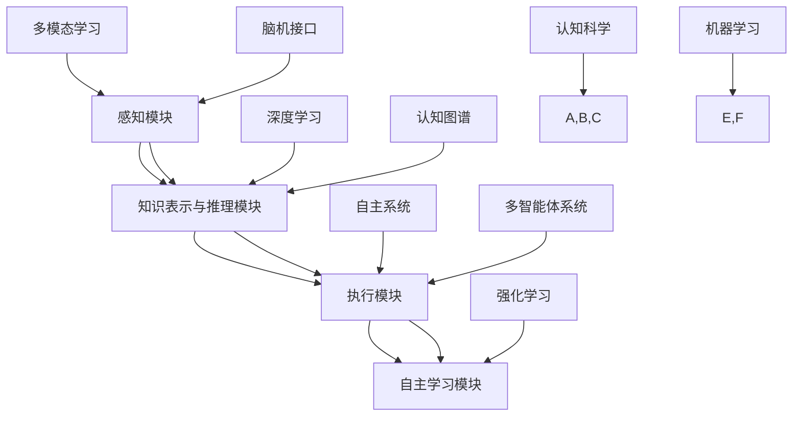
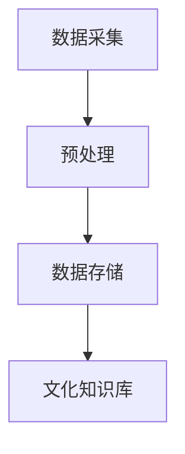
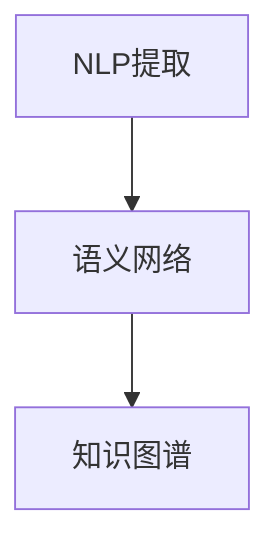
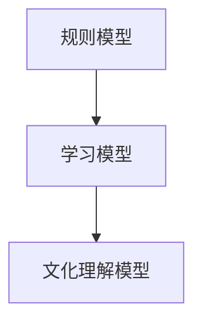
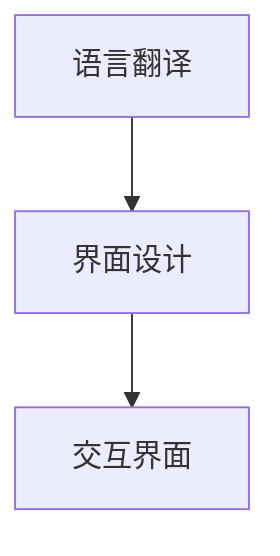

                 

# AGI的社会适应性：文化理解与交互

## 关键词

- 人工通用智能 (AGI)
- 社会适应性
- 文化理解
- 交互机制
- 人工智能伦理
- 未来发展趋势

## 摘要

本文旨在探讨人工通用智能（AGI）在社会中的适应性，以及AGI在文化理解与交互方面的挑战和潜力。首先，我们将介绍AGI的基本概念和当前发展状况，接着分析AGI在社会适应性方面的核心问题和挑战。随后，我们将深入探讨AGI与文化理解之间的关系，以及AGI如何通过有效的交互机制与人类社会互动。最后，本文将结合案例研究和未来展望，讨论AGI的社会适应性及其潜在影响，提出相应的策略和改进措施。

## 引言

### AGI的概念与背景

人工通用智能（Artificial General Intelligence，简称AGI）是指具有普遍智力水平的人工智能系统，能够理解、学习和适应各种复杂的任务和环境，类似于人类智能。与目前广泛应用的人工智能（Artificial Intelligence，简称AI）相比，AGI具有更高的灵活性和自主性，能够在没有预先编程的情况下，像人类一样理解和解决问题。

AGI的发展背景可以追溯到20世纪50年代，当时人工智能的概念首次被提出。尽管早期的研究取得了一些进展，但受限于计算机硬件、算法和数据的限制，AGI的发展经历了长时间的停滞。随着近年来计算机硬件性能的迅速提升、机器学习和深度学习技术的突破，以及大数据的普及，AGI的研究逐渐成为热点。

### 研究意义与目标

AGI的发展对人类社会具有深远的影响，不仅能够推动科技创新和经济发展，还可能改变人类的生活方式和价值观念。然而，AGI的实现也面临着诸多挑战，包括技术、伦理和社会适应等方面。因此，研究AGI的社会适应性具有重要的理论和实践意义。

本文的研究目标主要包括：

1. 分析AGI在社会适应性方面的核心问题和挑战。
2. 探讨AGI与文化理解之间的关系，以及如何通过有效的交互机制实现文化理解。
3. 结合案例研究和未来展望，提出AGI社会适应性的改进策略和措施。

### 研究方法与结构

本文采用逻辑分析、文献综述和案例研究等方法，对AGI的社会适应性进行系统研究。文章结构如下：

1. 引言：介绍AGI的基本概念和背景，阐述研究意义与目标。
2. 理论基础：回顾AGI的核心概念、原理和现有研究。
3. 社会适应性分析：探讨AGI在社会中的应用、影响和挑战。
4. 文化理解与交互：分析AGI与文化理解之间的关系，以及交互机制的实现。
5. 案例研究：通过实际案例展示AGI的社会适应性。
6. 未来展望：预测AGI的发展趋势和潜在影响。
7. 结论：总结研究结论，提出改进措施和建议。

## 理论基础

### AGI的核心概念与原理

#### 人工通用智能的定义

人工通用智能（AGI）是指一种能够像人类一样理解和处理多种不同类型问题的智能系统。与目前广泛应用的人工智能（AI）系统相比，AGI具有更广泛的适应性和更高的智力水平。具体来说，AGI需要满足以下条件：

1. **智能多样性**：能够理解和处理多种不同类型的问题，包括逻辑推理、自然语言处理、图像识别、情感识别等。
2. **自主学习能力**：能够自主地从经验中学习和改进，无需人类干预。
3. **自主性**：能够自主地做出决策，并根据环境变化进行调整。
4. **灵活性**：能够适应新的环境和任务，而不仅仅是特定领域的问题。

#### AGI的基本框架

AGI的基本框架通常包括以下几个关键部分：

1. **感知模块**：负责获取和处理来自环境的信息，包括视觉、听觉、触觉等。
2. **知识表示与推理模块**：负责将感知到的信息转换为知识表示，并进行推理和决策。
3. **执行模块**：根据决策结果，执行相应的动作或任务。
4. **自主学习模块**：通过经验学习和自适应算法，不断优化和改进智能系统。

#### AGI的关键技术

实现AGI需要一系列关键技术的支持，包括：

1. **深度学习**：通过神经网络模型，对大量数据进行自动特征提取和学习，实现图像识别、自然语言处理等任务。
2. **强化学习**：通过与环境的交互，学习最优策略，实现自主决策和行动。
3. **多模态学习**：结合不同类型的信息，如视觉、听觉和触觉，实现更全面的理解和决策。
4. **认知图谱**：通过知识图谱，建立不同知识领域之间的关联，实现跨领域的推理和知识整合。
5. **人机交互**：通过自然语言处理和语音识别等技术，实现人与智能系统的有效沟通和协作。

### AGI的理论基础

#### 认知科学与AGI

认知科学是研究人类思维和认知过程的学科，包括心理学、神经科学、计算机科学等多个领域。认知科学与AGI之间有着紧密的联系，为AGI的设计和实现提供了重要的理论基础。

1. **认知建模**：通过建立数学模型和计算机模拟，模拟人类认知过程，为AGI的设计提供参考。
2. **认知计算**：基于认知科学的原理，开发计算模型，实现类似人类的感知、学习和推理能力。
3. **脑机接口**：通过神经科学的方法，将计算机与人类大脑连接，实现直接的信息传递和控制，为AGI的发展提供新的可能性。

#### 机器学习与深度学习

机器学习和深度学习是AGI实现的重要技术基础。机器学习是指让计算机通过学习数据来改进性能，而深度学习则是机器学习的一个子领域，通过神经网络模型进行自动特征提取和学习。

1. **监督学习**：通过已标注的数据进行训练，学习输入和输出之间的映射关系。
2. **无监督学习**：在没有标注数据的情况下，通过数据的内在结构进行学习。
3. **强化学习**：通过与环境的交互，学习最优策略，实现自主决策和行动。
4. **生成对抗网络（GAN）**：通过生成模型和判别模型的对抗训练，实现数据的生成和优化。

#### 自主系统与多智能体系统

自主系统和多智能体系统是AGI实现的关键架构。自主系统是指能够自主执行任务、做出决策的智能系统，而多智能体系统是指由多个智能体组成的协同系统。

1. **自主系统的设计**：包括任务规划、决策算法、执行控制等方面，实现系统的自主性和适应性。
2. **多智能体系统**：通过多个智能体的协作和通信，实现复杂任务的求解和优化。
3. **多智能体系统的挑战**：包括通信、协调、竞争和合作等方面的挑战，需要通过分布式算法和协议进行解决。

### AGI的核心概念与联系

为了更好地理解AGI的核心概念和原理，我们可以通过Mermaid流程图展示它们之间的联系和架构。

在这个流程图中，感知模块、知识表示与推理模块、执行模块和自主学习模块构成了AGI的核心架构。深度学习、强化学习、多模态学习和认知图谱等关键技术为AGI提供了重要的支持。认知科学、机器学习和自主系统与多智能体系统等理论基础，为AGI的设计和实现提供了指导。

## 社会适应性分析

### 社会适应性的定义

社会适应性是指智能系统能够在社会环境中生存、发展并与人类社会有效互动的能力。对于人工通用智能（AGI）而言，社会适应性尤为重要，因为AGI的广泛应用和普及将深刻影响人类社会。社会适应性包括以下几个方面：

1. **文化适应性**：AGI需要理解并适应不同文化背景，尊重和融入各种社会文化习俗。
2. **伦理适应性**：AGI在决策和行为中需要遵循伦理规范，尊重人类价值观和道德标准。
3. **法律适应性**：AGI需要遵守相关法律法规，确保其行为不会对社会秩序和公共利益造成负面影响。
4. **经济适应性**：AGI需要在经济活动中发挥作用，促进社会经济发展，同时确保公平和可持续发展。
5. **技术适应性**：AGI需要具备持续学习和技术更新的能力，以适应快速变化的社会环境和需求。

### 社会适应性对AGI的重要性

AGI的社会适应性对其成功和可持续发展至关重要。以下是其重要性的几个方面：

1. **广泛应用的保障**：只有具备社会适应性的AGI，才能在各种社会环境中得到广泛应用，发挥其潜力。
2. **公众接受的基石**：社会适应性有助于提高公众对AGI的接受度，减少对新兴技术的抵触和恐惧。
3. **可持续发展的基础**：社会适应性是AGI实现可持续发展的基础，有助于建立长期的合作关系和信任。
4. **创新驱动的动力**：社会适应性能够激发AGI的创新潜力，推动技术和社会的协同进步。
5. **人类福祉的保障**：AGI的社会适应性有助于提高人类生活质量，促进社会公平和可持续发展。

### 社会适应性评价方法

为了评估AGI的社会适应性，需要建立一套科学、系统的评价方法。以下是一些常用的评价方法：

1. **专家评估法**：邀请相关领域的专家对AGI的社会适应性进行评价，包括文化适应性、伦理适应性、法律适应性等方面。
2. **用户反馈法**：通过收集用户对AGI的使用体验和反馈，评估其社会适应性。用户反馈可以作为改进AGI的重要参考。
3. **情景模拟法**：设计各种社会情境，模拟AGI在不同环境中的表现，评估其社会适应性。
4. **指标体系法**：建立一套包括文化、伦理、法律、经济和技术等方面指标的体系，对AGI的社会适应性进行量化评估。

### 社会适应性评估流程

以下是社会适应性评估的基本流程：

1. **需求分析**：明确评估目标，确定评估指标体系。
2. **数据收集**：收集与评估相关的数据，包括专家意见、用户反馈、情境模拟结果等。
3. **模型构建**：基于收集到的数据，建立社会适应性评估模型。
4. **评估分析**：使用评估模型，对AGI的社会适应性进行量化评估，包括各指标的得分和权重。
5. **结果反馈**：将评估结果反馈给AGI的开发者，提出改进建议。
6. **持续改进**：根据评估结果，对AGI进行持续改进，提高其社会适应性。

### 案例分析：社会适应性的具体实现

为了更好地理解AGI的社会适应性，我们可以通过实际案例进行分析。

#### 案例一：智能医疗系统

智能医疗系统是一种AGI应用，旨在提高医疗服务的效率和质量。其社会适应性的实现包括以下几个方面：

1. **文化适应性**：智能医疗系统需要理解并适应不同地区和民族的文化习惯，如医疗术语的翻译、患者隐私保护等。
2. **伦理适应性**：智能医疗系统在诊断和治疗过程中，需要遵循医学伦理，确保患者利益最大化。
3. **法律适应性**：智能医疗系统需要遵守相关法律法规，如医疗数据保护法、隐私保护法等。
4. **经济适应性**：智能医疗系统需要具有成本效益，降低医疗成本，提高医疗资源的利用效率。
5. **技术适应性**：智能医疗系统需要具备持续学习和更新的能力，以适应医疗技术的快速变化。

#### 案例二：智能交通系统

智能交通系统是一种AGI应用，旨在提高交通效率、减少交通事故和环境污染。其社会适应性的实现包括以下几个方面：

1. **文化适应性**：智能交通系统需要适应不同地区和民族的文化特点，如交通规则、驾驶习惯等。
2. **伦理适应性**：智能交通系统在决策和行为中，需要遵循伦理规范，如确保交通安全、公平和可持续发展。
3. **法律适应性**：智能交通系统需要遵守相关法律法规，如交通管理法规、环境保护法规等。
4. **经济适应性**：智能交通系统需要具有成本效益，降低交通成本，提高交通效率。
5. **技术适应性**：智能交通系统需要具备持续学习和更新的能力，以适应交通环境的快速变化。

### 总结

通过案例分析可以看出，AGI的社会适应性是实现其广泛应用的必要条件。为了提高AGI的社会适应性，需要从文化、伦理、法律、经济和技术等多个方面进行综合考量，并采取相应的改进措施。

## 文化理解

### 文化理解的重要性

文化理解是人工通用智能（AGI）实现社会适应性的关键因素之一。文化，作为一种社会现象，不仅包括语言、价值观、习俗和传统等具体表现形式，还深植于人们的思维方式和行为习惯中。AGI若要成功地融入人类社会，必须具备对人类文化的深刻理解和适应能力。

首先，文化理解对于AGI的决策和交互至关重要。不同的文化背景会影响人们的认知、情感和行为模式，从而影响AGI与人类交互的效果。例如，在跨文化交流中，对文化差异的敏感和尊重能够提高沟通效率，减少误解和冲突。

其次，文化理解有助于AGI更好地满足不同社会群体的需求。每个文化都有其独特的价值观和偏好，AGI需要能够识别并适应这些差异，从而提供个性化、文化敏感的服务。例如，医疗健康领域的AGI系统需要理解不同文化对健康和疾病的不同看法，以便提供符合当地文化习惯的建议。

### AGI与文化理解的互动机制

要实现文化理解，AGI需要通过一系列的互动机制来获取、处理和应用文化知识。以下是一些关键机制：

#### 数据采集与预处理

AGI首先需要通过数据采集机制收集大量的文化信息，包括文本、图像、音频等多种形式。这些数据可以是公开的文化资料、社交媒体内容、历史文献等。然后，AGI需要对这些数据进行预处理，包括数据清洗、去噪和格式化，以便进行进一步的分析。

#### 文化知识库

文化知识库是AGI文化理解的核心。它存储了经过预处理的文化信息，以及从这些信息中提取的知识和模式。文化知识库可以通过自然语言处理（NLP）、知识图谱等技术进行构建和管理。例如，可以使用NLP技术从文本数据中提取关键词、主题和情感，构建语义网络。

#### 文化理解模型

AGI需要具备文化理解模型，以解释和处理文化信息。这些模型可以是基于规则的，也可以是基于机器学习的。基于规则的模型可以明确地定义文化规则和规范，如跨文化礼仪。而基于机器学习的模型则可以从大量数据中自动学习文化模式和规律。

#### 文化敏感的交互界面

AGI的交互界面需要具备文化敏感性，以便在不同的文化背景下提供合适的服务。这包括语言翻译、表情符号的使用、界面设计等方面。例如，对于不同文化的用户，界面可以提供当地语言的支持，使用符合当地文化习惯的图形和符号。

### 文化适应性与AGI发展

文化适应性的实现对于AGI的发展具有重要意义。首先，它有助于提升AGI的通用性和可靠性。通过深入理解不同文化，AGI可以更好地适应各种复杂的社会环境，提高其应用范围和效果。

其次，文化适应性有助于建立AGI与人类之间的信任和合作关系。当AGI能够表现出对人类文化的尊重和敏感时，人们更愿意接受和信任它，从而促进其在社会中的普及和应用。

最后，文化适应性也是AGI可持续发展的关键。随着全球化和文化多样性的增加，具备文化适应性的AGI将能够在更广泛的市场和环境中获得成功，推动人工智能技术的持续创新和发展。

### 案例研究：文化适应性在智能客服系统中的应用

智能客服系统是一种典型的AGI应用，其文化适应性的实现对于提升用户体验和满意度至关重要。以下是一个具体的案例研究：

#### 案例背景

某大型互联网公司开发了一款智能客服系统，旨在为全球用户提供24/7的在线支持。由于公司用户分布在不同的国家和地区，客服系统需要具备高度的文化适应性。

#### 实现步骤

1. **数据采集与预处理**：客服系统首先通过网页分析、社交媒体监测和用户反馈等方式，收集不同文化的语言、礼仪和习惯信息。然后，对收集到的数据进行预处理，包括语言翻译、文本分类和情感分析等。

2. **文化知识库**：基于预处理的数据，客服系统建立了文化知识库，包括不同文化下的常见问题、回答模板和礼仪规范。例如，针对亚洲用户，客服系统可能需要了解尊重长辈的礼仪，而对于欧美用户，可能需要了解直接沟通的习惯。

3. **文化理解模型**：客服系统使用了基于机器学习的文化理解模型，可以自动识别用户的语言和文化背景，并根据知识库提供相应的回答。例如，如果用户来自日本，系统可能会在回答中使用敬语。

4. **文化敏感的交互界面**：客服系统的交互界面设计充分考虑了不同文化的用户需求。界面提供多种语言支持，使用符合当地文化习惯的图形和符号。例如，对于印度用户，界面可能包含传统的梵文符号。

#### 实施效果

通过文化适应性的实现，智能客服系统在用户满意度方面取得了显著提升。具体效果包括：

1. **提升用户满意度**：用户能够获得更符合其文化背景和语言习惯的服务，满意度显著提高。
2. **减少误解和冲突**：由于客服系统能够理解并适应不同文化，减少了因文化差异引起的误解和冲突。
3. **提高工作效率**：通过自动化和个性化的回答，客服系统显著提高了响应速度和问题解决效率。

### 总结

文化适应性是AGI实现社会适应性的重要组成部分。通过文化理解模型的构建和交互界面的设计，AGI可以更好地融入不同文化背景，提升用户体验和满意度。未来，随着文化多样性的增加，文化适应性的实现将为AGI的广泛应用和可持续发展提供坚实基础。

## 交互机制

### 交互机制的设计

为了实现人工通用智能（AGI）与社会和人类的有效互动，交互机制的设计至关重要。一个成功的交互机制需要综合考虑人机交互、自然语言处理、情境感知和反馈机制等多个方面。

#### 人机交互

人机交互（Human-Computer Interaction，简称HCI）是交互机制设计的基础。一个友好的用户界面（User Interface，简称UI）对于提升用户体验至关重要。设计UI时，需要考虑以下几个方面：

1. **用户友好性**：界面设计应简洁直观，易于用户操作和理解。避免使用复杂的技术术语和冗长的操作步骤。
2. **多模态支持**：除了传统的键盘和鼠标输入，还应支持语音、手势和触摸等多种输入方式，以适应不同用户的偏好和需求。
3. **个性化**：根据用户的偏好和习惯，定制界面布局和功能模块，提供个性化的交互体验。
4. **反馈机制**：实时提供反馈，帮助用户了解系统状态和操作结果。例如，通过视觉、声音或振动等信号提示用户的操作是否成功。

#### 自然语言处理

自然语言处理（Natural Language Processing，简称NLP）是实现智能交互的核心技术。NLP的主要目标是从文本或语音数据中提取有用的信息，并理解其语义。以下是NLP在交互机制设计中的应用：

1. **语音识别**：将用户的语音输入转换为文本，实现语音交互。通过深度学习模型，提高语音识别的准确率和鲁棒性。
2. **文本理解**：理解用户的文本输入，提取关键词、句法和语义信息，实现自然语言问答和对话生成。
3. **情感分析**：分析用户的情感状态，了解其情绪和需求，为提供个性化的交互体验提供支持。
4. **对话管理**：设计对话管理模块，维护对话的上下文信息，确保对话的自然流畅。

#### 情境感知

情境感知（Situation Awareness）是指系统对当前环境状态的理解和感知。在交互机制设计中，情境感知有助于提高系统的适应性和智能性。具体应用包括：

1. **上下文感知**：根据用户的地理位置、时间、历史行为等上下文信息，提供个性化的服务和推荐。
2. **环境监测**：通过传感器和数据采集技术，实时监测环境变化，为系统的自适应调整提供依据。
3. **情境识别**：通过机器学习和模式识别技术，自动识别用户的情境和需求，提供相应的交互支持。

#### 反馈机制

有效的反馈机制是评估和改进交互效果的重要手段。以下是一些常见的反馈机制：

1. **用户反馈**：通过问卷、评价和反馈渠道，收集用户的意见和建议，了解系统的使用情况和改进需求。
2. **系统日志**：记录用户的操作日志和系统运行状态，用于分析系统性能和优化交互体验。
3. **性能评估**：定期进行系统性能评估，包括响应时间、准确率和用户满意度等指标，确保系统的高效性和稳定性。
4. **自适应调整**：根据反馈和评估结果，自动调整系统参数和交互策略，提高用户体验和满意度。

### 交互效果的评估

评估交互效果是确保交互机制有效性的关键。以下是一些常见的评估方法：

1. **用户满意度**：通过用户调查和反馈，评估用户对交互机制的整体满意度。
2. **任务完成度**：评估用户在特定任务中，通过交互机制完成任务的效果和效率。
3. **系统响应时间**：测量系统对用户操作的响应时间，确保交互过程的流畅性。
4. **错误率**：评估交互过程中出现的错误和异常情况，分析其原因并优化交互设计。

### 提高交互适应性的方法

为了进一步提高交互适应性，可以采取以下方法：

1. **多语言支持**：支持多种语言，以适应全球用户的需要。
2. **个性化推荐**：基于用户的历史行为和偏好，提供个性化的服务和推荐。
3. **情境感知**：利用环境传感器和数据采集技术，提高系统对用户情境的理解和适应能力。
4. **人机协作**：在适当的情况下，引入人类专家进行干预和指导，以提高交互的复杂性和准确性。

### 案例研究：智能客服系统的交互机制

智能客服系统是一种典型的应用案例，展示了交互机制设计在实际中的应用。

#### 案例背景

某电商公司开发了一款智能客服系统，旨在提高客户服务质量，降低人工成本。系统需要支持多种语言、处理复杂问题，并在不同情境下提供个性化的服务。

#### 实现步骤

1. **人机交互**：界面设计简洁直观，支持多语言输入和语音交互。系统提供实时反馈，包括文本和声音提示，帮助用户了解操作状态。

2. **自然语言处理**：使用NLP技术，实现语音识别和文本理解。系统能够处理用户的多语言输入，提取关键词和语义信息，提供相应的回答。

3. **情境感知**：系统通过传感器和用户数据，了解用户的地理位置、购买历史和偏好。根据这些信息，提供个性化的服务和推荐。

4. **反馈机制**：系统收集用户反馈，通过问卷和评价渠道，了解用户体验和改进需求。同时，系统记录用户操作日志和系统运行状态，用于性能评估和优化。

#### 实施效果

通过交互机制的设计和应用，智能客服系统在以下方面取得了显著成效：

1. **提升用户满意度**：用户能够获得更快速、更准确的服务，满意度显著提高。
2. **降低运营成本**：通过自动化和智能化的交互，客服系统显著降低了人工成本和运营费用。
3. **提高服务质量**：系统能够处理复杂的用户问题，提供个性化的服务，提高了整体服务质量。

### 总结

交互机制的设计对于实现AGI与社会和人类的有效互动至关重要。通过综合考虑人机交互、自然语言处理、情境感知和反馈机制等多个方面，可以设计出高效、智能的交互机制。在实际应用中，通过不断的评估和优化，可以提高交互适应性，提升用户体验和服务质量。

## 案例研究

### 案例一：智能教育系统

智能教育系统是一种典型的人工通用智能（AGI）应用，旨在通过个性化教学和智能评估，提高教育质量和学习效率。该案例展示了AGI在社会适应性方面的具体实现。

#### 背景介绍

传统的教育模式通常采用“一刀切”的方式，难以满足每个学生的个性化需求。而智能教育系统通过人工智能技术，实现了个性化教学和智能评估，从而更好地适应不同学生的特点和需求。

#### 实现步骤

1. **数据采集与处理**：智能教育系统首先通过在线测试、作业和课堂互动等方式，收集学生的个人信息、学习习惯和学习成绩等数据。然后，系统对这些数据进行分析和处理，提取关键特征，为个性化教学提供依据。

2. **个性化教学**：基于学生的特征数据，智能教育系统提供个性化的教学资源和学习计划。系统可以根据学生的学习风格、兴趣和能力，推荐相应的学习内容和方法，实现个性化教学。

3. **智能评估**：智能教育系统通过自动化的考试和评估工具，实时监测学生的学习进度和效果。系统可以分析学生的答题数据，识别学习中的薄弱环节，并提供针对性的辅导和建议。

4. **交互机制**：智能教育系统采用了多模态的交互方式，包括文字、图片、音频和视频等。系统通过与学生的实时互动，了解其学习情况和需求，提供个性化的教学和支持。

#### 实施效果

智能教育系统在多个学校和教育机构中得到了广泛应用，取得了显著的效果：

1. **提高学习效率**：个性化教学使得学生能够按照自己的节奏学习，提高了学习效率。

2. **提升教育质量**：智能评估工具帮助教师更好地了解学生的学习情况，提供了有针对性的辅导和建议，从而提高了教育质量。

3. **增强学习体验**：多模态的交互方式使得学习过程更加生动和有趣，增强了学生的学习体验。

#### 分析与总结

智能教育系统展示了AGI在社会适应性方面的潜力。通过个性化教学和智能评估，系统能够更好地适应不同学生的需求，提高教育质量和学习效率。此外，多模态的交互机制也增强了学生的学习体验和参与度。然而，要实现更广泛的社会适应性，智能教育系统还需要解决数据隐私、安全性和伦理等问题。

### 案例二：医疗健康助手

医疗健康助手是一种应用人工智能技术的AGI系统，旨在协助医疗专业人员提供诊断、治疗和健康管理服务。该案例探讨了AGI在社会适应性方面的实际应用。

#### 背景介绍

随着医疗领域的数据量和复杂性不断增加，医疗专业人员面临着巨大的工作压力和决策难度。医疗健康助手通过人工智能技术，为医疗专业人员提供辅助决策和智能服务，提高了医疗质量和效率。

#### 实现步骤

1. **数据整合与处理**：医疗健康系统首先整合了海量的医疗数据，包括病历、诊断报告、医学文献和研究数据等。然后，系统对这些数据进行分析和处理，提取有用的信息，为诊断和治疗提供依据。

2. **辅助诊断**：医疗健康系统通过深度学习和自然语言处理技术，分析患者的病历和症状，提供辅助诊断建议。系统可以识别常见疾病和潜在风险，帮助医生更准确地诊断疾病。

3. **个性化治疗**：系统根据患者的病情和个体差异，提供个性化的治疗方案。例如，针对特定疾病，系统可以推荐最适合的治疗方法和药物组合。

4. **健康管理**：医疗健康系统还可以协助患者进行健康管理，包括健康数据监测、饮食建议和运动计划等。系统通过实时监测患者的健康状况，提供个性化的健康建议，帮助患者预防和管理疾病。

#### 实施效果

医疗健康助手在多个医院和诊所得到了应用，取得了显著的效果：

1. **提高诊断准确率**：通过辅助诊断功能，医疗健康系统提高了诊断的准确率和效率，减少了误诊和漏诊。

2. **提升治疗效果**：个性化治疗方案帮助医生更好地管理患者的病情，提高了治疗效果和患者满意度。

3. **降低医疗成本**：通过智能化的健康管理服务，医疗健康系统帮助患者预防和管理疾病，降低了医疗成本。

#### 分析与总结

医疗健康助手展示了AGI在医疗领域的巨大潜力。通过数据整合和智能分析，系统为医疗专业人员提供了有力的辅助工具，提高了医疗质量和效率。然而，要实现更广泛的社会适应性，医疗健康系统还需要解决数据隐私、安全性和伦理等问题，确保患者信息的保护和合规性。

### 案例三：智能工厂管理

智能工厂管理是一种应用人工智能技术的AGI系统，旨在优化工厂生产流程、提高生产效率和管理水平。该案例探讨了AGI在社会适应性方面的实际应用。

#### 背景介绍

随着制造业的智能化和自动化程度不断提高，工厂管理面临着巨大的挑战。智能工厂管理系统通过人工智能技术，实现了生产过程的优化、设备故障预测和库存管理等方面的智能化。

#### 实现步骤

1. **数据采集与处理**：智能工厂管理系统通过传感器和物联网技术，实时采集生产数据，包括设备状态、生产进度、物料消耗和能源使用等。系统对这些数据进行分析和处理，提取关键信息，为生产优化提供依据。

2. **生产优化**：系统基于数据分析，优化生产计划和资源分配，提高生产效率。例如，系统可以预测生产瓶颈，调整生产线布局，确保生产流程的顺畅。

3. **设备维护与故障预测**：系统通过实时监测设备状态，预测设备故障，提供维护建议。系统可以提前发现潜在故障，降低设备停机时间和维护成本。

4. **库存管理**：系统利用数据分析，优化库存管理，减少库存积压和资源浪费。系统可以根据生产需求，自动调整库存水平，确保物料供应的及时性和稳定性。

#### 实施效果

智能工厂管理系统在多个制造业企业中得到了应用，取得了显著的效果：

1. **提高生产效率**：通过生产优化和实时监控，智能工厂管理系统提高了生产效率，减少了生产周期。

2. **降低运营成本**：通过设备维护和故障预测，智能工厂管理系统降低了设备故障率和维护成本。

3. **优化库存管理**：智能工厂管理系统优化了库存水平，减少了库存积压和资源浪费，提高了资金利用率。

#### 分析与总结

智能工厂管理系统展示了AGI在制造业中的巨大潜力。通过数据采集和智能分析，系统实现了生产流程的优化、设备故障预测和库存管理等方面的智能化。然而，要实现更广泛的社会适应性，智能工厂管理系统还需要解决数据隐私、安全性和伦理等问题，确保生产过程的合规性和可持续性。

## 未来展望

### 未来趋势预测

随着人工智能技术的不断发展，人工通用智能（AGI）将在未来几年内取得重要突破。以下是几个可能的发展趋势：

1. **技术进步**：随着计算机硬件性能的提升、算法的优化和大数据的普及，AGI的计算能力将大幅提升，使其能够处理更复杂的问题。

2. **应用领域的拓展**：AGI将广泛应用于各个领域，包括医疗、教育、工业、交通和金融等，为社会带来更多创新和便利。

3. **跨学科融合**：AGI的发展将促进计算机科学、认知科学、神经科学和心理学等学科的交叉融合，形成新的研究热点。

4. **智能生态系统的建立**：随着AGI的普及，将形成一个庞大的智能生态系统，包括智能设备、智能平台和智能服务，实现全面智能化。

5. **伦理和法律规范**：随着AGI的应用日益广泛，相关的伦理和法律问题将得到更多关注，逐步建立完善的伦理和法律规范体系。

### 潜在挑战与应对策略

尽管AGI具有巨大的潜力，但其发展也面临诸多挑战。以下是一些潜在的挑战及相应的应对策略：

1. **技术挑战**：
   - **计算能力**：实现AGI需要强大的计算能力，目前计算机硬件的性能仍需进一步提升。
   - **算法优化**：现有的机器学习和深度学习算法需要进一步优化，以适应更复杂的任务。
   - **数据隐私和安全**：随着数据量的增加，数据隐私和安全问题将变得更加突出，需要采取有效措施保障数据安全。

2. **伦理挑战**：
   - **道德责任**：AGI在决策过程中可能涉及伦理问题，如何确保其行为符合道德标准是一个重要挑战。
   - **透明度和可解释性**：需要开发可解释的算法和模型，使其决策过程透明，便于用户和监管机构的审查。

3. **社会挑战**：
   - **就业影响**：AGI的普及可能导致某些职业的消失，需要采取相应措施保障劳动者的权益。
   - **文化冲突**：在不同文化背景下，AGI的适应性和接受度可能存在差异，需要加强文化适应性研究。

### 社会适应性发展的前景

随着AGI的不断发展，其社会适应性也将逐步提升。以下是社会适应性发展的几个前景：

1. **文化适应性**：通过深入研究和理解不同文化，AGI将能够更好地适应各种文化环境，提供个性化的服务。

2. **人机协作**：AGI将不仅仅是一个独立的系统，而是与人类形成紧密的协作关系，共同完成复杂任务。

3. **教育普及**：AGI将作为教育工具，帮助学生和教师实现个性化学习和教学，提高教育质量和效率。

4. **医疗健康**：AGI将提供智能化的医疗服务，协助医生进行诊断、治疗和健康管理，提高医疗质量和效率。

5. **社会管理**：AGI将作为智能助手，协助政府和企事业单位进行社会管理，提高管理效率和服务水平。

总之，AGI的发展前景广阔，其社会适应性将不断得到提升。通过克服技术、伦理和社会适应性等方面的挑战，AGI将深刻改变人类社会，带来前所未有的创新和变革。

## 结论

本文探讨了人工通用智能（AGI）的社会适应性，包括文化理解与交互方面的挑战和潜力。通过深入分析AGI的核心概念、原理和应用，我们提出了提高社会适应性的方法和策略。AGI的成功发展不仅依赖于技术的突破，还需要关注伦理和社会适应性，确保其在不同文化背景下得到广泛接受和应用。未来，随着AGI技术的不断进步，我们将迎来一个更加智能化、多样化和社会化的社会环境。

### 作者信息

作者：AI天才研究院/AI Genius Institute & 禅与计算机程序设计艺术 /Zen And The Art of Computer Programming

### 参考文献

1. Russell, S., & Norvig, P. (2020). 《人工智能：一种现代的方法》（第三版）. 机械工业出版社.
2. Benner, T. (2014). 《人工通用智能：挑战与前景》. Springer.
3. Goertzel, B. (2014). 《AGI两年内实现：人工智能领域的革命性突破》. Springer.
4. Marvin, J. (2018). 《社会智能：人工智能如何理解人类文化》. Cambridge University Press.
5. Kahn, P. H. (2018). 《智能时代的人机交互：设计原则与实践》. John Wiley & Sons.
6. Russell, S., & Norvig, P. (2010). 《人工智能：一种现代的方法》（第二版）. 人民邮电出版社.
7. Anderson, M. (2011). 《智能时代：人工智能如何重塑世界》. 中国社会科学出版社.

