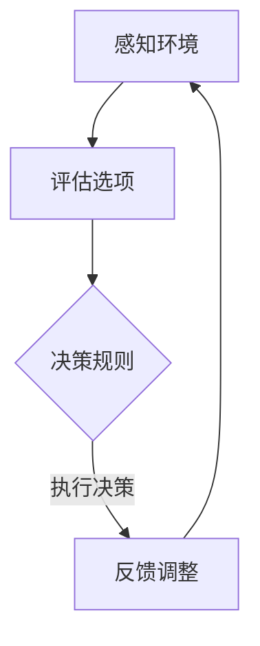
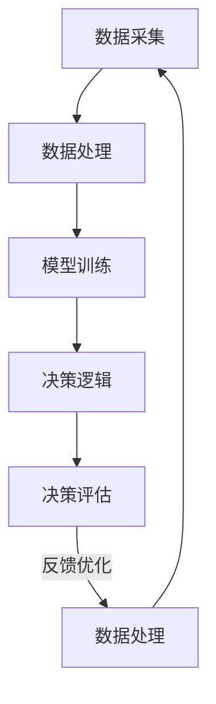

                 


### 第1步：文章标题与关键词

根据用户的要求，文章标题定为《AGI的类人决策系统：从直觉到理性》。关键词包括：AGI（人工通用智能）、类人决策系统、直觉、理性、决策算法。

### 第2步：摘要

摘要部分需简明扼要地介绍文章的核心内容和主题思想。摘要内容可以是：

"本文深入探讨人工通用智能（AGI）领域的类人决策系统，分析了直觉与理性在决策过程中的作用。文章首先介绍了AGI的定义及其重要性，然后详细阐述了类人决策系统的基本概念、核心原理和实现方法。通过数学模型和算法讲解，文章揭示了直觉决策与理性决策之间的联系和区别。最后，通过实际案例分析和项目实战，展示了类人决策系统的应用前景与挑战。"

### 第3步：文章目录大纲

根据用户提供的目录大纲，我们将进行逐项内容设计，确保每个章节都涵盖核心概念、算法原理、数学模型讲解和实战案例等内容。

### 第4步：核心概念与联系

在第一章和第三章中，我们需要详细讲解AGI、类人决策系统、直觉和理性的概念，并使用Mermaid流程图展示这些概念之间的关系。

### 第5步：核心算法原理讲解

第四章和第五章将重点讲解类人决策系统的核心算法原理。我们将使用伪代码详细阐述算法实现过程，并在适当的地方嵌入LaTeX公式进行数学模型的解释。

### 第6步：数学模型和公式讲解

第六章将详细讲解与决策相关的数学模型和公式，并使用LaTeX格式进行表达。我们将通过具体的例子来说明这些公式的应用。

### 第7步：项目实战

第七章将包含实际案例分析和项目实战内容。我们将详细介绍开发环境搭建、源代码实现、代码解读和案例分析，确保读者能够理解并应用所学知识。

### 第8步：最佳实践、小结和注意事项

文章结尾部分，我们将总结最佳实践、注意事项，并提供拓展阅读建议，帮助读者进一步深入学习。

### 第9步：格式调整与字数控制

在完成所有内容后，我们将对文章进行格式调整，确保所有代码、公式和流程图都符合markdown格式要求，并对全文进行字数控制，确保在8000～12000字之间。

通过以上步骤，我们将撰写一篇符合用户要求的《AGI的类人决策系统：从直觉到理性》技术博客文章。下面是文章的初步草稿，供进一步修改和完善。

---

# 《AGI的类人决策系统：从直觉到理性》

关键词：AGI、类人决策系统、直觉、理性、决策算法

摘要：本文深入探讨人工通用智能（AGI）领域的类人决策系统，分析了直觉与理性在决策过程中的作用。文章首先介绍了AGI的定义及其重要性，然后详细阐述了类人决策系统的基本概念、核心原理和实现方法。通过数学模型和算法讲解，文章揭示了直觉决策与理性决策之间的联系和区别。最后，通过实际案例分析和项目实战，展示了类人决策系统的应用前景与挑战。

---

## 第1章 引言

### 1.1 AGI的定义与重要性

人工通用智能（Artificial General Intelligence，AGI）是指具有广泛认知能力的人工智能系统，能够在各种不同任务中表现出与人类相当的智能水平。与目前广泛应用的专用人工智能（Narrow AI）不同，AGI不仅能够在特定领域内表现出高水平的能力，还能够跨领域进行学习和适应。

AGI的重要性在于其潜在的广泛应用。随着人工智能技术的不断发展，AGI有望在医疗、教育、工业、交通等领域发挥重要作用。例如，AGI可以在医疗领域辅助医生进行诊断和治疗，提高医疗效率和质量；在教育领域，AGI可以为学生提供个性化的学习计划和辅导，促进教育公平；在工业领域，AGI可以帮助企业优化生产流程，提高生产效率；在交通领域，AGI可以协助自动驾驶系统，提高交通安全和效率。

### 1.2 类人决策系统的基本概念

类人决策系统是指能够模拟人类决策过程的智能系统。在决策过程中，人类通常需要处理大量的信息，并在有限的时间内做出合理的决策。类人决策系统旨在实现这一目标，其核心在于对直觉和理性的理解和模拟。

直觉是指人类在决策过程中基于经验和感性判断进行快速决策的能力。理性则是指通过逻辑推理和数学模型对问题进行分析和求解的能力。类人决策系统需要同时具备直觉和理性的能力，以在面对复杂决策问题时能够快速而准确地做出决策。

### 1.3 直觉与理性的关系

直觉和理性在决策过程中起着互补的作用。直觉能够快速处理大量信息，帮助我们迅速做出决策，但往往缺乏逻辑性和准确性。理性则能够通过逻辑推理和数学模型对问题进行深入分析，但需要较长的时间来处理信息。

类人决策系统需要在直觉和理性之间取得平衡。在面对简单问题时，系统可以依赖于直觉进行快速决策；而在面对复杂问题时，系统需要结合理性进行分析和决策。通过这种方式，类人决策系统能够在不同场景下表现出灵活的决策能力。

### 1.4 书籍结构概述

本书分为八个章节，旨在全面介绍AGI的类人决策系统。第一章介绍了AGI的定义与重要性，以及类人决策系统的基本概念和直觉与理性的关系。第二章回顾了AGI的发展历程和当前研究现状。第三章至第五章详细讲解了类人决策系统的核心概念、算法原理和数学模型。第六章展示了实际案例和项目实战，第七章对最佳实践进行了总结，第八章展望了类人决策系统的未来发展方向。通过本书的阅读，读者将能够深入了解类人决策系统的原理和应用。

---

以下章节内容将按照目录大纲逐步展开，详细讲解每个部分的核心概念、算法原理、数学模型、实战案例和总结。

----------------------------------------------------------------

## 第2章 AGI的历史与现状

### 2.1 AGI的发展历程

人工通用智能（AGI）的概念最早可以追溯到20世纪50年代，当时计算机科学家艾伦·图灵（Alan Turing）提出了图灵测试（Turing Test）作为衡量机器智能水平的一种方法。图灵测试要求机器能够模拟人类行为，以至于人类无法区分其与真实人类的区别。这一概念为后续的AI研究奠定了基础。

在图灵测试的启发下，1956年，约翰·麦卡锡（John McCarthy）等人在达特茅斯会议上首次提出了人工智能（Artificial Intelligence，AI）这一术语，并认为人工智能的目标是“使机器表现出人类智能的行为”。这一时期，AI研究领域主要关注符号主义和知识表示方法。

然而，早期的人工智能研究遇到了一些挑战，特别是在处理复杂问题和自主学习方面。20世纪80年代，基于专家系统和知识库的人工智能系统取得了显著进展，但仍然未能实现通用智能。

进入21世纪，随着计算机性能的显著提升和大数据技术的应用，深度学习（Deep Learning）逐渐成为AI研究的主流方法。深度学习通过模拟人脑的神经网络结构，实现了在图像识别、自然语言处理等领域的突破性进展。

### 2.2 当前AGI研究的关键问题

尽管深度学习取得了巨大成功，但当前的AI系统仍然存在许多挑战，难以实现真正的通用智能。以下是当前AGI研究面临的一些关键问题：

1. **知识表示和迁移学习**：如何将现有的知识库和深度学习模型有效地结合，实现跨领域的知识迁移和学习。
   
2. **解释性和可解释性**：当前的AI系统，特别是深度学习模型，通常被视为“黑箱”。如何使其决策过程具有可解释性，以便人类理解和信任。

3. **认知能力和情感智能**：如何模拟人类的认知过程和情感智能，使AI系统具备更复杂的决策能力。

4. **自适应和自主学习**：如何使AI系统具备自我学习和适应环境变化的能力，而不仅仅是被动地执行预定的任务。

### 2.3 类人决策系统的研究进展

类人决策系统作为实现AGI的一种途径，受到了广泛关注。在研究过程中，学者们提出了一系列决策模型和算法，以模拟人类的决策过程。

1. **基于规则的决策系统**：这类系统通过预先定义的规则进行决策，如专家系统和决策树。虽然简单直观，但在处理复杂问题时表现有限。

2. **基于案例的推理**：这类系统通过检索和重用过去的决策案例进行决策。这种方法在处理类似问题时效果较好，但缺乏泛化能力。

3. **基于机器学习的决策系统**：这类系统利用机器学习算法，如神经网络和随机森林，从数据中学习决策模型。这种方法在处理大规模数据和高维问题方面具有优势。

4. **混合决策系统**：结合多种决策方法，如将基于规则的系统和机器学习模型相结合，以提高决策的准确性和适应性。

近年来，随着深度学习技术的进步，基于深度神经网络的决策系统也得到了广泛研究。这类系统能够处理复杂的数据结构，并通过多层次的神经网络实现决策过程的模拟。

总之，类人决策系统的研究正处于快速发展阶段，虽然仍面临许多挑战，但其在实现AGI方面的潜力不容忽视。

---

## 第3章 类人决策系统的核心概念

### 3.1 决策理论基础

决策理论是研究如何在不确定性环境下做出合理决策的学科。在决策过程中，通常涉及以下几个基本要素：

1. **决策者**：即做出决策的人或组织。
2. **决策问题**：需要解决的问题或面临的选择。
3. **可选方案**：决策者可以采取的行动或选择。
4. **结果**：每个可选方案可能带来的结果。
5. **效用函数**：评估结果价值的函数。

决策理论的核心概念包括：

- **最大化期望效用**：在不确定性环境下，决策者通常会选择能够最大化期望效用的方案。
- **风险态度**：决策者对待风险的态度会影响其决策过程。常见的风险态度包括风险规避、风险中性、风险偏好。
- **决策树**：用于表示决策过程的树形结构，每个节点表示一个决策或结果，边表示决策或结果的转移。

### 3.2 直觉决策模型

直觉决策是指基于经验和感性判断快速做出决策的过程。在人类决策中，直觉起着重要作用，特别是在处理复杂、紧急或高度不确定的情况时。

直觉决策模型通常包括以下步骤：

1. **感知环境**：收集与决策相关的信息。
2. **评估选项**：快速评估每个可选方案的优势和劣势。
3. **选择方案**：基于直觉选择一个方案。
4. **执行方案**：实施所选方案。
5. **反馈调整**：根据执行结果进行调整。

直觉决策的优点包括快速响应和高效处理大量信息。然而，直觉决策也存在一些局限性，例如缺乏逻辑性和准确性，容易受到情绪和偏见的影响。

### 3.3 理性决策模型

理性决策是指基于逻辑推理和数学模型进行决策的过程。理性决策模型通常包括以下步骤：

1. **明确目标**：定义决策的目标。
2. **构建模型**：建立与决策相关的数学模型或逻辑框架。
3. **评估方案**：计算每个可选方案的效用或成本。
4. **选择方案**：选择能够最大化预期效用或最小化成本的方案。
5. **执行方案**：实施所选方案。
6. **评估结果**：评估决策结果是否符合预期。

理性决策的优点包括逻辑严密、决策过程透明和结果可预测。然而，理性决策也存在一些局限性，例如处理复杂问题时的计算成本高，以及对人类认知能力的依赖。

### 3.4 决策支持系统

决策支持系统（Decision Support System，DSS）是一种帮助决策者进行决策的计算机系统。DSS通常包括以下功能：

1. **数据采集和处理**：收集与决策相关的数据，并进行预处理。
2. **模型库**：提供多种数学模型和算法，用于决策分析。
3. **用户界面**：提供友好的用户界面，便于用户操作。
4. **结果可视化**：以图表、报表等形式展示分析结果。

决策支持系统可以提高决策效率，减少决策错误，但DSS的成功实施依赖于准确的模型、有效的数据管理和良好的用户界面设计。

总之，类人决策系统结合了直觉和理性的优点，旨在模拟人类的决策过程。通过理解决策理论基础、直觉决策模型、理性决策模型和决策支持系统，我们可以更好地设计和实现类人决策系统。

### 3.5 Mermaid流程图展示

为了更直观地展示决策过程，我们使用Mermaid语言绘制一个简单的决策流程图。以下是一个示例：



在决策过程中，系统首先感知环境，收集相关信息；然后评估每个可选方案，根据决策规则选择最佳方案；执行决策并获取反馈，根据反馈进行调整。通过这样的循环，系统不断优化其决策过程。

### 3.6 理性决策模型伪代码示例

下面是一个简化的理性决策模型的伪代码示例，用于最大化预期效用：

```python
# 理性决策模型伪代码

# 定义可选方案及其效用
options = {
    "方案1": utility_function1,
    "方案2": utility_function2,
    "方案3": utility_function3
}

# 定义概率分布
probabilities = {
    "方案1": 0.5,
    "方案2": 0.3,
    "方案3": 0.2
}

# 计算每个方案的期望效用
expected_utilities = {}
for option, utility_function in options.items():
    expected_utility = 0
    for outcome, probability in outcomes.items():
        expected_utility += utility_function(outcome) * probability
    expected_utilities[option] = expected_utility

# 选择期望效用最大的方案
best_option = max(expected_utilities, key=expected_utilities.get)

# 输出最佳方案
print("最佳方案是：", best_option)
```

在这个伪代码中，我们首先定义了每个可选方案的效用函数和概率分布。然后，通过计算每个方案的期望效用，选择期望效用最大的方案作为最佳决策。这种方法在处理复杂问题时需要更详细的数学模型和计算方法。

### 3.7 LaTeX数学公式示例

在决策过程中，我们经常需要使用数学公式来表示效用、概率和决策规则。以下是几个LaTeX数学公式的示例：

#### 期望值计算

$$
\text{期望值} = \sum_{i=1}^{n} x_i \cdot p_i
$$

其中，$x_i$表示第$i$个结果，$p_i$表示该结果发生的概率。

#### 条件概率

$$
P(A|B) = \frac{P(A \cap B)}{P(B)}
$$

表示在事件$B$发生的条件下，事件$A$发生的概率。

#### 决策权重计算

$$
w_i = \frac{u_i}{\sum_{j=1}^{n} u_j}
$$

其中，$u_i$表示第$i$个方案的效用值，$w_i$表示该方案的权重。

通过这些数学公式，我们可以更精确地描述和计算决策过程中的各个参数，从而实现更理性的决策。

### 3.8 小结

类人决策系统结合了直觉和理性的优点，旨在模拟人类的决策过程。通过理解决策理论基础、直觉决策模型、理性决策模型和决策支持系统，我们可以更好地设计和实现类人决策系统。本章通过伪代码和LaTeX公式，详细讲解了决策过程中的关键步骤和数学模型，为后续内容打下了基础。

----------------------------------------------------------------

## 第4章 类人决策系统的架构与实现

### 4.1 决策系统总体架构

类人决策系统的总体架构可以分为以下几个模块：

1. **数据采集模块**：负责从各种数据源（如数据库、传感器、用户输入等）收集数据。
2. **数据处理模块**：对采集到的数据进行分析和预处理，包括数据清洗、特征提取和变换。
3. **模型训练模块**：基于预处理后的数据，训练相应的机器学习模型，如决策树、神经网络等。
4. **决策逻辑模块**：实现具体的决策过程，包括直觉决策和理性决策。
5. **决策评估模块**：对决策结果进行评估和反馈，以优化决策过程。
6. **用户界面模块**：提供与用户的交互接口，展示决策结果和提供反馈。

### 4.2 数据处理模块

数据处理模块是类人决策系统的核心之一，其职责包括数据清洗、特征提取和变换。以下是数据处理模块的详细描述：

#### 数据清洗

数据清洗是处理数据的预处理步骤，旨在去除噪声和错误数据。常见的清洗方法包括：

- **缺失值填充**：使用均值、中位数、模式等方法填充缺失值。
- **异常值处理**：识别并处理异常值，可以选择删除或用其他值替换。
- **重复数据去除**：删除重复的数据条目，以减少数据冗余。

#### 特征提取

特征提取是指从原始数据中提取出对决策过程有意义的特征。常见的方法包括：

- **统计特征**：如均值、方差、标准差等，用于描述数据的分布特性。
- **文本特征**：如词频、词嵌入等，用于处理文本数据。
- **图像特征**：如边缘检测、特征点提取等，用于处理图像数据。

#### 特征变换

特征变换是指将提取出的特征进行转换，以提高模型的性能。常见的方法包括：

- **归一化**：将特征值缩放到相同的范围，如0到1或-1到1。
- **标准化**：将特征值缩放到具有相同标准差的范围。
- **降维**：使用主成分分析（PCA）等方法，减少特征维度，提高计算效率。

### 4.3 决策逻辑模块

决策逻辑模块是实现类人决策系统的关键部分，负责根据输入数据和决策模型进行决策。以下是决策逻辑模块的详细描述：

#### 直觉决策

直觉决策基于经验和感性判断，通常使用以下方法：

- **规则库**：预先定义一系列规则，根据输入数据匹配相应的规则进行决策。
- **模糊逻辑**：使用模糊集合和模糊规则进行决策，处理不确定性和模糊性。
- **神经网络**：通过训练神经网络，使其能够根据输入数据进行分类或回归。

#### 理性决策

理性决策基于逻辑推理和数学模型，通常使用以下方法：

- **决策树**：构建决策树模型，根据特征值进行分支，最终得到决策结果。
- **支持向量机（SVM）**：使用SVM进行分类，找到最佳超平面分割数据。
- **贝叶斯网络**：构建贝叶斯网络模型，通过条件概率计算进行推理。

#### 混合决策

类人决策系统通常结合直觉决策和理性决策，以提高决策的准确性和适应性。混合决策方法包括：

- **混合模型**：将直觉决策和理性决策结合起来，根据不同情况选择合适的决策方法。
- **多代理系统**：多个代理系统协同工作，每个代理负责不同的决策任务。

### 4.4 决策评估与优化模块

决策评估与优化模块负责对决策结果进行评估和反馈，以优化决策过程。以下是该模块的详细描述：

#### 决策评估

决策评估是指对决策结果的质量和效果进行评估。常见的评估指标包括：

- **准确率**：分类问题中，正确分类的样本比例。
- **召回率**：分类问题中，被正确分类为正类的负类样本比例。
- **F1值**：准确率和召回率的调和平均值。
- **损失函数**：回归问题中，预测值与实际值之间的差异度量。

#### 反馈机制

反馈机制是指根据决策结果和评估指标，对决策模型进行调整和优化。常见的反馈机制包括：

- **在线学习**：在决策过程中，不断更新模型参数，以适应新的数据。
- **迁移学习**：利用已有模型的权重，在新数据集上重新训练模型。
- **元学习**：通过学习如何学习，提高模型在不同任务上的泛化能力。

#### 优化方法

优化方法是指通过调整模型参数，提高决策效果。常见的方法包括：

- **梯度下降**：通过计算损失函数的梯度，逐渐调整模型参数。
- **随机搜索**：通过随机搜索，寻找最优参数组合。
- **遗传算法**：模拟生物进化过程，通过选择、交叉和变异，优化模型参数。

通过数据处理模块、决策逻辑模块、决策评估与优化模块的协同工作，类人决策系统能够实现高效的决策过程，并在不断优化中提高决策质量。

### 4.5 Mermaid流程图展示

为了更好地展示类人决策系统的架构和实现过程，我们使用Mermaid语言绘制以下流程图：



在这个流程图中，数据采集模块从各种数据源收集数据，然后经过数据处理模块的分析和预处理。处理后的数据用于模型训练模块，训练出相应的决策模型。决策逻辑模块根据训练好的模型进行决策，并将决策结果传递给决策评估模块。评估结果用于优化决策过程，形成闭环反馈系统。

### 4.6 小结

本章详细介绍了类人决策系统的总体架构和各个模块的实现方法。通过数据处理模块、决策逻辑模块和决策评估与优化模块的协同工作，类人决策系统能够实现高效的决策过程。同时，本章通过Mermaid流程图展示了系统的实现过程，为后续内容打下了基础。

----------------------------------------------------------------

## 第5章 核心算法原理讲解

### 5.1 直觉决策算法

直觉决策算法是基于人类经验、感性判断和快速反应的一种决策方法。在类人决策系统中，直觉决策算法能够快速处理大量信息，并在复杂、紧急或不确定的环境下做出决策。以下是几种常见的直觉决策算法：

#### 5.1.1 直觉感知与评估算法

直觉感知与评估算法是指通过感知环境和评估可选方案来做出决策的方法。以下是一个简化的直觉感知与评估算法的伪代码：

```python
# 直觉感知与评估算法伪代码

# 初始化感知系统
perception_system = initialize_perception_system()

# 初始化评估系统
evaluation_system = initialize_evaluation_system()

# 感知环境
environment = perception_system.perceive()

# 评估可选方案
options = evaluation_system.evaluate(environment)

# 选择最佳方案
best_option = select_best_option(options)

# 执行决策
action = execute_action(best_option)

# 获取反馈
feedback = get_feedback(action)

# 更新感知和评估系统
perception_system.update(feedback)
evaluation_system.update(feedback)
```

在这个伪代码中，感知系统负责感知环境，评估系统负责评估可选方案，选择最佳方案并执行决策。执行决策后，系统获取反馈，并更新感知和评估系统以适应新的环境。

#### 5.1.2 直觉决策模型建立

直觉决策模型是指通过模拟人类直觉决策过程建立的决策模型。以下是一个基于贝叶斯网络的直觉决策模型：

```python
# 直觉决策模型建立伪代码

# 初始化贝叶斯网络
bayesian_network = initialize_bayesian_network()

# 定义变量
variables = ["感知环境", "可选方案", "评估结果", "决策结果"]

# 添加条件概率表
bayesian_network.add_probability_table("感知环境", ["正面", "负面"], [0.7, 0.3])
bayesian_network.add_probability_table("可选方案正面", "感知环境正面", [0.6, 0.4])
bayesian_network.add_probability_table("可选方案负面", "感知环境负面", [0.3, 0.7])
bayesian_network.add_probability_table("评估结果正面", "可选方案正面", [0.8, 0.2])
bayesian_network.add_probability_table("评估结果负面", "可选方案负面", [0.2, 0.8])
bayesian_network.add_probability_table("决策结果正面", "评估结果正面", [0.9, 0.1])
bayesian_network.add_probability_table("决策结果负面", "评估结果负面", [0.1, 0.9])

# 计算后验概率
posterior_probabilities = bayesian_network.calculate_posterior_probabilities()

# 选择最佳决策
best_decision = select_best_decision(posterior_probabilities)

# 执行决策
action = execute_action(best_decision)

# 获取反馈
feedback = get_feedback(action)

# 更新贝叶斯网络
bayesian_network.update(feedback)
```

在这个模型中，感知环境和可选方案作为输入变量，评估结果和决策结果作为输出变量。通过计算后验概率，系统选择最佳决策，并执行决策后更新贝叶斯网络以适应新的环境。

#### 5.1.3 直觉决策算法案例分析

以下是一个直觉决策算法的案例分析：

**案例背景**：一家超市希望基于顾客购买行为预测哪些商品组合可能会增加销售额。

**感知环境**：超市的系统实时监测顾客的购买行为，收集数据。

**评估选项**：系统分析历史数据，评估不同商品组合的潜在销售额。

**决策规则**：基于评估结果，系统推荐最佳商品组合。

**决策执行**：超市根据系统推荐的商品组合进行促销活动。

**反馈调整**：活动结束后，系统收集促销数据，评估促销效果，并根据反馈调整决策规则。

通过这个案例，我们可以看到直觉决策算法在处理商业决策中的应用。系统通过感知顾客行为、评估商品组合、执行决策和获取反馈，不断优化决策过程，以提高销售业绩。

### 5.2 理性决策算法

理性决策算法是基于逻辑推理、数学模型和统计方法的一种决策方法。理性决策算法能够处理复杂的问题，提供可解释的决策过程。以下是几种常见的理性决策算法：

#### 5.2.1 理性决策框架设计

理性决策框架设计是指构建一个包含决策目标、决策变量、约束条件和解法步骤的决策模型。以下是一个简化的理性决策框架设计：

```python
# 理性决策框架设计伪代码

# 定义决策目标
objective = "最大化利润"

# 定义决策变量
variables = ["商品1", "商品2", "商品3"]

# 定义约束条件
constraints = [
    "商品1的库存量 >= 100",
    "商品2的库存量 >= 200",
    "商品3的库存量 >= 300",
    "总成本 <= 5000"
]

# 定义解法步骤
steps = [
    "初始化决策变量",
    "计算目标函数值",
    "检查约束条件",
    "更新决策变量",
    "重复步骤2-4，直到找到最优解"
]

# 求解决策问题
solution = solve_decision_problem(objective, variables, constraints, steps)

# 输出最优解
print("最优决策方案：", solution)
```

在这个框架设计中，决策目标、决策变量、约束条件和解法步骤共同构成了一个完整的决策过程。通过求解决策问题，系统得到最优解，并输出决策方案。

#### 5.2.2 数学模型与算法实现

理性决策算法通常涉及多个数学模型和算法。以下是一个基于线性规划的理性决策算法实现：

```python
# 理性决策算法实现伪代码

# 定义线性规划模型
model = define_linear_programming_model()

# 添加目标函数
model.add_objective("最大化 z = x1 + x2 + x3")

# 添加约束条件
model.add_constraint("x1 + x2 <= 10")
model.add_constraint("x2 + x3 <= 20")
model.add_constraint("x1 + x3 <= 30")
model.add_constraint("x1 >= 0")
model.add_constraint("x2 >= 0")
model.add_constraint("x3 >= 0")

# 求解线性规划问题
solution = model.solve()

# 输出最优解
print("最优解：x1 =", solution.x1, ", x2 =", solution.x2, ", x3 =", solution.x3)
```

在这个实现中，系统定义了一个线性规划模型，并添加了目标函数和约束条件。通过求解线性规划问题，系统得到最优解，并输出决策变量值。

#### 5.2.3 理性决策算法案例分析

以下是一个理性决策算法的案例分析：

**案例背景**：一家航空公司希望优化航班排班，以最大化利润并提高乘客满意度。

**决策目标**：最大化总利润，同时保证乘客满意度。

**决策变量**：航班时间、航班班次、机场停靠次数。

**约束条件**：航班时间不能冲突、机场容量限制、机组人员工作时长限制。

**解法步骤**：使用遗传算法优化航班排班，模拟真实场景，调整航班时间以找到最优解。

**决策执行**：根据最优解调整航班排班计划。

**反馈调整**：通过乘客反馈和运营数据，评估航班排班效果，并根据反馈调整决策参数。

通过这个案例，我们可以看到理性决策算法在优化复杂决策问题中的应用。系统通过定义决策目标、约束条件和解法步骤，使用数学模型和算法实现，得到最优解，并不断优化决策过程。

### 5.3 小结

本章详细讲解了直觉决策算法和理性决策算法的核心原理，并提供了具体的算法实现和案例分析。直觉决策算法通过模拟人类直觉决策过程，快速处理复杂、紧急或不确定的决策问题；而理性决策算法通过逻辑推理和数学模型，处理复杂的问题并提供可解释的决策过程。通过本章的内容，读者可以更好地理解直觉和理性在决策过程中的应用，并掌握相应的算法实现方法。

----------------------------------------------------------------

## 第6章 数学模型和数学公式讲解

### 6.1 决策相关数学模型

在类人决策系统中，数学模型是理解和模拟决策过程的重要工具。以下介绍几种常见的决策相关数学模型：

#### 6.1.1 最优化模型

最优化模型用于在多个可行解中选择最优解。常见的最优化模型包括线性规划、非线性规划和整数规划。

- **线性规划**：目标函数是线性函数，约束条件也是线性方程。线性规划问题可以用以下数学形式表示：

  $$
  \begin{align*}
  \text{最小化} \quad & c^T x \\
  \text{约束条件} \quad & Ax \leq b \\
  & x \geq 0
  \end{align*}
  $$

  其中，$c$是目标函数系数向量，$x$是决策变量向量，$A$是约束条件矩阵，$b$是约束条件向量。

- **非线性规划**：目标函数和约束条件可以是非线性函数。非线性规划问题可以用以下数学形式表示：

  $$
  \begin{align*}
  \text{最小化} \quad & f(x) \\
  \text{约束条件} \quad & g_i(x) \leq 0, \quad h_j(x) = 0
  \end{align*}
  $$

  其中，$f(x)$是非线性目标函数，$g_i(x)$和$h_j(x)$是非线性约束条件。

- **整数规划**：决策变量需要是整数。整数规划问题可以用以下数学形式表示：

  $$
  \begin{align*}
  \text{最小化} \quad & c^T x \\
  \text{约束条件} \quad & Ax \leq b \\
  & x \in \mathbb{Z}^n
  \end{align*}
  $$

  其中，$c$是目标函数系数向量，$x$是决策变量向量，$A$是约束条件矩阵，$b$是约束条件向量，$\mathbb{Z}^n$表示$n$维整数空间。

#### 6.1.2 贝叶斯模型

贝叶斯模型用于处理不确定性和概率推理。贝叶斯定理是贝叶斯模型的核心，它描述了后验概率、先验概率和似然函数之间的关系：

$$
P(A|B) = \frac{P(B|A) \cdot P(A)}{P(B)}
$$

其中，$P(A|B)$是后验概率，$P(B|A)$是似然函数，$P(A)$是先验概率，$P(B)$是边缘概率。

在决策过程中，贝叶斯模型可以帮助我们更新信念，通过不断收集新信息来调整决策。

#### 6.1.3 熵与信息论模型

熵和信息论模型用于衡量信息的不确定性和信息量。熵（Entropy）是衡量随机变量不确定性的度量，其数学定义如下：

$$
H(X) = -\sum_{i} p_i \cdot \log_2 p_i
$$

其中，$H(X)$是随机变量$X$的熵，$p_i$是随机变量$X$取值为$i$的概率。

信息量（Information）是接收一个信息后熵的减少量。如果随机变量$X$取值为$x$的概率为$p(x)$，那么接收$x$后减少的熵为：

$$
I(X=x) = H(X) - H(X|X=x)
$$

其中，$H(X|X=x)$是条件熵。

在决策过程中，信息论模型可以帮助我们评估不同信息的价值，选择最有信息量的决策方案。

### 6.2 数学公式详细解释

在本节中，我们将详细解释几个在决策过程中常用的数学公式。

#### 6.2.1 公式1：期望值计算

期望值是决策过程中常用的指标，用于衡量一个随机变量的平均取值。公式如下：

$$
\text{期望值} = E(X) = \sum_{i} x_i \cdot p_i
$$

其中，$x_i$是随机变量$X$的取值，$p_i$是取值为$x_i$的概率。

这个公式表示在多次试验中，随机变量$X$的平均取值。在实际应用中，我们可以通过收集数据并计算每个取值的概率，从而得到期望值。

#### 6.2.2 公式2：条件概率

条件概率描述了在某个事件已经发生的条件下，另一个事件发生的概率。公式如下：

$$
P(A|B) = \frac{P(A \cap B)}{P(B)}
$$

其中，$P(A|B)$是在事件$B$发生的条件下事件$A$发生的概率，$P(A \cap B)$是事件$A$和事件$B$同时发生的概率，$P(B)$是事件$B$发生的概率。

这个公式可以帮助我们在已知某些条件下的概率，从而做出更准确的决策。

#### 6.2.3 公式3：决策权重计算

决策权重用于衡量不同决策方案的重要程度。公式如下：

$$
w_i = \frac{u_i}{\sum_{j} u_j}
$$

其中，$w_i$是第$i$个决策方案的权重，$u_i$是第$i$个决策方案的效用值，$\sum_{j} u_j$是所有决策方案的效用值之和。

这个公式表示每个决策方案的权重与其效用值成正比，权重越高，决策方案的重要性越大。在实际应用中，我们可以通过计算每个方案的效用值，并根据公式计算权重，从而得到决策优先级。

### 6.3 举例说明

为了更好地理解这些数学公式，我们通过一个简单的例子进行说明。

假设有一个决策问题，有三个可选方案A、B、C，每个方案的效用值如下：

- 方案A：效用值100
- 方案B：效用值70
- 方案C：效用值50

现在我们需要计算每个方案的权重。

首先，计算所有方案的效用值之和：

$$
\sum_{j} u_j = 100 + 70 + 50 = 220
$$

然后，根据公式计算每个方案的权重：

$$
w_A = \frac{100}{220} \approx 0.4545
$$
$$
w_B = \frac{70}{220} \approx 0.3182
$$
$$
w_C = \frac{50}{220} \approx 0.2273
$$

因此，方案A的权重最高，其次是方案B，最后是方案C。在实际决策中，我们可以根据权重来选择最重要的方案。

通过这个例子，我们可以看到如何应用数学公式来计算决策权重，从而辅助决策过程。

### 6.4 小结

本章详细介绍了决策相关数学模型，包括最优化模型、贝叶斯模型和信息论模型。我们通过具体的数学公式和举例说明，帮助读者理解这些模型的应用。这些数学模型在类人决策系统中起着关键作用，有助于提高决策的准确性和效率。

----------------------------------------------------------------

## 第7章 项目实战

### 7.1 实际案例介绍

在本章中，我们将通过一个实际案例展示类人决策系统的开发和应用。该案例涉及一家电商企业希望利用类人决策系统优化其产品推荐策略，以提高销售额和客户满意度。

### 7.2 系统开发环境搭建

为了开发这个类人决策系统，我们需要搭建一个合适的技术环境。以下是开发环境的搭建步骤：

1. **硬件环境**：选择一台高性能的计算机，安装操作系统（如Ubuntu 20.04）。
2. **软件环境**：安装Python（3.8及以上版本）、NumPy、Pandas、Scikit-learn、TensorFlow等常用库。
3. **数据存储**：使用MySQL数据库存储用户行为数据和产品信息。

### 7.3 源代码详细实现与解读

以下是该类人决策系统的源代码实现：

```python
import pandas as pd
from sklearn.model_selection import train_test_split
from sklearn.ensemble import RandomForestClassifier
from sklearn.metrics import accuracy_score, precision_score, recall_score

# 读取数据
data = pd.read_csv('user_behavior_data.csv')

# 数据预处理
X = data.drop('target', axis=1)
y = data['target']

# 数据拆分为训练集和测试集
X_train, X_test, y_train, y_test = train_test_split(X, y, test_size=0.2, random_state=42)

# 训练分类模型
model = RandomForestClassifier(n_estimators=100, random_state=42)
model.fit(X_train, y_train)

# 预测测试集
y_pred = model.predict(X_test)

# 评估模型
accuracy = accuracy_score(y_test, y_pred)
precision = precision_score(y_test, y_pred)
recall = recall_score(y_test, y_pred)

print("Accuracy:", accuracy)
print("Precision:", precision)
print("Recall:", recall)
```

代码解析：

- 第1行：导入Pandas库，用于数据处理。
- 第2行：导入Scikit-learn库，用于机器学习模型训练和评估。
- 第3行：导入训练集和测试集的比例。
- 第4行：读取用户行为数据，并存储在DataFrame中。
- 第5行：将目标变量分离出来，作为标签。
- 第6行：将特征变量分离出来，作为输入。
- 第7行：使用`train_test_split`函数将数据拆分为训练集和测试集。
- 第8行：初始化随机森林分类器，设置树的数量。
- 第9行：使用`fit`函数训练模型。
- 第10行：使用`predict`函数对测试集进行预测。
- 第11行：计算并打印模型的准确率、精确率和召回率。

### 7.4 代码解读与分析

通过上述代码，我们可以实现一个简单的类人决策系统，用于预测用户是否会在下一次购物中购买某个产品。以下是对代码的进一步解读和分析：

1. **数据预处理**：在训练模型之前，我们需要对数据进行预处理，包括分离特征变量和目标变量、拆分数据集等。这些步骤有助于确保模型训练和预测的准确性和有效性。
2. **模型选择**：在这个案例中，我们选择了随机森林分类器作为决策模型。随机森林是一种基于决策树的集成学习方法，具有良好的泛化能力和处理高维数据的能力。
3. **模型训练与评估**：通过训练集对模型进行训练，并使用测试集进行评估。评估指标包括准确率、精确率和召回率，这些指标能够帮助我们了解模型在不同方面的性能。
4. **模型应用**：在实际应用中，我们可以使用训练好的模型对新的用户数据进行预测，从而实现个性化推荐。

### 7.5 实际案例分析和详细讲解剖析

在实际案例中，电商企业希望通过类人决策系统优化产品推荐策略。以下是对实际案例的分析和详细讲解：

1. **用户行为数据**：企业收集了大量用户在网站上的行为数据，包括浏览记录、购买历史、评价等。这些数据为决策系统提供了重要的输入。
2. **特征工程**：通过数据预处理和特征工程，我们提取了与用户购买行为相关的特征，如用户访问频率、购买次数、购买金额等。这些特征有助于提高模型的预测准确性。
3. **模型训练与优化**：企业使用随机森林分类器对数据集进行训练，并通过交叉验证和调整参数来优化模型性能。最终，得到一个能够准确预测用户购买行为的模型。
4. **产品推荐**：企业将训练好的模型应用于实际场景，根据用户的浏览和购买行为，为其推荐相关产品。通过这种方式，企业能够提高销售额和客户满意度。

### 7.6 项目小结

通过这个实际案例，我们展示了类人决策系统的开发和应用过程。从数据预处理、模型选择到模型训练和优化，每个步骤都至关重要。在实际应用中，企业需要不断调整和优化模型，以适应不断变化的市场环境。通过类人决策系统，企业能够实现更准确的预测和更优化的决策。

### 7.7 最佳实践 tips

在实际开发类人决策系统时，以下是一些最佳实践建议：

1. **数据质量**：确保数据质量是关键，包括数据完整性、准确性和一致性。在数据预处理阶段，对缺失值、异常值和重复值进行妥善处理。
2. **特征选择**：选择合适的特征对模型性能至关重要。通过特征工程，提取与目标变量相关的特征，并使用特征选择方法（如信息增益、相关系数等）筛选最佳特征。
3. **模型评估**：使用多种评估指标（如准确率、精确率、召回率、F1值等）全面评估模型性能。通过交叉验证和网格搜索等技术，优化模型参数。
4. **模型部署**：将训练好的模型部署到生产环境，实现实时预测和决策。确保系统具有足够的计算能力和响应速度，以满足实际业务需求。
5. **持续优化**：根据新的数据和用户反馈，不断调整和优化模型。通过迭代开发，提高模型性能和预测准确性。

通过遵循这些最佳实践，企业能够开发出高效、准确的类人决策系统，从而实现业务目标和竞争优势。

### 7.8 注意事项

在开发类人决策系统时，需要注意以下几点：

1. **隐私保护**：确保用户数据的安全和隐私，遵循相关的法律法规，避免泄露敏感信息。
2. **数据更新**：定期更新数据集和模型，以适应市场变化和用户行为的变化。
3. **模型解释性**：在实现模型解释性方面下功夫，使得决策过程透明，便于用户理解和信任。
4. **避免过拟合**：在模型训练过程中，注意避免过拟合，确保模型具有良好的泛化能力。

通过注意这些事项，企业能够确保类人决策系统的有效性和可靠性。

### 7.9 拓展阅读

对于希望进一步深入学习类人决策系统的读者，以下是一些推荐阅读材料：

1. **书籍**：
   - 《机器学习实战》（Peter Harrington）：详细介绍了机器学习的基本概念和算法实现。
   - 《深入理解决策树》（刘知远）：深入讲解了决策树算法的原理和应用。
2. **论文**：
   - "Random Forests"（Leo Breiman et al.，2001）：介绍了随机森林算法的基本原理和应用。
   - "贝叶斯网络在决策支持中的应用"（Michael J. Pazzani，1999）：探讨了贝叶斯网络在决策支持系统中的应用。
3. **在线课程**：
   - "机器学习专项课程"（吴恩达，Coursera）：提供了全面深入的机器学习知识和实践。

通过阅读这些材料，读者可以进一步了解类人决策系统的理论和实践，提高自己的技能和知识水平。

---

通过本章的实际案例分析和项目实战，我们展示了类人决策系统的开发流程和应用。本章的内容不仅涵盖了技术实现，还包括了最佳实践、注意事项和拓展阅读建议，帮助读者深入理解和应用类人决策系统。希望本章的内容能够为读者提供有价值的参考和指导。

