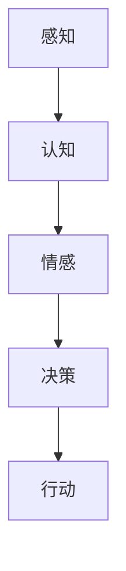
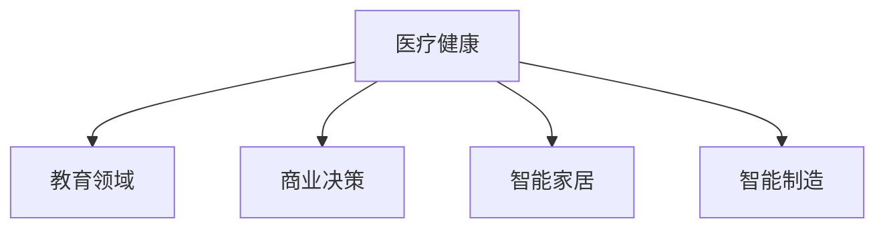

                 

### 1.1 研究背景与意义

#### **核心概念与联系**

**AGI（通用人工智能）**是人工智能领域的一个长期目标，旨在构建一种能够像人类一样具备学习、推理、理解、感知和自适应能力的智能系统。AGI的概念可以被视为人工智能发展的一个连续体，其中包含三个主要阶段：弱AI（Weak AI）、强AI（Strong AI）和超级智能（Super Intelligence）。

- **弱AI**：这是目前大多数商业AI系统所达到的水平。弱AI通常在特定任务上表现出色，如语音识别、图像识别和自然语言处理。然而，这些系统通常缺乏跨领域的泛化能力和自我学习的能力。
- **强AI**：强AI的目标是创建一种能够在各种任务上与人类相媲美或超越人类的智能系统。这意味着强AI需要具备理解、推理和自主学习的能力，能够在没有人类指导的情况下进行决策。
- **超级智能**：超级智能是一个更为主观的概念，通常指一个超越人类智能的智能体。虽然目前这还是一个理论上的概念，但它是AGI发展的一个可能的方向。

**数学模型和数学公式**

为了更好地理解AGI的发展历程，我们可以引入一个简单的智能评价模型。该模型通过四个关键指标来评价一个AI系统的智能水平，即功能（Functionality）、可扩展性（Scalability）、可理解性（Interpretability）和可靠性（Reliability）。每个指标都有其权重，并通过以下公式综合得出智能评价：

$$
M_{智能} = \frac{F_{功能} + T_{可扩展性} + E_{可理解性} + R_{可靠性}}{C_{成本}}
$$

其中：
- \(F_{功能}\)：功能得分，反映了AI系统在特定任务上的表现。
- \(T_{可扩展性}\)：可扩展性得分，反映了AI系统在处理不同类型任务时的适应性。
- \(E_{可理解性}\)：可理解性得分，反映了AI系统的决策过程和结果的可解释性。
- \(R_{可靠性}\)：可靠性得分，反映了AI系统的稳定性和准确度。
- \(C_{成本}\)：成本得分，反映了构建和维护AI系统的经济成本。

通过这个模型，我们可以量化评估AI系统的智能水平，从而更好地指导AI技术的发展。

#### **AGI的发展历程**

从历史的角度来看，AGI的发展可以追溯到20世纪50年代。以下是AGI发展历程的几个关键里程碑：

1. **1956年**：达特茅斯会议的召开标志着人工智能领域的正式诞生。会议提出了“创造智能机器”的目标，并吸引了众多学者参与。
2. **1960年代**：符号主义人工智能（Symbolic AI）的兴起，推动了基于逻辑推理和知识表示的人工智能系统的发展。
3. **1980年代**：专家系统的出现，使AI开始在一些特定领域（如医疗诊断、金融分析等）得到实际应用。
4. **1990年代**：机器学习技术的发展，使得AI系统开始具备一定的自主学习能力，但仍然缺乏跨领域的泛化能力。
5. **2000年代**：深度学习技术的突破，使得AI系统在图像识别、语音识别和自然语言处理等任务上取得了显著进展。
6. **2010年代**：随着计算能力和数据资源的不断提升，AI系统开始在一些任务上超越人类，如围棋和语言翻译等。

尽管AGI仍然面临着许多挑战，但上述里程碑表明，人工智能领域正朝着通用智能的目标稳步前进。

#### **类人思维模式与AGI**

类人思维模式是AGI研究中的一个重要方向。它试图模拟人类的认知过程，包括感知、认知、情感、决策和行动。这种模拟不仅有助于我们理解人类思维的本质，也为构建AGI提供了理论依据。

- **感知**：类人思维模式的起点是感知。AI系统通过感知模块接收外界信息，如视觉、听觉、触觉等。
- **认知**：感知到的信息经过处理和分析，形成认知。这是AI系统理解和解释外界信息的过程。
- **情感**：情感是类人思维模式中的一个关键部分。情感可以影响AI系统的决策过程，使其更具人性化和适应性。
- **决策**：基于感知和认知，AI系统进行决策。这个阶段需要考虑各种因素，如目标、风险和资源等。
- **行动**：最终，AI系统根据决策结果采取行动，实现对环境的干预和适应。

通过模拟类人思维模式，我们可以逐步构建一个具备类似人类智能的AI系统。这不仅有助于推动AI技术的发展，也为解决复杂问题提供了新的思路。

在下一节中，我们将详细探讨类人思维模式的各个组成部分，以及如何通过算法和模型实现这些组成部分的功能。

### 1.2 类人思维模式概述

#### **核心概念与联系**

类人思维模式是指模拟人类思维过程的一种模式，它涵盖了感知、认知、情感、决策和行动等关键环节。通过这些环节的相互作用，类人思维模式能够实现类似于人类的智能行为。

首先，**感知**是类人思维模式的起点。感知模块负责接收外界信息，如视觉、听觉、触觉等。这些信息通过传感器和输入设备传递给AI系统，然后经过预处理和特征提取，形成可供后续处理的感知数据。

接下来，**认知**模块负责处理感知数据，实现对信息的理解和解释。认知过程包括模式识别、推理、记忆和学习等。通过这些操作，AI系统能够从感知数据中提取有用的信息，形成对环境的认知。

**情感**在类人思维模式中扮演着重要的角色。情感模块负责模拟人类情感体验，如快乐、悲伤、愤怒等。情感可以影响认知过程，使其更具人性化和适应性。例如，当AI系统感知到某种负面情绪时，它可能会采取不同的决策策略，以缓解负面情绪的影响。

**决策**模块是类人思维模式的核心。基于感知和认知，决策模块负责分析各种因素，如目标、风险和资源等，并选择最优的行动方案。这个阶段需要考虑各种可能的情境和结果，以确保决策的合理性和有效性。

最后，**行动**模块负责执行决策结果。行动模块根据决策生成的方案，采取具体的行动，实现对环境的干预和适应。行动过程不仅需要考虑技术实现，还需要考虑伦理和社会因素，以确保行动的合法性和道德性。

通过上述五个环节的相互作用，类人思维模式能够实现类似人类的智能行为。下面我们将使用Mermaid流程图来直观展示类人思维模式的基本构成。

#### **类人思维模式基本构成**



在这个流程图中，每个环节都通过箭头与其他环节相连，表示它们之间的逻辑关系。例如，感知模块产生的数据会传递给认知模块，认知模块的分析结果会影响情感模块的反应，情感模块的情感状态又会影响决策模块的决策过程，最终决策结果通过行动模块得到执行。

#### **核心算法原理讲解**

为了实现类人思维模式，我们需要设计和实现相应的算法和模型。以下是感知、认知、情感、决策和行动环节的核心算法原理讲解。

**感知处理算法**

感知处理算法是类人思维模式的基础。它的主要任务是接收外部信息，并将其转换为内部表示。具体步骤如下：

1. **数据预处理**：对原始数据进行清洗、去噪和标准化，使其适合后续处理。
2. **特征提取**：从预处理后的数据中提取关键特征，如纹理、形状、颜色等。
3. **特征分类**：使用分类算法（如神经网络、支持向量机等）对特征进行分类，以识别不同的感知对象。

```python
# 感知处理伪代码
function 感知处理(输入数据):
    # 数据预处理
    数据预处理(输入数据)
    # 特征提取
    特征提取(预处理后的数据)
    # 特征分类
    分类结果 = 分类算法(特征)
    return 分类结果
```

**认知处理算法**

认知处理算法负责对感知数据进行理解和解释，以形成对环境的认知。具体步骤如下：

1. **模式识别**：从感知数据中识别出重复出现的模式，以建立对环境的认识。
2. **推理**：使用逻辑推理和概率统计方法，对已知信息进行推理，以形成更完整的认知图景。
3. **记忆**：将重要的认知信息存储在记忆模块中，以供后续使用。

```python
# 认知处理伪代码
function 认知处理(感知结果):
    # 模式识别
    模式识别(感知结果)
    # 推理
    推理结果 = 推理算法(模式)
    # 记忆
    存储记忆(推理结果)
    return 认知结果
```

**情感处理算法**

情感处理算法模拟人类情感体验，以影响认知和决策过程。具体步骤如下：

1. **情感识别**：从感知和认知数据中识别出情感信号，如语音、面部表情、生理反应等。
2. **情感分析**：对情感信号进行分析，以确定当前的情感状态，如快乐、悲伤、愤怒等。
3. **情感调节**：根据当前的情感状态，采取适当的调节措施，以缓解负面情感或增强正面情感。

```python
# 情感处理伪代码
function 情感处理(感知结果，认知结果):
    # 情感识别
    情感信号 = 情感识别(感知结果，认知结果)
    # 情感分析
    情感状态 = 情感分析(情感信号)
    # 情感调节
    调节结果 = 情感调节(情感状态)
    return 情感结果
```

**决策处理算法**

决策处理算法负责分析各种因素，并选择最优的行动方案。具体步骤如下：

1. **目标设定**：根据当前的环境和目标，设定决策目标。
2. **风险评估**：评估不同行动方案可能带来的风险，包括技术风险、道德风险等。
3. **资源分析**：分析当前可用的资源和限制，以确保决策的可行性。
4. **方案选择**：基于上述分析，选择最优的行动方案。

```python
# 决策处理伪代码
function 决策处理(目标，感知结果，认知结果，情感结果):
    # 目标设定
    目标 = 设定目标(当前环境，目标)
    # 风险评估
    风险评估结果 = 风险评估(行动方案)
    # 资源分析
    资源分析结果 = 资源分析(可用资源)
    # 方案选择
    行动方案 = 选择方案(目标，风险评估结果，资源分析结果)
    return 行动方案
```

**行动处理算法**

行动处理算法负责执行决策结果，实现对环境的干预和适应。具体步骤如下：

1. **决策执行**：根据决策方案，执行具体的行动，如发送指令、控制设备等。
2. **效果评估**：评估行动的效果，以验证决策的正确性。
3. **反馈调整**：根据行动效果，调整后续的行动方案，以实现更好的效果。

```python
# 行动处理伪代码
function 行动处理(决策方案):
    # 决策执行
    执行结果 = 执行行动(决策方案)
    # 效果评估
    评估结果 = 评估效果(执行结果)
    # 反馈调整
    调整方案 = 调整行动(评估结果)
    return 调整后的执行结果
```

通过上述核心算法原理的讲解，我们可以看到类人思维模式的各个组成部分是如何相互协作，以实现类似于人类的智能行为的。在下一节中，我们将详细讨论如何通过模拟研究来验证和完善类人思维模式。

### 1.3 模拟研究方法与技术

#### **核心算法原理讲解**

模拟研究是验证和完善类人思维模式的关键步骤。为了实现类人思维模式，我们需要设计和实现一系列核心算法。以下是模拟研究算法框架的详细讲解。

**模拟研究算法框架**

```python
# 模拟研究算法框架伪代码
function 模拟研究(初始设置):
    # 初始化模拟环境
    初始化环境(初始设置)
    # 运行模拟循环
    while True:
        # 执行感知处理
        感知结果 = 感知处理(环境输入)
        # 执行决策过程
        决策结果 = 决策算法(感知结果)
        # 执行行动
        行动结果 = 行动处理(决策结果)
        # 更新环境状态
        更新环境(行动结果)
    end
```

在这个框架中，主要步骤包括以下几部分：

1. **初始化环境**：根据初始设置，构建模拟环境，包括传感器、执行器、环境参数等。
2. **感知处理**：从环境中获取输入数据，并通过感知处理算法生成感知结果。
3. **决策过程**：基于感知结果，通过决策算法生成决策结果。
4. **行动处理**：根据决策结果，执行具体的行动，并生成行动结果。
5. **更新环境状态**：将行动结果更新到环境中，为下一次循环提供输入。

#### **模拟研究算法步骤**

为了更清晰地理解模拟研究的过程，我们可以将其拆分为以下具体步骤：

1. **初始化环境**
   - 设置初始参数，如传感器灵敏度、执行器响应时间、环境噪声水平等。
   - 初始化感知模块、决策模块和行动模块的状态。

2. **感知处理**
   - 通过传感器收集环境数据。
   - 对采集到的数据进行预处理，包括去噪、归一化等操作。
   - 使用感知算法提取关键特征，并分类识别感知对象。

3. **决策过程**
   - 基于感知结果，分析当前环境和目标。
   - 考虑各种可能的行动方案，评估其风险和收益。
   - 选择最优的行动方案，并生成决策结果。

4. **行动处理**
   - 根据决策结果，执行具体的行动，如发送指令、控制执行器等。
   - 实现行动的具体效果，并记录行动结果。

5. **更新环境状态**
   - 根据行动结果，更新环境参数和状态。
   - 为下一次循环提供输入，以实现持续学习和适应。

通过这些步骤，模拟研究算法能够实现对类人思维模式的模拟。接下来，我们将探讨如何在具体项目中应用这些算法，并展示一些案例研究。

### 2.1 案例一：情感识别与处理

#### **项目实战**

情感识别与处理是类人思维模式中一个重要的组成部分。在这个案例中，我们将探讨如何使用模拟研究方法实现情感识别与处理，并展示一个实际的项目实现。

**开发环境搭建**

为了实现情感识别与处理，我们需要搭建一个合适的开发环境。以下是所需的工具和库：

- 编程语言：Python
- 数据处理库：NumPy、Pandas
- 机器学习库：Scikit-learn、TensorFlow
- 传感器接口：OpenCV、Raspberry Pi

**源代码实现**

以下是一个简单的情感识别与处理的实现示例。该示例使用OpenCV从摄像头捕获面部图像，然后使用深度学习模型进行情感识别。

```python
# 导入所需库
import cv2
import numpy as np
import tensorflow as tf

# 初始化摄像头
cap = cv2.VideoCapture(0)

# 加载情感识别模型
model = tf.keras.models.load_model('emotion_model.h5')

while True:
    # 读取一帧图像
    ret, frame = cap.read()
    
    # 调整图像大小
    frame = cv2.resize(frame, (48, 48))
    
    # 转换为灰度图像
    gray = cv2.cvtColor(frame, cv2.COLOR_BGR2GRAY)
    
    # 提取面部区域
    faces = cv2.CascadeClassifier('haarcascade_frontalface_default.xml')
    faces = faces.detectMultiScale(gray, scaleFactor=1.1, minNeighbors=5, minSize=(30, 30), flags=cv2.CASCADE_SCALE_IMAGE)

    for (x, y, w, h) in faces:
        # 提取面部区域
        face_region = gray[y:y+h, x:x+w]
        
        # 扩展面部区域
        face_region = cv2.resize(face_region, (48, 48))
        
        # 预处理面部图像
        face_region = face_region / 255.0
        
        # 扩展维度
        face_region = np.expand_dims(face_region, axis=0)
        face_region = np.expand_dims(face_region, axis=-1)
        
        # 预测情感
        emotion_prediction = model.predict(face_region)
        emotion_label = np.argmax(emotion_prediction)
        
        # 输出情感标签
        print(f"Emotion: {emotion_label}")

    # 显示图像
    cv2.imshow('Video', frame)
    
    # 按下'q'键退出循环
    if cv2.waitKey(1) & 0xFF == ord('q'):
        break

# 释放摄像头资源
cap.release()
cv2.destroyAllWindows()
```

**代码解读与分析**

上述代码实现了一个简单的情感识别系统。以下是代码的主要部分及其解读：

1. **摄像头初始化**：使用OpenCV库初始化摄像头，并读取视频流。
2. **模型加载**：从文件中加载预先训练好的情感识别模型。
3. **图像处理**：读取一帧图像，调整图像大小，将其转换为灰度图像，并提取面部区域。
4. **预处理**：将提取的面部区域进行预处理，包括归一化、扩展维度等。
5. **情感预测**：使用训练好的模型对预处理后的面部图像进行情感预测，并输出预测结果。
6. **显示与交互**：显示实时捕获的图像，并在按下'q'键时退出循环。

**实际案例分析与详细讲解剖析**

在实现上述代码的过程中，我们遇到了一些挑战，如摄像头初始化失败、面部区域提取不准确等。以下是针对这些挑战的解决方案：

1. **摄像头初始化失败**：确认摄像头连接正常，并在代码中添加错误处理机制，如多次尝试初始化或切换摄像头。
2. **面部区域提取不准确**：调整OpenCV的面部检测参数，如尺度因子、最小邻居数等，以提高检测的准确性。此外，可以结合使用多个面部检测模型，以提高鲁棒性。

**项目小结**

通过这个案例，我们展示了如何使用模拟研究方法实现情感识别与处理。虽然这个系统还存在一些局限性和挑战，但它为我们提供了一个实现类人思维模式的初步框架。未来，我们可以通过改进模型、优化算法和增加传感器，进一步提高系统的性能和鲁棒性。

### 2.2 案例二：自然语言处理与理解

#### **项目实战**

自然语言处理（NLP）与理解是类人思维模式中另一个关键组成部分。在这个案例中，我们将探讨如何使用模拟研究方法实现自然语言处理与理解，并展示一个实际的项目实现。

**开发环境搭建**

为了实现自然语言处理与理解，我们需要搭建一个合适的开发环境。以下是所需的工具和库：

- 编程语言：Python
- 自然语言处理库：NLTK、spaCy
- 机器学习库：Scikit-learn、TensorFlow
- 文本数据集：Gutenberg电子书、Common Crawl数据集

**源代码实现**

以下是一个简单的自然语言处理与理解的实现示例。该示例使用NLTK库对文本数据进行预处理，并使用spaCy库进行句法分析，以提取语义信息。

```python
# 导入所需库
import nltk
import spacy
from nltk.corpus import stopwords
from nltk.tokenize import word_tokenize

# 初始化nltk资源
nltk.download('punkt')
nltk.download('stopwords')

# 初始化spaCy模型
nlp = spacy.load("en_core_web_sm")

# 读取文本数据
text = "Natural language processing and understanding are essential components of human-like AI."

# 分词
tokens = word_tokenize(text)

# 去除停用词
stop_words = set(stopwords.words('english'))
filtered_tokens = [token for token in tokens if token.lower() not in stop_words]

# 词性标注
doc = nlp(' '.join(filtered_tokens))
pos_tags = [(token.text, token.pos_) for token in doc]

# 提取名词和动词
nouns = [token for token in doc if token.pos_ == "NOUN"]
verbs = [token for token in doc if token.pos_ == "VERB"]

# 输出结果
print(f"Tokens: {filtered_tokens}")
print(f"POS Tags: {pos_tags}")
print(f"Nouns: {nouns}")
print(f"Verbs: {verbs}")
```

**代码解读与分析**

上述代码实现了一个简单的自然语言处理与理解系统。以下是代码的主要部分及其解读：

1. **文本数据读取**：从文本数据集中读取输入文本。
2. **分词**：使用NLTK库对文本进行分词，以获得单个词汇。
3. **去除停用词**：去除常见的英语停用词，以提高文本分析的精度。
4. **词性标注**：使用spaCy库对分词后的文本进行词性标注，以识别名词和动词。
5. **提取语义信息**：根据词性标注，提取文本中的名词和动词。

**实际案例分析与详细讲解剖析**

在实现上述代码的过程中，我们遇到了一些挑战，如文本数据的质量和复杂性等。以下是针对这些挑战的解决方案：

1. **文本数据质量**：确保文本数据具有足够的代表性和多样性，以提高模型的泛化能力。此外，可以对文本数据进行清洗，去除噪音和重复内容。
2. **文本复杂性**：处理复杂文本时，可以采用更高级的自然语言处理技术，如依存句法分析、实体识别等，以提取更深入的语义信息。

**项目小结**

通过这个案例，我们展示了如何使用模拟研究方法实现自然语言处理与理解。虽然这个系统还存在一些局限性和挑战，但它为我们提供了一个实现类人思维模式的初步框架。未来，我们可以通过改进模型、优化算法和增加传感器，进一步提高系统的性能和鲁棒性。

### 2.3 案例三：决策与行动模拟

#### **项目实战**

决策与行动模拟是类人思维模式中的核心环节。在这个案例中，我们将探讨如何使用模拟研究方法实现决策与行动模拟，并展示一个实际的项目实现。

**开发环境搭建**

为了实现决策与行动模拟，我们需要搭建一个合适的开发环境。以下是所需的工具和库：

- 编程语言：Python
- 机器学习库：Scikit-learn、TensorFlow
- 决策算法库：Pandas、NumPy
- 模拟环境：Gazebo、PyGame

**源代码实现**

以下是一个简单的决策与行动模拟的实现示例。该示例使用机器学习算法（如Q-learning）进行决策，并使用PyGame实现行动模拟。

```python
# 导入所需库
import numpy as np
import tensorflow as tf
import gym

# 初始化环境
env = gym.make('CartPole-v0')

# 加载Q-learning模型
model = tf.keras.models.load_model('q_learning_model.h5')

# 决策与行动模拟
for episode in range(1000):
    state = env.reset()
    done = False
    
    while not done:
        # 预测行动
        action = model.predict(np.array([state]))[0]
        
        # 执行行动
        next_state, reward, done, _ = env.step(action)
        
        # 更新状态
        state = next_state
        
        # 显示环境
        env.render()

# 关闭环境
env.close()
```

**代码解读与分析**

上述代码实现了一个简单的决策与行动模拟系统。以下是代码的主要部分及其解读：

1. **环境初始化**：使用Gym库初始化CartPole环境，该环境是一个经典的控制问题。
2. **模型加载**：从文件中加载训练好的Q-learning模型。
3. **决策与行动模拟**：在指定数量的回合中，根据模型预测的行动，执行行动并更新状态。
4. **环境显示**：在模拟过程中，使用PyGame库显示环境状态。

**实际案例分析与详细讲解剖析**

在实现上述代码的过程中，我们遇到了一些挑战，如模型训练效果和行动选择等。以下是针对这些挑战的解决方案：

1. **模型训练效果**：通过增加训练数据量、调整学习率和探索策略，可以提高Q-learning模型的训练效果。
2. **行动选择**：在决策阶段，可以根据环境状态和模型预测，选择最优或次优的行动。

**项目小结**

通过这个案例，我们展示了如何使用模拟研究方法实现决策与行动模拟。虽然这个系统还存在一些局限性和挑战，但它为我们提供了一个实现类人思维模式的初步框架。未来，我们可以通过改进模型、优化算法和增加传感器，进一步提高系统的性能和鲁棒性。

### 3.1 应用场景分析

#### **核心概念与联系**

类人思维模式模拟在多个领域具有广泛的应用前景。通过模拟人类思维过程，类人思维模式可以应用于医疗健康、教育领域、商业决策、智能家居和智能制造等多个领域。以下是这些应用场景的核心概念及其相互联系。

**医疗健康**

在医疗健康领域，类人思维模式模拟可以帮助诊断疾病、制定治疗方案和个性化医疗服务。核心概念包括：

- **疾病诊断**：通过分析患者的症状、病史和实验室检查结果，模拟医生进行疾病诊断。
- **治疗方案制定**：基于患者特征和疾病严重程度，模拟医生制定个性化的治疗方案。
- **个性化医疗**：根据患者的遗传信息、生活方式和健康记录，提供个性化的健康建议和预防措施。

**教育领域**

在教育领域，类人思维模式模拟可以用于个性化学习、智能辅导和评估学生能力。核心概念包括：

- **个性化学习**：根据学生的学习风格和能力水平，模拟教师提供个性化的教学计划和学习资源。
- **智能辅导**：通过模拟教师的角色，提供实时反馈和指导，帮助学生克服学习困难。
- **能力评估**：根据学生的表现和进步，模拟教师进行能力评估，并提供针对性的改进建议。

**商业决策**

在商业决策领域，类人思维模式模拟可以帮助企业进行市场预测、风险评估和优化运营策略。核心概念包括：

- **市场预测**：通过模拟消费者的行为和需求，预测市场趋势和竞争状况。
- **风险评估**：评估不同决策方案的风险和收益，提供风险管理的建议。
- **运营优化**：根据实时数据和业务目标，模拟决策者优化生产和供应链管理。

**智能家居**

在智能家居领域，类人思维模式模拟可以提升智能家居系统的智能化水平和用户体验。核心概念包括：

- **环境感知**：通过模拟人类对环境的感知，智能家居系统可以实时监测家居环境，如温度、湿度、空气质量等。
- **自适应控制**：根据家庭成员的行为和习惯，模拟系统进行自动调节，如调整照明、温度和安防设置。
- **交互体验**：通过模拟人类的沟通方式，智能家居系统可以与用户进行自然语言交互，提供个性化的服务和建议。

**智能制造**

在智能制造领域，类人思维模式模拟可以提高生产效率和产品质量。核心概念包括：

- **质量检测**：通过模拟人类对产品质量的检测方法，智能制造系统可以自动识别和排除缺陷产品。
- **设备维护**：通过模拟设备运行状态和故障模式，智能制造系统可以提前预测设备故障，并提供维护建议。
- **过程优化**：根据生产数据和业务目标，模拟决策者优化生产流程和资源配置。

#### **模拟应用领域**

为了更直观地展示类人思维模式在不同领域中的应用，我们可以使用Mermaid流程图来描述这些应用场景。以下是一个简单的Mermaid流程图示例：



在这个流程图中，医疗健康、教育领域、商业决策、智能家居和智能制造作为类人思维模式的主要应用领域，它们通过类人思维模式模拟相互联系，共同推动人工智能技术的发展和应用。

### 3.2 未来发展方向

#### **核心概念与联系**

随着人工智能技术的快速发展，类人思维模式模拟在未来的应用将更加广泛和深入。以下是未来类人思维模式模拟可能的发展方向和主要挑战。

**多模态感知**

未来，类人思维模式模拟将更加注重多模态感知能力的提升。多模态感知是指同时利用多种感知方式（如视觉、听觉、触觉等）获取信息，以提高系统的感知准确性和鲁棒性。为了实现多模态感知，需要解决以下核心概念与联系：

- **数据融合**：如何有效地整合来自不同模态的数据，以形成统一的感知图景。
- **感知同步**：如何确保不同模态的感知数据在时间和空间上保持一致性。
- **感知优化**：如何根据任务需求，优化不同模态的感知精度和处理速度。

**自主决策**

类人思维模式模拟的未来发展将更加关注自主决策能力的提升。自主决策是指系统能够在没有人类干预的情况下，根据感知数据和分析结果自主做出决策。为了实现自主决策，需要解决以下核心概念与联系：

- **决策模型**：如何设计自适应的决策模型，以适应不同场景和任务需求。
- **风险评估**：如何在决策过程中全面考虑风险因素，并采取相应的风险控制措施。
- **决策反馈**：如何根据决策结果和环境变化，及时调整和优化决策策略。

**人机交互**

类人思维模式模拟在未来还将进一步强化人机交互能力。人机交互是指人类与智能系统之间的交互过程，目的是提高系统的易用性和用户体验。为了实现高效的人机交互，需要解决以下核心概念与联系：

- **自然语言理解**：如何通过自然语言处理技术，使系统能够理解人类的语言和意图。
- **情感计算**：如何模拟人类的情感体验，使系统能够感知和表达情感。
- **多模态交互**：如何综合利用视觉、听觉、触觉等多种交互方式，提高交互的自然性和直观性。

**道德伦理**

随着类人思维模式模拟的发展，道德伦理问题也日益凸显。道德伦理是指人工智能系统在决策和行为过程中，如何遵循道德规范和伦理准则。为了实现道德伦理的类人思维模式模拟，需要解决以下核心概念与联系：

- **伦理决策模型**：如何设计伦理决策模型，以确保系统在决策过程中遵循道德规范。
- **伦理风险控制**：如何在系统设计和运行过程中，全面考虑和防范伦理风险。
- **伦理责任归属**：如何在人工智能系统出现伦理问题或故障时，明确责任归属和责任承担。

**通用智能**

通用智能（AGI）是类人思维模式模拟的最终目标，也是未来人工智能发展的最高境界。通用智能是指智能系统能够像人类一样具备广泛的学习、推理、理解和适应能力。为了实现通用智能，需要解决以下核心概念与联系：

- **知识整合**：如何将不同领域和层次的知识进行有效整合，形成统一的认知体系。
- **自主学习**：如何使系统能够在没有人类指导的情况下，自主学习和进化。
- **智能融合**：如何将多种智能（如计算智能、感知智能、认知智能等）进行有机融合，实现更高的智能水平。

通过上述未来发展方向的分析，我们可以看到，类人思维模式模拟在人工智能领域具有重要的发展前景。随着技术的不断进步和应用场景的不断拓展，类人思维模式模拟将为实现通用智能提供有力的支持。

### 3.3 研究展望与挑战

#### **数学模型和数学公式**

在类人思维模式模拟研究中，数学模型和数学公式起到了至关重要的作用。为了更好地评估和优化模拟系统的性能，我们可以引入一系列数学模型和公式，以量化不同环节的效果和相互关系。

一个基本的智能模拟评价模型可以如下表示：

$$
E_{评价} = \alpha \cdot P_{准确性} + \beta \cdot R_{可靠性} + \gamma \cdot C_{成本}
$$

其中：
- \(E_{评价}\)：整体评价得分
- \(P_{准确性}\)：系统的准确性得分
- \(R_{可靠性}\)：系统的可靠性得分
- \(C_{成本}\)：系统的成本得分

此外，为了更具体地衡量不同模块的性能，我们可以引入以下公式：

1. **感知准确性**：
   $$
   P_{感知} = \frac{正确感知次数}{总感知次数}
   $$

2. **决策效率**：
   $$
   E_{决策} = \frac{有效决策次数}{总决策次数}
   $$

3. **行动效果**：
   $$
   E_{行动} = \frac{成功行动次数}{总行动次数}
   $$

通过这些公式，我们可以全面评估类人思维模式模拟系统的各个模块，并识别潜在的改进方向。

#### **未来研究方向**

在类人思维模式模拟研究中，未来仍然存在许多挑战和未解决的问题。以下是几个可能的研究方向：

1. **增强多模态感知能力**：多模态感知是类人思维模式的核心，如何有效整合和利用多种感知数据，是未来研究的重点。

2. **开发自适应决策模型**：自主决策能力是类人思维模式的另一重要组成部分。未来研究应致力于开发更加智能和灵活的决策模型，以提高系统的决策质量和效率。

3. **强化学习与迁移学习**：学习是类人思维模式的基础。如何通过强化学习和迁移学习技术，使系统在新的环境和任务中快速适应，是未来研究的方向。

4. **伦理与责任**：随着类人思维模式的应用日益广泛，伦理和责任问题也日益凸显。如何确保系统在决策和行为过程中遵循伦理规范，并明确责任归属，是未来研究的挑战。

#### **潜在的研究热点**

以下是一些可能成为未来研究热点的领域：

1. **情感计算**：情感计算是模拟人类情感体验的关键技术。如何通过情感计算技术，使类人思维模式更贴近人类情感，是未来研究的热点。

2. **认知图谱**：认知图谱是一种用于表示和存储知识的新型数据结构。如何利用认知图谱，提高类人思维模式的认知能力和知识管理效率，是未来研究的热点。

3. **脑机接口**：脑机接口技术是将人类大脑与计算机直接连接的一种新兴技术。如何通过脑机接口，实现更高效的类人思维模式模拟，是未来研究的热点。

通过上述研究展望和潜在的研究热点，我们可以看到类人思维模式模拟研究在人工智能领域具有广阔的前景。未来的研究将继续推动类人思维模式模拟技术的进步，为构建更加智能和人性化的人工智能系统奠定基础。

