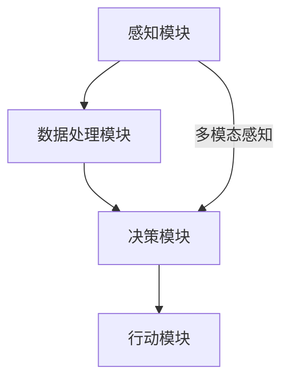

                 

### 文章标题

# AGI的类人感知系统设计

> 关键词：AGI、类人感知系统、感知系统设计、应用场景、技术挑战

> 摘要：本文将深入探讨通用人工智能（AGI）的类人感知系统设计。首先，我们将回顾AGI的基本概念和发展历程，接着详细分析类人感知系统的基本原理和技术框架。随后，本文将阐述感知系统设计的方法和流程，包括系统架构、数据采集、模型训练等关键步骤。此外，我们将探讨类人感知系统在不同领域的应用案例，如智能家居、智能交通、医疗健康等。最后，本文将总结类人感知系统面临的技术挑战和未来的发展趋势，为读者提供一个全面的技术视角。

### 概述

#### 1. 什么是AGI？

**AGI**，即通用人工智能，是指一种能够执行任何智能任务的机器。与当前广泛应用的窄域人工智能（Narrow AI）不同，AGI旨在实现与人类智能相似的广泛能力。具体来说，AGI需要具备以下特征：

- **自主学习**：AGI能够在没有人类指导的情况下学习新任务。
- **自主推理**：AGI能够进行逻辑推理，解决复杂问题。
- **情境理解**：AGI能够理解并适应不同的情境和环境。
- **情感识别**：AGI能够识别和表达情感，实现与人类的自然交互。

#### 2. AGI的发展历程

AGI的概念最早可以追溯到20世纪50年代，当时艾伦·图灵提出了著名的图灵测试。然而，由于技术限制，AGI的研究在很长一段时间内未能取得显著进展。直到21世纪初，随着深度学习、强化学习和自然语言处理等技术的突破，AGI的研究才逐渐进入快速发展阶段。一些重要的里程碑包括：

- 2012年，AlexNet在ImageNet图像识别竞赛中取得突破性成绩。
- 2016年，谷歌的AlphaGo战胜世界围棋冠军李世石。
- 2018年，OpenAI的GPT-2模型在自然语言生成任务中展示出惊人的能力。

#### 3. 类人感知系统

类人感知系统是AGI的核心组成部分之一，旨在模拟人类感知系统，实现对视觉、听觉、触觉等信息的感知和处理。类人感知系统具有以下几个特点：

- **多模态感知**：类人感知系统能够同时处理多种类型的信息，如视觉、听觉、触觉等。
- **实时感知**：类人感知系统需要具备实时处理信息的能力，以适应动态环境。
- **自适应感知**：类人感知系统能够根据不同的环境和任务需求，调整感知策略。

#### 4. 类人感知系统的设计方法

设计类人感知系统需要考虑以下几个关键步骤：

- **系统架构设计**：确定系统的整体架构，包括感知模块、决策模块和行动模块。
- **数据采集与处理**：收集和处理大量的感知数据，以训练和优化感知模型。
- **模型训练与优化**：使用先进的机器学习算法，如深度学习、强化学习等，训练感知模型。
- **系统部署与优化**：将训练好的模型部署到实际应用中，并进行持续优化和改进。

#### 5. 类人感知系统的应用场景

类人感知系统在多个领域具有广泛的应用前景，如：

- **智能家居**：类人感知系统可以用于智能安防、智能家电控制、家居环境监测等。
- **智能交通**：类人感知系统可以用于交通流量监控、车辆检测与识别、自动驾驶等。
- **医疗健康**：类人感知系统可以用于医疗影像诊断、健康监测、智能助手等。

### 目录大纲设计

基于上述内容，本书将分为以下几个主要部分：

- **第1章 AGI概述**：介绍AGI的基本概念、发展历程、核心目标以及与传统AI的区别。
- **第2章 类人感知系统的基本原理**：详细讲解类人感知系统的基本原理、技术框架和核心算法。
- **第3章 感知系统设计方法**：探讨如何设计和构建类人感知系统，包括系统架构、数据采集、模型训练等。
- **第4章 类人感知系统的应用场景**：分析类人感知系统在不同领域的应用，如智能家居、智能交通、医疗健康等。
- **第5章 技术挑战与未来趋势**：探讨类人感知系统在设计、实现和应用中面临的技术挑战，以及未来的发展趋势。

### 目录大纲设计

基于上述内容，我们可以设计出本书的详细目录大纲：

# AGI的类人感知系统设计

## 第1章 AGI概述

### 1.1 AGI的基本概念

#### 1.1.1 什么是AGI

#### 1.1.2 AGI的发展历程

#### 1.1.3 AGI与传统AI的区别

### 1.2 AGI的核心目标

#### 1.2.1 类人智能

#### 1.2.2 自主性

#### 1.2.3 智能泛化

### 1.3 AGI的关键技术

#### 1.3.1 神经网络与深度学习

#### 1.3.2 强化学习

#### 1.3.3 自然语言处理

### 1.4 AGI的发展趋势

#### 1.4.1 技术突破

#### 1.4.2 社会影响

#### 1.4.3 未来展望

## 第2章 类人感知系统的基本原理

### 2.1 类人感知系统的定义

#### 2.1.1 什么是类人感知系统

#### 2.1.2 类人感知系统的作用

### 2.2 类人感知系统的技术框架

#### 2.2.1 视觉感知

#### 2.2.2 听觉感知

#### 2.2.3 触觉感知

### 2.3 类人感知系统的核心算法

#### 2.3.1 卷积神经网络（CNN）

#### 2.3.2 递归神经网络（RNN）

#### 2.3.3 图神经网络（GNN）

### 2.4 类人感知系统的架构设计

#### 2.4.1 感知模块

#### 2.4.2 决策模块

#### 2.4.3 行动模块

## 第3章 感知系统设计方法

### 3.1 系统架构设计

#### 3.1.1 系统架构的划分

#### 3.1.2 系统架构的选择

### 3.2 数据采集与处理

#### 3.2.1 数据采集

#### 3.2.2 数据预处理

### 3.3 模型训练与优化

#### 3.3.1 模型选择

#### 3.3.2 模型训练

#### 3.3.3 模型优化

## 第4章 类人感知系统的应用场景

### 4.1 智能家居

#### 4.1.1 智能家居的感知需求

#### 4.1.2 类人感知系统在家居环境中的应用

### 4.2 智能交通

#### 4.2.1 智能交通的感知需求

#### 4.2.2 类人感知系统在交通领域的应用

### 4.3 医疗健康

#### 4.3.1 医疗健康的感知需求

#### 4.3.2 类人感知系统在医疗健康领域的应用

## 第5章 技术挑战与未来趋势

### 5.1 技术挑战

#### 5.1.1 数据隐私与安全

#### 5.1.2 模型解释性

#### 5.1.3 模型泛化能力

### 5.2 未来趋势

#### 5.2.1 类人感知系统的多样化应用

#### 5.2.2 深度学习与类人智能的融合

#### 5.2.3 新一代类人感知系统的研发方向

### 结论

- 对全书内容进行总结，展望未来类人感知系统的发展趋势。

以上为本书的目录大纲，每个章节下的内容可以进一步细化，以满足读者的需求。在编写过程中，我们还将插入相关的流程图、伪代码、数学公式和代码实例，以帮助读者更好地理解本书的核心内容。

### 第1章 AGI概述

#### 1.1 AGI的基本概念

**通用人工智能（AGI）**，即Artificial General Intelligence，指的是一种具备人类智能的机器，能够理解、学习和适应各种不同的环境，执行各种复杂的任务。与当前广泛应用的**窄域人工智能（Narrow AI）**，如图像识别、语音识别、自然语言处理等，不同之处在于，AGI的目标是达到甚至超越人类智能的广泛性和适应性。

在定义AGI时，需要考虑以下几个关键要素：

1. **通用性**：AGI应能够处理和解决各种不同类型的任务，而不仅仅是特定的某一种或几种任务。
2. **学习与适应能力**：AGI应具备自主学习的能力，能够通过经验积累和自我优化，提高自身的智能水平。
3. **情境理解**：AGI应能够理解并适应不同的情境和环境，具有高度的情境感知能力。
4. **自主性**：AGI应具备一定的自主决策能力，能够在没有人类干预的情况下，独立完成任务。

AGI的核心目标是在不同领域实现与人类智能相似的能力，例如：

- **语言理解**：能够理解自然语言，进行对话和交流。
- **推理与问题解决**：能够进行逻辑推理，解决复杂问题。
- **知识表示与推理**：能够构建和利用知识图谱，进行知识推理。
- **自主决策**：能够根据环境和目标，做出合理的决策。

#### 1.2 AGI的发展历程

AGI的概念最早可以追溯到20世纪50年代，当时艾伦·图灵提出了著名的图灵测试。图灵测试旨在通过机器模仿人类的行为，判断机器是否具备智能。尽管图灵测试是一个理论上的概念，但它为AGI的研究奠定了基础。

在接下来的几十年里，随着计算机技术的发展，AGI的研究逐步展开。然而，由于技术限制，AGI的研究在很长一段时间内未能取得显著进展。直到21世纪初，随着深度学习、强化学习和自然语言处理等技术的突破，AGI的研究才逐渐进入快速发展阶段。

一些重要的里程碑包括：

- **1997年**：IBM的超级计算机“深蓝”战胜国际象棋世界冠军卡斯帕罗夫。
- **2012年**：AlexNet在ImageNet图像识别竞赛中取得突破性成绩，标志着深度学习在图像识别领域的崛起。
- **2016年**：谷歌的AlphaGo战胜世界围棋冠军李世石，展示出深度学习和强化学习在游戏领域的高超能力。
- **2018年**：OpenAI的GPT-2模型在自然语言生成任务中展示出惊人的能力，引起广泛关注。

这些里程碑事件不仅证明了AI技术的进步，也为AGI的研究提供了新的思路和方向。

#### 1.3 AGI与传统AI的区别

传统AI，即**窄域人工智能（Narrow AI）**，是指专注于解决特定问题或执行特定任务的智能系统。例如，图像识别AI、语音识别AI、自然语言处理AI等。传统AI的特点是：

- **专一性**：传统AI仅能解决特定的任务或问题。
- **预定义目标**：传统AI的目标是明确的，通常由人类预设。
- **数据依赖性**：传统AI的性能高度依赖于训练数据的质量和数量。

相比之下，AGI具有以下几个显著特点：

- **通用性**：AGI能够处理和解决多种不同类型的任务，具有广泛的适应性。
- **自主学习能力**：AGI能够通过经验积累和自我优化，提高自身的智能水平。
- **情境理解**：AGI能够理解并适应不同的情境和环境。
- **自主决策能力**：AGI能够在没有人类干预的情况下，独立完成任务。

尽管传统AI在某些特定领域表现出色，但其应用范围有限。相比之下，AGI的目标是达到甚至超越人类智能的广泛性和适应性，具有更大的发展潜力和应用前景。

#### 1.4 AGI的核心目标

AGI的核心目标是在不同领域实现与人类智能相似的能力，主要包括以下几个方面：

- **语言理解**：AGI应能够理解自然语言，进行对话和交流。这需要AI具备强大的自然语言处理能力，包括语法分析、语义理解、上下文推理等。
- **推理与问题解决**：AGI应能够进行逻辑推理，解决复杂问题。这需要AI具备强大的推理能力和问题解决能力，能够处理不确定性、复杂性和多目标优化问题。
- **知识表示与推理**：AGI应能够构建和利用知识图谱，进行知识推理。这需要AI具备强大的知识表示和推理能力，能够处理结构化和非结构化数据。
- **自主决策**：AGI应能够根据环境和目标，做出合理的决策。这需要AI具备强大的决策能力，能够处理复杂的环境信息和多目标决策问题。

为了实现这些目标，AGI需要具备以下几个关键能力：

- **自主学习**：AGI应能够通过自主学习，不断积累经验，提高自身的智能水平。
- **情境理解**：AGI应能够理解并适应不同的情境和环境。
- **多模态感知**：AGI应能够同时处理多种类型的信息，如视觉、听觉、触觉等。
- **自主推理**：AGI应能够进行逻辑推理，解决复杂问题。
- **情感识别**：AGI应能够识别和表达情感，实现与人类的自然交互。

#### 1.5 AGI的关键技术

实现AGI需要依赖多个关键技术的突破，以下是其中几个重要的领域：

- **深度学习**：深度学习是一种基于多层神经网络的学习方法，能够自动提取特征并进行分类、识别等任务。深度学习在图像识别、语音识别、自然语言处理等领域取得了显著成果，为AGI的实现提供了基础。
- **强化学习**：强化学习是一种通过奖励机制进行学习的算法，能够使AI在动态环境中进行自主决策。强化学习在游戏、机器人控制等领域表现出色，为AGI的自主决策提供了支持。
- **自然语言处理**：自然语言处理是一种使计算机能够理解、生成和处理自然语言的技术。自然语言处理在语音识别、机器翻译、文本生成等领域取得了重要进展，为AGI的语言理解能力提供了基础。
- **知识表示与推理**：知识表示与推理是一种将知识表示为计算机可理解的形式，并进行推理的技术。知识表示与推理在智能问答、知识图谱构建、智能决策等领域具有广泛的应用，为AGI的知识表示与推理能力提供了支持。
- **多模态感知**：多模态感知是一种同时处理多种类型信息的技术，如视觉、听觉、触觉等。多模态感知能够使AI更接近人类的感知能力，为AGI的情境理解提供了支持。

#### 1.6 AGI的发展趋势

随着人工智能技术的快速发展，AGI的发展也呈现出一些显著的趋势：

- **技术突破**：随着深度学习、强化学习等技术的不断突破，AGI的实现逐渐成为可能。未来，这些技术将继续推动AGI的发展，使其在各个领域取得更加出色的表现。
- **应用场景拓展**：AGI的应用场景将不断拓展，从传统的图像识别、语音识别、自然语言处理等，扩展到医疗、金融、教育、工业等各个领域。AGI的应用将带来巨大的社会和经济价值。
- **跨学科融合**：AGI的发展需要依赖多个学科的交叉融合，如计算机科学、心理学、认知科学、神经科学等。这些学科的融合将推动AGI的理论研究和技术创新。
- **伦理与安全**：随着AGI的发展，其带来的伦理和安全问题也日益突出。如何确保AGI的安全、可控和可解释，将成为AGI发展的重要挑战。

总之，AGI的发展前景广阔，将为人类社会带来前所未有的变革和机遇。

### 第2章 类人感知系统的基本原理

#### 2.1 类人感知系统的定义

类人感知系统（Human-like Perception System）是一种模仿人类感知系统的人工智能系统，旨在使机器能够像人类一样感知和理解外部环境。类人感知系统包括视觉、听觉、触觉等多个感知模块，能够对多种类型的信息进行感知和处理。

类人感知系统的核心目标是通过模拟人类感知过程，实现对复杂环境的感知和理解。具体来说，类人感知系统需要具备以下几个特点：

- **多模态感知**：类人感知系统能够同时处理视觉、听觉、触觉等多种类型的信息，实现对环境的全方位感知。
- **实时感知**：类人感知系统需要具备实时处理信息的能力，以适应动态环境的变化。
- **情境理解**：类人感知系统能够理解并适应不同的情境和环境，具有高度的情境感知能力。
- **自主学习与自适应**：类人感知系统能够通过自主学习，不断优化自身的感知能力和效果，适应不同的环境和任务需求。

类人感知系统在人工智能领域具有重要地位。首先，它是实现通用人工智能（AGI）的基础之一，通过模拟人类感知过程，类人感知系统能够使机器具备更广泛和灵活的智能能力。其次，类人感知系统在多个应用领域具有广泛的应用前景，如智能家居、智能交通、医疗健康等。此外，类人感知系统的研究有助于深入理解人类感知机制的原理，推动人工智能技术的发展和进步。

#### 2.2 类人感知系统的技术框架

类人感知系统的技术框架主要包括感知模块、数据处理模块、决策模块和行动模块。下面，我们将分别介绍这些模块的原理和技术。

##### 2.2.1 感知模块

感知模块是类人感知系统的核心组成部分，负责对多种类型的信息进行采集和处理。感知模块主要包括视觉、听觉、触觉等多个感知单元。

- **视觉感知**：视觉感知模块负责采集和处理图像信息，通过图像识别、图像分割、目标检测等技术，实现对场景中物体的识别和定位。
- **听觉感知**：听觉感知模块负责采集和处理音频信息，通过语音识别、音频分类、声源定位等技术，实现对声音的理解和识别。
- **触觉感知**：触觉感知模块负责采集和处理触觉信息，通过力觉传感器、柔性传感器等技术，实现对物体表面和形态的感知。

感知模块的技术实现主要依赖于计算机视觉、音频处理和触觉传感等技术。

##### 2.2.2 数据处理模块

数据处理模块负责对采集到的感知数据进行处理和融合，以提高类人感知系统的感知准确性和鲁棒性。数据处理模块主要包括数据预处理、特征提取、特征融合等技术。

- **数据预处理**：数据预处理主要包括去噪、归一化、数据增强等技术，以提高数据的可靠性和有效性。
- **特征提取**：特征提取是指从原始感知数据中提取出具有代表性的特征，用于后续的模型训练和决策。
- **特征融合**：特征融合是指将不同感知模块提取到的特征进行融合，形成统一的全局特征，以提高感知系统的综合感知能力。

数据处理模块的技术实现主要依赖于信号处理、机器学习等技术。

##### 2.2.3 决策模块

决策模块负责根据感知模块和处理模块提供的信息，进行决策和规划。决策模块主要包括基于规则的决策、基于模型的决策、强化学习等技术。

- **基于规则的决策**：基于规则的决策是指通过预设的规则，对感知信息进行分类和决策。
- **基于模型的决策**：基于模型的决策是指通过训练好的模型，对感知信息进行分类和决策。
- **强化学习**：强化学习是指通过奖励机制，使感知系统在动态环境中进行自主学习和优化。

决策模块的技术实现主要依赖于规则引擎、机器学习、深度学习等技术。

##### 2.2.4 行动模块

行动模块负责根据决策模块的决策结果，执行相应的动作。行动模块主要包括机器人控制、自动驾驶、人机交互等技术。

- **机器人控制**：机器人控制是指通过控制算法，实现对机器人的位置、速度、力矩等参数的实时控制。
- **自动驾驶**：自动驾驶是指通过感知系统和决策模块，实现车辆的自主驾驶。
- **人机交互**：人机交互是指通过语音、手势、触摸等方式，实现人与机器之间的自然交互。

行动模块的技术实现主要依赖于机器人控制、自动驾驶、人机交互等技术。

##### 2.2.5 技术框架图

类人感知系统的技术框架可以表示为以下Mermaid流程图：



在类人感知系统的技术框架中，感知模块负责采集和处理多种类型的信息，数据处理模块负责对感知数据进行处理和融合，决策模块根据处理结果进行决策和规划，行动模块根据决策结果执行相应的动作。多模态感知技术使得类人感知系统能够更全面地理解外部环境。

#### 2.3 类人感知系统的核心算法

类人感知系统的核心算法是实现其对环境感知和理解的关键。以下将详细介绍几种常用的核心算法：卷积神经网络（CNN）、递归神经网络（RNN）和图神经网络（GNN）。

##### 2.3.1 卷积神经网络（CNN）

卷积神经网络（CNN）是一种专门用于图像处理和识别的深度学习模型，其核心在于通过卷积操作和池化操作，自动提取图像中的特征。

- **卷积操作**：卷积操作是指将卷积核（一组滤波器）与输入图像进行卷积，生成特征图。卷积核的参数通过训练自动调整，以最大化输出特征图的区分度。
- **池化操作**：池化操作是指对特征图进行下采样，减小特征图的尺寸，减少模型参数和计算量。常见的池化操作有最大池化和平均池化。

CNN的算法原理可以用以下伪代码表示：

```python
def convolutional_neural_network(input_image):
    # 初始化卷积核和偏置
    weights = initialize_weights()
    bias = initialize_bias()

    # 卷积操作
    feature_map = convolution(input_image, weights)

    # 池化操作
    pooled_feature_map = pooling(feature_map)

    # 返回特征图
    return pooled_feature_map
```

在图像识别任务中，CNN通常用于分类和检测。以下是一个简单的图像分类任务示例：

```python
def image_classification(input_image):
    # 获取标签
    label = get_label(input_image)

    # 使用CNN提取特征
    feature_map = convolutional_neural_network(input_image)

    # 全连接层进行分类
    output = fully_connected_layer(feature_map)

    # 获取分类结果
    predicted_label = get_predicted_label(output, label)

    # 返回分类结果
    return predicted_label
```

##### 2.3.2 递归神经网络（RNN）

递归神经网络（RNN）是一种能够处理序列数据的神经网络，其核心在于通过递归连接，对序列中的每个元素进行建模。

- **递归连接**：RNN通过将前一个时间步的输出作为当前时间步的输入，形成递归连接。
- **门控机制**：为了解决RNN的梯度消失和梯度爆炸问题，RNN引入了门控机制，如门控循环单元（LSTM）和长短期记忆网络（GRU）。

RNN的算法原理可以用以下伪代码表示：

```python
def recurrent_neural_network(input_sequence, hidden_state):
    # 初始化权重和偏置
    weights = initialize_weights()
    bias = initialize_bias()

    # 递归连接
    hidden_state = (1 - forget_gate) * hidden_state + input_gate * new_hidden_state

    # 返回隐藏状态
    return hidden_state
```

在自然语言处理任务中，RNN常用于文本分类、机器翻译等。以下是一个简单的文本分类任务示例：

```python
def text_classification(input_sequence):
    # 获取标签
    label = get_label(input_sequence)

    # 使用RNN提取特征
    hidden_state = recurrent_neural_network(input_sequence, initial_hidden_state)

    # 全连接层进行分类
    output = fully_connected_layer(hidden_state)

    # 获取分类结果
    predicted_label = get_predicted_label(output, label)

    # 返回分类结果
    return predicted_label
```

##### 2.3.3 图神经网络（GNN）

图神经网络（GNN）是一种专门用于处理图结构数据的神经网络，其核心在于通过图卷积操作，对图中的节点和边进行建模。

- **图卷积操作**：图卷积操作是指将节点的特征与相邻节点的特征进行加权求和，生成新的特征。
- **注意力机制**：为了解决图卷积操作中节点特征的重要性不平衡问题，GNN引入了注意力机制。

GNN的算法原理可以用以下伪代码表示：

```python
def graph_neural_network(node_features, edge_features):
    # 初始化权重和偏置
    weights = initialize_weights()
    bias = initialize_bias()

    # 图卷积操作
    new_node_features = graph_convolution(node_features, edge_features, weights)

    # 返回新的节点特征
    return new_node_features
```

在社交网络分析、推荐系统等任务中，GNN常用于节点分类、图分类等。以下是一个简单的节点分类任务示例：

```python
def node_classification(input_node_features, input_edge_features):
    # 获取标签
    label = get_label(input_node_features)

    # 使用GNN提取特征
    new_node_features = graph_neural_network(input_node_features, input_edge_features)

    # 全连接层进行分类
    output = fully_connected_layer(new_node_features)

    # 获取分类结果
    predicted_label = get_predicted_label(output, label)

    # 返回分类结果
    return predicted_label
```

综上所述，类人感知系统的核心算法包括卷积神经网络（CNN）、递归神经网络（RNN）和图神经网络（GNN）。这些算法通过不同的方式，实现对图像、序列和图结构数据的建模和分类。在类人感知系统中，这些算法被广泛应用于视觉感知、语音识别、自然语言处理等领域，为系统提供了强大的感知和理解能力。

#### 2.4 类人感知系统的架构设计

类人感知系统的架构设计是其实现高效感知和理解外部环境的关键。一个完整的类人感知系统通常包括感知模块、数据处理模块、决策模块和行动模块。以下将详细介绍这些模块的设计原则和实现方法。

##### 2.4.1 感知模块

感知模块是类人感知系统的核心组成部分，负责采集和处理多种类型的信息，如视觉、听觉、触觉等。感知模块的设计原则包括：

- **多模态感知**：类人感知系统需要具备多模态感知能力，以实现对环境的全方位感知。这要求感知模块能够同时处理视觉、听觉、触觉等多种类型的信息。
- **高精度**：感知模块的精度直接影响类人感知系统的性能。因此，设计感知模块时，需要选择高精度的传感器和算法，以提高感知的准确性和可靠性。
- **实时性**：类人感知系统需要具备实时处理信息的能力，以适应动态环境的变化。这要求感知模块能够快速采集和处理信息，确保系统在短时间内做出反应。

实现方法：

- **视觉感知**：视觉感知模块通常采用摄像头和图像处理算法，实现对场景中物体的识别和定位。常见的算法包括卷积神经网络（CNN）、目标检测算法（如YOLO、SSD）等。
- **听觉感知**：听觉感知模块通常采用麦克风和音频处理算法，实现对声音的理解和识别。常见的算法包括语音识别算法（如基于深度学习的ASR）、音频分类算法（如基于深度学习的SVC）等。
- **触觉感知**：触觉感知模块通常采用力觉传感器和触觉处理算法，实现对物体表面和形态的感知。常见的算法包括触觉识别算法（如基于深度学习的TD）等。

##### 2.4.2 数据处理模块

数据处理模块负责对感知模块采集到的信息进行预处理、特征提取和特征融合，以提高类人感知系统的感知准确性和鲁棒性。数据处理模块的设计原则包括：

- **数据预处理**：数据预处理是数据处理模块的重要环节，通过去噪、归一化、数据增强等技术，提高数据的可靠性和有效性。
- **特征提取**：特征提取是从原始感知数据中提取出具有代表性的特征，用于后续的模型训练和决策。设计特征提取算法时，需要考虑特征的表达能力和计算复杂度。
- **特征融合**：特征融合是将不同感知模块提取到的特征进行融合，形成统一的全局特征，以提高类人感知系统的综合感知能力。

实现方法：

- **数据预处理**：数据预处理算法包括去噪、归一化、数据增强等。去噪算法（如滤波器、小波变换）用于去除感知数据中的噪声；归一化算法（如归一化、标准化）用于调整数据范围，使其适合后续处理；数据增强算法（如旋转、翻转、裁剪）用于增加数据的多样性和丰富性。
- **特征提取**：特征提取算法包括频域特征、时域特征、空间特征等。频域特征（如傅里叶变换、小波变换）用于提取信号的频率信息；时域特征（如均值、方差、自相关函数）用于提取信号的时域特征；空间特征（如边缘检测、角点检测）用于提取图像的空间特征。
- **特征融合**：特征融合算法包括拼接、加权、聚类等。拼接是将不同特征进行拼接，形成新的特征向量；加权是将不同特征的权重进行调整，使其对系统的贡献更明显；聚类是将特征进行分类，形成不同的特征簇。

##### 2.4.3 决策模块

决策模块负责根据数据处理模块提供的信息，进行决策和规划。决策模块的设计原则包括：

- **自适应决策**：决策模块需要能够根据环境和任务需求，自适应地调整决策策略，以适应不同的情境和环境。
- **实时性**：决策模块需要具备实时处理信息的能力，确保系统能够在短时间内做出反应。
- **可靠性**：决策模块需要具有较高的可靠性，确保在复杂和动态环境中，系统能够稳定地做出正确的决策。

实现方法：

- **基于规则的决策**：基于规则的决策是指通过预设的规则，对感知信息进行分类和决策。这种方法简单直观，但难以应对复杂和动态的环境。
- **基于模型的决策**：基于模型的决策是指通过训练好的模型，对感知信息进行分类和决策。这种方法能够处理复杂和动态的环境，但需要大量的数据和计算资源。
- **强化学习**：强化学习是指通过奖励机制，使感知系统在动态环境中进行自主学习和优化。这种方法能够实现自主学习和自适应决策，但需要解决好奖励设计和平衡问题。

##### 2.4.4 行动模块

行动模块负责根据决策模块的决策结果，执行相应的动作。行动模块的设计原则包括：

- **可控性**：行动模块需要具备良好的可控性，确保系统能够在预定范围内执行动作。
- **灵活性**：行动模块需要具备良好的灵活性，能够适应不同的任务和环境。
- **鲁棒性**：行动模块需要具备良好的鲁棒性，能够在复杂和动态环境中稳定地执行动作。

实现方法：

- **机器人控制**：机器人控制是指通过控制算法，实现对机器人的位置、速度、力矩等参数的实时控制。常见的机器人控制算法包括PID控制、模型预测控制等。
- **自动驾驶**：自动驾驶是指通过感知系统和决策模块，实现车辆的自主驾驶。常见的自动驾驶算法包括基于视觉的自动驾驶、基于激光雷达的自动驾驶等。
- **人机交互**：人机交互是指通过语音、手势、触摸等方式，实现人与机器之间的自然交互。常见的人机交互算法包括语音识别、手势识别、触觉识别等。

##### 2.4.5 架构设计图

类人感知系统的架构设计可以表示为以下Mermaid流程图：


在类人感知系统的架构设计中，感知模块负责采集和处理多种类型的信息，数据处理模块负责对感知数据进行处理和融合，决策模块根据处理结果进行决策和规划，行动模块根据决策结果执行相应的动作。多模态感知技术使得类人感知系统能够更全面地理解外部环境。

#### 2.5 类人感知系统在应用中的挑战和优化策略

尽管类人感知系统在多个领域展现出强大的能力，但在实际应用中仍然面临诸多挑战。以下将探讨类人感知系统在应用中常见的挑战，并提出相应的优化策略。

##### 2.5.1 数据隐私和安全

类人感知系统在处理和存储大量感知数据时，可能面临数据隐私和安全的问题。特别是在涉及个人隐私的场景中，如医疗健康、智能家居等，如何确保数据的隐私和安全成为关键挑战。

**优化策略**：

- **数据加密**：对敏感数据进行加密处理，确保数据在传输和存储过程中不会被未授权访问。
- **匿名化处理**：对个人数据进行匿名化处理，去除或模糊化能够识别个人身份的信息。
- **访问控制**：建立严格的访问控制机制，限制对敏感数据的访问权限，确保只有授权用户能够访问和处理数据。

##### 2.5.2 模型解释性

类人感知系统的模型通常是基于深度学习的黑盒模型，其决策过程缺乏透明性和可解释性。这在某些应用场景中，如医疗诊断、自动驾驶等，可能导致用户对系统的信任问题。

**优化策略**：

- **模型可解释性**：开发可解释性模型，如基于规则的可解释模型、基于知识的解释方法等，使系统决策过程更加透明和可理解。
- **可视化工具**：开发可视化工具，将模型的决策过程和推理路径以直观的方式展示给用户，提高用户对系统的信任。
- **模型压缩**：通过模型压缩技术，如量化、剪枝、低秩分解等，降低模型复杂度，提高模型的解释性。

##### 2.5.3 模型泛化能力

类人感知系统的模型在训练过程中可能过度依赖训练数据，导致模型的泛化能力较差。在实际应用中，模型可能无法适应新的环境和任务。

**优化策略**：

- **数据增强**：通过数据增强技术，如旋转、缩放、裁剪等，增加训练数据的多样性和丰富性，提高模型的泛化能力。
- **迁移学习**：利用迁移学习技术，将预训练模型应用于新任务，利用预训练模型的知识和经验，提高模型的泛化能力。
- **在线学习**：通过在线学习技术，使模型能够不断从新数据中学习，不断调整和优化模型，提高模型的泛化能力。

##### 2.5.4 硬件资源限制

类人感知系统在实现过程中可能面临硬件资源限制，如计算能力、存储容量、功耗等。这在某些应用场景中，如边缘计算、移动设备等，可能导致系统性能受限。

**优化策略**：

- **模型压缩**：通过模型压缩技术，降低模型复杂度，减少计算资源和存储资源的消耗。
- **硬件优化**：优化硬件设计，如使用高效的计算芯片、优化电路设计等，提高硬件的性能和能效。
- **分布式计算**：通过分布式计算技术，将计算任务分布在多个计算节点上，提高系统的并行计算能力，降低硬件资源限制。

##### 2.5.5 人机交互体验

类人感知系统在应用过程中需要与人类进行交互，如何提供自然、直观的交互体验成为关键挑战。

**优化策略**：

- **自然语言处理**：利用自然语言处理技术，实现人与机器之间的自然对话和交流。
- **语音识别和合成**：利用语音识别和合成技术，实现语音输入和语音输出的交互。
- **手势识别和追踪**：利用手势识别和追踪技术，实现手势控制和人机交互。

通过上述优化策略，类人感知系统在应用中的挑战可以得到有效缓解，提高系统的性能和用户体验。

### 第3章 感知系统设计方法

感知系统设计是类人感知系统实现的关键环节。一个有效的感知系统设计需要综合考虑系统架构、数据采集与处理、模型训练与优化等多个方面。以下将详细介绍感知系统设计的方法和流程。

#### 3.1 系统架构设计

系统架构设计是感知系统设计的第一步，它决定了系统的整体性能和可扩展性。一个典型的类人感知系统架构通常包括感知模块、数据处理模块、决策模块和行动模块。以下是系统架构设计的关键步骤：

##### 3.1.1 模块划分

首先，需要明确感知系统的功能需求，并根据需求将系统划分为感知模块、数据处理模块、决策模块和行动模块。感知模块负责采集多种类型的信息，如视觉、听觉、触觉等；数据处理模块负责对采集到的信息进行预处理、特征提取和特征融合；决策模块负责根据处理结果进行决策和规划；行动模块负责执行决策模块的决策结果。

##### 3.1.2 模块交互

在模块划分完成后，需要设计模块之间的交互机制，确保各模块能够协同工作。例如，感知模块采集到的数据需要传输到数据处理模块进行预处理和特征提取，处理结果再传输到决策模块进行决策，最终决策结果由行动模块执行。

##### 3.1.3 系统优化

系统架构设计不仅要满足功能需求，还需要考虑系统的性能和可扩展性。例如，在数据处理模块中，可以使用并行计算和分布式计算技术，提高处理速度和效率。在决策模块中，可以采用强化学习等技术，提高决策的准确性和鲁棒性。

##### 3.1.4 架构设计图

系统架构设计可以用以下Mermaid流程图表示：


#### 3.2 数据采集与处理

数据采集与处理是感知系统设计的关键环节，它决定了感知系统的感知准确性和鲁棒性。以下是数据采集与处理的主要步骤：

##### 3.2.1 数据采集

数据采集是感知系统的第一步，它负责采集多种类型的信息，如视觉、听觉、触觉等。数据采集可以通过传感器、摄像头、麦克风等设备实现。在选择传感器和设备时，需要考虑以下几个因素：

- **精度**：传感器的精度直接影响感知系统的准确性。需要选择高精度的传感器，以确保感知数据的可靠性。
- **灵敏度**：传感器的灵敏度影响感知系统的灵敏度。需要选择高灵敏度的传感器，以提高感知系统对环境变化的响应能力。
- **功耗**：传感器的功耗影响感知系统的能耗。需要选择低功耗的传感器，以延长感知系统的续航时间。

##### 3.2.2 数据预处理

数据预处理是数据采集后的第一步，它负责对采集到的数据进行去噪、归一化、滤波等处理，以提高数据的可靠性和有效性。以下是几种常见的数据预处理方法：

- **去噪**：去噪是指去除数据中的噪声，提高数据的准确性。常见的去噪方法包括滤波器（如高斯滤波、均值滤波）和小波变换。
- **归一化**：归一化是指调整数据范围，使其适合后续处理。常见的归一化方法包括最小-最大归一化、零-均值归一化等。
- **滤波**：滤波是指去除数据中的高频或低频分量，提高数据的平滑性。常见的滤波方法包括低通滤波、高通滤波等。

##### 3.2.3 特征提取

特征提取是指从原始数据中提取出具有代表性的特征，用于后续的模型训练和决策。特征提取是感知系统设计的关键步骤，它决定了感知系统的性能和准确性。以下是几种常见的特征提取方法：

- **频域特征**：频域特征是指将数据转换为频率域表示，提取出数据中的频率信息。常见的频域特征提取方法包括傅里叶变换（FT）、离散小波变换（DWT）等。
- **时域特征**：时域特征是指直接在时间域上提取数据中的特征。常见的时域特征提取方法包括均值、方差、自相关函数等。
- **空间特征**：空间特征是指从图像或空间数据中提取出特征。常见的空间特征提取方法包括边缘检测、角点检测、区域特征提取等。

##### 3.2.4 数据存储与管理

数据存储与管理是确保数据长期有效存储和安全的关键环节。以下是几种常见的数据存储与管理方法：

- **数据库**：数据库是用于存储和管理大量数据的系统。常见的数据库包括关系型数据库（如MySQL、PostgreSQL）和NoSQL数据库（如MongoDB、Cassandra）。
- **数据湖**：数据湖是一种用于存储大量非结构化数据的系统，它能够灵活地处理各种类型的数据。常见的存储方案包括Hadoop、Spark等。
- **数据备份与恢复**：数据备份与恢复是确保数据安全的关键措施。常见的备份方法包括全量备份、增量备份等。

#### 3.3 模型训练与优化

模型训练与优化是感知系统设计的关键步骤，它决定了感知系统的性能和准确性。以下是模型训练与优化的主要步骤：

##### 3.3.1 模型选择

选择合适的模型是模型训练与优化的第一步。根据应用场景和任务需求，可以选择不同的模型，如卷积神经网络（CNN）、递归神经网络（RNN）、生成对抗网络（GAN）等。以下是几种常见的模型选择方法：

- **基于任务的模型选择**：根据任务的需求，选择能够有效解决任务的模型。例如，在图像识别任务中，可以选择CNN；在序列数据处理任务中，可以选择RNN。
- **基于数据的模型选择**：根据数据的特征和分布，选择能够适应数据的模型。例如，在处理高维度数据时，可以选择深度神经网络；在处理低维度数据时，可以选择线性模型。
- **基于性能的模型选择**：根据模型的性能指标，选择能够达到预期性能的模型。例如，在分类任务中，可以选择准确率、召回率等指标；在回归任务中，可以选择均方误差、平均绝对误差等指标。

##### 3.3.2 数据预处理

在模型训练之前，需要对数据进行预处理，以提高训练效果。以下是几种常见的数据预处理方法：

- **数据清洗**：数据清洗是指去除数据中的噪声和异常值，提高数据的准确性。常见的数据清洗方法包括去除缺失值、去除重复值、填补异常值等。
- **数据归一化**：数据归一化是指调整数据范围，使其适合模型的输入。常见的数据归一化方法包括最小-最大归一化、零-均值归一化等。
- **数据增强**：数据增强是指通过增加数据的多样性，提高模型的泛化能力。常见的数据增强方法包括旋转、缩放、裁剪、翻转等。

##### 3.3.3 训练过程

在模型训练过程中，需要不断调整模型参数，以优化模型性能。以下是几种常见的训练方法：

- **梯度下降法**：梯度下降法是一种常用的优化算法，它通过迭代更新模型参数，使损失函数最小化。常见的梯度下降法包括批量梯度下降（BGD）、随机梯度下降（SGD）、小批量梯度下降（MBGD）等。
- **动量优化**：动量优化是一种结合梯度历史信息的优化算法，它能够加速收敛速度。常见的动量优化方法包括简单动量（SGD with Momentum）、Nesterov动量等。
- **自适应优化**：自适应优化是一种根据训练过程自动调整学习率的优化算法。常见的自适应优化方法包括AdaGrad、RMSprop、Adam等。

##### 3.3.4 模型评估与优化

在模型训练完成后，需要对模型进行评估和优化。以下是几种常见的模型评估和优化方法：

- **交叉验证**：交叉验证是一种用于评估模型性能的方法，它通过将数据划分为训练集和验证集，多次训练和验证模型，计算平均性能。常见的交叉验证方法包括K折交叉验证、留一法交叉验证等。
- **模型融合**：模型融合是指将多个模型的预测结果进行合并，以提高整体性能。常见的模型融合方法包括投票法、堆叠法等。
- **超参数调整**：超参数调整是指调整模型的超参数，以优化模型性能。常见的超参数包括学习率、批量大小、正则化参数等。超参数调整可以通过手动调整或使用超参数优化算法（如随机搜索、贝叶斯优化等）进行。

#### 3.4 模型部署与优化

模型部署是将训练好的模型应用到实际场景中，使其能够提供实时服务的关键步骤。以下是模型部署和优化的一些关键步骤：

##### 3.4.1 模型压缩

模型压缩是指通过减少模型参数和计算量，提高模型部署的效率和速度。常见的模型压缩方法包括量化、剪枝、低秩分解等。

- **量化**：量化是一种将浮点数参数转换为低比特位参数的方法，它能够减少模型的存储和计算需求。
- **剪枝**：剪枝是一种通过删除模型中的冗余参数和连接，减少模型参数和计算量的方法。
- **低秩分解**：低秩分解是一种将高维参数分解为低维参数的方法，它能够减少模型的计算复杂度。

##### 3.4.2 部署方案

部署方案是指将模型部署到实际场景中的方法和策略。常见的部署方案包括：

- **边缘部署**：边缘部署是将模型部署到靠近数据源的设备上，如智能手机、嵌入式设备等。边缘部署能够提高系统的响应速度和实时性。
- **云部署**：云部署是将模型部署到云计算平台上，如AWS、Azure、Google Cloud等。云部署能够提供强大的计算能力和存储资源，但需要考虑网络延迟和带宽问题。
- **混合部署**：混合部署是将模型部分部署到边缘设备上，部分部署到云计算平台上。混合部署能够结合边缘部署和云部署的优点，提高系统的整体性能和可靠性。

##### 3.4.3 持续优化

持续优化是指在实际应用中，通过不断收集数据、反馈和用户反馈，优化模型性能和服务质量。常见的优化方法包括：

- **在线学习**：在线学习是指通过实时收集数据，在线更新和优化模型参数。在线学习能够使模型不断适应新的环境和任务需求。
- **A/B测试**：A/B测试是指通过将模型部署到不同的用户群体中，比较不同模型的效果，选择最佳模型。A/B测试能够帮助开发者发现和解决问题，提高模型性能和用户体验。

综上所述，感知系统设计是一个复杂且多样化的过程，它需要综合考虑系统架构、数据采集与处理、模型训练与优化等多个方面。通过合理的系统架构设计、高效的数据采集与处理、科学的模型训练与优化，以及持续的模型部署与优化，可以构建一个高性能、高可靠的类人感知系统，为各种应用场景提供强大的支持。

### 第4章 类人感知系统的应用场景

类人感知系统具有广泛的应用前景，能够在多个领域实现智能化和自动化。以下将分析类人感知系统在智能家居、智能交通和医疗健康等领域的应用。

#### 4.1 智能家居

智能家居是类人感知系统的重要应用领域之一，通过感知系统实现对家居环境的实时监测和控制。以下是类人感知系统在智能家居中的主要应用：

##### 4.1.1 智能家居的感知需求

- **环境监测**：智能家居需要感知室内温度、湿度、光照强度等环境参数，以确保家居环境的舒适性和安全性。
- **安防监控**：智能家居需要实时监测家庭安全，包括门锁状态、门窗开关、烟雾报警等，以预防安全事故。
- **家电控制**：智能家居需要对家电设备进行智能控制，如照明、空调、热水器等，以实现节能和舒适的生活体验。
- **智能交互**：智能家居需要与用户进行自然交互，如语音识别、手势控制等，以提供便捷的智能服务。

##### 4.1.2 类人感知系统在家居环境中的应用

- **环境监测与控制**：类人感知系统通过传感器采集室内环境数据，如温度、湿度、光照等，并通过数据分析，实现对家居环境的智能调节。例如，根据室内温度自动调整空调温度，根据光照强度自动调节照明设备。
- **安防监控**：类人感知系统通过摄像头和报警设备，实现对家庭安全的实时监测。例如，当传感器检测到异常情况时，系统会自动报警并通知用户。
- **家电控制**：类人感知系统通过语音识别和手势控制，实现对家电设备的智能控制。例如，用户可以通过语音指令控制空调开启，通过手势控制灯光亮度。
- **智能交互**：类人感知系统通过自然语言处理和语音合成，实现与用户的自然交互。例如，用户可以通过语音提问，系统可以回答用户的疑问，提供天气预报、新闻资讯等。

#### 4.2 智能交通

智能交通是类人感知系统的另一个重要应用领域，通过感知系统实现对交通流量的实时监测和管理。以下是类人感知系统在智能交通中的主要应用：

##### 4.2.1 智能交通的感知需求

- **车辆检测与识别**：智能交通系统需要实时检测和识别车辆，包括车型、车牌等，以实现交通管理和监控。
- **交通流量监测**：智能交通系统需要监测交通流量，包括道路拥堵情况、车辆速度分布等，以优化交通流量和缓解拥堵。
- **路况预测**：智能交通系统需要预测交通状况，包括事故预测、路况预测等，以提前采取应对措施，减少交通事故和拥堵。
- **行人检测与保护**：智能交通系统需要检测和识别行人，以保护行人的安全，减少交通事故。

##### 4.2.2 类人感知系统在交通领域的应用

- **车辆检测与识别**：类人感知系统通过摄像头和激光雷达等传感器，实现对车辆的高效检测和识别。例如，在自动驾驶系统中，类人感知系统可以实时检测前方车辆和行人，确保行车安全。
- **交通流量监测**：类人感知系统通过安装在道路上的摄像头和传感器，实时监测交通流量和路况。例如，在交通管理部门中，类人感知系统可以实时分析交通数据，优化交通信号灯配时，减少交通拥堵。
- **路况预测**：类人感知系统通过分析历史交通数据和实时感知数据，预测未来的交通状况。例如，在智能交通系统中，类人感知系统可以预测未来几小时内某条道路的交通流量和拥堵情况，提前发布交通预警。
- **行人检测与保护**：类人感知系统通过摄像头和激光雷达等传感器，实现对行人的实时检测和识别，确保行人的安全。例如，在自动驾驶车辆中，类人感知系统可以检测和识别行人，自动减速或停车，避免碰撞。

#### 4.3 医疗健康

医疗健康是类人感知系统的又一重要应用领域，通过感知系统实现对患者的实时监测和管理。以下是类人感知系统在医疗健康中的主要应用：

##### 4.3.1 医疗健康的感知需求

- **体征监测**：医疗健康系统需要实时监测患者的体征，如心率、血压、血糖等，以便及时发现异常情况。
- **影像诊断**：医疗健康系统需要通过影像设备（如CT、MRI）获取患者的影像数据，并进行实时诊断和分析。
- **健康咨询**：医疗健康系统需要为患者提供健康咨询和服务，如饮食建议、运动指导等，以帮助患者保持健康。
- **情感识别**：医疗健康系统需要识别患者的情感状态，如焦虑、抑郁等，以提供针对性的心理支持和干预。

##### 4.3.2 类人感知系统在医疗健康领域的应用

- **体征监测与预警**：类人感知系统通过传感器和医疗设备，实现对患者体征的实时监测和预警。例如，在智能监护系统中，类人感知系统可以实时监测患者的心率、血压等生命体征，并在异常情况发生时立即发出警报。
- **影像诊断与辅助**：类人感知系统通过深度学习和图像识别技术，实现对医疗影像的实时分析和诊断。例如，在智能医疗影像系统中，类人感知系统可以辅助医生快速识别病变区域，提高诊断准确性。
- **健康咨询与服务**：类人感知系统通过自然语言处理和大数据分析，为患者提供个性化的健康咨询和服务。例如，在智能健康系统中，类人感知系统可以根据患者的健康数据和生活方式，提供定制化的饮食建议、运动指导等。
- **情感识别与支持**：类人感知系统通过面部表情识别、语音识别等技术，识别患者的情感状态，提供针对性的心理支持和干预。例如，在智能心理治疗系统中，类人感知系统可以识别患者的焦虑、抑郁等情感状态，并通过虚拟现实技术提供沉浸式的心理治疗。

综上所述，类人感知系统在智能家居、智能交通和医疗健康等领域的应用，极大地提升了人类生活的智能化和便利性。随着类人感知技术的不断发展和成熟，它将在更多领域发挥重要作用，为人类社会带来更多价值。

### 第5章 技术挑战与未来趋势

#### 5.1 技术挑战

类人感知系统的实现和应用过程中，面临着一系列技术挑战，这些挑战涉及到数据隐私与安全、模型解释性、模型泛化能力等多个方面。

##### 5.1.1 数据隐私与安全

类人感知系统通常需要处理大量的个人数据，如生物特征、行为数据等。这些数据涉及到用户的隐私和安全，如何确保数据的隐私性和安全性成为一大挑战。以下是一些解决方案：

- **数据加密**：在数据传输和存储过程中，使用先进的加密技术，如对称加密、非对称加密、全同态加密等，确保数据的安全性。
- **匿名化处理**：在数据处理过程中，对敏感信息进行匿名化处理，去除或模糊化能够识别个人身份的信息。
- **访问控制**：建立严格的访问控制机制，限制对敏感数据的访问权限，确保只有授权用户能够访问和处理数据。

##### 5.1.2 模型解释性

类人感知系统通常使用深度学习等复杂模型，这些模型的决策过程往往缺乏透明性和可解释性。这导致用户难以理解模型的决策依据，从而降低了用户对系统的信任。以下是一些解决方案：

- **模型可解释性**：开发可解释性模型，如基于规则的模型、可解释的深度学习模型等，使系统决策过程更加透明和可理解。
- **可视化工具**：开发可视化工具，将模型的决策过程和推理路径以直观的方式展示给用户，提高用户对系统的信任。
- **模型压缩**：通过模型压缩技术，如量化、剪枝、低秩分解等，降低模型复杂度，提高模型的解释性。

##### 5.1.3 模型泛化能力

类人感知系统的模型在训练过程中可能过度依赖训练数据，导致模型的泛化能力较差。在实际应用中，模型可能无法适应新的环境和任务。以下是一些解决方案：

- **数据增强**：通过数据增强技术，如旋转、缩放、裁剪等，增加训练数据的多样性和丰富性，提高模型的泛化能力。
- **迁移学习**：利用迁移学习技术，将预训练模型应用于新任务，利用预训练模型的知识和经验，提高模型的泛化能力。
- **在线学习**：通过在线学习技术，使模型能够不断从新数据中学习，不断调整和优化模型，提高模型的泛化能力。

##### 5.1.4 硬件资源限制

类人感知系统在实现过程中可能面临硬件资源限制，如计算能力、存储容量、功耗等。这在某些应用场景中，如边缘计算、移动设备等，可能导致系统性能受限。以下是一些解决方案：

- **模型压缩**：通过模型压缩技术，降低模型复杂度，减少计算资源和存储资源的消耗。
- **硬件优化**：优化硬件设计，如使用高效的计算芯片、优化电路设计等，提高硬件的性能和能效。
- **分布式计算**：通过分布式计算技术，将计算任务分布在多个计算节点上，提高系统的并行计算能力，降低硬件资源限制。

#### 5.2 未来趋势

随着技术的不断进步，类人感知系统的发展呈现出一些新的趋势，这些趋势将推动类人感知系统在更多领域实现应用，并带来更大的价值。

##### 5.2.1 类人感知系统的多样化应用

类人感知系统的应用领域将不断拓展，从传统的视觉、听觉、触觉感知，扩展到更多领域，如气味感知、湿度感知、压力感知等。通过多样化的感知能力，类人感知系统将能够更全面地理解外部环境，为人类提供更丰富的信息服务。

##### 5.2.2 深度学习与类人智能的融合

深度学习技术在类人感知系统中的应用将更加深入，深度学习算法将不断优化，以适应更复杂的感知任务。同时，深度学习与类人智能的融合将推动类人感知系统向更智能、更自主的方向发展。

##### 5.2.3 新一代类人感知系统的研发方向

未来，类人感知系统的发展将朝着以下几个方向：

- **高效感知**：提高感知系统的效率和精度，实现更高性能的感知能力。
- **自适应感知**：增强感知系统的自适应能力，使其能够根据不同的环境和任务需求，动态调整感知策略。
- **多模态感知**：实现多种类型信息的同时感知和处理，提高系统的综合感知能力。
- **智能交互**：通过自然语言处理和智能交互技术，实现人与系统的自然互动，提高用户体验。

总之，类人感知系统的发展将不断突破技术挑战，实现多样化应用，为人类社会带来更多便利和价值。

### 结论

本文全面探讨了通用人工智能（AGI）的类人感知系统设计，从基本概念、技术框架、设计方法到应用场景，再到技术挑战与未来趋势，进行了深入的分析和阐述。通过本文，读者可以系统地了解类人感知系统的原理、实现方法及其在不同领域的应用，同时认识到其在未来发展中的重要性和潜力。

在未来的研究和应用中，类人感知系统有望在更多领域发挥重要作用，如医疗健康、智能制造、智慧城市等。然而，要实现类人感知系统的广泛应用，还需要解决数据隐私与安全、模型解释性、模型泛化能力等技术挑战。我们期待更多的研究者和开发者能够投入到类人感知系统的研发中，共同推动人工智能技术的发展和进步。

**作者信息：**

作者：AI天才研究院/AI Genius Institute & 禅与计算机程序设计艺术 /Zen And The Art of Computer Programming

