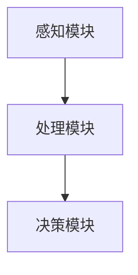
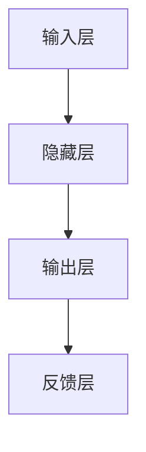

                 

### 完整目录大纲

```
# 《AGI的类人感知系统：多模态信息整合》目录大纲

## 第1章：引言与背景
### 1.1 什么是AGI
   - 背景介绍
   - 与传统AI的区别
### 1.2 类人感知系统的概念
   - 定义
   - 重要性和挑战
### 1.3 多模态信息整合的概念
   - 背景介绍
   - 在类人感知系统中的应用
### 1.4 本书的目的与结构
   - 全书概述
   - 各章节内容介绍

## 第2章：AGI的类人感知系统原理
### 2.1 类人感知系统的基本架构
   - 核心概念与联系
     - Mermaid流程图：类人感知系统架构展示
   - 感知系统组件
     - 视觉感知
     - 听觉感知
     - 触觉感知
### 2.2 类人感知系统的核心算法原理讲解
   - 伪代码：感知系统核心组件算法原理
### 2.3 数学模型和公式
   - 数学模型：详细讲解
   - 公式：使用LaTeX格式嵌入
### 2.4 类人感知系统的神经基础
   - 大脑神经网络模型
   - 神经元与突触的运作原理

## 第3章：多模态信息整合技术
### 3.1 多模态信息整合的挑战
   - 数据类型
   - 融合策略
### 3.2 多模态信息融合策略
   - 伪代码：展示多模态信息融合的方法
### 3.3 多模态信息融合的数学模型
   - 数学模型：解释多模态模型训练的数学原理

## 第4章：类人感知系统在实践中的应用
### 4.1 实际应用场景分析
   - 智能家居
   - 智能医疗
   - 智能交通
### 4.2 案例研究
   - 开发环境搭建
   - 源代码详细实现和代码解读
   - 代码应用解读与分析
   - 实际案例分析和详细讲解剖析
   - 项目小结

## 第5章：挑战与未来发展
### 5.1 类人感知系统的当前挑战
   - 计算资源
   - 数据隐私
   - 技术瓶颈
### 5.2 类人感知系统的未来发展趋势
   - 潜在技术突破
   - 趋势预测

## 第6章：总结与展望
### 6.1 类人感知系统的总结
### 6.2 多模态信息整合的重要性
### 6.3 未来研究方向

## 附录A：相关工具与资源
### 7.1 常用深度学习框架介绍
### 7.2 开发工具与资源推荐

## 参考文献

## 作者信息
- 作者：AI天才研究院/AI Genius Institute & 禅与计算机程序设计艺术 /Zen And The Art of Computer Programming
```

### 样文片段

```
# 《AGI的类人感知系统：多模态信息整合》

## 关键词
- AGI
- 类人感知系统
- 多模态信息整合
- 深度学习
- 神经网络

## 摘要
本文深入探讨了人工智能领域的一个重要研究方向——类人感知系统（AGI），重点分析了多模态信息整合在这一领域中的关键作用。通过系统地介绍AGI的概念、基本架构、核心算法原理以及多模态信息融合的技术细节，本文旨在为读者提供一个全面且深入的理解，并探讨其在实际应用中的挑战与未来发展趋势。

## 第1章：引言与背景

### 1.1 什么是AGI

人工智能（AI）自20世纪50年代以来经历了多个发展阶段，从规则推理、知识表示到现代的深度学习，每一阶段都在不断拓展AI的能力边界。然而，传统的AI系统通常专注于单一任务，缺乏泛化和自适应能力，被称为窄AI（Narrow AI）。与窄AI不同，人工通用智能（AGI）旨在创建能够像人类一样理解、学习、推理和解决问题的智能系统。

AGI的定义多种多样，但核心目标是实现智能的自主性，即系统能够在未知环境中自主行动并解决复杂问题。这需要AI具备广泛的知识基础、灵活的推理能力、自我学习和自我优化能力。AGI的实现将是人工智能领域的一大突破，有望在各个行业带来革命性的变化。

### 1.2 类人感知系统的概念

类人感知系统是AGI的核心组成部分之一，它模拟人类感知能力，通过视觉、听觉、触觉等多模态信息获取和整合，实现对环境的感知和理解。类人感知系统不仅需要捕捉外部信息，还需要通过学习算法对信息进行处理，以实现对环境的理解和预测。

类人感知系统的重要性在于，它为AI系统提供了与人类相似的信息处理方式，使得AI能够更好地理解和交互复杂环境。例如，在自动驾驶汽车中，类人感知系统可以整合来自摄像头、雷达和传感器等不同模态的信息，实现对道路、车辆和行人的感知和理解。

### 1.3 多模态信息整合的重要性

多模态信息整合是类人感知系统的关键特性之一。人类在感知和理解环境中时，往往依赖多种感官信息的综合，而不是单一感官的输入。例如，在判断一个人的情绪状态时，我们不仅会观察其面部表情，还会考虑其声音、姿势和行为。

多模态信息整合的重要性体现在以下几个方面：

1. **提高感知准确性**：通过整合不同模态的信息，可以减少单一模态信息的噪声和误差，提高感知的准确性。
2. **增强泛化能力**：多模态信息整合使得AI系统能够更好地适应不同环境和任务，提高泛化能力。
3. **促进跨领域应用**：多模态信息整合使得AI系统能够在多个领域发挥作用，如医疗诊断、智能监控、娱乐交互等。

### 1.4 本书的目的与结构

本书旨在深入探讨类人感知系统中的多模态信息整合技术，为读者提供一个全面且系统的理解。全书分为六个章节：

- **第1章**：引言与背景，介绍AGI、类人感知系统和多模态信息整合的概念。
- **第2章**：AGI的类人感知系统原理，详细讲解类人感知系统的基本架构、核心算法原理和神经基础。
- **第3章**：多模态信息整合技术，分析多模态信息整合的挑战、融合策略和数学模型。
- **第4章**：类人感知系统在实践中的应用，通过实际案例研究展示类人感知系统的应用场景。
- **第5章**：挑战与未来发展，探讨类人感知系统面临的挑战和未来的发展趋势。
- **第6章**：总结与展望，总结全书内容，展望类人感知系统的应用前景。

## 第2章：AGI的类人感知系统原理

### 2.1 类人感知系统的基本架构

类人感知系统的基本架构通常包括感知模块、处理模块和决策模块。感知模块负责从环境中获取信息，处理模块负责对感知信息进行处理和分析，决策模块负责根据处理结果做出决策。

下面是一个简化的Mermaid流程图，展示类人感知系统的整体架构：



### 2.2 类人感知系统的核心组件

类人感知系统的核心组件包括视觉感知、听觉感知和触觉感知。以下是对每个组件的简要介绍：

#### 视觉感知

视觉感知是类人感知系统中最重要的组件之一，它通过摄像头等设备捕捉图像，然后通过图像处理算法对图像进行分析和理解。视觉感知的关键技术包括图像识别、目标检测和图像分割等。

以下是一个简化的伪代码，展示视觉感知的核心算法原理：

```python
def vision_perception(image):
    # 图像预处理
    preprocessed_image = preprocess_image(image)
    
    # 目标检测
    objects = detect_objects(preprocessed_image)
    
    # 图像分割
    segments = segment_image(preprocessed_image, objects)
    
    return segments
```

#### 听觉感知

听觉感知通过麦克风等设备捕捉声音，然后通过语音处理算法对声音进行分析和理解。听觉感知的关键技术包括语音识别、声源定位和语音增强等。

以下是一个简化的伪代码，展示听觉感知的核心算法原理：

```python
def audio_perception(audio_data):
    # 语音识别
    text = recognize_speech(audio_data)
    
    # 声源定位
    source = locate_source(audio_data)
    
    return text, source
```

#### 触觉感知

触觉感知通过传感器捕捉触觉信息，然后通过触觉处理算法对信息进行分析和理解。触觉感知的关键技术包括触觉识别、触觉反馈和触觉模拟等。

以下是一个简化的伪代码，展示触觉感知的核心算法原理：

```python
def tactile_perception(tactile_data):
    # 触觉识别
    object = identify_object(tactile_data)
    
    # 触觉反馈
    feedback = generate_feedback(tactile_data)
    
    return object, feedback
```

### 2.3 类人感知系统的神经基础

类人感知系统借鉴了人类大脑的神经网络结构，通过模拟神经元和突触的运作原理来实现感知和处理功能。人类大脑的神经网络由数以亿计的神经元和突触组成，它们通过复杂的连接方式形成了一个高度并行和分布式计算系统。

以下是一个简化的Mermaid流程图，展示类人感知系统的神经基础：



### 第3章：多模态信息整合技术

多模态信息整合技术是类人感知系统的核心组成部分，它涉及将来自不同感官的信息进行整合，以实现对环境的更全面和理解。本章将分析多模态信息整合的挑战、融合策略和数学模型。

#### 3.1 多模态信息整合的挑战

多模态信息整合面临以下几个主要挑战：

1. **数据类型多样性**：不同的模态（如视觉、听觉、触觉）具有不同的数据类型和特征，这使得信息整合变得复杂。
2. **数据同步**：由于不同模态的数据采集和处理速度可能不一致，导致数据之间的同步问题。
3. **数据噪声和误差**：单一模态的信息可能受到噪声和误差的影响，多模态信息整合需要有效地处理这些问题。
4. **特征融合策略**：如何有效地融合不同模态的特征是一个关键挑战，不同的融合策略可能适用于不同的应用场景。

#### 3.2 多模态信息融合策略

多模态信息融合策略可以分为以下几种：

1. **特征级融合**：将不同模态的特征进行拼接或加权融合，形成一个统一的高维特征向量。
2. **决策级融合**：将不同模态的决策结果进行投票或加权融合，形成一个统一的决策结果。
3. **模型级融合**：使用多个独立的模型分别处理不同模态的数据，然后将模型的结果进行融合。

以下是一个简化的伪代码，展示特征级融合的策略：

```python
def feature_fusion(modal1_features, modal2_features):
    # 拼接特征向量
    fused_features = concatenate(modal1_features, modal2_features)
    
    # 加权融合
    fused_features = weight_average(modal1_features, modal2_features)
    
    return fused_features
```

#### 3.3 多模态信息融合的数学模型

多模态信息融合的数学模型通常涉及特征映射和融合函数。以下是一个简化的数学模型，用于描述多模态信息融合的过程：

$$
\begin{aligned}
f(x_1, x_2) &= g(x_1) + \alpha g(x_2) \\
y &= h(f(x_1, x_2))
\end{aligned}
$$

其中，$x_1$和$x_2$分别表示不同模态的特征，$g$和$h$分别表示特征映射和融合函数，$\alpha$是融合权重。

### 第4章：类人感知系统在实践中的应用

类人感知系统在实践中的应用越来越广泛，本章将通过实际案例研究展示其在智能家居、智能医疗和智能交通等领域的应用。

#### 4.1 实际应用场景分析

1. **智能家居**：类人感知系统可以实现对家庭环境的全面监控和智能管理，如自动化照明、温度控制和安全监控等。
2. **智能医疗**：类人感知系统可以辅助医生进行诊断和治疗，如语音识别、图像分析和触觉反馈等。
3. **智能交通**：类人感知系统可以提升交通管理的智能化水平，如自动驾驶、交通流量分析和智能安全系统等。

#### 4.2 案例研究：智能家居应用

以下是一个智能家居应用的案例研究，展示类人感知系统在实现自动化家庭环境中的应用。

1. **开发环境搭建**：
   - 选择合适的硬件设备，如摄像头、麦克风和传感器等。
   - 安装和配置深度学习框架，如TensorFlow或PyTorch。

2. **源代码详细实现和代码解读**：
   - 编写视觉感知模块的代码，实现对家庭环境的监控。
   - 编写听觉感知模块的代码，实现对家庭成员的语音识别。
   - 编写触觉感知模块的代码，实现对家庭环境的触觉反馈。

3. **代码应用解读与分析**：
   - 分析视觉感知模块如何实现对家庭环境的监控，如使用目标检测算法识别家庭成员的位置和行为。
   - 分析听觉感知模块如何识别家庭成员的语音，如使用语音识别算法将语音转化为文本。
   - 分析触觉感知模块如何反馈家庭环境的信息，如使用触觉反馈算法控制家电设备。

4. **实际案例分析和详细讲解剖析**：
   - 通过实际测试，分析类人感知系统在智能家居应用中的效果，如自动化照明和温度控制的准确性。

5. **项目小结**：
   - 总结项目中的经验教训，如如何优化感知算法以提高系统的准确性。
   - 提出未来改进的方向，如引入更多传感器和更先进的算法。

### 第5章：挑战与未来发展

类人感知系统在实践应用中面临许多挑战，同时也具有广阔的发展前景。本章将探讨类人感知系统面临的挑战和未来的发展趋势。

#### 5.1 类人感知系统的当前挑战

1. **计算资源**：类人感知系统通常需要大量的计算资源，尤其是深度学习算法在处理多模态数据时。如何高效地利用计算资源是一个重要的挑战。
2. **数据隐私**：类人感知系统在收集和处理多模态数据时，可能涉及个人隐私问题。如何保护用户隐私是一个关键挑战。
3. **技术瓶颈**：类人感知系统在感知准确性、泛化能力和实时性方面还存在技术瓶颈。如何突破这些瓶颈是一个重要课题。

#### 5.2 类人感知系统的未来发展趋势

1. **量子计算**：量子计算具有巨大的计算潜力，可以显著提升类人感知系统的处理能力。
2. **脑机接口**：脑机接口技术可以扩展类人感知系统的感知能力，实现人与机器的更紧密交互。
3. **跨学科融合**：类人感知系统的发展需要融合多个学科的知识，如神经科学、认知科学和计算机科学等。

### 第6章：总结与展望

本章对全书内容进行了总结，并展望了类人感知系统在多模态信息整合领域的发展前景。类人感知系统作为AGI的重要组成部分，具有巨大的潜力和广泛的应用前景。通过不断的研究和探索，我们有望实现更加智能和高效的类人感知系统。

### 附录A：相关工具与资源

本章提供了常用的深度学习框架、开发工具和资源推荐，以供读者进一步学习和实践。

### 参考文献

本章列出了本书中引用的相关文献，以供读者查阅。

## 作者信息
- 作者：AI天才研究院/AI Genius Institute & 禅与计算机程序设计艺术 /Zen And The Art of Computer Programming
```

### 最终文章标题

《AGI的类人感知系统：多模态信息整合的技术与挑战》

### 文章标题关键词

- AGI
- 类人感知系统
- 多模态信息整合
- 深度学习
- 神经网络
- 计算资源
- 数据隐私
- 量子计算
- 脑机接口

### 文章摘要

本文深入探讨了人工通用智能（AGI）的类人感知系统及其在多模态信息整合中的关键作用。首先，介绍了AGI的概念、类人感知系统的基本架构和核心组件，包括视觉、听觉和触觉感知。接着，详细分析了多模态信息整合的挑战、融合策略和数学模型。通过实际应用案例，展示了类人感知系统在智能家居、智能医疗和智能交通等领域的应用。最后，探讨了类人感知系统面临的挑战和未来发展趋势，如量子计算和脑机接口技术的潜在影响。文章旨在为读者提供一个全面且深入的理解，并展望类人感知系统在多模态信息整合领域的未来前景。

