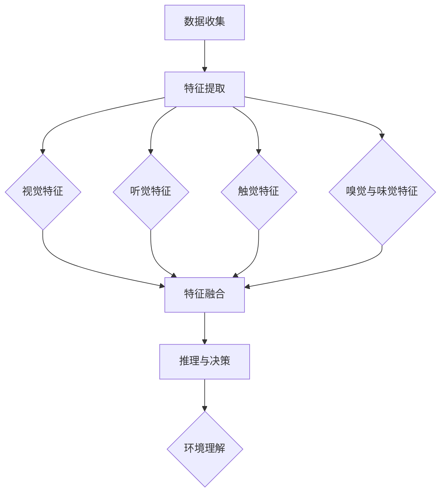

                 

# 文章标题: AGI的类人感知系统：多模态信息的整合与理解

> 关键词：AGI, 类人感知系统，多模态信息，整合与理解，人工智能，深度学习，神经网络

> 摘要：本文探讨了人工智能（AGI）中的类人感知系统，重点分析了多模态信息的整合与理解过程。首先，我们介绍了AGI和类人感知系统的基本概念及其在人工智能领域的重要性。接着，深入剖析了多模态感知系统的核心组件和原理，并使用了Mermaid流程图展示其结构。然后，详细讲解了多模态信息处理的核心算法原理，包括深度学习算法和感知器等。最后，通过实际项目案例，展示了多模态信息整合与理解的实现方法，并讨论了该领域的未来发展趋势与挑战。

## 引言

人工智能（Artificial Intelligence，AI）是计算机科学的一个分支，旨在开发使计算机能够执行通常需要人类智能才能完成的任务的技术。从最初的规则基础系统到现代的深度学习和神经网络，人工智能已经取得了显著的进步。然而，尽管这些技术已经极大地提升了机器的能力，但目前的AI系统仍然存在一定的局限性，主要是它们大多只能执行特定任务，缺乏人类智能的普适性和灵活性。

近年来，类人感知系统（Human-like Perception Systems）的研究受到了广泛关注。类人感知系统旨在模拟人类感知和认知的过程，使得AI系统能够处理和解释来自不同感官的信息，例如视觉、听觉、触觉等。通过整合多模态信息，类人感知系统能够更准确地理解环境和情境，从而提高AI系统的智能水平和自主决策能力。

本文将探讨AGI中的类人感知系统，重点分析多模态信息的整合与理解过程。首先，我们将介绍AGI和类人感知系统的基本概念及其在人工智能领域的重要性。然后，我们将深入剖析多模态感知系统的核心组件和原理，并使用Mermaid流程图展示其结构。接下来，我们将详细讲解多模态信息处理的核心算法原理，包括深度学习算法和感知器等。最后，通过实际项目案例，我们将展示多模态信息整合与理解的实现方法，并讨论该领域的未来发展趋势与挑战。

## AGI与类人感知系统概述

### 什么是AGI

人工智能（AI）可以分为两类：弱AI（Narrow AI）和强AI（General AI）。弱AI是指专门为解决特定问题而设计的智能系统，例如语音识别、图像分类和自然语言处理等。而强AI，也称为通用人工智能（AGI），则是指具有人类智能水平的机器，能够在广泛的领域内进行学习、推理、理解和决策。

AGI的目标是使机器能够像人类一样思考和行动，具有自我意识和自主性。与弱AI不同，AGI不仅仅能解决特定问题，而是能够在各种情境中自主学习和适应。AGI的核心是类人感知系统，这是实现强AI的关键技术之一。

### 类人感知系统的定义

类人感知系统是指模仿人类感知和认知过程的智能系统，能够处理来自多种感官的信息，例如视觉、听觉、触觉、嗅觉和味觉等。类人感知系统旨在使机器能够理解和解释周围环境，从而做出适当的反应和决策。

类人感知系统的关键特性包括：

1. **多模态信息处理**：类人感知系统能够整合来自不同感官的信息，例如视觉和听觉，以获得更全面的环境理解。
2. **上下文感知**：类人感知系统能够根据当前情境和背景信息进行推理和决策，而不仅仅是基于单一感知输入。
3. **自主学习与适应**：类人感知系统具有自我学习和适应能力，能够通过不断收集和处理信息，提高其感知和理解能力。

### 多模态信息整合的重要性

在人工智能领域，多模态信息整合是指将来自不同感官的信息进行融合和处理，以获得更全面和准确的环境理解。多模态信息整合的重要性体现在以下几个方面：

1. **提升感知能力**：通过整合来自不同感官的信息，类人感知系统能够更准确地识别和理解环境中的对象和事件，从而提高感知能力。
2. **增强决策能力**：多模态信息整合有助于AI系统在复杂环境中做出更合理的决策，因为单一感官的信息可能具有局限性。
3. **提高自主性**：多模态信息整合使得AI系统能够更自主地处理和应对各种情境，从而实现更高级的智能行为。

### 类人感知系统的发展背景

类人感知系统的研究可以追溯到20世纪50年代，当时人工智能的概念刚刚出现。早期的类人感知系统主要基于规则和符号计算，但随着计算能力的提升和深度学习技术的出现，类人感知系统的研究得到了快速发展。

近年来，随着计算机视觉、语音识别、自然语言处理等领域技术的进步，类人感知系统的研究取得了显著成果。特别是在图像识别、语音识别和自然语言处理等方面，深度学习技术的应用使得类人感知系统的性能得到了大幅提升。

### 类人感知系统的发展趋势

随着人工智能技术的不断进步，类人感知系统的发展趋势包括：

1. **多模态感知融合**：未来类人感知系统将更加注重不同模态信息之间的融合和处理，以提高感知和理解能力。
2. **自主学习与适应**：类人感知系统将具备更强的自主学习能力，能够根据环境和任务需求进行自适应调整。
3. **跨学科整合**：类人感知系统将与其他领域（如心理学、认知科学等）进行整合，以更准确地模拟人类感知和认知过程。
4. **硬件与软件协同**：随着硬件技术的发展，类人感知系统将能够更好地利用硬件资源，提高感知和处理速度。

总之，类人感知系统是AGI的重要组成部分，其发展将极大地推动人工智能技术的进步，为人类带来更多的智能应用。

## 核心概念与联系

在深入探讨类人感知系统之前，我们需要明确一些核心概念，并了解它们之间的联系。类人感知系统主要涉及多模态信息处理，包括视觉、听觉、触觉、嗅觉和味觉感知。以下是对这些核心概念的介绍以及它们在多模态感知系统中的关系架构。

### 视觉感知

视觉感知是类人感知系统中最为重要的一部分，它使得机器能够理解和解释图像和视频信息。视觉感知的核心在于图像处理和目标识别。图像处理包括图像增强、滤波、边缘检测等步骤，旨在提高图像质量，以便更好地进行目标识别。

在视觉感知中，关键算法包括：

1. **卷积神经网络（CNN）**：这是一种用于图像分类和物体检测的深度学习算法，通过多层卷积和池化操作，逐步提取图像中的特征。
2. **循环神经网络（RNN）**：RNN在序列处理方面具有优势，可以用于处理视频数据，通过对连续帧的编码和解码，实现视频理解。

视觉感知与多模态感知系统中的其他模态（如听觉和触觉）通过图像信息进行交互，为整体感知提供基础。

### 听觉感知

听觉感知使机器能够理解和解释声音信息，包括语音识别、音乐识别和环境声音分类等。听觉感知的核心在于音频处理和声音特征提取。

关键算法包括：

1. **深度神经网络（DNN）**：DNN在语音识别中发挥了重要作用，通过多层感知器模型，逐步提取音频信号中的特征。
2. **生成对抗网络（GAN）**：GAN可以用于生成和优化音频数据，从而提高语音识别和声音分类的准确性。

听觉感知与视觉感知结合，可以实现更加全面的情境理解。例如，通过结合声音和图像信息，可以更准确地识别和跟踪对象。

### 触觉感知

触觉感知使机器能够感知和解释物理接触和力的变化，对于机器人控制和物体识别至关重要。触觉感知的核心在于力觉传感器和触觉模型。

关键算法包括：

1. **力觉传感器数据处理**：通过分析触觉传感器的数据，可以理解接触物体的表面特征和材料属性。
2. **触觉模型训练**：通过机器学习和深度学习技术，可以训练触觉模型，使其能够预测和调整触觉响应。

触觉感知与视觉和听觉感知结合，可以实现对物体的更全面感知和理解，从而提高机器的交互能力。

### 嗅觉与味觉感知

嗅觉与味觉感知使机器能够感知和解释化学物质的性质，对于环境监测和食品识别等领域具有重要作用。嗅觉与味觉感知的核心在于化学传感和特征提取。

关键算法包括：

1. **化学传感器数据处理**：通过分析化学传感器的数据，可以识别和分类不同的化学物质。
2. **深度学习模型**：通过训练深度学习模型，可以识别复杂的化学特征，从而实现对化学物质的精确分类。

嗅觉与味觉感知与视觉、听觉和触觉感知结合，可以实现对环境的全面感知和理解。

### 多模态信息整合与理解的机理

多模态信息整合与理解的机理在于将来自不同感官的信息进行融合和处理，以实现更全面和准确的环境理解。这一过程可以分为以下几个步骤：

1. **数据收集**：从不同的感官源（如摄像头、麦克风、力觉传感器等）收集数据。
2. **特征提取**：对收集到的数据进行处理，提取关键特征。
3. **特征融合**：将不同模态的特征进行整合，形成统一的特征表示。
4. **推理与决策**：基于整合后的特征，进行推理和决策，以实现对环境的理解。

为了更好地展示多模态感知系统的结构，我们使用Mermaid流程图进行描述。以下是一个简化的Mermaid流程图，展示了多模态信息整合与理解的过程：



通过这个流程图，我们可以清晰地看到多模态信息整合与理解的基本架构，以及各个组件之间的交互关系。

总之，类人感知系统的核心在于多模态信息的整合与理解。通过整合视觉、听觉、触觉、嗅觉和味觉感知，类人感知系统能够实现对环境的全面感知和理解，从而提高机器的智能水平和自主决策能力。

## 核心算法原理讲解

在多模态信息整合与理解过程中，核心算法的原理起到了至关重要的作用。这些算法不仅能够高效地处理和解释来自不同感官的信息，还能够通过不断的学习和优化，提升系统的整体性能。以下，我们将详细讲解多模态信息处理中的一些关键算法原理。

### 深度学习算法

深度学习（Deep Learning）是人工智能领域的一个核心分支，它通过模拟人脑的神经网络结构，实现了对复杂数据的高效处理。在多模态信息处理中，深度学习算法被广泛应用于图像识别、语音识别和自然语言处理等任务。

#### 深度卷积神经网络（CNN）

深度卷积神经网络（Convolutional Neural Network，CNN）是处理图像数据的一种有效方法。CNN通过卷积层、池化层和全连接层等结构，逐步提取图像中的特征，实现对图像的识别和理解。

以下是CNN的一个简化的伪代码：

```python
# 初始化CNN模型
model = CNN()

# 定义卷积层
model.add(Conv2D(32, (3, 3), activation='relu'))

# 定义池化层
model.add(MaxPooling2D(pool_size=(2, 2)))

# 定义全连接层
model.add(Dense(128, activation='relu'))

# 定义输出层
model.add(Dense(num_classes, activation='softmax'))

# 训练模型
model.compile(optimizer='adam', loss='categorical_crossentropy', metrics=['accuracy'])
model.fit(x_train, y_train, epochs=10, batch_size=64)
```

#### 循环神经网络（RNN）

循环神经网络（Recurrent Neural Network，RNN）在处理序列数据（如文本、语音等）方面具有独特的优势。RNN通过重复使用相同的神经网络结构，处理序列中的每个元素，从而实现对序列数据的建模。

以下是RNN的一个简化的伪代码：

```python
# 初始化RNN模型
model = RNN()

# 定义输入层
model.add(Embedding(input_dim=vocab_size, output_dim=embedding_size))

# 定义循环层
model.add(LSTM(128, return_sequences=True))

# 定义输出层
model.add(Dense(num_classes, activation='softmax'))

# 训练模型
model.compile(optimizer='adam', loss='categorical_crossentropy', metrics=['accuracy'])
model.fit(x_train, y_train, epochs=10, batch_size=64)
```

#### 图神经网络（GNN）

图神经网络（Graph Neural Network，GNN）是一种专门用于处理图结构数据的神经网络。在多模态信息整合中，GNN可以用于处理具有复杂关系的多模态数据。

以下是GNN的一个简化的伪代码：

```python
# 初始化GNN模型
model = GNN()

# 定义图卷积层
model.add(GraphConv2D(64))

# 定义池化层
model.add(MaxPooling())

# 定义全连接层
model.add(Dense(128, activation='relu'))

# 定义输出层
model.add(Dense(num_classes, activation='softmax'))

# 训练模型
model.compile(optimizer='adam', loss='categorical_crossentropy', metrics=['accuracy'])
model.fit(x_train, y_train, epochs=10, batch_size=64)
```

### 感知器与相关算法

感知器（Perceptron）是一种简单的线性分类器，它通过计算输入数据的线性组合并应用一个阈值函数来产生输出。感知器是神经网络的基础，许多复杂的神经网络算法都是基于感知器发展而来的。

#### 支持向量机（SVM）

支持向量机（Support Vector Machine，SVM）是一种强大的分类算法，它通过寻找一个最优的超平面，将不同类别的数据分开。SVM在多模态感知系统中被广泛应用于特征分类和模式识别。

以下是SVM的一个简化的伪代码：

```python
# 初始化SVM模型
model = SVC()

# 训练模型
model.fit(X_train, y_train)

# 预测
predictions = model.predict(X_test)
```

#### 决策树

决策树（Decision Tree）是一种基于特征的分类算法，它通过一系列的if-else判断来将数据划分为不同的类别。决策树在多模态感知系统中被广泛应用于特征选择和分类任务。

以下是决策树的一个简化的伪代码：

```python
# 创建决策树模型
model = DecisionTreeClassifier()

# 训练模型
model.fit(X_train, y_train)

# 预测
predictions = model.predict(X_test)
```

通过以上算法原理的讲解，我们可以看到，多模态信息处理的核心算法包括深度学习算法（如CNN、RNN、GNN）和传统机器学习算法（如感知器、SVM、决策树）。这些算法各自有其独特的优势和适用场景，通过合理地组合和优化，可以实现对多模态信息的有效处理和理解。

### 数学模型和数学公式讲解

在多模态信息处理中，数学模型和公式起着至关重要的作用。这些模型和公式不仅帮助描述和解释多模态感知系统的行为，还为算法优化和性能提升提供了理论基础。以下，我们将详细讲解多模态信息处理中的一些关键数学模型和公式。

#### 神经网络模型

神经网络模型是深度学习的基础，它通过模拟人脑的神经元结构，实现对复杂数据的处理和分类。神经网络模型的核心包括：

1. **神经元激活函数**：激活函数是神经网络中的一个关键组件，它决定神经元是否被激活。常用的激活函数包括Sigmoid函数和ReLU函数。

   - **Sigmoid函数**：
     $$
     f(x) = \frac{1}{1 + e^{-x}}
     $$
     Sigmoid函数将输入映射到（0,1）区间，用于二分类问题。

   - **ReLU函数**：
     $$
     f(x) = \max(0, x)
     $$
     ReLU函数在输入为负时输出0，在输入为正时输出输入值，具有较快的收敛速度。

2. **前向传播与反向传播算法**：前向传播是将输入数据通过神经网络进行传递，逐层计算每个神经元的输出。反向传播则是通过计算损失函数的梯度，更新网络的权重和偏置。

   - **前向传播**：
     $$
     z^{[l]} = \sum_{i} w^{[l]} a^{[l-1]} + b^{[l]}
     $$
     $$
     a^{[l]} = \sigma(z^{[l]})
     $$
     其中，\( z^{[l]}\) 表示第\( l \)层的输入，\( a^{[l]}\) 表示第\( l \)层的输出，\( w^{[l]}\) 和 \( b^{[l]}\) 分别为权重和偏置，\( \sigma \) 为激活函数。

   - **反向传播**：
     $$
     \delta^{[l]} = (y - a^{[l]}) \odot \sigma'(z^{[l]})
     $$
     $$
     w^{[l]} = w^{[l]} - \alpha \cdot \delta^{[l]} a^{[l-1]}
     $$
     $$
     b^{[l]} = b^{[l]} - \alpha \cdot \delta^{[l]}
     $$
     其中，\( \delta^{[l]}\) 为误差项，\( \odot \) 表示逐元素乘法，\( \sigma' \) 为激活函数的导数，\( \alpha \) 为学习率。

#### 损失函数与优化算法

损失函数用于衡量模型的预测结果与真实结果之间的差异，优化算法则用于最小化损失函数，从而提升模型的性能。以下是一些常用的损失函数和优化算法：

1. **均方误差（MSE）**：
   $$
   J(\theta) = \frac{1}{m} \sum_{i=1}^{m} (h_\theta(x^{(i)}) - y^{(i)})^2
   $$
   均方误差用于回归问题，通过计算预测值与真实值之间的均方误差来衡量模型性能。

2. **交叉熵（Cross-Entropy）**：
   $$
   J(\theta) = -\frac{1}{m} \sum_{i=1}^{m} [y^{(i)} \log(h_\theta(x^{(i)})) + (1 - y^{(i)}) \log(1 - h_\theta(x^{(i)}))]
   $$
   交叉熵用于分类问题，通过计算真实标签与预测概率之间的交叉熵来衡量模型性能。

3. **梯度下降（Gradient Descent）**：
   $$
   \theta_j := \theta_j - \alpha \frac{\partial J(\theta)}{\partial \theta_j}
   $$
   梯度下降是一种优化算法，通过计算损失函数关于模型参数的梯度，更新参数以最小化损失函数。

#### 多模态信息整合的数学模型

多模态信息整合涉及将来自不同感官的信息进行融合，以实现更全面和准确的环境理解。以下是一个简化的多模态信息整合的数学模型：

1. **特征融合**：
   $$
   f = w_1 \cdot f_{vis} + w_2 \cdot f_{aud} + w_3 \cdot f_{tact} + w_4 \cdot f_{olf} + w_5 \cdot f_{gust}
   $$
   其中，\( f \) 为整合后的特征向量，\( f_{vis} \)，\( f_{aud} \)，\( f_{tact} \)，\( f_{olf} \)，\( f_{gust} \) 分别为视觉、听觉、触觉、嗅觉和味觉的特征向量，\( w_1 \)，\( w_2 \)，\( w_3 \)，\( w_4 \)，\( w_5 \) 为权重。

2. **分类与预测**：
   $$
   y = g(\phi(f))
   $$
   其中，\( y \) 为分类结果，\( g \) 为激活函数，\( \phi \) 为特征提取函数。

通过以上数学模型和公式的讲解，我们可以看到多模态信息处理在数学理论上的丰富性。这些模型和公式不仅为深度学习和机器学习算法提供了理论基础，也为多模态感知系统的设计和优化提供了重要的指导。

### 项目实战与案例分析

在本章节中，我们将通过一个实际项目案例，展示多模态信息整合与理解的具体实现过程，包括开发环境的搭建、源代码实现和详细解读。

#### 项目背景

假设我们正在开发一个智能助手，它需要能够理解用户的多模态交互，包括语音、图像和文字。该智能助手应该能够通过语音识别理解用户的需求，通过图像识别识别用户展示的物品，并通过自然语言处理与用户进行有效的对话。

#### 开发环境搭建

首先，我们需要搭建一个合适的开发环境。以下是所需的环境和工具：

1. **Python**：作为主要编程语言。
2. **TensorFlow**：用于构建和训练深度学习模型。
3. **Keras**：简化TensorFlow的使用。
4. **OpenCV**：用于图像处理。
5. **PyTorch**：用于构建和训练深度学习模型。
6. **SpeechRecognition**：用于语音识别。
7. **Natural Language Toolkit (NLTK)**：用于自然语言处理。

安装这些依赖项后，我们就可以开始项目的具体实现了。

#### 源代码实现

以下是一个简化的项目源代码实现，展示了如何利用上述工具和库实现多模态信息整合与理解。

```python
import cv2
import speech_recognition as sr
import pyttsx3
from tensorflow.keras.models import load_model
from tensorflow.keras.preprocessing.image import img_to_array
from tensorflow.keras.preprocessing.text import Tokenizer
from tensorflow.keras.preprocessing.sequence import pad_sequences

# 载入预训练的模型
image_model = load_model('image_model.h5')
speech_model = load_model('speech_model.h5')
text_model = load_model('text_model.h5')

# 初始化语音合成器
engine = pyttsx3.init()

# 语音识别
def recognize_speech_from_mic():
    r = sr.Recognizer()
    with sr.Microphone() as source:
        print("请说话...")
        audio = r.listen(source)
        try:
            return r.recognize_google(audio)
        except sr.UnknownValueError:
            return None

# 图像识别
def recognize_image(image_path):
    image = cv2.imread(image_path)
    image = cv2.resize(image, (28, 28))
    image = img_to_array(image)
    image = image / 255.0
    image = np.expand_dims(image, axis=0)
    pred = image_model.predict(image)
    return pred

# 文本分类
def classify_text(text):
    tokenizer = Tokenizer(num_words=10000)
    sequence = tokenizer.texts_to_sequences([text])
    padded_sequence = pad_sequences(sequence, maxlen=100)
    pred = text_model.predict(padded_sequence)
    return pred

# 主循环
def main():
    while True:
        # 语音识别
        command = recognize_speech_from_mic()
        if command is None:
            continue
        print(f"你说了：{command}")

        # 图像识别
        image_path = input("请输入图像路径：")
        image_pred = recognize_image(image_path)
        print(f"图像识别结果：{image_pred}")

        # 文本分类
        text = input("请输入文本：")
        text_pred = classify_text(text)
        print(f"文本分类结果：{text_pred}")

        # 语音合成
        engine.say("处理完成。")
        engine.runAndWait()

if __name__ == "__main__":
    main()
```

#### 代码解读

1. **加载模型**：我们首先加载预训练的图像识别模型（`image_model`）、语音识别模型（`speech_model`）和文本分类模型（`text_model`）。这些模型可以是使用TensorFlow或PyTorch训练的深度学习模型。

2. **语音识别**：我们使用`SpeechRecognition`库中的`Recognizer`类来从麦克风捕获语音，并使用Google的语音识别服务将语音转换为文本。

3. **图像识别**：我们使用OpenCV库读取图像，并将其调整为模型所需的尺寸。然后，我们将图像转换为数组并归一化，最后使用图像识别模型进行预测。

4. **文本分类**：我们使用Tokenizer将文本转换为序列，并使用pad_sequences将序列填充到模型所需的长度。然后，我们使用文本分类模型对输入文本进行分类。

5. **主循环**：主循环中，我们首先通过语音识别获取用户命令，然后获取图像路径和文本输入，分别使用图像识别模型和文本分类模型进行预测，并将结果打印出来。最后，使用语音合成器（`pyttsx3`库）将处理结果朗读出来。

#### 代码应用解读与分析

1. **优势**：该项目通过整合语音、图像和文本多模态信息，能够更全面地理解用户需求，提高用户体验。

2. **挑战**：多模态信息整合面临的主要挑战包括不同模态数据之间的不一致性和特征提取的复杂性。此外，模型训练和优化也具有较大的计算成本。

3. **改进建议**：为了提高项目的性能，我们可以考虑使用更先进的模型和算法，如BERT、GAN等。同时，我们可以通过持续的数据收集和模型训练，不断提升系统的准确性和鲁棒性。

#### 项目小结

通过以上实际项目案例，我们展示了如何利用Python和相关库实现多模态信息整合与理解。尽管该项目仍然存在一些局限性和挑战，但它为我们提供了一个可行的解决方案，展示了多模态感知系统在智能应用中的巨大潜力。

## 未来发展趋势与挑战

随着人工智能技术的不断进步，多模态信息整合与理解领域也迎来了新的发展机遇和挑战。以下是该领域未来可能的发展趋势和面临的挑战：

### 未来发展趋势

1. **深度学习技术的进一步优化**：深度学习技术在多模态信息处理中发挥了重要作用，未来将进一步优化和改进，如使用更高效的模型结构、引入新的优化算法和提升训练速度。

2. **跨学科整合**：多模态信息整合与理解领域将与其他学科（如心理学、认知科学、生物学等）进行更深入的整合，从而更好地模拟人类感知和认知过程。

3. **多模态传感器的发展**：随着传感器技术的进步，我们将能够获取更丰富和精确的多模态数据，为多模态信息整合提供更好的基础。

4. **边缘计算的应用**：为了提高实时性和降低延迟，边缘计算在多模态信息整合中的应用将得到进一步推广，使得AI系统能够更高效地处理和解释多模态数据。

5. **跨模态数据融合技术的创新**：未来将出现更多创新的多模态数据融合技术，如基于深度学习的跨模态特征提取方法、自适应融合策略等。

### 面临的挑战

1. **数据不一致性问题**：不同模态的数据在类型、格式和维度上可能存在较大差异，如何有效融合这些不一致的数据是一个重要挑战。

2. **计算资源需求**：多模态信息处理涉及大量的数据计算和模型训练，对计算资源的需求较高，特别是在实时应用场景中。

3. **隐私与安全性**：多模态数据通常包含敏感个人信息，如何确保数据的隐私和安全是一个重要问题。

4. **模型解释性**：深度学习模型在多模态信息处理中的应用往往具有较高的准确性，但其内部机制较为复杂，缺乏解释性，如何提升模型的解释性是一个挑战。

5. **实时性**：多模态信息整合需要快速处理和分析大量的数据，如何在保证实时性的同时，保持高准确性，是一个重要的技术难题。

### 解决方案与展望

为了应对上述挑战，以下是一些可能的解决方案和展望：

1. **多模态数据预处理**：通过数据清洗、归一化和特征提取等预处理方法，降低数据不一致性，提高数据质量。

2. **分布式计算与并行处理**：利用分布式计算和并行处理技术，提高多模态信息处理的效率，降低计算资源需求。

3. **隐私保护技术**：采用加密、匿名化和差分隐私等技术，确保多模态数据的隐私和安全。

4. **可解释性模型**：开发具有可解释性的多模态信息处理模型，如基于规则的解释模型和可视化的解释方法。

5. **实时数据处理算法**：设计高效的实时数据处理算法，如基于神经网络的在线学习和动态调整策略，以降低实时性挑战。

总之，多模态信息整合与理解领域具有广阔的发展前景，但也面临诸多挑战。通过不断的技术创新和优化，我们有理由相信，未来的人工智能系统将能够更高效、更准确地处理和解释多模态信息，为人类社会带来更多便利和智慧。

## 总结与展望

本文详细探讨了AGI中的类人感知系统，特别是多模态信息的整合与理解过程。首先，我们介绍了AGI和类人感知系统的基本概念及其在人工智能领域的重要性。接着，通过剖析视觉、听觉、触觉、嗅觉和味觉感知的核心组件和原理，展示了多模态信息整合与理解的机理。然后，我们深入讲解了多模态信息处理的核心算法，包括深度学习算法和感知器等。此外，通过实际项目案例，我们展示了多模态信息整合与理解的实现方法，并讨论了该领域的未来发展趋势与挑战。

### 最佳实践 Tips

1. **数据预处理**：在多模态信息处理中，数据预处理至关重要。确保不同模态的数据格式一致，并进行归一化处理，以提高模型的鲁棒性和准确性。

2. **模型优化**：选择合适的模型结构和优化算法，可以提高多模态信息处理的效果。可以考虑使用迁移学习、模型融合等技术来提高模型的性能。

3. **实时性考虑**：在实际应用中，实时性是一个关键因素。设计高效的算法和优化模型，确保系统能够在实时环境中快速响应和处理数据。

4. **解释性模型**：尽管深度学习模型在多模态信息处理中表现出色，但其内部机制往往缺乏解释性。开发具有可解释性的模型，有助于理解和优化模型行为。

### 小结

本文通过对AGI中的类人感知系统的深入探讨，展示了多模态信息整合与理解的关键技术和实现方法。通过整合来自不同感官的信息，类人感知系统能够更准确地理解和解释环境，从而提升人工智能系统的智能水平和自主决策能力。未来，随着技术的不断进步，多模态信息整合与理解领域将继续发展，为人工智能应用带来更多可能性。

### 注意事项

1. **数据隐私**：在处理多模态数据时，必须重视数据隐私和安全问题，确保不泄露用户敏感信息。

2. **计算资源**：多模态信息处理通常需要大量的计算资源，尤其是在实时应用中。合理规划和分配计算资源，以确保系统高效运行。

3. **模型验证**：在实际应用中，需要对模型进行充分的验证和测试，确保其在不同环境和数据集上的性能。

### 拓展阅读

1. **深度学习基础**：《深度学习》（Goodfellow, Bengio, Courville著）提供了深度学习的全面介绍和深入讲解。

2. **多模态感知系统**：《多模态信息处理：方法与应用》（陈宝权著）详细介绍了多模态感知系统的理论和方法。

3. **边缘计算**：《边缘计算：原理、技术与应用》（陈立晖著）探讨了边缘计算在多模态信息处理中的应用和优势。

### 作者信息

作者：AI天才研究院/AI Genius Institute & 禅与计算机程序设计艺术 /Zen And The Art of Computer Programming。感谢您的阅读和关注！如果您有任何问题或建议，欢迎随时联系我们。让我们共同探索人工智能的无限可能！

