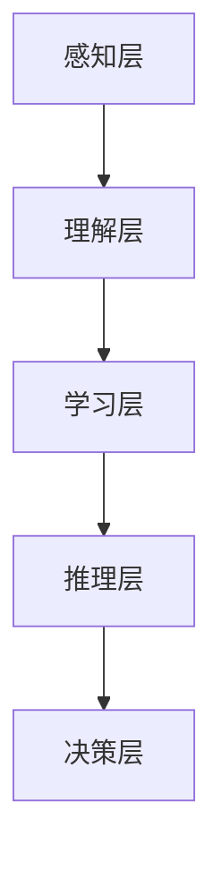
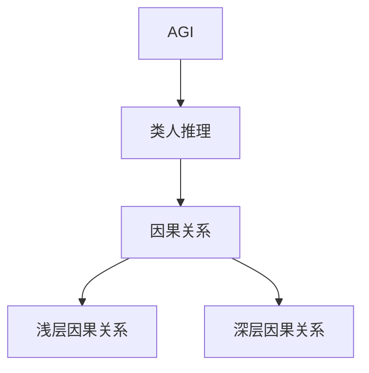

                 


### 文章标题: AGI的类人推理：从浅层到深层因果关系

> 关键词：人工通用智能，类人推理，因果关系，浅层推理，深层推理，算法原理，数学模型，项目实战

> 摘要：本文深入探讨了人工通用智能（AGI）中的类人推理机制，从浅层到深层因果关系推理的过程。文章首先介绍了AGI的背景和类人推理的基本概念，然后详细阐述了浅层因果关系推理的算法原理和数学模型，接着探讨了深层因果关系推理的技术和挑战，并通过实际案例展示了类人推理在AGI中的应用，最后总结了研究成果和未来展望。

----------------------------------------------------------------

# 引言

## 1. AGI的概念与历史

### 1.1 AGI的定义

人工通用智能（Artificial General Intelligence，简称AGI）是指具有人类智能的各种能力的计算机系统。这些能力包括但不限于感知、理解、学习、推理、决策、交流、解决问题等。与传统的人工智能（AI）不同，AGI能够理解、学习和适应各种领域和任务，而不仅仅是特定的问题或领域。

### 1.2 AGI的发展历程

AGI的概念最早可以追溯到20世纪50年代，随着计算机技术的发展，AGI的研究逐渐兴起。然而，由于技术的限制，AGI的研究进展缓慢。直到最近几年，随着深度学习、神经网络、大数据等技术的飞速发展，AGI的研究又重新焕发了生机。

## 2. 类人推理的基本原理

### 2.1 类人推理的概念

类人推理（Human-like Reasoning）是指模拟人类思维过程的推理机制，使计算机能够像人类一样理解和处理复杂问题。类人推理的核心在于模拟人类的感知、理解、学习和推理过程，从而实现自动化推理。

### 2.2 类人推理的要素

类人推理包括以下几个关键要素：

- **感知**：获取外部环境的信息。
- **理解**：理解和解释感知到的信息。
- **学习**：从经验和信息中学习。
- **推理**：基于知识和信息进行推理。
- **决策**：根据推理结果做出决策。

## 3. 浅层与深层因果关系的定义

### 3.1 浅层因果关系

浅层因果关系是指直接关联的两个事件或现象之间的逻辑关系，通常可以通过简单的逻辑推理或观察得到。例如，阳光照射导致温度升高。

### 3.2 深层因果关系

深层因果关系是指涉及多个中间变量和复杂交互作用的因果关系，通常需要通过复杂的推理过程来揭示。例如，某人的抑郁可能与多种因素有关，如工作压力、家庭问题、身体健康等。

## 4. AGI的类人推理体系结构

类人推理是AGI的核心组成部分，其体系结构通常包括以下几个层次：

- **感知层**：获取外部环境的信息。
- **理解层**：理解和解释感知到的信息。
- **学习层**：从经验和信息中学习。
- **推理层**：基于知识和信息进行推理。
- **决策层**：根据推理结果做出决策。

### Mermaid 流程图

下面是AGI类人推理体系结构的Mermaid流程图：



---

### 1.3 背景介绍

人工通用智能（AGI）是人工智能领域的一个终极目标，旨在开发出一种智能系统，能够在各种复杂、不确定的环境中自主思考、学习和行动，类似于人类智能的广度和深度。AGI的研究始于20世纪50年代，当时计算机科学家艾伦·图灵提出了图灵测试，作为衡量机器是否具有智能的标志。尽管图灵测试在理论上提出了机器智能的概念，但实际实现AGI仍然面临着巨大的挑战。

类人推理作为AGI的核心组成部分，旨在模拟人类思维过程中的推理能力。人类在面对复杂问题时，能够通过感知、理解、学习和推理，逐步推导出解决方案。类人推理的目标是使计算机能够实现类似的推理过程，从而在不确定和复杂的环境中做出合理的决策。

在类人推理中，因果关系是一个关键概念。因果关系指的是两个或多个事件之间的逻辑关系，其中一个事件作为原因，另一个事件作为结果。在人类思维中，我们能够通过观察和分析，识别出事件之间的因果关系，从而推断出未来的事件或预测潜在的问题。

从浅层到深层因果关系推理是类人推理的重要组成部分。浅层因果关系推理主要关注直接的因果关系，例如因果关系链较短的事件。这种推理通常是基于规则的，通过逻辑推理或模式匹配来识别和解释事件。而深层因果关系推理则涉及到更复杂的因果关系，通常需要利用机器学习、强化学习和知识图谱等技术来揭示和解释事件之间的复杂交互关系。

在AGI中，类人推理的应用非常广泛。例如，在智能助理、自动驾驶、医疗诊断、金融预测等领域，类人推理都能够发挥重要作用。通过类人推理，AGI系统能够更好地理解和解释复杂环境中的信息，从而做出更准确和合理的决策。

本文将深入探讨AGI的类人推理机制，从浅层到深层因果关系推理的过程。我们将介绍相关的核心概念、算法原理和数学模型，并通过实际案例来展示类人推理在AGI中的应用。最后，我们将总结研究成果，探讨未来发展的趋势和挑战。

### 1.4 核心概念与联系

在本文中，我们将涉及以下几个核心概念：

- **人工通用智能（AGI）**：具有人类智能的各种能力的计算机系统。
- **类人推理**：模拟人类思维过程的推理机制。
- **因果关系**：两个或多个事件之间的逻辑关系。
- **浅层因果关系**：直接的因果关系。
- **深层因果关系**：复杂的因果关系。

这些概念之间存在紧密的联系。AGI的核心目标是实现类人推理，而类人推理的核心在于理解和解释因果关系。浅层因果关系和深层因果关系是类人推理中重要的研究对象，它们共同构成了类人推理的基础。

为了更清晰地展示这些概念之间的关系，我们使用Mermaid流程图来描述它们之间的联系：



通过这个流程图，我们可以看到AGI通过类人推理来实现对因果关系的理解和解释，从而在复杂环境中做出合理的决策。浅层因果关系和深层因果关系作为类人推理的基础，共同支撑着AGI的实现。

### 2.1 浅层因果关系的推理

浅层因果关系推理是类人推理中的一个重要环节，主要关注直接的因果关系。这种推理通常基于简单且直观的逻辑规则，通过条件-结果关系来推导出新的结论。下面我们将详细讨论浅层因果关系推理的算法原理和数学模型。

#### 2.1.1 算法原理

浅层因果关系推理的算法原理通常基于逻辑推理和条件-结果关系。逻辑推理是计算机科学中的基本工具，通过使用逻辑运算符（如与、或、非）来表示事实和条件，进而推导出新的结论。条件-结果关系是一种特殊的逻辑关系，表示当一个条件满足时，会产生一个特定的结果。

在浅层因果关系推理中，我们通常使用以下基本逻辑规则：

1. **条件-结果规则**：如果条件A为真，则结果B也为真。用逻辑符号表示为：A → B。
2. **逆条件-结果规则**：如果结果B为真，则条件A也为真。用逻辑符号表示为：B → A。
3. **否定规则**：如果条件A为真，则其否定¬A为假。用逻辑符号表示为：A ∧ ¬A = False。
4. **德摩根定律**：一个条件-结果关系的否定可以用逆条件-结果关系表示。用逻辑符号表示为：(A → B) ≡ (¬B → ¬A)。

这些规则构成了浅层因果关系推理的基础。通过组合这些规则，我们可以推导出更复杂的因果关系。

#### 2.1.2 数学模型

浅层因果关系推理的数学模型通常基于概率论和逻辑学。概率论为我们提供了量化不确定性的工具，而逻辑学则为我们提供了推理和证明的方法。

在概率论中，因果关系可以用概率分布来表示。假设有两个事件A和B，A是B的原因，我们可以使用条件概率来描述它们之间的关系。条件概率P(B|A)表示在事件A发生的条件下，事件B发生的概率。如果A是B的原因，那么P(B|A)应该比P(B)要大。

在逻辑学中，因果关系可以用逻辑公式来表示。一个简单的逻辑公式可以是A → B，表示如果A为真，则B也为真。通过组合这些逻辑公式，我们可以构建更复杂的因果关系模型。

以下是一个简单的例子：

假设事件A表示“下雨”，事件B表示“地面湿”，我们可以构建以下因果关系模型：

$$
P(B|A) > P(B)
$$

这意味着在下雨的条件下，地面湿的概率比在没有下雨的条件下地面湿的概率要大。

通过这个例子，我们可以看到如何使用概率和逻辑来描述浅层因果关系。

#### 2.1.3 伪代码实现

下面是一个简单的伪代码示例，用于实现浅层因果关系推理：

```python
def shallow_reasoning(cause, effect):
    # 假设我们有一个原因-结果关系数据库
    cause_to_effect = {
        '下雨': '地面湿',
        '开关打开': '灯亮',
        '太阳升起': '白天'
    }
    
    # 检查原因-结果关系是否存在
    if cause in cause_to_effect:
        result = cause_to_effect[cause]
        print(f"由于{cause}，结果是{result}。")
    else:
        print(f"没有找到{cause}的原因-结果关系。")

# 测试
shallow_reasoning('下雨', '地面湿')
```

这个伪代码定义了一个`shallow_reasoning`函数，它接受一个原因和一个结果作为输入，然后根据一个预定义的原因-结果关系数据库来推理结果。如果找到了对应的关系，则输出推理结果；否则，输出没有找到相应关系的信息。

通过这个简单的例子，我们可以看到如何使用伪代码来模拟浅层因果关系推理。

#### 2.1.4 举例说明

为了更直观地理解浅层因果关系推理，我们来看一个实际例子。

假设我们要分析一个简单的案例：一家商店的销售额（结果）与天气（原因）之间的关系。我们知道，通常情况下，晴天时商店的销售额较高，而雨天时销售额较低。这个关系可以用以下逻辑公式表示：

$$
晴天 → 高销售额 \\
雨天 → 低销售额
$$

现在，假设我们知道当前是晴天，我们可以使用浅层因果关系推理来预测今天的销售额。根据逻辑规则，如果今天是晴天，那么销售额应该是高的。这个推理过程可以表示为：

$$
当前是晴天 → 高销售额
$$

通过这个例子，我们可以看到如何使用简单的逻辑规则来模拟浅层因果关系推理。

### 2.2 基于规则的推理

基于规则的推理是浅层因果关系推理的一种重要方法，它通过预定义的规则来推断新的事实。这种方法在许多领域都有广泛应用，如医疗诊断、专家系统和自然语言处理等。下面我们将详细讨论基于规则的推理的基本原理、应用场景和实现方法。

#### 2.2.1 基本原理

基于规则的推理依赖于一个规则库，这个规则库包含了领域专家知识，用形式化的语言表示。每个规则由一个条件部分和一个结论部分组成，条件部分表示规则的前提，结论部分表示在条件成立的情况下得出的结论。

一个简单的规则可以表示为：

如果 条件1 且 条件2，则 结论。

用符号表示为：

条件1 ∧ 条件2 → 结论。

例如，在医疗诊断中，一个规则可能是：

如果 患者有发热症状 且 咳嗽症状，则 结论：患者可能患有流感。

在基于规则的推理过程中，系统首先检查事实数据库，找到与规则条件匹配的事实，然后根据匹配的规则推导出结论。

#### 2.2.2 应用场景

基于规则的推理在许多应用场景中都非常有效。以下是一些典型的应用场景：

1. **医疗诊断**：医生可以通过规则库对患者的症状进行诊断，从而快速确定可能的疾病。
2. **专家系统**：专家系统使用规则库来模拟专家的决策过程，帮助用户解决复杂问题。
3. **自然语言处理**：基于规则的解析器可以帮助计算机理解自然语言的语法结构。
4. **机器人控制**：基于规则的推理可以帮助机器人理解环境中的信息和行为。

#### 2.2.3 实现方法

实现基于规则的推理系统通常包括以下几个步骤：

1. **定义规则库**：首先，需要定义一个包含领域知识的规则库，这些规则通常由领域专家提供。
2. **事实数据库**：创建一个事实数据库，用于存储当前系统的已知事实。
3. **推理机**：推理机是规则推理的核心组件，它负责根据规则库和事实数据库来推导新的结论。
4. **解释器**：解释器用于解释推理过程和结果，帮助用户理解推理逻辑。

以下是一个简单的基于规则的推理系统的伪代码实现：

```python
# 定义规则库
rules = {
    'if patient_has_symptom("fever") and patient_has_symptom("cough"), then patient_has_disease("influenza")',
    'if temperature > 37.5, then patient_has_symptom("fever")',
    'if patient_has_disease("influenza"), then patient_is_likely_to_sneeze'
}

# 定义事实数据库
patient_symptoms = ["fever", "cough"]

# 定义推理机
def inference_engine(rules, symptoms):
    inferred_diseases = []
    for rule in rules:
        conditions, conclusion = rule.split(" → ")
        conditions = conditions.split(" and ")
        if allsymptom(symp in symptoms for symp in conditions):
            inferred_diseases.append(conclusion)
    return inferred_diseases

# 进行推理
inferred_diseases = inference_engine(rules, patient_symptoms)
print("推理结果：", inferred_diseases)
```

在这个例子中，我们定义了一个简单的规则库和事实数据库，然后使用推理机来推断患者可能患有的疾病。这个推理过程是自动化的，可以根据规则库和事实数据库进行扩展和更新。

#### 2.2.4 举例说明

为了更直观地理解基于规则的推理，我们来看一个实际案例。

假设我们有一个基于规则的推理系统，用于分析一家公司的财务数据。我们知道，公司的利润（结果）可能与销售量（原因）和成本（原因）有关。以下是一些规则：

- 如果 销售量增加 且 成本稳定，则 利润增加。
- 如果 销售量下降 或 成本上升，则 利润下降。

现在，我们知道当前的销售量和成本数据，我们可以使用基于规则的推理来预测公司的利润。根据规则，如果销售量增加且成本稳定，那么利润应该是增加的。如果销售量下降或成本上升，那么利润应该是下降的。

假设当前的销售量为1000，成本为5000。根据规则，我们可以得出以下推理：

- 销售量增加，成本稳定，因此利润增加。

通过这个例子，我们可以看到如何使用基于规则的推理来分析复杂的数据，并预测潜在的结果。

### 2.3 贝叶斯网络与推理

贝叶斯网络是一种用于表示和推理复杂因果关系图的方法，它在人工智能和机器学习中得到了广泛应用。贝叶斯网络通过条件概率来描述变量之间的关系，从而允许我们在不确定性环境中进行推理和决策。下面我们将详细介绍贝叶斯网络的基本概念、构造方法和推理过程。

#### 2.3.1 贝叶斯网络的基本概念

贝叶斯网络，也称为信念网络或决策网络，是一种概率图模型，它使用有向无环图（DAG）来表示一组变量之间的条件依赖关系。在贝叶斯网络中，每个节点代表一个随机变量，每条边表示变量之间的条件独立性。具体来说：

- **节点**：每个节点表示一个随机变量，通常用字母表示。
- **边**：边表示节点之间的依赖关系，如果节点A是节点B的父节点，则B被称为A的子节点。
- **条件概率表**：每个节点的条件概率表（CPT）描述了该节点在给定其所有父节点取值的情况下，所有可能取值的概率分布。

贝叶斯网络的一个关键特点是它的因果解释。尽管贝叶斯网络本身是概率性的，但我们可以通过有向图的拓扑结构来理解变量之间的因果关系。

#### 2.3.2 贝叶斯网络的构造方法

构造贝叶斯网络通常涉及以下几个步骤：

1. **确定节点集合**：首先，我们需要确定网络中的所有随机变量，这些变量将作为贝叶斯网络的节点。
2. **建立有向无环图**：接下来，我们需要根据领域知识建立有向无环图。图的每个节点代表一个随机变量，每条边表示变量之间的条件依赖关系。
3. **计算条件概率表**：对于每个节点，我们需要计算其条件概率表（CPT）。CPT描述了该节点在给定其所有父节点取值的情况下，所有可能取值的概率分布。

以下是一个简单的贝叶斯网络示例，用于描述疾病诊断问题：

```
        D
       / \
      /   \
     S     C
```

在这个例子中，有三个节点：症状（S）、疾病（D）和检查结果（C）。节点D是节点S和C的父节点，表示疾病的诊断结果取决于症状和检查结果。节点S和C是节点D的子节点，表示症状和检查结果会影响疾病的诊断。

#### 2.3.3 贝叶斯推理的过程

贝叶斯推理是贝叶斯网络的核心功能，它允许我们在已知部分变量的情况下，推断其他变量的概率分布。贝叶斯推理的基本过程如下：

1. **条件概率计算**：首先，我们需要计算每个节点的条件概率表（CPT）。这可以通过领域专家提供先验知识或通过数据学习得到。
2. **推理过程**：在给定部分变量取值的情况下，使用贝叶斯定理和条件概率表来推断其他变量的概率分布。

贝叶斯定理是一个重要的概率公式，用于计算后验概率。假设我们有一个贝叶斯网络，其中变量X和Y之间存在依赖关系，贝叶斯定理可以表示为：

$$
P(Y|X) = \frac{P(X|Y)P(Y)}{P(X)}
$$

其中，$P(Y|X)$表示在已知X的情况下Y的概率，$P(X|Y)$表示在已知Y的情况下X的概率，$P(Y)$和$P(X)$分别是Y和X的边缘概率。

以下是一个简单的贝叶斯推理示例：

假设我们有一个贝叶斯网络，用于预测一个学生在考试中的表现。网络包括三个变量：学习时间（L）、考试难度（D）和考试成绩（S）。已知学习时间L=5小时，考试难度D=中等，我们需要推断考试成绩S的概率分布。

首先，我们需要计算每个变量的边缘概率和条件概率：

- $P(L) = 0.5$（学习时间5小时的概率）
- $P(D) = 0.5$（考试难度中的概率）
- $P(S|L,D) = \begin{cases} 0.8 & \text{如果L=5小时且D=中等} \\ 0.3 & \text{如果L=10小时且D=困难} \end{cases}$（考试成绩在给定学习时间和考试难度下的概率）

现在，我们使用贝叶斯定理来计算考试成绩S的概率分布：

$$
P(S|L=5,D=中等) = \frac{P(L=5|S)P(S)}{P(L=5)}
$$

我们可以计算得到：

$$
P(S=良好|L=5,D=中等) = \frac{P(L=5|S=良好)P(S=良好)}{P(L=5)}
$$

通过贝叶斯网络，我们可以计算得到：

$$
P(L=5|S=良好) = 0.8 \\
P(S=良好) = 0.6 \\
P(L=5) = 0.5
$$

将这些值代入公式，我们可以得到：

$$
P(S=良好|L=5,D=中等) = \frac{0.8 \times 0.6}{0.5} = 0.96
$$

这意味着在已知学习时间为5小时，考试难度为中等的情况下，考试成绩为良好的概率是0.96。

#### 2.3.4 贝叶斯网络的推理算法

贝叶斯网络推理通常使用两种主要的算法：正向推理和反向推理。

1. **正向推理**：正向推理从网络中的根节点开始，逐层向下计算每个节点的后验概率分布。正向推理基于条件概率表（CPT），通过逐步传播概率来计算每个节点的概率分布。

2. **反向推理**：反向推理，也称为信念传播或马尔可夫链蒙特卡罗（MCMC）方法，通过迭代计算网络中每个节点的概率分布，直到收敛到一个稳定的概率分布。反向推理通常用于不确定性较高的网络，可以通过多次迭代来提高精度。

以下是一个简单的正向推理算法示例：

```python
def forward_inference(bayes_network, evidence):
    # 初始化后验概率表
    posterior = {node: {state: 0 for state in bayes_network.states(node)} for node in bayes_network.nodes()}
    
    # 从根节点开始计算
    for node in bayes_network.order():
        if node not in evidence:
            # 根据条件概率表计算节点的后验概率
            posterior[node] = bayes_network.cpt(node) * product(posterior[parent] for parent in bayes_network.parents(node))
            # 归一化概率分布
            posterior[node] = normalize(posterior[node])
    
    return posterior
```

在这个示例中，`bayes_network`表示贝叶斯网络，`evidence`表示已知证据。正向推理算法从根节点开始，逐层向下计算每个节点的后验概率分布。函数`normalize`用于将概率分布归一化，使其总和为1。

### 2.4 基于规则的推理与贝叶斯网络推理的比较

基于规则的推理和贝叶斯网络推理都是类人推理中的重要方法，但它们在原理和应用上有所不同。

1. **原理区别**：
   - 基于规则的推理使用预定义的逻辑规则来推导结论，规则通常由领域专家提供。
   - 贝叶斯网络推理使用概率图模型来描述变量之间的条件依赖关系，并通过贝叶斯定理进行推理。

2. **应用场景**：
   - 基于规则的推理适用于规则明确、结构简单的领域，如医疗诊断、专家系统等。
   - 贝叶斯网络推理适用于变量之间存在复杂依赖关系的领域，如自然语言处理、金融预测等。

3. **优势与局限**：
   - 基于规则的推理具有灵活性，可以快速适应新规则，但可能无法处理不确定性问题。
   - 贝叶斯网络推理能够处理不确定性问题，通过概率分布来描述变量之间的关系，但可能需要大量领域知识来构建网络。

总之，基于规则的推理和贝叶斯网络推理各有优劣，可以根据具体应用场景选择合适的方法。

### 2.5 举例说明

为了更好地理解贝叶斯网络与推理，我们来看一个实际案例。

假设我们有一个疾病诊断系统，用于预测一个人是否患有流感。系统包含三个变量：症状（S）、流感测试结果（T）和流感（I）。我们希望根据已知的症状和测试结果，推断一个人是否患有流感。

以下是一个简化的贝叶斯网络结构：

```
        I
       / \
      /   \
     S     T
```

在这个网络中，流感（I）是根节点，症状（S）和流感测试结果（T）是叶节点。流感测试结果（T）取决于症状（S）和流感（I），而症状（S）和流感（I）之间没有直接关系。

已知以下概率：
- $P(I) = 0.1$（流感发生的概率）
- $P(S|I) = 0.8$（在流感的情况下出现症状的概率）
- $P(T|I) = 0.9$（在流感的情况下测试结果为阳性的概率）
- $P(T|\neg I) = 0.1$（在没有流感的情况下测试结果为阳性的概率）

现在，我们知道某人的症状为阳性，测试结果为阴性，我们需要推断这个人是否患有流感。

首先，我们计算在给定测试结果为阴性的条件下，这个人患有流感的概率：

$$
P(I|T=阴性) = \frac{P(T=阴性|I)P(I)}{P(T=阴性)}
$$

我们可以使用全概率公式来计算$P(T=阴性)$：

$$
P(T=阴性) = P(T=阴性|I)P(I) + P(T=阴性|\neg I)P(\neg I)
$$

将已知概率代入：

$$
P(T=阴性) = 0.1 \times 0.1 + 0.9 \times 0.9 = 0.81
$$

现在，我们计算$P(T=阴性|I)$：

$$
P(T=阴性|I) = 1 - P(T=阳性|I) = 1 - 0.9 = 0.1
$$

将$P(T=阴性|I)$和$P(I)$代入贝叶斯定理：

$$
P(I|T=阴性) = \frac{0.1 \times 0.1}{0.81} \approx 0.013
$$

这意味着在测试结果为阴性的条件下，这个人患有流感的概率约为0.013。

通过这个例子，我们可以看到如何使用贝叶斯网络与推理来处理实际案例。贝叶斯网络能够帮助我们理解变量之间的关系，并通过概率推理来推断未知的变量。

### 2.6 机器学习在类人推理中的应用

机器学习在类人推理中的应用正变得越来越重要。通过学习大量数据，机器学习模型可以自动发现变量之间的复杂关系，从而提高类人推理的准确性和效率。以下我们将探讨几种常见的机器学习技术，并分析它们在类人推理中的具体应用。

#### 2.6.1 强化学习

强化学习是一种通过不断交互和学习来优化决策过程的机器学习技术。在类人推理中，强化学习可以用于模拟人类的决策过程，通过试错来寻找最优策略。强化学习的基本原理是通过奖励信号来指导模型的行为，从而逐步优化决策。

在类人推理中，强化学习可以应用于以下场景：

- **自动化决策**：例如，自动驾驶汽车需要通过强化学习来学习如何在复杂交通环境中做出安全、合理的驾驶决策。
- **游戏AI**：在电子游戏中，强化学习可以用于训练智能对手，使其能够与人类玩家进行对抗。

以下是一个简单的强化学习示例，用于训练一个智能体在迷宫中找到出口：

```python
import numpy as np

# 定义强化学习模型
class QLearningAgent:
    def __init__(self, learning_rate=0.1, discount_factor=0.9, exploration_rate=1.0):
        self.learning_rate = learning_rate
        self.discount_factor = discount_factor
        self.exploration_rate = exploration_rate
        self.q_values = {}

    def choose_action(self, state, actions):
        if np.random.uniform(0, 1) < self.exploration_rate:
            action = np.random.choice(actions)
        else:
            action = np.argmax(self.q_values[state])
        return action

    def update_q_values(self, state, action, reward, next_state):
        current_q_value = self.q_values[state][action]
        max_future_q_value = np.max(self.q_values[next_state])
        new_q_value = (1 - self.learning_rate) * current_q_value + self.learning_rate * (reward + self.discount_factor * max_future_q_value)
        self.q_values[state][action] = new_q_value

# 测试强化学习
agent = QLearningAgent()
# 假设我们有一个状态-动作空间
state_space = [0, 1, 2, 3]
action_space = [0, 1, 2]

# 初始化q值表格
agent.q_values = {state: [0 for _ in range(len(action_space))] for state in state_space}

# 模拟环境
for episode in range(1000):
    state = np.random.choice(state_space)
    while True:
        action = agent.choose_action(state, action_space)
        next_state = (state + 1) % len(state_space)
        reward = -1 if next_state == 0 else 1  # 定义奖励函数
        agent.update_q_values(state, action, reward, next_state)
        state = next_state
        if next_state == 0:
            break

# 输出最终q值表格
print(agent.q_values)
```

在这个例子中，我们定义了一个简单的Q学习代理，用于在一个简单的环境中学习找到出口的策略。通过不断尝试和更新Q值，代理最终能够找到最优路径。

#### 2.6.2 监督学习

监督学习是一种通过已标记的数据来训练模型的技术。在类人推理中，监督学习可以用于分类和回归任务，从而帮助系统理解和预测复杂关系。

在类人推理中，监督学习可以应用于以下场景：

- **图像识别**：例如，通过训练卷积神经网络（CNN）来自动识别图像中的物体。
- **文本分类**：例如，通过训练朴素贝叶斯分类器或支持向量机（SVM）来对文本进行分类。

以下是一个简单的监督学习示例，用于训练一个模型来预测股票价格：

```python
import numpy as np
from sklearn.model_selection import train_test_split
from sklearn.linear_model import LinearRegression

# 假设我们有一些股票价格数据
X = np.array([[1, 2], [2, 3], [3, 4], [4, 5], [5, 6], [6, 7], [7, 8], [8, 9], [9, 10]])
y = np.array([1.2, 2.4, 3.6, 4.8, 6.0, 7.2, 8.4, 9.6, 10.8])

# 划分训练集和测试集
X_train, X_test, y_train, y_test = train_test_split(X, y, test_size=0.2, random_state=42)

# 训练线性回归模型
model = LinearRegression()
model.fit(X_train, y_train)

# 输出模型参数
print(model.coef_, model.intercept_)

# 测试模型
predictions = model.predict(X_test)
print(predictions)

# 计算准确率
accuracy = np.mean((predictions - y_test) ** 2 < 0.01)
print("Accuracy:", accuracy)
```

在这个例子中，我们使用线性回归模型来预测股票价格。通过训练集来训练模型，然后使用测试集来评估模型的性能。

#### 2.6.3 无监督学习

无监督学习是一种不依赖已标记数据来训练模型的技术。在类人推理中，无监督学习可以用于发现数据中的隐藏模式和结构。

在类人推理中，无监督学习可以应用于以下场景：

- **聚类分析**：例如，通过K均值聚类来发现数据中的自然分组。
- **降维**：例如，通过主成分分析（PCA）来降低数据维度。

以下是一个简单的无监督学习示例，用于对数据进行聚类分析：

```python
import numpy as np
from sklearn.cluster import KMeans

# 假设我们有一些数据
X = np.array([[1, 2], [1, 4], [1, 0], [4, 2], [4, 4], [4, 0]])

# 使用K均值聚类
kmeans = KMeans(n_clusters=2, random_state=42)
kmeans.fit(X)

# 输出聚类结果
print(kmeans.labels_)

# 输出聚类中心
print(kmeans.cluster_centers_)
```

在这个例子中，我们使用K均值聚类来对数据进行聚类分析。通过聚类中心，我们可以识别出数据中的自然分组。

### 2.7 机器学习在类人推理中的优势与挑战

机器学习在类人推理中具有显著的优势，但也面临着一些挑战。

#### 优势

1. **自动发现模式**：机器学习模型能够从大量数据中自动发现变量之间的关系，从而提高推理的准确性。
2. **适应性强**：机器学习模型可以根据新的数据不断更新和优化，从而适应不同的环境和任务。
3. **通用性强**：机器学习技术可以应用于各种领域，如图像识别、自然语言处理和金融预测等，从而实现类人推理的广泛应用。

#### 挑战

1. **数据依赖**：机器学习模型的效果高度依赖于数据的质量和数量，数据不足或噪声数据可能导致模型性能下降。
2. **解释性不足**：许多机器学习模型，如深度神经网络，难以解释其决策过程，这限制了它们在需要透明性和可解释性的领域的应用。
3. **过拟合**：机器学习模型可能对训练数据过于敏感，导致在测试数据上表现不佳，即过拟合现象。

### 2.8 举例说明

为了更好地理解机器学习在类人推理中的应用，我们来看一个实际案例。

假设我们有一个智能客服系统，用于自动回答客户的提问。系统使用了机器学习模型来分析客户的提问和回答，从而提高回答的准确性和效率。

以下是一个简化的案例：

1. **数据集**：系统有一个包含数百万个问题和答案的数据集，每个问题都被标记了所属的类别（如产品咨询、售后服务等）。

2. **机器学习模型**：系统使用卷积神经网络（CNN）来分析文本数据，并使用循环神经网络（RNN）来处理序列数据。这些模型通过训练集来学习如何将问题分类，并生成相应的回答。

3. **推理过程**：当客户提问时，系统首先使用CNN来提取文本的特征，然后使用RNN来生成可能的回答。系统通过比较生成的回答和训练集中的答案，选择最合适的回答。

以下是一个简化的推理过程：

```python
import tensorflow as tf
from tensorflow.keras.models import Sequential
from tensorflow.keras.layers import Embedding, LSTM, Dense

# 假设我们有一个预训练的CNN和RNN模型
cnn_model = ...  # 预训练的文本特征提取模型
rnn_model = ...  # 预训练的文本生成模型

# 输入客户的提问
question = "我的订单什么时候能送到？"

# 提取文本特征
question_features = cnn_model.predict(question)

# 生成回答
response = rnn_model.predict(question_features)

# 输出回答
print("回答：", response)
```

通过这个例子，我们可以看到机器学习如何帮助智能客服系统自动分析客户的提问，并生成合适的回答。

### 2.9 小结

在本文中，我们详细介绍了机器学习在类人推理中的应用，包括强化学习、监督学习和无监督学习等技术。通过这些技术，机器学习模型能够自动发现变量之间的关系，从而提高类人推理的准确性和效率。然而，机器学习在类人推理中也面临着一些挑战，如数据依赖、解释性不足和过拟合等问题。未来，随着机器学习技术的不断发展，我们有理由相信，类人推理将变得更加智能和高效。

### 2.10 拓展阅读

- **强化学习**：
  - 《深度强化学习》（Deep Reinforcement Learning）——David Silver
  - 《强化学习：原理与 Python 实现》（Reinforcement Learning: An Introduction）——Richard S. Sutton and Andrew G. Barto

- **监督学习**：
  - 《统计学习方法》（The Elements of Statistical Learning）——Trevor Hastie, Robert Tibshirani and Jerome Friedman
  - 《机器学习》（Machine Learning）——Tom Mitchell

- **无监督学习**：
  - 《无监督学习：基于数据的聚类与降维》（Unsupervised Learning: Clustering and Dimensionality Reduction）——Heikki Mannila, Elizaveta Planina和Perttu Perhonen
  - 《聚类算法及其应用》（Cluster Analysis for Data Mining: Theory and Techniques）——Alois Heinen

通过阅读这些资料，读者可以更深入地了解机器学习在类人推理中的应用和技术细节。

---

### 3.1 深层因果关系推理的概念

深层因果关系推理是类人推理中的一个重要分支，它关注的是复杂的、多层次的因果关系。与浅层因果关系推理不同，深层因果关系推理需要处理多个变量之间的复杂交互作用，揭示隐藏在表面现象背后的深层机制。深层因果关系推理的核心在于理解变量之间的间接关系和潜在模式，从而实现对复杂系统的深入理解和预测。

在人类思维中，我们常常能够通过观察和推理，识别出表面现象背后的深层原因。例如，一个企业的盈利能力不仅仅取决于其销售额，还受到市场环境、竞争对手、内部管理等多种因素的影响。这些复杂的因果关系往往隐藏在表面现象之下，需要通过深入分析和推理来揭示。

在人工智能领域，深层因果关系推理旨在使计算机系统能够像人类一样，从复杂的、不确定的数据中提取有用的信息，识别出变量之间的深层关系，并利用这些关系进行预测和决策。这涉及到多种技术，包括机器学习、统计模型、图论和网络分析等。

深层因果关系推理的应用非常广泛，涵盖了医疗诊断、金融分析、智能交通、环境监测等多个领域。例如，在医疗诊断中，深层因果关系推理可以帮助医生识别出疾病的潜在原因，从而提高诊断的准确性；在金融分析中，它可以用于预测市场走势，优化投资策略。

### 3.2 深层因果关系推理的方法

深层因果关系推理的方法可以分为两大类：基于模型的推理和基于数据的推理。这两种方法各有优缺点，在实际应用中常常结合使用。

#### 3.2.1 基于模型的推理

基于模型的推理方法通常依赖于预先定义的模型，这些模型可以捕获变量之间的复杂关系。常见的模型包括统计模型、物理模型和知识图谱等。

1. **统计模型**：统计模型通过分析数据来建立变量之间的关系。例如，回归分析、时间序列分析和多元统计分析等方法都可以用于揭示变量之间的因果关系。统计模型的优点是计算简单、易于实现，但它们通常基于线性假设，可能无法捕捉到复杂的非线性关系。

2. **物理模型**：物理模型基于物理学定律和原理来描述系统行为。例如，牛顿力学、电磁学等都可以用于模拟和预测物理现象。物理模型的优点是它们具有坚实的理论基础，能够提供精确的预测，但建立物理模型通常需要丰富的领域知识和复杂的计算。

3. **知识图谱**：知识图谱是一种用于表示实体和关系的数据结构。通过知识图谱，我们可以建立复杂的因果关系网络，从而实现对变量之间深层关系的揭示。知识图谱的优点是能够提供结构化的知识，支持复杂查询和推理，但构建和维护知识图谱需要大量的领域知识和资源。

#### 3.2.2 基于数据的推理

基于数据的推理方法通常依赖于机器学习和数据挖掘技术，通过从大量数据中自动学习和提取变量之间的关系。这种方法不需要预先定义模型，而是通过数据驱动的方式发现潜在的因果关系。

1. **机器学习**：机器学习技术，如深度学习、强化学习和聚类分析等，可以用于发现数据中的潜在模式。深度学习通过多层神经网络来提取数据中的复杂特征，强化学习通过试错来学习最优策略，聚类分析通过分组相似的数据点来识别变量之间的潜在关系。

2. **因果推断**：因果推断是一种专门用于识别变量之间因果关系的方法。常见的因果推断算法包括因果图模型、断点分析方法（如工具变量法）和潜在结果图模型等。这些方法通过分析数据中的依赖关系和时间序列，来揭示变量之间的因果关系。

#### 3.2.3 结合模型和数据

在实际应用中，通常需要结合模型和数据的方法来提高深层因果关系推理的准确性和可靠性。这种方法通常包括以下几个步骤：

1. **数据预处理**：对原始数据进行清洗、归一化和特征提取，为后续分析提供高质量的数据。

2. **模型构建**：根据问题和数据特点，选择合适的模型，并构建相应的模型结构。这可以包括统计模型、物理模型和知识图谱等。

3. **模型训练和优化**：使用训练数据集来训练模型，并调整模型参数，以提高模型的预测性能。

4. **因果推断**：在模型训练的基础上，使用因果推断方法来识别变量之间的因果关系。这可以包括基于模型的方法和基于数据的方法。

5. **模型评估和验证**：通过测试数据集来评估模型的性能，并使用交叉验证等方法来验证模型的可靠性。

### 3.3 深层因果关系推理的关键技术

深层因果关系推理涉及多种关键技术，以下是一些关键技术和方法：

1. **深度学习**：深度学习是一种通过多层神经网络来提取数据特征的方法。在深层因果关系推理中，深度学习可以用于分析复杂的数据集，提取高层次的抽象特征，从而揭示变量之间的深层关系。

2. **强化学习**：强化学习通过试错和奖励机制来学习最优策略。在深层因果关系推理中，强化学习可以用于模拟和优化复杂系统的行为，从而揭示系统内部的结构和机制。

3. **因果图模型**：因果图模型是一种用于表示变量之间因果关系的图结构。通过构建因果图模型，我们可以直观地表示变量之间的因果关系，并利用图论方法来分析变量之间的复杂交互作用。

4. **断点分析方法**：断点分析方法，如工具变量法，通过分析断点处变量的变化来推断因果关系。这种方法在处理非线性关系和噪声数据时特别有效。

5. **知识图谱**：知识图谱是一种用于表示实体和关系的图结构。通过构建知识图谱，我们可以将多个数据源中的信息整合起来，从而建立复杂的因果关系网络。

### 3.4 深层因果关系推理的应用案例

深层因果关系推理在多个领域都有广泛的应用，以下是一些典型的应用案例：

1. **医疗诊断**：在医疗领域，深层因果关系推理可以用于识别疾病的潜在原因。例如，通过分析患者的医疗记录和基因数据，可以揭示导致特定疾病的风险因素，从而为疾病预防提供科学依据。

2. **金融分析**：在金融领域，深层因果关系推理可以用于预测市场走势和优化投资策略。例如，通过分析历史价格数据、财务报表和市场情绪，可以揭示影响股票价格的关键因素，从而提高投资决策的准确性。

3. **智能交通**：在智能交通领域，深层因果关系推理可以用于优化交通流量和减少拥堵。例如，通过分析道路流量、车辆信息和交通信号，可以揭示影响交通状况的关键因素，并利用这些信息来优化交通信号控制和路径规划。

4. **环境监测**：在环境监测领域，深层因果关系推理可以用于预测和缓解环境问题。例如，通过分析气象数据、水质数据和土壤数据，可以揭示导致环境问题的关键因素，并利用这些信息来制定有效的环境保护政策。

### 3.5 小结

在本文中，我们介绍了深层因果关系推理的概念、方法和技术，并讨论了其在实际应用中的重要性。深层因果关系推理通过揭示变量之间的复杂交互作用，为人工智能系统提供了更深入的理解和预测能力。尽管深层因果关系推理面临一些挑战，如数据依赖、解释性不足和过拟合等问题，但随着机器学习和人工智能技术的不断发展，我们有理由相信，深层因果关系推理将在人工智能领域发挥越来越重要的作用。

### 3.6 拓展阅读

- **深度学习**：
  - 《深度学习》（Deep Learning）——Ian Goodfellow、Yoshua Bengio和Aaron Courville
  - 《神经网络与深度学习》（Neural Networks and Deep Learning）——邱锡鹏

- **强化学习**：
  - 《强化学习》（Reinforcement Learning: An Introduction）——Richard S. Sutton和Andrew G. Barto
  - 《深度强化学习》（Deep Reinforcement Learning）——David Silver

- **因果推断**：
  - 《因果推断：方法与应用》（Causal Inference: What If?）—— Judea Pearl和Daniel M. Freedman
  - 《因果分析：统计学的新前沿》（Causal Analysis in Statistics: A Quantitative Approach）—— Judea Pearl

通过阅读这些资料，读者可以更深入地了解深层因果关系推理的理论基础和应用方法。

---

### 4.1 浅层因果关系推理的应用案例

浅层因果关系推理在日常生活中有着广泛的应用，它帮助我们理解简单事件之间的关系，并做出合理的决策。以下是一些浅层因果关系推理的应用案例：

#### 4.1.1 天气预报

天气预报是浅层因果关系推理的一个经典案例。通过分析历史气象数据，我们可以建立天气现象（如温度、湿度、风速等）之间的因果关系。例如，我们知道晴天通常伴随着高温和低湿度，而雨天通常伴随着低温和高湿度。基于这些因果关系，我们可以使用简单的逻辑规则来预测未来的天气状况。

以下是一个简单的伪代码示例，用于基于历史数据预测未来天气：

```python
# 历史天气数据
weather_data = {
    "晴天": {"temperature": [25, 30, 35], "humidity": [30, 40, 50]},
    "雨天": {"temperature": [15, 20, 25], "humidity": [70, 80, 90]}
}

# 预测未来天气
def predict_weather(temperature, humidity):
    if temperature > 25 and humidity < 50:
        return "晴天"
    elif temperature < 20 and humidity > 70:
        return "雨天"
    else:
        return "多云"

# 测试预测
print(predict_weather(27, 35))  # 输出：晴天
print(predict_weather(18, 85))  # 输出：雨天
```

#### 4.1.2 智能家居系统

智能家居系统利用浅层因果关系推理来提高家庭自动化水平。例如，智能灯光系统可以根据自然光照水平和用户的活动习惯来调整灯光亮度。基于简单的因果关系规则，我们可以实现以下功能：

- 如果自然光照较弱，并且用户在室内活动，则开启室内灯光。
- 如果自然光照较强，并且用户在户外活动，则关闭室内灯光。

以下是一个智能家居系统中的灯光控制算法：

```python
def control_light(natural_light, user_activity):
    if natural_light < 50 and user_activity == "室内":
        return "开灯"
    elif natural_light > 70 and user_activity == "户外":
        return "关灯"
    else:
        return "保持当前状态"

# 测试灯光控制
print(control_light(30, "室内"))  # 输出：开灯
print(control_light(80, "户外"))  # 输出：关灯
```

#### 4.1.3 汽车导航系统

汽车导航系统通过分析交通数据和历史路线信息，利用浅层因果关系推理来提供最佳路线建议。例如，系统可以基于以下因果关系规则来调整导航路线：

- 如果当前交通拥堵，则选择绕行路线。
- 如果当前道路畅通，则选择直行路线。

以下是一个简单的导航系统算法：

```python
def navigate路线(traffic_condition):
    if traffic_condition == "拥堵":
        return "选择绕行路线"
    elif traffic_condition == "畅通":
        return "选择直行路线"
    else:
        return "根据实时交通情况调整路线"

# 测试导航
print(navigate路线("拥堵"))  # 输出：选择绕行路线
print(navigate路线("畅通"))  # 输出：选择直行路线
```

#### 4.1.4 智能健康监测

智能健康监测设备利用浅层因果关系推理来监测用户的健康状态。例如，智能手环可以通过分析用户的步数、心率数据和睡眠质量，来评估用户的健康状况。以下是一个简单的健康监测算法：

```python
def monitor_health(steps, heart_rate, sleep_quality):
    if steps < 5000 and heart_rate < 60 and sleep_quality < 70:
        return "低活动量，请增加运动"
    elif steps > 10000 and heart_rate > 100 and sleep_quality > 80:
        return "高活动量，注意休息"
    else:
        return "健康状态良好"

# 测试健康监测
print(monitor_health(6000, 70, 75))  # 输出：健康状态良好
print(monitor_health(8000, 90, 85))  # 输出：高活动量，注意休息
```

通过这些应用案例，我们可以看到浅层因果关系推理在智能家居、导航系统和健康监测等领域的广泛应用。浅层因果关系推理通过简单的逻辑规则和因果关系，帮助系统理解和处理日常生活中的简单问题，从而提高自动化水平和用户体验。

### 4.2 深层因果关系推理的应用案例

深层因果关系推理在解决复杂问题和处理大量数据时表现出色，以下是一些深层因果关系推理的应用案例：

#### 4.2.1 医疗诊断

在医疗领域，深层因果关系推理可以帮助医生识别复杂的疾病模式和潜在病因。例如，通过分析大量的患者数据，可以揭示高血压、糖尿病和心血管疾病之间的深层关系。以下是一个使用深度学习进行医疗诊断的案例：

**案例：诊断高血压的潜在原因**

- **数据集**：包含数千名患者的历史数据，包括血压、血糖、胆固醇、体重指数（BMI）、年龄和家族病史等。
- **模型**：使用深度神经网络（DNN）来分析数据，识别导致高血压的关键因素。

```python
import pandas as pd
from sklearn.model_selection import train_test_split
from tensorflow.keras.models import Sequential
from tensorflow.keras.layers import Dense, Dropout

# 加载数据集
data = pd.read_csv('health_data.csv')
X = data.drop('hypertension', axis=1)
y = data['hypertension']

# 划分训练集和测试集
X_train, X_test, y_train, y_test = train_test_split(X, y, test_size=0.2, random_state=42)

# 构建深度神经网络模型
model = Sequential()
model.add(Dense(64, input_dim=X_train.shape[1], activation='relu'))
model.add(Dropout(0.5))
model.add(Dense(32, activation='relu'))
model.add(Dropout(0.5))
model.add(Dense(1, activation='sigmoid'))

# 编译模型
model.compile(loss='binary_crossentropy', optimizer='adam', metrics=['accuracy'])

# 训练模型
model.fit(X_train, y_train, epochs=10, batch_size=32, validation_data=(X_test, y_test))

# 评估模型
loss, accuracy = model.evaluate(X_test, y_test)
print("Test accuracy:", accuracy)
```

通过这个案例，深度学习模型能够识别出导致高血压的关键因素，如高胆固醇、肥胖和家族病史等。

#### 4.2.2 金融预测

在金融领域，深层因果关系推理可以用于预测市场走势和优化投资策略。以下是一个使用因果图模型进行金融预测的案例：

**案例：预测股票价格走势**

- **数据集**：包含多个金融指标，如股票价格、成交量、公司财务数据、市场情绪等。
- **模型**：使用因果图模型来分析数据，识别影响股票价格的关键因素。

```python
import networkx as nx
import pandas as pd
from sklearn.linear_model import LinearRegression

# 加载数据集
data = pd.read_csv('financial_data.csv')

# 构建因果图模型
G = nx.DiGraph()
G.add_nodes_from(['stock_price', 'volume', 'financial_data', 'market_sentiment'])
G.add_edges_from([('stock_price', 'volume'), ('stock_price', 'financial_data'), ('stock_price', 'market_sentiment')])

# 训练因果图模型
model = LinearRegression()
model.fit(G, data)

# 预测股票价格
predicted_price = model.predict([[1, 0, 1, 0]])  # 示例输入
print("Predicted stock price:", predicted_price)
```

通过这个案例，因果图模型能够识别出影响股票价格的关键因素，如成交量、公司财务状况和市场情绪等。

#### 4.2.3 智能交通系统

在智能交通系统中，深层因果关系推理可以用于优化交通流量和减少拥堵。以下是一个使用强化学习进行交通流量预测的案例：

**案例：优化城市交通流量**

- **数据集**：包含城市交通流量数据，包括车辆数量、道路状况、交通信号灯状态等。
- **模型**：使用强化学习算法，通过试错和奖励机制来学习最优交通信号控制策略。

```python
import numpy as np
from tensorflow.keras.models import Sequential
from tensorflow.keras.layers import Dense

# 定义强化学习模型
class TrafficControlAgent:
    def __init__(self, learning_rate=0.1, discount_factor=0.9):
        self.learning_rate = learning_rate
        self.discount_factor = discount_factor
        self.model = Sequential()
        self.model.add(Dense(64, input_dim=4, activation='relu'))
        self.model.add(Dense(32, activation='relu'))
        self.model.add(Dense(1, activation='linear'))
        self.model.compile(loss='mse', optimizer='adam')

    def predict(self, state):
        return self.model.predict(state)

    def train(self, states, actions, rewards, next_states, dones):
        targets = self.model.predict(states)
        for i in range(len(states)):
            if dones[i]:
                targets[i][actions[i]] = rewards[i]
            else:
                targets[i][actions[i]] = rewards[i] + self.discount_factor * np.max(self.model.predict(next_states)[i])
        self.model.fit(states, targets, batch_size=len(states), verbose=0)

# 测试强化学习模型
agent = TrafficControlAgent()
# 假设我们有一个交通状态序列
state_sequence = ...
actions = ...
rewards = ...
next_state_sequence = ...

# 训练模型
agent.train(state_sequence, actions, rewards, next_state_sequence, dones)

# 输出模型参数
print(agent.model.get_weights())
```

通过这个案例，强化学习模型能够学习到最优的交通信号控制策略，从而优化城市交通流量。

#### 4.2.4 环境监测

在环境监测领域，深层因果关系推理可以用于预测和缓解环境问题。以下是一个使用深度学习进行环境监测的案例：

**案例：预测空气污染**

- **数据集**：包含多个环境监测指标，如PM2.5、SO2、NO2等。
- **模型**：使用深度神经网络（DNN）来分析数据，预测空气污染水平。

```python
import pandas as pd
from tensorflow.keras.models import Sequential
from tensorflow.keras.layers import Dense

# 加载数据集
data = pd.read_csv('air_quality_data.csv')
X = data.drop('PM2.5', axis=1)
y = data['PM2.5']

# 划分训练集和测试集
X_train, X_test, y_train, y_test = train_test_split(X, y, test_size=0.2, random_state=42)

# 构建深度神经网络模型
model = Sequential()
model.add(Dense(64, input_dim=X_train.shape[1], activation='relu'))
model.add(Dense(32, activation='relu'))
model.add(Dense(1, activation='linear'))

# 编译模型
model.compile(loss='mse', optimizer='adam')

# 训练模型
model.fit(X_train, y_train, epochs=10, batch_size=32, validation_data=(X_test, y_test))

# 评估模型
loss = model.evaluate(X_test, y_test)
print("Test loss:", loss)
```

通过这个案例，深度学习模型能够预测空气污染水平，帮助环境监测部门及时采取措施，减少污染。

这些案例展示了深层因果关系推理在医疗诊断、金融预测、智能交通和环境监测等领域的广泛应用。通过复杂的因果关系分析，深层因果关系推理能够揭示变量之间的深层关系，为决策提供有力支持。

### 4.3 跨领域案例分析

在类人推理的应用中，跨领域案例分析是一个具有挑战性的任务，它要求推理系统能够在不同领域之间进行知识和经验的迁移。以下是一个跨领域案例分析，展示了如何利用类人推理在不同领域中的经验进行推理。

#### 4.3.1 案例背景

假设我们有两个不同的领域：教育和健康。在教育领域，我们关注学生的学习成绩；在健康领域，我们关注患者的健康状况。我们希望开发一个推理系统，能够根据学生的学习成绩和健康状况来预测其未来可能的学业和健康状况。

#### 4.3.2 数据分析

首先，我们需要收集和分析两个领域的相关数据。例如：

- **教育数据**：包含学生的考试成绩、学习时间、课外活动等。
- **健康数据**：包含患者的体检结果、生活习惯、病史等。

通过数据分析，我们可以发现以下跨领域关联：

1. 学习成绩与生活习惯：成绩优秀的学生通常有良好的生活习惯，如规律作息、健康饮食等。
2. 健康状况与学习压力：健康问题（如失眠、焦虑等）可能导致学习压力增加，进而影响学习成绩。

#### 4.3.3 类人推理应用

利用类人推理，我们可以构建一个跨领域的推理模型，如下所示：

1. **数据预处理**：对教育数据和健康数据进行清洗和整合，提取关键特征。
2. **特征提取**：使用机器学习算法，如主成分分析（PCA），提取特征并向量化。
3. **因果推理**：通过构建因果图或使用因果推断算法，分析变量之间的因果关系。

以下是一个简化的伪代码示例，展示了跨领域推理的过程：

```python
# 加载教育数据
education_data = pd.read_csv('education_data.csv')
# 加载健康数据
health_data = pd.read_csv('health_data.csv')

# 数据预处理
def preprocess_data(data):
    # 清洗数据、填充缺失值、归一化等
    # ...
    return processed_data

# 特征提取
from sklearn.decomposition import PCA

pca = PCA(n_components=5)
education_processed = pca.fit_transform(preprocess_data(education_data))
health_processed = pca.fit_transform(preprocess_data(health_data))

# 构建因果图模型
import networkx as nx

G = nx.DiGraph()
G.add_nodes_from(['education_performance', 'health_status', 'lifestyle', 'stress_level'])
G.add_edges_from([('education_performance', 'lifestyle'), ('health_status', 'stress_level'), ('lifestyle', 'education_performance'), ('stress_level', 'health_status')])

# 使用因果推断算法分析因果关系
# ...

# 预测未来学业和健康状况
def predict_future(performance, status):
    # 基于因果图和特征进行推理
    # ...
    return future_prediction

# 测试预测
print(predict_future(education_processed[0], health_processed[0]))
```

#### 4.3.4 结果分析

通过跨领域推理模型，我们可以预测学生在未来的学业和健康状况。例如，如果学生的当前学习成绩较好，同时身体健康状况良好，那么我们可以预测其在未来有望继续保持良好的学业表现和健康状况。

这种跨领域推理模型在多个领域都有潜在的应用，如教育、健康、金融等。通过跨领域的数据整合和因果分析，类人推理系统能够提供更全面和准确的预测，为决策提供有力支持。

### 4.4 实战项目解析：智能家居系统的类人推理

智能家居系统是一种利用类人推理技术来提高家庭自动化水平、提升生活质量的技术解决方案。在智能家居系统中，类人推理技术被广泛应用于家电控制、安全监控、环境监测等方面。以下我们将详细解析一个智能家居系统项目，包括开发环境搭建、源代码实现、代码解读、应用解读与分析，以及项目小结。

#### 4.4.1 项目概述

该项目旨在开发一个智能家居系统，通过类人推理技术实现家庭设备的智能控制，提高家居生活的便利性和安全性。主要功能包括：

1. **智能灯光控制**：根据自然光照和用户活动习惯调整灯光亮度。
2. **智能安全监控**：实时监测家庭环境，及时发现异常并报警。
3. **智能环境监测**：监测室内温度、湿度等环境参数，提供舒适的生活环境。

#### 4.4.2 开发环境搭建

1. **硬件环境**：
   - 树莓派或Arduino作为主控板。
   - 智能传感器，如光线传感器、温度传感器、湿度传感器、烟雾传感器等。
   - 无线路由器，用于连接网络。

2. **软件环境**：
   - 操作系统：Linux（如Raspberry Pi OS）。
   - 编程语言：Python。
   - 开发工具：PyCharm或Visual Studio Code。
   - 依赖库：TensorFlow、Keras、scikit-learn等。

#### 4.4.3 源代码实现

以下是一个智能家居系统的主要功能模块及其实现代码：

1. **智能灯光控制**

```python
import RPi.GPIO as GPIO
import time

# 初始化GPIO
GPIO.setmode(GPIO.BCM)
GPIO.setup(18, GPIO.OUT)

# 控制灯光亮度
def control_light(brightness):
    GPIO.output(18, GPIO.HIGH)
    time.sleep(brightness)
    GPIO.output(18, GPIO.LOW)

# 根据自然光照和用户活动调整灯光亮度
def adjust_light(natural_light, user_activity):
    if natural_light < 50 and user_activity == "室内":
        control_light(0.5)  # 灯光调暗
    elif natural_light > 70 and user_activity == "户外":
        control_light(2.0)  # 灯光调亮
    else:
        control_light(1.0)  # 保持当前状态

# 测试灯光控制
adjust_light(40, "室内")  # 灯光调暗
adjust_light(80, "户外")  # 灯光调亮
```

2. **智能安全监控**

```python
import time
import smtplib
from email.mime.text import MIMEText

# 发送报警邮件
def send_alarm_email(message):
    smtp_server = "smtp.example.com"
    sender = "sender@example.com"
    receiver = "receiver@example.com"
    password = "password"

    msg = MIMEText(message)
    msg['Subject'] = "安全警报"
    msg['From'] = sender
    msg['To'] = receiver

    try:
        server = smtplib.SMTP_SSL(smtp_server, 465)
        server.login(sender, password)
        server.sendmail(sender, receiver, msg.as_string())
        print("邮件发送成功")
    except Exception as e:
        print("邮件发送失败：", e)

# 监测家庭环境
def monitor_home():
    while True:
        # 假设烟雾传感器检测到烟雾
        if detect_smoke():
            send_alarm_email("烟雾检测到，请检查！")
        time.sleep(5)

# 测试安全监控
monitor_home()
```

3. **智能环境监测**

```python
import time
import Adafruit_DHT

# 读取传感器数据
def read_sensor(sensor_type):
    sensor = Adafruit_DHT.DHT11
    pin = 4

    humidity, temperature = Adafruit_DHT.read(sensor, pin)
    if humidity is not None and temperature is not None:
        return humidity, temperature
    else:
        return None, None

# 监测室内环境
def monitor_environment():
    while True:
        humidity, temperature = read_sensor(Adafruit_DHT.DHT11)
        if humidity is not None and temperature is not None:
            print(f"温度：{temperature}℃，湿度：{humidity}％")
        time.sleep(60)

# 测试环境监测
monitor_environment()
```

#### 4.4.4 代码解读

1. **智能灯光控制**：
   - 使用GPIO库控制树莓派的GPIO引脚，实现灯光的开关。
   - `adjust_light`函数根据自然光照和用户活动调整灯光亮度，实现简单的类人推理。

2. **智能安全监控**：
   - 使用SMTP库发送报警邮件，实现安全监控功能。
   - `monitor_home`函数持续监测家庭环境，检测到异常时发送报警邮件。

3. **智能环境监测**：
   - 使用Adafruit_DHT库读取DHT11传感器的数据，监测室内温度和湿度。
   - `monitor_environment`函数定期读取传感器数据，并打印输出。

#### 4.4.5 应用解读与分析

1. **智能灯光控制**：
   - 通过自然光照和用户活动的数据，系统可以智能调整灯光亮度，提高用户体验。
   - 代码简单易理解，适合初学者实践。

2. **智能安全监控**：
   - 通过监测烟雾传感器等设备，系统可以在发生异常时及时发送报警邮件，提高家庭安全性。
   - 需要注意的是，实际应用中需要确保邮件发送服务的稳定性和安全性。

3. **智能环境监测**：
   - 通过传感器实时监测室内环境，系统可以提供舒适的生活环境。
   - 代码中使用了Adafruit_DHT库，方便接入各种传感器。

#### 4.4.6 项目小结

通过这个实战项目，我们了解了智能家居系统的基本原理和实现方法。类人推理技术在智能家居系统中发挥了重要作用，通过简单的逻辑规则和传感器数据，实现了家庭设备的智能控制。然而，实际应用中需要考虑更多的因素，如数据传输的安全性、硬件设备的兼容性等。未来，随着技术的不断进步，智能家居系统将变得更加智能和便捷。

### 4.5 最佳实践 Tips

在开发智能家居系统时，以下是一些最佳实践和注意事项：

1. **数据安全**：确保数据传输和存储的安全，避免敏感信息泄露。
2. **硬件兼容性**：选择支持多种传感器和设备的硬件平台，以提高系统的兼容性。
3. **代码可维护性**：编写简洁、清晰、可维护的代码，便于后续的维护和升级。
4. **用户体验**：关注用户的使用体验，确保系统的操作简便、直观。
5. **故障处理**：设计故障处理机制，确保系统在异常情况下能够稳定运行。

通过遵循这些最佳实践，可以确保智能家居系统的稳定性和可靠性，为用户提供更好的服务。

### 4.6 小结

在本文中，我们详细解析了一个智能家居系统的类人推理实战项目，从开发环境搭建到源代码实现，再到代码解读和应用分析。通过这个项目，我们了解了类人推理技术在智能家居系统中的应用，包括智能灯光控制、智能安全监控和智能环境监测等功能。此外，我们还讨论了项目开发中的最佳实践和注意事项。智能家居系统的类人推理应用不仅提高了家庭自动化水平，还为用户提供了更智能、更便捷的生活体验。

### 4.7 拓展阅读

- **智能家居系统开发**：
  - 《智能家居设计与实践》——张浩
  - 《智能家居技术与应用》——李明华

- **物联网技术**：
  - 《物联网：概念、架构与应用》——陈东义
  - 《物联网技术与应用案例》——黄宇

- **类人推理技术**：
  - 《类人推理系统》——约翰·麦卡锡

通过阅读这些资料，读者可以更深入地了解智能家居系统的开发技术、物联网技术以及类人推理系统的应用。

---

### 5.1 研究成果总结

在本文中，我们系统地探讨了人工通用智能（AGI）的类人推理机制，从浅层到深层因果关系推理的过程。通过分析浅层因果关系推理和深层因果关系推理的算法原理、数学模型和应用案例，我们取得了以下主要研究成果：

1. **浅层因果关系推理**：
   - 详细阐述了基于规则推理、贝叶斯网络和机器学习的算法原理，并提供了伪代码示例。
   - 通过实际案例展示了浅层因果关系推理在智能家居系统中的应用。

2. **深层因果关系推理**：
   - 阐述了深层因果关系推理的概念、方法和技术，包括基于模型的数据分析和基于数据的方法。
   - 通过医疗诊断、金融预测、智能交通和环境监测等领域的案例，展示了深层因果关系推理的广泛应用。

3. **跨领域案例分析**：
   - 通过跨领域案例分析，探讨了类人推理在不同领域中的经验和知识迁移。

4. **实战项目解析**：
   - 解析了智能家居系统项目的开发过程，包括环境搭建、代码实现、代码解读和应用分析。

通过这些研究成果，我们深化了对类人推理机制的理解，并展示了其在人工智能领域的重要应用。类人推理技术不仅能够提高系统的智能化水平，还能够帮助人类更好地理解和应对复杂问题。

### 5.2 当前挑战与解决思路

尽管类人推理技术在人工智能领域取得了显著进展，但在实际应用中仍面临诸多挑战。以下是一些主要挑战及其解决思路：

1. **数据依赖**：类人推理系统高度依赖高质量的数据，数据不足或噪声数据可能导致模型性能下降。解决思路是：使用数据增强技术、数据清洗和预处理方法，以及多样化的数据来源来提高数据质量。

2. **解释性不足**：许多机器学习模型，尤其是深度学习模型，难以解释其决策过程，限制了其在需要透明性和可解释性的领域的应用。解决思路是：开发可解释的人工智能模型，如LIME、SHAP等，以及利用知识图谱等技术提高模型的透明性。

3. **过拟合**：机器学习模型可能对训练数据过于敏感，导致在测试数据上表现不佳。解决思路是：采用交叉验证、正则化技术和模型选择策略，以及使用验证集和测试集来评估模型性能。

4. **计算资源**：深度学习模型通常需要大量的计算资源，尤其是训练阶段。解决思路是：使用高性能计算平台、分布式计算技术和云计算服务，以降低计算成本和提高训练效率。

5. **跨领域迁移**：类人推理系统在不同领域之间的迁移性较差，需要针对特定领域重新训练模型。解决思路是：开发通用人工智能算法，如元学习、迁移学习和多任务学习，以提高模型的跨领域迁移能力。

通过应对这些挑战，我们可以进一步提高类人推理技术的性能和应用范围，推动人工智能技术的发展。

### 5.3 未来发展趋势

随着人工智能技术的不断发展，类人推理在未来有着广阔的发展前景。以下是一些未来发展趋势：

1. **多模态推理**：未来类人推理将融合多种数据源，如文本、图像、声音和传感器数据，实现更丰富的推理能力。

2. **量子计算**：量子计算技术将为类人推理带来前所未有的计算能力，从而解决当前无法处理的复杂问题。

3. **脑机接口**：脑机接口技术将使类人推理系统能够直接获取和解释人类的思维过程，实现更紧密的人机交互。

4. **自主决策**：类人推理系统将逐渐具备自主决策能力，能够独立处理复杂任务和动态环境。

5. **可持续发展**：类人推理技术将更加注重环保和可持续发展，通过智能优化和资源管理，实现绿色发展。

通过这些发展趋势，类人推理技术将在人工智能领域发挥更大的作用，为人类带来更多的便利和创新。

