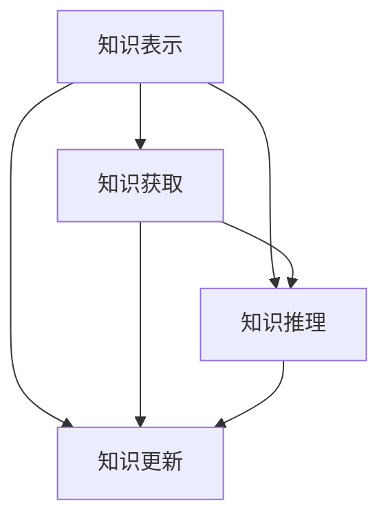

                 

### 设计《AGI的自主学习与知识更新机制》目录大纲的步骤

在设计《AGI的自主学习与知识更新机制》的目录大纲时，我们需要遵循以下步骤，确保文章结构清晰、逻辑严密，同时满足读者理解和技术阐述的需求。

#### 1. 理解书名与主题

**书名：《AGI的自主学习与知识更新机制》**

首先，我们需要理解书名的含义。书名涵盖了两个主要概念：“通用人工智能（AGI）”和“自主学习与知识更新机制”。

- **AGI（通用人工智能）**：一种能够像人类一样广泛理解和适应各种环境的智能系统，不同于当前的专用人工智能（Narrow AI）。
- **自主学习与知识更新机制**：指的是AGI系统如何自我学习、更新和适应新知识的机制。

接下来，我们需要确定书的读者群体。这本书可能面向AI研究员、工程师，以及对AI感兴趣的一般读者。因此，在撰写大纲时，需要考虑不同读者群体的需求和知识背景。

#### 2. 确定核心概念与架构

在理解书名和主题后，我们需要确定核心概念和架构，这是构建目录大纲的基础。

- **核心概念**：自主学习、知识表示、知识获取、知识推理、知识更新、元学习等。
- **架构**：AGI的核心架构，包括知识表示、学习算法、推理与规划等模块。

为了更好地展示这些核心概念和架构之间的关系，我们可以使用Mermaid流程图。例如：

#### 3. 制定目录大纲

根据上述核心概念和架构，我们可以开始制定目录大纲。目录大纲应该包含引言、基础理论、核心算法、项目实战等部分。

- **引言**：介绍AGI的概念、自主学习与知识更新机制的重要性，以及本书的结构和目标。
- **基础理论**：包括AGI的核心架构、自主学习的理论基础、知识更新机制等。
- **核心算法**：详细讲解自主学习算法（如强化学习、无监督学习、监督学习和迁移学习）以及知识更新策略。
- **项目实战**：通过实际项目，展示如何开发AGI系统，包括环境搭建、数据预处理、模型设计、知识更新等。

#### 4. 细化章节内容

在制定初步目录大纲后，我们需要进一步细化每个章节的内容。对于每个章节，列出可能包含的小节，并简要说明每个小节的内容。例如：

- **章节1：引言**
  - 小节1.1：介绍AGI的概念与发展历史
  - 小节1.2：自主学习与知识更新在AGI中的重要性
  - 小节1.3：本书结构安排与目标

- **章节2：AGI的核心架构与基础**
  - 小节2.1.1：知识表示
  - 小节2.1.2：学习算法
  - 小节2.1.3：推理与规划
  - 小节2.2.1：反馈循环与适应
  - 小节2.2.2：元学习与泛化能力
  - 小节2.3.1：知识融合与冲突解决

#### 5. 审查与优化

在细化章节内容后，我们需要检查目录大纲的逻辑性，确保章节之间的过渡自然。同时，评估每个章节的深度和广度，确保内容既能满足读者的理解，又不会过于冗长。必要时，添加附录或参考资料，以辅助读者更好地理解书中的内容。

#### 6. 撰写目录大纲

最后，根据以上步骤，我们可以撰写出完整的目录大纲。确保大纲的简洁性、逻辑性和完整性，为撰写文章正文部分奠定基础。

---

通过以上步骤，我们设计出了一份《AGI的自主学习与知识更新机制》的目录大纲，为后续撰写高质量的技术博客文章提供了结构框架。接下来，我们将根据这个大纲，逐步深入讨论每个章节的核心内容。在撰写过程中，我们将保持逻辑清晰、结构紧凑，并使用专业的技术语言和实例来阐述AGI的自主学习与知识更新机制。

