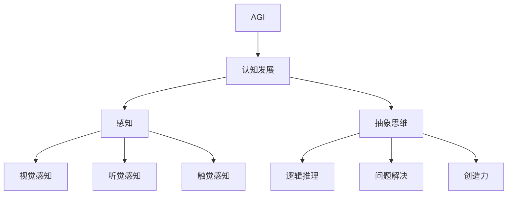

                 

### 设计思路

在设计《AGI的认知发展：从感知到抽象思维》的目录大纲时，我们首先明确了文章的核心目标和结构。文章旨在深入探讨AGI（人工通用智能）的认知发展，从感知到抽象思维的过程。为了实现这一目标，我们需要采用逻辑清晰、结构紧凑、简单易懂的写作方式，通过逐步分析推理来阐述核心概念和理论。

#### 第一步：明确核心概念与联系

首先，我们明确了文章的核心概念，即AGI、认知发展、感知和抽象思维。通过Mermaid流程图，我们可以清晰地展示这些概念之间的联系，帮助读者更好地理解文章的结构。

#### 第二步：设计章节框架

基于核心概念与联系，我们设计了以下章节框架：

- **第1章 引言与背景**：介绍AGI和认知发展的基本概念，以及感知与抽象思维的关系。
- **第2章 感知系统**：详细讨论感知系统，包括视觉、听觉和触觉感知。
- **第3章 学习与记忆**：探讨学习原理、长短期记忆和适应性学习。
- **第4章 抽象思维**：介绍抽象思维的概述、逻辑推理、问题解决和创造力。
- **第5章 语言处理**：讨论语言处理的基本任务、语法理解、语义理解和语音识别与生成。
- **第6章 社会认知与交互**：介绍社会认知概述、社会交互、信任与合作以及道德与伦理。
- **第7章 未来展望与挑战**：展望AGI的发展趋势，讨论技术挑战与伦理问题。

#### 第三步：详细规划每章内容

在每一章节中，我们进一步细化了内容，确保包含以下要素：

- **核心概念与联系**：使用Mermaid流程图展示。
- **核心算法原理讲解**：使用伪代码详细阐述。
- **数学模型和数学公式讲解**：使用latex格式，举例说明。
- **项目实战与代码案例**：详细解释说明。

#### 第四步：审查与优化

在完成初步的目录大纲设计后，我们进行了审查和优化，确保目录的逻辑性和完整性，同时控制总字数在8000～12000字左右。

### 结论

通过以上步骤，我们设计了一份详细且逻辑清晰的《AGI的认知发展：从感知到抽象思维》的目录大纲。接下来，我们将根据这个大纲逐步撰写每一章节的内容，确保文章的完整性和专业性。

---

### 目录大纲

#### 第1章 引言与背景
- **1.1 AGI概述**
  - **1.1.1 AGI的定义与特征**
  - **1.1.2 AGI的历史与现状**
- **1.2 认知发展概述**
  - **1.2.1 认知发展的理论框架**
  - **1.2.2 认知发展的里程碑**
- **1.3 感知与抽象思维的关系**
  - **1.3.1 感知在认知中的作用**
  - **1.3.2 抽象思维的发展与感知的关系**

#### 第2章 感知系统
- **2.1 感知系统简介**
  - **2.1.1 感知系统的基本组成**
  - **2.1.2 感知系统的功能**
- **2.2 视觉感知**
  - **2.2.1 视觉感知的基本原理**
  - **2.2.2 视觉感知的关键技术**
- **2.3 听觉感知**
  - **2.3.1 听觉感知的基本原理**
  - **2.3.2 听觉感知的关键技术**
- **2.4 触觉感知**
  - **2.4.1 触觉感知的基本原理**
  - **2.4.2 触觉感知的关键技术**

#### 第3章 学习与记忆
- **3.1 学习原理**
  - **3.1.1 学习的定义与类型**
  - **3.1.2 学习的理论框架**
- **3.2 长短期记忆**
  - **3.2.1 长短期记忆的概念**
  - **3.2.2 长短期记忆的研究进展**
- **3.3 适应性学习**
  - **3.3.1 适应性学习的定义与机制**
  - **3.3.2 适应性学习在AGI中的应用**

#### 第4章 抽象思维
- **4.1 抽象思维概述**
  - **4.1.1 抽象思维的定义与特征**
  - **4.1.2 抽象思维的研究意义**
- **4.2 逻辑推理**
  - **4.2.1 逻辑推理的基本原理**
  - **4.2.2 逻辑推理的应用**
- **4.3 问题解决**
  - **4.3.1 问题解决的定义与过程**
  - **4.3.2 问题解决在AGI中的应用**
- **4.4 创造力**
  - **4.4.1 创造力的定义与特征**
  - **4.4.2 创造力在AGI中的作用**

#### 第5章 语言处理
- **5.1 语言处理简介**
  - **5.1.1 语言处理的基本任务**
  - **5.1.2 语言处理的重要性**
- **5.2 语法理解**
  - **5.2.1 语法理解的基本原理**
  - **5.2.2 语法理解的算法与应用**
- **5.3 语义理解**
  - **5.3.1 语义理解的基本原理**
  - **5.3.2 语义理解的算法与应用**
- **5.4 语音识别与生成**
  - **5.4.1 语音识别的基本原理**
  - **5.4.2 语音生成的技术方法**

#### 第6章 社会认知与交互
- **6.1 社会认知概述**
  - **6.1.1 社会认知的定义与特征**
  - **6.1.2 社会认知的研究意义**
- **6.2 社会交互**
  - **6.2.1 社会交互的基本原理**
  - **6.2.2 社会交互的算法与应用**
- **6.3 信任与合作**
  - **6.3.1 信任的定义与机制**
  - **6.3.2 合作在AGI中的应用**
- **6.4 道德与伦理**
  - **6.4.1 道德与伦理的定义与特征**
  - **6.4.2 道德与伦理在AGI中的挑战**

#### 第7章 未来展望与挑战
- **7.1 AGI的发展趋势**
  - **7.1.1 AGI技术的前沿动态**
  - **7.1.2 AGI的应用场景**
- **7.2 技术挑战与伦理问题**
  - **7.2.1 技术挑战的分析与应对**
  - **7.2.2 伦理问题的讨论与展望**
- **7.3 未来应用场景**
  - **7.3.1 教育领域的应用**
  - **7.3.2 医疗健康领域的应用**
  - **7.3.3 社会治理领域的应用**

---

**文章关键词**：人工通用智能（AGI），认知发展，感知系统，抽象思维，学习与记忆，语言处理，社会认知与交互，未来展望与挑战。

**文章摘要**：本文详细探讨了人工通用智能（AGI）的认知发展，从感知到抽象思维的过程。通过介绍感知系统的组成和功能，学习与记忆的原理，抽象思维的概述和语言处理，以及社会认知与交互，本文旨在为读者提供一个全面而深入的AGI认知发展框架。同时，本文还展望了AGI的未来发展趋势和面临的挑战。通过这一步一步的分析和推理，读者将对AGI的认知发展有更深刻的理解。

