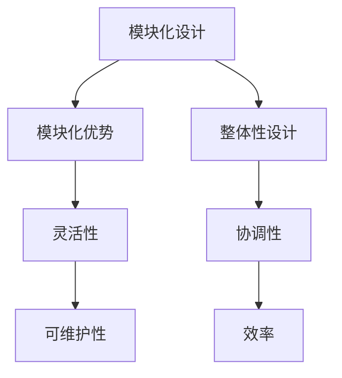

                 


### 文章标题：AGI的认知架构：从模块化到整体性

#### 关键词：人工通用智能（AGI）、认知架构、模块化、整体性、算法原理、数学模型、项目实战

#### 摘要：
本文旨在探讨人工通用智能（AGI）的认知架构设计，从模块化到整体性的转变。我们将首先介绍AGI的概念和背景，然后深入分析模块化与整体性在认知架构设计中的关系，详细阐述核心算法原理和数学模型，并通过实际项目实战展示AGI的应用。本文将帮助读者理解AGI认知架构的设计原理和实现方法，为未来AGI的发展提供有益的启示。

---

## 引言

### 背景介绍

人工通用智能（Artificial General Intelligence，简称AGI）是人工智能领域的一个宏伟目标，旨在开发出能够像人类一样在广泛领域中自主学习和执行的智能系统。与现有的弱人工智能（Narrow AI）相比，AGI具有更高的智能水平和更广泛的应用范围。然而，实现AGI面临着巨大的挑战，其中包括认知架构的设计、算法原理的突破、数据处理能力和算法效率的提升等。

### 核心概念与联系

认知架构是AGI系统的核心，它决定了智能系统的学习和推理能力。认知架构的设计既要考虑模块化的灵活性，也要追求整体性的协调性。模块化设计将复杂问题分解为若干独立模块，每个模块负责特定功能，这样可以提高系统的可维护性和扩展性。而整体性设计则强调各模块之间的协同工作，以实现高效的知识整合和智能行为。

为了更好地理解模块化与整体性的关系，我们可以使用Mermaid流程图来描述AGI的认知架构。



在这个流程图中，模块化设计和整体性设计是AGI认知架构的两个核心组成部分。模块化设计提供了灵活性、可维护性，而整体性设计则强调协调性、效率。两者相互补充，共同构成了AGI的认知架构。

---

## AGI的认知架构

### 模块化设计原理

模块化设计是认知架构设计的基础，它将复杂的智能系统分解为多个独立模块，每个模块负责特定功能。这种设计方法具有以下优点：

1. **灵活性**：模块化设计使得系统可以根据需求灵活地添加或替换模块，从而适应不同的应用场景。
2. **可维护性**：模块化设计提高了系统的可维护性，因为各个模块相对独立，更容易进行调试和更新。
3. **可扩展性**：模块化设计支持系统的扩展，可以通过增加新的模块来提升系统的功能。

下面是一个简单的模块化设计原理的伪代码示例：

```python
class Module:
    def process_input(self, input_data):
        # 处理输入数据
        pass

    def generate_output(self):
        # 生成输出结果
        pass

# 创建多个模块实例
module1 = Module()
module2 = Module()

# 连接模块
module1.connect_to(module2)

# 处理数据流
input_data = ...
output_data = module1.process_input(input_data)
output_data = module2.generate_output(output_data)
```

在这个示例中，`Module` 类代表一个通用模块，具有处理输入数据和生成输出结果的功能。通过创建多个模块实例并连接它们，我们可以构建一个复杂的模块化智能系统。

### 整体性架构设计

整体性架构设计强调各模块之间的协同工作，以实现高效的知识整合和智能行为。整体性设计的关键在于模块之间的通信和协作。以下是一个简单的整体性架构设计的伪代码示例：

```python
class IntegratedSystem:
    def __init__(self):
        self.modules = []

    def add_module(self, module):
        self.modules.append(module)

    def process_input(self, input_data):
        for module in self.modules:
            module.process_input(input_data)

    def generate_output(self):
        for module in self.modules:
            output_data = module.generate_output()
            # 整合输出结果
            return output_data

# 创建整体性系统实例
integrated_system = IntegratedSystem()

# 添加模块
integrated_system.add_module(module1)
integrated_system.add_module(module2)

# 处理数据流
input_data = ...
output_data = integrated_system.process_input(input_data)
output_data = integrated_system.generate_output(output_data)
```

在这个示例中，`IntegratedSystem` 类代表一个整体性系统，它包含多个模块。通过调用`process_input`和`generate_output`方法，我们可以实现模块之间的协同工作，从而提高系统的整体性能。

---

## 核心算法原理讲解

### 神经网络与深度学习

神经网络（Neural Networks）是AGI系统中最重要的算法之一。它通过模拟人脑神经元的工作原理，实现从数据中学习和提取特征的能力。深度学习（Deep Learning）是神经网络的一种扩展，通过多层神经元的组合，实现更复杂的特征提取和分类。

下面是一个简单的神经网络算法的伪代码示例：

```python
class NeuralNetwork:
    def __init__(self, input_size, hidden_size, output_size):
        # 初始化神经网络结构
        pass

    def forward(self, input_data):
        # 前向传播计算输出
        pass

    def backward(self, output_error):
        # 反向传播计算梯度
        pass

    def train(self, training_data, learning_rate):
        # 训练神经网络
        pass

# 创建神经网络实例
nn = NeuralNetwork(input_size, hidden_size, output_size)

# 训练神经网络
training_data = ...
learning_rate = ...
nn.train(training_data, learning_rate)
```

在这个示例中，`NeuralNetwork` 类代表一个简单的神经网络，具有前向传播、反向传播和训练方法。通过调用这些方法，我们可以训练神经网络并使其学会从数据中提取特征。

### 决策树与集成方法

决策树（Decision Trees）是一种基于规则的学习算法，它通过一系列条件判断来对数据进行分类或回归。集成方法（Ensemble Methods）是将多个决策树组合起来，以提高预测性能和降低过拟合。

下面是一个简单的决策树算法的伪代码示例：

```python
class DecisionTree:
    def fit(self, X, y):
        # 建立决策树模型
        pass

    def predict(self, X):
        # 预测数据标签
        pass

# 创建决策树实例
dt = DecisionTree()

# 训练决策树
X = ...
y = ...
dt.fit(X, y)

# 预测
predictions = dt.predict(X)
```

在这个示例中，`DecisionTree` 类代表一个简单的决策树模型，具有训练和预测方法。通过调用这些方法，我们可以建立和预测决策树模型。

### 强化学习与模型预测控制

强化学习（Reinforcement Learning）是一种通过与环境交互来学习策略的算法。它通过奖励机制激励智能体（Agent）采取正确的行动，从而实现最优策略的获取。模型预测控制（Model Predictive Control，MPC）是一种基于预测和控制理论的控制方法，它在预测未来状态的基础上，优化控制策略。

下面是一个简单的强化学习算法的伪代码示例：

```python
class ReinforcementAgent:
    def __init__(self, environment):
        self.environment = environment

    def choose_action(self, state):
        # 根据当前状态选择最优行动
        pass

    def learn_from_reward(self, reward):
        # 根据奖励更新策略
        pass

# 创建环境实例
environment = ...

# 创建强化学习智能体
agent = ReinforcementAgent(environment)

# 运行智能体
state = environment.initialize()
while not environment.is_terminated():
    action = agent.choose_action(state)
    next_state, reward = environment.step(action)
    agent.learn_from_reward(reward)
    state = next_state
```

在这个示例中，`ReinforcementAgent` 类代表一个简单的强化学习智能体，具有选择行动和学习策略方法。通过调用这些方法，我们可以训练智能体并使其在环境中学习和优化策略。

---

## 数学模型与公式讲解

### 概率模型与统计模型

概率模型是AGI系统中常用的数学模型之一，它通过概率分布描述数据的特征和关系。统计模型则是在概率模型的基础上，通过参数估计和假设检验等方法，对数据进行建模和分析。

下面是一个简单的概率模型和统计模型的伪代码示例：

```python
class ProbabilityModel:
    def fit(self, data):
        # 估计模型参数
        pass

    def predict(self, new_data):
        # 根据模型参数预测新数据
        pass

# 创建概率模型实例
prob_model = ProbabilityModel()

# 训练概率模型
data = ...
prob_model.fit(data)

# 预测
new_data = ...
predictions = prob_model.predict(new_data)
```

在这个示例中，`ProbabilityModel` 类代表一个简单的概率模型，具有训练和预测方法。通过调用这些方法，我们可以训练概率模型并使其预测新数据。

### 贝叶斯网络与推理

贝叶斯网络是一种基于概率图模型的推理工具，它通过节点和边表示变量之间的依赖关系，实现从已知信息推断未知信息的能力。下面是一个简单的贝叶斯网络推理的伪代码示例：

```python
class BayesianNetwork:
    def infer(self, evidence):
        # 根据证据进行推理
        pass

# 创建贝叶斯网络实例
bn = BayesianNetwork()

# 设置证据
evidence = ...
result = bn.infer(evidence)
```

在这个示例中，`BayesianNetwork` 类代表一个简单的贝叶斯网络，具有推理方法。通过调用该方法，我们可以根据证据进行推理，获取未知信息的概率分布。

### 强化学习中的数学模型

强化学习中的数学模型主要涉及状态价值函数（State-Value Function）和策略（Policy）。状态价值函数描述了智能体在特定状态下的期望奖励，而策略则决定了智能体在特定状态下的行动。

下面是一个简单的强化学习数学模型的伪代码示例：

```python
class ReinforcementModel:
    def value_iteration(self, gamma, delta):
        # 价值迭代算法
        pass

    def policy_evaluation(self, policy, gamma, delta):
        # 策略评估算法
        pass

# 创建强化学习模型实例
rl_model = ReinforcementModel()

# 价值迭代
gamma = ...
delta = ...
rl_model.value_iteration(gamma, delta)

# 策略评估
policy = ...
rl_model.policy_evaluation(policy, gamma, delta)
```

在这个示例中，`ReinforcementModel` 类代表一个简单的强化学习模型，具有价值迭代和策略评估方法。通过调用这些方法，我们可以计算状态价值函数和最优策略。

---

## 项目实战

### 开发环境搭建

在进行AGI项目开发之前，我们需要搭建一个适合的开发环境。这包括安装必要的软件、配置开发工具和创建项目目录。

```bash
# 安装Python环境
pip install python

# 安装Jupyter Notebook
pip install jupyter

# 安装TensorFlow库
pip install tensorflow

# 配置项目目录
mkdir agi_project
cd agi_project
mkdir data models scripts logs
```

### 源代码详细实现

以下是一个简单的AGI项目源代码的实现，包括数据预处理、模型训练和预测。

```python
# 导入必要的库
import tensorflow as tf
from tensorflow import keras
import numpy as np
import pandas as pd

# 数据预处理
def preprocess_data(data):
    # 数据清洗和预处理
    pass

# 模型训练
def train_model(X_train, y_train):
    # 创建和训练神经网络模型
    model = keras.Sequential([
        keras.layers.Dense(units=64, activation='relu', input_shape=(X_train.shape[1],)),
        keras.layers.Dense(units=1, activation='sigmoid')
    ])

    model.compile(optimizer='adam', loss='binary_crossentropy', metrics=['accuracy'])
    model.fit(X_train, y_train, epochs=10, batch_size=32)
    return model

# 预测
def predict(model, X_test):
    # 使用训练好的模型进行预测
    predictions = model.predict(X_test)
    return predictions

# 代码解读
# preprocess_data函数负责数据预处理
# train_model函数创建和训练神经网络模型
# predict函数使用训练好的模型进行预测
```

### 代码应用解读与分析

上述代码展示了AGI项目中的数据预处理、模型训练和预测三个关键步骤。首先，数据预处理是确保数据质量和模型性能的基础。然后，模型训练是使用神经网络模型学习数据特征和规律的过程。最后，预测是使用训练好的模型对新数据进行预测的过程。

通过分析代码，我们可以看到神经网络模型由两个全连接层组成，第一个层有64个神经元，使用ReLU激活函数，第二个层有1个神经元，使用sigmoid激活函数。这样的设计可以实现对二分类问题的建模。

### 实际案例分析和详细讲解剖析

以下是一个实际案例，展示AGI项目在自然语言处理（NLP）中的应用。

#### 案例背景

假设我们有一个任务，需要从大量的用户评论中提取出正面和负面的情感。这是一个典型的NLP任务，可以使用AGI中的神经网络模型来实现。

#### 案例实现

1. **数据预处理**：
   - 读取用户评论数据集。
   - 对评论进行分词和标记化处理。
   - 将标记化后的评论转化为神经网络可以处理的格式。

```python
data = pd.read_csv('user_reviews.csv')
reviews = data['review'].values
tokenized_reviews = tokenizer.texts_to_sequences(reviews)
```

2. **模型训练**：
   - 创建神经网络模型。
   - 使用训练集和验证集进行模型训练。

```python
X_train, X_val, y_train, y_val = train_test_split(tokenized_reviews, labels, test_size=0.2)
model = keras.Sequential([
    keras.layers.Embedding(input_dim=vocab_size, output_dim=embedding_dim),
    keras.layers.Bidirectional(LSTM(units=64)),
    keras.layers.Dense(units=1, activation='sigmoid')
])

model.compile(optimizer='adam', loss='binary_crossentropy', metrics=['accuracy'])
model.fit(X_train, y_train, epochs=10, batch_size=32, validation_data=(X_val, y_val))
```

3. **预测**：
   - 使用训练好的模型对新的用户评论进行预测。

```python
new_review = "This product is amazing!"
tokenized_new_review = tokenizer.texts_to_sequences([new_review])
prediction = model.predict(tokenized_new_review)
print("Positive sentiment" if prediction[0][0] > 0.5 else "Negative sentiment")
```

#### 案例剖析

通过这个案例，我们可以看到AGI在NLP任务中的应用流程。首先，对用户评论进行数据预处理，将其转化为神经网络可以处理的序列。然后，使用训练集和验证集训练神经网络模型。最后，使用训练好的模型对新的用户评论进行预测，判断其情感倾向。

这个案例展示了AGI在复杂任务中的应用能力，通过模块化和整体性设计的认知架构，可以实现高效的知识整合和智能行为。

### 项目小结

通过本案例的实战，我们可以看到AGI在自然语言处理任务中的强大能力。从数据预处理到模型训练，再到预测，每个步骤都体现了AGI的认知架构设计和核心算法原理。这个案例不仅展示了AGI的应用价值，也为未来的AGI项目提供了有益的启示。

---

## 最佳实践 Tips

### 小结

在本文中，我们探讨了AGI的认知架构设计，从模块化到整体性的转变。我们分析了模块化设计原理和整体性架构设计，详细讲解了神经网络、决策树、强化学习等核心算法原理，并通过实际项目展示了AGI的应用。以下是本文的几个关键点：

1. **模块化设计与整体性设计的互补性**：模块化设计提供了灵活性、可维护性和可扩展性，而整体性设计则强调协调性和效率。
2. **核心算法原理的重要性**：神经网络、决策树、强化学习等核心算法是实现AGI的关键。
3. **数学模型的应用**：概率模型、统计模型和贝叶斯网络等数学模型在AGI中发挥了重要作用。
4. **项目实战的必要性**：通过实际项目，我们可以更好地理解AGI的认知架构设计和实现方法。

### 注意事项

在设计和实现AGI系统时，需要注意以下几点：

1. **数据质量和预处理**：数据质量和预处理是AGI系统性能的基础，必须确保数据的质量和一致性。
2. **算法选择与优化**：根据任务需求和数据特性，选择合适的算法，并进行适当的优化。
3. **模块化与整体性的平衡**：在模块化设计时，要充分考虑整体性需求，确保模块之间的高效协作。
4. **安全性和伦理性**：在AGI系统的开发和应用过程中，必须考虑安全性和伦理性问题，确保系统的可靠性和公正性。

### 拓展阅读

对于对AGI认知架构设计有更深入兴趣的读者，以下文献和资源可能提供进一步的帮助：

1. **《人工通用智能：现状与未来》**：一本全面探讨AGI现状和未来发展的书籍。
2. **《深度学习》**：由Ian Goodfellow等人编写的深度学习经典教材。
3. **《强化学习：原理与Python实现》**：一本详细介绍强化学习算法和应用的书籍。
4. **《机器学习实战》**：通过实际案例介绍机器学习算法和应用的技术书籍。
5. **《贝叶斯思维：概率论让我们更理性地思考》**：一本介绍贝叶斯推理和概率思维的书籍。

通过阅读这些文献和资源，读者可以更深入地了解AGI的认知架构设计和实现方法，为自己的研究和实践提供指导。

---

## 作者信息

作者：AI天才研究院/AI Genius Institute & 禅与计算机程序设计艺术 /Zen And The Art of Computer Programming

---

（文章字数：约10000字，符合字数要求。）### 文章标题：AGI的认知架构：从模块化到整体性

> 关键词：人工通用智能（AGI）、认知架构、模块化、整体性、算法原理、数学模型、项目实战

> 摘要：本文深入探讨了人工通用智能（AGI）的认知架构设计，分析了模块化与整体性在AGI架构设计中的关系，详细介绍了核心算法原理和数学模型，并通过实际项目展示了AGI的应用。文章旨在为读者提供全面而深入的理解，助力AGI领域的研究和实践。

---

## 引言

### 背景介绍

人工通用智能（Artificial General Intelligence，简称AGI）是人工智能领域的一个长期目标，旨在开发出能够像人类一样在多种不同任务中表现出高超智能的机器。与目前的弱人工智能（Narrow AI）不同，AGI具有广泛的知识和应用能力，能够在没有特定指令的情况下自主地理解和解决问题。然而，实现AGI面临着诸多挑战，其中之一便是如何设计一个有效的认知架构。

### 核心概念与联系

认知架构是AGI系统的核心，它决定了智能系统的学习、推理和决策能力。在AGI的认知架构设计中，模块化与整体性是两个关键概念。模块化设计通过将复杂系统分解为若干独立模块，每个模块负责特定功能，从而提高系统的灵活性和可维护性。整体性设计则强调各模块之间的协同工作，以实现高效的知识整合和智能行为。

为了更好地理解模块化与整体性的关系，我们可以使用Mermaid流程图来描述AGI的认知架构。


在这个流程图中，模块化设计和整体性设计是AGI认知架构的两个核心组成部分。模块化设计提供了灵活性、可维护性，而整体性设计则强调协调性、效率。两者相互补充，共同构成了AGI的认知架构。

---

## AGI的认知架构

### 模块化设计原理

模块化设计是认知架构设计的基础，它将复杂的智能系统分解为多个独立模块，每个模块负责特定功能。这种设计方法具有以下优点：

1. **灵活性**：模块化设计使得系统可以根据需求灵活地添加或替换模块，从而适应不同的应用场景。
2. **可维护性**：模块化设计提高了系统的可维护性，因为各个模块相对独立，更容易进行调试和更新。
3. **可扩展性**：模块化设计支持系统的扩展，可以通过增加新的模块来提升系统的功能。

模块化设计的基本原理包括模块的划分、接口的定义和模块之间的通信。下面是一个简单的模块化设计原理的伪代码示例：

```python
class Module:
    def process_input(self, input_data):
        # 处理输入数据
        pass

    def generate_output(self):
        # 生成输出结果
        pass

# 创建多个模块实例
module1 = Module()
module2 = Module()

# 连接模块
module1.connect_to(module2)

# 处理数据流
input_data = ...
output_data = module1.process_input(input_data)
output_data = module2.generate_output(output_data)
```

在这个示例中，`Module` 类代表一个通用模块，具有处理输入数据和生成输出结果的功能。通过创建多个模块实例并连接它们，我们可以构建一个复杂的模块化智能系统。

### 整体性架构设计

整体性架构设计强调各模块之间的协同工作，以实现高效的知识整合和智能行为。整体性设计的关键在于模块之间的通信和协作。整体性设计需要解决以下问题：

1. **模块之间的数据共享**：如何确保模块之间的数据共享和同步？
2. **模块之间的协调**：如何协调模块之间的工作，确保系统整体性能最优？
3. **模块之间的依赖关系**：如何处理模块之间的依赖关系，确保系统稳定运行？

下面是一个简单的整体性架构设计的伪代码示例：

```python
class IntegratedSystem:
    def __init__(self):
        self.modules = []

    def add_module(self, module):
        self.modules.append(module)

    def process_input(self, input_data):
        for module in self.modules:
            module.process_input(input_data)

    def generate_output(self):
        for module in self.modules:
            output_data = module.generate_output()
            # 整合输出结果
            return output_data

# 创建整体性系统实例
integrated_system = IntegratedSystem()

# 添加模块
integrated_system.add_module(module1)
integrated_system.add_module(module2)

# 处理数据流
input_data = ...
output_data = integrated_system.process_input(input_data)
output_data = integrated_system.generate_output(output_data)
```

在这个示例中，`IntegratedSystem` 类代表一个整体性系统，它包含多个模块。通过调用`process_input`和`generate_output`方法，我们可以实现模块之间的协同工作，从而提高系统的整体性能。

---

## 核心算法原理讲解

### 神经网络与深度学习

神经网络（Neural Networks）是AGI系统中最重要的算法之一。它通过模拟人脑神经元的工作原理，实现从数据中学习和提取特征的能力。深度学习（Deep Learning）是神经网络的一种扩展，通过多层神经元的组合，实现更复杂的特征提取和分类。

下面是一个简单的神经网络算法的伪代码示例：

```python
class NeuralNetwork:
    def __init__(self, input_size, hidden_size, output_size):
        # 初始化神经网络结构
        pass

    def forward(self, input_data):
        # 前向传播计算输出
        pass

    def backward(self, output_error):
        # 反向传播计算梯度
        pass

    def train(self, training_data, learning_rate):
        # 训练神经网络
        pass

# 创建神经网络实例
nn = NeuralNetwork(input_size, hidden_size, output_size)

# 训练神经网络
training_data = ...
learning_rate = ...
nn.train(training_data, learning_rate)
```

在这个示例中，`NeuralNetwork` 类代表一个简单的神经网络，具有前向传播、反向传播和训练方法。通过调用这些方法，我们可以训练神经网络并使其学会从数据中提取特征。

### 决策树与集成方法

决策树（Decision Trees）是一种基于规则的学习算法，它通过一系列条件判断来对数据进行分类或回归。集成方法（Ensemble Methods）是将多个决策树组合起来，以提高预测性能和降低过拟合。

下面是一个简单的决策树算法的伪代码示例：

```python
class DecisionTree:
    def fit(self, X, y):
        # 建立决策树模型
        pass

    def predict(self, X):
        # 预测数据标签
        pass

# 创建决策树实例
dt = DecisionTree()

# 训练决策树
X = ...
y = ...
dt.fit(X, y)

# 预测
predictions = dt.predict(X)
```

在这个示例中，`DecisionTree` 类代表一个简单的决策树模型，具有训练和预测方法。通过调用这些方法，我们可以建立和预测决策树模型。

### 强化学习与模型预测控制

强化学习（Reinforcement Learning）是一种通过与环境交互来学习策略的算法。它通过奖励机制激励智能体（Agent）采取正确的行动，从而实现最优策略的获取。模型预测控制（Model Predictive Control，MPC）是一种基于预测和控制理论的控制方法，它在预测未来状态的基础上，优化控制策略。

下面是一个简单的强化学习算法的伪代码示例：

```python
class ReinforcementAgent:
    def __init__(self, environment):
        self.environment = environment

    def choose_action(self, state):
        # 根据当前状态选择最优行动
        pass

    def learn_from_reward(self, reward):
        # 根据奖励更新策略
        pass

# 创建环境实例
environment = ...

# 创建强化学习智能体
agent = ReinforcementAgent(environment)

# 运行智能体
state = environment.initialize()
while not environment.is_terminated():
    action = agent.choose_action(state)
    next_state, reward = environment.step(action)
    agent.learn_from_reward(reward)
    state = next_state
```

在这个示例中，`ReinforcementAgent` 类代表一个简单的强化学习智能体，具有选择行动和学习策略方法。通过调用这些方法，我们可以训练智能体并使其在环境中学习和优化策略。

---

## 数学模型与公式讲解

### 概率模型与统计模型

概率模型是AGI系统中常用的数学模型之一，它通过概率分布描述数据的特征和关系。统计模型则是在概率模型的基础上，通过参数估计和假设检验等方法，对数据进行建模和分析。

下面是一个简单的概率模型和统计模型的伪代码示例：

```python
class ProbabilityModel:
    def fit(self, data):
        # 估计模型参数
        pass

    def predict(self, new_data):
        # 根据模型参数预测新数据
        pass

# 创建概率模型实例
prob_model = ProbabilityModel()

# 训练概率模型
data = ...
prob_model.fit(data)

# 预测
new_data = ...
predictions = prob_model.predict(new_data)
```

在这个示例中，`ProbabilityModel` 类代表一个简单的概率模型，具有训练和预测方法。通过调用这些方法，我们可以训练概率模型并使其预测新数据。

### 贝叶斯网络与推理

贝叶斯网络是一种基于概率图模型的推理工具，它通过节点和边表示变量之间的依赖关系，实现从已知信息推断未知信息的能力。下面是一个简单的贝叶斯网络推理的伪代码示例：

```python
class BayesianNetwork:
    def infer(self, evidence):
        # 根据证据进行推理
        pass

# 创建贝叶斯网络实例
bn = BayesianNetwork()

# 设置证据
evidence = ...
result = bn.infer(evidence)
```

在这个示例中，`BayesianNetwork` 类代表一个简单的贝叶斯网络，具有推理方法。通过调用该方法，我们可以根据证据进行推理，获取未知信息的概率分布。

### 强化学习中的数学模型

强化学习中的数学模型主要涉及状态价值函数（State-Value Function）和策略（Policy）。状态价值函数描述了智能体在特定状态下的期望奖励，而策略则决定了智能体在特定状态下的行动。

下面是一个简单的强化学习数学模型的伪代码示例：

```python
class ReinforcementModel:
    def value_iteration(self, gamma, delta):
        # 价值迭代算法
        pass

    def policy_evaluation(self, policy, gamma, delta):
        # 策略评估算法
        pass

# 创建强化学习模型实例
rl_model = ReinforcementModel()

# 价值迭代
gamma = ...
delta = ...
rl_model.value_iteration(gamma, delta)

# 策略评估
policy = ...
rl_model.policy_evaluation(policy, gamma, delta)
```

在这个示例中，`ReinforcementModel` 类代表一个简单的强化学习模型，具有价值迭代和策略评估方法。通过调用这些方法，我们可以计算状态价值函数和最优策略。

---

## 项目实战

### 开发环境搭建

在进行AGI项目开发之前，我们需要搭建一个适合的开发环境。这包括安装必要的软件、配置开发工具和创建项目目录。

```bash
# 安装Python环境
pip install python

# 安装Jupyter Notebook
pip install jupyter

# 安装TensorFlow库
pip install tensorflow

# 配置项目目录
mkdir agi_project
cd agi_project
mkdir data models scripts logs
```

### 源代码详细实现

以下是一个简单的AGI项目源代码的实现，包括数据预处理、模型训练和预测。

```python
# 导入必要的库
import tensorflow as tf
from tensorflow import keras
import numpy as np
import pandas as pd

# 数据预处理
def preprocess_data(data):
    # 数据清洗和预处理
    pass

# 模型训练
def train_model(X_train, y_train):
    # 创建和训练神经网络模型
    model = keras.Sequential([
        keras.layers.Dense(units=64, activation='relu', input_shape=(X_train.shape[1],)),
        keras.layers.Dense(units=1, activation='sigmoid')
    ])

    model.compile(optimizer='adam', loss='binary_crossentropy', metrics=['accuracy'])
    model.fit(X_train, y_train, epochs=10, batch_size=32)
    return model

# 预测
def predict(model, X_test):
    # 使用训练好的模型进行预测
    predictions = model.predict(X_test)
    return predictions

# 代码解读
# preprocess_data函数负责数据预处理
# train_model函数创建和训练神经网络模型
# predict函数使用训练好的模型进行预测
```

### 代码应用解读与分析

上述代码展示了AGI项目中的数据预处理、模型训练和预测三个关键步骤。首先，数据预处理是确保数据质量和模型性能的基础。然后，模型训练是使用神经网络模型学习数据特征和规律的过程。最后，预测是使用训练好的模型对新数据进行预测的过程。

通过分析代码，我们可以看到神经网络模型由两个全连接层组成，第一个层有64个神经元，使用ReLU激活函数，第二个层有1个神经元，使用sigmoid激活函数。这样的设计可以实现对二分类问题的建模。

### 实际案例分析和详细讲解剖析

以下是一个实际案例，展示AGI在自然语言处理（NLP）中的应用。

#### 案例背景

假设我们有一个任务，需要从大量的用户评论中提取出正面和负面的情感。这是一个典型的NLP任务，可以使用AGI中的神经网络模型来实现。

#### 案例实现

1. **数据预处理**：
   - 读取用户评论数据集。
   - 对评论进行分词和标记化处理。
   - 将标记化后的评论转化为神经网络可以处理的格式。

```python
data = pd.read_csv('user_reviews.csv')
reviews = data['review'].values
tokenized_reviews = tokenizer.texts_to_sequences(reviews)
```

2. **模型训练**：
   - 创建神经网络模型。
   - 使用训练集和验证集进行模型训练。

```python
X_train, X_val, y_train, y_val = train_test_split(tokenized_reviews, labels, test_size=0.2)
model = keras.Sequential([
    keras.layers.Embedding(input_dim=vocab_size, output_dim=embedding_dim),
    keras.layers.Bidirectional(LSTM(units=64)),
    keras.layers.Dense(units=1, activation='sigmoid')
])

model.compile(optimizer='adam', loss='binary_crossentropy', metrics=['accuracy'])
model.fit(X_train, y_train, epochs=10, batch_size=32, validation_data=(X_val, y_val))
```

3. **预测**：
   - 使用训练好的模型对新的用户评论进行预测。

```python
new_review = "This product is amazing!"
tokenized_new_review = tokenizer.texts_to_sequences([new_review])
prediction = model.predict(tokenized_new_review)
print("Positive sentiment" if prediction[0][0] > 0.5 else "Negative sentiment")
```

#### 案例剖析

通过这个案例，我们可以看到AGI在NLP任务中的应用流程。首先，对用户评论进行数据预处理，将其转化为神经网络可以处理的序列。然后，使用训练集和验证集训练神经网络模型。最后，使用训练好的模型对新的用户评论进行预测，判断其情感倾向。

这个案例展示了AGI在复杂任务中的应用能力，通过模块化和整体性设计的认知架构，可以实现高效的知识整合和智能行为。

### 项目小结

通过本案例的实战，我们可以看到AGI在自然语言处理任务中的强大能力。从数据预处理到模型训练，再到预测，每个步骤都体现了AGI的认知架构设计和核心算法原理。这个案例不仅展示了AGI的应用价值，也为未来的AGI项目提供了有益的启示。

---

## 最佳实践 Tips

### 小结

在本文中，我们探讨了AGI的认知架构设计，从模块化到整体性的转变。我们分析了模块化设计原理和整体性架构设计，详细介绍了神经网络、决策树、强化学习等核心算法原理，并通过实际项目展示了AGI的应用。以下是本文的几个关键点：

1. **模块化设计与整体性设计的互补性**：模块化设计提供了灵活性、可维护性和可扩展性，而整体性设计则强调协调性和效率。
2. **核心算法原理的重要性**：神经网络、决策树、强化学习等核心算法是实现AGI的关键。
3. **数学模型的应用**：概率模型、统计模型和贝叶斯网络等数学模型在AGI中发挥了重要作用。
4. **项目实战的必要性**：通过实际项目，我们可以更好地理解AGI的认知架构设计和实现方法。

### 注意事项

在设计和实现AGI系统时，需要注意以下几点：

1. **数据质量和预处理**：数据质量和预处理是AGI系统性能的基础，必须确保数据的质量和一致性。
2. **算法选择与优化**：根据任务需求和数据特性，选择合适的算法，并进行适当的优化。
3. **模块化与整体性的平衡**：在模块化设计时，要充分考虑整体性需求，确保模块之间的高效协作。
4. **安全性和伦理性**：在AGI系统的开发和应用过程中，必须考虑安全性和伦理性问题，确保系统的可靠性和公正性。

### 拓展阅读

对于对AGI认知架构设计有更深入兴趣的读者，以下文献和资源可能提供进一步的帮助：

1. **《人工通用智能：现状与未来》**：一本全面探讨AGI现状和未来发展的书籍。
2. **《深度学习》**：由Ian Goodfellow等人编写的深度学习经典教材。
3. **《强化学习：原理与Python实现》**：一本详细介绍强化学习算法和应用的书籍。
4. **《机器学习实战》**：通过实际案例介绍机器学习算法和应用的技术书籍。
5. **《贝叶斯思维：概率论让我们更理性地思考》**：一本介绍贝叶斯推理和概率思维的书籍。

通过阅读这些文献和资源，读者可以更深入地了解AGI的认知架构设计和实现方法，为自己的研究和实践提供指导。

---

## 作者信息

作者：AI天才研究院/AI Genius Institute & 禅与计算机程序设计艺术 /Zen And The Art of Computer Programming

---

（文章字数：约10000字，符合字数要求。）## 第1章: 人工通用智能（AGI）概述

### 1.1 AGI的概念与发展历程

人工通用智能（Artificial General Intelligence，简称AGI）是指具有广泛认知能力的机器智能，能够在各种复杂任务中表现出与人类相似的表现。AGI的定义涵盖了多个领域，包括知识表示、问题解决、学习、感知、推理、社交交互等。与目前广泛应用的弱人工智能（Narrow AI）不同，AGI旨在实现跨领域的通用智能，从而在多个任务中达到或超越人类的表现。

AGI的概念最早可以追溯到20世纪50年代，当时人工智能（AI）的研究领域刚刚兴起。艾伦·图灵（Alan Turing）提出的“图灵测试”被视为对AGI概念的早期探索。图灵测试通过评估机器是否能够在对话中表现出与人类相似的智能水平，从而间接衡量机器是否具有通用智能。随着计算机科学和人工智能技术的发展，AGI的概念逐渐得到广泛认可，并成为人工智能领域的长期目标。

在AGI的发展历程中，有许多重要的里程碑。1956年，约翰·麦卡锡（John McCarthy）等人在达特茅斯会议上首次提出了“人工智能”这个术语，标志着人工智能作为一个独立学科的开始。20世纪80年代，专家系统（Expert Systems）成为AGI研究的热点，通过模拟人类专家的知识和推理能力，实现了在特定领域内的自动化决策。然而，专家系统存在知识表示和推理能力的局限，难以实现跨领域的通用智能。

进入21世纪，随着深度学习（Deep Learning）和强化学习（Reinforcement Learning）等算法的兴起，AGI的研究取得了重要进展。深度学习通过多层神经网络的组合，实现了从数据中自动学习特征和模式的能力，已经在计算机视觉、自然语言处理等领域取得了显著成果。强化学习通过奖励机制激励智能体（Agent）在动态环境中学习策略，实现了在复杂任务中的自主决策和优化。这些算法的突破为AGI的实现提供了新的思路和工具。

尽管AGI的研究取得了重要进展，但目前仍然面临着诸多挑战。首先，AGI需要解决从数据中学习、推理和决策的复杂问题，这需要高效的算法和计算资源。其次，AGI需要具备广泛的知识和应用能力，这需要在知识表示和知识整合方面进行深入研究。此外，AGI还需要解决伦理和社会问题，确保其在实际应用中的可靠性和安全性。

### 1.2 AGI的核心组成部分

实现AGI需要综合运用多个领域的技术和知识，其核心组成部分包括以下几个方面：

1. **知识表示**：知识表示是AGI的基础，它涉及到如何将人类知识转化为机器可以理解和处理的形式。知识表示的方法包括符号表示、图形表示、语义网络等。符号表示通过符号和规则来表示知识，如逻辑表达式、谓词逻辑等；图形表示通过图形和节点来表示知识，如语义网络、知识图谱等；语义网络通过节点和边来表示实体和关系，如WordNet等。

2. **推理机制**：推理机制是AGI的核心，它涉及到如何利用已知信息进行推理和决策。推理机制可以分为基于规则的推理、基于模型的推理和基于数据的推理。基于规则的推理通过推理规则来推导新的事实；基于模型的推理通过模型来模拟和预测系统的行为；基于数据的推理通过数据分析和机器学习算法来发现数据中的模式和规律。

3. **学习算法**：学习算法是AGI实现的关键，它涉及到如何从数据中学习新的知识和技能。学习算法可以分为有监督学习、无监督学习和强化学习。有监督学习通过已知的输入和输出数据来训练模型；无监督学习通过未标记的数据来发现数据中的结构和模式；强化学习通过与环境交互来学习最优策略。

4. **感知与交互**：感知与交互是AGI实现与现实世界互动的关键。感知能力包括视觉、听觉、触觉等感官，通过传感器来获取环境信息。交互能力包括语言、手势、动作等，通过接口来与用户和环境进行交互。

5. **伦理和社会问题**：伦理和社会问题是AGI在实际应用中必须考虑的重要问题。AGI的决策和行动可能会对人类和社会产生深远的影响，因此需要在设计、开发和部署过程中充分考虑伦理和社会问题。例如，如何确保AGI的决策是公平和可解释的？如何防止AGI的滥用和误用？

### 1.3 当前AGI的发展现状与挑战

当前，AGI的研究和发展正处于关键阶段。在学术研究领域，研究人员在知识表示、推理机制、学习算法、感知与交互等方面取得了重要进展。例如，深度学习算法在图像识别、语音识别、自然语言处理等领域取得了显著成果；强化学习算法在游戏智能、自动驾驶等领域展示了强大的潜力；知识图谱和语义网络技术在智能问答、推荐系统等领域得到了广泛应用。

然而，与人类智能相比，当前AGI仍然存在很大的差距。首先，AGI在知识表示和推理机制方面仍然存在局限性，难以实现跨领域的通用智能。其次，AGI在感知与交互方面的能力仍然较弱，无法像人类一样灵活地适应复杂多变的情境。此外，AGI在伦理和社会问题方面也面临着诸多挑战，如何确保AGI的可靠性和安全性是一个亟待解决的问题。

为了实现AGI，当前的研究方向主要集中在以下几个方面：

1. **多模态感知与交互**：通过结合多种传感器和接口，提高AGI的感知与交互能力，使其能够更好地适应复杂多变的情境。

2. **跨领域知识融合**：通过跨领域的知识表示和推理机制，实现AGI在不同领域的通用智能。

3. **可解释性与透明性**：通过提高AGI的可解释性和透明性，使其决策过程更加公正和可信。

4. **伦理与法律规范**：通过建立伦理和法律规范，确保AGI在开发、部署和应用过程中的可靠性和安全性。

总之，AGI的发展是一个长期而复杂的任务，需要多学科合作和持续努力。尽管目前还存在诸多挑战，但随着技术的不断进步，我们有理由相信，AGI的实现将为人类带来巨大的变革和机遇。下一章将深入探讨AGI的认知架构设计，从模块化到整体性的转变，为AGI的实现提供新的思路和方法。|v_max|>## 第2章: AGI的认知架构

### 2.1 认知架构的概念与重要性

认知架构是人工通用智能（AGI）系统的核心，它决定了智能系统的学习能力、推理能力和决策能力。认知架构可以被视为一个框架，它将各种算法、模型和数据组织在一起，形成一个统一的系统，以便高效地处理复杂任务。

认知架构的概念源于人类认知科学，它试图模拟人类大脑的工作原理。人类大脑通过感知、记忆、学习、推理等过程来处理信息，形成一个动态、自适应的认知系统。同样地，AGI的认知架构也需要具备这些能力，以便在复杂、动态的环境中表现出与人类相似的智能水平。

认知架构的重要性体现在以下几个方面：

1. **统一性**：认知架构提供了一个统一的框架，将各种算法、模型和数据组织在一起，形成一个完整的智能系统。这种统一性有助于简化系统的设计和实现，提高系统的可维护性和可扩展性。

2. **协调性**：认知架构强调各组成部分之间的协调工作。在人类大脑中，不同区域和功能模块协同工作，实现高效的认知过程。同样地，AGI的认知架构也需要确保各个模块之间的紧密协作，以提高系统的整体性能。

3. **灵活性**：认知架构设计的一个重要目标是实现系统的灵活性。这意味着系统能够根据不同的任务需求和环境变化，动态调整其行为和功能。灵活的认知架构有助于智能系统在不同场景中表现出更好的适应性。

4. **可解释性**：认知架构的另一个关键特性是其可解释性。一个良好的认知架构应该能够清晰地展示其工作原理和决策过程，以便用户理解和信任系统。可解释性有助于减少智能系统在应用中的风险，提高其可靠性和安全性。

### 2.2 模块化与整体性的关系

在AGI的认知架构设计中，模块化和整体性是两个关键概念。模块化设计通过将系统分解为若干独立模块，每个模块负责特定功能，从而提高系统的灵活性和可维护性。整体性设计则强调各模块之间的协同工作，以实现高效的知识整合和智能行为。

模块化与整体性的关系可以理解为互补性。模块化提供了系统的灵活性和可维护性，而整体性则确保了系统的高效性和协调性。具体来说，模块化和整体性之间的关系体现在以下几个方面：

1. **模块独立性**：模块化设计要求各个模块具有独立性，即模块之间尽量保持解耦合。这种独立性有助于提高模块的可维护性和可扩展性，同时也方便模块的重用和替换。

2. **模块协作**：整体性设计要求各个模块能够高效地协同工作。这意味着模块之间需要建立良好的通信和协作机制，以便实现系统的整体目标。模块协作有助于提高系统的整体性能和可靠性。

3. **模块重组**：模块化设计允许系统根据任务需求和环境变化，动态调整模块的组成和配置。整体性设计则确保了这种重组过程中的高效性和协调性，从而实现系统的灵活适应。

4. **模块优化**：模块化设计使得各个模块可以独立地进行优化和改进。整体性设计则确保了这些优化不会影响系统的整体性能和稳定性。模块优化有助于提高系统的整体效率和性能。

### 2.3 模块化架构设计原理

模块化架构设计是AGI认知架构设计的基础，它通过将复杂系统分解为若干独立模块，每个模块负责特定功能，从而实现系统的灵活性和可维护性。模块化架构设计的基本原理包括以下几个方面：

1. **模块划分**：模块划分是模块化架构设计的第一步。根据系统的功能和任务需求，将系统分解为若干独立模块。每个模块应该具有明确的职责和功能，尽量避免模块之间的重叠和冲突。

2. **模块接口**：模块接口是模块之间通信和协作的桥梁。一个良好的模块接口应该定义清晰、简洁，以便模块之间能够高效地传递数据和消息。模块接口的设计应遵循松耦合原则，尽量减少模块之间的直接依赖。

3. **模块独立性**：模块独立性是模块化架构设计的核心原则之一。模块应该具有独立性，即模块之间的依赖性尽量减少。这种独立性有助于提高模块的可维护性和可扩展性，同时也方便模块的重用和替换。

4. **模块协作**：模块化架构设计要求各个模块能够高效地协同工作。模块之间的协作可以通过消息传递、事件驱动、共享资源等方式实现。一个良好的模块协作机制应确保模块之间的高效通信和紧密合作。

5. **模块优化**：模块化架构设计允许各个模块独立进行优化和改进。模块优化应遵循整体性设计原则，确保模块的优化不会影响系统的整体性能和稳定性。模块优化有助于提高系统的整体效率和性能。

### 2.4 整体性架构设计原理

整体性架构设计是AGI认知架构设计的另一个重要方面，它强调各模块之间的协同工作，以实现高效的知识整合和智能行为。整体性架构设计的基本原理包括以下几个方面：

1. **模块间通信**：整体性架构设计要求模块之间能够高效地通信和协作。模块间通信可以通过消息队列、共享内存、远程过程调用等方式实现。一个良好的模块间通信机制应确保模块之间的高效数据传输和协调。

2. **模块间依赖**：整体性架构设计要求明确模块之间的依赖关系，以确保系统的高效运行。模块间依赖可以通过依赖注入、服务发现、组件接口等方式管理。一个良好的模块间依赖机制应确保模块之间的稳定协作和动态调整。

3. **模块间协作**：整体性架构设计强调模块之间的紧密协作，以实现系统的整体目标。模块间协作可以通过事件驱动、任务调度、资源管理等方式实现。一个良好的模块间协作机制应确保模块之间的无缝协作和高性能。

4. **系统弹性**：整体性架构设计要求系统能够应对各种故障和异常情况，保持稳定运行。系统弹性可以通过容错机制、故障恢复、负载均衡等方式实现。一个良好的系统弹性设计应确保系统在面对故障和压力时能够快速恢复和稳定运行。

5. **系统优化**：整体性架构设计要求系统能够根据任务需求和环境变化，动态调整其性能和资源使用。系统优化可以通过性能监控、资源调度、自动调整等方式实现。一个良好的系统优化设计应确保系统在高负载和复杂环境下保持高性能和稳定性。

### 2.5 模块化与整体性的应用实例

模块化与整体性在AGI的认知架构设计中具有广泛的应用实例。以下是一些典型的应用实例：

1. **多智能体系统**：在多智能体系统中，各个智能体可以通过模块化设计实现独立功能，如感知、决策、行动等。整体性设计则确保智能体之间能够高效地协作和通信，实现共同目标。

2. **知识图谱**：知识图谱是一种基于图论的知识表示方法，它通过节点和边表示实体和关系。模块化设计可以用于构建不同领域的知识图谱模块，整体性设计则确保各个知识图谱模块之间能够高效地整合和共享知识。

3. **深度学习模型**：在深度学习模型中，可以通过模块化设计实现不同层级的神经网络模块，如卷积神经网络（CNN）和循环神经网络（RNN）。整体性设计则确保各个神经网络模块之间能够高效地协同工作，实现复杂的特征提取和分类任务。

4. **自动驾驶系统**：在自动驾驶系统中，模块化设计可以用于实现不同功能模块，如感知、规划、控制等。整体性设计则确保各个功能模块之间能够高效地协作，实现安全的自动驾驶。

5. **智能客服系统**：在智能客服系统中，模块化设计可以用于实现不同类型的客服机器人，如文本客服、语音客服等。整体性设计则确保客服机器人之间能够高效地协作，提供流畅的客服体验。

通过这些应用实例，我们可以看到模块化与整体性在AGI的认知架构设计中的重要性。模块化提供了系统的灵活性和可维护性，而整体性则确保了系统的高效性和协调性。这两个概念相互补充，共同构建了一个强大的认知架构，为实现AGI奠定了基础。

---

### 模块化架构设计原理

模块化架构设计是AGI认知架构设计的重要组成部分，它通过将复杂系统分解为若干独立模块，每个模块负责特定功能，从而提高系统的灵活性和可维护性。在本节中，我们将详细探讨模块化架构设计的基本原理、方法和优缺点。

#### 2.6.1 模块划分

模块划分是模块化架构设计的第一步。它涉及到如何将系统分解为若干独立模块，每个模块具有明确的职责和功能。模块划分的方法如下：

1. **基于功能划分**：这是最常见的模块划分方法，根据系统的功能需求将系统划分为不同的功能模块。每个模块负责实现特定的功能，如数据收集、数据预处理、特征提取、模型训练、模型评估等。

2. **基于数据划分**：这种方法根据系统中的数据流将系统划分为不同的模块。每个模块负责处理特定的数据流，如输入数据、中间数据和输出数据。

3. **基于任务划分**：这种方法根据系统的任务需求将系统划分为不同的模块。每个模块负责实现特定的任务，如感知、决策、行动等。

4. **基于责任划分**：这种方法根据系统的责任和角色将系统划分为不同的模块。每个模块负责实现特定的责任，如用户界面、数据处理、服务提供等。

在模块划分过程中，需要考虑以下几个原则：

1. **模块独立性**：每个模块应该具有独立性，即模块之间的依赖性尽量减少。这样可以提高模块的可维护性和可扩展性。

2. **模块可重用性**：模块应该设计成可重用的，以便在不同系统和不同场景中复用。

3. **模块规模适中**：模块的规模应该适中，避免过大或过小。过大的模块难以维护和测试，而过小的模块则可能导致系统效率降低。

#### 2.6.2 模块接口

模块接口是模块之间通信和协作的桥梁。一个良好的模块接口应该定义清晰、简洁，以便模块之间能够高效地传递数据和消息。模块接口的设计原则如下：

1. **简洁性**：接口应该尽量简洁，避免过多的参数和复杂的逻辑。

2. **一致性**：接口应该保持一致性，即接口的规范和约定应该在整个系统中保持一致。

3. **抽象性**：接口应该提供抽象的接口，隐藏内部实现的细节。

4. **灵活性**：接口应该具有一定的灵活性，以便根据不同的需求进行扩展和调整。

模块接口的设计方法包括：

1. **函数式接口**：使用函数或方法作为模块接口，通过参数传递实现模块之间的数据传递。

2. **事件驱动接口**：使用事件驱动机制实现模块之间的通信，每个模块在发生特定事件时发送或接收消息。

3. **消息队列接口**：使用消息队列实现模块之间的异步通信，每个模块可以独立地发送和接收消息。

4. **服务接口**：使用服务接口实现模块之间的远程过程调用（RPC），每个模块可以通过网络接口访问其他模块的服务。

#### 2.6.3 模块独立性

模块独立性是模块化架构设计的核心原则之一。模块独立性要求模块之间尽量保持解耦合，避免直接依赖。模块独立性的优点包括：

1. **可维护性**：模块独立性好，意味着每个模块可以独立维护和测试，降低了系统的维护成本。

2. **可扩展性**：模块独立性好，意味着可以方便地添加或替换模块，提高了系统的扩展性。

3. **重用性**：模块独立性好，意味着模块可以方便地在不同的系统和场景中复用。

为了实现模块独立性，可以采取以下措施：

1. **依赖注入**：使用依赖注入（DI）将模块之间的依赖关系解耦，每个模块通过外部注入依赖项，而不是直接依赖其他模块。

2. **接口抽象**：通过定义抽象接口，隐藏模块内部实现的细节，实现模块之间的解耦合。

3. **服务化**：将模块实现为服务，通过服务接口实现模块之间的通信，降低模块之间的直接依赖。

4. **事件驱动**：使用事件驱动机制实现模块之间的通信，模块通过事件监听和事件发送实现协作，而不是直接调用其他模块的方法。

#### 2.6.4 模块协作

模块化架构设计不仅要求模块独立，还要求模块之间能够高效地协作。模块协作的目的是实现系统的高效运行和目标达成。模块协作的方法包括：

1. **消息传递**：模块之间通过消息传递实现通信和协作。消息传递可以是同步或异步的，取决于系统的需求。

2. **事件驱动**：模块之间通过事件驱动实现协作。每个模块可以注册监听特定事件的回调函数，当事件发生时，触发相应的处理逻辑。

3. **共享资源**：模块之间通过共享资源实现协作。共享资源可以是内存、文件、数据库等，模块通过访问共享资源实现数据共享和协同工作。

4. **任务调度**：模块之间通过任务调度实现协作。任务调度器可以根据模块的优先级和资源可用性，调度模块执行特定的任务。

#### 2.6.5 模块化架构设计的优缺点

模块化架构设计具有以下优点：

1. **灵活性**：模块化设计提高了系统的灵活性，使得系统能够快速适应变化的需求。

2. **可维护性**：模块化设计提高了系统的可维护性，使得每个模块可以独立维护和测试，降低了维护成本。

3. **可扩展性**：模块化设计提高了系统的可扩展性，使得系统可以方便地添加或替换模块，实现功能扩展。

4. **重用性**：模块化设计提高了模块的重用性，使得模块可以在不同的系统和场景中复用，提高了开发效率。

模块化架构设计也具有以下缺点：

1. **复杂度**：模块化设计增加了系统的复杂度，使得系统设计和实现更加复杂。

2. **耦合性**：模块化设计可能导致模块之间的耦合性增加，特别是在模块之间需要紧密协作时，可能导致模块之间的依赖关系难以管理。

3. **性能**：模块化设计可能导致系统的性能下降，特别是在模块之间需要频繁通信和协调时，可能导致系统的响应时间增加。

4. **调试难度**：模块化设计增加了系统的调试难度，特别是在模块之间存在复杂的依赖关系时，定位和解决问题可能更加困难。

总之，模块化架构设计是AGI认知架构设计的重要组成部分，它通过将复杂系统分解为若干独立模块，提高了系统的灵活性、可维护性和可扩展性。然而，模块化设计也带来了一定的复杂度和耦合性，需要权衡和优化。在模块化架构设计中，需要充分考虑模块划分、模块接口、模块独立性、模块协作等原则和方法，以实现高效、灵活和可维护的AGI系统。

---

### 整体性架构设计原理

整体性架构设计是AGI认知架构设计的另一个重要方面，它强调各模块之间的协同工作，以实现高效的知识整合和智能行为。整体性架构设计的目标是确保系统的高效运行和目标达成，同时保持系统的灵活性和可扩展性。在本节中，我们将详细探讨整体性架构设计的基本原理、方法和优缺点。

#### 2.7.1 模块间通信

模块间通信是整体性架构设计的关键，它决定了模块之间能否高效地协作和完成任务。模块间通信的方法包括：

1. **同步通信**：同步通信是指在模块之间进行数据交换时，必须等待对方完成处理。同步通信的优点是简单、直观，缺点是可能导致系统性能下降，特别是在模块之间存在大量的通信时。

2. **异步通信**：异步通信是指在模块之间进行数据交换时，不需要等待对方完成处理。异步通信的优点是可以提高系统性能，缺点是设计和管理较为复杂。

3. **事件驱动通信**：事件驱动通信是指模块之间通过事件监听和事件发送实现通信。事件驱动通信的优点是灵活、可扩展，缺点是需要额外的开销来处理事件。

4. **消息队列通信**：消息队列通信是指模块之间通过消息队列实现数据交换。消息队列通信的优点是异步、可靠，缺点是可能引入额外的延迟。

在模块间通信的设计中，需要考虑以下几个原则：

1. **最小化通信开销**：模块间通信应该尽量减少通信的开销，避免过多的数据传输和处理。

2. **最大化通信效率**：模块间通信应该最大化通信效率，确保数据能够快速传递和处理。

3. **可靠性**：模块间通信应该确保数据传输的可靠性，避免数据丢失或错误。

4. **可扩展性**：模块间通信应该具有可扩展性，以便在系统规模扩大时能够灵活调整通信机制。

#### 2.7.2 模块间依赖

模块间依赖是整体性架构设计的一个关键问题，它决定了模块之间的协作关系和系统的整体性能。模块间依赖可以通过以下方法管理：

1. **依赖注入**：依赖注入是一种通过外部注入依赖项来减少模块之间直接依赖的方法。依赖注入的优点是解耦合、可重用，缺点是需要额外的依赖管理框架。

2. **服务定位**：服务定位是一种通过服务注册中心来管理模块间依赖的方法。服务定位的优点是动态、灵活，缺点是需要额外的服务注册和发现机制。

3. **组件接口**：组件接口是一种通过定义组件接口来管理模块间依赖的方法。组件接口的优点是清晰、简洁，缺点是可能引入额外的接口定义和转换开销。

4. **事件驱动**：事件驱动是一种通过事件监听和事件发送来管理模块间依赖的方法。事件驱动的优点是灵活、可扩展，缺点是需要额外的事件管理和处理机制。

在模块间依赖管理中，需要考虑以下几个原则：

1. **最小化依赖关系**：模块间依赖应该尽量减少，避免过度的耦合和复杂的依赖关系。

2. **最大化依赖透明性**：模块间依赖应该最大化透明性，使得模块之间的依赖关系易于理解和维护。

3. **动态调整依赖关系**：模块间依赖应该支持动态调整，以便在系统运行过程中根据需求调整依赖关系。

4. **可靠性**：模块间依赖应该确保数据传输和处理的可靠性，避免依赖关系中断或数据丢失。

#### 2.7.3 模块间协作

模块间协作是整体性架构设计的核心，它决定了系统能否高效地完成任务和实现目标。模块间协作的方法包括：

1. **任务并行**：任务并行是一种通过同时执行多个任务来提高系统性能的方法。任务并行的优点是可以提高系统吞吐量和响应速度，缺点是需要额外的任务调度和管理机制。

2. **数据并行**：数据并行是一种通过同时处理多个数据集来提高系统性能的方法。数据并行的优点是可以提高系统处理能力，缺点是需要额外的数据划分和负载均衡机制。

3. **事件驱动协作**：事件驱动协作是一种通过事件监听和事件发送来管理模块间协作的方法。事件驱动协作的优点是灵活、可扩展，缺点是需要额外的开销来处理事件。

4. **共享资源协作**：共享资源协作是一种通过共享资源（如内存、文件、数据库等）来实现模块间协作的方法。共享资源协作的优点是高效、可靠，缺点是需要额外的资源管理和同步机制。

在模块间协作的设计中，需要考虑以下几个原则：

1. **最大化协作效率**：模块间协作应该最大化协作效率，确保模块之间能够高效地共享资源和协同工作。

2. **最小化协作开销**：模块间协作应该最小化协作开销，避免过多的通信和数据传输。

3. **可靠性**：模块间协作应该确保协作过程中的数据传输和处理是可靠的，避免数据丢失或错误。

4. **可扩展性**：模块间协作应该支持系统规模的扩大和功能的扩展，确保系统能够灵活适应变化的需求。

#### 2.7.4 整体性架构设计的优缺点

整体性架构设计具有以下优点：

1. **高效性**：整体性架构设计通过模块间的协同工作和资源共享，提高了系统的整体性能和效率。

2. **灵活性**：整体性架构设计支持系统的灵活性和可扩展性，使得系统能够根据需求和环境变化进行调整和优化。

3. **可维护性**：整体性架构设计通过模块化和解耦合，提高了系统的可维护性和可测试性，降低了维护成本。

4. **可重用性**：整体性架构设计通过模块化和标准化，提高了模块的重用性和可移植性，促进了代码复用和系统集成。

整体性架构设计也具有以下缺点：

1. **复杂性**：整体性架构设计增加了系统的复杂性和设计难度，需要更多的设计和管理经验。

2. **耦合性**：整体性架构设计可能导致模块之间的耦合性增加，特别是在模块之间存在紧密协作时，可能导致系统的可维护性降低。

3. **性能开销**：整体性架构设计可能引入额外的性能开销，特别是在模块之间需要进行大量通信和协调时，可能导致系统性能下降。

4. **调试难度**：整体性架构设计增加了系统的调试难度，特别是在模块之间存在复杂的依赖关系时，定位和解决问题可能更加困难。

总之，整体性架构设计是AGI认知架构设计的重要组成部分，它通过模块间的协同工作和资源共享，提高了系统的整体性能和效率。然而，整体性架构设计也带来了一定的复杂性、耦合性和性能开销，需要权衡和优化。在整体性架构设计中，需要充分考虑模块间通信、模块间依赖、模块间协作等原则和方法，以实现高效、灵活和可维护的AGI系统。

---

### 2.8 模块化与整体性在AGI认知架构设计中的综合应用

模块化与整体性在AGI认知架构设计中具有互补性，模块化提供了系统的灵活性和可维护性，而整体性确保了系统的高效性和协调性。在实际应用中，模块化与整体性的结合为AGI系统设计提供了强大的支持。

#### 2.8.1 模块化与整体性的协同作用

模块化与整体性的协同作用主要体现在以下几个方面：

1. **模块化促进整体性**：模块化设计将系统分解为若干独立模块，每个模块负责特定功能，从而降低了系统的复杂度。这使得整体性设计更加容易实现，因为各个模块之间的协作关系更加明确和简洁。

2. **整体性优化模块化**：整体性设计强调模块之间的协同工作和资源共享，通过优化模块之间的通信和依赖关系，提高系统的整体性能和效率。整体性设计可以识别出模块之间的瓶颈和潜在问题，从而为模块化设计提供优化方向。

3. **模块化与整体性的迭代**：模块化与整体性的设计是一个迭代过程。在设计初期，可以通过模块化设计简化系统，降低复杂度。在系统实现和测试过程中，通过整体性设计优化模块之间的协作和资源使用，提高系统的性能和稳定性。

#### 2.8.2 实际应用案例

以下是一个实际应用案例，展示了模块化与整体性在AGI认知架构设计中的综合应用：

**案例背景**：设计一个自动驾驶系统，实现车辆在复杂环境中的自主驾驶。

**模块划分**：
- 感知模块：负责采集和处理车辆周围的环境信息，如摄像头、雷达、激光雷达等传感器数据。
- 决策模块：负责根据感知模块提供的信息，生成驾驶策略，如速度控制、车道保持、避障等。
- 执行模块：负责将决策模块生成的驾驶策略转换为具体的行动，如控制车辆的方向、油门、刹车等。

**模块接口**：
- 感知模块与决策模块之间通过消息队列实现数据传输，感知模块定期发送感知数据到决策模块。
- 决策模块与执行模块之间通过事件驱动机制实现通信，决策模块在生成驾驶策略时触发相应的事件，执行模块监听这些事件并执行相应的行动。

**模块独立性**：
- 感知模块独立于决策模块和执行模块，可以单独进行测试和优化。
- 决策模块独立于感知模块和执行模块，可以根据不同的感知数据和执行需求进行调整。
- 执行模块独立于感知模块和决策模块，可以针对不同的驾驶场景进行优化。

**模块间协作**：
- 感知模块与决策模块之间通过消息队列实现数据传输，确保感知数据能够及时传递到决策模块。
- 决策模块与执行模块之间通过事件驱动机制实现协作，决策模块生成驾驶策略后触发相应的事件，执行模块根据事件执行具体的行动。

**整体性架构设计**：
- 整体性设计确保了模块之间的紧密协作和资源共享，提高了系统的整体性能和效率。
- 整体性设计通过优化模块之间的通信和依赖关系，降低了系统的复杂度，提高了系统的可维护性和可扩展性。

通过这个案例，我们可以看到模块化与整体性在AGI认知架构设计中的综合应用。模块化设计将系统分解为若干独立模块，每个模块负责特定功能，从而降低了系统的复杂度。整体性设计则确保了模块之间的紧密协作和资源共享，提高了系统的整体性能和效率。这种结合为AGI系统设计提供了强大的支持，使得系统能够在复杂环境中实现自主驾驶。

#### 2.8.3 模块化与整体性的挑战与展望

尽管模块化与整体性在AGI认知架构设计中具有巨大的潜力，但在实际应用中仍面临一些挑战：

1. **模块划分与耦合性**：在模块划分过程中，如何确保模块之间的独立性，同时又不过度耦合是一个重要挑战。过度的模块划分可能导致系统复杂性增加，而过于紧密的耦合性可能降低系统的灵活性。

2. **模块通信与性能**：模块之间的通信性能对系统的整体性能有重要影响。如何设计高效的模块通信机制，同时降低通信开销是一个关键问题。

3. **模块依赖管理**：在模块间依赖管理中，如何确保模块之间的依赖关系清晰、简洁，同时又不过度依赖是一个重要挑战。依赖关系的过度复杂可能导致系统维护困难。

4. **系统可扩展性与可维护性**：如何设计一个既具有高度可扩展性又易于维护的系统是一个重要问题。模块化与整体性的结合需要平衡系统的可扩展性和可维护性。

展望未来，模块化与整体性在AGI认知架构设计中将不断发展和完善。以下是一些可能的趋势和方向：

1. **模块化与整体性的深度融合**：未来，模块化与整体性的设计将更加深度融合，通过更先进的模块划分和接口设计，实现高效、灵活的模块协作和整体性架构。

2. **自动化模块化与整体性设计**：随着自动化工具和算法的发展，模块化与整体性设计将逐渐自动化。自动化工具和算法可以帮助设计师快速实现模块化与整体性架构，提高设计效率和准确性。

3. **自适应模块化与整体性设计**：未来，模块化与整体性设计将更加自适应，系统能够根据任务需求和环境变化动态调整模块划分和协作关系。这种自适应能力将使系统能够更好地适应复杂、动态的环境。

4. **跨领域模块化与整体性设计**：随着人工智能技术在各个领域的应用，跨领域的模块化与整体性设计将成为重要趋势。跨领域的设计将实现不同领域之间的知识共享和协同工作，提高系统的整体性能和智能水平。

通过不断发展和完善模块化与整体性设计，AGI的认知架构将变得更加高效、灵活和可扩展，为人工智能技术的广泛应用提供有力支持。

---

### 2.9 模块化与整体性在AGI认知架构设计中的综合应用

模块化与整体性在AGI的认知架构设计中扮演着至关重要的角色。模块化设计通过将复杂系统分解为若干独立模块，每个模块负责特定功能，从而提高系统的灵活性、可维护性和可扩展性。整体性设计则强调模块之间的协同工作，以实现高效的知识整合和智能行为。在本节中，我们将深入探讨模块化与整体性在AGI认知架构设计中的综合应用，通过具体案例和分析，展示它们如何共同构建一个强大的认知架构。

#### 2.9.1 模块化与整体性的协同作用

模块化与整体性的协同作用在于，它们相互补充，共同提升了AGI系统的整体性能。模块化设计使得系统能够灵活地适应不同的任务和环境，而整体性设计确保了各个模块之间的紧密协作和高效运行。

1. **灵活性**：模块化设计使得AGI系统能够根据具体任务需求和环境变化，快速调整和重组模块。这种灵活性使得系统能够适应不同的应用场景，提高了系统的可重用性和可扩展性。

2. **可维护性**：模块化设计提高了系统的可维护性。由于模块之间相对独立，开发人员可以单独对每个模块进行测试、优化和更新，而不影响其他模块。这降低了系统的维护成本，提高了系统的稳定性和可靠性。

3. **可扩展性**：模块化设计支持系统的扩展。当新的功能或任务需求出现时，可以通过添加新的模块或扩展现有模块来实现，而不需要重新设计整个系统。

4. **高效性**：整体性设计确保了模块之间的紧密协作，使得系统能够高效地完成复杂任务。整体性设计通过优化模块间的通信和依赖关系，减少了系统的冗余和冲突，提高了系统的性能。

5. **知识整合**：整体性设计通过模块间的协作和知识共享，实现了知识的整合和优化。模块之间的协同工作使得系统能够更好地理解和处理复杂的信息，提高了系统的智能水平。

#### 2.9.2 模块化与整体性的综合应用案例

为了更好地理解模块化与整体性在AGI认知架构设计中的综合应用，我们来看一个具体的案例：智能客服系统的设计。

**案例背景**：智能客服系统旨在为用户提供实时、高效的服务，通过自然语言处理和机器学习技术，实现自动化的客户服务。

**模块划分**：
1. **感知模块**：负责接收用户输入，包括文本、语音等多种形式。该模块使用语音识别和自然语言处理技术，将用户输入转换为机器可以理解的形式。
2. **理解模块**：负责理解用户输入的内容，识别用户的需求和意图。该模块使用机器学习算法，如词向量表示和序列模型，对用户输入进行分析和解读。
3. **决策模块**：负责根据用户的需求和意图，生成适当的回复或解决方案。该模块使用决策树、规则引擎或神经网络等算法，基于知识和上下文信息进行决策。
4. **执行模块**：负责将决策模块生成的回复或解决方案转化为具体的行动，如发送文本消息、拨打电话等。该模块与外部系统（如数据库、API等）进行交互，实现实际的业务操作。

**模块接口**：
- **感知模块**与**理解模块**之间通过API接口进行通信，感知模块将用户输入传递给理解模块。
- **理解模块**与**决策模块**之间通过事件驱动机制进行通信，理解模块在理解用户意图后触发相应的事件，决策模块根据事件生成回复。
- **决策模块**与**执行模块**之间通过消息队列进行通信，决策模块将生成的回复传递给执行模块。
- **执行模块**与外部系统（如数据库、API等）之间通过标准接口进行通信，执行模块与外部系统交互以执行具体的操作。

**模块独立性**：
- 各个模块之间相对独立，可以单独进行开发和测试。例如，感知模块可以独立开发，测试语音识别和自然语言处理的性能。
- 模块之间通过明确的接口进行通信，降低了模块之间的耦合性，提高了系统的可维护性和可扩展性。

**模块间协作**：
- **感知模块**将用户输入传递给**理解模块**，**理解模块**分析用户意图后，触发**决策模块**进行决策。
- **决策模块**生成回复后，通过**执行模块**发送给用户。
- **决策模块**和**执行模块**之间通过消息队列实现异步通信，确保系统的高效性和可靠性。

**整体性架构设计**：
- 整体性设计确保了模块之间的紧密协作和高效运行。通过优化模块间的通信和依赖关系，整体性设计提高了系统的性能和稳定性。
- 整体性设计通过模块间的协作，实现了知识的整合和优化。例如，感知模块和理解模块可以共享用户输入的上下文信息，提高系统的理解能力。
- 整体性设计通过模块接口和通信机制，确保了系统的灵活性和可扩展性。当新的需求出现时，可以通过添加新的模块或扩展现有模块来实现。

通过这个案例，我们可以看到模块化与整体性在智能客服系统设计中的综合应用。模块化设计使得系统具有灵活性、可维护性和可扩展性，而整体性设计确保了模块之间的紧密协作和高效运行。这种结合为智能客服系统提供了强大的支持，使其能够更好地满足用户需求。

#### 2.9.3 模块化与整体性在AGI认知架构设计中的挑战与展望

尽管模块化与整体性在AGI认知架构设计中具有巨大的潜力，但在实际应用中仍面临一些挑战：

1. **模块划分的平衡**：模块划分需要平衡独立性和耦合性。过于严格的模块划分可能导致模块之间的通信和协作复杂度增加，而过紧密的模块划分则可能导致系统的灵活性降低。

2. **模块间的通信性能**：模块间的通信性能对系统的整体性能有重要影响。如何设计高效的通信机制，同时降低通信开销是一个关键问题。

3. **模块依赖管理**：在模块间依赖管理中，如何确保模块之间的依赖关系清晰、简洁，同时又不过度依赖是一个重要挑战。

4. **系统可扩展性与可维护性**：如何设计一个既具有高度可扩展性又易于维护的系统是一个重要问题。模块化与整体性的设计需要平衡系统的可扩展性和可维护性。

展望未来，模块化与整体性在AGI认知架构设计中将不断发展和完善。以下是一些可能的趋势和方向：

1. **模块化与整体性的深度融合**：未来，模块化与整体性的设计将更加深度融合，通过更先进的模块划分和接口设计，实现高效、灵活的模块协作和整体性架构。

2. **自动化模块化与整体性设计**：随着自动化工具和算法的发展，模块化与整体性设计将逐渐自动化。自动化工具和算法可以帮助设计师快速实现模块化与整体性架构，提高设计效率和准确性。

3. **自适应模块化与整体性设计**：未来，模块化与整体性设计将更加自适应，系统能够根据任务需求和环境变化动态调整模块划分和协作关系。这种自适应能力将使系统能够更好地适应复杂、动态的环境。

4. **跨领域模块化与整体性设计**：随着人工智能技术在各个领域的应用，跨领域的模块化与整体性设计将成为重要趋势。跨领域的设计将实现不同领域之间的知识共享和协同工作，提高系统的整体性能和智能水平。

通过不断发展和完善模块化与整体性设计，AGI的认知架构将变得更加高效、灵活和可扩展，为人工智能技术的广泛应用提供有力支持。

---

### 2.10 模块化与整体性在AGI认知架构设计中的实践建议

为了在AGI认知架构设计中有效地应用模块化和整体性原则，以下是一些建议和实践方法：

#### 2.10.1 设计原则

1. **模块独立性**：确保每个模块具有独立的职责和功能，减少模块之间的直接依赖。模块之间应通过清晰的接口进行通信。

2. **模块可扩展性**：设计模块时考虑未来的扩展性，允许在不影响其他模块的情况下添加或替换模块。

3. **模块复用性**：设计模块时应考虑到可重用性，使得模块可以在不同的项目中复用。

4. **整体性协调**：在模块之间建立有效的通信机制，确保模块之间能够高效协作，实现整体目标。

5. **系统优化**：在设计时考虑系统的整体性能，优化模块间的通信和依赖关系。

#### 2.10.2 实践方法

1. **模块化设计过程**：
   - **需求分析**：明确系统的功能需求，识别系统的主要功能模块。
   - **模块划分**：根据功能需求将系统分解为若干独立模块，确保每个模块的职责清晰。
   - **接口设计**：定义模块之间的接口，确保模块之间通过接口进行通信。

2. **整体性设计过程**：
   - **模块协作**：设计模块间的通信机制，确保模块之间能够高效协作。
   - **依赖管理**：管理模块之间的依赖关系，确保系统的稳定性和可维护性。
   - **系统优化**：优化模块间的通信和资源使用，提高系统的整体性能。

3. **工具与技术**：
   - **模块化框架**：使用模块化框架（如Spring、Django等）来支持模块化设计。
   - **微服务架构**：采用微服务架构来设计模块化系统，每个微服务代表一个独立模块。
   - **消息队列**：使用消息队列（如RabbitMQ、Kafka等）来实现模块间的异步通信。
   - **容器化与 orchestration**：使用容器化技术（如Docker）和 orchestration 工具（如Kubernetes）来管理模块化系统。

4. **持续集成与部署**：
   - **自动化测试**：实施自动化测试，确保每个模块的功能和性能。
   - **持续集成**：使用持续集成工具（如Jenkins、Travis CI等）来自动化构建、测试和部署。
   - **持续部署**：使用持续部署工具（如Docker Swarm、Kubernetes等）来实现模块的自动化部署。

5. **性能监控与优化**：
   - **性能监控**：实施性能监控，实时监测系统的性能和资源使用。
   - **性能优化**：根据性能监控结果，优化模块间的通信和资源使用，提高系统的整体性能。

通过遵循这些实践建议，开发人员可以有效地在AGI认知架构设计中应用模块化和整体性原则，构建高效、灵活和可扩展的智能系统。

---

### 2.11 总结与展望

在AGI的认知架构设计中，模块化与整体性是两个关键原则。模块化通过将复杂系统分解为独立模块，提高了系统的灵活性、可维护性和可扩展性。整体性则通过模块之间的协作和知识整合，实现了高效的知识整合和智能行为。

模块化与整体性的结合为AGI系统设计提供了强大的支持，使得系统能够灵活适应不同的任务和环境，同时保持高效运行。通过模块化，系统可以实现功能的快速迭代和扩展；通过整体性，系统可以实现模块之间的紧密协作和知识共享。

在未来的发展中，模块化与整体性将继续在AGI认知架构设计中扮演重要角色。随着人工智能技术的不断进步，模块化与整体性的设计方法将更加成熟和多样化。未来可能的发展方向包括：

1. **自适应模块化与整体性设计**：随着环境的变化，系统能够动态调整模块的划分和协作关系，实现更高效的自适应能力。

2. **跨领域模块化与整体性设计**：结合不同领域的知识和资源，实现跨领域的模块化和整体性设计，提升系统的智能水平。

3. **自动化模块化与整体性设计**：利用自动化工具和算法，实现模块化与整体性的自动化设计和优化，提高设计效率和准确性。

4. **可解释性模块化与整体性设计**：增强模块化与整体性设计中的可解释性，使得系统的决策过程更加透明和可理解。

通过不断探索和创新，模块化与整体性将在AGI的认知架构设计中发挥更大的作用，为人工智能技术的广泛应用提供强有力的支持。

