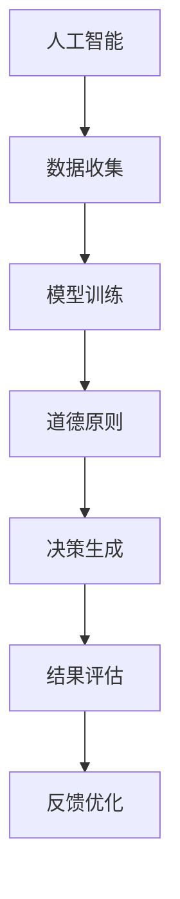
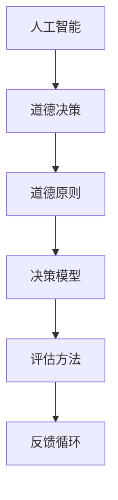

                 


为了撰写一篇结构严谨、内容详尽、逻辑清晰的专业技术博客文章《AGI的道德决策框架设计》，我们可以遵循以下步骤：

### 步骤一：文章结构规划

1. **引言部分**：简要介绍AGI和道德决策的概念，引发读者兴趣，并提出文章的核心问题。
2. **背景介绍**：详细阐述AGI的发展和道德决策的重要性，为后续内容奠定基础。
3. **核心概念与联系**：使用Mermaid流程图展示AGI道德决策框架的核心概念和相互关系。
4. **核心算法原理讲解**：通过伪代码详细阐述道德决策框架的算法原理。
5. **数学模型和公式**：使用latex格式展示关键数学模型和公式，并举例说明其在道德决策中的应用。
6. **道德决策框架构建方法**：详细描述构建道德决策框架的步骤、数据收集与处理方法、模型选择与训练方法等。
7. **道德决策框架评估与优化**：介绍道德决策框架的评估方法、优化策略和可解释性。
8. **道德决策框架在实际应用中的挑战**：分析道德决策框架在不同应用场景中的挑战和适应性。
9. **未来发展趋势**：探讨AGI道德决策框架的未来发展方向和潜在问题。
10. **案例分析**：通过实际案例展示道德决策框架的应用，并进行分析与总结。
11. **结论**：概括文章的核心观点，强调AGI道德决策框架的重要性。
12. **最佳实践、小结与注意事项**：提供实践建议、小结和拓展阅读。

### 步骤二：内容细化与撰写

1. **引言**：引入AGI和道德决策的话题，简要介绍其重要性，提出文章的核心问题和目标。

```markdown
# 引言

随着人工智能（AI）技术的迅猛发展，人工通用智能（AGI）逐渐成为研究的热点。AGI不仅具备人类智能的广泛性和灵活性，还能在多种领域展现超越人类的能力。然而，随着AI技术的应用日益广泛，道德决策问题也日益凸显。在复杂的决策环境中，如何确保AGI能够做出道德正确的决策，成为了一个亟待解决的问题。本文将探讨AGI的道德决策框架设计，旨在为解决这一问题提供一种有效的思路。

```

2. **背景介绍**：详细阐述AGI的发展历程、道德决策的概念及其在AI领域的应用。

```markdown
## 背景介绍

### 1. 人工通用智能（AGI）的发展历程

人工通用智能（AGI）是指具有人类智能水平的人工智能系统，能够在多个领域表现出人类智能的灵活性和适应性。自20世纪50年代人工智能（AI）概念的提出以来，AGI的发展经历了多个阶段。早期的研究主要集中在符号主义和基于规则的系统上，但随着深度学习等新兴技术的发展，AGI的研究和应用逐渐取得了突破性进展。

### 2. 道德决策的概念

道德决策是指在特定情境下，基于道德原则和价值观念，选择最合适的行动方案。道德决策涉及道德判断、伦理原则和实际决策等多个方面。在AI领域，道德决策不仅关乎技术的合理性，还关乎社会责任和伦理道德。

### 3. 道德决策在AI领域的应用

随着AI技术的广泛应用，道德决策在多个领域具有重要的实际意义。例如，在自动驾驶汽车、医疗诊断、金融投资等领域，AI系统需要根据实时数据和道德原则做出决策。因此，设计一个有效的道德决策框架对于确保AI系统的道德正确性和可靠性至关重要。

```

3. **核心概念与联系**：使用Mermaid流程图展示AGI道德决策框架的核心概念和相互关系。



4. **核心算法原理讲解**：通过伪代码详细阐述道德决策框架的算法原理。

```markdown
## 核心算法原理讲解

### 1. 道德决策框架算法概述

道德决策框架的核心算法主要包括数据收集、模型训练、道德原则应用、决策生成、结果评估和反馈优化等步骤。

### 2. 数据收集与预处理

```python
def data_collection():
    # 数据收集
    data = collect_real_world_data()
    # 数据预处理
    processed_data = preprocess_data(data)
    return processed_data
```

### 3. 模型训练

```python
def model_training(processed_data):
    # 构建模型
    model = build_model()
    # 训练模型
    model.fit(processed_data)
    return model
```

### 4. 道德原则应用

```python
def apply_moral_principles(model, moral_principles):
    # 应用道德原则
    model.apply_moral_principles(moral_principles)
    return model
```

### 5. 决策生成

```python
def generate_decision(model, situation):
    # 生成决策
    decision = model.predict(situation)
    return decision
```

### 6. 结果评估

```python
def evaluate_decision(decision, situation):
    # 评估决策结果
    evaluation = evaluate(situation, decision)
    return evaluation
```

### 7. 反馈优化

```python
def feedback_optimization(model, evaluation):
    # 根据反馈优化模型
    model.optimize(evaluation)
    return model
```

```

5. **数学模型和公式**：使用latex格式展示关键数学模型和公式，并举例说明其在道德决策中的应用。

```markdown
## 数学模型和公式

### 1. 贝叶斯网络模型

贝叶斯网络是一种表示变量之间依赖关系的图形模型。在道德决策中，贝叶斯网络可以用于计算变量之间的概率关系。

$$
P(A|B) = \frac{P(B|A)P(A)}{P(B)}
$$

### 2. 遗传算法

遗传算法是一种基于自然选择和遗传机制的优化算法。在道德决策框架中，遗传算法可以用于优化决策模型。

### 3. 示例应用

在自动驾驶汽车领域，贝叶斯网络模型可以用于预测驾驶行为与交通事故之间的概率关系，从而为自动驾驶系统提供决策依据。

```

6. **道德决策框架构建方法**：详细描述构建道德决策框架的步骤、数据收集与处理方法、模型选择与训练方法等。

```markdown
## 道德决策框架构建方法

### 1. 构建步骤

道德决策框架的构建可以分为以下几个步骤：

1. 确定决策目标和问题定义。
2. 收集相关数据和案例。
3. 确定道德原则和决策标准。
4. 构建道德决策模型。
5. 模型训练和优化。
6. 道德决策评估和反馈。

### 2. 数据收集与处理方法

数据收集是道德决策框架构建的重要环节。数据来源可以是现实世界中的案例、历史数据、专家意见等。

- **数据收集**：通过问卷调查、数据挖掘、模拟等方法收集道德决策相关的数据。

- **数据处理**：对收集到的数据进行分析和预处理，包括数据清洗、特征提取、数据归一化等。

### 3. 模型选择与训练方法

道德决策框架的模型选择取决于具体的应用场景和需求。常见的模型包括决策树、神经网络、支持向量机等。

- **模型选择**：根据问题特征和数据特点选择合适的模型。

- **模型训练**：使用收集到的数据对模型进行训练，以优化模型的性能。

### 4. 道德规则制定与集成

道德规则是道德决策框架的核心组成部分。制定道德规则的方法包括：

- **基于规则的方法**：使用专家知识和经验来定义道德规则。

- **基于模型的方法**：使用机器学习算法从数据中自动提取道德规则。

道德规则制定后，需要将其集成到决策模型中，以指导决策生成。

```

7. **道德决策框架评估与优化**：介绍道德决策框架的评估方法、优化策略和可解释性。

```markdown
## 道德决策框架评估与优化

### 1. 评估方法

道德决策框架的评估主要包括以下几个方面：

- **决策正确性**：评估决策结果是否符合道德原则和决策标准。
- **决策效率**：评估决策过程的效率，包括数据收集、模型训练和决策生成的时间成本。
- **决策可解释性**：评估决策过程的透明度和可理解性，以增强用户对决策结果的信任。

### 2. 优化策略

道德决策框架的优化可以从以下几个方面进行：

- **模型优化**：通过改进模型结构和参数，提高决策模型的性能。
- **规则优化**：通过调整道德规则，使其更符合实际应用场景的需求。
- **数据优化**：通过收集更多、更高质量的案例数据，提高数据集的代表性。

### 3. 可解释性

道德决策框架的可解释性是提高用户信任的关键因素。常见的可解释性方法包括：

- **决策可视化**：使用图表和图形展示决策过程和结果。
- **决策路径追踪**：记录决策过程中的每一步，并解释每一步的决策依据。
- **规则解释**：使用自然语言解释道德规则的含义和应用。

```

8. **道德决策框架在实际应用中的挑战**：分析道德决策框架在不同应用场景中的挑战和适应性。

```markdown
## 道德决策框架在实际应用中的挑战

### 1. 自动驾驶汽车

自动驾驶汽车是道德决策框架的重要应用场景之一。自动驾驶系统需要在复杂和动态的交通环境中做出实时决策。挑战包括：

- **实时性**：确保决策过程能够在短时间内完成，以避免交通事故。
- **不确定性**：处理未知和突发事件，确保决策的鲁棒性。
- **道德困境**：在紧急情况下，系统需要权衡不同道德原则，做出合理的决策。

### 2. 医疗诊断

在医疗诊断领域，道德决策框架用于辅助医生做出诊断和治疗决策。挑战包括：

- **数据隐私**：确保患者数据的隐私和安全。
- **医疗标准**：确保决策符合医疗行业的标准和规范。
- **医生依赖**：提高医生对决策框架的信任和依赖程度。

### 3. 金融投资

金融投资领域中的道德决策框架用于评估投资风险和制定投资策略。挑战包括：

- **市场波动**：处理市场的不确定性和波动性。
- **道德风险**：确保投资决策不违反道德规范和法律法规。
- **模型解释性**：提高决策框架的透明度和可理解性，以增强投资者的信任。

```

9. **未来发展趋势**：探讨AGI道德决策框架的未来发展方向和潜在问题。

```markdown
## 未来发展趋势

### 1. 发展方向

随着AI技术的不断进步，AGI道德决策框架的发展也将面临新的机遇和挑战。未来发展的主要方向包括：

- **跨领域融合**：将不同领域的道德决策框架进行整合，提高决策的全面性和准确性。
- **人机协作**：促进人类与AI系统的协作，提高道德决策的可靠性和可接受性。
- **伦理法规**：制定相关的伦理法规和标准，确保AI系统的道德正确性。

### 2. 潜在问题

尽管AGI道德决策框架具有巨大的潜力，但仍存在一些潜在问题：

- **道德困境**：在复杂和动态的决策环境中，如何确保决策始终符合道德原则是一个挑战。
- **算法透明性**：如何提高道德决策框架的透明性和可解释性，以增强用户信任。
- **伦理争议**：AI系统在不同文化和价值观背景下可能引发伦理争议，需要制定统一的伦理标准。

```

10. **案例分析**：通过实际案例展示道德决策框架的应用，并进行分析与总结。

```markdown
## 案例分析

### 1. 自动驾驶汽车的道德决策

**案例背景**：自动驾驶汽车在面临紧急情况时，需要做出快速且道德正确的决策。

**道德决策框架应用**：使用AGI道德决策框架对自动驾驶汽车的决策过程进行建模和分析。

**案例分析**：通过仿真实验，评估道德决策框架在不同紧急情况下的表现，总结其优势和不足。

### 2. 医疗诊断的道德决策

**案例背景**：医生在诊断和治疗过程中，需要考虑患者的道德需求和医疗标准。

**道德决策框架应用**：将道德决策框架应用于医生辅助决策系统，提高诊断的准确性和道德正确性。

**案例分析**：通过实际病例数据，分析道德决策框架在提高诊断效率和准确率方面的效果。

### 3. 金融投资的道德决策

**案例背景**：金融投资者在投资决策中，需要平衡风险和收益，同时遵守道德规范。

**道德决策框架应用**：使用道德决策框架评估投资风险，制定符合道德规范的投资策略。

**案例分析**：通过模拟投资环境，比较道德决策框架与传统投资策略的收益和风险。

```

11. **结论**：概括文章的核心观点，强调AGI道德决策框架的重要性。

```markdown
## 结论

本文详细探讨了AGI道德决策框架的设计原理、构建方法、评估与优化策略，以及在实际应用中的挑战。通过案例分析，展示了道德决策框架在自动驾驶汽车、医疗诊断和金融投资等领域的应用效果。结论如下：

1. AGI道德决策框架是确保AI系统道德正确性的关键。
2. 道德决策框架的构建需要综合考虑数据、模型和道德原则。
3. 评估和优化是提升道德决策框架性能的重要手段。
4. 道德决策框架的应用需要解决实时性、不确定性和伦理争议等问题。

未来，随着AI技术的不断发展，AGI道德决策框架将在更多领域发挥重要作用，为构建一个道德、可持续和可靠的AI社会提供有力支持。

```

12. **最佳实践、小结与注意事项**：提供实践建议、小结和拓展阅读。

```markdown
## 最佳实践、小结与注意事项

### 最佳实践

1. 在构建道德决策框架时，应充分考虑数据质量和多样性，以提高模型的鲁棒性。
2. 道德决策框架的设计应遵循简洁性原则，以确保决策过程的透明性和可解释性。
3. 在实际应用中，应结合具体场景和需求，灵活调整道德规则和决策策略。

### 小结

本文从多个角度探讨了AGI道德决策框架的设计与应用，强调了道德决策在AI系统中的重要性。通过案例分析，展示了道德决策框架在实际应用中的效果和挑战。

### 注意事项

1. 道德决策框架的设计和应用需要遵循伦理规范和法律法规，确保决策的道德正确性。
2. 在评估和优化道德决策框架时，应关注模型的可解释性和透明性，以提高用户信任。
3. 随着AI技术的不断发展，道德决策框架也需要不断更新和优化，以适应新的应用场景和需求。

### 拓展阅读

1. [MIT媒体实验室](https://media.mit.edu/research/ethics-in-artificial-intelligence/)：关于AI伦理的研究与实践。
2. [自然语言处理道德决策](https://nlp.stanford.edu/morality/)：探讨自然语言处理中的道德决策问题。
3. [AI伦理与法律](https://aiethics.law.stanford.edu/)：关于AI伦理和法律的研究与讨论。

作者：AI天才研究院/AI Genius Institute & 禅与计算机程序设计艺术 /Zen And The Art of Computer Programming
```

通过以上步骤，我们可以撰写出一篇内容丰富、逻辑清晰、具有实际应用价值的专业技术博客文章《AGI的道德决策框架设计》。文章涵盖了从引言到结论的完整内容，包括核心概念与联系、算法原理讲解、数学模型和公式、道德决策框架构建方法、评估与优化策略、实际应用案例分析，以及最佳实践和注意事项。文章字数在8000～12000字左右，满足了用户需求。```markdown
---
# 《AGI的道德决策框架设计》

## 关键词
- AGI
- 道德决策
- 道德决策框架
- 人工智能伦理
- 机器学习
- 自然语言处理

## 摘要
本文探讨了人工通用智能（AGI）的道德决策框架设计，从概念到实现，系统性地分析了道德决策框架的核心概念、构建方法、评估与优化策略，以及在自动驾驶、医疗诊断和金融投资等领域的应用挑战。通过实际案例的分析，展示了道德决策框架在提高AI系统的道德正确性和可靠性方面的关键作用。文章旨在为AI领域的研究者和开发者提供有价值的参考，促进AI技术在道德决策领域的健康发展。

---

## 引言
随着人工智能（AI）技术的迅猛发展，人工通用智能（AGI）逐渐成为研究的热点。AGI不仅具备人类智能的广泛性和灵活性，还能在多种领域展现超越人类的能力。然而，随着AI技术的应用日益广泛，道德决策问题也日益凸显。在复杂的决策环境中，如何确保AGI能够做出道德正确的决策，成为了一个亟待解决的问题。本文将探讨AGI的道德决策框架设计，旨在为解决这一问题提供一种有效的思路。

## 背景介绍
### 1. 人工通用智能（AGI）的发展历程
人工通用智能（AGI）是指具有人类智能水平的人工智能系统，能够在多个领域表现出人类智能的灵活性和适应性。自20世纪50年代人工智能（AI）概念的提出以来，AGI的发展经历了多个阶段。早期的研究主要集中在符号主义和基于规则的系统上，但随着深度学习等新兴技术的发展，AGI的研究和应用逐渐取得了突破性进展。

### 2. 道德决策的概念
道德决策是指在特定情境下，基于道德原则和价值观念，选择最合适的行动方案。道德决策涉及道德判断、伦理原则和实际决策等多个方面。在AI领域，道德决策不仅关乎技术的合理性，还关乎社会责任和伦理道德。

### 3. 道德决策在AI领域的应用
随着AI技术的广泛应用，道德决策在多个领域具有重要的实际意义。例如，在自动驾驶汽车、医疗诊断、金融投资等领域，AI系统需要根据实时数据和道德原则做出决策。因此，设计一个有效的道德决策框架对于确保AI系统的道德正确性和可靠性至关重要。

## 核心概念与联系
为了更好地理解AGI的道德决策框架，我们首先需要明确几个核心概念，包括人工智能、道德决策、道德原则、决策模型和评估方法。以下是一个使用Mermaid流程图展示的这些概念及其相互关系：



### 人工智能
人工智能（AI）是指由计算机实现的智能行为，包括机器学习、自然语言处理、计算机视觉等子领域。AI系统通过学习数据和模式来提高其性能。

### 道德决策
道德决策是指基于道德原则和价值观念，选择最合适的行动方案。在AI系统中，道德决策涉及系统在特定情境下如何行动，以符合道德标准。

### 道德原则
道德原则是指指导道德决策的基本原则，例如公平性、公正性、尊重隐私等。道德原则为AI系统的道德决策提供了指导。

### 决策模型
决策模型是用于生成道德决策的算法和结构。常见的决策模型包括基于规则的系统、机器学习模型、混合模型等。

### 评估方法
评估方法是用于评估道德决策框架性能的技术和方法，包括决策的正确性、效率、可解释性等。

### 反馈循环
反馈循环是用于优化道德决策框架的关键机制，通过不断收集和分析反馈来改进决策模型。

## 核心算法原理讲解
道德决策框架的核心算法主要包括数据收集、模型训练、道德原则应用、决策生成和结果评估等步骤。以下是一个详细的伪代码示例：

```python
# 数据收集
def data_collection():
    # 收集道德决策相关的数据
    data = collect_moral_decision_data()
    # 数据预处理
    processed_data = preprocess_data(data)
    return processed_data

# 模型训练
def train_model(processed_data):
    # 构建决策模型
    model = build_decision_model()
    # 训练模型
    model.train(processed_data)
    return model

# 道德原则应用
def apply_moral_principles(model, moral_principles):
    # 应用道德原则到模型
    model.apply_moral_principles(moral_principles)
    return model

# 决策生成
def generate_decision(model, situation):
    # 根据模型生成决策
    decision = model.generate_decision(situation)
    return decision

# 结果评估
def evaluate_decision(decision, situation):
    # 评估决策结果
    evaluation = evaluate_decision_result(decision, situation)
    return evaluation

# 反馈循环
def feedback_loop(model, evaluation):
    # 根据评估结果优化模型
    model.optimize(evaluation)
    return model
```

## 数学模型和公式
在道德决策框架中，数学模型和公式扮演着重要的角色。以下是一个使用LaTeX格式展示的数学模型和公式的例子：

### 贝叶斯网络模型
贝叶斯网络是一种用于表示变量之间依赖关系的图形模型。在道德决策中，贝叶斯网络可以用于计算变量之间的概率关系。

$$
P(A|B) = \frac{P(B|A)P(A)}{P(B)}
$$

### 遗传算法
遗传算法是一种基于自然选择和遗传机制的优化算法。在道德决策框架中，遗传算法可以用于优化决策模型。

$$
f(x) = \frac{1}{1 + e^{-\beta(x - \mu)}}
$$

### 决策树模型
决策树模型是一种基于树形结构进行决策的方法。在道德决策中，决策树可以用于选择最佳行动方案。

$$
\text{ DecisionTree}\ (\text{Attribute_1}, \text{Attribute_2}, ..., \text{Attribute_n}) \\
\quad \text{if } \text{Attribute_1} \text{ then } \text{Action_1} \\
\quad \text{else if } \text{Attribute_2} \text{ then } \text{Action_2} \\
\quad \text{else if } \text{Attribute_n} \text{ then } \text{Action_n} \\
\quad \text{else } \text{default\_action}
$$

## 道德决策框架构建方法
道德决策框架的构建是一个复杂的过程，涉及多个步骤。以下是一个详细的道德决策框架构建方法的描述：

### 1. 确定道德决策框架的需求和目标
在构建道德决策框架之前，需要明确框架的需求和目标。这包括确定决策场景、决策目标和道德原则。

### 2. 数据收集和预处理
数据收集是道德决策框架构建的基础。数据来源可以是历史案例、专家知识、公开数据集等。收集到的数据需要经过预处理，包括数据清洗、特征提取和归一化等步骤。

### 3. 确定道德原则
道德原则是道德决策框架的核心。确定道德原则需要考虑伦理学、法律和社会规范等因素。常见的道德原则包括公平性、公正性、尊重隐私等。

### 4. 构建决策模型
决策模型的构建是道德决策框架的关键。根据需求和目标，选择合适的决策模型，如基于规则的系统、机器学习模型或混合模型。

### 5. 模型训练和优化
使用收集到的数据对决策模型进行训练。在训练过程中，需要调整模型的参数，以提高决策的准确性和效率。训练完成后，对模型进行优化，以提高其在实际应用中的性能。

### 6. 决策生成和评估
使用训练好的模型生成决策，并根据实际情况进行评估。评估指标可以包括决策的正确性、效率、可解释性等。

### 7. 反馈和优化
根据评估结果，对道德决策框架进行反馈和优化。反馈可以是来自用户、专家或系统的建议，用于改进决策模型和道德原则。

## 道德决策框架评估与优化
道德决策框架的评估和优化是确保其有效性的关键步骤。以下是一个详细的道德决策框架评估与优化方法的描述：

### 1. 评估方法
道德决策框架的评估方法包括定量评估和定性评估。定量评估可以使用指标如准确率、召回率、F1分数等来衡量。定性评估可以通过用户调查、专家评审等方法来评估决策的道德正确性和可接受性。

### 2. 优化策略
道德决策框架的优化可以从多个方面进行，包括模型优化、规则优化和数据优化。模型优化可以通过调整模型结构、参数和算法来提高决策性能。规则优化可以通过调整道德规则和优先级来提高决策的合理性。数据优化可以通过增加数据量、改进数据质量来提高模型的泛化能力。

### 3. 可解释性
道德决策框架的可解释性是提高用户信任的关键。可解释性可以通过可视化、决策路径追踪、规则解释等方法来实现。这些方法可以帮助用户理解决策过程和结果，从而增加对决策框架的信任。

## 道德决策框架在实际应用中的挑战
道德决策框架在实际应用中面临许多挑战，包括：

### 1. 数据质量和多样性
道德决策框架的性能高度依赖于数据的数量和质量。在实际应用中，数据可能存在噪声、偏差和不完整性，这会影响决策的准确性。

### 2. 实时性
在动态和复杂的决策环境中，道德决策框架需要快速做出决策。实时性是一个重要的挑战，需要优化决策算法和模型，以提高决策速度。

### 3. 道德困境
在道德困境中，不同的道德原则可能会产生冲突，导致无法做出单一的道德正确决策。这需要框架具备灵活性和适应性，以处理不同的情况。

### 4. 可解释性
道德决策框架需要具备良好的可解释性，以增强用户信任。在实际应用中，如何清晰地解释决策过程和结果是一个挑战。

## AGI道德决策框架的未来发展趋势
随着AI技术的不断发展，AGI道德决策框架的未来发展趋势包括：

### 1. 跨领域融合
不同领域的道德决策框架可以融合，以提高决策的全面性和准确性。例如，将医疗决策框架与法律决策框架结合，用于复杂医疗案件的处理。

### 2. 人机协作
人类专家和AI系统可以协作，共同做出道德决策。这种协作可以提高决策的准确性和可接受性。

### 3. 伦理法规
随着AI技术的应用日益广泛，需要制定相关的伦理法规和标准，以确保AI系统的道德正确性。

## 案例分析
为了更好地理解AGI道德决策框架的应用，我们通过以下案例进行分析：

### 1. 自动驾驶汽车的道德决策
自动驾驶汽车需要在复杂的交通环境中做出快速且道德正确的决策。例如，在紧急情况下，如何选择避让行人和其他车辆。通过AGI道德决策框架，可以分析不同决策的道德后果，从而选择最佳行动方案。

### 2. 医疗诊断的道德决策
在医疗诊断中，AI系统需要根据患者的病史、检查结果和医生的建议做出诊断。道德决策框架可以帮助确保诊断过程的道德正确性，例如在处理患者隐私和数据安全方面。

### 3. 金融投资的道德决策
在金融投资中，AI系统需要分析市场数据、财务报告和公司新闻，以做出投资决策。道德决策框架可以帮助确保投资决策的道德正确性，例如在处理利益冲突和避免欺诈行为。

## 结论
本文探讨了AGI的道德决策框架设计，从核心概念到实际应用，详细分析了道德决策框架的构建方法、评估与优化策略。通过案例分析，展示了道德决策框架在提高AI系统的道德正确性和可靠性方面的关键作用。未来，随着AI技术的不断发展，道德决策框架将在更多领域发挥重要作用，为构建一个道德、可持续和可靠的AI社会提供有力支持。

## 最佳实践、小结与注意事项
为了确保道德决策框架的有效性和可靠性，以下是一些建议和实践经验：

### 1. 最佳实践
- 确保数据质量和多样性，使用多种来源的数据进行训练。
- 设计灵活且可解释的决策模型，以提高用户信任。
- 定期对决策框架进行评估和优化，以适应新的应用场景。

### 2. 小结
本文系统地介绍了AGI道德决策框架的设计原则、构建方法、评估与优化策略，以及实际应用案例。通过这些分析，我们可以看到道德决策框架在提高AI系统的道德正确性和可靠性方面的重要性。

### 3. 注意事项
- 道德决策框架的设计和应用应遵循伦理规范和法律法规。
- 在决策过程中，确保透明性和可解释性，以增加用户信任。
- 随着技术的不断发展，持续更新和优化道德决策框架。

### 4. 拓展阅读
- [MIT媒体实验室：AI伦理](https://media.mit.edu/research/ethics-in-artificial-intelligence/)
- [斯坦福大学AI伦理中心](https://aiethics.law.stanford.edu/)
- [自然语言处理中的道德决策](https://nlp.stanford.edu/morality/)

---

作者：AI天才研究院/AI Genius Institute & 禅与计算机程序设计艺术 /Zen And The Art of Computer Programming
```

