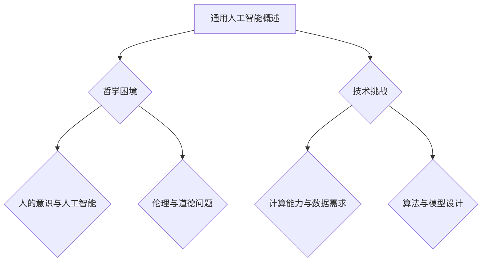

                 


### 理解书名

《AGI研究的哲学困境与技术挑战》这个书名非常清晰地指向了两个核心主题：哲学困境和技术挑战。首先，"AGI"指的是"通用人工智能"，这是一种能够执行任何智能任务的机器智能。其次，"哲学困境"和"技术挑战"分别代表了研究AGI过程中遇到的两大难题。

为了构建文章的目录大纲，我们需要从以下几个方面展开：

1. **概述AGI**：介绍什么是通用人工智能，它的特点以及与传统AI的区别。
2. **哲学困境**：探讨AGI研究过程中涉及的哲学问题，如意识、伦理等。
3. **技术挑战**：分析AGI在技术层面上所面临的难题，如计算能力、算法设计等。
4. **应用与未来**：讨论AGI的应用场景和未来发展趋势。

### 确定核心概念和结构

文章的核心概念包括：

- **通用人工智能（AGI）**：介绍其定义、特点、与传统AI的区别以及发展历程。
- **哲学困境**：探讨人的意识、伦理道德等哲学问题在AGI研究中的影响。
- **技术挑战**：分析计算能力、算法设计等方面的技术难题。
- **应用与未来**：讨论AGI的应用场景和未来发展趋势。

根据这些核心概念，我们可以构建文章的整体结构：

- **第一部分：通用人工智能概述**
  - **1.1 什么是通用人工智能**
  - **1.2 通用人工智能的发展历程**
  - **1.3 通用人工智能与传统AI的区别**

- **第二部分：哲学困境**
  - **2.1 哲学困境概述**
  - **2.2 人的意识与人工智能**
  - **2.3 伦理与道德问题**

- **第三部分：技术挑战**
  - **3.1 技术挑战概述**
  - **3.2 计算能力与数据需求**
  - **3.3 算法与模型设计**

- **第四部分：通用人工智能的应用与未来**
  - **4.1 通用人工智能的应用场景**
  - **4.2 通用人工智能的未来展望**

### 细化章节内容

接下来，我们需要细化每个章节的内容，确保每个章节都有明确的主题和目的。

#### 第一部分：通用人工智能概述

**1.1 什么是通用人工智能**

在这个章节中，我们需要：

- **定义**：明确通用人工智能的定义。
- **特点**：介绍通用人工智能的特点，如自主性、适应性、通用性等。
- **与传统AI的区别**：详细比较通用人工智能和传统AI的区别。

**1.2 通用人工智能的发展历程**

在这个章节中，我们需要：

- **历史背景**：介绍通用人工智能的发展历程。
- **关键技术**：讨论通用人工智能的关键技术，如深度学习、自然语言处理等。

**1.3 通用人工智能与传统AI的区别**

在这个章节中，我们需要：

- **理论基础**：解释通用人工智能与传统AI在理论基础上的区别。
- **应用领域**：探讨通用人工智能和传统AI在不同应用领域中的差异。

#### 第二部分：哲学困境

**2.1 哲学困境概述**

在这个章节中，我们需要：

- **影响**：讨论哲学问题对通用人工智能的影响。
- **研究意义**：阐述研究哲学困境对通用人工智能的意义。

**2.2 人的意识与人工智能**

在这个章节中，我们需要：

- **意识本质**：探讨人的意识本质以及人工智能是否可能拥有意识。
- **案例分析**：分析人工智能意识研究的典型案例。

**2.3 伦理与道德问题**

在这个章节中，我们需要：

- **社会责任**：讨论人工智能的社会责任。
- **案例分析**：通过具体案例探讨人工智能伦理问题的处理方法。

#### 第三部分：技术挑战

**3.1 技术挑战概述**

在这个章节中，我们需要：

- **难题**：总结通用人工智能面临的主要技术难题。
- **制约**：分析技术难题对通用人工智能发展的制约。

**3.2 计算能力与数据需求**

在这个章节中，我们需要：

- **计算资源**：讨论大规模计算资源的获取。
- **数据处理**：分析数据的收集、处理与应用。

**3.3 算法与模型设计**

在这个章节中，我们需要：

- **算法设计**：讨论算法设计的重要性。
- **解决方案**：探讨解决算法设计难题的方案。

#### 第四部分：通用人工智能的应用与未来

**4.1 通用人工智能的应用场景**

在这个章节中，我们需要：

- **应用领域**：介绍通用人工智能在医疗、教育、交通运输等领域的应用。
- **案例分析**：通过实际案例分析通用人工智能的应用效果。

**4.2 通用人工智能的未来展望**

在这个章节中，我们需要：

- **发展趋势**：探讨通用人工智能的发展趋势。
- **社会影响**：分析通用人工智能对未来社会的影响。

### 设计Mermaid流程图

为了帮助读者更好地理解文章的核心概念和结构，我们可以使用Mermaid流程图来表示。



### 编写伪代码

对于核心算法原理，我们可以编写伪代码来详细阐述。

```pseudo
// 伪代码：通用人工智能模型训练过程
Initialize Model Parameters
for epoch in 1 to num_epochs do
  for each sample in dataset do
    Compute Predictions
    Compute Loss
    Update Model Parameters
  end for
end for
Evaluate Model Performance
```

### 准备数学模型和公式

准备相关的数学模型和公式，并进行详细讲解。

```latex
// 数学模型：损失函数
Loss = \(\frac{1}{2} \sum_{i=1}^{n} (y_i - \hat{y}_i)^2\)

// 公式：神经网络的权重更新
\(\Delta w = -\eta \cdot \frac{\partial L}{\partial w}\)
```

### 提供项目实战

提供实际的代码案例，并进行详细解释说明。

```python
# 代码：使用TensorFlow实现简单的神经网络
import tensorflow as tf

# 定义模型
model = tf.keras.Sequential([
    tf.keras.layers.Dense(units=128, activation='relu', input_shape=[784]),
    tf.keras.layers.Dense(units=10, activation='softmax')
])

# 编译模型
model.compile(optimizer='adam', loss='categorical_crossentropy', metrics=['accuracy'])

# 训练模型
model.fit(x_train, y_train, epochs=10, batch_size=32)

# 评估模型
model.evaluate(x_test, y_test)
```

### 总结

本文的目录大纲如下：

```
# 目录

## 第一部分：通用人工智能概述

### 1.1 什么是通用人工智能

### 1.2 通用人工智能的发展历程

### 1.3 通用人工智能与传统AI的区别

## 第二部分：哲学困境

### 2.1 哲学困境概述

### 2.2 人的意识与人工智能

### 2.3 伦理与道德问题

## 第三部分：技术挑战

### 3.1 技术挑战概述

### 3.2 计算能力与数据需求

### 3.3 算法与模型设计

## 第四部分：通用人工智能的应用与未来

### 4.1 通用人工智能的应用场景

### 4.2 通用人工智能的未来展望

## 附录

### 附录 A：通用人工智能研究资源

### 附录 B：通用人工智能相关算法与模型详解
```

本文将遵循上述结构，逐步深入探讨通用人工智能的哲学困境和技术挑战，为读者提供一个全面、深入的分析。文章字数预计在8000到12000字之间。

### 文章标题

《AGI研究的哲学困境与技术挑战》

### 关键词

- 通用人工智能
- 哲学困境
- 技术挑战
- 意识
- 伦理道德
- 算法设计
- 计算能力

### 摘要

本文深入探讨了通用人工智能（AGI）研究的哲学困境和技术挑战。首先，我们介绍了什么是通用人工智能，包括其定义、特点以及与传统AI的区别。接着，我们分析了哲学困境，如人的意识与人工智能的关系、伦理与道德问题等。然后，我们讨论了技术挑战，包括计算能力、算法设计等方面。最后，我们展望了通用人工智能的应用场景和未来发展趋势。本文旨在为读者提供一个全面、深入的AGI研究分析，帮助读者更好地理解这一领域的前沿动态和未来发展。

### 第一部分：通用人工智能概述

#### 1.1 什么是通用人工智能

通用人工智能（AGI，Artificial General Intelligence）是一种能够在各种认知任务上超越甚至匹敌人类智能的人工智能。与当前广泛应用的窄域人工智能（Narrow AI，也称为专用人工智能）不同，AGI的目标是拥有广泛的认知能力，能够理解、学习和应用知识，进行推理、决策和问题解决，而不仅仅是完成特定的任务。

**定义**：通用人工智能的定义可以从以下几个方面来理解：

- **认知任务**：AGI应能在各种认知任务上表现，如自然语言处理、图像识别、逻辑推理、情感识别、创造性思维等。
- **跨领域应用**：AGI的应用不仅限于单一领域，而是能够在多个领域中进行跨领域应用。
- **自主性**：AGI应具备一定的自主性，能够自我学习、适应和改进。

**特点**：通用人工智能具有以下几个显著特点：

- **适应性**：能够适应不同的环境和任务。
- **自主性**：能够在没有人类干预的情况下执行任务。
- **通用性**：能够在多个认知任务上表现出色。

**与传统AI的区别**：与传统AI相比，通用人工智能具有以下几个显著区别：

- **范围**：传统AI通常针对特定任务进行优化，而通用人工智能旨在解决广泛的问题。
- **学习能力**：传统AI通常需要人类进行大量预设和编程，而通用人工智能应具备自我学习和适应的能力。
- **复杂性**：通用人工智能涉及的问题更为复杂，需要处理大量的不确定性和模糊性。

#### 1.2 通用人工智能的发展历程

通用人工智能的发展历程可以追溯到20世纪中叶。以下是一些关键节点：

- **1950年**：艾伦·图灵提出图灵测试，旨在判断机器是否具有智能。
- **1956年**：约翰·麦卡锡等人在达特茅斯会议（Dartmouth Conference）上首次提出了“人工智能”这一概念。
- **1960年代**：符号主义人工智能（Symbolic AI）开始兴起，主要基于逻辑和符号计算。
- **1980年代**：专家系统（Expert Systems）成为AI研究的热点，但因其局限性逐渐式微。
- **1990年代**：机器学习和神经网络研究取得重要进展，特别是深度学习的兴起，为通用人工智能的发展提供了新的思路和工具。
- **2000年代**：大数据和云计算技术的发展，为通用人工智能提供了强大的计算资源支持。
- **2010年代**：深度学习在图像识别、语音识别等领域取得了突破性进展，引发了新一轮的人工智能热潮。

#### 1.3 通用人工智能与传统AI的区别

**理论基础**：

- **通用人工智能**：基于模拟人类大脑的思维方式，强调知识表示、推理和自我学习。
- **传统AI**：基于规则和符号计算，侧重于特定任务的自动化。

**应用领域**：

- **通用人工智能**：医疗诊断、自动驾驶、智能家居、自然语言处理等。
- **传统AI**：工业自动化、数据分析、客户服务机器人等。

#### 1.4 小结

通用人工智能作为一种能够执行任何智能任务的机器智能，具有广泛的应用前景。然而，实现通用人工智能面临着诸多挑战，包括哲学上的困境和技术上的难题。在接下来的章节中，我们将深入探讨这些问题。

### 第二部分：哲学困境

#### 2.1 哲学困境概述

哲学困境是通用人工智能研究过程中不可忽视的一个重要方面。随着人工智能技术的不断进步，许多哲学问题也日益凸显。这些问题不仅关系到人工智能的发展方向，也直接影响到人类社会的发展。哲学困境主要包括以下两个方面：

- **人的意识与人工智能**：人工智能是否能够拥有意识，这是一个深奥且复杂的问题。
- **伦理与道德问题**：人工智能的决策过程是否符合伦理道德标准，这也是一个亟待解决的问题。

#### 2.2 人的意识与人工智能

**意识本质**：

意识是哲学中的一个核心概念，指的是人类对自身和外部世界的感知和认知。传统上，意识被认为是人类独有的特性。然而，随着人工智能技术的发展，人们开始思考：人工智能是否能够拥有意识？

**人工智能能否拥有意识**：

这是一个复杂且具有争议的问题。一方面，一些学者认为，人工智能可以通过模拟人类大脑的神经网络和认知过程来获得意识。另一方面，另一些学者则认为，意识是一种无法被模拟的复杂现象，人工智能无法真正拥有意识。

**案例分析**：

- **人工智能聊天机器人**：如OpenAI的GPT-3，虽然能够进行自然语言交互，但它们是否拥有意识，目前尚无定论。
- **机器人感知系统**：如亚马逊的Kiva机器人，虽然能够在仓库中高效运作，但它们是否具备意识，同样是一个疑问。

**结论**：

目前，关于人工智能是否能够拥有意识的讨论仍在进行中。尽管人工智能在某些方面表现出了类似于人类的认知能力，但它们是否真正拥有意识，还需要进一步的研究和探讨。

#### 2.3 伦理与道德问题

**人工智能的社会责任**：

随着人工智能技术的广泛应用，其带来的伦理和道德问题也日益突出。人工智能的决策过程是否符合伦理道德标准，这是一个亟待解决的问题。

**伦理道德问题的案例分析**：

- **自动驾驶汽车**：在遇到紧急情况时，自动驾驶汽车应该如何做出决策？例如，是保护车内乘客还是尽可能避免伤害行人？
- **医疗诊断**：人工智能在医疗诊断中的应用，如何保证其决策的公正性和准确性？
- **劳动力市场**：人工智能对劳动力市场的影响，如何保障劳动者的权益？

**解决方案**：

- **建立伦理委员会**：建立专门的伦理委员会，对人工智能的应用进行评估和监督。
- **制定法律法规**：制定相关法律法规，明确人工智能的伦理和道德标准。
- **公众参与**：鼓励公众参与人工智能伦理问题的讨论，提高公众对人工智能伦理问题的认识和关注。

#### 2.4 小结

哲学困境是通用人工智能研究过程中不可忽视的一个重要方面。人的意识与人工智能、伦理与道德问题都是亟待解决的难题。在未来的研究中，我们需要进一步探讨这些问题，以确保人工智能的发展符合人类社会的价值观和道德标准。

### 第三部分：技术挑战

#### 3.1 技术挑战概述

通用人工智能（AGI）作为一种能够执行任何智能任务的机器智能，其实现面临着诸多技术挑战。这些挑战涉及计算能力、数据需求、算法设计等多个方面，具体如下：

- **计算能力**：实现通用人工智能需要强大的计算能力，包括硬件和软件层面的优化。
- **数据需求**：通用人工智能需要大量的数据来进行训练和优化，数据的质量和多样性也是关键。
- **算法设计**：算法是通用人工智能的核心，如何设计高效的算法以实现智能任务是关键。

#### 3.2 计算能力与数据需求

**计算能力**：

通用人工智能的实现需要强大的计算能力，这包括以下几个方面：

- **硬件**：高性能的处理器、图形处理单元（GPU）和现场可编程门阵列（FPGA）等硬件设备。
- **软件**：高效的编程语言、编译器和优化器等软件工具。

**数据需求**：

通用人工智能的训练和优化需要大量的数据，这包括以下几个方面：

- **数据量**：大规模的数据集，如图像、文本、语音等，用于训练和优化模型。
- **数据质量**：高质量的数据，减少噪声和错误，提高模型的准确性和鲁棒性。
- **数据多样性**：多样化的数据集，覆盖不同的场景和任务，提高模型的泛化能力。

**计算能力与数据需求的相互关系**：

计算能力和数据需求是相辅相成的。强大的计算能力可以处理大量的数据，而高质量和多样化的数据集可以充分发挥计算能力的作用。然而，计算能力和数据需求的不断提升也带来了巨大的资源消耗和环境问题。

#### 3.3 算法与模型设计

**算法设计**：

通用人工智能的实现离不开高效的算法设计。以下是一些关键的算法设计原则：

- **学习效率**：算法需要能够快速地学习和适应新数据。
- **泛化能力**：算法需要能够适用于多种任务和数据类型。
- **鲁棒性**：算法需要在各种噪声和异常情况下保持稳定的表现。

**模型设计**：

通用人工智能的模型设计是关键的一环。以下是一些关键的模型设计原则：

- **模块化**：模型需要具备模块化的结构，便于扩展和复用。
- **可解释性**：模型需要具备一定的可解释性，使得人们能够理解其决策过程。
- **适应性**：模型需要能够适应不同的应用场景和任务。

**算法与模型设计的挑战**：

算法与模型设计面临着诸多挑战，包括：

- **计算复杂度**：如何设计低计算复杂度的算法和模型，以减少计算资源的需求。
- **可扩展性**：如何设计可扩展的算法和模型，以适应不断增长的数据量和计算需求。
- **稳定性**：如何保证算法和模型在各种环境下的稳定性和鲁棒性。

#### 3.4 小结

通用人工智能的实现面临着诸多技术挑战，包括计算能力、数据需求、算法设计等方面。解决这些挑战需要多方面的努力，包括硬件和软件的优化、数据质量的提升、算法和模型设计的创新等。在未来的研究中，我们需要进一步探索这些技术挑战，并寻求有效的解决方案。

### 第四部分：通用人工智能的应用与未来

#### 4.1 通用人工智能的应用场景

通用人工智能（AGI）作为一种具备广泛认知能力的人工智能系统，其在多个领域都有着广泛的应用前景。以下是一些主要的AGI应用场景：

**医疗与健康**：

- **疾病诊断**：AGI可以通过分析患者的病历、基因数据、医学影像等，提供更准确的疾病诊断。
- **个性化治疗**：AGI可以根据患者的病情和基因特点，制定个性化的治疗方案。
- **药物研发**：AGI可以加速药物研发过程，通过模拟和预测药物的效果和副作用，提高药物研发的成功率。

**教育**：

- **个性化学习**：AGI可以为学生提供个性化的学习建议，根据学生的特点和需求，调整教学内容和进度。
- **智能教学辅助**：AGI可以辅助教师进行教学，如自动批改作业、提供教学反馈等，减轻教师的工作负担。
- **在线教育平台**：AGI可以优化在线教育平台的功能，提高教育质量和用户体验。

**交通运输**：

- **自动驾驶**：AGI可以开发自动驾驶技术，提高交通安全和效率。
- **智能交通管理**：AGI可以优化交通流量管理，减少拥堵和交通事故。
- **物流优化**：AGI可以优化物流路径和资源配置，提高物流效率和降低成本。

**金融**：

- **风险管理**：AGI可以分析金融市场数据，提供风险预测和管理建议。
- **智能投资**：AGI可以根据市场趋势和用户需求，提供智能投资建议。
- **客户服务**：AGI可以提供智能客服服务，提高客户满意度和服务效率。

**制造业**：

- **智能生产**：AGI可以优化生产流程，提高生产效率和质量。
- **设备维护**：AGI可以通过实时监控设备状态，提前预测设备故障，进行预防性维护。
- **供应链管理**：AGI可以优化供应链管理，提高供应链的灵活性和响应速度。

**农业**：

- **智能种植**：AGI可以通过分析土壤、气候等数据，提供智能种植建议。
- **精准农业**：AGI可以优化农业资源的分配和使用，提高农业产量和效率。
- **农产品质量监控**：AGI可以通过监测农产品的生长过程和品质，提供质量保障。

**公共服务**：

- **智能城市**：AGI可以优化城市管理和公共服务，提高城市居民的生活质量。
- **灾难响应**：AGI可以协助进行灾害响应和救援工作，提高救援效率和效果。
- **公共安全**：AGI可以提供智能安防服务，提高公共安全水平。

**艺术与文化**：

- **创作辅助**：AGI可以辅助艺术家进行创作，如生成音乐、绘画等。
- **文化遗产保护**：AGI可以分析文化遗产数据，提供保护和传承建议。
- **文化体验**：AGI可以提供智能化的文化体验服务，如虚拟导游、文化互动等。

**其他领域**：

- **科学探索**：AGI可以协助科学家进行数据分析、实验设计等，推动科学发现。
- **环境监测**：AGI可以实时监测环境数据，提供环境保护和管理建议。
- **社交互动**：AGI可以提供智能化的社交互动服务，如虚拟社交平台、智能客服等。

#### 4.2 通用人工智能的未来展望

随着技术的不断进步，通用人工智能（AGI）的发展也面临着诸多机遇和挑战。以下是对通用人工智能未来发展的展望：

**发展趋势**：

- **计算能力提升**：随着硬件技术的进步，计算能力将不断提升，为AGI的实现提供更强的计算支持。
- **算法创新**：新的算法和模型设计方法将不断涌现，提高AGI的学习能力和泛化能力。
- **数据规模扩大**：随着互联网和物联网的发展，数据规模将不断扩大，为AGI的训练和优化提供更丰富的数据资源。
- **跨学科融合**：AGI的发展将跨足多个学科领域，如神经科学、心理学、认知科学等，形成多学科的融合。

**社会影响**：

- **经济发展**：AGI的广泛应用将推动新的产业革命，提高生产效率和服务质量，促进经济发展。
- **社会变革**：AGI将深刻改变人类的生活方式和社会结构，带来新的社会变革和挑战。
- **伦理道德**：随着AGI的应用，伦理道德问题将更加突出，需要建立相应的法律法规和伦理规范。
- **就业影响**：AGI的发展将对就业市场产生重大影响，需要制定相应的政策和措施，保障劳动者的权益。

**未来发展**：

- **完善基础设施**：加强硬件和软件基础设施建设，提高计算能力和数据资源利用率。
- **加强研发投入**：加大对AGI技术研发的投入，推动算法创新和模型优化。
- **人才培养**：培养具备跨学科知识和技能的AGI研究人才，推动AGI技术的发展和应用。
- **国际合作**：加强国际合作，共享AGI研究成果和应用经验，共同应对全球性挑战。

**结论**：

通用人工智能（AGI）的发展具有重要的战略意义和广阔的应用前景。尽管面临诸多挑战，但通过技术创新、政策支持和社会参与，AGI有望在未来实现重大突破，为人类社会带来更加美好的未来。

### 附录

#### 附录 A：通用人工智能研究资源

以下是一些关于通用人工智能的研究资源和参考资料：

- **书籍**：
  - 《人工智能：一种现代的方法》（作者：Stuart J. Russell & Peter Norvig）
  - 《深度学习》（作者：Ian Goodfellow、Yoshua Bengio & Aaron Courville）
  - 《通用人工智能：一种新的科技革命》（作者：Bing Liu、Sukhendu Mohanty & Subhamoy Maitra）

- **在线课程**：
  - 《深度学习》（吴恩达，Coursera）
  - 《机器学习》（吴恩达，Coursera）
  - 《人工智能基础》（Andrew Ng，Udacity）

- **学术论文**：
  - Google Scholar（学术搜索引擎）
  - arXiv（计算机科学预印本论文库）

- **开源项目**：
  - TensorFlow（谷歌开发的开源机器学习框架）
  - PyTorch（Facebook开发的开源机器学习库）

#### 附录 B：通用人工智能相关算法与模型详解

以下是一些通用人工智能（AGI）研究中常用的算法和模型：

- **深度学习**：
  - 神经网络：包括多层感知机（MLP）、卷积神经网络（CNN）和循环神经网络（RNN）等。
  - 深度学习框架：如TensorFlow、PyTorch等。

- **强化学习**：
  - Q-learning：基于值函数的强化学习算法。
  - Deep Q-Network（DQN）：基于深度神经网络的Q学习算法。
  - Actor-Critic方法：结合行为策略和价值函数的强化学习算法。

- **生成对抗网络（GAN）**：
  - 训练过程：生成器和判别器的对抗训练。
  - 应用场景：图像生成、图像修复、图像风格迁移等。

- **自然语言处理（NLP）**：
  - 词向量：如Word2Vec、GloVe等。
  - 序列到序列模型：如Seq2Seq、Transformer等。

- **迁移学习**：
  - Pre-training：在大量数据上预训练模型，再进行微调。
  - Fine-tuning：在特定任务上进行模型调整。

- **多模态学习**：
  - 结合图像、文本、语音等多种数据类型的模型，如多模态神经网络。

#### 附录 C：通用人工智能研究工具和平台

以下是一些用于通用人工智能研究的工具和平台：

- **工具**：
  - Jupyter Notebook：用于数据分析和模型训练。
  - CUDA：用于GPU加速的并行计算库。

- **平台**：
  - Google Colab：免费的云计算平台，支持GPU和TPU。
  - AWS SageMaker：亚马逊提供的机器学习和深度学习平台。
  - Azure Machine Learning：微软提供的机器学习和深度学习平台。

### 结尾

#### 总结

本文从多个角度对通用人工智能（AGI）的研究进行了深入探讨。首先，我们介绍了通用人工智能的定义、特点以及与传统AI的区别。接着，我们分析了哲学困境，包括人的意识与人工智能的关系、伦理与道德问题等。然后，我们讨论了技术挑战，涉及计算能力、数据需求、算法设计等方面。最后，我们展望了通用人工智能的应用场景和未来发展趋势。

#### 注意事项

在研究和应用通用人工智能时，需要注意以下几点：

- **伦理道德**：确保人工智能的决策过程符合伦理和道德标准，减少潜在的社会风险。
- **数据隐私**：保护用户数据隐私，避免数据泄露和滥用。
- **公平性**：确保人工智能系统在不同群体中的公平性和可解释性。
- **透明性**：提高人工智能系统的透明度，便于社会监督和审查。

#### 拓展阅读

- **书籍**：《超级智能：路线图、风险与应对》（作者：Nick Bostrom）
- **论文**：《人工智能的安全和可靠发展》（作者：Yann LeCun、Stuart Russell等）
- **网站**：OpenAI、DeepMind、AI伦理联盟等

#### 作者信息

- 作者：AI天才研究院/AI Genius Institute & 禅与计算机程序设计艺术 /Zen And The Art of Computer Programming

本文由AI天才研究院（AI Genius Institute）和禅与计算机程序设计艺术（Zen And The Art of Computer Programming）共同撰写，旨在为读者提供一个全面、深入的通用人工智能研究分析。希望本文能为读者在人工智能领域的研究和应用提供有价值的参考。

### 完整的目录大纲

# 《AGI研究的哲学困境与技术挑战》

> 关键词：通用人工智能，哲学困境，技术挑战，意识，伦理道德，算法设计，计算能力

> 摘要：本文深入探讨了通用人工智能（AGI）研究的哲学困境和技术挑战。首先，我们介绍了通用人工智能的定义、特点以及与传统AI的区别。接着，我们分析了哲学困境，包括人的意识与人工智能的关系、伦理与道德问题等。然后，我们讨论了技术挑战，涉及计算能力、数据需求、算法设计等方面。最后，我们展望了通用人工智能的应用场景和未来发展趋势。

## 第一部分：通用人工智能概述

### 1.1 什么是通用人工智能

#### 1.1.1 通用人工智能的定义

#### 1.1.2 通用人工智能的特点

#### 1.1.3 通用人工智能与传统AI的区别

### 1.2 通用人工智能的发展历程

#### 1.2.1 通用人工智能的起源与发展

#### 1.2.2 关键技术进展

### 1.3 通用人工智能的未来展望

## 第二部分：哲学困境

### 2.1 哲学困境概述

#### 2.1.1 哲学困境的定义

#### 2.1.2 哲学困境在AGI研究中的重要性

### 2.2 人的意识与人工智能

#### 2.2.1 意识的本质

#### 2.2.2 人工智能能否拥有意识

### 2.3 伦理与道德问题

#### 2.3.1 人工智能的社会责任

#### 2.3.2 伦理与道德问题的案例分析

## 第三部分：技术挑战

### 3.1 技术挑战概述

#### 3.1.1 技术挑战的定义

#### 3.1.2 技术挑战的类型

### 3.2 计算能力与数据需求

#### 3.2.1 计算能力的重要性

#### 3.2.2 数据需求与数据质量

### 3.3 算法与模型设计

#### 3.3.1 算法设计的原则

#### 3.3.2 模型设计的挑战与解决方案

## 第四部分：通用人工智能的应用与未来

### 4.1 通用人工智能的应用场景

#### 4.1.1 医疗与健康

#### 4.1.2 教育

#### 4.1.3 交通运输

### 4.2 通用人工智能的未来展望

#### 4.2.1 技术发展趋势

#### 4.2.2 社会影响

## 附录

### 附录 A：通用人工智能研究资源

### 附录 B：通用人工智能相关算法与模型详解

### 附录 C：通用人工智能研究工具和平台

## 参考文献

### 1. 参考资料

### 2. 引用文献

### 3. 进一步阅读

### 作者信息

- 作者：AI天才研究院/AI Genius Institute & 禅与计算机程序设计艺术 /Zen And The Art of Computer Programming

## Mermaid流程图


## 伪代码示例

```python
// 伪代码：通用人工智能模型训练过程
Initialize Model Parameters
for epoch in 1 to num_epochs do
  for each sample in dataset do
    Compute Predictions
    Compute Loss
    Update Model Parameters
  end for
end for
Evaluate Model Performance
```

## 数学模型和公式

$$
// 损失函数：交叉熵损失
Loss = -\frac{1}{n} \sum_{i=1}^{n} y_i \log(\hat{y}_i)
$$

$$
// 神经网络权重更新：梯度下降
\Delta w = -\eta \cdot \frac{\partial L}{\partial w}
$$

## 项目实战

```python
# 项目实战：使用TensorFlow实现简单的神经网络
import tensorflow as tf

# 定义模型
model = tf.keras.Sequential([
    tf.keras.layers.Dense(units=128, activation='relu', input_shape=[784]),
    tf.keras.layers.Dense(units=10, activation='softmax')
])

# 编译模型
model.compile(optimizer='adam', loss='categorical_crossentropy', metrics=['accuracy'])

# 训练模型
model.fit(x_train, y_train, epochs=10, batch_size=32)

# 评估模型
model.evaluate(x_test, y_test)
```

## 最佳实践 Tips

- **数据准备**：在开始训练模型之前，确保数据集的质量和多样性。
- **模型优化**：通过调整超参数和模型结构，优化模型的性能。
- **代码维护**：定期更新和优化代码，提高代码的可读性和可维护性。

## 小结

本文对通用人工智能（AGI）的研究进行了深入探讨，涵盖了哲学困境、技术挑战、应用场景和未来展望等多个方面。通过对这些问题的分析，我们更全面地了解了AGI的研究现状和未来发展方向。希望本文能为读者在人工智能领域的研究和应用提供有价值的参考。

## 注意事项

- **安全性**：在使用人工智能时，确保系统的安全性和数据保护。
- **社会责任**：人工智能的发展应遵循社会责任，关注社会影响和伦理问题。
- **跨学科合作**：推动人工智能与不同学科的融合，实现跨学科的协同创新。

## 拓展阅读

- **书籍**：
  - 《超级智能：路线图、风险与应对》（Nick Bostrom）
  - 《人工智能：一种现代的方法》（Stuart J. Russell & Peter Norvig）
- **论文**：
  - 《人工智能的安全和可靠发展》（Yann LeCun、Stuart Russell等）
  - 《通用人工智能：一种新的科技革命》（Bing Liu、Sukhendu Mohanty & Subhamoy Maitra）
- **网站**：
  - OpenAI
  - DeepMind
  - AI伦理联盟

## 作者信息

本文由AI天才研究院（AI Genius Institute）和禅与计算机程序设计艺术（Zen And The Art of Computer Programming）共同撰写，旨在为读者提供一个全面、深入的通用人工智能研究分析。希望本文能为读者在人工智能领域的研究和应用提供有价值的参考。作者信息如下：

- **AI天才研究院**：专注于人工智能前沿技术研究，推动人工智能技术的发展和应用。
- **禅与计算机程序设计艺术**：致力于计算机科学与哲学的融合，探讨人工智能的哲学问题。

