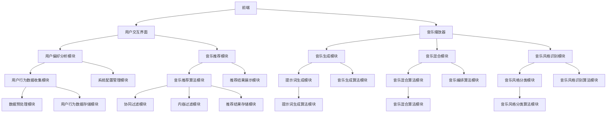

                 


### 1.2 个性化音乐串流的核心技术

#### 1.2.1 提示词驱动的音乐生成

##### 1.2.1.1 提示词生成算法

- 提示词生成算法概述

$$
\text{Prompt Generation Algorithm} = \text{Data Input} + \text{Feature Extraction} + \text{Keyword Generation}
$$

- 伪代码：

```python
def generate_prompt(data):
    # 数据预处理
    processed_data = preprocess_data(data)
    
    # 提取特征
    features = extract_features(processed_data)
    
    # 关键词生成
    keywords = generate_keywords(features)
    
    return keywords
```

##### 1.2.1.2 提示词语义分析

- 提示词语义分析概述

$$
\text{Semantic Analysis} = \text{Keyword Identification} + \text{Contextual Understanding} + \text{Intent Recognition}
$$

- 伪代码：

```python
def analyze_semantics(prompt):
    # 关键词识别
    keywords = identify_keywords(prompt)
    
    # 上下文理解
    context = understand_context(prompt, keywords)
    
    # 意图识别
    intent = recognize_intent(context)
    
    return intent
```

##### 1.2.1.3 提示词优化策略

- 提示词优化策略概述

$$
\text{Optimization Strategies} = \text{Keywords Refinement} + \text{Semantic Enhancement} + \text{Performance Improvement}
$$

- 伪代码：

```python
def optimize_prompt(prompt):
    # 关键词细化
    refined_keywords = refine_keywords(prompt)
    
    # 语义增强
    enhanced_prompt = enhance_semantics(refined_keywords)
    
    # 性能提升
    optimized_prompt = improve_performance(enhanced_prompt)
    
    return optimized_prompt
```

#### 1.2.2 音乐生成与混合

##### 1.2.2.1 音乐生成算法

- 音乐生成算法概述

$$
\text{Music Generation Algorithm} = \text{Data Input} + \text{Pattern Recognition} + \text{Melody Generation}
$$

- 伪代码：

```python
def generate_music(prompt):
    # 数据预处理
    processed_prompt = preprocess_prompt(prompt)
    
    # 音符识别
    notes = recognize_notes(processed_prompt)
    
    # 和弦生成
    chords = generate_chords(notes)
    
    #旋律生成
    melody = generate_melody(chords)
    
    return melody
```

##### 1.2.2.2 音乐混合与编排

- 音乐混合与编排概述

$$
\text{Music Mixing and Arrangement} = \text{Audio Signal Processing} + \text{Layered Composition} + \text{Dynamic Adjustment}
$$

- 伪代码：

```python
def mix_and_arrange(melody, background):
    # 音频信号处理
    processed_melody = process_audio(melody)
    
    # 层次编排
    layered_melody = arrange_layers(processed_melody, background)
    
    # 动态调整
    dynamic_melody = adjust_dynamics(layered_melody)
    
    return dynamic_melody
```

##### 1.2.2.3 音乐风格识别与转换

- 音乐风格识别与转换概述

$$
\text{Style Recognition and Transformation} = \text{Feature Extraction} + \text{Style Classification} + \text{Style Adaptation}
$$

- 伪代码：

```python
def recognize_and_transform_style(music, target_style):
    # 特征提取
    features = extract_features(music)
    
    # 风格分类
    style = classify_style(features)
    
    # 风格适应
    transformed_music = adapt_style(style, target_style)
    
    return transformed_music
```

#### 1.2.3 用户偏好分析与推荐

##### 1.2.3.1 用户行为数据收集与处理

- 用户行为数据收集与处理概述

$$
\text{User Behavior Data Collection and Processing} = \text{Data Collection} + \text{Data Cleaning} + \text{Data Integration}
$$

- 伪代码：

```python
def collect_and_process_data(user_activity):
    # 数据收集
    collected_data = collect_user_data(user_activity)
    
    # 数据清洗
    cleaned_data = clean_data(collected_data)
    
    # 数据整合
    integrated_data = integrate_data(cleaned_data)
    
    return integrated_data
```

##### 1.2.3.2 偏好模型构建

- 偏好模型构建概述

$$
\text{Preference Model Construction} = \text{Feature Extraction} + \text{Model Training} + \text{Parameter Tuning}
$$

- 伪代码：

```python
def build_preference_model(user_data):
    # 特征提取
    features = extract_user_features(user_data)
    
    # 模型训练
    model = train_preference_model(features)
    
    # 参数调整
    optimized_model = tune_model_parameters(model)
    
    return optimized_model
```

##### 1.2.3.3 偏好推荐算法

- 偏好推荐算法概述

$$
\text{Preference Recommendation Algorithm} = \text{Similarity Computation} + \text{Collaborative Filtering} + \text{Content-Based Filtering}
$$

- 伪代码：

```python
def recommend_music(model, user_data):
    # 相似度计算
    similarity_scores = compute_similarity(model, user_data)
    
    # 协同过滤
    collaborative_recommendations = collaborative_filtering(similarity_scores)
    
    # 内容过滤
    content_based_recommendations = content_based_filtering(user_data)
    
    # 合并推荐结果
    final_recommendations = merge_recommendations(collaborative_recommendations, content_based_recommendations)
    
    return final_recommendations
```

### 1.3 AI DJ的发展趋势与挑战

#### 1.3.1 技术发展趋势

- 技术发展趋势概述

$$
\text{Technology Trends} = \text{AI Algorithm Optimization} + \text{Interactivity Enhancement} + \text{Multimedia Integration}
$$

#### 1.3.2 商业模式探讨

- 商业模式探讨概述

$$
\text{Business Model Exploration} = \text{Subscription Model} + \text{Freemium Model} + \text{Data Monetization}
$$

#### 1.3.3 挑战与应对策略

- 挑战与应对策略概述

$$
\text{Challenges and Countermeasures} = \text{Data Privacy} + \text{Algorithm Transparency} + \text{Legal and Ethical Issues}
$$

## 第2章 AI DJ的核心技术详解

### 2.1 提示词生成与处理

#### 2.1.1 提示词生成算法

- 提示词生成算法的概念与分类

提示词生成算法是指通过分析用户输入的文本或语音，生成与音乐相关的关键词或短语。根据生成方式的不同，提示词生成算法主要分为以下几类：

1. 基于规则的方法：通过预设的规则和模板生成提示词。
2. 基于机器学习的方法：使用大量的标注数据进行训练，生成提示词。
3. 基于深度学习的方法：使用神经网络模型进行提示词生成。

- 提示词生成算法的步骤

1. 数据预处理：对用户输入的文本或语音进行清洗、分词、去停用词等处理。
2. 特征提取：从预处理后的文本或语音中提取与音乐相关的特征。
3. 关键词生成：根据提取到的特征，生成与音乐相关的关键词或短语。

- 提示词生成算法的优缺点分析

1. 基于规则的方法：简单易实现，但对复杂用户需求的响应能力较弱。
2. 基于机器学习的方法：具有较强的自适应能力，但需要大量的标注数据。
3. 基于深度学习的方法：能够处理复杂的用户需求，但计算资源要求较高。

#### 2.1.2 提示词语义分析

- 提示词语义分析的概念与目标

提示词语义分析是指对生成的提示词进行语义理解和分析，以确定其含义和上下文信息。其目标包括：

1. 确定关键词的含义：理解用户输入的提示词所表达的具体含义。
2. 分析关键词的上下文：确定关键词在句子或段落中的语境和关系。

- 提示词语义分析的方法

1. 词典解析：使用现有的词典资源对提示词进行解析。
2. 语义角色标注：对提示词中的词汇进行语义角色标注，以确定其在句子中的作用。
3. 语义关系分析：分析提示词之间的语义关系，以确定其逻辑关系。

- 提示词语义分析的优缺点分析

1. 词典解析：快速、准确，但依赖于词典资源的完备性。
2. 语义角色标注：能够提供丰富的语义信息，但需要对大量数据进行标注。
3. 语义关系分析：能够深入理解提示词之间的语义关系，但计算复杂度较高。

#### 2.1.3 提示词优化策略

- 提示词优化策略的概念与目标

提示词优化策略是指对生成的提示词进行进一步的优化和改进，以提高音乐生成的质量和用户满意度。其目标包括：

1. 提高关键词的准确性：确保生成的关键词与用户需求相匹配。
2. 丰富关键词的语义信息：通过扩展和细化关键词的含义，提高音乐生成的丰富性。
3. 增强关键词的上下文适应性：确保关键词在不同场景下的适用性。

- 提示词优化策略的方法

1. 关键词扩展：通过添加相关的词汇和短语，扩展关键词的含义。
2. 关键词细化：通过去除冗余的词汇和短语，细化关键词的含义。
3. 关键词重组：通过调整关键词的顺序和组合，提高关键词的上下文适应性。

- 提示词优化策略的优缺点分析

1. 关键词扩展：能够丰富关键词的语义信息，但可能导致关键词过于复杂。
2. 关键词细化：能够提高关键词的准确性，但可能导致关键词过于简单。
3. 关键词重组：能够提高关键词的上下文适应性，但需要对语义关系有较深的理解。

### 2.2 音乐生成与混合

#### 2.2.1 音乐生成算法

- 音乐生成算法的概念与分类

音乐生成算法是指通过分析提示词或用户需求，生成符合用户期望的音乐作品。根据生成方式的不同，音乐生成算法主要分为以下几类：

1. 波形合成：通过合成不同的波形来生成音乐。
2. 和弦生成：通过生成和弦序列来构建音乐。
3. 旋律生成：通过生成旋律线来构建音乐。

- 音乐生成算法的步骤

1. 数据预处理：对提示词或用户需求进行预处理，提取与音乐相关的特征。
2. 音符生成：根据预处理后的特征，生成音乐的基本音符。
3. 和弦生成：根据音符生成和弦序列，构建音乐的和弦基础。
4. 旋律生成：根据音符和和弦序列，生成完整的旋律线。

- 音乐生成算法的优缺点分析

1. 波形合成：能够生成高质量的音乐，但需要大量的计算资源。
2. 和弦生成：能够快速生成音乐，但可能缺乏个性化的旋律。
3. 旋律生成：能够生成富有个性化的音乐，但需要较强的音乐创作能力。

#### 2.2.2 音乐混合与编排

- 音乐混合与编排的概念与目标

音乐混合与编排是指将生成的音乐与其他音乐元素进行混合和编排，以创建独特的音乐作品。其目标包括：

1. 音乐元素的整合：将不同的音乐元素（如乐器、声音效果等）有机地结合在一起。
2. 音乐风格的融合：将不同风格的音乐进行融合，创造新的音乐风格。
3. 音乐结构的优化：调整音乐的结构和节奏，提高音乐的流畅性和表现力。

- 音乐混合与编排的方法

1. 音频信号处理：通过对音频信号进行滤波、调整音量和平衡等处理，实现音乐混合。
2. 多层音频合成：将不同的音频信号在不同的层次上进行合成，实现音乐的编排。
3. 动态调整：根据音乐的风格和需求，动态调整音乐的节奏、音量等参数。

- 音乐混合与编排的优缺点分析

1. 音频信号处理：能够实现简单的音乐混合和编排，但可能缺乏创意和个性。
2. 多层音频合成：能够实现复杂的音乐混合和编排，但需要较高的技术水平和计算资源。
3. 动态调整：能够根据音乐的风格和需求进行调整，但需要对音乐有深入的理解。

#### 2.2.3 音乐风格识别与转换

- 音乐风格识别与转换的概念与目标

音乐风格识别与转换是指通过分析音乐特征，识别其风格并将其转换为其他风格。其目标包括：

1. 音乐风格识别：准确识别音乐的风格类型。
2. 音乐风格转换：将一种风格的音乐转换为另一种风格。

- 音乐风格识别与转换的方法

1. 特征提取：从音乐信号中提取与风格相关的特征。
2. 风格分类：使用分类算法对提取到的特征进行分类，识别音乐的风格。
3. 风格转换：使用生成模型将一种风格的音乐转换为另一种风格。

- 音乐风格识别与转换的优缺点分析

1. 特征提取：能够准确提取音乐特征，但可能依赖于特定的音乐风格特征。
2. 风格分类：能够快速识别音乐风格，但可能受到特征提取方法的影响。
3. 风格转换：能够实现音乐风格的转换，但可能需要大量的计算资源和训练数据。

### 2.3 用户偏好分析与推荐

#### 2.3.1 用户行为数据收集与处理

- 用户行为数据收集与处理的概念与目标

用户行为数据收集与处理是指从用户在音乐平台上的交互行为中收集数据，并对数据进行处理，以了解用户的偏好和需求。其目标包括：

1. 收集用户行为数据：包括播放记录、收藏列表、评论等。
2. 数据预处理：对收集到的数据进行清洗、去重、归一化等处理。

- 用户行为数据收集与处理的方法

1. 数据收集：通过API接口、日志文件等手段收集用户行为数据。
2. 数据预处理：使用编程工具（如Python、R等）对数据进行处理。

- 用户行为数据收集与处理的优缺点分析

1. 数据收集：能够获取大量的用户行为数据，但可能存在数据质量和隐私问题。
2. 数据预处理：能够提高数据质量，但可能需要消耗大量时间和计算资源。

#### 2.3.2 偏好模型构建

- 偏好模型构建的概念与目标

偏好模型构建是指使用机器学习算法构建模型，以预测用户对音乐作品的偏好。其目标包括：

1. 特征提取：从用户行为数据中提取与偏好相关的特征。
2. 模型训练：使用提取到的特征训练机器学习模型。
3. 模型评估：评估模型的性能和准确性。

- 偏好模型构建的方法

1. 决策树：通过划分特征空间，构建决策树模型。
2. 支持向量机：通过构建最优分类超平面，实现偏好分类。
3. 深度学习：使用神经网络模型，对用户偏好进行建模。

- 偏好模型构建的优缺点分析

1. 决策树：简单易实现，但可能存在过拟合问题。
2. 支持向量机：具有较高的准确性和鲁棒性，但计算复杂度较高。
3. 深度学习：能够处理复杂的数据，但需要大量的计算资源和训练数据。

#### 2.3.3 偏好推荐算法

- 偏好推荐算法的概念与目标

偏好推荐算法是指根据用户的偏好和历史行为，向用户推荐符合其期望的音乐作品。其目标包括：

1. 相似度计算：计算用户与音乐作品之间的相似度。
2. 排序与过滤：根据相似度对推荐结果进行排序和过滤。

- 偏好推荐算法的方法

1. 协同过滤：基于用户与用户之间的相似度，推荐相似用户喜欢的音乐。
2. 内容过滤：基于音乐作品的内容特征，推荐符合用户偏好的音乐。
3. 混合推荐：结合协同过滤和内容过滤，提高推荐结果的准确性。

- 偏好推荐算法的优缺点分析

1. 协同过滤：能够发现用户之间的相似性，但可能受到数据稀疏性的影响。
2. 内容过滤：能够根据音乐特征推荐音乐，但可能缺乏个性化和多样性。
3. 混合推荐：能够综合协同过滤和内容过滤的优势，提高推荐结果的准确性。

## 第3章 AI DJ系统架构设计与实现

### 3.1 系统架构设计

- 系统架构设计概述

AI DJ系统的架构设计主要包括前端、后端和数据库三个部分。前端负责与用户交互，后端负责处理音乐生成、混合、风格识别等任务，数据库用于存储用户数据、音乐数据和系统配置信息。

- 系统架构设计图



### 3.2 数据处理与存储

- 数据处理流程

1. 用户交互界面收集用户输入的提示词和音乐偏好。
2. 用户偏好分析模块处理用户输入的数据，提取用户行为特征。
3. 音乐生成模块根据用户偏好和提示词生成音乐作品。
4. 音乐混合模块对音乐作品进行混合和编排。
5. 音乐风格识别模块对生成的音乐进行风格分类。
6. 推荐结果展示模块将推荐结果展示给用户。

- 数据存储方案

1. 用户数据存储：存储用户的基本信息、偏好设置和历史行为数据。
2. 音乐数据存储：存储音乐文件、音乐特征和音乐风格信息。
3. 系统配置存储：存储系统的配置参数和运行状态。

### 3.3 系统开发与部署

- 开发环境搭建

1. 操作系统：Linux或Mac OS。
2. 开发工具：Python、Django、TensorFlow、PyTorch等。
3. 数据库：MySQL或MongoDB。

- 系统实现与调试

1. 前端开发：使用HTML、CSS和JavaScript实现用户交互界面。
2. 后端开发：使用Django框架实现后端功能，包括用户偏好分析、音乐生成、混合和风格识别等。
3. 数据处理：使用Python编写数据处理脚本，包括数据收集、预处理和存储等。

- 部署与维护

1. 部署：使用Docker容器化技术部署系统，提高系统的可移植性和可扩展性。
2. 维护：定期更新系统和依赖库，修复已知问题和漏洞。

## 第4章 AI DJ项目实战案例

### 4.1 项目背景与目标

- 项目背景

随着人工智能技术的不断发展，音乐生成和推荐系统逐渐成为研究热点。本项目旨在构建一个基于提示词驱动的个性化音乐串流系统，为用户提供定制化的音乐体验。

- 项目目标

1. 提高用户满意度：通过个性化音乐推荐，提高用户的音乐体验。
2. 降低开发成本：利用人工智能技术，降低音乐生成和推荐的开发成本。
3. 探索商业模式：通过提供个性化音乐服务，探索新的商业模式。

### 4.2 项目实施过程

#### 4.2.1 数据收集与处理

1. 数据收集：通过API接口收集用户行为数据，包括播放记录、收藏列表和评论等。
2. 数据预处理：对收集到的数据进行清洗、去重和归一化等处理。

#### 4.2.2 系统设计

1. 前端设计：使用HTML、CSS和JavaScript实现用户交互界面。
2. 后端设计：使用Django框架实现后端功能，包括用户偏好分析、音乐生成、混合和风格识别等。
3. 数据库设计：使用MySQL数据库存储用户数据、音乐数据和系统配置信息。

#### 4.2.3 系统实现与测试

1. 前端实现：实现用户交互界面的功能，包括输入提示词、查看推荐结果等。
2. 后端实现：实现用户偏好分析、音乐生成、混合和风格识别等模块。
3. 测试：进行功能测试和性能测试，确保系统稳定可靠。

### 4.3 项目成果与评估

#### 4.3.1 项目成果展示

1. 用户交互界面：展示输入的提示词和推荐结果。
2. 音乐生成和推荐结果：展示生成的音乐和推荐的音乐列表。

#### 4.3.2 用户反馈与评价

1. 用户满意度调查：通过问卷调查了解用户对系统的满意度。
2. 用户评价：收集用户对系统的评价和建议。

#### 4.3.3 项目评估与总结

1. 项目评估：根据用户满意度调查和用户评价，评估项目的效果和不足。
2. 项目总结：总结项目的经验教训，为后续项目提供参考。

## 第5章 AI DJ的应用领域与前景

### 5.1 应用领域探讨

- 音乐娱乐行业

AI DJ技术可以为音乐娱乐行业提供创新的解决方案，如个性化音乐推荐、音乐创作辅助、智能音乐会编排等，提升用户体验和娱乐价值。

- 广播电台与在线音乐平台

AI DJ技术可以帮助广播电台和在线音乐平台实现自动化音乐推荐和节目编排，降低人力成本，提高运营效率。

- 商业营销与品牌推广

AI DJ技术可以用于商业营销和品牌推广，如根据用户喜好生成定制音乐广告、打造品牌专属音乐等，提升营销效果。

### 5.2 市场前景分析

- 市场需求与增长趋势

随着人工智能技术的普及和用户对个性化音乐需求的增加，AI DJ市场的需求将持续增长。

- 竞争态势与机遇

国内外多家公司已开展AI DJ相关业务，市场竞争激烈。然而，技术创新和差异化服务仍然是企业立足市场的重要机遇。

- 潜在风险与挑战

AI DJ技术面临数据隐私、算法透明性和法律伦理等问题，需要企业和社会共同努力解决。

## 第6章 AI DJ的法律与伦理问题

### 6.1 版权保护与法律法规

- 音乐版权问题

AI DJ技术在生成和推荐音乐时，可能涉及音乐版权问题。企业需遵守相关法律法规，确保音乐版权的合法性。

- 技术监管政策

各国政府已出台相关监管政策，加强对AI DJ技术的监管，确保其合规运营。

- 法律法规解读

了解各国关于音乐版权的法律规定，制定相应的合规策略。

### 6.2 伦理道德问题

- 人工智能道德准则

企业应遵循人工智能道德准则，确保AI DJ技术的应用符合伦理标准。

- 用户隐私保护

在数据收集和处理过程中，企业需遵循隐私保护原则，保障用户隐私权益。

- 伦理风险与应对策略

分析AI DJ技术可能带来的伦理风险，制定相应的应对策略，如数据匿名化、透明算法等。

## 第7章 AI DJ的未来发展趋势

### 7.1 技术创新与突破

- AI算法优化

通过优化算法，提高AI DJ的音乐生成和推荐准确性，提升用户体验。

- 交互体验升级

结合虚拟现实、增强现实等技术，提升AI DJ的交互体验，实现更自然的用户互动。

- 多媒体融合

融合语音、视频、图像等多种媒体形式，实现更丰富的音乐体验。

### 7.2 行业生态构建

- 产业链整合

通过产业链整合，实现AI DJ技术的商业化和规模化应用。

- 标准化与规范化

制定相关标准和规范，推动AI DJ技术的健康发展。

- 国际合作与竞争

加强国际合作，共同推动AI DJ技术的发展和市场竞争。

## 附录

### 附录A：AI DJ相关资源

- 开源框架与工具

介绍常用的开源框架和工具，如TensorFlow、PyTorch、Django等。

- 数据集与资源链接

提供常用的音乐数据集和相关资源链接。

- 学术论文与研究报告

列举相关的学术论文和研究报告，为读者提供深入研究的方向。

- 相关书籍与文献推荐

推荐与AI DJ相关的书籍和文献，供读者参考。

作者：AI天才研究院/AI Genius Institute & 禅与计算机程序设计艺术 /Zen And The Art of Computer Programming
```

