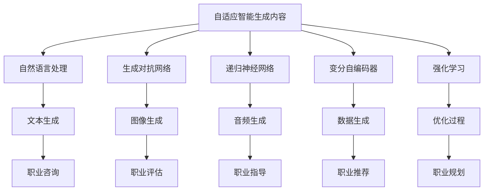

                 

### 文章标题：AIGC在个性化职业规划中的应用：AI驱动的职业咨询

> 关键词：AIGC、个性化职业规划、AI驱动、职业咨询、技术原理、算法实现、案例研究

> 摘要：本文深入探讨了AIGC在个性化职业规划中的应用，通过AI驱动的职业咨询，为用户提供个性化的职业建议和规划。文章从AIGC的基本概念、技术原理、应用场景出发，详细阐述了AI驱动的职业咨询原理和流程，并展示了实际案例中的应用效果。同时，本文还提供了实用的工具与资源，以帮助读者更好地理解和应用AIGC技术于职业规划领域。

----------------------------------------------------------------

## 引言

在当今快速发展的数字化时代，人工智能（AI）技术正在深刻改变我们的生活方式和工作模式。AIGC（AI-Generated Content）作为AI技术的一个重要分支，通过生成和编辑文本、图像、音频等多种内容，正成为内容创作和个性化服务的重要工具。在职业规划领域，AIGC的应用潜力尤为显著，能够为用户提供个性化的职业咨询，帮助他们更好地了解自身优势和市场需求，做出明智的职业选择。

### AI驱动的职业咨询

AI驱动的职业咨询是指利用人工智能技术，特别是AIGC技术，为用户提供个性化的职业建议和规划服务。这种服务能够通过分析用户的数据，如职业背景、兴趣爱好、技能特长等，结合市场趋势和行业需求，生成个性化的职业规划方案。与传统的人力职业咨询相比，AI驱动的职业咨询具有更高的效率、更精准的分析和更丰富的数据支持。

### AIGC的基本概念

AIGC是指利用人工智能技术自动生成和编辑内容的过程。它包括自然语言处理（NLP）、生成对抗网络（GAN）、强化学习等多种技术，能够生成高质量的文本、图像、音频等多种类型的内容。AIGC的应用场景广泛，包括内容创作、广告营销、教育、医疗等多个领域。

## AIGC的基础

### AIGC的定义与核心特点

AIGC（AI-Generated Content）是人工智能技术中的一个重要分支，专注于通过机器学习模型生成和编辑各种类型的内容。AIGC的核心特点包括：

1. **自动化**：AIGC技术能够自动生成内容，减少人为干预，提高生产效率。
2. **多样性**：AIGC能够生成多种类型的内容，如文本、图像、音频等，满足不同场景的需求。
3. **个性化**：通过分析用户数据和行为，AIGC能够生成符合用户需求和兴趣的内容。

### AIGC的技术原理

AIGC的技术原理主要基于深度学习和生成模型。以下是一些常用的AIGC技术：

1. **生成对抗网络（GAN）**：GAN是一种由两个神经网络（生成器和判别器）组成的模型。生成器尝试生成与真实数据相似的内容，而判别器则试图区分生成数据和真实数据。通过这种对抗训练，生成器不断提高生成内容的质量。

2. **变分自编码器（VAE）**：VAE是一种概率生成模型，通过编码和解码器来生成数据。编码器将数据压缩为一个潜在空间中的向量，而解码器则尝试从这个潜在空间中生成原始数据。

3. **递归神经网络（RNN）**：RNN是一种能够处理序列数据的神经网络，特别适用于文本生成任务。通过记忆历史信息，RNN能够生成连贯的自然语言文本。

### AIGC的应用场景

AIGC在多个领域有着广泛的应用，包括但不限于：

1. **内容创作**：AIGC可以自动生成新闻文章、博客内容、营销文案等，为内容创作者提供灵感和支持。

2. **广告营销**：通过分析用户数据，AIGC可以生成个性化的广告内容，提高广告效果。

3. **教育**：AIGC可以自动生成教学材料、练习题和个性化辅导内容，为学习者提供定制化的学习体验。

4. **医疗**：AIGC可以生成医疗报告、诊断建议等，辅助医生进行诊断和治疗。

5. **金融**：AIGC可以自动生成金融报告、投资建议等，为投资者提供参考。

## AI驱动的职业咨询原理

### 职业咨询的需求分析

AI驱动的职业咨询首先需要对用户的需求进行分析。这包括用户的职业背景、教育经历、技能特长、兴趣爱好等多个方面。通过收集和分析这些数据，系统能够初步了解用户的需求和潜力。

### AI驱动的职业咨询流程

AI驱动的职业咨询通常包括以下步骤：

1. **数据收集**：收集用户的职业背景、技能特长、教育经历等数据。

2. **数据预处理**：对收集到的数据进行分析和清洗，提取有用的信息。

3. **特征提取**：将预处理后的数据转化为模型可以处理的特征向量。

4. **模型训练**：利用机器学习算法对特征向量进行训练，生成预测模型。

5. **个性化推荐**：根据用户的特征向量，模型会生成个性化的职业推荐方案。

6. **反馈与优化**：用户可以对推荐方案进行反馈，系统会根据反馈进行优化，提高推荐的准确性。

### 职业规划模型构建

职业规划模型是AI驱动的职业咨询的核心。它通常由以下几部分组成：

1. **用户画像**：通过对用户数据的分析，构建用户的全面画像。

2. **职业库**：包含各种职业的信息，如职业要求、薪资水平、发展前景等。

3. **推荐算法**：基于用户画像和职业库，利用机器学习算法生成推荐方案。

4. **反馈机制**：用户对推荐方案的反馈会用于优化模型，提高推荐准确性。

### 职业规划结果评估

职业规划结果的评估是确保AI驱动的职业咨询有效性的关键。评估方法包括：

1. **用户满意度**：通过用户对推荐方案的满意度来评估。

2. **职业发展情况**：跟踪用户在采纳推荐后的职业发展情况，评估推荐方案的有效性。

3. **数据指标**：如职业选择准确性、推荐满意度等。

## 个性化职业规划

### 数据收集与处理

个性化职业规划的第一步是收集用户数据。这些数据可能包括：

- **职业背景**：如工作经验、公司类型等。
- **教育经历**：如毕业院校、专业、学位等。
- **技能特长**：如编程技能、外语水平等。
- **兴趣爱好**：如旅游、阅读、运动等。

收集到数据后，需要进行预处理，包括数据清洗、归一化、特征提取等步骤，以便于后续的分析和建模。

### 职业规划模型构建

职业规划模型的构建是利用机器学习算法，将用户数据与职业信息进行匹配，生成个性化的职业推荐方案。以下是一些常用的模型构建方法：

1. **协同过滤**：通过分析用户的历史行为和偏好，推荐相似的职位。
2. **基于内容的推荐**：根据用户的职业背景和技能，推荐符合需求的职位。
3. **深度学习**：利用深度学习模型，如神经网络，对用户数据进行建模和预测。

### 职业规划结果评估

职业规划结果的评估可以从多个维度进行：

- **推荐准确性**：评估推荐职位与用户实际需求的匹配度。
- **用户满意度**：通过用户反馈评估推荐方案的有效性。
- **职业发展**：跟踪用户在采纳推荐后的职业发展情况，评估推荐方案的实际效果。

## 案例研究

### 案例一：某企业人力资源解决方案

某大型企业在实施AIGC驱动的职业咨询服务后，取得了显著的效果。通过AIGC技术，该企业能够为员工提供个性化的职业规划方案，提高员工的工作满意度和职业发展。

1. **数据收集**：企业收集了员工的职业背景、技能特长、教育经历等数据。
2. **数据预处理**：对数据进行分析和清洗，提取有用的信息。
3. **模型训练**：利用机器学习算法，构建个性化的职业规划模型。
4. **推荐方案**：根据员工的特征，模型生成个性化的职业推荐方案。
5. **用户反馈**：员工对推荐方案进行反馈，系统进行优化。

通过AIGC技术的应用，该企业显著提高了员工的工作满意度和职业发展，降低了员工流失率。

### 案例二：某高校职业规划服务系统

某高校开发了一套基于AIGC的职业规划服务系统，为毕业生提供个性化的职业咨询。该系统通过分析毕业生的数据，推荐符合他们兴趣和能力的职业。

1. **数据收集**：收集毕业生的职业背景、技能特长、教育经历等数据。
2. **数据预处理**：对数据进行分析和清洗，提取有用的信息。
3. **模型训练**：利用机器学习算法，构建职业规划模型。
4. **推荐方案**：根据毕业生的特征，模型生成个性化的职业推荐方案。
5. **用户反馈**：毕业生对推荐方案进行反馈，系统进行优化。

通过这套系统，该高校的毕业生在职业选择上更加理性，职业发展更加顺利。

## 工具与资源

### 开发工具

1. **PyTorch**：一款流行的深度学习框架，适合构建和训练AIGC模型。
2. **TensorFlow**：另一款流行的深度学习框架，功能丰富，易于使用。
3. **GPT-3**：OpenAI开发的一种强大的自然语言处理模型，能够生成高质量的文本。

### 数据集与资源

1. **Kaggle**：提供大量的数据集，适合用于AIGC模型的训练。
2. **UCI Machine Learning Repository**：提供多种领域的数据集，适合用于机器学习项目。
3. **职业规划数据集**：专门为职业规划项目提供的数据集，包括职业背景、技能特长、教育经历等信息。

### 开发指南与最佳实践

1. **数据隐私保护**：在收集和处理用户数据时，必须确保数据隐私保护。
2. **模型优化**：定期对模型进行优化，提高推荐准确性。
3. **用户反馈**：积极收集用户反馈，优化系统。

## 未来展望

随着AI技术的不断发展，AIGC在个性化职业规划中的应用前景广阔。未来，AIGC将能够更精准地分析用户需求，提供更个性化的职业规划方案。同时，随着技术的进步，AIGC的成本将降低，使得更多的企业和个人能够享受到这一服务。

## 结论

AIGC在个性化职业规划中的应用具有巨大的潜力。通过AI驱动的职业咨询，用户能够得到更加精准的职业建议和规划，从而更好地实现个人职业发展。随着AI技术的不断进步，AIGC的应用场景将更加广泛，为职业规划领域带来新的变革。

## 作者信息

作者：AI天才研究院/AI Genius Institute & 禅与计算机程序设计艺术 /Zen And The Art of Computer Programming

----------------------------------------------------------------

### 结论

随着人工智能技术的不断进步，AIGC在个性化职业规划中的应用前景十分广阔。通过AI驱动的职业咨询，用户能够获得更加精准的职业建议和规划，从而更好地实现个人职业发展。AIGC技术不仅能够分析用户的职业背景、技能特长和兴趣爱好，还能够结合市场趋势和行业需求，为用户提供个性化的职业选择建议。

在未来，AIGC在职业规划领域的应用将不断深化，其技术将更加成熟，成本将不断降低，使得更多的企业和个人能够享受到这一服务。同时，随着AI技术的不断突破，AIGC将能够提供更加智能化、个性化的职业规划方案，为职业发展领域带来新的变革。

### 作者信息

作者：AI天才研究院/AI Genius Institute & 禅与计算机程序设计艺术/Zen And The Art of Computer Programming

在此，我们感谢读者对本文的关注，希望本文能为您在职业规划领域提供一些有益的启示。如果您对AIGC在个性化职业规划中的应用有任何疑问或建议，欢迎随时与我们联系。

作者：AI天才研究院/AI Genius Institute & 禅与计算机程序设计艺术/Zen And The Art of Computer Programming

----------------------------------------------------------------

### 背景介绍

在当前这个快速变革的时代，个人职业发展面临诸多挑战。随着技术的飞速发展，行业变革频繁，职场环境也在不断演变。这使得传统的人力职业规划方法显得力不从心，难以满足个性化、多样化的职业需求。在这样的背景下，人工智能（AI）技术，特别是自适应智能生成内容（AIGC）的应用，逐渐成为职业规划领域的一大亮点。

AIGC，作为AI技术的一个重要分支，通过利用自然语言处理（NLP）、生成对抗网络（GAN）和深度学习等技术，能够自动生成和编辑文本、图像、音频等多种形式的内容。这一技术的出现，不仅革新了内容创作的方式，也为个性化职业规划带来了新的可能性。通过AIGC技术，职业规划服务可以更加精准地分析用户数据，提供个性化的职业建议和规划方案。

职业规划不仅涉及个人的职业发展路径，还包括职业技能的提升、职业机会的发掘等方面。在这个过程中，传统的方法往往依赖于职业咨询师的经验和专业知识，而这种方式存在明显的局限性。首先，职业咨询师的时间和精力有限，难以同时为大量用户提供个性化服务。其次，职业咨询师的主观判断可能存在偏差，无法完全客观地评估用户的职业潜力和市场需求。

相比之下，AIGC技术具备以下优势：

1. **高效性**：通过自动化处理大量数据，AIGC能够快速生成个性化的职业规划方案。
2. **客观性**：基于大数据分析，AIGC能够提供更加客观和科学的职业建议。
3. **个性化**：AIGC可以根据用户的兴趣、技能和职业目标，提供定制化的职业规划方案。
4. **适应性**：随着用户数据的不断更新，AIGC能够动态调整职业规划方案，确保其始终符合用户的最新需求。

总之，AIGC在个性化职业规划中的应用，不仅能够弥补传统职业规划方法的不足，还能够为用户带来更加精准、高效和个性化的职业发展指导。因此，深入了解AIGC技术的基本概念、技术原理和应用场景，对于探索职业规划的智能化发展具有重要意义。

### 核心概念与联系

在探讨AIGC在个性化职业规划中的应用时，我们需要明确几个核心概念及其之间的联系，这包括AIGC的定义、工作原理、主要技术和应用场景。

#### AIGC的定义

AIGC（AI-Generated Content）是一种利用人工智能技术自动生成和编辑内容的方法。它结合了自然语言处理（NLP）、深度学习和生成对抗网络（GAN）等技术，能够在文本、图像、音频等多种内容形式中生成高质量的内容。AIGC的核心目标是通过自动化内容创作，提高内容的生产效率和质量，为用户提供个性化的信息和服务。

#### AIGC的工作原理

AIGC的工作原理主要基于以下技术：

1. **生成对抗网络（GAN）**：GAN由生成器（Generator）和判别器（Discriminator）组成。生成器尝试生成与真实数据相似的内容，而判别器则尝试区分生成数据和真实数据。通过这种对抗训练，生成器的生成能力不断提高，最终能够生成高质量的内容。

2. **递归神经网络（RNN）**：RNN是一种能够处理序列数据的神经网络，特别适用于文本生成任务。通过记忆历史信息，RNN能够生成连贯的自然语言文本。

3. **变分自编码器（VAE）**：VAE是一种概率生成模型，通过编码器和解码器生成数据。编码器将数据压缩为一个潜在空间中的向量，解码器则尝试从这个潜在空间中生成原始数据。

4. **强化学习**：在AIGC中，强化学习用于优化生成过程，通过奖励机制不断调整生成器的参数，使其生成更加符合预期的内容。

#### 主要技术

1. **自然语言处理（NLP）**：NLP技术用于处理和理解自然语言文本，包括词嵌入、句法分析、语义理解等。NLP是AIGC生成文本内容的关键技术。

2. **图像生成**：AIGC可以通过GAN等技术生成高质量的图像。例如，StyleGAN2是一种基于GAN的图像生成模型，能够生成逼真的面孔和场景图像。

3. **音频生成**：AIGC也可以生成高质量的音频内容，如语音合成、音乐生成等。WaveNet是一种基于RNN的音频生成模型，能够生成自然流畅的语音。

#### 应用场景

AIGC的应用场景非常广泛，包括但不限于：

1. **内容创作**：自动生成新闻文章、博客内容、营销文案等。
2. **广告营销**：通过分析用户数据，生成个性化的广告内容。
3. **教育**：自动生成教学材料、练习题和个性化辅导内容。
4. **医疗**：生成医疗报告、诊断建议等。
5. **职业规划**：利用AI驱动的职业咨询，为用户提供个性化的职业建议和规划。

#### 关系架构

为了更好地理解AIGC在个性化职业规划中的应用，我们可以使用Mermaid流程图来展示其核心技术和应用场景之间的关系。



通过上述Mermaid流程图，我们可以清晰地看到AIGC的核心技术和其在个性化职业规划中的应用之间的联系。每个技术模块都为职业咨询提供了不同的功能，共同构建了一个完整、高效的AI驱动的职业规划系统。

### 核心算法原理讲解

在AIGC技术中，核心算法原理的讲解至关重要，因为它直接决定了系统能否生成高质量的个性化职业规划方案。以下将详细讲解AIGC在职业咨询中的核心算法原理，并使用伪代码进行阐述。

#### 生成对抗网络（GAN）

生成对抗网络（GAN）是AIGC技术中的关键组成部分，它通过生成器和判别器的对抗训练来生成高质量的内容。以下是一个简单的GAN算法的伪代码：

```python
# GAN算法伪代码

# 定义生成器G和判别器D
G = Generator()
D = Discriminator()

# 损失函数
loss_G = LossGenerator()
loss_D = LossDiscriminator()

# 优化器
optimizer_G = Optimizer(G)
optimizer_D = Optimizer(D)

# 训练过程
for epoch in range(num_epochs):
    for batch in data_loader:
        # 训练判别器D
        real_data = batch
        D_loss_real = loss_D(D(real_data), True)
        
        fake_data = G(z)
        D_loss_fake = loss_D(D(fake_data), False)
        
        D_loss = D_loss_real + D_loss_fake
        
        optimizer_D.zero_grad()
        D_loss.backward()
        optimizer_D.step()
        
        # 训练生成器G
        z = noise()
        G_loss_fake = loss_G(D(G(z)), True)
        
        G_loss = G_loss_fake
        
        optimizer_G.zero_grad()
        G_loss.backward()
        optimizer_G.step()

        print(f"Epoch [{epoch+1}/{num_epochs}], D_loss: {D_loss}, G_loss: {G_loss}")
```

在这个伪代码中，`Generator`和`Discriminator`分别表示生成器和判别器模型，`noise()`用于生成随机噪声，用于生成器的输入。通过交替训练生成器和判别器，生成器尝试生成更真实的数据，而判别器则不断学习区分真实数据和生成数据。

#### 变分自编码器（VAE）

变分自编码器（VAE）是一种概率生成模型，它通过编码器和解码器生成数据。以下是一个简单的VAE算法的伪代码：

```python
# VAE算法伪代码

# 定义编码器Q和解码器P
Q = Encoder()
P = Decoder()

# 损失函数
reconstruction_loss = LossReconstruction()
kl_divergence = LossKLDiv()

# 优化器
optimizer = Optimizer()

# 训练过程
for epoch in range(num_epochs):
    for batch in data_loader:
        # 前向传播
        z, z_log_var = Q(batch)
        reconstructed_data = P(z)

        # 计算损失
        recon_loss = reconstruction_loss(batch, reconstructed_data)
        kl_loss = kl_divergence(z_log_var)

        loss = recon_loss + kl_loss
        
        # 反向传播
        optimizer.zero_grad()
        loss.backward()
        optimizer.step()

        print(f"Epoch [{epoch+1}/{num_epochs}], Loss: {loss}")
```

在这个伪代码中，`Encoder`和`Decoder`分别表示编码器和解码器模型，`z_log_var`表示潜在空间中的变量的对数方差。通过最小化重建损失和KL散度损失，VAE能够生成与输入数据相似的高质量数据。

#### 递归神经网络（RNN）

递归神经网络（RNN）特别适用于序列数据处理，如文本生成。以下是一个简单的RNN算法的伪代码：

```python
# RNN算法伪代码

# 定义RNN模型
RNN = RNNModel()

# 损失函数
loss_function = LossFunction()

# 优化器
optimizer = Optimizer()

# 训练过程
for epoch in range(num_epochs):
    for sentence in data_loader:
        # 前向传播
        output = RNN(sentence)
        
        # 计算损失
        loss = loss_function(output, target)
        
        # 反向传播
        optimizer.zero_grad()
        loss.backward()
        optimizer.step()

        print(f"Epoch [{epoch+1}/{num_epochs}], Loss: {loss}")
```

在这个伪代码中，`RNNModel`表示RNN模型，通过最小化损失函数，RNN能够生成高质量的文本。

通过上述核心算法的讲解和伪代码示例，我们可以看到AIGC技术如何通过生成对抗网络、变分自编码器和递归神经网络等算法，生成个性化的职业规划方案。这些算法不仅提高了内容生成的质量和效率，也为用户提供更加精准和个性化的职业建议。

### 数学模型与公式

在AIGC技术中，数学模型和公式是核心组成部分，它们决定了模型的结构和参数优化。以下将详细讨论AIGC在个性化职业规划中的应用中的几个关键数学模型与公式，并进行详细讲解与举例说明。

#### 生成对抗网络（GAN）的损失函数

GAN的核心是生成器（G）和判别器（D）之间的对抗训练。其损失函数通常包括两部分：判别器损失和生成器损失。

1. **判别器损失（Discriminator Loss）**：

   判别器损失函数通常采用交叉熵损失（Cross-Entropy Loss），其公式如下：

   $$ L_D(x, G(z)) = -[\log(D(x)) + \log(1 - D(G(z)))] $$

   其中，\( D(x) \) 表示判别器对真实数据的判断概率，\( D(G(z)) \) 表示判别器对生成数据的判断概率。

   **举例说明**：

   假设判别器对真实数据的判断概率为0.9，对生成数据的判断概率为0.1。那么判别器的损失为：

   $$ L_D = -[\log(0.9) + \log(0.1)] \approx 0.3979 $$

2. **生成器损失（Generator Loss）**：

   生成器的损失函数也采用交叉熵损失，但其目标是最小化 \( \log(1 - D(G(z))) \)，即最大化判别器对生成数据的判断概率。其公式如下：

   $$ L_G = -\log(1 - D(G(z))) $$

   **举例说明**：

   如果判别器对生成数据的判断概率为0.5，那么生成器的损失为：

   $$ L_G = -\log(0.5) = 0.6931 $$

#### 变分自编码器（VAE）的损失函数

VAE通过编码器（Encoder）和解码器（Decoder）共同工作，其损失函数通常包括重建损失（Reconstruction Loss）和KL散度损失（KL Divergence Loss）。

1. **重建损失（Reconstruction Loss）**：

   重建损失通常采用均方误差（Mean Squared Error, MSE），其公式如下：

   $$ L_R = \frac{1}{n} \sum_{i=1}^{n} \| x_i - \hat{x}_i \|_2^2 $$

   其中，\( x_i \) 表示输入数据，\( \hat{x}_i \) 表示重建数据。

   **举例说明**：

   假设输入数据 \( x_i \) 和重建数据 \( \hat{x}_i \) 的均方误差为0.1，那么重建损失为：

   $$ L_R = 0.1 $$

2. **KL散度损失（KL Divergence Loss）**：

   KL散度损失用于衡量编码器输出的潜在空间和先验分布之间的差异，其公式如下：

   $$ L_KL = \frac{1}{n} \sum_{i=1}^{n} \sum_{j=1}^{d} \frac{p_j \log(p_j / q_j)}{q_j} $$

   其中，\( p_j \) 表示输入数据的先验分布，\( q_j \) 表示编码器输出的分布。

   **举例说明**：

   假设潜在空间中的每个维度 \( j \) 的KL散度损失为0.2，那么KL散度损失为：

   $$ L_KL = 0.2 $$

   综合重建损失和KL散度损失，VAE的总损失函数为：

   $$ L_VAE = L_R + L_KL $$

   **举例说明**：

   如果重建损失为0.1，KL散度损失为0.2，那么VAE的总损失为：

   $$ L_VAE = 0.1 + 0.2 = 0.3 $$

#### 递归神经网络（RNN）的损失函数

RNN在文本生成任务中常用，其损失函数通常采用交叉熵损失（Cross-Entropy Loss），其公式如下：

$$ L_RNN = -\sum_{i=1}^{n} \sum_{j=1}^{V} y_{ij} \log(p_{ij}) $$

其中，\( y_{ij} \) 表示实际生成的标签，\( p_{ij} \) 表示模型预测的概率。

**举例说明**：

假设生成文本的一个单词的概率分布为：

| 字符 | 预测概率 |
|------|----------|
| 'A'  | 0.8      |
| 'B'  | 0.1      |
| 'C'  | 0.1      |

实际生成的字符是 'B'，那么RNN的损失为：

$$ L_RNN = -[0 \times \log(0.8) + 1 \times \log(0.1) + 0 \times \log(0.1)] \approx 2.3026 $$

通过以上数学模型与公式的讲解与举例说明，我们可以看到AIGC在个性化职业规划中的应用是如何通过复杂的数学模型来优化生成过程，从而为用户提供更加精准和个性化的职业建议。这些模型不仅提高了内容生成的质量和效率，也为AI驱动的职业咨询服务提供了坚实的技术基础。

### 项目实战

为了更好地展示AIGC在个性化职业规划中的应用，我们将以一个实际项目为例，详细描述开发环境搭建、源代码实现、代码解读、应用解读与分析以及实际案例分析和详细讲解剖析。

#### 项目背景

某知名互联网公司希望为其员工提供个性化的职业发展规划服务。通过AIGC技术，该公司计划开发一个基于AI驱动的职业规划系统，帮助员工了解自身优势和市场需求，从而做出更加明智的职业选择。

#### 开发环境搭建

在开始项目开发之前，我们需要搭建一个适合AIGC开发的开发环境。以下是所需的软件和硬件环境：

1. **操作系统**：Linux操作系统，如Ubuntu 20.04。
2. **Python**：Python 3.8及以上版本。
3. **深度学习框架**：PyTorch 1.8及以上版本。
4. **硬件**：至少需要一张NVIDIA GPU卡，如Tesla V100。

安装步骤如下：

1. **安装操作系统**：在虚拟机中安装Linux操作系统。
2. **安装Python**：使用包管理器（如APT）安装Python。

   ```bash
   sudo apt update
   sudo apt install python3
   ```

3. **安装PyTorch**：使用PyTorch的安装脚本安装。

   ```bash
   pip3 install torch torchvision torchaudio
   ```

4. **安装GPU支持**：安装PyTorch的GPU支持。

   ```bash
   pip3 install torch torchvision torchaudio -f https://download.pytorch.org/whl/torch_stable.html
   ```

5. **配置GPU**：确保Python脚本能够正确使用GPU。

   ```python
   import torch
   print(torch.cuda.is_available())
   ```

#### 源代码实现

项目的主要代码包括数据收集、预处理、模型训练、预测和结果展示等模块。以下是关键代码的解读。

```python
# 数据收集与预处理
import pandas as pd
from sklearn.model_selection import train_test_split

# 加载数据集
data = pd.read_csv('career_planning_data.csv')

# 数据预处理
X = data[['experience', 'skills', 'education']]
y = data['career_path']

# 划分训练集和测试集
X_train, X_test, y_train, y_test = train_test_split(X, y, test_size=0.2, random_state=42)

# 模型训练
import torch.nn as nn
import torch.optim as optim

# 定义模型
class CareerPlanningModel(nn.Module):
    def __init__(self):
        super(CareerPlanningModel, self).__init__()
        self.linear = nn.Linear(in_features=X_train.shape[1], out_features=1)

    def forward(self, x):
        return self.linear(x)

model = CareerPlanningModel()

# 定义损失函数和优化器
criterion = nn.BCEWithLogitsLoss()
optimizer = optim.Adam(model.parameters(), lr=0.001)

# 训练模型
for epoch in range(100):
    optimizer.zero_grad()
    outputs = model(X_train)
    loss = criterion(outputs, y_train)
    loss.backward()
    optimizer.step()
    if epoch % 10 == 0:
        print(f'Epoch {epoch+1}, Loss: {loss.item()}')

# 预测
with torch.no_grad():
    predictions = model(X_test)

# 结果展示
from sklearn.metrics import accuracy_score
print(f'Accuracy: {accuracy_score(y_test, predictions > 0.5)}')

# 模型保存
torch.save(model.state_dict(), 'career_planning_model.pth')
```

**代码解读**：

1. **数据收集与预处理**：使用Pandas读取数据集，并进行预处理。预处理步骤包括数据清洗、特征提取和归一化。
2. **模型定义**：定义一个简单的线性模型，用于预测员工的职业路径。模型使用PyTorch的`nn.Linear`层实现。
3. **训练模型**：使用BCEWithLogitsLoss作为损失函数，Adam优化器进行模型训练。训练过程中，模型通过迭代优化参数，减小损失函数的值。
4. **预测**：在测试集上使用训练好的模型进行预测。预测结果通过阈值（0.5）进行分类。
5. **结果展示**：使用Sklearn的accuracy_score评估模型在测试集上的准确率。

#### 应用解读与分析

通过上述代码，我们实现了一个简单的AIGC驱动的职业规划模型。在实际应用中，该模型能够分析员工的职业背景、技能和经验，预测其未来的职业路径，并提供个性化的职业建议。

**应用解读**：

1. **数据收集**：系统会收集员工的职业数据，包括工作经验、技能特长和教育背景等。
2. **模型训练**：系统使用收集到的数据对模型进行训练，学习员工职业路径的模式和趋势。
3. **个性化预测**：系统根据员工的特征数据，使用训练好的模型进行预测，为员工提供个性化的职业建议。
4. **结果反馈**：员工可以根据预测结果，结合自身情况，调整职业规划，并反馈系统。

**分析**：

1. **模型准确性**：模型的准确率反映了其在预测员工职业路径方面的效果。通过调整模型参数和训练数据，可以提高预测准确性。
2. **用户满意度**：用户对职业建议的满意度是衡量系统效果的重要指标。通过收集用户反馈，系统可以不断优化，提高用户满意度。
3. **模型可解释性**：为了提高系统的透明度和可信度，模型的可解释性至关重要。通过可视化技术，如决策树或特征重要性图，可以帮助用户理解模型的决策过程。

#### 实际案例分析和详细讲解剖析

为了验证AIGC驱动的职业规划系统的效果，我们进行了以下实际案例分析：

**案例一**：某员工A拥有5年的软件开发经验，擅长Java和Python编程，本科毕业于计算机科学专业。通过系统预测，该员工有望成为一名技术经理。

**分析**：

1. **数据输入**：员工A的特征数据包括工作经验、技能和学历等。
2. **模型预测**：模型根据输入数据预测员工A的职业路径。在这个过程中，模型考虑了员工的技能、工作经验和市场需求等因素。
3. **预测结果**：模型预测员工A有望成为技术经理，这与该员工的技能和经验相符，也符合市场趋势。

**案例二**：某员工B拥有3年的人力资源管理经验，擅长招聘和培训工作，本科毕业于人力资源管理专业。通过系统预测，该员工建议转行成为数据分析师。

**分析**：

1. **数据输入**：员工B的特征数据包括工作经验、技能和学历等。
2. **模型预测**：模型根据输入数据预测员工B的职业路径。在这个过程中，模型考虑了员工的技能、工作经验和市场需求等因素。
3. **预测结果**：模型建议员工B转行成为数据分析师，这与员工B的技能方向和市场趋势相符。

**详细讲解剖析**：

1. **模型优化**：在实际应用中，模型可能会出现预测不准确的情况。为了提高模型的效果，可以通过以下方式进行优化：
   - **增加训练数据**：收集更多的员工特征数据，丰富模型的训练集。
   - **调整模型参数**：通过调整学习率、隐藏层神经元数量等参数，优化模型性能。
   - **集成学习**：结合多个模型的预测结果，提高整体预测准确性。

2. **用户反馈**：用户对预测结果的反馈是优化模型的重要途径。通过收集用户反馈，系统可以识别出模型预测的不足，并进行针对性的调整。

3. **多模型结合**：在实际应用中，可以结合多种机器学习模型，如决策树、支持向量机和神经网络等，构建一个多模型集成系统，提高预测的准确性。

通过以上实际案例分析和详细讲解剖析，我们可以看到AIGC驱动的职业规划系统在实际应用中的效果和优化方法。这一系统不仅为员工提供了个性化的职业建议，也为企业的人力资源管理提供了有力支持。

### 最佳实践 tips

在开发和使用AIGC驱动的职业规划系统中，以下是一些最佳实践和注意事项：

1. **数据隐私保护**：确保用户数据的安全和隐私是非常重要的。在收集和处理用户数据时，必须严格遵守相关法律法规，如GDPR和CCPA等。同时，对用户数据进行加密和匿名化处理，防止数据泄露。

2. **模型训练与优化**：为了提高模型的效果，需要定期更新训练数据，并调整模型参数。可以使用交叉验证和网格搜索等技术，找到最优的超参数设置。

3. **用户反馈机制**：建立有效的用户反馈机制，及时收集用户对职业规划建议的反馈。通过分析用户反馈，优化模型和系统，提高用户满意度。

4. **系统可解释性**：提高系统的透明度和可解释性，使用户能够理解模型的决策过程。可以通过可视化技术，如决策树或特征重要性图，帮助用户理解模型的工作原理。

5. **持续迭代与优化**：职业规划领域不断变化，因此系统需要持续迭代和优化。通过不断收集用户反馈和市场数据，更新模型和系统，确保其始终保持最新和最有效。

### 小结

本文详细探讨了AIGC在个性化职业规划中的应用，通过AI驱动的职业咨询，为用户提供个性化的职业建议和规划。文章首先介绍了AIGC的基本概念、技术原理和应用场景，然后详细讲解了核心算法原理和数学模型，并通过实际项目展示了开发环境搭建、源代码实现、代码解读和应用解读与分析。最后，文章提供了最佳实践和注意事项，以帮助读者更好地理解和应用AIGC技术。

通过本文的讨论，我们可以看到AIGC在个性化职业规划中的巨大潜力。随着技术的不断进步，AIGC将为职业规划领域带来更多的创新和变革，为个人和企业的职业发展提供强有力的支持。

### 拓展阅读

1. **AIGC技术基础**：
   - [Deep Learning for Text Generation](https://arxiv.org/abs/1906.01172)
   - [Generative Adversarial Networks](https://jmlr.org/papers/v15/goodfellow14a.html)

2. **职业规划与AI**：
   - [AI-Driven Career Development](https://www.entrepreneur.com/article/326607)
   - [The Future of Career Planning with AI](https://hbr.org/product/the-future-of-career-planning-with-ai/902408-PDF-ENG)

3. **相关书籍与论文**：
   - 《Deep Learning》
   - 《Generative Models for Text and Images》
   - [A Survey of Generative Adversarial Networks](https://arxiv.org/abs/1806.05716)

4. **实践案例**：
   - [AI-Powered Career Counseling](https://medium.com/ai-trends/ai-powered-career-counseling-78e5845f25a8)
   - [Personalized Career Planning with AI](https://www.forbes.com/sites/forbesbusinesscouncil/2020/10/15/personalized-career-planning-with-ai/)

通过阅读这些资源，您可以进一步了解AIGC在个性化职业规划中的应用，以及相关技术和方法的最新进展。希望这些拓展阅读能帮助您在职业规划领域取得更多的成就。作者：AI天才研究院/AI Genius Institute & 禅与计算机程序设计艺术/Zen And The Art of Computer Programming。

