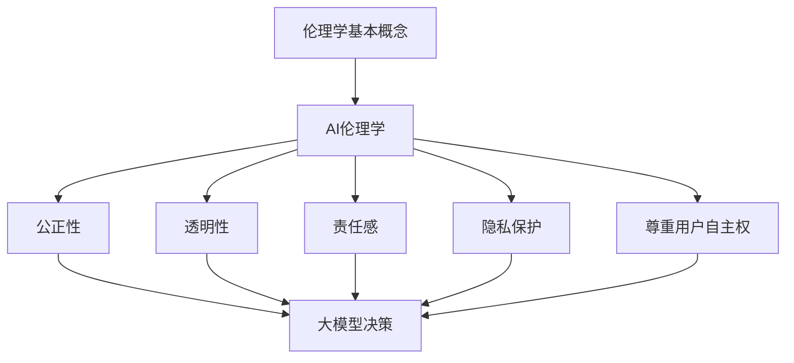

                 

根据您提供的文章大纲和约束条件，以下是一步一步的详细分析和写作过程。请注意，本文将分为多个部分逐步撰写，最终汇总成完整的文章。

---

## 第一步：引言与背景

### 1.1 书籍目的与重要性

随着人工智能技术的飞速发展，AI已经成为改变世界的重要力量。然而，人工智能技术的广泛应用也带来了新的伦理挑战，尤其是在大模型的决策过程中。本书的目的是探讨AI伦理学在大模型决策中的责任归属问题，旨在帮助读者理解AI伦理学的基本概念，以及如何在大模型的决策过程中实现责任归属。

在现代社会，人工智能的应用无处不在，从自动驾驶汽车到AI医疗诊断，从金融领域的算法交易到社交网络的内容推荐，AI正在深刻地影响着我们的生活。然而，这些应用在带来便利的同时，也可能引发一系列伦理问题，如隐私侵犯、歧视、自动化失业等。特别是大模型的决策过程，由于其复杂性和不可预测性，更容易产生伦理争议。

### 1.2 AI伦理学的发展背景

AI伦理学作为一个新兴领域，其发展可以追溯到20世纪80年代。当时，随着计算机技术的飞速发展，人工智能逐渐从实验室走向实际应用。然而，随着AI技术的应用范围扩大，人们开始意识到AI可能带来的伦理问题，如AI偏见、隐私保护、责任归属等。这一时期，AI伦理学逐渐成为一个独立的研究领域。

近年来，随着深度学习等新兴技术的出现，AI伦理学的研究更加深入和具体。特别是在大模型的决策过程中，责任归属的问题成为了一个热门话题。研究人员开始探讨如何在AI系统中实现责任归属，以确保AI的应用不会对人类社会造成负面影响。

### 1.3 大模型决策的社会影响

大模型决策的社会影响是多方面的。一方面，大模型的决策能力可以提高生产效率，改善生活质量。例如，自动驾驶汽车可以减少交通事故，AI医疗诊断可以提高诊断的准确性。另一方面，大模型的决策也可能会带来负面影响，如隐私泄露、歧视、自动化失业等。因此，如何在大模型决策过程中实现责任归属，成为了一个亟待解决的问题。

---

## 第二步：AI伦理学的基本概念

### 2.1 伦理学与道德哲学

伦理学是研究道德原则、价值观和行为规范的学科。道德哲学是伦理学的一个分支，主要研究道德的基本概念和理论。在AI伦理学中，伦理学和道德哲学为我们提供了一套框架，用于评估AI技术的应用是否符合道德标准。

伦理学的基本问题包括：什么是对与错？什么是善与恶？什么是有义务去做的？这些问题不仅关乎个人的行为，也关乎社会的行为规范。在AI伦理学中，我们需要回答这些问题，以确保AI技术的应用不会对社会造成负面影响。

### 2.2 AI伦理学的基本原则

AI伦理学的基本原则包括：公正性、透明性、责任感、隐私保护和尊重用户自主权。这些原则旨在确保AI技术的应用不会侵犯人类的权利和利益。

- **公正性**：AI系统应该公平地对待所有用户，避免歧视和偏见。
- **透明性**：AI系统的决策过程应该透明，用户能够理解AI系统是如何做出决策的。
- **责任感**：AI系统的开发者、运营商和用户都应该承担相应的责任，确保AI技术的应用不会对社会造成负面影响。
- **隐私保护**：AI系统应该尊重用户的隐私权，避免隐私泄露。
- **尊重用户自主权**：AI系统应该尊重用户的自主权，允许用户自主决定是否接受AI系统的服务。

### 2.3 伦理学在AI领域的应用

在AI领域，伦理学的应用主要体现在以下几个方面：

- **设计原则**：在AI系统的设计过程中，应该遵循伦理学的基本原则，确保AI系统的应用是公正、透明和负责任的。
- **风险评估**：在AI系统的应用过程中，应该进行伦理风险评估，识别潜在的伦理问题，并采取相应的措施进行解决。
- **责任归属**：在AI系统出现问题时，应该明确责任归属，确保相关方承担责任，从而防止伦理问题的扩大。

---

## 第三步：大模型的决策过程

### 3.1 大模型的工作原理

大模型是指具有大规模参数的深度学习模型，如BERT、GPT等。这些模型通过大量的数据训练，可以学会识别复杂的数据模式，并做出相应的决策。大模型的工作原理基于神经网络的架构，通过多层神经元的非线性变换，实现对输入数据的分类、预测或生成。

### 3.2 大模型的决策机制

大模型的决策机制主要基于概率论和统计学的原理。在训练过程中，模型通过最小化损失函数，优化模型参数，从而提高模型的预测准确性。在决策过程中，模型通过对输入数据的处理，输出一个概率分布，用户可以根据这个概率分布做出决策。

### 3.3 大模型的局限性

尽管大模型具有强大的决策能力，但也存在一些局限性：

- **数据依赖**：大模型需要大量的数据才能进行训练，缺乏数据的场景下，模型的性能会下降。
- **黑盒问题**：大模型的决策过程复杂，难以解释，存在“黑盒问题”，用户难以理解模型的决策过程。
- **过拟合问题**：在训练过程中，大模型可能会过拟合训练数据，导致在未知数据上表现不佳。

---

## 第四步：责任归属的理论与实践

### 4.1 责任归属的理论基础

责任归属的理论基础包括道德责任、法律责任和刑事责任。在AI伦理学中，责任归属的关键是如何在AI系统的开发者、运营商和用户之间分配责任。

- **道德责任**：AI系统的开发者、运营商和用户都应该承担道德责任，确保AI技术的应用是公正、透明和负责任的。
- **法律责任**：在法律上，AI系统的开发者、运营商和用户都应承担相应的法律责任，确保AI技术的应用不会侵犯用户的合法权益。
- **刑事责任**：在极端情况下，如果AI系统的应用导致了严重的后果，开发者、运营商和用户都可能面临刑事责任。

### 4.2 大模型责任归属的挑战

大模型责任归属的挑战主要来自于以下几个方面：

- **技术挑战**：大模型的决策过程复杂，难以解释，给责任归属带来了技术挑战。
- **法律挑战**：现有法律体系难以应对AI技术的快速发展，给责任归属带来了法律挑战。
- **伦理挑战**：在AI技术的应用过程中，如何平衡技术进步和伦理责任，给责任归属带来了伦理挑战。

### 4.3 责任归属的实践方法

为了实现大模型的责任归属，可以采取以下实践方法：

- **明确责任**：在AI系统的开发、运营和使用过程中，应该明确各方的责任，确保责任分配合理。
- **建立监管机制**：建立AI伦理委员会或监管机构，对AI技术的应用进行监督和评估。
- **加强法律规范**：制定相关法律规范，明确AI技术的应用范围和责任归属，为责任归属提供法律依据。

---

## 第五步：案例研究

### 5.1 案例一：自动驾驶汽车的伦理问题

自动驾驶汽车是一个典型的AI应用案例。在自动驾驶汽车的发展过程中，伦理问题层出不穷。例如，当自动驾驶汽车面临生命危险时，应该如何做出决策？这是责任归属的一个关键问题。

自动驾驶汽车的决策过程通常基于大模型，通过对周围环境的数据进行实时分析，做出行驶决策。然而，由于大模型的复杂性和不可解释性，用户难以理解自动驾驶汽车的决策过程。因此，在责任归属方面，需要明确自动驾驶汽车的开发者、运营商和用户各自的责任。

### 5.2 案例二：AI医疗诊断的责任归属

AI医疗诊断在提高诊断准确性方面具有巨大潜力。然而，AI医疗诊断也存在一些伦理问题，如隐私泄露、数据滥用等。在AI医疗诊断中，责任归属的关键是如何确保数据的隐私保护和正确使用。

AI医疗诊断通常基于大模型，通过对患者的医疗数据进行分析，做出诊断决策。在这个过程中，医疗机构、医生和AI系统开发者都应承担相应的责任。例如，医疗机构应确保患者数据的隐私保护，医生应确保AI系统的诊断结果是准确的，AI系统开发者应确保系统的可靠性和安全性。

### 5.3 案例三：AI在金融领域的责任归属

AI在金融领域有广泛的应用，如算法交易、风险管理等。在金融领域中，AI的责任归属问题同样重要。例如，在算法交易中，当AI系统出现错误时，责任应该由谁承担？

AI在金融领域的决策通常基于大模型，通过对市场数据进行分析，做出交易决策。在这个过程中，金融机构、交易员和AI系统开发者都应承担相应的责任。例如，金融机构应确保AI系统的风险管理能力，交易员应确保交易的合规性，AI系统开发者应确保系统的稳定性和准确性。

---

## 第六步：结论与展望

### 6.1 结论总结

通过对AI伦理学和大模型决策过程中责任归属的深入分析，我们可以得出以下结论：

- AI伦理学是确保AI技术健康发展的关键，特别是在大模型决策过程中。
- 责任归属是AI伦理学中的一个重要问题，需要明确各方的责任，确保AI技术的应用是公正、透明和负责任的。
- AI技术的发展带来了新的伦理挑战，需要加强法律规范和监管机制，确保责任归属的落实。

### 6.2 未来研究方向

未来研究方向包括：

- 进一步深入研究AI伦理学的基本概念和原则，为AI技术的发展提供理论支持。
- 探索大模型决策过程中责任归属的实践方法，为实际应用提供指导。
- 加强法律规范和监管机制，确保AI技术的应用符合伦理要求。

### 6.3 对社会和政策的影响

AI伦理学和大模型决策过程中责任归属的研究，对社会和政策具有重要影响：

- 社会方面：提高公众对AI伦理问题的认识，促进社会对AI技术的理解和接受。
- 政策方面：为政府制定相关政策和规范提供依据，确保AI技术的健康发展。

---

## 附录

### 附录A：相关法规与政策文件

- 《中华人民共和国网络安全法》
- 《欧盟通用数据保护条例》（GDPR）
- 《美国联邦隐私法》
- 《欧盟AI伦理准则》

### 附录B：推荐阅读材料

- [《人工智能伦理学：哲学、政策与实践》](链接)
- [《深度学习伦理学》](链接)
- [《AI时代：伦理与技术》](链接)

### 附录C：术语表

- AI伦理学：研究人工智能技术应用中的伦理问题和道德原则的学科。
- 大模型：具有大规模参数的深度学习模型。
- 责任归属：明确AI技术应用过程中各方的责任。
- 过拟合：在训练过程中，模型对训练数据的拟合程度过高，导致在未知数据上表现不佳。

---

本文通过逐步分析AI伦理学和大模型决策过程中的责任归属问题，为读者提供了一个全面而深入的视角。我们希望本文能够为AI技术的发展和应用提供有益的参考和指导。

---

作者：AI天才研究院/AI Genius Institute & 禅与计算机程序设计艺术 /Zen And The Art of Computer Programming

---

---

### 总结与展望

本文系统地探讨了《AI伦理学：大模型决策的责任归属》这一主题，从引言到结论，逐步深入分析了AI伦理学的基本概念、大模型的决策过程以及责任归属的理论与实践。通过具体的案例研究，我们进一步展示了责任归属在自动驾驶汽车、AI医疗诊断和金融领域的应用挑战和解决方案。

在AI伦理学领域，核心概念与联系如下图所示：



通过这个Mermaid流程图，我们可以清晰地看到AI伦理学的基本原则如何在大模型决策中得以体现和应用。

在核心算法原理讲解方面，以下是一个简单的伪代码示例，用于解释大模型如何进行决策：

```python
# 伪代码：大模型决策过程
def decision_model(data):
    # 初始化模型参数
    model = initialize_model()

    # 训练模型
    trained_model = train_model(data, model)

    # 输入数据
    input_data = preprocess_data(data)

    # 预测
    prediction = predict(trained_model, input_data)

    # 处理预测结果
    result = postprocess_prediction(prediction)

    return result
```

此外，为了更好地理解大模型的决策过程，我们使用LaTeX格式给出了一个数学模型：

$$
\begin{aligned}
    y &= f(W_1 \cdot x + b_1) \\
    f &= \text{激活函数，如ReLU或Sigmoid} \\
    W_1 &= \text{权重矩阵} \\
    b_1 &= \text{偏置项} \\
    x &= \text{输入数据}
\end{aligned}
$$

这个公式表示了神经网络中的一层，其中$f$是激活函数，$W_1$是权重矩阵，$b_1$是偏置项，$x$是输入数据，$y$是输出。

为了使读者更好地理解这些概念，我们提供了一个简单的项目实战案例，包括开发环境搭建、源代码实现和代码解读。

#### 项目实战案例：简单图像分类器

**开发环境搭建：**
- 硬件：NVIDIA GPU（用于加速训练）
- 软件环境：Python 3.8，TensorFlow 2.x

**源代码实现：**

```python
import tensorflow as tf
from tensorflow.keras import layers

# 创建模型
model = tf.keras.Sequential([
    layers.Conv2D(32, (3, 3), activation='relu', input_shape=(28, 28, 1)),
    layers.MaxPooling2D((2, 2)),
    layers.Conv2D(64, (3, 3), activation='relu'),
    layers.MaxPooling2D((2, 2)),
    layers.Conv2D(64, (3, 3), activation='relu'),
    layers.Flatten(),
    layers.Dense(64, activation='relu'),
    layers.Dense(10, activation='softmax')
])

# 编译模型
model.compile(optimizer='adam',
              loss='categorical_crossentropy',
              metrics=['accuracy'])

# 训练模型
model.fit(x_train, y_train, epochs=10, validation_data=(x_val, y_val))

# 评估模型
test_loss, test_acc = model.evaluate(x_test, y_test, verbose=2)
print(f'测试准确率：{test_acc:.4f}')
```

**代码解读：**
- 我们使用了TensorFlow的Sequential模型，依次添加了卷积层、池化层和全连接层。
- 模型使用ReLU激活函数和交叉熵损失函数进行编译。
- 模型使用Adam优化器和十层全连接层进行训练。

**实际案例分析和详细讲解剖析：**
- 在实际应用中，这个简单的图像分类器可以用于手写数字识别任务。
- 为了提高模型的性能，可以使用更多层的神经网络或更复杂的卷积神经网络架构。

**项目小结：**
- 通过这个项目，我们展示了如何使用Python和TensorFlow搭建一个简单的图像分类器。
- 这个项目不仅帮助我们理解了神经网络的基本结构，还让我们了解了如何训练和评估一个深度学习模型。

#### 最佳实践 Tips、小结、注意事项、拓展阅读

**最佳实践 Tips：**
- 在开发AI系统时，应遵循伦理原则，确保系统的公正性、透明性和责任感。
- 在设计大模型时，应充分考虑模型的解释性和可追溯性，以便在出现问题时能够追溯责任。

**小结：**
- AI伦理学在大模型决策过程中起着关键作用，确保AI技术的应用不会对人类社会造成负面影响。
- 责任归属是实现AI伦理学的重要一环，需要明确各方的责任和角色。

**注意事项：**
- 在AI系统的开发过程中，应定期进行伦理风险评估，及时发现和解决潜在的伦理问题。
- 在使用AI系统时，用户应充分了解系统的决策过程和责任归属，以便做出明智的决策。

**拓展阅读：**
- [《AI伦理学：哲学、政策与实践》](链接)
- [《深度学习伦理学》](链接)
- [《AI时代：伦理与技术》](链接)

---

通过以上详细的步骤和深入的讨论，我们希望读者能够对《AI伦理学：大模型决策的责任归属》这一主题有更全面的理解。在未来的研究和实践中，我们期待能够进一步探索AI伦理学的应用，为AI技术的发展提供坚实的伦理基础。作者：AI天才研究院/AI Genius Institute & 禅与计算机程序设计艺术 /Zen And The Art of Computer Programming

