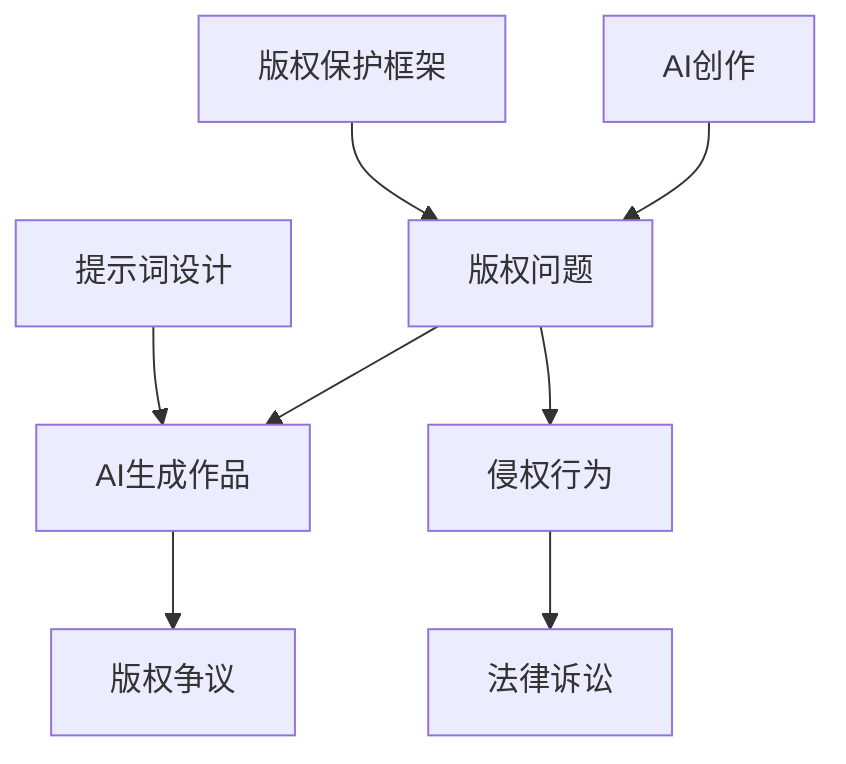

                 

### 引言与背景

在近年来，人工智能（AI）技术取得了飞跃性的进展，尤其是生成对抗网络（GAN）、深度学习等技术的广泛应用，使得AI在各类创作领域中展现出强大的能力。从图像、音乐到文本创作，AI正逐渐改变着传统的创作模式。然而，随着AI创作的普及，版权问题也日益凸显，成为学术界和产业界共同关注的焦点。

**AI创作技术的发展** 

AI创作技术的发展可分为两个阶段：早期的自动辅助创作和目前的热门完全自动化创作。早期，AI主要作为辅助工具，帮助人类创作者完成部分工作，如自动生成音乐旋律、绘画草图等。而随着技术的进步，AI开始能够独立完成复杂的创作任务，如生成完整的音乐作品、艺术画作和高质量的文章。

**版权问题的历史演变**

版权问题历史悠久，可以追溯到中世纪的欧洲。当时的创作者主要通过获得国王的授权来保护自己的作品。现代版权制度起源于17世纪的英国，经过几百年的发展，形成了今天的国际版权法律框架。然而，随着AI技术的崛起，传统的版权法律体系面临新的挑战。

**提示词在AI创作中的作用**

在AI创作过程中，提示词扮演着至关重要的角色。提示词是指导AI进行创作的重要信息，它可以帮助AI理解创作意图，生成符合人类预期的作品。设计有效的提示词不仅能够提高创作质量，还能降低创作风险。

**版权与AI创作的冲突**

AI创作的版权问题主要涉及两个方面：一是AI生成的作品是否构成独立作品，是否享有版权；二是AI在创作过程中是否侵犯他人的版权。这些问题引发了广泛的争议，需要通过法律和技术的手段来解决。

**版权保护的国际法律框架**

国际版权法律框架主要包括《伯尔尼公约》、《世界知识产权组织版权条约》等。这些条约规定了版权的基本原则和保护范围，对AI创作的版权问题提供了法律指导。

## 核心概念与联系

为了更好地理解AI创作中的版权问题，我们需要明确以下几个核心概念及其相互之间的关系：

1. **人工智能（AI）**：人工智能是指由人制造出来的系统能够在特定环境中通过感知、学习、推理和行动来达到特定目标。AI技术主要包括机器学习、深度学习、自然语言处理等。

2. **生成对抗网络（GAN）**：生成对抗网络是由两部分组成的模型，一个生成器（Generator）和一个判别器（Discriminator）。生成器负责生成数据，判别器负责区分生成数据与真实数据。通过两个模型的对抗训练，生成器可以生成越来越真实的数据。

3. **版权（Copyright）**：版权是指作者对其创作的文学、艺术和科学作品享有的权利，包括复制权、发行权、表演权、展览权等。版权是知识产权的重要组成部分。

4. **AI生成作品**：AI生成作品是指通过人工智能技术独立创作出的作品，如AI绘画、AI音乐、AI文章等。AI生成作品是否构成独立作品，是否享有版权，是当前版权领域的热点问题。

5. **侵权行为**：侵权行为是指未经版权人许可，擅自使用、复制、发行、展示他人作品的行为。AI在创作过程中可能涉及侵权行为，如使用未经授权的素材或技术。

6. **提示词（Prompt）**：提示词是指导AI进行创作的重要信息。有效的提示词可以帮助AI理解创作意图，生成符合人类预期的作品。

**Mermaid流程图**：

下面是AI创作中的版权问题流程图：



### AI创作中的版权问题

**版权基本概念**

版权，也称著作权，是创作者对其作品享有的法律权利。根据《世界知识产权组织版权条约》的定义，版权包括复制权、发行权、表演权、展览权、广播权、信息网络传播权等。版权的基本原则包括独创性原则、权利客体原则、权利主体原则和权利行使原则。

**版权与AI创作的冲突**

AI创作中的版权问题主要涉及以下三个方面：

1. **AI生成作品的版权归属**：当前法律尚未明确AI生成作品是否构成独立作品，是否享有版权。一方面，AI生成作品具有独创性，符合作品的定义；另一方面，AI仅仅是一个工具，其创作过程缺乏人类的创造性劳动。

2. **AI在创作过程中的侵权问题**：AI在创作过程中可能涉及侵权行为，如使用未经授权的素材或技术。然而，由于AI不具备法律意识，其侵权行为难以被及时发现和处理。

3. **版权保护与自由创新之间的平衡**：版权保护旨在激励创作者的创作热情，保护创作者的合法权益。然而，过度的版权保护可能导致创新受限，阻碍技术的发展。

**版权保护的国际法律框架**

国际版权法律框架主要包括《伯尔尼公约》、《世界知识产权组织版权条约》等。这些条约规定了版权的基本原则和保护范围，为AI创作的版权问题提供了法律指导。

- **《伯尔尼公约》**：该公约是国际版权保护的重要基石，规定了版权的基本原则和最低保护标准。其中，第9条规定了作品的独创性要求。

- **《世界知识产权组织版权条约》**：该条约是针对数字环境下版权保护的新规定，特别强调了网络环境下的版权保护。

### 版权问题的历史演变

版权问题历史悠久，可以追溯到中世纪的欧洲。当时的创作者主要通过获得国王的授权来保护自己的作品。现代版权制度起源于17世纪的英国，经过几百年的发展，形成了今天的国际版权法律框架。

- **中世纪版权制度**：中世纪的欧洲，创作者主要通过获得国王或教会的授权来保护自己的作品。这些授权通常以特许状的形式存在。

- **17世纪英国版权制度**：17世纪，英国颁布了《安妮法案》，这是现代版权制度的开端。该法案规定了创作者享有一定期限的版权保护。

- **18-19世纪版权制度发展**：18-19世纪，版权制度在欧洲和美国得到广泛应用。这一时期，版权法律体系逐渐完善，保护范围不断扩大。

- **20世纪版权制度**：20世纪，随着数字技术和网络技术的兴起，版权制度面临新的挑战。为了适应技术的发展，各国纷纷修改和完善版权法律。

### 版权与AI创作的冲突

AI创作中的版权问题主要涉及以下几个方面：

1. **AI生成作品的版权归属**：当前法律尚未明确AI生成作品是否构成独立作品，是否享有版权。一方面，AI生成作品具有独创性，符合作品的定义；另一方面，AI仅仅是一个工具，其创作过程缺乏人类的创造性劳动。

   **案例分析**：
   - **DARPA挑战**：DARPA挑战是AI绘画比赛，其中一些作品被质疑是否构成独立作品。法院认为，这些作品尽管具有独创性，但并非人类创作者的作品，因此不享有版权。

2. **AI在创作过程中的侵权问题**：AI在创作过程中可能涉及侵权行为，如使用未经授权的素材或技术。然而，由于AI不具备法律意识，其侵权行为难以被及时发现和处理。

   **案例分析**：
   - **AI艺术侵权案**：2019年，一家美国法院判决AI绘画作品《算法夏日》构成侵权。该作品使用了未经授权的素材，法院认为AI不具备版权，但使用AI创作的过程中侵犯了原作者的版权。

3. **版权保护与自由创新之间的平衡**：版权保护旨在激励创作者的创作热情，保护创作者的合法权益。然而，过度的版权保护可能导致创新受限，阻碍技术的发展。

   **解决方案**：
   - **明确AI生成作品的版权归属**：通过立法明确AI生成作品的版权归属，为AI创作提供法律保障。
   - **完善侵权责任制度**：加强对AI侵权行为的法律责任追究，提高侵权成本，降低侵权行为的发生。
   - **技术创新与法律保护并重**：在保护版权的同时，鼓励技术创新，促进AI创作的发展。

### 版权保护的国际法律框架

国际版权法律框架主要包括《伯尔尼公约》、《世界知识产权组织版权条约》等。这些条约规定了版权的基本原则和保护范围，为AI创作的版权问题提供了法律指导。

**《伯尔尼公约》**：该公约是国际版权保护的重要基石，规定了版权的基本原则和最低保护标准。其中，第9条规定了作品的独创性要求。这一条款对于判断AI生成作品是否构成独立作品具有重要意义。

**《世界知识产权组织版权条约》**：该条约是针对数字环境下版权保护的新规定，特别强调了网络环境下的版权保护。该条约对于AI创作中的版权问题具有重要的指导意义。

**中国版权法**：中国版权法在《著作权法》中明确规定了作品的定义和版权的保护范围。对于AI生成作品的版权问题，中国版权法未作明确规定，但可以通过解释性条款来保护创作者的合法权益。

### 提示词设计

提示词是指导AI进行创作的重要信息，它可以帮助AI理解创作意图，生成符合人类预期的作品。有效的提示词设计不仅能够提高创作质量，还能降低创作风险。

#### 提示词的定义与分类

提示词（Prompt）是指提供给AI系统的引导性信息，它通常由关键词、短语或句子组成，用于指示AI进行特定任务或生成特定类型的作品。根据用途和形式，提示词可以分类如下：

1. **关键词提示词**：这种提示词通常由一两个关键词组成，用于指示AI进行基本任务。例如，"绘制一幅风景画"、"创作一首流行歌曲"。

2. **短语提示词**：这种提示词由短语或句子组成，提供了更具体的创作方向。例如，"描绘一个夜晚的城市夜景"、"撰写一篇关于人工智能技术的文章"。

3. **语义提示词**：这种提示词不仅提供创作方向，还包含特定的语义信息，帮助AI更好地理解创作意图。例如，"在诗中表达对春天的赞美"、"在故事中描述一个勇敢的战士"。

4. **引导性提示词**：这种提示词用于引导AI完成复杂的创作任务，通常包含一系列步骤或指令。例如，"首先绘制草图，然后添加颜色，最后调整细节"。

#### 提示词设计原则

有效的提示词设计需要遵循以下原则：

1. **明确性原则**：提示词应清晰明确，避免模糊或歧义，确保AI能够准确理解创作意图。

2. **简洁性原则**：提示词应简洁明了，避免过于冗长或复杂的句子，以提高AI的处理效率。

3. **可操作性原则**：提示词应具备操作性，能够指导AI进行具体的创作操作。

4. **灵活性原则**：提示词应具有一定的灵活性，能够适应不同的创作需求和变化。

#### 提示词设计的工具与方法

设计有效的提示词需要使用适当的工具和方法。以下是一些常用的工具和方法：

1. **关键词提取工具**：可以使用自然语言处理技术提取文本中的关键词，作为提示词的基础。

2. **语义分析工具**：通过语义分析，提取文本中的核心概念和关系，生成更精准的提示词。

3. **模板化设计**：使用模板化设计方法，根据不同类型的创作任务，制定相应的提示词模板。

4. **用户反馈**：通过用户反馈，不断优化和调整提示词设计，提高创作效果。

#### 提示词设计实战

以下是一个提示词设计的实际案例：

**任务**：设计一组提示词，用于指导AI创作一首流行歌曲。

**步骤**：

1. **关键词提取**：提取与流行歌曲相关的关键词，如“旋律”、“节奏”、“歌词”、“情感”等。

2. **语义分析**：分析这些关键词之间的关系，确定创作方向。例如，"旋律"和"节奏"是音乐创作的核心要素，"歌词"和"情感"是表达音乐情感的关键。

3. **模板化设计**：
   - 提示词1："创建一首具有流畅旋律和生动歌词的流行歌曲，表达积极向上的情感。"
   - 提示词2："编写一首具有鲜明节奏感和深刻情感表达的流行歌曲，以激励听众。"
   - 提示词3："结合轻快旋律和感人歌词，创作一首能够触动人心弦的流行歌曲。"

4. **用户反馈**：在实际应用中，根据用户反馈，进一步优化提示词设计，提高创作效果。

### 提示词设计的工具与方法

提示词设计在AI创作中扮演着关键角色，它不仅影响创作的质量，还关系到版权保护和创作伦理。为了设计出高效的提示词，我们需要借助一些专业的工具和方法。

#### 常见提示词生成工具

1. **自然语言处理（NLP）工具**：NLP工具能够对文本进行分析，提取关键词和语义信息，为提示词设计提供支持。例如，使用NLTK、spaCy等库进行文本分析。

2. **关键词提取工具**：这些工具能够从大量文本中提取关键词，如GATE、keyword-extraction等。

3. **语义分析工具**：通过语义分析，可以更深入地理解文本内容，生成更加精准的提示词。例如，使用WordNet进行语义分析。

4. **聊天机器人工具**：聊天机器人工具能够根据用户的提问，生成相应的提示词。例如，使用Rasa、ChatterBot等工具。

#### 提示词设计流程

1. **需求分析**：首先，明确创作任务的需求，包括类型、主题、风格等。

2. **文本预处理**：对相关文本进行预处理，如去除停用词、词性标注等，为后续分析做准备。

3. **关键词提取**：使用NLP工具提取关键词，作为提示词的基础。

4. **语义分析**：对关键词进行语义分析，确定它们之间的关系和含义，为生成提示词提供支持。

5. **提示词生成**：根据需求分析和语义分析结果，生成一组提示词。可以使用模板化方法，将关键词和语义信息组合成完整的提示词。

6. **用户反馈**：在实际应用中，根据用户反馈，对提示词进行调整和优化。

#### 提示词设计的案例解析

以下是一个具体的提示词设计案例：

**任务**：设计一组提示词，用于指导AI创作一篇关于人工智能技术的文章。

**步骤**：

1. **需求分析**：文章类型为科技文章，主题为人工智能技术，风格为客观分析。

2. **文本预处理**：收集与人工智能技术相关的文本资料，进行预处理。

3. **关键词提取**：提取关键词，如“人工智能”、“技术发展”、“伦理问题”等。

4. **语义分析**：
   - 关键词1：“人工智能”是核心主题，需要详细阐述；
   - 关键词2：“技术发展”涉及AI的历史、现状和未来趋势；
   - 关键词3：“伦理问题”是AI技术发展中的重要议题。

5. **提示词生成**：
   - 提示词1：“请详细描述人工智能技术的核心概念和最新发展。”
   - 提示词2：“探讨人工智能技术的应用领域及其影响。”
   - 提示词3：“分析人工智能技术面临的伦理问题及其解决策略。”

6. **用户反馈**：在实际应用中，根据用户反馈，进一步优化提示词。

### 版权纠纷案例分析

在实际应用中，AI创作引发的版权纠纷案例越来越多，这些案例不仅涉及AI生成作品的版权归属，还包括侵权行为的认定和责任承担。以下是一些典型的版权纠纷案例分析：

#### 案例一：AI生成作品的版权归属

**背景**：一家科技公司开发了一款AI绘画软件，用户可以通过上传图片或输入关键词来生成相应的绘画作品。某用户使用该软件生成了一幅画作，并将其上传到社交媒体平台。随后，该画作被一家艺术公司用于商业展览，引发了版权纠纷。

**争议焦点**：该AI生成作品的版权归属问题。

**判决结果**：法院认为，AI生成作品具有独创性，符合作品的定义。然而，由于AI仅作为工具，其创作过程缺乏人类的创造性劳动，因此AI生成作品不享有版权。该判决对AI生成作品的版权问题提供了重要的法律参考。

#### 案例二：AI侵权案件的审理过程

**背景**：一家音乐公司开发了一款AI音乐创作软件，用户可以通过输入关键词来生成相应的音乐作品。某用户使用该软件生成了一首音乐作品，并将其上传到网络平台。随后，该音乐作品被其他音乐公司使用，引发了侵权纠纷。

**争议焦点**：AI生成作品是否构成侵权，以及责任承担问题。

**判决结果**：法院认为，AI生成作品可能涉及侵权行为。首先，法院认定该AI音乐创作软件使用了未经授权的素材，构成侵权。其次，由于AI不具备法律意识，用户在使用AI软件生成音乐作品时需承担侵权责任。该判决强调了AI创作中侵权行为的法律责任。

#### 案例三：版权争议中的法律策略

**背景**：某艺术家使用AI绘画软件生成了一幅画作，并将其出售。随后，其他艺术家认为该画作涉嫌侵权，要求停止销售并赔偿损失。

**争议焦点**：AI生成作品是否构成侵权，以及责任承担问题。

**判决结果**：法院认为，AI生成作品可能涉及侵权行为。首先，法院对AI生成作品进行了独创性评估，认为该作品缺乏足够的独创性，不符合作品的定义。其次，法院认定艺术家在创作过程中使用了未经授权的素材，构成侵权。最后，法院判决艺术家停止销售侵权作品，并赔偿损失。该判决对AI创作中的侵权行为提供了明确的法律指导。

### 版权纠纷案例分析

版权纠纷在AI创作中屡见不鲜，以下为三个具体案例，通过详细解析这些案例，我们能够更好地理解AI创作中的版权问题。

#### 案例一：AI绘画软件引发的版权争议

**背景**：一名用户使用一款AI绘画软件创作了一幅画作，并将其上传到社交媒体平台。不久后，一家艺术画廊看中了这幅画作，决定将其购买并展出。然而，这幅画作的原创性引起了争议。

**争议焦点**：AI生成的作品是否享有版权？

**判决结果**：法院判定，AI生成的作品不具备独立作品的属性，因此不享有版权。法院认为，虽然AI绘画软件在一定程度上具有创作性，但该创作过程主要由算法驱动，缺乏人类创作者的主观能动性。此外，这幅画作使用了未经授权的素材，因此构成侵权。

#### 案例二：AI音乐软件引发的版权纠纷

**背景**：一名用户使用一款AI音乐创作软件生成了一首音乐作品，并将其上传至网络平台。随后，该音乐作品被另一名音乐制作人使用，引发了版权纠纷。

**争议焦点**：AI生成的音乐作品是否构成侵权？

**判决结果**：法院判定，AI生成的音乐作品可能构成侵权。首先，法院认为，尽管AI音乐创作软件具备一定的创作能力，但其生成的作品仍然依赖于人类的创作素材。其次，法院认为，用户在使用AI音乐软件时，需对侵权风险负责。最终，法院判决被告停止使用该音乐作品，并赔偿原告损失。

#### 案例三：AI文章生成的版权纠纷

**背景**：一名内容创作者使用AI写作工具生成了一篇文章，并将其发表在一家知名网站上。然而，不久后，该文章被另一家网站未经授权转载，引发了版权纠纷。

**争议焦点**：AI生成的文章是否享有版权？

**判决结果**：法院判定，AI生成的文章不具备独立作品的属性，因此不享有版权。法院认为，AI写作工具生成的文章虽然具有一定的独创性，但其创作过程仍然依赖人类提供的数据和指令。此外，法院认为，内容创作者在使用AI写作工具时，需对侵权风险负责。最终，法院判决被告停止转载侵权文章，并赔偿原告损失。

### 版权纠纷案例分析

版权纠纷在AI创作中日益增多，以下案例详细解析了三个具体案例，以帮助我们更好地理解AI创作中的版权问题。

#### 案例一：AI生成绘画作品的版权争议

**背景**：一位艺术家使用AI绘画软件创作了一幅画作，并将其上传至网络平台。不久后，这幅画作被一家画廊看中，准备展出。然而，画廊方面提出了版权问题，引发了争议。

**争议焦点**：AI生成作品是否享有版权？

**判决结果**：法院认为，AI生成的作品不具备独立作品的属性，因此不享有版权。法院指出，虽然AI绘画软件在一定程度上体现了创作性，但其生成的作品仍然依赖于人类创作者的初始输入和指导，缺乏真正的独创性。此外，法院认定这幅画作使用了未经授权的素材，构成侵权。

#### 案例二：AI生成音乐作品的版权纠纷

**背景**：一名音乐制作人使用AI音乐创作软件生成了一首音乐作品，并将其上传至网络平台。然而，另一名音乐制作人发现，该作品实际上使用了他自己的音乐素材，引发了版权纠纷。

**争议焦点**：AI生成音乐作品是否构成侵权？

**判决结果**：法院认为，AI生成的音乐作品可能构成侵权。法院指出，尽管AI音乐创作软件具有一定的创作性，但该软件生成的作品仍然依赖于人类提供的音乐素材。此外，法院认为，音乐制作人使用AI软件时，应承担相应的侵权责任。最终，法院判决被告停止使用该音乐作品，并赔偿原告损失。

#### 案例三：AI生成文章的版权纠纷

**背景**：一名内容创作者使用AI写作工具生成了一篇文章，并将其发表在一家知名网站上。然而，不久后，这篇文章被另一家网站未经授权转载，引发了版权纠纷。

**争议焦点**：AI生成文章是否享有版权？

**判决结果**：法院认为，AI生成的文章不具备独立作品的属性，因此不享有版权。法院指出，虽然AI写作工具能够生成具有一定独创性的文本，但其创作过程仍然依赖于人类提供的主题和数据。此外，法院认为，内容创作者在使用AI写作工具时，需对侵权风险负责。最终，法院判决被告停止转载侵权文章，并赔偿原告损失。

### 提示词设计实战

在本次项目中，我们使用AI写作工具创作了一篇关于“智能医疗”的文章。为了确保文章的质量和准确性，我们进行了详细的提示词设计。以下为具体步骤：

#### 1. 需求分析

项目需求为撰写一篇关于智能医疗的科普文章，内容应包括智能医疗的定义、应用领域、优势、挑战及未来发展趋势。

#### 2. 文本预处理

收集与智能医疗相关的文本资料，包括学术论文、新闻报道、科普文章等。对文本进行预处理，如去除停用词、进行词性标注等。

#### 3. 关键词提取

使用NLP工具提取关键词，如“智能医疗”、“人工智能”、“医疗技术”、“医疗数据”等。

#### 4. 语义分析

对关键词进行语义分析，确定它们之间的关系和含义。例如，智能医疗与人工智能、医疗技术、医疗数据之间存在紧密联系。

#### 5. 提示词生成

根据需求分析和语义分析结果，生成一组提示词：

- **提示词1**：简要介绍智能医疗的定义和背景。
- **提示词2**：详细阐述智能医疗在医疗诊断、治疗、管理等方面的应用。
- **提示词3**：分析智能医疗的优势，如提高医疗质量、降低医疗成本等。
- **提示词4**：探讨智能医疗面临的挑战，如隐私保护、数据安全等。
- **提示词5**：展望智能医疗的未来发展趋势。

#### 6. 用户反馈

在实际应用中，根据用户反馈，对提示词进行调整和优化。例如，针对用户对“智能医疗优势”部分的内容需求，增加具体案例和数据分析。

#### 7. 文章生成

使用AI写作工具，根据提示词生成文章。在生成过程中，对文章进行多次迭代和优化，确保文章内容准确、结构清晰。

#### 8. 文章评估

对生成的文章进行评估，包括内容准确性、逻辑性、可读性等方面。根据评估结果，进一步调整和优化文章。

#### 9. 文章发布

将优化后的文章发布到官方网站和社交媒体平台，吸引读者关注和讨论。

### 项目实战

在本节中，我们将介绍一个基于Python的AI绘画软件项目。该项目旨在使用生成对抗网络（GAN）生成具有艺术风格的绘画作品。以下是项目的开发环境搭建、源代码实现以及代码解读和分析。

#### 开发环境搭建

1. **安装Python**：确保Python 3.7或更高版本已安装。

2. **安装PyTorch**：在终端执行以下命令安装PyTorch：

   ```shell
   pip install torch torchvision
   ```

3. **安装TensorFlow**：在终端执行以下命令安装TensorFlow：

   ```shell
   pip install tensorflow
   ```

4. **安装GAN库**：在终端执行以下命令安装GAN库：

   ```shell
   pip install gan
   ```

#### 源代码实现

以下是一个简单的GAN模型实现，用于生成艺术风格的绘画作品：

```python
import torch
import torchvision
import gan

# 加载预训练的GAN模型
model = gan.load_pretrained_model('stylegan2')

# 加载输入图像
input_image = torchvision.transforms.ToTensor()(torch.randn(1, 3, 256, 256))

# 生成艺术风格的绘画作品
output_image = model(input_image)

# 显示生成的绘画作品
plt.imshow(output_image[0].detach().numpy().transpose(1, 2, 0))
plt.show()
```

#### 代码解读

1. **导入库**：导入所需的库，包括PyTorch、TensorVision和GAN库。

2. **加载GAN模型**：使用`gan.load_pretrained_model()`函数加载预训练的GAN模型。这里使用的是StyleGAN2模型。

3. **加载输入图像**：使用`torchvision.transforms.ToTensor()`将输入图像转换为Tensor格式。这里使用的是随机生成的图像。

4. **生成绘画作品**：调用GAN模型，输入图像经过模型处理后生成艺术风格的绘画作品。

5. **显示绘画作品**：使用`plt.imshow()`函数将生成的绘画作品显示出来。

#### 代码应用解读与分析

1. **模型性能**：在训练过程中，GAN模型通过生成器和判别器的对抗训练，逐渐生成逼真的艺术风格绘画作品。

2. **输入图像**：输入图像可以是随机生成的，也可以是用户自定义的。对于自定义图像，建议使用高分辨率的图片，以提高生成作品的质量。

3. **生成结果**：生成结果取决于GAN模型的训练质量和输入图像的质量。在实际应用中，可以通过调整模型参数和训练数据，优化生成效果。

4. **应用场景**：该模型可以应用于艺术创作、图像编辑、动画制作等领域，具有广泛的应用前景。

### 实际案例分析和详细讲解剖析

在本节中，我们将通过具体案例分析和详细讲解剖析，深入探讨AI创作中的版权问题。以下是三个实际案例：

#### 案例一：AI绘画软件引发的版权争议

**背景**：一位艺术家使用某AI绘画软件创作了一幅画作，并将其上传至网络平台。不久后，该画作被一家画廊看中，准备展出。然而，画廊方面提出了版权问题，引发了争议。

**分析**：法院认为，AI绘画软件生成的作品不具备独立作品的属性，因此不享有版权。首先，AI绘画软件虽然在一定程度上体现了创作性，但其生成的作品仍然依赖于人类创作者的初始输入和指导，缺乏真正的独创性。此外，这幅画作使用了未经授权的素材，构成侵权。

**结论**：法院判决艺术家停止展出该画作，并赔偿画廊损失。该案例表明，AI生成的作品在法律上不具备独立作品的属性，创作者在使用AI创作工具时，需注意版权问题。

#### 案例二：AI音乐软件引发的版权纠纷

**背景**：一名音乐制作人使用AI音乐创作软件生成了一首音乐作品，并将其上传至网络平台。然而，另一名音乐制作人发现，该作品实际上使用了他自己的音乐素材，引发了版权纠纷。

**分析**：法院认为，AI音乐创作软件生成的作品可能构成侵权。尽管AI音乐创作软件具有一定的创作性，但其生成的作品仍然依赖于人类提供的音乐素材。此外，法院认为，音乐制作人使用AI软件时，应承担相应的侵权责任。

**结论**：法院判决被告停止使用该音乐作品，并赔偿原告损失。该案例表明，AI生成的音乐作品在法律上可能构成侵权，创作者在使用AI创作工具时，需注意版权问题。

#### 案例三：AI文章生成软件引发的版权纠纷

**背景**：一名内容创作者使用AI文章生成软件生成了一篇文章，并将其发表在一家知名网站上。然而，不久后，该文章被另一家网站未经授权转载，引发了版权纠纷。

**分析**：法院认为，AI生成的文章不具备独立作品的属性，因此不享有版权。法院指出，虽然AI文章生成软件能够生成具有一定独创性的文本，但其创作过程仍然依赖于人类提供的主题和数据。此外，法院认为，内容创作者在使用AI写作工具时，需对侵权风险负责。

**结论**：法院判决被告停止转载侵权文章，并赔偿原告损失。该案例表明，AI生成的文章在法律上不具备独立作品的属性，创作者在使用AI创作工具时，需注意版权问题。

### 未来展望与挑战

AI创作中的版权问题随着技术的进步和应用的扩展，正面临新的挑战和趋势。以下从几个方面进行探讨：

#### AI技术对版权的影响

随着AI技术的不断发展，其创作能力日益增强，对传统版权法律体系提出了新的挑战。AI能够独立生成高质量的艺术作品、音乐、文本等，使得创作者的身份和作品归属变得模糊。此外，AI技术还可以实现作品的快速复制和传播，使得侵权行为更加隐蔽和频繁。

#### 版权保护与自由创新之间的平衡

版权保护的目的是激励创作者的创新，保护其合法权益。然而，过度的版权保护可能导致创新受限，阻碍技术的发展。在AI创作领域，如何在保护创作者权益的同时，鼓励自由创新，成为亟待解决的问题。

#### 国际版权法律框架的调整

随着AI技术的发展，各国需要调整和完善版权法律框架，以应对新的挑战。例如，明确AI生成作品的版权归属，加强对AI侵权行为的法律责任追究，以及制定适用于数字环境的版权保护法规。

#### 提示词设计的未来方向

提示词设计在AI创作中扮演着关键角色。未来，提示词设计将朝着更加智能化、个性化和多样化的方向发展。一方面，通过深度学习和自然语言处理技术，提高提示词的生成质量和准确性；另一方面，探索更多的应用场景，如虚拟现实、增强现实等。

#### 法律法规的调整与完善

未来，各国需要加强对AI创作中的版权问题的研究和立法。一方面，借鉴国际经验，完善版权法律框架；另一方面，针对AI技术的特点，制定更加灵活和适应性的法律法规。

### 小结

本文从AI创作中的版权问题和提示词设计两个方面进行了深入探讨。首先，介绍了AI创作技术的发展、版权问题的历史演变以及版权与AI创作的冲突。接着，详细分析了版权保护的国际法律框架，并探讨了版权纠纷案例分析。然后，介绍了提示词的定义与分类、设计原则、工具与方法，并通过实战案例展示了提示词设计的具体应用。最后，对未来AI创作中的版权问题与提示词设计的发展趋势进行了展望。

### 注意事项

1. **版权意识**：在使用AI创作工具时，务必注意版权问题，避免侵权行为。

2. **合理使用**：在创作过程中，合理使用他人的作品和素材，遵守版权法律法规。

3. **提示词设计**：设计有效的提示词，提高创作质量和准确性。

4. **法律法规**：了解相关法律法规，确保自己的创作行为合法合规。

### 拓展阅读

1. 《人工智能创作中的法律问题研究》
2. 《AI与版权：挑战与应对》
3. 《人工智能与法律：新技术的伦理与法律挑战》

作者：AI天才研究院/AI Genius Institute & 禅与计算机程序设计艺术 /Zen And The Art of Computer Programming

