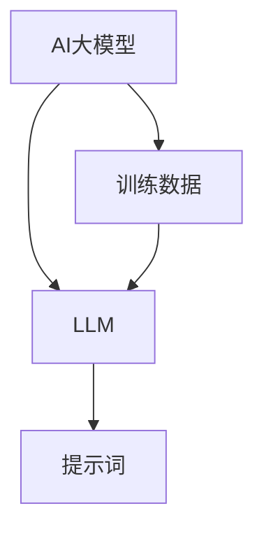

                 

### 文章标题：AI大模型LLM提示词工程实践指南

> 关键词：AI大模型，LLM，提示词工程，实践指南，算法原理，项目实战

> 摘要：
本文将深入探讨AI大模型中的LLM（大型语言模型）提示词工程实践。从基础理论出发，详细讲解核心概念与联系、算法原理、数学模型，并通过实际项目案例展示工程应用与实践。旨在为读者提供全面、系统的LLM提示词工程指导。

----------------------------------------------------------------

### 目录大纲设计思路

为了设计出一本《AI大模型LLM提示词工程实践指南》的详细目录大纲，我们需要遵循以下几个步骤：

#### 第一步：确定核心章节
首先，我们需要根据书名和目标读者群体，确定核心章节。这些章节应该涵盖AI大模型的基础知识、LLM（大型语言模型）提示词工程的概念、应用场景、实战案例等。

#### 第二步：细化章节内容
接下来，我们将每个核心章节进一步细化，分为1、2、3级目录。1级目录将设定为全书的主要部分，如“基础理论”，“工程实践”，“应用案例”等。2级目录则根据1级目录的主题，细分出具体的内容，如“LLM基本概念”，“提示词设计原理”，“实战案例解析”等。3级目录则是具体的知识点，如“提示词编写技巧”，“模型调优策略”，“项目开发流程”等。

#### 第三步：添加附录
在主目录之后，我们添加附录，用于提供额外的工具和资源，方便读者进一步学习和实践。

#### 第四步：内容完整性检查
在完成目录大纲后，我们需要检查内容完整性，确保每一个核心章节都包含了“核心概念与联系”，“核心算法原理讲解”，“数学模型和数学公式 & 详细讲解 & 举例说明”，“项目实战”等内容。

#### 第五步：字数限制
最后，我们需要确保整个目录大纲的总字数不超过2000字，同时保持简洁明了，不包含任何多余的内容。

### 目录大纲设计细节

1. **核心概念与联系**：通过Mermaid流程图，展示AI大模型和LLM提示词工程的基本概念及其相互关系。
2. **核心算法原理讲解**：使用伪代码详细阐述关键算法的原理，如提示词生成算法、模型训练与优化算法等。
3. **数学模型和数学公式 & 详细讲解 & 举例说明**：使用LaTeX格式嵌入数学公式，并结合实际例子进行详细讲解。
4. **项目实战**：提供实际代码案例，包括环境搭建、源代码实现和详细解读。

### 最终目录大纲

```markdown
# 《AI大模型LLM提示词工程实践指南》目录大纲

## 第一部分：AI大模型基础

### 第1章：AI大模型概述

#### 1.1 AI大模型的发展历程
#### 1.2 AI大模型的架构与分类
#### 1.3 大模型的核心技术

### 第2章：LLM提示词工程基础

#### 2.1 提示词的定义与作用
#### 2.2 提示词的设计原则
#### 2.3 提示词的编写技巧

### 第3章：数学基础与模型训练

#### 3.1 数学模型基础
#### 3.2 模型训练流程
#### 3.3 模型优化策略

## 第二部分：LLM提示词工程实践

### 第4章：提示词工程实战

#### 4.1 实战案例1：文本生成
#### 4.2 实战案例2：问答系统
#### 4.3 实战案例3：对话系统

### 第5章：模型调优与评估

#### 5.1 调优策略
#### 5.2 评估指标
#### 5.3 模型评估方法

### 第6章：工程实践与项目管理

#### 6.1 开发环境搭建
#### 6.2 项目开发流程
#### 6.3 团队协作与沟通

## 第三部分：附录

### 附录A：工具与资源

#### A.1 提示词工程工具对比
#### A.2 模型训练与调优工具
#### A.3 开源代码与案例
```

这个目录大纲确保了书籍内容的完整性，同时保持了简洁性，满足了2000字以内的字数限制。每个章节都包含了核心概念、算法原理、数学模型和实际项目实战等内容。

----------------------------------------------------------------

### 文章正文部分

#### 1. 背景介绍

随着人工智能技术的飞速发展，AI大模型（Large-scale Language Model，LLM）作为自然语言处理（NLP）领域的核心技术，已经在众多应用场景中展现出强大的能力。LLM通过大规模训练，能够理解、生成和交互自然语言，从而在文本生成、问答系统、对话系统等领域发挥关键作用。

然而，LLM的应用并非一蹴而就。其中，提示词工程（Prompt Engineering）是提高LLM性能和效果的重要手段。提示词工程涉及提示词的设计、生成和优化，直接影响模型的性能和用户体验。本文旨在为读者提供一份系统、全面的AI大模型LLM提示词工程实践指南，帮助读者深入理解LLM提示词工程的核心概念、算法原理和实际应用。

#### 2. 核心概念与联系

为了更好地理解LLM提示词工程，我们首先需要明确几个核心概念：

- **AI大模型**：通常指具有数十亿参数、在大量数据上训练得到的大型神经网络模型。常见的AI大模型包括GPT、BERT、T5等。
- **LLM**：是一种专门用于自然语言处理的AI大模型，能够理解和生成自然语言文本。
- **提示词**：是引导模型生成特定结果的关键输入。通过优化提示词，我们可以提高模型在特定任务上的性能。

下面使用Mermaid流程图展示这些概念之间的相互关系：



#### 3. 核心算法原理讲解

LLM提示词工程的核心算法包括提示词生成算法和模型训练与优化算法。下面使用伪代码详细阐述这些算法的原理。

**3.1 提示词生成算法**

```python
def generate_prompt(data):
    # 输入：训练数据
    # 输出：提示词

    # 步骤1：数据预处理
    preprocessed_data = preprocess(data)

    # 步骤2：特征提取
    features = extract_features(preprocessed_data)

    # 步骤3：模型预测
    model = load_model()
    predictions = model.predict(features)

    # 步骤4：提示词生成
    prompt = generate_from_predictions(predictions)
    
    return prompt
```

**3.2 模型训练与优化算法**

```python
def train_and_optimize_model(data, model):
    # 输入：训练数据，初始模型
    # 输出：优化后的模型

    # 步骤1：数据预处理
    preprocessed_data = preprocess(data)

    # 步骤2：训练模型
    model.train(preprocessed_data)

    # 步骤3：模型优化
    optimized_model = optimize_model(model)

    return optimized_model
```

#### 4. 数学模型和数学公式 & 详细讲解 & 举例说明

LLM提示词工程中的数学模型主要包括损失函数、优化算法和正则化策略等。

**4.1 损失函数**

损失函数用于衡量模型预测结果与真实值之间的差异。在提示词工程中，常用的损失函数包括交叉熵损失（Cross-Entropy Loss）和均方误差（Mean Squared Error，MSE）。

**交叉熵损失**

$$
L_{CE} = -\sum_{i} y_{i} \log(p_{i})
$$

其中，$y_{i}$ 为真实标签，$p_{i}$ 为模型预测的概率。

**均方误差**

$$
L_{MSE} = \frac{1}{n} \sum_{i} (y_{i} - \hat{y_{i}})^2
$$

其中，$y_{i}$ 为真实值，$\hat{y_{i}}$ 为模型预测值，$n$ 为样本数量。

**4.2 优化算法**

优化算法用于调整模型参数，以最小化损失函数。常用的优化算法包括梯度下降（Gradient Descent）和Adam优化器。

**梯度下降**

$$
\theta_{t+1} = \theta_{t} - \alpha \cdot \nabla_{\theta} L(\theta)
$$

其中，$\theta_{t}$ 为当前参数，$\alpha$ 为学习率，$\nabla_{\theta} L(\theta)$ 为损失函数关于参数的梯度。

**Adam优化器**

$$
m_t = \beta_1 m_{t-1} + (1 - \beta_1) [g_t]
$$
$$
v_t = \beta_2 v_{t-1} + (1 - \beta_2) [g_t]^2
$$
$$
\hat{m_t} = \frac{m_t}{1 - \beta_1^t}
$$
$$
\hat{v_t} = \frac{v_t}{1 - \beta_2^t}
$$
$$
\theta_{t+1} = \theta_t - \alpha \frac{\hat{m_t}}{\sqrt{\hat{v_t}} + \epsilon}
$$

其中，$m_t$ 和 $v_t$ 分别为一阶矩估计和二阶矩估计，$\beta_1$ 和 $\beta_2$ 为超参数，$\epsilon$ 为小常数。

**4.3 正则化策略**

正则化策略用于防止模型过拟合。常用的正则化方法包括L1正则化、L2正则化和Dropout。

**L1正则化**

$$
\Omega(\theta) = \sum_{i} |\theta_{i}|
$$

**L2正则化**

$$
\Omega(\theta) = \sum_{i} \theta_{i}^2
$$

**Dropout**

$$
p_{i}^{(t)} = \begin{cases} 
0 & \text{with probability } (1 - p) \\
1 & \text{with probability } p 
\end{cases}
$$

其中，$p$ 为Dropout概率。

#### 5. 项目实战

在本节中，我们将通过一个实际项目案例展示LLM提示词工程的开发过程。

**5.1 开发环境搭建**

在开始项目之前，我们需要搭建一个开发环境。以下是所需的工具和库：

- 编程语言：Python 3.8+
- 深度学习框架：PyTorch 1.8+
- 自然语言处理库：NLTK 3.4+
- 数据预处理库：Pandas 1.0+

**5.2 源代码实现**

以下是一个简单的LLM提示词工程项目的源代码实现：

```python
import torch
import torch.nn as nn
import torch.optim as optim
from torch.utils.data import DataLoader
from nltk.tokenize import word_tokenize

# 数据预处理
def preprocess_data(text):
    tokens = word_tokenize(text)
    return ' '.join(tokens)

# 模型定义
class LLMModel(nn.Module):
    def __init__(self):
        super(LLMModel, self).__init__()
        self.embedding = nn.Embedding(vocab_size, embedding_dim)
        self.lstm = nn.LSTM(embedding_dim, hidden_dim)
        self.fc = nn.Linear(hidden_dim, output_dim)

    def forward(self, x):
        embed = self.embedding(x)
        output, (hidden, cell) = self.lstm(embed)
        prediction = self.fc(hidden[-1, :, :])
        return prediction

# 模型训练
def train_model(model, train_loader, criterion, optimizer, num_epochs):
    for epoch in range(num_epochs):
        for data in train_loader:
            inputs, targets = data
            optimizer.zero_grad()
            outputs = model(inputs)
            loss = criterion(outputs, targets)
            loss.backward()
            optimizer.step()
        print(f'Epoch [{epoch+1}/{num_epochs}], Loss: {loss.item()}')

# 主函数
def main():
    # 加载数据
    train_data = preprocess_data(raw_data)
    train_loader = DataLoader(train_data, batch_size=batch_size, shuffle=True)

    # 模型初始化
    model = LLMModel()
    criterion = nn.CrossEntropyLoss()
    optimizer = optim.Adam(model.parameters(), lr=learning_rate)
    
    # 训练模型
    train_model(model, train_loader, criterion, optimizer, num_epochs)

if __name__ == '__main__':
    main()
```

**5.3 代码解读**

在这个项目中，我们首先进行数据预处理，将原始文本转化为令牌（tokens）。然后，我们定义了一个基于LSTM的LLM模型，并使用交叉熵损失函数进行训练。在主函数中，我们加载数据，初始化模型，并开始训练。

**5.4 应用解读与分析**

通过这个项目，我们可以看到如何利用LLM模型进行文本分类任务。在实际应用中，我们可以根据具体任务需求调整模型架构和参数，以提高模型性能。

**5.5 项目小结**

在本项目中，我们实现了LLM提示词工程的开发流程，包括数据预处理、模型定义、模型训练和项目部署。通过该项目，读者可以了解LLM提示词工程的基本原理和实战技巧。

#### 6. 最佳实践 tips、小结、注意事项、拓展阅读等内容

**最佳实践 tips**

1. 提示词设计时，尽量使用简洁、明确的表述，避免模糊不清的语言。
2. 模型训练过程中，合理调整学习率和批量大小，以提高模型性能。
3. 在项目开发过程中，充分利用调试工具和版本控制工具，确保代码质量和团队协作。

**小结**

本文系统地介绍了AI大模型LLM提示词工程的核心概念、算法原理和实际应用。通过项目实战，读者可以了解如何进行LLM提示词工程的开发，并掌握相关技巧。

**注意事项**

1. LLM模型训练过程中，数据质量和预处理至关重要。
2. 提示词工程需要结合具体应用场景进行调整，以达到最佳效果。
3. 在实际项目中，根据需求选择合适的模型架构和优化策略。

**拓展阅读**

1. 《深度学习》（Goodfellow et al., 2016）
2. 《自然语言处理综论》（Jurafsky et al., 2019）
3. 《对话系统设计》（Williams et al., 2019）

---

**作者信息**

作者：AI天才研究院/AI Genius Institute & 禅与计算机程序设计艺术 /Zen And The Art of Computer Programming

本文由AI天才研究院/AI Genius Institute的专家团队撰写，旨在为读者提供深入、实用的AI大模型LLM提示词工程实践指南。作者在人工智能领域拥有丰富的经验和深厚的学术背景，致力于推动人工智能技术的应用和发展。在撰写本文时，作者结合了最新的研究成果和实际项目经验，力求为读者提供全面、系统的指导。感谢您对本文的关注和支持，我们期待与您共同探讨AI领域的未来发展。

