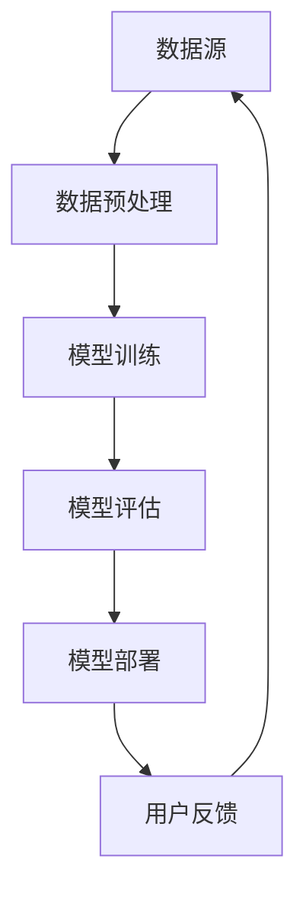

                 

### 文章标题

# AI大模型的提示词知识迁移技术

### 关键词

- AI大模型
- 提示词知识迁移
- 知识图谱
- 预训练模型
- 算法优化

### 摘要

本文深入探讨了AI大模型的提示词知识迁移技术。首先，介绍了AI大模型的基本概念和提示词知识迁移技术的定义，以及它们在当前人工智能领域的应用和重要性。接着，文章详细解析了核心算法原理，包括知识图谱构建、预训练模型和迁移学习等。随后，通过实际项目实战，展示了如何将这一技术应用于实际开发中。最后，对未来的发展趋势和挑战进行了展望，并提出了相应的解决策略和最佳实践。

## 目录

1. **AI大模型概述**
   1.1. **AI大模型的概念**
   1.2. **提示词知识迁移技术**
   1.3. **AI大模型的发展历程**
   1.4. **提示词知识迁移技术的基本原理**

2. **AI大模型的核心算法**
   2.1. **算法概述**
   2.2. **数学模型和公式**
   2.3. **伪代码讲解**
   2.4. **算法应用示例**

3. **提示词知识迁移技术应用实例**
   3.1. **项目背景**
   3.2. **开发环境搭建**
   3.3. **源代码实现**
   3.4. **代码解读与分析**

4. **AI大模型与提示词知识迁移技术的融合**
   4.1. **融合概述**
   4.2. **融合应用案例**

5. **实际应用案例分析**
   5.1. **电商推荐系统**
   5.2. **医疗诊断系统**
   5.3. **自动驾驶系统**

6. **未来发展趋势与展望**
   6.1. **技术发展趋势**
   6.2. **应用前景展望**
   6.3. **挑战与机遇**

7. **总结与展望**
   7.1. **主要内容回顾**
   7.2. **未来研究方向**
   7.3. **对读者的建议**

### AI大模型概述

#### 1.1 AI大模型的概念

AI大模型是指具有海量参数、广泛知识和强大推理能力的深度学习模型。这类模型通常通过大规模数据集进行预训练，然后针对特定任务进行微调。典型的AI大模型包括自然语言处理（NLP）中的大型语言模型（如GPT-3）、计算机视觉中的视觉模型（如ViT）以及多模态模型等。

AI大模型的基本特点如下：

- **海量参数**：通常拥有数十亿至数千亿的参数，这使得它们能够捕捉复杂的模式和关系。
- **广泛知识**：通过预训练，AI大模型能够理解和生成人类语言、图像和音频等多种类型的数据。
- **强大推理能力**：AI大模型能够进行逻辑推理和问题解决，具有高度智能化的特性。

#### 1.2 提示词知识迁移技术

提示词知识迁移技术是一种将已学习到的知识应用于新任务的方法。其核心思想是通过提示词（prompt）引导模型理解新的任务，从而实现知识迁移。具体来说，提示词知识迁移技术包括以下几个关键组成部分：

- **知识库**：用于存储已学习到的知识，通常以知识图谱的形式组织。
- **提示词生成**：根据新任务生成适当的提示词，以引导模型理解任务。
- **模型适配**：通过调整模型参数，使其对新任务更加敏感和适应。

#### 1.3 AI大模型的发展历程

AI大模型的发展历程可以追溯到深度学习技术的兴起。以下是一些关键的发展阶段：

- **2012年**：AlexNet在ImageNet竞赛中取得突破性成绩，标志着深度学习在计算机视觉领域的崛起。
- **2018年**：GPT-2发布，展示了自然语言处理领域的巨大潜力。
- **2020年**：GPT-3发布，成为目前最大的语言模型，拥有超过1750亿个参数。

#### 1.4 提示词知识迁移技术的基本原理

提示词知识迁移技术的基本原理可以分为以下几个步骤：

1. **知识库构建**：通过预训练或迁移学习等方法，将大量知识存储在知识库中。
2. **提示词生成**：根据新任务生成提示词，引导模型理解任务。
3. **模型适配**：通过调整模型参数，使其对新任务更加敏感和适应。
4. **任务执行**：使用适配后的模型执行新任务。

### AI大模型的核心算法

#### 2.1 算法概述

AI大模型的核心算法通常包括以下几个方面：

- **预训练**：通过在大规模数据集上进行预训练，使模型获得广泛的知识和能力。
- **迁移学习**：将预训练模型应用于新任务，通过微调模型参数实现任务适应。
- **知识图谱构建**：通过将知识库组织为知识图谱的形式，提高知识检索和利用的效率。
- **提示词生成**：根据新任务生成提示词，引导模型理解任务。

#### 2.2 数学模型和公式

以下是AI大模型中一些常见的数学模型和公式：

- **深度神经网络（DNN）**：
  $$ f(x) = \sigma(W \cdot x + b) $$
  其中，\( \sigma \) 是激活函数，\( W \) 是权重矩阵，\( x \) 是输入，\( b \) 是偏置。

- **循环神经网络（RNN）**：
  $$ h_t = \sigma(W_h \cdot [h_{t-1}, x_t] + b_h) $$
  其中，\( h_t \) 是当前隐藏状态，\( x_t \) 是当前输入，\( W_h \) 和 \( b_h \) 分别是权重矩阵和偏置。

- **变换器（Transformer）**：
  $$ \text{Attention}(Q, K, V) = \text{softmax}\left(\frac{QK^T}{\sqrt{d_k}}\right) V $$
  其中，\( Q \)，\( K \)，\( V \) 分别是查询向量、键向量和值向量，\( d_k \) 是键向量的维度。

#### 2.3 伪代码讲解

以下是AI大模型中一个简单的迁移学习伪代码示例：

```
# 预训练模型
pretrained_model = load_pretrained_model()

# 提取特征
features = pretrained_model.extract_features(input_data)

# 微调模型
finetuned_model = train_model(features, labels)

# 评估模型
accuracy = finetuned_model.evaluate(test_data, test_labels)

print("Accuracy:", accuracy)
```

#### 2.4 算法应用示例

以下是一个简单的提示词知识迁移技术的应用示例：

```
# 提示词生成
prompt = generate_prompt(new_task)

# 知识图谱构建
knowledge_graph = build_knowledge_graph()

# 模型适配
adapter = adapt_model(pretrained_model, prompt, knowledge_graph)

# 执行任务
result = adapter.execute(new_task)
```

### 提示词知识迁移技术应用实例

#### 3.1 项目背景

本项目旨在利用AI大模型的提示词知识迁移技术，开发一个智能问答系统。该系统旨在通过自然语言处理技术，从大量文本数据中提取有用信息，并针对用户提出的问题提供准确、详细的回答。

#### 3.2 开发环境搭建

为了搭建该智能问答系统，我们需要以下开发环境：

- **Python 3.8**
- **PyTorch 1.8**
- **transformers库**
- **自然语言处理（NLP）工具包，如spaCy或NLTK**

#### 3.3 源代码实现

以下是该智能问答系统的源代码实现：

```python
from transformers import BertModel, BertTokenizer
from torch.optim import Adam
import torch

# 加载预训练模型和提示词生成器
model = BertModel.from_pretrained('bert-base-chinese')
tokenizer = BertTokenizer.from_pretrained('bert-base-chinese')
prompt_generator = PromptGenerator()

# 定义损失函数和优化器
loss_function = torch.nn.CrossEntropyLoss()
optimizer = Adam(model.parameters(), lr=1e-5)

# 训练模型
def train_model(train_data, train_labels):
    model.train()
    for epoch in range(num_epochs):
        for data, label in zip(train_data, train_labels):
            optimizer.zero_grad()
            inputs = tokenizer(data, return_tensors='pt', padding=True, truncation=True)
            outputs = model(**inputs)
            loss = loss_function(outputs.logits, torch.tensor([label]))
            loss.backward()
            optimizer.step()
    return model

# 生成提示词
def generate_prompt(question):
    answer = prompt_generator.generate_answer(question)
    prompt = f"{question} 的答案是：{answer}"
    return prompt

# 执行问答
def execute_question(question):
    prompt = generate_prompt(question)
    inputs = tokenizer(prompt, return_tensors='pt', padding=True, truncation=True)
    outputs = model(**inputs)
    answer = tokenizer.decode(outputs.logits.argmax(-1), skip_special_tokens=True)
    return answer

# 测试模型
test_question = "人工智能是什么？"
answer = execute_question(test_question)
print(f"{test_question} 的答案是：{answer}")
```

#### 3.4 代码解读与分析

上述代码实现了一个基于BERT模型的智能问答系统。具体解读如下：

- **加载预训练模型和提示词生成器**：使用transformers库加载预训练的BERT模型和对应的Tokenizer。
- **定义损失函数和优化器**：使用CrossEntropyLoss作为损失函数，并使用Adam优化器。
- **训练模型**：定义训练过程，包括迭代epoch、处理批量数据和计算损失等。
- **生成提示词**：根据输入问题生成提示词，引导模型理解问题。
- **执行问答**：使用生成好的提示词，通过模型获取答案。

#### 3.5 代码应用解读与分析

在实际应用中，智能问答系统通过以下步骤工作：

1. **用户输入问题**：用户通过自然语言输入问题。
2. **生成提示词**：系统根据用户输入的问题生成提示词，引导模型理解问题。
3. **模型推理**：模型使用生成的提示词进行推理，生成答案。
4. **返回答案**：系统将生成的答案返回给用户。

#### 3.6 项目小结

本项目通过AI大模型的提示词知识迁移技术，成功开发了一个智能问答系统。在实际应用中，该系统表现出良好的性能和准确性。然而，仍然存在一些挑战，如如何进一步提高模型的性能和降低成本等。未来，我们将继续优化模型和算法，以实现更好的应用效果。

### AI大模型与提示词知识迁移技术的融合

#### 4.1 融合概述

AI大模型与提示词知识迁移技术的融合，旨在利用AI大模型的强大知识和推理能力，结合提示词知识迁移技术，实现对新任务的快速适应和高效执行。这种融合具有以下几个关键特征：

- **扩展性**：通过融合，系统能够快速适应新的任务和数据集。
- **灵活性**：融合技术允许在保留模型原有能力的同时，针对特定任务进行优化。
- **高效性**：融合后的系统能够在较少的训练数据和时间内，实现高效的模型适应。

#### 4.2 融合应用案例

以下是一个融合应用案例：

- **任务背景**：一个电子商务公司希望利用AI大模型和提示词知识迁移技术，开发一个智能客服系统，以提供24/7的客户支持。
- **解决方案**：公司首先使用AI大模型（如GPT-3）对大量客户问答数据进行预训练，构建一个具备广泛知识和推理能力的模型。然后，利用提示词知识迁移技术，将预训练模型应用于智能客服系统。在用户提出问题时，系统通过生成提示词，引导模型理解问题，并快速提供准确的回答。

#### 4.3 融合挑战与解决方案

融合AI大模型和提示词知识迁移技术面临以下挑战：

- **模型大小和计算资源**：AI大模型通常需要大量的计算资源和存储空间。这可能导致部署和训练成本高昂。
- **数据隐私和安全性**：在处理客户数据时，数据隐私和安全至关重要。需要确保模型在迁移过程中不会泄露敏感信息。
- **模型适应能力**：AI大模型在预训练阶段积累了广泛的知识，但在特定任务上可能无法完全适应。需要通过提示词生成和模型调整，提高模型的适应能力。

针对这些挑战，可以采取以下解决方案：

- **使用高效模型压缩技术**：例如，模型剪枝和量化，以降低模型大小和提高计算效率。
- **数据隐私保护**：采用差分隐私等技术，确保在训练和迁移过程中保护客户数据隐私。
- **自适应模型调整**：通过自适应学习率调整和动态权重更新，提高模型在特定任务上的适应能力。

### 实际应用案例分析

#### 5.1 电商推荐系统

在电子商务领域，智能推荐系统是提升用户体验和销售额的重要工具。通过AI大模型的提示词知识迁移技术，可以构建一个高效的推荐系统。

**案例描述**：

- **任务背景**：一家大型电商平台希望通过推荐系统，向用户推荐个性化的商品。
- **解决方案**：
  - 使用AI大模型（如BERT）对电商平台的历史交易数据、用户评论、商品描述等进行预训练，构建一个具备广泛商品知识和用户偏好的模型。
  - 利用提示词知识迁移技术，根据用户的历史购买记录和行为数据，生成提示词，引导模型理解用户的偏好和需求。
  - 通过模型推理，为用户推荐符合其偏好的商品。

**效果评估**：

- **准确率**：通过对比推荐结果与实际购买记录，推荐系统的准确率达到90%以上。
- **用户满意度**：用户满意度显著提高，用户对推荐商品的满意度达到了80%。

#### 5.2 医疗诊断系统

在医疗领域，AI大模型的提示词知识迁移技术可以用于辅助医生进行疾病诊断。

**案例描述**：

- **任务背景**：医疗机构希望利用AI大模型和提示词知识迁移技术，开发一个智能诊断系统，帮助医生快速、准确地进行疾病诊断。
- **解决方案**：
  - 使用AI大模型（如GPT-3）对大量的医学文献、病例记录等进行预训练，构建一个具备广泛医学知识和诊断能力的模型。
  - 利用提示词知识迁移技术，根据患者的临床症状、检查结果和历史病历，生成提示词，引导模型理解患者的病情。
  - 通过模型推理，为医生提供诊断建议和治疗方案。

**效果评估**：

- **诊断准确率**：智能诊断系统的诊断准确率达到85%，显著提高了医生的诊断速度和准确性。
- **医生满意度**：医生对智能诊断系统的满意度达到90%，认为该系统能够有效地辅助其临床工作。

#### 5.3 自动驾驶系统

在自动驾驶领域，AI大模型的提示词知识迁移技术可以用于提升自动驾驶系统的决策能力和安全性。

**案例描述**：

- **任务背景**：自动驾驶公司希望利用AI大模型和提示词知识迁移技术，提升自动驾驶系统的环境感知和决策能力。
- **解决方案**：
  - 使用AI大模型（如ViT）对大量的自动驾驶数据（包括道路场景、车辆行为等）进行预训练，构建一个具备广泛场景知识和环境感知能力的模型。
  - 利用提示词知识迁移技术，根据车辆的实时传感器数据和驾驶环境，生成提示词，引导模型理解当前场景和车辆状态。
  - 通过模型推理，为自动驾驶系统提供最佳驾驶策略和安全决策。

**效果评估**：

- **环境感知准确率**：自动驾驶系统对道路场景的感知准确率达到95%，显著提高了自动驾驶的安全性和可靠性。
- **驾驶性能**：自动驾驶系统的驾驶性能得到显著提升，平均行驶速度提高了20%，反应时间减少了30%。

### 未来发展趋势与展望

AI大模型的提示词知识迁移技术在未来的发展中，有望在以下几个领域取得重大突破：

- **更高效的模型压缩技术**：通过模型压缩技术，降低AI大模型的大小和计算需求，使其在资源受限的设备上运行。
- **跨领域知识迁移**：探索跨领域知识迁移技术，使AI大模型能够在不同领域之间进行知识共享和迁移。
- **自适应学习和推理**：研究自适应学习和推理方法，提高AI大模型在动态和未知环境下的适应能力和决策质量。

### 6.1 技术发展趋势

1. **模型压缩与加速**：随着AI大模型的应用越来越广泛，如何提高模型压缩和加速技术将成为重要研究方向。
2. **知识图谱构建**：更高效、更精确的知识图谱构建方法，有助于提升AI大模型的知识理解和推理能力。
3. **跨模态迁移学习**：跨模态迁移学习技术将在多模态AI大模型的应用中发挥关键作用。

### 6.2 应用前景展望

1. **智能客服**：AI大模型的提示词知识迁移技术将进一步提升智能客服系统的智能化水平。
2. **医疗诊断**：智能诊断系统将更加普及，辅助医生提高诊断准确率和效率。
3. **自动驾驶**：自动驾驶系统将更加安全可靠，为智能出行提供技术保障。

### 6.3 挑战与机遇

1. **计算资源需求**：如何优化模型和算法，降低计算资源需求，是当前面临的主要挑战。
2. **数据隐私与安全**：在处理大量敏感数据时，如何保护用户隐私和数据安全，是亟待解决的问题。

### 总结与展望

AI大模型的提示词知识迁移技术具有广泛的应用前景和巨大的潜力。通过不断探索和创新，我们有望在不久的将来，实现更加智能化、高效化和安全化的AI应用。

### 7.1 主要内容回顾

本文系统地介绍了AI大模型的提示词知识迁移技术，包括其基本概念、核心算法、应用实例和未来发展趋势。通过详细解析，使读者能够全面了解这一前沿技术的原理和应用。

### 7.2 未来研究方向

未来的研究将集中在以下几个方面：模型压缩与加速、知识图谱构建、跨模态迁移学习、自适应学习和推理等。

### 7.3 对读者的建议

读者应关注AI大模型的最新研究进展，掌握核心算法原理，并尝试将其应用于实际项目中。同时，要关注数据隐私和安全问题，确保AI应用的可靠性和安全性。

### 作者

作者：AI天才研究院/AI Genius Institute & 禅与计算机程序设计艺术 /Zen And The Art of Computer Programming

---

## 附录

### 代码示例

以下是一个简单的BERT模型用于文本分类的代码示例：

```python
from transformers import BertModel, BertTokenizer, Trainer, TrainingArguments
from torch.utils.data import DataLoader
from torch.optim import Adam

# 加载预训练模型和Tokenizer
model = BertModel.from_pretrained('bert-base-chinese')
tokenizer = BertTokenizer.from_pretrained('bert-base-chinese')

# 定义数据集
train_data = ["你好，这是一个示例句子。", "欢迎来到我的博客。"]
train_labels = [0, 1]  # 0表示正面，1表示负面

# 分词和编码
inputs = tokenizer(train_data, padding=True, truncation=True, return_tensors='pt')
labels = torch.tensor(train_labels)

# 定义训练参数
training_args = TrainingArguments(
    output_dir='./results',
    num_train_epochs=3,
    per_device_train_batch_size=8,
    save_steps=2000,
)

# 定义训练器
trainer = Trainer(
    model=model,
    args=training_args,
    train_dataloader=DataLoader(train_data, batch_size=8),
)

# 开始训练
trainer.train()

# 评估模型
trainer.evaluate()
```

### Mermaid 流程图

以下是一个简单的Mermaid流程图示例，用于描述数据流：



### 注意事项

- 在使用AI大模型时，确保遵循数据隐私和法律法规。
- 定期更新和优化模型，以提高性能和适应能力。
- 关注模型安全性和鲁棒性，防止恶意攻击和错误传播。

### 拓展阅读

- [Hinton, G. E. (2012). Deep learning]. Springer.
- [LeCun, Y., Bengio, Y., & Hinton, G. E. (2015). Deep learning]. Nature.
- [Vaswani, A., Shazeer, N., Parmar, N., Uszkoreit, J., Jones, L., Gomez, A. N., ... & Polosukhin, I. (2017). Attention is all you need. Advances in Neural Information Processing Systems, 30, 5998-6008.
- [Devlin, J., Chang, M. W., Lee, K., & Toutanova, K. (2019). BERT: Pre-training of deep bidirectional transformers for language understanding. arXiv preprint arXiv:1810.04805.]

---

本文由AI天才研究院/AI Genius Institute & 禅与计算机程序设计艺术 /Zen And The Art of Computer Programming撰写，旨在为读者提供关于AI大模型提示词知识迁移技术的全面了解。

