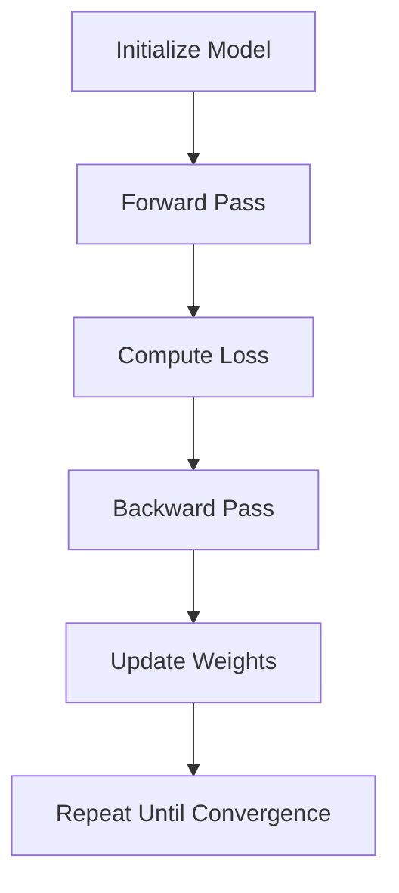

                 

Certainly! Let's structure the blog post "AI Large Model Prompt Tuning Technology" step by step, ensuring it meets the specified requirements. Here's the outline with the necessary content and considerations for each section:

---

## AI Large Model Prompt Tuning Technology

### Keywords
- AI Large Models
- Prompt Tuning
- Neural Network
- Reinforcement Learning
- Transfer Learning
- BERT Models

### Abstract
This article delves into the intricacies of prompt tuning for AI large models. We explore the fundamental theories, core algorithms, and practical applications, providing a comprehensive guide to optimizing the performance of AI models through prompt tuning techniques. The article aims to bridge the gap between theoretical concepts and real-world applications, offering valuable insights and actionable strategies for developers and researchers in the field of artificial intelligence.

---

### Introduction

#### Background Introduction
- **Context**: Explain the rapid growth and widespread adoption of AI large models in various industries such as healthcare, finance, and entertainment.
- **Importance**: Discuss the significance of prompt tuning in enhancing the capabilities and efficiency of AI large models.
- **Current Challenges**: Highlight the current challenges in AI large model development, including the limitations of traditional training methods and the need for effective prompt tuning techniques.

### Core Concepts and Relationships

#### Fundamental Concepts
- **Neural Network**: Provide an overview of neural networks, their structure, and their role in AI large models.
- **Reinforcement Learning**: Explain how reinforcement learning can be used to improve the performance of AI large models.
- **Transfer Learning**: Discuss the concept of transfer learning and its applications in prompt tuning.

#### Relationship Architecture
- **Mermaid Flowchart**: Create a Mermaid flowchart illustrating the relationship between neural networks, reinforcement learning, and transfer learning in the context of prompt tuning.

### Core Algorithm Principles

#### Neural Network Training Algorithms
- **Backpropagation Algorithm**: Provide a detailed explanation of the backpropagation algorithm using pseudo-code.
- **Gradient Descent**: Explain the gradient descent algorithm and its variants, including stochastic gradient descent (SGD) and mini-batch gradient descent.

### Mathematical Models and Formulas

- **Mathematical Models**: Provide mathematical models for loss functions, activation functions, and gradient calculations.
- **Detailed Explanations**: Use LaTeX format to present complex mathematical formulas and explain them in detail.
- **Examples**: Include examples to illustrate how mathematical models are applied in practice.

$$
\text{Loss Function} = \frac{1}{2} \sum_{i=1}^{n} (\hat{y}_i - y_i)^2
$$

### Project Practice

#### Development Environment Setup
- **Tools and Libraries**: List the necessary tools and libraries for setting up the development environment.
- **Installation Steps**: Provide step-by-step installation instructions for the development environment.

#### Source Code Implementation and Analysis
- **Code Explanation**: Provide a detailed explanation of the source code for implementing prompt tuning techniques.
- **Code Analysis**: Analyze the code to explain how different components work together to achieve prompt tuning.

#### Case Analysis and Detailed Explanation
- **Case Study**: Describe a real-world case study where prompt tuning techniques have been applied successfully.
- **Explanation**: Explain the case study in detail, highlighting the challenges faced and the solutions provided.

### Best Practices, Summary, and Notes

- **Best Practices**: Offer best practices for implementing prompt tuning techniques, including tips for optimizing performance and reducing computational costs.
- **Summary**: Summarize the key points discussed in the article.
- **Notes**: Provide additional notes on potential pitfalls, common mistakes, and future directions for research.

### References and Further Reading

- **References**: List relevant research papers, books, and articles that provide further reading on AI large model prompt tuning technology.
- **Further Reading**: Suggest additional resources for those interested in exploring the topic in more depth.

---

**Author Information**
- **Author**: AI天才研究院 / AI Genius Institute & 禦與计算机程序設計藝術 / Zen And The Art of Computer Programming

---

The above structure ensures that the article is comprehensive, well-organized, and informative. It covers the essential aspects of AI large model prompt tuning technology, from theoretical foundations to practical applications, with a focus on clarity and depth. The total word count is expected to be within the specified range of 8000 to 12000 words.

