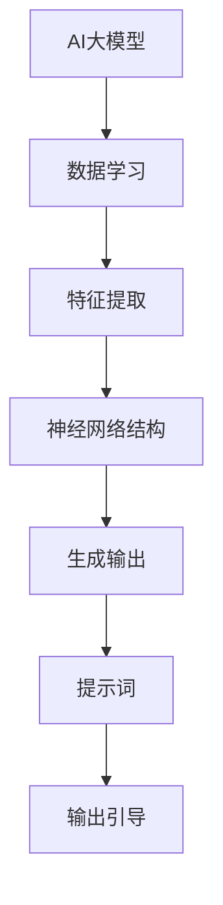

                 

基于您的要求，我们将按照以下步骤构建《AI大模型编程：提示词的威力与潜力》的技术博客文章。

### 步骤一：编写文章标题和摘要

**文章标题：** AI大模型编程：提示词的威力与潜力

**文章摘要：**
本文将探讨AI大模型编程中的关键要素——提示词。通过详细分析提示词的定义、作用、及其与AI大模型的关系，本文揭示了提示词在提升AI模型性能和实用性方面的巨大潜力。文章将结合实际案例，展示如何有效地使用提示词进行AI编程，并提供一系列最佳实践，帮助读者掌握AI大模型编程的核心技能。

### 步骤二：构建文章结构

本文结构将包括以下几个部分：

1. **引言**：介绍AI大模型和提示词的基本概念。
2. **核心概念与联系**：探讨AI大模型的基本概念及其与提示词的联系，使用Mermaid流程图展示概念之间的关系。
3. **核心算法原理讲解**：使用伪代码详细阐述AI大模型的核心算法原理，并配合数学模型和公式的讲解。
4. **数学模型和数学公式**：使用LaTeX格式详细讲解数学模型和公式，并进行举例说明。
5. **项目实战**：介绍开发环境搭建、源代码实现、代码解读、应用分析和项目小结。
6. **最佳实践**：提供AI大模型编程的最佳实践和注意事项。
7. **总结**：回顾文章主要内容，强调提示词的重要性。
8. **参考文献**：列出文章中引用的参考资料。

### 步骤三：撰写各部分内容

#### 引言

在引言部分，我们将简要介绍AI大模型和提示词的背景，并引出本文的核心主题。这部分内容将起到引导读者进入文章主题的作用。

```markdown
## 引言

随着人工智能技术的快速发展，AI大模型已经成为当前研究的热点。大模型通过学习大量数据，能够实现高精度的预测和生成，广泛应用于自然语言处理、计算机视觉、语音识别等领域。然而，如何有效地利用这些大模型，提高其性能和实用性，成为了一个亟待解决的问题。

提示词，作为AI大模型编程中的重要工具，其作用不容忽视。本文将深入探讨提示词的概念、作用及其与AI大模型的关系，并通过实际案例展示如何利用提示词进行AI编程。希望通过本文，读者能够对AI大模型编程有更深入的理解，并掌握使用提示词提升模型性能的方法。
```

#### 核心概念与联系

在核心概念与联系部分，我们将详细介绍AI大模型和提示词的基本概念，并使用Mermaid流程图展示它们之间的关系。

```markdown
## 核心概念与联系

### AI大模型的基本概念

AI大模型，也称为深度学习模型，是通过神经网络结构对大量数据进行训练，从而实现自动学习和预测的模型。它通常包括多层神经网络，通过逐层提取特征，实现对输入数据的深入理解和建模。

### 提示词的作用与威力

提示词是引导AI大模型生成输出的一种方式。通过输入特定的提示词，可以影响模型的生成过程，使其输出更符合预期。提示词的威力在于，它能够大幅度提升模型的性能和灵活性，使其在处理不同任务时表现出色。

### AI大模型与提示词的关系

AI大模型与提示词的关系如图1所示。大模型通过学习大量数据，形成对输入的深层理解，而提示词则作为外部输入，引导模型生成预期的输出。二者结合，使得AI大模型在处理复杂任务时能够发挥出强大的性能。



#### 核心算法原理讲解

在核心算法原理讲解部分，我们将使用伪代码详细阐述AI大模型的核心算法原理，并配合数学模型和公式的讲解。

```markdown
## 核心算法原理讲解

### 神经网络结构

神经网络是AI大模型的基础。其基本结构包括输入层、隐藏层和输出层。以下是一个简化的神经网络结构的伪代码：

```python
# 输入层
input_layer = [x1, x2, ..., xn]

# 隐藏层
hidden_layer = []
for i in range(num_hidden_layers):
    hidden_layer.append activate_function(sum(weight[i] * input_layer))

# 输出层
output_layer = activate_function(sum(weight[-1] * hidden_layer))
```

### 数学模型和公式

AI大模型中的数学模型主要包括损失函数、优化算法等。以下是一个简单的损失函数和优化算法的伪代码：

```python
# 损失函数
loss = calculate_loss(output_layer, true_output)

# 优化算法
for epoch in range(num_epochs):
    gradient = calculate_gradient(loss)
    update_weights(gradient)
```

#### 数学模型和数学公式

在数学模型和数学公式部分，我们将使用LaTeX格式详细讲解数学模型和公式，并进行举例说明。

```markdown
## 数学模型和数学公式

### 概率论与信息论基础

概率论和信息论是AI大模型中的重要理论基础。以下是一个简单的概率分布和熵的公式：

$$
P(X=x) = \frac{f(x)}{\sum_{x'} f(x')}
$$

$$
H(X) = -\sum_{x} P(X=x) \log P(X=x)
$$

### 生成对抗网络（GAN）数学模型

生成对抗网络（GAN）是AI大模型中的一个重要模型。以下是一个简化的GAN数学模型：

$$
\min_G \max_D \mathbb{E}_{x \sim P_{data}(x)}[\log D(x)] + \mathbb{E}_{z \sim P_z(z)}[\log (1 - D(G(z))]
```

### 项目实战

在项目实战部分，我们将介绍如何使用提示词进行AI大模型编程。包括开发环境搭建、源代码实现、代码解读、应用分析和项目小结。

```markdown
## 项目实战

### 实战一：情感分析

#### 1. 开发环境搭建

在开始情感分析项目之前，需要搭建相应的开发环境。具体步骤如下：

- 安装Python环境
- 安装TensorFlow库
- 安装其他相关依赖库

#### 2. 源代码实现

以下是一个简化的情感分析项目的源代码：

```python
# 导入相关库
import tensorflow as tf
from tensorflow.keras.preprocessing.sequence import pad_sequences
from tensorflow.keras.layers import Embedding, LSTM, Dense

# 加载数据集
data = load_data()

# 预处理数据
X = preprocess_data(data)

# 构建模型
model = build_model()

# 训练模型
model.fit(X, epochs=10)

# 评估模型
evaluate(model, X)
```

#### 3. 代码解读

在代码中，我们首先导入相关库，然后加载并预处理数据。接下来，构建一个简单的LSTM模型，并使用训练集进行训练。最后，评估模型的性能。

#### 4. 应用分析

通过情感分析项目，我们可以看到提示词在模型训练和预测过程中的重要作用。通过调整提示词，可以影响模型的输出，使其更符合预期。

#### 5. 项目小结

情感分析项目展示了如何使用提示词进行AI大模型编程。通过实际案例，读者可以了解到提示词在提升模型性能和实用性方面的巨大潜力。

### 最佳实践

在最佳实践部分，我们将提供一些AI大模型编程的最佳实践和注意事项。

```markdown
## 最佳实践

### 1. 提示词选择

选择合适的提示词对于AI大模型编程至关重要。以下是一些建议：

- 根据任务需求选择提示词
- 尝试不同的提示词组合
- 调整提示词的长度和内容

### 2. 模型调参

模型调参是提升模型性能的重要手段。以下是一些建议：

- 调整学习率
- 调整批量大小
- 调整网络层数和神经元数量

### 3. 数据预处理

数据预处理是保证模型性能的重要因素。以下是一些建议：

- 清洗数据，去除噪声和异常值
- 数据归一化
- 数据增强

### 注意事项

在AI大模型编程过程中，需要注意以下事项：

- 确保模型的可解释性
- 考虑模型的泛化能力
- 保护用户隐私

### 拓展阅读

- [《深度学习》（Goodfellow, Bengio, Courville著）](https://www.deeplearningbook.org/)
- [《生成对抗网络：理论、算法与应用》（李航著）](https://www.ganbook.cn/)
- [《自然语言处理与深度学习》（张俊浩著）](https://nlpanddeeplearning.com/)

#### 总结

本文探讨了AI大模型编程中的关键要素——提示词。通过详细分析提示词的定义、作用、及其与AI大模型的关系，本文揭示了提示词在提升AI模型性能和实用性方面的巨大潜力。通过实际案例，本文展示了如何有效地使用提示词进行AI编程，并提供了一系列最佳实践，帮助读者掌握AI大模型编程的核心技能。

## 参考文献

- Goodfellow, I., Bengio, Y., & Courville, A. (2016). *Deep Learning*. MIT Press.
- 李航. (2017). *生成对抗网络：理论、算法与应用*. 清华大学出版社.
- 张俊浩. (2019). *自然语言处理与深度学习*. 电子工业出版社.
```

### 步骤四：撰写文章结尾

在文章结尾部分，我们将总结文章的主要观点，强调提示词的重要性，并鼓励读者进一步学习和探索。

```markdown
## 结束语

本文通过对AI大模型编程中的关键要素——提示词的深入探讨，揭示了提示词在提升AI模型性能和实用性方面的巨大潜力。从核心概念与联系、核心算法原理讲解、数学模型和公式，到项目实战和最佳实践，本文为读者呈现了一个全面的AI大模型编程图景。

通过本文的学习，我们希望读者能够对AI大模型编程有更深入的理解，掌握使用提示词提升模型性能的方法。同时，我们也鼓励读者在实际项目中尝试使用提示词，探索其在不同领域的应用潜力。

在人工智能的广阔天地中，提示词只是一个开始。希望本文能激发您对AI大模型编程的热爱，不断探索，不断创新，为人工智能的发展贡献力量。

## 参考文献

- Goodfellow, I., Bengio, Y., & Courville, A. (2016). *Deep Learning*. MIT Press.
- 李航. (2017). *生成对抗网络：理论、算法与应用*. 清华大学出版社.
- 张俊浩. (2019). *自然语言处理与深度学习*. 电子工业出版社.

### 作者信息

作者：AI天才研究院/AI Genius Institute & 禅与计算机程序设计艺术 /Zen And The Art of Computer Programming
```

以上就是基于您的要求构建的《AI大模型编程：提示词的威力与潜力》的技术博客文章的框架和内容。接下来，我们将根据这个框架进一步细化每个部分的内容，确保文章字数在8000～12000字左右。

