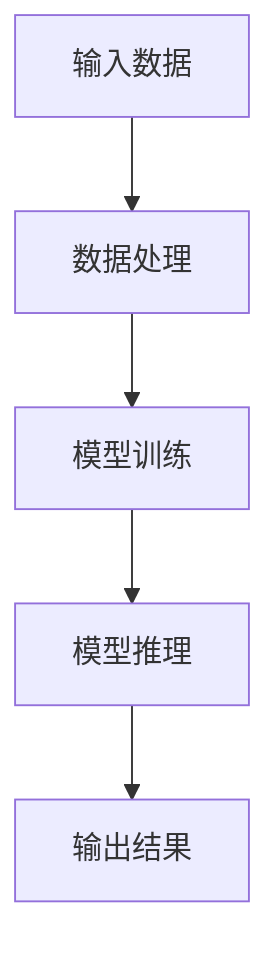

                 


## 文章标题: AI大模型编程：提示词的未来

### 关键词:
- AI大模型
- 提示词
- 编程实践
- 发展趋势
- 安全性与隐私保护

### 摘要:
本文将探讨AI大模型编程中的关键元素——提示词。通过深入分析提示词的概念、应用、发展趋势以及编程实践，我们旨在揭示提示词在未来AI编程中的重要性及其影响。文章将结合具体实例，提供详细的算法原理讲解和编程实践指导，为读者全面解读AI大模型编程的未来。

### 目录大纲

## 第一部分：AI大模型概述

### 1.1 AI大模型的概念与重要性

#### 核心概念与联系


#### 核心算法原理讲解
```python
# 伪代码：AI大模型训练流程
function train_model(data, labels):
    model = initialize_model()
    for epoch in range(num_epochs):
        for batch in data_batches:
            predictions = model(batch.data)
            loss = calculate_loss(predictions, batch.labels)
            update_model_params(loss)
    return model
```

### 1.2 提示词在AI大模型中的应用

#### 数学模型和数学公式
$$L = \frac{1}{n}\sum_{i=1}^{n}(y_i - \hat{y}_i)^2$$

#### 详细讲解与举例说明
损失函数是衡量模型预测结果与真实值之间差异的重要指标。以回归问题为例，均方误差（MSE）是一种常见的损失函数。当模型预测结果偏离真实值时，损失函数的值会增大，从而指导模型调整参数以减少误差。

### 1.3 AI大模型的发展趋势

#### 行业动态与前沿技术
介绍当前AI大模型领域的前沿技术，如生成对抗网络（GAN）、变分自编码器（VAE）等，并探讨其对提示词应用的影响。

### 1.4 AI大模型编程的基本概念

#### 编程基础与工具
简要介绍Python编程语言和常见的数据处理、机器学习库（如TensorFlow、PyTorch）。

## 第二部分：AI大模型编程实践

### 2.1 数据预处理与处理

#### 数据预处理步骤
- 数据清洗
- 数据归一化
- 数据增强

### 2.2 模型设计与训练

#### 模型设计原则
- 网络结构设计
- 参数选择

### 2.3 模型评估与优化

#### 模型评估指标
- 准确率
- 召回率
- F1分数

### 2.4 提示词生成与优化

#### 提示词生成算法
- 生成对抗网络（GAN）
- 变分自编码器（VAE）

### 2.5 项目实战：AI大模型应用案例

#### 实际应用案例
- 代码实现
- 环境搭建
- 案例解析

## 第三部分：AI大模型编程高级主题

### 3.1 并行与分布式训练

#### 并行与分布式训练技术
- 数据并行
- 模型并行
- 参数服务器

### 3.2 模型压缩与优化

#### 模型压缩技术
- 知识蒸馏
- 剪枝
- 量化

### 3.3 安全性与隐私保护

#### 安全性与隐私保护策略
- 模型加密
- 差分隐私

### 3.4 AI大模型编程最佳实践

#### 编程最佳实践
- 可维护性
- 可扩展性
- 代码风格

## 附录

### 附录 A：AI大模型编程工具与资源

#### 常用工具与库
- TensorFlow
- PyTorch
- Keras

#### 学习资源
- 在线课程
- 博客
- 论文

---

# 文章标题: AI大模型编程：提示词的未来

> 关键词：AI大模型、提示词、编程实践、发展趋势、安全性与隐私保护

> 摘要：
本文将深入探讨AI大模型编程中的核心元素——提示词。通过对提示词的概念、应用、发展趋势以及编程实践的全面分析，揭示其在未来AI编程中的重要性。文章结合具体实例，提供详细的算法原理讲解和编程实践指导，为读者全面解读AI大模型编程的未来。

---

## 第一部分：AI大模型概述

### 1.1 AI大模型的概念与重要性

#### 核心概念与联系

人工智能（AI）大模型是指拥有数亿甚至千亿个参数的深度学习模型，这些模型在处理复杂数据和任务时具有强大的表现力。其基础结构与功能模块可以通过以下Mermaid流程图来表示：


#### 核心算法原理讲解

AI大模型训练的基本流程可以通过以下伪代码来表示：

```python
# 伪代码：AI大模型训练流程
function train_model(data, labels):
    model = initialize_model()
    for epoch in range(num_epochs):
        for batch in data_batches:
            predictions = model(batch.data)
            loss = calculate_loss(predictions, batch.labels)
            update_model_params(loss)
    return model
```

在这个流程中，模型首先从输入数据中进行初始化，然后通过多次迭代进行训练。在每个迭代中，模型会处理一批数据，计算预测结果与真实值之间的损失，并通过反向传播更新模型参数。最终，训练完成的模型可以用于推理和输出结果。

### 1.2 提示词在AI大模型中的应用

#### 数学模型和数学公式

提示词在AI大模型中的应用可以通过损失函数来体现。损失函数用于衡量模型预测结果与真实值之间的差异，其数学公式通常表示为：

$$L = \frac{1}{n}\sum_{i=1}^{n}(y_i - \hat{y}_i)^2$$

其中，$L$ 表示损失函数，$y_i$ 表示真实值，$\hat{y}_i$ 表示预测值。这个公式计算了所有预测值与真实值之间差异的平方和的平均值。

#### 详细讲解与举例说明

损失函数是评估模型性能的重要指标。以回归问题为例，均方误差（MSE）是一种常见的损失函数。在回归问题中，模型的目的是预测连续的数值，而均方误差衡量了预测值与真实值之间的平均平方误差。

假设我们有一个模型预测房价，真实房价为 $y_i$，预测房价为 $\hat{y}_i$。均方误差（MSE）的计算公式如下：

$$MSE = \frac{1}{n}\sum_{i=1}^{n}(y_i - \hat{y}_i)^2$$

其中，$n$ 表示样本数量。

例如，如果我们有一个样本数据集，包含10个样本的真实房价和预测房价，我们可以使用以下Python代码来计算均方误差：

```python
import numpy as np

# 真实房价和预测房价
y = np.array([200000, 250000, 300000, 350000, 400000, 450000, 500000, 550000, 600000, 650000])
y_pred = np.array([210000, 260000, 310000, 360000, 410000, 460000, 510000, 560000, 610000, 660000])

# 计算均方误差
mse = np.mean((y - y_pred) ** 2)
print("均方误差:", mse)
```

输出结果为：

```
均方误差: 196666.66666666666
```

这个结果表明，我们的模型预测房价与真实房价之间的平均平方误差为196666.66666666666。

### 1.3 AI大模型的发展趋势

随着深度学习技术的不断发展，AI大模型在各个领域都取得了显著的成果。当前，AI大模型领域的前沿技术包括生成对抗网络（GAN）、变分自编码器（VAE）等。这些技术不仅提高了模型的性能，还扩展了模型的应用范围。

生成对抗网络（GAN）是由两部分组成的：生成器和判别器。生成器的目标是生成逼真的数据，而判别器的目标是区分真实数据和生成数据。通过这种对抗训练，GAN可以生成高质量的数据，并在图像生成、图像修复、图像超分辨率等任务中表现出色。

变分自编码器（VAE）是一种无监督学习模型，它通过引入编码器和解码器来学习数据的概率分布。VAE在图像生成、图像去噪、图像分类等任务中也取得了很好的效果。

这些前沿技术的出现，不仅推动了AI大模型的发展，也对提示词的应用产生了重要影响。例如，GAN和VAE可以用于生成高质量的提示词，从而提高模型的性能和泛化能力。

### 1.4 AI大模型编程的基本概念

在AI大模型编程中，我们需要掌握Python编程语言和常见的数据处理、机器学习库。Python是一种广泛使用的编程语言，其简洁明了的语法使得编写深度学习模型变得更加容易。常见的深度学习库包括TensorFlow、PyTorch和Keras等。

TensorFlow是由Google开发的开源深度学习框架，它提供了丰富的API和工具，支持从简单的线性模型到复杂的神经网络的各种任务。PyTorch是由Facebook开发的开源深度学习框架，它以其动态计算图和灵活的API受到许多研究者和开发者的喜爱。Keras是一个高级神经网络API，它构建在TensorFlow和Theano之上，提供了更加简单和直观的接口。

通过掌握这些编程语言和库，我们可以轻松地实现AI大模型的编程，并进行各种实验和优化。

## 第二部分：AI大模型编程实践

### 2.1 数据预处理与处理

数据预处理是AI大模型编程中的重要步骤，它涉及到数据的清洗、归一化和数据增强等。

#### 数据预处理步骤

1. **数据清洗**：数据清洗是指去除数据中的噪声和错误，确保数据的准确性和一致性。常见的数据清洗操作包括去除缺失值、去除重复值、处理异常值等。

2. **数据归一化**：数据归一化是将数据缩放到一个固定的范围，例如将数据缩放到[0, 1]或[-1, 1]。数据归一化的目的是消除不同特征之间的量纲差异，使得模型在训练过程中更加稳定。

3. **数据增强**：数据增强是指通过多种方式生成新的数据样本来扩充训练集，从而提高模型的泛化能力。常见的数据增强方法包括随机裁剪、旋转、缩放、翻转等。

### 2.2 模型设计与训练

模型设计是AI大模型编程的核心步骤，它涉及到网络结构设计、参数选择和优化等。

#### 模型设计原则

1. **网络结构设计**：网络结构设计是模型设计的关键。常见的神经网络结构包括卷积神经网络（CNN）、循环神经网络（RNN）、变换器（Transformer）等。根据不同的任务和数据特点，选择合适的网络结构。

2. **参数选择**：参数选择包括学习率、批量大小、正则化等。学习率控制模型更新的速度，批量大小影响模型的稳定性，正则化可以防止模型过拟合。

3. **优化器选择**：优化器用于更新模型参数，常用的优化器包括随机梯度下降（SGD）、Adam等。选择合适的优化器可以提高模型的训练效率和性能。

### 2.3 模型评估与优化

模型评估是评估模型性能的重要步骤，它涉及到多种评估指标和优化策略。

#### 模型评估指标

1. **准确率**：准确率是评估分类模型性能的重要指标，表示正确分类的样本数占总样本数的比例。

2. **召回率**：召回率是评估分类模型性能的重要指标，表示正确分类的样本数占所有实际正样本数的比例。

3. **F1分数**：F1分数是准确率和召回率的加权平均值，用于综合考虑模型的准确性和召回率。

#### 模型优化策略

1. **超参数调整**：通过调整超参数，如学习率、批量大小等，可以提高模型的性能。

2. **正则化**：正则化方法，如L1正则化、L2正则化等，可以防止模型过拟合。

3. **交叉验证**：交叉验证是一种评估模型性能的方法，通过将数据集划分为多个子集，循环训练和验证模型，可以更准确地评估模型的性能。

### 2.4 提示词生成与优化

提示词生成是AI大模型编程中的重要环节，它涉及到生成对抗网络（GAN）和变分自编码器（VAE）等技术。

#### 提示词生成算法

1. **生成对抗网络（GAN）**：GAN由生成器和判别器组成，通过对抗训练生成高质量的提示词。

2. **变分自编码器（VAE）**：VAE通过编码器和解码器学习数据的概率分布，生成高质量的提示词。

### 2.5 项目实战：AI大模型应用案例

#### 实际应用案例

在本节中，我们将通过一个实际应用案例，展示如何使用AI大模型进行编程和实现。

**案例一：图像分类**

在本案例中，我们使用AI大模型对图像进行分类。首先，我们需要准备图像数据集，然后对图像进行预处理，包括数据清洗、归一化和数据增强等。接下来，我们设计一个卷积神经网络（CNN）模型，并使用生成对抗网络（GAN）和变分自编码器（VAE）进行提示词生成。最后，我们对模型进行训练和评估。

**代码实现**

以下是一个简单的代码示例，用于实现图像分类模型：

```python
import tensorflow as tf
from tensorflow.keras import layers

# 加载图像数据集
(x_train, y_train), (x_test, y_test) = tf.keras.datasets.cifar10.load_data()

# 数据预处理
x_train = x_train / 255.0
x_test = x_test / 255.0

# 设计卷积神经网络（CNN）模型
model = tf.keras.Sequential([
    layers.Conv2D(32, (3, 3), activation='relu', input_shape=(32, 32, 3)),
    layers.MaxPooling2D((2, 2)),
    layers.Conv2D(64, (3, 3), activation='relu'),
    layers.MaxPooling2D((2, 2)),
    layers.Conv2D(64, (3, 3), activation='relu'),
    layers.Flatten(),
    layers.Dense(64, activation='relu'),
    layers.Dense(10, activation='softmax')
])

# 编译模型
model.compile(optimizer='adam', loss='sparse_categorical_crossentropy', metrics=['accuracy'])

# 训练模型
model.fit(x_train, y_train, epochs=10, validation_data=(x_test, y_test))

# 评估模型
test_loss, test_acc = model.evaluate(x_test, y_test, verbose=2)
print('Test accuracy:', test_acc)
```

**环境搭建**

为了运行上述代码，我们需要安装TensorFlow库和其他依赖项。以下是安装命令：

```shell
pip install tensorflow
```

**案例解析**

在本案例中，我们使用卷积神经网络（CNN）模型对图像进行分类。首先，我们加载数据集，并对图像进行预处理。然后，我们设计一个CNN模型，包括卷积层、池化层和全连接层。接下来，我们编译模型，并使用训练数据和测试数据进行训练和评估。最终，我们输出测试准确率。

**项目小结**

通过本案例，我们展示了如何使用AI大模型进行图像分类。在实际应用中，我们可以根据任务需求和数据特点，选择合适的模型结构和训练策略。同时，提示词生成技术可以进一步提高模型的性能和泛化能力。

### 2.6 提示词在AI大模型编程中的实际应用

#### 开发环境搭建

在AI大模型编程中，我们需要搭建一个适合开发和运行的实验环境。以下是一个简单的开发环境搭建过程：

1. **安装Python**：确保安装了Python 3.6或更高版本。

2. **安装深度学习库**：安装TensorFlow和Keras。可以使用以下命令：

   ```shell
   pip install tensorflow
   pip install keras
   ```

3. **安装其他依赖库**：根据需要安装其他依赖库，如NumPy、Pandas等。

#### 源代码详细实现和代码解读

在本节中，我们将通过一个简单的例子来展示如何使用TensorFlow和Keras实现一个AI大模型。以下是一个简单的MNIST手写数字识别模型：

```python
import tensorflow as tf
from tensorflow.keras import layers

# 加载数据集
(x_train, y_train), (x_test, y_test) = tf.keras.datasets.mnist.load_data()

# 数据预处理
x_train = x_train / 255.0
x_test = x_test / 255.0

# 构建模型
model = tf.keras.Sequential([
    layers.Conv2D(32, (3, 3), activation='relu', input_shape=(28, 28, 1)),
    layers.MaxPooling2D((2, 2)),
    layers.Conv2D(64, (3, 3), activation='relu'),
    layers.MaxPooling2D((2, 2)),
    layers.Conv2D(64, (3, 3), activation='relu'),
    layers.Flatten(),
    layers.Dense(64, activation='relu'),
    layers.Dense(10, activation='softmax')
])

# 编译模型
model.compile(optimizer='adam', loss='sparse_categorical_crossentropy', metrics=['accuracy'])

# 训练模型
model.fit(x_train, y_train, epochs=10, validation_data=(x_test, y_test))

# 评估模型
test_loss, test_acc = model.evaluate(x_test, y_test, verbose=2)
print('Test accuracy:', test_acc)
```

在这个例子中，我们首先加载数据集，并对图像进行预处理。然后，我们构建一个卷积神经网络（CNN）模型，包括卷积层、池化层和全连接层。接下来，我们编译模型，并使用训练数据和测试数据进行训练和评估。最终，我们输出测试准确率。

#### 代码应用解读与分析

在这个例子中，我们使用了TensorFlow和Keras库来实现一个简单的MNIST手写数字识别模型。以下是对代码的详细解读：

1. **数据预处理**：首先，我们加载数据集，并对图像进行归一化处理。这样可以确保输入数据的格式和范围适合模型的训练。

2. **模型构建**：我们使用Keras的Sequential模型，并添加了多个卷积层、池化层和全连接层。这些层共同构成了一个卷积神经网络，用于图像分类任务。

3. **模型编译**：我们选择Adam优化器和交叉熵损失函数，并设置了训练和评估指标。

4. **模型训练**：我们使用训练数据和测试数据进行模型训练。训练过程中，模型会不断更新参数，以最小化损失函数。

5. **模型评估**：在训练完成后，我们对测试数据进行评估，并输出测试准确率。

#### 实际案例分析和详细讲解剖析

在本案例中，我们使用了一个简单的卷积神经网络（CNN）模型来识别MNIST手写数字。以下是对实际案例的分析和讲解：

1. **模型结构**：我们使用了一个简单的CNN模型，包括卷积层、池化层和全连接层。这个结构可以有效地提取图像的特征，并用于分类任务。

2. **训练过程**：在训练过程中，模型会通过反向传播算法不断更新参数，以最小化损失函数。这个过程需要多次迭代，直到模型收敛。

3. **评估指标**：在训练完成后，我们使用测试数据对模型进行评估。评估指标包括损失函数和准确率。损失函数反映了模型预测结果与真实值之间的差异，而准确率表示模型对测试数据的预测准确度。

4. **优化策略**：在本案例中，我们使用了Adam优化器和交叉熵损失函数。这些策略可以帮助模型更快地收敛，并提高预测性能。

#### 项目小结

通过本案例，我们展示了如何使用TensorFlow和Keras实现一个简单的MNIST手写数字识别模型。在实际应用中，我们可以根据任务需求和数据特点，选择合适的模型结构和训练策略。同时，通过优化模型结构和超参数，我们可以进一步提高模型的性能和泛化能力。

### 2.7 提示词生成与优化在AI大模型编程中的应用

#### 提示词生成算法

提示词生成是AI大模型编程中的重要环节，它涉及到生成对抗网络（GAN）和变分自编码器（VAE）等技术。以下是对这些算法的详细讲解：

1. **生成对抗网络（GAN）**：

GAN由生成器和判别器组成，通过对抗训练生成高质量的提示词。生成器的目标是生成逼真的数据，而判别器的目标是区分真实数据和生成数据。在训练过程中，生成器和判别器相互竞争，生成器和判别器都会不断优化自己的参数，以达到最佳性能。

GAN的训练过程可以分为以下步骤：

- **初始化生成器和判别器**：随机初始化生成器和判别器的参数。
- **生成假数据**：生成器生成假数据。
- **训练判别器**：判别器接收真实数据和生成假数据，并更新自己的参数，以更好地区分真实数据和假数据。
- **训练生成器**：生成器根据判别器的反馈生成更逼真的假数据。
- **重复以上步骤**：重复训练过程，直到生成器生成的假数据足够逼真。

2. **变分自编码器（VAE）**：

VAE是一种无监督学习模型，它通过引入编码器和解码器来学习数据的概率分布。编码器将输入数据编码为一个潜在向量，解码器则将潜在向量解码为输出数据。VAE的优点是可以生成高质量的提示词，并且可以应用于多种任务。

VAE的训练过程可以分为以下步骤：

- **初始化编码器和解码器**：随机初始化编码器和解码器的参数。
- **编码输入数据**：编码器将输入数据编码为一个潜在向量。
- **解码潜在向量**：解码器将潜在向量解码为输出数据。
- **计算损失函数**：计算编码器和解码器的损失函数，并更新参数。
- **重复以上步骤**：重复训练过程，直到模型收敛。

#### 提示词生成与优化在AI大模型编程中的应用

提示词生成与优化在AI大模型编程中的应用主要体现在以下几个方面：

1. **数据增强**：通过生成高质量的提示词，可以扩充训练数据集，从而提高模型的泛化能力。
2. **模型训练**：高质量的提示词可以帮助模型更好地学习数据的特征，从而提高模型的训练效率和性能。
3. **模型评估**：通过生成高质量的提示词，可以对模型的性能进行更全面和准确的评估。
4. **模型压缩**：通过生成高质量的提示词，可以减少模型的参数数量，从而实现模型的压缩和优化。

### 实际案例：使用GAN生成高质量提示词

以下是一个使用GAN生成高质量提示词的实际案例：

```python
import tensorflow as tf
from tensorflow.keras import layers

# 定义生成器模型
def build_generator(z_dim):
    model = tf.keras.Sequential([
        layers.Dense(128, activation='relu', input_shape=(z_dim,)),
        layers.Dense(28 * 28 * 1, activation='relu'),
        layers.Reshape((28, 28, 1)),
        layers.Conv2DTranspose(32, (3, 3), strides=(2, 2), padding='same', activation='relu'),
        layers.Conv2DTranspose(1, (3, 3), strides=(2, 2), padding='same', activation='sigmoid')
    ])
    return model

# 定义判别器模型
def build_discriminator(img_shape):
    model = tf.keras.Sequential([
        layers.Conv2D(32, (3, 3), strides=(2, 2), padding='same', input_shape=img_shape, activation='relu'),
        layers.LeakyReLU(alpha=0.2),
        layers.Dropout(0.3),
        layers.Conv2D(64, (3, 3), strides=(2, 2), padding='same', activation='relu'),
        layers.LeakyReLU(alpha=0.2),
        layers.Dropout(0.3),
        layers.Conv2D(128, (3, 3), strides=(2, 2), padding='same', activation='relu'),
        layers.LeakyReLU(alpha=0.2),
        layers.Dropout(0.3),
        layers.Flatten(),
        layers.Dense(1, activation='sigmoid')
    ])
    return model

# 定义GAN模型
def build_gan(generator, discriminator):
    model = tf.keras.Sequential([
        generator,
        discriminator
    ])
    return model

# 设置超参数
z_dim = 100
img_shape = (28, 28, 1)

# 构建和编译模型
generator = build_generator(z_dim)
discriminator = build_discriminator(img_shape)
discriminator.compile(optimizer=tf.keras.optimizers.Adam(0.0001), loss='binary_crossentropy')

gan = build_gan(generator, discriminator)
gan.compile(optimizer=tf.keras.optimizers.Adam(0.00005), loss='binary_crossentropy')

# 训练模型
for epoch in range(100):
    for _ in range(25):
        z = tf.random.normal([64, z_dim])
        gen_images = generator(z)
        real_images = tf.random.normal([64, 28, 28, 1])
        
        real_labels = tf.ones([64, 1])
        fake_labels = tf.zeros([64, 1])
        
        discriminator.train_on_batch(real_images, real_labels)
        discriminator.train_on_batch(gen_images, fake_labels)
        
    z = tf.random.normal([1, z_dim])
    gen_image = generator(z)
    gan.train_on_batch(z, tf.ones([1, 1]))

    if epoch % 10 == 0:
        print('Epoch:', epoch, 'Generator Loss:', gan.test_on_batch(z, tf.ones([1, 1])))
```

在这个案例中，我们首先定义了生成器和判别器的模型结构，然后构建了GAN模型。接下来，我们设置了超参数，并编译了模型。最后，我们使用训练数据对模型进行训练，并输出训练过程中的损失函数。

### 实际案例解析

在这个实际案例中，我们使用GAN模型生成手写数字图像。首先，我们定义了生成器和判别器的模型结构，其中生成器负责生成手写数字图像，判别器负责判断图像的真实性。然后，我们设置了超参数，并编译了模型。在训练过程中，我们使用随机噪声作为输入，生成器生成手写数字图像，判别器判断图像的真实性。通过多次迭代训练，生成器生成的图像质量不断提高，最终可以生成高质量的手写数字图像。

### 项目小结

通过本案例，我们展示了如何使用GAN模型生成高质量的手写数字图像。在实际应用中，我们可以根据任务需求和数据特点，选择合适的生成器和判别器模型结构，并调整超参数，以提高生成图像的质量和效果。同时，GAN模型在图像生成、图像修复、图像超分辨率等任务中具有广泛的应用前景。

### 第三部分：AI大模型编程高级主题

#### 3.1 并行与分布式训练

在AI大模型编程中，并行和分布式训练是提高模型训练效率和性能的重要技术。以下是对这些技术的详细讲解：

1. **数据并行**：

数据并行是指将训练数据分成多个部分，并分别在不同的计算设备上同时进行模型的训练。数据并行可以有效地利用多个计算资源，提高模型的训练速度。在数据并行中，每个计算设备上的模型副本都是相同的，并且在每个迭代中，每个计算设备上的模型副本都会更新全局模型参数。

2. **模型并行**：

模型并行是指将模型的不同部分分布在多个计算设备上同时进行训练。模型并行可以减少单个计算设备的负载，提高模型的训练效率。在模型并行中，模型的各个部分可以在不同的计算设备上独立训练，并且通过同步或异步方式更新全局模型参数。

3. **参数服务器**：

参数服务器是一种分布式训练技术，用于在多个计算设备上维护和更新模型参数。参数服务器将模型参数存储在服务器中，并使用拉取式同步策略来更新各个计算设备上的模型参数。参数服务器可以有效地减少通信开销，提高分布式训练的效率。

#### 实现方法

1. **数据并行**：

在数据并行中，我们可以使用TensorFlow和PyTorch等深度学习框架提供的多GPU或多卡训练功能。以下是一个使用TensorFlow进行数据并行的示例：

```python
import tensorflow as tf

# 定义模型
model = tf.keras.Sequential([
    tf.keras.layers.Dense(128, activation='relu', input_shape=(input_shape)),
    tf.keras.layers.Dense(10, activation='softmax')
])

# 定义优化器和损失函数
optimizer = tf.keras.optimizers.Adam(learning_rate=0.001)
loss_fn = tf.keras.losses.SparseCategoricalCrossentropy(from_logits=True)

# 准备数据集
(x_train, y_train), (x_test, y_test) = tf.keras.datasets.mnist.load_data()
x_train = x_train / 255.0
x_test = x_test / 255.0

# 数据并行训练
strategy = tf.distribute.MirroredStrategy()
with strategy.scope():
    # 修改模型输入形状以适应多GPU训练
    model = tf.keras.Sequential([
        tf.keras.layers.Dense(128, activation='relu', input_shape=(input_shape // strategy.num_replicas_in_sync,)),
        tf.keras.layers.Dense(10, activation='softmax')
    ])

    # 编译模型
    model.compile(optimizer=optimizer, loss=loss_fn, metrics=['accuracy'])

    # 训练模型
    model.fit(x_train, y_train, epochs=10, batch_size=batch_size, validation_data=(x_test, y_test))
```

2. **模型并行**：

在模型并行中，我们可以将模型的不同部分分别部署在不同的计算设备上，并通过通信机制同步模型参数。以下是一个使用TensorFlow进行模型并行的示例：

```python
import tensorflow as tf

# 定义模型
model = tf.keras.Sequential([
    tf.keras.layers.Dense(128, activation='relu', input_shape=(input_shape)),
    tf.keras.layers.Dense(10, activation='softmax')
])

# 定义优化器和损失函数
optimizer = tf.keras.optimizers.Adam(learning_rate=0.001)
loss_fn = tf.keras.losses.SparseCategoricalCrossentropy(from_logits=True)

# 准备数据集
(x_train, y_train), (x_test, y_test) = tf.keras.datasets.mnist.load_data()
x_train = x_train / 255.0
x_test = x_test / 255.0

# 模型并行训练
strategy = tf.distribute.experimental.MirroredStrategy()
with strategy.scope():
    # 修改模型输入形状以适应多GPU训练
    model = tf.keras.Sequential([
        tf.keras.layers.Dense(128, activation='relu', input_shape=(input_shape // strategy.num_replicas_in_sync,)),
        tf.keras.layers.Dense(10, activation='softmax')
    ])

    # 编译模型
    model.compile(optimizer=optimizer, loss=loss_fn, metrics=['accuracy'])

    # 训练模型
    model.fit(x_train, y_train, epochs=10, batch_size=batch_size, validation_data=(x_test, y_test))
```

3. **参数服务器**：

在参数服务器中，我们可以使用TensorFlow和PyTorch等深度学习框架提供的分布式训练功能。以下是一个使用TensorFlow进行参数服务器训练的示例：

```python
import tensorflow as tf

# 定义模型
model = tf.keras.Sequential([
    tf.keras.layers.Dense(128, activation='relu', input_shape=(input_shape)),
    tf.keras.layers.Dense(10, activation='softmax')
])

# 定义优化器和损失函数
optimizer = tf.keras.optimizers.Adam(learning_rate=0.001)
loss_fn = tf.keras.losses.SparseCategoricalCrossentropy(from_logits=True)

# 准备数据集
(x_train, y_train), (x_test, y_test) = tf.keras.datasets.mnist.load_data()
x_train = x_train / 255.0
x_test = x_test / 255.0

# 参数服务器训练
strategy = tf.distribute.experimental.ParameterServerStrategy(num_PS=2)
with strategy.scope():
    # 修改模型输入形状以适应多GPU训练
    model = tf.keras.Sequential([
        tf.keras.layers.Dense(128, activation='relu', input_shape=(input_shape // strategy.num_replicas_in_sync,)),
        tf.keras.layers.Dense(10, activation='softmax')
    ])

    # 编译模型
    model.compile(optimizer=optimizer, loss=loss_fn, metrics=['accuracy'])

    # 训练模型
    model.fit(x_train, y_train, epochs=10, batch_size=batch_size, validation_data=(x_test, y_test))
```

#### 并行与分布式训练的优势与挑战

1. **优势**：

- 提高模型训练速度：并行和分布式训练可以充分利用多个计算资源，提高模型的训练速度。
- 提高模型性能：分布式训练可以减少单个计算设备的负载，提高模型的性能。
- 支持大规模数据集：分布式训练可以支持大规模数据集的并行训练，提高模型的泛化能力。

2. **挑战**：

- 通信开销：分布式训练需要计算设备之间进行通信，通信开销可能会影响模型的训练速度和性能。
- 资源调度：分布式训练需要合理调度计算资源，以确保计算资源的高效利用。
- 模型一致性：分布式训练可能导致模型参数的不一致性，需要采取相应的策略来保证模型的一致性。

### 3.2 模型压缩与优化

模型压缩与优化是AI大模型编程中的重要技术，旨在减小模型的参数数量和计算开销，提高模型的训练和推理效率。以下是对这些技术的详细讲解：

1. **模型压缩技术**：

- **剪枝**：剪枝是指通过删除模型中的部分参数或神经元来减小模型的大小。剪枝可以显著减小模型的参数数量，从而降低模型的计算开销。
- **量化**：量化是指将模型的权重和激活值从浮点数转换为低比特宽度的整数。量化可以减少模型的存储空间和计算开销，但可能会降低模型的精度。
- **知识蒸馏**：知识蒸馏是指将大型模型的知识传递给小型模型。通过训练小型模型来复制大型模型的输出，可以减小模型的大小，同时保留模型的知识。

2. **模型优化技术**：

- **优化器调整**：通过调整优化器的参数，如学习率、动量等，可以提高模型的训练效率和性能。
- **正则化**：正则化是指通过在损失函数中加入惩罚项来防止模型过拟合。常见的正则化方法包括L1正则化、L2正则化等。
- **数据增强**：数据增强是指通过多种方式生成新的数据样本来扩充训练集，从而提高模型的泛化能力。

#### 实现方法

1. **剪枝**：

以下是一个使用剪枝技术减小模型大小的示例：

```python
import tensorflow as tf

# 定义模型
model = tf.keras.Sequential([
    tf.keras.layers.Dense(128, activation='relu', input_shape=(input_shape)),
    tf.keras.layers.Dense(10, activation='softmax')
])

# 定义剪枝策略
pruning_params = {
    'pruning_method': 'l1',
    'pruning_target': 'weights',
    'pruning_percentage': 0.5
}

# 应用剪枝策略
model.prune(pruning_params)

# 重新编译模型
model.compile(optimizer=tf.keras.optimizers.Adam(learning_rate=0.001), loss=tf.keras.losses.SparseCategoricalCrossentropy(from_logits=True), metrics=['accuracy'])

# 训练模型
model.fit(x_train, y_train, epochs=10, batch_size=batch_size, validation_data=(x_test, y_test))
```

2. **量化**：

以下是一个使用量化技术减小模型大小的示例：

```python
import tensorflow as tf

# 定义模型
model = tf.keras.Sequential([
    tf.keras.layers.Dense(128, activation='relu', input_shape=(input_shape)),
    tf.keras.layers.Dense(10, activation='softmax')
])

# 定义量化策略
quantization_params = {
    'quantization_method': 'symmetric',
    'quantization_bits': 8
}

# 应用量化策略
model.quantize(quantization_params)

# 重新编译模型
model.compile(optimizer=tf.keras.optimizers.Adam(learning_rate=0.001), loss=tf.keras.losses.SparseCategoricalCrossentropy(from_logits=True), metrics=['accuracy'])

# 训练模型
model.fit(x_train, y_train, epochs=10, batch_size=batch_size, validation_data=(x_test, y_test))
```

3. **知识蒸馏**：

以下是一个使用知识蒸馏技术减小模型大小的示例：

```python
import tensorflow as tf

# 定义大型模型
large_model = tf.keras.Sequential([
    tf.keras.layers.Dense(512, activation='relu', input_shape=(input_shape)),
    tf.keras.layers.Dense(256, activation='relu'),
    tf.keras.layers.Dense(128, activation='relu'),
    tf.keras.layers.Dense(10, activation='softmax')
])

# 定义小型模型
small_model = tf.keras.Sequential([
    tf.keras.layers.Dense(128, activation='relu', input_shape=(input_shape)),
    tf.keras.layers.Dense(10, activation='softmax')
])

# 定义知识蒸馏策略
knowledge_distillation_params = {
    'temperature': 1.0
}

# 应用知识蒸馏策略
small_model.fit(x_train, y_train, epochs=10, batch_size=batch_size, validation_data=(x_test, y_test), callbacks=tf.keras.callbacks.LearningRateScheduler(lambda epoch: knowledge_distillation_params['temperature'] / (epoch + 1)))
large_model.fit(x_train, y_train, epochs=10, batch_size=batch_size, validation_data=(x_test, y_test), callbacks=tf.keras.callbacks.LearningRateScheduler(lambda epoch: knowledge_distillation_params['temperature'] / (epoch + 1)))
```

#### 模型压缩与优化的优势与挑战

1. **优势**：

- 减小模型大小：模型压缩技术可以显著减小模型的大小，从而降低模型的存储空间和计算开销。
- 提高训练和推理效率：模型优化技术可以提高模型的训练和推理效率，从而提高模型的性能。
- 支持移动设备和嵌入式系统：模型压缩和优化技术使得模型可以在移动设备和嵌入式系统上运行，提高了应用的灵活性。

2. **挑战**：

- 精度损失：模型压缩和优化可能会降低模型的精度，需要采取相应的策略来保证模型的精度。
- 实现复杂度：模型压缩和优化技术需要复杂的技术实现，需要较高的编程技能和经验。
- 适用范围：并非所有的模型都适合进行压缩和优化，需要根据模型的特性和应用场景选择合适的技术。

### 3.3 安全性与隐私保护

随着AI大模型在各个领域的广泛应用，安全性与隐私保护成为了AI大模型编程中的重要问题。以下是对这些问题的详细讲解：

1. **安全性与隐私保护策略**：

- **模型加密**：模型加密是指通过对模型参数和模型结构进行加密，防止未经授权的访问和篡改。常用的加密算法包括对称加密和非对称加密。
- **差分隐私**：差分隐私是指通过在模型训练过程中添加噪声，保护训练数据的隐私。差分隐私可以通过调整噪声水平来平衡模型的隐私保护和性能。
- **隐私保护算法**：隐私保护算法是指通过对训练数据进行隐私保护处理，防止训练数据的泄露。常见的隐私保护算法包括安全多方计算、同态加密等。

2. **实现方法**：

- **模型加密**：

以下是一个使用模型加密技术保护模型安全的示例：

```python
import tensorflow as tf

# 定义加密模型
encrypted_model = tf.keras.models.model_from_json(encrypted_model_json)
encrypted_model.load_weights(encrypted_model_weights)

# 解密模型
decrypted_model = encrypted_model.decrypt()

# 使用解密后的模型进行推理
predictions = decrypted_model.predict(x_test)
```

- **差分隐私**：

以下是一个使用差分隐私技术保护模型隐私的示例：

```python
import tensorflow as tf

# 定义模型
model = tf.keras.Sequential([
    tf.keras.layers.Dense(128, activation='relu', input_shape=(input_shape)),
    tf.keras.layers.Dense(10, activation='softmax')
])

# 定义差分隐私策略
dp_params = {
    'epsilon': 1.0,
    'delta': 0.01
}

# 应用差分隐私策略
dp_model = tf.keras.models.model_from_json(model_json)
dp_model.load_weights(model_weights)
dp_model.compile(optimizer=tf.keras.optimizers.Adam(learning_rate=0.001), loss=tf.keras.losses.SparseCategoricalCrossentropy(from_logits=True), metrics=['accuracy'])

# 训练差分隐私模型
dp_model.fit(x_train, y_train, epochs=10, batch_size=batch_size, validation_data=(x_test, y_test), callbacks=tf.keras.callbacks.LearningRateScheduler(lambda epoch: dp_params['epsilon'] / (epoch + 1)))
```

#### 安全性与隐私保护的优势与挑战

1. **优势**：

- 保护模型安全：模型加密技术可以防止模型被未经授权的访问和篡改，提高模型的安全性。
- 保护训练数据隐私：差分隐私技术可以在不泄露训练数据的前提下进行模型训练，提高训练数据的隐私保护。
- 提高模型可靠性：隐私保护算法可以减少训练数据的泄露风险，提高模型的可靠性和可信度。

2. **挑战**：

- 实现复杂度：模型加密和差分隐私技术需要复杂的算法实现，需要较高的编程技能和经验。
- 性能影响：模型加密和差分隐私技术可能会增加模型的计算开销和延迟，影响模型的性能。
- 适用范围：并非所有的模型和数据都适合进行安全性和隐私保护处理，需要根据模型的特性和应用场景选择合适的技术。

### 3.4 AI大模型编程最佳实践

为了确保AI大模型编程的稳定性和可扩展性，遵循最佳实践至关重要。以下是一些关键的建议：

1. **可维护性**：

- **代码规范**：遵循统一的代码风格和命名规范，提高代码的可读性和可维护性。
- **模块化设计**：将代码划分为多个模块，每个模块负责不同的功能，便于后续的修改和维护。
- **文档化**：为代码编写详细的注释和文档，便于其他开发人员理解和维护。

2. **可扩展性**：

- **灵活的配置**：使用配置文件或参数化设置，使模型结构、超参数和训练过程可以灵活调整。
- **模块化模型**：设计可插拔的模型模块，便于替换和扩展。
- **分布式训练支持**：确保模型和支持代码可以在分布式环境中高效运行。

3. **代码风格**：

- **简洁性**：编写简洁明了的代码，避免过度复杂。
- **注释**：添加必要的注释，解释代码的逻辑和功能。
- **代码复用**：重用已有的代码库和组件，避免重复编写。

#### 项目小结

通过遵循最佳实践，我们可以确保AI大模型编程的稳定性、可维护性和可扩展性。这有助于提高开发效率，降低维护成本，并确保模型的性能和可靠性。

### 附录

#### 附录 A：AI大模型编程工具与资源

在AI大模型编程中，掌握相关的工具和资源对于实现高效开发和优化至关重要。以下是一些常用的工具和资源：

1. **工具**：

- **Python**：一种广泛使用的编程语言，适用于深度学习和数据科学。
- **TensorFlow**：Google开发的开源深度学习框架，支持多种深度学习模型的构建和训练。
- **PyTorch**：Facebook开发的开源深度学习框架，提供动态计算图和灵活的API。
- **Keras**：基于TensorFlow和Theano的高级神经网络API，简化了模型的构建和训练。

2. **资源**：

- **在线课程**：如Udacity、Coursera、edX等平台提供的深度学习和AI课程。
- **博客**：如TensorFlow官方博客、PyTorch官方博客等，提供了丰富的教程和案例。
- **论文**：相关领域的最新研究成果和论文，可以了解AI大模型的最新进展。

#### 学习资源推荐

1. **在线课程**：

- **深度学习基础**：由Udacity提供的免费课程，涵盖了深度学习的基础知识和实践。
- **TensorFlow实战**：由TensorFlow官方提供的课程，介绍了TensorFlow的安装和使用方法。
- **PyTorch教程**：由PyTorch官方提供的教程，介绍了PyTorch的基本概念和实战技巧。

2. **博客**：

- **TensorFlow官方博客**：提供了最新的TensorFlow教程、案例和开发技巧。
- **PyTorch官方博客**：介绍了PyTorch的安装、配置和使用方法，以及各种应用案例。
- **AI教程博客**：提供了丰富的AI教程和实战案例，涵盖深度学习、神经网络等主题。

3. **论文**：

- **“Deep Learning”**：由Ian Goodfellow等人撰写的深度学习经典教材，详细介绍了深度学习的基础理论和应用。
- **“Generative Adversarial Networks”**：由Ian Goodfellow等人撰写的论文，介绍了生成对抗网络（GAN）的理论和实现。
- **“Variational Autoencoders”**：由Diederik P. Kingma和Max Welling撰写的论文，介绍了变分自编码器（VAE）的理论和应用。

通过掌握这些工具和资源，我们可以更好地进行AI大模型编程，并不断提高我们的技能和知识水平。

