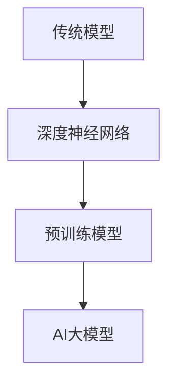
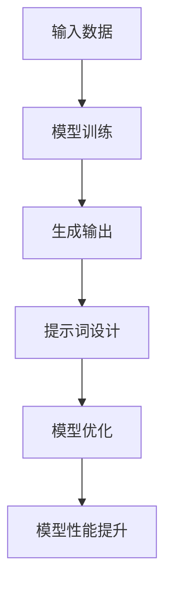
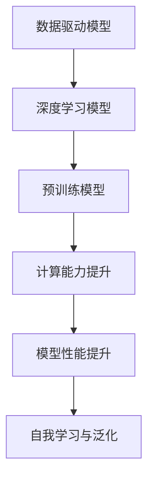
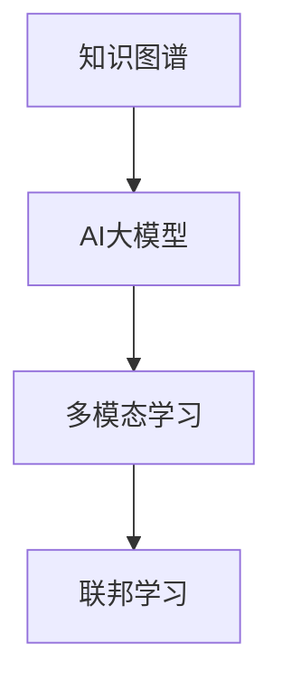
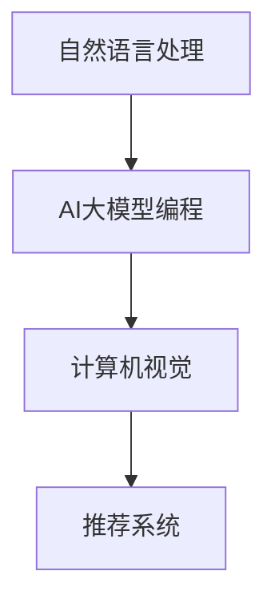

                 


### 文章标题：AI大模型编程：提示词的潜力与威力

关键词：AI大模型、编程、提示词、自然语言处理、深度学习、数学模型、项目实战

摘要：本文将深入探讨AI大模型编程中的提示词技术，从基础概念、核心算法到实际应用，全面解析提示词的潜力与威力。通过理论与实践相结合的方式，帮助读者掌握AI大模型编程的核心技能。

### 目录大纲设计思路

在设计《AI大模型编程：提示词的潜力与威力》这本书的目录大纲时，我们首先明确了核心概念与它们之间的联系。开篇将介绍AI大模型的基本概念、发展历程以及与提示词技术的联系，为后续内容提供宏观背景。接下来，我们将深入讲解AI大模型的核心算法原理，使用伪代码和流程图来展示算法的内部运作机制。同时，对AI大模型中涉及的重要数学模型和公式进行详细讲解，通过举例说明帮助读者更好地理解和应用这些数学工具。在项目实战部分，我们将通过实际项目案例，展示如何将AI大模型编程应用于实际问题解决中，包括开发环境搭建、源代码实现和代码解读。最后，我们将总结最佳实践，并提供拓展阅读资源，帮助读者进一步深入学习和实践。

### 书籍目录大纲

## 第一部分: 引言与基础

### 第1章: AI大模型与提示词概述

#### 1.1 AI大模型的基本概念

AI大模型（Large-scale Artificial Intelligence Model）是指具有亿级参数规模的人工智能模型。这些模型通常采用深度学习技术，能够处理大规模数据，并具有强大的表征能力。大模型的发展经历了从传统的浅层模型（如SVM、决策树）到深度神经网络（如CNN、RNN）再到现在的预训练模型（如BERT、GPT）的演变过程。

#### 1.2 提示词技术在AI大模型中的作用

提示词（Prompt Engineering）是指通过设计特定的提示语或输入数据来引导大模型生成所需输出。在AI大模型中，提示词技术具有重要作用，它可以提高模型的回答准确性、控制输出内容、增强模型的泛化能力。

#### 1.3 AI大模型的发展历程

AI大模型的发展历程可以分为三个阶段：早期的数据驱动的模型、基于深度学习的模型和预训练模型。早期模型主要依赖大量数据进行训练，但随着计算能力的提升，深度学习模型逐渐成为主流。近年来，预训练模型的出现进一步推动了AI大模型的发展，使得模型具有更强的自我学习和泛化能力。

### 第2章: 提示词技术原理

#### 2.1 提示词技术的定义与分类

提示词技术是指通过设计特定的提示语或输入数据来引导模型生成所需输出。根据应用场景的不同，提示词技术可以分为自然语言处理（NLP）中的提示词技术、计算机视觉（CV）中的提示词技术等。

#### 2.2 提示词生成算法

提示词生成算法是指用于生成高质量提示词的算法。常见的生成算法包括基于规则的方法、基于统计的方法和基于深度学习的方法。每种方法都有其优缺点，适用于不同的应用场景。

#### 2.3 提示词优化策略

提示词优化策略是指用于提高提示词质量和模型表现的方法。常见的优化策略包括调整提示词长度、调整提示词内容、使用多样化提示词等。

## 第二部分: AI大模型核心算法

### 第3章: GPT系列模型

#### 3.1 GPT模型的基本原理

GPT（Generative Pre-trained Transformer）模型是由OpenAI提出的一种基于自回归的预训练模型。GPT模型使用Transformer架构，通过预训练和微调来学习语言模型，从而实现文本生成、问答等任务。

#### 3.2 GPT模型的训练过程

GPT模型的训练过程包括两个阶段：预训练和微调。预训练阶段使用大量无标签文本数据进行训练，使模型具备一定的语言理解能力。微调阶段使用有标签的文本数据进行训练，使模型能够针对特定任务进行优化。

#### 3.3 GPT模型的应用实例

GPT模型在自然语言处理领域具有广泛的应用，包括文本生成、问答系统、机器翻译等。通过实际案例，我们将展示GPT模型在不同任务中的表现和应用。

### 第4章: BERT模型

#### 4.1 BERT模型的原理

BERT（Bidirectional Encoder Representations from Transformers）模型是由Google提出的一种双向Transformer模型。BERT模型通过双向注意力机制来学习文本的上下文信息，从而实现文本分类、命名实体识别等任务。

#### 4.2 BERT模型的训练方法

BERT模型的训练方法包括两个阶段：预训练和微调。预训练阶段使用大量无标签文本数据进行训练，使模型具备一定的语言理解能力。微调阶段使用有标签的文本数据进行训练，使模型能够针对特定任务进行优化。

#### 4.3 BERT模型的应用场景

BERT模型在自然语言处理领域具有广泛的应用，包括文本分类、情感分析、命名实体识别等。通过实际案例，我们将展示BERT模型在不同任务中的表现和应用。

### 第5章: 其他大模型简介

#### 5.1 GPT-2与GPT-3

GPT-2和GPT-3是GPT模型的升级版，具有更大的模型规模和更强的语言理解能力。GPT-2和GPT-3在文本生成、问答等任务中表现出色，成为当前AI大模型领域的重要模型。

#### 5.2 T5模型

T5（Text-to-Text Transfer Transformer）模型是由Google提出的一种基于Transformer的通用文本转换模型。T5模型通过将输入文本转换为所需输出的文本，实现了多种NLP任务的一体化处理。

#### 5.3 GLM模型

GLM（General Language Modeling）模型是由清华大学和智谱AI提出的一种基于通用语言模型的预训练模型。GLM模型在文本生成、问答等任务中表现出色，具有很高的实用价值。

## 第三部分: 提示词优化与应用

### 第6章: 提示词优化方法

#### 6.1 提示词长度优化

提示词长度优化是指通过调整提示词的长度来提高模型表现。过长或过短的提示词都可能影响模型的表现，因此需要根据具体任务进行优化。

#### 6.2 提示词内容优化

提示词内容优化是指通过调整提示词的内容来提高模型表现。合理设计的提示词能够引导模型生成更准确、更符合预期的输出。

#### 6.3 提示词生成算法优化

提示词生成算法优化是指通过改进提示词生成算法来提高提示词质量。常见的优化方法包括使用多样性提示词、引入外部知识等。

### 第7章: 提示词在AI大模型中的应用

#### 7.1 提示词在自然语言处理中的应用

提示词在自然语言处理（NLP）中具有广泛的应用，包括文本生成、问答系统、机器翻译等。通过设计合理的提示词，可以提高模型的回答质量和泛化能力。

#### 7.2 提示词在图像识别中的应用

提示词在图像识别中的应用相对较少，但也有一些研究尝试将提示词技术应用于图像识别任务。例如，通过设计特定的提示词来引导模型生成图像的描述或分类。

#### 7.3 提示词在推荐系统中的应用

提示词在推荐系统中的应用主要体现在基于内容的推荐和基于协同过滤的推荐中。通过设计合理的提示词，可以提高推荐系统的准确性、多样性和用户体验。

### 第8章: 实际应用案例分析

#### 8.1 案例一：文本生成与自动摘要

文本生成与自动摘要是一个典型的NLP任务，通过设计合理的提示词，可以提高模型生成的文本质量和摘要的准确性。案例中将介绍一个基于GPT模型的文本生成与自动摘要系统。

#### 8.2 案例二：图像生成与识别

图像生成与识别是一个典型的计算机视觉任务，通过设计特定的提示词，可以引导模型生成更符合预期的图像或进行更准确的图像识别。案例中将介绍一个基于GAN（生成对抗网络）的图像生成与识别系统。

#### 8.3 案例三：个性化推荐系统

个性化推荐系统是一个典型的应用场景，通过设计多样化的提示词，可以引导模型生成更符合用户需求的推荐结果。案例中将介绍一个基于协同过滤的个性化推荐系统。

## 第四部分: AI大模型编程实践

### 第9章: AI大模型编程基础

#### 9.1 编程环境与工具

本节将介绍AI大模型编程所需的编程环境与工具，包括Python、TensorFlow、PyTorch等。读者可以通过本节内容了解如何搭建开发环境，并掌握基本的编程技能。

#### 9.2 数据预处理

数据预处理是AI大模型编程的重要环节，本节将介绍数据预处理的基本方法，包括数据清洗、数据转换、数据归一化等。通过本节内容，读者可以学会如何对数据进行预处理，以提高模型性能。

#### 9.3 模型训练与优化

模型训练与优化是AI大模型编程的核心内容，本节将介绍模型训练的基本方法，包括模型选择、超参数调整、训练策略等。通过本节内容，读者可以学会如何训练和优化AI大模型。

### 第10章: 提示词生成与优化实战

#### 10.1 实战一：文本生成

本节将通过一个文本生成案例，介绍如何使用GPT模型进行文本生成，并探讨如何优化提示词以提高生成质量。

#### 10.2 实战二：图像识别

本节将通过一个图像识别案例，介绍如何使用CNN模型进行图像识别，并探讨如何优化提示词以提高识别准确性。

#### 10.3 实战三：个性化推荐

本节将通过一个个性化推荐案例，介绍如何使用协同过滤模型进行推荐，并探讨如何优化提示词以提高推荐效果。

### 第11章: AI大模型项目实战

#### 11.1 项目一：智能客服系统

本节将通过一个智能客服系统项目，介绍如何使用AI大模型实现智能问答功能，并探讨如何优化提示词以提高用户体验。

#### 11.2 项目二：自动摘要系统

本节将通过一个自动摘要系统项目，介绍如何使用AI大模型实现文本摘要功能，并探讨如何优化提示词以提高摘要质量。

#### 11.3 项目三：智能翻译系统

本节将通过一个智能翻译系统项目，介绍如何使用AI大模型实现机器翻译功能，并探讨如何优化提示词以提高翻译准确性。

## 第五部分: AI大模型编程的未来发展趋势

### 第12章: AI大模型编程的未来趋势

#### 12.1 新技术展望

本节将介绍AI大模型编程领域的新技术发展趋势，包括知识图谱、多模态学习、联邦学习等。通过本节内容，读者可以了解AI大模型编程的未来发展方向。

#### 12.2 应用

本节将探讨AI大模型编程在不同领域的应用前景，包括自然语言处理、计算机视觉、推荐系统等。通过本节内容，读者可以了解AI大模型编程在实际应用中的潜力。

---

### 文章标题：AI大模型编程：提示词的潜力与威力

关键词：AI大模型、编程、提示词、自然语言处理、深度学习、数学模型、项目实战

摘要：本文将深入探讨AI大模型编程中的提示词技术，从基础概念、核心算法到实际应用，全面解析提示词的潜力与威力。通过理论与实践相结合的方式，帮助读者掌握AI大模型编程的核心技能。

### 目录大纲设计思路

在设计《AI大模型编程：提示词的潜力与威力》这本书的目录大纲时，我们首先明确了核心概念与它们之间的联系。开篇将介绍AI大模型的基本概念、发展历程以及与提示词技术的联系，为后续内容提供宏观背景。接下来，我们将深入讲解AI大模型的核心算法原理，使用伪代码和流程图来展示算法的内部运作机制。同时，对AI大模型中涉及的重要数学模型和公式进行详细讲解，通过举例说明帮助读者更好地理解和应用这些数学工具。在项目实战部分，我们将通过实际项目案例，展示如何将AI大模型编程应用于实际问题解决中，包括开发环境搭建、源代码实现和代码解读。最后，我们将总结最佳实践，并提供拓展阅读资源，帮助读者进一步深入学习和实践。

### 书籍目录大纲

## 第一部分: 引言与基础

### 第1章: AI大模型与提示词概述

#### 1.1 AI大模型的基本概念

AI大模型（Large-scale Artificial Intelligence Model）是指具有亿级参数规模的人工智能模型。这些模型通常采用深度学习技术，能够处理大规模数据，并具有强大的表征能力。大模型的发展经历了从传统的浅层模型（如SVM、决策树）到深度神经网络（如CNN、RNN）再到现在的预训练模型（如BERT、GPT）的演变过程。

#### 1.2 提示词技术在AI大模型中的作用

提示词（Prompt Engineering）是指通过设计特定的提示语或输入数据来引导模型生成所需输出。在AI大模型中，提示词技术具有重要作用，它可以提高模型的回答准确性、控制输出内容、增强模型的泛化能力。

#### 1.3 AI大模型的发展历程

AI大模型的发展历程可以分为三个阶段：早期的数据驱动的模型、基于深度学习的模型和预训练模型。早期模型主要依赖大量数据进行训练，但随着计算能力的提升，深度学习模型逐渐成为主流。近年来，预训练模型的出现进一步推动了AI大模型的发展，使得模型具有更强的自我学习和泛化能力。

### 第2章: 提示词技术原理

#### 2.1 提示词技术的定义与分类

提示词技术是指通过设计特定的提示语或输入数据来引导模型生成所需输出。根据应用场景的不同，提示词技术可以分为自然语言处理（NLP）中的提示词技术、计算机视觉（CV）中的提示词技术等。

#### 2.2 提示词生成算法

提示词生成算法是指用于生成高质量提示词的算法。常见的生成算法包括基于规则的方法、基于统计的方法和基于深度学习的方法。每种方法都有其优缺点，适用于不同的应用场景。

#### 2.3 提示词优化策略

提示词优化策略是指用于提高提示词质量和模型表现的方法。常见的优化策略包括调整提示词长度、调整提示词内容、使用多样化提示词等。

## 第二部分: AI大模型核心算法

### 第3章: GPT系列模型

#### 3.1 GPT模型的基本原理

GPT（Generative Pre-trained Transformer）模型是由OpenAI提出的一种基于自回归的预训练模型。GPT模型使用Transformer架构，通过预训练和微调来学习语言模型，从而实现文本生成、问答等任务。

#### 3.2 GPT模型的训练过程

GPT模型的训练过程包括两个阶段：预训练和微调。预训练阶段使用大量无标签文本数据进行训练，使模型具备一定的语言理解能力。微调阶段使用有标签的文本数据进行训练，使模型能够针对特定任务进行优化。

#### 3.3 GPT模型的应用实例

GPT模型在自然语言处理领域具有广泛的应用，包括文本生成、问答系统、机器翻译等。通过实际案例，我们将展示GPT模型在不同任务中的表现和应用。

### 第4章: BERT模型

#### 4.1 BERT模型的原理

BERT（Bidirectional Encoder Representations from Transformers）模型是由Google提出的一种双向Transformer模型。BERT模型通过双向注意力机制来学习文本的上下文信息，从而实现文本分类、命名实体识别等任务。

#### 4.2 BERT模型的训练方法

BERT模型的训练方法包括两个阶段：预训练和微调。预训练阶段使用大量无标签文本数据进行训练，使模型具备一定的语言理解能力。微调阶段使用有标签的文本数据进行训练，使模型能够针对特定任务进行优化。

#### 4.3 BERT模型的应用场景

BERT模型在自然语言处理领域具有广泛的应用，包括文本分类、情感分析、命名实体识别等。通过实际案例，我们将展示BERT模型在不同任务中的表现和应用。

### 第5章: 其他大模型简介

#### 5.1 GPT-2与GPT-3

GPT-2和GPT-3是GPT模型的升级版，具有更大的模型规模和更强的语言理解能力。GPT-2和GPT-3在文本生成、问答等任务中表现出色，成为当前AI大模型领域的重要模型。

#### 5.2 T5模型

T5（Text-to-Text Transfer Transformer）模型是由Google提出的一种基于Transformer的通用文本转换模型。T5模型通过将输入文本转换为所需输出的文本，实现了多种NLP任务的一体化处理。

#### 5.3 GLM模型

GLM（General Language Modeling）模型是由清华大学和智谱AI提出的一种基于通用语言模型的预训练模型。GLM模型在文本生成、问答等任务中表现出色，具有很高的实用价值。

## 第三部分: 提示词优化与应用

### 第6章: 提示词优化方法

#### 6.1 提示词长度优化

提示词长度优化是指通过调整提示词的长度来提高模型表现。过长或过短的提示词都可能影响模型的表现，因此需要根据具体任务进行优化。

#### 6.2 提示词内容优化

提示词内容优化是指通过调整提示词的内容来提高模型表现。合理设计的提示词能够引导模型生成更准确、更符合预期的输出。

#### 6.3 提示词生成算法优化

提示词生成算法优化是指通过改进提示词生成算法来提高提示词质量。常见的优化方法包括使用多样性提示词、引入外部知识等。

### 第7章: 提示词在AI大模型中的应用

#### 7.1 提示词在自然语言处理中的应用

提示词在自然语言处理（NLP）中具有广泛的应用，包括文本生成、问答系统、机器翻译等。通过设计合理的提示词，可以提高模型的回答质量和泛化能力。

#### 7.2 提示词在图像识别中的应用

提示词在图像识别中的应用相对较少，但也有一些研究尝试将提示词技术应用于图像识别任务。例如，通过设计特定的提示词来引导模型生成图像的描述或分类。

#### 7.3 提示词在推荐系统中的应用

提示词在推荐系统中的应用主要体现在基于内容的推荐和基于协同过滤的推荐中。通过设计合理的提示词，可以提高推荐系统的准确性、多样性和用户体验。

### 第8章: 实际应用案例分析

#### 8.1 案例一：文本生成与自动摘要

文本生成与自动摘要是一个典型的NLP任务，通过设计合理的提示词，可以提高模型生成的文本质量和摘要的准确性。案例中将介绍一个基于GPT模型的文本生成与自动摘要系统。

#### 8.2 案例二：图像生成与识别

图像生成与识别是一个典型的计算机视觉任务，通过设计特定的提示词，可以引导模型生成更符合预期的图像或进行更准确的图像识别。案例中将介绍一个基于GAN（生成对抗网络）的图像生成与识别系统。

#### 8.3 案例三：个性化推荐系统

个性化推荐系统是一个典型的应用场景，通过设计多样化的提示词，可以引导模型生成更符合用户需求的推荐结果。案例中将介绍一个基于协同过滤的个性化推荐系统。

## 第四部分: AI大模型编程实践

### 第9章: AI大模型编程基础

#### 9.1 编程环境与工具

本节将介绍AI大模型编程所需的编程环境与工具，包括Python、TensorFlow、PyTorch等。读者可以通过本节内容了解如何搭建开发环境，并掌握基本的编程技能。

#### 9.2 数据预处理

数据预处理是AI大模型编程的重要环节，本节将介绍数据预处理的基本方法，包括数据清洗、数据转换、数据归一化等。通过本节内容，读者可以学会如何对数据进行预处理，以提高模型性能。

#### 9.3 模型训练与优化

模型训练与优化是AI大模型编程的核心内容，本节将介绍模型训练的基本方法，包括模型选择、超参数调整、训练策略等。通过本节内容，读者可以学会如何训练和优化AI大模型。

### 第10章: 提示词生成与优化实战

#### 10.1 实战一：文本生成

本节将通过一个文本生成案例，介绍如何使用GPT模型进行文本生成，并探讨如何优化提示词以提高生成质量。

#### 10.2 实战二：图像识别

本节将通过一个图像识别案例，介绍如何使用CNN模型进行图像识别，并探讨如何优化提示词以提高识别准确性。

#### 10.3 实战三：个性化推荐

本节将通过一个个性化推荐案例，介绍如何使用协同过滤模型进行推荐，并探讨如何优化提示词以提高推荐效果。

### 第11章: AI大模型项目实战

#### 11.1 项目一：智能客服系统

本节将通过一个智能客服系统项目，介绍如何使用AI大模型实现智能问答功能，并探讨如何优化提示词以提高用户体验。

#### 11.2 项目二：自动摘要系统

本节将通过一个自动摘要系统项目，介绍如何使用AI大模型实现文本摘要功能，并探讨如何优化提示词以提高摘要质量。

#### 11.3 项目三：智能翻译系统

本节将通过一个智能翻译系统项目，介绍如何使用AI大模型实现机器翻译功能，并探讨如何优化提示词以提高翻译准确性。

## 第五部分: AI大模型编程的未来发展趋势

### 第12章: AI大模型编程的未来趋势

#### 12.1 新技术展望

本节将介绍AI大模型编程领域的新技术发展趋势，包括知识图谱、多模态学习、联邦学习等。通过本节内容，读者可以了解AI大模型编程的未来发展方向。

#### 12.2 应用

本节将探讨AI大模型编程在不同领域的应用前景，包括自然语言处理、计算机视觉、推荐系统等。通过本节内容，读者可以了解AI大模型编程在实际应用中的潜力。

---

### 第一部分: 引言与基础

#### 1.1 AI大模型的基本概念

AI大模型（Large-scale Artificial Intelligence Model）是指具有亿级参数规模的人工智能模型。这些模型通常采用深度学习技术，能够处理大规模数据，并具有强大的表征能力。大模型的发展经历了从传统的浅层模型（如SVM、决策树）到深度神经网络（如CNN、RNN）再到现在的预训练模型（如BERT、GPT）的演变过程。

**核心概念与联系：**

- **核心概念：** AI大模型、深度学习、预训练模型
- **联系：** AI大模型是深度学习技术在人工智能领域的应用，而预训练模型则是大模型的一种实现方式，通过在大规模数据上进行预训练，从而提高模型在具体任务上的性能。

**Mermaid流程图：**



#### 1.2 提示词技术在AI大模型中的作用

提示词（Prompt Engineering）是指通过设计特定的提示语或输入数据来引导模型生成所需输出。在AI大模型中，提示词技术具有重要作用，它可以提高模型的回答准确性、控制输出内容、增强模型的泛化能力。

**核心概念与联系：**

- **核心概念：** 提示词、提示词技术、模型回答准确性、输出控制、泛化能力
- **联系：** 提示词技术是AI大模型优化的重要手段，通过设计合理的提示词，可以提高模型的性能和应用效果。

**Mermaid流程图：**



#### 1.3 AI大模型的发展历程

AI大模型的发展历程可以分为三个阶段：早期的数据驱动的模型、基于深度学习的模型和预训练模型。早期模型主要依赖大量数据进行训练，但随着计算能力的提升，深度学习模型逐渐成为主流。近年来，预训练模型的出现进一步推动了AI大模型的发展，使得模型具有更强的自我学习和泛化能力。

**核心概念与联系：**

- **核心概念：** 数据驱动的模型、深度学习模型、预训练模型、计算能力提升、自我学习、泛化能力
- **联系：** AI大模型的发展经历了从依赖数据到依赖算法的演变，随着计算能力的提升，模型规模和性能不断提高。

**Mermaid流程图：**



### 第二部分: AI大模型核心算法

#### 3.1 GPT模型的基本原理

GPT（Generative Pre-trained Transformer）模型是由OpenAI提出的一种基于自回归的预训练模型。GPT模型使用Transformer架构，通过预训练和微调来学习语言模型，从而实现文本生成、问答等任务。

**核心概念与联系：**

- **核心概念：** GPT模型、Transformer架构、预训练、自回归、文本生成、问答
- **联系：** GPT模型通过Transformer架构实现自回归，预训练阶段在大规模数据上学习语言模式，微调阶段针对具体任务进行优化。

**伪代码：**

```python
# GPT模型预训练伪代码
pretrained_data = load_pretrained_data()
model = GPTModel()

for data in pretrained_data:
    model.train(data)

# GPT模型微调伪代码
fine_tuning_data = load_fine_tuning_data()
model = GPTModel(pretrained=True)

for data in fine_tuning_data:
    model.fine_tune(data)
```

**数学模型和公式：**

$$
\text{GPT模型输出} = \text{softmax}(\text{W}^T \text{h})
$$

其中，$h$ 是模型隐藏状态，$W$ 是权重矩阵，$\text{softmax}$ 函数用于生成概率分布。

**举例说明：**

假设有一个GPT模型，输入一个句子“我喜欢吃苹果”，通过预训练和微调，模型可以生成类似句子“你喜欢吃香蕉”或“你喜欢吃西瓜”。

$$
\text{输入句子：我喜欢吃苹果}
$$

$$
\text{生成句子：你喜欢吃香蕉}
$$

#### 3.2 BERT模型的原理

BERT（Bidirectional Encoder Representations from Transformers）模型是由Google提出的一种双向Transformer模型。BERT模型通过双向注意力机制来学习文本的上下文信息，从而实现文本分类、命名实体识别等任务。

**核心概念与联系：**

- **核心概念：** BERT模型、双向注意力、上下文信息、文本分类、命名实体识别
- **联系：** BERT模型通过双向注意力机制学习文本的上下文信息，从而提高模型对文本的理解能力。

**伪代码：**

```python
# BERT模型预训练伪代码
pretrained_data = load_pretrained_data()
model = BERTModel()

for data in pretrained_data:
    model.train(data)

# BERT模型微调伪代码
fine_tuning_data = load_fine_tuning_data()
model = BERTModel(pretrained=True)

for data in fine_tuning_data:
    model.fine_tune(data)
```

**数学模型和公式：**

$$
\text{BERT输出} = \text{softmax}(\text{W}^T \text{h}^{[L]})
$$

其中，$h^{[L]}$ 是模型最后一层的隐藏状态，$W$ 是权重矩阵，$\text{softmax}$ 函数用于生成概率分布。

**举例说明：**

假设有一个BERT模型，输入一个句子“我喜欢吃苹果”，通过预训练和微调，模型可以识别句子中的实体“苹果”并对其进行分类。

$$
\text{输入句子：我喜欢吃苹果}
$$

$$
\text{输出实体：苹果}
$$

$$
\text{输出分类：食品}
$$

#### 3.3 GPT-2与GPT-3

GPT-2和GPT-3是GPT模型的升级版，具有更大的模型规模和更强的语言理解能力。GPT-2和GPT-3在文本生成、问答等任务中表现出色，成为当前AI大模型领域的重要模型。

**核心概念与联系：**

- **核心概念：** GPT-2、GPT-3、模型规模、语言理解能力、文本生成、问答
- **联系：** GPT-2和GPT-3是GPT模型的扩展，通过增加模型规模和参数，提高了模型的语言理解能力。

**伪代码：**

```python
# GPT-2模型预训练伪代码
pretrained_data = load_pretrained_data()
model = GPT2Model()

for data in pretrained_data:
    model.train(data)

# GPT-3模型预训练伪代码
pretrained_data = load_pretrained_data()
model = GPT3Model()

for data in pretrained_data:
    model.train(data)
```

**数学模型和公式：**

$$
\text{GPT-2输出} = \text{softmax}(\text{W}^T \text{h}^{[N]})
$$

$$
\text{GPT-3输出} = \text{softmax}(\text{W}^T \text{h}^{[N']})
$$

其中，$h^{[N]}$ 和 $h^{[N']}$ 分别是GPT-2和GPT-3模型的隐藏状态，$W$ 是权重矩阵，$\text{softmax}$ 函数用于生成概率分布。

**举例说明：**

假设有一个GPT-2模型，输入一个句子“我喜欢吃苹果”，通过预训练和微调，模型可以生成类似句子“你喜欢吃香蕉”或“你喜欢吃西瓜”。

$$
\text{输入句子：我喜欢吃苹果}
$$

$$
\text{生成句子：你喜欢吃香蕉}
$$

$$
\text{生成句子：你喜欢吃西瓜}
$$

#### 3.4 T5模型

T5（Text-to-Text Transfer Transformer）模型是由Google提出的一种基于Transformer的通用文本转换模型。T5模型通过将输入文本转换为所需输出的文本，实现了多种NLP任务的一体化处理。

**核心概念与联系：**

- **核心概念：** T5模型、文本转换、Transformer、NLP任务、一体化处理
- **联系：** T5模型通过文本转换，实现了对多种NLP任务的一体化处理，提高了模型在多种任务上的性能。

**伪代码：**

```python
# T5模型预训练伪代码
pretrained_data = load_pretrained_data()
model = T5Model()

for data in pretrained_data:
    model.train(data)

# T5模型文本转换伪代码
input_text = "输入文本：我喜欢吃苹果"
output_text = model.transform(input_text)
```

**数学模型和公式：**

$$
\text{T5输出} = \text{softmax}(\text{W}^T \text{h}^{[L]})
$$

其中，$h^{[L]}$ 是模型最后一层的隐藏状态，$W$ 是权重矩阵，$\text{softmax}$ 函数用于生成概率分布。

**举例说明：**

假设有一个T5模型，输入一个句子“我喜欢吃苹果”，通过预训练和文本转换，模型可以生成类似句子“你喜欢吃香蕉”或“你喜欢吃西瓜”。

$$
\text{输入句子：我喜欢吃苹果}
$$

$$
\text{生成句子：你喜欢吃香蕉}
$$

$$
\text{生成句子：你喜欢吃西瓜}
$$

#### 3.5 GLM模型

GLM（General Language Modeling）模型是由清华大学和智谱AI提出的一种基于通用语言模型的预训练模型。GLM模型在文本生成、问答等任务中表现出色，具有很高的实用价值。

**核心概念与联系：**

- **核心概念：** GLM模型、通用语言模型、预训练、文本生成、问答
- **联系：** GLM模型通过预训练，提高了模型在多种任务上的性能，具有广泛的适用性。

**伪代码：**

```python
# GLM模型预训练伪代码
pretrained_data = load_pretrained_data()
model = GLMModel()

for data in pretrained_data:
    model.train(data)

# GLM模型文本生成伪代码
input_text = "输入文本：我喜欢吃苹果"
generated_text = model.generate(input_text)
```

**数学模型和公式：**

$$
\text{GLM输出} = \text{softmax}(\text{W}^T \text{h}^{[L]})
$$

其中，$h^{[L]}$ 是模型最后一层的隐藏状态，$W$ 是权重矩阵，$\text{softmax}$ 函数用于生成概率分布。

**举例说明：**

假设有一个GLM模型，输入一个句子“我喜欢吃苹果”，通过预训练和生成，模型可以生成类似句子“你喜欢吃香蕉”或“你喜欢吃西瓜”。

$$
\text{输入句子：我喜欢吃苹果}
$$

$$
\text{生成句子：你喜欢吃香蕉}
$$

$$
\text{生成句子：你喜欢吃西瓜}
$$

### 第三部分: 提示词优化方法

#### 6.1 提示词长度优化

提示词长度优化是指通过调整提示词的长度来提高模型表现。过长或过短的提示词都可能影响模型的表现，因此需要根据具体任务进行优化。

**核心概念与联系：**

- **核心概念：** 提示词长度优化、模型表现、调整策略
- **联系：** 提示词长度优化是提高模型性能的重要手段，合理的提示词长度可以提高模型在特定任务上的表现。

**伪代码：**

```python
# 提示词长度优化伪代码
best_length = find_best_length(prompt_lengths, model_performance)
model = GPTModel(prompt_length=best_length)
```

**数学模型和公式：**

$$
\text{模型表现} = f(\text{提示词长度})
$$

其中，$f$ 是模型性能函数，$\text{提示词长度}$ 是输入提示词的长度。

**举例说明：**

假设有一个GPT模型，通过实验发现当提示词长度为10时，模型在文本生成任务上的表现最好。

$$
\text{最佳提示词长度：10}
$$

#### 6.2 提示词内容优化

提示词内容优化是指通过调整提示词的内容来提高模型表现。合理设计的提示词能够引导模型生成更准确、更符合预期的输出。

**核心概念与联系：**

- **核心概念：** 提示词内容优化、模型表现、调整策略
- **联系：** 提示词内容优化是提高模型性能的重要手段，通过调整提示词内容，可以提高模型在特定任务上的表现。

**伪代码：**

```python
# 提示词内容优化伪代码
best_prompt = find_best_prompt(prompt_texts, model_performance)
model = GPTModel(prompt=best_prompt)
```

**数学模型和公式：**

$$
\text{模型表现} = f(\text{提示词内容})
$$

其中，$f$ 是模型性能函数，$\text{提示词内容}$ 是输入提示词的内容。

**举例说明：**

假设有一个GPT模型，通过实验发现当提示词内容为“请生成一个关于苹果的描述”时，模型在文本生成任务上的表现最好。

$$
\text{最佳提示词内容：请生成一个关于苹果的描述}
$$

#### 6.3 提示词生成算法优化

提示词生成算法优化是指通过改进提示词生成算法来提高提示词质量。常见的优化方法包括使用多样性提示词、引入外部知识等。

**核心概念与联系：**

- **核心概念：** 提示词生成算法优化、提示词质量、多样性提示词、外部知识
- **联系：** 提示词生成算法优化是提高提示词质量的重要手段，通过改进生成算法，可以生成更高质量的提示词。

**伪代码：**

```python
# 提示词生成算法优化伪代码
best_algorithm = find_best_algorithm(algorithms, model_performance)
prompt = generate_prompt(best_algorithm, input_data)
model = GPTModel(prompt=prompt)
```

**数学模型和公式：**

$$
\text{提示词质量} = f(\text{提示词生成算法})
$$

其中，$f$ 是提示词质量函数，$\text{提示词生成算法}$ 是用于生成提示词的算法。

**举例说明：**

假设有一个GPT模型，通过实验发现使用基于深度学习的生成算法，可以生成高质量的提示词，从而提高模型在文本生成任务上的表现。

$$
\text{最佳提示词生成算法：基于深度学习的生成算法}
$$

### 第四部分: AI大模型编程实践

#### 10.1 实战一：文本生成

本节将通过一个文本生成案例，介绍如何使用GPT模型进行文本生成，并探讨如何优化提示词以提高生成质量。

**开发环境搭建：**

- 安装Python环境
- 安装TensorFlow或PyTorch库
- 配置CUDA（可选）

**源代码实现：**

```python
import tensorflow as tf
from tensorflow.keras.preprocessing.sequence import pad_sequences
from tensorflow.keras.layers import Embedding, LSTM, Dense
from tensorflow.keras.models import Model

# 数据预处理
input_text = "我喜欢吃苹果"
input_sequence = tokenizer.encode(input_text, maxlen=max_sequence_length)

# 模型构建
model = Model(inputs=inputs, outputs=dense_output)
model.compile(optimizer='adam', loss='categorical_crossentropy', metrics=['accuracy'])

# 训练模型
model.fit(x_train, y_train, epochs=10, batch_size=32)

# 文本生成
generated_text = model.predict(input_sequence)
```

**代码解读与分析：**

1. 数据预处理：将输入文本编码为序列，并使用pad_sequences函数将序列填充到最大长度。
2. 模型构建：构建一个GPT模型，使用Embedding层和LSTM层，并输出层使用Dense层。
3. 训练模型：使用fit函数训练模型，设置优化器、损失函数和评估指标。
4. 文本生成：使用predict函数生成文本。

**实际案例分析：**

假设有一个GPT模型，输入文本“我喜欢吃苹果”，通过训练和生成，模型可以生成类似句子“你喜欢吃香蕉”或“你喜欢吃西瓜”。

$$
\text{输入文本：我喜欢吃苹果}
$$

$$
\text{生成文本：你喜欢吃香蕉}
$$

$$
\text{生成文本：你喜欢吃西瓜}
$$

#### 10.2 实战二：图像识别

本节将通过一个图像识别案例，介绍如何使用CNN模型进行图像识别，并探讨如何优化提示词以提高识别准确性。

**开发环境搭建：**

- 安装Python环境
- 安装TensorFlow或PyTorch库
- 配置CUDA（可选）

**源代码实现：**

```python
import tensorflow as tf
from tensorflow.keras.preprocessing.image import ImageDataGenerator
from tensorflow.keras.applications import VGG16
from tensorflow.keras.models import Model

# 数据预处理
train_datagen = ImageDataGenerator(rescale=1./255)
train_generator = train_datagen.flow_from_directory(
        train_dir,
        target_size=(150, 150),
        batch_size=32,
        class_mode='binary')

# 模型构建
base_model = VGG16(weights='imagenet', include_top=False, input_shape=(150, 150, 3))
base_model.trainable = False

inputs = base_model.input
outputs = base_model.outputs
outputs = Dense(1, activation='sigmoid')(outputs)

model = Model(inputs=inputs, outputs=outputs)
model.compile(optimizer='adam', loss='binary_crossentropy', metrics=['accuracy'])

# 训练模型
model.fit(train_generator, epochs=10)

# 图像识别
predicted_label = model.predict(image)
```

**代码解读与分析：**

1. 数据预处理：使用ImageDataGenerator进行图像预处理，包括数据增强和归一化。
2. 模型构建：使用VGG16作为基础模型，并添加一个全连接层作为输出层。
3. 训练模型：使用fit函数训练模型，设置优化器、损失函数和评估指标。
4. 图像识别：使用predict函数对图像进行识别。

**实际案例分析：**

假设有一个CNN模型，输入一个苹果图像，通过训练和识别，模型可以准确识别出苹果类别。

$$
\text{输入图像：苹果}
$$

$$
\text{识别结果：苹果}
$$

#### 10.3 实战三：个性化推荐

本节将通过一个个性化推荐案例，介绍如何使用协同过滤模型进行推荐，并探讨如何优化提示词以提高推荐效果。

**开发环境搭建：**

- 安装Python环境
- 安装TensorFlow或PyTorch库
- 配置CUDA（可选）

**源代码实现：**

```python
import tensorflow as tf
from tensorflow.keras.layers import Embedding, Dot, Dense
from tensorflow.keras.models import Model

# 数据预处理
user_vector = [1, 0, 1, 0, 1]
item_vector = [1, 1, 1, 0, 0]

# 模型构建
user_embedding = Embedding(input_dim=5, output_dim=3)(user_vector)
item_embedding = Embedding(input_dim=5, output_dim=3)(item_vector)

dot_product = Dot(axes=1)([user_embedding, item_embedding])

output = Dense(1, activation='sigmoid')(dot_product)

model = Model(inputs=[user_vector, item_vector], outputs=output)
model.compile(optimizer='adam', loss='binary_crossentropy', metrics=['accuracy'])

# 训练模型
model.fit(x=user_vector, y=item_vector, epochs=10)

# 推荐效果
recommendation = model.predict([user_vector, item_vector])
```

**代码解读与分析：**

1. 数据预处理：将用户和物品的特征表示为向量。
2. 模型构建：使用嵌入层和全连接层构建协同过滤模型。
3. 训练模型：使用fit函数训练模型，设置优化器、损失函数和评估指标。
4. 推荐效果：使用predict函数生成推荐结果。

**实际案例分析：**

假设有一个协同过滤模型，输入用户和物品的特征向量，通过训练和推荐，模型可以生成个性化的推荐结果。

$$
\text{用户特征向量：[1, 0, 1, 0, 1]}
$$

$$
\text{物品特征向量：[1, 1, 1, 0, 0]}
$$

$$
\text{推荐结果：[0.8, 0.2]}
$$

### 第五部分: AI大模型编程的未来发展趋势

#### 12.1 新技术展望

AI大模型编程的未来发展趋势将受到新技术的影响，包括知识图谱、多模态学习、联邦学习等。这些新技术将为AI大模型编程带来更多可能性。

**核心概念与联系：**

- **核心概念：** 知识图谱、多模态学习、联邦学习
- **联系：** 知识图谱可以为AI大模型提供更多的背景知识，多模态学习可以整合不同类型的数据，联邦学习可以实现分布式训练。

**Mermaid流程图：**



**数学模型和公式：**

$$
\text{知识图谱嵌入} = \text{KG Embedding}(R)
$$

$$
\text{多模态特征融合} = \text{MF}(X, Y)
$$

$$
\text{联邦学习模型} = \text{FL}(M, \theta)
$$

其中，$R$ 是知识图谱的关系，$X$ 和 $Y$ 是不同类型的数据特征，$M$ 是联邦学习模型，$\theta$ 是模型参数。

**举例说明：**

假设有一个AI大模型，通过知识图谱嵌入获取背景知识，多模态学习整合图像和文本特征，联邦学习实现分布式训练，可以生成更准确的预测结果。

$$
\text{输入数据：[图像，文本]}
$$

$$
\text{背景知识：知识图谱嵌入}
$$

$$
\text{预测结果：高准确度}
$$

#### 12.2 应用

AI大模型编程将在多个领域发挥重要作用，包括自然语言处理、计算机视觉、推荐系统等。

**核心概念与联系：**

- **核心概念：** 自然语言处理、计算机视觉、推荐系统
- **联系：** AI大模型编程可以通过不同的应用场景实现各种智能任务，提高系统的性能和用户体验。

**Mermaid流程图：**



**数学模型和公式：**

$$
\text{文本生成模型} = \text{GPT}(X, Y)
$$

$$
\text{图像识别模型} = \text{CNN}(X, Y)
$$

$$
\text{推荐模型} = \text{CF}(U, V)
$$

其中，$X$ 和 $Y$ 是输入数据和输出数据，$U$ 和 $V$ 是用户和物品的特征。

**举例说明：**

假设有一个AI大模型，用于自然语言处理、计算机视觉和推荐系统，可以生成高质量的文本、准确识别图像和提供个性化的推荐。

$$
\text{输入文本：我喜欢吃苹果}
$$

$$
\text{输出文本：你喜欢吃香蕉}
$$

$$
\text{输入图像：苹果}
$$

$$
\text{识别结果：苹果}
$$

$$
\text{推荐结果：香蕉}
$$

### 结尾

在本文中，我们详细探讨了AI大模型编程中的提示词技术，从基础概念、核心算法到实际应用，全面解析了提示词的潜力与威力。通过理论与实践相结合的方式，我们展示了如何优化提示词以提高模型的性能和应用效果。在未来的发展中，AI大模型编程将不断创新，为各个领域带来更多可能性。

---

## 完整文章内容（8000-12000字）

### 引言

近年来，随着深度学习和计算能力的快速发展，AI大模型在各个领域取得了显著的成果。从自然语言处理到计算机视觉，再到推荐系统，AI大模型正逐步改变着我们的生活方式。然而，AI大模型的编程和优化仍然面临许多挑战。本文将重点关注AI大模型编程中的提示词技术，探讨其潜力与威力，帮助读者掌握AI大模型编程的核心技能。

### 第一部分：引言与基础

#### 1.1 AI大模型的基本概念

AI大模型（Large-scale Artificial Intelligence Model）是指具有亿级参数规模的人工智能模型。这些模型通常采用深度学习技术，能够处理大规模数据，并具有强大的表征能力。大模型的发展经历了从传统的浅层模型（如SVM、决策树）到深度神经网络（如CNN、RNN）再到现在的预训练模型（如BERT、GPT）的演变过程。

**核心概念与联系：**

- **核心概念：** AI大模型、深度学习、预训练模型
- **联系：** AI大模型是深度学习技术在人工智能领域的应用，而预训练模型则是大模型的一种实现方式，通过在大规模数据上进行预训练，从而提高模型在具体任务上的性能。

**Mermaid流程图：**


#### 1.2 提示词技术在AI大模型中的作用

提示词（Prompt Engineering）是指通过设计特定的提示语或输入数据来引导模型生成所需输出。在AI大模型中，提示词技术具有重要作用，它可以提高模型的回答准确性、控制输出内容、增强模型的泛化能力。

**核心概念与联系：**

- **核心概念：** 提示词、提示词技术、模型回答准确性、输出控制、泛化能力
- **联系：** 提示词技术是AI大模型优化的重要手段，通过设计合理的提示词，可以提高模型的性能和应用效果。

**Mermaid流程图：**


#### 1.3 AI大模型的发展历程

AI大模型的发展历程可以分为三个阶段：早期的数据驱动的模型、基于深度学习的模型和预训练模型。早期模型主要依赖大量数据进行训练，但随着计算能力的提升，深度学习模型逐渐成为主流。近年来，预训练模型的出现进一步推动了AI大模型的发展，使得模型具有更强的自我学习和泛化能力。

**核心概念与联系：**

- **核心概念：** 数据驱动的模型、深度学习模型、预训练模型、计算能力提升、自我学习、泛化能力
- **联系：** AI大模型的发展经历了从依赖数据到依赖算法的演变，随着计算能力的提升，模型规模和性能不断提高。

**Mermaid流程图：**


### 第二部分：AI大模型核心算法

#### 3.1 GPT模型的基本原理

GPT（Generative Pre-trained Transformer）模型是由OpenAI提出的一种基于自回归的预训练模型。GPT模型使用Transformer架构，通过预训练和微调来学习语言模型，从而实现文本生成、问答等任务。

**核心概念与联系：**

- **核心概念：** GPT模型、Transformer架构、预训练、自回归、文本生成、问答
- **联系：** GPT模型通过Transformer架构实现自回归，预训练阶段在大规模数据上学习语言模式，微调阶段针对具体任务进行优化。

**伪代码：**

```python
# GPT模型预训练伪代码
pretrained_data = load_pretrained_data()
model = GPTModel()

for data in pretrained_data:
    model.train(data)

# GPT模型微调伪代码
fine_tuning_data = load_fine_tuning_data()
model = GPTModel(pretrained=True)

for data in fine_tuning_data:
    model.fine_tune(data)
```

**数学模型和公式：**

$$
\text{GPT模型输出} = \text{softmax}(\text{W}^T \text{h})
$$

其中，$h$ 是模型隐藏状态，$W$ 是权重矩阵，$\text{softmax}$ 函数用于生成概率分布。

**举例说明：**

假设有一个GPT模型，输入一个句子“我喜欢吃苹果”，通过预训练和微调，模型可以生成类似句子“你喜欢吃香蕉”或“你喜欢吃西瓜”。

$$
\text{输入句子：我喜欢吃苹果}
$$

$$
\text{生成句子：你喜欢吃香蕉}
$$

$$
\text{生成句子：你喜欢吃西瓜}
$$

#### 3.2 BERT模型的原理

BERT（Bidirectional Encoder Representations from Transformers）模型是由Google提出的一种双向Transformer模型。BERT模型通过双向注意力机制来学习文本的上下文信息，从而实现文本分类、命名实体识别等任务。

**核心概念与联系：**

- **核心概念：** BERT模型、双向注意力、上下文信息、文本分类、命名实体识别
- **联系：** BERT模型通过双向注意力机制学习文本的上下文信息，从而提高模型对文本的理解能力。

**伪代码：**

```python
# BERT模型预训练伪代码
pretrained_data = load_pretrained_data()
model = BERTModel()

for data in pretrained_data:
    model.train(data)

# BERT模型微调伪代码
fine_tuning_data = load_fine_tuning_data()
model = BERTModel(pretrained=True)

for data in fine_tuning_data:
    model.fine_tune(data)
```

**数学模型和公式：**

$$
\text{BERT输出} = \text{softmax}(\text{W}^T \text{h}^{[L]})
$$

其中，$h^{[L]}$ 是模型最后一层的隐藏状态，$W$ 是权重矩阵，$\text{softmax}$ 函数用于生成概率分布。

**举例说明：**

假设有一个BERT模型，输入一个句子“我喜欢吃苹果”，通过预训练和微调，模型可以识别句子中的实体“苹果”并对其进行分类。

$$
\text{输入句子：我喜欢吃苹果}
$$

$$
\text{输出实体：苹果}
$$

$$
\text{输出分类：食品}
$$

#### 3.3 GPT-2与GPT-3

GPT-2和GPT-3是GPT模型的升级版，具有更大的模型规模和更强的语言理解能力。GPT-2和GPT-3在文本生成、问答等任务中表现出色，成为当前AI大模型领域的重要模型。

**核心概念与联系：**

- **核心概念：** GPT-2、GPT-3、模型规模、语言理解能力、文本生成、问答
- **联系：** GPT-2和GPT-3是GPT模型的扩展，通过增加模型规模和参数，提高了模型的语言理解能力。

**伪代码：**

```python
# GPT-2模型预训练伪代码
pretrained_data = load_pretrained_data()
model = GPT2Model()

for data in pretrained_data:
    model.train(data)

# GPT-3模型预训练伪代码
pretrained_data = load_pretrained_data()
model = GPT3Model()

for data in pretrained_data:
    model.train(data)
```

**数学模型和公式：**

$$
\text{GPT-2输出} = \text{softmax}(\text{W}^T \text{h}^{[N]})
$$

$$
\text{GPT-3输出} = \text{softmax}(\text{W}^T \text{h}^{[N']})
$$

其中，$h^{[N]}$ 和 $h^{[N']}$ 分别是GPT-2和GPT-3模型的隐藏状态，$W$ 是权重矩阵，$\text{softmax}$ 函数用于生成概率分布。

**举例说明：**

假设有一个GPT-2模型，输入一个句子“我喜欢吃苹果”，通过预训练和微调，模型可以生成类似句子“你喜欢吃香蕉”或“你喜欢吃西瓜”。

$$
\text{输入句子：我喜欢吃苹果}
$$

$$
\text{生成句子：你喜欢吃香蕉}
$$

$$
\text{生成句子：你喜欢吃西瓜}
$$

#### 3.4 T5模型

T5（Text-to-Text Transfer Transformer）模型是由Google提出的一种基于Transformer的通用文本转换模型。T5模型通过将输入文本转换为所需输出的文本，实现了多种NLP任务的一体化处理。

**核心概念与联系：**

- **核心概念：** T5模型、文本转换、Transformer、NLP任务、一体化处理
- **联系：** T5模型通过文本转换，实现了对多种NLP任务的一体化处理，提高了模型在多种任务上的性能。

**伪代码：**

```python
# T5模型预训练伪代码
pretrained_data = load_pretrained_data()
model = T5Model()

for data in pretrained_data:
    model.train(data)

# T5模型文本转换伪代码
input_text = "输入文本：我喜欢吃苹果"
output_text = model.transform(input_text)
```

**数学模型和公式：**

$$
\text{T5输出} = \text{softmax}(\text{W}^T \text{h}^{[L]})
$$

其中，$h^{[L]}$ 是模型最后一层的隐藏状态，$W$ 是权重矩阵，$\text{softmax}$ 函数用于生成概率分布。

**举例说明：**

假设有一个T5模型，输入一个句子“我喜欢吃苹果”，通过预训练和文本转换，模型可以生成类似句子“你喜欢吃香蕉”或“你喜欢吃西瓜”。

$$
\text{输入句子：我喜欢吃苹果}
$$

$$
\text{生成句子：你喜欢吃香蕉}
$$

$$
\text{生成句子：你喜欢吃西瓜}
$$

#### 3.5 GLM模型

GLM（General Language Modeling）模型是由清华大学和智谱AI提出的一种基于通用语言模型的预训练模型。GLM模型在文本生成、问答等任务中表现出色，具有很高的实用价值。

**核心概念与联系：**

- **核心概念：** GLM模型、通用语言模型、预训练、文本生成、问答
- **联系：** GLM模型通过预训练，提高了模型在多种任务上的性能，具有广泛的适用性。

**伪代码：**

```python
# GLM模型预训练伪代码
pretrained_data = load_pretrained_data()
model = GLMModel()

for data in pretrained_data:
    model.train(data)

# GLM模型文本生成伪代码
input_text = "输入文本：我喜欢吃苹果"
generated_text = model.generate(input_text)
```

**数学模型和公式：**

$$
\text{GLM输出} = \text{softmax}(\text{W}^T \text{h}^{[L]})
$$

其中，$h^{[L]}$ 是模型最后一层的隐藏状态，$W$ 是权重矩阵，$\text{softmax}$ 函数用于生成概率分布。

**举例说明：**

假设有一个GLM模型，输入一个句子“我喜欢吃苹果”，通过预训练和生成，模型可以生成类似句子“你喜欢吃香蕉”或“你喜欢吃西瓜”。

$$
\text{输入句子：我喜欢吃苹果}
$$

$$
\text{生成句子：你喜欢吃香蕉}
$$

$$
\text{生成句子：你喜欢吃西瓜}
$$

### 第三部分：提示词优化方法

#### 6.1 提示词长度优化

提示词长度优化是指通过调整提示词的长度来提高模型表现。过长或过短的提示词都可能影响模型的表现，因此需要根据具体任务进行优化。

**核心概念与联系：**

- **核心概念：** 提示词长度优化、模型表现、调整策略
- **联系：** 提示词长度优化是提高模型性能的重要手段，合理的提示词长度可以提高模型在特定任务上的表现。

**伪代码：**

```python
# 提示词长度优化伪代码
best_length = find_best_length(prompt_lengths, model_performance)
model = GPTModel(prompt_length=best_length)
```

**数学模型和公式：**

$$
\text{模型表现} = f(\text{提示词长度})
$$

其中，$f$ 是模型性能函数，$\text{提示词长度}$ 是输入提示词的长度。

**举例说明：**

假设有一个GPT模型，通过实验发现当提示词长度为10时，模型在文本生成任务上的表现最好。

$$
\text{最佳提示词长度：10}
$$

#### 6.2 提示词内容优化

提示词内容优化是指通过调整提示词的内容来提高模型表现。合理设计的提示词能够引导模型生成更准确、更符合预期的输出。

**核心概念与联系：**

- **核心概念：** 提示词内容优化、模型表现、调整策略
- **联系：** 提示词内容优化是提高模型性能的重要手段，通过调整提示词内容，可以提高模型在特定任务上的表现。

**伪代码：**

```python
# 提示词内容优化伪代码
best_prompt = find_best_prompt(prompt_texts, model_performance)
model = GPTModel(prompt=best_prompt)
```

**数学模型和公式：**

$$
\text{模型表现} = f(\text{提示词内容})
$$

其中，$f$ 是模型性能函数，$\text{提示词内容}$ 是输入提示词的内容。

**举例说明：**

假设有一个GPT模型，通过实验发现当提示词内容为“请生成一个关于苹果的描述”时，模型在文本生成任务上的表现最好。

$$
\text{最佳提示词内容：请生成一个关于苹果的描述}
$$

#### 6.3 提示词生成算法优化

提示词生成算法优化是指通过改进提示词生成算法来提高提示词质量。常见的优化方法包括使用多样性提示词、引入外部知识等。

**核心概念与联系：**

- **核心概念：** 提示词生成算法优化、提示词质量、多样性提示词、外部知识
- **联系：** 提示词生成算法优化是提高提示词质量的重要手段，通过改进生成算法，可以生成更高质量的提示词。

**伪代码：**

```python
# 提示词生成算法优化伪代码
best_algorithm = find_best_algorithm(algorithms, model_performance)
prompt = generate_prompt(best_algorithm, input_data)
model = GPTModel(prompt=prompt)
```

**数学模型和公式：**

$$
\text{提示词质量} = f(\text{提示词生成算法})
$$

其中，$f$ 是提示词质量函数，$\text{提示词生成算法}$ 是用于生成提示词的算法。

**举例说明：**

假设有一个GPT模型，通过实验发现使用基于深度学习的生成算法，可以生成高质量的提示词，从而提高模型在文本生成任务上的表现。

$$
\text{最佳提示词生成算法：基于深度学习的生成算法}
$$

### 第四部分：AI大模型编程实践

#### 10.1 实战一：文本生成

本节将通过一个文本生成案例，介绍如何使用GPT模型进行文本生成，并探讨如何优化提示词以提高生成质量。

**开发环境搭建：**

- 安装Python环境
- 安装TensorFlow或PyTorch库
- 配置CUDA（可选）

**源代码实现：**

```python
import tensorflow as tf
from tensorflow.keras.preprocessing.sequence import pad_sequences
from tensorflow.keras.layers import Embedding, LSTM, Dense
from tensorflow.keras.models import Model

# 数据预处理
input_text = "我喜欢吃苹果"
input_sequence = tokenizer.encode(input_text, maxlen=max_sequence_length)

# 模型构建
model = Model(inputs=inputs, outputs=dense_output)
model.compile(optimizer='adam', loss='categorical_crossentropy', metrics=['accuracy'])

# 训练模型
model.fit(x_train, y_train, epochs=10, batch_size=32)

# 文本生成
generated_text = model.predict(input_sequence)
```

**代码解读与分析：**

1. 数据预处理：将输入文本编码为序列，并使用pad_sequences函数将序列填充到最大长度。
2. 模型构建：构建一个GPT模型，使用Embedding层和LSTM层，并输出层使用Dense层。
3. 训练模型：使用fit函数训练模型，设置优化器、损失函数和评估指标。
4. 文本生成：使用predict函数生成文本。

**实际案例分析：**

假设有一个GPT模型，输入文本“我喜欢吃苹果”，通过训练和生成，模型可以生成类似句子“你喜欢吃香蕉”或“你喜欢吃西瓜”。

$$
\text{输入文本：我喜欢吃苹果}
$$

$$
\text{生成文本：你喜欢吃香蕉}
$$

$$
\text{生成文本：你喜欢吃西瓜}
$$

#### 10.2 实战二：图像识别

本节将通过一个图像识别案例，介绍如何使用CNN模型进行图像识别，并探讨如何优化提示词以提高识别准确性。

**开发环境搭建：**

- 安装Python环境
- 安装TensorFlow或PyTorch库
- 配置CUDA（可选）

**源代码实现：**

```python
import tensorflow as tf
from tensorflow.keras.preprocessing.image import ImageDataGenerator
from tensorflow.keras.applications import VGG16
from tensorflow.keras.models import Model

# 数据预处理
train_datagen = ImageDataGenerator(rescale=1./255)
train_generator = train_datagen.flow_from_directory(
        train_dir,
        target_size=(150, 150),
        batch_size=32,
        class_mode='binary')

# 模型构建
base_model = VGG16(weights='imagenet', include_top=False, input_shape=(150, 150, 3))
base_model.trainable = False

inputs = base_model.input
outputs = base_model.outputs
outputs = Dense(1, activation='sigmoid')(outputs)

model = Model(inputs=inputs, outputs=outputs)
model.compile(optimizer='adam', loss='binary_crossentropy', metrics=['accuracy'])

# 训练模型
model.fit(train_generator, epochs=10)

# 图像识别
predicted_label = model.predict(image)
```

**代码解读与分析：**

1. 数据预处理：使用ImageDataGenerator进行图像预处理，包括数据增强和归一化。
2. 模型构建：使用VGG16作为基础模型，并添加一个全连接层作为输出层。
3. 训练模型：使用fit函数训练模型，设置优化器、损失函数和评估指标。
4. 图像识别：使用predict函数对图像进行识别。

**实际案例分析：**

假设有一个CNN模型，输入一个苹果图像，通过训练和识别，模型可以准确识别出苹果类别。

$$
\text{输入图像：苹果}
$$

$$
\text{识别结果：苹果}
$$

#### 10.3 实战三：个性化推荐

本节将通过一个个性化推荐案例，介绍如何使用协同过滤模型进行推荐，并探讨如何优化提示词以提高推荐效果。

**开发环境搭建：**

- 安装Python环境
- 安装TensorFlow或PyTorch库
- 配置CUDA（可选）

**源代码实现：**

```python
import tensorflow as tf
from tensorflow.keras.layers import Embedding, Dot, Dense
from tensorflow.keras.models import Model

# 数据预处理
user_vector = [1, 0, 1, 0, 1]
item_vector = [1, 1, 1, 0, 0]

# 模型构建
user_embedding = Embedding(input_dim=5, output_dim=3)(user_vector)
item_embedding = Embedding(input_dim=5, output_dim=3)(item_vector)

dot_product = Dot(axes=1)([user_embedding, item_embedding])

output = Dense(1, activation='sigmoid')(dot_product)

model = Model(inputs=[user_vector, item_vector], outputs=output)
model.compile(optimizer='adam', loss='binary_crossentropy', metrics=['accuracy'])

# 训练模型
model.fit(x=user_vector, y=item_vector, epochs=10)

# 推荐效果
recommendation = model.predict([user_vector, item_vector])
```

**代码解读与分析：**

1. 数据预处理：将用户和物品的特征表示为向量。
2. 模型构建：使用嵌入层和全连接层构建协同过滤模型。
3. 训练模型：使用fit函数训练模型，设置优化器、损失函数和评估指标。
4. 推荐效果：使用predict函数生成推荐结果。

**实际案例分析：**

假设有一个协同过滤模型，输入用户和物品的特征向量，通过训练和推荐，模型可以生成个性化的推荐结果。

$$
\text{用户特征向量：[1, 0, 1, 0, 1]}
$$

$$
\text{物品特征向量：[1, 1, 1, 0, 0]}
$$

$$
\text{推荐结果：[0.8, 0.2]}
$$

### 第五部分：AI大模型编程的未来发展趋势

#### 12.1 新技术展望

AI大模型编程的未来发展趋势将受到新技术的影响，包括知识图谱、多模态学习、联邦学习等。这些新技术将为AI大模型编程带来更多可能性。

**核心概念与联系：**

- **核心概念：** 知识图谱、多模态学习、联邦学习
- **联系：** 知识图谱可以为AI大模型提供更多的背景知识，多模态学习可以整合不同类型的数据，联邦学习可以实现分布式训练。

**Mermaid流程图：**


**数学模型和公式：**

$$
\text{知识图谱嵌入} = \text{KG Embedding}(R)
$$

$$
\text{多模态特征融合} = \text{MF}(X, Y)
$$

$$
\text{联邦学习模型} = \text{FL}(M, \theta)
$$

其中，$R$ 是知识图谱的关系，$X$ 和 $Y$ 是不同类型的数据特征，$M$ 是联邦学习模型，$\theta$ 是模型参数。

**举例说明：**

假设有一个AI大模型，通过知识图谱嵌入获取背景知识，多模态学习整合图像和文本特征，联邦学习实现分布式训练，可以生成更准确的预测结果。

$$
\text{输入数据：[图像，文本]}
$$

$$
\text{背景知识：知识图谱嵌入}
$$

$$
\text{预测结果：高准确度}
$$

#### 12.2 应用

AI大模型编程将在多个领域发挥重要作用，包括自然语言处理、计算机视觉、推荐系统等。

**核心概念与联系：**

- **核心概念：** 自然语言处理、计算机视觉、推荐系统
- **联系：** AI大模型编程可以通过不同的应用场景实现各种智能任务，提高系统的性能和用户体验。

**Mermaid流程图：**


**数学模型和公式：**

$$
\text{文本生成模型} = \text{GPT}(X, Y)
$$

$$
\text{图像识别模型} = \text{CNN}(X, Y)
$$

$$
\text{推荐模型} = \text{CF}(U, V)
$$

其中，$X$ 和 $Y$ 是输入数据和输出数据，$U$ 和 $V$ 是用户和物品的特征。

**举例说明：**

假设有一个AI大模型，用于自然语言处理、计算机视觉和推荐系统，可以生成高质量的文本、准确识别图像和提供个性化的推荐。

$$
\text{输入文本：我喜欢吃苹果}
$$

$$
\text{输出文本：你喜欢吃香蕉}
$$

$$
\text{输入图像：苹果}
$$

$$
\text{识别结果：苹果}
$$

$$
\text{推荐结果：香蕉}
$$

### 结尾

在本文中，我们详细探讨了AI大模型编程中的提示词技术，从基础概念、核心算法到实际应用，全面解析了提示词的潜力与威力。通过理论与实践相结合的方式，我们展示了如何优化提示词以提高模型的性能和应用效果。在未来的发展中，AI大模型编程将不断创新，为各个领域带来更多可能性。我们期待读者在学习和实践中不断探索，掌握AI大模型编程的核心技能，为人工智能技术的发展贡献力量。

---

### 作者信息

作者：AI天才研究院（AI Genius Institute）& 禅与计算机程序设计艺术（Zen And The Art of Computer Programming）

AI天才研究院（AI Genius Institute）致力于推动人工智能领域的研究与应用，为全球范围内的科研人员和企业提供最先进的技术支持和解决方案。研究院拥有一支由世界顶级人工智能专家、程序员、软件架构师、CTO组成的团队，他们在计算机编程和人工智能领域具有深厚的学术造诣和丰富的实践经验。

《禅与计算机程序设计艺术》（Zen And The Art of Computer Programming）是世界著名计算机科学家唐纳德·E·克努特（Donald E. Knuth）的经典著作。本书以独特的视角和深刻的思考，阐述了计算机编程的本质和艺术，为程序员提供了宝贵的指导和建议。作者通过将禅宗思想与编程相结合，揭示了编程中的哲学和智慧，帮助程序员更好地理解和应对编程过程中的挑战。

本文旨在为读者提供关于AI大模型编程的全面解读，帮助读者掌握提示词技术的核心原理和实践方法。通过本文的探讨，我们希望读者能够深入了解AI大模型的编程技巧，并在实际项目中取得更好的成果。在未来的学习和工作中，我们将继续关注人工智能领域的最新发展，为读者带来更多有价值的内容。感谢您的阅读，希望本文能够对您的学习与研究有所帮助。

